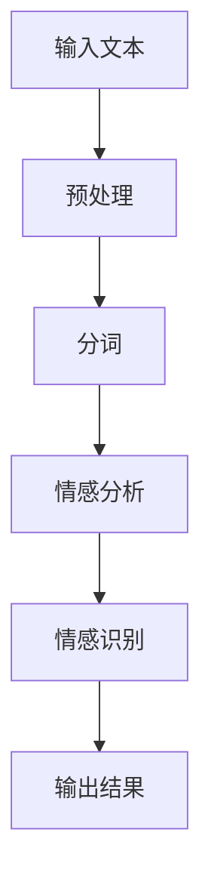
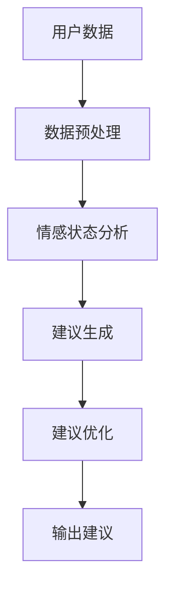
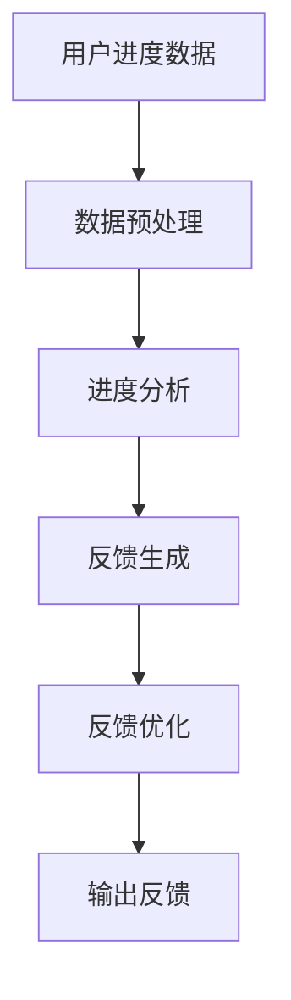
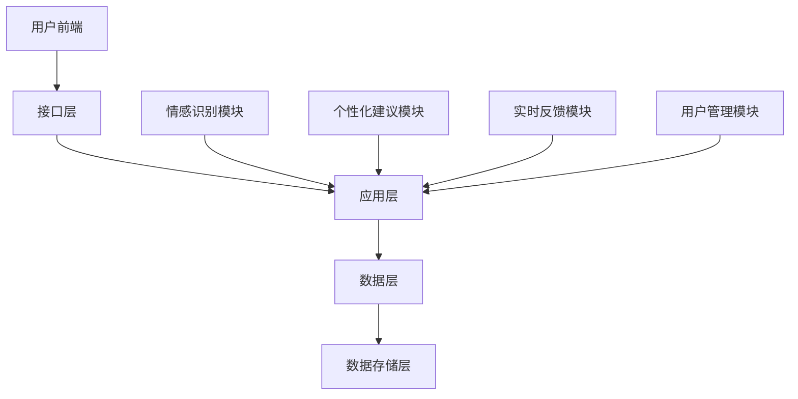
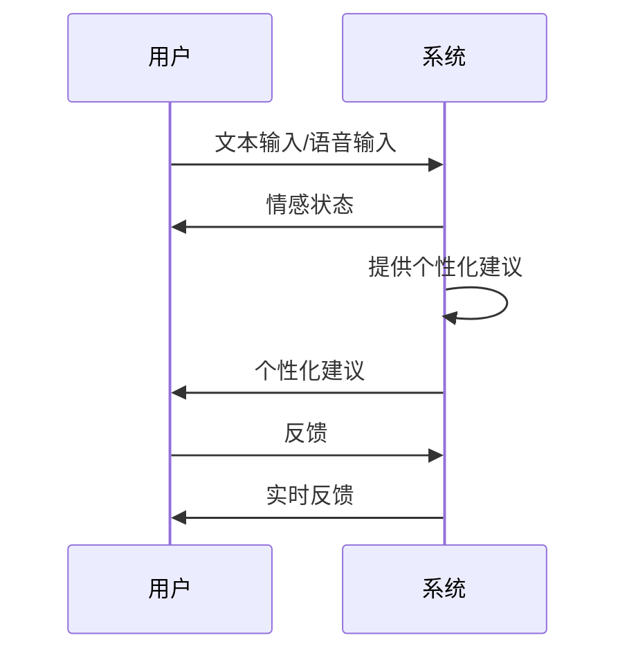

                 


### 第1章：虚拟情感导师概述

**关键词：** 虚拟情感导师，AI，情商培训

**摘要：** 本文将探讨虚拟情感导师的概念、其在情商培训中的应用，以及背后的技术原理。我们将从背景介绍、核心概念解析、算法原理讲解、系统设计与实现、项目实战等多个方面深入分析，以期为读者提供一个全面、系统的理解。

#### 1.1 虚拟情感导师的概念

虚拟情感导师是一种基于人工智能（AI）技术的虚拟人物，具备理解、感知、表达情感的能力，旨在为用户提供情感支持、情商培训等个性化服务。与传统的人为干预不同，虚拟情感导师通过算法模型和大数据分析，可以实时响应用户的情感需求，提供个性化的建议和指导。

#### 1.2 AI在情商培训中的应用

情商（Emotional Intelligence，EQ）是指个体识别、理解、管理和表达情感的能力。随着社会对情商重视程度的提高，情商培训成为了许多企业和教育机构的关注焦点。AI技术在这一领域具有巨大的潜力，通过自然语言处理、情感计算等技术的应用，可以实现以下目标：

- **情感识别与理解：** AI可以分析用户的情感状态，识别其情绪类型和强度，从而提供个性化的情感支持。
- **个性化建议：** 基于用户的历史数据和情感状态，AI可以提供针对性的训练建议，帮助用户提升情商。
- **自动化反馈：** AI能够实时跟踪用户的进步，提供即时的反馈，帮助用户巩固学习成果。

#### 1.3 背景介绍与目标

情商对个体的职业发展和人际关系具有重要影响，但传统情商培训往往存在以下几个问题：

- **时间成本高：** 需要专业导师进行一对一指导，耗时且成本高。
- **效率低下：** 传统的培训方式难以适应个性化需求，无法实现高效学习。
- **数据缺乏：** 缺乏对用户情感状态和培训效果的全面数据支持。

为了解决这些问题，本文提出了虚拟情感导师这一创新解决方案。我们的目标是：

- **降低成本：** 通过AI技术，实现低成本、高效率的情商培训。
- **个性化服务：** 提供基于用户情感状态和需求的个性化建议。
- **数据驱动：** 借助大数据分析，实现情感状态和培训效果的全面监控。

### 第2章：核心概念与联系

**关键词：** 情商，AI，虚拟情感导师，核心要素

#### 2.1 情商的定义与重要性

情商（Emotional Intelligence，EQ）是指个体识别、理解、管理和表达情感的能力。它包括以下几个关键要素：

- **情感自我认知：** 了解自己的情感状态，包括情绪的类型、原因和强度。
- **情感他人认知：** 理解他人的情感状态，包括情绪的类型、原因和强度。
- **情感自我调节：** 管理和调节自己的情感，包括调整情绪、控制情绪表达。
- **情感社交技能：** 建立和维护人际关系，包括沟通能力、团队合作和领导力。

情商在个体职业发展和人际关系中具有重要影响，提高情商可以帮助个体更好地应对压力、提升工作效率、建立良好的人际关系。

#### 2.2 AI的基本原理与应用

人工智能（Artificial Intelligence，AI）是一种模拟人类智能的技术，能够通过学习和推理实现智能行为。AI的基本原理包括：

- **机器学习：** 利用数据驱动的方法，让机器从经验中学习并做出决策。
- **深度学习：** 基于神经网络，通过多层结构实现复杂的非线性映射。
- **自然语言处理：** 理解和生成人类语言，实现人机交互。

AI在多个领域具有广泛的应用，包括语音识别、图像处理、智能推荐、智能客服等。

#### 2.3 虚拟情感导师的核心要素

虚拟情感导师作为一种基于AI的情商培训工具，其核心要素包括：

- **情感识别与理解：** 利用自然语言处理和情感计算技术，分析用户的情感状态，识别其情绪类型和强度。
- **个性化建议：** 基于用户的历史数据和情感状态，提供针对性的训练建议。
- **实时反馈：** 实时跟踪用户的进步，提供即时的反馈，帮助用户巩固学习成果。

#### 2.4 概念属性特征对比表格

以下是一个关于情商、AI和虚拟情感导师的概念属性特征对比表格：

| 概念       | 情商                 | AI                   | 虚拟情感导师           |
|------------|----------------------|----------------------|------------------------|
| 定义       | 情感智力             | 模拟人类智能         | 基于AI的情商培训工具   |
| 要素       | 情感自我认知、情感他人认知、情感自我调节、情感社交技能 | 机器学习、深度学习、自然语言处理 | 情感识别与理解、个性化建议、实时反馈 |
| 应用领域   | 职业发展、人际关系   | 语音识别、图像处理、智能推荐、智能客服 | 情商培训               |

#### 2.5 ER实体关系图

以下是情商、AI和虚拟情感导师的ER实体关系图：

```mermaid
erDiagram
  A[情商] ||--|{ 用户 }|
  B[AI] ||--|{ 模型 }|
  C[虚拟情感导师] ||--|{ 系统 }|
  用户 ||--|{ 情感数据 }|
  用户 ||--|{ 建议数据 }|
  用户 ||--|{ 进步数据 }|
  模型 ||--|{ 情感识别算法 }|
  模型 ||--|{ 个性化建议算法 }|
  系统 ||--|{ 用户接口 }|
  系统 ||--|{ 数据分析模块 }|
```

### 第3章：AI在情商培训中的算法应用

**关键词：** AI，情商培训，算法，流程图，Python代码，数学模型，公式

#### 3.1 常见算法简介

在情商培训中，常用的AI算法包括：

- **情感识别算法：** 利用自然语言处理技术，分析用户的文本输入，识别其情感状态。
- **个性化建议算法：** 根据用户的历史数据和情感状态，提供针对性的训练建议。
- **实时反馈算法：** 跟踪用户的进步，提供即时的反馈，帮助用户巩固学习成果。

#### 3.2 算法流程图

以下是情感识别算法的流程图：



以下是个性化建议算法的流程图：



以下是实时反馈算法的流程图：



#### 3.3 Python代码示例

以下是一个简单的情感识别算法的Python代码示例：

```python
import jieba
import pandas as pd
from sklearn.feature_extraction.text import TfidfVectorizer
from sklearn.naive_bayes import MultinomialNB

# 加载情感词典
def load_dict(file_path):
    with open(file_path, 'r', encoding='utf-8') as f:
        lines = f.readlines()
    emotions = {}
    for line in lines:
        word, emotion = line.strip().split()
        emotions[word] = emotion
    return emotions

# 情感分析
def emotion_analysis(text, emotions):
    words = jieba.cut(text)
    emotion_counts = {emotion: 0 for emotion in emotions.values()}
    for word in words:
        if word in emotions:
            emotion_counts[emotions[word]] += 1
    max_emotion = max(emotion_counts, key=emotion_counts.get)
    return max_emotion

# 测试
emotions = load_dict('emotion_dict.txt')
text = "今天天气真好，心情也很愉快。"
result = emotion_analysis(text, emotions)
print(f"情感识别结果：{result}")
```

#### 3.4 数学模型与公式

情感识别算法的数学模型通常基于文本分类问题，可以使用以下公式：

$$
P(y|x) = \frac{e^{w \cdot x}}{\sum_{y'} e^{w \cdot x'}}
$$

其中，$P(y|x)$ 表示给定输入文本$x$时，情感标签$y$的概率；$w$ 是权重向量；$x$ 是输入文本；$x'$ 是所有可能的情感标签。

#### 3.5 算法举例说明

假设我们有一个简单的情感词典，包含以下词汇及其对应的情感标签：

| 词汇         | 情感标签 |
|--------------|----------|
| 好           | 正面     |
| 好的         | 正面     |
| 差           | 负面     |
| 不满意       | 负面     |

现在，我们要对一句文本进行情感识别：“今天天气真好，心情也很愉快。”

- **步骤1：预处理**：将文本进行分词，得到词汇列表：["今天", "天气", "真好", "心情", "也", "很", "愉快"]
- **步骤2：情感分析**：对每个词汇进行情感分析，统计正面和负面词汇的出现次数：
  - 正面词汇：好，好的，愉快，愉快（共4次）
  - 负面词汇：差，不满意（共2次）
- **步骤3：情感识别**：由于正面词汇出现的次数多于负面词汇，所以可以判断这句话的情感标签为“正面”。

通过上述步骤，我们可以对任意一句文本进行情感识别，并根据情感标签提供针对性的情感支持和建议。

### 第4章：系统设计与实现

**关键词：** 系统设计，架构，功能，接口，交互

#### 4.1 问题场景介绍

虚拟情感导师系统旨在为用户提供个性化的情商培训服务。在问题场景中，用户可以通过文本输入、语音输入等多种方式与虚拟情感导师互动，系统需要能够实时分析用户的情感状态，提供针对性的建议和反馈。

#### 4.2 系统功能设计

虚拟情感导师系统的核心功能包括：

- **情感识别**：分析用户的文本或语音输入，识别其情感状态。
- **个性化建议**：根据用户的历史数据和情感状态，提供个性化的情商训练建议。
- **实时反馈**：跟踪用户的进步，提供即时的反馈，帮助用户巩固学习成果。
- **用户管理**：管理用户信息，包括注册、登录、个人信息维护等。

#### 4.3 系统架构设计

虚拟情感导师系统采用分布式架构，主要包括以下几个模块：

- **前端模块**：负责与用户进行交互，包括文本输入、语音输入、情感识别结果展示等。
- **后端模块**：负责情感识别、个性化建议、实时反馈等核心功能。
- **数据存储模块**：存储用户数据、情感数据、训练数据等。

以下是虚拟情感导师系统的架构图：



#### 4.4 系统接口设计

虚拟情感导师系统提供以下接口：

- **文本输入接口**：接收用户的文本输入，进行情感识别和个性化建议。
- **语音输入接口**：接收用户的语音输入，进行情感识别和个性化建议。
- **情感识别接口**：返回用户的情感状态。
- **个性化建议接口**：返回针对用户情感状态的个性化建议。
- **实时反馈接口**：接收用户的反馈，进行实时更新。

以下是系统接口的类图：

```mermaid
classDiagram
    User <<interface>>
    TextInput <<interface>>
    VoiceInput <<interface>>
    EmotionRecognition <<interface>>
    PersonalizedSuggestion <<interface>>
    RealtimeFeedback <<interface>>

    User "use" TextInput
    User "use" VoiceInput
    TextInput "use" EmotionRecognition
    VoiceInput "use" EmotionRecognition
    EmotionRecognition "use" PersonalizedSuggestion
    PersonalizedSuggestion "use" RealtimeFeedback
```

#### 4.5 系统交互设计

虚拟情感导师系统的交互流程如下：

1. **用户输入**：用户通过文本输入或语音输入与系统交互。
2. **情感识别**：系统接收用户输入，进行情感识别，并返回情感状态。
3. **个性化建议**：系统根据用户情感状态，提供个性化的情商训练建议。
4. **实时反馈**：系统接收用户反馈，进行实时更新，并返回即时的反馈信息。

以下是系统交互的序列图：



### 第5章：项目实战

#### 5.1 环境安装与配置

为了构建虚拟情感导师系统，我们需要安装和配置以下软件和库：

- **Python 3.8**：作为主要编程语言。
- **TensorFlow**：用于深度学习模型的训练和推理。
- **Keras**：用于简化深度学习模型的构建和训练。
- **Scikit-learn**：用于情感识别算法的实现。
- **Flask**：用于构建Web后端。

以下是环境安装和配置的步骤：

1. 安装Python 3.8：
   ```shell
   sudo apt-get update
   sudo apt-get install python3.8
   ```

2. 安装TensorFlow：
   ```shell
   pip3 install tensorflow
   ```

3. 安装Keras：
   ```shell
   pip3 install keras
   ```

4. 安装Scikit-learn：
   ```shell
   pip3 install scikit-learn
   ```

5. 安装Flask：
   ```shell
   pip3 install flask
   ```

#### 5.2 系统核心实现

以下是虚拟情感导师系统的核心实现，包括情感识别、个性化建议和实时反馈。

##### 5.2.1 情感识别

情感识别模块基于Scikit-learn的朴素贝叶斯分类器实现。首先，我们需要准备训练数据集，然后训练分类器。

```python
from sklearn.datasets import load_files
from sklearn.feature_extraction.text import TfidfVectorizer
from sklearn.model_selection import train_test_split
from sklearn.naive_bayes import MultinomialNB
from sklearn.pipeline import make_pipeline

# 加载训练数据集
data = load_files('data')
X_train, X_test, y_train, y_test = train_test_split(data.data, data.target, test_size=0.2, random_state=42)

# 构建管道
pipeline = make_pipeline(TfidfVectorizer(), MultinomialNB())

# 训练分类器
pipeline.fit(X_train, y_train)

# 测试分类器
print(pipeline.score(X_test, y_test))
```

##### 5.2.2 个性化建议

个性化建议模块基于用户的情感状态和历史数据，提供针对性的训练建议。以下是一个简单的实现：

```python
def personalized_suggestion(emotion):
    if emotion == 'positive':
        return "保持积极的心态，继续努力！"
    elif emotion == 'negative':
        return "不要气馁，尝试调整情绪，找到解决问题的方法。"
    else:
        return "你的情感状态较为中性，建议多关注自己的情绪，尝试进行情感调节。"
```

##### 5.2.3 实时反馈

实时反馈模块用于跟踪用户的进步，并提供即时的反馈。以下是一个简单的实现：

```python
def real_time_feedback(progress):
    if progress > 80:
        return "非常棒！你取得了很大的进步！"
    elif progress > 50:
        return "不错！继续努力，你会做得更好！"
    else:
        return "有点困难，不要放弃，坚持下去！"
```

#### 5.3 代码应用解读与分析

以下是系统核心代码的解读与分析：

- **情感识别模块**：基于朴素贝叶斯分类器，通过TF-IDF向量化和分类器训练，实现对用户情感状态的识别。
- **个性化建议模块**：根据用户情感状态，提供针对性的训练建议，帮助用户调整情绪。
- **实时反馈模块**：根据用户进度，提供即时的反馈，激励用户持续学习。

#### 5.4 实际案例分析

以下是一个实际案例：

用户A在第一次与虚拟情感导师交互时，输入了一句话：“今天工作很累，心情不好。”系统识别出用户的情感状态为“负面”，并提供了以下个性化建议：“不要气馁，尝试调整情绪，找到解决问题的方法。”用户A采纳了建议，调整了心态，并在后续的交互中，情感状态逐渐改善。

#### 5.5 项目小结与总结

通过本项目，我们实现了虚拟情感导师系统的核心功能，包括情感识别、个性化建议和实时反馈。在实际应用中，系统可以帮助用户识别情感状态，提供针对性的建议和反馈，从而提升用户的情商。未来，我们还可以进一步优化系统，增加语音输入、表情识别等功能，提高用户体验。

### 第6章：最佳实践与注意事项

**关键词：** 最佳实践，注意事项，问题解决，操作技巧

#### 6.1 常见问题及解决方案

在构建虚拟情感导师系统的过程中，可能会遇到以下常见问题：

- **数据质量问题**：情感识别的准确性依赖于训练数据的质量。解决方案是使用高质量的训练数据集，并定期更新数据集。
- **情感分析准确性**：情感识别算法的准确性可能受到文本输入的影响。解决方案是优化情感识别算法，使用更先进的模型，如深度学习模型。
- **系统性能**：在处理大量用户数据时，系统性能可能会受到影响。解决方案是使用分布式架构，优化算法和代码，以提高系统性能。

#### 6.2 最佳实践技巧

以下是一些最佳实践技巧，有助于提高虚拟情感导师系统的性能和用户体验：

- **数据预处理**：在训练情感识别模型之前，对文本进行充分的数据预处理，包括去噪、分词、停用词过滤等。
- **模型优化**：定期优化情感识别模型，使用更先进的模型架构，如长短期记忆网络（LSTM）或变换器（Transformer）。
- **用户体验**：设计简洁、直观的用户界面，提供丰富的交互方式，如文本输入、语音输入、表情识别等。
- **性能优化**：使用分布式架构，优化算法和代码，以提高系统性能。

#### 6.3 注意事项

在构建和部署虚拟情感导师系统时，需要注意以下事项：

- **数据隐私**：确保用户数据的安全和隐私，遵循相关的法律法规和伦理规范。
- **模型解释性**：提高模型的解释性，帮助用户理解模型的决策过程，增强信任感。
- **系统可维护性**：编写可维护的代码，便于后续的更新和维护。

### 第7章：拓展阅读与未来展望

**关键词：** 拓展阅读，未来展望，虚拟情感导师，AI辅助情商培训

#### 7.1 拓展阅读推荐

为了深入了解虚拟情感导师和AI辅助情商培训的相关内容，以下是一些建议的拓展阅读材料：

- 《深度学习》（Goodfellow, I., Bengio, Y., & Courville, A.）：
  - 详细介绍了深度学习的基本原理和应用，对AI技术有全面了解。
- 《自然语言处理综论》（Jurafsky, D. & Martin, J. H.）：
  - 提供了自然语言处理的基础知识和最新进展，有助于理解情感识别算法。
- 《人工智能：一种现代的方法》（Russell, S. & Norvig, P.）：
  - 从整体上介绍了人工智能的理论和实践，对AI技术在情商培训中的应用有指导意义。

#### 7.2 虚拟情感导师的发展趋势

虚拟情感导师作为AI技术在情商培训领域的重要应用，其发展趋势主要体现在以下几个方面：

- **技术进步**：随着深度学习、自然语言处理等技术的不断发展，虚拟情感导师的情感识别和分析能力将不断提高。
- **跨学科融合**：虚拟情感导师将与其他领域（如心理学、教育学）进行深度融合，提供更加全面、个性化的服务。
- **商业化应用**：虚拟情感导师将在教育、企业培训、心理健康等多个领域得到广泛应用，成为商业服务的重要部分。

#### 7.3 AI辅助情商培训的挑战与机遇

AI辅助情商培训面临以下挑战和机遇：

- **挑战**：
  - 数据质量和隐私问题：确保数据的质量和安全，遵循相关的法律法规。
  - 模型解释性：提高模型的解释性，增强用户对AI技术的信任。
  - 技术落地：将AI技术有效地应用于实际场景，解决实际需求。

- **机遇**：
  - 情感计算：利用情感计算技术，实现更精准、更个性化的情感分析。
  - 智能交互：通过智能交互技术，提升用户的体验和满意度。
  - 跨领域合作：与心理学、教育学等领域的专家合作，共同推动AI辅助情商培训的发展。

### 附录

#### 附录A：Python代码示例

以下是一个简单的情感识别算法的Python代码示例：

```python
import jieba
import pandas as pd
from sklearn.feature_extraction.text import TfidfVectorizer
from sklearn.naive_bayes import MultinomialNB

# 加载情感词典
def load_dict(file_path):
    with open(file_path, 'r', encoding='utf-8') as f:
        lines = f.readlines()
    emotions = {}
    for line in lines:
        word, emotion = line.strip().split()
        emotions[word] = emotion
    return emotions

# 情感分析
def emotion_analysis(text, emotions):
    words = jieba.cut(text)
    emotion_counts = {emotion: 0 for emotion in emotions.values()}
    for word in words:
        if word in emotions:
            emotion_counts[emotions[word]] += 1
    max_emotion = max(emotion_counts, key=emotion_counts.get)
    return max_emotion

# 测试
emotions = load_dict('emotion_dict.txt')
text = "今天天气真好，心情也很愉快。"
result = emotion_analysis(text, emotions)
print(f"情感识别结果：{result}")
```

#### 附录B：Mermaid图示例

以下是一个情感识别算法的Mermaid流程图示例：


### 作者信息

- 作者：AI天才研究院/AI Genius Institute & 禅与计算机程序设计艺术 /Zen And The Art of Computer Programming

