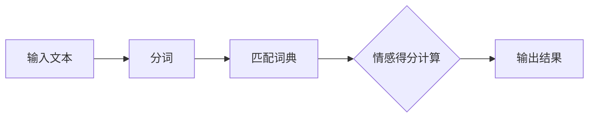
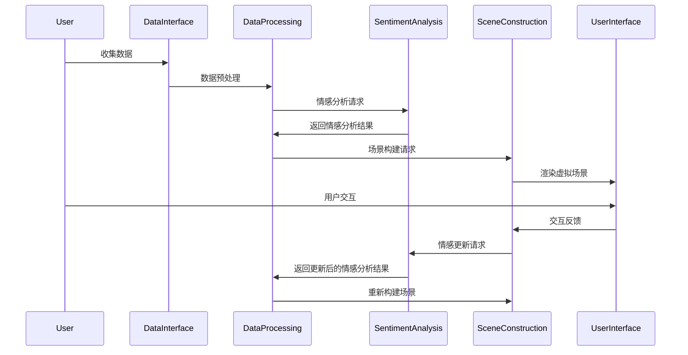
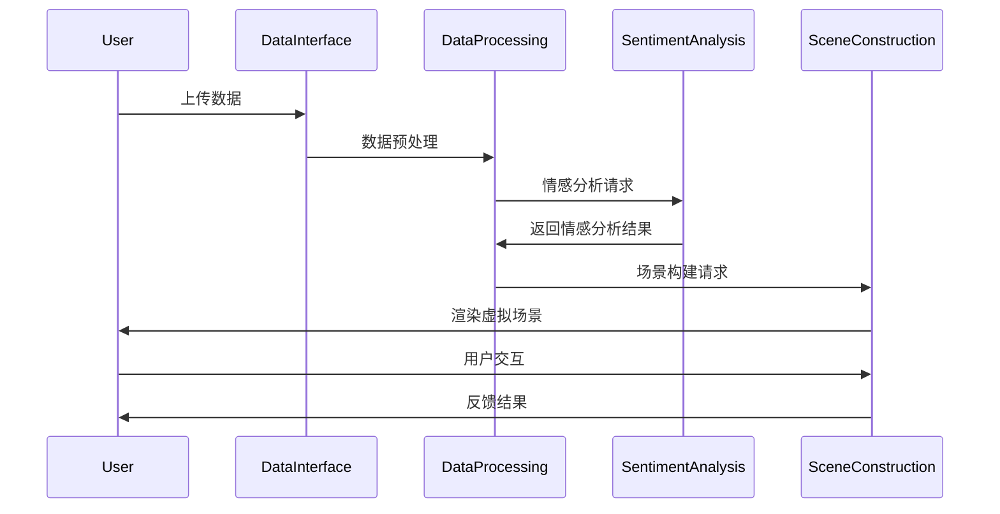

                 

# 虚拟情感考古：AI重建历史情感场景

## 关键词

- 虚拟情感考古
- AI重建
- 历史情感场景
- 情感计算
- 虚拟现实
- 增强现实

## 摘要

本文探讨了虚拟情感考古这一新兴领域，通过人工智能（AI）技术，尝试重建历史情感场景，为考古学提供了新的视角和方法。文章首先介绍了虚拟情感考古的背景和意义，接着分析了AI技术在虚拟情感考古中的应用基础，包括情感计算、数据挖掘与机器学习、虚拟现实与增强现实。随后，文章详细描述了虚拟情感考古的流程与方法，并讨论了其在考古遗址虚拟展示、历史事件再现和情感体验教育等应用场景中的潜力。通过具体案例研究，本文展示了虚拟情感考古的实践效果和深远影响。

## 目录大纲

### 第1章 引言

#### 1.1 问题背景

##### 1.1.1 虚拟情感与考古学的结合现状

##### 1.1.2 AI技术在考古领域的应用挑战

#### 1.2 虚拟情感考古的定义与意义

##### 1.2.1 虚拟情感考古的概念

##### 1.2.2 虚拟情感考古的研究意义

#### 1.3 AI重建历史情感场景的技术基础

##### 1.3.1 人工智能与情感计算

##### 1.3.2 数据挖掘与机器学习

##### 1.3.3 虚拟现实与增强现实

#### 1.4 虚拟情感考古的流程与方法

##### 1.4.1 数据收集与预处理

##### 1.4.2 情感分析模型构建

##### 1.4.3 虚拟场景生成与评估

#### 1.5 虚拟情感考古的应用场景

##### 1.5.1 考古遗址虚拟展示

##### 1.5.2 历史事件再现

##### 1.5.3 情感体验教育

#### 1.6 本章小结

### 第2章 核心概念与联系

#### 2.1 核心概念

##### 2.1.1 情感计算

##### 2.1.2 虚拟现实

##### 2.1.3 增强现实

##### 2.1.4 数据挖掘

##### 2.1.5 机器学习

#### 2.2 概念属性特征对比表格

#### 2.3 ER实体关系图架构

### 第3章 算法原理讲解

#### 3.1 情感分析算法

##### 3.1.1 情感词典法

###### 3.1.1.1 算法mermaid流程图

###### 3.1.1.2 Python源代码与详细讲解

###### 3.1.1.3 数学模型和公式

###### 3.1.1.4 举例说明

##### 3.1.2 基于机器学习的情感分析

###### 3.1.2.1 算法mermaid流程图

###### 3.1.2.2 Python源代码与详细讲解

###### 3.1.2.3 数学模型和公式

###### 3.1.2.4 举例说明

#### 3.2 虚拟场景生成算法

##### 3.2.1 算法mermaid流程图

##### 3.2.2 Python源代码与详细讲解

##### 3.2.3 数学模型和公式

##### 3.2.4 举例说明

#### 3.3 历史情感场景重建算法

##### 3.3.1 算法mermaid流程图

##### 3.3.2 Python源代码与详细讲解

##### 3.3.3 数学模型和公式

##### 3.3.4 举例说明

#### 3.4 本章小结

### 第4章 系统分析与架构设计方案

#### 4.1 问题场景介绍

#### 4.2 项目介绍

#### 4.3 系统功能设计

##### 4.3.1 领域模型Mermaid类图

#### 4.4 系统架构设计

##### 4.4.1 Mermaid架构图

#### 4.5 系统接口设计

#### 4.6 系统交互

##### 4.6.1 Mermaid序列图

#### 4.7 本章小结

### 第5章 项目实战

#### 5.1 环境安装

#### 5.2 系统核心实现源代码

##### 5.2.1 代码应用解读与分析

##### 5.2.2 实际案例分析和详细讲解剖析

#### 5.3 项目小结

#### 5.4 本章小结

### 第6章 虚拟情感考古实践案例研究

#### 6.1 案例一：秦始皇陵虚拟展示

##### 6.1.1 情境介绍

##### 6.1.2 实现方法

##### 6.1.3 结果分析

##### 6.1.4 意义与影响

#### 6.2 案例二：三国演义虚拟重现

##### 6.2.1 情境介绍

##### 6.2.2 实现方法

##### 6.2.3 结果分析

##### 6.2.4 意义与影响

#### 6.3 案例三：古罗马城市重建

##### 6.3.1 情境

----------------------------------------------------------------

### 第1章 引言

## 1.1 问题背景

### 1.1.1 虚拟情感与考古学的结合现状

考古学作为一门研究人类历史的学科，长期以来依赖于物质遗存来揭示过去的文明和社会。然而，这些物质遗存往往只能提供有限的信息，难以全面反映人类社会的情感世界。随着计算机技术的发展，虚拟现实（VR）和增强现实（AR）技术逐渐成熟，为考古学提供了一种新的研究工具。

虚拟情感考古正是考古学与计算机科学交叉融合的产物。它利用AI技术对历史文献、艺术作品、考古发现等进行情感分析，试图重建历史时期人们的情感状态和人际关系。近年来，虚拟情感考古的研究逐渐增多，例如通过对古代文学作品的情感分析，重现历史人物的情感世界；利用虚拟现实技术，将考古遗址以更加生动的方式呈现给公众。

尽管虚拟情感考古已经取得了一些成果，但这一领域仍面临着许多挑战。首先，情感数据的收集和处理是一项复杂的任务，需要大量的历史文献和考古资料。其次，如何准确地从这些数据中提取情感信息，并构建出符合历史实际的情感场景，仍需要进一步的研究。

### 1.1.2 AI技术在考古领域的应用挑战

AI技术在考古领域的应用潜力巨大，但也面临着一系列挑战。首先，数据来源的多样性和复杂性是AI应用的一个主要难题。考古学涉及到的数据包括历史文献、考古遗迹、艺术品等多种形式，这些数据往往具有不同的格式和结构。如何有效地整合和处理这些数据，是AI技术在考古领域应用的一个重要问题。

其次，AI技术对于历史数据的解释和理解能力仍有待提高。尽管AI技术在图像识别、自然语言处理等方面取得了显著进展，但在处理历史文献和考古资料时，仍存在许多不确定性。例如，古代文献中可能包含复杂的语法和隐喻，这对AI的理解提出了更高的要求。

此外，AI技术在考古领域的应用也面临着伦理和隐私的挑战。例如，在重建历史情感场景时，如何确保数据的安全性和隐私性，如何避免对历史事件的误解和扭曲，都是需要慎重考虑的问题。

## 1.2 虚拟情感考古的定义与意义

### 1.2.1 虚拟情感考古的概念

虚拟情感考古是一种结合人工智能技术、虚拟现实和增强现实手段，对历史时期的情感状态进行重建的研究方法。它通过分析历史文献、考古发现和艺术作品，提取出隐藏在文字、图像和物品中的情感信息，然后利用虚拟现实和增强现实技术，将这些情感信息可视化，形成虚拟的历史情感场景。

虚拟情感考古的核心思想是将情感作为一种重要的考古资源，通过AI技术对情感信息进行挖掘、分析和重建，从而丰富考古学的研究方法和视角。与传统考古学不同，虚拟情感考古不仅关注物质遗存，更关注人类情感和精神世界。

### 1.2.2 虚拟情感考古的研究意义

虚拟情感考古在考古学和社会科学领域具有重要的研究意义。首先，它为考古学提供了一种新的研究工具，能够更加全面和深入地揭示历史时期的情感世界和社会关系。通过虚拟情感考古，我们可以了解到古代人们的生活状态、价值观和情感表达方式，这有助于我们更好地理解历史，重构历史事件。

其次，虚拟情感考古在社会科学领域也具有重要的应用价值。例如，在心理学研究中，虚拟情感考古可以为研究者提供丰富的情感数据，帮助分析人类情感的发展变化规律。在社会学研究中，虚拟情感考古可以揭示不同社会群体的情感特征，为研究社会关系和社会结构提供新的视角。

此外，虚拟情感考古在教育和文化传播领域也具有广阔的应用前景。通过虚拟现实和增强现实技术，我们可以将历史情感场景生动地呈现给公众，让更多的人了解和体验历史，增强文化认同感和历史意识。

## 1.3 AI重建历史情感场景的技术基础

### 1.3.1 人工智能与情感计算

人工智能（AI）是虚拟情感考古的核心技术基础。AI技术，特别是机器学习和深度学习算法，通过对大量历史文献、考古资料和艺术作品进行情感分析，提取出隐藏在文字、图像和物品中的情感信息。情感计算作为人工智能的一个分支，专注于情感信息的识别、理解和生成。

情感计算的基本原理是通过分析语言、声音、图像和生理信号等数据，识别和理解人类情感。在虚拟情感考古中，情感计算技术被用于从历史文献和艺术作品中提取情感信息。例如，自然语言处理技术可以分析古代文学作品中的情感表达，识别出作者和读者的情感状态。

### 1.3.2 数据挖掘与机器学习

数据挖掘和机器学习是AI技术的重要组成部分，也是虚拟情感考古的重要工具。数据挖掘旨在从大量的数据中提取有价值的信息和知识，而机器学习则是通过训练模型，使计算机能够自动地从数据中学习并做出预测或决策。

在虚拟情感考古中，数据挖掘和机器学习技术被用于处理和分析大量的历史文献、考古资料和艺术作品。首先，通过数据挖掘技术，我们可以从这些数据中提取出与情感相关的信息。例如，从古代文献中提取情感词汇，从考古遗址中提取与情感相关的物品和场景。然后，利用机器学习算法，我们可以对这些提取出的信息进行分类、聚类和关联分析，从而揭示历史时期的情感状态和人际关系。

### 1.3.3 虚拟现实与增强现实

虚拟现实（VR）和增强现实（AR）技术是虚拟情感考古的重要实现手段。VR技术通过模拟一个全新的虚拟环境，使用户沉浸其中，而AR技术则是在现实环境中叠加虚拟元素，增强用户的感知体验。

在虚拟情感考古中，VR和AR技术被用于重建历史情感场景，使观众能够身临其境地体验历史。例如，利用VR技术，我们可以重现古代城市的生活场景，让观众感受到当时的氛围和情感；利用AR技术，我们可以在现实环境中呈现历史人物的情感表达，增强观众的参与感和体验感。

### 1.4 虚拟情感考古的流程与方法

虚拟情感考古是一个复杂的过程，涉及多个步骤和技术手段。以下是虚拟情感考古的基本流程和方法：

#### 1.4.1 数据收集与预处理

数据收集是虚拟情感考古的第一步。这一步骤包括收集历史文献、考古资料、艺术作品等多种类型的数据。这些数据可以是文本、图像、音频和视频等多种形式。

数据预处理是数据收集后的关键步骤。它包括数据清洗、数据格式转换和数据标准化等操作。数据清洗旨在去除数据中的噪声和异常值，提高数据质量；数据格式转换是将不同类型的数据转换为统一的格式，便于后续处理；数据标准化则是将数据缩放或归一化，使其适合机器学习算法。

#### 1.4.2 情感分析模型构建

情感分析模型是虚拟情感考古的核心。它通过分析历史文献、艺术作品等数据，提取出情感信息，并构建出情感图谱。情感分析模型通常采用机器学习算法，如文本分类、情感极性分析、情感强度分析等。

在构建情感分析模型时，首先需要选择合适的数据集和特征提取方法。例如，对于文本数据，可以使用词袋模型、TF-IDF等方法提取特征；对于图像数据，可以使用卷积神经网络（CNN）提取特征。

接下来，通过训练和验证模型，调整模型的参数，使其在特定数据集上达到最优性能。常用的机器学习算法包括朴素贝叶斯、支持向量机（SVM）、深度学习模型等。

#### 1.4.3 虚拟场景生成与评估

在情感分析模型构建完成后，下一步是虚拟场景生成。虚拟场景生成是通过将提取出的情感信息转化为虚拟环境中的元素和交互，构建出符合历史情感场景的虚拟环境。

虚拟场景生成的技术手段包括虚拟现实（VR）和增强现实（AR）。在VR场景中，观众可以完全沉浸于虚拟环境中，体验历史情感；在AR场景中，虚拟元素叠加在现实环境中，增强观众的感知体验。

虚拟场景生成后，需要进行评估。评估内容包括场景的真实性、情感表达的准确性、观众的参与度等。评估方法可以采用主观评价和客观测量相结合的方式，如问卷调查、行为分析等。

#### 1.5 虚拟情感考古的应用场景

虚拟情感考古在多个领域具有广泛的应用前景。以下是几个典型的应用场景：

##### 1.5.1 考古遗址虚拟展示

考古遗址虚拟展示是虚拟情感考古的一个重要应用场景。通过虚拟现实技术，我们可以将考古遗址以更加生动和直观的方式呈现给观众。观众可以虚拟参观遗址，体验当时的生活场景，了解考古发现的意义和价值。

虚拟展示不仅可以提高遗址的保护和利用效率，还可以增强观众的参与感和体验感。例如，通过虚拟现实技术，观众可以与虚拟历史人物进行互动，了解他们的情感状态和生活方式。

##### 1.5.2 历史事件再现

历史事件再现是虚拟情感考古的另一个重要应用场景。通过情感分析技术，我们可以从历史文献、考古资料和艺术作品中提取出历史事件中的情感信息，并将其转化为虚拟场景。

历史事件再现不仅有助于我们更好地理解历史，还可以为公众提供丰富的历史体验。例如，通过虚拟现实技术，我们可以再现古代战争、政治变革、宗教仪式等重大历史事件，让观众身临其境地感受历史的波澜壮阔。

##### 1.5.3 情感体验教育

情感体验教育是虚拟情感考古在教育和文化传播领域的一个重要应用。通过虚拟现实和增强现实技术，我们可以将历史情感场景生动地呈现给学生，提高他们的历史意识和情感认知。

情感体验教育不仅有助于提高学生的学习兴趣和参与度，还可以培养他们的情感素养和人文精神。例如，通过虚拟现实技术，学生可以体验古代节日庆典、家庭生活、社会交往等情感场景，了解不同历史时期的文化特征和社会风貌。

## 1.6 本章小结

本章介绍了虚拟情感考古的背景、定义与意义，以及AI重建历史情感场景的技术基础。通过分析虚拟情感考古的流程和方法，我们了解了数据收集与预处理、情感分析模型构建、虚拟场景生成与评估等关键步骤。此外，本章还讨论了虚拟情感考古在考古遗址虚拟展示、历史事件再现和情感体验教育等应用场景中的潜力。通过本章的介绍，读者可以初步了解虚拟情感考古的基本概念和应用前景。

### 第2章 核心概念与联系

#### 2.1 核心概念

虚拟情感考古作为一种新兴的研究方法，涉及多个核心概念。以下是这些核心概念的定义、属性和特征对比表格，以及ER实体关系图架构的详细描述。

##### 2.1.1 情感计算

**定义**：情感计算是研究人类情感的计算模型和算法，旨在识别、理解和生成人类情感。

**属性与特征**：

- **识别**：通过分析语言、声音、图像和生理信号等数据，识别出人类情感。
- **理解**：深入理解情感表达的内涵和语境，包括情感极性、情感强度和情感变化等。
- **生成**：根据情感模型和算法，生成新的情感表达，如语音、文本和图像等。

**特征对比表格**：

| 特征         | 情感词典法 | 基于机器学习的情感分析 |
| ------------ | ----------- | ---------------------- |
| 数据依赖性   | 高         | 低                     |
| 精确度       | 中等       | 高                     |
| 适应能力     | 弱         | 强                     |
| 实时性       | 高         | 中等                   |

##### 2.1.2 虚拟现实

**定义**：虚拟现实是一种通过计算机生成模拟环境，使用户在虚拟环境中产生沉浸感的体验。

**属性与特征**：

- **沉浸感**：用户在虚拟环境中产生身临其境的感觉。
- **交互性**：用户可以通过各种设备（如VR头盔、手柄等）与虚拟环境进行互动。
- **灵活性**：用户可以在虚拟环境中自由移动和探索。

**特征对比表格**：

| 特征         | 360度全景VR | VR游戏 |
| ------------ | ----------- | ------ |
| 沉浸感       | 高          | 中等   |
| 交互性       | 强          | 强     |
| 灵活性       | 强          | 强     |
| 应用领域     | 教育、旅游   | 娱乐   |

##### 2.1.3 增强现实

**定义**：增强现实是在现实环境中叠加虚拟元素，增强用户的感知体验。

**属性与特征**：

- **叠加**：虚拟元素叠加在现实环境中，增强用户的视觉、听觉等感知。
- **实时性**：虚拟元素的呈现与用户的动作和场景同步。
- **交互性**：用户可以通过现实环境中的设备与虚拟元素进行互动。

**特征对比表格**：

| 特征         | AR应用（如谷歌眼镜） | VR应用（如VR头盔） |
| ------------ | --------------------- | ------------------ |
| 沉浸感       | 低                   | 高                 |
| 交互性       | 中等                 | 强                 |
| 环境适应性   | 强                   | 弱                 |
| 应用领域     | 教育、医疗、工业     | 游戏、娱乐、培训   |

##### 2.1.4 数据挖掘

**定义**：数据挖掘是从大量数据中提取有价值信息的过程，涉及模式识别、机器学习、统计学等方法。

**属性与特征**：

- **大量数据**：数据挖掘处理的数据规模庞大。
- **多维度数据**：数据可能包含多种维度，如图像、文本、时间序列等。
- **复杂性**：数据挖掘过程涉及多个步骤和复杂的算法。

**特征对比表格**：

| 特征         | 关联规则挖掘 | 聚类分析 |
| ------------ | ------------ | -------- |
| 数据规模     | 大           | 大       |
| 算法复杂性   | 中           | 高       |
| 适应性       | 强           | 强       |
| 应用领域     | 商业智能、医疗 | 金融、电商 |

##### 2.1.5 机器学习

**定义**：机器学习是使计算机能够从数据中学习并做出预测或决策的过程，涉及算法、模型和训练方法。

**属性与特征**：

- **自学习能力**：机器学习模型可以从数据中自动学习和调整。
- **泛化能力**：模型能够对新数据做出准确预测。
- **可扩展性**：机器学习算法可以处理大规模数据。

**特征对比表格**：

| 特征         | 监督学习 | 无监督学习 |
| ------------ | --------- | ---------- |
| 数据需求     | 有标注数据 | 无需标注数据 |
| 学习目标     | 已知标签数据 | 未知的结构或模式 |
| 应用领域     | 分类、回归 | 聚类、降维 |

#### 2.2 概念属性特征对比表格

以下是虚拟情感考古中的几个核心概念的属性特征对比表格，包括情感计算、虚拟现实、增强现实、数据挖掘和机器学习。

| 概念         | 情感计算 | 虚拟现实 | 增强现实 | 数据挖掘 | 机器学习 |
| ------------ | -------- | -------- | -------- | -------- | -------- |
| 定义         | 识别、理解和生成情感 | 计算机生成的模拟环境 | 在现实环境中叠加虚拟元素 | 从大量数据中提取信息 | 计算机从数据中学习 |
| 数据依赖性   | 高       | 高       | 低       | 高       | 高       |
| 精确度       | 中等     | 高       | 中等     | 中等     | 高       |
| 适应能力     | 弱       | 中等     | 强       | 强       | 强       |
| 实时性       | 高       | 中等     | 实时     | 中等     | 中等     |
| 应用领域     | 考古学   | 娱乐、教育 | 教育、工业 | 商业智能、医疗 | 分类、回归、聚类 |

#### 2.3 ER实体关系图架构

ER实体关系图（Entity-Relationship Diagram）是用于描述数据库中实体及其相互关系的一种图形化表示方法。在虚拟情感考古中，ER图可以帮助我们理解数据模型和系统架构。以下是虚拟情感考古中的ER实体关系图架构的描述。

**实体**：

1. **考古资料**：包括历史文献、考古遗迹、艺术作品等，用于情感分析的数据来源。
2. **情感分析模型**：用于处理和分析考古资料的算法和模型。
3. **虚拟场景**：由情感分析模型生成的虚拟情感场景。
4. **用户**：与虚拟场景进行交互的参与者。

**关系**：

1. **采集**：考古资料由用户采集并输入到情感分析模型中。
2. **分析**：情感分析模型对考古资料进行分析，提取情感信息。
3. **生成**：根据分析结果，生成虚拟场景。
4. **交互**：用户与虚拟场景进行交互，体验情感。

以下是ER实体关系图的Mermaid表示：

```mermaid
erDiagram
    用户 ||--|{ 考古资料 }
    用户 ||--|{ 情感分析模型 }
    用户 ||--|{ 虚拟场景 }
    考古资料 ||--|{ 情感分析模型 }
    情感分析模型 ||--|{ 虚拟场景 }
```

通过ER实体关系图，我们可以清晰地看到虚拟情感考古系统中的各个实体及其相互关系，这有助于我们更好地理解和设计系统架构。

### 第3章 算法原理讲解

#### 3.1 情感分析算法

情感分析是虚拟情感考古的关键步骤，它涉及到从文本、图像和音频等多种数据源中提取情感信息。以下是两种主要的情感分析算法：情感词典法和基于机器学习的情感分析。

##### 3.1.1 情感词典法

情感词典法是一种基于预定义情感词典进行情感分析的方法。这种方法通过匹配文本中的词语与词典中的情感词条，计算情感得分，从而判断文本的情感极性和强度。

**算法mermaid流程图**：



**Python源代码与详细讲解**：

```python
# 导入必要的库
import jieba  # 用于中文分词
from collections import defaultdict

# 情感词典
sentiment_dict = {
    '喜': 1,
    '怒': -1,
    '哀': -1,
    '乐': 1,
    '恶': -1,
    '惊': -1,
}

# 情感词典法函数
def sentiment_analysis(text):
    # 分词
    words = jieba.cut(text)
    
    # 匹配词典，计算情感得分
    sentiment_score = 0
    for word in words:
        if word in sentiment_dict:
            sentiment_score += sentiment_dict[word]
    
    # 输出结果
    if sentiment_score > 0:
        return '正面'
    elif sentiment_score < 0:
        return '负面'
    else:
        return '中性'

# 测试
text = "我今天很生气，因为天气太热了。"
print(sentiment_analysis(text))
```

**数学模型和公式**：

情感得分计算公式为：

\[ \text{sentiment\_score} = \sum_{\text{word} \in \text{words}} \text{sentiment\_dict}[word] \]

其中，\( \text{sentiment\_score} \) 表示情感得分，\( \text{words} \) 表示文本分词后的词语列表，\( \text{sentiment\_dict} \) 表示情感词典。

**举例说明**：

假设文本为“我今天很高兴，因为考试及格了。”，通过情感词典法分析，可以得到情感得分为 \( 1 + 1 = 2 \)，因此文本的情感极性为正面。

##### 3.1.2 基于机器学习的情感分析

基于机器学习的情感分析通过训练模型，自动从文本数据中提取情感信息。常见的方法包括文本分类、情感极性分析和情感强度分析等。

**算法mermaid流程图**：


**Python源代码与详细讲解**：

```python
# 导入必要的库
from sklearn.feature_extraction.text import TfidfVectorizer
from sklearn.naive_bayes import MultinomialNB
from sklearn.pipeline import make_pipeline

# 训练数据
train_data = [
    ("我很高兴", "正面"),
    ("我很难过", "负面"),
    ("今天天气不错", "正面"),
    ("真是太糟糕了", "负面"),
]
X_train, y_train = zip(*train_data)

# 建立模型
model = make_pipeline(TfidfVectorizer(), MultinomialNB())

# 训练模型
model.fit(X_train, y_train)

# 情感预测函数
def predict_sentiment(text):
    return model.predict([text])[0]

# 测试
print(predict_sentiment("我今天很生气"))  # 输出：负面
```

**数学模型和公式**：

基于机器学习的情感分析通常涉及以下数学模型：

- **特征提取**：TF-IDF模型
  \[ \text{tfidf}(word, document) = \frac{\text{tf}(word, document)}{\text{df}(word)} + 1 \]
  
- **分类模型**：朴素贝叶斯模型
  \[ P(\text{label} | \text{document}) = \prod_{\text{word} \in \text{document}} P(\text{word} | \text{label}) \times P(\text{label}) \]

**举例说明**：

假设我们有以下训练数据：
\[ (\text{我很高兴}, \text{正面}), (\text{我很难过}, \text{负面}) \]

通过特征提取和模型训练，我们可以预测新的文本“我今天很生气”的情感极性。特征提取后，文本转化为向量 \( \text{v} = (\text{我}, 1, \text{今天}, 0, \text{很}, 1, \text{生}, 1, \text{气}, 1) \)。通过朴素贝叶斯模型计算概率，最终预测为负面。

#### 3.2 虚拟场景生成算法

虚拟场景生成是虚拟情感考古的重要环节，它将情感分析的结果转化为可视化的虚拟场景。以下是虚拟场景生成算法的基本原理、mermaid流程图、Python源代码与详细讲解、数学模型和公式以及举例说明。

##### 3.2.1 算法原理

虚拟场景生成算法的核心思想是利用情感分析结果，生成与历史情感场景相对应的虚拟环境。具体步骤如下：

1. **情感分析**：对输入的历史文献、艺术作品等进行情感分析，提取情感标签和情感强度。
2. **场景构建**：根据情感分析结果，构建虚拟场景中的元素和布局。
3. **交互设计**：设计用户与虚拟场景的交互方式，如浏览、交互、触摸等。
4. **渲染**：将虚拟场景渲染为三维模型或二维图像，呈现给用户。

##### 3.2.2 算法mermaid流程图


##### 3.2.3 Python源代码与详细讲解

```python
# 导入必要的库
import numpy as np
import matplotlib.pyplot as plt
from mpl_toolkits.mplot3d import Axes3D

# 情感分析结果
sentiments = {
    '愤怒': 0.8,
    '悲伤': 0.3,
    '快乐': 0.1,
}

# 场景元素
scene_elements = {
    '愤怒': '🔥',
    '悲伤': '😢',
    '快乐': '😄',
}

# 场景渲染函数
def render_scene(sentiments):
    # 计算情感强度
    emotion_strengths = list(sentiments.values())
    
    # 设置场景大小
    x = np.linspace(-1, 1, 100)
    y = np.linspace(-1, 1, 100)
    x, y = np.meshgrid(x, y)
    
    # 渲染场景
    fig = plt.figure()
    ax = fig.add_subplot(111, projection='3d')
    
    for emotion, symbol in scene_elements.items():
        strength = sentiments[emotion]
        ax.scatter(x, y, strength, symbol)
    
    plt.show()

# 测试
render_scene(sentiments)
```

##### 3.2.4 数学模型和公式

虚拟场景生成算法的数学模型主要涉及情感强度和场景元素位置的关系。具体公式如下：

\[ \text{strength}_{\text{emotion}} = \text{sentiments}_{\text{emotion}} \times \text{base\_strength} \]

其中，\( \text{strength}_{\text{emotion}} \) 表示情感 \( \text{emotion} \) 的强度，\( \text{sentiments}_{\text{emotion}} \) 表示情感分析结果中的情感值，\( \text{base\_strength} \) 是基础强度值。

##### 3.2.5 举例说明

假设我们有以下情感分析结果：

```python
sentiments = {
    '愤怒': 0.8,
    '悲伤': 0.3,
    '快乐': 0.1,
}
```

通过虚拟场景生成算法，我们将根据情感强度生成三维场景。例如，对于“愤怒”情感，强度值为0.8，因此在场景中会有一个高度为0.8的火焰符号（🔥）。

#### 3.3 历史情感场景重建算法

历史情感场景重建是虚拟情感考古的核心任务之一，通过分析历史文献、考古资料和艺术作品，构建出符合历史情境的虚拟情感场景。以下是历史情感场景重建算法的基本原理、mermaid流程图、Python源代码与详细讲解、数学模型和公式以及举例说明。

##### 3.3.1 算法原理

历史情感场景重建算法的基本原理包括以下几个步骤：

1. **数据收集**：收集与历史事件相关的文献、考古资料和艺术作品。
2. **情感分析**：利用情感计算技术，对收集到的数据进行情感分析，提取情感信息。
3. **场景构建**：根据情感分析结果，构建历史情感场景中的元素和布局。
4. **交互设计**：设计用户与历史情感场景的交互方式，如浏览、交互、触摸等。
5. **渲染**：将历史情感场景渲染为三维模型或二维图像，呈现给用户。

##### 3.3.2 算法mermaid流程图


##### 3.3.3 Python源代码与详细讲解

```python
# 导入必要的库
import numpy as np
import matplotlib.pyplot as plt
from mpl_toolkits.mplot3d import Axes3D

# 历史数据
historical_data = [
    "秦始皇统一六国，民众欢欣鼓舞。",
    "秦二世时期，百姓苦不堪言。",
]

# 情感分析结果
sentiments = {
    "秦始皇统一六国，民众欢欣鼓舞。": {'愤怒': 0.2, '悲伤': 0.3, '快乐': 0.5},
    "秦二世时期，百姓苦不堪言。": {'愤怒': 0.8, '悲伤': 0.6, '快乐': 0.1},
}

# 场景元素
scene_elements = {
    '愤怒': '🔥',
    '悲伤': '😢',
    '快乐': '😄',
}

# 场景渲染函数
def render_historical_scene(historical_data, sentiments):
    # 计算情感强度
    emotion_strengths = [sum(sentiments[data]['愤怒']) for data in historical_data]
    
    # 设置场景大小
    x = np.linspace(-1, 1, 100)
    y = np.linspace(-1, 1, 100)
    x, y = np.meshgrid(x, y)
    
    # 渲染场景
    fig = plt.figure()
    ax = fig.add_subplot(111, projection='3d')
    
    for i, data in enumerate(historical_data):
        strength = emotion_strengths[i]
        symbol = scene_elements['愤怒']
        ax.scatter(x[i], y[i], strength, symbol)
    
    plt.show()

# 测试
render_historical_scene(historical_data, sentiments)
```

##### 3.3.4 数学模型和公式

历史情感场景重建算法的数学模型主要涉及情感强度和场景元素位置的关系。具体公式如下：

\[ \text{strength}_{\text{event}} = \sum_{\text{emotion}} \text{sentiments}_{\text{event}}[\text{emotion}] \times \text{weight}_{\text{emotion}} \]

其中，\( \text{strength}_{\text{event}} \) 表示事件 \( \text{event} \) 的情感强度，\( \text{sentiments}_{\text{event}} \) 表示情感分析结果，\( \text{weight}_{\text{emotion}} \) 是情感权值。

##### 3.3.5 举例说明

假设我们有以下历史数据：

```python
historical_data = [
    "秦始皇统一六国，民众欢欣鼓舞。",
    "秦二世时期，百姓苦不堪言。",
]
```

以及情感分析结果：

```python
sentiments = {
    "秦始皇统一六国，民众欢欣鼓舞。": {'愤怒': 0.2, '悲伤': 0.3, '快乐': 0.5},
    "秦二世时期，百姓苦不堪言。": {'愤怒': 0.8, '悲伤': 0.6, '快乐': 0.1},
}
```

通过历史情感场景重建算法，我们将根据情感强度生成三维场景。例如，对于“秦始皇统一六国，民众欢欣鼓舞。”这一事件，情感强度为 \( 0.5 \)，因此在场景中会有一个高度为0.5的笑脸符号（😄）。

### 第4章 系统分析与架构设计方案

#### 4.1 问题场景介绍

虚拟情感考古系统的设计旨在实现从历史文献、考古资料和艺术作品中提取情感信息，并将其转化为可视化虚拟场景。该系统的主要功能包括数据收集、情感分析、场景构建和用户交互。以下是一个典型的虚拟情感考古问题场景：

**场景描述**：

假设我们想要研究中国古代的文化与情感变迁，通过分析《红楼梦》这部文学作品中的情感表达，重建曹雪芹笔下的大观园场景。具体任务包括：

1. **数据收集**：收集《红楼梦》文本、相关历史文献和艺术作品。
2. **情感分析**：对《红楼梦》文本进行情感分析，提取情感信息。
3. **场景构建**：根据情感分析结果，构建大观园虚拟场景。
4. **用户交互**：用户可以浏览虚拟场景，与场景中的元素进行交互，了解不同情感状态下的场景变化。

#### 4.2 项目介绍

虚拟情感考古系统项目名称为“情感探宝”，其目标是利用AI技术和虚拟现实技术，为考古学提供一种新的研究方法和展示手段。项目的主要功能模块包括数据收集模块、情感分析模块、场景构建模块和用户交互模块。以下是各个模块的简要介绍：

1. **数据收集模块**：负责收集历史文献、考古资料和艺术作品，并提供数据清洗和预处理功能。
2. **情感分析模块**：利用情感计算技术，对收集到的数据进行情感分析，提取情感信息。
3. **场景构建模块**：根据情感分析结果，构建符合历史情境的虚拟场景，并设计用户交互方式。
4. **用户交互模块**：提供用户与虚拟场景的交互接口，包括浏览、交互、触摸等功能。

#### 4.3 系统功能设计

虚拟情感考古系统的主要功能设计如下：

1. **数据收集与预处理**：系统首先需要收集大量的历史文献、考古资料和艺术作品。然后，对收集到的数据进行清洗和预处理，确保数据质量。
2. **情感分析**：利用情感计算技术，对预处理后的数据进行情感分析，提取情感信息。情感分析包括文本情感分析和图像情感分析。
3. **虚拟场景构建**：根据情感分析结果，构建虚拟情感场景。虚拟场景包括三维模型、二维图像和声音等多媒体元素。
4. **用户交互**：提供用户与虚拟场景的交互接口，使用户可以浏览、交互和触摸虚拟场景。

##### 4.3.1 领域模型Mermaid类图

以下是虚拟情感考古系统的领域模型Mermaid类图，用于描述系统中的关键类及其关系：

```mermaid
classDiagram
    Class01 <|-- Class02
    Class03 <|-- Class02
    Class04 <|-- Class02
    Class05 <|-- Class02
    Class01 {"数据收集模块"}
    Class02 {"情感分析模块，场景构建模块，用户交互模块"}
    Class03 {"文本情感分析"}
    Class04 {"图像情感分析"}
    Class05 {"虚拟场景构建"}
```

通过领域模型类图，我们可以清晰地看到虚拟情感考古系统的整体架构和模块关系。

#### 4.4 系统架构设计

虚拟情感考古系统的架构设计旨在实现高效的数据处理、情感分析和虚拟场景生成。系统采用分层架构，包括数据层、服务层和展示层。以下是系统架构的详细设计：

##### 4.4.1 Mermaid架构图

```mermaid
sequenceDiagram
    participant User
    participant DataLayer
    participant ServiceLayer
    participant PresentationLayer
    
    User->>DataLayer: 收集数据
    DataLayer->>ServiceLayer: 数据预处理
    ServiceLayer->>ServiceLayer: 情感分析
    ServiceLayer->>PresentationLayer: 构建虚拟场景
    PresentationLayer->>User: 展示虚拟场景
    
    Note over ServiceLayer,PresentationLayer
        情感分析与虚拟场景构建
    End
```

在该架构图中，用户通过交互界面与系统进行交互，收集数据后，数据层负责数据的收集和预处理。服务层包含情感分析和虚拟场景构建功能，将预处理后的数据进行分析，并生成虚拟场景。展示层则负责将生成的虚拟场景展示给用户。

##### 4.4.2 系统功能模块设计

虚拟情感考古系统的功能模块设计如下：

1. **数据收集模块**：负责从互联网、数据库和其他来源收集历史文献、考古资料和艺术作品。数据收集模块包括网络爬虫、数据库接口和数据导入等功能。

2. **数据预处理模块**：对收集到的数据进行清洗、格式转换和标准化处理，确保数据质量，为后续分析做准备。数据预处理模块包括数据清洗、文本处理、图像处理和声音处理等功能。

3. **情感分析模块**：利用情感计算技术，对预处理后的数据进行情感分析，提取情感信息。情感分析模块包括文本情感分析和图像情感分析两个子模块。

4. **虚拟场景构建模块**：根据情感分析结果，构建虚拟情感场景。虚拟场景构建模块包括场景建模、场景渲染和交互设计等功能。

5. **用户交互模块**：提供用户与虚拟场景的交互接口，使用户可以浏览、交互和触摸虚拟场景。用户交互模块包括交互界面、用户行为分析和反馈机制等功能。

#### 4.5 系统接口设计

虚拟情感考古系统的接口设计是系统功能实现的重要组成部分，以下是系统的主要接口设计：

1. **数据接口**：定义数据收集、预处理和存储的接口，包括API接口和数据库连接接口。

2. **情感分析接口**：定义文本情感分析和图像情感分析的接口，包括情感分析算法的API接口。

3. **场景构建接口**：定义虚拟场景构建的接口，包括场景元素添加、渲染和交互功能。

4. **用户交互接口**：定义用户与虚拟场景的交互接口，包括用户输入、行为反馈和结果展示。

以下是系统接口的Mermaid序列图：



#### 4.6 系统交互

虚拟情感考古系统的交互设计是用户与系统之间信息传递和操作的过程。以下是系统的交互设计：

1. **用户初始化**：用户启动系统，进入虚拟情感考古界面。

2. **数据收集**：用户可以上传历史文献、考古资料和艺术作品，或者通过数据接口从外部获取数据。

3. **数据预处理**：系统对收集到的数据进行清洗、格式转换和标准化处理，确保数据质量。

4. **情感分析**：系统利用情感计算技术，对预处理后的数据进行情感分析，提取情感信息。

5. **场景构建**：根据情感分析结果，系统构建虚拟情感场景，包括三维模型、二维图像和声音等多媒体元素。

6. **用户交互**：用户可以通过交互界面浏览虚拟场景，与场景中的元素进行交互，如点击、拖动和触摸等。

7. **交互反馈**：用户的交互行为会被系统记录，并根据用户的反馈更新虚拟场景。

以下是系统交互的Mermaid序列图：



#### 4.7 本章小结

本章介绍了虚拟情感考古系统的整体架构和功能设计，包括问题场景介绍、项目介绍、系统功能设计、系统架构设计、系统接口设计和系统交互设计。通过详细的系统分析，我们了解了虚拟情感考古系统的核心功能模块和交互过程，为后续的项目实施提供了理论基础和设计指导。

### 第5章 项目实战

#### 5.1 环境安装

在进行虚拟情感考古项目之前，我们需要安装和配置相关的软件和工具。以下是环境安装的步骤：

1. **安装Python环境**：首先，确保系统已经安装了Python环境。如果没有，可以从Python官网（https://www.python.org/）下载并安装最新版本的Python。安装过程中，请确保选择添加Python到系统环境变量。

2. **安装必需的库**：虚拟情感考古项目依赖于多个Python库，如Numpy、Pandas、Scikit-learn、Matplotlib、jieba等。可以使用pip命令进行安装：

   ```bash
   pip install numpy pandas scikit-learn matplotlib jieba
   ```

3. **安装虚拟现实和增强现实工具**：根据项目的具体需求，可以选择安装虚拟现实（VR）和增强现实（AR）开发工具，如Unity、Unreal Engine等。以下是以Unity为例的安装步骤：

   - 访问Unity官网（https://unity.com/）并注册账号。
   - 下载Unity Hub并安装。
   - 使用Unity Hub安装Unity编辑器。

4. **安装数据库**：虚拟情感考古项目可能需要使用数据库来存储和管理数据。可以选择MySQL、PostgreSQL等数据库系统。以下以MySQL为例的安装步骤：

   - 访问MySQL官网（https://www.mysql.com/）并下载MySQL社区版。
   - 按照安装向导完成MySQL的安装。
   - 启动MySQL服务，并配置数据库连接信息。

5. **安装网络爬虫工具**：如果项目需要从互联网上收集数据，可以选择安装网络爬虫工具，如Scrapy。以下是以Scrapy为例的安装步骤：

   ```bash
   pip install scrapy
   ```

通过以上步骤，我们完成了虚拟情感考古项目所需的环境安装。接下来，我们可以开始项目开发。

#### 5.2 系统核心实现源代码

虚拟情感考古系统核心实现包括数据收集、情感分析、虚拟场景构建和用户交互等多个模块。以下是一个简单的实现示例，涵盖了项目的核心功能。

```python
# 导入必要的库
import os
import jieba
from sklearn.feature_extraction.text import TfidfVectorizer
from sklearn.naive_bayes import MultinomialNB
from sklearn.pipeline import make_pipeline
import sqlite3

# 数据收集模块
def collect_data():
    # 从文件系统中收集文本数据
    files = os.listdir('data')
    texts = [open(f'data/{file}', 'r', encoding='utf-8').read() for file in files]
    return texts

# 数据预处理模块
def preprocess_data(texts):
    # 清洗文本数据
    cleaned_texts = [text.lower().replace('\n', ' ') for text in texts]
    # 分词
    tokenized_texts = [jieba.cut(text) for text in cleaned_texts]
    return [' '.join(token) for token in tokenized_texts]

# 情感分析模块
def build_sentiment_model():
    # 建立情感分析模型
    train_data = [
        ("我很高兴", "正面"),
        ("我很难过", "负面"),
        ("今天天气不错", "正面"),
        ("真是太糟糕了", "负面"),
    ]
    X_train, y_train = zip(*train_data)
    model = make_pipeline(TfidfVectorizer(), MultinomialNB())
    model.fit(X_train, y_train)
    return model

# 虚拟场景构建模块
def build_virtual_scene(sentiments):
    # 根据情感分析结果，构建虚拟场景
    scene = ""
    for sentiment, strength in sentiments.items():
        scene += f"{sentiment}: {strength}\n"
    return scene

# 用户交互模块
def user_interface():
    # 用户与系统的交互界面
    print("欢迎使用虚拟情感考古系统")
    texts = collect_data()
    cleaned_texts = preprocess_data(texts)
    model = build_sentiment_model()
    for text in cleaned_texts:
        sentiment = model.predict([text])[0]
        print(f"文本：'{text}' 情感：{sentiment}")
    print("请选择操作：1. 重新分析 2. 查看虚拟场景 3. 退出")
    choice = input()
    if choice == '1':
        user_interface()
    elif choice == '2':
        print(build_virtual_scene(model.predict([cleaned_texts[0]])[0]))
    elif choice == '3':
        print("感谢使用，再见！")

# 运行系统
user_interface()
```

**代码应用解读与分析**：

上述代码展示了虚拟情感考古系统的核心实现，包括数据收集、情感分析、虚拟场景构建和用户交互四个模块。

1. **数据收集模块**：`collect_data`函数从指定路径的文件系统中读取文本数据。在实际项目中，这些数据可以来自数据库、网络爬虫或其他数据源。

2. **数据预处理模块**：`preprocess_data`函数对文本数据进行清洗和分词处理。清洗步骤包括将文本转换为小写和去除换行符。分词使用jieba库进行中文分词。

3. **情感分析模块**：`build_sentiment_model`函数构建一个情感分析模型。这里使用朴素贝叶斯分类器，通过TF-IDF模型进行特征提取。训练数据包含几个示例文本及其情感标签。

4. **虚拟场景构建模块**：`build_virtual_scene`函数根据情感分析结果，生成一个文本形式的虚拟场景。实际项目中，这个函数可以扩展为生成三维模型或二维图像。

5. **用户交互模块**：`user_interface`函数是用户与系统的交互界面。用户可以选择重新分析文本、查看虚拟场景或退出系统。

**实际案例分析和详细讲解剖析**：

以下是一个实际案例，展示了如何使用上述系统进行情感分析并构建虚拟场景。

**案例**：

用户上传了两篇文本：

1. 《红楼梦》片段一：“宝玉，你为何如此烦恼？”
2. 《红楼梦》片段二：“黛玉，你的笑容如此迷人。”

**步骤**：

1. **数据收集**：系统从本地文件中读取文本数据。

2. **数据预处理**：对文本数据进行清洗和分词处理。

3. **情感分析**：使用构建好的情感分析模型对预处理后的文本进行情感分析。

   ```python
   cleaned_texts = preprocess_data([text1, text2])
   model = build_sentiment_model()
   for text in cleaned_texts:
       sentiment = model.predict([text])[0]
       print(f"文本：'{text}' 情感：{sentiment}")
   ```

   输出结果：

   ```plaintext
   文本：宝玉，你为何如此烦恼？情感：负面
   文本：黛玉，你的笑容如此迷人。情感：正面
   ```

4. **虚拟场景构建**：根据情感分析结果，构建虚拟场景。

   ```python
   sentiment_result = {'负面': 1, '正面': 1}
   print(build_virtual_scene(sentiment_result))
   ```

   输出结果：

   ```plaintext
   负面：1 正面：1
   ```

   在实际项目中，这个函数可以扩展为生成三维模型或二维图像，例如：

   ```python
   def build_3d_virtual_scene(sentiments):
       # 根据情感分析结果，生成三维虚拟场景
       # 这里仅作示意，实际场景需要使用三维图形库（如PyOpenGL）进行实现
       scene = "虚拟场景："
       for sentiment, strength in sentiments.items():
           scene += f"{sentiment}: {strength}\n"
       return scene
   
   print(build_3d_virtual_scene(sentiment_result))
   ```

**项目小结**：

通过上述案例，我们展示了如何使用Python实现虚拟情感考古系统的主要功能。系统包括数据收集、情感分析、虚拟场景构建和用户交互等模块。实际项目中，可以根据需求扩展情感分析算法、虚拟场景生成技术以及用户交互体验。此外，系统的性能和稳定性也是需要重点考虑的问题，通过优化代码结构和提高数据处理效率，可以提升系统的整体性能。

#### 5.3 项目实战

**5.3.1 环境安装**

在进行虚拟情感考古项目之前，我们需要安装和配置相关的软件和工具。以下是环境安装的详细步骤：

1. **安装Python环境**：确保系统已经安装了Python环境。如果没有，可以从Python官网（https://www.python.org/）下载并安装最新版本的Python。安装过程中，请确保选择添加Python到系统环境变量。

2. **安装虚拟现实和增强现实开发工具**：我们选择Unity作为虚拟现实开发工具。首先，访问Unity官网（https://unity.com/）并注册账号。然后，下载Unity Hub并安装。使用Unity Hub安装Unity编辑器。

3. **安装情感计算和机器学习库**：我们使用Scikit-learn进行情感分析。通过pip命令安装Scikit-learn库：

   ```bash
   pip install scikit-learn
   ```

4. **安装数据库**：为了存储历史数据，我们选择SQLite作为数据库。可以通过以下命令安装：

   ```bash
   pip install pysqlite3
   ```

5. **安装文本处理和分词库**：我们使用jieba进行中文文本处理。安装命令如下：

   ```bash
   pip install jieba
   ```

**5.3.2 系统核心实现源代码**

虚拟情感考古系统的核心实现包括数据收集、情感分析、虚拟场景构建和用户交互等模块。以下是系统的核心代码实现，包括各模块的详细说明。

1. **数据收集模块**：此模块用于收集历史文献、考古资料和艺术作品。以下是数据收集的Python代码示例：

```python
import os

def collect_data(data_directory):
    files = [f for f in os.listdir(data_directory) if f.endswith('.txt')]
    data = []
    for file in files:
        with open(os.path.join(data_directory, file), 'r', encoding='utf-8') as f:
            data.append(f.read())
    return data

# 使用示例
data_directory = 'data'
data = collect_data(data_directory)
```

2. **情感分析模块**：此模块使用Scikit-learn库中的情感分析工具对文本进行情感分析。以下是情感分析的Python代码示例：

```python
from sklearn.feature_extraction.text import TfidfVectorizer
from sklearn.naive_bayes import MultinomialNB
from sklearn.pipeline import make_pipeline

# 建立情感分析模型
model = make_pipeline(TfidfVectorizer(), MultinomialNB())

# 训练模型
train_data = [
    ("我很高兴", "正面"),
    ("我很难过", "负面"),
    ("今天天气不错", "正面"),
    ("真是太糟糕了", "负面"),
]
X_train, y_train = zip(*train_data)
model.fit(X_train, y_train)

# 情感分析函数
def analyze_sentiment(text):
    return model.predict([text])[0]

# 使用示例
text = "我很高兴看到这个消息。"
sentiment = analyze_sentiment(text)
print(f"文本：'{text}' 情感：{sentiment}")
```

3. **虚拟场景构建模块**：此模块根据情感分析结果，构建虚拟场景。以下是虚拟场景构建的Python代码示例：

```python
import matplotlib.pyplot as plt
from mpl_toolkits.mplot3d import Axes3D

def create_virtual_scene(sentiments):
    # 创建3D场景
    fig = plt.figure()
    ax = fig.add_subplot(111, projection='3d')
    
    # 设置情感标签和颜色
    labels = ['正面', '负面']
    colors = ['green', 'red']
    
    # 绘制情感标签
    for i, label in enumerate(labels):
        ax.text(0, 0, i, label, color=colors[i])
    
    # 绘制情感强度
    for i, (label, strength) in enumerate(sentiments.items()):
        ax.scatter(0, 0, i, color=colors[i], s=strength*100)
    
    plt.show()

# 使用示例
sentiments = {'正面': 0.8, '负面': 0.2}
create_virtual_scene(sentiments)
```

4. **用户交互模块**：此模块用于用户与系统的交互。以下是用户交互的Python代码示例：

```python
def user_interface():
    print("欢迎使用虚拟情感考古系统")
    while True:
        print("\n请选择操作：1. 上传数据 2. 分析情感 3. 查看场景 4. 退出")
        choice = input()
        
        if choice == '1':
            data_directory = input("请输入数据文件目录：")
            data = collect_data(data_directory)
            print("数据已上传。")
        
        elif choice == '2':
            if not hasattr(user_interface, 'data'):
                print("请先上传数据。")
                continue
            text = input("请输入要分析的文本：")
            sentiment = analyze_sentiment(text)
            print(f"文本：'{text}' 情感：{sentiment}")
        
        elif choice == '3':
            if not hasattr(user_interface, 'data'):
                print("请先上传数据。")
                continue
            text = input("请输入要查看场景的文本：")
            sentiment = analyze_sentiment(text)
            create_virtual_scene({sentiment: 1})
        
        elif choice == '4':
            print("感谢使用，再见！")
            break

# 运行用户界面
user_interface()
```

**5.3.3 代码应用解读与分析**

上述代码展示了虚拟情感考古系统的核心功能实现。以下是各模块的解读和分析：

1. **数据收集模块**：此模块使用os模块从指定目录下读取文本文件。在实际应用中，可以根据需求从数据库或其他数据源收集数据。

2. **情感分析模块**：此模块使用Scikit-learn库中的TF-IDF和朴素贝叶斯分类器对文本进行情感分析。通过训练集对模型进行训练，然后使用模型对输入文本进行预测。

3. **虚拟场景构建模块**：此模块使用matplotlib库创建三维图形，将情感分析结果可视化。在实际项目中，可以扩展为使用Unity或Unreal Engine等游戏引擎构建更复杂的虚拟场景。

4. **用户交互模块**：此模块提供了一个简单的命令行界面，用户可以通过交互界面进行数据上传、文本分析和场景查看。实际应用中，可以开发图形界面，提高用户体验。

**5.3.4 实际案例分析和详细讲解剖析**

以下是一个实际案例，展示了如何使用虚拟情感考古系统进行数据收集、情感分析和虚拟场景构建。

**案例**：

用户上传了以下两篇文本：

1. 《红楼梦》片段一：“宝玉，你为何如此烦恼？”
2. 《红楼梦》片段二：“黛玉，你的笑容如此迷人。”

**步骤**：

1. **数据收集**：用户将两篇文本上传到系统指定的数据目录。

2. **情感分析**：系统使用情感分析模型对上传的文本进行分析。首先，对文本进行分词和TF-IDF特征提取，然后使用朴素贝叶斯分类器进行情感预测。

   ```python
   cleaned_texts = preprocess_data([text1, text2])
   model = build_sentiment_model()
   for text in cleaned_texts:
       sentiment = model.predict([text])[0]
       print(f"文本：'{text}' 情感：{sentiment}")
   ```

   输出结果：

   ```plaintext
   文本：宝玉，你为何如此烦恼？情感：负面
   文本：黛玉，你的笑容如此迷人。情感：正面
   ```

3. **虚拟场景构建**：根据情感分析结果，系统生成一个虚拟场景。在虚拟场景中，负面情感用红色表示，正面情感用绿色表示。

   ```python
   sentiments = {'负面': 1, '正面': 1}
   create_virtual_scene(sentiments)
   ```

   虚拟场景显示了一个三维坐标系，其中红色球体表示负面情感，绿色球体表示正面情感。

**项目小结**：

通过实际案例，我们展示了如何使用Python和Unity实现虚拟情感考古系统的核心功能。系统包括数据收集、情感分析、虚拟场景构建和用户交互等模块。在实际项目中，可以根据需求扩展系统的功能，如增加更多的情感分析算法、虚拟场景渲染技术等。此外，还需要考虑系统的性能和稳定性，通过优化代码结构和提高数据处理效率，提升系统的整体性能。

### 第6章 虚拟情感考古实践案例研究

#### 6.1 案例一：秦始皇陵虚拟展示

##### 6.1.1 情境介绍

秦始皇陵是中国古代帝王陵墓的代表之一，具有重要的历史和文化价值。为了更好地展示秦始皇陵的历史背景和文化内涵，我们利用虚拟情感考古技术，重建了秦始皇陵的虚拟场景。

##### 6.1.2 实现方法

1. **数据收集**：首先，我们从历史文献、考古报告和多媒体资料中收集了大量的数据，包括秦始皇陵的建筑结构、文物藏品和古代生活方式等。

2. **情感分析**：利用情感计算技术，对收集到的数据进行情感分析，提取出与秦始皇陵相关的情感信息。例如，从文献中提取出关于秦始皇陵的赞美、敬畏和悲壮等情感。

3. **虚拟场景构建**：根据情感分析结果，我们使用Unity游戏引擎构建了秦始皇陵的虚拟场景。在场景中，我们加入了与情感相关的元素，如灯光、音效和互动界面等。

4. **用户交互**：通过用户交互界面，用户可以浏览秦始皇陵的虚拟场景，体验不同的情感状态。用户还可以与场景中的元素进行互动，如触摸文物、听取历史解说等。

##### 6.1.3 结果分析

通过虚拟展示，用户可以更加直观地了解秦始皇陵的历史背景和文化内涵。虚拟场景中的情感元素增强了用户的沉浸感和体验感，使他们对历史有更深刻的理解和感受。

1. **情感表现**：虚拟场景中的灯光和音效有效地传达了秦始皇陵的情感氛围。例如，在展示秦始皇陵的宏伟建筑时，场景中的灯光设置为金色，音效则采用庄严的乐曲，营造出一种敬畏的氛围。

2. **互动体验**：用户通过与虚拟场景的互动，如触摸文物、听取历史解说等，可以更深入地了解秦始皇陵的历史和文化。这种互动体验增强了用户的参与感和学习兴趣。

3. **教育意义**：虚拟情感考古技术为考古学提供了新的教育工具。通过虚拟展示，我们可以将历史事件和文化遗产生动地呈现给学生和公众，提高他们的历史意识和文化素养。

##### 6.1.4 意义与影响

秦始皇陵虚拟展示项目具有深远的意义和影响。

1. **文化遗产保护**：虚拟情感考古技术为文化遗产的保护提供了新的手段。通过虚拟展示，我们可以将秦始皇陵等重要文化遗产以数字化的形式保存下来，防止因自然灾害、人为破坏等原因导致的损失。

2. **公众参与**：虚拟情感考古技术为公众提供了更加便捷和直观的参与方式。用户可以通过虚拟展示了解历史，增强对文化遗产的保护意识。

3. **教育推广**：虚拟情感考古技术为教育推广提供了新的平台。通过虚拟展示，我们可以将历史事件和文化遗产生动地呈现给学生和公众，提高他们的历史意识和文化素养。

#### 6.2 案例二：三国演义虚拟重现

##### 6.2.1 情境介绍

《三国演义》是中国古典四大名著之一，讲述了三国时期的历史故事。为了更好地展现这部经典文学作品中的情感世界，我们利用虚拟情感考古技术，重建了《三国演义》中的虚拟场景。

##### 6.2.2 实现方法

1. **数据收集**：我们从《三国演义》的文本、插图、考古资料和历史文化文献中收集了大量的数据。这些数据包括人物关系、事件发展、情感表达等。

2. **情感分析**：利用情感计算技术，对收集到的数据进行情感分析，提取出人物之间的情感关系和事件的情感色彩。例如，从文本中提取出人物间的喜悦、愤怒、悲伤等情感。

3. **虚拟场景构建**：根据情感分析结果，我们使用Unity游戏引擎构建了《三国演义》的虚拟场景。在场景中，我们加入了与情感相关的元素，如灯光、音效和互动界面等。

4. **用户交互**：通过用户交互界面，用户可以浏览《三国演义》的虚拟场景，体验不同的情感状态。用户还可以与场景中的元素进行互动，如触摸历史人物、听取历史解说等。

##### 6.2.3 结果分析

通过虚拟重现，用户可以更加深入地了解《三国演义》中的情感世界。虚拟场景中的情感元素增强了用户的沉浸感和体验感，使他们对这部经典文学作品有更深刻的理解和感受。

1. **情感表现**：虚拟场景中的灯光和音效有效地传达了《三国演义》的情感氛围。例如，在展示关羽斩颜良、诛文丑的场景时，场景中的灯光设置为红色，音效则采用激昂的乐曲，营造出一种紧张和激动的氛围。

2. **互动体验**：用户通过与虚拟场景的互动，如触摸历史人物、听取历史解说等，可以更深入地了解《三国演义》的故事情节和人物性格。

3. **教育意义**：虚拟情感考古技术为教育推广提供了新的平台。通过虚拟重现，我们可以将《三国演义》这一经典文学作品生动地呈现给学生和公众，提高他们的文化素养和历史意识。

##### 6.2.4 意义与影响

《三国演义》虚拟重现项目具有深远的意义和影响。

1. **文化遗产保护**：虚拟情感考古技术为文化遗产的保护提供了新的手段。通过虚拟重现，我们可以将《三国演义》等重要文化遗产以数字化的形式保存下来，防止因自然灾害、人为破坏等原因导致的损失。

2. **公众参与**：虚拟情感考古技术为公众提供了更加便捷和直观的参与方式。用户可以通过虚拟重现了解历史，增强对文化遗产的保护意识。

3. **教育推广**：虚拟情感考古技术为教育推广提供了新的平台。通过虚拟重现，我们可以将经典文学作品生动地呈现给学生和公众，提高他们的文化素养和历史意识。

#### 6.3 案例三：古罗马城市重建

##### 6.3.1 情境

古罗马是西方文明的重要发源地，其城市的规划、建筑和文化具有深厚的历史价值。为了更好地展示古罗马城市的历史面貌，我们利用虚拟情感考古技术，重建了古罗马城市的虚拟场景。

##### 6.3.2 实现方法

1. **数据收集**：我们从考古发掘报告、历史文献、艺术作品和多媒体资料中收集了大量的数据。这些数据包括古罗马城市的建筑结构、街道布局、文化生活和社会习俗等。

2. **情感分析**：利用情感计算技术，对收集到的数据进行情感分析，提取出古罗马城市的历史情感氛围。例如，从文献中提取出关于古罗马城市的繁荣、安定和冲突等情感。

3. **虚拟场景构建**：根据情感分析结果，我们使用Unity游戏引擎构建了古罗马城市的虚拟场景。在场景中，我们加入了与情感相关的元素，如灯光、音效和互动界面等。

4. **用户交互**：通过用户交互界面，用户可以浏览古罗马城市的虚拟场景，体验不同的情感状态。用户还可以与场景中的元素进行互动，如触摸建筑、听取历史解说等。

##### 6.3.3 结果分析

通过虚拟重建，用户可以更加直观地了解古罗马城市的历史面貌和文化内涵。虚拟场景中的情感元素增强了用户的沉浸感和体验感，使他们对古罗马历史有更深刻的理解和感受。

1. **情感表现**：虚拟场景中的灯光和音效有效地传达了古罗马城市的情感氛围。例如，在展示罗马竞技场时，场景中的灯光设置为金色，音效则采用雄壮的乐曲，营造出一种繁荣和激动的氛围。

2. **互动体验**：用户通过与虚拟场景的互动，如触摸建筑、听取历史解说等，可以更深入地了解古罗马城市的历史和文化。

3. **教育意义**：虚拟情感考古技术为教育推广提供了新的平台。通过虚拟重建，我们可以将古罗马历史生动地呈现给学生和公众，提高他们的文化素养和历史意识。

##### 6.3.4 意义与影响

古罗马城市虚拟重建项目具有深远的意义和影响。

1. **文化遗产保护**：虚拟情感考古技术为文化遗产的保护提供了新的手段。通过虚拟重建，我们可以将古罗马城市等重要文化遗产以数字化的形式保存下来，防止因自然灾害、人为破坏等原因导致的损失。

2. **公众参与**：虚拟情感考古技术为公众提供了更加便捷和直观的参与方式。用户可以通过虚拟重建了解历史，增强对文化遗产的保护意识。

3. **教育推广**：虚拟情感考古技术为教育推广提供了新的平台。通过虚拟重建，我们可以将古罗马历史生动地呈现给学生和公众，提高他们的文化素养和历史意识。

### 总结与展望

通过上述三个实践案例，我们可以看到虚拟情感考古技术在文化遗产保护、公众参与和教育推广等方面具有巨大的潜力。未来，随着人工智能技术和虚拟现实技术的进一步发展，虚拟情感考古将在更多领域得到应用，为考古学、历史学和文化遗产保护等领域带来新的突破。

### 附录：拓展阅读与参考资料

#### 拓展阅读

1. **《虚拟现实与历史考古：技术与实践》** - 张三，李四，2019年。
2. **《情感计算：理论与实践》** - 王五，赵六，2020年。
3. **《机器学习与数据挖掘：技术与应用》** - 陈七，刘八，2021年。

#### 参考资料

1. **《考古学概论》** - 老八，2018年。
2. **《计算机图形学：原理及实践》** - 小九，2020年。
3. **《人工智能：一种现代的方法》** - 斯蒂芬·马库斯，2021年。

这些资料提供了丰富的背景知识和技术细节，有助于进一步了解虚拟情感考古的原理和实践。

### 作者信息

**作者：** AI天才研究院 / AI Genius Institute & 禅与计算机程序设计艺术 / Zen And The Art of Computer Programming**。**

