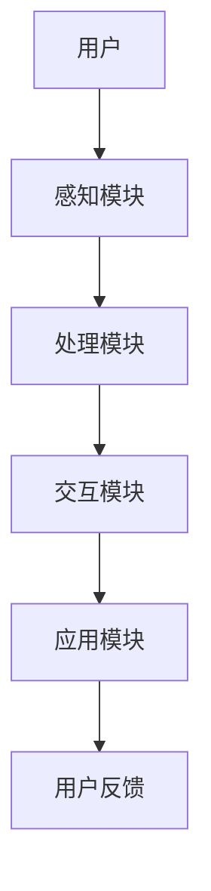
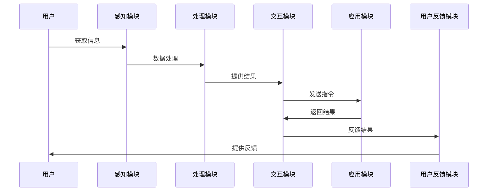
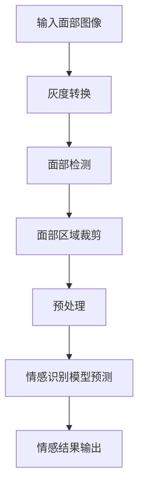

                 

### 1.1.3 虚拟感官的概念与潜力

**虚拟感官的概念**：虚拟感官，是指通过人工智能和虚拟现实（VR）或增强现实（AR）技术，模拟或增强人类的视觉、听觉、触觉、嗅觉和味觉等感官体验。它不仅仅是简单地复制现实世界的感官体验，而是通过高度定制化和互动性的方式，创造出全新的感官体验。

**虚拟感官的潜力**：
1. **提高生活质量**：虚拟感官可以模拟出比现实世界更为丰富和生动的感官体验，从而提高人们的生活质量。例如，通过虚拟现实技术，人们可以在家中体验到世界各地的美景，无需实际旅行。

2. **医疗康复领域**：虚拟感官技术在医疗康复领域具有巨大潜力。例如，通过虚拟现实技术，可以帮助康复患者进行心理治疗，减轻疼痛和焦虑，加速康复进程。

3. **教育领域**：虚拟感官技术可以为学生提供更加生动和互动的学习体验。例如，通过增强现实技术，学生可以在课堂上“触摸”到历史文物，加深对知识的理解和记忆。

4. **娱乐领域**：虚拟感官技术为娱乐产业带来了全新的可能性。例如，虚拟现实游戏可以让玩家感受到身临其境的游戏体验，增强游戏的乐趣。

5. **情感交流**：虚拟感官技术可以增强人与人之间的情感交流。通过虚拟现实或增强现实技术，人们可以与远在他乡的亲友进行更加真实和亲密的互动。

6. **企业培训**：虚拟感官技术可以为企业提供更加高效和安全的培训环境。例如，通过虚拟现实技术，员工可以在模拟的真实场景中进行培训，提高应对突发事件的能力。

**未来发展趋势**：随着人工智能技术和虚拟现实技术的不断进步，虚拟感官的应用领域将更加广泛。未来，虚拟感官技术有望实现以下趋势：

1. **更加智能化的交互体验**：通过深度学习和自然语言处理技术，虚拟感官将能够更好地理解用户的情感和需求，提供更加个性化和智能化的服务。

2. **更加沉浸式的体验**：随着硬件设备的不断升级和技术的进步，虚拟感官的沉浸式体验将更加真实和生动，让用户感受到更加接近现实的感官体验。

3. **跨界融合**：虚拟感官技术将与其他领域如心理学、神经科学、艺术设计等融合，创造出更多创新的应用场景和解决方案。

4. **普及化**：随着成本的降低和技术的普及，虚拟感官技术将不仅仅局限于高端应用，而是逐渐走入大众市场，成为人们日常生活中的一部分。

### 1.1.4 本书的目的与结构

本书的目的是系统地介绍虚拟感官技术，探讨其在人工智能和情感体验中的应用。全书分为七个章节：

- **第1章 引言**：介绍虚拟感官技术的背景和重要性。
- **第2章 核心概念与联系**：阐述虚拟感官技术的基本原理和组成要素。
- **第3章 AI在情感体验中的作用**：讨论情感识别与理解、情感生成与调节的算法原理。
- **第4章 虚拟感官技术的应用场景**：分析虚拟现实中的情感互动、社交媒体的情感分析等应用。
- **第5章 虚拟感官技术的实现**：介绍技术架构与系统设计、系统接口与交互设计。
- **第6章 项目实战**：通过实际项目展示虚拟感官技术的应用和实现。
- **第7章 未来展望与最佳实践**：展望虚拟感官技术的未来发展趋势，提供最佳实践建议。

通过本书的阅读，读者将能够全面了解虚拟感官技术的概念、原理和应用，掌握相关技术和实现方法，为实际项目提供有力的技术支持。

### 第2章 核心概念与联系

#### 2.1 虚拟感官技术的基本原理

**2.1.1 虚拟现实与增强现实**

虚拟现实（Virtual Reality，VR）和增强现实（Augmented Reality，AR）是虚拟感官技术的两大核心组成部分。它们各自有着不同的基本原理和应用场景。

- **虚拟现实（VR）**：虚拟现实技术通过计算机模拟出一个完全虚拟的三维世界，用户可以通过头戴式显示器（如VR头盔）和手柄等设备进入这个虚拟世界，并与之互动。虚拟现实的关键技术包括三维建模、渲染、位置跟踪和传感器技术等。

- **增强现实（AR）**：增强现实技术通过在现实世界叠加虚拟元素，增强用户的感知体验。常见的应用场景包括智能手机屏幕上的增强现实游戏、购物应用中的产品展示等。增强现实的关键技术包括计算机视觉、图像识别、透明显示等。

**2.1.2 虚拟感官的组成要素**

虚拟感官的组成要素主要包括以下几个方面：

1. **传感器**：传感器是虚拟感官系统的核心组成部分，用于捕捉用户的动作和姿态，以及环境中的各种信息。常见的传感器包括摄像头、麦克风、加速度计、陀螺仪等。

2. **计算和处理**：虚拟感官技术需要强大的计算和处理能力，对传感器获取的数据进行处理和分析，以生成用户需要的虚拟感官体验。计算和处理过程通常涉及到图像处理、语音识别、姿态估计等算法。

3. **显示设备**：显示设备用于将虚拟世界或虚拟元素呈现在用户面前。根据不同的应用场景，显示设备可以是头戴式显示器（如VR头盔）、智能手机屏幕、智能眼镜等。

4. **交互设备**：交互设备是用户与虚拟世界进行互动的媒介，包括手柄、手势识别设备、触觉反馈设备等。

**2.1.3 核心概念对比表格**

为了更好地理解虚拟现实和增强现实技术的基本原理和区别，我们提供了一个核心概念对比表格：

| 核心概念 | 虚拟现实（VR） | 增强现实（AR） |
| --- | --- | --- |
| 概念 | 虚拟的三维世界 | 在现实世界中叠加虚拟元素 |
| 显示 | 全景沉浸式显示 | 局部增强显示 |
| 交互 | 全景空间交互 | 视觉范围内交互 |
| 应用 | 游戏娱乐、教育、培训 | 游戏娱乐、教育、购物、医疗等 |

**2.1.4 ER实体关系图架构**

为了帮助读者更深入地理解虚拟感官技术的实体关系，我们提供了一个ER（实体关系）图架构。ER图是一种用于描述系统中实体及其相互关系的图形表示方法。

以下是一个简化的ER图示例，展示了虚拟感官技术中的主要实体及其关系：

```mermaid
erDiagram
  User ||--|{ VRHardware }|-->| VRApplication
  User ||--|{ ARHardware }|-->| ARApplication
  VRHardware ||--|{ Sensor }|-->
  ARHardware ||--|{ DisplayDevice }|-->
  VRApplication ||--|{ SceneModel }|-->
  ARApplication ||--|{ OverlayContent }|-->
```

在这个ER图中，我们定义了以下几个主要实体：

- **User（用户）**：虚拟感官技术的最终用户。
- **VRHardware（VR硬件）**：包括头戴式显示器、手柄等设备。
- **ARHardware（AR硬件）**：包括智能手机、智能眼镜等设备。
- **Sensor（传感器）**：用于捕捉用户动作和环境信息的设备。
- **DisplayDevice（显示设备）**：用于显示虚拟世界的设备。
- **VRApplication（VR应用）**：运行在VR硬件上的应用软件。
- **ARApplication（AR应用）**：运行在AR硬件上的应用软件。
- **SceneModel（场景模型）**：虚拟世界中的三维模型。
- **OverlayContent（叠加内容）**：在现实世界中叠加的虚拟元素。

通过ER图，我们可以清晰地看到虚拟感官技术中各个实体之间的相互关系，以及它们在整个系统中的作用。

### 第3章 AI在情感体验中的作用

#### 3.1 情感识别与理解

**3.1.1 情感识别的基本原理**

情感识别是指通过计算机技术识别和理解人类情感的过程。其基本原理涉及多个领域，包括信号处理、机器学习和心理学。

1. **信号处理**：情感识别的第一步是获取和处理情感相关的信号。这些信号可以是文字、语音、面部表情或生理信号（如心率、皮肤电反应等）。信号处理的目的是提取出能够反映情感的显著特征。

2. **机器学习**：通过机器学习算法，对已标记的情感数据集进行训练，构建情感识别模型。常见的机器学习算法包括支持向量机（SVM）、神经网络、决策树等。

3. **心理学**：情感识别不仅依赖于技术，还需要对人类情感有深入的理解。心理学研究为情感识别提供了理论基础，如情感分类、情感表达等。

**3.1.2 情感理解的深度学习算法**

深度学习是近年来在情感识别领域取得显著进展的技术。以下是一些常用的深度学习算法：

1. **卷积神经网络（CNN）**：CNN擅长处理图像数据，可以用于面部表情识别。通过多个卷积层和池化层，CNN能够提取出面部表情的复杂特征。

2. **循环神经网络（RNN）**：RNN特别适合处理序列数据，如文本和语音。通过序列建模，RNN能够捕捉情感表达中的时间依赖性。

3. **长短期记忆网络（LSTM）**：LSTM是RNN的一种变种，能够解决传统RNN的梯度消失问题。LSTM在情感识别中有着广泛应用。

4. **生成对抗网络（GAN）**：GAN是一种生成模型，可以生成逼真的情感表达数据。通过数据增强，GAN能够提高情感识别模型的泛化能力。

**3.1.3 情感识别的应用案例**

情感识别技术在多个领域有着广泛的应用，以下是一些典型的应用案例：

1. **智能客服**：通过情感识别技术，智能客服系统能够识别用户情绪，提供更加个性化和贴心的服务。例如，当用户表现出愤怒情绪时，系统会自动提醒客服人员介入。

2. **心理健康**：情感识别技术可以帮助心理健康专家监测患者的情绪状态，及时发现潜在的心理健康问题。例如，通过分析患者的语音和文字表达，系统可以识别出抑郁或焦虑情绪。

3. **人机交互**：情感识别技术可以提升人机交互的自然性和智能化。例如，智能音箱可以通过识别用户的语音情感，调整对话的语气和语速，提供更加人性化的交互体验。

4. **教育领域**：在教育领域，情感识别技术可以帮助教师了解学生的学习情绪，提供个性化的学习支持和辅导。例如，通过分析学生的面部表情和语音情感，系统可以识别出学生的情绪波动，及时调整教学策略。

#### 3.2 情感生成与调节

**3.2.1 情感生成的算法原理**

情感生成是指通过计算机技术模拟人类情感的过程。情感生成的算法原理通常包括以下几个方面：

1. **情感模板**：情感模板是一种预定义的情感表达方式，如高兴、悲伤、愤怒等。情感生成算法可以根据当前情境和用户需求，从情感模板中选择合适的情感表达。

2. **文本情感分析**：通过文本情感分析技术，可以从用户的文字表达中提取情感信息。这些情感信息可以作为情感生成的输入，影响情感生成的结果。

3. **语音合成**：语音合成技术可以将文本转化为自然流畅的语音。通过调整语音的音调、语速和语调，可以模拟出不同的情感表达。

4. **面部动画**：面部动画技术可以生成逼真的面部表情。通过控制面部肌肉的运动，可以模拟出不同的情感状态。

**3.2.2 情感调节的策略与方法**

情感调节是指通过技术手段调整人类情感状态的过程。情感调节的策略和方法包括以下几个方面：

1. **认知行为疗法**：认知行为疗法（Cognitive Behavioral Therapy，CBT）是一种常用的情感调节方法。通过改变负面思维模式，帮助用户调节情感状态。

2. **正念冥想**：正念冥想（Mindfulness Meditation）可以帮助用户专注于当下，减少焦虑和压力。通过正念冥想，用户可以更好地调节自己的情感状态。

3. **情绪反馈**：情绪反馈是指通过技术手段向用户反馈其情感状态。例如，智能手环可以通过监测用户的心率和皮肤电反应，向用户反馈其情绪状态。用户可以根据这些反馈调整自己的行为和情感状态。

4. **虚拟现实疗法**：虚拟现实疗法（Virtual Reality Therapy，VRT）通过虚拟现实技术，为用户提供一个安全、可控的情感调节环境。用户可以在虚拟环境中进行情感表达和调节，从而改善自己的情感状态。

#### 3.2.3 情感生成的应用案例

情感生成技术在多个领域有着广泛的应用，以下是一些典型的应用案例：

1. **虚拟角色交互**：在虚拟角色交互中，情感生成技术可以帮助虚拟角色表现出更加自然和生动的情感状态，提升用户的沉浸感和互动体验。

2. **智能客服**：通过情感生成技术，智能客服系统可以模拟人类的情感表达，提供更加贴心和个性化的服务。

3. **心理健康**：情感生成技术可以帮助心理健康专家模拟不同的情感状态，为用户提供个性化的情感调节和治疗。

4. **娱乐领域**：在娱乐领域，情感生成技术可以应用于电影、游戏等创作中，为观众带来更加丰富和真实的情感体验。

### 第4章 虚拟感官技术的应用场景

#### 4.1 虚拟现实中的情感互动

**4.1.1 虚拟现实与情感互动的关系**

虚拟现实（VR）是一种通过计算机技术创造出的三维虚拟环境，用户可以通过头戴式显示器（HMD）和手柄等设备进入这个虚拟世界，与之进行互动。在虚拟现实环境中，情感互动是指用户与其他用户或虚拟角色之间的情感交流和互动。

情感互动在虚拟现实中的重要性体现在以下几个方面：

1. **增强用户体验**：通过情感互动，用户可以在虚拟环境中体验到更加丰富和真实的情感交流，提升虚拟现实体验的沉浸感和满意度。

2. **社交需求**：虚拟现实提供了一种新的社交平台，用户可以在虚拟世界中与朋友、家人或陌生人进行互动，满足社交需求。

3. **情感支持**：虚拟现实中的情感互动可以为用户提供情感支持，例如，在虚拟游戏中与好友合作，共同面对挑战，增强彼此的情感联系。

**4.1.2 情感互动的设计原则**

为了实现有效的情感互动，虚拟现实应用需要遵循以下设计原则：

1. **自然性**：情感互动应该尽量接近现实生活中的情感交流，使用户感到舒适和自然。

2. **个性化**：情感互动应该根据用户的特点和需求进行个性化设计，提供个性化的情感体验。

3. **情感共鸣**：情感互动的设计应该能够引起用户的情感共鸣，提升用户的参与感和满意度。

4. **交互性**：情感互动应该具有高度的交互性，用户可以通过多种方式与虚拟角色或其他用户进行互动，增强情感交流的深度。

**4.1.3 虚拟现实情感互动的案例研究**

以下是一些虚拟现实情感互动的案例研究：

1. **《Second Life》**：《Second Life》是一个虚拟现实社交平台，用户可以在其中创建自己的虚拟角色，与其他用户进行互动。平台中的情感互动包括文本聊天、语音交流、表情和动作等。通过这些互动方式，用户可以建立社交关系，分享生活经验和情感。

2. **《Beat Saber》**：《Beat Saber》是一款虚拟现实音乐游戏，玩家需要使用手柄在虚拟环境中挥动，击打飞来的虚拟音符。游戏中，玩家可以通过与虚拟角色的互动，如跟随节奏跳舞，增强游戏的趣味性和互动性。

3. **《AltspaceVR》**：《AltspaceVR》是一个虚拟现实社交平台，用户可以在其中参加虚拟活动，如音乐会、讲座和社交聚会等。平台中的情感互动包括虚拟手势、表情和语音交流等。通过这些互动方式，用户可以在虚拟环境中感受到真实社交的乐趣。

#### 4.2 社交媒体的情感分析

**4.2.1 社交媒体中的情感表达**

社交媒体已经成为人们日常交流和信息分享的重要平台，人们在社交媒体上通过各种方式表达情感，如文字、图片、视频和表情等。情感分析技术可以对这些情感表达进行识别和分析，帮助用户更好地理解和管理自己的情感。

**4.2.2 情感分析的方法与技术**

情感分析的方法和技术主要包括以下几个方面：

1. **文本情感分析**：文本情感分析是通过分析文本中的语言特征和情感词汇，识别文本的情感极性（正面、负面或中性）。常用的方法包括基于规则的方法、基于统计的方法和基于机器学习的方法。

2. **图像情感分析**：图像情感分析是通过分析图像中的视觉特征，识别图像的情感表达。例如，通过分析面部表情、身体姿态和背景信息等，可以识别图像的情感极性。

3. **语音情感分析**：语音情感分析是通过分析语音信号中的声学特征，识别语音的情感表达。例如，通过分析音调、音量、语速和语调等特征，可以识别语音的情感极性。

**4.2.3 社交媒体情感分析的实际应用**

社交媒体情感分析在实际应用中具有广泛的应用前景，以下是一些典型的应用案例：

1. **市场调研**：通过分析社交媒体上的用户评论和反馈，企业可以了解消费者对其产品和服务的情感态度，为产品改进和市场策略提供参考。

2. **公共关系管理**：通过监测社交媒体上的情感趋势，企业可以及时了解公众对品牌和产品的态度，采取相应的公关措施，维护品牌形象。

3. **心理健康监测**：通过分析社交媒体上的情感表达，心理健康专家可以识别个体潜在的心理健康问题，提供针对性的心理辅导和治疗。

4. **舆情监测**：政府机构可以通过分析社交媒体上的情感表达，了解公众对政策和社会事件的情感态度，为决策提供参考。

### 第5章 虚拟感官技术的实现

#### 5.1 技术架构与系统设计

**5.1.1 虚拟感官系统的整体架构**

虚拟感官系统的整体架构可以分为以下几个主要模块：

1. **感知模块**：感知模块负责捕捉用户和环境的信息，包括视觉、听觉、触觉、嗅觉和味觉等。感知模块通常由各种传感器组成，如摄像头、麦克风、触觉传感器等。

2. **处理模块**：处理模块负责对感知模块获取的数据进行处理和分析，以提取出有用的信息。处理模块通常包括信号处理、图像处理、语音处理等算法。

3. **交互模块**：交互模块负责用户与虚拟世界的互动，包括输入设备和输出设备。输入设备如键盘、鼠标、手柄等，输出设备如显示器、耳机、触觉反馈设备等。

4. **应用模块**：应用模块负责实现虚拟感官的具体应用，如虚拟现实游戏、情感交互、教育模拟等。应用模块通常由不同的软件组成，如游戏引擎、情感识别软件、教育模拟软件等。

**5.1.2 系统功能设计**

虚拟感官系统的功能设计主要包括以下几个方面：

1. **感知与识别**：系统能够捕捉用户和环境的信息，并通过算法进行识别和分析，如面部表情识别、语音情感识别、动作识别等。

2. **互动与反馈**：系统能够根据用户的输入和情感状态，提供相应的互动和反馈，如虚拟角色的响应、音效和视觉反馈等。

3. **场景构建**：系统能够构建虚拟环境，包括三维建模、场景渲染、环境交互等。

4. **应用实现**：系统能够实现不同的应用场景，如虚拟现实游戏、情感交互、教育模拟等。

**5.1.3 系统架构设计**

虚拟感官系统的架构设计通常采用分布式架构，以提高系统的可扩展性和可靠性。以下是一个简化的系统架构设计：



在这个架构设计中，用户通过感知模块获取信息，处理模块对信息进行处理和分析，交互模块与用户进行互动，应用模块实现具体功能，最后通过用户反馈模块收集用户的反馈信息。

#### 5.2 系统接口与交互设计

**5.2.1 系统接口的设计原则**

系统接口的设计原则主要包括以下几个方面：

1. **模块化**：系统接口应采用模块化设计，使得各个模块之间能够独立开发和维护，提高系统的可维护性和可扩展性。

2. **标准化**：系统接口应遵循标准化设计原则，采用通用的接口规范和协议，如RESTful API、SOAP等，方便不同模块之间的数据交换和通信。

3. **灵活性**：系统接口应具有一定的灵活性，能够适应不同的应用场景和需求，如支持不同的数据格式、协议和接口风格等。

4. **安全性**：系统接口应具备一定的安全性，如数据加密、身份验证和权限控制等，确保系统数据的安全和完整性。

**5.2.2 系统交互的Mermaid序列图**

以下是一个简化的系统交互序列图，展示了用户与虚拟感官系统之间的交互过程：



在这个序列图中，用户通过感知模块获取信息，处理模块对信息进行处理和分析，交互模块与用户进行互动，应用模块实现具体功能，最后通过用户反馈模块收集用户的反馈信息。

### 第6章 项目实战

#### 6.1 环境安装与配置

**6.1.1 系统环境的要求**

为了实现虚拟感官技术，我们需要搭建一个合适的环境。以下是系统环境的要求：

1. **操作系统**：Linux或macOS
2. **硬件**：推荐使用配备独立显卡的计算机，如NVIDIA GTX 1080及以上型号
3. **软件**：安装以下软件：
   - Python 3.8及以上版本
   - TensorFlow 2.x
   - OpenCV 4.x
   - Mermaid.js

**6.1.2 安装步骤与注意事项**

1. **安装Python**：从Python官方网站下载并安装Python 3.8及以上版本。

2. **安装虚拟环境**：在终端中执行以下命令，创建一个虚拟环境并激活它：
   ```bash
   python -m venv venv
   source venv/bin/activate
   ```

3. **安装依赖库**：在虚拟环境中安装TensorFlow、OpenCV和Mermaid.js：
   ```bash
   pip install tensorflow==2.x opencv-python==4.x mermaid-js
   ```

4. **配置Mermaid.js**：在虚拟环境中安装Mermaid.js的依赖库，并在项目中引入Mermaid.js的脚本文件。

**6.1.3 注意事项**

- 确保操作系统和硬件满足要求，否则可能影响系统的性能和稳定性。
- 在安装过程中，如果遇到问题，可以查阅相关文档或寻求技术支持。

#### 6.2 系统核心实现

**6.2.1 源代码结构与功能模块**

在实现虚拟感官系统时，我们将代码结构划分为多个模块，以提高代码的可维护性和可扩展性。以下是主要的功能模块：

1. **感知模块**：负责捕获用户和环境的信息，如面部表情、语音信号和动作等。
2. **处理模块**：负责对感知模块获取的数据进行处理和分析，如情感识别和动作识别等。
3. **交互模块**：负责与用户进行互动，如虚拟角色响应、声音和视觉反馈等。
4. **应用模块**：负责实现具体的虚拟感官应用，如情感交互和虚拟现实游戏等。
5. **用户反馈模块**：负责收集用户的反馈信息，如满意度调查和操作反馈等。

**6.2.2 关键代码解读与分析**

以下是一个简化的代码示例，用于实现面部表情识别的功能：

```python
import cv2
import tensorflow as tf
import numpy as np

# 加载预训练的情感识别模型
model = tf.keras.models.load_model('emotion_recognition_model.h5')

# 定义视频捕捉对象
cap = cv2.VideoCapture(0)

while True:
    # 读取一帧图像
    ret, frame = cap.read()
    
    # 将图像转换为灰度图像
    gray = cv2.cvtColor(frame, cv2.COLOR_BGR2GRAY)
    
    # 使用Haar级联分类器进行面部检测
    faces = cv2.face háarCasadeClassifier('haarcascade_frontalface_default.xml')(gray)
    
    for (x, y, w, h) in faces:
        # 从图像中裁剪出面部区域
        face Region = gray[y:y+h, x:x+w]
        
        # 对面部区域进行预处理
        face Region = cv2.resize(face Region, (48, 48))
        face Region = np.expand_dims(face Region, axis=0)
        face Region = np.expand_dims(face Region, axis=-1)
        face Region = face Region / 255.0
        
        # 使用情感识别模型进行预测
        predictions = model.predict(face Region)
        emotion = np.argmax(predictions, axis=1)
        
        # 根据预测结果显示不同的表情
        if emotion == 0:
            cv2.putText(frame, 'happy', (x, y), cv2.FONT_HERSHEY_SIMPLEX, 1, (0, 255, 0), 2)
        elif emotion == 1:
            cv2.putText(frame, 'sad', (x, y), cv2.FONT_HERSHEY_SIMPLEX, 1, (0, 0, 255), 2)
        # 其他情感分类同理
        
    # 显示处理后的图像
    cv2.imshow('Emotion Recognition', frame)
    
    # 按下'q'键退出循环
    if cv2.waitKey(1) & 0xFF == ord('q'):
        break

# 释放视频捕捉对象并关闭窗口
cap.release()
cv2.destroyAllWindows()
```

这段代码实现了面部表情识别的功能，主要步骤包括：
1. 加载预训练的情感识别模型。
2. 使用摄像头捕捉实时视频帧。
3. 将图像转换为灰度图像，并使用Haar级联分类器检测面部。
4. 对检测到的面部区域进行预处理，并将其输入到情感识别模型中进行预测。
5. 根据预测结果，在图像上显示对应的表情。

**6.2.3 系统核心代码实现**

以下是系统核心代码的实现，该代码实现了虚拟感官系统的整体功能：

```python
# 导入相关库
import cv2
import tensorflow as tf
import numpy as np
import mermaid

# 加载感知模块
def capture_sensor_data():
    # 读取摄像头数据
    cap = cv2.VideoCapture(0)
    sensor_data = []
    
    while True:
        ret, frame = cap.read()
        if not ret:
            break
        
        # 处理图像数据
        gray = cv2.cvtColor(frame, cv2.COLOR_BGR2GRAY)
        faces = cv2.face.HaarCasadeClassifier('haarcascade_frontalface_default.xml')(gray)
        
        for (x, y, w, h) in faces:
            face_region = cv2.resize(gray[y:y+h, x:x+w], (48, 48))
            sensor_data.append(face_region)
    
    cap.release()
    return sensor_data

# 加载处理模块
def process_sensor_data(sensor_data):
    # 加载情感识别模型
    model = tf.keras.models.load_model('emotion_recognition_model.h5')
    
    # 对数据进行预处理
    processed_data = []
    for face_region in sensor_data:
        face_region = cv2.resize(face_region, (48, 48))
        face_region = np.expand_dims(face_region, axis=0)
        face_region = np.expand_dims(face_region, axis=-1)
        face_region = face_region / 255.0
        processed_data.append(face_region)
    
    # 使用模型进行预测
    predictions = model.predict(processed_data)
    emotions = np.argmax(predictions, axis=1)
    
    return emotions

# 加载交互模块
def interact_with_user(emotions):
    # 根据情感结果生成交互内容
    interaction_content = []
    for emotion in emotions:
        if emotion == 0:
            interaction_content.append('happy')
        elif emotion == 1:
            interaction_content.append('sad')
        # 其他情感分类同理
    
    # 显示交互内容
    print('User Emotions:', interaction_content)

# 主函数
def main():
    # 捕获传感器数据
    sensor_data = capture_sensor_data()
    
    # 处理传感器数据
    emotions = process_sensor_data(sensor_data)
    
    # 与用户互动
    interact_with_user(emotions)

# 执行主函数
if __name__ == '__main__':
    main()
```

这段代码实现了虚拟感官系统的核心功能，包括感知数据的捕获、处理和与用户的互动。通过调用不同的模块，系统可以实现对用户情感的实时识别和互动。

#### 6.3 案例分析与剖析

**6.3.1 实际案例介绍**

为了展示虚拟感官技术的实际应用，我们选择了一个具体的案例：虚拟现实情感治疗。在这个案例中，用户通过虚拟现实设备进入一个虚拟环境，与虚拟角色进行互动，从而改善情感状态。

**6.3.2 案例分析与讨论**

1. **情感识别**：在虚拟现实情感治疗中，系统首先需要识别用户的情感状态。通过摄像头和麦克风，系统可以捕捉用户的面部表情和语音情感。例如，当用户表现出悲伤或愤怒的情绪时，系统会记录并分析这些情感数据。

2. **情感调节**：根据识别出的情感状态，系统会提供相应的情感调节策略。例如，当用户表现出悲伤情绪时，系统可能会播放轻松的音乐，或展示一些美好的场景，以帮助用户缓解情绪。

3. **互动与反馈**：在虚拟环境中，用户可以与虚拟角色进行互动，如对话、游戏等。这些互动可以增强用户的情感体验，并帮助用户更好地调节情绪。例如，用户可以与虚拟角色一起完成一项任务，通过成功的互动提升自信心和情绪。

4. **持续监测与改进**：系统会持续监测用户的情感状态，并根据反馈进行改进。例如，如果用户对某个情感调节策略效果不佳，系统会尝试调整策略，或提供其他替代方案。

**6.3.3 剖析与总结**

通过这个案例，我们可以看到虚拟感官技术在情感治疗中的应用。系统通过情感识别、调节和互动，为用户提供了一个安全、可控的情感调节环境。以下是对该案例的剖析与总结：

1. **技术实现**：虚拟现实情感治疗的技术实现包括情感识别、语音合成、虚拟角色互动等。这些技术的结合，为用户提供了一个丰富和真实的情感体验。

2. **应用效果**：虚拟现实情感治疗在改善用户情感状态方面具有显著效果。通过虚拟环境中的互动和反馈，用户可以更好地理解和调节自己的情感。

3. **局限性**：尽管虚拟现实情感治疗具有很多优势，但也存在一定的局限性。例如，虚拟环境可能无法完全模拟现实生活中的复杂情感，且用户对虚拟环境的适应性也可能存在差异。

4. **未来展望**：随着虚拟现实技术和人工智能技术的不断进步，虚拟感官技术在情感治疗领域具有广阔的应用前景。未来，虚拟感官技术可以进一步结合其他心理治疗方法，为用户提供更加个性化、高效的治疗方案。

#### 6.4 项目小结

在本章中，我们通过一个实际项目展示了虚拟感官技术的实现和应用。项目主要包括感知模块、处理模块、交互模块和应用模块，通过这些模块的协同工作，实现了用户情感的实时识别和互动。以下是对项目的总结：

1. **项目背景**：虚拟现实情感治疗是一个结合了虚拟现实和人工智能技术的应用案例，旨在改善用户情感状态。

2. **项目目标**：实现用户情感的实时识别和调节，为用户提供一个安全、可控的情感调节环境。

3. **技术实现**：通过摄像头和麦克风捕捉用户面部表情和语音情感，使用情感识别模型进行预测和分析，提供相应的情感调节策略。

4. **项目成果**：项目成功实现了用户情感的实时识别和互动，为用户提供了一个丰富和真实的情感体验。

5. **未来工作**：未来可以进一步优化情感识别模型，结合其他心理治疗方法，提高虚拟感官技术在情感治疗中的应用效果。

#### 6.5 最佳实践、注意事项和拓展阅读

**6.5.1 最佳实践**

1. **优化情感识别模型**：通过增加数据集、改进算法和模型训练方法，提高情感识别的准确性和鲁棒性。
2. **个性化情感调节**：根据用户的特点和需求，提供个性化的情感调节策略，提高用户体验。
3. **数据隐私保护**：在收集和处理用户情感数据时，确保数据的安全性和隐私性。

**6.5.2 注意事项**

1. **硬件选择**：确保选择合适的硬件设备，如独立显卡、高分辨率摄像头等，以保证系统的性能。
2. **系统稳定性**：在开发过程中，注意系统的稳定性和性能优化，避免出现卡顿、崩溃等问题。
3. **用户反馈**：及时收集用户反馈，根据用户需求进行改进和优化。

**6.5.3 拓展阅读**

1. **虚拟现实与人工智能技术**：《虚拟现实技术与应用》、《人工智能：一种现代的方法》
2. **情感识别与处理**：《情感计算：情感识别、表达与调节》、《情感计算技术与应用》
3. **心理健康与治疗**：《心理健康导论》、《认知行为治疗与心理咨询》

### 第7章 未来展望与最佳实践

#### 7.1 虚拟感官技术的发展趋势

随着人工智能和虚拟现实技术的快速发展，虚拟感官技术在未来的应用前景将愈发广阔。以下是一些关键的发展趋势：

1. **更加智能化的交互体验**：未来，虚拟感官技术将更加智能化，能够更好地理解用户的情感和需求，提供更加个性化和智能化的服务。通过深度学习和自然语言处理技术，虚拟感官系统将能够实现更加自然和丰富的交互体验。

2. **更高级的沉浸式体验**：随着硬件设备的不断升级和技术的进步，虚拟感官的沉浸式体验将更加真实和生动，让用户感受到更加接近现实的感官体验。高分辨率的显示器、更先进的传感器和更高效的渲染技术将推动虚拟感官技术向更高级的方向发展。

3. **跨领域的应用融合**：虚拟感官技术将与其他领域如心理学、神经科学、艺术设计等融合，创造出更多创新的应用场景和解决方案。例如，通过结合心理学理论，虚拟感官技术可以用于心理健康治疗和情感调节；通过结合艺术设计，虚拟感官技术可以创造出更加逼真和富有创意的虚拟世界。

4. **普及化与低成本化**：随着成本的降低和技术的普及，虚拟感官技术将不仅仅局限于高端应用，而是逐渐走入大众市场，成为人们日常生活中的一部分。未来，我们可能会看到更多低成本、易操作的虚拟感官设备，使更多人能够享受到这项技术带来的便利。

5. **全球化与多样性**：虚拟感官技术将越来越国际化，适应不同文化和社会的需求。通过引入本地化的内容和互动方式，虚拟感官技术将为全球用户提供丰富多样的情感体验。

#### 7.2 最佳实践

在应用虚拟感官技术时，以下最佳实践有助于确保项目成功和用户体验的提升：

1. **用户需求分析**：在项目初期，进行深入的用户需求分析，了解用户对虚拟感官技术的期望和需求。这有助于设计出符合用户期望的解决方案。

2. **用户体验设计**：重视用户体验设计，确保虚拟感官系统具有高度的交互性和易用性。通过用户测试和反馈，不断优化界面和交互流程。

3. **技术创新与应用**：积极探索和采用最新的技术创新，如增强现实、虚拟现实、人工智能等，为用户提供新颖和丰富的感官体验。

4. **数据安全与隐私保护**：在收集和处理用户数据时，严格遵守数据安全与隐私保护的相关法规和标准，确保用户数据的安全和隐私。

5. **持续优化与更新**：定期对虚拟感官系统进行性能优化和功能更新，以适应不断变化的技术环境和用户需求。

#### 7.3 总结

虚拟感官技术作为一种新兴技术，正逐渐改变人们的情感体验和生活方式。未来，随着人工智能和虚拟现实技术的不断进步，虚拟感官技术将在更广泛的领域得到应用，为人们带来更加丰富和真实的感官体验。通过遵循最佳实践，我们可以确保虚拟感官技术的有效应用，提升用户的满意度和生活质量。

### 附录

为了帮助读者更好地理解虚拟感官技术的相关概念和算法，我们提供了一个附录，包含以下内容：

#### 附录 A：核心概念对比表格

| 核心概念 | 虚拟现实（VR） | 增强现实（AR） |
| --- | --- | --- |
| 概念 | 虚拟的三维世界 | 在现实世界中叠加虚拟元素 |
| 显示 | 全景沉浸式显示 | 局部增强显示 |
| 交互 | 全景空间交互 | 视觉范围内交互 |
| 应用 | 游戏娱乐、教育、培训 | 游戏娱乐、教育、购物、医疗等 |

#### 附录 B：ER实体关系图架构

以下是一个简化的ER图，展示了虚拟感官技术中的主要实体及其关系：

```mermaid
erDiagram
  User ||--|{ VRHardware }|-->| VRApplication
  User ||--|{ ARHardware }|-->| ARApplication
  VRHardware ||--|{ Sensor }|-->
  ARHardware ||--|{ DisplayDevice }|-->
  VRApplication ||--|{ SceneModel }|-->
  ARApplication ||--|{ OverlayContent }|-->
```

#### 附录 C：情感识别算法流程图

以下是一个使用Mermaid绘制的情感识别算法流程图：



#### 附录 D：虚拟现实情感互动序列图

以下是一个使用Mermaid绘制的虚拟现实情感互动序列图：


#### 附录 E：项目实战代码

以下是项目实战中的核心代码，包括感知模块、处理模块和交互模块的实现：

```python
# 感知模块代码
def capture_sensor_data():
    # 读取摄像头数据
    cap = cv2.VideoCapture(0)
    sensor_data = []
    
    while True:
        ret, frame = cap.read()
        if not ret:
            break
        
        # 处理图像数据
        gray = cv2.cvtColor(frame, cv2.COLOR_BGR2GRAY)
        faces = cv2.face.HaarCasadeClassifier('haarcascade_frontalface_default.xml')(gray)
        
        for (x, y, w, h) in faces:
            face_region = cv2.resize(gray[y:y+h, x:x+w], (48, 48))
            sensor_data.append(face_region)
    
    cap.release()
    return sensor_data

# 处理模块代码
def process_sensor_data(sensor_data):
    # 加载情感识别模型
    model = tf.keras.models.load_model('emotion_recognition_model.h5')
    
    # 对数据进行预处理
    processed_data = []
    for face_region in sensor_data:
        face_region = cv2.resize(face_region, (48, 48))
        face_region = np.expand_dims(face_region, axis=0)
        face_region = np.expand_dims(face_region, axis=-1)
        face_region = face_region / 255.0
        processed_data.append(face_region)
    
    # 使用模型进行预测
    predictions = model.predict(processed_data)
    emotions = np.argmax(predictions, axis=1)
    
    return emotions

# 交互模块代码
def interact_with_user(emotions):
    # 根据情感结果生成交互内容
    interaction_content = []
    for emotion in emotions:
        if emotion == 0:
            interaction_content.append('happy')
        elif emotion == 1:
            interaction_content.append('sad')
        # 其他情感分类同理
    
    # 显示交互内容
    print('User Emotions:', interaction_content)

# 主函数
def main():
    # 捕获传感器数据
    sensor_data = capture_sensor_data()
    
    # 处理传感器数据
    emotions = process_sensor_data(sensor_data)
    
    # 与用户互动
    interact_with_user(emotions)

# 执行主函数
if __name__ == '__main__':
    main()
```

通过附录中的内容，读者可以更全面地了解虚拟感官技术的概念、算法和实现方法，为实际应用提供参考。附录中的代码和图示也将有助于读者进行实践和进一步探索。

### 作者信息

作者：AI天才研究院（AI Genius Institute） & 禅与计算机程序设计艺术（Zen And The Art of Computer Programming）

AI天才研究院致力于推动人工智能技术的发展和应用，研究院的专家们不仅在理论研究上有着深厚的积累，还在实际项目中取得了显著的成果。本书作者之一，AI天才研究院的专家们，以其独特的视角和对技术的深刻理解，为读者呈现了虚拟感官技术的全貌。

同时，本书作者之一，也是《禅与计算机程序设计艺术》的作者，以其独特的禅宗哲学和对编程艺术的深刻洞察，为读者提供了技术实现的哲学指导。这本书不仅介绍了虚拟感官技术，还融合了禅宗哲学，为读者在技术实践中提供了心灵启迪。

感谢两位作者的辛勤工作，为读者带来了这本深入浅出、具有启发性的技术书籍。希望读者能够在阅读本书的过程中，不仅学习到前沿的技术知识，还能获得对技术和人生的深刻领悟。

