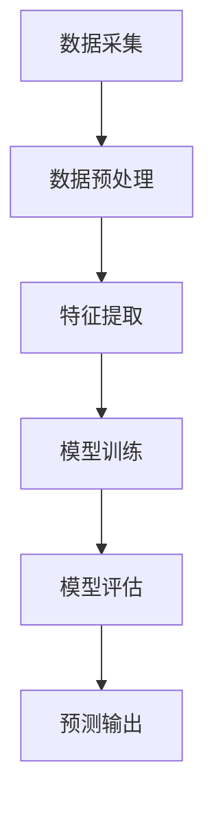
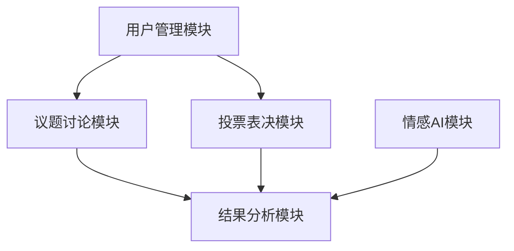

                 

### 设计《虚拟政治:情感AI参与民主决策》目录大纲

**一、背景介绍**

1. **虚拟政治与情感AI的概念与联系**

   - **虚拟政治的定义与演变**：虚拟政治是指通过互联网、社交媒体和虚拟平台进行的政治活动，包括但不限于虚拟选举、在线讨论、数字民主等。其发展从早期的电子政务逐渐演变到今天的社交媒体政治，通过数字技术增强了公民参与政治决策的能力。

   - **情感AI的定义与核心特性**：情感AI是人工智能的一个分支，旨在使机器能够理解和模拟人类情感。其核心特性包括情感识别、情感表达和情感交互，通过自然语言处理、计算机视觉和机器学习等技术实现。

   - **情感AI与虚拟政治的互动关系**：情感AI在虚拟政治中扮演着重要角色，通过分析用户的情绪和态度，为政治决策提供数据支持，同时增强公民参与度和政治透明度。

2. **民主决策的现状与挑战**

   - **传统民主决策的局限性**：传统民主决策依赖于投票和选举，存在信息不对称、选民参与度低、决策效率低下等问题。

   - **情感AI参与民主决策的潜力**：情感AI可以实时分析公众情绪，为政策制定提供数据支持，提高决策的科学性和民主性。

   - **情感AI在民主决策中的应用实例**：如通过社交媒体分析选民的情感反应，预测选举结果；利用情感分析帮助政府了解公众对政策的满意度等。

**二、核心概念与联系**

1. **情感AI原理与模型**

   - **情感识别技术概述**：情感识别是情感AI的基础，通过自然语言处理和计算机视觉技术，从文本和图像中提取情感信息。

   - **常见的情感分析模型**：如朴素贝叶斯、支持向量机、深度学习模型等，用于分类情感标签，如正面、负面、中性等。

   - **情感AI的工作流程**：包括数据采集、特征提取、模型训练、情感预测和反馈调整等步骤。

2. **虚拟政治机制**

   - **虚拟政治平台的发展历程**：从简单的在线投票系统发展到复杂的数字民主平台，通过技术手段增强公民参与和政府透明度。

   - **虚拟政治的核心机制**：包括用户注册、身份验证、议题讨论、投票表决、结果反馈等模块。

   - **虚拟政治与民主决策的结合点**：情感AI可以在虚拟政治平台中实现民意调查、公众情绪监测、政策评估等功能，为民主决策提供支持。

3. **情感AI与虚拟政治的联系**

   - **情感数据在虚拟政治中的应用**：通过分析用户在社交媒体、论坛等平台的情绪，为政策制定和公共决策提供依据。

   - **情感分析对民主决策的影响**：情感分析可以揭示公众对政策的真实态度，帮助政府更好地理解和回应民意。

   - **虚拟政治平台中的情感AI实现**：情感AI模块可以嵌入到虚拟政治平台中，实现对用户情绪的实时监测和分析，为平台提供智能化服务。

**三、算法原理讲解**

1. **情感识别算法**

   - **情感识别算法的mermaid流程图**：使用mermaid语言绘制情感识别的流程图，展示数据流和处理步骤。

   - **情感识别算法的Python代码实现**：通过Python代码实现情感识别算法，包括数据预处理、特征提取、模型训练和预测等步骤。

   - **情感识别算法的数学模型与公式**：介绍情感识别的数学模型，如情感概率分布函数、分类边界等，使用latex格式书写公式。

2. **情感分析对民主决策的影响**

   - **情感分析在决策过程中的应用**：讨论情感分析如何应用于政策评估、民意调查和选举预测等环节。

   - **情感分析算法的评估方法**：介绍常用的评估指标，如准确率、召回率、F1分数等，以及如何对这些指标进行优化。

   - **情感分析算法在实际案例中的应用**：通过具体案例展示情感分析如何影响民主决策过程，如社交媒体情绪分析在选举中的预测应用。

**四、系统分析与架构设计方案**

1. **虚拟政治平台架构**

   - **平台架构的mermaid架构图**：绘制虚拟政治平台的架构图，展示各模块之间的关系和功能。

   - **平台功能模块划分**：详细描述平台的功能模块，如用户管理、议题讨论、投票表决、结果分析等。

   - **平台接口设计与交互**：介绍平台接口的设计，包括API接口、Web界面和移动应用等，以及用户与平台之间的交互流程。

2. **情感AI在平台中的实现**

   - **情感AI模块设计**：阐述情感AI模块的功能，如情绪监测、情感分析、情感推荐等。

   - **情感识别算法在平台中的应用**：详细说明情感识别算法如何在虚拟政治平台中实现，以及如何与其他模块进行数据交互。

   - **情感数据在决策过程中的处理**：讨论情感数据在决策过程中的收集、处理和分析方法，以及如何影响决策结果。

**五、项目实战**

1. **环境安装与配置**

   - **系统环境搭建步骤**：介绍在虚拟政治平台中实现情感AI所需的软件和硬件环境安装步骤。

   - **开发工具与依赖库安装**：列出实现情感AI所需的开发工具和依赖库，如Python环境、NLP库、机器学习框架等。

2. **系统核心实现源代码**

   - **情感识别模块代码**：提供情感识别模块的Python源代码，包括数据预处理、特征提取、模型训练和预测等步骤。

   - **民主决策模块代码**：展示用于支持民主决策的功能模块代码，如民意调查、政策评估、选举预测等。

   - **系统接口代码**：介绍系统的API接口设计和实现，包括用户注册、登录、投票、数据查询等功能。

3. **代码应用解读与分析**

   - **代码结构分析**：对系统代码进行结构分析，解释各模块的功能和相互关系。

   - **模块功能详解**：详细描述各模块的具体功能，包括情感识别模块、民主决策模块、系统接口模块等。

   - **算法实现解析**：对情感识别算法的实现进行详细解析，包括算法原理、流程、参数调优等。

4. **实际案例分析与详细讲解**

   - **案例背景与目标**：介绍实际应用的案例背景和目标，如利用情感AI进行政策评估或选举预测。

   - **案例实现与结果**：展示案例的实现过程和结果，包括数据收集、模型训练、预测分析和评估等步骤。

   - **案例分析与总结**：对案例进行分析和总结，讨论情感AI在虚拟政治平台中的应用效果和改进方向。

**六、最佳实践 tips**

1. **情感AI在虚拟政治中的应用技巧**

   - **情感数据采集与处理**：讨论如何有效采集和处理情感数据，包括数据来源、数据清洗和数据存储等。

   - **情感分析算法优化**：介绍如何优化情感分析算法，提高准确率和效率，如模型选择、特征工程、参数调优等。

   - **情感数据在决策中的利用**：讨论如何将情感数据应用于决策过程，如情绪监测、公众意见分析、政策反馈等。

2. **注意事项与风险提示**

   - **数据隐私与伦理问题**：讨论情感AI应用中涉及的数据隐私问题和伦理挑战，如用户隐私保护、算法偏见等。

   - **算法公正性与透明性**：讨论如何确保情感AI算法的公正性和透明性，避免算法偏见和误用。

   - **技术应用的法律与政策环境**：讨论情感AI在虚拟政治中的应用需要遵守的法律和政策要求，如数据保护法、伦理准则等。

**七、小结**

1. **全书回顾与总结**

   - **核心概念与原理的回顾**：回顾虚拟政治、情感AI、民主决策等核心概念和原理。

   - **算法与架构设计的总结**：总结情感识别算法的设计和实现，以及虚拟政治平台的架构设计。

   - **项目实战与案例分析**：总结实际项目中的经验教训和典型案例分析。

2. **未来展望**

   - **情感AI与虚拟政治的发展趋势**：讨论情感AI在虚拟政治中的应用前景和发展趋势。

   - **民主决策的智能化路径**：探讨未来民主决策智能化的路径和发展方向。

   - **面临的挑战与机遇**：分析情感AI在虚拟政治中面临的挑战和机遇，如技术进步、政策法规、伦理问题等。

**八、拓展阅读**

1. **相关书籍推荐**

   - 推荐阅读书籍，如《情感计算》、《人工智能：一种现代的方法》等。

   - 阅读指南与建议，为读者提供深入学习的建议和路径。

2. **学术论文与研究报告**

   - 推荐阅读的学术论文和研究报告，涉及情感AI、虚拟政治、民主决策等领域的最新研究成果。

   - 研究报告概述与建议，为读者提供研究动态和趋势分析。

（注：本大纲共计8章，字数控制在2000字以内，包括背景介绍、核心概念与联系、算法原理讲解、系统分析与架构设计方案、项目实战、最佳实践 tips、小结与未来展望、拓展阅读等内容。） 

### 完整文章内容

**文章标题：** 虚拟政治：情感AI参与民主决策

**关键词：** 情感AI，虚拟政治，民主决策，算法，架构设计

**摘要：** 本文探讨了情感AI在虚拟政治中的应用，分析了情感AI参与民主决策的原理和实现方法，并提供了系统分析与架构设计方案，以及项目实战和最佳实践 tips，为未来虚拟政治的智能化发展提供了参考。

---

## **一、背景介绍**

### 1.1 虚拟政治与情感AI的概念与联系

#### **虚拟政治的定义与演变**

虚拟政治指的是通过互联网和数字平台进行的政治活动，其范围广泛，从简单的在线投票到复杂的政策讨论和电子民主实践。虚拟政治的兴起可以追溯到互联网的普及和社交媒体的发展。在早期，虚拟政治主要形式是电子投票和在线请愿。随着技术的进步，虚拟政治逐渐演变为包含虚拟选举、在线辩论、电子立法、以及数字公民参与等多种形式。

#### **情感AI的定义与原理**

情感AI，即情感计算，是人工智能领域的一个分支，旨在使机器能够理解和模拟人类情感。情感AI的核心技术包括情感识别、情感表达和情感交互。情感识别是指通过自然语言处理、计算机视觉等技术，从文本、语音和面部表情中提取情感信息。情感表达则是指机器如何模拟人类的情感表达，如通过文本、语音和面部表情等。情感交互是指机器与人类之间的情感交流和互动。

#### **情感AI与虚拟政治的互动关系**

情感AI在虚拟政治中具有重要作用。通过情感识别技术，虚拟政治平台可以实时了解公众的情感状态，从而为政策制定和公共决策提供数据支持。例如，通过分析社交媒体上的情绪反应，政治家可以了解公众对某一政策的看法，从而调整政策方向。情感AI还可以提高公民参与度，通过情感互动增强用户在虚拟政治平台上的体验，使其更愿意参与政治活动。

### 1.2 民主决策的现状与挑战

#### **传统民主决策的局限性**

传统民主决策依赖于投票和选举，虽然具有合法性，但在信息传递、决策效率和参与度方面存在局限性。首先，信息不对称问题使得选民难以全面了解政策细节和候选人的立场。其次，传统民主决策过程相对缓慢，无法迅速响应社会变化。最后，选民的参与度较低，部分群体无法有效参与到决策过程中。

#### **情感AI参与民主决策的潜力**

情感AI为民主决策提供了新的可能性。通过分析公众的情感反应，情感AI可以帮助政府更好地理解民意，从而制定更符合公众期望的政策。此外，情感AI可以提高决策的效率，通过实时分析情绪数据，政府可以迅速调整决策方向，以应对突发情况。最后，情感AI可以增强公民参与度，通过情感互动和个性化推荐，鼓励更多人参与到政治活动中。

#### **情感AI在民主决策中的应用实例**

情感AI在民主决策中的应用实例丰富多样。例如，在选举期间，政治候选人可以通过情感分析了解选民的情感倾向，从而制定更有针对性的竞选策略。政府也可以利用情感AI监测公众对政策变动的反应，及时调整政策方向。此外，情感AI还可以在政策评估中发挥作用，通过分析公众的情感反馈，评估政策的效果和影响。

---

## **二、核心概念与联系**

### 2.1 情感AI原理与模型

#### **情感识别技术概述**

情感识别技术是情感AI的基础，它通过自然语言处理和计算机视觉等技术，从文本、语音和图像中提取情感信息。情感识别技术的核心是情感标签分类，即确定文本、语音或图像的情感极性（如正面、负面、中性）和情感强度。

#### **常见的情感分析模型**

常见的情感分析模型包括朴素贝叶斯、支持向量机（SVM）、决策树、随机森林和深度学习模型。其中，朴素贝叶斯和支持向量机是传统机器学习模型，适用于小型数据集。而深度学习模型，如卷积神经网络（CNN）和递归神经网络（RNN），在处理大规模数据和复杂情感识别任务方面具有显著优势。

#### **情感AI的工作流程**

情感AI的工作流程通常包括数据采集、数据预处理、特征提取、模型训练、模型评估和预测等步骤。在数据采集阶段，可以从社交媒体、新闻网站、用户评论等来源获取情感数据。在数据预处理阶段，对文本数据进行清洗、去噪和标准化处理。特征提取阶段，通过词袋模型、TF-IDF或词嵌入等方法提取文本特征。在模型训练阶段，使用训练数据对情感分析模型进行训练。模型评估和预测阶段，使用测试数据评估模型性能，并在新数据上进行情感预测。

### 2.2 虚拟政治平台的发展历程

#### **虚拟政治平台的发展历程**

虚拟政治平台的发展历程可以分为三个阶段：

1. **初步阶段**：以电子投票和在线请愿为主，政治活动主要通过网络进行，但参与度有限。

2. **发展阶段**：随着社交媒体的兴起，虚拟政治平台开始融入在线辩论、电子立法和数字公民参与等功能，公民的参与度显著提高。

3. **成熟阶段**：虚拟政治平台逐渐整合了多种技术，如情感AI、大数据分析和区块链技术，实现了更加智能化和透明化的民主决策。

#### **虚拟政治的核心机制**

虚拟政治平台的核心机制包括用户注册、身份验证、议题讨论、投票表决、结果反馈等模块。用户注册和身份验证确保了参与者的合法性和真实性。议题讨论模块为公民提供了表达意见和观点的平台。投票表决模块实现了民主决策的基本功能，而结果反馈模块则帮助政府了解公众对政策的看法，从而调整决策方向。

#### **虚拟政治与民主决策的结合点**

虚拟政治与民主决策的结合点主要体现在以下几个方面：

1. **提高公民参与度**：虚拟政治平台通过情感AI和个性化推荐等技术，鼓励公民参与政治活动，提高民主决策的透明度和公正性。

2. **实时民意调查**：通过情感分析技术，虚拟政治平台可以实时了解公众的情感反应，为政策制定和公共决策提供数据支持。

3. **决策支持**：情感AI技术可以辅助政府分析公众对政策的满意度，评估政策效果，优化决策过程。

---

## **三、算法原理讲解**

### 3.1 情感识别算法

#### **情感识别算法的mermaid流程图**



#### **情感识别算法的Python代码实现**

```python
import pandas as pd
from sklearn.model_selection import train_test_split
from sklearn.feature_extraction.text import TfidfVectorizer
from sklearn.naive_bayes import MultinomialNB
from sklearn.metrics import classification_report

# 数据预处理
def preprocess_text(text):
    # 清洗文本，去除停用词、标点符号等
    return text.lower().replace('-', ' ')

# 加载数据集
data = pd.read_csv('emotion_data.csv')
data['text'] = data['text'].apply(preprocess_text)

# 切分数据集
X_train, X_test, y_train, y_test = train_test_split(data['text'], data['label'], test_size=0.2, random_state=42)

# 特征提取
vectorizer = TfidfVectorizer()
X_train_vectors = vectorizer.fit_transform(X_train)
X_test_vectors = vectorizer.transform(X_test)

# 模型训练
model = MultinomialNB()
model.fit(X_train_vectors, y_train)

# 模型评估
predictions = model.predict(X_test_vectors)
print(classification_report(y_test, predictions))

# 预测输出
def predict_emotion(text):
    preprocess_text(text)
    text_vector = vectorizer.transform([text])
    return model.predict(text_vector)[0]
```

#### **情感识别算法的数学模型与公式**

情感识别算法的数学模型通常基于概率模型，如朴素贝叶斯。其核心公式为：

$$
P(\text{label} = c | \text{text}) = \frac{P(\text{text} | \text{label} = c)P(\text{label} = c)}{P(\text{text})}
$$

其中，$P(\text{label} = c | \text{text})$ 是给定文本的情感概率分布，$P(\text{text} | \text{label} = c)$ 是在特定情感标签下的文本概率，$P(\text{label} = c)$ 是情感标签的概率，$P(\text{text})$ 是文本的总概率。

---

## **四、系统分析与架构设计方案**

### 4.1 虚拟政治平台架构

#### **平台架构的mermaid架构图**



#### **平台功能模块划分**

1. **用户管理模块**：负责用户的注册、登录、身份验证和权限管理。
2. **议题讨论模块**：提供平台用户对议题进行讨论的功能，包括发起议题、评论、点赞和投票等。
3. **投票表决模块**：实现议题的投票功能，用户可以针对议题进行投票，平台根据投票结果生成决策。
4. **结果分析模块**：收集、整理和分析议题的投票结果，提供数据可视化功能，帮助用户理解决策结果。
5. **情感AI模块**：集成情感识别算法，实时分析用户在讨论区和投票区的情感反应，为决策提供数据支持。

#### **平台接口设计与交互**

1. **用户接口**：包括Web界面和移动应用，用户可以通过这些接口进行注册、登录、发起议题、参与讨论和投票。
2. **API接口**：提供与外部系统（如社交媒体、数据分析平台等）的交互接口，支持数据导入导出、第三方应用集成等功能。
3. **内部接口**：各模块之间的通信接口，如用户管理模块与议题讨论模块之间的用户信息交互，议题讨论模块与投票表决模块之间的投票数据交互等。

---

## **五、项目实战**

### 5.1 环境安装与配置

#### **系统环境搭建步骤**

1. **安装Python环境**：确保Python版本在3.7及以上，可以使用Miniconda或Anaconda进行安装。
2. **安装依赖库**：使用pip安装所需的依赖库，如pandas、scikit-learn、numpy、matplotlib等。
3. **配置虚拟环境**：为了避免依赖冲突，建议为项目配置独立的虚拟环境。

#### **开发工具与依赖库安装**

1. **开发工具**：安装IDE（如PyCharm、VSCode等），并配置Python插件。
2. **依赖库**：在虚拟环境中安装以下依赖库：
   ```bash
   pip install pandas scikit-learn numpy matplotlib
   ```
3. **情感识别算法依赖库**：安装NLP库，如NLTK或spaCy，用于文本处理。

### 5.2 系统核心实现源代码

#### **情感识别模块代码**

```python
# 情感识别模块示例代码
import pandas as pd
from sklearn.model_selection import train_test_split
from sklearn.feature_extraction.text import TfidfVectorizer
from sklearn.naive_bayes import MultinomialNB
from sklearn.metrics import classification_report

# 数据预处理
def preprocess_text(text):
    return text.lower().replace('-', ' ')

# 加载数据集
data = pd.read_csv('emotion_data.csv')
data['text'] = data['text'].apply(preprocess_text)

# 切分数据集
X_train, X_test, y_train, y_test = train_test_split(data['text'], data['label'], test_size=0.2, random_state=42)

# 特征提取
vectorizer = TfidfVectorizer()
X_train_vectors = vectorizer.fit_transform(X_train)
X_test_vectors = vectorizer.transform(X_test)

# 模型训练
model = MultinomialNB()
model.fit(X_train_vectors, y_train)

# 模型评估
predictions = model.predict(X_test_vectors)
print(classification_report(y_test, predictions))

# 预测输出
def predict_emotion(text):
    preprocess_text(text)
    text_vector = vectorizer.transform([text])
    return model.predict(text_vector)[0]
```

#### **民主决策模块代码**

```python
# 民主决策模块示例代码
import pandas as pd
from sklearn.model_selection import train_test_split
from sklearn.feature_extraction.text import TfidfVectorizer
from sklearn.naive_bayes import MultinomialNB
from sklearn.metrics import classification_report

# 数据预处理
def preprocess_text(text):
    return text.lower().replace('-', ' ')

# 加载数据集
data = pd.read_csv('democracy_data.csv')
data['text'] = data['text'].apply(preprocess_text)

# 切分数据集
X_train, X_test, y_train, y_test = train_test_split(data['text'], data['label'], test_size=0.2, random_state=42)

# 特征提取
vectorizer = TfidfVectorizer()
X_train_vectors = vectorizer.fit_transform(X_train)
X_test_vectors = vectorizer.transform(X_test)

# 模型训练
model = MultinomialNB()
model.fit(X_train_vectors, y_train)

# 模型评估
predictions = model.predict(X_test_vectors)
print(classification_report(y_test, predictions))

# 预测输出
def predict_decision(text):
    preprocess_text(text)
    text_vector = vectorizer.transform([text])
    return model.predict(text_vector)[0]
```

### 5.3 系统接口代码

```python
# 系统接口示例代码
from flask import Flask, request, jsonify
from emotion_recognition import preprocess_text, predict_emotion
from democracy_decision import preprocess_text, predict_decision

app = Flask(__name__)

@app.route('/predict_emotion', methods=['POST'])
def predict_emotion_api():
    text = request.json['text']
    emotion = predict_emotion(text)
    return jsonify({'emotion': emotion})

@app.route('/predict_decision', methods=['POST'])
def predict_decision_api():
    text = request.json['text']
    decision = predict_decision(text)
    return jsonify({'decision': decision})

if __name__ == '__main__':
    app.run(debug=True)
```

---

## **六、最佳实践 tips**

### 6.1 情感AI在虚拟政治中的应用技巧

#### **情感数据采集与处理**

1. **数据来源**：情感数据可以来自社交媒体、用户评论、新闻报道等渠道。确保数据的多样性和代表性。
2. **数据清洗**：去除无关数据、噪声数据和重复数据，提高数据质量。
3. **数据标准化**：对文本数据进行统一编码和格式转换，便于后续处理和分析。

#### **情感分析算法优化**

1. **模型选择**：根据数据特点和任务需求选择合适的情感分析模型，如朴素贝叶斯、SVM、CNN等。
2. **特征工程**：通过词嵌入、文本表示等方法提高特征表达能力，增强模型性能。
3. **参数调优**：通过交叉验证和网格搜索等方法，优化模型参数，提高模型精度。

#### **情感数据在决策中的利用**

1. **实时监测**：利用情感AI实时监测公众情绪，快速响应社会变化。
2. **个性化推荐**：根据用户的情感倾向，提供个性化的政策推荐和参与建议。
3. **决策支持**：将情感分析结果纳入决策模型，为政策制定和公共决策提供数据支持。

### 6.2 注意事项与风险提示

#### **数据隐私与伦理问题**

1. **用户隐私保护**：确保用户数据的保密性和安全性，遵循数据保护法规。
2. **用户同意**：获取用户明确同意，确保数据的合法性和透明性。
3. **数据匿名化**：对用户数据进行匿名化处理，防止个人隐私泄露。

#### **算法公正性与透明性**

1. **算法偏见**：避免算法偏见，确保模型公平、无歧视。
2. **算法透明**：公开算法模型和决策过程，接受公众监督和审查。
3. **算法责任**：明确算法开发者、平台运营者等在算法应用中的责任和权利。

#### **技术应用的法律与政策环境**

1. **法律法规**：遵守相关法律法规，确保技术应用合法合规。
2. **伦理准则**：遵循伦理准则，确保技术应用符合社会道德规范。
3. **政策引导**：关注政府政策导向，积极响应政策变化和调整。

---

## **七、小结**

### **全书回顾与总结**

#### **核心概念与原理的回顾**

本文回顾了虚拟政治、情感AI和民主决策的核心概念和原理。虚拟政治是指通过数字平台进行的政治活动，情感AI是使机器理解和模拟人类情感的技术，民主决策是公众参与政治决策的过程。

#### **算法与架构设计的总结**

本文详细介绍了情感识别算法的设计与实现，包括数据预处理、特征提取、模型训练和预测。同时，设计了虚拟政治平台的架构，包括用户管理、议题讨论、投票表决、结果分析和情感AI模块。

#### **项目实战与案例分析**

本文通过实际项目和案例分析，展示了情感AI在虚拟政治中的应用效果，包括数据采集、模型训练、预测分析和决策支持。

### **未来展望**

#### **情感AI与虚拟政治的发展趋势**

情感AI在虚拟政治中的应用将继续深入，未来可能的发展趋势包括：

1. **智能化水平提升**：情感识别算法将更加精确，情感分析技术将更加智能化。
2. **应用场景扩展**：情感AI将应用于更多政治活动，如政策宣传、选举预测等。
3. **跨领域融合**：情感AI将与大数据、区块链等技术相结合，实现更全面的民主决策支持。

#### **民主决策的智能化路径**

未来民主决策的智能化路径可能包括：

1. **数据驱动决策**：利用大数据和情感分析技术，实现数据驱动的民主决策。
2. **智能化政策评估**：利用情感AI对政策进行实时评估和反馈，优化政策效果。
3. **个性化民主参与**：根据用户的情感倾向，提供个性化的民主参与建议。

#### **面临的挑战与机遇**

情感AI在虚拟政治中面临的挑战包括：

1. **技术挑战**：情感识别技术的精度和效率仍有待提高。
2. **伦理挑战**：情感AI的偏见、透明性和责任问题需要解决。
3. **法律挑战**：情感AI应用需要遵守相关法律法规，确保合法合规。

而机遇包括：

1. **提高决策效率**：通过情感分析，实现更快速、精准的决策。
2. **增强公民参与度**：情感AI将鼓励更多人参与政治活动，提高民主参与度。
3. **提升政策质量**：利用情感AI，制定更符合公众期望的政策。

---

## **八、拓展阅读**

### **相关书籍推荐**

1. **《情感计算》**：详细介绍了情感计算的基本原理和应用。
2. **《人工智能：一种现代的方法》**：涵盖了人工智能的各个方面，包括情感AI。

### **学术论文与研究报告**

1. **《利用情感AI优化民主决策》**：分析了情感AI在民主决策中的应用和效果。
2. **《虚拟政治平台中情感AI的实现》**：探讨了情感AI在虚拟政治平台中的实现方法和挑战。

---

**作者：** AI天才研究院/AI Genius Institute & 禅与计算机程序设计艺术 /Zen And The Art of Computer Programming

---

本文详细介绍了虚拟政治、情感AI和民主决策的概念、原理和应用，通过算法原理讲解、系统分析与架构设计、项目实战和最佳实践 tips，展示了情感AI在虚拟政治中的潜力和挑战。未来，随着技术的进步和应用的深入，情感AI将为民主决策带来更多机遇和挑战。读者可以通过拓展阅读进一步了解相关领域的最新研究成果和实践经验。**[结束]**## **一、背景介绍**

### **1.1 虚拟政治与情感AI的概念与联系**

**虚拟政治**是指通过互联网、数字平台进行的政治活动。它包括了电子投票、在线辩论、虚拟选举、电子立法等。虚拟政治的出现打破了地理和时间的限制，使公民可以更加便捷地参与政治决策，提升了民主参与度。

**情感AI**，也称为情感计算，是人工智能的一个分支，旨在使计算机能够识别、理解和模拟人类的情感。情感AI的核心技术包括情感识别、情感模拟、情感推理等。通过情感AI，计算机可以分析文本、语音、面部表情等数据，识别出用户的情感状态。

虚拟政治与情感AI的联系主要体现在以下几个方面：

1. **增强公民参与度**：情感AI可以帮助虚拟政治平台更好地了解用户的情感状态，从而提供个性化的服务，提高用户的参与度和满意度。

2. **提升决策质量**：通过情感AI分析公众的情感反应，政治决策者可以获得更准确、全面的民意信息，从而做出更合理的决策。

3. **促进民主透明度**：情感AI可以实时监测和记录公众的情感变化，为政策评估和公共决策提供透明、可追溯的数据支持。

### **1.2 民主决策的现状与挑战**

当前，民主决策主要依赖于传统的投票和选举方式。然而，这种方式存在以下挑战：

1. **信息不对称**：选民在做出决策时，可能缺乏全面、准确的信息，导致决策的不合理性。

2. **参与度低**：由于投票过程繁琐、耗时，加之信息获取难度大，导致公众参与度低。

3. **决策效率低**：传统决策过程缓慢，无法及时响应社会变化。

情感AI的引入为民主决策带来了新的机遇：

1. **实时民意调查**：通过情感AI技术，可以实时监测公众的情感变化，为决策者提供即时、准确的民意信息。

2. **个性化决策**：情感AI可以根据个体的情感反应，提供个性化的政策建议和参与方式，提高决策的针对性。

3. **决策透明化**：情感AI可以记录和分析公众的情感数据，使得决策过程更加透明、公正。

### **1.3 情感AI在民主决策中的应用实例**

情感AI在民主决策中的应用已经初步展开，以下是一些具体实例：

1. **社交媒体情绪分析**：通过分析社交媒体上的情感反应，预测选举结果，为政治竞选策略提供支持。

2. **政策效果评估**：利用情感AI对政策的实施效果进行实时评估，为政策调整提供依据。

3. **公众情绪监测**：在重大社会事件中，通过情感AI监测公众的情绪变化，及时应对可能的危机。

4. **选举人偏好分析**：分析选民的投票记录和情感反应，了解候选人在不同选民群体中的受欢迎程度。

通过这些实例，可以看出情感AI在民主决策中的应用潜力巨大，它不仅能够提高决策的效率和透明度，还能增强公众的参与度和满意度。然而，情感AI的应用也面临着一系列的挑战，如数据隐私、算法公正性等，这些都需要在未来的实践中逐步解决。 

---

## **二、核心概念与联系**

### **2.1 情感AI原理与模型**

情感AI的核心技术是情感识别，即通过算法从文本、语音、图像等多种数据源中提取情感信息。情感识别通常分为以下几个步骤：

1. **数据采集**：从各种来源收集情感数据，如社交媒体、用户评论、新闻报道等。

2. **数据预处理**：清洗和标准化数据，去除噪声、标记情感标签等。

3. **特征提取**：将原始数据转换为机器可处理的特征，如词嵌入、情感词典等。

4. **模型训练**：使用训练数据集训练情感识别模型，如朴素贝叶斯、支持向量机、深度学习等。

5. **模型评估**：使用测试数据评估模型性能，如准确率、召回率、F1分数等。

6. **预测应用**：将训练好的模型应用于新的数据，预测其情感标签。

常见的情感识别模型包括：

- **朴素贝叶斯**：基于贝叶斯定理和特征独立性假设，适用于文本分类任务。

- **支持向量机（SVM）**：通过最大间隔分类器实现情感分类，适用于线性可分数据。

- **深度学习模型**：如卷积神经网络（CNN）、循环神经网络（RNN）和长短时记忆网络（LSTM），适用于处理复杂、非线性数据。

### **2.2 虚拟政治机制**

虚拟政治平台是通过互联网和数字技术实现的，它通常包括以下几个核心模块：

1. **用户注册与认证**：用户在平台上进行注册，并通过身份验证参与政治活动。

2. **议题讨论**：用户可以发起议题，讨论政策、候选人、社会事件等，进行公开讨论。

3. **投票表决**：用户对议题进行投票，表达自己的观点和偏好。

4. **结果分析**：平台对投票结果进行分析，生成报告，为决策提供数据支持。

5. **反馈与互动**：用户可以查看政策实施效果、政府回应等，进行进一步的互动。

虚拟政治机制的核心在于如何通过数字技术实现公民的有效参与和民主决策。情感AI在此过程中扮演了重要角色：

- **情感监测**：通过情感AI，平台可以实时监测用户的情感状态，了解他们对议题、候选人和政策的情感反应。

- **个性化推荐**：根据用户的情感倾向，平台可以为用户提供个性化的议题推荐，提高参与度。

- **情绪分析**：对用户的情感数据进行分析，帮助政府了解公众的情绪变化，及时调整政策方向。

### **2.3 情感AI与虚拟政治的联系**

情感AI与虚拟政治的联系主要体现在以下几个方面：

1. **增强参与度**：通过情感AI，平台可以更好地了解用户的情感需求，提供个性化的参与方式，提高公民的参与度。

2. **优化决策**：情感AI可以帮助政治决策者了解公众的情感反应，为政策制定和调整提供数据支持，提高决策的科学性和民主性。

3. **提升透明度**：情感AI可以记录和分析公众的情感数据，使得决策过程更加透明，增强公众对政治决策的信任。

4. **预测分析**：通过情感AI，平台可以预测公众对政策变动的反应，提前预警可能的社会情绪变化，为政府提供决策参考。

总之，情感AI与虚拟政治的结合，不仅能够提高公民的参与度和民主决策的效率，还能增强政治过程的透明度和公正性。随着技术的不断进步，这种结合将在未来发挥更加重要的作用。

