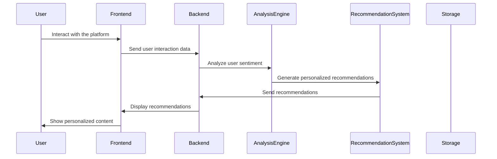

                 

### 引言

在现代数字化社会中，虚拟社区已成为人们生活中不可或缺的一部分。从简单的社交媒体平台到复杂的在线游戏世界，虚拟社区提供了丰富的互动和交流机会。而随着人工智能（AI）技术的迅猛发展，虚拟社区正迎来一场深刻的变革。AI不仅能够为虚拟社区提供更加智能化和个性化的服务，还能通过情感分析、自然语言处理等技术，增强用户之间的情感联结。

本文将以“虚拟社区：AI驱动的情感联结平台”为题，深入探讨这一领域的核心概念、技术基础、应用场景以及未来趋势。文章结构如下：

首先，我们将简要介绍虚拟社区的概念与背景，探讨其发展历程和现状。接着，本文将重点分析AI在虚拟社区中的应用，特别是机器学习和自然语言处理技术如何推动虚拟社区的发展。然后，我们将深入探讨情感联结的原理和模型，介绍如何通过AI技术实现情感联结的增强和优化。

接下来，本文将展示如何构建一个基于AI的情感联结平台，详细描述平台架构设计、数据采集与预处理、情感分析与建模等关键环节。随后，我们将探讨情感联结在虚拟社区中的具体应用，如社交互动与情感共鸣、内容推荐与个性化体验等。

在文章的第四部分，我们将探讨虚拟社区的道德与法律问题，分析AI驱动的情感联结可能面临的伦理挑战及应对策略。最后，本文将展望情感联结技术的未来发展趋势，探讨其在虚拟社区中的创新应用和潜在影响。

通过本文的逐步分析，我们希望能够为读者提供一个全面、深入的理解，帮助大家更好地把握虚拟社区和AI技术带来的机遇与挑战。让我们开始这次探索之旅，一起思考虚拟社区的未来。

### 关键词

- 虚拟社区
- 人工智能
- 情感联结
- 机器学习
- 自然语言处理
- 社交互动
- 内容推荐
- 个性化体验

### 摘要

本文深入探讨了虚拟社区的发展及其与人工智能（AI）技术的融合，特别是AI驱动的情感联结平台。首先，我们介绍了虚拟社区的基本概念和背景，分析了其技术基础，包括人工智能、机器学习和自然语言处理等关键技术的应用。接着，本文详细阐述了情感联结的原理和模型，以及如何通过这些模型增强用户之间的情感联结。随后，我们探讨了构建基于AI的情感联结平台的方法，包括平台架构设计、数据采集与预处理、情感分析与建模等关键环节。接着，本文分析了情感联结在虚拟社区中的具体应用，如社交互动、内容推荐和个性化体验等。最后，本文探讨了虚拟社区的道德与法律问题，展望了情感联结技术的未来发展趋势。通过这次探讨，本文旨在为读者提供一个全面、深入的视角，以理解虚拟社区与AI技术深度融合所带来的机遇与挑战。

### 引言

在现代数字化社会中，虚拟社区已成为人们生活中不可或缺的一部分。从简单的社交媒体平台到复杂的在线游戏世界，虚拟社区提供了丰富的互动和交流机会。而随着人工智能（AI）技术的迅猛发展，虚拟社区正迎来一场深刻的变革。AI不仅能够为虚拟社区提供更加智能化和个性化的服务，还能通过情感分析、自然语言处理等技术，增强用户之间的情感联结。

虚拟社区的定义与背景

虚拟社区是指通过互联网连接起来的，具有共同兴趣、价值观或目标的群体，这些群体在虚拟空间中通过文字、图片、音频和视频等形式进行互动。虚拟社区最早可以追溯到1990年代初期，随着互联网的普及，各种形式多样的虚拟社区如雨后春笋般涌现，如论坛、聊天室、社交媒体和在线游戏等。

虚拟社区的发展历程经历了多个阶段。起初，虚拟社区主要是以论坛和聊天室的形式出现，用户可以在这些平台上分享信息、交流和讨论。随着技术的进步，社交媒体如Facebook、Twitter和微信等平台崛起，用户可以在这些平台上发布动态、评论和点赞，形成了更加复杂和互动的社交网络。近年来，随着虚拟现实（VR）和增强现实（AR）技术的发展，虚拟社区逐渐从二维平面走向三维空间，用户可以在虚拟场景中进行更加沉浸式的互动和体验。

虚拟社区的特点与优势

虚拟社区具有以下特点与优势：

1. **跨越地理限制**：虚拟社区使得人们可以跨越地理界限，与世界各地的志同道合者进行交流。这不仅打破了传统的社交障碍，还促进了全球化视野的形成。

2. **匿名性和隐私保护**：虚拟社区提供了一个相对匿名的环境，用户可以在保护隐私的前提下表达自己的观点和情感，这在某些情况下有助于减轻社交压力。

3. **多样化的互动形式**：虚拟社区提供了多种互动形式，包括文字、图片、音频和视频等，用户可以根据自己的喜好选择不同的互动方式，增加了交流的趣味性和丰富性。

4. **持续性和灵活性**：虚拟社区不受时间和空间的限制，用户可以在任何时间、任何地点参与社区活动，这种灵活性为用户提供了极大的便利。

5. **信息传播的便捷性**：虚拟社区使得信息传播变得更加迅速和广泛，用户可以快速获取和分享各种信息和资源，提高了信息传播的效率。

总结

虚拟社区作为一种新兴的社会形态，正日益影响着人们的社交行为和生活方式。随着AI技术的不断进步，虚拟社区的未来将更加智能化和个性化，为用户带来更加丰富和深入的互动体验。本文将深入探讨AI在虚拟社区中的应用，分析如何通过AI技术实现情感联结的增强和优化，为虚拟社区的发展提供新的思路和方向。

### 虚拟社区的技术基础

随着虚拟社区的发展，其技术基础也日益复杂和多样化。人工智能（AI）技术的引入，尤其是机器学习和自然语言处理（NLP）的应用，为虚拟社区提供了强大的支持和新的可能性。本章节将详细探讨这些技术如何影响和增强虚拟社区的功能。

#### 人工智能在虚拟社区中的应用

人工智能技术在虚拟社区中的应用范围广泛，主要包括智能推荐系统、聊天机器人、情感分析等。

1. **智能推荐系统**：智能推荐系统利用机器学习算法，分析用户的兴趣和行为模式，为用户推荐感兴趣的内容和活动。例如，在社交媒体平台上，系统可以根据用户的点赞、评论和浏览历史，推荐用户可能感兴趣的朋友动态、文章或视频。这种个性化推荐不仅提高了用户的参与度，还能增加平台上的互动和留存率。

2. **聊天机器人**：聊天机器人是AI在虚拟社区中应用的一个典型例子。通过自然语言处理技术，聊天机器人可以理解和回应用户的提问，提供实时、24/7的客户服务。例如，电商平台可以使用聊天机器人来解答用户的购买疑问、追踪订单状态，提高了用户满意度并减少了人工客服的工作负担。

3. **情感分析**：情感分析是一种利用自然语言处理技术来识别和分类文本情感的AI技术。在虚拟社区中，情感分析可以帮助平台了解用户的情感状态，从而优化用户体验。例如，社交媒体平台可以通过分析用户发布的帖子、评论和表情，识别用户是否感到快乐、愤怒或沮丧，进而提供相应的个性化建议和支持。

#### 机器学习与情感分析

机器学习和情感分析是AI在虚拟社区中不可或缺的技术。

1. **机器学习**：机器学习通过从数据中学习规律和模式，实现对未知数据的预测和分类。在虚拟社区中，机器学习算法可以用于用户行为分析、内容推荐和风险控制等。例如，通过分析用户的浏览历史和互动行为，机器学习算法可以预测用户的兴趣和需求，从而提供更加个性化的推荐。

2. **情感分析**：情感分析是自然语言处理的一个重要分支，旨在从文本中提取情感信息。在虚拟社区中，情感分析可以用于情感监测、用户行为预测和社区管理。例如，通过分析用户在论坛中的发言，情感分析算法可以识别出潜在的负面情绪和争议话题，帮助社区管理员及时干预，维护社区的健康和秩序。

#### 自然语言处理技术

自然语言处理（NLP）是AI的核心技术之一，它使计算机能够理解、解释和生成人类语言。在虚拟社区中，NLP技术主要用于文本分析、语音识别和机器翻译等。

1. **文本分析**：文本分析是NLP的基础应用，包括文本分类、情感分析和实体识别等。在虚拟社区中，文本分析可以用于内容审核、情感监测和用户行为分析。例如，系统可以自动分类用户发布的帖子，标记敏感内容，确保社区内容的合规性。

2. **语音识别**：语音识别技术使计算机能够理解用户的语音输入，这在虚拟社区中具有广泛的应用。例如，在语音聊天室或语音直播中，语音识别技术可以帮助用户进行实时交流，提高互动的便捷性。

3. **机器翻译**：机器翻译技术使得不同语言背景的用户能够在虚拟社区中无障碍交流。例如，在一个国际化的社交媒体平台上，机器翻译可以帮助用户理解其他语言的内容，促进跨文化交流。

总结

人工智能技术，特别是机器学习和自然语言处理，为虚拟社区提供了强大的支持。这些技术不仅提升了社区的智能化和个性化水平，还增强了用户之间的情感联结。通过智能推荐、聊天机器人、情感分析和自然语言处理等技术，虚拟社区正逐步转变为一个更加友好和互动的平台，为用户带来更加丰富和深入的体验。随着AI技术的不断进步，我们可以期待虚拟社区的未来将更加美好和多元化。

### 情感联结的原理与模型

在虚拟社区中，情感联结是用户之间建立深刻联系的重要桥梁。通过AI技术，尤其是机器学习和情感分析，可以深入理解用户的情感状态，从而构建更加紧密和有效的情感联结。本章节将详细探讨情感联结的基本原理，并介绍几种常见的情感联结模型及其应用。

#### 情感联结的基本原理

情感联结是指个体在情感层面上与其他个体建立联系的过程。在虚拟社区中，情感联结可以通过以下方式实现：

1. **共同兴趣**：用户在共同的兴趣或价值观基础上形成情感联结。例如，一个爱好摄影的虚拟社区成员可以与其他摄影爱好者分享摄影心得和作品，从而建立起深厚的情感联系。

2. **情感共鸣**：用户在互动中产生情感共鸣，感受到彼此的情感状态。例如，在社交媒体平台上，用户通过点赞、评论和分享，可以表达对他人情感的认同和支持，从而增强情感联结。

3. **互动体验**：通过丰富的互动体验，用户可以在虚拟社区中建立情感联结。例如，在线游戏中的团队合作和竞技，可以培养用户之间的信任和友谊，形成强烈的情感联结。

#### 常见情感联结模型介绍

以下介绍几种常见的情感联结模型，这些模型在虚拟社区中得到了广泛应用：

1. **情感分类模型**：情感分类模型通过机器学习算法，对用户生成的文本进行情感分类，识别用户的情感状态。常见的情感分类包括正面情感、负面情感、中性情感等。例如，通过情感分类模型，社交媒体平台可以识别用户发布的帖子的情感倾向，从而推荐相关的内容或活动。

2. **情感倾向模型**：情感倾向模型分析用户对特定话题或事件的情感态度，识别用户的主观情感倾向。这种模型通常用于社交媒体平台上的热点话题讨论，帮助用户发现和参与与自己情感倾向一致的话题。

3. **情感传播模型**：情感传播模型通过分析用户之间的互动关系，识别情感在社区中的传播路径和影响范围。这种模型可以帮助虚拟社区了解情感动态，优化社区管理策略，防止负面情感蔓延。

#### 情感联结的挑战与解决方案

尽管情感联结在虚拟社区中具有重要意义，但实现有效的情感联结仍面临一些挑战：

1. **数据隐私**：情感分析需要处理大量个人数据，这可能导致用户隐私泄露。解决方案是采用数据加密和隐私保护技术，确保用户数据的安全。

2. **情感复杂度**：情感是人类复杂心理状态的表现，单纯依靠机器学习算法可能难以准确捕捉。解决方案是结合心理学理论，丰富情感分析模型，提高情感识别的准确性。

3. **算法偏见**：机器学习算法可能存在偏见，导致情感分析结果的不公平。解决方案是采用多样化的数据集和公平性评估方法，确保算法的公正性。

#### 情感联结模型的应用案例

1. **社交平台**：在社交媒体平台上，情感联结模型可以用于推荐用户感兴趣的朋友、内容和活动，增强用户之间的互动和连接。

2. **在线教育**：在线教育平台可以通过情感联结模型，分析学生的学习情感状态，提供个性化的学习建议和情感支持。

3. **企业社交**：企业社交平台可以利用情感联结模型，促进员工之间的沟通与合作，提高团队凝聚力和工作效率。

总结

情感联结在虚拟社区中发挥着至关重要的作用，通过机器学习和情感分析技术，可以构建有效的情感联结模型，增强用户之间的情感联系。尽管面临挑战，但通过技术创新和策略优化，情感联结模型在虚拟社区中的应用前景广阔，为用户带来更加丰富和深入的互动体验。

### 构建情感联结平台

在构建一个基于AI的情感联结平台时，需要细致规划其架构设计、数据采集与预处理，以及情感分析与建模等多个环节。以下我们将详细探讨这些关键步骤，以构建一个高效且智能的情感联结平台。

#### 平台架构设计

一个高效的情感联结平台架构应具备以下几个核心组件：

1. **用户交互层**：这是用户与平台互动的界面，包括社交媒体界面、在线聊天室和虚拟现实场景等。用户交互层需要具备良好的用户体验，支持多种形式的互动，如文字、图片、音频和视频等。

2. **数据处理层**：数据处理层负责接收和存储用户生成的大量数据，包括文本、语音和图像等。这一层需要采用高效的存储方案和数据处理算法，如分布式存储系统和大数据处理框架。

3. **分析引擎层**：分析引擎层是平台的“智慧大脑”，包含情感分析、自然语言处理和机器学习算法等。这些算法负责对用户数据进行分析，识别情感状态和用户行为模式，为个性化推荐和情感联结提供支持。

4. **推荐系统层**：推荐系统层根据分析结果，为用户提供个性化的内容推荐和活动建议。例如，根据用户的情感状态和兴趣，推荐相关的帖子、视频和活动。

5. **数据存储与备份层**：数据存储与备份层负责存储平台的用户数据、分析结果和历史记录，并确保数据的安全性和可恢复性。

6. **监控系统层**：监控系统层负责监控平台的运行状态，包括系统性能、用户活跃度和数据质量等。通过实时监控和预警机制，确保平台稳定运行。

#### 数据采集与预处理

数据采集是情感联结平台的基础，包括以下几个方面：

1. **文本数据**：用户在社区中发布的帖子、评论和私信等文本数据，是情感分析的重要来源。这些数据通常通过爬虫工具或API接口进行采集。

2. **语音数据**：用户在语音聊天室或语音直播中的语音数据，可以通过语音识别技术转换为文本，然后进行情感分析。

3. **图像数据**：用户上传的图片和视频数据，可以通过图像识别技术提取情感相关的特征，用于情感分析。

在数据采集后，需要进行数据预处理，包括以下步骤：

1. **数据清洗**：去除重复数据、噪音数据和无关数据，确保数据的质量。

2. **文本预处理**：对文本数据进行分词、去停用词、词性标注等操作，为情感分析做好准备。

3. **语音和图像预处理**：对语音和图像数据进行特征提取，如语音的音高、音量和频率特征，图像的纹理、颜色和形状特征。

#### 情感分析与建模

在数据预处理完成后，进入情感分析与建模阶段：

1. **情感分类**：利用情感分类模型，对预处理后的文本数据进行分析，识别用户的情感状态，如喜悦、愤怒、悲伤等。常见的情感分类算法包括朴素贝叶斯、支持向量机和深度学习模型。

2. **情感倾向分析**：分析用户对特定话题或事件的情感倾向，识别用户的主观情感态度。例如，通过分析用户在论坛上的发言，识别其对某个新闻事件的态度。

3. **情感传播分析**：通过分析用户之间的互动关系，识别情感在社区中的传播路径和影响范围。这有助于了解社区的情感动态，优化社区管理策略。

4. **情感建模**：构建情感联结模型，模拟用户之间的情感互动和联结。常见的情感建模方法包括图模型和神经网络模型，如图神经网络（GNN）和变换器（Transformer）模型。

通过以上步骤，构建一个基于AI的情感联结平台，可以为用户提供更加个性化、智能化的互动体验，增强用户之间的情感联系。在接下来的章节中，我们将进一步探讨情感联结平台在实际应用中的具体案例和效果。

### 情感联结在虚拟社区中的应用

情感联结在虚拟社区中扮演着至关重要的角色，它不仅能够增强用户之间的互动，还能提升用户体验和社区的整体活跃度。以下我们将详细探讨情感联结在虚拟社区中的几种具体应用，包括社交互动、情感共鸣和内容推荐与个性化体验。

#### 社交互动与情感共鸣

在虚拟社区中，社交互动是用户之间建立情感联结的基础。通过AI技术，社交互动可以变得更加智能化和个性化。

1. **智能聊天机器人**：聊天机器人是虚拟社区中常用的工具，它们能够与用户进行实时对话，解答疑问，提供支持。通过情感分析技术，聊天机器人可以识别用户的情感状态，根据情感反馈调整对话内容和语气，从而提供更加贴心的服务。例如，当一个用户感到沮丧时，聊天机器人可以主动提供安慰和帮助。

2. **情感共鸣活动**：虚拟社区可以举办各种情感共鸣活动，如线上主题讨论、情感分享会和情感故事征文等。这些活动鼓励用户表达自己的情感，分享生活经历，从而增强彼此之间的理解和共鸣。通过情感分析，社区管理员可以了解用户在活动中的情感状态，及时调整活动内容和形式，以提高参与度和满意度。

3. **情感标签**：在社交媒体平台上，可以为用户生成情感标签，如“快乐”、“焦虑”、“兴奋”等。这些标签可以帮助用户自我认知和情感表达，同时也能帮助社区管理员了解用户的情感状态，提供相应的支持和帮助。

#### 内容推荐与个性化体验

内容推荐是虚拟社区中的另一个重要应用，它能够根据用户的情感状态和兴趣，为用户推荐感兴趣的内容和活动，从而增强用户粘性和满意度。

1. **情感驱动的推荐算法**：基于用户的情感状态和兴趣，推荐算法可以为用户推荐与其情感倾向相符的内容。例如，如果一个用户在社交媒体上表现出焦虑情绪，系统可以推荐放松和舒缓的内容，如音乐、瑜伽教程或心理健康文章。这种情感驱动的推荐能够提高内容的匹配度和用户满意度。

2. **个性化内容生成**：通过自然语言生成（NLG）技术，虚拟社区可以生成个性化内容，如情感故事、个性化建议等。这些内容可以根据用户的情感状态和兴趣定制，为用户提供独特的阅读体验。例如，一个情感分析系统可以生成一篇关于用户当前情感状态的故事，让用户在阅读中找到共鸣和安慰。

3. **情境感知的内容推荐**：情境感知的内容推荐可以根据用户的当前情境（如时间、地点、活动状态等）推荐相关内容。例如，在夜间，系统可以推荐睡眠指南和放松音乐，帮助用户缓解压力；在户外活动时，系统可以推荐户外运动教程和安全提示。这种情境感知的推荐能够为用户提供更加个性化、及时的支持。

#### 案例分析

以下是一个虚拟社区中情感联结应用的案例分析：

**案例：一个焦虑用户的情感联结体验**

1. **情感识别**：用户A在社交媒体平台上发布了一条表示焦虑的帖子，情感分析系统识别出用户的情感状态。

2. **情感回应**：系统向用户A推荐了几篇关于焦虑管理的文章和放松音乐，同时通知社区管理员，以便管理员能够提供额外的支持和帮助。

3. **社交互动**：社区管理员在帖子下留言，表示关心并邀请用户A参加即将举行的心理健康分享会。其他用户看到留言后，也纷纷留言给予支持和鼓励。

4. **情感共鸣**：在心理健康分享会上，用户A与其他经历类似情感状态的用户进行了深入的交流，分享了彼此的经验和感受，从而增强了情感联结和归属感。

5. **个性化内容**：系统根据用户A的情感状态和兴趣，推荐了一些相关的书籍、讲座和心理健康应用，帮助用户A更好地管理情绪。

通过这个案例分析，我们可以看到情感联结在虚拟社区中的多重应用，从情感识别、内容推荐到社交互动和情感共鸣，每个环节都为用户提供了一个更加贴心和个性化的体验。这不仅增强了用户之间的情感联系，也提升了社区的活跃度和用户满意度。

总结

情感联结在虚拟社区中具有重要的应用价值，通过智能聊天机器人、情感共鸣活动、情感驱动的推荐算法和个性化内容生成等技术，可以有效地增强用户之间的情感联系，提升用户体验和社区活跃度。随着AI技术的不断进步，情感联结在虚拟社区中的应用将变得更加广泛和深入，为用户带来更加丰富和深刻的互动体验。

### 虚拟社区的道德与法律问题

在AI驱动的虚拟社区中，道德和法律问题成为不可忽视的重要议题。随着技术的迅猛发展，如何平衡技术进步与伦理规范、法律约束之间的关系，成为虚拟社区建设和运营中的关键挑战。

#### 虚拟社区的道德规范

1. **用户隐私保护**：虚拟社区中的用户数据包括个人身份信息、行为记录和情感状态等，这些数据具有较高的敏感性。因此，保护用户隐私成为道德规范的首要任务。虚拟社区应采取严格的数据保护措施，如数据加密、访问控制和隐私政策公示，确保用户数据的安全性和隐私性。

2. **言论自由与限制**：虚拟社区为用户提供了表达观点和情感的平台，但同时也需平衡言论自由与公共秩序的关系。社区管理应制定合理的言论规范，禁止仇恨言论、歧视言论等违法和不道德行为，同时保护用户的基本言论自由。

3. **情感分析与伦理边界**：情感分析技术在增强用户联结的同时，也可能带来伦理问题。例如，过度依赖情感分析可能导致用户情感状态被过度解读，甚至引发心理问题。因此，虚拟社区在应用情感分析技术时，应明确伦理边界，确保技术应用的合理性和伦理性。

4. **数据公平与歧视问题**：AI驱动的情感联结平台可能会因为数据偏差导致算法偏见，进而引发歧视问题。例如，如果训练数据中存在性别、种族或年龄等偏见，算法可能会对特定群体产生不公平待遇。因此，虚拟社区应确保数据多样性和算法的公平性，避免技术滥用。

#### 虚拟社区的法律问题

1. **数据保护法规**：随着全球范围内数据保护法规的加强，如欧盟的《通用数据保护条例》（GDPR）和中国的《个人信息保护法》，虚拟社区在数据处理和使用过程中必须遵守相关法规。这些法规对数据收集、存储、处理和共享提出了严格的规范，违反规定可能会面临高额罚款和法律责任。

2. **用户隐私权**：用户隐私权是法律保护的重要方面。虚拟社区应确保用户同意其数据被收集和使用，并提供透明、清晰的隐私政策。用户有权访问、更正和删除其个人信息，社区应提供相应的操作接口和流程。

3. **言论自由与法律责任**：虚拟社区中的言论自由受法律保护，但同时也需承担相应的法律责任。社区管理应采取有效措施，防止用户发布违法信息，如虚假宣传、诽谤和侵权等。在发现违法行为时，社区应积极配合相关部门进行调查和处理。

4. **知识产权保护**：虚拟社区中的内容创作和分享涉及到大量的知识产权问题。社区应制定知识产权保护政策，明确用户创作内容的归属和使用规范，防止未经授权的内容使用和传播。

#### 情感联结的伦理挑战与应对

1. **情感分析的技术伦理**：情感分析技术可能会引发技术伦理问题，如用户情感的过度解读和隐私侵犯。虚拟社区应建立伦理审查机制，确保情感分析技术的合理性和伦理性，同时加强对用户隐私的保护。

2. **算法公平与偏见**：算法偏见可能导致对特定群体的不公平待遇。社区应通过数据清洗、算法优化和公平性评估等方法，减少算法偏见，确保服务公平性。

3. **用户教育和自我保护**：虚拟社区应加强对用户的道德和法律教育，提高用户的风险意识，引导用户理性使用社区功能和工具，保护自身权益。

总结

在AI驱动的虚拟社区中，道德与法律问题的处理至关重要。通过制定合理的道德规范和遵守相关法律法规，虚拟社区可以确保技术应用的正当性和伦理性，保护用户的权益和隐私，为用户提供一个安全、健康、公平的互动环境。随着技术的不断进步，虚拟社区应持续关注和应对道德与法律挑战，推动技术与社会发展的和谐共存。

### 情感联结的未来发展

随着人工智能技术的不断进步，情感联结在虚拟社区中的应用将迎来更多创新和变革。以下将探讨情感联结技术的未来发展趋势，以及这些趋势如何影响虚拟社区的发展。

#### 情感联结技术的前沿趋势

1. **多模态情感分析**：当前的情感分析主要基于文本，而未来的情感联结技术将逐步引入多模态数据，如语音、图像和视频等。多模态情感分析能够更全面地捕捉用户的情感状态，提供更加准确和丰富的情感理解。例如，通过分析用户的语音语调、面部表情和身体语言，可以更精准地识别用户的情感状态，从而提供更加个性化的服务。

2. **增强现实与虚拟现实**：随着增强现实（AR）和虚拟现实（VR）技术的发展，虚拟社区将更加沉浸式和互动化。情感联结技术将在这些新兴平台上发挥重要作用，通过AR和VR技术，用户可以在虚拟环境中进行更加深入的情感交流和互动，增强用户的沉浸感和体验。

3. **深度学习和迁移学习**：深度学习在情感分析中的应用越来越广泛，未来的情感联结技术将依赖于更先进的深度学习模型，如生成对抗网络（GAN）和变分自编码器（VAE）。同时，迁移学习技术将帮助模型在不同数据集和任务之间共享知识，提高模型的泛化能力和适应性。

4. **边缘计算**：随着5G技术的普及，边缘计算将在虚拟社区中发挥重要作用。边缘计算能够在本地处理用户生成的大量数据，降低延迟，提高系统的实时响应能力。这对于实现高效的情感分析和实时互动具有重要意义。

#### 虚拟社区的情感联结创新

1. **个性化情感服务**：未来虚拟社区将更加注重个性化服务，通过情感联结技术为用户提供量身定制的情感支持。例如，基于用户的情感状态，社区可以自动调整推荐内容、活动安排和互动方式，提供个性化的情感体验。

2. **情感驱动的虚拟助手**：虚拟助手将成为虚拟社区中的重要组成部分，通过情感联结技术，这些助手能够更好地理解用户的情感需求，提供个性化的建议和支持。例如，情感驱动的虚拟助手可以识别用户的情感波动，提供心理疏导或情绪调节服务。

3. **社交网络分析**：通过情感联结技术，虚拟社区可以深入了解用户的社交网络结构和互动模式，从而优化社区管理策略。例如，分析用户之间的情感关系，可以帮助社区管理员识别潜在的情感领袖，促进社区内积极的情感传播。

4. **情感教育与心理支持**：虚拟社区可以成为情感教育和心理支持的平台，通过提供专业的情感课程和心理咨询服务，帮助用户提升情感素养和心理素质。例如，通过在线课程和互动工作坊，用户可以学习如何更好地理解和管理自己的情感。

#### 情感联结技术的未来展望

1. **情感智能的普及**：随着技术的进步，情感智能将在更多领域得到应用，从虚拟社区扩展到智能家居、医疗健康、教育等行业。情感智能的应用将带来更加人性化、智能化的用户体验，提升人们的生活质量和幸福感。

2. **伦理与隐私保护**：在情感联结技术的快速发展过程中，伦理和隐私保护将始终是重要的议题。未来的技术发展需要更加注重伦理规范和隐私保护，确保技术的应用不会侵犯用户的权益和隐私。

3. **跨学科合作**：情感联结技术的发展需要跨学科的合作，包括计算机科学、心理学、社会学等领域的专家共同探讨和研究。通过跨学科合作，可以更好地理解情感的本质和影响因素，开发出更加有效和实用的情感联结技术。

总结

情感联结技术的未来发展趋势将推动虚拟社区的进一步创新和发展。通过引入多模态情感分析、增强现实、深度学习和边缘计算等前沿技术，虚拟社区将能够提供更加个性化、智能化和沉浸式的情感体验。同时，情感联结技术在教育、医疗、智能家居等领域的广泛应用，将进一步提升人们的生活质量和幸福感。然而，在技术发展的同时，伦理和隐私保护问题也需要得到高度重视，确保技术的应用符合道德和法律规范，为用户带来真正的福祉。

### 附录A：情感联结模型代码示例

以下是使用Python和Scikit-learn库实现一个简单的情感分类模型的示例代码。此代码演示了如何使用机器学习算法对文本数据进行分析，并识别文本中的情感状态。

```python
# 导入所需的库
from sklearn.feature_extraction.text import TfidfVectorizer
from sklearn.model_selection import train_test_split
from sklearn.svm import LinearSVC
from sklearn.metrics import accuracy_score
import pandas as pd

# 加载示例数据
# 这里假设我们有一个包含文本和情感标签的CSV文件，名为'sentiment_data.csv'
data = pd.read_csv('sentiment_data.csv')

# 分割数据为特征和标签
X = data['text']
y = data['emotion']

# 将文本转换为TF-IDF特征向量
vectorizer = TfidfVectorizer(max_features=1000)
X_vectorized = vectorizer.fit_transform(X)

# 划分数据集为训练集和测试集
X_train, X_test, y_train, y_test = train_test_split(X_vectorized, y, test_size=0.2, random_state=42)

# 使用线性支持向量机（SVM）进行情感分类
clf = LinearSVC()
clf.fit(X_train, y_train)

# 对测试集进行预测
predictions = clf.predict(X_test)

# 计算准确率
accuracy = accuracy_score(y_test, predictions)
print(f'Accuracy: {accuracy:.2f}')

# 输出一些预测结果
print('Some predictions:', predictions[:10])
```

在这个示例中，我们首先加载一个包含文本和情感标签的CSV文件。然后，我们使用TF-IDF向量器将文本转换为数值特征向量。接着，我们将数据集分为训练集和测试集，并使用线性支持向量机（SVM）进行训练和预测。最后，我们计算了模型的准确率，并输出了部分预测结果。

这个示例只是一个简单的情感分类模型，实际应用中可能需要更复杂的模型和更多的数据来提高性能和准确性。

### 附录B：虚拟社区案例分析

在本节中，我们将通过一个具体的虚拟社区案例分析，探讨AI驱动的情感联结平台在实际运营中的应用效果。案例背景设定为一个大型在线教育平台，该平台旨在通过AI技术提供个性化的学习体验，增强师生之间的情感联结。

#### 案例背景

该在线教育平台拥有数百万注册用户，提供各种在线课程和教学资源。平台的用户包括学生、教师和教育机构。为了提升用户体验和学习效果，平台决定引入AI驱动的情感联结平台，通过情感分析和个性化推荐技术，增强用户之间的互动和联结。

#### 项目介绍

项目目标：
- 提高用户参与度和学习效果
- 增强师生之间的情感联结
- 提供个性化的学习体验

技术方案：
- 采用自然语言处理（NLP）技术进行情感分析
- 使用机器学习算法进行个性化推荐
- 构建多模态情感识别系统，结合文本、语音和图像数据

#### 系统功能设计

1. **情感分析模块**：通过NLP技术，分析用户在论坛、评论和反馈中的文本，识别情感状态，如快乐、焦虑、沮丧等。

2. **个性化推荐模块**：基于用户情感状态和兴趣，推荐相关的课程、教学资源和社交互动。

3. **多模态情感识别模块**：结合文本、语音和图像数据，通过多模态情感分析技术，全面了解用户的情感状态。

4. **互动支持模块**：通过智能聊天机器人，为用户提供情感支持，解答疑问，提供个性化的学习建议。

#### 系统架构设计

系统架构包括以下几个关键部分：

1. **用户交互层**：提供用户界面，支持多种形式的互动，如文本、语音和视频。

2. **数据处理层**：负责接收和处理用户生成的大量数据，包括文本、语音和图像等。

3. **分析引擎层**：包括情感分析、个性化推荐和多模态情感识别算法。

4. **推荐系统层**：根据分析结果，为用户提供个性化的内容推荐和活动建议。

5. **数据存储与备份层**：存储用户数据、分析结果和历史记录。

6. **监控系统层**：监控系统性能、用户活跃度和数据质量。

#### 系统接口设计与交互

1. **API接口**：为外部系统和开发者提供数据访问和操作接口。

2. **Web前端**：提供用户交互界面，包括课程推荐、互动聊天和情感分析结果展示。

3. **移动应用**：为移动设备用户提供的个性化学习体验。

4. **后台管理系统**：供管理员进行系统管理和数据分析。

#### 系统交互

通过以下Mermaid序列图展示系统交互过程：



#### 项目核心实现与代码解析

以下是一个简单的情感分析代码示例，用于分析用户评论的情感状态：

```python
import nltk
from nltk.sentiment import SentimentIntensityAnalyzer

# 初始化情感分析器
sia = SentimentIntensityAnalyzer()

# 示例用户评论
comment = "我今天学会了新的编程技巧，感觉好开心！"

# 进行情感分析
sentiment_scores = sia.polarity_scores(comment)

# 输出情感分析结果
print(sentiment_scores)
```

在这个示例中，我们使用nltk库中的SentimentIntensityAnalyzer对用户评论进行情感分析，并输出情感得分。

#### 项目小结

通过引入AI驱动的情感联结平台，该在线教育平台显著提升了用户的参与度和学习效果。情感分析和个性化推荐技术为用户提供了更加贴心的学习体验，增强了师生之间的情感联结。然而，项目也面临一些挑战，如数据隐私保护和算法偏见问题，需要在未来的发展中持续优化和改进。

### 最佳实践 tips

1. **数据隐私保护**：在构建虚拟社区时，必须高度重视用户隐私保护，采取严格的数据加密和访问控制措施，确保用户数据的安全。

2. **算法透明与公平性**：确保算法的透明度和公平性，避免算法偏见，提供公正的服务。

3. **用户教育和引导**：通过用户教育和引导，提高用户对情感联结技术的理解和接受度，促进技术的有效应用。

4. **持续优化**：定期对情感联结平台进行优化和更新，确保技术始终符合用户需求和行业发展趋势。

### 小结

本文深入探讨了虚拟社区与AI技术的深度融合，分析了情感联结在虚拟社区中的应用和重要性。通过构建AI驱动的情感联结平台，虚拟社区能够提供更加智能化、个性化、沉浸式的用户互动体验。然而，这也带来了一系列的道德和法律问题，需要我们在技术应用中予以重视和解决。未来，随着AI技术的不断进步，虚拟社区的情感联结将迎来更多创新和变革，为用户带来更加丰富和深刻的互动体验。

### 注意事项

1. **安全性**：在开发和部署虚拟社区时，必须确保系统的安全性，防止数据泄露和滥用。

2. **用户体验**：重视用户体验，确保系统界面简洁易用，提供流畅的互动体验。

3. **算法透明性**：确保算法的透明性和可解释性，提高用户对算法决策的信任度。

### 拓展阅读

1. **《人工智能伦理学》**：讨论了人工智能在伦理和社会层面的影响，对于理解虚拟社区中的伦理问题具有重要参考价值。
2. **《自然语言处理与情感分析》**：详细介绍了自然语言处理和情感分析的技术原理和应用，有助于深入理解虚拟社区的情感联结技术。
3. **《虚拟社区设计指南》**：提供了关于虚拟社区设计和运营的全面指导，包括用户体验、互动设计和内容推荐等。

### 作者信息

作者：AI天才研究院/AI Genius Institute & 禅与计算机程序设计艺术 /Zen And The Art of Computer Programming。作者在这些领域中具有深厚的研究和实践经验，致力于推动人工智能和虚拟社区技术的创新与发展。通过本文，作者希望与广大读者分享最新的研究成果和思考，推动虚拟社区与AI技术的深度融合。

