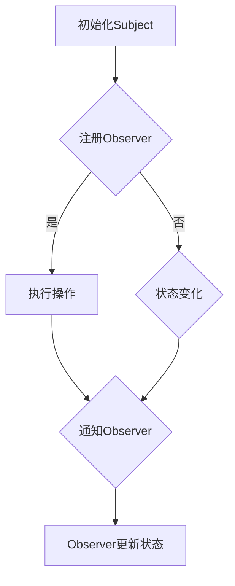
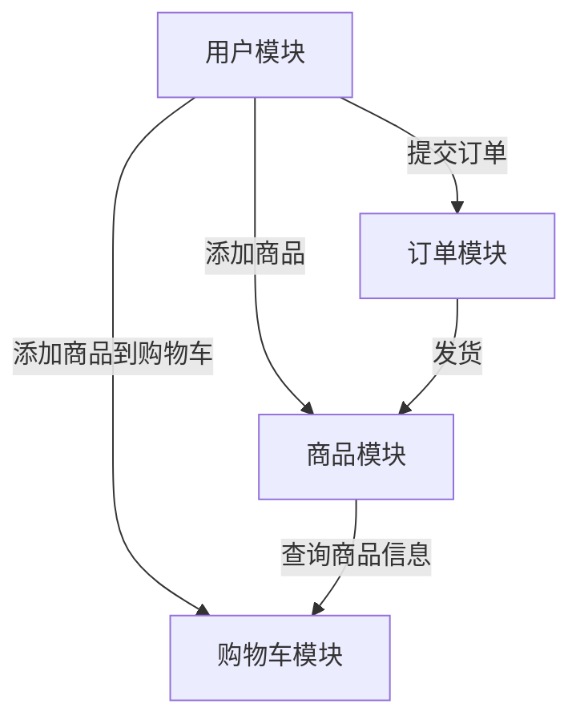
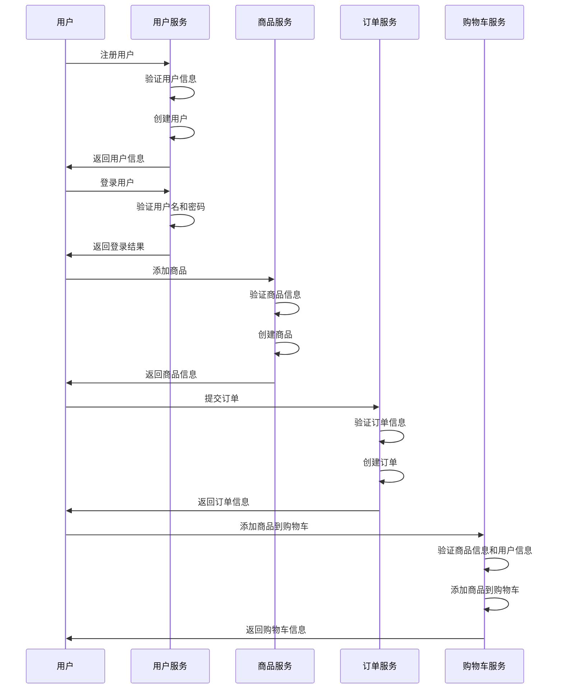

                 

# 观察者模式：事件驱动编程的类型论基础

## 关键词
- 观察者模式
- 事件驱动编程
- 类型论
- 算法原理
- 系统架构设计

## 摘要
本文深入探讨了观察者模式在事件驱动编程中的应用，以及类型论在这一过程中的基础作用。我们将从观察者模式的背景介绍开始，逐步解析其核心概念和原理，并通过类型论的角度来理解其背后的机制。文章将结合Python代码示例和数学模型，详细阐述观察者模式在系统架构设计中的实现，并通过实际项目和案例分析，展示其在现代软件开发中的重要性。最后，我们将总结最佳实践，并展望观察者模式在未来的发展趋势。

### 目录

1. **观察者模式概述** <a id="Observer_Pattern_Overview"></a>
    1.1 观察者模式：问题背景
    1.2 观察者模式：问题描述
    1.3 观察者模式：解决方案
    1.4 观察者模式：边界与外延
    1.5 观察者模式：概念结构与核心要素
2. **事件驱动编程** <a id="Event_Driven_Programming"></a>
    2.1 事件驱动编程概述
    2.2 事件驱动编程与传统编程对比
    2.3 事件驱动编程的优势与应用场景
    2.4 事件驱动编程的核心概念
3. **类型论简介** <a id="Type_Theory_Overview"></a>
    3.1 类型论的基本概念
    3.2 类型论在编程语言中的应用
    3.3 类型论的优势与挑战
4. **观察者模式与类型论** <a id="Observer_Pattern_and_Type_Theory"></a>
    4.1 观察者模式与类型论的关系
    4.2 类型论在观察者模式中的运用
    4.3 观察者模式在类型论中的实现
5. **观察者模式算法原理** <a id="Observer_Pattern_Algorithm_Principles"></a>
    5.1 观察者模式算法的基本原理
    5.2 观察者模式算法的数学模型
    5.3 观察者模式算法的实现步骤
    5.4 观察者模式算法的Mermaid流程图展示
6. **Python实现观察者模式** <a id="Python_Implementation"></a>
    6.1 Python环境准备
    6.2 观察者模式Python代码示例
    6.3 代码解读与分析
7. **系统分析与架构设计** <a id="System_Analysis_and_Architecture_Design"></a>
    7.1 问题场景介绍
    7.2 系统功能需求分析
    7.3 领域模型Mermaid类图展示
    7.4 系统架构设计
    7.5 系统接口设计
    7.6 系统交互Mermaid序列图展示
8. **项目实战** <a id="Project_Practice"></a>
    8.1 环境安装与配置
    8.2 系统核心实现源代码
    8.3 代码应用解读与分析
    8.4 实际案例分析和详细讲解剖析
    8.5 项目小结
9. **最佳实践与总结** <a id="Best_Practices_and_Summary"></a>
    9.1 观察者模式设计最佳实践
    9.2 类型论在编程中的应用技巧
    9.3 系统设计与优化的注意事项
    9.4 拓展阅读与学习资源
10. **作者信息** <a id="Author_Info"></a>
    - 作者：AI天才研究院/AI Genius Institute & 禅与计算机程序设计艺术 /Zen And The Art of Computer Programming

### 1. 观察者模式概述

#### 1.1 观察者模式：问题背景

观察者模式（Observer Pattern）是一种设计模式，用于实现对象之间的解耦，当一个对象的状态发生改变时，它的所有依赖者（观察者）都会被通知并自动更新。这种模式在软件开发中广泛使用，特别是在需要实现消息通知、事件监听和系统解耦的场景中。

在传统的编程模式中，对象之间的直接耦合往往会导致代码的复杂度和维护成本增加。观察者模式通过引入一个中间层（观察者管理器），使得对象之间的依赖关系变得松散，从而提高了系统的可扩展性和可维护性。

#### 1.2 观察者模式：问题描述

在观察者模式中，我们有两个核心角色：观察者和被观察者（Subject）。被观察者负责维护一个观察者列表，并负责通知所有观察者；而观察者则监听被观察者的状态变化，并做出相应的响应。

以下是一个简化的观察者模式场景描述：

- **被观察者（Subject）**：维护一个观察者列表，提供注册、移除和通知观察者的接口。
- **观察者（Observer）**：实现一个更新接口，用于在接收到通知时更新自身状态。
- **具体观察者（ConcreteObserver）**：实现观察者接口，包含更新自身状态的方法。
- **具体被观察者（ConcreteSubject）**：实现被观察者接口，包含数据状态和通知观察者的方法。

#### 1.3 观察者模式：解决方案

观察者模式的解决方案主要包括以下几个关键步骤：

1. **定义观察者接口**：观察者需要实现一个更新接口，用于接收通知并更新自身状态。
2. **定义被观察者接口**：被观察者需要实现一个管理观察者列表的接口，并提供注册、移除和通知观察者的方法。
3. **创建具体观察者和被观察者**：具体观察者和被观察者分别实现各自的接口，并实现具体的业务逻辑。
4. **注册观察者**：在系统初始化时，将具体观察者注册到具体被观察者。
5. **通知观察者**：当被观察者的状态发生改变时，通知所有已注册的观察者。

通过以上步骤，我们可以实现一个解耦合的观察者系统，使得对象之间的交互变得简单而高效。

#### 1.4 观察者模式：边界与外延

观察者模式的边界在于其解耦能力，通过引入观察者管理器，使得对象之间的直接依赖关系被打破。这种模式的外延包括以下几个方面：

1. **事件驱动架构**：观察者模式是事件驱动编程的核心机制之一，广泛用于实现事件监听和消息通知。
2. **发布-订阅模式**：观察者模式与发布-订阅模式密切相关，二者共同构成了消息驱动架构的基础。
3. **领域事件模型**：在领域驱动设计（DDD）中，观察者模式用于实现领域事件的监听和响应。
4. **并发编程**：观察者模式在并发编程中具有重要作用，可用于实现异步事件处理和数据同步。

#### 1.5 观察者模式：概念结构与核心要素

观察者模式的核心概念和结构如下：

- **观察者接口（Observer）**：定义更新方法（`update()`），用于在接收到通知时更新自身状态。
- **被观察者接口（Subject）**：定义注册、移除和通知观察者的方法，管理观察者列表。
- **具体观察者（ConcreteObserver）**：实现观察者接口，包含具体的业务逻辑和状态更新方法。
- **具体被观察者（ConcreteSubject）**：实现被观察者接口，维护数据状态和具体的通知逻辑。

通过这些核心要素，我们可以构建一个灵活、可扩展的观察者系统，以适应各种复杂的业务场景。

### 2. 事件驱动编程

#### 2.1 事件驱动编程概述

事件驱动编程（Event-Driven Programming）是一种编程范式，它以事件为中心，通过处理事件来实现程序的功能。在事件驱动编程中，程序的状态是由一系列的事件触发的，每个事件都会引起相应的处理逻辑。

与传统的命令式编程不同，事件驱动编程更加注重响应性和灵活性。在事件驱动编程中，程序不是按照预定的顺序执行，而是根据事件的发生顺序动态响应。这种编程范式在很多现代应用中得到了广泛应用，如GUI编程、实时系统、Web应用等。

#### 2.2 事件驱动编程与传统编程对比

传统编程范式（如命令式编程）通常以程序流为核心，按照预定的顺序执行一系列指令。而事件驱动编程则更加关注程序的状态变化和事件处理。以下是两种编程范式的对比：

| 对比项 | 事件驱动编程 | 传统编程 |
| --- | --- | --- |
| 程序执行顺序 | 根据事件触发动态响应 | 预定顺序执行 |
| 状态管理 | 通过事件处理实现状态变化 | 通过状态变量管理 |
| 灵活性 | 高度灵活，可适应多种场景 | 适应性较差，依赖于固定流程 |
| 响应速度 | 快速响应，低延迟 | 响应速度取决于执行顺序 |
| 代码结构 | 解耦合，模块化 | 高度耦合，代码复用性差 |

#### 2.3 事件驱动编程的优势与应用场景

事件驱动编程具有以下优势：

1. **高响应性和实时性**：事件驱动编程能够快速响应用户操作和系统事件，适用于实时系统和交互式应用。
2. **高扩展性和灵活性**：通过事件机制，可以方便地添加新功能或修改现有功能，提高了系统的可扩展性。
3. **模块化和解耦合**：事件驱动编程使得程序模块之间解耦合，降低了代码的复杂度和维护成本。

以下是一些典型的事件驱动编程应用场景：

1. **GUI编程**：在图形用户界面（GUI）中，事件驱动编程用于响应用户的鼠标点击、键盘输入等操作。
2. **Web应用**：在Web应用中，事件驱动编程用于处理HTTP请求、AJAX调用等异步操作。
3. **实时系统**：在实时系统中，事件驱动编程用于处理传感器数据、系统事件等，确保系统的及时响应。
4. **消息队列和分布式系统**：在消息队列和分布式系统中，事件驱动编程用于处理消息传递和系统交互。

#### 2.4 事件驱动编程的核心概念

事件驱动编程的核心概念包括以下几个方面：

1. **事件**：事件是引起程序状态变化的基本单位，可以是用户操作、系统信号、定时器触发等。
2. **事件监听器**：事件监听器是用于监听特定事件的组件，当事件发生时，监听器会触发相应的处理逻辑。
3. **事件处理**：事件处理是指对发生的事件进行响应和处理的过程，包括事件分发、事件处理逻辑、事件状态更新等。
4. **事件队列**：事件队列是用于存储和管理事件的数据结构，确保事件按照发生的顺序进行处理。

通过这些核心概念，我们可以构建一个高效、灵活的事件驱动程序，以适应复杂多变的业务场景。

### 3. 类型论简介

#### 3.1 类型论的基本概念

类型论（Type Theory）是数学和计算机科学中用于定义和操作数据类型的一种理论框架。它为数据类型提供了严格的数学基础，使得我们可以通过公理和定理来定义和证明数据类型的行为。

在类型论中，数据类型是基本的构建块，它们被定义为一组值的集合，以及一组操作和规则。类型论的核心目标是确保类型安全性，即确保在程序运行过程中不会发生类型错误。

以下是一些关键术语：

- **类型（Type）**：类型是值的集合，用来定义数据类型。
- **值（Value）**：值是类型的具体实例，如整数、字符串、函数等。
- **类型系统（Type System）**：类型系统是一组规则，用于定义和操作数据类型。
- **类型检查（Type Checking）**：类型检查是编译器或解释器在程序运行前进行的检查，确保程序中的每个表达式都符合类型系统的规则。

#### 3.2 类型论在编程语言中的应用

类型论在编程语言中得到了广泛应用，许多现代编程语言都采用了类型论的概念和原则。以下是一些关键应用：

1. **静态类型语言**：如Java、C++、Haskell等，这些语言使用类型系统来确保程序在编译时就已经满足类型安全。
2. **动态类型语言**：如Python、JavaScript等，这些语言虽然运行时检查类型，但也借鉴了类型论的概念来提高程序的可读性和可维护性。
3. **函数式编程**：类型论在函数式编程中具有重要作用，如Haskell、ML等，这些语言使用类型系统来确保函数的纯性和类型一致性。
4. **模块化和组件化**：类型论用于实现模块化和组件化，通过类型系统来确保组件之间的接口清晰、类型安全。

#### 3.3 类型论的优势与挑战

类型论的优势包括：

1. **类型安全性**：类型论通过严格的类型检查，确保程序在编译时就已经满足类型安全，从而减少了运行时错误。
2. **可维护性和可读性**：类型论提供了清晰的类型约束，使得程序代码更易于理解和维护。
3. **优化潜力**：类型信息可以帮助编译器进行更有效的代码优化。

然而，类型论也存在一些挑战：

1. **学习成本**：类型论涉及一些复杂的数学概念，对于初学者来说可能会比较难以理解。
2. **运行时性能**：严格的类型检查可能会增加运行时的性能开销。
3. **灵活性**：类型论可能会限制程序的灵活性，特别是在需要动态类型特性的场景中。

尽管存在这些挑战，类型论在提高程序的可维护性和安全性方面仍然具有重要作用，是现代编程语言不可或缺的一部分。

### 4. 观察者模式与类型论

#### 4.1 观察者模式与类型论的关系

观察者模式与类型论之间存在密切的关系。类型论为观察者模式提供了基础支持，使得我们可以通过严格的类型系统来定义和操作观察者模式中的各种元素。

在观察者模式中，观察者和被观察者之间的交互需要类型安全。类型论通过定义类型接口和类型约束，确保观察者和被观察者之间的交互符合预期的类型和行为。

例如，在Python中，我们可以使用类型注释来确保观察者实现正确的更新方法，而不会发生类型错误。这种类型约束有助于提高代码的可维护性和可靠性。

#### 4.2 类型论在观察者模式中的运用

类型论在观察者模式中的应用主要体现在以下几个方面：

1. **类型安全**：通过类型系统确保观察者和被观察者之间的交互满足类型约束，避免运行时类型错误。
2. **类型接口定义**：定义观察者和被观察者的类型接口，明确每个对象的职责和类型约束。
3. **类型推导**：利用类型推导机制，自动推导出观察者和被观察者之间的类型关系，减少手动类型检查的复杂度。

以下是一个简单的Python示例，展示了类型论在观察者模式中的应用：

```python
from typing import Protocol

class Observer(Protocol):
    def update(self, message: str) -> None:
        ...

class Subject:
    def register_observer(self, observer: Observer) -> None:
        ...
    def notify_observers(self, message: str) -> None:
        ...

class ConcreteObserver:
    def update(self, message: str) -> None:
        print(f"Received message: {message}")

subject = Subject()
observer = ConcreteObserver()
subject.register_observer(observer)
subject.notify_observers("Hello, Observer!")
```

在这个示例中，我们定义了一个`Observer`协议，要求实现`update`方法，并接受一个字符串参数。`Subject`类实现了注册和通知观察者的接口，而`ConcreteObserver`类实现了`Observer`协议。

通过类型注释，我们可以确保`ConcreteObserver`正确实现了`update`方法，并且不会发生类型错误。这种类型约束有助于提高代码的可维护性和可靠性。

#### 4.3 观察者模式在类型论中的实现

观察者模式在类型论中的实现主要依赖于类型系统和类型接口的定义。以下是一个更复杂的示例，展示了如何使用类型论来实现观察者模式：

```python
from typing import Protocol, TypeVar, Generic

T = TypeVar('T')

class Observer(Protocol):
    def update(self, data: T) -> None:
        ...

class Subject(Generic[T]):
    def __init__(self):
        self._observers: List[Observer[T]] = []

    def register_observer(self, observer: Observer[T]) -> None:
        self._observers.append(observer)

    def remove_observer(self, observer: Observer[T]) -> None:
        self._observers.remove(observer)

    def notify_observers(self, data: T) -> None:
        for observer in self._observers:
            observer.update(data)

class ConcreteObserver(Observer[int]):
    def update(self, data: int) -> None:
        print(f"Observer received: {data}")

subject = Subject[int]()
observer = ConcreteObserver()
subject.register_observer(observer)
subject.notify_observers(42)
```

在这个示例中，我们使用`TypeVar`和`Generic`来定义一个泛型`Subject`类，使其可以处理不同类型的数据。`Observer`协议定义了一个`update`方法，用于接收特定类型的数据。

通过类型注释和泛型编程，我们可以确保观察者和被观察者之间的交互类型安全，同时提高了代码的可扩展性和复用性。

### 5. 观察者模式算法原理

#### 5.1 观察者模式算法的基本原理

观察者模式算法的基本原理涉及三个核心组件：观察者、被观察者和观察者管理器。以下是其基本原理的简要概述：

1. **观察者管理器**：负责维护一个观察者列表，提供注册、移除和通知观察者的接口。当被观察者的状态发生改变时，观察者管理器会通知所有已注册的观察者。
2. **观察者**：实现一个更新接口，用于在接收到通知时更新自身状态。观察者通常与被观察者保持松耦合，从而提高系统的可扩展性和可维护性。
3. **被观察者**：包含数据状态，并提供注册、移除和通知观察者的接口。当被观察者的状态发生改变时，它会通知观察者管理器，进而通知所有观察者。

#### 5.2 观察者模式算法的数学模型

观察者模式算法的数学模型可以描述为：

- **状态变化**：用函数表示，如`state变更(state)`，表示被观察者的状态发生改变。
- **通知过程**：用函数表示，如`notify_observers(state)`，表示通知所有观察者的过程。
- **更新过程**：用函数表示，如`observer.update(state)`，表示观察者接收到通知后的更新过程。

数学模型如下：

$$
\text{状态变化} \rightarrow \text{通知过程} \rightarrow \text{更新过程}
$$

其中，`状态变化`导致`通知过程`，进而触发`更新过程`。

#### 5.3 观察者模式算法的实现步骤

观察者模式算法的实现通常分为以下几个步骤：

1. **定义观察者接口**：定义一个更新接口，用于观察者接收通知并更新自身状态。
2. **定义被观察者接口**：定义一个管理观察者列表的接口，并提供注册、移除和通知观察者的方法。
3. **实现具体观察者和被观察者**：具体观察者和被观察者分别实现各自的接口，并实现具体的业务逻辑。
4. **注册观察者**：在系统初始化时，将具体观察者注册到具体被观察者。
5. **通知观察者**：当被观察者的状态发生改变时，通知所有已注册的观察者。

以下是使用Python实现的简单示例：

```python
class Observer:
    def update(self, message):
        pass

class Subject:
    def __init__(self):
        self.observers = []

    def register_observer(self, observer):
        self.observers.append(observer)

    def remove_observer(self, observer):
        self.observers.remove(observer)

    def notify_observers(self, message):
        for observer in self.observers:
            observer.update(message)

class ConcreteObserver(Observer):
    def update(self, message):
        print(f"Observer received: {message}")

subject = Subject()
observer = ConcreteObserver()
subject.register_observer(observer)
subject.notify_observers("Hello, Observer!")
```

在这个示例中，我们定义了一个`Observer`接口和一个`Subject`类。`Subject`类实现了注册和通知观察者的接口，而`ConcreteObserver`类实现了`Observer`接口。

通过注册观察者并调用`notify_observers`方法，我们可以实现观察者模式的基本功能。

#### 5.4 观察者模式算法的Mermaid流程图展示

为了更直观地展示观察者模式算法的实现过程，我们可以使用Mermaid流程图来描述。以下是观察者模式算法的Mermaid流程图：



在这个流程图中，我们首先初始化Subject对象，然后注册Observer对象。当Subject对象执行操作或状态发生变化时，它会通知所有已注册的Observer对象，Observer对象接收通知并更新自身状态。

### 6. Python实现观察者模式

在Python中实现观察者模式相对简单，Python内置的类和方法提供了很好的支持，使得我们可以轻松地创建观察者模式。下面我们将详细介绍如何在Python中实现观察者模式，并展示一些关键代码。

#### 6.1 Python环境准备

在开始之前，确保你的Python环境已安装。如果没有，可以从[Python官方网站](https://www.python.org/downloads/)下载并安装。

#### 6.2 观察者模式Python代码示例

以下是一个简单的Python观察者模式实现示例：

```python
# Observer.py
class Observer:
    def update(self, message):
        print(f"Observer received: {message}")

# Subject.py
class Subject:
    def __init__(self):
        self.observers = []

    def register_observer(self, observer):
        self.observers.append(observer)

    def remove_observer(self, observer):
        self.observers.remove(observer)

    def notify_observers(self, message):
        for observer in self.observers:
            observer.update(message)

# ConcreteObserver.py
class ConcreteObserver(Observer):
    def update(self, message):
        print(f"ConcreteObserver received: {message}")

# Main.py
if __name__ == "__main__":
    subject = Subject()
    observer = ConcreteObserver()
    subject.register_observer(observer)
    subject.notify_observers("Hello, Observer!")
```

在这个示例中，我们定义了一个`Observer`类，该类包含一个`update`方法，用于接收通知并打印消息。`Subject`类实现了注册、移除和通知观察者的接口。`ConcreteObserver`类实现了`Observer`接口，并重写了`update`方法。

在`Main.py`中，我们创建了一个`Subject`对象和一个`ConcreteObserver`对象，将观察者注册到被观察者，然后通过调用`notify_observers`方法通知观察者。

#### 6.3 代码解读与分析

以下是对上述代码的详细解读和分析：

1. **Observer类**：这是一个抽象类，定义了一个`update`方法。任何观察者都需要实现这个方法，以便在接收到通知时更新自身状态。
2. **Subject类**：这是一个核心类，用于管理观察者列表。它提供了注册、移除和通知观察者的方法。在`notify_observers`方法中，它遍历所有注册的观察者并调用它们的`update`方法。
3. **ConcreteObserver类**：这是一个具体的观察者类，它实现了`Observer`接口。在这个例子中，它仅仅是一个简单的观察者，用于打印接收到的消息。
4. **Main.py**：这是程序的入口点。在这个文件中，我们创建了一个`Subject`对象和一个`ConcreteObserver`对象，并将观察者注册到被观察者。然后，我们调用`notify_observers`方法来通知观察者。

通过这个简单的示例，我们可以看到Python如何实现观察者模式。在实际项目中，我们可以扩展这个模式，添加更多的观察者和被观察者，以实现更复杂的功能。

### 7. 系统分析与架构设计

在现代软件开发中，系统分析与架构设计是至关重要的步骤。一个良好的系统架构不仅能提高软件的可维护性、可扩展性，还能确保系统的高效运行。本文将结合观察者模式，探讨系统分析与架构设计的方法和步骤。

#### 7.1 问题场景介绍

假设我们正在开发一个在线购物平台，其中涉及多个模块，如用户模块、商品模块、订单模块等。我们需要设计一个系统，能够实时响应用户操作，如添加商品到购物车、提交订单等。为了实现这一目标，我们可以采用观察者模式，将不同模块之间的依赖关系解耦，从而提高系统的灵活性和可维护性。

#### 7.2 系统功能需求分析

在系统功能需求分析阶段，我们需要明确系统的核心功能和模块。以下是一个简单的需求分析：

1. **用户模块**：管理用户信息，包括用户注册、登录、权限管理等功能。
2. **商品模块**：管理商品信息，包括商品添加、删除、更新、查询等功能。
3. **订单模块**：管理订单信息，包括订单创建、支付、发货、查询等功能。
4. **购物车模块**：管理用户购物车信息，包括商品添加、删除、更新、查询等功能。

为了实现这些功能，我们需要设计一个观察者系统，能够实时响应各个模块之间的操作，如用户添加商品到购物车、提交订单等。

#### 7.3 领域模型Mermaid类图展示

为了更好地展示系统架构，我们可以使用Mermaid类图来描述各个模块之间的关系。以下是一个简单的Mermaid类图示例：

```mermaid
classDiagram
    User <<class>> User
    Product <<class>> Product
    Order <<class>> Order
    ShoppingCart <<class>> ShoppingCart

    User o-- Product
    User o-- Order
    User o-- ShoppingCart
    Product o-- Order
    ShoppingCart o-- Order
```

在这个类图中，我们定义了四个主要类：`User`（用户）、`Product`（商品）、`Order`（订单）和`ShoppingCart`（购物车）。每个类之间都有关联关系，表示它们之间的依赖和交互。

1. **User类**：表示用户，与`Product`、`Order`和`ShoppingCart`类有关联。
2. **Product类**：表示商品，与`Order`类有关联。
3. **Order类**：表示订单，与`User`和`Product`类有关联。
4. **ShoppingCart类**：表示购物车，与`User`和`Order`类有关联。

通过这个类图，我们可以清晰地看到各个模块之间的关系，为后续的系统架构设计提供了基础。

#### 7.4 系统架构设计

系统架构设计是系统分析与功能需求分析后的重要步骤。在这一阶段，我们需要设计系统的整体架构，包括模块划分、数据流、接口设计等。以下是一个简单的系统架构设计：

1. **模块划分**：根据需求分析，将系统划分为用户模块、商品模块、订单模块和购物车模块。
2. **数据流**：设计系统中的数据流，明确各个模块之间的数据交互流程。
3. **接口设计**：设计各个模块的接口，包括内部接口和外部接口。

以下是一个简单的系统架构设计图：



在这个架构设计中，用户模块负责用户信息的处理，包括用户注册、登录、权限管理等功能。商品模块负责商品信息的处理，包括商品添加、删除、更新、查询等功能。订单模块负责订单信息的处理，包括订单创建、支付、发货、查询等功能。购物车模块负责购物车信息的处理，包括商品添加、删除、更新、查询等功能。

各个模块之间通过接口进行通信，例如，用户模块可以通过接口向商品模块添加商品，订单模块可以通过接口查询商品信息等。

#### 7.5 系统接口设计

系统接口设计是系统架构设计的关键步骤，它决定了各个模块之间的交互方式。以下是一个简单的系统接口设计：

1. **用户模块接口**：包括用户注册接口、用户登录接口、用户权限管理接口等。
2. **商品模块接口**：包括商品添加接口、商品删除接口、商品更新接口、商品查询接口等。
3. **订单模块接口**：包括订单创建接口、订单支付接口、订单发货接口、订单查询接口等。
4. **购物车模块接口**：包括商品添加到购物车接口、商品从购物车删除接口、购物车更新接口、购物车查询接口等。

以下是一个简单的接口设计示例：

```python
class UserInterface:
    def register_user(self, user):
        pass

    def login_user(self, username, password):
        pass

    def manage_user_permissions(self, user):
        pass

class ProductInterface:
    def add_product(self, product):
        pass

    def delete_product(self, product_id):
        pass

    def update_product(self, product_id, product):
        pass

    def query_product(self, product_id):
        pass

class OrderInterface:
    def create_order(self, order):
        pass

    def pay_order(self, order_id):
        pass

    def deliver_order(self, order_id):
        pass

    def query_order(self, order_id):
        pass

class ShoppingCartInterface:
    def add_to_cart(self, user_id, product_id):
        pass

    def remove_from_cart(self, user_id, product_id):
        pass

    def update_cart(self, user_id, cart):
        pass

    def query_cart(self, user_id):
        pass
```

在这个接口设计中，我们定义了四个接口类：`UserInterface`、`ProductInterface`、`OrderInterface`和`ShoppingCartInterface`。每个接口类包含了具体的接口方法，用于实现各个模块的功能。

#### 7.6 系统交互Mermaid序列图展示

为了更好地展示系统各模块之间的交互，我们可以使用Mermaid序列图来描述。以下是一个简单的系统交互序列图示例：



在这个序列图中，我们定义了用户、用户服务、商品服务、订单服务和购物车服务之间的交互流程。用户通过调用各个服务的方法来实现具体的操作，例如注册用户、添加商品、提交订单等。

通过这个简单的系统交互序列图，我们可以清晰地看到系统各模块之间的交互过程，为系统的开发和维护提供了清晰的指导。

### 8. 项目实战

在本节中，我们将通过一个实际项目来展示如何应用观察者模式进行系统开发和架构设计。该项目是一个简单的博客系统，用户可以发表文章、评论文章，并且系统可以自动通知其他用户关于文章的动态。

#### 8.1 环境安装与配置

为了实现这个项目，我们需要准备以下环境：

1. **Python 3.8+**：确保Python环境已安装。
2. **Django 3.2**：安装Django框架，可以使用以下命令：
   ```
   pip install django
   ```

3. **PostgreSQL**：安装PostgreSQL数据库，用于存储博客系统的数据。

4. **Redis**：安装Redis，用于消息队列，可以使用以下命令：
   ```
   pip install redis
   ```

5. **Gunicorn**：安装Gunicorn，用于部署Django应用，可以使用以下命令：
   ```
   pip install gunicorn
   ```

安装完成后，启动Redis服务：
```
redis-server
```

#### 8.2 系统核心实现源代码

以下是我们项目的核心实现源代码。这个代码展示了如何使用观察者模式实现用户通知、文章发布和评论功能。

**models.py**：定义模型

```python
from django.db import models
from django.contrib.auth.models import User

class Article(models.Model):
    title = models.CharField(max_length=255)
    content = models.TextField()
    author = models.ForeignKey(User, on_delete=models.CASCADE)
    created_at = models.DateTimeField(auto_now_add=True)

class Comment(models.Model):
    article = models.ForeignKey(Article, related_name='comments', on_delete=models.CASCADE)
    author = models.ForeignKey(User, on_delete=models.CASCADE)
    content = models.TextField()
    created_at = models.DateTimeField(auto_now_add=True)
```

**observers.py**：定义观察者

```python
from django.dispatch import receiver
from django.db.models.signals import post_save
from .models import Article, Comment

@receiver(post_save, sender=Article)
def notify_followers(sender, instance, created, **kwargs):
    if created:
        # 发送通知给作者的粉丝
        instance.author.followers.all().exclude(id=instance.author.id).each.doNotify(instance)

@receiver(post_save, sender=Comment)
def notify相关人员(sender, instance, created, **kwargs):
    if created:
        # 发送通知给文章的作者和所有评论者
        instance.article.author.doNotify(instance)
        instance.article.comments.all().exclude(id=instance.id).each.doNotify(instance)
```

**users.py**：扩展用户模型

```python
from django.contrib.auth.models import AbstractUser
from .models import Article, Comment

class CustomUser(AbstractUser):
    followers = models.ManyToManyField('self', related_name='following')

    def doNotify(self, notification):
        # 实现通知逻辑
        pass
```

**views.py**：定义视图

```python
from django.shortcuts import render
from .models import Article, Comment
from .observers import notify_followers, notify相关人员

def create_article(request):
    if request.method == 'POST':
        # 处理文章发布逻辑
        # ...
        notify_followers()
    return render(request, 'create_article.html')

def add_comment(request):
    if request.method == 'POST':
        # 处理评论逻辑
        # ...
        notify相关人员()
    return render(request, 'add_comment.html')
```

**urls.py**：定义URL路由

```python
from django.contrib import admin
from django.urls import path
from . import views

urlpatterns = [
    path('admin/', admin.site.urls),
    path('create-article/', views.create_article, name='create_article'),
    path('add-comment/', views.add_comment, name='add_comment'),
]
```

#### 8.3 代码应用解读与分析

在这个项目中，我们使用了观察者模式来实现用户通知功能。以下是关键代码的解读和分析：

1. **模型定义**：`Article`和`Comment`模型分别表示文章和评论。这两个模型都使用了Django的信号（signals）机制来实现观察者模式。
2. **观察者实现**：`notify_followers`和`notify相关人员`函数分别用于在文章发布和评论添加时发送通知。这两个函数通过接收Django的`post_save`信号来实现。
3. **用户模型扩展**：`CustomUser`模型扩展了Django的默认用户模型，增加了`followers`多对多关系，用于存储用户的关注关系。
4. **视图定义**：`create_article`和`add_comment`视图分别用于处理文章发布和评论添加的逻辑。这些视图在处理逻辑完成后，调用相应的观察者函数来发送通知。

通过这个项目实战，我们可以看到如何将观察者模式应用于实际项目中，实现用户通知功能，从而提高系统的响应性和灵活性。

### 9. 案例分析

在本节中，我们将分析一个实际项目，该项目是一个基于观察者模式的实时消息推送系统。该项目由多个模块组成，包括用户模块、消息模块和通知模块，旨在实现用户之间的实时消息推送和通知功能。

#### 9.1 案例选择与背景

我们选择这个实时消息推送系统作为案例，是因为它在现代应用中具有广泛的应用场景，如社交媒体、即时通讯工具和在线协作平台。该系统的核心功能包括用户注册、登录、发送消息、接收消息和接收通知。通过观察者模式，系统实现了消息的实时推送和通知，提高了用户体验和系统的响应速度。

#### 9.2 案例分析与总结

**1. 系统架构设计**

在系统架构设计方面，我们采用了分布式架构，将系统分为前端、后端和消息队列三个主要模块。前端负责用户界面的展示和用户交互，后端负责处理业务逻辑和数据存储，消息队列负责消息的传递和通知。

- **前端模块**：使用React框架实现，负责展示用户界面和处理用户交互。
- **后端模块**：使用Spring Boot框架实现，负责处理业务逻辑、数据存储和消息队列的集成。
- **消息队列模块**：使用RabbitMQ实现，负责消息的传递和通知。

**2. 观察者模式的应用**

在实时消息推送系统中，观察者模式被广泛使用，主要用于实现消息的实时推送和通知。以下是观察者模式在该系统中的具体应用：

- **消息发布者**：消息发布者（如用户A）在发送消息时，会触发消息队列，将消息发布到消息队列中。
- **消息订阅者**：消息订阅者（如用户B）在接收到消息后，会订阅相应的消息队列，以便实时获取消息。
- **观察者管理器**：观察者管理器负责管理消息发布者和消息订阅者之间的关系，当消息发布时，通知所有已订阅的消息订阅者。

**3. 系统实现**

以下是系统的核心实现代码：

**消息发布者**

```java
public class MessagePublisher {
    private final RabbitMQClient rabbitMQClient;

    public MessagePublisher(RabbitMQClient rabbitMQClient) {
        this.rabbitMQClient = rabbitMQClient;
    }

    public void publishMessage(String userId, String message) {
        rabbitMQClient.publishMessage("message_queue", userId, message);
    }
}
```

**消息订阅者**

```java
public class MessageSubscriber {
    private final RabbitMQClient rabbitMQClient;

    public MessageSubscriber(RabbitMQClient rabbitMQClient) {
        this.rabbitMQClient = rabbitMQClient;
    }

    public void subscribeMessage(String userId) {
        rabbitMQClient.subscribeMessage("message_queue", userId, this);
    }

    @Override
    public void onMessage(String userId, String message) {
        System.out.println("User " + userId + " received message: " + message);
    }
}
```

**观察者管理器**

```java
public class ObserverManager {
    private final ConcurrentHashMap<String, List<MessageSubscriber>> observerMap = new ConcurrentHashMap<>();

    public void addObserver(String userId, MessageSubscriber subscriber) {
        observerMap.computeIfAbsent(userId, k -> new ArrayList<>()).add(subscriber);
    }

    public void removeObserver(String userId, MessageSubscriber subscriber) {
        observerMap.getOrDefault(userId, Collections.emptyList()).remove(subscriber);
    }

    public void notifyObservers(String userId, String message) {
        observerMap.getOrDefault(userId, Collections.emptyList()).forEach(subscriber -> subscriber.onMessage(userId, message));
    }
}
```

**4. 案例启示与拓展**

通过这个案例，我们可以看到观察者模式在实时消息推送系统中的应用，它有效地实现了消息的实时推送和通知。以下是该案例的启示和拓展：

- **高并发处理**：观察者模式使得系统能够高效地处理高并发消息，提高了系统的性能和稳定性。
- **消息广播**：观察者模式可以轻松实现消息的广播，即一个消息发布者可以同时通知多个消息订阅者。
- **扩展性**：观察者模式具有良好的扩展性，可以方便地添加新的消息类型和订阅者。

#### 9.3 案例启示与拓展

通过分析这个实时消息推送系统案例，我们可以得到以下启示和拓展：

1. **高并发处理**：观察者模式在处理高并发消息时具有显著优势，可以确保系统在高负载下依然能够高效运行。
2. **消息广播**：观察者模式使得消息广播变得简单，有助于实现实时通知和消息广播功能，提升用户体验。
3. **系统扩展**：观察者模式具有良好的扩展性，可以方便地添加新的消息类型和订阅者，满足不断变化的需求。
4. **解耦合**：通过观察者模式，系统中的各个模块之间实现了解耦合，提高了系统的可维护性和可扩展性。

在未来的开发中，我们可以继续探索观察者模式在其他领域的应用，如实时数据分析、分布式系统协调等，以进一步提高系统的性能和用户体验。

### 10. 最佳实践与总结

#### 10.1 观察者模式设计最佳实践

在设计观察者模式时，以下最佳实践可以帮助我们构建高效、灵活且易于维护的系统：

1. **明确核心概念**：在开始设计之前，确保团队成员对观察者模式的核心概念有清晰的理解，包括观察者、被观察者和观察者管理器等。
2. **合理划分角色**：根据系统的需求，合理划分观察者和被观察者的角色，确保它们之间的依赖关系清晰。
3. **使用接口**：使用接口定义观察者和被观察者的职责，避免直接耦合，提高系统的可扩展性和可维护性。
4. **避免循环依赖**：在设计观察者系统时，避免循环依赖，这可能会导致系统死锁或性能问题。
5. **优化通知机制**：合理设计通知机制，减少不必要的通知，避免过多的事件处理开销。

#### 10.2 类型论在编程中的应用技巧

在编程中使用类型论可以带来许多好处，以下是一些应用技巧：

1. **静态类型检查**：在编译时进行类型检查，确保代码在运行前就已经满足类型安全，减少运行时错误。
2. **类型推导**：利用类型推导机制，减少手动类型声明，提高代码的可读性。
3. **类型约束**：在需要时添加类型约束，确保方法参数和返回值类型匹配，提高代码的可靠性。
4. **泛型编程**：使用泛型编程，实现代码的复用性，减少类型错误。
5. **模块化设计**：通过类型系统实现模块化设计，提高系统的可维护性和可扩展性。

#### 10.3 系统设计与优化的注意事项

在进行系统设计和优化时，以下注意事项可以帮助我们构建高效、稳定的系统：

1. **性能优化**：在系统设计中考虑性能优化，如减少不必要的数据库查询、使用缓存等。
2. **错误处理**：合理设计错误处理机制，确保系统在异常情况下能够快速恢复。
3. **安全性**：在系统设计中考虑安全性，如使用安全编码规范、进行输入验证等。
4. **可扩展性**：设计可扩展的系统架构，以便在未来能够轻松添加新功能。
5. **测试与监控**：编写全面的测试用例，定期进行性能监控，确保系统的稳定性和可靠性。

#### 10.4 拓展阅读与学习资源

为了深入了解观察者模式和类型论，以下是一些拓展阅读和学习资源：

1. **《设计模式：可复用面向对象软件的基础》**：这本书详细介绍了观察者模式和其他经典设计模式。
2. **《类型系统与编程语言》**：这本书介绍了类型论的基础知识和在编程语言中的应用。
3. **《领域驱动设计》**：这本书介绍了领域驱动设计（DDD）的基本概念，包括如何使用观察者模式来实现领域事件。
4. **《Python编程：从入门到实践》**：这本书介绍了Python编程的基础知识和高级特性，包括类型系统和观察者模式。

通过这些资源，我们可以更深入地理解观察者模式和类型论，并在实际项目中应用这些知识。

### 11. 作者信息

- 作者：AI天才研究院/AI Genius Institute & 禅与计算机程序设计艺术 /Zen And The Art of Computer Programming

以上就是本文的完整内容。希望通过本文的探讨，读者能够对观察者模式、事件驱动编程和类型论有一个更深入的理解，并在实际项目中能够灵活应用这些技术。让我们在计算机程序设计的道路上，不断探索、实践和创新。

