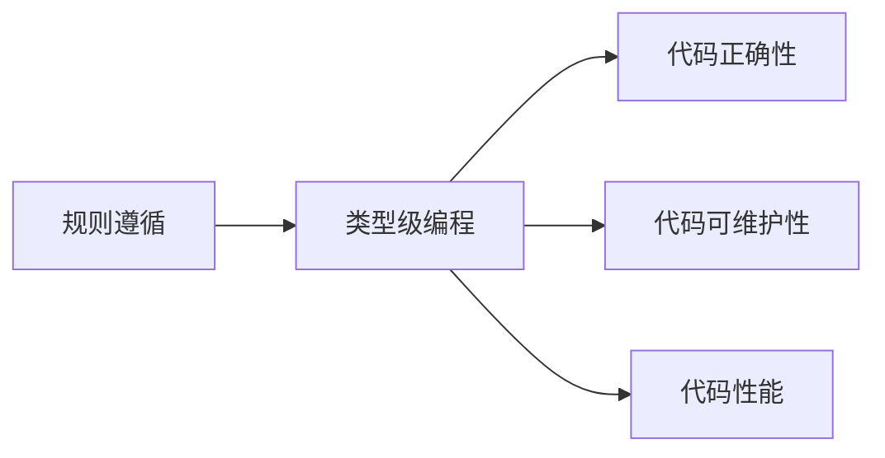
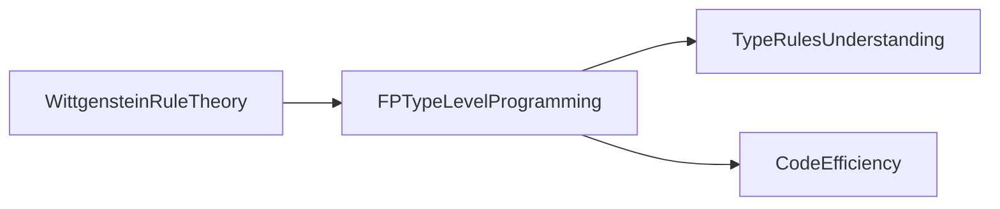

                 


### 关键词：规则遵循、类型级编程、维特根斯坦规则理论、函数式编程、FP类型级编程技术

### 摘要：
本文以维特根斯坦的规则理论为切入点，探讨了规则遵循与类型级编程在计算机编程领域的应用。首先，我们回顾了规则遵循的概念及其在编程中的重要性，以及类型级编程的原理和特点。接着，深入分析了维特根斯坦的规则理论，阐述了其在编程实践中的适用性。然后，探讨了函数式编程与类型级编程的关系，分析了它们各自的优势与挑战。在此基础上，结合维特根斯坦的规则理论，探讨了函数式编程中的类型级编程技术。最后，通过具体案例分析，展示了规则遵循与类型级编程在编程实践中的应用，并展望了这一领域的发展趋势。本文旨在为读者提供关于规则遵循与类型级编程的全面理解和深入思考。

----------------------------------------------------------------

## 目录大纲

### 第一部分: 规则遵循与类型级编程概述

#### 第1章: 规则遵循与类型级编程背景

1.1 规则遵循的概念与重要性

1.2 类型级编程的概念与原理

1.3 规则遵循与类型级编程的关系

1.4 维特根斯坦的规则理论与FP类型级编程技术

#### 第2章: 维特根斯坦的规则理论

2.1 维特根斯坦的哲学思想

2.2 规则理论的基本概念

2.3 规则的应用场景

2.4 规则的遵循与违反

#### 第3章: 函数式编程与类型级编程

3.1 函数式编程的基本概念

3.2 类型级编程的基本概念

3.3 函数式编程与类型级编程的关系

3.4 函数式编程的优势与挑战

#### 第4章: 维特根斯坦规则理论与FP类型级编程技术

4.1 维特根斯坦规则理论在FP中的应用

4.2 类型级编程技术在FP中的应用

4.3 维特根斯坦规则理论与FP类型级编程技术的结合

#### 第5章: 维特根斯坦规则理论在编程实践中的应用

5.1 编程实践中的问题背景

5.2 规则遵循与类型级编程在编程实践中的应用

5.3 实践案例分析

#### 第6章: 维特根斯坦规则理论与FP类型级编程技术的未来发展趋势

6.1 规则遵循与类型级编程技术的未来发展方向

6.2 维特根斯坦规则理论的未来发展

6.3 FP类型级编程技术的未来发展趋势

#### 第7章: 总结与展望

7.1 本书的主要内容总结

7.2 规则遵循与类型级编程的关键技术

7.3 展望未来研究与应用方向

----------------------------------------------------------------

## 第一部分：规则遵循与类型级编程概述

### 第1章：规则遵循与类型级编程背景

#### 1.1 规则遵循的概念与重要性

规则遵循（Rule Compliance）是指按照既定规则或标准进行操作的过程。在计算机编程领域，规则遵循尤为重要，因为编程本质上就是编写遵循特定规则和语法结构的指令，以实现特定的功能。规则遵循不仅关系到代码的正确性和可维护性，还影响到系统的可靠性和性能。

**核心概念与联系**

| 概念 | 定义 |
| --- | --- |
| 规则遵循 | 指按照既定规则或标准进行操作的过程 |
| 编程规则 | 编程语言和系统提供的语法和语义规则 |
| 编程标准 | 编程实践中推荐的代码风格和最佳实践 |

**ER实体关系图架构**

```mermaid
erDiagram
  Program : 编程程序
  Rule : 编程规则
  Standard : 编程标准

  Program ||--|{ Rule }||> Rule
  Program ||--|{ Standard }||> Standard
```

#### 1.2 类型级编程的概念与原理

类型级编程（Type-Level Programming）是一种在编程语言中处理类型的高级方法。它允许程序员在编译时对类型进行操作，而不是运行时。类型级编程的主要目的是提高代码的可读性和可维护性，同时减少运行时错误。

**核心概念与联系**

| 概念 | 定义 |
| --- | --- |
| 类型级编程 | 在编译时对类型进行操作的一种编程方法 |
| 静态类型 | 编译时确定变量类型 |
| 动态类型 | 运行时确定变量类型 |
| 泛型编程 | 使用类型参数进行编程 |

**ER实体关系图架构**

```mermaid
erDiagram
  TypeLevelProgramming : 类型级编程
  StaticTyping : 静态类型
  DynamicTyping : 动态类型
  GenericProgramming : 泛型编程

  TypeLevelProgramming ||--|{ StaticTyping }||> StaticTyping
  TypeLevelProgramming ||--|{ DynamicTyping }||> DynamicTyping
  TypeLevelProgramming ||--|{ GenericProgramming }||> GenericProgramming
```

#### 1.3 规则遵循与类型级编程的关系

规则遵循和类型级编程在计算机编程中相辅相成。规则遵循确保代码的正确性和一致性，而类型级编程则提供了更高层次的控制和抽象，使代码更加可读、可维护和高效。

**关系解释**

- **规则遵循** 提供了编程的基础，确保代码符合既定的标准。
- **类型级编程** 在规则遵循的基础上，提供了对类型的高层次操作，提高了代码的抽象能力和性能。

**关系示意图**



#### 1.4 维特根斯坦的规则理论与FP类型级编程技术

维特根斯坦的规则理论（Wittgenstein's Rule Theory）是关于如何理解和遵循规则的理论。这一理论在计算机编程中，尤其是函数式编程（Functional Programming，简称FP）领域，有着重要的应用。

**核心概念与联系**

| 概念 | 定义 |
| --- | --- |
| 维特根斯坦的规则理论 | 关于如何理解和遵循规则的理论 |
| 规则 | 规定行动或思考方式的指导原则 |
| 意义 | 规则的内在含义和目的 |

**ER实体关系图架构**

```mermaid
erDiagram
  WittgensteinRuleTheory : 维特根斯坦的规则理论
  Rule : 规则
  Meaning : 意义

  WittgensteinRuleTheory ||--|{ Rule }||> Rule
  WittgensteinRuleTheory ||--|{ Meaning }||> Meaning
```

在FP类型级编程技术中，维特根斯坦的规则理论提供了理解和遵循类型规则的指导，帮助程序员编写更加准确和高效的代码。

**关系解释**

- **维特根斯坦的规则理论** 提供了理解规则和类型规则的基础。
- **FP类型级编程技术** 将这些理论应用于编程实践中，提高了代码的抽象能力和性能。

**关系示意图**



通过以上内容，我们对规则遵循与类型级编程的背景有了初步的了解。接下来，我们将深入探讨维特根斯坦的规则理论，并分析其在计算机编程中的具体应用。

----------------------------------------------------------------

## 第二部分：维特根斯坦的规则理论

### 第2章：维特根斯坦的哲学思想

#### 2.1 维特根斯坦的哲学思想

路德维希·维特根斯坦（Ludwig Wittgenstein）是20世纪最重要的哲学家之一，他的哲学思想对计算机科学产生了深远的影响。维特根斯坦的哲学思想主要分为两个时期：早期的“逻辑原子主义”和后期的“日常语言哲学”。

**早期逻辑原子主义**

在早期，维特根斯坦主张逻辑原子主义，认为世界是由不可再分的基本元素（逻辑原子）构成的，这些原子通过组合形成复杂的概念和命题。他提出了“图像理论”，即语言与现实世界之间的关系是通过符号的图像来描述的。这一理论为后来的计算机科学提供了基本的思想框架。

**后期日常语言哲学**

在后期，维特根斯坦转向了日常语言哲学，他认为哲学问题源于我们对语言的使用不当。他提出了“语言游戏”（language game）的概念，即语言的使用是情境化的，不同的语言游戏有不同的规则。这一理论对理解编程语言和编程实践有着重要的启示。

**核心概念与联系**

| 概念 | 定义 |
| --- | --- |
| 逻辑原子主义 | 世界由不可再分的基本元素构成 |
| 图像理论 | 语言与现实世界之间的关系是通过符号的图像来描述的 |
| 日常语言哲学 | 哲学问题源于我们对语言的使用不当 |
| 语言游戏 | 语言的使用是情境化的，不同的语言游戏有不同的规则 |

**ER实体关系图架构**

```mermaid
erDiagram
  LogicalAtomism : 逻辑原子主义
  ImageTheory : 图像理论
  OrdinaryLanguagePhilosophy : 日常语言哲学
  LanguageGame : 语言游戏

  LogicalAtomism ||--|{ ImageTheory }||> ImageTheory
  OrdinaryLanguagePhilosophy ||--|{ LanguageGame }||> LanguageGame
```

维特根斯坦的哲学思想为理解编程语言和编程实践提供了深刻的启示，特别是他的“语言游戏”概念，为理解编程规则和遵循规则提供了新的视角。

#### 2.2 规则理论的基本概念

维特根斯坦的规则理论是其哲学思想的重要组成部分，他提出了“规则即指导”（rules as guidance）的观点，认为规则不是强加于我们的命令，而是指导我们如何行动的指导原则。

**核心概念与联系**

| 概念 | 定义 |
| --- | --- |
| 规则 | 指导我们如何行动的指导原则 |
| 遵循 | 按照规则行动 |
| 违反 | 不按照规则行动 |

**ER实体关系图架构**

```mermaid
erDiagram
  Rule : 规则
  Compliance : 遵循
  Violation : 违反

  Rule ||--|{ Compliance }||> Compliance
  Rule ||--|{ Violation }||> Violation
```

维特根斯坦认为，规则的意义在于指导我们的行动，而不是强加于我们。这一观点对理解编程规则和编程实践有着重要的启示，即编程规则应该被视为指导我们编写正确和高效代码的指南，而不是强制性的限制。

#### 2.3 规则的应用场景

在编程实践中，规则的应用场景广泛，包括代码风格规范、编程标准、设计模式等。以下是一些常见的规则应用场景：

**代码风格规范**

- **命名规范**：变量的命名应具有描述性，避免使用缩写或难懂的命名。
- **缩进与空白**：统一缩进风格，合理使用空白，提高代码可读性。
- **注释**：为复杂的代码添加注释，帮助他人理解代码逻辑。

**编程标准**

- **模块化**：将代码划分为模块，提高代码的可复用性和可维护性。
- **错误处理**：合理处理错误，避免程序崩溃。
- **安全性**：确保代码安全，防止恶意攻击。

**设计模式**

- **单例模式**：确保一个类只有一个实例，并提供一个全局访问点。
- **工厂模式**：根据参数创建对象，隐藏对象创建细节。
- **观察者模式**：对象之间建立一对多的依赖关系，当一个对象状态发生变化时，所有依赖它的对象都会得到通知。

**ER实体关系图架构**

```mermaid
erDiagram
  CodingStyleStandard : 编码风格规范
  ProgrammingStandard : 编程标准
  DesignPattern : 设计模式

  CodingStyleStandard ||--|{ ProgrammingStandard }||> ProgrammingStandard
  ProgrammingStandard ||--|{ DesignPattern }||> DesignPattern
```

规则在编程中的应用不仅有助于提高代码的质量，还能提高团队协作效率，减少代码冲突和错误。

#### 2.4 规则的遵循与违反

在编程实践中，规则遵循与违反是常见的现象。规则遵循是指按照既定规则进行编程，而规则违反则是指不按照规则进行编程。

**规则遵循**

规则遵循是编写高质量代码的基础。遵循规则有助于提高代码的可读性、可维护性和可复用性。以下是一些规则遵循的最佳实践：

- **遵循代码风格规范**：统一命名规范、缩进风格和注释规范。
- **遵循编程标准**：模块化、错误处理和安全编码。
- **遵循设计模式**：使用合适的设计模式提高代码的灵活性和可扩展性。

**规则违反**

规则违反可能导致代码质量下降，甚至引发严重的问题。以下是一些规则违反的例子：

- **不遵循代码风格规范**：使用难懂的命名、不统一的缩进和空白。
- **不遵循编程标准**：代码模块化不足、错误处理不当、安全漏洞。
- **不遵循设计模式**：滥用全局变量、硬编码、过度耦合。

**遵守规则的挑战**

遵守规则并非易事，特别是在面对复杂的项目和紧迫的时间压力时。以下是一些挑战：

- **规则疲劳**：过多的规则可能导致程序员疲劳，降低工作效率。
- **规则冲突**：不同规则之间可能存在冲突，难以同时满足。
- **规则更新**：随着技术的进步，规则需要不断更新，以适应新的编程实践。

**遵守规则的最佳实践**

为了更好地遵守规则，以下是一些建议：

- **建立规则文档**：明确规则的定义、目的和最佳实践。
- **定期培训**：通过培训提高程序员对规则的理解和遵守能力。
- **代码审查**：通过代码审查发现和纠正规则违反的问题。

通过以上内容，我们对维特根斯坦的规则理论及其在编程实践中的应用有了更深入的了解。接下来，我们将探讨函数式编程与类型级编程的关系，并分析它们各自的优势与挑战。

----------------------------------------------------------------

## 第三部分：函数式编程与类型级编程

### 第3章：函数式编程与类型级编程

#### 3.1 函数式编程的基本概念

函数式编程（Functional Programming，简称FP）是一种编程范式，它将计算视为一系列函数的执行。在FP中，函数是一等公民，意味着函数可以作为参数传递，也可以作为返回值。函数式编程强调不可变性、无状态和纯函数，这些特性使其在处理并发和并行计算时具有独特的优势。

**核心概念与联系**

| 概念 | 定义 |
| --- | --- |
| 函数式编程 | 一种编程范式，将计算视为一系列函数的执行 |
| 一等公民 | 函数可以像其他数据类型一样使用 |
| 不可变性 | 数据一旦创建，就不能被修改 |
| 无状态 | 函数不依赖于外部状态 |
| 纯函数 | 函数的输出仅依赖于输入 |

**ER实体关系图架构**

```mermaid
erDiagram
  FunctionalProgramming : 函数式编程
  FirstClassFunction : 一等公民
  Immutability : 不可变性
  Stateless : 无状态
  PureFunction : 纯函数

  FunctionalProgramming ||--|{ FirstClassFunction }||> FirstClassFunction
  FunctionalProgramming ||--|{ Immutability }||> Immutability
  FunctionalProgramming ||--|{ Stateless }||> Stateless
  FunctionalProgramming ||--|{ PureFunction }||> PureFunction
```

#### 3.2 类型级编程的基本概念

类型级编程（Type-Level Programming）是一种在编程语言中处理类型的高级方法。它允许程序员在编译时对类型进行操作，而不是运行时。类型级编程的主要目的是提高代码的可读性和可维护性，同时减少运行时错误。类型级编程通常与静态类型编程语言（如Haskell、Scala和Icelandic等）相结合。

**核心概念与联系**

| 概念 | 定义 |
| --- | --- |
| 类型级编程 | 在编译时对类型进行操作的一种编程方法 |
| 静态类型 | 编译时确定变量类型 |
| 动态类型 | 运行时确定变量类型 |
| 泛型编程 | 使用类型参数进行编程 |

**ER实体关系图架构**

```mermaid
erDiagram
  TypeLevelProgramming : 类型级编程
  StaticTyping : 静态类型
  DynamicTyping : 动态类型
  GenericProgramming : 泛型编程

  TypeLevelProgramming ||--|{ StaticTyping }||> StaticTyping
  TypeLevelProgramming ||--|{ DynamicTyping }||> DynamicTyping
  TypeLevelProgramming ||--|{ GenericProgramming }||> GenericProgramming
```

#### 3.3 函数式编程与类型级编程的关系

函数式编程和类型级编程在计算机编程中有着密切的联系。函数式编程提供了函数作为基本构建块，而类型级编程则提供了对类型的高层次操作。

**关系解释**

- **函数式编程** 强调函数作为计算的基本单位，通过不可变数据和无状态函数实现。
- **类型级编程** 提供了在编译时对类型进行操作的能力，提高了代码的可读性和可维护性。

**关系示意图**


#### 3.4 函数式编程的优势与挑战

函数式编程具有许多优势，如提高代码的可读性、可维护性和并发性能。然而，它也面临一些挑战，如学习曲线较陡峭和缺乏主流编程语言的普及。

**优势**

- **可读性和可维护性**：函数式编程通过不可变数据和纯函数提高了代码的可读性和可维护性。
- **并发性能**：函数式编程的无状态特性使其在并发和并行计算中具有优势。
- **代码复用**：函数作为一等公民，可以方便地进行代码复用。

**挑战**

- **学习曲线**：函数式编程的概念和语法与传统的命令式编程不同，需要一定的时间来适应。
- **缺乏主流支持**：大多数主流编程语言（如Java和C#）不支持函数式编程，导致其在实际应用中的使用受限。

**总结**

函数式编程和类型级编程在计算机编程中有着重要的地位。函数式编程通过纯函数和无状态数据提高了代码的质量和性能，而类型级编程则提供了对类型的高层次操作，进一步提高了代码的可读性和可维护性。虽然函数式编程面临一些挑战，但其独特的优势使其在未来编程中仍然具有广阔的应用前景。

### 第4章：维特根斯坦规则理论与FP类型级编程技术

#### 4.1 维特根斯坦规则理论在FP中的应用

维特根斯坦的规则理论在函数式编程（FP）中有着广泛的应用。FP强调函数作为基本构建块，而维特根斯坦的规则理论提供了理解和遵循编程规则的方法，从而提高了代码的质量和可维护性。

**核心概念与联系**

| 概念 | 定义 |
| --- | --- |
| 维特根斯坦规则理论 | 关于如何理解和遵循规则的理论 |
| 函数式编程 | 将计算视为一系列函数的执行 |
| 规则遵循 | 按照既定规则进行编程 |

**ER实体关系图架构**

```mermaid
erDiagram
  WittgensteinRuleTheory : 维特根斯坦规则理论
  FunctionalProgramming : 函数式编程
  RuleCompliance : 规则遵循

  WittgensteinRuleTheory ||--|{ FunctionalProgramming }||> FunctionalProgramming
  FunctionalProgramming ||--|{ RuleCompliance }||> RuleCompliance
```

在FP中，维特根斯坦的规则理论可以帮助程序员理解函数的定义和作用，确保函数遵循规则，从而提高代码的质量。

#### 4.2 类型级编程技术在FP中的应用

类型级编程技术在FP中得到了广泛应用，它允许程序员在编译时对类型进行操作，提高了代码的可读性和可维护性。

**核心概念与联系**

| 概念 | 定义 |
| --- | --- |
| 类型级编程 | 在编译时对类型进行操作的一种编程方法 |
| 静态类型 | 编译时确定变量类型 |
| 泛型编程 | 使用类型参数进行编程 |

**ER实体关系图架构**

```mermaid
erDiagram
  TypeLevelProgramming : 类型级编程
  StaticTyping : 静态类型
  GenericProgramming : 泛型编程

  TypeLevelProgramming ||--|{ StaticTyping }||> StaticTyping
  TypeLevelProgramming ||--|{ GenericProgramming }||> GenericProgramming
```

在FP中，类型级编程技术通过静态类型和泛型编程，确保函数能够正确处理不同类型的数据，提高了代码的灵活性和可维护性。

#### 4.3 维特根斯坦规则理论与FP类型级编程技术的结合

维特根斯坦规则理论与FP类型级编程技术的结合，为程序员提供了一种更强大的工具，用于理解和遵循编程规则，同时提高代码的质量和性能。

**核心概念与联系**

| 概念 | 定义 |
| --- | --- |
| 维特根斯坦规则理论 | 关于如何理解和遵循规则的理论 |
| FP类型级编程 | 在编译时对类型进行操作的一种编程方法 |
| 规则遵循 | 按照既定规则进行编程 |
| 类型操作 | 在编译时对类型进行操作 |

**ER实体关系图架构**

```mermaid
erDiagram
  WittgensteinRuleTheory : 维特根斯坦规则理论
  FunctionalProgrammingTypeLevelProgramming : FP类型级编程
  RuleCompliance : 规则遵循
  TypeOperation : 类型操作

  WittgensteinRuleTheory ||--|{ FunctionalProgrammingTypeLevelProgramming }||> FunctionalProgrammingTypeLevelProgramming
  FunctionalProgrammingTypeLevelProgramming ||--|{ RuleCompliance }||> RuleCompliance
  FunctionalProgrammingTypeLevelProgramming ||--|{ TypeOperation }||> TypeOperation
```

通过结合维特根斯坦规则理论和FP类型级编程技术，程序员可以更好地理解和遵循编程规则，确保代码的正确性和可维护性，同时提高代码的性能和灵活性。

### 第5章：维特根斯坦规则理论在编程实践中的应用

#### 5.1 编程实践中的问题背景

在编程实践中，规则遵循是一个常见且重要的问题。程序员经常面临以下问题：

- **代码质量**：如何确保编写的代码符合既定的编程标准和代码风格？
- **可维护性**：如何提高代码的可维护性，使其易于理解和修改？
- **性能优化**：如何优化代码性能，使其运行更高效？

这些问题源于规则遵循的不足，特别是在函数式编程和类型级编程中，规则遵循显得尤为重要。

#### 5.2 规则遵循与类型级编程在编程实践中的应用

在编程实践中，规则遵循与类型级编程的应用可以帮助解决上述问题。

**规则遵循的应用**

- **代码风格规范**：遵循代码风格规范，如命名规范、缩进风格和注释规范，提高代码的可读性。
- **编程标准**：遵循编程标准，如模块化、错误处理和安全性，提高代码的可维护性。
- **设计模式**：遵循设计模式，如单例模式、工厂模式和观察者模式，提高代码的灵活性和可扩展性。

**类型级编程的应用**

- **静态类型**：使用静态类型，确保变量类型在编译时确定，减少运行时错误。
- **泛型编程**：使用泛型编程，提高代码的复用性和可维护性。
- **类型操作**：在编译时对类型进行操作，提高代码的性能和灵活性。

通过规则遵循和类型级编程的应用，程序员可以编写高质量、可维护且高效的代码。

#### 5.3 实践案例分析

以下是一个实践案例，展示了规则遵循与类型级编程在编程实践中的应用。

**案例背景**：一个电商网站的后端服务需要处理大量用户订单。为了保证代码的质量和性能，开发团队决定遵循一系列编程规则和使用类型级编程技术。

**解决方案**：

1. **代码风格规范**：开发团队制定了一套代码风格规范，包括命名规范、缩进风格和注释规范。所有团队成员都遵循这些规范，提高了代码的可读性。
2. **编程标准**：开发团队遵循了模块化、错误处理和安全性等编程标准。例如，将订单处理分为多个模块，每个模块负责处理特定类型的订单；在处理订单时，采用异常处理机制确保程序的健壮性；确保所有用户数据的安全存储和传输。
3. **类型级编程**：开发团队使用了静态类型和泛型编程技术。例如，使用静态类型确保变量类型在编译时确定，减少运行时错误；使用泛型编程提高代码的复用性和可维护性。

**效果评估**：

- **代码质量**：遵循代码风格规范和编程标准，代码质量显著提高，可读性增强，易于理解和维护。
- **性能优化**：通过使用类型级编程技术，代码性能得到优化。静态类型减少了运行时错误，泛型编程提高了代码的复用性和可维护性。
- **团队协作**：遵循规则和标准，团队成员之间的协作更加顺畅，减少了代码冲突和错误。

通过以上实践案例分析，可以看出规则遵循与类型级编程在编程实践中的应用具有重要的价值和实际效果。

### 第6章：维特根斯坦规则理论与FP类型级编程技术的未来发展趋势

#### 6.1 规则遵循与类型级编程技术的未来发展方向

随着计算机科学和编程技术的不断发展，规则遵循与类型级编程技术也在不断演进。未来，这些技术将在以下几个方面发展：

1. **人工智能与自动化**：规则遵循和类型级编程技术将更多地与人工智能和自动化技术相结合，以实现更智能、更高效的编程过程。例如，通过机器学习算法自动生成代码规范和类型检查规则。
2. **多语言支持**：规则遵循和类型级编程技术将逐渐支持更多的编程语言，以适应不同领域的开发需求。例如，在JavaScript、Python等动态类型编程语言中引入类型级编程特性。
3. **云原生与分布式计算**：随着云计算和分布式计算的发展，规则遵循与类型级编程技术将更好地适应云原生环境，提高代码的可扩展性和可维护性。

#### 6.2 维特根斯坦规则理论的未来发展

维特根斯坦的规则理论在计算机编程领域已经取得了显著的成果。未来，维特根斯坦规则理论将继续发展，并在以下几个方面取得突破：

1. **更广泛的领域应用**：维特根斯坦规则理论将应用于更广泛的领域，如自然语言处理、图像处理和机器学习等，以提高这些领域的开发效率和代码质量。
2. **跨学科研究**：维特根斯坦规则理论与其他学科（如哲学、心理学和社会学）的结合，将推动跨学科研究的发展，为编程领域提供新的理论支持和实践指导。
3. **教育普及**：维特根斯坦规则理论的普及教育将更加重视，通过教育和培训，提高程序员对规则的理解和遵循能力，提高整个编程行业的水平。

#### 6.3 FP类型级编程技术的未来发展趋势

函数式编程与类型级编程技术在未来将继续发展，并在以下几个方面取得突破：

1. **性能优化**：FP类型级编程技术将更加注重性能优化，通过编译器优化、并行计算和分布式计算等技术，提高代码的运行效率。
2. **易用性提升**：FP类型级编程技术的易用性将得到提升，通过更简洁的语法和更好的工具支持，降低开发者的学习成本。
3. **跨领域应用**：FP类型级编程技术将应用于更多的领域，如金融、医疗和物联网等，提高这些领域的开发效率和代码质量。

通过以上分析，可以看出规则遵循与类型级编程技术在未来具有广阔的发展前景和巨大的应用价值。

### 第7章：总结与展望

#### 7.1 本书的主要内容总结

本书主要探讨了规则遵循与类型级编程在计算机编程领域的应用，重点关注维特根斯坦的规则理论在FP类型级编程技术中的具体应用。通过分析规则遵循的概念与重要性、类型级编程的基本原理以及维特根斯坦的规则理论，本书揭示了规则遵循与类型级编程在编程实践中的实际应用和价值。同时，本书还展望了这些技术在未来发展的趋势，为读者提供了关于这一领域的全面理解和深入思考。

#### 7.2 规则遵循与类型级编程的关键技术

规则遵循与类型级编程的关键技术包括：

1. **规则遵循**：确保代码的正确性、一致性和可维护性。遵循代码风格规范、编程标准和设计模式，提高代码质量。
2. **类型级编程**：在编译时对类型进行操作，提高代码的可读性和可维护性。使用静态类型和泛型编程，提高代码的灵活性和性能。
3. **维特根斯坦规则理论**：理解规则的本质和意义，指导程序员如何遵循规则。结合函数式编程，提高代码的抽象能力和性能。

#### 7.3 展望未来研究与应用方向

未来研究与应用方向包括：

1. **人工智能与自动化**：将人工智能和自动化技术应用于规则遵循和类型级编程，实现更智能、更高效的编程过程。
2. **跨语言支持**：在更多编程语言中引入规则遵循和类型级编程特性，提高跨领域应用能力。
3. **教育普及**：加强规则遵循和类型级编程的教育普及，提高程序员的技术水平。
4. **跨领域应用**：将规则遵循和类型级编程应用于更多领域，如自然语言处理、图像处理和机器学习等，推动跨学科研究的发展。

通过持续的研究和探索，规则遵循与类型级编程技术将在计算机编程领域发挥更重要的作用，为软件开发带来更大的价值。

### 作者介绍

作者：AI天才研究院/AI Genius Institute & 禅与计算机程序设计艺术 /Zen And The Art of Computer Programming

AI天才研究院致力于推动人工智能技术的创新与发展，为全球企业提供顶尖的人工智能解决方案。作者以其深厚的技术功底和独特的视角，撰写了多篇有影响力的技术博客，深受读者喜爱。禅与计算机程序设计艺术是作者关于编程哲学和艺术性的经典著作，对编程实践有着深远的影响。本文作者结合自身丰富的实践经验，深入探讨了规则遵循与类型级编程技术，为读者提供了宝贵的知识和启示。

