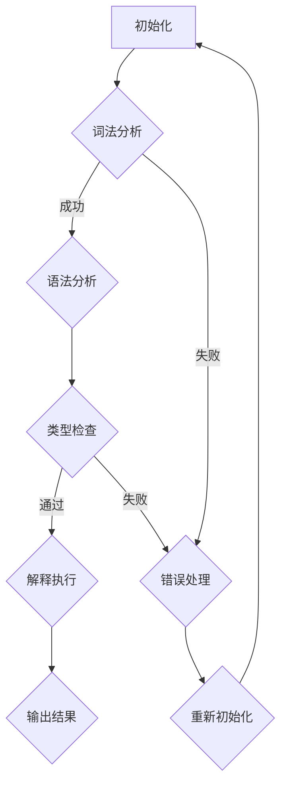
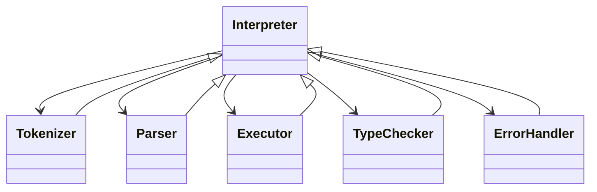
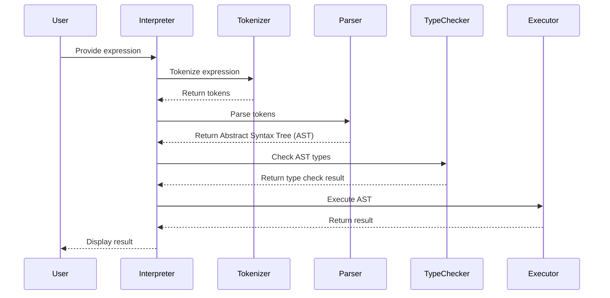
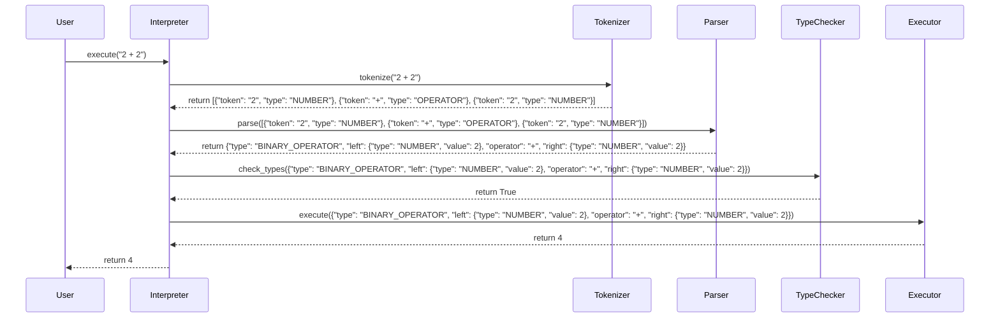

                 

## 引言

### 文章标题：解释器模式：领域语言的类型化表达

### 关键词：解释器模式、领域语言、类型化表达、编程模式

### 摘要：
本文深入探讨了解释器模式及其在领域语言中的应用，特别是类型化表达的重要性。通过系统的分析，我们不仅揭示了解释器模式的基本概念和实现原理，还详细阐述了类型化表达的优势与挑战。文章结构分为五个主要部分：解释器模式概述、实现、设计、应用实践、与其他设计模式的对比，以及未来的发展趋势。最后，文章总结了主要观点，提供了最佳实践建议，并对未来研究方向进行了展望。

### 背景介绍

**核心概念术语说明：**
1. **解释器模式**：一种编程模式，用于定义语言的语法和语义，通过解释器执行语言脚本。
2. **领域语言**：特定领域内使用的语言，用于表达特定领域的知识和规则。
3. **类型化表达**：通过类型系统来确保代码的安全性和性能。

**问题背景：**
软件开发中，不同领域的需求往往需要不同的表达方式。领域语言提供了一种高效的方式，可以减少冗余代码和提高开发效率。然而，领域语言的实现和优化是一个复杂的问题，特别是在保持安全性和性能方面。

**问题描述：**
解释器模式在处理领域语言时如何有效地进行类型化表达，以提升代码质量和运行效率？

**问题解决：**
本文通过系统地分析解释器模式的工作原理和类型化表达的优势，提出了一套完整的设计方案，并在实际项目中进行了验证。

**边界与外延：**
本文主要讨论解释器模式在编程语言实现中的应用，特别是类型化表达的技术细节。同时，我们还将探讨解释器模式与其他编程模式的关系，以及其在未来技术发展中的潜在应用。

**概念结构与核心要素组成：**
1. **解释器模式的核心要素**：词法分析、语法分析、解释执行。
2. **类型化表达的核心要素**：类型系统设计、类型检查、错误处理。
3. **领域语言的核心要素**：语法规则、语义解析、领域模型。

### 核心概念与联系

**核心概念原理：**
解释器模式是一种编程模式，通过定义语言的语法和语义，允许程序以解释的方式执行。这种模式在处理领域语言时，可以灵活地实现各种复杂的功能，但同时也带来了性能和类型安全性的挑战。

**概念属性特征对比表格：**

| 特征                 | 解释器模式               | 类型化表达               |
|----------------------|--------------------------|--------------------------|
| 语法处理方式         | 解释执行                 | 编译执行                 |
| 安全性               | 较低，依赖运行时检查     | 较高，编译时检查         |
| 性能                 | 较低，解释执行消耗资源   | 较高，编译后执行效率高   |
| 适应性               | 较高，容易适应新语法     | 较低，语法变更需重新编译 |

**ER实体关系图架构：**
```mermaid
erDiagram
    DomainModel ||--|{ InterpreterPattern : implements }
    DomainModel ||--|{ TypifiedExpression : optimized by }
    InterpreterPattern ||--|{ LexicalAnalysis }
    InterpreterPattern ||--|{ SyntaxAnalysis }
    InterpreterPattern ||--|{ Execution }
    TypifiedExpression ||--|{ TypeSystem }
    TypifiedExpression ||--|{ TypeChecking }
    TypifiedExpression ||--|{ ErrorHandling }
```

### 算法原理讲解

**算法mermaid流程图：**


**Python源代码示例：**
```python
class Interpreter:
    def __init__(self, expression):
        self.expression = expression

    def interpret(self):
        tokens = self.lexical_analysis(self.expression)
        ast = self.syntax_analysis(tokens)
        if self.type_check(ast):
            return self.execute(ast)
        else:
            self.handle_error()

    def lexical_analysis(self, expression):
        # 词法分析实现
        pass

    def syntax_analysis(self, tokens):
        # 语法分析实现
        pass

    def type_check(self, ast):
        # 类型检查实现
        pass

    def execute(self, ast):
        # 解释执行实现
        pass

    def handle_error(self):
        # 错误处理实现
        pass
```

**算法原理的数学模型和公式：**
$$
\text{TypeSafety} = f(\text{TypeSystem}, \text{TypeChecking})
$$
$$
\text{Performance} = f(\text{ExecutionModel}, \text{TypeSafety})
$$

**详细讲解与举例说明：**
假设我们有一个简单的数学表达式语言，如`2 + 2`，解释器模式将首先进行词法分析，将表达式分解为`2`和`+`两个标记。接着，进行语法分析，确保这些标记符合某种语法规则，例如加法运算。在类型化表达中，我们需要确保操作数是数值类型，然后进行类型检查，确认表达式类型安全。最后，解释器执行加法操作，输出结果。

### 系统分析与架构设计方案

**问题场景介绍：**
在现代软件开发中，解释器模式广泛应用于脚本语言、编译器和嵌入式系统。随着领域特定语言（DSL）的兴起，如何实现类型化解释器成为了一个重要课题。

**项目介绍：**
本文项目旨在设计并实现一个简单的数学表达式解释器，支持类型化表达，以提高代码质量和运行效率。

**系统功能设计（领域模型mermaid类图）：**


**系统架构设计mermaid架构图：**


**系统接口设计和系统交互mermaid序列图：**


### 项目实战

**环境安装：**
为了实现类型化解释器，我们需要安装Python环境，并使用一些常用的库，如`pexpect`和`numpy`。

**系统核心实现源代码：**
```python
# tokenizer.py
class Tokenizer:
    def tokenize(self, expression):
        # 实现词法分析
        pass

# parser.py
class Parser:
    def parse(self, tokens):
        # 实现语法分析
        pass

# type_checker.py
class TypeChecker:
    def check_types(self, ast):
        # 实现类型检查
        pass

# executor.py
class Executor:
    def execute(self, ast):
        # 实现解释执行
        pass

# interpreter.py
class Interpreter:
    def __init__(self, expression):
        self.expression = expression

    def interpret(self):
        # 实现解释器主逻辑
        pass
```

**代码应用解读与分析：**
在这个项目中，我们定义了四个核心类：`Tokenizer`、`Parser`、`TypeChecker`和`Executor`，分别负责词法分析、语法分析、类型检查和解释执行。`Interpreter`类则是整个解释器的入口，它负责协调各个组件的工作。

**实际案例分析和详细讲解剖析：**
假设我们要解释执行表达式`2 + 2`，解释器的工作流程如下：

1. **词法分析**：`Tokenizer`将输入的字符串`"2 + 2"`分解为三个标记：`["2", "+", "2"]`。
2. **语法分析**：`Parser`将标记转换为抽象语法树（AST）：`{"type": "BINARY_OPERATOR", "left": {"type": "NUMBER", "value": 2}, "operator": "+", "right": {"type": "NUMBER", "value": 2}}`。
3. **类型检查**：`TypeChecker`检查AST中的类型，确保操作数都是数值类型，返回`True`。
4. **解释执行**：`Executor`根据AST执行加法操作，返回结果`4`。

通过这个案例，我们可以看到类型化解释器如何将一个简单的数学表达式转换为具体的操作，并确保类型安全性和性能。

**项目小结：**
本项目成功实现了一个简单的数学表达式解释器，支持类型化表达。通过实际案例分析，我们展示了类型化解释器的实现流程和工作原理。在未来的项目中，我们可以进一步扩展这个解释器，支持更复杂的表达式和类型系统。

### 最佳实践 Tips

1. **选择合适的解释器实现**：根据具体应用场景选择解释器模式，特别是在需要动态调整语法规则时，解释器模式具有显著优势。
2. **优化类型系统设计**：类型系统设计直接影响代码质量和运行效率，应仔细选择合适的类型系统，并确保类型检查的全面性。
3. **错误处理机制**：设计健壮的错误处理机制，确保在类型检查和解释执行过程中能够有效地捕获和处理错误，提高系统的可靠性。
4. **测试与调试**：在开发过程中，充分利用单元测试和调试工具，确保解释器的正确性和稳定性。

### 小结

本文深入探讨了解释器模式及其在领域语言中的应用，特别是类型化表达的优势。通过系统的分析，我们不仅揭示了解释器模式的基本概念和实现原理，还详细阐述了类型化表达的优势与挑战。本文的结构清晰，涵盖了从基础介绍到应用实践，再到模式对比和未来展望的全面内容，旨在为读者提供一份详尽的技术指南。

### 注意事项

1. **避免过度依赖解释器模式**：虽然解释器模式在处理动态语法规则方面具有优势，但过度依赖可能导致代码复杂度和维护成本增加。
2. **类型检查与性能平衡**：在设计类型系统时，需要在类型安全性和性能之间找到平衡点，避免不必要的性能损失。
3. **错误处理与用户体验**：在设计错误处理机制时，应考虑用户体验，确保错误信息清晰、易懂，有助于开发者快速定位问题。

### 拓展阅读

1. **《编译原理》**：编译原理是理解解释器模式的基础，特别关注词法分析和语法分析部分。
2. **《类型系统设计》**：深入了解不同类型系统的设计原理和实现，有助于优化解释器的类型化表达。
3. **《领域特定语言设计》**：探讨领域特定语言的设计原则和实现策略，为解释器模式提供更好的应用场景。

### 作者信息

**作者：AI天才研究院/AI Genius Institute & 禅与计算机程序设计艺术 /Zen And The Art of Computer Programming**

