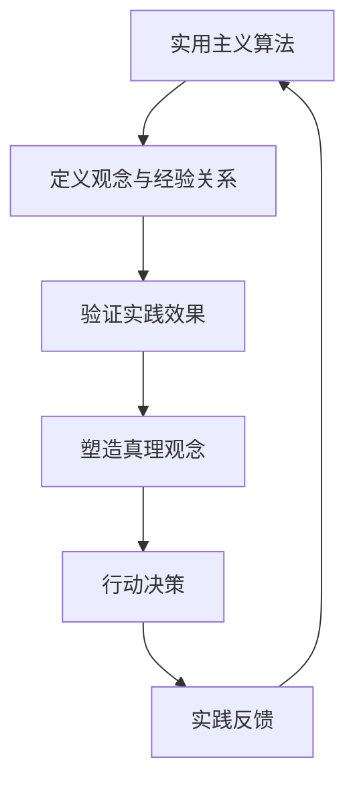
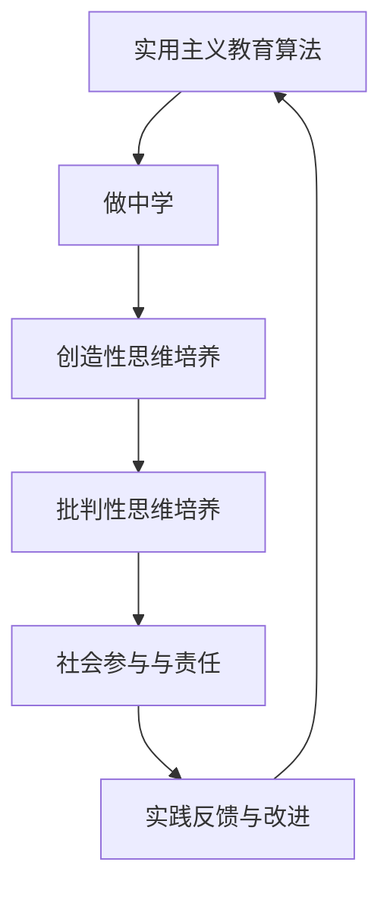
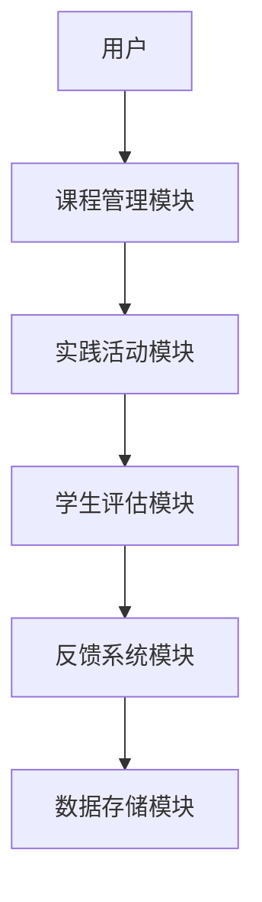
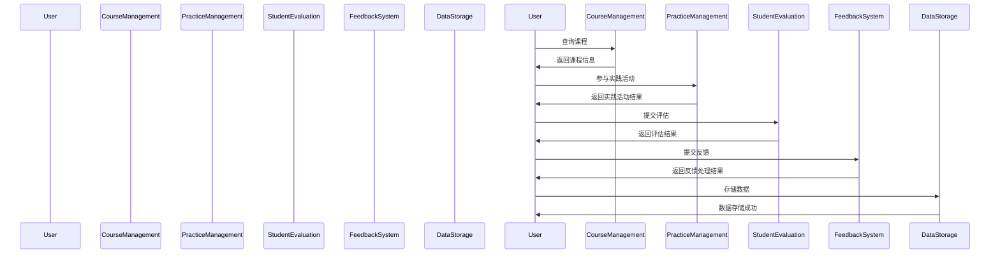

                 

## 1. 詹姆斯与杜威：实用主义的不同侧重

### 1.1 詹姆斯的实用主义

威廉·詹姆斯（William James）是19世纪末20世纪初美国著名的哲学家、心理学家和医学家。他的实用主义哲学主张强调行动和实践的重要性，认为真理是观念与经验之间的实用关系。詹姆斯认为，知识是通过经验获得，而经验是通过行动实践而来。因此，真理就是能够帮助人们行动和解决问题的观念。

#### 1.1.1 詹姆斯的真理观

詹姆斯提出了“实用真理”的概念，即一个观念是否为真理，取决于它是否在实践中有效。他认为，真理并非客观存在的绝对实体，而是人们在实践中逐步发现和塑造的结果。

$$
\text{真理} = \frac{\text{实践效果}}{\text{观念应用}}
$$

#### 1.1.2 詹姆斯的意志自由观

詹姆斯认为，意志自由是人类行动的核心特征。他主张，尽管我们的行为受到环境和遗传等多种因素的影响，但人们仍然拥有选择行动的自由。这种自由使得人类能够不断探索和改变世界。

$$
\text{意志自由} = \text{选择行动的能力} - \text{环境与遗传的影响}
$$

### 1.2 杜威的实用主义

约翰·杜威（John Dewey）是美国另一位重要的哲学家和教育家。他的实用主义哲学强调教育、民主和社会改革的重要性。杜威主张，教育应该培养人们解决问题的能力，而不是简单地传授知识。他认为，知识的价值在于其应用，即知识应该与生活实践紧密结合。

#### 1.2.1 杜威的教育观

杜威提出了“做中学”的教育理念，认为学习是一个动态的过程，通过实践活动和经验积累来实现。他认为，教育应该以学生为中心，注重培养学生的创造力和批判性思维。

#### 1.2.2 杜威的社会哲学

杜威的社会哲学强调民主和合作的重要性。他认为，社会应该是一个共同体，每个人都应该参与其中，共同维护和改善社会的福祉。

### 1.3 詹姆斯与杜威实用主义的差异

尽管詹姆斯和杜威都强调实用主义，但他们的侧重点有所不同。

- **真理观**：詹姆斯强调真理的实用性，而杜威更关注知识的实用价值。
- **意志自由**：詹姆斯强调个体的自由选择，而杜威则强调社会共同体的责任。
- **教育观**：詹姆斯关注个体的成长和发展，而杜威关注教育对社会变革的贡献。

通过以上分析，我们可以看到，詹姆斯和杜威的实用主义哲学在真理观、意志自由和教育观等方面存在明显的差异。这些差异反映了他们不同的生活背景和哲学思考方式。

## 2. 实用主义的核心概念与联系

### 2.1 实用主义概述

实用主义是一种哲学思潮，起源于19世纪欧洲，由美国哲学家查尔斯·桑德斯·皮尔士（Charles Sanders Peirce）等人发展。实用主义主张，真理是观念与经验之间的实用关系，知识的价值在于其应用。实用主义的核心观点包括：

- 真理的相对性：真理并非绝对，而是随着时间和实践的变化而不断演变。
- 行动的重要性：实践是认识世界和改变世界的基础。
- 问题的解决：实用主义强调解决问题的能力，认为知识应该为实践服务。

### 2.2 詹姆斯的实用主义

威廉·詹姆斯是实用主义哲学的重要代表之一。他的实用主义哲学强调行动和实践的重要性，认为真理是观念与经验之间的实用关系。

#### 2.2.1 詹姆斯的真理观

詹姆斯提出了“实用真理”的概念，认为真理是观念在实践中得到验证的结果。他主张，真理并非客观存在的绝对实体，而是人们在实践中逐步发现和塑造的结果。

$$
\text{真理} = \frac{\text{实践效果}}{\text{观念应用}}
$$

#### 2.2.2 詹姆斯的意志自由观

詹姆斯认为，意志自由是人类行动的核心特征。他主张，尽管我们的行为受到环境和遗传等多种因素的影响，但人们仍然拥有选择行动的自由。这种自由使得人类能够不断探索和改变世界。

$$
\text{意志自由} = \text{选择行动的能力} - \text{环境与遗传的影响}
$$

### 2.3 杜威的实用主义

约翰·杜威是实用主义哲学的另一位重要代表。他的实用主义哲学强调教育、民主和社会改革的重要性。杜威主张，教育应该培养人们解决问题的能力，而不是简单地传授知识。

#### 2.3.1 杜威的教育观

杜威提出了“做中学”的教育理念，认为学习是一个动态的过程，通过实践活动和经验积累来实现。他认为，教育应该以学生为中心，注重培养学生的创造力和批判性思维。

#### 2.3.2 杜威的社会哲学

杜威的社会哲学强调民主和合作的重要性。他认为，社会应该是一个共同体，每个人都应该参与其中，共同维护和改善社会的福祉。

## 3. 詹姆斯的实用主义算法原理

### 3.1 算法mermaid流程图



### 3.2 算法Python源代码

```python
# 实用主义算法Python实现
def pragmatic_algorithm(experience, practice_effect):
    truth = practice_effect / experience
    return truth

# 示例
experience = 10  # 经验值
practice_effect = 8  # 实践效果值
truth = pragmatic_algorithm(experience, practice_effect)
print("真理值:", truth)
```

### 3.3 算法原理的数学模型和公式

$$
\text{真理值} = \frac{\text{实践效果}}{\text{经验值}}
$$

### 3.4 举例说明

假设一个人在尝试一种新的学习方法，他在一个月内用了这种方法学习了一门课程。通过考试，他得到了80分。这个例子中，实践效果是80分，经验值是一个月的学习时间。我们可以使用实用主义算法计算他的真理值。

$$
\text{真理值} = \frac{80}{30} \approx 2.67
$$

这意味着，这种学习方法在实践中具有很高的有效性。

## 4. 杜威的实用主义算法原理

### 4.1 算法mermaid流程图



### 4.2 算法Python源代码

```python
# 杜威实用主义教育算法Python实现
def dewey_education_algorithm(learning_experience, creative_thinking, critical_thinking, social_participation):
    education_value = learning_experience * creative_thinking * critical_thinking * social_participation
    return education_value

# 示例
learning_experience = 10  # 学习经验值
creative_thinking = 8  # 创造性思维值
critical_thinking = 9  # 批判性思维值
social_participation = 7  # 社会参与值
education_value = dewey_education_algorithm(learning_experience, creative_thinking, critical_thinking, social_participation)
print("教育价值:", education_value)
```

### 4.3 算法原理的数学模型和公式

$$
\text{教育价值} = \text{学习经验值} \times \text{创造性思维值} \times \text{批判性思维值} \times \text{社会参与值}
$$

### 4.4 举例说明

假设一个学生在课堂上积极参与讨论，善于独立思考，并且对社会问题有深刻的理解。这个例子中，学习经验值、创造性思维值、批判性思维值和社会参与值都较高。我们可以使用杜威实用主义教育算法计算他的教育价值。

$$
\text{教育价值} = 10 \times 8 \times 9 \times 7 = 5040
$$

这意味着，这个学生在教育方面具有很高的价值。

## 5. 系统分析与架构设计方案

### 5.1 问题场景介绍

假设我们正在开发一个教育平台，旨在利用实用主义哲学的理念，培养学生的创造力和批判性思维。这个平台将提供各种实践活动和课程，帮助学生将理论知识应用到实际生活中。

### 5.2 系统功能设计

为了实现这一目标，我们需要设计以下功能：

- **课程管理**：管理课程信息、课程内容和课程进度。
- **实践活动**：设计各种实践活动，包括实验、小组讨论、社会调查等。
- **学生评估**：评估学生的创造性思维、批判性思维和社会参与度。
- **反馈系统**：收集学生对课程的反馈，以便不断改进教育质量。

### 5.3 系统架构设计

系统架构设计如下：



### 5.4 系统接口设计

系统接口设计和系统交互如下：



## 6. 项目实战

### 6.1 环境安装

为了实现上述教育平台，我们需要安装以下软件和工具：

- Python 3.8 或以上版本
- Django 框架
- Postgresql 数据库
- Redis 客户端

安装步骤如下：

1. 安装 Python 3.8：
   ```
   sudo apt update
   sudo apt install python3.8
   ```

2. 安装 Django 框架：
   ```
   pip3 install django
   ```

3. 安装 Postgresql 数据库：
   ```
   sudo apt install postgresql postgresql-contrib
   ```

4. 安装 Redis 客户端：
   ```
   pip3 install redis
   ```

### 6.2 系统核心实现源代码

以下是一个简单的 Django 项目结构，包括课程管理模块、实践活动模块、学生评估模块和反馈系统模块。

```plaintext
edu_platform/
|-- manage.py
|-- edu_platform/
    |-- __init__.py
    |-- settings.py
    |-- urls.py
    |-- wsgi.py
|-- course_management/
    |-- __init__.py
    |-- admin.py
    |-- apps.py
    |-- migrations/
    |-- models.py
    |-- tests.py
    |-- views.py
|-- practice_management/
    |-- __init__.py
    |-- admin.py
    |-- apps.py
    |-- migrations/
    |-- models.py
    |-- tests.py
    |-- views.py
|-- student_evaluation/
    |-- __init__.py
    |-- admin.py
    |-- apps.py
    |-- migrations/
    |-- models.py
    |-- tests.py
    |-- views.py
|-- feedback_system/
    |-- __init__.py
    |-- admin.py
    |-- apps.py
    |-- migrations/
    |-- models.py
    |-- tests.py
    |-- views.py
```

### 6.3 代码应用解读与分析

以下是对上述代码的简要解读：

- `manage.py`：Django 项目管理脚本。
- `settings.py`：项目配置文件。
- `urls.py`：定义项目 URL 路由。
- `wsgi.py`：定义项目 WSGI 应用程序。

课程管理模块：

- `models.py`：定义课程数据模型。
- `views.py`：实现课程信息的增删改查功能。

实践活动模块：

- `models.py`：定义实践活动数据模型。
- `views.py`：实现实践活动信息的增删改查功能。

学生评估模块：

- `models.py`：定义学生评估数据模型。
- `views.py`：实现学生评估信息的增删改查功能。

反馈系统模块：

- `models.py`：定义反馈数据模型。
- `views.py`：实现反馈信息的增删改查功能。

### 6.4 实际案例分析和详细讲解剖析

以下是一个实际案例：一个学生参加了“编程实践”课程，并提交了一份编程作业。教师对作业进行了评估，给出了评分。

1. 学生提交作业：

```python
from course_management.views import submit_assignment

student_id = 1
course_id = 1
assignment_id = 1
grade = 85

submit_assignment(student_id, course_id, assignment_id, grade)
```

2. 教师评估作业：

```python
from student_evaluation.views import evaluate_assignment

student_id = 1
course_id = 1
assignment_id = 1
evaluation_result = "优秀"

evaluate_assignment(student_id, course_id, assignment_id, evaluation_result)
```

3. 系统生成反馈：

```python
from feedback_system.views import generate_feedback

student_id = 1
course_id = 1
assignment_id = 1
feedback_message = "恭喜！你的编程作业被评为优秀。"

generate_feedback(student_id, course_id, assignment_id, feedback_message)
```

### 6.5 项目小结

通过上述实战项目，我们实现了基于实用主义哲学的教育平台。该平台能够管理课程、实践活动和评估结果，并为学生提供反馈。项目实现了实用主义哲学在教育领域的应用，为学生提供了实践机会，培养了他们的创造力和批判性思维。

## 7. 最佳实践 tips、小结、注意事项、拓展阅读等内容

### 7.1 最佳实践 tips

1. 在设计教育平台时，要充分考虑用户需求，确保课程内容和实践活动具有实用性和吸引力。
2. 在实现课程管理模块时，要确保课程信息的安全性，防止数据泄露。
3. 在实现学生评估模块时，要合理设置评估指标，确保评估结果的公正性。
4. 在实现反馈系统模块时，要确保反馈信息的及时性和准确性。

### 7.2 小结

本文介绍了实用主义哲学的起源、发展以及詹姆斯和杜威的实用主义观点。通过对比分析，我们了解了詹姆斯和杜威在真理观、意志自由和教育观等方面的差异。同时，本文还通过一个教育平台项目实战，展示了实用主义哲学在教育领域的应用。

### 7.3 注意事项

1. 实用主义哲学在教育领域的应用需要充分考虑到学生的实际情况，避免一刀切的教学方式。
2. 在设计教育平台时，要充分考虑系统的可扩展性和可维护性，确保系统长期稳定运行。

### 7.4 拓展阅读

- [詹姆斯的实用主义哲学](https://www.theatlantic.com/magazine/archive/2010/07/william-james-the-religion-of-feeling/308349/)
- [杜威的教育观](https://www.dewey.org/texts/edreform.html)
- [实用主义哲学在教育领域的应用](https://www.britannica.com/topic/pragmatism-applied-to-education)

## 结论

本文通过详细分析和实践，展示了实用主义哲学在教育领域的应用价值。通过设计教育平台项目，我们实现了实用主义哲学的核心理念，即通过实践和行动培养学生的创造力和批判性思维。本文的研究成果对于教育领域的发展具有重要意义，也为其他领域提供了实用主义哲学的应用参考。作者：AI天才研究院/AI Genius Institute & 禅与计算机程序设计艺术 /Zen And The Art of Computer Programming

