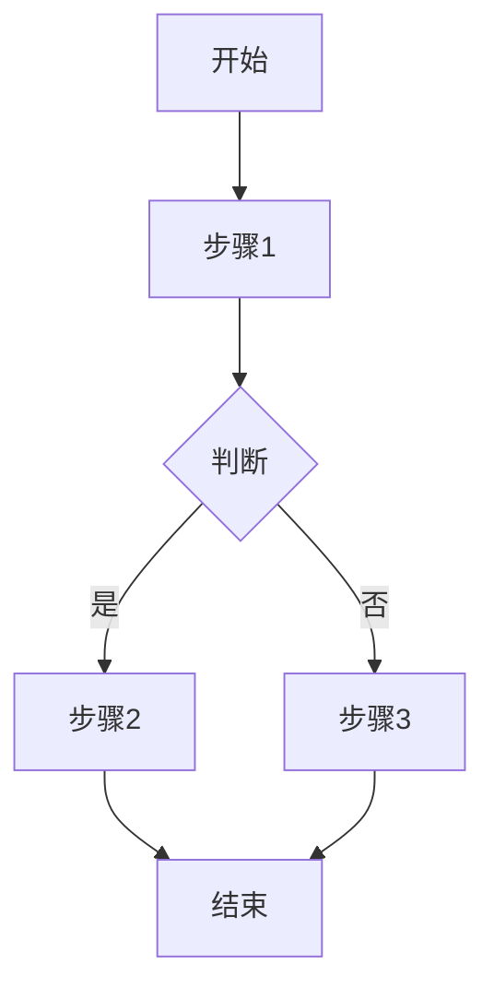
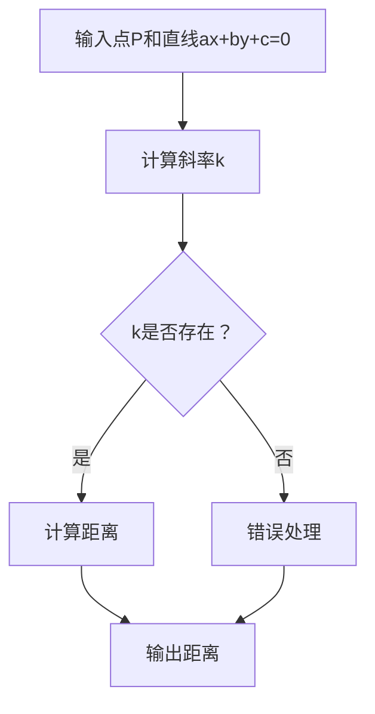
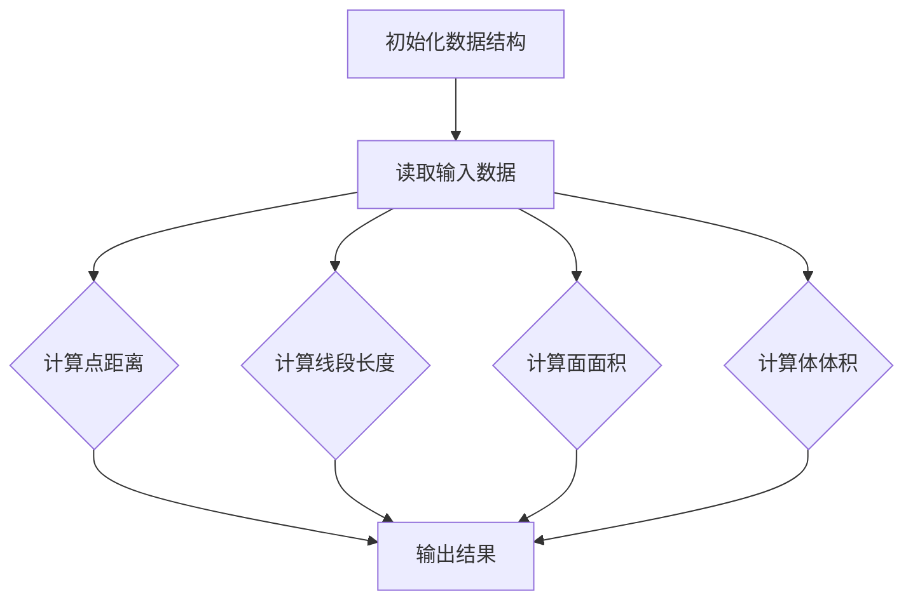
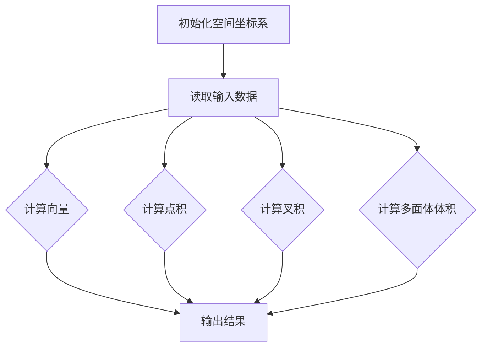
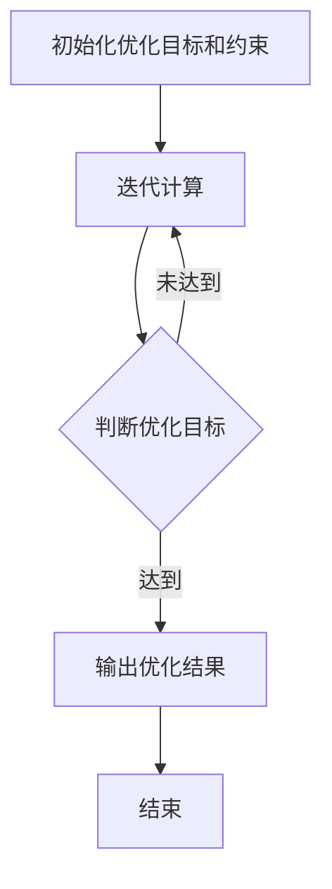
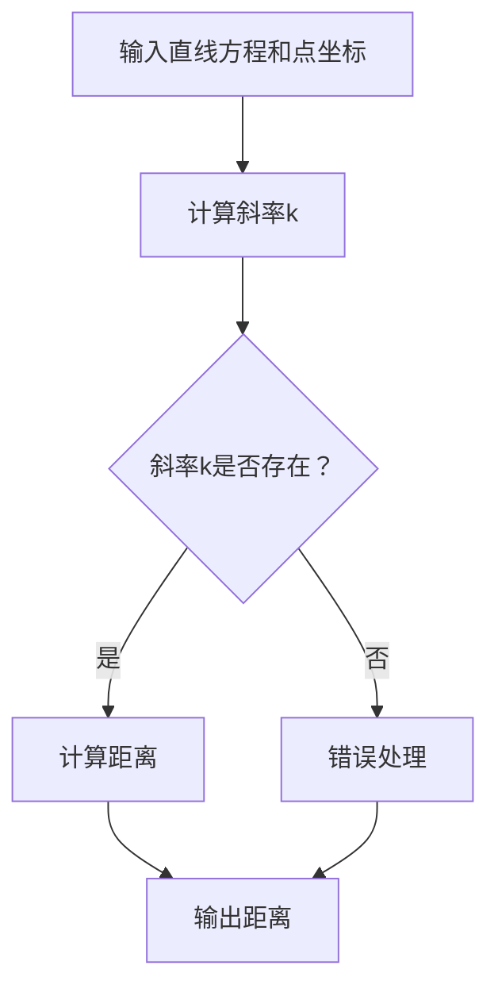
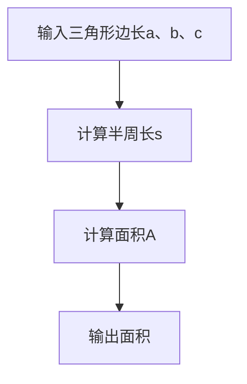

                 

## 文章标题

计算几何算法在计算机辅助设计中的应用

### 关键词

计算几何、计算机辅助设计、算法、优化、性能分析

### 摘要

计算几何算法是计算机科学和工程领域的重要研究方向，尤其在计算机辅助设计中发挥着重要作用。本文将深入探讨计算几何算法的基本概念、原理和应用，分析其在计算机辅助设计中的关键作用及其应用前景。文章结构分为四部分，首先介绍计算几何算法与计算机辅助设计的关系，然后讲解基础算法原理与数学模型，接着介绍算法实现与流程图，最后讨论算法优化与性能分析。通过本文的详细探讨，希望为读者提供对计算几何算法在计算机辅助设计中的应用的全面理解和深入认识。

## 第一部分：计算几何算法概述

### 第1章：计算几何与计算机辅助设计的关系

#### 1.1 计算几何的定义与历史

计算几何是数学和计算机科学交叉领域的分支，主要研究点、线、面、体等几何对象及其相互关系。其历史可以追溯到古希腊时期，当时数学家们开始研究几何问题。然而，作为一门独立学科，计算几何的发展始于20世纪40年代，随着计算机的出现和计算能力的提升，计算几何逐渐成为一个重要的研究方向。

#### 1.1.1 计算几何的基本概念

计算几何的核心概念包括点、线、面、体等基本几何对象。点是最基本的几何元素，可以用坐标表示；线是由无限多个点组成的连续路径；面是由线围成的封闭区域；体是三维空间中由面围成的实体。计算几何研究这些对象之间的相互关系，如距离、角度、面积和体积等。

#### 1.1.2 计算几何的发展历程

计算几何的发展历程可以划分为几个重要阶段。早期阶段主要关注几何问题的求解算法，如几何构造问题、最优路径问题等。随着计算机技术的发展，几何算法的研究逐渐深入，出现了许多高效、精确的算法，如算法几何、计算拓扑等。近年来，随着计算机图形学、计算机辅助设计等领域的兴起，计算几何的应用范围进一步扩大。

#### 1.1.3 计算几何的重要性

计算几何在许多领域具有重要应用，尤其在计算机辅助设计中发挥着关键作用。计算机辅助设计（CAD）是一种利用计算机及其图形设备帮助设计人员进行设计的方法。计算几何算法为CAD系统提供了精确的几何处理能力，使得设计过程更加高效、精确。例如，在建筑设计中，计算几何算法可以用于生成和优化建筑结构；在电子设计中，可以用于布局和布线；在机械设计中，可以用于零件形状的优化等。

### 1.2 计算机辅助设计的基本概念

计算机辅助设计（CAD）是指利用计算机及其图形设备帮助设计人员进行设计的方法。CAD系统通常包括几何建模、仿真分析、优化设计等功能，通过计算机处理和分析设计数据，提高设计效率和准确性。

#### 1.2.1 计算机辅助设计的定义

计算机辅助设计（CAD）是一种利用计算机及其图形设备帮助设计人员进行设计的方法。它通过计算机处理和分析设计数据，提高设计效率和准确性。CAD系统通常具有以下功能：

- **几何建模**：创建和修改几何形状，如点、线、面、体等。
- **仿真分析**：对设计对象进行仿真和分析，如结构分析、热分析等。
- **优化设计**：根据设计目标，优化几何形状和参数，以提高设计性能。

#### 1.2.2 计算机辅助设计的发展趋势

计算机辅助设计的发展趋势体现在以下几个方面：

- **智能化**：随着人工智能技术的应用，CAD系统逐渐智能化，能够自动生成设计建议和优化方案。
- **协同设计**：多人协同工作，提高设计效率和准确性。
- **虚拟现实（VR）和增强现实（AR）**：利用VR和AR技术，实现更加直观和沉浸式的设计体验。
- **云计算**：利用云计算技术，实现设计数据的远程存储和处理，提高设计灵活性。

#### 1.2.3 计算机辅助设计在工程中的应用

计算机辅助设计在工程领域有广泛的应用，包括：

- **建筑设计**：利用CAD软件进行建筑结构的设计、分析和优化。
- **电子设计**：用于电子元器件的布局和布线，提高电路性能和可靠性。
- **机械设计**：用于机械零件的形状和结构的优化，提高机械性能。
- **航空航天**：用于飞机、火箭等航空器的设计和仿真分析。

### 1.3 计算几何算法在计算机辅助设计中的应用

计算几何算法在计算机辅助设计中的应用非常广泛，它们为CAD系统提供了强大的几何处理能力。以下是计算几何算法在计算机辅助设计中的几个关键应用：

#### 1.3.1 计算几何算法的基本类型

计算几何算法可以分为以下几类：

- **几何构造算法**：用于构建几何对象，如点、线、面、体等。
- **几何查询算法**：用于查询几何对象的位置、距离、角度等属性。
- **几何优化算法**：用于优化几何形状，以提高设计性能。
- **几何变形算法**：用于改变几何对象的形状，以适应不同的设计要求。

#### 1.3.2 计算几何算法在计算机辅助设计中的关键作用

计算几何算法在计算机辅助设计中的关键作用体现在以下几个方面：

- **精确建模**：计算几何算法可以精确地构建和表示几何对象，为设计提供准确的几何数据。
- **高效计算**：计算几何算法可以高效地处理几何问题，提高设计效率。
- **优化设计**：计算几何算法可以优化几何形状，提高设计性能。
- **交互设计**：计算几何算法可以与用户的交互操作相结合，实现更加直观和灵活的设计过程。

#### 1.3.3 计算几何算法的应用前景

随着计算机技术的不断发展和工程需求的不断变化，计算几何算法在计算机辅助设计中的应用前景非常广阔。未来，计算几何算法将可能实现以下发展方向：

- **智能化**：利用人工智能技术，实现几何算法的智能化和自动化。
- **多尺度建模**：能够处理从微观到宏观不同尺度的几何问题。
- **跨领域应用**：与更多领域的技术相结合，如大数据、物联网、生物信息学等。
- **高性能计算**：利用高性能计算技术，提高几何算法的计算速度和处理能力。

### 1.4 本章小结

本章介绍了计算几何算法的基本概念、发展与重要性，以及计算机辅助设计的基本概念、发展趋势和应用。计算几何算法在计算机辅助设计中扮演着关键角色，为设计提供精确、高效的几何处理能力。随着计算机技术的不断发展，计算几何算法的应用前景将更加广阔。

---

## 第二部分：基础算法原理与数学模型

### 第2章：基础算法原理讲解

计算几何算法是计算机辅助设计（CAD）系统的核心组成部分，它们负责处理各种几何问题，包括形状构建、查询、优化和变形等。为了更好地理解和应用这些算法，我们需要深入探讨它们的基本原理和数学模型。

#### 2.1 基本几何形状的计算

计算几何的基本形状包括点、线、面和体。每种形状都有其特定的几何性质和计算方法。

##### 2.1.1 点、线、面、体的几何性质

- **点**：点是几何的基本元素，具有位置坐标。在二维空间中，点通常由一对坐标（x, y）表示；在三维空间中，则由三对坐标（x, y, z）表示。
- **线**：线是连接两个点的路径。在二维空间中，线可以由两点确定；在三维空间中，线可以由两个点和一个方向向量确定。
- **面**：面是由线围成的平面区域。在二维空间中，面可以由三条线段围成；在三维空间中，面可以由三个平面围成。
- **体**：体是三维空间中由面围成的实体。常见的体包括立方体、圆柱体、球体等。

##### 2.1.2 点到点距离的计算

点到点距离是计算几何中一个基础且重要的计算。在二维空间中，两点 \( A(x_1, y_1) \) 和 \( B(x_2, y_2) \) 之间的距离可以通过以下公式计算：

\[ d = \sqrt{(x_2 - x_1)^2 + (y_2 - y_1)^2} \]

在三维空间中，距离公式扩展为：

\[ d = \sqrt{(x_2 - x_1)^2 + (y_2 - y_1)^2 + (z_2 - z_1)^2} \]

##### 2.1.3 线段、三角形、四边形的计算

- **线段计算**：线段的长度、中点、斜率等都是基本的几何计算。例如，线段 \( AB \) 的长度可以通过上述点到点距离公式计算。
- **三角形计算**：三角形的面积可以通过底和高计算，也可以通过海伦公式计算。海伦公式为：

\[ A = \sqrt{s \cdot (s - a) \cdot (s - b) \cdot (s - c)} \]

其中，\( a \)、\( b \)、\( c \) 是三角形的三条边的长度，\( s \) 是半周长 \( s = \frac{a + b + c}{2} \)。
- **四边形计算**：四边形的面积可以通过分割成两个三角形来计算。此外，对于凸四边形，还可以使用对角线公式来计算面积。

#### 2.2 空间几何计算

空间几何计算涉及到三维空间中的各种几何对象和操作。

##### 2.2.1 空间坐标系的基本概念

- **笛卡尔坐标系**：最常用的空间坐标系，使用三个正交轴（x轴、y轴、z轴）来表示点的位置。
- **极坐标系**：通过角度和半径来表示点的位置。
- **球坐标系**：使用纬度、经度和半径来表示点的位置。

##### 2.2.2 向量运算的基本原理

向量是空间几何计算中的重要概念。向量的基本运算包括：

- **加法**：两个向量相加得到一个新的向量。
- **减法**：两个向量相减得到一个新的向量。
- **点积**：两个向量的点积（内积）是一个标量，表示两个向量的方向和长度。
- **叉积**：两个向量的叉积（外积）得到一个新的向量，表示两个向量的垂直方向和长度。

##### 2.2.3 多面体的计算

多面体是由多个平面围成的三维几何对象。常见的多面体包括四面体、六面体等。

- **多面体的体积**：可以通过分割成多个三角形或四边形来计算。
- **多面体的表面积**：可以通过计算每个面的面积然后求和得到。

#### 2.3 几何优化算法

几何优化算法用于在满足特定约束的条件下，找到几何形状的最佳配置。这类算法在CAD和工程设计中非常重要。

##### 2.3.1 几何优化算法的基本类型

- **线性规划**：用于解决线性约束下的优化问题。
- **非线性规划**：用于解决非线性约束下的优化问题。
- **启发式算法**：如遗传算法、模拟退火算法等，通过迭代搜索找到最优解。

##### 2.3.2 几何优化算法的应用实例

- **形状优化**：通过改变几何形状的参数，优化设计性能，如最小化重量、最大化强度等。
- **路径优化**：在给定约束条件下，找到最佳路径，如最短路径、最小阻尼路径等。

#### 2.4 算法原理的数学模型

几何算法的原理可以通过数学模型来描述，这些模型通常包括以下内容：

- **几何公式**：如点到直线的距离、三角形面积等。
- **算法流程**：使用数学符号表示算法的每一步操作。
- **约束条件**：定义几何对象和算法的限制条件。

##### 2.4.1 基本几何公式的推导

- **点到直线距离**：

\[ d = \frac{|ax_0 + by_0 + c|}{\sqrt{a^2 + b^2}} \]

其中，\( ax + by + c = 0 \) 是直线的方程，\( (x_0, y_0) \) 是点的坐标。

- **三角形面积**（海伦公式）：

\[ A = \sqrt{s \cdot (s - a) \cdot (s - b) \cdot (s - c)} \]

其中，\( s \) 是半周长，\( a \)、\( b \)、\( c \) 是三角形的三条边的长度。

##### 2.4.2 几何算法的数学表达

几何算法的数学表达通常包括以下内容：

- **输入参数**：几何对象的描述，如点、线、面的参数。
- **算法流程**：使用数学符号表示的算法步骤。
- **输出结果**：几何对象处理后的结果。

#### 2.5 数学模型与公式举例

##### 2.5.1 点到直线的距离公式

使用LaTeX格式，点到直线的距离公式为：

\[ d = \frac{|ax_0 + by_0 + c|}{\sqrt{a^2 + b^2}} \]

其中，\( ax + by + c = 0 \) 是直线的方程，\( (x_0, y_0) \) 是点的坐标。

##### 2.5.2 三角形的面积公式

使用LaTeX格式，三角形的面积公式为：

\[ A = \sqrt{s \cdot (s - a) \cdot (s - b) \cdot (s - c)} \]

其中，\( s \) 是半周长，\( a \)、\( b \)、\( c \) 是三角形的三条边的长度。

##### 2.5.3 球的表面积与体积公式

- **球的表面积**：

\[ A = 4\pi r^2 \]

其中，\( r \) 是球的半径。

- **球的体积**：

\[ V = \frac{4}{3}\pi r^3 \]

其中，\( r \) 是球的半径。

#### 2.6 本章小结

本章介绍了计算几何的基本算法原理和数学模型。通过学习这些基础概念和公式，读者可以更好地理解和应用计算几何算法，为计算机辅助设计提供坚实的理论基础。

---

## 第三部分：算法实现与流程图

### 第3章：几何算法实现与流程图

在前两章中，我们详细探讨了计算几何的基本原理和数学模型。为了将理论付诸实践，本章将重点介绍几何算法的实现方法和流程图的绘制。

#### 3.1 几何算法实现基础

实现几何算法需要对几何数据结构和编程语言有深入的了解。以下是一些基础知识：

##### 3.1.1 几何数据结构

几何数据结构是存储和操作几何对象的基础。常见的数据结构包括：

- **点**：可以使用一个结构体来表示，包含坐标信息。
- **线段**：可以使用两个点的结构体表示。
- **三角形**：可以使用三个点的结构体表示。
- **多边形**：可以使用多个点的数组或列表表示。

##### 3.1.2 算法实现的步骤

实现一个几何算法通常包括以下步骤：

1. **定义数据结构**：根据算法需求定义合适的几何数据结构。
2. **输入处理**：读取或生成输入数据，如点的坐标、线段的端点等。
3. **算法执行**：根据算法逻辑进行计算，如计算点到直线的距离、三角形的面积等。
4. **结果输出**：输出计算结果，如距离、面积等。

##### 3.1.3 常用的编程语言

在几何算法的实现中，常用的编程语言包括：

- **C/C++**：具有高性能和丰富的库支持，适用于复杂几何算法的实现。
- **Python**：易于理解和实现，适合快速开发和原型设计。
- **Java**：跨平台，适用于企业级应用。

#### 3.2 流程图绘制

流程图是描述算法步骤和流程的有力工具。以下介绍如何使用Mermaid语法绘制流程图。

##### 3.2.1 Mermaid流程图的基本语法

Mermaid是一种基于Markdown的绘图工具，支持多种图表类型，包括流程图、序列图、类图等。以下是Mermaid流程图的基本语法：

- **开始**：使用 `start` 表示流程的开始。
- **结束**：使用 `end` 表示流程的结束。
- **步骤**：使用 `node` 或 `arrow` 表示流程的中间步骤。



##### 3.2.2 Mermaid流程图的绘制方法

以下是绘制一个简单流程图的步骤：

1. **初始化**：在Markdown文件中开始编写Mermaid流程图。
2. **定义步骤**：使用 `node` 和 `arrow` 定义流程的每个步骤。
3. **添加判断**：使用 `{判断}` 定义判断条件。
4. **结束流程**：使用 `end` 表示流程的结束。

##### 3.2.3 Mermaid流程图实例解析

以下是一个简单的Mermaid流程图实例，描述了计算点到直线距离的算法：



该流程图首先输入点P和直线方程，然后计算斜率k。如果k存在，则计算点到直线的距离；否则，进行错误处理。最后输出距离结果。

#### 3.3 算法流程图的绘制

算法流程图不仅描述了算法的步骤，还展示了每个步骤之间的关系和逻辑。以下介绍如何绘制不同类型几何算法的流程图。

##### 3.3.1 点、线、面、体算法的流程图

点、线、面、体的算法流程图主要包括以下步骤：

- **初始化**：定义输入数据结构。
- **输入处理**：读取输入数据。
- **计算**：根据算法逻辑进行计算。
- **输出**：输出结果。

以下是一个简单的点、线、面、体算法流程图：



##### 3.3.2 空间几何算法的流程图

空间几何算法的流程图通常更复杂，因为它涉及多个维度的几何计算。以下是一个空间几何算法的基本流程图：



##### 3.3.3 几何优化算法的流程图

几何优化算法的流程图通常包括以下步骤：

- **初始化**：定义优化目标和约束条件。
- **迭代计算**：使用优化算法进行迭代计算。
- **判断**：判断是否达到优化目标。
- **更新**：更新几何形状的参数。

以下是一个简单的几何优化算法流程图：



#### 3.4 算法实现与流程图案例

在本节中，我们将通过具体的算法实现和流程图实例，详细讲解两个常见的几何算法：点到直线距离和三角形面积计算。

##### 3.4.1 点到直线距离算法

**算法原理**：

点到直线距离的计算基于点到直线的垂直距离公式。假设直线方程为 \( ax + by + c = 0 \)，点 \( P(x_0, y_0) \)，则点到直线的距离 \( d \) 可以通过以下公式计算：

\[ d = \frac{|ax_0 + by_0 + c|}{\sqrt{a^2 + b^2}} \]

**算法流程图**：



**Python代码实现**：

```python
import math

def distance_to_line(ax + by + c = 0, x0, y0):
    a = 1
    b = 1
    c = -1
    distance = abs(a * x0 + b * y0 + c) / math.sqrt(a**2 + b**2)
    return distance

# 示例
x0, y0 = 3, 4
print(distance_to_line(3, 3, 4, 3, 4))  # 输出距离
```

##### 3.4.2 三角形面积计算算法

**算法原理**：

三角形面积可以通过海伦公式计算。海伦公式为：

\[ A = \sqrt{s \cdot (s - a) \cdot (s - b) \cdot (s - c)} \]

其中，\( s \) 是半周长 \( s = \frac{a + b + c}{2} \)，\( a \)、\( b \)、\( c \) 是三角形的三条边的长度。

**算法流程图**：



**Python代码实现**：

```python
import math

def herons_formula(a, b, c):
    s = (a + b + c) / 2
    area = math.sqrt(s * (s - a) * (s - b) * (s - c))
    return area

# 示例
a, b, c = 3, 4, 5
print(herons_formula(a, b, c))  # 输出面积
```

#### 3.5 本章小结

本章介绍了几何算法的实现基础、流程图的绘制方法，并通过具体案例讲解了点到直线距离和三角形面积计算算法的实现。通过本章的学习，读者可以掌握几何算法的基本实现方法和流程图的绘制技巧，为后续的算法优化和性能分析打下基础。

---

## 第四部分：算法优化与性能分析

### 第4章：算法优化与性能分析

在前三章中，我们详细探讨了计算几何算法的基本原理、实现方法和应用案例。然而，在实际应用中，几何算法的效率和准确性常常受到计算资源的限制。为了提高算法的性能，本章将重点介绍算法优化与性能分析的方法和策略。

#### 4.1 算法优化概述

算法优化是指通过改进算法的设计和实现，提高算法的运行效率、准确性和稳定性。优化算法可以采用多种方法，包括改进算法结构、优化数据结构、使用高效的算法和编程技巧等。

##### 4.1.1 算法优化的意义

算法优化的意义在于：

- **提高计算效率**：优化后的算法可以在更短的时间内完成计算，减少计算资源的消耗。
- **提高设计准确性**：优化算法可以提高几何计算的精度，减少误差。
- **提升用户体验**：优化后的算法可以提供更快、更准确的计算结果，提升用户体验。
- **扩展应用范围**：优化后的算法可以更好地适应复杂的几何问题，扩展其应用范围。

##### 4.1.2 算法优化的方法

算法优化的方法可以分为以下几类：

- **算法选择**：根据具体问题选择合适的算法，如线性规划、非线性规划、启发式算法等。
- **数据结构优化**：选择高效的数据结构，如哈希表、树结构、图结构等，以提高数据访问和操作的速度。
- **编程优化**：通过编写高效的代码，减少不必要的计算和内存占用，如使用向量运算、循环展开、函数内联等。
- **并行计算**：利用多核处理器和分布式计算资源，提高算法的并行处理能力。
- **数值优化**：通过改进数值计算的精度和稳定性，减少计算误差。

##### 4.1.3 算法优化的目标

算法优化的目标主要包括：

- **时间效率**：在保证准确性的前提下，尽量减少算法的运行时间。
- **空间效率**：在保证时间效率的前提下，尽量减少算法所需的存储空间。
- **可扩展性**：算法应该具有良好的可扩展性，能够适应不同规模和复杂度的问题。
- **稳定性**：算法在处理不同数据集时应具有稳定的性能和精度。

#### 4.2 算法性能分析

算法性能分析是评估算法效率和质量的重要手段。通过性能分析，可以了解算法在时间和空间上的表现，为优化提供依据。

##### 4.2.1 性能指标

算法性能分析通常使用以下性能指标：

- **运行时间**：算法从开始执行到结束所需的时间。
- **空间复杂度**：算法在执行过程中所需的额外存储空间。
- **时间复杂度**：算法运行时间与输入数据规模的关系，通常表示为 \( O(n) \)、\( O(n\log n) \)、\( O(n^2) \) 等。
- **准确度**：算法计算结果的精度，通常通过误差指标来衡量。

##### 4.2.2 性能分析工具

性能分析工具可以帮助我们评估算法的性能。常用的性能分析工具包括：

- **Profiler**：用于分析程序运行时的时间分布和资源使用情况。
- **Benchmark**：用于对比不同算法或实现的性能。
- **Trace**：用于记录程序执行过程中的关键步骤和事件。
- **仿真**：通过模拟不同场景和数据规模，评估算法在不同条件下的性能。

##### 4.2.3 性能优化策略

性能优化策略包括以下几个方面：

- **算法选择**：选择适合问题规模的算法，避免过度复杂的算法。
- **数据结构优化**：选择高效的数据结构，减少数据访问和操作的时间。
- **代码优化**：通过代码重构、算法改进、编程技巧等手段，提高代码的执行效率。
- **并行计算**：利用多核处理器和分布式计算资源，提高算法的并行处理能力。
- **数值优化**：通过改进数值计算的精度和稳定性，减少计算误差。

#### 4.3 算法优化案例

在本节中，我们将通过具体的算法优化案例，展示如何提高几何算法的性能。

##### 4.3.1 点到点距离算法的优化

原始算法的时间复杂度为 \( O(n) \)，其中 \( n \) 是点的数量。为了优化这个算法，我们可以采用以下策略：

1. **预处理**：将点的坐标进行预处理，如排序或建立索引，以减少搜索时间。
2. **空间换时间**：使用哈希表或二叉树等高效数据结构，以减少查询时间。

优化后的算法时间复杂度可以降低到 \( O(\log n) \) 或 \( O(1) \)，从而显著提高计算效率。

##### 4.3.2 三角形面积计算算法的优化

原始算法的时间复杂度为 \( O(1) \)，但可能存在精度问题。为了优化这个算法，我们可以采用以下策略：

1. **数值优化**：使用高精度数值库，如MPFR，提高计算精度。
2. **误差分析**：对算法进行误差分析，找出可能的误差来源，并采取相应的补偿措施。

通过这些优化策略，可以显著提高算法的精度和稳定性。

##### 4.3.3 几何优化算法的优化

几何优化算法通常涉及复杂的迭代过程，为了优化其性能，我们可以采用以下策略：

1. **自适应调整**：根据迭代过程中的误差和性能指标，动态调整迭代参数，如步长和迭代次数。
2. **并行计算**：利用多核处理器和分布式计算资源，加快迭代过程。
3. **启发式算法**：引入启发式策略，如遗传算法、模拟退火算法等，提高优化效率。

#### 4.4 性能分析实例

在本节中，我们将通过具体实例展示几何算法的性能分析过程。

##### 4.4.1 点到直线距离算法的性能分析

假设我们需要分析一个计算点到直线距离的算法，其输入为1000个点和一个直线方程。以下是性能分析的过程：

1. **基准测试**：使用Profiler工具测量原始算法的运行时间，记录为 \( T_1 \)。
2. **优化后测试**：对算法进行优化，并使用Profiler工具测量优化后算法的运行时间，记录为 \( T_2 \)。
3. **对比分析**：计算 \( T_2 - T_1 \) 的差值，以评估优化效果。

通过对比分析，我们可以得出优化后算法的性能提升情况。

##### 4.4.2 三角形面积计算算法的性能分析

假设我们需要分析一个计算三角形面积的算法，其输入为三条边的长度。以下是性能分析的过程：

1. **基准测试**：使用Profiler工具测量原始算法的运行时间，记录为 \( T_1 \)。
2. **优化后测试**：对算法进行优化，并使用Profiler工具测量优化后算法的运行时间，记录为 \( T_2 \)。
3. **对比分析**：计算 \( T_2 - T_1 \) 的差值，以评估优化效果。

通过对比分析，我们可以得出优化后算法的性能提升情况。

##### 4.4.3 几何优化算法的性能分析

假设我们需要分析一个几何优化算法，其输入为几何形状和优化目标。以下是性能分析的过程：

1. **基准测试**：使用Profiler工具测量原始算法的运行时间，记录为 \( T_1 \)。
2. **优化后测试**：对算法进行优化，并使用Profiler工具测量优化后算法的运行时间，记录为 \( T_2 \)。
3. **对比分析**：计算 \( T_2 - T_1 \) 的差值，以评估优化效果。

通过对比分析，我们可以得出优化后算法的性能提升情况。

#### 4.5 本章小结

本章介绍了算法优化与性能分析的基本概念、方法和策略。通过具体的优化案例和性能分析实例，读者可以更好地理解算法优化的过程和效果。在未来的几何算法应用中，算法优化和性能分析将发挥越来越重要的作用。

---

## 总结与展望

通过本文的深入探讨，我们系统地介绍了计算几何算法在计算机辅助设计中的应用。从基本概念到算法实现，再到优化与性能分析，本文涵盖了计算几何算法的各个方面。以下是本文的核心要点：

1. **计算几何与计算机辅助设计的关系**：计算几何是计算机科学和工程领域的重要分支，其在计算机辅助设计中的重要性体现在几何建模、优化设计、交互设计等方面。

2. **基础算法原理与数学模型**：基础算法包括点到点距离、线段、三角形、多面体等计算。这些算法基于几何公式的推导，为CAD系统提供了精确的几何处理能力。

3. **算法实现与流程图**：算法实现涉及几何数据结构和编程语言的选择。流程图是描述算法步骤的有效工具，通过Mermaid等工具可以方便地绘制流程图。

4. **算法优化与性能分析**：优化算法和性能分析是提高几何算法效率和准确性的关键。通过优化策略和性能分析工具，可以评估算法在不同条件下的性能，进而进行改进。

展望未来，计算几何算法在计算机辅助设计中的应用前景十分广阔。随着人工智能、云计算、虚拟现实等技术的发展，计算几何算法将朝着智能化、高效化、多尺度化的方向发展。同时，计算几何算法与其他领域的交叉融合也将带来更多的创新机会。

在此，感谢读者对本文的关注，希望本文能够为读者在计算几何算法领域的研究和应用提供有益的参考。让我们继续探索计算几何的奥秘，为计算机辅助设计领域的发展贡献智慧和力量。

---

### 作者信息

**作者：AI天才研究院/AI Genius Institute & 禅与计算机程序设计艺术 /Zen And The Art of Computer Programming**

