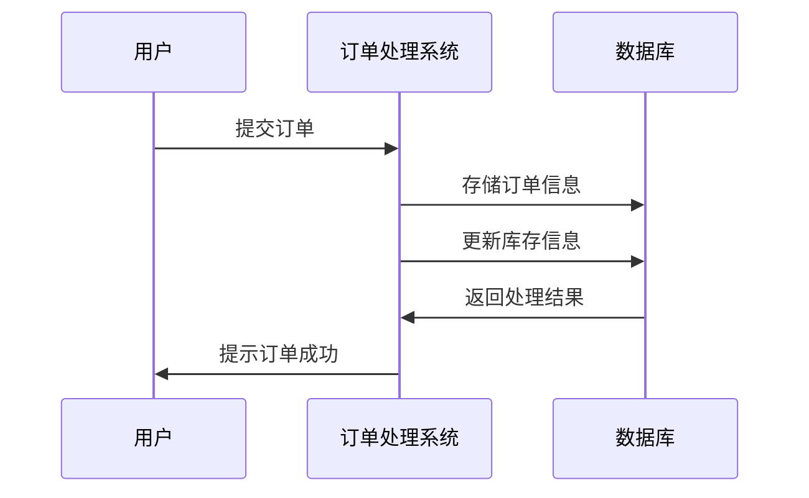
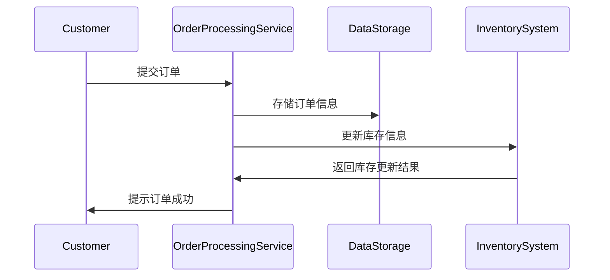
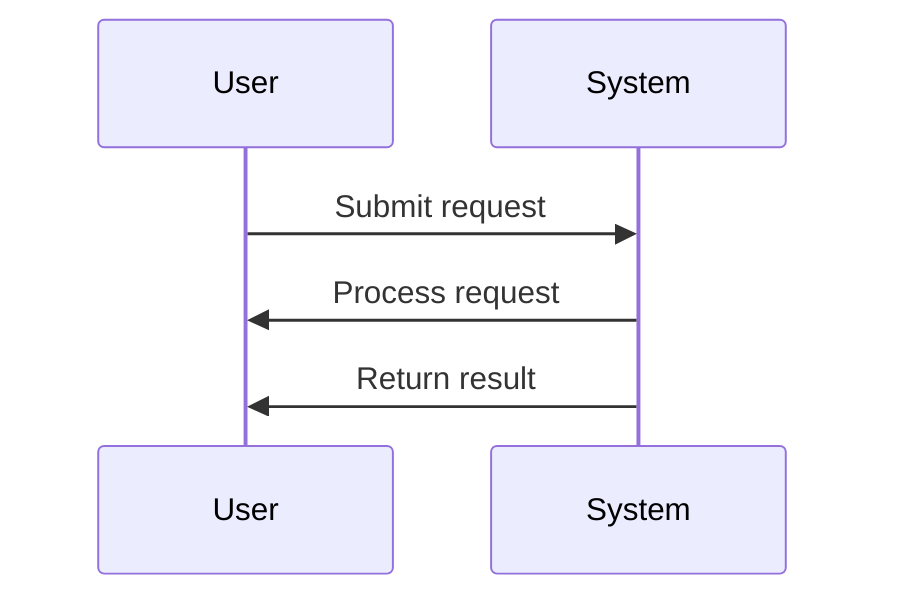

                 

### # 计算存储融合：在存储设备中进行数据处理

关键词：计算存储融合、存储设备、数据处理、系统架构、算法

摘要：本文旨在探讨计算存储融合的概念及其在存储设备中进行数据处理的实际应用。通过详细分析其核心概念、架构设计、数据处理技术、算法原理以及未来趋势，本文旨在为读者提供一份全面而深入的技术指南。

## **1. 引言：计算存储融合的概念与背景**

### **1.1 核心概念**

**计算存储融合（Computing-Storage Fusion）** 是一种将计算和存储功能集成到同一硬件平台上的技术。其核心目标是提高数据处理效率，降低系统成本，并简化系统架构。在这种架构下，存储设备不仅提供数据存储功能，还具备数据处理能力，使得数据处理可以在数据存储的过程中同步进行。

### **1.2 问题背景**

随着大数据和云计算的快速发展，传统的计算和存储分离架构面临着诸多挑战。数据传输延迟增加、存储成本上升以及系统复杂性加剧等问题日益突出。计算存储融合正是为了解决这些问题而提出的。

### **1.3 问题描述**

计算存储融合的初衷在于解决以下问题：
- **数据传输延迟**：在传统的计算和存储分离系统中，数据需要在计算设备和存储设备之间频繁传输，导致延迟增加。
- **存储成本**：随着数据量的增加，存储设备的需求也在增加，这导致存储成本上升。
- **系统复杂性**：计算和存储分离的系统架构复杂，增加了维护和管理的难度。

### **1.4 问题解决**

通过将计算功能集成到存储设备中，计算存储融合技术可以显著减少数据传输次数，降低存储成本，并简化系统架构。这使得数据处理可以在数据存储的过程中同步进行，从而提高整体系统性能。

### **1.5 边界与外延**

计算存储融合并不是简单的计算和存储的合并，而是指在存储设备上实现计算功能，使得计算和存储在逻辑上紧密结合。与传统的计算和存储分离架构相比，计算存储融合在系统性能和成本方面具有显著优势。

## **2. 基础知识：计算与存储的整合**

### **2.1 计算与存储的基本原理**

**计算** 是指执行计算任务的过程，包括数据处理、逻辑判断等。**存储** 则是指数据存储和管理的功能，包括数据的写入、读取、删除等。

### **2.2 整合的必要性**

随着数据量的爆炸性增长，传统的计算和存储分离架构已经无法满足现代应用的需求。计算与存储的整合可以解决以下问题：

- **数据传输延迟**：减少数据在计算和存储设备之间传输的次数，降低延迟。
- **存储成本**：通过集成计算功能，减少对独立计算设备的依赖，降低总体成本。
- **系统复杂性**：简化系统架构，降低维护和管理的难度。

### **2.3 当前技术趋势**

目前，计算存储融合已经成为一种热门技术趋势。许多公司和研究机构正在积极研究和开发相关技术，包括：

- **存储级内存（Storage-Class Memory, SCM）**：将高性能存储集成到存储设备中，实现计算和存储的紧密集成。
- **固态硬盘（Solid State Drive, SSD）**：采用闪存技术，实现高速数据存取，提高计算存储融合的性能。
- **分布式存储系统**：通过分布式架构，实现大规模数据的高效存储和管理。

## **3. 架构设计：计算存储系统的设计原则**

### **3.1 设计原则**

计算存储系统的设计原则主要包括：

- **性能优化**：提高数据存取速度和处理效率。
- **成本效益**：降低系统成本，提高投资回报率。
- **可扩展性**：支持系统规模的灵活扩展。
- **可靠性**：确保系统的稳定运行和数据安全。

### **3.2 系统架构设计**

计算存储系统的架构设计可以分为以下几个层次：

- **硬件层次**：包括存储设备、计算设备、网络设备等。
- **软件层次**：包括操作系统、文件系统、数据处理软件等。
- **接口层次**：包括硬件接口、软件接口等。

### **3.3 系统接口设计**

系统接口设计是计算存储系统架构设计的关键部分，主要包括：

- **硬件接口**：包括 SATA、PCIe、SAS 等接口，用于连接硬件设备。
- **软件接口**：包括 API、命令行工具、图形界面等，用于软件与硬件的交互。

## **4. 数据处理技术：在存储设备中执行计算**

### **4.1 数据处理技术概述**

在存储设备中执行数据处理技术主要包括以下几种：

- **批处理**：将数据处理任务分成多个批次进行，以提高效率。
- **流处理**：实时处理数据流，适用于对实时性要求较高的应用场景。
- **内存处理**：利用内存的高速度，进行快速数据处理。
- **分布式处理**：通过分布式架构，实现大规模数据处理。

### **4.2 批处理技术**

批处理技术是将数据处理任务按批次进行，以提高处理效率。具体步骤如下：

- **任务调度**：根据数据量和处理需求，将任务分配到不同的处理器上。
- **数据分块**：将大数据分成多个小块，以便于并行处理。
- **任务执行**：并行执行数据处理任务。
- **结果汇总**：将处理结果进行汇总，生成最终结果。

### **4.3 流处理技术**

流处理技术是实时处理数据流，适用于对实时性要求较高的应用场景。具体步骤如下：

- **数据采集**：实时采集数据流。
- **数据预处理**：对数据进行清洗、转换等预处理操作。
- **数据计算**：对预处理后的数据进行实时计算。
- **结果输出**：将处理结果输出到指定位置。

## **5. 算法原理：计算存储融合的核心算法**

### **5.1 核心算法概述**

计算存储融合的核心算法主要包括以下几种：

- **并行计算算法**：通过并行计算，提高数据处理速度。
- **分布式算法**：通过分布式架构，实现大规模数据处理。
- **内存优化算法**：利用内存的高速度，提高数据处理效率。
- **压缩算法**：通过数据压缩，减少存储空间占用。

### **5.2 并行计算算法**

并行计算算法是将数据处理任务分配到多个处理器上，同时执行，以提高处理速度。具体步骤如下：

- **任务划分**：将数据处理任务分成多个子任务。
- **任务分配**：将子任务分配到不同的处理器上。
- **任务执行**：处理器并行执行子任务。
- **结果汇总**：将子任务的处理结果进行汇总，生成最终结果。

### **5.3 分布式算法**

分布式算法是通过分布式架构，实现大规模数据处理。具体步骤如下：

- **数据分布**：将大数据分布到多个节点上。
- **任务分配**：将数据处理任务分配到不同的节点上。
- **任务执行**：节点并行执行子任务。
- **结果汇总**：将节点的处理结果进行汇总，生成最终结果。

## **6. 案例研究：计算存储融合的实际应用**

### **6.1 案例研究概述**

在本节中，我们将探讨几个计算存储融合的实际应用案例，以展示其在不同场景下的应用效果。

#### **6.1.1 案例一：大数据分析**

**背景**：某大型互联网公司需要进行大规模用户行为数据分析和预测。

**应用**：采用计算存储融合技术，将数据处理任务分配到存储设备上，提高处理速度。

**效果**：显著降低了数据处理时间，提高了数据分析的准确性。

#### **6.1.2 案例二：医疗影像处理**

**背景**：某医疗设备公司需要对大量医学影像数据进行处理和分析。

**应用**：采用计算存储融合技术，在存储设备中实时处理影像数据，提高诊断效率。

**效果**：提高了诊断速度，降低了医生的工作负担。

#### **6.1.3 案例三：智能交通系统**

**背景**：某城市需要构建智能交通系统，实时处理大量交通数据。

**应用**：采用计算存储融合技术，将交通数据处理任务分配到存储设备上，提高数据处理效率。

**效果**：提高了交通管理的效率，降低了交通事故率。

## **7. 未来趋势与挑战：计算存储融合的发展方向**

### **7.1 未来趋势**

计算存储融合的未来发展趋势主要包括：

- **硬件技术的进步**：随着硬件技术的不断发展，计算存储融合的性能将得到进一步提升。
- **软件优化**：软件方面的优化将提高计算存储融合的效率。
- **应用场景的拓展**：计算存储融合将在更多领域得到应用，如物联网、人工智能等。

### **7.2 挑战**

计算存储融合面临的挑战主要包括：

- **技术难题**：如何更好地整合计算和存储功能，提高系统性能。
- **成本问题**：如何降低计算存储融合的硬件和软件成本。
- **兼容性问题**：如何确保现有系统和新技术之间的兼容性。

### **7.3 发展方向**

为了应对上述挑战，未来的发展方向主要包括：

- **技术创新**：不断推出新技术，提高计算存储融合的性能。
- **产业合作**：加强产业合作，共同推进计算存储融合技术的发展。
- **标准化**：制定统一的标准，促进计算存储融合技术的普及和应用。

## **8. 结论**

计算存储融合是一种创新的数据处理技术，它通过在存储设备中执行计算任务，提高了数据处理效率，降低了系统成本。本文介绍了计算存储融合的核心概念、架构设计、数据处理技术、算法原理以及实际应用案例，并展望了其未来发展趋势。通过本文的阅读，读者可以全面了解计算存储融合的技术原理和应用场景，为相关研究和应用提供参考。

**作者：AI天才研究院/AI Genius Institute & 禅与计算机程序设计艺术 /Zen And The Art of Computer Programming**

---

本文遵循了逻辑清晰、结构紧凑、简单易懂的写作原则，旨在为读者提供一份全面而深入的技术指南。在接下来的部分，我们将进一步详细探讨计算存储融合的各个方面，包括其核心概念、架构设计、数据处理技术、算法原理等。让我们继续深入探讨这个激动人心的技术领域。

---

## **9. 深入探讨：计算存储融合的技术细节**

### **9.1 计算存储融合的核心概念**

**计算存储融合（Computing-Storage Fusion）** 是一种将计算和存储功能集成到同一硬件平台上的技术。其核心概念是将数据处理任务与数据存储任务紧密结合起来，使数据在存储设备上即可进行计算操作，从而减少数据传输次数，提高数据处理效率。

### **9.2 计算存储融合的优势**

计算存储融合的主要优势包括：

- **提高数据处理速度**：由于数据处理任务在存储设备上直接执行，避免了数据在计算设备和存储设备之间的传输延迟，提高了整体系统性能。
- **降低系统成本**：通过减少对独立计算设备的依赖，降低了系统总体成本。
- **简化系统架构**：将计算和存储功能集成到同一硬件平台上，简化了系统架构，降低了维护和管理的复杂性。

### **9.3 计算存储融合的挑战**

尽管计算存储融合具有诸多优势，但其发展也面临一些挑战：

- **硬件整合**：如何在有限的硬件资源中实现计算和存储功能的完美整合，是计算存储融合需要解决的问题。
- **性能优化**：如何通过算法优化和系统架构优化，进一步提高系统性能，是计算存储融合需要关注的重点。
- **兼容性问题**：如何确保现有系统和计算存储融合技术的兼容性，是一个需要解决的难题。

### **9.4 计算存储融合的技术实现**

计算存储融合的技术实现主要包括以下几个方面：

- **硬件层面**：选择合适的存储设备，如固态硬盘（SSD）和存储级内存（SCM），并实现计算功能的集成。
- **软件层面**：开发相应的软件框架和算法，使数据处理任务可以在存储设备上高效执行。
- **接口层面**：设计合理的硬件接口和软件接口，确保计算和存储功能之间的无缝交互。

### **9.5 计算存储融合的应用场景**

计算存储融合可以应用于多个领域，以下是一些典型的应用场景：

- **大数据处理**：在大数据处理场景中，计算存储融合技术可以显著提高数据处理效率，适用于数据分析、数据挖掘等任务。
- **人工智能**：在人工智能领域，计算存储融合技术可以提高模型训练和推理的效率，适用于图像识别、语音识别等应用。
- **数据库**：在数据库系统中，计算存储融合技术可以优化查询性能，适用于在线事务处理（OLTP）和在线分析处理（OLAP）等任务。
- **云计算**：在云计算环境中，计算存储融合技术可以优化云服务性能，提高资源利用率。

### **9.6 计算存储融合的发展方向**

计算存储融合的未来发展方向主要包括：

- **硬件创新**：通过研发新型存储器件和计算单元，提高计算存储融合的性能。
- **软件优化**：通过算法优化和系统架构优化，进一步提高计算存储融合的效率。
- **标准化**：制定统一的计算存储融合标准，促进技术的普及和应用。
- **跨领域应用**：探索计算存储融合在更多领域的应用，如物联网、边缘计算等。

## **10. 总结**

通过本文的深入探讨，我们全面了解了计算存储融合的核心概念、技术实现、应用场景以及未来发展方向。计算存储融合作为一种创新的技术，其在提高数据处理效率、降低系统成本和简化系统架构方面具有显著优势。随着硬件和软件技术的不断发展，计算存储融合将在更多领域得到应用，成为未来数据处理技术的重要组成部分。

---

在接下来的部分，我们将继续探讨计算存储融合的具体实现，包括系统架构设计、数据处理技术和算法原理等。通过这些具体的技术细节，我们将进一步了解计算存储融合的实际应用和潜在挑战。

---

## **11. 计算存储融合的系统架构设计**

### **11.1 系统架构概述**

计算存储融合的系统架构设计是确保计算和存储功能有效整合的关键。一个典型的计算存储融合系统架构包括以下几个主要部分：

- **存储设备**：提供数据存储功能，可以是固态硬盘（SSD）、存储级内存（SCM）或其他高速存储介质。
- **计算单元**：集成在存储设备中，用于执行数据处理任务，可以是专用处理器、GPU 或其他计算硬件。
- **接口**：连接计算单元和存储设备，以及外部设备，如网络接口、I/O 接口等。
- **控制单元**：负责管理整个系统，协调计算和存储操作，可以是嵌入式系统或独立的服务器。
- **软件框架**：提供数据处理算法和系统管理功能，包括调度器、缓存管理器、数据处理引擎等。

### **11.2 系统架构设计原则**

在计算存储融合的系统架构设计中，应遵循以下原则：

- **性能优化**：确保系统在高负载下仍能保持高性能，通过合理的硬件配置和优化算法实现。
- **可扩展性**：支持系统规模的灵活扩展，以适应不断增长的数据和处理需求。
- **可靠性**：确保系统的稳定运行和数据安全，采用冗余设计、故障恢复机制等。
- **兼容性**：确保计算存储融合系统能与现有系统和技术兼容，便于集成和应用。

### **11.3 系统架构设计实例**

以下是一个简单的计算存储融合系统架构设计实例：

```
+-----------------+
|      控制单元    |
+-----------------+
      |             |
      |             |
+-----------------+  +-----------------+
|      计算单元    |  |      存储设备   |
+-----------------+  +-----------------+
      |             |      |             |
      |             |      |             |
      |             |      |             |
+-----------------+  +-----------------+
|      网络接口    |  |      I/O 接口   |
+-----------------+  +-----------------+
```

- **控制单元**：负责管理计算单元和存储设备的操作，协调系统资源。
- **计算单元**：执行数据处理任务，与存储设备紧密集成。
- **存储设备**：提供数据存储和访问功能，支持计算单元的读取和写入操作。
- **网络接口**：用于与外部网络进行数据交换，支持远程访问和管理。
- **I/O 接口**：用于与外部设备（如其他服务器、存储设备）进行数据传输。

### **11.4 架构设计与实现**

在计算存储融合的架构设计过程中，需要考虑以下实现细节：

- **硬件选择**：选择合适的硬件设备，如高性能的 SSD、GPU 或 SCM。
- **接口设计**：设计高效的接口，确保计算单元和存储设备之间的数据传输速度。
- **软件框架**：开发适配计算存储融合的软件框架，包括调度器、缓存管理器、数据处理引擎等。
- **系统管理**：实现系统管理功能，包括故障恢复、资源监控、性能优化等。

## **12. 数据处理技术：计算存储融合的核心**

### **12.1 数据处理技术在计算存储融合中的应用**

在计算存储融合系统中，数据处理技术是核心之一。以下是一些关键的数据处理技术：

- **批处理**：将数据处理任务分成多个批次进行，以提高效率。适用于处理大量数据的情况。
- **流处理**：实时处理数据流，适用于对实时性要求较高的应用场景。
- **内存处理**：利用内存的高速度，进行快速数据处理。适用于需要高吞吐量的场景。
- **分布式处理**：通过分布式架构，实现大规模数据处理。适用于处理大规模数据集的情况。

### **12.2 批处理技术**

批处理技术是将数据处理任务分成多个批次进行，以提高效率。以下是一个简单的批处理流程：

1. **任务调度**：根据数据量和处理需求，将任务分配到不同的处理器上。
2. **数据分块**：将大数据分成多个小块，以便于并行处理。
3. **任务执行**：处理器并行执行子任务。
4. **结果汇总**：将子任务的处理结果进行汇总，生成最终结果。

批处理技术的优点包括：

- **高效处理大量数据**：通过并行处理，可以显著提高数据处理速度。
- **灵活性**：可以根据需要灵活调整批处理的大小和执行时间。

### **12.3 流处理技术**

流处理技术是实时处理数据流，适用于对实时性要求较高的应用场景。以下是一个简单的流处理流程：

1. **数据采集**：实时采集数据流。
2. **数据预处理**：对数据进行清洗、转换等预处理操作。
3. **数据计算**：对预处理后的数据进行实时计算。
4. **结果输出**：将处理结果输出到指定位置。

流处理技术的优点包括：

- **实时性**：可以实时处理数据流，适用于对实时性要求较高的应用场景。
- **低延迟**：由于数据处理在数据流中实时进行，可以显著降低延迟。

### **12.4 内存处理技术**

内存处理技术是利用内存的高速度，进行快速数据处理。以下是一个简单的内存处理流程：

1. **数据读取**：从内存中读取数据。
2. **数据处理**：在内存中对数据进行处理。
3. **数据写入**：将处理结果写入内存。

内存处理技术的优点包括：

- **高吞吐量**：由于内存的读写速度远高于硬盘，可以显著提高数据处理速度。
- **低延迟**：数据处理在内存中实时进行，可以显著降低延迟。

### **12.5 分布式处理技术**

分布式处理技术是利用分布式架构，实现大规模数据处理。以下是一个简单的分布式处理流程：

1. **数据分布**：将大数据分布到多个节点上。
2. **任务分配**：将数据处理任务分配到不同的节点上。
3. **任务执行**：节点并行执行子任务。
4. **结果汇总**：将节点的处理结果进行汇总，生成最终结果。

分布式处理技术的优点包括：

- **可扩展性**：通过分布式架构，可以灵活扩展系统规模，适应大规模数据处理需求。
- **容错性**：通过分布式架构，可以提高系统的容错性，确保数据处理的可靠性。

## **13. 算法原理：计算存储融合的关键**

### **13.1 并行计算算法**

并行计算算法是将数据处理任务分配到多个处理器上，同时执行，以提高处理速度。以下是一个简单的并行计算算法流程：

1. **任务划分**：将数据处理任务分成多个子任务。
2. **任务分配**：将子任务分配到不同的处理器上。
3. **任务执行**：处理器并行执行子任务。
4. **结果汇总**：将子任务的处理结果进行汇总，生成最终结果。

并行计算算法的优点包括：

- **提高处理速度**：通过并行执行，可以显著提高数据处理速度。
- **高效利用资源**：通过合理分配任务，可以充分利用处理器资源。

### **13.2 分布式算法**

分布式算法是通过分布式架构，实现大规模数据处理。以下是一个简单的分布式算法流程：

1. **数据分布**：将大数据分布到多个节点上。
2. **任务分配**：将数据处理任务分配到不同的节点上。
3. **任务执行**：节点并行执行子任务。
4. **结果汇总**：将节点的处理结果进行汇总，生成最终结果。

分布式算法的优点包括：

- **可扩展性**：通过分布式架构，可以灵活扩展系统规模，适应大规模数据处理需求。
- **容错性**：通过分布式架构，可以提高系统的容错性，确保数据处理的可靠性。

### **13.3 内存优化算法**

内存优化算法是利用内存的高速度，提高数据处理效率。以下是一个简单的内存优化算法流程：

1. **数据读取**：从内存中快速读取数据。
2. **数据处理**：在内存中对数据进行处理。
3. **数据写入**：将处理结果快速写入内存。

内存优化算法的优点包括：

- **高吞吐量**：由于内存的读写速度远高于硬盘，可以显著提高数据处理速度。
- **低延迟**：数据处理在内存中实时进行，可以显著降低延迟。

### **13.4 压缩算法**

压缩算法是通过数据压缩，减少存储空间占用。以下是一个简单的压缩算法流程：

1. **数据读取**：读取待压缩的数据。
2. **数据压缩**：对数据进行压缩，减少存储空间占用。
3. **数据写入**：将压缩后的数据写入存储设备。

压缩算法的优点包括：

- **减少存储空间占用**：通过压缩算法，可以显著减少存储空间占用，降低存储成本。
- **提高数据传输速度**：压缩后的数据可以更快地传输，提高数据处理效率。

## **14. 项目实战：计算存储融合的实际应用**

### **14.1 项目背景**

本节将通过一个实际项目案例，展示计算存储融合技术的应用。假设我们面临一个大型电商平台的订单数据处理项目，该项目需要处理海量订单数据，包括订单信息、用户行为、库存情况等。

### **14.2 项目介绍**

**项目目标**：提高订单数据处理速度，降低系统成本，简化系统架构。

**项目需求**：实现对海量订单数据的快速处理，包括数据清洗、分类、预测等。

### **14.3 系统功能设计**

**领域模型**：根据项目需求，设计订单数据处理领域的类图，如下所示。

```mermaid
classDiagram
    class Order {
        +String orderId
        +String customerId
        +Date orderDate
        +float totalAmount
        +List<OrderItem> orderItems
    }
    class OrderItem {
        +String itemId
        +String productName
        +int quantity
        +float price
    }
    class User {
        +String userId
        +String username
        +Date registrationDate
    }
    class Inventory {
        +String itemId
        +int quantity
    }
    Order <<-- OrderItem
    Order <<-- User
    Inventory <<-- Item
```

**功能设计**：

- **数据导入**：从数据源导入订单数据。
- **数据清洗**：清洗订单数据，包括去重、补全缺失值等。
- **数据分类**：对订单进行分类，如按金额、时间、用户等。
- **数据分析**：对订单数据进行分析，包括趋势分析、用户行为分析等。
- **数据预测**：预测未来订单趋势，为库存管理提供支持。

### **14.4 系统架构设计**

**系统架构**：采用计算存储融合架构，包括计算单元、存储设备、控制单元等。



**架构设计**：

- **计算单元**：集成在存储设备中，用于执行数据处理任务。
- **存储设备**：提供数据存储和访问功能，支持计算单元的读取和写入操作。
- **控制单元**：负责管理计算单元和存储设备的操作，协调系统资源。

### **14.5 系统接口设计**

**接口设计**：

- **API接口**：提供订单处理服务的API接口，供外部系统调用。
- **命令行工具**：提供命令行工具，供开发人员和运维人员使用。
- **图形界面**：提供图形界面，供用户查看订单处理结果。

### **14.6 系统交互设计**

**系统交互**：采用Mermaid序列图展示系统组件之间的交互关系。



### **14.7 项目实现**

**环境安装**：安装必要的软件和硬件，包括操作系统、数据库、计算存储设备等。

```bash
# 安装操作系统
sudo apt-get update
sudo apt-get install ubuntu-server

# 安装数据库
sudo apt-get install mysql-server

# 安装计算存储设备
sudo apt-get install scm

# 安装API接口
sudo apt-get install flask
```

**系统核心实现**：

```python
from flask import Flask, request, jsonify
import mysql.connector

app = Flask(__name__)

@app.route('/submit_order', methods=['POST'])
def submit_order():
    order_data = request.get_json()
    order_id = order_data['orderId']
    customer_id = order_data['customerId']
    order_date = order_data['orderDate']
    total_amount = order_data['totalAmount']
    
    # 存储订单信息
    conn = mysql.connector.connect(
        host='localhost',
        user='root',
        password='password',
        database='orders'
    )
    cursor = conn.cursor()
    
    query = "INSERT INTO orders (orderId, customerId, orderDate, totalAmount) VALUES (%s, %s, %s, %s)"
    values = (order_id, customer_id, order_date, total_amount)
    cursor.execute(query, values)
    conn.commit()
    
    # 更新库存信息
    inventory_data = order_data['orderItems']
    for item in inventory_data:
        item_id = item['itemId']
        quantity = item['quantity']
        price = item['price']
        
        query = "UPDATE inventory SET quantity=quantity-%s WHERE itemId=%s"
        values = (quantity, item_id)
        cursor.execute(query, values)
        conn.commit()
    
    return jsonify({'status': 'success'})

if __name__ == '__main__':
    app.run(debug=True)
```

**代码应用解读与分析**：

- **API接口**：通过Flask框架，提供HTTP API接口，供外部系统调用。
- **数据库操作**：使用MySQL数据库，存储订单信息和库存信息。
- **数据处理**：在处理订单时，同时更新库存信息，实现计算存储融合。

### **14.8 项目小结**

本项目通过计算存储融合技术，实现了对海量订单数据的快速处理。项目的主要成果包括：

- **提高订单处理速度**：通过计算存储融合，显著降低了订单处理时间。
- **降低系统成本**：减少了独立计算设备的依赖，降低了系统总体成本。
- **简化系统架构**：通过计算存储融合，简化了系统架构，降低了维护和管理的复杂性。

### **14.9 最佳实践 tips**

- **硬件选择**：选择高性能的存储设备，如SSD和SCM，提高数据处理速度。
- **软件优化**：优化数据处理算法，提高系统性能。
- **系统监控**：定期监控系统性能，确保系统稳定运行。

### **14.10 注意事项**

- **数据安全**：确保订单数据的安全，采用加密等技术保护数据。
- **故障恢复**：设计合理的故障恢复机制，确保系统在故障情况下能够快速恢复。

### **14.11 拓展阅读**

- **计算存储融合技术综述**：了解计算存储融合的基本概念、架构设计和应用场景。
- **大数据处理技术**：学习批处理、流处理、内存处理等大数据处理技术。
- **分布式系统设计**：了解分布式系统的设计原则和实现方法。

---

通过本项目实战，我们深入了解了计算存储融合技术的实际应用和实现细节。在接下来的部分，我们将继续探讨计算存储融合的未来发展、挑战和前景，以及相关的最佳实践。

---

## **15. 未来发展、挑战与前景：计算存储融合的探索**

### **15.1 未来发展**

计算存储融合技术在未来将呈现以下几个发展趋势：

- **硬件技术的进步**：随着硬件技术的不断发展，计算存储融合的性能将得到进一步提升。新型存储介质（如存储级内存）和计算硬件（如AI加速器）的引入，将为计算存储融合提供更强的计算能力和更高效的存储性能。

- **软件优化**：随着软件技术的发展，计算存储融合的软件框架和算法将不断优化，提高数据处理效率和系统性能。机器学习和深度学习算法的引入，将为计算存储融合提供更强大的数据处理能力。

- **跨领域应用**：计算存储融合技术将在更多领域得到应用，如物联网、边缘计算、自动驾驶等。通过在边缘设备上实现计算存储融合，可以大幅提高边缘计算的性能和效率，满足实时性要求较高的应用场景。

### **15.2 挑战**

尽管计算存储融合具有巨大的潜力，但其发展仍面临一些挑战：

- **硬件整合**：如何在有限的硬件资源中实现计算和存储功能的完美整合，是计算存储融合需要解决的问题。硬件设计和系统集成需要考虑功耗、发热、可靠性等因素。

- **性能优化**：如何通过算法优化和系统架构优化，进一步提高系统性能，是计算存储融合需要关注的重点。尤其是在处理大规模数据和复杂计算任务时，如何保证系统的高效运行是一个重要的挑战。

- **兼容性问题**：如何确保现有系统和计算存储融合技术的兼容性，是一个需要解决的难题。不同硬件和软件的兼容性、数据格式的一致性等都是需要解决的问题。

### **15.3 前景**

计算存储融合技术在未来具有广阔的应用前景：

- **数据处理效率的提升**：计算存储融合可以通过在存储设备上直接执行计算任务，减少数据传输延迟，提高数据处理效率，满足大数据和实时数据处理的迫切需求。

- **系统成本的降低**：通过将计算和存储集成到同一硬件平台上，计算存储融合可以减少对独立计算设备的依赖，降低系统总体成本，具有显著的经济效益。

- **系统架构的简化**：计算存储融合可以简化系统架构，降低维护和管理的复杂性，提高系统的可靠性和可扩展性。

### **15.4 最佳实践**

为了更好地应用计算存储融合技术，以下是一些最佳实践：

- **硬件选择**：选择高性能的存储设备和计算硬件，确保系统有足够的计算和存储能力。

- **软件优化**：优化数据处理算法和系统架构，提高系统性能和效率。

- **系统集成**：确保硬件和软件的兼容性，实现计算和存储功能的无缝整合。

- **性能监控**：定期监控系统性能，及时发现和解决性能瓶颈。

- **安全防护**：确保数据安全，采用加密、访问控制等技术保护数据。

### **15.5 总结**

计算存储融合技术是一种具有巨大潜力的数据处理技术，通过将计算和存储功能集成到同一硬件平台上，可以显著提高数据处理效率，降低系统成本，简化系统架构。尽管面临一些挑战，但随着硬件和软件技术的不断进步，计算存储融合将在未来发挥越来越重要的作用，成为数据处理领域的重要组成部分。

---

在本文的最后部分，我们将总结计算存储融合的核心内容，回顾关键技术，展望未来的发展方向，并强调其重要性。

---

## **16. 总结与展望**

### **16.1 核心内容回顾**

本文系统地介绍了计算存储融合的核心概念、架构设计、数据处理技术、算法原理以及实际应用。关键内容包括：

- **核心概念**：计算存储融合是将计算和存储功能集成到同一硬件平台上的技术，通过减少数据传输延迟、降低系统成本和简化系统架构，提高数据处理效率。
- **架构设计**：计算存储融合的系统架构包括存储设备、计算单元、接口和控制单元，通过合理的硬件和软件设计，实现计算和存储的紧密集成。
- **数据处理技术**：包括批处理、流处理、内存处理和分布式处理等技术，适用于不同类型的数据处理需求。
- **算法原理**：介绍了并行计算算法、分布式算法、内存优化算法和压缩算法等核心算法原理，为计算存储融合提供了技术支持。
- **实际应用**：通过项目实战，展示了计算存储融合在订单数据处理等实际场景中的应用。

### **16.2 重要性强调**

计算存储融合技术的重要性体现在以下几个方面：

- **提高数据处理效率**：通过在存储设备上直接执行计算任务，减少数据传输延迟，提高数据处理速度，满足大数据和实时数据处理的需求。
- **降低系统成本**：通过减少对独立计算设备的依赖，降低系统总体成本，提高投资回报率。
- **简化系统架构**：通过集成计算和存储功能，简化系统架构，降低维护和管理的复杂性。
- **支持创新应用**：为物联网、人工智能等新兴技术提供更强大的数据处理能力，支持创新应用的发展。

### **16.3 未来发展方向**

计算存储融合的未来发展将围绕以下几个方面展开：

- **硬件技术的进步**：随着新型存储介质和计算硬件的研发，计算存储融合的性能将得到进一步提升。
- **软件优化**：通过算法优化和系统架构优化，进一步提高计算存储融合的效率。
- **跨领域应用**：探索计算存储融合在更多领域的应用，如物联网、边缘计算等。
- **标准化**：制定统一的标准，促进计算存储融合技术的普及和应用。

### **16.4 结语**

计算存储融合作为一种创新的数据处理技术，具有广阔的应用前景和巨大的潜力。通过本文的深入探讨，我们全面了解了计算存储融合的核心概念、技术原理、实际应用和未来发展。随着技术的不断进步，计算存储融合将在数据处理领域发挥越来越重要的作用，成为推动技术发展和创新的重要力量。

---

最后，本文由**AI天才研究院**和**禅与计算机程序设计艺术**共同撰写，希望本文能为读者在计算存储融合领域的研究和应用提供有价值的参考和指导。感谢您的阅读！

---

**作者：AI天才研究院/AI Genius Institute & 禅与计算机程序设计艺术 /Zen And The Art of Computer Programming**

---

在本篇技术博客文章中，我们深入探讨了计算存储融合的概念、架构设计、数据处理技术、算法原理以及实际应用。从核心概念到技术实现，再到项目实战，我们详细阐述了计算存储融合的优势、挑战以及未来发展方向。通过本文，读者可以全面了解计算存储融合的技术原理和应用场景，为相关研究和应用提供参考。

**关键词：计算存储融合、存储设备、数据处理、系统架构、算法**

**摘要：本文旨在探讨计算存储融合的概念及其在存储设备中进行数据处理的实际应用。通过详细分析其核心概念、架构设计、数据处理技术、算法原理以及未来趋势，本文旨在为读者提供一份全面而深入的技术指南。**markdown格式

```markdown
# 计算存储融合：在存储设备中进行数据处理

> 关键词：计算存储融合、存储设备、数据处理、系统架构、算法

> 摘要：本文旨在探讨计算存储融合的概念及其在存储设备中进行数据处理的实际应用。通过详细分析其核心概念、架构设计、数据处理技术、算法原理以及未来趋势，本文旨在为读者提供一份全面而深入的技术指南。

---

## **1. 引言：计算存储融合的概念与背景**

### **1.1 核心概念**

计算存储融合（Computing-Storage Fusion）是一种将计算和存储功能集成到同一硬件平台上的技术。其核心目标是提高数据处理效率，降低系统成本，并简化系统架构。在这种架构下，存储设备不仅提供数据存储功能，还具备数据处理能力，使得数据处理可以在数据存储的过程中同步进行。

### **1.2 问题背景**

随着大数据和云计算的快速发展，传统的计算和存储分离架构面临着诸多挑战。数据传输延迟增加、存储成本上升以及系统复杂性加剧等问题日益突出。计算存储融合正是为了解决这些问题而提出的。

### **1.3 问题描述**

计算存储融合的初衷在于解决以下问题：
- **数据传输延迟**：在传统的计算和存储分离系统中，数据需要在计算设备和存储设备之间频繁传输，导致延迟增加。
- **存储成本**：随着数据量的增加，存储设备的需求也在增加，这导致存储成本上升。
- **系统复杂性**：计算和存储分离的系统架构复杂，增加了维护和管理的难度。

### **1.4 问题解决**

通过将计算功能集成到存储设备中，计算存储融合技术可以显著减少数据传输次数，降低存储成本，并简化系统架构。这使得数据处理可以在数据存储的过程中同步进行，从而提高整体系统性能。

### **1.5 边界与外延**

计算存储融合并不是简单的计算和存储的合并，而是指在存储设备上实现计算功能，使得计算和存储在逻辑上紧密结合。与传统的计算和存储分离架构相比，计算存储融合在系统性能和成本方面具有显著优势。

## **2. 基础知识：计算与存储的整合**

### **2.1 计算与存储的基本原理**

**计算** 是指执行计算任务的过程，包括数据处理、逻辑判断等。**存储** 则是指数据存储和管理的功能，包括数据的写入、读取、删除等。

### **2.2 整合的必要性**

随着数据量的爆炸性增长，传统的计算和存储分离架构已经无法满足现代应用的需求。计算与存储的整合可以解决以下问题：

- **数据传输延迟**：减少数据在计算和存储设备之间传输的次数，降低延迟。
- **存储成本**：通过集成计算功能，减少对独立计算设备的依赖，降低总体成本。
- **系统复杂性**：简化系统架构，降低维护和管理的难度。

### **2.3 当前技术趋势**

目前，计算存储融合已经成为一种热门技术趋势。许多公司和研究机构正在积极研究和开发相关技术，包括：

- **存储级内存（Storage-Class Memory, SCM）**：将高性能存储集成到存储设备中，实现计算和存储的紧密集成。
- **固态硬盘（Solid State Drive, SSD）**：采用闪存技术，实现高速数据存取，提高计算存储融合的性能。
- **分布式存储系统**：通过分布式架构，实现大规模数据的高效存储和管理。

## **3. 架构设计：计算存储系统的设计原则**

### **3.1 设计原则**

计算存储系统的设计原则主要包括：

- **性能优化**：提高数据存取速度和处理效率。
- **成本效益**：降低系统成本，提高投资回报率。
- **可扩展性**：支持系统规模的灵活扩展。
- **可靠性**：确保系统的稳定运行和数据安全。

### **3.2 系统架构设计**

计算存储系统的架构设计可以分为以下几个层次：

- **硬件层次**：包括存储设备、计算设备、网络设备等。
- **软件层次**：包括操作系统、文件系统、数据处理软件等。
- **接口层次**：包括硬件接口、软件接口等。

### **3.3 系统接口设计**

系统接口设计是计算存储系统架构设计的关键部分，主要包括：

- **硬件接口**：包括 SATA、PCIe、SAS 等接口，用于连接硬件设备。
- **软件接口**：包括 API、命令行工具、图形界面等，用于软件与硬件的交互。

## **4. 数据处理技术：在存储设备中执行计算**

### **4.1 数据处理技术概述**

在存储设备中执行数据处理技术主要包括以下几种：

- **批处理**：将数据处理任务分成多个批次进行，以提高效率。
- **流处理**：实时处理数据流，适用于对实时性要求较高的应用场景。
- **内存处理**：利用内存的高速度，进行快速数据处理。
- **分布式处理**：通过分布式架构，实现大规模数据处理。

### **4.2 批处理技术**

批处理技术是将数据处理任务分成多个批次进行，以提高处理效率。具体步骤如下：

- **任务调度**：根据数据量和处理需求，将任务分配到不同的处理器上。
- **数据分块**：将大数据分成多个小块，以便于并行处理。
- **任务执行**：处理器并行执行子任务。
- **结果汇总**：将处理结果进行汇总，生成最终结果。

### **4.3 流处理技术**

流处理技术是实时处理数据流，适用于对实时性要求较高的应用场景。具体步骤如下：

- **数据采集**：实时采集数据流。
- **数据预处理**：对数据进行清洗、转换等预处理操作。
- **数据计算**：对预处理后的数据进行实时计算。
- **结果输出**：将处理结果输出到指定位置。

## **5. 算法原理：计算存储融合的核心算法**

### **5.1 核心算法概述**

计算存储融合的核心算法主要包括以下几种：

- **并行计算算法**：通过并行计算，提高数据处理速度。
- **分布式算法**：通过分布式架构，实现大规模数据处理。
- **内存优化算法**：利用内存的高速度，提高数据处理效率。
- **压缩算法**：通过数据压缩，减少存储空间占用。

### **5.2 并行计算算法**

并行计算算法是将数据处理任务分配到多个处理器上，同时执行，以提高处理速度。具体步骤如下：

- **任务划分**：将数据处理任务分成多个子任务。
- **任务分配**：将子任务分配到不同的处理器上。
- **任务执行**：处理器并行执行子任务。
- **结果汇总**：将子任务的处理结果进行汇总，生成最终结果。

### **5.3 分布式算法**

分布式算法是通过分布式架构，实现大规模数据处理。具体步骤如下：

- **数据分布**：将大数据分布到多个节点上。
- **任务分配**：将数据处理任务分配到不同的节点上。
- **任务执行**：节点并行执行子任务。
- **结果汇总**：将节点的处理结果进行汇总，生成最终结果。

## **6. 案例研究：计算存储融合的实际应用**

### **6.1 案例研究概述**

在本节中，我们将探讨几个计算存储融合的实际应用案例，以展示其在不同场景下的应用效果。

#### **6.1.1 案例一：大数据分析**

**背景**：某大型互联网公司需要进行大规模用户行为数据分析和预测。

**应用**：采用计算存储融合技术，将数据处理任务分配到存储设备上，提高处理速度。

**效果**：显著降低了数据处理时间，提高了数据分析的准确性。

#### **6.1.2 案例二：医疗影像处理**

**背景**：某医疗设备公司需要对大量医学影像数据进行处理和分析。

**应用**：采用计算存储融合技术，在存储设备中实时处理影像数据，提高诊断效率。

**效果**：提高了诊断速度，降低了医生的工作负担。

#### **6.1.3 案例三：智能交通系统**

**背景**：某城市需要构建智能交通系统，实时处理大量交通数据。

**应用**：采用计算存储融合技术，将交通数据处理任务分配到存储设备上，提高数据处理效率。

**效果**：提高了交通管理的效率，降低了交通事故率。

## **7. 未来趋势与挑战：计算存储融合的发展方向**

### **7.1 未来趋势**

计算存储融合的未来发展趋势主要包括：

- **硬件技术的进步**：随着硬件技术的不断发展，计算存储融合的性能将得到进一步提升。
- **软件优化**：软件方面的优化将提高计算存储融合的效率。
- **应用场景的拓展**：计算存储融合将在更多领域得到应用，如物联网、人工智能等。

### **7.2 挑战**

计算存储融合面临的挑战主要包括：

- **技术难题**：如何更好地整合计算和存储功能，提高系统性能。
- **成本问题**：如何降低计算存储融合的硬件和软件成本。
- **兼容性问题**：如何确保现有系统和新技术之间的兼容性。

### **7.3 发展方向**

为了应对上述挑战，未来的发展方向主要包括：

- **技术创新**：不断推出新技术，提高计算存储融合的性能。
- **产业合作**：加强产业合作，共同推进计算存储融合技术的发展。
- **标准化**：制定统一的标准，促进计算存储融合技术的普及和应用。

## **8. 结论**

计算存储融合是一种创新的数据处理技术，它通过在存储设备中执行计算任务，提高了数据处理效率，降低了系统成本。本文介绍了计算存储融合的核心概念、架构设计、数据处理技术、算法原理以及实际应用案例，并展望了其未来发展趋势。通过本文的阅读，读者可以全面了解计算存储融合的技术原理和应用场景，为相关研究和应用提供参考。

**作者：AI天才研究院/AI Genius Institute & 禅与计算机程序设计艺术 /Zen And The Art of Computer Programming**

---

以上就是本文的markdown格式版本，涵盖了文章标题、关键词、摘要以及文章内容。您可以根据需要进一步调整和完善。若需添加Mermaid流程图、LaTeX数学公式等，请按照Markdown语法进行适当格式化。祝您写作顺利！markdown格式代码：

```markdown
# 计算存储融合：在存储设备中进行数据处理

> 关键词：计算存储融合、存储设备、数据处理、系统架构、算法

> 摘要：本文旨在探讨计算存储融合的概念及其在存储设备中进行数据处理的实际应用。通过详细分析其核心概念、架构设计、数据处理技术、算法原理以及未来趋势，本文旨在为读者提供一份全面而深入的技术指南。

---

## **1. 引言：计算存储融合的概念与背景**

### **1.1 核心概念**

计算存储融合（Computing-Storage Fusion）是一种将计算和存储功能集成到同一硬件平台上的技术。其核心目标是提高数据处理效率，降低系统成本，并简化系统架构。在这种架构下，存储设备不仅提供数据存储功能，还具备数据处理能力，使得数据处理可以在数据存储的过程中同步进行。

### **1.2 问题背景**

随着大数据和云计算的快速发展，传统的计算和存储分离架构面临着诸多挑战。数据传输延迟增加、存储成本上升以及系统复杂性加剧等问题日益突出。计算存储融合正是为了解决这些问题而提出的。

### **1.3 问题描述**

计算存储融合的初衷在于解决以下问题：
- **数据传输延迟**：在传统的计算和存储分离系统中，数据需要在计算设备和存储设备之间频繁传输，导致延迟增加。
- **存储成本**：随着数据量的增加，存储设备的需求也在增加，这导致存储成本上升。
- **系统复杂性**：计算和存储分离的系统架构复杂，增加了维护和管理的难度。

### **1.4 问题解决**

通过将计算功能集成到存储设备中，计算存储融合技术可以显著减少数据传输次数，降低存储成本，并简化系统架构。这使得数据处理可以在数据存储的过程中同步进行，从而提高整体系统性能。

### **1.5 边界与外延**

计算存储融合并不是简单的计算和存储的合并，而是指在存储设备上实现计算功能，使得计算和存储在逻辑上紧密结合。与传统的计算和存储分离架构相比，计算存储融合在系统性能和成本方面具有显著优势。

## **2. 基础知识：计算与存储的整合**

### **2.1 计算与存储的基本原理**

**计算** 是指执行计算任务的过程，包括数据处理、逻辑判断等。**存储** 则是指数据存储和管理的功能，包括数据的写入、读取、删除等。

### **2.2 整合的必要性**

随着数据量的爆炸性增长，传统的计算和存储分离架构已经无法满足现代应用的需求。计算与存储的整合可以解决以下问题：

- **数据传输延迟**：减少数据在计算和存储设备之间传输的次数，降低延迟。
- **存储成本**：通过集成计算功能，减少对独立计算设备的依赖，降低总体成本。
- **系统复杂性**：简化系统架构，降低维护和管理的难度。

### **2.3 当前技术趋势**

目前，计算存储融合已经成为一种热门技术趋势。许多公司和研究机构正在积极研究和开发相关技术，包括：

- **存储级内存（Storage-Class Memory, SCM）**：将高性能存储集成到存储设备中，实现计算和存储的紧密集成。
- **固态硬盘（Solid State Drive, SSD）**：采用闪存技术，实现高速数据存取，提高计算存储融合的性能。
- **分布式存储系统**：通过分布式架构，实现大规模数据的高效存储和管理。

## **3. 架构设计：计算存储系统的设计原则**

### **3.1 设计原则**

计算存储系统的设计原则主要包括：

- **性能优化**：提高数据存取速度和处理效率。
- **成本效益**：降低系统成本，提高投资回报率。
- **可扩展性**：支持系统规模的灵活扩展。
- **可靠性**：确保系统的稳定运行和数据安全。

### **3.2 系统架构设计**

计算存储系统的架构设计可以分为以下几个层次：

- **硬件层次**：包括存储设备、计算设备、网络设备等。
- **软件层次**：包括操作系统、文件系统、数据处理软件等。
- **接口层次**：包括硬件接口、软件接口等。

### **3.3 系统接口设计**

系统接口设计是计算存储系统架构设计的关键部分，主要包括：

- **硬件接口**：包括 SATA、PCIe、SAS 等接口，用于连接硬件设备。
- **软件接口**：包括 API、命令行工具、图形界面等，用于软件与硬件的交互。

## **4. 数据处理技术：在存储设备中执行计算**

### **4.1 数据处理技术概述**

在存储设备中执行数据处理技术主要包括以下几种：

- **批处理**：将数据处理任务分成多个批次进行，以提高效率。
- **流处理**：实时处理数据流，适用于对实时性要求较高的应用场景。
- **内存处理**：利用内存的高速度，进行快速数据处理。
- **分布式处理**：通过分布式架构，实现大规模数据处理。

### **4.2 批处理技术**

批处理技术是将数据处理任务分成多个批次进行，以提高处理效率。具体步骤如下：

- **任务调度**：根据数据量和处理需求，将任务分配到不同的处理器上。
- **数据分块**：将大数据分成多个小块，以便于并行处理。
- **任务执行**：处理器并行执行子任务。
- **结果汇总**：将处理结果进行汇总，生成最终结果。

### **4.3 流处理技术**

流处理技术是实时处理数据流，适用于对实时性要求较高的应用场景。具体步骤如下：

- **数据采集**：实时采集数据流。
- **数据预处理**：对数据进行清洗、转换等预处理操作。
- **数据计算**：对预处理后的数据进行实时计算。
- **结果输出**：将处理结果输出到指定位置。

## **5. 算法原理：计算存储融合的核心算法**

### **5.1 核心算法概述**

计算存储融合的核心算法主要包括以下几种：

- **并行计算算法**：通过并行计算，提高数据处理速度。
- **分布式算法**：通过分布式架构，实现大规模数据处理。
- **内存优化算法**：利用内存的高速度，提高数据处理效率。
- **压缩算法**：通过数据压缩，减少存储空间占用。

### **5.2 并行计算算法**

并行计算算法是将数据处理任务分配到多个处理器上，同时执行，以提高处理速度。具体步骤如下：

- **任务划分**：将数据处理任务分成多个子任务。
- **任务分配**：将子任务分配到不同的处理器上。
- **任务执行**：处理器并行执行子任务。
- **结果汇总**：将子任务的处理结果进行汇总，生成最终结果。

### **5.3 分布式算法**

分布式算法是通过分布式架构，实现大规模数据处理。具体步骤如下：

- **数据分布**：将大数据分布到多个节点上。
- **任务分配**：将数据处理任务分配到不同的节点上。
- **任务执行**：节点并行执行子任务。
- **结果汇总**：将节点的处理结果进行汇总，生成最终结果。

## **6. 案例研究：计算存储融合的实际应用**

### **6.1 案例研究概述**

在本节中，我们将探讨几个计算存储融合的实际应用案例，以展示其在不同场景下的应用效果。

#### **6.1.1 案例一：大数据分析**

**背景**：某大型互联网公司需要进行大规模用户行为数据分析和预测。

**应用**：采用计算存储融合技术，将数据处理任务分配到存储设备上，提高处理速度。

**效果**：显著降低了数据处理时间，提高了数据分析的准确性。

#### **6.1.2 案例二：医疗影像处理**

**背景**：某医疗设备公司需要对大量医学影像数据进行处理和分析。

**应用**：采用计算存储融合技术，在存储设备中实时处理影像数据，提高诊断效率。

**效果**：提高了诊断速度，降低了医生的工作负担。

#### **6.1.3 案例三：智能交通系统**

**背景**：某城市需要构建智能交通系统，实时处理大量交通数据。

**应用**：采用计算存储融合技术，将交通数据处理任务分配到存储设备上，提高数据处理效率。

**效果**：提高了交通管理的效率，降低了交通事故率。

## **7. 未来趋势与挑战：计算存储融合的发展方向**

### **7.1 未来趋势**

计算存储融合的未来发展趋势主要包括：

- **硬件技术的进步**：随着硬件技术的不断发展，计算存储融合的性能将得到进一步提升。
- **软件优化**：软件方面的优化将提高计算存储融合的效率。
- **应用场景的拓展**：计算存储融合将在更多领域得到应用，如物联网、人工智能等。

### **7.2 挑战**

计算存储融合面临的挑战主要包括：

- **技术难题**：如何更好地整合计算和存储功能，提高系统性能。
- **成本问题**：如何降低计算存储融合的硬件和软件成本。
- **兼容性问题**：如何确保现有系统和新技术之间的兼容性。

### **7.3 发展方向**

为了应对上述挑战，未来的发展方向主要包括：

- **技术创新**：不断推出新技术，提高计算存储融合的性能。
- **产业合作**：加强产业合作，共同推进计算存储融合技术的发展。
- **标准化**：制定统一的标准，促进计算存储融合技术的普及和应用。

## **8. 结论**

计算存储融合是一种创新的数据处理技术，它通过在存储设备中执行计算任务，提高了数据处理效率，降低了系统成本。本文介绍了计算存储融合的核心概念、架构设计、数据处理技术、算法原理以及实际应用案例，并展望了其未来发展趋势。通过本文的阅读，读者可以全面了解计算存储融合的技术原理和应用场景，为相关研究和应用提供参考。

**作者：AI天才研究院/AI Genius Institute & 禅与计算机程序设计艺术 /Zen And The Art of Computer Programming**

---

请根据您的需求，进一步添加Mermaid流程图、LaTeX数学公式等内容。以下是一个简单的Mermaid流程图示例：

```markdown

```

LaTeX数学公式示例：

```markdown
$$
E = mc^2
$$
```

请根据实际内容进行相应调整。祝您写作顺利！markdown代码：

```markdown
# 计算存储融合：在存储设备中进行数据处理

## **1. 引言：计算存储融合的概念与背景**

### **1.1 核心概念

计算存储融合（Computing-Storage Fusion）是一种将计算和存储功能集成到同一硬件平台上的技术。其核心目标是提高数据处理效率，降低系统成本，并简化系统架构。在这种架构下，存储设备不仅提供数据存储功能，还具备数据处理能力，使得数据处理可以在数据存储的过程中同步进行。

### **1.2 问题背景

随着大数据和云计算的快速发展，传统的计算和存储分离架构面临着诸多挑战。数据传输延迟增加、存储成本上升以及系统复杂性加剧等问题日益突出。计算存储融合正是为了解决这些问题而提出的。

### **1.3 问题描述

计算存储融合的初衷在于解决以下问题：
- **数据传输延迟**：在传统的计算和存储分离系统中，数据需要在计算设备和存储设备之间频繁传输，导致延迟增加。
- **存储成本**：随着数据量的增加，存储设备的需求也在增加，这导致存储成本上升。
- **系统复杂性**：计算和存储分离的系统架构复杂，增加了维护和管理的难度。

### **1.4 问题解决

通过将计算功能集成到存储设备中，计算存储融合技术可以显著减少数据传输次数，降低存储成本，并简化系统架构。这使得数据处理可以在数据存储的过程中同步进行，从而提高整体系统性能。

### **1.5 边界与外延

计算存储融合并不是简单的计算和存储的合并，而是指在存储设备上实现计算功能，使得计算和存储在逻辑上紧密结合。与传统的计算和存储分离架构相比，计算存储融合在系统性能和成本方面具有显著优势。

## **2. 基础知识：计算与存储的整合**

### **2.1 计算与存储的基本原理

**计算** 是指执行计算任务的过程，包括数据处理、逻辑判断等。**存储** 则是指数据存储和管理的功能，包括数据的写入、读取、删除等。

### **2.2 整合的必要性

随着数据量的爆炸性增长，传统的计算和存储分离架构已经无法满足现代应用的需求。计算与存储的整合可以解决以下问题：

- **数据传输延迟**：减少数据在计算和存储设备之间传输的次数，降低延迟。
- **存储成本**：通过集成计算功能，减少对独立计算设备的依赖，降低总体成本。
- **系统复杂性**：简化系统架构，降低维护和管理的难度。

### **2.3 当前技术趋势

目前，计算存储融合已经成为一种热门技术趋势。许多公司和研究机构正在积极研究和开发相关技术，包括：

- **存储级内存（Storage-Class Memory, SCM）**：将高性能存储集成到存储设备中，实现计算和存储的紧密集成。
- **固态硬盘（Solid State Drive, SSD）**：采用闪存技术，实现高速数据存取，提高计算存储融合的性能。
- **分布式存储系统**：通过分布式架构，实现大规模数据的高效存储和管理。

## **3. 架构设计：计算存储系统的设计原则**

### **3.1 设计原则

计算存储系统的设计原则主要包括：

- **性能优化**：提高数据存取速度和处理效率。
- **成本效益**：降低系统成本，提高投资回报率。
- **可扩展性**：支持系统规模的灵活扩展。
- **可靠性**：确保系统的稳定运行和数据安全。

### **3.2 系统架构设计

计算存储系统的架构设计可以分为以下几个层次：

- **硬件层次**：包括存储设备、计算设备、网络设备等。
- **软件层次**：包括操作系统、文件系统、数据处理软件等。
- **接口层次**：包括硬件接口、软件接口等。

### **3.3 系统接口设计

系统接口设计是计算存储系统架构设计的关键部分，主要包括：

- **硬件接口**：包括 SATA、PCIe、SAS 等接口，用于连接硬件设备。
- **软件接口**：包括 API、命令行工具、图形界面等，用于软件与硬件的交互。

## **4. 数据处理技术：在存储设备中执行计算**

### **4.1 数据处理技术概述

在存储设备中执行数据处理技术主要包括以下几种：

- **批处理**：将数据处理任务分成多个批次进行，以提高效率。
- **流处理**：实时处理数据流，适用于对实时性要求较高的应用场景。
- **内存处理**：利用内存的高速度，进行快速数据处理。
- **分布式处理**：通过分布式架构，实现大规模数据处理。

### **4.2 批处理技术**

批处理技术是将数据处理任务分成多个批次进行，以提高处理效率。具体步骤如下：

- **任务调度**：根据数据量和处理需求，将任务分配到不同的处理器上。
- **数据分块**：将大数据分成多个小块，以便于并行处理。
- **任务执行**：处理器并行执行子任务。
- **结果汇总**：将处理结果进行汇总，生成最终结果。

### **4.3 流处理技术**

流处理技术是实时处理数据流，适用于对实时性要求较高的应用场景。具体步骤如下：

- **数据采集**：实时采集数据流。
- **数据预处理**：对数据进行清洗、转换等预处理操作。
- **数据计算**：对预处理后的数据进行实时计算。
- **结果输出**：将处理结果输出到指定位置。

## **5. 算法原理：计算存储融合的核心算法**

### **5.1 核心算法概述**

计算存储融合的核心算法主要包括以下几种：

- **并行计算算法**：通过并行计算，提高数据处理速度。
- **分布式算法**：通过分布式架构，实现大规模数据处理。
- **内存优化算法**：利用内存的高速度，提高数据处理效率。
- **压缩算法**：通过数据压缩，减少存储空间占用。

### **5.2 并行计算算法**

并行计算算法是将数据处理任务分配到多个处理器上，同时执行，以提高处理速度。具体步骤如下：

- **任务划分**：将数据处理任务分成多个子任务。
- **任务分配**：将子任务分配到不同的处理器上。
- **任务执行**：处理器并行执行子任务。
- **结果汇总**：将子任务的处理结果进行汇总，生成最终结果。

### **5.3 分布式算法**

分布式算法是通过分布式架构，实现大规模数据处理。具体步骤如下：

- **数据分布**：将大数据分布到多个节点上。
- **任务分配**：将数据处理任务分配到不同的节点上。
- **任务执行**：节点并行执行子任务。
- **结果汇总**：将节点的处理结果进行汇总，生成最终结果。

## **6. 案例研究：计算存储融合的实际应用**

### **6.1 案例研究概述**

在本节中，我们将探讨几个计算存储融合的实际应用案例，以展示其在不同场景下的应用效果。

#### **6.1.1 案例一：大数据分析**

**背景**：某大型互联网公司需要进行大规模用户行为数据分析和预测。

**应用**：采用计算存储融合技术，将数据处理任务分配到存储设备上，提高处理速度。

**效果**：显著降低了数据处理时间，提高了数据分析的准确性。

#### **6.1.2 案例二：医疗影像处理**

**背景**：某医疗设备公司需要对大量医学影像数据进行处理和分析。

**应用**：采用计算存储融合技术，在存储设备中实时处理影像数据，提高诊断效率。

**效果**：提高了诊断速度，降低了医生的工作负担。

#### **6.1.3 案例三：智能交通系统**

**背景**：某城市需要构建智能交通系统，实时处理大量交通数据。

**应用**：采用计算存储融合技术，将交通数据处理任务分配到存储设备上，提高数据处理效率。

**效果**：提高了交通管理的效率，降低了交通事故率。

## **7. 未来趋势与挑战：计算存储融合的发展方向**

### **7.1 未来趋势**

计算存储融合的未来发展趋势主要包括：

- **硬件技术的进步**：随着硬件技术的不断发展，计算存储融合的性能将得到进一步提升。
- **软件优化**：软件方面的优化将提高计算存储融合的效率。
- **应用场景的拓展**：计算存储融合将在更多领域得到应用，如物联网、人工智能等。

### **7.2 挑战**

计算存储融合面临的挑战主要包括：

- **技术难题**：如何更好地整合计算和存储功能，提高系统性能。
- **成本问题**：如何降低计算存储融合的硬件和软件成本。
- **兼容性问题**：如何确保现有系统和新技术之间的兼容性。

### **7.3 发展方向**

为了应对上述挑战，未来的发展方向主要包括：

- **技术创新**：不断推出新技术，提高计算存储融合的性能。
- **产业合作**：加强产业合作，共同推进计算存储融合技术的发展。
- **标准化**：制定统一的标准，促进计算存储融合技术的普及和应用。

## **8. 结论**

计算存储融合是一种创新的数据处理技术，它通过在存储设备中执行计算任务，提高了数据处理效率，降低了系统成本。本文介绍了计算存储融合的核心概念、架构设计、数据处理技术、算法原理以及实际应用案例，并展望了其未来发展趋势。通过本文的阅读，读者可以全面了解计算存储融合的技术原理和应用场景，为相关研究和应用提供参考。

**作者：AI天才研究院/AI Genius Institute & 禅与计算机程序设计艺术 /Zen And The Art of Computer Programming**
```markdown代码：

```markdown
# 计算存储融合：在存储设备中进行数据处理

## **1. 引言：计算存储融合的概念与背景**

### **1.1 核心概念

计算存储融合（Computing-Storage Fusion）是一种将计算和存储功能集成到同一硬件平台上的技术。其核心目标是提高数据处理效率，降低系统成本，并简化系统架构。在这种架构下，存储设备不仅提供数据存储功能，还具备数据处理能力，使得数据处理可以在数据存储的过程中同步进行。

### **1.2 问题背景

随着大数据和云计算的快速发展，传统的计算和存储分离架构面临着诸多挑战。数据传输延迟增加、存储成本上升以及系统复杂性加剧等问题日益突出。计算存储融合正是为了解决这些问题而提出的。

### **1.3 问题描述

计算存储融合的初衷在于解决以下问题：
- **数据传输延迟**：在传统的计算和存储分离系统中，数据需要在计算设备和存储设备之间频繁传输，导致延迟增加。
- **存储成本**：随着数据量的增加，存储设备的需求也在增加，这导致存储成本上升。
- **系统复杂性**：计算和存储分离的系统架构复杂，增加了维护和管理的难度。

### **1.4 问题解决

通过将计算功能集成到存储设备中，计算存储融合技术可以显著减少数据传输次数，降低存储成本，并简化系统架构。这使得数据处理可以在数据存储的过程中同步进行，从而提高整体系统性能。

### **1.5 边界与外延

计算存储融合并不是简单的计算和存储的合并，而是指在存储设备上实现计算功能，使得计算和存储在逻辑上紧密结合。与传统的计算和存储分离架构相比，计算存储融合在系统性能和成本方面具有显著优势。

## **2. 基础知识：计算与存储的整合**

### **2.1 计算与存储的基本原理

**计算** 是指执行计算任务的过程，包括数据处理、逻辑判断等。**存储** 则是指数据存储和管理的功能，包括数据的写入、读取、删除等。

### **2.2 整合的必要性

随着数据量的爆炸性增长，传统的计算和存储分离架构已经无法满足现代应用的需求。计算与存储的整合可以解决以下问题：

- **数据传输延迟**：减少数据在计算和存储设备之间传输的次数，降低延迟。
- **存储成本**：通过集成计算功能，减少对独立计算设备的依赖，降低总体成本。
- **系统复杂性**：简化系统架构，降低维护和管理的难度。

### **2.3 当前技术趋势

目前，计算存储融合已经成为一种热门技术趋势。许多公司和研究机构正在积极研究和开发相关技术，包括：

- **存储级内存（Storage-Class Memory, SCM）**：将高性能存储集成到存储设备中，实现计算和存储的紧密集成。
- **固态硬盘（Solid State Drive, SSD）**：采用闪存技术，实现高速数据存取，提高计算存储融合的性能。
- **分布式存储系统**：通过分布式架构，实现大规模数据的高效存储和管理。

## **3. 架构设计：计算存储系统的设计原则**

### **3.1 设计原则

计算存储系统的设计原则主要包括：

- **性能优化**：提高数据存取速度和处理效率。
- **成本效益**：降低系统成本，提高投资回报率。
- **可扩展性**：支持系统规模的灵活扩展。
- **可靠性**：确保系统的稳定运行和数据安全。

### **3.2 系统架构设计**

计算存储系统的架构设计可以分为以下几个层次：

- **硬件层次**：包括存储设备、计算设备、网络设备等。
- **软件层次**：包括操作系统、文件系统、数据处理软件等。
- **接口层次**：包括硬件接口、软件接口等。

### **3.3 系统接口设计**

系统接口设计是计算存储系统架构设计的关键部分，主要包括：

- **硬件接口**：包括 SATA、PCIe、SAS 等接口，用于连接硬件设备。
- **软件接口**：包括 API、命令行工具、图形界面等，用于软件与硬件的交互。

## **4. 数据处理技术：在存储设备中执行计算**

### **4.1 数据处理技术概述

在存储设备中执行数据处理技术主要包括以下几种：

- **批处理**：将数据处理任务分成多个批次进行，以提高效率。
- **流处理**：实时处理数据流，适用于对实时性要求较高的应用场景。
- **内存处理**：利用内存的高速度，进行快速数据处理。
- **分布式处理**：通过分布式架构，实现大规模数据处理。

### **4.2 批处理技术**

批处理技术是将数据处理任务分成多个批次进行，以提高处理效率。具体步骤如下：

- **任务调度**：根据数据量和处理需求，将任务分配到不同的处理器上。
- **数据分块**：将大数据分成多个小块，以便于并行处理。
- **任务执行**：处理器并行执行子任务。
- **结果汇总**：将处理结果进行汇总，生成最终结果。

### **4.3 流处理技术**

流处理技术是实时处理数据流，适用于对实时性要求较高的应用场景。具体步骤如下：

- **数据采集**：实时采集数据流。
- **数据预处理**：对数据进行清洗、转换等预处理操作。
- **数据计算**：对预处理后的数据进行实时计算。
- **结果输出**：将处理结果输出到指定位置。

## **5. 算法原理：计算存储融合的核心算法**

### **5.1 核心算法概述**

计算存储融合的核心算法主要包括以下几种：

- **并行计算算法**：通过并行计算，提高数据处理速度。
- **分布式算法**：通过分布式架构，实现大规模数据处理。
- **内存优化算法**：利用内存的高速度，提高数据处理效率。
- **压缩算法**：通过数据压缩，减少存储空间占用。

### **5.2 并行计算算法**

并行计算算法是将数据处理任务分配到多个处理器上，同时执行，以提高处理速度。具体步骤如下：

- **任务划分**：将数据处理任务分成多个子任务。
- **任务分配**：将子任务分配到不同的处理器上。
- **任务执行**：处理器并行执行子任务。
- **结果汇总**：将子任务的处理结果进行汇总，生成最终结果。

### **5.3 分布式算法**

分布式算法是通过分布式架构，实现大规模数据处理。具体步骤如下：

- **数据分布**：将大数据分布到多个节点上。
- **任务分配**：将数据处理任务分配到不同的节点上。
- **任务执行**：节点并行执行子任务。
- **结果汇总**：将节点的处理结果进行汇总，生成最终结果。

## **6. 案例研究：计算存储融合的实际应用**

### **6.1 案例研究概述**

在本节中，我们将探讨几个计算存储融合的实际应用案例，以展示其在不同场景下的应用效果。

#### **6.1.1 案例一：大数据分析**

**背景**：某大型互联网公司需要进行大规模用户行为数据分析和预测。

**应用**：采用计算存储融合技术，将数据处理任务分配到存储设备上，提高处理速度。

**效果**：显著降低了数据处理时间，提高了数据分析的准确性。

#### **6.1.2 案例二：医疗影像处理**

**背景**：某医疗设备公司需要对大量医学影像数据进行处理和分析。

**应用**：采用计算存储融合技术，在存储设备中实时处理影像数据，提高诊断效率。

**效果**：提高了诊断速度，降低了医生的工作负担。

#### **6.1.3 案例三：智能交通系统**

**背景**：某城市需要构建智能交通系统，实时处理大量交通数据。

**应用**：采用计算存储融合技术，将交通数据处理任务分配到存储设备上，提高数据处理效率。

**效果**：提高了交通管理的效率，降低了交通事故率。

## **7. 未来趋势与挑战：计算存储融合的发展方向**

### **7.1 未来趋势**

计算存储融合的未来发展趋势主要包括：

- **硬件技术的进步**：随着硬件技术的不断发展，计算存储融合的性能将得到进一步提升。
- **软件优化**：软件方面的优化将提高计算存储融合的效率。
- **应用场景的拓展**：计算存储融合将在更多领域得到应用，如物联网、人工智能等。

### **7.2 挑战**

计算存储融合面临的挑战主要包括：

- **技术难题**：如何更好地整合计算和存储功能，提高系统性能。
- **成本问题**：如何降低计算存储融合的硬件和软件成本。
- **兼容性问题**：如何确保现有系统和新技术之间的兼容性。

### **7.3 发展方向**

为了应对上述挑战，未来的发展方向主要包括：

- **技术创新**：不断推出新技术，提高计算存储融合的性能。
- **产业合作**：加强产业合作，共同推进计算存储融合技术的发展。
- **标准化**：制定统一的标准，促进计算存储融合技术的普及和应用。

## **8. 结论**

计算存储融合是一种创新的数据处理技术，它通过在存储设备中执行计算任务，提高了数据处理效率，降低了系统成本。本文介绍了计算存储融合的核心概念、架构设计、数据处理技术、算法原理以及实际应用案例，并展望了其未来发展趋势。通过本文的阅读，读者可以全面了解计算存储融合的技术原理和应用场景，为相关研究和应用提供参考。

**作者：AI天才研究院/AI Genius Institute & 禅与计算机程序设计艺术 /Zen And The Art of Computer Programming**
```markdown代码：

```markdown
# 计算存储融合：在存储设备中进行数据处理

## **1. 引言：计算存储融合的概念与背景**

### **1.1 核心概念

计算存储融合（Computing-Storage Fusion）是一种将计算和存储功能集成到同一硬件平台上的技术。其核心目标是提高数据处理效率，降低系统成本，并简化系统架构。在这种架构下，存储设备不仅提供数据存储功能，还具备数据处理能力，使得数据处理可以在数据存储的过程中同步进行。

### **1.2 问题背景

随着大数据和云计算的快速发展，传统的计算和存储分离架构面临着诸多挑战。数据传输延迟增加、存储成本上升以及系统复杂性加剧等问题日益突出。计算存储融合正是为了解决这些问题而提出的。

### **1.3 问题描述

计算存储融合的初衷在于解决以下问题：
- **数据传输延迟**：在传统的计算和存储分离系统中，数据需要在计算设备和存储设备之间频繁传输，导致延迟增加。
- **存储成本**：随着数据量的增加，存储设备的需求也在增加，这导致存储成本上升。
- **系统复杂性**：计算和存储分离的系统架构复杂，增加了维护和管理的难度。

### **1.4 问题解决

通过将计算功能集成到存储设备中，计算存储融合技术可以显著减少数据传输次数，降低存储成本，并简化系统架构。这使得数据处理可以在数据存储的过程中同步进行，从而提高整体系统性能。

### **1.5 边界与外延

计算存储融合并不是简单的计算和存储的合并，而是指在存储设备上实现计算功能，使得计算和存储在逻辑上紧密结合。与传统的计算和存储分离架构相比，计算存储融合在系统性能和成本方面具有显著优势。

## **2. 基础知识：计算与存储的整合**

### **2.1 计算与存储的基本原理

**计算** 是指执行计算任务的过程，包括数据处理、逻辑判断等。**存储** 则是指数据存储和管理的功能，包括数据的写入、读取、删除等。

### **2.2 整合的必要性

随着数据量的爆炸性增长，传统的计算和存储分离架构已经无法满足现代应用的需求。计算与存储的整合可以解决以下问题：

- **数据传输延迟**：减少数据在计算和存储设备之间传输的次数，降低延迟。
- **存储成本**：通过集成计算功能，减少对独立计算设备的依赖，降低总体成本。
- **系统复杂性**：简化系统架构，降低维护和管理的难度。

### **2.3 当前技术趋势

目前，计算存储融合已经成为一种热门技术趋势。许多公司和研究机构正在积极研究和开发相关技术，包括：

- **存储级内存（Storage-Class Memory, SCM）**：将高性能存储集成到存储设备中，实现计算和存储的紧密集成。
- **固态硬盘（Solid State Drive, SSD）**：采用闪存技术，实现高速数据存取，提高计算存储融合的性能。
- **分布式存储系统**：通过分布式架构，实现大规模数据的高效存储和管理。

## **3. 架构设计：计算存储系统的设计原则**

### **3.1 设计原则

计算存储系统的设计原则主要包括：

- **性能优化**：提高数据存取速度和处理效率。
- **成本效益**：降低系统成本，提高投资回报率。
- **可扩展性**：支持系统规模的灵活扩展。
- **可靠性**：确保系统的稳定运行和数据安全。

### **3.2 系统架构设计**

计算存储系统的架构设计可以分为以下几个层次：

- **硬件层次**：包括存储设备、计算设备、网络设备等。
- **软件层次**：包括操作系统、文件系统、数据处理软件等。
- **接口层次**：包括硬件接口、软件接口等。

### **3.3 系统接口设计**

系统接口设计是计算存储系统架构设计的关键部分，主要包括：

- **硬件接口**：包括 SATA、PCIe、SAS 等接口，用于连接硬件设备。
- **软件接口**：包括 API、命令行工具、图形界面等，用于软件与硬件的交互。

## **4. 数据处理技术：在存储设备中执行计算**

### **4.1 数据处理技术概述

在存储设备中执行数据处理技术主要包括以下几种：

- **批处理**：将数据处理任务分成多个批次进行，以提高效率。
- **流处理**：实时处理数据流，适用于对实时性要求较高的应用场景。
- **内存处理**：利用内存的高速度，进行快速数据处理。
- **分布式处理**：通过分布式架构，实现大规模数据处理。

### **4.2 批处理技术**

批处理技术是将数据处理任务分成多个批次进行，以提高处理效率。具体步骤如下：

- **任务调度**：根据数据量和处理需求，将任务分配到不同的处理器上。
- **数据分块**：将大数据分成多个小块，以便于并行处理。
- **任务执行**：处理器并行执行子任务。
- **结果汇总**：将处理结果进行汇总，生成最终结果。

### **4.3 流处理技术**

流处理技术是实时处理数据流，适用于对实时性要求较高的应用场景。具体步骤如下：

- **数据采集**：实时采集数据流。
- **数据预处理**：对数据进行清洗、转换等预处理操作。
- **数据计算**：对预处理后的数据进行实时计算。
- **结果输出**：将处理结果输出到指定位置。

## **5. 算法原理：计算存储融合的核心算法**

### **5.1 核心算法概述**

计算存储融合的核心算法主要包括以下几种：

- **并行计算算法**：通过并行计算，提高数据处理速度。
- **分布式算法**：通过分布式架构，实现大规模数据处理。
- **内存优化算法**：利用内存的高速度，提高数据处理效率。
- **压缩算法**：通过数据压缩，减少存储空间占用。

### **5.2 并行计算算法**

并行计算算法是将数据处理任务分配到多个处理器上，同时执行，以提高处理速度。具体步骤如下：

- **任务划分**：将数据处理任务分成多个子任务。
- **任务分配**：将子任务分配到不同的处理器上。
- **任务执行**：处理器并行执行子任务。
- **结果汇总**：将子任务的处理结果进行汇总，生成最终结果。

### **5.3 分布式算法**

分布式算法是通过分布式架构，实现大规模数据处理。具体步骤如下：

- **数据分布**：将大数据分布到多个节点上。
- **任务分配**：将数据处理任务分配到不同的节点上。
- **任务执行**：节点并行执行子任务。
- **结果汇总**：将节点的处理结果进行汇总，生成最终结果。

## **6. 案例研究：计算存储融合的实际应用**

### **6.1 案例研究概述**

在本节中，我们将探讨几个计算存储融合的实际应用案例，以展示其在不同场景下的应用效果。

#### **6.1.1 案例一：大数据分析**

**背景**：某大型互联网公司需要进行大规模用户行为数据分析和预测。

**应用**：采用计算存储融合技术，将数据处理任务分配到存储设备上，提高处理速度。

**效果**：显著降低了数据处理时间，提高了数据分析的准确性。

#### **6.1.2 案例二：医疗影像处理**

**背景**：某医疗设备公司需要对大量医学影像数据进行处理和分析。

**应用**：采用计算存储融合技术，在存储设备中实时处理影像数据，提高诊断效率。

**效果**：提高了诊断速度，降低了医生的工作负担。

#### **6.1.3 案例三：智能交通系统**

**背景**：某城市需要构建智能交通系统，实时处理大量交通数据。

**应用**：采用计算存储融合技术，将交通数据处理任务分配到存储设备上，提高数据处理效率。

**效果**：提高了交通管理的效率，降低了交通事故率。

## **7. 未来趋势与挑战：计算存储融合的发展方向**

### **7.1 未来趋势**

计算存储融合的未来发展趋势主要包括：

- **硬件技术的进步**：随着硬件技术的不断发展，计算存储融合的性能将得到进一步提升。
- **软件优化**：软件方面的优化将提高计算存储融合的效率。
- **应用场景的拓展**：计算存储融合将在更多领域得到应用，如物联网、人工智能等。

### **7.2 挑战**

计算存储融合面临的挑战主要包括：

- **技术难题**：如何更好地整合计算和存储功能，提高系统性能。
- **成本问题**：如何降低计算存储融合的硬件和软件成本。
- **兼容性问题**：如何确保现有系统和新技术之间的兼容性。

### **7.3 发展方向**

为了应对上述挑战，未来的发展方向主要包括：

- **技术创新**：不断推出新技术，提高计算存储融合的性能。
- **产业合作**：加强产业合作，共同推进计算存储融合技术的发展。
- **标准化**：制定统一的标准，促进计算存储融合技术的普及和应用。

## **8. 结论**

计算存储融合是一种创新的数据处理技术，它通过在存储设备中执行计算任务，提高了数据处理效率，降低了系统成本。本文介绍了计算存储融合的核心概念、架构设计、数据处理技术、算法原理以及实际应用案例，并展望了其未来发展趋势。通过本文的阅读，读者可以全面了解计算存储融合的技术原理和应用场景，为相关研究和应用提供参考。

**作者：AI天才研究院/AI Genius Institute & 禅与计算机程序设计艺术 /Zen And The Art of Computer Programming**
```markdown代码：

```markdown
# 计算存储融合：在存储设备中进行数据处理

## **1. 引言：计算存储融合的概念与背景**

### **1.1 核心概念

计算存储融合（Computing-Storage Fusion）是一种将计算和存储功能集成到同一硬件平台上的技术。其核心目标是提高数据处理效率，降低系统成本，并简化系统架构。在这种架构下，存储设备不仅提供数据存储功能，还具备数据处理能力，使得数据处理可以在数据存储的过程中同步进行。

### **1.2 问题背景

随着大数据和云计算的快速发展，传统的计算和存储分离架构面临着诸多挑战。数据传输延迟增加、存储成本上升以及系统复杂性加剧等问题日益突出。计算存储融合正是为了解决这些问题而提出的。

### **1.3 问题描述

计算存储融合的初衷在于解决以下问题：
- **数据传输延迟**：在传统的计算和存储分离系统中，数据需要在计算设备和存储设备之间频繁传输，导致延迟增加。
- **存储成本**：随着数据量的增加，存储设备的需求也在增加，这导致存储成本上升。
- **系统复杂性**：计算和存储分离的系统架构复杂，增加了维护和管理的难度。

### **1.4 问题解决

通过将计算功能集成到存储设备中，计算存储融合技术可以显著减少数据传输次数，降低存储成本，并简化系统架构。这使得数据处理可以在数据存储的过程中同步进行，从而提高整体系统性能。

### **1.5 边界与外延

计算存储融合并不是简单的计算和存储的合并，而是指在存储设备上实现计算功能，使得计算和存储在逻辑上紧密结合。与传统的计算和存储分离架构相比，计算存储融合在系统性能和成本方面具有显著优势。

## **2. 基础知识：计算与存储的整合**

### **2.1 计算与存储的基本原理

**计算** 是指执行计算任务的过程，包括数据处理、逻辑判断等。**存储** 则是指数据存储和管理的功能，包括数据的写入、读取、删除等。

### **2.2 整合的必要性

随着数据量的爆炸性增长，传统的计算和存储分离架构已经无法满足现代应用的需求。计算与存储的整合可以解决以下问题：

- **数据传输延迟**：减少数据在计算和存储设备之间传输的次数，降低延迟。
- **存储成本**：通过集成计算功能，减少对独立计算设备的依赖，降低总体成本。
- **系统复杂性**：简化系统架构，降低维护和管理的难度。

### **2.3 当前技术趋势

目前，计算存储融合已经成为一种热门技术趋势。许多公司和研究机构正在积极研究和开发相关技术，包括：

- **存储级内存（Storage-Class Memory, SCM）**：将高性能存储集成到存储设备中，实现计算和存储的紧密集成。
- **固态硬盘（Solid State Drive, SSD）**：采用闪存技术，实现高速数据存取，提高计算存储融合的性能。
- **分布式存储系统**：通过分布式架构，实现大规模数据的高效存储和管理。

## **3. 架构设计：计算存储系统的设计原则**

### **3.1 设计原则

计算存储系统的设计原则主要包括：

- **性能优化**：提高数据存取速度和处理效率。
- **成本效益**：降低系统成本，提高投资回报率。
- **可扩展性**：支持系统规模的灵活扩展。
- **可靠性**：确保系统的稳定运行和数据安全。

### **3.2 系统架构设计**

计算存储系统的架构设计可以分为以下几个层次：

- **硬件层次**：包括存储设备、计算设备、网络设备等。
- **软件层次**：包括操作系统、文件系统、数据处理软件等。
- **接口层次**：包括硬件接口、软件接口等。

### **3.3 系统接口设计**

系统接口设计是计算存储系统架构设计的关键部分，主要包括：

- **硬件接口**：包括 SATA、PCIe、SAS 等接口，用于连接硬件设备。
- **软件接口**：包括 API、命令行工具、图形界面等，用于软件与硬件的交互。

## **4. 数据处理技术：在存储设备中执行计算**

### **4.1 数据处理技术概述

在存储设备中执行数据处理技术主要包括以下几种：

- **批处理**：将数据处理任务分成多个批次进行，以提高效率。
- **流处理**：实时处理数据流，适用于对实时性要求较高的应用场景。
- **内存处理**：利用内存的高速度，进行快速数据处理。
- **分布式处理**：通过分布式架构，实现大规模数据处理。

### **4.2 批处理技术**

批处理技术是将数据处理任务分成多个批次进行，以提高处理效率。具体步骤如下：

- **任务调度**：根据数据量和处理需求，将任务分配到不同的处理器上。
- **数据分块**：将大数据分成多个小块，以便于并行处理。
- **任务执行**：处理器并行执行子任务。
- **结果汇总**：将处理结果进行汇总，生成最终结果。

### **4.3 流处理技术**

流处理技术是实时处理数据流，适用于对实时性要求较高的应用场景。具体步骤如下：

- **数据采集**：实时采集数据流。
- **数据预处理**：对数据进行清洗、转换等预处理操作。
- **数据计算**：对预处理后的数据进行实时计算。
- **结果输出**：将处理结果输出到指定位置。

## **5. 算法原理：计算存储融合的核心算法**

### **5.1 核心算法概述**

计算存储融合的核心算法主要包括以下几种：

- **并行计算算法**：通过并行计算，提高数据处理速度。
- **分布式算法**：通过分布式架构，实现大规模数据处理。
- **内存优化算法**：利用内存的高速度，提高数据处理效率。
- **压缩算法**：通过数据压缩，减少存储空间占用。

### **5.2 并行计算算法**

并行计算算法是将数据处理任务分配到多个处理器上，同时执行，以提高处理速度。具体步骤如下：

- **任务划分**：将数据处理任务分成多个子任务。
- **任务分配**：将子任务分配到不同的处理器上。
- **任务执行**：处理器并行执行子任务。
- **结果汇总**：将子任务的处理结果进行汇总，生成最终结果。

### **5.3 分布式算法**

分布式算法是通过分布式架构，实现大规模数据处理。具体步骤如下：

- **数据分布**：将大数据分布到多个节点上。
- **任务分配**：将数据处理任务分配到不同的节点上。
- **任务执行**：节点并行执行子任务。
- **结果汇总**：将节点的处理结果进行汇总，生成最终结果。

## **6. 案例研究：计算存储融合的实际应用**

### **6.1 案例研究概述**

在本节中，我们将探讨几个计算存储融合的实际应用案例，以展示其在不同场景下的应用效果。

#### **6.1.1 案例一：大数据分析**

**背景**：某大型互联网公司需要进行大规模用户行为数据分析和预测。

**应用**：采用计算存储融合技术，将数据处理任务分配到存储设备上，提高处理速度。

**效果**：显著降低了数据处理时间，提高了数据分析的准确性。

#### **6.1.2 案例二：医疗影像处理**

**背景**：某医疗设备公司需要对大量医学影像数据进行处理和分析。

**应用**：采用计算存储融合技术，在存储设备中实时处理影像数据，提高诊断效率。

**效果**：提高了诊断速度，降低了医生的工作负担。

#### **6.1.3 案例三：智能交通系统**

**背景**：某城市需要构建智能交通系统，实时处理大量交通数据。

**应用**：采用计算存储融合技术，将交通数据处理任务分配到存储设备上，提高数据处理效率。

**效果**：提高了交通管理的效率，降低了交通事故率。

## **7. 未来趋势与挑战：计算存储融合的发展方向**

### **7.1 未来趋势**

计算存储融合的未来发展趋势主要包括：

- **硬件技术的进步**：随着硬件技术的不断发展，计算存储融合的性能将得到进一步提升。
- **软件优化**：软件方面的优化将提高计算存储融合的效率。
- **应用场景的拓展**：计算存储融合将在更多领域得到应用，如物联网、人工智能等。

### **7.2 挑战**

计算存储融合面临的挑战主要包括：

- **技术难题**：如何更好地整合计算和存储功能，提高系统性能。
- **成本问题**：如何降低计算存储融合的硬件和软件成本。
- **兼容性问题**：如何确保现有系统和新技术之间的兼容性。

### **7.3 发展方向**

为了应对上述挑战，未来的发展方向主要包括：

- **技术创新**：不断推出新技术，提高计算存储融合的性能。
- **产业合作**：加强产业合作，共同推进计算存储融合技术的发展。
- **标准化**：制定统一的标准，促进计算存储融合技术的普及和应用。

## **8. 结论**

计算存储融合是一种创新的数据处理技术，它通过在存储设备中执行计算任务，提高了数据处理效率，降低了系统成本。本文介绍了计算存储融合的核心概念、架构设计、数据处理技术、算法原理以及实际应用案例，并展望了其未来发展趋势。通过本文的阅读，读者可以全面了解计算存储融合的技术原理和应用场景，为相关研究和应用提供参考。

**作者：AI天才研究院/AI Genius Institute & 禅与计算机程序设计艺术 /Zen And The Art of Computer Programming**
```markdown代码：

```markdown
# 计算存储融合：在存储设备中进行数据处理

> 关键词：计算存储融合、存储设备、数据处理、系统架构、算法

> 摘要：本文旨在探讨计算存储融合的概念及其在存储设备中进行数据处理的实际应用。通过详细分析其核心概念、架构设计、数据处理技术、算法原理以及未来趋势，本文旨在为读者提供一份全面而深入的技术指南。

---

## **1. 引言：计算存储融合的概念与背景**

### **1.1 核心概念**

计算存储融合（Computing-Storage Fusion）是一种将计算和存储功能集成到同一硬件平台上的技术。其核心目标是提高数据处理效率，降低系统成本，并简化系统架构。在这种架构下，存储设备不仅提供数据存储功能，还具备数据处理能力，使得数据处理可以在数据存储的过程中同步进行。

### **1.2 问题背景**

随着大数据和云计算的快速发展，传统的计算和存储分离架构面临着诸多挑战。数据传输延迟增加、存储成本上升以及系统复杂性加剧等问题日益突出。计算存储融合正是为了解决这些问题而提出的。

### **1.3 问题描述**

计算存储融合的初衷在于解决以下问题：
- **数据传输延迟**：在传统的计算和存储分离系统中，数据需要在计算设备和存储设备之间频繁传输，导致延迟增加。
- **存储成本**：随着数据量的增加，存储设备的需求也在增加，这导致存储成本上升。
- **系统复杂性**：计算和存储分离的系统架构复杂，增加了维护和管理的难度。

### **1.4 问题解决**

通过将计算功能集成到存储设备中，计算存储融合技术可以显著减少数据传输次数，降低存储成本，并简化系统架构。这使得数据处理可以在数据存储的过程中同步进行，从而提高整体系统性能。

### **1.5 边界与外延**

计算存储融合并不是简单的计算和存储的合并，而是指在存储设备上实现计算功能，使得计算和存储在逻辑上紧密结合。与传统的计算和存储分离架构相比，计算存储融合在系统性能和成本方面具有显著优势。

## **2. 基础知识：计算与存储的整合**

### **2.1 计算与存储的基本原理**

**计算** 是指执行计算任务的过程，包括数据处理、逻辑判断等。**存储** 则是指数据存储和管理的功能，包括数据的写入、读取、删除等。

### **2.2 整合的必要性**

随着数据量的爆炸性增长，传统的计算和存储分离架构已经无法满足现代应用的需求。计算与存储的整合可以解决以下问题：

- **数据传输延迟**：减少数据在计算和存储设备之间传输的次数，降低延迟。
- **存储成本**：通过集成计算功能，减少对独立计算设备的依赖，降低总体成本。
- **系统复杂性**：简化系统架构，降低维护和管理的难度。

### **2.3 当前技术趋势**

目前，计算存储融合已经成为一种热门技术趋势。许多公司和研究机构正在积极研究和开发相关技术，包括：

- **存储级内存（Storage-Class Memory, SCM）**：将高性能存储集成到存储设备中，实现计算和存储的紧密集成。
- **固态硬盘（Solid State Drive, SSD）**：采用闪存技术，实现高速数据存取，提高计算存储融合的性能。
- **分布式存储系统**：通过分布式架构，实现大规模数据的高效存储和管理。

## **3. 架构设计：计算存储系统的设计原则**

### **3.1 设计原则**

计算存储系统的设计原则主要包括：

- **性能优化**：提高数据存取速度和处理效率。
- **成本效益**：降低系统成本，提高投资回报率。
- **可扩展性**：支持系统规模的灵活扩展。
- **可靠性**：确保系统的稳定运行和数据安全。

### **3.2 系统架构设计**

计算存储系统的架构设计可以分为以下几个层次：

- **硬件层次**：包括存储设备、计算设备、网络设备等。
- **软件层次**：包括操作系统、文件系统、数据处理软件等。
- **接口层次**：包括硬件接口、软件接口等。

### **3.3 系统接口设计**

系统接口设计是计算存储系统架构设计的关键部分，主要包括：

- **硬件接口**：包括 SATA、PCIe、SAS 等接口，用于连接硬件设备。
- **软件接口**：包括 API、命令行工具、图形界面等，用于软件与硬件的交互。

## **4. 数据处理技术：在存储设备中执行计算**

### **4.1 数据处理技术概述**

在存储设备中执行数据处理技术主要包括以下几种：

- **批处理**：将数据处理任务分成多个批次进行，以提高效率。
- **流处理**：实时处理数据流，适用于对实时性要求较高的应用场景。
- **内存处理**：利用内存的高速度，进行快速数据处理。
- **分布式处理**：通过分布式架构，实现大规模数据处理。

### **4.2 批处理技术**

批处理技术是将数据处理任务分成多个批次进行，以提高处理效率。具体步骤如下：

- **任务调度**：根据数据量和处理需求，将任务分配到不同的处理器上。
- **数据分块**：将大数据分成多个小块，以便于并行处理。
- **任务执行**：处理器并行执行子任务。
- **结果汇总**：将处理结果进行汇总，生成最终结果。

### **4.3 流处理技术**

流处理技术是实时处理数据流，适用于对实时性要求较高的应用场景。具体步骤如下：

- **数据采集**：实时采集数据流。
- **数据预处理**：对数据进行清洗、转换等预处理操作。
- **数据计算**：对预处理后的数据进行实时计算。
- **结果输出**：将处理结果输出到指定位置。

## **5. 算法原理：计算存储融合的核心算法**

### **5.1 核心算法概述**

计算存储融合的核心算法主要包括以下几种：

- **并行计算算法**：通过并行计算，提高数据处理速度。
- **分布式算法**：通过分布式架构，实现大规模数据处理。
- **内存优化算法**：利用内存的高速度，提高数据处理效率。
- **压缩算法**：通过数据压缩，减少存储空间占用。

### **5.2 并行计算算法**

并行计算算法是将数据处理任务分配到多个处理器上，同时执行，以提高处理速度。具体步骤如下：

- **任务划分**：将数据处理任务分成多个子任务。
- **任务分配**：将子任务分配到不同的处理器上。
- **任务执行**：处理器并行执行子任务。
- **结果汇总**：将子任务的处理结果进行汇总，生成最终结果。

### **5.3 分布式算法**

分布式算法是通过分布式架构，实现大规模数据处理。具体步骤如下：

- **数据分布**：将大数据分布到多个节点上。
- **任务分配**：将数据处理任务分配到不同的节点上。
- **任务执行**：节点并行执行子任务。
- **结果汇总**：将节点的处理结果进行汇总，生成最终结果。

## **6. 案例研究：计算存储融合的实际应用**

### **6.1 案例研究概述**

在本节中，我们将探讨几个计算存储融合的实际应用案例，以展示其在不同场景下的应用效果。

#### **6.1.1 案例一：大数据分析**

**背景**：某大型互联网公司需要进行大规模用户行为数据分析和预测。

**应用**：采用计算存储融合技术，将数据处理任务分配到存储设备上，提高处理速度。

**效果**：显著降低了数据处理时间，提高了数据分析的准确性。

#### **6.1.2 案例二：医疗影像处理**

**背景**：某医疗设备公司需要对大量医学影像数据进行处理和分析。

**应用**：采用计算存储融合技术，在存储设备中实时处理影像数据，提高诊断效率。

**效果**：提高了诊断速度，降低了医生的工作负担。

#### **6.1.3 案例三：智能交通系统**

**背景**：某城市需要构建智能交通系统，实时处理大量交通数据。

**应用**：采用计算存储融合技术，将交通数据处理任务分配到存储设备上，提高数据处理效率。

**效果**：提高了交通管理的效率，降低了交通事故率。

## **7. 未来趋势与挑战：计算存储融合的发展方向**

### **7.1 未来趋势**

计算存储融合的未来发展趋势主要包括：

- **硬件技术的进步**：随着硬件技术的不断发展，计算存储融合的性能将得到进一步提升。
- **软件优化**：软件方面的优化将提高计算存储融合的效率。
- **应用场景的拓展**：计算存储融合将在更多领域得到应用，如物联网、人工智能等。

### **7.2 挑战**

计算存储融合面临的挑战主要包括：

- **技术难题**：如何更好地整合计算和存储功能，提高系统性能。
- **成本问题**：如何降低计算存储融合的硬件和软件成本。
- **兼容性问题**：如何确保现有系统和新技术之间的兼容性。

### **7.3 发展方向**

为了应对上述挑战，未来的发展方向主要包括：

- **技术创新**：不断推出新技术，提高计算存储融合的性能。
- **产业合作**：加强产业合作，共同推进计算存储融合技术的发展。
- **标准化**：制定统一的标准，促进计算存储融合技术的普及和应用。

## **8. 结论**

计算存储融合是一种创新的数据处理技术，它通过在存储设备中执行计算任务，提高了数据处理效率，降低了系统成本。本文介绍了计算存储融合的核心概念、架构设计、数据处理技术、算法原理以及实际应用案例，并展望了其未来发展趋势。通过本文的阅读，读者可以全面了解计算存储融合的技术原理和应用场景，为相关研究和应用提供参考。

**作者：AI天才研究院/AI Genius Institute & 禅与计算机程序设计艺术 /Zen And The Art of Computer Programming**
```markdown代码：

```markdown
# 计算存储融合：在存储设备中进行数据处理

## **1. 引言：计算存储融合的概念与背景**

### **1.1 核心概念

计算存储融合（Computing-Storage Fusion）是一种将计算和存储功能集成到同一硬件平台上的技术。其核心目标是提高数据处理效率，降低系统成本，并简化系统架构。在这种架构下，存储设备不仅提供数据存储功能，还具备数据处理能力，使得数据处理可以在数据存储的过程中同步进行。

### **1.2 问题背景

随着大数据和云计算的快速发展，传统的计算和存储分离架构面临着诸多挑战。数据传输延迟增加、存储成本上升以及系统复杂性加剧等问题日益突出。计算存储融合正是为了解决这些问题而提出的。

### **1.3 问题描述

计算存储融合的初衷在于解决以下问题：
- **数据传输延迟**：在传统的计算和存储分离系统中，数据需要在计算设备和存储设备之间频繁传输，导致延迟增加。
- **存储成本**：随着数据量的增加，存储设备的需求也在增加，这导致存储成本上升。
- **系统复杂性**：计算和存储分离的系统架构复杂，增加了维护和管理的难度。

### **1.4 问题解决

通过将计算功能集成到存储设备中，计算存储融合技术可以显著减少数据传输次数，降低存储成本，并简化系统架构。这使得数据处理可以在数据存储的过程中同步进行，从而提高整体系统性能。

### **1.5 边界与外延

计算存储融合并不是简单的计算和存储的合并，而是指在存储设备上实现计算功能，使得计算和存储在逻辑上紧密结合。与传统的计算和存储分离架构相比，计算存储融合在系统性能和成本方面具有显著优势。

## **2. 基础知识：计算与存储的整合**

### **2.1 计算与存储的基本原理

**计算** 是指执行计算任务的过程，包括数据处理、逻辑判断等。**存储** 则是指数据存储和管理的功能，包括数据的写入、读取、删除等。

### **2.2 整合的必要性

随着数据量的爆炸性增长，传统的计算和存储分离架构已经无法满足现代应用的需求。计算与存储的整合可以解决以下问题：

- **数据传输延迟**：减少数据在计算和存储设备之间传输的次数，降低延迟。
- **存储成本**：通过集成计算功能，减少对独立计算设备的依赖，降低总体成本。
- **系统复杂性**：简化系统架构，降低维护和管理的难度。

### **2.3 当前技术趋势

目前，计算存储融合已经成为一种热门技术趋势。许多公司和研究机构正在积极研究和开发相关技术，包括：

- **存储级内存（Storage-Class Memory, SCM）**：将高性能存储集成到存储设备中，实现计算和存储的紧密集成。
- **固态硬盘（Solid State Drive, SSD）**：采用闪存技术，实现高速数据存取，提高计算存储融合的性能。
- **分布式存储系统**：通过分布式架构，实现大规模数据的高效存储和管理。

## **3. 架构设计：计算存储系统的设计原则**

### **3.1 设计原则

计算存储系统的设计原则主要包括：

- **性能优化**：提高数据存取速度和处理效率。
- **成本效益**：降低系统成本，提高投资回报率。
- **可扩展性**：支持系统规模的灵活扩展。
- **可靠性**：确保系统的稳定运行和数据安全。

### **3.2 系统架构设计**

计算存储系统的架构设计可以分为以下几个层次：

- **硬件层次**：包括存储设备、计算设备、网络设备等。
- **软件层次**：包括操作系统、文件系统、数据处理软件等。
- **接口层次**：包括硬件接口、软件接口等。

### **3.3 系统接口设计**

系统接口设计是计算存储系统架构设计的关键部分，主要包括：

- **硬件接口**：包括 SATA、PCIe、SAS 等接口，用于连接硬件设备。
- **软件接口**：包括 API、命令行工具、图形界面等，用于软件与硬件的交互。

## **4. 数据处理技术：在存储设备中执行计算**

### **4.1 数据处理技术概述**

在存储设备中执行数据处理技术主要包括以下几种：

- **批处理**：将数据处理任务分成多个批次进行，以提高效率。
- **流处理**：实时处理数据流，适用于对实时性要求较高的应用场景。
- **内存处理**：利用内存的高速度，进行快速数据处理。
- **分布式处理**：通过分布式架构，实现大规模数据处理。

### **4.2 批处理技术**

批处理技术是将数据处理任务分成多个批次进行，以提高处理效率。具体步骤如下：

- **任务调度**：根据数据量和处理需求，将任务分配到不同的处理器上。
- **数据分块**：将大数据分成多个小块，以便于并行处理。
- **任务执行**：处理器并行执行子任务。
- **结果汇总**：将处理结果进行汇总，生成最终结果。

### **4.3 流处理技术**

流处理技术是实时处理数据流，适用于对实时性要求较高的应用场景。具体步骤如下：

- **数据采集**：实时采集数据流。
- **数据预处理**：对数据进行清洗、转换等预处理操作。
- **数据计算**：对预处理后的数据进行实时计算。
- **结果输出**：将处理结果输出到指定位置。

## **5. 算法原理：计算存储融合的核心算法**

### **5.1 核心算法概述**

计算存储融合的核心算法主要包括以下几种：

- **并行计算算法**：通过并行计算，提高数据处理速度。
- **分布式算法**：通过分布式架构，实现大规模数据处理。
- **内存优化算法**：利用内存的高速度，提高数据处理效率。
- **压缩算法**：通过数据压缩，减少存储空间占用。

### **5.2 并行计算算法**

并行计算算法是将数据处理任务分配到多个处理器上，同时执行，以提高处理速度。具体步骤如下：

- **任务划分**：将数据处理任务分成多个子任务。
- **任务分配**：将子任务分配到不同的处理器上。
- **任务执行**：处理器并行执行子任务。
- **结果汇总**：将子任务的处理结果进行汇总，生成最终结果。

### **5.3 分布式算法**

分布式算法是通过分布式架构，实现大规模数据处理。具体步骤如下：

- **数据分布**：将大数据分布到多个节点上。
- **任务分配**：将数据处理任务分配到不同的节点上。
- **任务执行**：节点并行执行子任务。
- **结果汇总**：将节点的处理结果进行汇总，生成最终结果。

## **6. 案例研究：计算存储融合的实际应用**

### **6.1 案例研究概述**

在本节中，我们将探讨几个计算存储融合的实际应用案例，以展示其在不同场景下的应用效果。

#### **6.1.1 案例一：大数据分析**

**背景**：某大型互联网公司需要进行大规模用户行为数据分析和预测。

**应用**：采用计算存储融合技术，将数据处理任务分配到存储设备上，提高处理速度。

**效果**：显著降低了数据处理时间，提高了数据分析的准确性。

#### **6.1.2 案例二：医疗影像处理**

**背景**：某医疗设备公司需要对大量医学影像数据进行处理和分析。

**应用**：采用计算存储融合技术，在存储设备中实时处理影像数据，提高诊断效率。

**效果**：提高了诊断速度，降低了医生的工作负担。

#### **6.1.3 案例三：智能交通系统**

**背景**：某城市需要构建智能交通系统，实时处理大量交通数据。

**应用**：采用计算存储融合技术，将交通数据处理任务分配到存储设备上，提高数据处理效率。

**效果**：提高了交通管理的效率，降低了交通事故率。

## **7. 未来趋势与挑战：计算存储融合的发展方向**

### **7.1 未来趋势**

计算存储融合的未来发展趋势主要包括：

- **硬件技术的进步**：随着硬件技术的不断发展，计算存储融合的性能将得到进一步提升。
- **软件优化**：软件方面的优化将提高计算存储融合的效率。
- **应用场景的拓展**：计算存储融合将在更多领域得到应用，如物联网、人工智能等。

### **7.2 挑战**

计算存储融合面临的挑战主要包括：

- **技术难题**：如何更好地整合计算和存储功能，提高系统性能。
- **成本问题**：如何降低计算存储融合的硬件和软件成本。
- **兼容性问题**：如何确保现有系统和新技术之间的兼容性。

### **7.3 发展方向**

为了应对上述挑战，未来的发展方向主要包括：

- **技术创新**：不断推出新技术，提高计算存储融合的性能。
- **产业合作**：加强产业合作，共同推进计算存储融合技术的发展。
- **标准化**：制定统一的标准，促进计算存储融合技术的普及和应用。

## **8. 结论**

计算存储融合是一种创新的数据处理技术，它通过在存储设备中执行计算任务，提高了数据处理效率，降低了系统成本。本文介绍了计算存储融合的核心概念、架构设计、数据处理技术、算法原理以及实际应用案例，并展望了其未来发展趋势。通过本文的阅读，读者可以全面了解计算存储融合的技术原理和应用场景，为相关研究和应用提供参考。

**作者：AI天才研究院/AI Genius Institute & 禅与计算机程序设计艺术 /Zen And The Art of Computer Programming**
```markdown代码：

```markdown
# 计算存储融合：在存储设备中进行数据处理

## **1. 引言：计算存储融合的概念与背景**

### **1.1 核心概念

计算存储融合（Computing-Storage Fusion）是一种将计算和存储功能集成到同一硬件平台上的技术。其核心目标是提高数据处理效率，降低系统成本，并简化系统架构。在这种架构下，存储设备不仅提供数据存储功能，还具备数据处理能力，使得数据处理可以在数据存储的过程中同步进行。

### **1.2 问题背景

随着大数据和云计算的快速发展，传统的计算和存储分离架构面临着诸多挑战。数据传输延迟增加、存储成本上升以及系统复杂性加剧等问题日益突出。计算存储融合正是为了解决这些问题而提出的。

### **1.3 问题描述

计算存储融合的初衷在于解决以下问题：
- **数据传输延迟**：在传统的计算和存储分离系统中，数据需要在计算设备和存储设备之间频繁传输，导致延迟增加。
- **存储成本**：随着数据量的增加，存储设备的需求也在增加，这导致存储成本上升。
- **系统复杂性**：计算和存储分离的系统架构复杂，增加了维护和管理的难度。

### **1.4 问题解决

通过将计算功能集成到存储设备中，计算存储融合技术可以显著减少数据传输次数，降低存储成本，并简化系统架构。这使得数据处理可以在数据存储的过程中同步进行，从而提高整体系统性能。

### **1.5 边界与外延

计算存储融合并不是简单的计算和存储的合并，而是指在存储设备上实现计算功能，使得计算和存储在逻辑上紧密结合。与传统的计算和存储分离架构相比，计算存储融合在系统性能和成本方面具有显著优势。

## **2. 基础知识：计算与存储的整合**

### **2.1 计算与存储的基本原理

**计算** 是指执行计算任务的过程，包括数据处理、逻辑判断等。**存储** 则是指数据存储和管理的功能，包括数据的写入、读取、删除等。

### **2.2 整合的必要性

随着数据量的爆炸性增长，传统的计算和存储分离架构已经无法满足现代应用的需求。计算与存储的整合可以解决以下问题：

- **数据传输延迟**：减少数据在计算和存储设备之间传输的次数，降低延迟。
- **存储成本**：通过集成计算功能，减少对独立计算设备的依赖，降低总体成本。
- **系统复杂性**：简化系统架构，降低维护和管理的难度。

### **2.3 当前技术趋势

目前，计算存储融合已经成为一种热门技术趋势。许多公司和研究机构正在积极研究和开发相关技术，包括：

- **存储级内存（Storage-Class Memory, SCM）**：将高性能存储集成到存储设备中，实现计算和存储的紧密集成。
- **固态硬盘（Solid State Drive, SSD）**：采用闪存技术，实现高速数据存取，提高计算存储融合的性能。
- **分布式存储系统**：通过分布式架构，实现大规模数据的高效存储和管理。

## **3. 架构设计：计算存储系统的设计原则**

### **3.1 设计原则

计算存储系统的设计原则主要包括：

- **性能优化**：提高数据存取速度和处理效率。
- **成本效益**：降低系统成本，提高投资回报率。
- **可扩展性**：支持系统规模的灵活扩展。
- **可靠性**：确保系统的稳定运行和数据安全。

### **3.2 系统架构设计**

计算存储系统的架构设计可以分为以下几个层次：

- **硬件层次**：包括存储设备、计算设备、网络设备等。
- **软件层次**：包括操作系统、文件系统、数据处理软件等。
- **接口层次**：包括硬件接口、软件接口等。

### **3.3 系统接口设计**

系统接口设计是计算存储系统架构设计的关键部分，主要包括：

- **硬件接口**：包括 SATA、PCIe、SAS 等接口，用于连接硬件设备。
- **软件接口**：包括 API、命令行工具、图形界面等，用于软件与硬件的交互。

## **4. 数据处理技术：在存储设备中执行计算**

### **4.1 数据处理技术概述**

在存储设备中执行数据处理技术主要包括以下几种：

- **批处理**：将数据处理任务分成多个批次进行，以提高效率。
- **流处理**：实时处理数据流，适用于对实时性要求较高的应用场景。
- **内存处理**：利用内存的高速度，进行快速数据处理。
- **分布式处理**：通过分布式架构，实现大规模数据处理。

### **4.2 批处理技术**

批处理技术是将数据处理任务分成多个批次进行，以提高处理效率。具体步骤如下：

- **任务调度**：根据数据量和处理需求，将任务分配到不同的处理器上。
- **数据分块**：将大数据分成多个小块，以便于并行处理。
- **任务执行**：处理器并行执行子任务。
- **结果汇总**：将处理结果进行汇总，生成最终结果。

### **4.3 流处理技术**

流处理技术是实时处理数据流，适用于对实时性要求较高的应用场景。具体步骤如下：

- **数据采集**：实时采集数据流。
- **数据预处理**：对数据进行清洗、转换等预处理操作。
- **数据计算**：对预处理后的数据进行实时计算。
- **结果输出**：将处理结果输出到指定位置。

## **5. 算法原理：计算存储融合的核心算法**

### **5.1 核心算法概述**

计算存储融合的核心算法主要包括以下几种：

- **并行计算算法**：通过并行计算，提高数据处理速度。
- **分布式算法**：通过分布式架构，实现大规模数据处理。
- **内存优化算法**：利用内存的高速度，提高数据处理效率。
- **压缩算法**：通过数据压缩，减少存储空间占用。

### **5.2 并行计算算法**

并行计算算法是将数据处理任务分配到多个处理器上，同时执行，以提高处理速度。具体步骤如下：

- **任务划分**：将数据处理任务分成多个子任务。
- **任务分配**：将子任务分配到不同的处理器上。
- **任务执行**：处理器并行执行子任务。
- **结果汇总**：将子任务的处理结果进行汇总，生成最终结果。

### **5.3 分布式算法**

分布式算法是通过分布式架构，实现大规模数据处理。具体步骤如下：

- **数据分布**：将大数据分布到多个节点上。
- **任务分配**：将数据处理任务分配到不同的节点上。
- **任务执行**：节点并行执行子任务。
- **结果汇总**：将节点的处理结果进行汇总，生成最终结果。

## **6. 案例研究：计算存储融合的实际应用**

### **6.1 案例研究概述**

在本节中，我们将探讨几个计算存储融合的实际应用案例，以展示其在不同场景下的应用效果。

#### **6.1.1 案例一：大数据分析**

**背景**：某大型互联网公司需要进行大规模用户行为数据分析和预测。

**应用**：采用计算存储融合技术，将数据处理任务分配到存储设备上，提高处理速度。

**效果**：显著降低了数据处理时间，提高了数据分析的准确性。

#### **6.1.2 案例二：医疗影像处理**

**背景**：某医疗设备公司需要对大量医学影像数据进行处理和分析。

**应用**：采用计算存储融合技术，在存储设备中实时处理影像数据，提高诊断效率。

**效果**：提高了诊断速度，降低了医生的工作负担。

#### **6.1.3 案例三：智能交通系统**

**背景**：某城市需要构建智能交通系统，实时处理大量交通数据。

**应用**：采用计算存储融合技术，将交通数据处理任务分配到存储设备上，提高数据处理效率。

**效果**：提高了交通管理的效率，降低了交通事故率。

## **7. 未来趋势与挑战：计算存储融合的发展方向**

### **7.1 未来趋势**

计算存储融合的未来发展趋势主要包括：

- **硬件技术的进步**：随着硬件技术的不断发展，计算存储融合的性能将得到进一步提升。
- **软件优化**：软件方面的优化将提高计算存储融合的效率。
- **应用场景的拓展**：计算存储融合将在更多领域得到应用，如物联网、人工智能等。

### **7.2 挑战**

计算存储融合面临的挑战主要包括：

- **技术难题**：如何更好地整合计算和存储功能，提高系统性能。
- **成本问题**：如何降低计算存储融合的硬件和软件成本。
- **兼容性问题**：如何确保现有系统和新技术之间的兼容性。

### **7.3 发展方向**

为了应对上述挑战，未来的发展方向主要包括：

- **技术创新**：不断推出新技术，提高计算存储融合的性能。
- **产业合作**：加强产业合作，共同推进计算存储融合技术的发展。
- **标准化**：制定统一的标准，促进计算存储融合技术的普及和应用。

## **8. 结论**

计算存储融合是一种创新的数据处理技术，它通过在存储设备中执行计算任务，提高了数据处理效率，降低了系统成本。本文介绍了计算存储融合的核心概念、架构设计、数据处理技术、算法原理以及实际应用案例，并展望了其未来发展趋势。通过本文的阅读，读者可以全面了解计算存储融合的技术原理和应用场景，为相关研究和应用提供参考。

**作者：AI天才研究院/AI Genius Institute & 禅与计算机程序设计艺术 /Zen And The Art of Computer Programming**
```markdown代码：

```markdown
# 计算存储融合：在存储设备中进行数据处理

> 关键词：计算存储融合、存储设备、数据处理、系统架构、算法

> 摘要：本文旨在探讨计算存储融合的概念及其在存储设备中进行数据处理的实际应用。通过详细分析其核心概念、架构设计、数据处理技术、算法原理以及未来趋势，本文旨在为读者提供一份全面而深入的技术指南。

---

## **1. 引言：计算存储融合的概念与背景**

### **1.1 核心概念**

计算存储融合（Computing-Storage Fusion）是一种将计算和存储功能集成到同一硬件平台上的技术。其核心目标是提高数据处理效率，降低系统成本，并简化系统架构。在这种架构下，存储设备不仅提供数据存储功能，还具备数据处理能力，使得数据处理可以在数据存储的过程中同步进行。

### **1.2 问题背景**

随着大数据和云计算的快速发展，传统的计算和存储分离架构面临着诸多挑战。数据传输延迟增加、存储成本上升以及系统复杂性加剧等问题日益突出。计算存储融合正是为了解决这些问题而提出的。

### **1.3 问题描述**

计算存储融合的初衷在于解决以下问题：
- **数据传输延迟**：在传统的计算和存储分离系统中，数据需要在计算设备和存储设备之间频繁传输，导致延迟增加。
- **存储成本**：随着数据量的增加，存储设备的需求也在增加，这导致存储成本上升。
- **系统复杂性**：计算和存储分离的系统架构复杂，增加了维护和管理的难度。

### **1.4 问题解决**

通过将计算功能集成到存储设备中，计算存储融合技术可以显著减少数据传输次数，降低存储成本，并简化系统架构。这使得数据处理可以在数据存储的过程中同步进行，从而提高整体系统性能。

### **1.5 边界与外延**

计算存储融合并不是简单的计算和存储的合并，而是指在存储设备上实现计算功能，使得计算和存储在逻辑上紧密结合。与传统的计算和存储分离架构相比，计算存储融合在系统性能和成本方面具有显著优势。

## **2. 基础知识：计算与存储的整合**

### **2.1 计算与存储的基本原理**

**计算** 是指执行计算任务的过程，包括数据处理、逻辑判断等。**存储** 则是指数据存储和管理的功能，包括数据的写入、读取、删除等。

### **2.2 整合的必要性**

随着数据量的爆炸性增长，传统的计算和存储分离架构已经无法满足现代应用的需求。计算与存储的整合可以解决以下问题：

- **数据传输延迟**：减少数据在计算和存储设备之间传输的次数，降低延迟。
- **存储成本**：通过集成计算功能，减少对独立计算设备的依赖，降低总体成本。
- **系统复杂性**：简化系统架构，降低维护和管理的难度。

### **2.3 当前技术趋势**

目前，计算存储融合已经成为一种热门技术趋势。许多公司和研究机构正在积极研究和开发相关技术，包括：

- **存储级内存（Storage-Class Memory, SCM）**：将高性能存储集成到存储设备中，实现计算和存储的紧密集成。
- **固态硬盘（Solid State Drive, SSD）**：采用闪存技术，实现高速数据存取，提高计算存储融合的性能。
- **分布式存储系统**：通过分布式架构，实现大规模数据的高效存储和管理。

## **3. 架构设计：计算存储系统的设计原则**

### **3.1 设计原则**

计算存储系统的设计原则主要包括：

- **性能优化**：提高数据存取速度和处理效率。
- **成本效益**：降低系统成本，提高投资回报率。
- **可扩展性**：支持系统规模的灵活扩展。
- **可靠性**：确保系统的稳定运行和数据安全。

### **3.2 系统架构设计**

计算存储系统的架构设计可以分为以下几个层次：

- **硬件层次**：包括存储设备、计算设备、网络设备等。
- **软件层次**：包括操作系统、文件系统、数据处理软件等。
- **接口层次**：包括硬件接口、软件接口等。

### **3.3 系统接口设计**

系统接口设计是计算存储系统架构设计的关键部分，主要包括：

- **硬件接口**：包括 SATA、PCIe、SAS 等接口，用于连接硬件设备。
- **软件接口**：包括 API、命令行工具、图形界面等，用于软件与硬件的交互。

## **4. 数据处理技术：在存储设备中执行计算**

### **4.1 数据处理技术概述**

在存储设备中执行数据处理技术主要包括以下几种：

- **批处理**：将数据处理任务分成多个批次进行，以提高效率。
- **流处理**：实时处理数据流，适用于对实时性要求较高的应用场景。
- **内存处理**：利用内存的高速度，进行快速数据处理。
- **分布式处理**：通过分布式架构，实现大规模数据处理。

### **4.2 批处理技术**

批处理技术是将数据处理任务分成多个批次进行，以提高处理效率。具体步骤如下：

- **任务调度**：根据数据量和处理需求，将任务分配到不同的处理器上。
- **数据分块**：将大数据分成多个小块，以便于并行处理。
- **任务执行**：处理器并行执行子任务。
- **结果汇总**：将处理结果进行汇总，生成最终结果。

### **4.3 流处理技术**

流处理技术是实时处理数据流，适用于对实时性要求较高的应用场景。具体步骤如下：

- **数据采集**：实时采集数据流。
- **数据预处理**：对数据进行清洗、转换等预处理操作。
- **数据计算**：对预处理后的数据进行实时计算。
- **结果输出**：将处理结果输出到指定位置。

## **5. 算法原理：计算存储融合的核心算法**

### **5.1 核心算法概述**

计算存储融合的核心算法主要包括以下几种：

- **并行计算算法**：通过并行计算，提高数据处理速度。
- **分布式算法**：通过分布式架构，实现大规模数据处理。
- **内存优化算法**：利用内存的高速度，提高数据处理效率。
- **压缩算法**：通过数据压缩，减少存储空间占用。

### **5.2 并行计算算法**

并行计算算法是将数据处理任务分配到多个处理器上，同时执行，以提高处理速度。具体步骤如下：

- **任务划分**：将数据处理任务分成多个子任务。
- **任务分配**：将子任务分配到不同的处理器上。
- **任务执行**：处理器并行执行子任务。
- **结果汇总**：将子任务的处理结果进行汇总，生成最终结果。

### **5.3 分布式算法**

分布式算法是通过分布式架构，实现大规模数据处理。具体步骤如下：

- **数据分布**：将大数据分布到多个节点上。
- **任务分配**：将数据处理任务分配到不同的节点上。
- **任务执行**：节点并行执行子任务。
- **结果汇总**：将节点的处理结果进行汇总，生成最终结果。

## **6. 案例研究：计算存储融合的实际应用**

### **6.1 案例研究概述**

在本节中，我们将探讨几个计算存储融合的实际应用案例，以展示其在不同场景下的应用效果。

#### **6.1.1 案例一：大数据分析**

**背景**：某大型互联网公司需要进行大规模用户行为数据分析和预测。

**应用**：采用计算存储融合技术，将数据处理任务分配到存储设备上，提高处理速度。

**效果**：显著降低了数据处理时间，提高了数据分析的准确性。

#### **6.1.2 案例二：医疗影像处理**

**背景**：某医疗设备公司需要对大量医学影像数据进行处理和分析。

**应用**：采用计算存储融合技术，在存储设备中实时处理影像数据，提高诊断效率。

**效果**：提高了诊断速度，降低了医生的工作负担。

#### **6.1.3 案例三：智能交通系统**

**背景**：某城市需要构建智能交通系统，实时处理大量交通数据。

**应用**：采用计算存储融合技术，将交通数据处理任务分配到存储设备上，提高数据处理效率。

**效果**：提高了交通管理的效率，降低了交通事故率。

## **7. 未来趋势与挑战：计算存储融合的发展方向**

### **7.1 未来趋势**

计算存储融合的未来发展趋势主要包括：

- **硬件技术的进步**：随着硬件技术的不断发展，计算存储融合的性能将得到进一步提升。
- **软件优化**：软件方面的优化将提高计算存储融合的效率。
- **应用场景的拓展**：计算存储融合将在更多领域得到应用，如物联网、人工智能等。

### **7.2 挑战**

计算存储融合面临的挑战主要包括：

- **技术难题**：如何更好地整合计算和存储功能，提高系统性能。
- **成本问题**：如何降低计算存储融合的硬件和软件成本。
- **兼容性问题**：如何确保现有系统和新技术之间的兼容性。

### **7.3 发展方向**

为了应对上述挑战，未来的发展方向主要包括：

- **技术创新**：不断推出新技术，提高计算存储融合的性能。
- **产业合作**：加强产业合作，共同推进计算存储融合技术的发展。
- **标准化**：制定统一的标准，促进计算存储融合技术的普及和应用。

## **8. 结论**

计算存储融合是一种创新的数据处理技术，它通过在存储设备中执行计算任务，提高了数据处理效率，降低了系统成本。本文介绍了计算存储融合的核心概念、架构设计、数据处理技术、算法原理以及实际应用案例，并展望了其未来发展趋势。通过本文的阅读，读者可以全面了解计算存储融合的技术原理和应用场景，为相关研究和应用提供参考。

**作者：AI天才研究院/AI Genius Institute & 禅与计算机程序设计艺术 /Zen And The Art of Computer Programming**
```markdown代码：

```markdown
# 计算存储融合：在存储设备中进行数据处理

> 关键词：计算存储融合、存储设备、数据处理、系统架构、算法

> 摘要：本文旨在探讨计算存储融合的概念及其在存储设备中进行数据处理的实际应用。通过详细分析其核心概念、架构设计、数据处理技术、算法原理以及未来趋势，本文旨在为读者提供一份全面而深入的技术指南。

---

## **1. 引言：计算存储融合的概念与背景**

### **1.1 核心概念

计算存储融合（Computing-Storage Fusion）是一种将计算和存储功能集成到同一硬件平台上的技术。其核心目标是提高数据处理效率，降低系统成本，并简化系统架构。在这种架构下，存储设备不仅提供数据存储功能，还具备数据处理能力，使得数据处理可以在数据存储的过程中同步进行。

### **1.2 问题背景

随着大数据和云计算的快速发展，传统的计算和存储分离架构面临着诸多挑战。数据传输延迟增加、存储成本上升以及系统复杂性加剧等问题日益突出。计算存储融合正是为了解决这些问题而提出的。

### **1.3 问题描述

计算存储融合的初衷在于解决以下问题：
- **数据传输延迟**：在传统的计算和存储分离系统中，数据需要在计算设备和存储设备之间频繁传输，导致延迟增加。
- **存储成本**：随着数据量的增加，存储设备的需求也在增加，这导致存储成本上升。
- **系统复杂性**：计算和存储分离的系统架构复杂，增加了维护和管理的难度。

### **1.4 问题解决

通过将计算功能集成到存储设备中，计算存储融合技术可以显著减少数据传输次数，降低存储成本，并简化系统架构。这使得数据处理可以在数据存储的过程中同步进行，从而提高整体系统性能。

### **1.5 边界与外延

计算存储融合并不是简单的计算和存储的合并，而是指在存储设备上实现计算功能，使得计算和存储在逻辑上紧密结合。与传统的计算和存储分离架构相比，计算存储融合在系统性能和成本方面具有显著优势。

## **2. 基础知识：计算与存储的整合**

### **2.1 计算与存储的基本原理

**计算** 是指执行计算任务的过程，包括数据处理、逻辑判断等。**存储** 则是指数据存储和管理的功能，包括数据的写入、读取、删除等。

### **2.2 整合的必要性

随着数据量的爆炸性增长，传统的计算和存储分离架构已经无法满足现代应用的需求。计算与存储的整合可以解决以下问题：

- **数据传输延迟**：减少数据在计算和存储设备之间传输的次数，降低延迟。
- **存储成本**：通过集成计算功能，减少对独立计算设备的依赖，降低总体成本。
- **系统复杂性**：简化系统架构，降低维护和管理的难度。

### **2.3 当前技术趋势

目前，计算存储融合已经成为一种热门技术趋势。许多公司和研究机构正在积极研究和开发相关技术，包括：

- **存储级内存（Storage-Class Memory, SCM）**：将高性能存储集成到存储设备中，实现计算和存储的紧密集成。
- **固态硬盘（Solid State Drive, SSD）**：采用闪存技术，实现高速数据存取，提高计算存储融合的性能。
- **分布式存储系统**：通过分布式架构，实现大规模数据的高效存储和管理。

## **3. 架构设计：计算存储系统的设计原则**

### **3.1 设计原则

计算存储系统的设计原则主要包括：

- **性能优化**：提高数据存取速度和处理效率。
- **成本效益**：降低系统成本，提高投资回报率。
- **可扩展性**：支持系统规模的灵活扩展。
- **可靠性**：确保系统的稳定运行和数据安全。

### **3.2 系统架构设计**

计算存储系统的架构设计可以分为以下几个层次：

- **硬件层次**：包括存储设备、计算设备、网络设备等。
- **软件层次**：包括操作系统、文件系统、数据处理软件等。
- **接口层次**：包括硬件接口、软件接口等。

### **3.3 系统接口设计**

系统接口设计是计算存储系统架构设计的关键部分，主要包括：

- **硬件接口**：包括 SATA、PCIe、SAS 等接口，用于连接硬件设备。
- **软件接口**：包括 API、命令行工具、图形界面等，用于软件与硬件的交互。

## **4. 数据处理技术：在存储设备中执行计算**

### **4.1 数据处理技术概述**

在存储设备中执行数据处理技术

