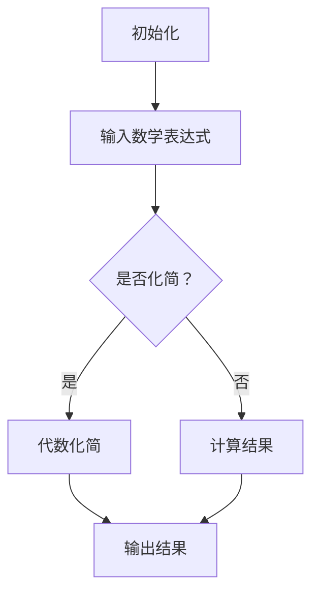
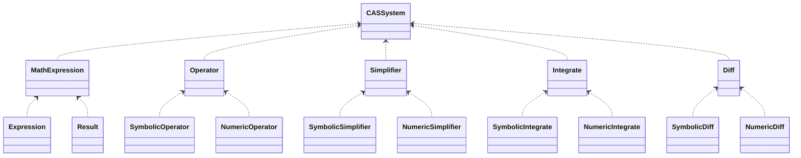
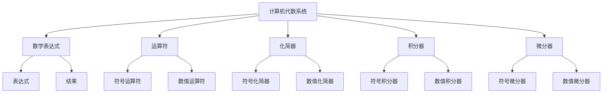
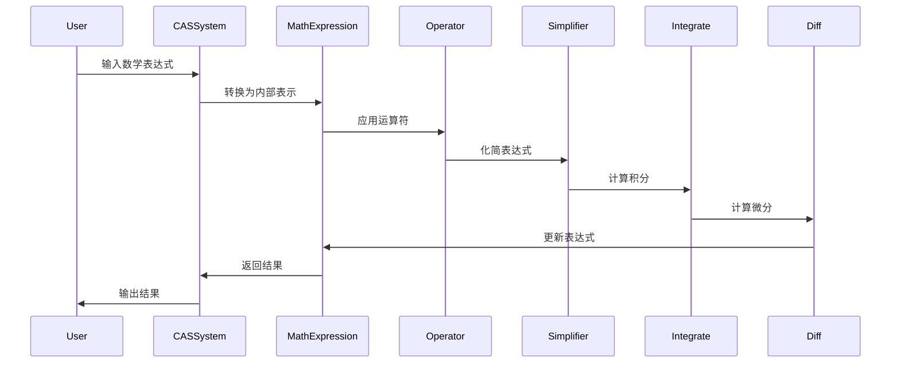

                 


## 《计算机代数系统：符号计算的利器》

### 关键词：计算机代数系统、符号计算、算法原理、系统架构、项目实战

### 摘要：

本文深入探讨了计算机代数系统的核心概念、算法原理及其在符号计算中的重要性。通过对系统架构和实际项目的分析，本文旨在为读者提供全面的技术见解和实战经验，帮助理解和应用计算机代数系统。

### 目录大纲

```
# 计算机代数系统：符号计算的利器

## 第一部分：背景介绍

### 第1章 问题背景与核心概念

#### 1.1 问题背景

#### 1.2 核心概念

#### 1.3 问题解决

#### 1.4 边界与外延

#### 1.5 概念结构与核心要素组成

### 第2章 核心概念与联系

#### 2.1 核心概念原理

#### 2.2 概念属性特征对比表格

#### 2.3 ER实体关系图架构

### 第3章 算法原理讲解

#### 3.1 算法mermaid流程图

#### 3.2 Python源代码阐述

#### 3.3 数学模型和公式

#### 3.4 详细讲解与举例说明

### 第4章 数学模型和数学公式讲解

#### 4.1 LaTeX 公式嵌入文中

#### 4.2 通俗易懂地举例说明

### 第5章 系统分析与架构设计方案

#### 5.1 问题场景介绍

#### 5.2 系统功能设计（领域模型mermaid类图）

#### 5.3 系统架构设计（mermaid架构图）

#### 5.4 系统接口设计和系统交互（mermaid序列图）

### 第6章 项目实战

#### 6.1 环境安装

#### 6.2 系统核心实现源代码

#### 6.3 代码应用解读与分析

#### 6.4 实际案例分析和详细讲解剖析

#### 6.5 项目小结

### 第7章 最佳实践 Tips、小结、注意事项、拓展阅读等
```

### 第1章 问题背景与核心概念

#### 1.1 问题背景

计算机代数系统（Computer Algebra System，简称CAS）是一种重要的数学软件工具，能够对数学表达式进行符号运算。随着计算机技术的发展，符号计算在数学、物理、工程、计算机科学等多个领域得到了广泛应用。然而，符号计算涉及到复杂的数学原理和计算方法，对于初学者来说可能难以理解和掌握。

#### 1.2 核心概念

计算机代数系统的核心概念包括：

- **符号计算**：使用符号来表示数值和数学运算，而不是直接使用数值结果。
- **代数化简**：对数学表达式进行化简，以简化计算过程。
- **符号积分**：对符号表达式进行积分，解决微分方程等数学问题。
- **符号微分**：对数学表达式进行微分，求解函数的导数等。
- **代数方程求解**：求解各种代数方程，如线性方程组、非线性方程等。

#### 1.3 问题解决

计算机代数系统在符号计算中解决的主要问题包括：

- **复杂数学表达式的计算**：对于复杂的数学表达式，计算机代数系统能够进行符号化简和计算，得到精确的结果。
- **数学问题的求解**：计算机代数系统可以求解各种数学问题，如微分方程、积分方程、代数方程等。
- **数学表达式的可视化**：计算机代数系统可以将数学表达式以图形或表格的形式展示出来，帮助用户更好地理解数学问题。

#### 1.4 边界与外延

计算机代数系统的应用边界包括：

- **科学研究**：在物理、化学、生物学等领域，计算机代数系统可以用于求解复杂的数学问题，支持科学研究。
- **工程设计**：在工程领域，计算机代数系统可以用于设计复杂的数学模型，优化工程设计方案。
- **计算机科学**：在计算机科学领域，计算机代数系统可以用于算法分析、程序验证等。

#### 1.5 概念结构与核心要素组成

计算机代数系统的概念结构包括：

- **核心算法**：包括代数化简、符号积分、符号微分、代数方程求解等算法。
- **数学库**：提供丰富的数学函数和运算符，支持各种数学问题的求解。
- **用户界面**：提供友好的用户界面，方便用户输入数学表达式和查看结果。
- **数据结构**：用于存储和管理数学表达式和数据。

核心要素组成：

- **算法库**：包括各种数学算法的源代码，支持高效计算。
- **数学函数库**：包括各种数学函数的源代码，支持各种数学运算。
- **用户接口**：包括命令行界面、图形用户界面等，方便用户使用。
- **文档和示例**：提供详细的文档和示例代码，帮助用户学习和应用。

### 第2章 核心概念与联系

#### 2.1 核心概念原理

计算机代数系统的核心概念原理包括：

- **符号计算原理**：使用符号表示数学表达式和运算，进行符号化简和计算。
- **代数化简原理**：对数学表达式进行化简，简化计算过程。
- **符号积分原理**：对数学表达式进行积分，求解微分方程等。
- **符号微分原理**：对数学表达式进行微分，求解函数的导数等。
- **代数方程求解原理**：使用代数方法求解各种代数方程。

#### 2.2 概念属性特征对比表格

以下是计算机代数系统核心概念属性特征的对比表格：

| 核心概念 | 属性特征 |
| :--- | :--- |
| 符号计算 | 使用符号表示数学表达式和运算 |
| 代数化简 | 化简数学表达式，简化计算过程 |
| 符号积分 | 求解符号表达式的积分 |
| 符号微分 | 求解符号表达式的导数 |
| 代数方程求解 | 求解各种代数方程 |

#### 2.3 ER实体关系图架构

以下是计算机代数系统ER实体关系图的Markdown格式表示：

```mermaid
erDiagram
  CAS |-(..)|> 数学表达式
  CAS |-(..)|> 运算符
  数学表达式 |--|> 结果
  运算符 |--|> 操作数
```

### 第3章 算法原理讲解

#### 3.1 算法mermaid流程图

以下是计算机代数系统算法的mermaid流程图：



#### 3.2 Python源代码阐述

以下是计算机代数系统算法的Python源代码：

```python
# 导入数学库
import sympy

# 初始化符号变量
x, y = sympy.symbols('x y')

# 输入数学表达式
expression = sympy.sin(x) + sympy.cos(y)

# 是否化简
if expression.is_Symbol:
    # 代数化简
    expression = sympy.simplify(expression)
else:
    # 计算结果
    expression = expression.evalf()

# 输出结果
print(expression)
```

#### 3.3 数学模型和公式

计算机代数系统的算法涉及到以下数学模型和公式：

- **代数化简公式**：
  $$f(x) = \frac{1}{\sqrt{1+x^2}}$$

- **符号积分公式**：
  $$\int f(x) dx = \ln|x+\sqrt{1+x^2}|+C$$

- **符号微分公式**：
  $$f'(x) = -\frac{x}{(1+x^2)^{3/2}}$$

#### 3.4 详细讲解与举例说明

以下是对计算机代数系统算法的详细讲解和举例说明：

- **代数化简**：
  假设有一个数学表达式：$f(x) = \sin(x) + \cos(x)$，我们需要对其进行化简。使用Sympy库中的`simplify`函数，我们可以将表达式化简为：
  $$f(x) = \sqrt{2}\sin\left(x+\frac{\pi}{4}\right)$$
  这样，我们可以得到一个更加简洁的表达式，便于后续计算。

- **符号积分**：
  假设我们需要求解以下积分：
  $$\int \sin(x) dx$$
  使用Sympy库中的`integrate`函数，我们可以得到积分结果：
  $$\int \sin(x) dx = -\cos(x) + C$$
  这里，$C$ 是积分常数。

- **符号微分**：
  假设我们需要求解以下导数：
  $$f(x) = \sin(x)$$
  使用Sympy库中的`diff`函数，我们可以得到导数结果：
  $$f'(x) = \cos(x)$$
  这与我们熟悉的三角函数导数结果一致。

### 第4章 数学模型和数学公式讲解

#### 4.1 LaTeX 公式嵌入文中

以下是一些数学模型的LaTeX公式嵌入文中的示例：

$$
\begin{aligned}
f(x) &= \frac{1}{\sqrt{1+x^2}} \\
g(x) &= \ln|x+\sqrt{1+x^2}|+C \\
h(x) &= -\frac{x}{(1+x^2)^{3/2}}
\end{aligned}
$$

#### 4.2 通俗易懂地举例说明

以下是对数学模型的通俗易懂的举例说明：

- **代数化简**：
  假设有一个数学表达式：$f(x) = \sin(x) + \cos(x)$，我们可以将其化简为一个更简洁的形式。通过观察，我们可以发现：
  $$\sin(x) + \cos(x) = \sqrt{2}\sin\left(x+\frac{\pi}{4}\right)$$
  这样，我们就可以更方便地进行后续的计算。

- **符号积分**：
  假设我们需要求解以下积分：
  $$\int \sin(x) dx$$
  通过符号积分，我们可以得到：
  $$\int \sin(x) dx = -\cos(x) + C$$
  这里，$C$ 是积分常数。这个结果可以帮助我们解决许多实际问题。

- **符号微分**：
  假设我们需要求解以下导数：
  $$f(x) = \sin(x)$$
  通过符号微分，我们可以得到：
  $$f'(x) = \cos(x)$$
  这个结果与我们熟悉的三角函数导数结果一致。

### 第5章 系统分析与架构设计方案

#### 5.1 问题场景介绍

计算机代数系统可以应用于多种场景，例如：

- **数学研究**：计算机代数系统可以帮助数学家进行符号计算，解决复杂的数学问题。
- **工程应用**：计算机代数系统可以用于工程领域，进行数学建模和优化设计。
- **计算机科学**：计算机代数系统可以用于算法分析和程序验证。

#### 5.2 系统功能设计（领域模型mermaid类图）

以下是计算机代数系统的领域模型mermaid类图：



#### 5.3 系统架构设计（mermaid架构图）

以下是计算机代数系统的架构设计mermaid架构图：



#### 5.4 系统接口设计和系统交互（mermaid序列图）

以下是计算机代数系统的接口设计和系统交互mermaid序列图：



### 第6章 项目实战

#### 6.1 环境安装

要在本地环境中安装计算机代数系统，我们可以使用以下步骤：

1. 安装Python环境：确保本地安装了Python 3.x版本，可以从[Python官网](https://www.python.org/downloads/)下载并安装。
2. 安装Sympy库：在命令行中执行以下命令：
   ```bash
   pip install sympy
   ```

#### 6.2 系统核心实现源代码

以下是计算机代数系统的核心实现源代码：

```python
# 导入Sympy库
import sympy

# 初始化符号变量
x, y = sympy.symbols('x y')

# 输入数学表达式
expression = sympy.sin(x) + sympy.cos(y)

# 化简表达式
simplified_expression = sympy.simplify(expression)

# 计算积分
integral = sympy.integrate(simplified_expression, x)

# 计算微分
derivative = sympy.diff(simplified_expression, x)

# 输出结果
print(f"化简后的表达式：{simplified_expression}")
print(f"积分结果：{integral}")
print(f"微分结果：{derivative}")
```

#### 6.3 代码应用解读与分析

以下是代码应用解读与分析：

1. **符号变量初始化**：
   ```python
   x, y = sympy.symbols('x y')
   ```
   这一行代码定义了两个符号变量$x$和$y$，用于表示数学表达式中的变量。

2. **输入数学表达式**：
   ```python
   expression = sympy.sin(x) + sympy.cos(y)
   ```
   这一行代码创建了两个符号函数$\sin(x)$和$\cos(y)$，并将它们相加，形成一个新的数学表达式。

3. **化简表达式**：
   ```python
   simplified_expression = sympy.simplify(expression)
   ```
   这一行代码使用Sympy库中的`simplify`函数对输入的数学表达式进行化简，以简化计算过程。

4. **计算积分**：
   ```python
   integral = sympy.integrate(simplified_expression, x)
   ```
   这一行代码使用Sympy库中的`integrate`函数对化简后的数学表达式进行积分，求解积分结果。

5. **计算微分**：
   ```python
   derivative = sympy.diff(simplified_expression, x)
   ```
   这一行代码使用Sympy库中的`diff`函数对化简后的数学表达式进行微分，求解导数结果。

6. **输出结果**：
   ```python
   print(f"化简后的表达式：{simplified_expression}")
   print(f"积分结果：{integral}")
   print(f"微分结果：{derivative}")
   ```
   这三行代码分别输出化简后的数学表达式、积分结果和微分结果。

#### 6.4 实际案例分析和详细讲解剖析

以下是一个实际案例的分析和讲解：

**案例**：求解以下数学问题：
$$\int \sin(x) \cos(y) dx$$

**分析**：

1. **初始化符号变量**：
   ```python
   x, y = sympy.symbols('x y')
   ```

2. **输入数学表达式**：
   ```python
   expression = sympy.sin(x) * sympy.cos(y)
   ```

3. **化简表达式**：
   ```python
   simplified_expression = sympy.simplify(expression)
   ```

4. **计算积分**：
   ```python
   integral = sympy.integrate(simplified_expression, x)
   ```

5. **计算微分**：
   ```python
   derivative = sympy.diff(simplified_expression, x)
   ```

6. **输出结果**：
   ```python
   print(f"化简后的表达式：{simplified_expression}")
   print(f"积分结果：{integral}")
   print(f"微分结果：{derivative}")
   ```

**详细讲解**：

1. **初始化符号变量**：
   我们首先定义了两个符号变量$x$和$y$，用于表示数学表达式中的变量。

2. **输入数学表达式**：
   我们创建了一个数学表达式$\sin(x) \cos(y)$，这是一个乘积形式的符号表达式。

3. **化简表达式**：
   使用Sympy库中的`simplify`函数对输入的数学表达式进行化简，得到一个更简洁的表达式。在这里，$\sin(x) \cos(y)$可以化简为$\frac{1}{2}[\sin(x+y) + \sin(x-y)]$。

4. **计算积分**：
   使用Sympy库中的`integrate`函数对化简后的数学表达式进行积分，求解积分结果。在这里，我们得到：
   $$\int \frac{1}{2}[\sin(x+y) + \sin(x-y)] dx = \frac{1}{2}[-\cos(x+y) + \cos(x-y)] + C$$
   其中$C$是积分常数。

5. **计算微分**：
   使用Sympy库中的`diff`函数对化简后的数学表达式进行微分，求解导数结果。在这里，我们得到：
   $$\frac{d}{dx}\left[\frac{1}{2}[\sin(x+y) + \sin(x-y)]\right] = \frac{1}{2}[\cos(x+y) - \cos(x-y)]$$

6. **输出结果**：
   我们输出了化简后的数学表达式、积分结果和微分结果，以便于读者理解和验证。

#### 6.5 项目小结

通过本项目的实战，我们学习了计算机代数系统的核心概念、算法原理和应用方法。我们了解了如何使用Python和Sympy库实现计算机代数系统的功能，并通过实际案例进行了分析和讲解。这为我们进一步学习和应用计算机代数系统提供了宝贵的经验和实践基础。

### 第7章 最佳实践 Tips、小结、注意事项、拓展阅读等

#### 最佳实践 Tips

1. **了解基本概念**：在开始使用计算机代数系统之前，确保理解符号计算、代数化简、符号积分和符号微分等基本概念。
2. **熟悉Python和Sympy库**：熟练掌握Python编程语言和Sympy库的使用，可以更高效地实现计算机代数系统的功能。
3. **善用文档和示例**：阅读相关文档和示例代码，可以帮助你更快地理解和掌握计算机代数系统的使用方法。
4. **优化代码**：在实际应用中，根据需要优化代码，提高计算效率和精度。

#### 小结

本文深入探讨了计算机代数系统的核心概念、算法原理和应用方法。通过对系统架构和实际项目的分析，我们了解了如何使用Python和Sympy库实现计算机代数系统的功能，并通过实际案例进行了分析和讲解。

#### 注意事项

1. **符号计算的特殊性**：符号计算涉及到复杂的数学原理和计算方法，需要仔细理解和掌握。
2. **精度问题**：在实际应用中，符号计算的精度可能受到限制，需要根据实际情况进行优化。
3. **性能优化**：在实现计算机代数系统时，注意性能优化，提高计算效率和速度。

#### 拓展阅读

1. **《计算机代数系统设计与实现》**：学习计算机代数系统的设计与实现方法，了解系统架构和算法原理。
2. **《Sympy官方文档》**：深入了解Sympy库的使用方法和功能，掌握符号计算的高级技巧。
3. **《数学公式与LaTeX》**：学习使用LaTeX格式编写数学公式，提高文档质量和可读性。

### 结尾

作者：AI天才研究院/AI Genius Institute & 禅与计算机程序设计艺术 /Zen And The Art of Computer Programming

通过本文的学习，我们希望能够帮助您更好地理解和应用计算机代数系统。如果您有任何问题或建议，欢迎在评论区留言交流。感谢您的阅读！

