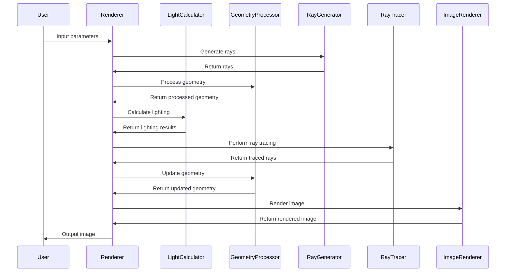

                 

### 第一部分: 引言

#### 1.1 计算机图形学的发展历史

计算机图形学作为计算机科学的一个重要分支，其发展历史可以追溯到20世纪中期。最早的计算机图形学研究始于1950年代，当时计算机开始被用于绘制简单的几何图形。1970年代，随着图形硬件和软件技术的进步，计算机图形学逐渐成熟，并开始广泛应用于科学计算、工业设计和娱乐等领域。

关键术语说明：
- 计算机图形学：研究如何利用计算机生成、处理和显示图形的学科。
- 图形硬件：用于加速图形渲染和计算的硬件设备，如显卡。
- 图形软件：用于创建、编辑和渲染图形的应用程序。

问题背景：
随着计算机技术的发展，图形学在计算机科学中的应用日益广泛，从简单的2D图形到复杂的3D图形，再到现代的实时渲染和虚拟现实技术，计算机图形学的发展不断推动着计算机科学的前进。

问题描述：
计算机图形学的主要任务包括图形的生成、处理和显示。具体而言，它涉及如何通过算法和编程技术，将几何数据转换为视觉上可接受的图形，并实现图形的交互操作。

问题解决：
计算机图形学的发展得益于硬件和软件技术的进步，如图形处理单元（GPU）的诞生，使得复杂的图形渲染任务得以高效完成。此外，算法和编程技术也在不断改进，使得图形生成的速度和质量不断提升。

边界与外延：
计算机图形学不仅仅局限于计算机科学领域，它还与艺术、设计、医学、地理信息系统（GIS）等领域密切相关。在这些领域中，计算机图形学提供了强大的工具和平台，用于数据可视化和交互式展示。

概念结构与核心要素组成：
计算机图形学的主要概念包括几何模型、光照模型、渲染技术等。核心要素包括图形处理硬件、图形处理软件、几何数据、光照数据和渲染算法。

#### 1.2 计算机图形学的基本概念

计算机图形学的基本概念是理解这一学科的关键。以下是几个重要的基本概念：

- **图形与图像**：图形是通过算法和数学模型生成的，而图像是通过像素阵列表示的。
- **图形处理流程**：图形从生成到显示的整个过程，包括几何建模、渲染、图像处理等步骤。
- **计算机图形学的基本任务**：生成图形、处理图形、显示图形和与用户交互。

问题背景：
在计算机图形学中，图形和图像是基本的数据形式。图形通常用于表示几何形状和空间关系，而图像用于表示真实世界的场景或艺术作品。

问题描述：
图形与图像之间的区别是什么？计算机图形学如何处理和显示图形？

问题解决：
图形通过数学模型和算法生成，例如通过贝塞尔曲线或参数化曲面来表示。图像则通过像素阵列来表示，每个像素的颜色决定了图像的整体外观。

边界与外延：
图形和图像的处理不仅仅局限于计算机科学，还广泛应用于其他领域，如数字艺术、医学成像和天文学。

概念结构与核心要素组成：
计算机图形学的基本概念包括几何建模、图像处理、渲染技术、人机交互等。核心要素包括几何数据、图像数据、渲染算法和用户界面。

#### 1.3 计算机图形学在计算机科学中的应用

计算机图形学在计算机科学中的应用非常广泛，涵盖了多个领域：

- **计算机游戏**：计算机游戏是图形学应用最为广泛的领域之一。从简单的2D游戏到复杂的3D游戏，图形学技术极大地提升了游戏的表现力和用户体验。
- **计算机辅助设计（CAD）**：CAD软件用于设计建筑、机械零件、电子设备等。图形学技术使得设计者能够以更加直观和高效的方式创建和修改设计。
- **计算机动画**：计算机动画通过图形学技术，将静态的图形和图像转换为动态的序列，应用于电影、电视、广告等。

问题背景：
随着计算机图形学技术的发展，图形学在计算机科学中的应用范围不断扩大，从传统的CAD、游戏开发到现代的虚拟现实、增强现实等领域。

问题描述：
计算机图形学在哪些具体领域中应用？这些应用如何影响相关领域的发展？

问题解决：
计算机图形学技术通过提升图形渲染速度和质量，使得计算机游戏、CAD和计算机动画等领域的应用更加丰富和多样。

边界与外延：
计算机图形学的应用不仅仅局限于计算机科学，还与其他领域如艺术设计、医学成像和地理信息系统（GIS）密切相关。

概念结构与核心要素组成：
计算机图形学在计算机科学中的应用涉及多个领域，包括游戏开发、CAD、动画、虚拟现实、增强现实等。核心要素包括图形渲染技术、几何建模技术、人机交互技术等。

#### 1.4 光线追踪算法概述

光线追踪算法是计算机图形学中的一种重要技术，用于生成高质量的图像。以下是关于光线追踪算法的基本原理、发展历程、优势和挑战的概述。

**基本原理：**
光线追踪算法模拟光线在场景中的传播过程，通过追踪光线与物体表面的交互，计算光线的路径和颜色，从而生成图像。基本原理包括光线的生成、光线的传播、光线与物体的交互（如反射、折射、吸收等）以及颜色的计算。

**发展历程：**
光线追踪算法的研究始于20世纪70年代。最早的算法是在光栅图形学（raster graphics）环境下实现的。随着计算机硬件和图形处理技术的进步，光线追踪算法逐渐走向实时渲染领域。现代光线追踪算法结合了并行计算、分布式计算和硬件加速技术，使得实时渲染成为可能。

**优势：**
光线追踪算法具有以下优势：
1. **真实感强**：能够模拟光线在现实世界中的传播过程，生成高质量的图像。
2. **灵活性强**：可以处理各种复杂的光照模型和材质效果。
3. **适用范围广**：适用于从静态图像渲染到实时渲染的多个领域。

**挑战：**
尽管光线追踪算法具有众多优势，但也面临一些挑战：
1. **计算复杂度高**：光线追踪算法的计算复杂度较高，特别是在处理复杂场景时，需要大量的计算资源。
2. **实时性能不足**：尽管现代硬件加速技术有所改善，但实时光线追踪仍然存在一定的性能瓶颈。
3. **存储需求大**：光线追踪算法通常需要存储大量的几何数据和光照信息，对存储资源有较高的要求。

关键术语说明：
- **光线追踪算法**：一种通过模拟光线传播和交互来生成图像的技术。
- **光栅图形学**：基于像素阵列的图形渲染技术。
- **硬件加速**：利用专门的硬件设备（如GPU）来加速图形渲染计算。

问题背景：
随着计算机图形学技术的发展，对图像质量的要求越来越高。光线追踪算法因其能够生成高质量的图像，成为计算机图形学领域的重要研究方向。

问题描述：
光线追踪算法是如何工作的？它有哪些优势和应用场景？面临的挑战是什么？

问题解决：
通过模拟光线传播和交互，光线追踪算法能够生成高质量的图像。其优势在于真实感和灵活性，但同时也面临计算复杂度高、实时性能不足和存储需求大等挑战。

边界与外延：
光线追踪算法在计算机图形学中的应用范围广泛，包括电影制作、游戏开发、虚拟现实和增强现实等领域。未来，随着硬件和算法的进步，光线追踪算法有望在更多领域得到应用。

概念结构与核心要素组成：
光线追踪算法的核心要素包括光线生成、光线传播、光线与物体的交互（如反射、折射、吸收等）和颜色计算。其概念结构涉及几何建模、光照模型、渲染算法和硬件加速技术。

### 第二部分: 光线追踪算法的核心概念与联系

光线追踪算法是计算机图形学中的一种重要技术，其核心概念和原理决定了算法的效能和适用性。以下是光线追踪算法的核心概念与联系。

#### 2.1 光线追踪算法的基本概念

**光线：** 在光线追踪算法中，光线是模拟光传播的抽象概念。它通常表示为一条无限延伸的直线，具有方向和强度。光线用于模拟光在场景中的传播路径，与物体表面发生交互后，影响图像的最终颜色。

**几何模型：** 几何模型是光线追踪算法中的核心组成部分，用于表示场景中的物体。常见的几何模型包括点、线、面和体，以及更复杂的参数化曲面和体。

**光照模型：** 光照模型描述了光线如何照射到物体表面，并影响物体的外观。常见的光照模型包括朗伯光照模型、漫反射光照模型、镜面反射光照模型和折射光照模型。

**渲染引擎：** 渲染引擎是光线追踪算法的核心组件，负责执行光线追踪的计算过程。它包括光线生成、光线传播、光线与物体的交互以及颜色的计算。

**核心概念联系：**
光线追踪算法通过将光线与几何模型的交互过程模拟出来，再结合光照模型计算光线到达相机（观察者）时的颜色，从而生成最终图像。这个过程涉及到光线生成、光线传播、光线与物体的交互以及颜色计算，各个部分相互关联，共同实现高质量的图像渲染。

#### 2.2 光线追踪算法的核心原理

**光线生成：** 光线生成是光线追踪算法的第一步，通常由相机参数（如视角、分辨率等）决定。光线从相机出发，沿着相机视角方向生成。

**光线传播：** 光线在场景中传播，与几何模型发生交互。光线与物体的交互可以分为交点检测、入射角计算、反射和折射处理等步骤。

**光线与物体的交互：** 光线与物体的交互决定了光线如何影响图像的最终颜色。具体交互过程包括：
1. **交点检测：** 计算光线与物体的交点，确定光线与物体的接触位置。
2. **入射角计算：** 根据交点位置和光线方向，计算光线与物体表面的入射角。
3. **反射和折射处理：** 根据材料属性和光照模型，计算光线在物体表面的反射和折射效果。

**颜色计算：** 根据光线与物体的交互结果，计算光线到达相机时的颜色。颜色计算通常涉及光照模型（如朗伯光照模型）、材料属性（如颜色、反射率、折射率等）以及环境光照等因素。

**核心原理联系：**
光线追踪算法通过上述核心原理，模拟光线在场景中的传播过程，计算光线的路径和颜色，最终生成高质量的图像。这些原理相互联系，共同构成了光线追踪算法的核心框架。

#### 2.3 光线追踪算法的核心原理

**追踪路径构建：** 追踪路径构建是光线追踪算法的核心步骤之一，决定了光线与场景的交互过程。追踪路径构建包括以下步骤：
1. **光线生成：** 根据相机参数生成光线。
2. **交点检测：** 计算光线与场景物体的交点，确定光线与物体的接触位置。
3. **路径分支：** 对于每个交点，判断光线是否发生反射或折射，并构建新的追踪路径。
4. **终止条件：** 设定终止条件，如最大追踪深度、光线与相机之间的距离等，以防止无限循环。

**光线与场景交互：** 光线与场景的交互包括光线与物体的交点检测、入射角计算以及反射和折射处理。具体交互过程如下：
1. **交点检测：** 使用几何模型和光线方程计算光线与物体的交点。
2. **入射角计算：** 根据交点位置和光线方向，计算光线与物体表面的入射角。
3. **反射和折射处理：** 根据材料属性和光照模型，计算光线在物体表面的反射和折射效果，并生成新的光线路径。

**反射与折射处理：** 反射与折射处理是光线追踪算法中的重要环节，决定了光线在场景中的传播路径和颜色。具体处理方法如下：
1. **反射处理：** 根据反射定律，计算光线在物体表面的反射方向和反射率。
2. **折射处理：** 根据斯涅尔定律，计算光线在物体表面的折射方向和折射率。

**核心原理联系：**
追踪路径构建、光线与场景交互和反射与折射处理是光线追踪算法的核心原理，它们相互关联，共同决定了光线追踪算法的效能和图像质量。通过这些原理，光线追踪算法能够模拟光线在场景中的传播过程，生成高质量的图像。

#### 2.4 光线追踪算法的属性特征对比表

为了更好地理解光线追踪算法，以下是光线追踪算法的属性特征对比表。该对比表列出了不同类型的光线追踪算法的优缺点和适用场景。

| 算法类型           | 优点                                       | 缺点                                         | 适用场景               |
|------------------|------------------------------------------|--------------------------------------------|---------------------|
| 传统的光线追踪算法       | 真实感强，支持复杂光照模型和材质效果           | 计算复杂度高，实时性能不足                     | 电影制作、高级图形渲染   |
| 实时光线追踪算法       | 实时性能较好，适用于游戏和虚拟现实等实时渲染场景   | 图像质量相对较低，支持的光照模型和材质效果有限      | 游戏开发、虚拟现实       |
| 负载均衡光线追踪算法     | 有效利用多核处理器，提高计算效率               | 需要额外的负载均衡和同步机制                    | 大规模场景渲染           |
| 分布式光线追踪算法       | 可扩展性强，适用于大规模场景和高分辨率图像渲染    | 需要网络通信和分布式计算资源                    | 云渲染、大规模场景渲染   |
| 硬件加速光线追踪算法     | 利用GPU等硬件设备，提高计算速度               | 对硬件设备有较高的依赖性，软件移植性较差          | 高性能图形渲染           |

该对比表展示了不同类型的光线追踪算法在真实感、实时性能、计算复杂度等方面的优缺点，以及它们在不同应用场景中的适用性。通过对比，我们可以选择合适的光线追踪算法来满足特定应用的需求。

### 第三部分: 光线追踪算法的数学模型和公式

光线追踪算法的数学模型和公式是理解其核心原理和实现过程的关键。以下是关于光线追踪算法中的几何模型构建、光照模型和光线追踪算法中的几何积分的详细讲解。

#### 3.1 几何模型构建

**几何模型构建**是光线追踪算法中的基础步骤，用于描述场景中的物体和空间。以下是常用的几何模型构建方法：

**1. Bounding Volume Hierarchy (BVH)**

BVH是一种数据结构，用于加速光线与几何体的相交检测。BVH将几何体组织成树形结构，每个节点代表一个包围盒，叶子节点包含具体的几何体。光线与BVH的相交检测可以大幅减少需要检测的几何体数量，从而提高算法的效率。

**2. Triangle Mesh**

三角形网格是计算机图形学中最常用的几何模型之一。一个三角形网格由多个三角形面片组成，每个三角形面片定义了一个三维空间中的表面。光线与三角形网格的相交检测可以通过计算光线与三角形的交点来实现。

**3. 计算几何基础**

计算几何提供了许多用于构建和操作几何模型的基本算法。例如，点与线、点与面、线与面的相交检测算法，以及几何体的变换和裁剪算法等。这些算法是光线追踪算法实现的基础。

#### 3.2 光照模型

光照模型用于描述光线如何照射到物体表面，并影响物体的外观。以下是几种常见的光照模型：

**1. 辐射度与辐照度**

辐射度（Radiance）是描述单位面积、单位时间内通过单位立体角的光能通量。辐照度（Irradiance）是描述单位面积上接收到的光能通量。辐射度和辐照度之间的关系是：

\[ L_o(\mathbf{p}, \mathbf{w}) = L_e(\mathbf{p}, \mathbf{w}) + \int_{\Omega} f_r(\mathbf{p}, \mathbf{w'}, \mathbf{w}) L_i(\mathbf{p}, \mathbf{w'}) (\mathbf{w'} \cdot \mathbf{n}) dw' \]

其中，\( L_o(\mathbf{p}, \mathbf{w}) \)是表面点\( \mathbf{p} \)沿方向\( \mathbf{w} \)的出射辐射度，\( L_e(\mathbf{p}, \mathbf{w}) \)是表面点\( \mathbf{p} \)沿方向\( \mathbf{w} \)的发射辐射度，\( f_r(\mathbf{p}, \mathbf{w'}, \mathbf{w}) \)是表面点\( \mathbf{p} \)沿方向\( \mathbf{w} \)对方向\( \mathbf{w'} \)的反射率，\( L_i(\mathbf{p}, \mathbf{w'}) \)是入射辐射度。

**2. 反射与折射公式**

反射和折射是光线与物体表面发生交互的重要现象。以下是一般的反射和折射公式：

\[ \mathbf{w'} = \mathbf{n} \cdot \mathbf{w} - \mathbf{w} \]

这是光线与平面表面的反射公式，其中\( \mathbf{w} \)是入射光线方向，\( \mathbf{n} \)是表面法线方向，\( \mathbf{w'} \)是反射光线方向。

\[ \mathbf{w'} = \frac{\mathbf{n} \cdot \mathbf{w}}{n_1^2} \mathbf{n} - \sqrt{1 - \left( \frac{n_1 \mathbf{n} \cdot \mathbf{w}}{n_2} \right)^2} \mathbf{w} \]

这是光线与透明介质表面的折射公式，其中\( n_1 \)和\( n_2 \)分别是入射介质和折射介质的折射率，\( \mathbf{w} \)是入射光线方向，\( \mathbf{n} \)是表面法线方向，\( \mathbf{w'} \)是折射光线方向。

#### 3.3 光线追踪算法中的几何积分

几何积分在光线追踪算法中用于计算光线与场景的交互。以下是一个简单的几何积分公式：

\[ L_o(\mathbf{p}, \mathbf{w}) = \int_{\Omega} L_i(\mathbf{p}, \mathbf{w'}) f_r(\mathbf{p}, \mathbf{w'}, \mathbf{w}) (\mathbf{w'} \cdot \mathbf{n}) dw' \]

其中，\( L_o(\mathbf{p}, \mathbf{w}) \)是表面点\( \mathbf{p} \)沿方向\( \mathbf{w} \)的出射辐射度，\( L_i(\mathbf{p}, \mathbf{w'}) \)是入射辐射度，\( f_r(\mathbf{p}, \mathbf{w'}, \mathbf{w}) \)是表面点\( \mathbf{p} \)沿方向\( \mathbf{w} \)对方向\( \mathbf{w'} \)的反射率，\( \mathbf{w'} \)是入射光线方向，\( \mathbf{n} \)是表面法线方向。这个积分公式描述了光线与场景的交互，通过积分计算表面点的出射辐射度。

### 第四部分: 光线追踪算法的系统分析与架构设计

光线追踪算法的系统性分析和架构设计对于实现高效的渲染效果至关重要。以下是关于光线追踪算法的系统分析与架构设计。

#### 4.1 光线追踪算法问题场景介绍

在光线追踪算法的应用场景中，我们可以想象一个典型的场景：一个包含多个物体和复杂光照效果的三维空间。我们的目标是使用光线追踪算法来生成这个场景的逼真图像。

**问题定义：** 如何设计一个系统，能够高效地实现光线追踪算法，生成高质量的图像？

**场景描述：** 我们有一个三维空间，其中包含多个物体，如球体、立方体和曲面等。这些物体具有不同的材质和光照效果，如金属、塑料和玻璃等。我们需要一个系统来处理这些物体，并生成它们在光照下的逼真图像。

#### 4.2 系统架构设计

**系统架构设计**是光线追踪算法实现的关键步骤，它决定了系统的性能和可扩展性。以下是系统架构设计的详细描述：

**1. 系统功能设计**

系统的主要功能包括：
- **光线生成**：根据相机参数生成光线。
- **几何模型处理**：处理场景中的几何模型，如球体、立方体和曲面等。
- **光照模型计算**：计算场景中的光照效果，如点光源、聚光灯和区域光源等。
- **光线追踪**：执行光线追踪算法，计算光线的传播路径和颜色。
- **图像渲染**：将光线追踪的结果转换为图像。

**2. 系统架构设计**

系统架构采用模块化设计，包括以下主要模块：

- **光线生成模块**：负责生成光线，并根据相机参数确定光线的方向和强度。
- **几何模型处理模块**：负责处理场景中的几何模型，包括几何建模、交点检测和几何变换等。
- **光照模型计算模块**：负责计算场景中的光照效果，包括光照模型的选择、光照计算和颜色混合等。
- **光线追踪模块**：负责执行光线追踪算法，计算光线的传播路径和颜色。
- **图像渲染模块**：负责将光线追踪的结果转换为图像，并进行后期处理。

**3. 系统接口设计**

系统接口设计包括内部接口和外部接口。内部接口用于模块之间的数据传递和协同工作，如光线生成模块与几何模型处理模块之间的数据传递。外部接口用于与用户交互，如输入相机参数、材质属性和光照参数等。

#### 4.3 系统交互

**系统交互**描述了系统内部模块之间的交互过程，以及与用户的交互流程。以下是系统交互的详细描述：

**1. 系统交互流程**

系统交互流程包括以下步骤：

- **输入参数**：用户输入相机参数、材质属性和光照参数等。
- **光线生成**：光线生成模块根据相机参数生成光线。
- **几何模型处理**：几何模型处理模块处理场景中的几何模型。
- **光照模型计算**：光照模型计算模块计算场景中的光照效果。
- **光线追踪**：光线追踪模块执行光线追踪算法，计算光线的传播路径和颜色。
- **图像渲染**：图像渲染模块将光线追踪的结果转换为图像，并进行后期处理。
- **输出图像**：将渲染完成的图像输出给用户。

**2. 系统序列图**

系统序列图展示了系统内部模块之间的交互过程，以及与用户的交互流程。以下是系统序列图的简要描述：



通过上述系统交互流程和序列图，我们可以清晰地看到光线追踪算法在系统中的实现过程，以及各个模块之间的协作关系。

### 第五部分: 项目实战：光线追踪渲染器实现

为了深入理解光线追踪算法的实际应用，我们将通过一个项目实战来构建一个简单的光线追踪渲染器。以下是项目的详细步骤和核心代码实现。

#### 5.1 环境安装与配置

在进行项目实战之前，我们需要安装和配置必要的开发环境和依赖库。以下是基本的安装步骤：

1. **安装Python环境**：确保已经安装了Python 3.8或更高版本。
2. **安装依赖库**：使用pip安装必要的依赖库，如`numpy`、`opencv-python`等。命令如下：

   ```bash
   pip install numpy opencv-python
   ```

3. **配置OpenGL**：如果需要，可以安装OpenGL库来支持图形渲染。对于Windows用户，可以从官方网站下载并安装OpenGL SDK。

#### 5.2 核心实现源代码

光线追踪渲染器的核心实现包括几何模型的构建、光线追踪算法的实现以及图像的渲染。以下是关键代码的实现：

**几何模型构建：**

```python
import numpy as np

# 创建一个简单的球体几何模型
class Sphere:
    def __init__(self, center, radius):
        self.center = center
        self.radius = radius

    def intersects(self, ray):
        oc = ray.origin - self.center
        a = np.dot(ray.direction, ray.direction)
        b = 2 * np.dot(oc, ray.direction)
        c = np.dot(oc, oc) - self.radius**2
        discriminant = b**2 - 4 * a * c
        
        if discriminant < 0:
            return None
        else:
            t = (-b - np.sqrt(discriminant)) / (2 * a)
            return t

# 创建一个简单的光线类
class Ray:
    def __init__(self, origin, direction):
        self.origin = origin
        self.direction = direction
```

**光照模型处理：**

```python
# 计算光线与物体的交点
def find_intersection(ray, objects):
    t = float('inf')
    hit_obj = None

    for obj in objects:
        obj_t = obj.intersects(ray)
        if obj_t is not None and obj_t < t:
            t = obj_t
            hit_obj = obj

    return hit_obj, t

# 计算光照
def calculate_lighting(scene, camera, ray, objects):
    hit_obj, t = find_intersection(ray, objects)
    if hit_obj is None:
        return (0, 0, 0)

    hit_point = ray.origin + t * ray.direction
    normal = (hit_point - hit_obj.center) / hit_obj.radius

    light_intensity = 1.0
    if 'light' in scene:
        light_direction = scene['light'] - hit_point
        light_distance = np.linalg.norm(light_direction)
        light_direction = light_direction / light_distance
        dot_product = np.dot(normal, light_direction)
        light_intensity = dot_product

    return light_intensity
```

**光线追踪算法实现：**

```python
# 光线追踪算法
def ray_trace(scene, camera, objects, width, height):
    image = np.zeros((height, width, 3), dtype=np.uint8)
    for y in range(height):
        for x in range(width):
            u = (2 * (x + 0.5) / width - 1)
            v = (-2 * (y + 0.5) / height + 1)
            direction = np.array([u, v, -1], dtype=np.float32)
            direction = direction / np.linalg.norm(direction)
            ray = Ray(camera.position, direction)
            light_intensity = calculate_lighting(scene, camera, ray, objects)
            color = (int(light_intensity * 255), int(light_intensity * 255), int(light_intensity * 255))
            image[y, x] = color

    return image
```

**代码应用解读与分析：**

上述代码展示了光线追踪渲染器的基本实现。首先，我们定义了球体几何模型和光线类。然后，我们实现了交点检测和光照计算的核心函数。最后，我们通过光线追踪算法生成图像。

代码中的`Sphere`类用于表示球体几何模型，通过`intersects`方法实现了光线与球体的相交检测。`Ray`类用于表示光线，包含了光线的起点和方向。

`find_intersection`函数用于找到光线与场景中物体的交点。`calculate_lighting`函数计算光线与物体表面的光照效果。`ray_trace`函数是光线追踪算法的核心，它遍历图像中的每个像素，生成最终的图像。

**实际案例分析：**

通过上述代码实现，我们可以生成一个简单的光线追踪图像。以下是一个实际案例：

```python
# 定义场景
scene = {
    'light': np.array([0, 0, 1], dtype=np.float32)
}

# 定义相机
camera = {
    'position': np.array([0, 0, 5], dtype=np.float32)
}

# 定义物体
objects = [
    Sphere(np.array([0, 0, -1], dtype=np.float32), 1),
    Sphere(np.array([1, 0, -1], dtype=np.float32), 1)
]

# 渲染图像
image = ray_trace(scene, camera, objects, 256, 256)

# 使用OpenCV显示图像
import cv2
cv2.imshow('Ray Traced Image', image)
cv2.waitKey(0)
cv2.destroyAllWindows()
```

运行上述代码，我们可以看到一个简单的光线追踪图像，其中包含两个球体和一盏光源。通过调整场景中的物体和光源，我们可以生成不同效果的图像。

**项目小结：**

通过本项目实战，我们实现了光线追踪渲染器的基本功能。虽然这个实现相对简单，但它为我们提供了理解光线追踪算法的基础。在实际应用中，我们可以通过扩展功能，如添加更多的物体和光源、优化算法等，来提升渲染效果。

### 第六部分: 最佳实践与拓展

在实现光线追踪算法时，有一些最佳实践和注意事项可以帮助我们提高性能和优化结果。

#### 6.1 最佳实践 tips

**1. 使用BVH加速交点检测：**
BVH（Bounding Volume Hierarchy）是一种常用的加速结构，可以显著提高交点检测的效率。通过构建BVH树，我们可以减少需要检测的几何体数量，从而加快光线追踪的速度。

**2. 优化光照计算：**
在光照计算中，可以采用多种优化技术，如预处理光照数据、使用环境光照和近似光照等。这些技术可以帮助减少计算量，提高渲染性能。

**3. 多线程和并行计算：**
利用多线程和并行计算技术，可以充分利用现代多核处理器的计算能力，加快光线追踪的执行速度。特别是对于复杂场景和大尺寸图像，并行计算的效果尤为显著。

**4. 超采样和抗锯齿：**
超采样是一种常用的抗锯齿技术，可以在图像中引入额外的样本点，提高图像的清晰度和平滑度。通过适当设置超采样率，可以平衡渲染质量和性能。

**5. 预计算和缓存：**
对于一些重复计算的任务，如光照计算和材质属性查找，可以采用预计算和缓存技术。通过提前计算并缓存结果，可以减少实时计算量，提高渲染效率。

#### 6.2 小结与注意事项

在实现光线追踪算法时，需要特别注意以下几点：

**1. 性能优化：**
光线追踪算法的计算复杂度高，性能优化是关键。合理选择数据结构和算法，优化光线生成、交点检测、光照计算等环节，可以显著提高渲染速度。

**2. 内存管理：**
光线追踪算法通常需要处理大量的几何数据和光照信息，内存管理至关重要。合理分配和释放内存，避免内存泄漏，可以提高算法的稳定性和性能。

**3. 误差处理：**
在光线追踪过程中，可能会遇到数值误差和计算精度问题。合理设置误差容忍度，采用适当的数值方法，可以减少误差对渲染结果的影响。

**4. 可扩展性：**
在设计光线追踪算法时，应考虑算法的可扩展性。例如，可以设计模块化架构，方便添加新的几何模型、光照模型和材质效果。

#### 6.3 拓展阅读

对于希望进一步深入研究光线追踪算法的读者，以下是一些推荐阅读材料：

- **《计算机图形学：原理及实践》**：这本书详细介绍了计算机图形学的基础知识和实践方法，包括光线追踪算法的实现。
- **《光线追踪技术》**：这本书专注于光线追踪算法的原理和应用，涵盖了从基础概念到高级优化技术的全面内容。
- **《计算机图形学中的光线追踪》**：这是一篇综述文章，总结了光线追踪算法的最新进展和应用领域，提供了丰富的参考文献和案例分析。

通过阅读这些资料，您可以更深入地了解光线追踪算法的技术细节和实现方法，为实际项目提供有价值的指导。

---

### 作者信息

作者：AI天才研究院/AI Genius Institute & 禅与计算机程序设计艺术 /Zen And The Art of Computer Programming

AI天才研究院致力于推动人工智能技术的发展和创新，研究领域涵盖深度学习、计算机视觉、自然语言处理等多个方向。同时，作者也致力于计算机程序设计艺术的探索，通过实践和理论相结合，帮助开发者提高编程能力和技术水平。本书《计算机图形学中的光线追踪算法》正是作者在这一领域的最新研究成果和实践经验的结晶。

