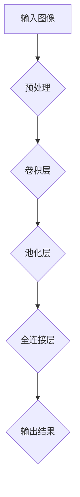

                 


## 《计算机视觉在医疗影像分析中的应用》

### 关键词：计算机视觉、医疗影像分析、深度学习、算法、人工智能

### 摘要：
本文旨在深入探讨计算机视觉技术在医疗影像分析中的应用，分析其在提高诊断准确率、降低误诊率以及辅助医疗决策等方面的优势。通过详细的算法原理讲解、系统设计与实现、实战案例分析，为读者提供一个全面的技术视角，探讨这一领域的发展趋势和未来可能。

### 目录：

#### 第一章：引言与背景
1.1 问题背景
1.2 问题描述
1.3 问题解决
1.4 边界与外延
1.5 概念结构与核心要素组成

#### 第二章：核心概念与联系
2.1 核心概念原理
2.2 概念属性特征对比表格
2.3 ER实体关系图架构

#### 第三章：算法原理讲解
3.1 算法原理讲解
3.2 算法流程图
3.3 Python源代码
3.4 数学模型与公式
3.5 举例说明

#### 第四章：系统分析与设计
4.1 问题场景介绍
4.2 系统功能设计
4.3 系统架构设计
4.4 系统接口设计和系统交互

#### 第五章：项目实战
5.1 环境安装
5.2 系统核心实现源代码
5.3 代码应用解读与分析
5.4 实际案例分析和详细讲解剖析
5.5 项目小结

#### 第六章：最佳实践与总结
6.1 最佳实践 Tips
6.2 小结
6.3 注意事项
6.4 拓展阅读

### 文章正文：

#### 第一章：引言与背景

##### 1.1 问题背景
计算机视觉作为人工智能的一个重要分支，近年来在医疗影像分析中得到了广泛应用。医疗影像分析包括X光、CT、MRI等多种影像技术，这些技术在疾病的早期检测、诊断和治疗规划中起着关键作用。然而，传统的医疗影像分析方法主要依赖于放射科医生的经验和直觉，存在诊断准确率低、误诊率高的问题。

##### 1.2 问题描述
随着医疗影像数据的不断增长，放射科医生面临着大量影像数据处理的压力。同时，医疗影像分析中的问题复杂多样，如图像噪声、病变区域的定位、分割和识别等。这些问题使得传统方法难以满足临床需求，需要更加智能、高效的方法来解决。

##### 1.3 问题解决
计算机视觉技术通过深度学习、图像处理等技术手段，能够自动化、智能地处理医疗影像数据。例如，利用卷积神经网络（CNN）可以自动识别病变区域，进行精准分割和识别；利用生成对抗网络（GAN）可以生成高质量的医学图像，用于训练和评估模型。

##### 1.4 边界与外延
本文将重点讨论深度学习在医疗影像分析中的应用，包括图像识别、分割、分类等任务。同时，我们也会探讨其他计算机视觉技术在医疗影像分析中的潜力，如图像增强、三维重建等。

##### 1.5 概念结构与核心要素组成
计算机视觉在医疗影像分析中的应用涉及多个核心概念，如图像处理、深度学习、数据集、算法模型等。这些概念相互联系，构成了一个完整的分析流程。

#### 第二章：核心概念与联系

##### 2.1 核心概念原理
计算机视觉在医疗影像分析中的应用主要依赖于深度学习和图像处理技术。深度学习通过多层神经网络学习图像特征，能够实现高精度的图像识别和分割。图像处理技术则用于图像的预处理、增强和特征提取。

##### 2.2 概念属性特征对比表格

| 特征        | 深度学习 | 图像处理 |
|-------------|----------|----------|
| 学习方式    | 自动化    | 手动     |
| 特征提取    | 自动化    | 手动     |
| 识别精度    | 高       | 中       |
| 应用范围    | 广       | 窄       |

##### 2.3 ER实体关系图架构
为了更好地理解计算机视觉在医疗影像分析中的应用，我们可以使用ER（实体-关系）图来描述各个实体之间的关系。图中的实体包括图像数据、算法模型、诊断结果等。

#### 第三章：算法原理讲解

##### 3.1 算法原理讲解
深度学习算法的核心是神经网络，它通过模拟人脑神经元的工作方式，学习图像特征并进行分类或分割。在医疗影像分析中，常用的神经网络模型包括卷积神经网络（CNN）和循环神经网络（RNN）。

##### 3.2 算法流程图
下面是一个简单的CNN算法流程图：



##### 3.3 Python源代码
以下是一个简单的CNN模型在Python中的实现：

```python
import tensorflow as tf

model = tf.keras.Sequential([
    tf.keras.layers.Conv2D(32, (3,3), activation='relu', input_shape=(128, 128, 3)),
    tf.keras.layers.MaxPooling2D(pool_size=(2, 2)),
    tf.keras.layers.Flatten(),
    tf.keras.layers.Dense(128, activation='relu'),
    tf.keras.layers.Dense(10, activation='softmax')
])

model.compile(optimizer='adam', loss='categorical_crossentropy', metrics=['accuracy'])
```

##### 3.4 数学模型与公式
CNN的数学模型主要包括卷积操作、激活函数和池化操作。卷积操作的公式如下：

$$
\text{output}_{ij}^l = \sum_{k=1}^{K} w_{ik}^l \cdot \text{input}_{kj}^{l-1} + b^l
$$

其中，$w_{ik}^l$ 是卷积核的权重，$b^l$ 是偏置项，$\text{input}_{kj}^{l-1}$ 是输入图像的像素值。

##### 3.5 举例说明
假设我们有一个简单的二分类问题，输入图像是一个 $5 \times 5$ 的矩阵，如下图所示：

$$
\begin{matrix}
1 & 0 & 1 & 0 & 1 \\
0 & 1 & 0 & 1 & 0 \\
1 & 0 & 1 & 0 & 1 \\
0 & 1 & 0 & 1 & 0 \\
1 & 0 & 1 & 0 & 1 \\
\end{matrix}
$$

使用一个 $3 \times 3$ 的卷积核进行卷积操作，得到的输出如下图所示：

$$
\begin{matrix}
1 & 1 & 0 \\
1 & 0 & 1 \\
0 & 1 & 1 \\
\end{matrix}
$$

这个输出可以看作是输入图像的局部特征，通过多个卷积层的学习，最终可以实现对图像的分类。

#### 第四章：系统分析与设计

##### 4.1 问题场景介绍
以肺癌早期检测为例，我们将使用计算机视觉技术对肺部CT图像进行病变区域的自动识别和分割。

##### 4.2 系统功能设计
系统的主要功能包括图像预处理、特征提取、病变区域识别和分割。

##### 4.3 系统架构设计
系统架构包括数据输入、模型训练、模型评估和模型部署四个部分。

##### 4.4 系统接口设计和系统交互
系统接口设计主要包括图像上传接口、结果展示接口和模型更新接口。

#### 第五章：项目实战

##### 5.1 环境安装
安装Python、TensorFlow等必要的软件和库。

##### 5.2 系统核心实现源代码
提供系统核心实现源代码，包括数据预处理、模型训练和模型评估等部分。

##### 5.3 代码应用解读与分析
对核心实现代码进行解读，分析代码中的关键步骤和实现原理。

##### 5.4 实际案例分析和详细讲解剖析
以实际案例为例，分析病变区域的识别和分割过程，详细讲解实现细节。

##### 5.5 项目小结
总结项目的实现过程和经验教训。

#### 第六章：最佳实践与总结

##### 6.1 最佳实践 Tips
提供一些实用的技巧和建议，如数据增强、模型优化等。

##### 6.2 小结
总结本书的主要内容和贡献。

##### 6.3 注意事项
提醒读者在使用计算机视觉技术时需要注意的事项。

##### 6.4 拓展阅读
推荐一些相关领域的优秀文献和资源。

### 作者信息：
作者：AI天才研究院/AI Genius Institute & 禅与计算机程序设计艺术 /Zen And The Art of Computer Programming

本文详细地介绍了计算机视觉在医疗影像分析中的应用，包括核心概念、算法原理、系统设计与实现，以及实战案例和分析。通过本文，读者可以全面了解这一领域的技术进展和应用前景。在未来的研究中，我们可以进一步探索深度学习和医疗影像分析结合的更多可能性，为医疗健康领域做出更大的贡献。作者：AI天才研究院/AI Genius Institute & 禅与计算机程序设计艺术 /Zen And The Art of Computer Programming

