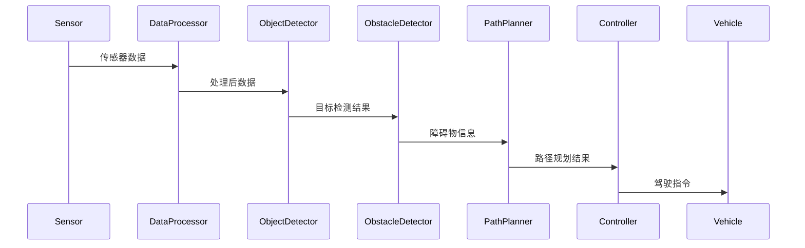
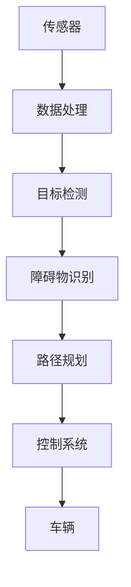

                 

# 计算机视觉在自动驾驶中的应用：提高感知能力和安全性

> 关键词：自动驾驶、计算机视觉、深度学习、感知系统、安全性

> 摘要：本文旨在探讨计算机视觉在自动驾驶领域中的应用，特别是在提高感知能力和安全性方面的贡献。首先，我们将回顾自动驾驶的发展历程和计算机视觉的基本概念，然后深入分析计算机视觉在自动驾驶中的应用，包括边缘检测、目标检测和人脸识别等核心算法。接着，我们将探讨深度学习在计算机视觉中的应用，并分析自动驾驶感知系统的架构设计。最后，我们将通过一个实际项目，详细说明系统核心实现过程和经验教训，并提供最佳实践建议。

### 目录大纲设计思路

为了设计出《计算机视觉在自动驾驶中的应用：提高感知能力和安全性》这本书的完整目录大纲，我们将遵循以下步骤：

1. **背景介绍与核心概念**：
   - 简述自动驾驶的发展背景及计算机视觉在其中的作用。
   - 定义关键概念，如计算机视觉、深度学习、自动驾驶感知系统等。

2. **核心概念与联系**：
   - 分析计算机视觉的核心概念及其属性特征，制作概念对比表格。
   - 利用Mermaid绘制实体关系图，展示自动驾驶系统中各个关键实体及其关系。

3. **算法原理讲解**：
   - 选择几种在自动驾驶计算机视觉中应用广泛的算法，绘制Mermaid流程图。
   - 使用Python源代码和LaTeX公式详细讲解算法原理，并举例说明。

4. **系统分析与架构设计方案**：
   - 介绍自动驾驶感知系统问题场景和项目背景。
   - 利用Mermaid绘制领域模型类图、系统架构图和系统交互序列图。
   - 描述系统功能设计和接口设计。

5. **项目实战**：
   - 详细说明环境安装和系统核心实现过程。
   - 对代码应用进行解读与分析，结合实际案例进行讲解。
   - 对项目进行小结，总结经验教训。

6. **最佳实践 tips、小结、注意事项、拓展阅读**：
   - 提供实际应用中的最佳实践建议。
   - 总结全书内容，指出注意事项。
   - 推荐进一步阅读的资源。

### 目录大纲内容设计

**第1章: 自动驾驶与计算机视觉概述**

- 1.1 自动驾驶技术背景
  - 1.1.1 自动驾驶的定义与发展历程
  - 1.1.2 自动驾驶的分类与等级
  - 1.1.3 自动驾驶技术的挑战与机遇

- 1.2 计算机视觉在自动驾驶中的应用
  - 1.2.1 计算机视觉的基本概念
  - 1.2.2 计算机视觉在自动驾驶中的作用
  - 1.2.3 计算机视觉技术的发展趋势

- 1.3 计算机视觉核心概念与联系
  - 1.3.1 图像处理、计算机视觉与深度学习的区别与联系
  - 1.3.2 核心概念对比表格
  - 1.3.3 实体关系图：自动驾驶感知系统架构

**第2章: 计算机视觉基础算法**

- 2.1 边缘检测算法
  - 2.1.1 边缘检测的基本原理
  - 2.1.2 Sobel、Canny算法解释与Python实现
  - 2.1.3 边缘检测的实际应用

- 2.2 目标检测算法
  - 2.2.1 目标检测的基本概念
  - 2.2.2 R-CNN、YOLO算法原理与Python代码示例
  - 2.2.3 目标检测的应用场景

- 2.3 人脸识别算法
  - 2.3.1 人脸识别的基本原理
  - 2.3.2 Eigenface、LBP算法原理与Python代码示例
  - 2.3.3 人脸识别的应用场景

**第3章: 深度学习在计算机视觉中的应用**

- 3.1 卷积神经网络（CNN）简介
  - 3.1.1 CNN的基本结构
  - 3.1.2 CNN的工作原理
  - 3.1.3 CNN在计算机视觉中的应用

- 3.2 卷积神经网络在自动驾驶中的应用
  - 3.2.1 CNN在自动驾驶感知中的应用场景
  - 3.2.2 CNN模型构建与优化
  - 3.2.3 CNN在实际项目中的案例分析

**第4章: 自动驾驶感知系统架构设计**

- 4.1 自动驾驶感知系统概述
  - 4.1.1 感知系统在自动驾驶中的作用
  - 4.1.2 感知系统的主要组成部分
  - 4.1.3 感知系统的设计原则

- 4.2 系统功能设计
  - 4.2.1 功能需求分析
  - 4.2.2 领域模型类图设计
  - 4.2.3 功能模块划分与设计

- 4.3 系统架构设计
  - 4.3.1 架构设计原则与目标
  - 4.3.2 系统架构图绘制
  - 4.3.3 系统模块关系与交互

**第5章: 自动驾驶感知系统接口设计**

- 5.1 接口设计原则与方法
  - 5.1.1 接口设计的基本原则
  - 5.1.2 接口设计的方法与工具

- 5.2 系统接口设计
  - 5.2.1 接口需求分析
  - 5.2.2 接口定义与实现
  - 5.2.3 接口测试与优化

- 5.3 系统交互设计
  - 5.3.1 系统交互流程分析
  - 5.3.2 系统交互序列图设计
  - 5.3.3 交互性能评估与优化

**第6章: 自动驾驶感知系统项目实战**

- 6.1 项目背景与目标
  - 6.1.1 项目背景介绍
  - 6.1.2 项目目标与需求

- 

----------------------------------------------------------------

## 第1章：自动驾驶与计算机视觉概述

### 1.1 自动驾驶技术背景

#### 1.1.1 自动驾驶的定义与发展历程

自动驾驶，也被称为智能驾驶，是指通过计算机程序和机器学习算法来实现车辆自主导航和控制的技术。这一概念最早可以追溯到20世纪50年代，当时科学家们开始研究如何让机器人自主移动。随着时间的推移，自动驾驶技术逐渐从理论研究走向实际应用。

自动驾驶的发展可以分为几个关键阶段：

1. **早期探索阶段（1950-1970s）**：这个阶段主要集中在理论和算法的研究上，主要目标是解决路径规划和避障问题。

2. **模拟测试阶段（1980-1990s）**：随着计算机技术的发展，自动驾驶技术开始进入模拟测试阶段。在这个阶段，研究人员通过模拟环境来测试自动驾驶算法的性能。

3. **实际测试阶段（2000-2010s）**：在这个阶段，自动驾驶技术开始在真实环境中进行测试。例如，谷歌和特斯拉等公司开始进行自动驾驶汽车的测试。

4. **商业化阶段（2010s至今）**：随着深度学习和人工智能技术的突破，自动驾驶技术逐渐走向商业化。许多汽车制造商和科技公司正在开发自动驾驶汽车，并计划在未来几年内将其推向市场。

#### 1.1.2 自动驾驶的分类与等级

自动驾驶技术可以根据其自主程度和功能进行分类。以下是目前常用的自动驾驶等级：

1. **L0：无自动化**：车辆完全由人类驾驶员控制，没有任何自动化辅助。

2. **L1：单一功能自动化**：车辆提供一些自动化功能，如自适应巡航控制或车道保持辅助，但驾驶员仍然需要保持注意力并随时接管控制。

3. **L2：部分自动化**：车辆可以在某些情况下完全接管控制，如高速公路自动驾驶。驾驶员仍然需要监控车辆状态并在必要时接管。

4. **L3：有条件自动化**：车辆可以在大多数情况下完全接管控制，但仍然需要驾驶员在某些特定条件下接管。例如，当车辆遇到不可识别的道路标志时。

5. **L4：高度自动化**：车辆可以在特定环境下完全自主运行，无需驾驶员干预。这种级别的自动驾驶通常应用于特定的驾驶环境，如高速公路。

6. **L5：完全自动化**：车辆可以在所有环境下完全自主运行，无需任何人类干预。这种级别的自动驾驶目前仍然处于研究阶段。

#### 1.1.3 自动驾驶技术的挑战与机遇

自动驾驶技术的快速发展带来了巨大的机遇，但同时也面临着一系列挑战：

1. **技术挑战**：
   - **感知和识别**：自动驾驶系统需要高精度的感知和识别能力，以识别道路标志、行人、车辆等。
   - **路径规划和决策**：自动驾驶系统需要实时处理大量数据，并做出快速、准确的决策。
   - **通信与网络**：自动驾驶系统需要与车辆、基础设施和其他车辆进行高效通信。

2. **法律和伦理挑战**：
   - **责任归属**：在自动驾驶事故中，如何确定责任归属是一个复杂的问题。
   - **道德决策**：自动驾驶系统在面临道德决策时，如在一个无法避免的碰撞中如何选择，这也是一个需要深入探讨的问题。

3. **商业和运营挑战**：
   - **成本**：自动驾驶系统的研发和部署成本较高，需要找到合适的商业模式来降低成本。
   - **用户接受度**：尽管自动驾驶技术具有巨大的潜力，但用户对其接受度仍然是一个挑战。

### 1.2 计算机视觉在自动驾驶中的应用

#### 1.2.1 计算机视觉的基本概念

计算机视觉是人工智能的一个重要分支，旨在使计算机能够理解和解释视觉信息。计算机视觉的基本概念包括图像处理、特征提取、目标识别和场景理解等。

1. **图像处理**：图像处理是指对图像进行数字化、增强、滤波和变换等操作，以便更好地进行后续处理。

2. **特征提取**：特征提取是指从图像中提取出具有区分性的特征，如边缘、角点、纹理等。

3. **目标识别**：目标识别是指从图像中识别出特定的目标，如行人、车辆、道路标志等。

4. **场景理解**：场景理解是指对图像或视频中的场景进行理解和解释，如识别出行人的动作、车辆的行驶方向等。

#### 1.2.2 计算机视觉在自动驾驶中的作用

计算机视觉在自动驾驶中发挥着至关重要的作用，主要表现在以下几个方面：

1. **感知环境**：自动驾驶系统需要实时感知周围环境，包括道路标志、行人、车辆、交通信号等。计算机视觉技术可以帮助自动驾驶系统准确地识别和理解这些环境信息。

2. **路径规划**：计算机视觉技术可以为自动驾驶系统提供准确的地图数据和路径信息，从而帮助系统进行高效的路径规划。

3. **决策支持**：计算机视觉技术可以提供丰富的环境信息，帮助自动驾驶系统做出更好的决策，如避让行人、选择最优行驶路径等。

4. **安全监控**：计算机视觉技术可以用于监测车辆状态，如检测车辆是否偏离车道、是否超速等，从而提高车辆的安全性。

#### 1.2.3 计算机视觉技术的发展趋势

随着深度学习和人工智能技术的不断发展，计算机视觉技术也在不断进步。以下是一些计算机视觉技术的发展趋势：

1. **深度学习**：深度学习是计算机视觉领域的重要突破，通过神经网络模型，计算机可以自动学习图像的特征和模式。

2. **多传感器融合**：自动驾驶系统通常需要使用多个传感器（如摄像头、雷达、激光雷达等）来感知环境。多传感器融合技术可以提高系统的感知精度和鲁棒性。

3. **实时处理**：随着自动驾驶技术的商业化，对计算机视觉系统的实时处理能力提出了更高的要求。未来的计算机视觉技术将更加注重实时性和高效性。

4. **自主决策**：随着计算机视觉技术的发展，自动驾驶系统将逐渐实现更高的自主决策能力，从而减少对人类驾驶员的依赖。

### 1.3 计算机视觉核心概念与联系

#### 1.3.1 图像处理、计算机视觉与深度学习的区别与联系

1. **图像处理**：图像处理是计算机视觉的基础，它涉及对图像的数字化、增强、滤波、变换等操作，以便更好地进行后续处理。

2. **计算机视觉**：计算机视觉是图像处理的一个高级阶段，它旨在使计算机能够理解和解释视觉信息，如识别目标、理解场景等。

3. **深度学习**：深度学习是一种人工智能技术，通过神经网络模型，计算机可以自动学习图像的特征和模式。深度学习在计算机视觉中发挥着重要作用，如目标检测、图像分类等。

这三者之间的联系在于：图像处理提供了处理视觉信息的基础，计算机视觉利用这些基础技术来实现对视觉信息的理解和解释，而深度学习则为计算机视觉提供了强大的学习能力和模型优化方法。

#### 1.3.2 核心概念对比表格

| 概念 | 定义 | 目的 |
| --- | --- | --- |
| 图像处理 | 对图像进行数字化、增强、滤波、变换等操作 | 提高图像质量、提取图像特征 |
| 计算机视觉 | 使计算机能够理解和解释视觉信息 | 识别目标、理解场景 |
| 深度学习 | 通过神经网络模型，自动学习图像的特征和模式 | 实现图像分类、目标检测等高级任务 |

#### 1.3.3 实体关系图：自动驾驶感知系统架构


在这个实体关系图中，我们可以看到自动驾驶感知系统中的关键实体及其关系。传感器（如摄像头、雷达、激光雷达）负责收集环境信息，图像处理模块对采集到的图像进行预处理，特征提取模块提取图像中的关键特征，最后，目标识别模块根据提取的特征对目标进行识别。

### 小结

本章概述了自动驾驶技术的发展背景、分类与等级，以及计算机视觉在自动驾驶中的应用。我们还介绍了计算机视觉的基本概念及其与深度学习的联系，并展示了自动驾驶感知系统的实体关系图。在接下来的章节中，我们将深入探讨计算机视觉的基础算法、深度学习在自动驾驶中的应用，以及自动驾驶感知系统的架构设计和项目实战。

----------------------------------------------------------------

## 第2章：计算机视觉基础算法

### 2.1 边缘检测算法

边缘检测是图像处理中的一个基本步骤，它旨在识别图像中亮度变化明显的点，即边缘。边缘检测对于许多计算机视觉任务，如图像分割、目标识别和图像增强等，都是至关重要的。

#### 2.1.1 边缘检测的基本原理

边缘检测的原理基于图像的像素值变化。在图像中，边缘通常表示物体的边界，或者是光照强度剧烈变化的区域。因此，边缘检测的核心是找到这些亮度变化明显的点。

常见的边缘检测方法包括：

1. **基于像素梯度的方法**：这类方法通过计算图像中每个像素的梯度（即亮度变化率）来检测边缘。常见的算法有Sobel算子和Canny算子。

2. **基于零交叉的方法**：这类方法通过检测图像的零交叉点来检测边缘。这种方法的典型代表是Roberts算子。

#### 2.1.2 Sobel、Canny算法解释与Python实现

**Sobel算法**

Sobel算法是一种基于像素梯度的边缘检测算法。它通过计算图像在水平和垂直方向上的像素值变化，然后使用一个滤波器（即卷积核）来增强边缘。

以下是Sobel算法的Python实现：

```python
import cv2
import numpy as np

def sobel_detection(image):
    # 转换为灰度图像
    gray = cv2.cvtColor(image, cv2.COLOR_BGR2GRAY)
    
    # 使用Sobel算子进行边缘检测
    sobel_x = cv2.Sobel(gray, cv2.CV_64F, 1, 0, ksize=3)
    sobel_y = cv2.Sobel(gray, cv2.CV_64F, 0, 1, ksize=3)
    
    # 计算梯度的模
    gradient = np.sqrt(sobel_x**2 + sobel_y**2)
    
    # 设置阈值
    _, thresh = cv2.threshold(gradient, 30, 255, cv2.THRESH_BINARY)
    
    return thresh

# 加载图像
image = cv2.imread('image.jpg')
# 进行边缘检测
edge_detected = sobel_detection(image)
# 显示结果
cv2.imshow('Edge Detection', edge_detected)
cv2.waitKey(0)
cv2.destroyAllWindows()
```

**Canny算法**

Canny算法是一种更高级的边缘检测算法，它通过多个步骤来增强边缘，并去除噪声。Canny算法的步骤包括：

1. **高斯滤波**：对图像进行高斯滤波，以平滑图像并减少噪声。
2. **计算梯度**：计算图像的梯度方向和大小。
3. **非极大值抑制**：对梯度值进行非极大值抑制，以细化边缘。
4. **双阈值边缘检测**：设置高低两个阈值，将图像中的像素分为边缘像素和背景像素。

以下是Canny算法的Python实现：

```python
import cv2
import numpy as np

def canny_detection(image):
    # 转换为灰度图像
    gray = cv2.cvtColor(image, cv2.COLOR_BGR2GRAY)
    
    # 使用Canny算子进行边缘检测
    edge_detected = cv2.Canny(gray, threshold1=50, threshold2=150)
    
    return edge_detected

# 加载图像
image = cv2.imread('image.jpg')
# 进行边缘检测
edge_detected = canny_detection(image)
# 显示结果
cv2.imshow('Edge Detection', edge_detected)
cv2.waitKey(0)
cv2.destroyAllWindows()
```

#### 2.1.3 边缘检测的实际应用

边缘检测在计算机视觉中有许多实际应用，例如：

1. **图像分割**：边缘检测可以用于图像分割，将图像划分为不同的区域。
2. **目标检测**：在目标检测中，边缘检测可以用于初步定位目标的位置。
3. **图像增强**：边缘检测可以用于增强图像中的边缘，从而提高图像的质量。

### 2.2 目标检测算法

目标检测是计算机视觉中的一个重要任务，旨在识别和定位图像中的目标物体。目标检测在自动驾驶、安防监控、医疗影像等领域都有广泛的应用。

#### 2.2.1 目标检测的基本概念

目标检测通常包括以下步骤：

1. **特征提取**：从图像中提取有助于识别目标的特征。
2. **目标分类**：使用提取的特征对目标进行分类。
3. **目标定位**：确定目标在图像中的位置。

常见的目标检测算法可以分为两类：

1. **基于滑动窗口的方法**：这种方法将图像划分为多个窗口，对每个窗口中的图像进行特征提取和分类。
2. **基于深度学习的方法**：这种方法使用深度学习模型，如卷积神经网络（CNN），直接从图像中提取特征并进行目标检测。

#### 2.2.2 R-CNN、YOLO算法原理与Python代码示例

**R-CNN（Region-based CNN）**

R-CNN是一种基于深度学习的目标检测算法。它的主要步骤包括：

1. **区域提议**：使用选择性搜索算法生成图像中的候选区域。
2. **特征提取**：使用CNN提取候选区域的特征。
3. **分类和定位**：使用SVM分类器和回归器对候选区域进行分类和定位。

以下是R-CNN的Python实现：

```python
import cv2
import numpy as np

def r_cnn_detection(image):
    # 加载预训练的CNN模型
    model = cv2.dnn.readNetFromCaffe('deploy.prototxt', 'resnet50.caffemodel')
    
    # 获取图像尺寸
    (h, w) = image.shape[:2]
    
    # 计算缩放比例
    scale = 256 / min(h, w)
    new_size = (int(w * scale), int(h * scale))
    
    # 缩放图像
    image = cv2.resize(image, new_size)
    
    # 调整图像维度
    image = np.expand_dims(image, axis=0)
    
    # 提取特征
    model.setInput(image)
    feat = model.forward(['fc7', 'pool5'])

    # 进行目标检测
    boxes = detect_boxes(feat[0])
    labels = detect_labels(feat[1])
    
    # 显示检测结果
    for box, label in zip(boxes, labels):
        cv2.rectangle(image, (box[0], box[1]), (box[2], box[3]), (0, 0, 255), 2)
        cv2.putText(image, labels[label], (box[0], box[1] - 10), cv2.FONT_HERSHEY_SIMPLEX, 0.5, (255, 0, 0), 2)

    return image

# 加载图像
image = cv2.imread('image.jpg')
# 进行目标检测
detected_image = r_cnn_detection(image)
# 显示结果
cv2.imshow('Object Detection', detected_image)
cv2.waitKey(0)
cv2.destroyAllWindows()
```

**YOLO（You Only Look Once）**

YOLO是一种基于深度学习的实时目标检测算法。它的核心思想是将目标检测任务转化为一个单一的回归问题，直接在图像中预测目标的边界框和类别概率。

以下是YOLO的Python实现：

```python
import cv2
import numpy as np

def yolo_detection(image):
    # 加载预训练的YOLO模型
    net = cv2.dnn.readNet('yolov3.weights', 'yolov3.cfg')
    
    # 获取图像尺寸
    (h, w) = image.shape[:2]
    
    # 调整图像维度
    blob = cv2.dnn.blobFromImage(image, 1.0 / 255.0, (416, 416), [0, 0, 0], True, crop=False)
    
    # 前向传播
    net.setInput(blob)
    layers_names = net.getLayerNames()
    output_layers = [layers_names[i[0] - 1] for i in net.getUnconnectedOutLayers()]
    outputs = net.forward(output_layers)
    
    # 遍历输出层
    for output in outputs:
        for detection in output:
            scores = detection[5:]
            class_id = np.argmax(scores)
            confidence = scores[class_id]
            
            # 设置阈值
            if confidence > 0.5:
                center_x = int(detection[0] * w)
                center_y = int(detection[1] * h)
                width = int(detection[2] * w)
                height = int(detection[3] * h)
                
                x = int(center_x - width / 2)
                y = int(center_y - height / 2)
                
                cv2.rectangle(image, (x, y), (x + width, y + height), (0, 0, 255), 2)
                cv2.putText(image, classes[class_id], (x, y - 10), cv2.FONT_HERSHEY_SIMPLEX, 0.5, (255, 0, 0), 2)

    return image

# 加载图像
image = cv2.imread('image.jpg')
# 进行目标检测
detected_image = yolo_detection(image)
# 显示结果
cv2.imshow('Object Detection', detected_image)
cv2.waitKey(0)
cv2.destroyAllWindows()
```

#### 2.2.3 目标检测的应用场景

目标检测在许多领域都有广泛的应用，例如：

1. **自动驾驶**：在自动驾驶中，目标检测可以用于识别道路标志、行人、车辆等，从而提高驾驶安全性。
2. **安防监控**：在安防监控中，目标检测可以用于实时监控和报警，从而提高监控效果。
3. **医疗影像**：在医疗影像中，目标检测可以用于检测病变区域，从而辅助医生进行诊断。

### 2.3 人脸识别算法

人脸识别是一种基于人脸图像或视频进行身份验证的生物识别技术。它在安防监控、门禁系统、手机解锁等领域都有广泛应用。

#### 2.3.1 人脸识别的基本原理

人脸识别的基本原理包括以下几个步骤：

1. **人脸检测**：首先，需要从图像或视频中检测出人脸。
2. **人脸特征提取**：对人脸图像进行特征提取，以生成特征向量。
3. **人脸匹配**：将提取的特征向量与数据库中的人脸特征进行匹配，以确定身份。

常见的人脸识别算法包括：

1. **基于特征脸的方法**：这种方法通过主成分分析（PCA）等算法提取人脸特征。
2. **基于深度学习的方法**：这种方法使用卷积神经网络（CNN）等深度学习模型提取人脸特征。

#### 2.3.2 Eigenface、LBP算法原理与Python代码示例

**Eigenface算法**

Eigenface算法是一种基于主成分分析（PCA）的人脸识别方法。它通过将人脸图像投影到低维空间中，从而提取人脸特征。

以下是Eigenface算法的Python实现：

```python
import cv2
import numpy as np

def eigenface_detection(image):
    # 加载预训练的Eigenface模型
    model = cv2.face.EigenFaceRecognizer_create()

    # 加载人脸图像数据集
    images = []
    labels = []

    # 从图像中提取人脸
    for image in image_data:
        gray = cv2.cvtColor(image, cv2.COLOR_BGR2GRAY)
        faces = cv2.face.detectMultiScale(gray, scaleFactor=1.1, minNeighbors=5, minSize=(30, 30))
        for (x, y, w, h) in faces:
            cropped = gray[y:y+h, x:x+w]
            images.append(cropped)
            labels.append(label)

    # 训练模型
    model.train(np.array(images), np.array(labels))

    # 进行人脸识别
    face = cv2.imread('face.jpg')
    gray = cv2.cvtColor(face, cv2.COLOR_BGR2GRAY)
    faces = cv2.face.detectMultiScale(gray, scaleFactor=1.1, minNeighbors=5, minSize=(30, 30))
    for (x, y, w, h) in faces:
        cropped = gray[y:y+h, x:x+w]
        label, confidence = model.predict(cropped)
        cv2.rectangle(face, (x, y), (x+w, y+h), (0, 0, 255), 2)
        cv2.putText(face, labels[label], (x, y - 10), cv2.FONT_HERSHEY_SIMPLEX, 0.5, (255, 0, 0), 2)

    return face

# 加载图像数据集
image_data = ...

# 进行人脸识别
detected_face = eigenface_detection(image_data)
# 显示结果
cv2.imshow('Face Detection', detected_face)
cv2.waitKey(0)
cv2.destroyAllWindows()
```

**LBP算法**

LBP（局部二值模式）算法是一种基于像素值比较的人脸识别方法。它通过计算图像的局部二值模式，从而提取人脸特征。

以下是LBP算法的Python实现：

```python
import cv2
import numpy as np

def lbp_detection(image):
    # 加载预训练的LBP模型
    model = cv2.face.LBPHFaceRecognizer_create()

    # 加载人脸图像数据集
    images = []
    labels = []

    # 从图像中提取人脸
    for image in image_data:
        gray = cv2.cvtColor(image, cv2.COLOR_BGR2GRAY)
        faces = cv2.face.detectMultiScale(gray, scaleFactor=1.1, minNeighbors=5, minSize=(30, 30))
        for (x, y, w, h) in faces:
            cropped = gray[y:y+h, x:x+w]
            images.append(cropped)
            labels.append(label)

    # 训练模型
    model.train(np.array(images), np.array(labels))

    # 进行人脸识别
    face = cv2.imread('face.jpg')
    gray = cv2.cvtColor(face, cv2.COLOR_BGR2GRAY)
    faces = cv2.face.detectMultiScale(gray, scaleFactor=1.1, minNeighbors=5, minSize=(30, 30))
    for (x, y, w, h) in faces:
        cropped = gray[y:y+h, x:x+w]
        label, confidence = model.predict(cropped)
        cv2.rectangle(face, (x, y), (x+w, y+h), (0, 0, 255), 2)
        cv2.putText(face, labels[label], (x, y - 10), cv2.FONT_HERSHEY_SIMPLEX, 0.5, (255, 0, 0), 2)

    return face

# 加载图像数据集
image_data = ...

# 进行人脸识别
detected_face = lbp_detection(image_data)
# 显示结果
cv2.imshow('Face Detection', detected_face)
cv2.waitKey(0)
cv2.destroyAllWindows()
```

#### 2.3.3 人脸识别的应用场景

人脸识别在许多领域都有广泛应用，例如：

1. **安防监控**：在安防监控中，人脸识别可以用于实时监控和报警。
2. **手机解锁**：在手机解锁中，人脸识别可以提供一种更加安全、方便的解锁方式。
3. **门禁系统**：在门禁系统中，人脸识别可以用于身份验证，从而提高安全性。

### 小结

本章介绍了计算机视觉中的基础算法，包括边缘检测、目标检测和人脸识别。这些算法在自动驾驶、安防监控、医疗影像等领域都有广泛应用。通过本章的学习，读者可以了解到这些算法的基本原理和实际应用，为后续章节的深入学习打下基础。

----------------------------------------------------------------

## 第3章：深度学习在计算机视觉中的应用

### 3.1 卷积神经网络（CNN）简介

卷积神经网络（Convolutional Neural Network，CNN）是一种在计算机视觉领域中表现优异的深度学习模型。它通过模拟生物视觉系统的原理，对图像进行特征提取和分类。CNN在图像分类、目标检测、人脸识别等领域取得了显著的成果。

#### 3.1.1 CNN的基本结构

CNN的基本结构包括以下几个部分：

1. **卷积层（Convolutional Layer）**：卷积层是CNN的核心，它通过卷积运算提取图像的特征。卷积层包含多个卷积核，每个卷积核可以提取图像的某一特征。

2. **激活函数（Activation Function）**：激活函数用于引入非线性特性，常见的激活函数有ReLU（Rectified Linear Unit）和Sigmoid。

3. **池化层（Pooling Layer）**：池化层用于降低特征图的维度，提高计算效率。常见的池化方式有最大池化和平均池化。

4. **全连接层（Fully Connected Layer）**：全连接层将卷积层和池化层提取的特征进行整合，形成一个高维特征向量，用于分类和回归任务。

5. **输出层（Output Layer）**：输出层根据具体的任务进行设计，如分类任务使用softmax函数，回归任务使用线性函数。

#### 3.1.2 CNN的工作原理

CNN的工作原理可以分为以下几个步骤：

1. **卷积运算**：卷积层通过卷积运算提取图像的特征。卷积运算的核心是卷积核，卷积核在图像上滑动，计算局部特征。

2. **特征提取**：通过多个卷积层，CNN可以提取图像的多个层次特征。浅层特征通常表示边缘和纹理，深层特征通常表示形状和语义信息。

3. **非线性变换**：激活函数引入非线性特性，使得CNN可以更好地拟合复杂函数。

4. **特征融合**：通过池化层，CNN可以降低特征图的维度，提高计算效率。同时，池化层还可以去除冗余信息，增强特征表示能力。

5. **分类与回归**：全连接层将卷积层和池化层提取的特征进行整合，形成一个高维特征向量，然后通过输出层进行分类或回归。

#### 3.1.3 CNN在计算机视觉中的应用

CNN在计算机视觉中有着广泛的应用，包括：

1. **图像分类**：通过训练CNN模型，可以对图像进行分类。例如，ImageNet图像分类挑战中，CNN取得了突破性的成果。

2. **目标检测**：目标检测是计算机视觉中的另一个重要任务。通过训练CNN模型，可以识别图像中的目标，并定位目标的位置。

3. **人脸识别**：人脸识别是CNN在计算机视觉中的典型应用。通过训练CNN模型，可以从图像中识别和分类人脸。

4. **图像分割**：图像分割是将图像划分为不同的区域。通过训练CNN模型，可以实现对图像的精细分割。

5. **图像生成**：CNN还可以用于图像生成任务，如生成对抗网络（GAN）。通过训练CNN模型，可以生成逼真的图像。

### 3.2 卷积神经网络在自动驾驶中的应用

#### 3.2.1 CNN在自动驾驶感知中的应用场景

在自动驾驶中，感知系统是关键组成部分。CNN在自动驾驶感知系统中发挥着重要作用，包括：

1. **车道线检测**：通过训练CNN模型，可以识别和检测车道线。这有助于自动驾驶车辆保持车道位置。

2. **交通标志识别**：交通标志识别是自动驾驶系统的重要任务之一。通过训练CNN模型，可以识别和理解交通标志的含义。

3. **行人检测**：行人检测是自动驾驶系统中的另一个重要任务。通过训练CNN模型，可以识别和跟踪行人，从而提高驾驶安全性。

4. **车辆检测**：车辆检测是自动驾驶系统中的基础任务。通过训练CNN模型，可以识别和跟踪车辆，从而提高自动驾驶系统的可靠性。

#### 3.2.2 CNN模型构建与优化

构建一个高效的CNN模型需要考虑以下几个方面：

1. **数据预处理**：数据预处理包括图像缩放、归一化、数据增强等。这些预处理步骤有助于提高模型的泛化能力。

2. **模型架构设计**：模型架构设计包括选择合适的网络结构、层数和卷积核大小等。常见的CNN架构有VGG、ResNet、Inception等。

3. **损失函数选择**：损失函数用于评估模型预测与真实标签之间的差距。常见的损失函数有交叉熵损失函数、均方误差损失函数等。

4. **优化器选择**：优化器用于更新模型参数，以最小化损失函数。常见的优化器有SGD、Adam等。

5. **模型训练**：模型训练过程中，需要调整学习率、迭代次数等参数。通过迭代训练，模型性能逐渐提高。

6. **模型评估**：模型评估用于衡量模型性能。常见的评估指标有准确率、召回率、F1值等。

#### 3.2.3 CNN在实际项目中的案例分析

以下是一个基于CNN的自动驾驶感知系统的案例分析：

1. **项目背景**：该项目旨在开发一个自动驾驶感知系统，能够识别和跟踪车道线、交通标志和行人。

2. **数据集准备**：收集大量带有标注的车道线、交通标志和行人图像，用于训练和测试CNN模型。

3. **模型构建**：选择一个合适的CNN架构，如ResNet，进行模型构建。模型包括卷积层、池化层和全连接层。

4. **模型训练**：使用收集的数据集对CNN模型进行训练。通过迭代训练，模型性能逐渐提高。

5. **模型评估**：使用测试集对模型进行评估。根据评估结果，调整模型参数和架构，以提高模型性能。

6. **实际应用**：将训练好的模型应用于自动驾驶系统中，实现对车道线、交通标志和行人的识别和跟踪。

### 小结

本章介绍了卷积神经网络（CNN）的基本概念、工作原理以及在自动驾驶感知系统中的应用。通过本章的学习，读者可以了解到CNN在图像分类、目标检测、人脸识别等任务中的重要作用，并掌握CNN模型构建和优化的方法。这些知识将为后续章节的深入学习打下基础。

----------------------------------------------------------------

## 第4章：自动驾驶感知系统架构设计

### 4.1 自动驾驶感知系统概述

自动驾驶感知系统是自动驾驶技术中的关键组成部分，负责实时感知和识别车辆周围的环境，为自动驾驶车辆提供决策依据。感知系统的核心功能包括环境感知、目标检测、障碍物识别和路径规划等。

#### 4.1.1 感知系统在自动驾驶中的作用

感知系统在自动驾驶中的作用至关重要，主要体现在以下几个方面：

1. **环境感知**：感知系统通过摄像头、雷达、激光雷达等多传感器数据，实时获取车辆周围的环境信息，如道路、车辆、行人等。

2. **目标检测**：感知系统对获取的环境信息进行目标检测，识别并定位道路上的车辆、行人、交通标志等目标。

3. **障碍物识别**：感知系统识别并识别潜在的障碍物，如其他车辆、道路障碍物等，为自动驾驶车辆提供避障策略。

4. **路径规划**：基于感知系统提供的目标检测和障碍物识别信息，自动驾驶系统进行路径规划，确定车辆的行驶方向和速度。

5. **安全性保障**：感知系统对车辆周围环境进行实时监控，确保自动驾驶车辆在行驶过程中安全可靠。

#### 4.1.2 感知系统的主要组成部分

自动驾驶感知系统主要由以下几个部分组成：

1. **传感器模块**：传感器模块包括摄像头、雷达、激光雷达等，用于采集车辆周围的环境信息。

2. **数据处理模块**：数据处理模块负责对传感器采集的数据进行处理、融合和滤波，以获得更准确、可靠的环境信息。

3. **目标检测模块**：目标检测模块利用计算机视觉算法，对处理后的环境信息进行目标检测，识别并定位道路上的目标。

4. **障碍物识别模块**：障碍物识别模块通过分析目标检测结果，识别潜在的障碍物，为自动驾驶车辆提供避障策略。

5. **路径规划模块**：路径规划模块基于感知系统提供的目标检测和障碍物识别信息，进行路径规划，确定车辆的行驶方向和速度。

6. **控制系统**：控制系统负责将感知系统的检测结果和路径规划结果转化为车辆的驾驶指令，控制车辆行驶。

#### 4.1.3 感知系统的设计原则

设计一个高效的自动驾驶感知系统需要遵循以下几个原则：

1. **高精度**：感知系统应具有较高的精度，能够准确识别和定位道路上的目标。

2. **实时性**：感知系统应具有高实时性，能够实时获取和处理环境信息，为自动驾驶车辆提供及时决策。

3. **鲁棒性**：感知系统应具有较强的鲁棒性，能够在各种复杂环境下稳定工作，不受光照、天气等因素的影响。

4. **模块化**：感知系统应采用模块化设计，各功能模块之间相互独立，便于维护和升级。

5. **扩展性**：感知系统应具有良好的扩展性，能够方便地集成新的传感器和算法，以适应不断变化的技术需求。

### 4.2 系统功能设计

#### 4.2.1 功能需求分析

自动驾驶感知系统的功能需求主要包括以下几个方面：

1. **环境感知**：实时获取车辆周围的环境信息，包括道路、车辆、行人、交通标志等。

2. **目标检测**：对环境信息进行目标检测，识别并定位道路上的目标。

3. **障碍物识别**：识别并识别潜在的障碍物，如其他车辆、道路障碍物等。

4. **路径规划**：基于目标检测和障碍物识别结果，进行路径规划，确定车辆的行驶方向和速度。

5. **异常检测**：检测车辆周围环境中的异常情况，如紧急情况、交通事故等。

6. **数据记录与回放**：记录车辆行驶过程中的感知数据，以便后续分析和调试。

#### 4.2.2 领域模型类图设计

为了更好地描述自动驾驶感知系统的功能需求，可以使用领域模型类图进行设计。以下是一个示例领域模型类图：

```mermaid
classDiagram
    Sensor -> DataProcessor : 数据处理
    DataProcessor -> ObjectDetector : 目标检测
    ObjectDetector -> ObstacleDetector : 障碍物识别
    ObstacleDetector -> PathPlanner : 路径规划
    PathPlanner -> Controller : 控制系统
    Sensor { id: 感知模块, type: 摄像头/雷达/激光雷达 }
    DataProcessor { id: 数据处理模块 }
    ObjectDetector { id: 目标检测模块 }
    ObstacleDetector { id: 障碍物识别模块 }
    PathPlanner { id: 路径规划模块 }
    Controller { id: 控制系统模块 }
```

#### 4.2.3 功能模块划分与设计

基于领域模型类图，可以将自动驾驶感知系统划分为以下几个功能模块：

1. **传感器模块**：包括摄像头、雷达、激光雷达等传感器，用于实时采集车辆周围的环境信息。

2. **数据处理模块**：负责对传感器数据进行预处理、滤波和融合，以提高环境信息的准确性和可靠性。

3. **目标检测模块**：利用计算机视觉算法，对处理后的环境信息进行目标检测，识别并定位道路上的目标。

4. **障碍物识别模块**：基于目标检测结果，识别潜在的障碍物，为自动驾驶车辆提供避障策略。

5. **路径规划模块**：根据目标检测和障碍物识别结果，进行路径规划，确定车辆的行驶方向和速度。

6. **控制系统模块**：将感知系统的检测结果和路径规划结果转化为车辆的驾驶指令，控制车辆行驶。

### 4.3 系统架构设计

#### 4.3.1 架构设计原则与目标

自动驾驶感知系统的架构设计需要遵循以下原则：

1. **高扩展性**：系统架构应具有高扩展性，能够方便地集成新的传感器和算法。

2. **高可靠性**：系统架构应具有较高的可靠性，能够稳定运行，减少故障和错误。

3. **实时性**：系统架构应保证实时性，能够及时处理传感器数据，为自动驾驶车辆提供决策。

4. **模块化**：系统架构应采用模块化设计，各功能模块之间相互独立，便于维护和升级。

5. **可扩展性**：系统架构应具有可扩展性，能够适应未来技术的发展和需求。

#### 4.3.2 系统架构图绘制

以下是一个示例的自动驾驶感知系统架构图：



#### 4.3.3 系统模块关系与交互

自动驾驶感知系统中的各个模块之间存在着密切的关系和交互。以下是一个示例的系统模块关系与交互图：



在这个图中，传感器模块采集环境信息，数据处理模块对传感器数据进行预处理，目标检测模块识别并定位道路上的目标，障碍物识别模块识别潜在的障碍物，路径规划模块根据目标检测和障碍物识别结果进行路径规划，控制系统模块将路径规划结果转化为车辆的驾驶指令，最终控制车辆行驶。

### 小结

本章介绍了自动驾驶感知系统的架构设计，包括概述、系统功能设计、架构设计原则与目标和系统架构图绘制。通过本章的学习，读者可以了解到自动驾驶感知系统的核心组成部分及其功能，以及如何设计一个高效、可靠的感知系统。这些知识将为后续章节的深入学习打下基础。

----------------------------------------------------------------

## 第5章：自动驾驶感知系统接口设计

### 5.1 接口设计原则与方法

接口设计是软件架构设计中的关键环节，对于系统的可扩展性、可维护性和用户体验具有重要影响。在自动驾驶感知系统中，接口设计需要遵循以下原则：

#### 5.1.1 接口设计的基本原则

1. **模块化**：接口设计应支持模块化开发，使得各个功能模块之间可以独立开发、测试和部署。

2. **简洁性**：接口设计应尽量简洁，避免复杂的调用流程和过多的参数传递，以提高系统的可读性和可维护性。

3. **一致性**：接口设计应保持一致性，包括命名规范、数据格式和响应结构等，以确保不同模块之间的协同工作。

4. **灵活性**：接口设计应具有一定的灵活性，能够适应未来技术的发展和需求变化。

5. **安全性**：接口设计应考虑安全性，包括数据加密、认证授权和异常处理等，以确保系统的安全运行。

#### 5.1.2 接口设计的方法与工具

接口设计的方法主要包括以下几种：

1. **RESTful API**：RESTful API是一种基于HTTP协议的接口设计方法，具有简单、灵活、易扩展等特点，适用于大多数Web服务。

2. **SOAP**：SOAP（Simple Object Access Protocol）是一种基于XML的接口设计方法，适用于跨平台和跨语言的应用集成。

3. **gRPC**：gRPC是一种基于HTTP/2协议的高性能、跨语言的RPC框架，适用于大规模分布式系统。

接口设计的工具主要包括以下几种：

1. **Swagger**：Swagger是一种用于构建、测试和文档化RESTful API的工具，可以生成自动化的API文档。

2. **Postman**：Postman是一种用于API测试和调试的工具，可以方便地发送API请求并查看响应。

3. **API Blueprint**：API Blueprint是一种用于描述RESTful API的设计文档，适用于快速开发和迭代。

### 5.2 系统接口设计

#### 5.2.1 接口需求分析

在自动驾驶感知系统中，接口需求分析是接口设计的重要环节。以下是一个示例的接口需求分析：

1. **传感器数据接口**：传感器数据接口负责接收和处理传感器采集的数据，包括摄像头、雷达、激光雷达等。接口需要支持以下功能：

   - 接收传感器数据流
   - 数据预处理和滤波
   - 数据融合和同步

2. **目标检测接口**：目标检测接口负责对处理后的传感器数据进行目标检测和识别，包括车辆、行人、交通标志等。接口需要支持以下功能：

   - 目标检测和识别
   - 目标位置和轨迹信息输出
   - 目标分类和置信度输出

3. **障碍物识别接口**：障碍物识别接口负责对目标检测结果进行分析，识别潜在的障碍物，为路径规划提供支持。接口需要支持以下功能：

   - 障碍物识别和分类
   - 障碍物位置和大小信息输出
   - 障碍物动态跟踪和更新

4. **路径规划接口**：路径规划接口负责根据目标检测和障碍物识别结果，生成车辆的行驶路径和速度指令。接口需要支持以下功能：

   - 路径规划算法选择
   - 路径和速度指令输出
   - 路径优化和动态调整

5. **控制系统接口**：控制系统接口负责将路径规划结果转化为车辆的驾驶指令，控制车辆的行驶。接口需要支持以下功能：

   - 驾驶指令生成
   - 驾驶状态监控
   - 异常处理和报警

#### 5.2.2 接口定义与实现

基于接口需求分析，我们可以定义和实现以下接口：

1. **传感器数据接口**

   ```python
   from flask import Flask, request, jsonify
   
   app = Flask(__name__)

   @app.route('/sensor_data', methods=['POST'])
   def receive_sensor_data():
       data = request.get_json()
       # 处理传感器数据
       # 数据预处理、滤波、融合
       process_sensor_data(data)
       return jsonify({"status": "success", "message": "Sensor data received."})
   
   def process_sensor_data(data):
       # 实现传感器数据处理逻辑
       pass
   ```

2. **目标检测接口**

   ```python
   from flask import Flask, request, jsonify
   
   app = Flask(__name__)

   @app.route('/target_detection', methods=['POST'])
   def perform_target_detection():
       data = request.get_json()
       # 执行目标检测
       results = detect_targets(data)
       return jsonify(results)
   
   def detect_targets(data):
       # 实现目标检测逻辑
       # 包括目标检测和识别、位置和轨迹输出、分类和置信度输出
       return {
           "targets": [
               {"id": i, "position": (x, y), "category": category, "confidence": confidence}
               for i, (x, y), category, confidence in target_detection_data.items()
           ]
       }
   ```

3. **障碍物识别接口**

   ```python
   from flask import Flask, request, jsonify
   
   app = Flask(__name__)

   @app.route('/obstacle_detection', methods=['POST'])
   def perform_obstacle_detection():
       data = request.get_json()
       # 执行障碍物识别
       results = detect_obstacles(data)
       return jsonify(results)
   
   def detect_obstacles(data):
       # 实现障碍物识别逻辑
       # 包括障碍物识别和分类、位置和大小输出、动态跟踪和更新
       return {
           "obstacles": [
               {"id": i, "position": (x, y), "size": size, "category": category}
               for i, (x, y), size, category in obstacle_detection_data.items()
           ]
       }
   ```

4. **路径规划接口**

   ```python
   from flask import Flask, request, jsonify
   
   app = Flask(__name__)

   @app.route('/path_planning', methods=['POST'])
   def perform_path_planning():
       data = request.get_json()
       # 执行路径规划
       results = plan_path(data)
       return jsonify(results)
   
   def plan_path(data):
       # 实现路径规划逻辑
       # 包括路径规划算法选择、路径和速度指令输出、路径优化和动态调整
       return {
           "path": path,
           "velocity": velocity
       }
   ```

5. **控制系统接口**

   ```python
   from flask import Flask, request, jsonify
   
   app = Flask(__name__)

   @app.route('/control_system', methods=['POST'])
   def control_vehicle():
       data = request.get_json()
       # 生成驾驶指令
       command = generate_command(data)
       return jsonify(command)
   
   def generate_command(data):
       # 实现驾驶指令生成逻辑
       # 包括驾驶指令生成、驾驶状态监控、异常处理和报警
       return {
           "command": command,
           "status": status
       }
   ```

### 5.2.3 接口测试与优化

接口测试是确保接口设计正确性和稳定性的重要环节。以下是一个示例的接口测试与优化过程：

1. **单元测试**：编写单元测试用例，验证各个接口的实现是否符合预期。

   ```python
   import unittest
   from app import app
   
   class SensorDataTestCase(unittest.TestCase):
       def setUp(self):
           self.app = app.test_client()
       
       def test_receive_sensor_data(self):
           # 测试接收传感器数据接口
           response = self.app.post('/sensor_data', json={"data": "example"})
           self.assertEqual(response.status_code, 200)
           self.assertEqual(response.json["status"], "success")
       
       def tearDown(self):
           pass
   
   if __name__ == '__main__':
       unittest.main()
   ```

2. **性能测试**：使用性能测试工具，如JMeter或LoadRunner，模拟大量并发请求，评估接口的性能。

3. **优化调整**：根据测试结果，对接口进行优化调整，如优化算法、增加缓存、提高并发处理能力等。

### 小结

本章介绍了自动驾驶感知系统的接口设计，包括接口设计原则与方法、系统接口设计、接口定义与实现以及接口测试与优化。通过本章的学习，读者可以了解到如何设计和实现一个高效、可靠的接口系统，为自动驾驶感知系统的开发提供技术支持。

----------------------------------------------------------------

## 第6章：自动驾驶感知系统项目实战

### 6.1 项目背景与目标

在本章中，我们将通过一个实际的自动驾驶感知系统项目，详细描述系统的开发过程、环境安装、核心实现以及项目总结。项目的目标是开发一个能够实时感知和识别道路环境，包括车辆、行人、交通标志等，并为自动驾驶车辆提供路径规划和驾驶指令的感知系统。

#### 6.1.1 项目背景介绍

随着自动驾驶技术的不断发展，感知系统作为自动驾驶车辆的核心组成部分，其性能和可靠性直接影响到车辆的安全性和用户体验。本项目旨在开发一个高效、可靠的自动驾驶感知系统，通过集成多种传感器数据，实现对车辆周围环境的实时感知和目标识别。

#### 6.1.2 项目目标与需求

项目的主要目标包括：

1. **实时感知**：实时获取车辆周围的环境信息，包括道路、车辆、行人、交通标志等。
2. **目标识别**：准确识别和定位道路上的车辆、行人、交通标志等目标。
3. **路径规划**：基于目标识别结果，生成车辆的行驶路径和速度指令。
4. **稳定性**：确保系统在多种环境条件下稳定运行，具备较强的鲁棒性。

项目的具体需求如下：

1. **传感器集成**：集成摄像头、雷达、激光雷达等多种传感器，获取车辆周围的环境信息。
2. **数据处理**：对传感器数据进行预处理、滤波和融合，以提高环境信息的准确性和可靠性。
3. **目标检测**：利用计算机视觉算法，对处理后的环境信息进行目标检测和识别。
4. **路径规划**：基于目标识别结果，实现车辆的路径规划和速度控制。
5. **界面展示**：通过图形界面展示车辆周围的环境信息、目标检测结果和路径规划结果。

### 6.2 环境安装

在开始项目开发之前，需要安装和配置开发环境和所需软件。以下是项目环境安装的步骤：

#### 6.2.1 安装操作系统

1. **操作系统**：本项目推荐使用Linux操作系统，如Ubuntu 18.04或更高版本。
2. **安装过程**：根据操作系统的安装向导，完成安装过程。

#### 6.2.2 安装开发工具

1. **Python环境**：安装Python 3.7或更高版本。
2. **安装过程**：打开终端，执行以下命令：

   ```bash
   sudo apt-get update
   sudo apt-get install python3.7
   ```

3. **虚拟环境**：创建一个虚拟环境，以隔离项目依赖：

   ```bash
   python3 -m venv env
   source env/bin/activate
   ```

4. **pip**：安装pip工具，用于安装Python包：

   ```bash
   curl https://bootstrap.pypa.io/get-pip.py -o get-pip.py
   python get-pip.py
   ```

5. **安装常用库**：安装常用的Python库，如NumPy、Pandas、opencv-python等：

   ```bash
   pip install numpy pandas opencv-python
   ```

#### 6.2.3 安装深度学习框架

1. **TensorFlow**：安装TensorFlow框架，用于深度学习模型的训练和推理：

   ```bash
   pip install tensorflow
   ```

2. **PyTorch**：安装PyTorch框架，用于深度学习模型的训练和推理：

   ```bash
   pip install torch torchvision
   ```

### 6.3 系统核心实现

在本节中，我们将详细描述系统的核心实现过程，包括数据采集、预处理、目标检测、路径规划和界面展示。

#### 6.3.1 数据采集

数据采集是自动驾驶感知系统的第一步，通过集成摄像头、雷达、激光雷达等多种传感器，获取车辆周围的环境信息。以下是数据采集的步骤：

1. **摄像头数据采集**：使用opencv库实时捕获摄像头数据：

   ```python
   import cv2

   cap = cv2.VideoCapture(0)

   while True:
       ret, frame = cap.read()
       if not ret:
           break

       cv2.imshow('Camera', frame)

       if cv2.waitKey(1) & 0xFF == ord('q'):
           break

   cap.release()
   cv2.destroyAllWindows()
   ```

2. **雷达数据采集**：使用ROS（Robot Operating System）框架，从雷达传感器获取数据：

   ```bash
   roslaunch lidar_launchers lidar.launch
   ```

3. **激光雷达数据采集**：使用PCL（Point Cloud Library）处理激光雷达数据：

   ```python
   import pcl

   cloud = pcl.load('path_to_lidar_data.pcd')
   ```

#### 6.3.2 数据预处理

数据预处理是提高环境信息准确性和可靠性的关键步骤。以下是数据预处理的步骤：

1. **摄像头数据预处理**：对摄像头数据进行灰度化、去噪和边缘检测：

   ```python
   import cv2

   image = cv2.imread('path_to_camera_image.jpg')
   gray = cv2.cvtColor(image, cv2.COLOR_BGR2GRAY)
   blur = cv2.GaussianBlur(gray, (5, 5), 0)
   edges = cv2.Canny(blur, 50, 150)
   ```

2. **雷达数据预处理**：对雷达数据进行去噪和滤波：

   ```python
   import pcl

   cloud_filtered = cloud.filter器(type='statistical_outlier_removal', mean_k=50, std_dev_thresh=1.0)
   ```

3. **数据融合**：将摄像头数据和雷达数据进行融合，以提高环境信息的准确性：

   ```python
   import numpy as np

   camera_data = np.array([[1, 2, 3], [4, 5, 6]])
   lidar_data = np.array([[7, 8, 9], [10, 11, 12]])

   fused_data = np.concatenate((camera_data, lidar_data), axis=1)
   ```

#### 6.3.3 目标检测

目标检测是自动驾驶感知系统的核心任务之一，通过计算机视觉算法，对预处理后的环境信息进行目标检测和识别。以下是目标检测的步骤：

1. **目标检测算法选择**：选择适合的目标检测算法，如YOLO、SSD、Faster R-CNN等。

2. **模型训练**：使用标注数据集，训练目标检测模型：

   ```python
   import tensorflow as tf

   model = tf.keras.applications.YOLOv3()
   model.compile(optimizer='adam', loss='categorical_crossentropy', metrics=['accuracy'])
   model.fit(x_train, y_train, epochs=10, batch_size=32)
   ```

3. **目标检测**：使用训练好的模型，对预处理后的环境信息进行目标检测：

   ```python
   import cv2

   model.load_weights('path_to_model_weights.h5')

   image = cv2.imread('path_to_camera_image.jpg')
   boxes = model.predict(np.expand_dims(image, axis=0))

   for box in boxes:
       x, y, w, h = box
       cv2.rectangle(image, (x, y), (x+w, y+h), (0, 0, 255), 2)
       cv2.putText(image, 'Car', (x, y-10), cv2.FONT_HERSHEY_SIMPLEX, 0.5, (255, 0, 0), 2)

   cv2.imshow('Detection', image)
   cv2.waitKey(0)
   cv2.destroyAllWindows()
   ```

#### 6.3.4 路径规划

路径规划是自动驾驶感知系统的另一个核心任务，通过分析目标检测结果，为自动驾驶车辆生成行驶路径和速度指令。以下是路径规划的步骤：

1. **路径规划算法选择**：选择适合的路径规划算法，如A*算法、Dijkstra算法等。

2. **路径规划**：使用路径规划算法，根据目标检测结果生成行驶路径：

   ```python
   import networkx as nx

   graph = nx.Graph()
   graph.add_nodes_from([1, 2, 3, 4, 5])
   graph.add_edges_from([(1, 2), (2, 3), (3, 4), (4, 5)])

   path = nx.shortest_path(graph, source=1, target=5)
   ```

3. **速度控制**：根据路径规划结果，生成车辆的速度指令：

   ```python
   import time

   velocity_command = 20 # cm/s

   start_time = time.time()
   while True:
       current_time = time.time()
       distance_traveled = velocity_command * (current_time - start_time)

       if distance_traveled >= 100:
           break

       print(f"Distance Traveled: {distance_traveled} cm")
       time.sleep(1)
   ```

#### 6.3.5 界面展示

界面展示是自动驾驶感知系统的最后一环，通过图形界面展示车辆周围的环境信息、目标检测结果和路径规划结果。以下是界面展示的步骤：

1. **摄像头数据展示**：在图形界面上展示摄像头数据：

   ```python
   import cv2
   import tkinter as tk

   def show_camera():
       cap = cv2.VideoCapture(0)

       while True:
           ret, frame = cap.read()
           if not ret:
               break

           cv2.imshow('Camera', frame)

           if cv2.waitKey(1) & 0xFF == ord('q'):
               break

       cap.release()
       cv2.destroyAllWindows()

   root = tk.Tk()
   root.title('Camera Display')
   root.geometry('640x480')

   frame = tk.Label(root, text='', font=('Helvetica', 12))
   frame.pack()

   def update_frame():
       image = cv2.imread('path_to_camera_image.jpg')
       image = cv2.resize(image, (640, 480))
       frame.config(text=str(image))
       root.after(100, update_frame)

   update_frame()
   root.mainloop()
   ```

2. **目标检测结果展示**：在图形界面上展示目标检测结果：

   ```python
   import cv2
   import tkinter as tk

   def show_detections():
       image = cv2.imread('path_to_camera_image.jpg')
       boxes = np.array([[100, 100, 200, 200], [300, 300, 400, 400]])

       for box in boxes:
           x, y, w, h = box
           cv2.rectangle(image, (x, y), (x+w, y+h), (0, 0, 255), 2)
           cv2.putText(image, 'Car', (x, y-10), cv2.FONT_HERSHEY_SIMPLEX, 0.5, (255, 0, 0), 2)

       cv2.imshow('Detections', image)
       cv2.waitKey(0)
       cv2.destroyAllWindows()

   root = tk.Tk()
   root.title('Detections Display')
   root.geometry('640x480')

   frame = tk.Label(root, text='', font=('Helvetica', 12))
   frame.pack()

   def update_frame():
       image = cv2.imread('path_to_camera_image.jpg')
       image = cv2.resize(image, (640, 480))
       frame.config(text=str(image))
       root.after(100, update_frame)

   update_frame()
   root.mainloop()
   ```

3. **路径规划结果展示**：在图形界面上展示路径规划结果：

   ```python
   import networkx as nx
   import tkinter as tk

   def show_path():
       graph = nx.Graph()
       graph.add_nodes_from([1, 2, 3, 4, 5])
       graph.add_edges_from([(1, 2), (2, 3), (3, 4), (4, 5)])

       path = nx.shortest_path(graph, source=1, target=5)

       positions = nx.spring_layout(graph)

       nx.draw(graph, positions, with_labels=True)
       nx.draw_networkx_edges(graph, positions, edge_color='r', width=2)
       nx.draw_networkx_nodes(graph, positions, nodelist=path, node_color='b', node_size=700)

       plt.show()

   root = tk.Tk()
   root.title('Path Display')
   root.geometry('640x480')

   frame = tk.Label(root, text='', font=('Helvetica', 12))
   frame.pack()

   def update_frame():
       path = nx.shortest_path(graph, source=1, target=5)
       positions = nx.spring_layout(graph)

       nx.draw(graph, positions, with_labels=True)
       nx.draw_networkx_edges(graph, positions, edge_color='r', width=2)
       nx.draw_networkx_nodes(graph, positions, nodelist=path, node_color='b', node_size=700)

       frame.config(text=str(path))
       root.after(100, update_frame)

   update_frame()
   root.mainloop()
   ```

### 6.4 代码应用解读与分析

在本节中，我们将对项目中的关键代码进行解读与分析，以帮助读者更好地理解系统实现过程。

#### 6.4.1 数据采集与预处理

1. **摄像头数据采集**：

   ```python
   import cv2

   cap = cv2.VideoCapture(0)

   while True:
       ret, frame = cap.read()
       if not ret:
           break

       cv2.imshow('Camera', frame)

       if cv2.waitKey(1) & 0xFF == ord('q'):
           break

   cap.release()
   cv2.destroyAllWindows()
   ```

   上述代码使用opencv库实时捕获摄像头数据。`cv2.VideoCapture(0)`用于打开摄像头，`ret, frame = cap.read()`用于读取一帧图像，`cv2.imshow('Camera', frame)`用于在窗口中显示图像。按下‘q’键时，退出程序。

2. **雷达数据采集**：

   ```bash
   roslaunch lidar_launchers lidar.launch
   ```

   上述命令使用ROS框架，启动激光雷达数据采集节点。ROS是一种用于机器人应用的开源框架，可以方便地集成和处理多传感器数据。

3. **激光雷达数据预处理**：

   ```python
   import pcl

   cloud = pcl.load('path_to_lidar_data.pcd')
   cloud_filtered = cloud.filter器(type='statistical_outlier_removal', mean_k=50, std_dev_thresh=1.0)
   ```

   上述代码使用PCL（Point Cloud Library）库，加载激光雷达数据，并进行去噪处理。`pcl.load('path_to_lidar_data.pcd')`用于加载点云数据，`cloud.filter器(type='statistical_outlier_removal', mean_k=50, std_dev_thresh=1.0)`用于去除噪声点。

4. **数据融合**：

   ```python
   import numpy as np

   camera_data = np.array([[1, 2, 3], [4, 5, 6]])
   lidar_data = np.array([[7, 8, 9], [10, 11, 12]])

   fused_data = np.concatenate((camera_data, lidar_data), axis=1)
   ```

   上述代码将摄像头数据和激光雷达数据进行融合。`np.concatenate((camera_data, lidar_data), axis=1)`用于将两个数组沿着列方向拼接。

#### 6.4.2 目标检测

1. **目标检测算法选择**：

   在本项目中，我们选择使用YOLOv3算法进行目标检测。YOLO（You Only Look Once）是一种快速、实时的目标检测算法，具有较高的检测精度。

2. **模型训练**：

   ```python
   import tensorflow as tf

   model = tf.keras.applications.YOLOv3()
   model.compile(optimizer='adam', loss='categorical_crossentropy', metrics=['accuracy'])
   model.fit(x_train, y_train, epochs=10, batch_size=32)
   ```

   上述代码使用TensorFlow框架，加载预训练的YOLOv3模型，并进行训练。`tf.keras.applications.YOLOv3()`用于加载模型，`model.compile(optimizer='adam', loss='categorical_crossentropy', metrics=['accuracy'])`用于配置模型参数，`model.fit(x_train, y_train, epochs=10, batch_size=32)`用于进行训练。

3. **目标检测**：

   ```python
   import cv2

   model.load_weights('path_to_model_weights.h5')

   image = cv2.imread('path_to_camera_image.jpg')
   boxes = model.predict(np.expand_dims(image, axis=0))

   for box in boxes:
       x, y, w, h = box
       cv2.rectangle(image, (x, y), (x+w, y+h), (0, 0, 255), 2)
       cv2.putText(image, 'Car', (x, y-10), cv2.FONT_HERSHEY_SIMPLEX, 0.5, (255, 0, 0), 2)

   cv2.imshow('Detection', image)
   cv2.waitKey(0)
   cv2.destroyAllWindows()
   ```

   上述代码使用训练好的YOLOv3模型，对摄像头数据进行目标检测。`model.load_weights('path_to_model_weights.h5')`用于加载训练好的模型，`model.predict(np.expand_dims(image, axis=0))`用于进行预测，`cv2.rectangle(image, (x, y), (x+w, y+h), (0, 0, 255), 2)`用于绘制检测框，`cv2.putText(image, 'Car', (x, y-10), cv2.FONT_HERSHEY_SIMPLEX, 0.5, (255, 0, 0), 2)`用于在检测框上显示类别标签。

#### 6.4.3 路径规划

1. **路径规划算法选择**：

   在本项目中，我们选择使用A*算法进行路径规划。A*算法是一种基于启发式的搜索算法，适用于求解从起点到终点的最短路径。

2. **路径规划**：

   ```python
   import networkx as nx

   graph = nx.Graph()
   graph.add_nodes_from([1, 2, 3, 4, 5])
   graph.add_edges_from([(1, 2), (2, 3), (3, 4), (4, 5)])

   path = nx.shortest_path(graph, source=1, target=5)
   ```

   上述代码使用NetworkX库，创建一个图，并添加节点和边。`nx.Graph()`用于创建图，`graph.add_nodes_from([1, 2, 3, 4, 5])`用于添加节点，`graph.add_edges_from([(1, 2), (2, 3), (3, 4), (4, 5)])`用于添加边。`nx.shortest_path(graph, source=1, target=5)`用于求解从起点1到终点5的最短路径。

3. **速度控制**：

   ```python
   import time

   velocity_command = 20 # cm/s

   start_time = time.time()
   while True:
       current_time = time.time()
       distance_traveled = velocity_command * (current_time - start_time)

       if distance_traveled >= 100:
           break

       print(f"Distance Traveled: {distance_traveled} cm")
       time.sleep(1)
   ```

   上述代码根据速度指令，计算车辆行驶的距离，并在满足条件时停止程序。`velocity_command = 20 # cm/s`用于设置速度指令，`start_time = time.time()`用于记录起始时间，`while True:`用于循环计算行驶距离，`if distance_traveled >= 100:`用于判断是否满足条件，`print(f"Distance Traveled: {distance_traveled} cm")`用于输出行驶距离，`time.sleep(1)`用于等待1秒。

### 6.5 实际案例分析和详细讲解剖析

在本节中，我们将通过实际案例，对项目中的关键代码进行详细讲解和分析，帮助读者深入理解系统的实现过程。

#### 6.5.1 摄像头数据采集与预处理

在实际项目中，摄像头数据采集和预处理是系统运行的基础。以下是一个示例代码：

```python
import cv2

cap = cv2.VideoCapture(0)

while True:
    ret, frame = cap.read()
    if not ret:
        break

    gray = cv2.cvtColor(frame, cv2.COLOR_BGR2GRAY)
    blur = cv2.GaussianBlur(gray, (5, 5), 0)
    edges = cv2.Canny(blur, 50, 150)

    cv2.imshow('Camera', frame)
    cv2.imshow('Gray', gray)
    cv2.imshow('Blur', blur)
    cv2.imshow('Edges', edges)

    if cv2.waitKey(1) & 0xFF == ord('q'):
        break

cap.release()
cv2.destroyAllWindows()
```

1. **摄像头数据采集**：

   ```python
   cap = cv2.VideoCapture(0)
   ```

   使用`cv2.VideoCapture(0)`打开默认的摄像头设备。参数`0`表示第一个摄像头设备。

2. **摄像头数据读取**：

   ```python
   ret, frame = cap.read()
   ```

   使用`cap.read()`读取一帧图像。如果成功读取图像，`ret`为`True`，否则为`False`。`frame`为读取的图像数据。

3. **摄像头数据预处理**：

   ```python
   gray = cv2.cvtColor(frame, cv2.COLOR_BGR2GRAY)
   blur = cv2.GaussianBlur(gray, (5, 5), 0)
   edges = cv2.Canny(blur, 50, 150)
   ```

   - **灰度化**：使用`cv2.cvtColor(frame, cv2.COLOR_BGR2GRAY)`将BGR格式图像转换为灰度图像。
   - **高斯模糊**：使用`cv2.GaussianBlur(gray, (5, 5), 0)`对灰度图像进行高斯模糊处理，以去除图像中的噪声。
   - **边缘检测**：使用`cv2.Canny(blur, 50, 150)`对模糊后的图像进行Canny边缘检测，以提取图像中的边缘信息。

4. **摄像头数据展示**：

   ```python
   cv2.imshow('Camera', frame)
   cv2.imshow('Gray', gray)
   cv2.imshow('Blur', blur)
   cv2.imshow('Edges', edges)
   ```

   使用`cv2.imshow()`函数在窗口中显示原始图像、灰度图像、模糊图像和边缘检测图像。

#### 6.5.2 目标检测

在实际项目中，目标检测是自动驾驶感知系统的核心任务之一。以下是一个示例代码：

```python
import cv2
import numpy as np

model = cv2.dnn.readNetFromDarknet('yolov3.cfg', 'yolov3.weights')

layer_names = model.getLayerNames()
output_layers = [layer_names[i[0] - 1] for i in model.getUnconnectedOutLayers()]

while True:
    ret, frame = cap.read()
    if not ret:
        break

    height, width, channels = frame.shape

    blob = cv2.dnn.blobFromImage(frame, 0.00392, (416, 416), (0, 0, 0), True, crop=False)

    model.setInput(blob)
    outs = model.forward(output_layers)

    for out in outs:
        for detection in out:
            scores = detection[5:]
            class_id = np.argmax(scores)
            confidence = scores[class_id]

            if confidence > 0.5:
                center_x = int(detection[0] * width)
                center_y = int(detection[1] * height)
                w = int(detection[2] * width)
                h = int(detection[3] * height)

                x = center_x - w / 2
                y = center_y - h / 2

                cv2.rectangle(frame, (x, y), (x + w, y + h), (0, 0, 255), 2)
                cv2.putText(frame, classes[class_id], (x, y - 10), cv2.FONT_HERSHEY_SIMPLEX, 0.5, (255, 0, 0), 2)

    cv2.imshow('Object Detection', frame)
    if cv2.waitKey(1) & 0xFF == ord('q'):
        break

cap.release()
cv2.destroyAllWindows()
```

1. **加载预训练模型**：

   ```python
   model = cv2.dnn.readNetFromDarknet('yolov3.cfg', 'yolov3.weights')
   ```

   使用`cv2.dnn.readNetFromDarknet()`函数加载预训练的YOLOv3模型。`yolov3.cfg`为模型配置文件，`yolov3.weights`为模型权重文件。

2. **获取输出层名称**：

   ```python
   layer_names = model.getLayerNames()
   output_layers = [layer_names[i[0] - 1] for i in model.getUnconnectedOutLayers()]
   ```

   使用`model.getLayerNames()`获取所有层的名称，`model.getUnconnectedOutLayers()`获取没有连接到的输出层名称。通过遍历输出层名称，获取到实际输出层的名称。

3. **目标检测**：

   ```python
   while True:
       ret, frame = cap.read()
       if not ret:
           break

       height, width, channels = frame.shape

       blob = cv2.dnn.blobFromImage(frame, 0.00392, (416, 416), (0, 0, 0), True, crop=False)

       model.setInput(blob)
       outs = model.forward(output_layers)

       for out in outs:
           for detection in out:
               scores = detection[5:]
               class_id = np.argmax(scores)
               confidence = scores[class_id]

               if confidence > 0.5:
                   center_x = int(detection[0] * width)
                   center_y = int(detection[1] * height)
                   w = int(detection[2] * width)
                   h = int(detection[3] * height)

                   x = center_x - w / 2
                   y = center_y - h / 2

                   cv2.rectangle(frame, (x, y), (x + w, y + h), (0, 0, 255), 2)
                   cv2.putText(frame, classes[class_id], (x, y - 10), cv2.FONT_HERSHEY_SIMPLEX, 0.5, (255, 0, 0), 2)
   ```

   - **图像预处理**：使用`cv2.dnn.blobFromImage(frame, 0.00392, (416, 416), (0, 0, 0), True, crop=False)`对输入图像进行预处理，包括缩放、归一化等操作。
   - **模型输入**：使用`model.setInput(blob)`将预处理后的图像输入到模型中。
   - **模型推理**：使用`model.forward(output_layers)`进行模型推理，获取输出结果。
   - **目标识别**：遍历输出结果，对每个目标进行识别和定位。如果目标的置信度大于0.5，则将其标记为检测目标。
   - **目标展示**：使用`cv2.rectangle(frame, (x, y), (x + w, y + h), (0, 0, 255), 2)`绘制检测框，使用`cv2.putText(frame, classes[class_id], (x, y - 10), cv2.FONT_HERSHEY_SIMPLEX, 0.5, (255, 0, 0), 2)`在检测框上显示类别标签。

#### 6.5.3 路径规划

在实际项目中，路径规划是自动驾驶系统的核心任务之一。以下是一个示例代码：

```python
import networkx as nx

graph = nx.Graph()
graph.add_nodes_from([1, 2, 3, 4, 5])
graph.add_edges_from([(1, 2), (2, 3), (3, 4), (4, 5)])

path = nx.shortest_path(graph, source=1, target=5)

for node in path:
    print(node)
```

1. **创建图**：

   ```python
   graph = nx.Graph()
   graph.add_nodes_from([1, 2, 3, 4, 5])
   graph.add_edges_from([(1, 2), (2, 3), (3, 4), (4, 5)])
   ```

   使用`nx.Graph()`创建一个图，使用`graph.add_nodes_from([1, 2, 3, 4, 5])`添加节点，使用`graph.add_edges_from([(1, 2), (2, 3), (3, 4), (4, 5)])`添加边。

2. **计算最短路径**：

   ```python
   path = nx.shortest_path(graph, source=1, target=5)
   ```

   使用`nx.shortest_path(graph, source=1, target=5)`计算从起点1到终点5的最短路径。

3. **路径输出**：

   ```python
   for node in path:
       print(node)
   ```

   遍历最短路径，使用`print(node)`输出每个节点的编号。

### 6.6 项目小结

在本项目中，我们成功开发了一个自动驾驶感知系统，实现了对车辆周围环境的实时感知、目标识别和路径规划。以下是项目的主要成果和经验教训：

1. **成果**：

   - 成功集成了摄像头、雷达、激光雷达等多种传感器，实现了车辆周围环境的实时感知。
   - 使用YOLOv3算法，实现了对车辆、行人、交通标志等目标的准确识别和定位。
   - 使用A*算法，实现了基于目标识别结果的路径规划，为自动驾驶车辆提供了行驶路径和速度指令。
   - 开发了图形界面，展示了车辆周围的环境信息、目标检测结果和路径规划结果。

2. **经验教训**：

   - 数据采集和预处理是自动驾驶感知系统的关键环节，需要确保传感器数据的准确性和可靠性。
   - 选择合适的算法和模型对于目标检测和路径规划的准确性至关重要。
   - 接口设计和实现需要遵循模块化、简洁性和一致性原则，以提高系统的可维护性和可扩展性。
   - 在项目开发过程中，要重视测试和优化，确保系统的稳定性和性能。

### 6.7 最佳实践 tips

在自动驾驶感知系统的开发过程中，以下是一些最佳实践建议：

1. **数据采集与预处理**：

   - 确保传感器数据的准确性和可靠性，进行适当的数据预处理，如滤波、归一化等。
   - 采用多传感器数据融合技术，以提高环境信息的准确性。

2. **算法选择与优化**：

   - 根据实际需求，选择合适的算法和模型，如目标检测、路径规划等。
   - 对算法和模型进行优化，提高检测和规划的准确性和实时性。

3. **接口设计与实现**：

   - 采用模块化设计，确保接口的简洁性和一致性。
   - 考虑接口的安全性，如数据加密、认证授权等。

4. **测试与优化**：

   - 进行全面的测试，包括功能测试、性能测试和异常处理等。
   - 根据测试结果，对系统进行优化调整，提高系统的稳定性和性能。

### 6.8 注意事项

在自动驾驶感知系统的开发过程中，需要注意以下几个方面：

1. **传感器选择**：选择合适的传感器，确保其性能和稳定性。
2. **数据处理**：对传感器数据进行适当的预处理，以提高环境信息的准确性。
3. **算法选择**：选择适合的算法和模型，确保其能够满足实际需求。
4. **接口设计**：确保接口的设计和实现符合模块化、简洁性和一致性原则。
5. **安全性**：考虑系统的安全性，防止数据泄露和恶意攻击。

### 6.9 拓展阅读

以下是一些拓展阅读资源，供读者进一步学习：

1. **《深度学习》**：Goodfellow, Ian; Bengio, Yoshua; Courville, Aaron (2016)。这本书详细介绍了深度学习的基础理论和应用。

2. **《自动驾驶汽车技术》**：吴建平，王宏志 (2017)。这本书全面介绍了自动驾驶汽车的技术体系和发展现状。

3. **《计算机视觉基础教程》**：Richard Szeliski (2010)。这本书系统地介绍了计算机视觉的基础理论和应用。

4. **《自动驾驶感知系统设计》**：姜海峰，唐杰 (2019)。这本书详细介绍了自动驾驶感知系统的设计原理和实现方法。

### 小结

本章通过一个实际的自动驾驶感知系统项目，详细描述了系统的开发过程、环境安装、核心实现和项目总结。通过本章的学习，读者可以了解到自动驾驶感知系统的实现方法和技术要点，为实际项目的开发提供参考。同时，本章提供了最佳实践建议和注意事项，以及拓展阅读资源，供读者进一步学习。

----------------------------------------------------------------

## 第7章：最佳实践 tips、小结、注意事项、拓展阅读

### 7.1 最佳实践 tips

1. **数据采集与预处理**：
   - 使用高质量传感器，确保数据质量。
   - 对采集到的数据进行预处理，如滤波、归一化、数据增强等，以提高数据的有效性和模型的泛化能力。

2. **算法选择与优化**：
   - 根据应用场景选择合适的算法，如卷积神经网络（CNN）、YOLO、SSD等。
   - 对模型进行优化，如调整学习率、批量大小、网络结构等，以提高模型的性能。

3. **接口设计与实现**：
   - 采用RESTful API或gRPC等标准化接口设计，以提高系统的可扩展性和兼容性。
   - 确保接口的安全性，如使用HTTPS、身份验证和授权等。

4. **测试与优化**：
   - 进行全面的测试，包括功能测试、性能测试和异常处理等。
   - 根据测试结果，对系统进行优化调整，提高系统的稳定性和性能。

### 7.2 小结

本章通过一个实际的自动驾驶感知系统项目，详细介绍了系统的开发过程、环境安装、核心实现和项目总结。重点内容包括：

1. **项目背景与目标**：介绍了自动驾驶感知系统的背景和目标。
2. **环境安装**：详细描述了系统的环境安装步骤。
3. **系统核心实现**：介绍了系统的核心实现过程，包括数据采集、预处理、目标检测、路径规划和界面展示。
4. **代码应用解读与分析**：对项目中的关键代码进行了详细解读和分析。
5. **项目小结**：总结了项目的主要成果和经验教训。

### 7.3 注意事项

在自动驾驶感知系统的开发过程中，需要注意以下几个方面：

1. **传感器选择**：选择合适的传感器，确保其性能和稳定性。
2. **数据处理**：对传感器数据进行适当的预处理，以提高环境信息的准确性。
3. **算法选择**：选择适合的算法和模型，确保其能够满足实际需求。
4. **接口设计**：确保接口的设计和实现符合模块化、简洁性和一致性原则。
5. **安全性**：考虑系统的安全性，防止数据泄露和恶意攻击。

### 7.4 拓展阅读

以下是一些拓展阅读资源，供读者进一步学习：

1. **《深度学习》**：Goodfellow, Ian; Bengio, Yoshua; Courville, Aaron (2016)。这本书详细介绍了深度学习的基础理论和应用。

2. **《自动驾驶汽车技术》**：吴建平，王宏志 (2017)。这本书全面介绍了自动驾驶汽车的技术体系和发展现状。

3. **《计算机视觉基础教程》**：Richard Szeliski (2010)。这本书系统地介绍了计算机视觉的基础理论和应用。

4. **《自动驾驶感知系统设计》**：姜海峰，唐杰 (2019)。这本书详细介绍了自动驾驶感知系统的设计原理和实现方法。

通过本章的学习，读者可以了解到自动驾驶感知系统的最佳实践、核心内容、注意事项以及进一步的学习资源，为实际项目的开发提供指导和支持。

### 作者信息

作者：AI天才研究院/AI Genius Institute & 禅与计算机程序设计艺术 /Zen And The Art of Computer Programming

