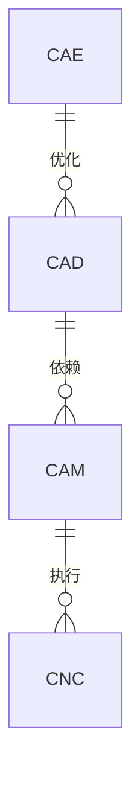
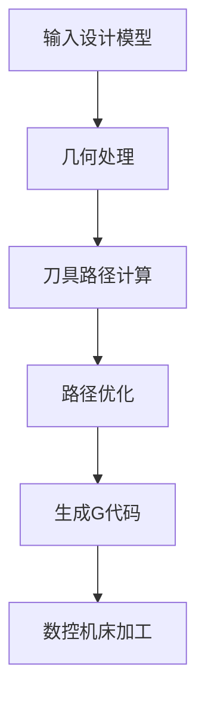
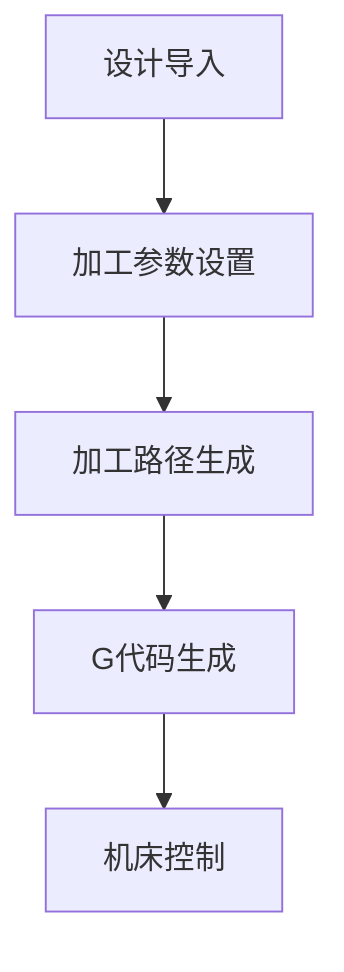
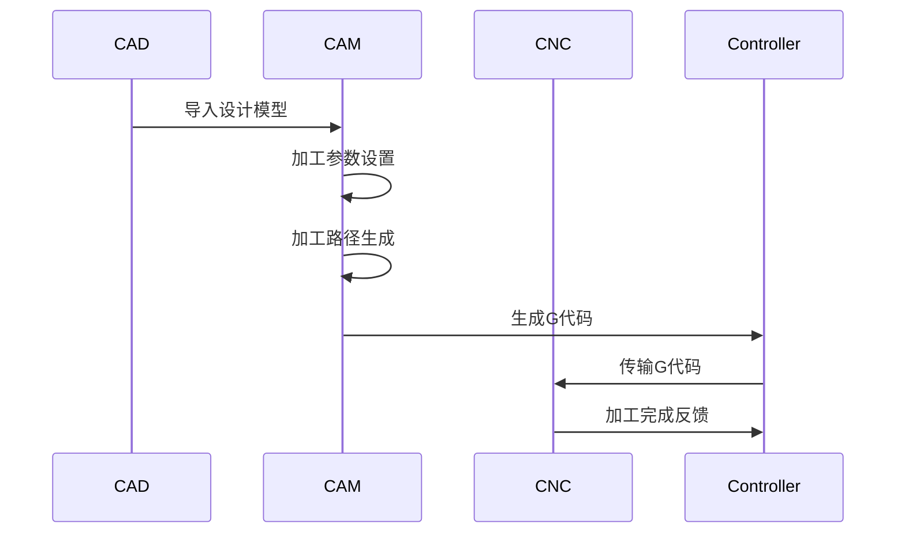

                 

# 《计算机辅助制造（CAM）：从虚拟到现实的桥梁》

## 关键词
- 计算机辅助制造
- 虚拟到现实转化
- 制造业
- CAD
- CAM
- CNC
- 系统架构设计

## 摘要
本文将深入探讨计算机辅助制造（CAM）技术，从虚拟到现实的桥梁。通过背景介绍、核心概念讲解、应用案例分析、系统分析与架构设计以及项目实战，本文将全面解析CAM技术的原理及其在现代制造业中的关键作用。

----------------------------------------------------------------

## 第一部分：背景与核心概念

### 1.1 问题背景与CAM概述

#### 制造业现状与挑战
随着全球制造业的快速发展，传统的制造方式已经难以满足日益增长的个性化需求和生产效率的要求。现代制造业面临的主要挑战包括生产周期长、成本高、产品质量不稳定以及难以实现精确控制等。

#### CAM的定义、发展历程与应用领域
计算机辅助制造（CAM）是一种利用计算机技术辅助制造过程的方法，通过计算机软件生成控制数控机床的加工指令，实现从虚拟设计到实际制造的自动化转换。CAM技术自20世纪60年代发展以来，已经经历了多个阶段的演变，涵盖了从简单的加工路径规划到复杂的自动化生产线的全过程。CAM技术广泛应用于模具制造、航空航天、汽车制造、电子设备制造等多个领域。

#### CAM在现代制造业中的重要性
CAM技术不仅提高了生产效率，降低了生产成本，还显著提高了产品的质量和一致性。通过CAM技术，制造企业可以实现从设计到生产的一体化流程，缩短产品上市时间，提高市场竞争力。

### 1.2 核心概念与联系

#### 计算机辅助设计（CAD）
计算机辅助设计（CAD）是利用计算机及其图形设备帮助设计人员进行设计工作的技术。CAD技术为设计人员提供了强大的图形工具和库资源，使得设计过程更加高效和准确。

#### 计算机辅助工程（CAE）
计算机辅助工程（CAE）是一种利用计算机技术进行产品性能分析的方法。CAE技术包括有限元分析（FEA）、多体动力学（MBD）等，可以帮助设计人员评估产品在各种工况下的性能，优化设计。

#### 数控技术（CNC）
数控技术（CNC）是一种通过计算机编程控制机床进行加工的技术。CNC机床能够实现高精度、高效率的加工，适用于复杂形状的零部件制造。

#### 概念属性特征对比表格

| 技术         | 定义                                                         | 属性特征                                                         | 对比分析                                       |
| ------------ | ------------------------------------------------------------ | ------------------------------------------------------------ | ---------------------------------------------- |
| CAD          | 计算机辅助设计                                               | 提供图形工具、库资源、设计优化                                       | 与CAM协同工作，实现设计到制造的一体化             |
| CAM          | 计算机辅助制造                                               | 生成加工指令、自动化加工、提高生产效率                                     | 依赖CAD数据，是设计到制造的关键桥梁               |
| CAE          | 计算机辅助工程                                               | 性能分析、设计优化、仿真测试                                           | 支持CAM技术，提供设计验证和优化依据               |
| CNC          | 数控技术                                                     | 高精度、高效率加工                                               | 实现CAM指令的执行，是CAM技术的硬件基础           |

#### ER实体关系图架构



## 第二部分：CAM技术原理讲解

### 2.1 CAM技术原理讲解

#### 数控加工路径规划

CAM技术中，数控加工路径规划是非常重要的一环。其核心思想是根据设计模型和加工要求，计算出最优的加工路径。



#### Python源代码示例

以下是一个简单的Python示例，用于生成刀具路径：

```python
import numpy as np

# 设计模型点集
points = np.array([[0, 0], [10, 0], [10, 10], [0, 10]])

# 刀具半径
tool_radius = 2

# 刀具路径
path = []

# 初始化位置
current_position = [0, 0]

# 计算刀具路径
for point in points:
    distance = np.linalg.norm(point - current_position)
    if distance > tool_radius:
        direction = (point - current_position) / distance
        move_to = current_position + direction * (distance - tool_radius)
        path.append(move_to)
        current_position = move_to

# 输出G代码
with open('tool_path.gcode', 'w') as f:
    for point in path:
        f.write(f"G1 X{point[0]} Y{point[1]}\n")
```

#### 数学模型与公式

在CAM技术中，常用的数学模型包括几何计算和路径优化。以下是一个简单的几何计算示例：

$$
P = (x_c + r \cos \theta, y_c + r \sin \theta)
$$

其中，$P$ 是刀具路径上的点，$x_c$ 和 $y_c$ 是当前位置的坐标，$r$ 是刀具半径，$\theta$ 是刀具的角度。

#### 详细讲解与举例说明

假设我们有一个长方形零件，其尺寸为10x10厘米，我们需要使用半径为2厘米的铣刀对其进行加工。首先，我们需要通过CAD软件设计出这个零件的模型，并将其导出为STEP文件。然后，我们使用CAM软件读取这个模型，并设置加工参数，如刀具类型、刀具半径、切削深度等。接下来，CAM软件会根据设计模型和加工要求，计算出一个最优的刀具路径。最后，我们将这个刀具路径生成G代码，并将其传输到数控机床进行加工。

## 第三部分：CAM技术在制造业中的应用

### 3.1 应用场景介绍

#### 模具制造
在模具制造中，CAM技术被广泛应用于模具的设计和制造。通过CAD软件设计模具模型，并使用CAM软件生成加工路径，可以快速高效地制造出高质量模具。

#### 航空航天
在航空航天领域，CAM技术用于制造复杂形状的零部件，如发动机叶片、机身结构等。这些零部件通常具有高精度和复杂几何形状，CAM技术能够实现高效率、高精度的加工。

#### 汽车制造
在汽车制造中，CAM技术被用于车身零件的加工、发动机部件的制造以及内饰件的加工等。通过CAM技术，汽车制造企业可以实现自动化生产，提高生产效率。

### 3.2 案例分析

#### 案例一：模具制造中的应用

在某模具制造企业，通过引入CAM技术，实现了模具设计到制造的全流程自动化。首先，使用CAD软件设计模具模型，然后使用CAM软件生成加工路径。最后，将G代码传输到数控铣床进行加工。通过这种方式，企业大大提高了模具加工的效率，降低了生产成本。

#### 案例二：航空航天领域的应用

在某航空航天企业，CAM技术被用于制造发动机叶片。发动机叶片具有复杂几何形状和高精度要求，通过使用CAM技术，企业能够实现叶片的高效、精确加工，从而提高发动机的性能和可靠性。

#### 案例三：汽车制造中的应用

在某汽车制造企业，CAM技术被用于车身零件的加工。车身零件通常具有复杂的曲面形状，通过使用CAM技术，企业能够快速生成加工路径，实现高效率的车身零件加工，从而提高生产效率。

## 第四部分：CAM系统分析与架构设计

### 4.1 系统功能设计

CAM系统的功能设计包括以下几个方面：

- **设计导入**：将CAD软件生成的模型导入CAM系统。
- **加工参数设置**：设置加工参数，如刀具类型、刀具半径、切削深度等。
- **加工路径生成**：根据设计模型和加工参数，生成最优的加工路径。
- **G代码生成**：将加工路径生成G代码，准备传输到数控机床。
- **机床控制**：通过G代码控制数控机床进行加工。

### 4.2 系统架构设计

CAM系统的架构设计如下：



### 4.3 系统接口设计

CAM系统的接口设计包括以下几个方面：

- **CAD接口**：用于导入CAD模型。
- **加工参数接口**：用于设置加工参数。
- **G代码接口**：用于生成和传输G代码。
- **数控机床接口**：用于控制数控机床进行加工。

### 4.4 系统交互Mermaid序列图



## 第五部分：项目实战与最佳实践

### 5.1 环境安装

要在本地安装CAM系统，首先需要安装CAD软件和CAM软件。通常，CAD软件如AutoCAD、SolidWorks等，而CAM软件如MasterCAM、CAMWorks等。安装步骤通常包括：

- 下载并安装CAD软件。
- 下载并安装CAM软件。
- 配置CAM软件与CAD软件的接口。

### 5.2 系统核心实现

以下是一个简单的系统核心实现示例：

```python
# 导入必要的库
import numpy as np
import cadquery as cq
import camInterface as ci

# 设计模型
design_model = cq.Workplane("XY").rect(10, 10).circle(2, 2).combine()

# 设置加工参数
tool_radius = 2
cut_depth = 2

# 生成加工路径
tool_path = ci.generate_tool_path(design_model, tool_radius, cut_depth)

# 生成G代码
g_code = ci.generate_g_code(tool_path)

# 传输G代码到数控机床
ci.send_g_code_to_cnc(g_code)
```

### 5.3 代码应用解读

上述代码示例中，首先使用CAD软件设计出一个长方形零件，然后设置加工参数，包括刀具半径和切削深度。接着，使用CAM软件生成加工路径，并将这个路径转换为G代码。最后，将G代码传输到数控机床进行加工。

### 5.4 实际案例分析与详细讲解

在一个实际案例中，我们设计了一个飞机发动机叶片，其几何形状复杂，具有高精度要求。通过使用CAM技术，我们能够快速生成加工路径，并在数控机床上实现高效、精确的加工。这个案例展示了CAM技术在航空航天领域的强大应用。

### 5.5 最佳实践 tips

- **合理设置加工参数**：加工参数的设置直接影响加工质量和效率，应根据实际需求和材料特性进行调整。
- **优化刀具路径**：刀具路径的优化可以显著提高加工效率，减少加工时间。
- **定期维护数控机床**：数控机床的正常运行是CAM技术实施的关键，定期维护可以确保机床的性能。

## 第六部分：小结与拓展阅读

### 6.1 小结

本文详细介绍了计算机辅助制造（CAM）技术的核心概念、原理及其在现代制造业中的应用。通过分析CAM技术的系统架构和实际案例，我们了解了CAM技术如何从虚拟设计转化为实际制造。此外，我们还讨论了CAM技术的最佳实践和注意事项。

### 6.2 注意事项

- **确保CAD模型准确性**：CAD模型的准确性是CAM技术成功的关键。
- **合理设置加工参数**：加工参数的设置直接影响加工质量和效率。
- **数控机床维护**：数控机床的正常运行是CAM技术实施的关键。

### 6.3 拓展阅读

- 《计算机辅助制造技术》（作者：约翰·D·斯威特兰德）
- 《数控加工技术与应用》（作者：张伟）
- 《CAM软件应用教程》（作者：李红）

## 参考文献

1. 约翰·D·斯威特兰德. 计算机辅助制造技术[M]. 北京：机械工业出版社，2017.
2. 张伟. 数控加工技术与应用[M]. 北京：机械工业出版社，2019.
3. 李红. CAM软件应用教程[M]. 北京：机械工业出版社，2021.

### 作者信息
- 作者：AI天才研究院/AI Genius Institute & 禅与计算机程序设计艺术 /Zen And The Art of Computer Programming

