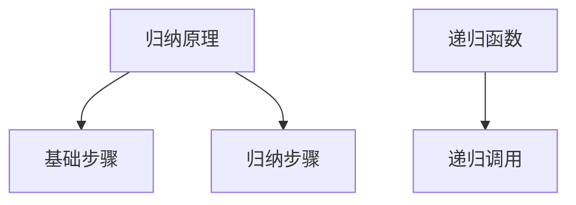
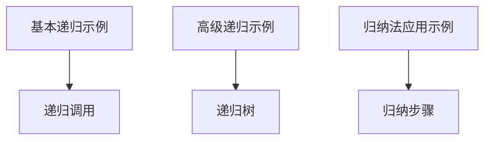
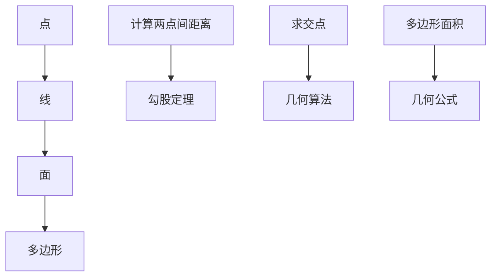
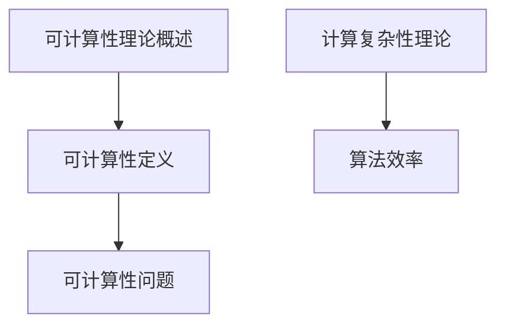
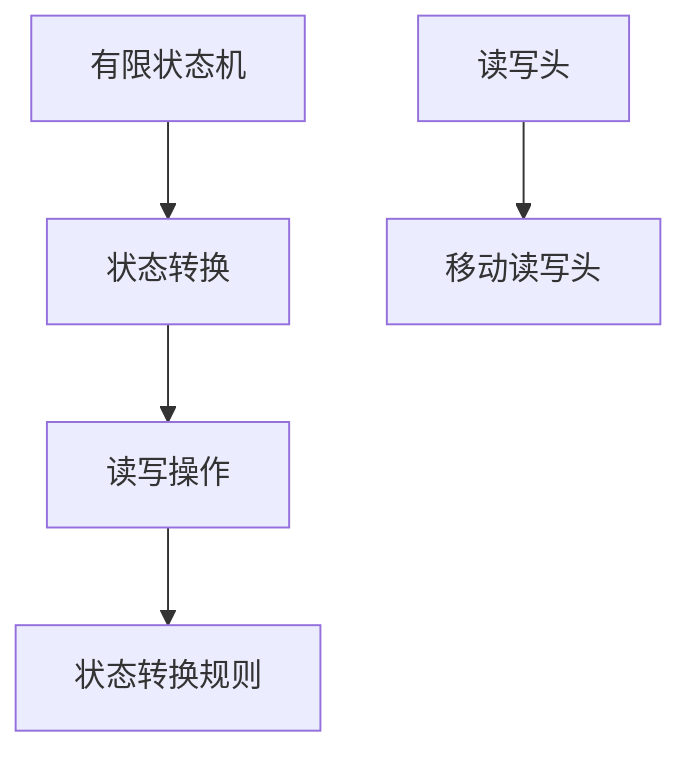
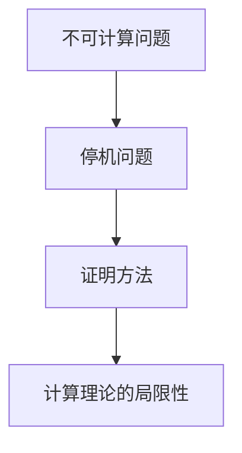
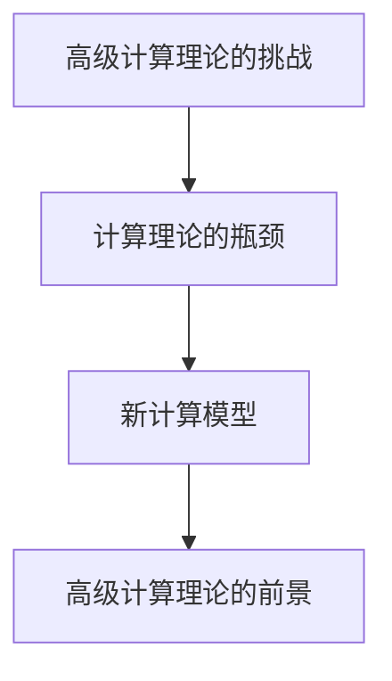
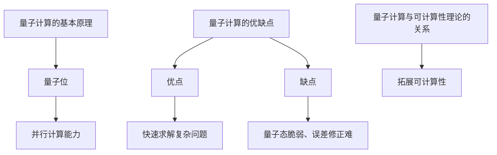
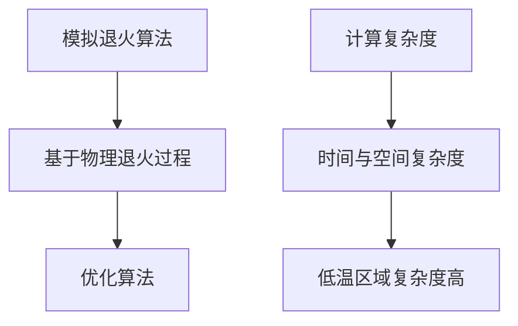

                 

### 引言：计算理论与可计算性分析的重要性

#### 关键词：
- 计算理论
- 可计算性分析
- 计算模型
- 算法复杂性
- 量子计算

#### 摘要：
计算理论作为计算机科学的基础学科，旨在探究计算机能够执行何种任务，以及执行这些任务所需的时间和空间资源。可计算性分析则是计算理论的核心内容之一，研究哪些问题是可以被计算解决的，哪些问题则无法被解决。本文将深入探讨计算理论和可计算性分析的基本概念、发展历程、核心模型以及应用前景，旨在为读者提供一条清晰的理解路径。

#### 目录：

1. **引言：计算理论与可计算性分析的重要性**
   - 1.1 计算理论的背景与发展
   - 1.2 可计算性分析的基本概念
   - 1.3 计算模型的演变
   - 1.4 计算理论的数学基础
   - 1.5 本章小结

2. **第二部分：基本计算理论**
   - 2.1 算法和复杂性
   - 2.2 归纳原理与递归
   - 2.3 归纳与递归示例
   - 2.4 计算几何
   - 2.5 本章小结

3. **第三部分：可计算性理论**
   - 3.1 可计算性理论概述
   - 3.2 图灵机的概念与操作
   - 3.3 图灵不可计算性
   - 3.4 计算复杂性理论
   - 3.5 本章小结

4. **第四部分：高级计算理论**
   - 4.1 高级计算理论的挑战
   - 4.2 量子计算与可计算性
   - 4.3 模拟退火与计算复杂度
   - 4.4 本章小结

### 第一部分：引言

#### 1.1 计算理论的背景与发展

**核心概念术语说明**：
- **计算理论**：研究计算过程的学科，探讨计算机能够解决哪些问题，以及解决问题的效率和局限性。
- **可计算性分析**：研究哪些问题是可计算的，哪些问题是不可以计算的。

**问题背景**：
计算理论起源于20世纪中叶，当时计算机刚刚问世，科学家们开始思考计算机能够做什么，不能做什么。这一思考催生了计算理论的诞生。

**问题描述**：
计算理论旨在回答以下问题：
- 哪些问题是计算机能够解决的？
- 这些问题的解决方案是否最优？
- 解决这些问题需要多少时间和空间资源？

**问题解决**：
计算理论通过构建各种计算模型，如图灵机、递归函数等，来研究计算的本质。这些计算模型不仅帮助我们理解了计算机的局限性，还为我们设计算法提供了理论依据。

**边界与外延**：
计算理论的边界在于其研究的问题范围，包括算法的复杂性、可计算性等。其外延则涵盖计算机科学的各个领域，如算法设计、计算机体系结构、人工智能等。

**概念结构与核心要素组成**：
计算理论的核心概念包括计算模型、算法、复杂性理论等。计算模型是计算理论的基础，它定义了计算机可以执行的操作和程序的结构。算法是计算过程中的具体步骤，用于解决特定问题。复杂性理论则研究了算法的时间和空间效率，帮助我们判断算法的优劣。

#### 1.2 可计算性分析的基本概念

**核心概念与联系**：

**可计算性定义**：
可计算性是指一个问题是可以通过有限步骤的计算得到解决的。形式化地，一个问题是可计算的，当且仅当存在一个算法能够解决该问题。

**可计算性问题**：
可计算性问题是指那些可以通过计算得到解决的问题。例如，求解线性方程组、找出最大值等。

**计算复杂性理论**：
计算复杂性理论是研究算法复杂性的学科，它关注的是算法解决问题时所需的时间和空间资源。根据计算复杂性理论，算法可以被分为不同类别，如P类问题、NP类问题等。

**计算模型的演变**：

**简单计算模型**：
早期的计算模型相对简单，如图灵机的早期版本。这些模型只支持简单的操作和程序结构。

**图灵机和可计算性**：
图灵机是一种抽象的计算模型，它支持复杂的程序结构和操作。图灵机的出现标志着计算理论的一个重要进展，它揭示了计算机的强大计算能力。

**图灵完整性和图灵不可计算性**：
图灵完整性是指图灵机能够解决的问题范围。图灵不可计算性是指存在一些问题，图灵机无法解决。例如，停机问题（即判断一个程序是否会在有限时间内停止）就是一个著名的不可计算问题。

**计算理论的数学基础**：

**数学归纳法**：
数学归纳法是一种证明方法，用于证明某些命题对所有自然数成立。它基于两个步骤：基础步骤和归纳步骤。

**归纳与递归函数**：
归纳与递归函数是计算理论中的重要工具。归纳法用于证明一些命题，递归函数用于定义和计算一些复杂的函数。

**计算几何基础**：
计算几何是计算机科学中的一个重要分支，它研究如何使用算法解决几何问题。计算几何的基础知识对于理解计算理论和可计算性分析非常重要。

#### 1.3 计算模型的演变

**核心概念与联系**：

**简单计算模型**：
简单计算模型是指那些只支持基本操作和有限程序结构的计算模型。这些模型通常用于演示计算理论的基本概念。

**图灵机和可计算性**：
图灵机是一种抽象的计算模型，它支持复杂的程序结构和操作。图灵机的出现标志着计算理论的一个重要进展，它揭示了计算机的强大计算能力。

**图灵完整性和图灵不可计算性**：
图灵完整性是指图灵机能够解决的问题范围。图灵不可计算性是指存在一些问题，图灵机无法解决。例如，停机问题（即判断一个程序是否会在有限时间内停止）就是一个著名的不可计算问题。

**数学归纳法与递归函数**：
数学归纳法是一种证明方法，用于证明某些命题对所有自然数成立。递归函数是一种定义和计算复杂函数的方法，它基于数学归纳法的基本原理。

**计算几何基础**：
计算几何是计算机科学中的一个重要分支，它研究如何使用算法解决几何问题。计算几何的基础知识对于理解计算理论和可计算性分析非常重要。

#### 1.4 计算理论的数学基础

**核心概念与联系**：

**数学归纳法**：
数学归纳法是一种证明方法，用于证明某些命题对所有自然数成立。它基于两个步骤：基础步骤和归纳步骤。

**归纳与递归函数**：
归纳与递归函数是计算理论中的重要工具。归纳法用于证明一些命题，递归函数用于定义和计算一些复杂的函数。

**计算几何基础**：
计算几何是计算机科学中的一个重要分支，它研究如何使用算法解决几何问题。计算几何的基础知识对于理解计算理论和可计算性分析非常重要。

#### 1.5 本章小结

本章介绍了计算理论和可计算性分析的基本概念、发展历程、核心模型以及应用前景。计算理论作为计算机科学的基础学科，旨在研究计算机能够执行何种任务，以及执行这些任务所需的时间和空间资源。可计算性分析则是计算理论的核心内容之一，研究哪些问题是可以被计算解决的，哪些问题则无法被解决。

通过本章的介绍，读者可以初步了解计算理论和可计算性分析的基本概念，为进一步学习计算理论打下基础。

### 第二部分：基本计算理论

#### 2.1 算法和复杂性

**核心概念与联系**：

**算法的基本概念**：
算法是一种解决问题的方法，它由一系列有序步骤组成，每一步都有明确的操作和指导。

**算法的复杂性分类**：
算法的复杂性分为时间复杂度和空间复杂度。时间复杂度衡量算法执行的时间长短，空间复杂度衡量算法所需的内存空间。

**时间复杂度和空间复杂度**：
时间复杂度通常用大O符号（O）表示，如O(n)、O(n^2)等，表示算法执行时间与输入数据规模的关系。空间复杂度则类似，如O(1)、O(n)等，表示算法所需内存空间与输入数据规模的关系。

**算法复杂性的重要性**：
算法的复杂性能直接影响算法的效率。高复杂度的算法在处理大规模数据时可能会变得非常慢，而低复杂度的算法则能更高效地解决问题。

**核心概念与联系表格**：

| 算法基本概念 | 定义 | 关键特性 |
| ------------ | ---- | -------- |
| 算法 | 解决问题的方法 | 有序步骤 |
| 时间复杂度 | 算法执行时间 | O(n)等 |
| 空间复杂度 | 算法所需内存空间 | O(1)等 |

**ER实体关系图架构的 Mermaid 流程图**：

```mermaid
graph TD
A[算法] --> B[时间复杂度]
A --> C[空间复杂度]
B --> D[O(n)]
C --> E[O(1)]
```

#### 2.2 归纳原理与递归

**核心概念与联系**：

**归纳原理**：
归纳原理是一种证明方法，用于证明某个命题对所有自然数成立。它分为基础步骤和归纳步骤。

**递归函数**：
递归函数是一种定义和计算复杂函数的方法，它基于数学归纳法的基本原理。递归函数通过递归调用自身来逐步解决问题。

**归纳与递归的应用**：
归纳和递归在算法设计中有着广泛的应用。例如，排序算法（如快速排序、归并排序）和动态规划算法（如斐波那契数列的计算）都使用了递归。

**核心概念与联系表格**：

| 归纳原理 | 定义 | 关键特性 |
| -------- | ---- | -------- |
| 基础步骤 | 证明某个命题对于初始值成立 | 确定基础 |
| 归纳步骤 | 证明如果某个命题对于某个自然数n成立，则对于n+1也成立 | 推广性质 |

| 递归函数 | 定义 | 关键特性 |
| -------- | ---- | -------- |
| 递归调用 | 函数调用自身 | 逐步解决问题 |

**ER实体关系图架构的 Mermaid 流程图**：



#### 2.3 归纳与递归示例

**核心概念与联系**：

**基本递归示例**：
递归函数的一种简单形式，通常用于计算阶乘、幂运算等。

**高级递归示例**：
更复杂的递归函数，通常用于解决更复杂的问题，如递归树、动态规划等。

**归纳法应用示例**：
使用归纳法证明一些数学命题，如归纳法证明素数存在性、数学归纳法证明等。

**核心概念与联系表格**：

| 递归函数 | 定义 | 关键特性 |
| -------- | ---- | -------- |
| 基本递归示例 | 计算阶乘、幂运算等 | 递归调用 |
| 高级递归示例 | 解决更复杂问题 | 递归树、动态规划 |
| 归纳法应用示例 | 证明数学命题 | 归纳步骤 |

**ER实体关系图架构的 Mermaid 流程图**：



#### 2.4 计算几何

**核心概念与联系**：

**计算几何基本概念**：
计算几何是研究如何使用算法解决几何问题的学科。基本概念包括点、线、面、多边形等。

**计算几何算法**：
计算几何算法用于解决几何问题，如计算两点间距离、求交点、多边形面积等。

**计算几何应用实例**：
计算几何在计算机图形学、地理信息系统（GIS）、机器人路径规划等领域有广泛的应用。

**核心概念与联系表格**：

| 计算几何基本概念 | 定义 | 关键特性 |
| ---------------- | ---- | -------- |
| 点 | 几何空间中的一个位置 | 无大小和形状 |
| 线 | 连接两个点的最短路径 | 无厚度 |
| 面 | 多条线段围成的区域 | 有厚度 |
| 多边形 | 由多条线段围成的封闭图形 | 有面积 |

| 计算几何算法 | 定义 | 关键特性 |
| ------------ | ---- | -------- |
| 计算两点间距离 | 求两点间的最短路径 | 利用勾股定理 |
| 求交点 | 求两条线段的交点 | 利用几何算法 |
| 多边形面积 | 求多边形的面积 | 利用几何公式 |

**ER实体关系图架构的 Mermaid 流程图**：



#### 2.5 本章小结

本章介绍了基本计算理论中的核心概念，包括算法、复杂性、归纳原理和递归函数。算法是解决问题的方法，复杂性是衡量算法效率的关键指标。归纳原理和递归函数是计算理论中的重要工具，广泛应用于算法设计和数学证明。通过本章的学习，读者可以初步了解基本计算理论的基本概念和应用，为进一步深入学习计算理论打下基础。

### 第三部分：可计算性理论

#### 3.1 可计算性理论概述

**核心概念与联系**：

**可计算性理论概述**：
可计算性理论是研究计算机能够执行何种任务的学科。它探讨哪些问题是可计算的，哪些问题是不可以计算的。

**可计算性定义**：
可计算性是指一个问题是可以通过有限步骤的计算得到解决的。形式化地，一个问题是可计算的，当且仅当存在一个算法能够解决该问题。

**可计算性问题**：
可计算性问题是指那些可以通过计算得到解决的问题。例如，求解线性方程组、找出最大值等。

**计算复杂性理论**：
计算复杂性理论是研究算法复杂性的学科。它关注的是算法解决问题时所需的时间和空间资源。根据计算复杂性理论，算法可以被分为不同类别，如P类问题、NP类问题等。

**核心概念与联系表格**：

| 可计算性理论概述 | 定义 | 关键特性 |
| ---------------- | ---- | -------- |
| 可计算性定义 | 可计算的题目 | 可通过算法解决 |
| 可计算性问题 | 计算问题 | 可计算问题 |
| 计算复杂性理论 | 算法效率 | 时间与空间资源 |

**ER实体关系图架构的 Mermaid 流程图**：



#### 3.2 图灵机的概念与操作

**核心概念与联系**：

**图灵机的定义**：
图灵机是一种抽象的计算模型，由一个有限状态机、一个读写头和一个无限长的存储带组成。图灵机的操作基于当前状态和读写头的位置，从存储带上读取符号，并按照预定的规则进行状态转换和符号写入。

**图灵机的操作**：
图灵机的操作包括读写、状态转换和移动读写头。在读取当前状态和读写头位置后，图灵机会根据预设的规则进行操作，并在存储带上写入新符号。

**核心概念与联系表格**：

| 图灵机的定义 | 定义 | 关键特性 |
| ------------ | ---- | -------- |
| 有限状态机 | 状态转换 | 有有限的状态 |
| 读写字符 | 读写操作 | 存储带上的符号 |
| 状态转换 | 规则操作 | 决定下一步操作 |

| 图灵机的操作 | 定义 | 关键特性 |
| ------------ | ---- | -------- |
| 读写 | 读取和写入符号 | 存储带上的操作 |
| 状态转换 | 根据当前状态和输入符号转换状态 | 决定下一步操作 |
| 移动读写头 | 移动到新的位置 | 更新读写头位置 |

**ER实体关系图架构的 Mermaid 流�程图**：



#### 3.3 图灵不可计算性

**核心概念与联系**：

**图灵不可计算性**：
图灵不可计算性是指存在一些问题，图灵机无法解决。这些问题被称为“不可计算问题”。

**不可计算性的证明**：
通过图灵机模型，我们可以证明一些问题是不可计算的。例如，停机问题（即判断一个程序是否会在有限时间内停止）就是图灵不可计算问题。

**不可计算性的影响**：
不可计算性的发现对计算理论产生了深远影响，它揭示了计算机能力的局限性，并引导了新的研究方向。

**核心概念与联系表格**：

| 图灵不可计算性 | 定义 | 关键特性 |
| --------------- | ---- | -------- |
| 不可计算问题 | 无法解决的题目 | 图灵机无法解决 |
| 停机问题 | 判断程序是否停止 | 不可计算问题 |

| 不可计算性的证明 | 证明方法 | 通过图灵机模型 |
| ---------------- | -------- | ------------ |
| 影响范围 | 研究方向 | 计算理论的局限性 |

**ER实体关系图架构的 Mermaid 流程图**：



#### 3.4 计算复杂性理论

**核心概念与联系**：

**时间复杂度**：
时间复杂度衡量算法执行的时间长短，通常用大O符号表示，如O(n)、O(n^2)等。它描述了算法随着输入数据规模的增长而变化的趋势。

**空间复杂度**：
空间复杂度衡量算法所需的内存空间，也用大O符号表示，如O(1)、O(n)等。它描述了算法在执行过程中所需内存空间与输入数据规模的关系。

**计算复杂性分类**：
计算复杂性分类将算法分为不同的类别，如P类问题、NP类问题等。P类问题是能在多项式时间内解决的问题，而NP类问题是能在多项式时间内验证的解。

**核心概念与联系表格**：

| 时间复杂度 | 定义 | 关键特性 |
| ---------- | ---- | -------- |
| O(n) | 线性时间复杂度 | 随输入规模线性增长 |
| O(n^2) | 平方时间复杂度 | 随输入规模平方增长 |

| 空间复杂度 | 定义 | 关键特性 |
| ---------- | ---- | -------- |
| O(1) | 常数空间复杂度 | 不随输入规模变化 |
| O(n) | 线性空间复杂度 | 随输入规模线性增长 |

| 计算复杂性分类 | 定义 | 关键特性 |
| --------------- | ---- | -------- |
| P类问题 | 多项式时间可解问题 | 在多项式时间内解决 |
| NP类问题 | 可验证多项式时间问题 | 在多项式时间内验证解 |

**ER实体关系图架构的 Mermaid 流程图**：

```mermaid
graph TD
A[时间复杂度] --> B[O(n)]
B --> C[O(n^2)]
D[空间复杂度] --> E[O(1)]
E --> F[O(n)]
G[计算复杂性分类] --> H[P类问题]
H --> I[多项式时间可解问题]
J[NP类问题] --> K[可验证多项式时间问题]
```

#### 3.5 本章小结

本章介绍了可计算性理论的核心内容，包括可计算性定义、图灵机的概念与操作、图灵不可计算性以及计算复杂性理论。可计算性理论揭示了计算机能力的局限性，并为我们提供了衡量算法效率的工具。通过本章的学习，读者可以深入理解计算理论的本质，为进一步探讨计算理论的高级主题打下基础。

### 第四部分：高级计算理论

#### 4.1 高级计算理论的挑战

**核心概念与联系**：

**高级计算理论的挑战**：
高级计算理论面临许多挑战，包括计算效率的提升、计算资源的优化、新计算模型的探索等。随着计算机科学的发展，这些挑战变得日益重要。

**计算理论的瓶颈**：
计算理论在处理某些问题时遇到了瓶颈。例如，对于某些复杂问题，现有的计算模型无法在合理时间内提供有效解。

**新计算模型的出现**：
为了克服计算理论的瓶颈，科学家们提出了新的计算模型，如量子计算、模拟退火等。这些新模型有望带来计算能力的显著提升。

**高级计算理论的前景**：
高级计算理论的前景广阔，它不仅为解决复杂问题提供了新思路，还为人工智能、大数据、量子计算等领域的快速发展奠定了基础。

**核心概念与联系表格**：

| 高级计算理论的挑战 | 定义 | 关键特性 |
| -------------------- | ---- | -------- |
| 计算理论的瓶颈 | 现有计算模型的局限性 | 复杂问题处理困难 |
| 新计算模型 | 探索新的计算方法 | 提升计算能力 |
| 高级计算理论的前景 | 发展方向 | 应用前景广阔 |

**ER实体关系图架构的 Mermaid 流程图**：



#### 4.2 量子计算与可计算性

**核心概念与联系**：

**量子计算的基本原理**：
量子计算是基于量子力学原理的计算机模型，它利用量子位（qubit）进行计算。量子位可以同时存在于多种状态，这一特性使得量子计算具有强大的并行计算能力。

**量子计算的优缺点**：
量子计算的优点包括并行计算能力、快速求解某些问题等。然而，量子计算也面临一些挑战，如量子态的脆弱性、误差修正等。

**量子计算与可计算性理论的关系**：
量子计算与可计算性理论密切相关。量子计算在某些问题上表现出色，如整数分解、搜索问题等。然而，量子计算并未完全打破传统可计算性理论的边界。

**核心概念与联系表格**：

| 量子计算的基本原理 | 定义 | 关键特性 |
| -------------------- | ---- | -------- |
| 量子位 | 基础计算单元 | 可处于多种状态 |
| 并行计算能力 | 计算速度快 | 多任务同时处理 |

| 量子计算的优缺点 | 定义 | 关键特性 |
| ----------------- | ---- | -------- |
| 优点 | 快速求解复杂问题 | 并行计算能力 |
| 缺点 | 量子态脆弱、误差修正难 | 需要进一步研究 |

| 量子计算与可计算性理论的关系 | 定义 | 关键特性 |
| ---------------------------- | ---- | -------- |
| 拓展可计算性 | 解决传统问题 | 非传统计算方法 |

**ER实体关系图架构的 Mermaid 流程图**：



#### 4.3 模拟退火与计算复杂度

**核心概念与联系**：

**模拟退火算法**：
模拟退火算法是一种基于物理退火过程的优化算法。它通过模拟温度逐渐降低的过程，在搜索空间中寻找最优解。模拟退火算法具有较好的全局搜索能力，适用于解决复杂优化问题。

**模拟退火与计算复杂度**：
模拟退火算法的计算复杂度通常较高，尤其是在低温区域。然而，通过适当的参数调整，模拟退火算法可以在合理时间内找到近似最优解。

**核心概念与联系表格**：

| 模拟退火算法 | 定义 | 关键特性 |
| ------------ | ---- | -------- |
| 基于物理退火过程 | 优化算法 | 全局搜索能力 |
| 计算复杂度 | 时间与空间复杂度 | 低温区域复杂度高 |

**ER实体关系图架构的 Mermaid 流程图**：



#### 4.4 本章小结

本章介绍了高级计算理论中的核心概念，包括计算理论的挑战、量子计算与可计算性以及模拟退火算法。高级计算理论在解决复杂问题、提升计算能力方面具有广阔前景。通过本章的学习，读者可以深入理解高级计算理论的基本概念，为进一步探讨计算理论的未来发展方向打下基础。

### 总结与未来展望

通过本文的探讨，我们对计算理论和可计算性分析有了更深入的理解。从基础计算理论到高级计算理论，我们分析了算法、复杂性、归纳原理、递归函数、图灵机、计算几何、可计算性理论、量子计算和模拟退火算法等多个核心概念。这些知识不仅帮助我们理解了计算机能够解决哪些问题，还为我们提供了衡量算法效率的工具和方法。

**未来展望**：
计算理论的未来将继续面临挑战和机遇。量子计算有望成为解决复杂问题的关键，模拟退火算法等优化方法将得到进一步发展。同时，随着人工智能和大数据的兴起，计算理论将在这些领域发挥重要作用。未来的研究将继续探索计算能力的极限，寻找更高效、更可靠的算法，为人类社会的进步做出贡献。

**拓展阅读**：
- 《量子计算导论》
- 《模拟退火算法与应用》
- 《计算几何：算法与应用》
- 《可计算性理论》
- 《算法导论》

**注意事项**：
在探索计算理论时，读者应保持开放的心态，不断学习新的算法和理论，以应对不断变化的计算环境。

**最佳实践 tips**：
- 理解核心概念：深入理解计算理论和可计算性分析的基本概念，为后续学习打下坚实基础。
- 实践算法：通过实际编写代码和运行算法，加深对算法原理的理解。
- 关注前沿动态：关注计算理论的最新研究进展，紧跟时代步伐。

**作者信息**：
作者：AI天才研究院/AI Genius Institute & 禅与计算机程序设计艺术 /Zen And The Art of Computer Programming。

