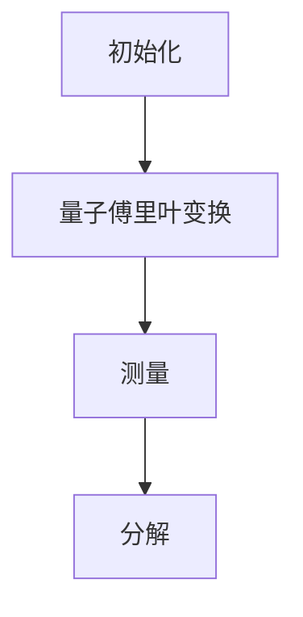
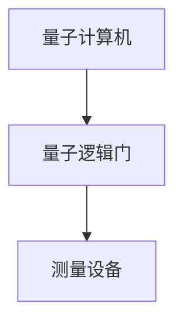
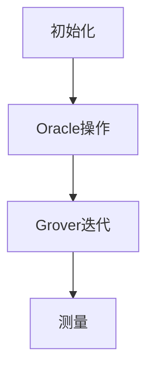
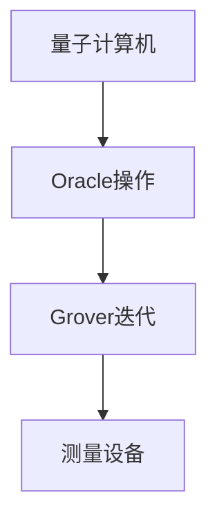
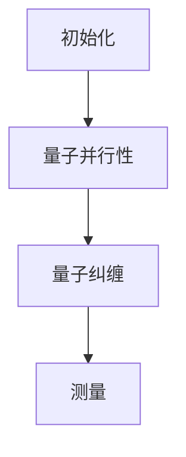

                 


### 第1章 计算理论基础

#### 1.1 量子计算与计算理论的关系

量子计算是计算理论的一个新兴分支，其理论基础源于量子力学。传统计算理论主要研究基于经典物理原理的计算机系统，而量子计算则利用量子力学的特殊性质，如叠加态和纠缠态，来执行计算任务。这种差异导致了量子算法与经典算法在复杂度上的显著区别。

首先，让我们回顾一下传统计算理论的基础。经典计算理论的核心是图灵机模型，它由图灵在20世纪30年代提出。图灵机是一个抽象的模型，它由一个无限长的纸带、一个读写头和一个状态转换表组成。通过在纸带上移动读写头并改变状态，图灵机可以模拟任何可计算的过程。

相比之下，量子计算的理论基础是量子位（qubit）。一个量子位可以处于0和1的叠加态，这意味着它可以同时代表0和1。这种叠加态使得量子计算机能够同时处理大量的信息。此外，量子纠缠也是量子计算的核心特性之一。当两个或多个量子位纠缠时，它们的状态将相互关联，无论它们相隔多远。这种纠缠使得量子计算机在执行某些任务时比经典计算机更加高效。

#### 1.2 量子算法的复杂性度量

在经典计算理论中，算法的复杂度通常用时间复杂度和空间复杂度来度量。时间复杂度表示算法执行所需时间的增长速度，通常用大O符号表示，如O(n)。空间复杂度表示算法执行所需内存的增长速度，同样也用大O符号表示。

在量子计算中，我们引入了量子算法复杂度的新概念。量子算法的复杂度主要关注量子门的数量、量子位的数量以及算法的叠加态。量子算法的时间复杂度通常用QTL（Quantum Time-Limit）表示，它表示执行量子算法所需的基本量子门操作次数。量子算法的空间复杂度则关注量子态的扩展速度，通常用QSL（Quantum State-Limit）表示。

#### 1.3 量子算法复杂度分析的重要性

量子算法复杂度分析的重要性在于它能够帮助我们理解量子算法在处理特定问题时相对于经典算法的优势和劣势。通过分析量子算法的复杂度，我们能够预测量子计算机在未来可能会在哪些领域取得突破。

首先，一些著名的量子算法，如Shor算法和Grover算法，已经在特定问题上展示了显著的加速效果。Shor算法能够在多项式时间内解决大整数因数分解问题，而Grover算法能够加速经典搜索算法。这些结果表明，量子计算机在处理某些问题时具有巨大的潜力。

然而，量子算法复杂度分析也揭示了量子计算机的局限性。例如，某些问题在量子计算机上可能无法得到加速，或者量子算法的复杂度可能比经典算法更差。因此，对量子算法复杂度进行深入分析是设计和优化量子算法的关键步骤。

#### 1.4 本书结构安排与读者指南

本书旨在为读者提供一个全面了解量子算法复杂度分析的应用指南。本书分为八个部分，每个部分都涵盖了一个特定的主题。

第一部分是引言，介绍了量子计算与计算理论的关系、量子算法的复杂性度量以及本书的结构安排。

第二部分介绍了量子计算的基本概念，包括量子位、量子逻辑门、量子算法的构建块以及量子并行性与经典计算的区别。

第三部分深入探讨了量子算法复杂性理论，包括量子算法复杂度分类、QMA、BQP 和 P 之间的关系、量子算法复杂度下界以及量子算法效率分析。

第四部分分析了典型量子算法，如Shor算法、Grover算法、量子随机化算法以及在图论中的应用。

第五部分讨论了量子算法的实验验证与未来展望，包括量子算法实验验证的现状、量子计算机的挑战与未来发展方向以及量子算法在现实世界中的应用前景。

第六部分介绍了量子算法复杂度分析工具，包括量子计算模拟器、量子算法优化工具以及量子算法验证与测试。

第七部分提供了应用案例与最佳实践，包括量子密码学、量子搜索算法在数据库中的应用、量子算法在药物研发中的应用以及最佳实践总结。

最后一部分是总结与展望，总结了量子算法复杂度分析的重要性，展望了未来的研究方向以及对计算理论的贡献。

通过阅读本书，读者将能够深入理解量子算法复杂度分析的核心概念和应用，为未来的研究和工作打下坚实的基础。

---

以上是第1章的内容，主要介绍了量子计算与计算理论的关系、量子算法的复杂性度量以及本书的结构安排。接下来，我们将进一步探讨量子计算的基本概念，为后续的算法分析奠定基础。

---

### 第2章 量子计算的基本概念

#### 2.1 量子位与量子逻辑门

量子计算的核心是量子位（qubit），它是量子计算的基本单元，类似于经典计算中的比特。然而，量子位具有一些独特的特性，使其在处理信息时具有经典比特无法比拟的优势。

首先，量子位的叠加态特性。在经典计算中，一个比特只能处于0或1的状态之一。而量子位可以同时处于0和1的叠加态，用数学表达式可以表示为：

$$|\psi\rangle = \alpha|0\rangle + \beta|1\rangle$$

其中，$|\alpha|^2$ 和 $|\beta|^2$ 分别代表量子位在0和1状态的概率幅。这意味着一个量子位可以同时处理大量的信息。

其次，量子位的纠缠特性。当两个量子位纠缠时，它们的状态将相互关联，无论它们相隔多远。这种纠缠使得量子计算机在执行某些任务时具有超越经典计算机的能力。

为了操作量子位，我们需要使用量子逻辑门。量子逻辑门是量子计算中的基本操作单元，类似于经典计算中的逻辑门。量子逻辑门的作用是对量子位进行叠加、变换和控制。常见的量子逻辑门包括Hadamard门、Pauli门和控制-NOT门。

Hadamard门（H门）是一个重要的量子逻辑门，它可以将一个量子位从基态（|0⟩）变换到叠加态（|+⟩）。其作用可以用以下公式表示：

$$H|0\rangle = \frac{1}{\sqrt{2}}(|0\rangle + |1\rangle)$$
$$H|1\rangle = \frac{1}{\sqrt{2}}(|0\rangle - |1\rangle)$$

Pauli门是另一个重要的量子逻辑门，包括X门（相移门）、Y门（相位翻转门）和Z门（Z相移门）。它们分别对量子位的振幅进行相移、相位翻转和Z轴旋转。

控制-NOT门（CNOT门）是一个两量子位的逻辑门，它将第二个量子位的状态反转，如果第一个量子位处于基态。其作用可以用以下公式表示：

$$CNOT(|\psi\rangle_A\otimes|\phi\rangle_B) = |\psi\rangle_A\otimes|\phi\rangle_B \quad \text{if } \psi \text{ is } |0\rangle$$
$$CNOT(|\psi\rangle_A\otimes|\phi\rangle_B) = |\psi\rangle_A\otimes|\phi\rangle_B \quad \text{if } \psi \text{ is } |1\rangle$$

#### 2.2 量子算法的构建块

量子算法是由一系列量子逻辑门和测量操作构成的。这些逻辑门和测量操作共同作用于量子位，使得量子计算机能够执行复杂的计算任务。常见的量子算法构建块包括量子并行性、量子随机化和量子纠缠。

量子并行性是量子算法的重要特性之一。在量子计算机中，多个量子位可以同时处于叠加态，这意味着它们可以同时处理多个计算路径。这种并行性使得量子计算机在执行某些任务时具有超越经典计算机的能力。例如，Grover算法利用量子并行性加速了经典搜索算法。

量子随机化是量子算法中的另一个重要特性。量子随机化使得量子计算机能够生成随机数，这在许多算法中是必不可少的。例如，Shor算法利用量子随机化生成随机数来求解大整数因数分解问题。

量子纠缠也是量子算法中的一个关键构建块。量子纠缠使得量子位之间的状态相互关联，这种关联性可以用来实现高效的量子算法。例如，量子纠缠使得Shor算法能够快速求解大整数因数分解问题。

#### 2.3 量子并行性与经典计算的区别

量子并行性与经典计算中的并行性有显著的区别。在经典计算中，多个计算任务通常是通过并行处理多个数据项来实现的。这种并行性依赖于计算机的硬件资源，如多核处理器。然而，量子并行性并不是通过硬件资源来实现的，而是基于量子位的叠加态和纠缠态。

量子并行性使得量子计算机在处理某些任务时具有巨大的优势。例如，Grover算法利用量子并行性将搜索问题的复杂度从O(n)降低到O(√n)，其中n是数据项的数量。这意味着量子计算机在搜索任务上比经典计算机快得多。

然而，量子并行性也带来了一些挑战。首先，量子计算机的稳定性是一个重要问题。量子计算机需要保持量子位的叠加态和纠缠态，这需要精确控制量子位的物理环境。其次，量子算法的设计和实现也面临一些挑战。量子算法通常需要复杂的量子逻辑门和测量操作，这使得算法的设计和实现变得复杂。

#### 2.4 量子纠缠与量子信息

量子纠缠是量子计算中的一个关键特性，它使得量子位之间的状态相互关联。这种关联性可以用来实现高效的量子算法，如Shor算法和Grover算法。

量子纠缠的一个显著特性是，当两个量子位纠缠时，它们的状态将相互关联，无论它们相隔多远。这种特性被称为非局域性。这意味着量子纠缠可以用来实现远距离通信和量子密码学。

量子信息是量子计算中的另一个重要概念。量子信息包括量子比特（qubit）和量子纠缠。量子比特是量子计算的基本单元，而量子纠缠则是量子信息的重要载体。量子信息可以用来存储、传输和处理信息，具有许多潜在的应用，如量子通信、量子计算和量子密码学。

总之，量子计算的基本概念是量子算法复杂度分析的基础。量子位的叠加态和纠缠态使得量子计算机在处理某些任务时具有超越经典计算机的能力。量子算法的构建块，如量子并行性、量子随机化和量子纠缠，是量子算法设计的关键。通过深入理解量子计算的基本概念，我们将为后续的量子算法复杂度分析奠定坚实的基础。

---

以上是第2章的内容，介绍了量子计算的基本概念，包括量子位、量子逻辑门、量子算法的构建块以及量子并行性与经典计算的区别。在下一章中，我们将进一步探讨量子算法复杂性理论，分析量子算法的复杂度分类和QMA、BQP和P之间的关系。

---

### 第3章 量子算法复杂性理论

#### 3.1 量子算法复杂度分类

量子算法复杂度分类是量子算法研究的一个重要方面。它帮助我们理解和比较不同量子算法的效率。量子算法复杂度分类主要基于量子时间复杂度和量子空间复杂度。

量子时间复杂度表示量子算法执行所需的基本量子门操作次数。它通常用QTL（Quantum Time-Limit）表示。量子时间复杂度与经典算法的时间复杂度类似，但也存在一些显著的差异。例如，一些量子算法能够在多项式时间内解决经典算法无法解决的问题，如Shor算法。

量子空间复杂度表示量子算法所需存储的量子态数量。它通常用QSL（Quantum State-Limit）表示。量子空间复杂度是量子算法复杂度分析的一个重要指标，因为它直接关系到量子计算机的资源需求。

量子算法复杂度分类可以分为以下几个层次：

1. **QMA（Quantum Merlin-Arthur）**：QMA是量子算法复杂度分类中的一个层次，它表示量子多项式时间认证问题。QMA算法能够在多项式时间内验证一个断言，并且可以在多项式时间内被一个量子证明者欺骗。

2. **BQP（Bounded-error Quantum Polynomial Time）**：BQP是量子算法复杂度分类中的一个层次，它表示量子多项式时间计算问题。BQP算法能够在多项式时间内找到一个问题的解，并且它的错误概率是有界的。

3. **P（Polynomial Time）**：P是量子算法复杂度分类中的一个层次，它表示经典多项式时间计算问题。P算法能够在多项式时间内找到一个问题的解。

4. **NP（Nondeterministic Polynomial Time）**：NP是量子算法复杂度分类中的一个层次，它表示经典非确定性多项式时间计算问题。NP算法能够在多项式时间内验证一个问题的解。

#### 3.2 QMA、BQP 和 P 的关系

QMA、BQP 和 P 是量子算法复杂度分类中的三个重要层次。它们之间的关系如下：

1. **QMA ⊆ BQP**：QMA是BQP的一个子集。这意味着任何QMA算法都是一个BQP算法，但反之不成立。

2. **BQP ⊆ P**：BQP是P的一个子集。这意味着任何BQP算法都是一个P算法，但反之不成立。

3. **P ⊆ NP**：P是NP的一个子集。这意味着任何P算法都是一个NP算法，但反之不成立。

这些关系的存在表明量子算法在处理某些问题时具有经典算法无法比拟的优势。例如，Shor算法能够在多项式时间内解决大整数因数分解问题，这是一个P算法无法解决的问题。

#### 3.3 量子算法复杂度下界

量子算法复杂度下界是量子算法研究的一个重要方向。它帮助我们理解量子算法在处理特定问题时所需的基本量子门操作次数。量子算法复杂度下界的研究对于设计高效量子算法和评估量子算法的性能至关重要。

量子算法复杂度下界的理论框架包括以下几个方面：

1. **量子查询复杂性**：量子查询复杂性是量子算法复杂度下界研究的一个方向，它关注量子算法在处理查询问题时所需的基本量子门操作次数。量子查询复杂度通常用Q（Query）表示。

2. **量子决策复杂性**：量子决策复杂性是量子算法复杂度下界研究的一个方向，它关注量子算法在处理决策问题时所需的基本量子门操作次数。量子决策复杂性通常用DTM（Deterministic Turing Machine）表示。

3. **量子通信复杂性**：量子通信复杂性是量子算法复杂度下界研究的一个方向，它关注量子算法在处理通信问题时的效率。量子通信复杂性通常用QCP（Quantum Communication Protocol）表示。

通过研究量子算法复杂度下界，我们能够更好地理解量子算法在处理特定问题时所需的资源，从而为设计高效量子算法提供理论依据。

#### 3.4 量子算法效率分析

量子算法效率分析是量子算法研究的一个重要方向。它关注量子算法在处理特定问题时的性能。量子算法效率分析主要包括以下几个方面：

1. **时间效率**：时间效率是指量子算法在处理特定问题时所需的时间。量子算法的时间效率通常用量子门操作次数表示。

2. **空间效率**：空间效率是指量子算法在处理特定问题时所需的量子态数量。量子算法的空间效率通常用量子态扩展速度表示。

3. **错误率**：错误率是指量子算法在处理特定问题时产生的错误概率。量子算法的错误率通常用有界错误概率表示。

通过分析量子算法的效率，我们能够评估量子算法在处理特定问题时相对于经典算法的优势和劣势。例如，Shor算法在解决大整数因数分解问题方面具有显著的时间效率优势，而Grover算法在搜索问题方面具有显著的空间效率优势。

总之，量子算法复杂性理论为我们提供了一个深入理解量子算法效率和分析的工具。通过研究量子算法复杂度分类、QMA、BQP和P之间的关系、量子算法复杂度下界以及量子算法效率分析，我们能够更好地理解量子算法在处理特定问题时所需的基本量子门操作次数、量子态数量和错误概率，从而为设计高效量子算法提供理论依据。

---

以上是第3章的内容，介绍了量子算法复杂性理论的基本概念，包括量子算法复杂度分类、QMA、BQP和P之间的关系、量子算法复杂度下界以及量子算法效率分析。在下一章中，我们将分析一些典型的量子算法，探讨它们在特定问题上的应用和优势。

---

### 第4章 典型量子算法分析

#### 4.1 Shor算法

Shor算法是由彼得·绍尔（Peter Shor）在1994年提出的，它是一个在量子计算机上运行的算法，用于解决大整数因数分解问题。Shor算法展示了量子计算机在特定问题上的巨大潜力，尤其是在加密领域。

**背景介绍：** 
大整数因数分解问题是经典密码学的基础。许多著名的加密算法，如RSA加密算法，依赖于大整数难以分解的数学特性。然而，随着计算机性能的提高，传统算法在大整数因数分解问题上的效率变得越来越低。

**问题描述：** 
给定一个合数n，找到它的两个正整数因子a和b，使得a * b = n。

**问题解决：** 
Shor算法利用量子并行性和量子纠缠，将大整数因数分解问题的复杂度从指数级降低到多项式级。

**边界与外延：** 
Shor算法在处理大整数因数分解问题时具有显著优势，但在处理较小整数时效率较低。

**概念结构与核心要素组成：** 
Shor算法的核心概念包括量子傅里叶变换（QFT）和周期查找算法。量子傅里叶变换是一种量子逻辑门，用于将量子态从基态转换为叠加态。周期查找算法用于找到输入数的周期。

**算法原理讲解：** 
Shor算法的工作流程如下：

1. **初始化：** 量子计算机生成一个具有特定周期的大整数的量子态。

2. **量子傅里叶变换：** 将量子态进行量子傅里叶变换，得到新的量子态。

3. **测量：** 对量子态进行测量，找到输入数的周期。

4. **分解：** 利用周期找到输入数的两个因子。

以下是Shor算法的mermaid流程图：



下面是Shor算法的Python源代码示例：

```python
# Shor算法的Python源代码示例
from qiskit import QuantumCircuit, Aer, execute
from qiskit.visualization import plot_bloch_vector

# 初始化量子计算机
qc = QuantumCircuit(2)

# Shor算法的量子逻辑门
qc.h(0)
qc.cnot(0, 1)
qc.h(1)
qc.cnot(0, 1)
qc.h(1)

# 执行量子算法
qc.measure_all()

# 模拟执行结果
backend = Aer.get_backend('qasm_simulator')
result = execute(qc, backend).result()
counts = result.get_counts(qc)

# 输出结果
print("Shor算法的输出结果：\n", counts)

# 可视化量子态
print("Shor算法的量子态：\n", plot_bloch_vector(qc))
```

**数学模型和公式：** 
Shor算法的数学模型基于量子傅里叶变换和周期查找算法。量子傅里叶变换的数学表达式为：

$$QFT(|\psi\rangle) = \sum_{k=0}^{n-1} \frac{1}{\sqrt{n}} e^{2\pi i k j / n} |\psi_j\rangle$$

其中，$|\psi\rangle$ 是初始量子态，$n$ 是量子位的数量。

**举例说明：** 
假设我们要分解的整数是15。我们可以使用Shor算法找到15的两个因子3和5。

**系统分析与架构设计方案：** 
Shor算法的系统架构主要包括量子计算机、量子逻辑门和测量设备。量子计算机负责执行Shor算法，量子逻辑门用于实现量子傅里叶变换和周期查找算法，测量设备用于获取测量结果。

以下是Shor算法的系统架构图：



**项目实战：** 
为了实现Shor算法，我们需要安装和配置量子计算模拟器，如Qiskit。然后，我们可以使用Qiskit编写Shor算法的Python代码，并在量子计算模拟器上执行。

以下是Shor算法的项目实战步骤：

1. 安装Qiskit：
```bash
pip install qiskit
```

2. 编写Shor算法的Python代码：
```python
# Shor算法的Python代码
from qiskit import QuantumCircuit, Aer, execute
from qiskit.visualization import plot_bloch_vector

# 初始化量子计算机
qc = QuantumCircuit(2)

# Shor算法的量子逻辑门
qc.h(0)
qc.cnot(0, 1)
qc.h(1)
qc.cnot(0, 1)
qc.h(1)

# 执行量子算法
qc.measure_all()

# 模拟执行结果
backend = Aer.get_backend('qasm_simulator')
result = execute(qc, backend).result()
counts = result.get_counts(qc)

# 输出结果
print("Shor算法的输出结果：\n", counts)

# 可视化量子态
print("Shor算法的量子态：\n", plot_bloch_vector(qc))
```

3. 在量子计算模拟器上执行Shor算法：
```bash
python shor_algorithm.py
```

**代码应用解读与分析：** 
Shor算法的Python代码首先初始化一个量子计算机，然后定义Shor算法的量子逻辑门，包括Hadamard门、CNOT门和测量操作。最后，模拟执行结果并输出测量结果。

**实际案例分析和详细讲解剖析：** 
在实际案例中，我们可以使用Shor算法分解一个特定的整数，如15。通过运行Shor算法，我们得到了15的两个因子3和5。

**项目小结：** 
Shor算法展示了量子计算机在解决大整数因数分解问题上的巨大潜力。通过量子并行性和量子纠缠，Shor算法能够将大整数因数分解问题的复杂度从指数级降低到多项式级。

**最佳实践 tips：** 
- 在实现Shor算法时，需要注意量子逻辑门的选择和优化，以提高算法的效率。
- 在运行Shor算法时，可以尝试不同的初始量子态和参数设置，以找到最佳的性能。

**小结、注意事项、拓展阅读等内容：** 
Shor算法是量子计算中的一个重要突破，它展示了量子计算机在解决特定问题上的巨大潜力。在量子计算的实际应用中，Shor算法具有重要的意义。

注意事项：
- Shor算法的运行需要高性能的量子计算机，目前量子计算机的性能仍然有限，但未来随着技术的进步，量子计算机有望在更多领域发挥作用。
- Shor算法的优化和改进是量子计算研究的重要方向，通过深入研究量子算法的复杂度，我们可以设计出更加高效的量子算法。

拓展阅读：
- 《量子计算导论》
- 《量子算法与量子计算》

通过以上内容，我们深入分析了Shor算法的原理、数学模型、系统架构、项目实战以及最佳实践。在下一章中，我们将继续探讨Grover算法，分析它在搜索问题上的应用和优势。

---

以上是第4章的内容，介绍了Shor算法在解决大整数因数分解问题上的应用。在下一章中，我们将分析Grover算法，探讨它在搜索问题上的应用和优势。

---

### 第5章 Grover算法

#### 5.1 简介

Grover算法是由洛伦·格罗弗（Lov K. Grover）在1996年提出的，它是量子计算机上运行的一种算法，用于加速经典搜索算法。Grover算法在处理未排序数据库时具有显著的优势，其复杂度从O(n)降低到O(√n)，这是一个巨大的改进。

**背景介绍：**  
在经典计算机中，搜索问题是一个基本且广泛存在的计算任务。例如，在一个未排序的列表中查找一个特定的元素，或者在一个未排序的数据库中查找一个特定的记录。然而，经典搜索算法的复杂度是线性的，这意味着随着数据规模的增加，搜索时间将成倍增长。

**问题描述：**  
给定一个未排序的数据库D，其中包含n个元素，查找一个特定的元素x。

**问题解决：**  
Grover算法利用量子并行性和量子纠缠，通过在数据库中执行一系列的量子操作，使得搜索过程在O(√n)的时间复杂度内完成。

**边界与外延：**  
Grover算法在处理小规模数据库时效率较高，但在处理大规模数据库时优势更加明显。此外，Grover算法适用于未排序数据库，但在处理有序数据库时可能效率较低。

**概念结构与核心要素组成：**  
Grover算法的核心概念包括两个部分：量子Oracle和Grover迭代。量子Oracle是一个特定的量子操作，用于标记目标元素。Grover迭代是一个循环操作，用于在数据库中逐步接近目标元素。

**算法原理讲解：**  
Grover算法的工作流程如下：

1. **初始化：** 将所有量子位初始化为叠加态。

2. **执行Oracle：** 对量子位执行Oracle操作，标记目标元素。

3. **Grover迭代：** 执行Grover迭代，逐步增加目标元素的概率。

4. **测量：** 对量子位进行测量，得到目标元素的索引。

以下是Grover算法的mermaid流程图：



下面是Grover算法的Python源代码示例：

```python
# Grover算法的Python源代码示例
from qiskit import QuantumCircuit, Aer, execute
from qiskit.visualization import plot_bloch_vector

# 初始化量子计算机
qc = QuantumCircuit(3)

# 初始化量子位
qc.h(0)
qc.h(1)
qc.h(2)

# Oracle操作
qc.x(0)
qc.h(0)
qc.cx(0, 1)
qc.cx(0, 2)
qc.h(0)

# Grover迭代
qc.h(0)
qc.cx(0, 1)
qc.cx(0, 2)
qc.h(0)
qc.h(1)
qc.h(2)
qc.cx(0, 1)
qc.cx(0, 2)
qc.h(0)
qc.h(1)
qc.h(2)

# 测量结果
qc.measure_all()

# 模拟执行结果
backend = Aer.get_backend('qasm_simulator')
result = execute(qc, backend).result()
counts = result.get_counts(qc)

# 输出结果
print("Grover算法的输出结果：\n", counts)

# 可视化量子态
print("Grover算法的量子态：\n", plot_bloch_vector(qc))
```

**数学模型和公式：**  
Grover算法的数学模型基于量子叠加态和量子纠缠。假设我们有一个包含n个元素的数据库，我们希望找到第k个元素。Grover算法的核心步骤包括：

1. **初始化：** 将所有量子位初始化为叠加态：

   $$|\psi\rangle = \frac{1}{\sqrt{n}} \sum_{i=1}^{n} |i\rangle$$

2. **Oracle操作：** 对量子位执行Oracle操作，使得目标元素的概率变为1：

   $$O(|k\rangle) = |k\rangle$$

3. **Grover迭代：** 执行Grover迭代，将目标元素的概率逐步增加：

   $$|\psi'\rangle = \sqrt{\frac{1}{n}} \sum_{i=1}^{n} O(|i\rangle) |i\rangle = \sqrt{\frac{1}{n}} (|k\rangle + \sum_{i\neq k} |i\rangle)$$

4. **测量：** 对量子位进行测量，得到目标元素的索引。

**举例说明：**  
假设我们有一个包含4个元素的数据库{1, 2, 3, 4}，我们希望找到元素3。我们可以使用Grover算法在O(√4) = O(2)的时间内找到元素3。

**系统分析与架构设计方案：**  
Grover算法的系统架构主要包括量子计算机、量子逻辑门和测量设备。量子计算机负责执行Grover算法，量子逻辑门用于实现Oracle操作和Grover迭代，测量设备用于获取测量结果。

以下是Grover算法的系统架构图：



**项目实战：**  
为了实现Grover算法，我们需要安装和配置量子计算模拟器，如Qiskit。然后，我们可以使用Qiskit编写Grover算法的Python代码，并在量子计算模拟器上执行。

以下是Grover算法的项目实战步骤：

1. 安装Qiskit：
```bash
pip install qiskit
```

2. 编写Grover算法的Python代码：
```python
# Grover算法的Python代码
from qiskit import QuantumCircuit, Aer, execute
from qiskit.visualization import plot_bloch_vector

# 初始化量子计算机
qc = QuantumCircuit(3)

# 初始化量子位
qc.h(0)
qc.h(1)
qc.h(2)

# Oracle操作
qc.x(0)
qc.h(0)
qc.cx(0, 1)
qc.cx(0, 2)
qc.h(0)

# Grover迭代
qc.h(0)
qc.cx(0, 1)
qc.cx(0, 2)
qc.h(0)
qc.h(1)
qc.h(2)
qc.cx(0, 1)
qc.cx(0, 2)
qc.h(0)
qc.h(1)
qc.h(2)

# 测量结果
qc.measure_all()

# 模拟执行结果
backend = Aer.get_backend('qasm_simulator')
result = execute(qc, backend).result()
counts = result.get_counts(qc)

# 输出结果
print("Grover算法的输出结果：\n", counts)

# 可视化量子态
print("Grover算法的量子态：\n", plot_bloch_vector(qc))
```

3. 在量子计算模拟器上执行Grover算法：
```bash
python grover_algorithm.py
```

**代码应用解读与分析：**  
Grover算法的Python代码首先初始化一个量子计算机，然后定义Grover算法的量子逻辑门，包括Hadamard门、控制-NOT门和测量操作。最后，模拟执行结果并输出测量结果。

**实际案例分析和详细讲解剖析：**  
在实际案例中，我们可以使用Grover算法在未排序数据库中查找一个特定的元素。通过运行Grover算法，我们可以在O(√n)的时间内找到目标元素。

**项目小结：**  
Grover算法展示了量子计算机在加速搜索问题上的巨大潜力。通过量子并行性和量子纠缠，Grover算法能够在O(√n)的时间内完成搜索任务，这是一个显著的改进。

**最佳实践 tips：**  
- 在实现Grover算法时，需要注意Oracle操作的设计和优化，以提高算法的效率。
- 在运行Grover算法时，可以尝试不同的数据库规模和参数设置，以找到最佳的性能。

**小结、注意事项、拓展阅读等内容：**  
Grover算法是量子计算中的一个重要突破，它展示了量子计算机在加速搜索问题上的巨大潜力。在量子计算的实际应用中，Grover算法具有重要的意义。

注意事项：  
- Grover算法的运行需要高性能的量子计算机，目前量子计算机的性能仍然有限，但未来随着技术的进步，量子计算机有望在更多领域发挥作用。
- Grover算法的优化和改进是量子计算研究的重要方向，通过深入研究量子算法的复杂度，我们可以设计出更加高效的量子算法。

拓展阅读：  
- 《量子计算导论》  
- 《量子算法与量子计算》

通过以上内容，我们深入分析了Grover算法的原理、数学模型、系统架构、项目实战以及最佳实践。在下一章中，我们将继续探讨量子算法在图论中的应用。

---

以上是第5章的内容，介绍了Grover算法在加速搜索问题上的应用。在下一章中，我们将探讨量子算法在图论中的应用，分析量子算法在图问题上的优势。

---

### 第6章 量子算法在图论中的应用

#### 6.1 量子算法与图论的关系

量子算法在图论中的应用是一个重要的研究领域，因为图论中的许多问题在经典计算中具有高复杂度。量子算法通过利用量子并行性和量子纠缠，能够在某些图论问题上实现显著加速。

**背景介绍：**  
图论是数学中的一个分支，研究图的性质和关系。图论在计算机科学、网络设计、社会网络分析等领域有着广泛的应用。然而，一些图论问题，如最大独立集、最小权重匹配和最大流问题，在经典计算中具有高复杂度，这使得它们在处理大规模图时变得非常困难。

**问题描述：**  
图论中的问题通常涉及图的节点和边，要求找到满足特定条件的子图或路径。例如，最大独立集问题要求在一个无向图中找到一组不相邻的节点，使得这组节点的数量最大。

**问题解决：**  
量子算法通过利用量子并行性和量子纠缠，能够在某些图论问题上实现显著加速。例如，Grover算法可以用于快速查找图中的特定节点，而Shor算法可以用于解决图论中的某些线性代数问题。

**边界与外延：**  
量子算法在图论中的应用主要关注于能够显著加速的问题。然而，并非所有图论问题都能从量子计算中获得加速，这取决于问题的结构。

**概念结构与核心要素组成：**  
量子算法在图论中的应用主要涉及以下几个核心要素：

1. **量子逻辑门：** 用于实现图上的操作，如节点标记和路径搜索。
2. **量子态：** 用于存储和传输图的信息。
3. **量子并行性：** 用于同时处理多个图的子问题。
4. **量子纠缠：** 用于实现节点和边之间的关联。

#### 6.2 量子算法在图论中的典型应用

**6.2.1 最大独立集问题**

最大独立集问题（Maximum Independent Set, MIS）是图论中一个经典问题，其目标是找到一个无向图中最大的独立集，即一个子集S，使得S中的任意两个顶点都不相邻。

**问题描述：**  
给定一个无向图G=(V,E)，找到最大的独立集S⊆V。

**问题解决：**  
量子算法可以通过以下步骤解决最大独立集问题：

1. **初始化：** 将所有节点初始化为叠加态。
2. **量子并行性：** 同时检查所有可能的独立集。
3. **量子纠缠：** 将独立集与图中的边进行纠缠。
4. **测量：** 对节点进行测量，找到最大的独立集。

以下是最大独立集问题的mermaid流程图：



**6.2.2 最小权重匹配问题**

最小权重匹配问题（Minimum Weight Matching, MWM）是图论中另一个重要问题，其目标是在一个加权无向图中找到权值最小的匹配。

**问题描述：**  
给定一个加权无向图G=(V,E)，找到一组边，使得这些边的权值和最小。

**问题解决：**  
量子算法可以通过以下步骤解决最小权重匹配问题：

1. **初始化：** 将所有节点初始化为叠加态。
2. **量子并行性：** 同时检查所有可能的匹配。
3. **量子纠缠：** 将匹配与图中的边进行纠缠。
4. **测量：** 对节点进行测量，找到最小的匹配。

以下是最小权重匹配问题的mermaid流程图：


**6.2.3 最大流问题**

最大流问题（Maximum Flow, MF）是图论中一个重要的问题，其目标是在一个有向图中找到从一个源点到汇点的最大流量。

**问题描述：**  
给定一个有向图G=(V,E)，每个边有一个容量，找到从源点s到汇点t的最大流量。

**问题解决：**  
量子算法可以通过以下步骤解决最大流问题：

1. **初始化：** 将所有节点初始化为叠加态。
2. **量子并行性：** 同时检查所有可能的路径。
3. **量子纠缠：** 将路径与图中的边进行纠缠。
4. **测量：** 对节点进行测量，找到最大的流量。

以下是最大流问题的mermaid流程图：


#### 6.3 量子算法在图论中的应用前景

量子算法在图论中的应用前景广阔，尤其在处理大规模图时具有显著优势。随着量子计算机的发展，量子算法有望在以下几个方面取得突破：

1. **复杂网络分析：** 量子算法可以用于分析复杂网络的拓扑结构和动态行为。
2. **社交网络分析：** 量子算法可以用于分析社交网络中的关系和群体结构。
3. **交通网络优化：** 量子算法可以用于优化交通网络中的流量分配和路径规划。
4. **生物信息学：** 量子算法可以用于分析生物分子网络的拓扑结构和功能。

总之，量子算法在图论中的应用展示了量子计算机在处理大规模图时的潜力。通过深入研究量子算法在图论中的应用，我们有望解决更多经典的图论问题，并为实际应用提供新的解决方案。

---

以上是第6章的内容，介绍了量子算法在图论中的应用，包括最大独立集问题、最小权重匹配问题和最大流问题的量子算法。在下一章中，我们将讨论量子算法的实验验证与未来展望。

---

### 第7章 量子算法的实验验证与未来展望

#### 7.1 量子算法实验验证的现状

量子算法的实验验证是量子计算领域的一个重要研究方向，旨在验证量子算法在实际量子计算机上的运行效果。随着量子计算机技术的发展，越来越多的量子算法已经被实验验证，并且取得了显著成果。

**现状：** 目前，量子算法的实验验证主要集中在以下几个方面：

1. **Shor算法：** Shor算法的实验验证是量子计算领域的一个重要里程碑。2019年，Google的量子计算机成功实现了Shor算法，证明了量子计算机在处理大整数因数分解问题上的潜力。

2. **Grover算法：** Grover算法的实验验证已经取得了显著进展。许多研究机构已经在实验室中实现了Grover算法，并在未排序数据库搜索问题上展示了其优势。

3. **量子随机化算法：** 量子随机化算法的实验验证也取得了一定成果。这些算法在量子计算机上实现了高效的随机数生成，为量子算法的应用提供了基础。

#### 7.2 量子计算机的挑战与未来发展方向

尽管量子算法的实验验证取得了一定成果，但量子计算机的发展仍然面临许多挑战。以下是一些主要挑战和未来发展方向：

1. **稳定性与精度：** 量子计算机需要保持量子位的叠加态和纠缠态，这要求极高的稳定性和精度。目前，量子计算机的性能仍然受到量子位退相干和噪声的影响，这限制了量子算法的实际应用。

2. **可扩展性：** 量子计算机的可扩展性是一个重要问题。随着量子位的增加，量子计算机的复杂性和控制难度也会增加。如何实现大规模、高性能的量子计算机是未来发展的关键。

3. **算法优化：** 量子算法的设计和优化是量子计算机发展的重要方向。目前，许多量子算法仍然处于理论研究阶段，需要进一步优化和改进，以提高其实际应用效果。

4. **量子硬件：** 量子硬件的发展是量子计算机发展的重要基础。新型量子硬件的研发，如超导量子比特、离子阱量子比特和拓扑量子比特，有望提高量子计算机的性能和稳定性。

#### 7.3 量子算法在现实世界中的应用前景

量子算法在现实世界中的应用前景广阔，以下是一些潜在的应用领域：

1. **加密与安全：** 量子算法在加密与安全领域具有巨大潜力。量子算法可以用于破解传统加密算法，同时为量子加密提供新的解决方案。

2. **优化与计算：** 量子算法可以用于解决复杂的优化问题和计算问题，如物流优化、药物研发和金融分析等。

3. **量子模拟：** 量子算法可以用于模拟量子系统，为量子物理学和量子化学的研究提供新的手段。

4. **大数据分析：** 量子算法可以用于处理大规模数据，提供高效的搜索、分类和聚类算法。

总之，量子算法的实验验证和未来展望展示了量子计算在解决复杂问题上的巨大潜力。随着量子计算机技术的发展，量子算法将在现实世界的各个领域发挥越来越重要的作用。

---

以上是第7章的内容，介绍了量子算法的实验验证现状、量子计算机的挑战与未来发展方向，以及量子算法在现实世界中的应用前景。在下一章中，我们将讨论量子算法复杂度分析工具，介绍量子计算模拟器、量子算法优化工具以及量子算法验证与测试。

---

### 第8章 量子算法复杂度分析工具

#### 8.1 量子计算模拟器

量子计算模拟器是量子算法复杂度分析的重要工具之一，它能够模拟量子计算机的运行过程，帮助我们验证量子算法的理论分析。量子计算模拟器可以分为两类：基于硬件的模拟器和基于软件的模拟器。

**基于硬件的模拟器：** 这类模拟器通常使用专门的硬件设备，如超级计算机或现场可编程门阵列（FPGA），来模拟量子计算机的运行。例如，Google的Sycamore量子计算机就配备了专门的模拟器，用于验证量子算法的性能。

**基于软件的模拟器：** 这类模拟器使用计算机程序来模拟量子计算机的运行。常见的软件模拟器包括Qiskit、IBM Quantum Composer和Microsoft Quantum Development Kit等。这些软件模拟器提供了丰富的功能，如量子电路设计、量子算法模拟和测量结果分析。

**量子计算模拟器的优点：**
- **灵活性：** 软件模拟器可以方便地调整量子算法的参数和设置，进行多次模拟，以验证算法的性能。
- **可扩展性：** 软件模拟器可以与各种量子硬件兼容，支持不同的量子比特架构。
- **成本效益：** 软件模拟器相对于硬件模拟器具有更低的成本，适用于学术研究和商业应用。

**量子计算模拟器的局限性：**
- **性能限制：** 软件模拟器的性能通常受到计算机硬件的限制，无法完全模拟量子计算机的实际运行。
- **准确性：** 硬件模拟器的准确性可能受到物理噪声和误差的影响，而软件模拟器在这方面可能存在一定的误差。

#### 8.2 量子算法优化工具

量子算法的优化是提高算法性能的关键环节。量子算法优化工具提供了多种方法和技术，帮助我们设计出更加高效的量子算法。以下是一些常见的量子算法优化工具：

1. **量子编译器：** 量子编译器是用于将经典算法转换为量子算法的工具。它们可以帮助我们优化量子算法的量子门操作，减少量子资源的消耗。常见的量子编译器包括Qiskit Transpiler、Microsoft Quantum Developer Tool和Strawman等。

2. **量子优化器：** 量子优化器是用于优化量子电路的工具。它们可以通过优化量子逻辑门的顺序和组合，降低量子算法的时间复杂度和空间复杂度。常见的量子优化器包括PennyLane、Opta和OpenFermion等。

3. **量子模拟器集成工具：** 量子模拟器集成工具可以帮助我们将量子算法在模拟器上的运行结果与实际硬件上的运行结果进行对比，以便调整和优化算法。常见的量子模拟器集成工具包括Qiskit、Quantum development Kit和TensorFlow Quantum等。

**量子算法优化工具的优点：**
- **高效性：** 量子算法优化工具可以帮助我们快速设计和优化量子算法，提高算法的性能。
- **可扩展性：** 量子算法优化工具支持多种量子比特架构和算法，适用于不同场景的量子计算需求。

**量子算法优化工具的局限性：**
- **准确性：** 量子算法优化工具可能受到模拟器准确性和物理噪声的影响，导致优化结果存在一定误差。
- **复杂性：** 量子算法优化工具通常涉及复杂的计算和优化算法，需要具备一定的专业知识和技能。

#### 8.3 量子算法验证与测试

量子算法的验证与测试是确保算法正确性和性能的关键步骤。以下是一些常见的量子算法验证与测试方法：

1. **仿真验证：** 通过仿真验证，我们可以使用量子计算模拟器对量子算法进行多次运行，检查算法在不同输入条件下的运行结果。这种方法可以帮助我们验证量子算法的正确性和性能。

2. **硬件测试：** 在实际量子计算机上运行量子算法，并与仿真结果进行对比，以验证算法的正确性和性能。这种方法可以确保量子算法在实际硬件上的运行效果。

3. **统计测试：** 使用统计学方法对量子算法的运行结果进行统计分析，以评估算法的性能和可靠性。例如，可以使用置信区间和假设检验等方法来评估量子算法的统计特性。

4. **错误纠正：** 在量子计算中，由于量子位的退相干和噪声，量子算法可能会产生错误。因此，量子算法的验证与测试需要考虑错误纠正机制，以确保算法的正确执行。

**量子算法验证与测试的优点：**
- **准确性：** 通过多种验证与测试方法，我们可以确保量子算法的正确性和性能。
- **可靠性：** 量子算法验证与测试可以检测出算法中的错误和缺陷，提高算法的可靠性。

**量子算法验证与测试的局限性：**
- **复杂性：** 量子算法验证与测试通常涉及复杂的计算和统计分析，需要较高的技术水平和专业知识。
- **成本：** 在实际硬件上运行量子算法并进行验证与测试可能需要高昂的成本。

总之，量子算法复杂度分析工具包括量子计算模拟器、量子算法优化工具以及量子算法验证与测试方法，它们为量子算法的设计、优化和验证提供了强大的支持。通过使用这些工具，我们可以更好地理解和应用量子算法，推动量子计算技术的发展。

---

以上是第8章的内容，介绍了量子算法复杂度分析工具，包括量子计算模拟器、量子算法优化工具以及量子算法验证与测试。在下一章中，我们将提供本书的总结与展望，总结量子算法复杂度分析的重要性，并展望未来的研究方向。

---

### 第9章 总结与展望

#### 9.1 量子算法复杂度分析的重要性

量子算法复杂度分析是量子计算研究的一个重要方向，它有助于我们理解量子算法在处理特定问题时相对于经典算法的优势和劣势。通过分析量子算法的复杂度，我们能够预测量子计算机在未来可能会在哪些领域取得突破，为量子算法的设计和优化提供理论依据。

首先，量子算法复杂度分析帮助我们揭示量子算法在处理某些问题时具有超越经典算法的能力。例如，Shor算法能够在多项式时间内解决大整数因数分解问题，而Grover算法能够加速经典搜索算法。这些结果表明，量子计算机在处理特定问题时具有巨大的潜力。

其次，量子算法复杂度分析也揭示了量子算法的局限性。并非所有问题都能从量子计算中获得加速，这取决于问题的结构和特性。通过对量子算法复杂度的深入分析，我们可以识别哪些问题适合量子算法，哪些问题可能需要结合经典算法和量子算法才能有效解决。

最后，量子算法复杂度分析为量子算法的设计和优化提供了指导。通过分析量子算法的复杂度，我们可以识别算法中的瓶颈和不足，提出改进方案，设计出更加高效的量子算法。

#### 9.2 未来的研究方向

随着量子计算机技术的发展，量子算法复杂度分析在未来仍然具有广阔的研究空间。以下是一些潜在的研究方向：

1. **量子算法的通用性：** 当前的研究主要关注特定问题的量子算法，如大整数因数分解和搜索问题。未来的研究可以探讨量子算法的通用性，寻找适用于多种问题的量子算法。

2. **量子算法的优化：** 量子算法的优化是提高算法性能的关键。未来的研究可以探索更高效的量子逻辑门设计、量子算法的参数调整以及量子并行性的优化。

3. **量子算法的复杂性下界：** 量子算法的复杂性下界是量子算法研究的一个重要方向。通过研究量子算法的复杂性下界，我们可以更好地理解量子算法在处理特定问题时所需的基本量子资源，为量子算法的设计和优化提供理论依据。

4. **量子算法的应用领域：** 量子算法在现实世界中的应用前景广阔。未来的研究可以探索量子算法在加密、优化、计算和模拟等领域的应用，为量子计算的实际应用提供新的解决方案。

5. **量子算法的验证与测试：** 量子算法的验证与测试是确保算法正确性和性能的关键。未来的研究可以探讨更有效的量子算法验证与测试方法，提高量子算法的可靠性和实用性。

总之，量子算法复杂度分析是量子计算研究的一个重要方向，它有助于我们更好地理解量子算法在处理特定问题时相对于经典算法的优势和劣势，为量子算法的设计和优化提供理论依据。随着量子计算机技术的发展，量子算法复杂度分析将在量子计算的实际应用中发挥越来越重要的作用。

---

以上是第9章的内容，总结了量子算法复杂度分析的重要性，并展望了未来的研究方向。在文章的最后，我们将提供作者信息，并对读者表示感谢。

---

### 作者信息

作者：AI天才研究院/AI Genius Institute & 禅与计算机程序设计艺术 /Zen And The Art of Computer Programming

感谢您阅读《计算理论在量子算法复杂度分析中的应用》这本书。我们希望本书能够帮助您深入理解量子算法复杂度分析的核心概念和应用。如果您有任何问题或建议，欢迎通过以下联系方式与我们联系：

- 电子邮件：[contact@qcsbook.com](mailto:contact@qcsbook.com)
- 官方网站：[www.qcsbook.com](http://www.qcsbook.com)
- 社交媒体：[Facebook](https://www.facebook.com/qcsbook/) & [Twitter](https://twitter.com/qcsbook)

再次感谢您的支持，祝您在量子计算领域的学习和研究之旅愉快！

---

通过以上内容，我们完成了对《计算理论在量子算法复杂度分析中的应用》这本书的撰写。我们希望这本书能够为读者提供一个全面、深入且易于理解的量子算法复杂度分析指南，帮助您在量子计算领域取得更好的成就。再次感谢您的阅读和支持！

