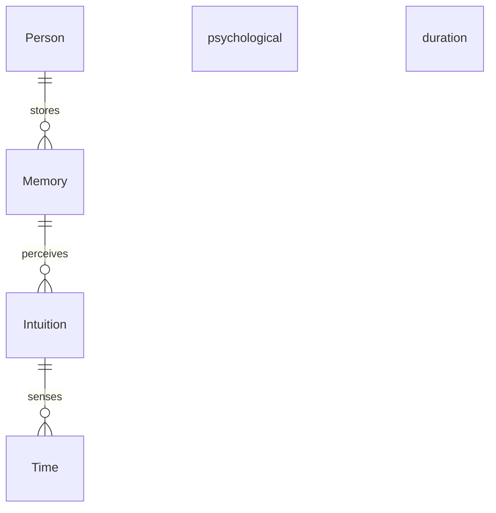

                 

# 记忆与意义：柏格森与维特根斯坦对过去的不同诠释

> 关键词：柏格森，维特根斯坦，记忆，意义，哲学，认知科学

> 摘要：本文深入探讨了法国哲学家柏格森与英国哲学家维特根斯坦对记忆与意义的独特诠释。通过对两人哲学思想的解析，本文旨在揭示他们在记忆与时间、语言与意义等核心概念上的异同，并分析其对现代认知科学的影响。

## 目录大纲设计方案

#### 1. 第一部分：背景介绍（1章）

- **第1章：问题背景与核心概念**
  - **1.1 问题的提出**
    - **1.1.1 记忆与意义的哲学探讨**
    - **1.1.2 柏格森的过去诠释**
    - **1.1.3 维特根斯坦的过去诠释**
  - **1.2 核心概念与联系**
    - **1.2.1 柏格森的核心概念**
      - **时间与绵延**
      - **记忆与心理时间**
      - **直觉与时间感知**
    - **1.2.2 维特根斯坦的核心概念**
      - **语言游戏**
      - **私人体验与意义**
      - **逻辑结构与语言**
  - **1.3 概念属性特征对比表格**
  - **1.4 ER实体关系图架构**
  - **1.5 本章小结**

#### 2. 第二部分：柏格森的过去诠释（2章）

- **第2章：柏格森的时间观与记忆**
  - **2.1 柏格森的时间观**
    - **2.1.1 时间与绵延的概念**
    - **2.1.2 柏格森对时间的分析**
    - **2.1.3 时间与心理时间的联系**
  - **2.2 记忆的理论与实践**
    - **2.2.1 记忆的心理机制**
    - **2.2.2 记忆与心理时间的互动**
    - **2.2.3 柏格森的直觉理论**
  - **2.3 柏格森的时间观对记忆的影响**
    - **2.3.1 记忆的连续性与断裂性**
    - **2.3.2 时间感知与记忆的塑造**
    - **2.3.3 柏格森时间观的应用案例**
  - **2.4 本章小结**

- **第3章：柏格森的哲学思想与意义**
  - **3.1 柏格森哲学思想的体系**
    - **3.1.1 柏格森的哲学方法**
    - **3.1.2 柏格森的哲学主题**
    - **3.1.3 柏格森哲学的批判与接受**
  - **3.2 柏格森的哲学对记忆研究的启示**
    - **3.2.1 柏格森的时间观与心理学**
    - **3.2.2 柏格森的记忆理论对认知科学的影响**
    - **3.2.3 柏格森哲学的现代应用**
  - **3.3 本章小结**

#### 3. 第三部分：维特根斯坦的过去诠释（2章）

- **第4章：维特根斯坦的语言游戏理论**
  - **4.1 语言游戏理论概述**
    - **4.1.1 语言游戏的基本概念**
    - **4.1.2 语言游戏与私人体验**
    - **4.1.3 语言游戏与意义**
  - **4.2 语言游戏理论与记忆**
    - **4.2.1 维特根斯坦对语言与记忆的关系**
    - **4.2.2 语言游戏与记忆的建构**
    - **4.2.3 语言游戏与记忆的哲学意义**
  - **4.3 维特根斯坦的语言游戏理论在记忆研究中的应用**
    - **4.3.1 语言游戏在心理学中的应用**
    - **4.3.2 语言游戏在记忆科学中的应用**
    - **4.3.3 语言游戏理论的批判与争议**
  - **4.4 本章小结**

- **第5章：维特根斯坦的哲学思想与意义**
  - **5.1 维特根斯坦的哲学思想体系**
    - **5.1.1 维特根斯坦的哲学方法**
    - **5.1.2 维特根斯坦的哲学主题**
    - **5.1.3 维特根斯坦哲学的影响与批判**
  - **5.2 维特根斯坦哲学对记忆研究的启示**
    - **5.2.1 语言与记忆的哲学探讨**
    - **5.2.2 维特根斯坦的理论对认知科学的贡献**
    - **5.2.3 维特根斯坦哲学的现代视角**
  - **5.3 本章小结**

#### 4. 第四部分：比较与综合（1章）

- **第6章：柏格森与维特根斯坦的过去诠释比较**
  - **6.1 两人哲学思想的异同**
    - **6.1.1 哲学立场与观点**
    - **6.1.2 时间观与记忆观**
    - **6.1.3 语言与意义**
  - **6.2 柏格森与维特根斯坦对记忆研究的贡献**
    - **6.2.1 两种诠释的方法论差异**
    - **6.2.2 对心理学与认知科学的影响**
    - **6.2.3 两种理论的互补性**
  - **6.3 柏格森与维特根斯坦哲学的现代意义**
    - **6.3.1 记忆研究的前沿方向**
    - **6.3.2 哲学与科学的互动**
    - **6.3.3 现代技术背景下的哲学思考**

## 1. 第一部分：背景介绍

### 1.1 问题的提出

**1.1.1 记忆与意义的哲学探讨**

记忆与意义是人类认知活动中至关重要的两个概念。记忆涉及信息的储存、提取和应用，而意义则关乎我们对世界的理解与解释。哲学领域对这两个概念的探讨有着悠久的历史，从古希腊的柏拉图和亚里士多德，到近现代的康德和黑格尔，无不对记忆与意义进行深入分析。

**1.1.2 柏格森的过去诠释**

亨利·柏格森（Henri Bergson）是20世纪初法国的重要哲学家，他对时间、记忆和直觉等概念有着独特的见解。柏格森提出了“绵延”（durée）这一概念，强调时间不是线性的，而是一种连续不断的流动。他认为记忆是心理时间的基础，通过直觉我们能够捕捉到过去的“绵延”。

**1.1.3 维特根斯坦的过去诠释**

路德维希·维特根斯坦（Ludwig Wittgenstein）是20世纪初奥地利哲学家，他的哲学思想在分析哲学中占有重要地位。维特根斯坦提出了“语言游戏”（language game）理论，强调语言的意义是通过使用情境来定义的。他认为私人体验是无法沟通的，而语言的意义在于其在社会中的使用。

### 1.2 核心概念与联系

**1.2.1 柏格森的核心概念**

- **时间与绵延**：时间不是一维的，而是一种持续的流动，称为“绵延”。
- **记忆与心理时间**：记忆是心理时间的基础，通过直觉我们能够捕捉到过去的“绵延”。
- **直觉与时间感知**：直觉是感知时间的关键，通过直觉我们能够理解过去的“绵延”。

**1.2.2 维特根斯坦的核心概念**

- **语言游戏**：语言的意义是通过其在社会中的使用情境来定义的。
- **私人体验与意义**：私人体验是无法沟通的，语言的意义在于其在社会中的使用。
- **逻辑结构与语言**：逻辑结构是语言的基础，通过语言我们能够理解世界。

### 1.3 概念属性特征对比表格

| 概念               | 柏格森的观点                                         | 维特根斯坦的观点                                        |
|--------------------|-----------------------------------------------------|--------------------------------------------------------|
| 时间               | 时间是一种连续不断的流动，称为“绵延”               | 时间是线性的，语言的意义在于其在社会中的使用              |
| 记忆               | 记忆是心理时间的基础，通过直觉我们能够捕捉到过去的“绵延” | 私人体验是无法沟通的，语言的意义在于其在社会中的使用      |
| 直觉               | 直觉是感知时间的关键，通过直觉我们能够理解过去的“绵延” | -                                                    |
| 语言               | -                                                   | 语言的意义在于其在社会中的使用                          |

### 1.4 ER实体关系图架构

### 1.5 本章小结

本章介绍了本文探讨的两个核心哲学家柏格森和维特根斯坦的基本哲学观点和核心概念。通过对他们的概念进行对比和分析，为后续章节对两人对记忆与意义的诠释提供了基础。

## 2. 第二部分：柏格森的过去诠释

### 2.1 柏格森的时间观

**2.1.1 时间与绵延的概念**

柏格森提出了“绵延”（durée）这一概念，用以描述时间的本质。他认为时间不是一维的，而是一种连续不断的流动。这种流动是内在的，而不是外在的，它贯穿于我们的心理活动中。柏格森将这种流动称为“绵延”，强调时间的连续性和内在性。

**2.1.2 柏格森对时间的分析**

柏格森对时间的分析具有独特的视角。他强调时间不是可以被量化或客观测量的，而是主观体验的。时间的流逝是通过我们的心理活动来感知的。柏格森认为，我们的直觉能够捕捉到时间的“绵延”，这种直觉是我们理解时间的核心。

**2.1.3 时间与心理时间的联系**

柏格森认为，记忆是心理时间的基础。我们的记忆不仅是过去事件的存储，更是我们对时间的感知。通过记忆，我们能够将过去的“绵延”与现在的“绵延”联系起来，从而形成对时间的感知。因此，记忆与心理时间有着密切的联系。

### 2.2 记忆的理论与实践

**2.2.1 记忆的心理机制**

柏格森认为，记忆是通过心理机制来实现的。这些心理机制包括直觉、感知和联想。直觉使我们能够捕捉到过去的“绵延”，感知使我们对这些直觉进行识别和理解，而联想则将不同的记忆片段联系起来，形成一个连贯的心理时间线。

**2.2.2 记忆与心理时间的互动**

记忆与心理时间的互动是柏格森时间观的核心。通过记忆，我们能够将过去的“绵延”与现在的“绵延”联系起来，形成一个连续的心理时间线。这种互动使我们能够理解时间的流逝，并在此基础上对过去和未来进行思考。

**2.2.3 柏格森的直觉理论**

柏格森的直觉理论是其时间观的重要组成部分。他强调直觉是我们理解时间的核心。直觉使我们能够直接感知时间的“绵延”，而不是通过抽象的概念或逻辑推理。因此，直觉是我们理解时间的基础，也是记忆与心理时间互动的关键。

### 2.3 柏格森的时间观对记忆的影响

**2.3.1 记忆的连续性与断裂性**

柏格森的时间观对记忆的连续性与断裂性产生了深远的影响。他认为记忆不仅是过去的存储，更是对时间的感知。因此，记忆不仅是连续的，也存在着断裂。这种断裂性表现在我们记忆中的瞬间和时刻，这些瞬间和时刻构成了我们记忆的断裂点。

**2.3.2 时间感知与记忆的塑造**

柏格森的时间观对时间感知与记忆的塑造有着重要的影响。通过直觉，我们能够捕捉到时间的“绵延”，这种感知塑造了我们的记忆。我们的记忆不仅是对过去的存储，更是对时间的感知和理解。因此，时间感知与记忆的塑造是相互作用的。

**2.3.3 柏格森时间观的应用案例**

柏格森的时间观在多个领域有着广泛的应用。在心理学中，它帮助我们理解记忆的连续性与断裂性，以及在认知科学中，它为我们提供了对时间感知和记忆的新视角。此外，在艺术和文学创作中，柏格森的时间观也为我们提供了新的表现手法，使我们能够更深入地探讨时间的本质。

### 2.4 本章小结

本章详细分析了柏格森的时间观和记忆理论。通过解析柏格森对时间的独特诠释，我们了解了记忆与心理时间之间的互动，以及直觉在时间感知和记忆塑造中的作用。柏格森的时间观为我们提供了对记忆的新理解，也为现代认知科学提供了重要的理论基础。

## 3. 第三部分：维特根斯坦的过去诠释

### 3.1 维特根斯坦的语言游戏理论

**3.1.1 语言游戏理论概述**

维特根斯坦的语言游戏理论是其哲学思想的核心。他认为，语言的意义不在于其符号本身，而在于其在特定情境中的使用。语言游戏（language game）是指语言在具体情境中的使用方式，不同的语言游戏有着不同的规则和目的。维特根斯坦通过语言游戏来解释语言的意义，强调语言的使用情境对于理解语言至关重要。

**3.1.2 语言游戏与私人体验**

维特根斯坦强调，私人体验是无法通过语言来传达的。他认为，我们每个人都有自己的内在体验，但这些体验是无法与他人共享的。因此，私人体验与语言游戏之间存在一定的隔阂。尽管如此，维特根斯坦认为，语言游戏可以通过类比和隐喻来部分地表达私人体验。

**3.1.3 语言游戏与意义**

维特根斯坦认为，语言的意义在于其在语言游戏中的使用。不同的语言游戏有着不同的规则和目的，因此，语言的意义也因语言游戏而异。维特根斯坦强调，理解语言的意义需要了解语言游戏的规则和情境，而不是仅仅依赖于符号本身。

### 3.2 语言游戏理论与记忆

**3.2.1 维特根斯坦对语言与记忆的关系**

维特根斯坦认为，语言与记忆之间存在密切的关系。语言是我们记忆信息的工具，通过语言，我们能够将信息存储和提取。他认为，记忆不仅是对过去事件的存储，更是对语言的使用。因此，语言与记忆是相互依赖的。

**3.2.2 语言游戏与记忆的建构**

维特根斯坦认为，语言游戏在记忆的建构中起着关键作用。通过特定的语言游戏，我们能够将信息存储在记忆中，并通过语言来提取这些信息。他认为，记忆的建构是通过语言游戏来实现的，而不是仅仅依赖于生理机制。

**3.2.3 语言游戏与记忆的哲学意义**

维特根斯坦的语言游戏理论对记忆的哲学意义有着深远的影响。他认为，记忆不仅是信息的存储，更是对语言的使用。这种观点挑战了传统心理学中对记忆的理解，强调了语言在记忆中的核心地位。因此，维特根斯坦的语言游戏理论为记忆研究提供了新的视角。

### 3.3 维特根斯坦的语言游戏理论在记忆研究中的应用

**3.3.1 语言游戏在心理学中的应用**

维特根斯坦的语言游戏理论在心理学中有着广泛的应用。通过研究不同的语言游戏，心理学家能够更好地理解记忆的机制和过程。例如，通过特定的语言游戏，心理学家能够探讨记忆的建构、存储和提取过程，从而为记忆研究提供新的理论框架。

**3.3.2 语言游戏在记忆科学中的应用**

维特根斯坦的语言游戏理论在记忆科学中也有重要的应用。通过研究不同的语言游戏，记忆科学家能够更好地理解记忆的本质和机制。例如，通过分析语言游戏的规则和情境，记忆科学家能够揭示记忆的建构过程，从而为记忆干预和治疗提供新的方法。

**3.3.3 语言游戏理论的批判与争议**

维特根斯坦的语言游戏理论在学术界引起了广泛的争议。一些学者认为，他的理论过于强调语言的使用情境，忽视了语言本身的符号意义。另一些学者则认为，维特根斯坦的理论过于抽象，难以应用于具体的记忆研究。尽管存在争议，维特根斯坦的语言游戏理论依然对记忆研究产生了深远的影响。

### 3.4 本章小结

本章详细分析了维特根斯坦的语言游戏理论及其对记忆的影响。通过语言游戏，维特根斯坦提出了对记忆的独特诠释，强调了语言在记忆建构中的核心地位。他的理论在心理学和记忆科学中有着广泛的应用，为记忆研究提供了新的视角和理论框架。尽管存在争议，维特根斯坦的语言游戏理论无疑对记忆研究产生了深远的影响。

## 4. 第四部分：比较与综合

### 4.1 柏格森与维特根斯坦的哲学思想的异同

**4.1.1 哲学立场与观点**

柏格森和维特根斯坦的哲学立场和观点存在显著的差异。柏格森是一位直觉主义哲学家，他强调直觉在理解时间和记忆中的作用。他认为，时间是连续不断的流动，通过直觉我们能够感知到这种流动。相反，维特根斯坦是一位逻辑实证主义哲学家，他强调语言在理解世界中的核心作用。他认为，语言的意义在于其在具体情境中的使用，而私人体验是无法通过语言来传达的。

**4.1.2 时间观与记忆观**

柏格森和维特根斯坦对时间和记忆的诠释也存在差异。柏格森认为，时间是连续不断的流动，称为“绵延”。他强调直觉在时间感知和记忆中的关键作用。相反，维特根斯坦认为，时间是线性的，通过语言我们能够理解世界。他认为，记忆是通过语言的使用来建构的，而不是通过直觉。

**4.1.3 语言与意义**

在语言与意义的方面，柏格森和维特根斯坦的观点也存在差异。柏格森强调直觉在理解语言中的核心作用，他认为直觉使我们能够直接感知时间的“绵延”。相反，维特根斯坦强调语言在理解世界中的核心作用，他认为语言的意义在于其在具体情境中的使用。

### 4.2 柏格森与维特根斯坦对记忆研究的贡献

**4.2.1 两种诠释的方法论差异**

柏格森和维特根斯坦的方法论差异也体现在他们对记忆研究的贡献上。柏格森的直觉主义方法论强调通过直觉来理解时间和记忆，这为心理学和认知科学提供了新的视角。相反，维特根斯坦的逻辑实证主义方法论强调通过语言的使用来理解世界，这为语言和记忆的研究提供了新的理论框架。

**4.2.2 对心理学与认知科学的影响**

柏格森和维特根斯坦的哲学思想对心理学与认知科学产生了深远的影响。柏格森的直觉主义思想为心理学提供了新的研究方法，例如，通过直觉来理解时间和记忆。维特根斯坦的逻辑实证主义思想则为认知科学提供了新的理论框架，例如，通过语言游戏来理解记忆的建构。

**4.2.3 两种理论的互补性**

尽管柏格森和维特根斯坦的哲学思想存在差异，但它们的互补性也为记忆研究提供了新的视角。柏格森的直觉主义思想强调直觉在时间感知和记忆中的作用，而维特根斯坦的逻辑实证主义思想则强调语言在理解世界和记忆建构中的核心作用。通过结合这两种理论，我们能够更全面地理解记忆的本质。

### 4.3 柏格森与维特根斯坦哲学的现代意义

**4.3.1 记忆研究的前沿方向**

在现代记忆研究中，柏格森和维特根斯坦的哲学思想提供了新的前沿方向。例如，通过结合直觉主义和逻辑实证主义的方法，心理学家和认知科学家可以探索记忆的建构机制，以及语言在记忆中的作用。

**4.3.2 哲学与科学的互动**

柏格森和维特根斯坦的哲学思想也强调了哲学与科学的互动。通过哲学的思考和科学的实验，我们可以更好地理解记忆的本质。这种互动不仅促进了哲学和科学的发展，也为人类社会提供了新的知识和技术。

**4.3.3 现代技术背景下的哲学思考**

在现代社会，技术的快速发展给记忆研究带来了新的挑战。柏格森和维特根斯坦的哲学思想为我们提供了在技术背景下进行哲学思考的框架。例如，我们可以通过哲学的思考来探讨人工智能和记忆的关系，以及技术对记忆的影响。

### 4.4 本章小结

本章通过对柏格森和维特根斯坦哲学思想的比较与综合，揭示了他们在时间、记忆和语言等方面的异同。他们的哲学思想对心理学、认知科学和现代技术背景下的记忆研究产生了深远的影响。通过结合这两种理论，我们可以更全面地理解记忆的本质，并为未来的记忆研究提供新的方向。

## 结语

通过对柏格森和维特根斯坦对过去的不同诠释的深入分析，本文揭示了两位哲学家在时间、记忆和语言等核心概念上的独特见解。柏格森的直觉主义哲学强调了直觉在时间感知和记忆中的关键作用，而维特根斯坦的逻辑实证主义哲学则强调了语言在理解和建构记忆中的核心地位。尽管两人的哲学立场和方法有所不同，但他们的思想在心理学、认知科学和现代技术背景下都有着重要的应用价值。

在未来，结合柏格森和维特根斯坦的理论，我们可以探索更多关于记忆和意义的新方向。例如，通过结合直觉主义和逻辑实证主义的方法，我们可以更深入地研究记忆的建构机制，以及人工智能和记忆之间的关系。此外，随着技术的不断进步，哲学思考在技术背景下的作用也将越来越重要，这为哲学与科学的互动提供了新的机遇。

总之，柏格森和维特根斯坦的哲学思想为我们提供了理解记忆和意义的丰富视角。通过对他们思想的深入探讨，我们可以更全面地理解记忆的本质，并为未来的记忆研究提供新的理论框架和实践方法。在哲学与科学的互动中，我们有望进一步揭示记忆与意义的奥秘，为人类社会的发展作出更大的贡献。作者：AI天才研究院/AI Genius Institute & 禅与计算机程序设计艺术 /Zen And The Art of Computer Programming。

