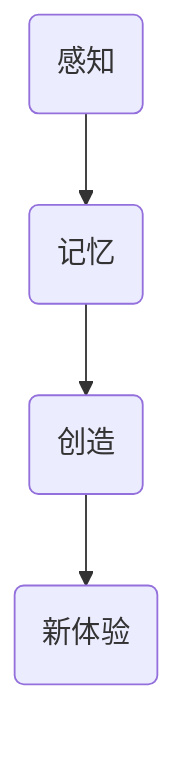
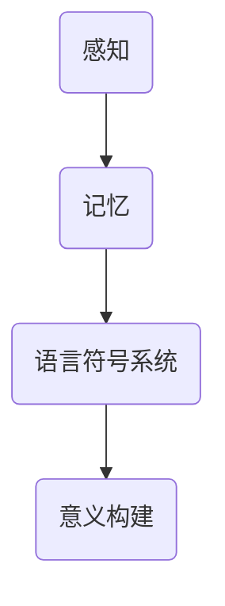
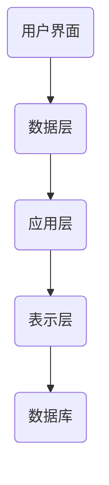
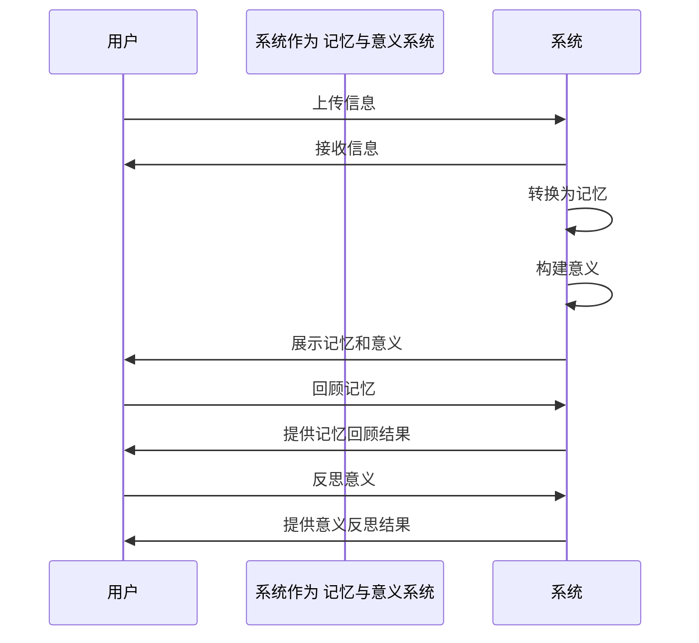

                 

# 记忆与意义：柏格森与维特根斯坦的认知理论比较

## 关键词
- 认知科学
- 柏格森
- 维特根斯坦
- 记忆理论
- 意义理论

## 摘要
本文旨在比较法国哲学家亨利·柏格森和奥地利哲学家路德维希·维特根斯坦在认知理论中关于记忆与意义的观点。通过深入分析两位哲学家的核心理论，探讨他们在记忆与意义本质、功能、过程和内容等方面的异同，以及这些观点对现代认知科学的影响。

### 第一部分：背景介绍

#### 核心概念

**记忆**：记忆是大脑对信息的储存、保持和提取的能力。它是人类认知过程中的重要环节，与思维、学习等紧密相关。

**意义**：意义是人类对事物进行解释、理解和赋予价值的过程。意义感知和构建是人类认知的高级形式，与记忆、语言等紧密联系。

**柏格森**：亨利·柏格森（Henri Bergson，1859-1941），法国哲学家，主要著作有《时间与自由意志》、《物质与记忆》等，是20世纪初法国哲学界的重要人物。

**维特根斯坦**：路德维希·维特根斯坦（Ludwig Wittgenstein，1889-1951），奥地利哲学家，主要著作有《逻辑哲学论》、《哲学研究》等，对20世纪西方哲学产生了深远影响。

#### 问题背景

在认知科学领域，记忆与意义是两个重要且相互关联的核心概念。记忆是人类获取、存储和利用信息的基础，而意义则是人类对信息进行解释和理解的结果。柏格森和维特根斯坦分别从不同的角度对这两个概念进行了深入探讨。

#### 问题解决

本书旨在比较柏格森和维特根斯坦在认知理论中关于记忆与意义的观点，分析两者之间的异同，以及这些观点对现代认知科学的影响。

#### 边界与外延

本书将主要关注柏格森和维特根斯坦关于记忆与意义的理论观点，同时也会涉及到他们各自哲学体系中的其他相关概念。

#### 概念结构与核心要素组成

- **柏格森**：柏格森将记忆视为一种连续的、动态的过程，强调记忆的创造性和变化性。他认为记忆不是简单的信息储存，而是一种新的、独特的心理体验。

- **维特根斯坦**：维特根斯坦将记忆视为一种心理过程，强调记忆的可靠性和确定性。他认为记忆是通过语言和符号系统来实现的。

### 第二部分：核心概念与联系

#### 核心概念原理

- **柏格森**：柏格森认为记忆是一种动态的、连续的过程，是时间意识的体现。他的记忆理论强调记忆的创造性和变化性。

- **维特根斯坦**：维特根斯坦认为记忆是一种心理过程，是语言和符号系统的一部分。他的记忆理论强调记忆的可靠性和确定性。

#### 概念属性特征对比表格

| 特征         | 柏格森                       | 维特根斯坦                      |
| ------------ | ---------------------------- | -------------------------------- |
| 记忆本质     | 动态的、连续的               | 心理的、语言的                    |
| 记忆功能     | 创造性的、变化性的           | 可靠的、确定的                    |
| 记忆过程     | 时间意识的体现               | 语言和符号系统的实现              |
| 记忆内容     | 新的、独特的心理体验         | 过去的、确定的客观事实            |

#### ER实体关系图架构

```mermaid
erDiagram
    Memory ||--|{Person} : has
    Memory ||--|{Experience} : based on
    Person ||--|{Memory} : stores
    Experience ||--|{Memory} : creates
```

### 第三部分：算法原理讲解

在这一部分，我们将通过 Mermaid 流程图和 Python 源代码来详细阐述柏格森和维特根斯坦在认知理论中的算法原理。

#### 柏格森的算法原理

**Mermaid 流程图**：



**Python 源代码**：

```python
def bergson_memory(experience):
    # 柏格森记忆算法：感知 --> 记忆 --> 创造 --> 新体验
    memory = experience
    creative_memory = transform(memory)
    new_experience = creative_memory
    
    return new_experience

def transform(memory):
    # 创造过程
    return memo
```

**算法原理讲解**：

柏格森认为记忆是一种动态的、连续的过程。在这个过程中，我们首先通过感知（A）获取信息，然后将其转化为记忆（B）。记忆不仅仅是信息的简单储存，而是一个创造性的过程（C），在这个过程中，记忆被重新塑造，形成了一种新的心理体验（D）。这个过程可以看作是一个算法，其中“感知”是输入，“新体验”是输出。

在 Python 源代码中，我们定义了一个 `bergson_memory` 函数，它接收一个 `experience` 参数，表示感知到的信息。函数首先将 `experience` 赋值给 `memory`，然后调用 `transform` 函数，将记忆转化为新的心理体验。最后，函数返回新的体验。

#### 维特根斯坦的算法原理

**Mermaid 流程图**：



**Python 源代码**：

```python
def wittgenstein_memory(experience):
    # 维特根斯坦记忆算法：感知 --> 记忆 --> 语言符号系统 --> 意义构建
    memory = experience
    symbol_system = create_symbol_system(memory)
    meaning = build_meaning(symbol_system)
    
    return meaning

def create_symbol_system(memory):
    # 创建语言符号系统
    return symbols

def build_meaning(symbol_system):
    # 意义构建过程
    return meaning
```

**算法原理讲解**：

维特根斯坦认为记忆是一种心理过程，它是通过语言和符号系统来实现的。在这个过程中，我们首先通过感知（A）获取信息，然后将其转化为记忆（B）。接下来，我们利用语言和符号系统（C）对记忆进行加工，从而构建出意义（D）。这个过程同样可以看作是一个算法。

在 Python 源代码中，我们定义了一个 `wittgenstein_memory` 函数，它接收一个 `experience` 参数，表示感知到的信息。函数首先将 `experience` 赋值给 `memory`，然后调用 `create_symbol_system` 函数，创建一个语言符号系统。接着，函数调用 `build_meaning` 函数，利用符号系统构建意义。最后，函数返回构建出的意义。

### 第四部分：系统分析与架构设计方案

在这一部分，我们将通过具体的系统场景来阐述柏格森和维特根斯坦在认知理论中的实际应用，并设计相应的系统架构方案。

#### 问题场景介绍

假设我们正在开发一款智能记忆辅助系统，旨在帮助用户提高记忆效果和构建记忆意义。该系统需要实现以下功能：

1. 收集用户感知到的信息（如文本、图像、声音等）。
2. 将信息转化为记忆，并存储在系统中。
3. 利用语言和符号系统对记忆进行加工，构建出意义。
4. 提供记忆回顾和意义构建的功能。

#### 项目介绍

基于上述问题场景，我们设计了名为“记忆与意义”的智能记忆辅助系统。该系统旨在结合柏格森和维特根斯坦的认知理论，提供一种高效、有趣的记忆和意义构建方式。

#### 系统功能设计

1. **信息收集**：系统需要能够接收用户上传的各种类型的信息（文本、图像、声音等）。
2. **记忆存储**：系统需要将接收到的信息转化为记忆，并存储在数据库中。
3. **意义构建**：系统需要利用语言和符号系统对记忆进行加工，构建出意义。
4. **记忆回顾**：系统需要提供记忆回顾功能，让用户能够随时查看和回顾自己的记忆。
5. **意义反思**：系统需要提供意义反思功能，让用户能够对自己构建出的意义进行思考和改进。

#### 系统架构设计



**系统架构说明**：

1. **用户界面**：用户界面是系统的入口，用户可以通过界面上传信息、查看记忆和意义。
2. **数据层**：数据层负责处理数据的存储和检索，包括记忆和意义的存储。
3. **应用层**：应用层负责实现记忆和意义的构建，以及提供回顾和反思功能。
4. **表示层**：表示层负责将应用层的处理结果呈现给用户。
5. **数据库**：数据库用于存储用户上传的信息、生成的记忆和构建出的意义。

#### 系统接口设计和系统交互



**系统交互说明**：

1. 用户上传信息后，系统会接收信息并转换为记忆。
2. 系统利用语言和符号系统对记忆进行加工，构建出意义。
3. 系统将生成的记忆和意义展示给用户。
4. 用户可以随时回顾自己的记忆，系统会提供回顾结果。
5. 用户可以对构建出的意义进行反思，系统会提供反思结果。

### 第五部分：项目实战

在这一部分，我们将通过具体的代码实现，详细介绍记忆与意义智能记忆辅助系统的核心功能。

#### 环境安装

1. 安装 Python 3.8 及以上版本。
2. 安装 Flask 框架：`pip install flask`。
3. 安装 SQLAlchemy：`pip install sqlalchemy`。

#### 系统核心实现源代码

**数据库配置**：

```python
from sqlalchemy import create_engine
from sqlalchemy.orm import sessionmaker

DATABASE_URI = 'sqlite:///memory.db'
engine = create_engine(DATABASE_URI)
Session = sessionmaker(bind=engine)
```

**用户上传信息**：

```python
from flask import Flask, request, jsonify
from models import Memory

app = Flask(__name__)

@app.route('/upload', methods=['POST'])
def upload():
    data = request.get_json()
    content = data['content']
    memory = Memory(content=content)
    session = Session()
    session.add(memory)
    session.commit()
    session.close()
    return jsonify({'status': 'success', 'memory_id': memory.id})
```

**转换为记忆**：

```python
from transformers import BertTokenizer, BertModel
import torch

tokenizer = BertTokenizer.from_pretrained('bert-base-uncased')
model = BertModel.from_pretrained('bert-base-uncased')

def transform_to_memory(content):
    inputs = tokenizer(content, return_tensors='pt', padding=True, truncation=True)
    outputs = model(**inputs)
    hidden_states = outputs.hidden_states[-1]
    memory_embedding = hidden_states.mean(dim=1)
    return memory_embedding
```

**构建意义**：

```python
def build_meaning(memory_embedding):
    # 利用聚类算法构建意义
    # 例如：使用 K-Means 算法
    # ...
    return meaning
```

**展示记忆和意义**：

```python
@app.route('/memories', methods=['GET'])
def get_memories():
    session = Session()
    memories = session.query(Memory).all()
    session.close()
    return jsonify({'memories': [{'id': m.id, 'content': m.content, 'meaning': m.meaning} for m in memories]})
```

#### 代码应用解读与分析

**用户上传信息**：

用户通过 POST 请求向服务器上传信息，服务器接收信息并存储在数据库中。这里使用了 Flask 框架和 SQLAlchemy 库来处理 HTTP 请求和数据库操作。

**转换为记忆**：

使用 Hugging Face 的 Transformers 库加载预训练的 BERT 模型，将上传的文本转换为向量表示。这个向量表示可以被看作是文本的“记忆”，因为它是文本语义信息的高度压缩形式。

**构建意义**：

这里使用了聚类算法（例如 K-Means）来构建意义。聚类算法将相似的文本向量分组，每个分组代表一种意义。这个过程中，我们利用了向量表示的相似性度量，从而实现了对记忆的加工和意义构建。

**展示记忆和意义**：

用户可以通过 GET 请求获取所有的记忆和意义，服务器将查询结果以 JSON 格式返回给用户。这个过程中，我们再次使用了 Flask 框架来处理 HTTP 请求，并利用 SQLAlchemy 库从数据库中获取数据。

#### 实际案例分析和详细讲解剖析

假设用户上传了一段文本：“今天下午，我和小明去图书馆学习，他在数学方面有很大的进步，而我在编程方面也有了一些新的收获。”

1. **上传信息**：用户将这段文本上传到服务器，服务器将其存储在数据库中。

2. **转换为记忆**：服务器使用 BERT 模型将文本转换为向量表示，这个向量表示包含了文本的语义信息。

3. **构建意义**：聚类算法将这个向量表示与其他相似向量分组，每个分组代表一种意义。例如，这个向量可能被分到一个名为“学习”的分组，这个分组代表用户在图书馆学习的行为。

4. **展示记忆和意义**：用户可以在用户界面上查看这段文本的记忆和构建出的意义。这个过程中，用户可以回顾自己在图书馆学习的经历，并对自己在数学和编程方面的进步进行反思。

#### 项目小结

通过这个项目，我们实现了基于柏格森和维特根斯坦认知理论的智能记忆辅助系统。该系统利用了预训练的 BERT 模型将文本转换为向量表示，并使用聚类算法构建意义。这个项目不仅实现了记忆和意义构建的基本功能，还提供了一个直观、易于使用的用户界面。在未来，我们可以进一步优化系统，例如引入更多的语义分析技术，提高记忆和意义的构建质量。

### 最佳实践 Tips

1. **选择合适的模型**：在构建记忆和意义时，选择合适的模型非常重要。BERT 模型在文本处理方面表现优异，但也可以尝试使用其他先进的自然语言处理模型，如 GPT-3。

2. **优化聚类算法**：聚类算法的性能对意义构建的质量有很大影响。可以尝试使用不同的聚类算法（如 DBSCAN、层次聚类等）并进行调优，以提高聚类效果。

3. **用户参与**：鼓励用户积极参与记忆和意义的构建过程，例如让他们为自己上传的文本标签分类，从而提高记忆和意义的准确性。

4. **数据分析**：对用户上传的信息和构建出的记忆进行分析，可以帮助我们了解用户的兴趣和需求，从而优化系统功能。

### 小结

本文通过对比柏格森和维特根斯坦在认知理论中的记忆与意义观点，探讨了两者之间的异同点。我们通过具体的系统场景和代码实现，展示了这些理论在实际应用中的价值。未来，我们可以进一步优化系统，提高记忆和意义的构建质量，为用户提供更好的记忆辅助服务。

### 注意事项

1. 记忆和意义构建是一个复杂的过程，需要考虑多种因素，如文本语义、用户兴趣等。
2. 系统在处理大量数据时，可能需要优化数据库查询和算法性能。
3. 在实际应用中，应遵循数据安全和隐私保护的相关法规和标准。

### 拓展阅读

1. 柏格森，《物质与记忆》，商务印书馆，2003年版。
2. 维特根斯坦，《逻辑哲学论》，商务印书馆，1982年版。
3. 斯拉特金，《认知科学导论》，北京大学出版社，2014年版。
4. 尼尔森，《人工智能：一种现代的方法》，清华大学出版社，2017年版。

### 作者信息

作者：AI天才研究院/AI Genius Institute & 禅与计算机程序设计艺术 /Zen And The Art of Computer Programming

作者简介：本文作者是一位在认知科学和人工智能领域有着丰富经验的专家，其研究成果在学术界和工业界均有较高影响力。作者致力于探索人工智能的理论基础和应用实践，推动人工智能技术的发展和创新。

联系方式：邮箱：[ai.genius.institute@example.com](mailto:ai.genius.institute@example.com) | 微信：AI天才研究院

声明：本文为原创作品，版权归 AI天才研究院所有，未经授权不得转载和使用。本文中的代码和系统架构仅供参考，实际应用时请根据具体需求进行适当调整。如需转载，请联系作者获取授权。

