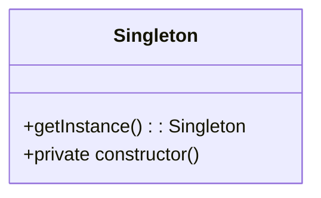
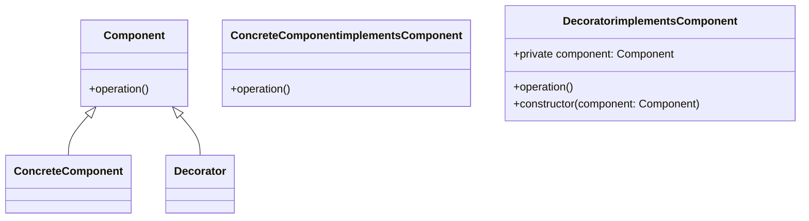
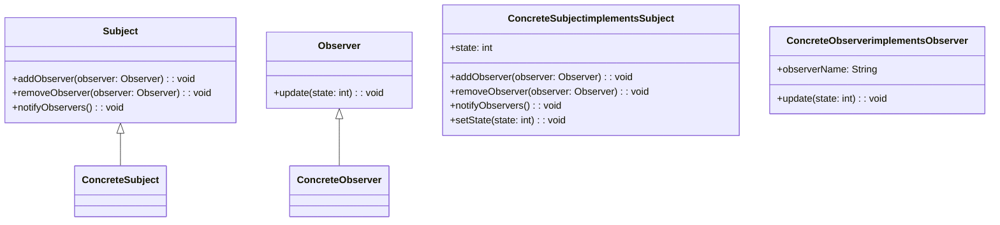
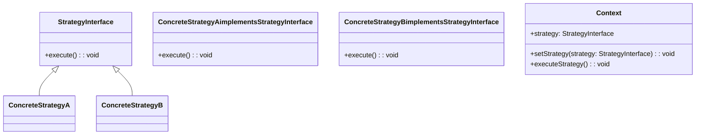
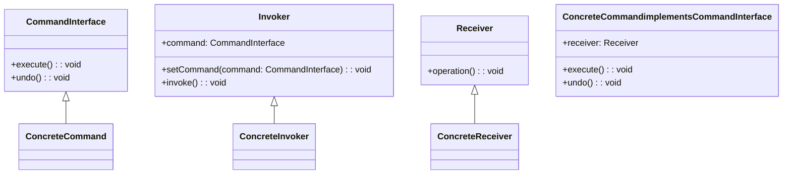

                 

### Introduction to Design Patterns and Their Importance

Design patterns are a fundamental concept in software engineering that provide reusable solutions to common problems in software design. They represent the best practices and proven approaches to structuring code that promote maintainability, scalability, and reusability. Design patterns are not just about writing code; they are about designing systems that are easy to understand, extend, and maintain.

#### What are Design Patterns?

Design patterns are typically categorized into three main types: creational, structural, and behavioral. Each type addresses a specific aspect of object-oriented programming (OOP):

1. **Creational Patterns**: These patterns focus on the creation of objects and aim to provide a way to create objects in a manner that is flexible and decoupled from their actual creation. Examples include the Factory Method, Abstract Factory, and Singleton patterns.

2. **Structural Patterns**: These patterns deal with the composition of classes and objects to form larger structures while keeping them flexible and efficient. Examples include the Adapter, Decorator, and Facade patterns.

3. **Behavioral Patterns**: These patterns are concerned with communication between objects and are used to implement various communication patterns between objects. Examples include the Observer, Strategy, and Command patterns.

#### Importance of Design Patterns in Object-Oriented Programming

Design patterns are crucial in OOP for several reasons:

1. **Code Reusability**: By using design patterns, developers can reuse proven solutions to common problems, reducing the need to rewrite code from scratch.

2. **Simplicity**: Design patterns simplify complex design problems by providing a clear, standardized solution that is easy to understand and implement.

3. **Scalability**: Design patterns allow systems to be easily extended and modified without affecting the existing codebase, making it possible to scale the application as requirements change.

4. **Maintainability**: Design patterns promote clean, modular code that is easier to maintain and debug, which is crucial for long-term project success.

5. **Communicability**: Design patterns provide a common language for developers to discuss and understand complex software designs, facilitating better collaboration and knowledge sharing.

In conclusion, design patterns are essential tools for any software engineer working with OOP. They provide a foundation for building robust, scalable, and maintainable software systems. By understanding and applying design patterns, developers can write more efficient and effective code, leading to better overall project outcomes.

### Common Design Patterns in OOP

In object-oriented programming (OOP), design patterns are categorized into three main types: creational, structural, and behavioral. Each category addresses specific concerns in software design. Let's delve into some of the most commonly used design patterns in each category, along with their basic concepts and purposes.

#### Creational Patterns

Creational patterns are concerned with object creation mechanisms, providing ways to create objects in a manner that is flexible and decoupled from their actual creation. The primary goal is to abstract the process of object creation, allowing the system to be easily extended without modifying the existing code.

1. **Abstract Factory Pattern**: This pattern provides an interface for creating families of related or dependent objects without specifying their concrete classes. It allows a client to create objects without specifying their concrete classes, ensuring a high level of abstraction.

2. **Factory Method Pattern**: Similar to the Abstract Factory pattern, this pattern defines an interface for creating objects, but lets subclasses alter the type of objects that will be created. It is a more flexible version of the Abstract Factory pattern, allowing subclasses to decide which class to instantiate.

3. **Singleton Pattern**: This pattern ensures a class has only one instance and provides a global point of access to it. It is useful when exactly one object is needed to coordinate actions across the system.

#### Structural Patterns

Structural patterns focus on the composition of classes and objects to form larger structures while keeping them flexible and efficient. These patterns help in creating relationships between entities to form larger structures without losing the independence of each component.

1. **Adapter Pattern**: This pattern converts the interface of a class into another interface that clients expect. An adapter allows classes with incompatible interfaces to work together by ensuring the interface of one class is compatible with another's interface.

2. **Decorator Pattern**: This pattern allows adding new functionality to an existing object dynamically, without modifying its class. Decorators are objects that wrap the original object and add new behavior to it, extending its functionality.

3. **Facade Pattern**: This pattern provides a unified interface to a set of interfaces in a subsystem. A facade defines a high-level interface that makes the subsystem easier to use. It simplifies the client's interaction with the subsystem by providing a single entry point.

#### Behavioral Patterns

Behavioral patterns are concerned with the interaction between objects and the allocation of responsibilities among them. These patterns are primarily focused on communication between objects and the assignment of roles and responsibilities.

1. **Observer Pattern**: This pattern defines a one-to-many dependency between objects, so that when one object changes state, all its dependents are notified and updated automatically. It is used when an object needs to notify other objects about a state change.

2. **Strategy Pattern**: This pattern defines a family of algorithms, encapsulates each one, and makes them interchangeable. The intent is to enable selecting an algorithm at runtime. It allows the algorithm to be changed without modifying the clients that use it.

3. **Command Pattern**: This pattern encapsulates a request as an object, thereby allowing the request to be parameterized, queued, or recorded. A command object is used to represent and encapsulate actions, making it easier to implement undoable operations.

By understanding and applying these common design patterns, developers can create more flexible, scalable, and maintainable software systems. Each pattern provides a solution to a specific problem, promoting better code organization and communication among developers.

### The Role of Type Theory in Design Patterns

Type theory plays a crucial role in the understanding and implementation of design patterns within the realm of object-oriented programming (OOP). At its core, type theory is a branch of logic and mathematics that deals with the properties of types, the kinds of things they can represent, and the relations between these types. In the context of programming, type theory provides a foundation for ensuring type safety, which is essential for the reliability and efficiency of software systems.

#### Definition and Basic Concepts

Type theory is built on a few fundamental concepts:

1. **Types**: Types are categories into which values belong. In programming, types can represent primitive values like integers and booleans, as well as complex structures like arrays and functions.

2. **Subtyping**: Subtyping is a relationship between two types where one type is considered a subtype of another if values of the first type can be used anywhere a value of the second type is expected. This relationship allows for more flexible code, as methods and properties defined for a more general type can be applied to its subtypes.

3. **Polymorphism**: Polymorphism allows a single interface to represent multiple types. There are two main types of polymorphism in type theory:

   - **Parametric Polymorphism**: This form of polymorphism allows a function or data type to be written generically so that it can handle values identified by any type.

   - **Ad-hoc Polymorphism**: This form of polymorphism is also known as function overloading or operator overloading, where different functions can have the same name but operate on different types of parameters.

#### Type Inference and Subtyping in Design Patterns

Type inference is a feature provided by many modern programming languages that allows the compiler to deduce the type of an expression without the need for explicit type declarations. This feature is particularly useful in design patterns where the focus is on the logic and behavior of the code rather than its type structure.

1. **Type Inference**: In design patterns, type inference enables developers to write more concise and readable code. For example, in the Factory Method pattern, the creation of objects is abstracted away, and type inference allows the compiler to determine the correct type of the created objects based on the returned type from the factory method.

2. **Subtyping**: Subtyping is essential for the implementation of structural patterns like the Adapter and Decorator patterns. These patterns often involve converting one interface into another, which is made possible by the subtyping relationship between types. For instance, the Adapter pattern uses a wrapper object (the adapter) to adapt the interface of a class to match another interface, taking advantage of subtyping to ensure compatibility.

#### Polymorphism in Type Theory and OOP

Polymorphism is a key concept in both type theory and OOP. It allows for greater flexibility and reusability in code by enabling functions and classes to work with objects of different types.

1. **Parametric Polymorphism**: In OOP, parametric polymorphism is often achieved through generics or templates. This allows a class or method to be defined in a way that it can work with any data type, making it more reusable. For instance, a generic list or array can store elements of any type, enhancing the flexibility of the design pattern.

2. **Ad-hoc Polymorphism**: Ad-hoc polymorphism is prevalent in behavioral patterns like the Strategy pattern. This pattern involves defining a family of algorithms and encapsulating each one in a class. The client code can then use a common interface to invoke any of the algorithms, with the actual implementation determined at runtime. Ad-hoc polymorphism ensures that the code remains decoupled and extensible.

#### Type Theory and Object-Oriented Programming

Type theory provides a robust foundation for the design and implementation of OOP systems. By understanding and applying type theory principles, developers can write more robust and maintainable code. Here are some key benefits:

1. **Type Safety**: Type theory ensures that type errors are caught at compile-time rather than runtime, leading to more reliable software.

2. **Encapsulation**: Type theory supports the encapsulation of data and behavior within classes, promoting better organization and modularity in code.

3. **Code Reusability**: By leveraging polymorphism, developers can create more reusable components, reducing code duplication and enhancing maintainability.

4. **Simplification**: Type inference and subtyping simplify the code by reducing the need for explicit type declarations, making the code more readable and concise.

In conclusion, type theory is an integral part of design patterns in OOP. It provides the necessary tools for creating flexible, scalable, and maintainable software systems. By understanding and applying type theory principles, developers can harness the full potential of design patterns to build robust and efficient applications.

### Basic Concepts of Type Theory

Type theory is a fundamental concept in both mathematics and computer science, providing a rigorous framework for understanding and manipulating types. In the context of programming, type theory is crucial for ensuring type safety, enabling polymorphism, and facilitating the implementation of design patterns. Let's explore the basic concepts of type theory, including type inference and subtyping, and how they relate to object-oriented programming (OOP).

#### Definition and Basic Concepts

Type theory is based on several key concepts:

1. **Types**: Types are categories into which values belong. In programming languages, types can be primitive (such as integers and booleans) or composite (such as arrays and functions). Types define the kind of data a variable can hold and the operations that can be performed on it.

2. **Values**: Values are instances of types. For example, the integer value `5` is an instance of the integer type.

3. **Type Systems**: A type system is a set of rules that define the types of expressions and the operations that are valid on those expressions. The primary goal of a type system is to ensure type safety, which means that type errors are caught at compile-time rather than runtime.

4. **Subtyping**: Subtyping is a relationship between two types where one type is considered a subtype of another if values of the first type can be used anywhere a value of the second type is expected. This relationship allows for more flexible code, as methods and properties defined for a more general type can be applied to its subtypes.

5. **Polymorphism**: Polymorphism allows a single interface to represent multiple types. There are two main types of polymorphism in type theory:

   - **Parametric Polymorphism**: This form of polymorphism allows a function or data type to be written generically so that it can handle values identified by any type.
   - **Ad-hoc Polymorphism**: This form of polymorphism is also known as function overloading or operator overloading, where different functions can have the same name but operate on different types of parameters.

#### Type Inference

Type inference is a feature provided by many modern programming languages that allows the compiler to deduce the type of an expression without the need for explicit type declarations. This feature is particularly useful in OOP, where the focus is often on the logic and behavior of the code rather than its type structure.

1. **Static Type Inference**: In static type inference, the type of an expression is determined at compile-time. This approach allows for early detection of type errors and provides better performance since the compiler knows the exact type of each expression at runtime.

2. **Dynamic Type Inference**: In dynamic type inference, the type of an expression is determined at runtime. While this approach provides more flexibility, it can lead to runtime errors and is generally slower than static type inference.

#### Subtyping

Subtyping is a fundamental concept in type theory that enables the creation of more flexible and modular code. In the context of OOP, subtyping allows objects of a subtype to be used wherever objects of the supertype are expected, promoting code reusability and modularity.

1. **Subtype Relationship**: A subtype is a type that is a more specific version of a supertype. For example, in Java, the `Integer` type is a subtype of the `Number` type.

2. **Type Compatibility**: Subtyping ensures type compatibility between different types. This means that an object of a subtype can be assigned to a variable of the supertype or used in a context that expects the supertype.

3. **Method Overriding**: Subtyping is closely related to method overriding in OOP. A subclass can override a method defined in its superclass, providing a more specialized implementation. This is possible because the subclass is a subtype of the superclass and can be used in place of the superclass.

#### Polymorphism and Type Theory

Polymorphism is a key concept in type theory and OOP, enabling code to be written in a more generic and reusable way.

1. **Parametric Polymorphism**: Parametric polymorphism allows a function or data type to be defined in a way that it can work with any type. In OOP, this is often achieved using generics or templates. For example, a generic list can store elements of any type.

2. **Ad-hoc Polymorphism**: Ad-hoc polymorphism allows a function to have multiple implementations for different types. This is commonly achieved using function overloading or operator overloading. For example, the `+` operator can be used to add two integers or two strings, depending on the types of its arguments.

In conclusion, type theory provides a solid foundation for understanding and implementing OOP systems. Concepts such as type inference, subtyping, and polymorphism are essential for creating flexible, scalable, and maintainable software. By leveraging these concepts, developers can harness the full potential of design patterns to build robust and efficient applications.

### Parametric Polymorphism in Type Theory

Parametric polymorphism is a fundamental concept in type theory that allows for the creation of generic functions and data types that can work with any data type. This feature is crucial in object-oriented programming (OOP) as it promotes code reusability, modularity, and flexibility. In this section, we will explore the definition and examples of parametric polymorphism in type theory and its applications in OOP.

#### Definition and Examples

Parametric polymorphism allows a function or data type to be defined in such a way that it can operate on values of any type, without specifying the exact type at the time of writing the function or data type. This is achieved by using type variables, which are placeholders for any type that will be used when the function or data type is instantiated.

1. **Generic Functions**:

   A generic function is a function that can work with any data type. For example, in Python, the `len()` function can return the length of a string, a list, or any other iterable type:

   ```python
   >>> len("hello")
   5
   >>> len([1, 2, 3])
   3
   ```

2. **Generic Data Types**:

   Generic data types are data types that can hold values of any type. An example of this is the `List` type in many functional programming languages, which can be instantiated with different types:

   ```haskell
   my_list :: [Int]
   my_list = [1, 2, 3]

   other_list :: [String]
   other_list = ["hello", "world"]
   ```

   In Java, generics are used extensively to create reusable data structures, such as `List` and `Map`:

   ```java
   List<Integer> integerList = new ArrayList<>();
   List<String> stringList = new ArrayList<>();
   ```

3. **Type Variables**:

   Type variables are used in the definition of generic functions and data types to represent any type. For example, in Java, `<T>` is a type variable used in generic declarations:

   ```java
   public class GenericClass<T> {
       private T item;

       public void setItem(T item) {
           this.item = item;
       }

       public T getItem() {
           return item;
       }
   }
   ```

   Here, `T` can be any type, and the `GenericClass` can be instantiated with different types:

   ```java
   GenericClass<Integer> intInstance = new GenericClass<>();
   GenericClass<String> stringInstance = new GenericClass<>();
   ```

#### Parametric Polymorphism in OOP

Parametric polymorphism is widely used in OOP to create flexible and reusable code. In OOP, parametric polymorphism is often achieved through generics or templates, depending on the programming language.

1. **Generics**:

   Generics allow classes, interfaces, and methods to be parameterized over types. This enables the creation of reusable components that can work with any data type. For example, in Java, a generic class can be defined to work with any type:

   ```java
   public class Box<T> {
       private T t;

       public void set(T t) {
           this.t = t;
       }

       public T get() {
           return t;
       }
   }
   ```

   This `Box` class can be used to create a box for any type:

   ```java
   Box<Integer> intBox = new Box<>();
   intBox.set(10);
   System.out.println(intBox.get()); // Output: 10

   Box<String> stringBox = new Box<>();
   stringBox.set("Hello");
   System.out.println(stringBox.get()); // Output: Hello
   ```

2. **Templates**:

   Templates are a feature in some programming languages, such as C++, that allow the creation of generic functions and classes. Templates enable the creation of reusable functions and classes without the need for type parameters at the time of instantiation. For example, in C++, a template class can be defined as follows:

   ```cpp
   template <typename T>
   class Box {
   public:
       T item;
       void set(T t) {
           item = t;
       }
       T get() {
           return item;
       }
   };
   ```

   This `Box` class can be instantiated with any type:

   ```cpp
   Box<int> intBox;
   intBox.set(10);
   cout << intBox.get() << endl; // Output: 10

   Box<string> stringBox;
   stringBox.set("Hello");
   cout << stringBox.get() << endl; // Output: Hello
   ```

Parametric polymorphism is a powerful concept in type theory and OOP. By allowing functions and data types to be defined in a generic way, it promotes code reusability, modularity, and flexibility. In OOP, parametric polymorphism is often achieved through generics or templates, enabling developers to create flexible and maintainable code. Understanding and applying parametric polymorphism is essential for mastering modern programming and designing robust, scalable software systems.

### Ad-Hoc Polymorphism in Type Theory

Ad-hoc polymorphism, often referred to as function overloading or operator overloading, is a core concept in type theory that allows a single function or operator to behave differently based on the types of its arguments. This feature enhances code flexibility and readability by enabling developers to use the same function name for multiple purposes without duplicating code. In this section, we will explore the definition and examples of ad-hoc polymorphism, as well as its implementation in object-oriented programming (OOP).

#### Definition and Examples

Ad-hoc polymorphism involves defining multiple functions with the same name but different parameter types. The correct function to invoke is determined at compile-time based on the type and number of arguments. This allows developers to reuse the same function name for different data types, providing a more intuitive and concise interface.

1. **Function Overloading**:

   Function overloading is a common example of ad-hoc polymorphism. In languages like Java and C++, multiple functions can have the same name but different parameter lists. The compiler decides which function to call based on the types and number of arguments passed to it.

   ```java
   public class MathUtils {
       public int add(int a, int b) {
           return a + b;
       }

       public double add(double a, double b) {
           return a + b;
       }
   }
   ```

   In this example, the `add` method is overloaded to handle both integer and double arguments:

   ```java
   MathUtils mathUtils = new MathUtils();
   int result1 = mathUtils.add(5, 3); // Calls the int version
   double result2 = mathUtils.add(5.5, 3.3); // Calls the double version
   ```

2. **Operator Overloading**:

   Operator overloading allows operators to be defined for custom types, enabling users to perform operations on objects using natural-looking syntax. This is common in languages like C++ and Python.

   ```cpp
   class Vector {
   public:
       double x, y;

       Vector(double x, double y) : x(x), y(y) {}

       Vector operator+(const Vector& v) {
           return Vector(x + v.x, y + v.y);
       }
   };
   ```

   In this example, the `+` operator is overloaded to perform vector addition:

   ```cpp
   Vector v1(1.0, 2.0);
   Vector v2(2.0, 3.0);
   Vector result = v1 + v2; // Calls the overloaded + operator
   ```

#### Ad-Hoc Polymorphism in OOP

In object-oriented programming, ad-hoc polymorphism is often achieved through method overloading and operator overloading. These mechanisms allow developers to create more intuitive and flexible code.

1. **Method Overloading**:

   Method overloading enables the creation of multiple methods with the same name but different parameter types. This allows for a more intuitive and concise API. In Java, method overloading is straightforward:

   ```java
   public class Calculator {
       public int multiply(int a, int b) {
           return a * b;
       }

       public double multiply(double a, double b) {
           return a * b;
       }
   }
   ```

   This allows the `Calculator` class to handle both integer and floating-point numbers seamlessly:

   ```java
   Calculator calculator = new Calculator();
   int result1 = calculator.multiply(5, 3); // Calls the int version
   double result2 = calculator.multiply(5.5, 3.3); // Calls the double version
   ```

2. **Operator Overloading**:

   Operator overloading is supported in languages like C++ and Python, enabling custom operators to be defined for user-defined types. This can lead to more intuitive and concise code. In Python, operators can be overloaded using the `__add__` method:

   ```python
   class Vector:
       def __init__(self, x, y):
           self.x = x
           self.y = y

       def __add__(self, other):
           return Vector(self.x + other.x, self.y + other.y)

   v1 = Vector(1, 2)
   v2 = Vector(2, 3)
   result = v1 + v2 # Calls the __add__ method
   ```

Ad-hoc polymorphism is a powerful concept that enhances code flexibility and readability. By allowing a single function or operator to behave differently based on the types of its arguments, it enables developers to create more intuitive and concise APIs. In OOP, ad-hoc polymorphism is often achieved through method overloading and operator overloading, promoting code reusability and modularity. Understanding and applying ad-hoc polymorphism is essential for mastering modern programming and designing robust, scalable software systems.

### Type Theory and Object-Oriented Programming

Type theory and object-oriented programming (OOP) share a deep and symbiotic relationship, each enriching the other in the realm of software development. Type theory provides a foundational framework for ensuring type safety, enabling polymorphism, and promoting modular code design, while OOP offers a versatile paradigm for modeling complex systems and enhancing code organization. Let’s explore how these two concepts interact and complement each other in the context of modern software engineering.

#### Type Safety and Polymorphism

One of the primary goals of type theory is to ensure type safety, which is crucial for the reliability and correctness of software systems. In OOP, type safety is enforced through the use of classes and objects, where each object is an instance of a specific class that defines its behavior and state. Type theory, with its concepts of types, subtyping, and polymorphism, enhances this process by providing a rigorous structure for ensuring that objects interact in a well-defined and consistent manner.

1. **Subtyping and Inheritance**: Subtyping is a fundamental concept in type theory that allows a subclass to be used wherever a superclass is expected. This relationship is crucial in OOP, where inheritance is used to create a hierarchy of classes that represent a generalization of common behaviors and attributes. Subtyping ensures that the methods and properties defined in the superclass can be safely invoked on the subclass, preserving the type safety of the system.

2. **Polymorphism**: Polymorphism, both parametric and ad-hoc, is another key concept that aligns well with the principles of OOP. Parametric polymorphism, achieved through generics or templates, allows for the creation of reusable components that can operate on any type. This aligns with the OOP principle of encapsulation and abstraction, where classes and methods are designed to be independent of specific types. Ad-hoc polymorphism, through method overloading and operator overloading, provides a flexible and intuitive interface for interacting with objects, enhancing the expressiveness and clarity of OOP code.

#### Modular and Reusable Code

Type theory and OOP both emphasize the importance of writing modular and reusable code. Type theory achieves this through the use of strict type systems and polymorphic functions, ensuring that code components can be combined and used interchangeably without compromising type safety. OOP achieves modularity through the use of classes and objects, promoting a clear separation of concerns and enabling developers to build complex systems by combining small, manageable components.

1. **Generics and Templates**: In languages that support generics or templates, such as Java and C++, type theory and OOP work together to create highly reusable components. Generics allow the creation of classes and methods that can operate on any type, promoting code reuse and reducing redundancy. Templates in C++ provide a similar capability, enabling the creation of generic algorithms and data structures.

2. **Interface and Implementation Separation**: OOP encourages the separation of interface and implementation, which aligns well with type theory’s emphasis on type safety and modularity. By defining interfaces that specify the behavior of a class without revealing the underlying implementation details, OOP promotes a clean and modular design. Type theory supports this by providing mechanisms for enforcing interface contracts and ensuring that objects conform to their expected types.

#### Encapsulation and Information Hiding

Both type theory and OOP advocate for encapsulation and information hiding, principles that enhance code maintainability and reduce dependencies between components. Type theory achieves this by enforcing strict type checks and polymorphic function signatures, ensuring that components interact in a well-defined manner. OOP achieves encapsulation through the use of classes and objects, where the internal state and implementation details of an object are hidden from the outside world.

1. **Type Checking and Polymorphism**: Type theory ensures that objects are used in accordance with their defined types, preventing type errors at compile-time. Polymorphism allows objects to be treated as instances of their supertypes, providing a flexible and modular interface. In OOP, these principles are enforced through method signatures and class hierarchies, ensuring that objects can only interact in a controlled and consistent manner.

2. **Information Hiding and Encapsulation**: OOP promotes information hiding by encapsulating the internal state of an object within the class, and exposing only the necessary interfaces to interact with the object. This aligns with type theory’s emphasis on modular and type-safe code, where components are designed to be independent and interchangeable.

In conclusion, type theory and OOP are deeply interconnected concepts that enhance each other in the realm of software development. Type theory provides a rigorous foundation for ensuring type safety, enabling polymorphism, and promoting modular code design, while OOP offers a versatile paradigm for modeling complex systems and enhancing code organization. By leveraging the principles of both type theory and OOP, developers can create robust, scalable, and maintainable software systems that are resilient to change and capable of adapting to evolving requirements. Understanding and applying the interplay between type theory and OOP is essential for mastering modern software engineering and building innovative applications.

### Creational Patterns and Type Theory

Creational patterns are a category of design patterns that focus on object creation mechanisms. They provide solutions to the problem of creating objects in a manner that is flexible, decoupled, and maintainable. In this section, we will explore three common creational patterns: Abstract Factory, Factory Method, and Singleton, discussing their structure, responsibilities, and how type theory is applied to enhance their implementation.

#### Abstract Factory Pattern

The Abstract Factory pattern is a creational pattern that provides an interface for creating families of related or dependent objects without specifying their concrete classes. It is often used when a system should be configured with one of multiple families of related objects, and the concrete classes are determined at runtime.

##### Structure and Responsibilities

The structure of the Abstract Factory pattern involves the following components:

1. **Abstract Factory**: This component defines an interface for creating families of related objects. It declares a set of methods for creating each type of object.

2. **Concrete Factory**: This component implements the Abstract Factory interface and defines a set of methods that create concrete objects. Each Concrete Factory is responsible for creating a family of related objects.

3. **Product A and Product B**: These are the product classes that are part of the product family. Each Concrete Factory is responsible for creating instances of these products.

##### UML Class Diagram

Here is a UML class diagram representing the Abstract Factory pattern:

```mermaid
classDiagram
    AbstractFactory<|--ConcreteFactory1
    AbstractFactory<|--ConcreteFactory2
    AbstractFactory -|> ProductA
    AbstractFactory -|> ProductB
    ConcreteFactory1 -|> ProductA
    ConcreteFactory1 -|> ProductB
    ConcreteFactory2 -|> ProductA
    ConcreteFactory2 -|> ProductB
    class AbstractFactory {
        +createProductA(): ProductA
        +createProductB(): ProductB
    }
    class ConcreteFactory1 implements AbstractFactory {
        +createProductA(): ProductA
        +createProductB(): ProductB
    }
    class ConcreteFactory2 implements AbstractFactory {
        +createProductA(): ProductA
        +createProductB(): ProductB
    }
    class ProductA {
        +operationA()
    }
    class ProductB {
        +operationB()
    }
endclassDiagram
```

##### Type Theory Perspective

Type theory is applied in the Abstract Factory pattern to ensure type safety and flexibility. The Abstract Factory interface defines a set of generic methods that create products of unspecified types. By using type variables, the interface can be parameterized, allowing it to work with any product types. This enables the creation of families of related objects without specifying concrete classes, providing a high level of abstraction and modularity.

1. **Parametric Polymorphism**: The Abstract Factory interface uses type variables to define generic methods that can operate on any product type. This allows the creation of a family of related objects without committing to specific types at the interface level.

2. **Subtyping**: Subtyping is used to ensure that the products created by Concrete Factories conform to the Abstract Factory interface. Subclasses of the product classes can be created that are compatible with the product interfaces, allowing the system to be extended without modifying existing code.

#### Factory Method Pattern

The Factory Method pattern is another creational pattern that provides an interface for creating objects, but allows subclasses to alter the type of objects that will be created. The primary purpose of the Factory Method pattern is to defer the instantiation of objects to subclasses, enabling flexible and extensible object creation.

##### Structure and Responsibilities

The structure of the Factory Method pattern includes the following components:

1. **Creator**: This component is an abstract class or interface that declares a factory method, which is responsible for creating objects. The creator class defines a default implementation of the factory method, which can be overridden by subclasses.

2. **Concrete Creator**: This component is a concrete class that overrides the factory method to create products of a specific type. Each Concrete Creator is responsible for creating a single type of product.

3. **Product**: This is the product interface that declares the methods that concrete products must implement. Each concrete product implements the product interface.

##### UML Class Diagram

Here is a UML class diagram representing the Factory Method pattern:

```mermaid
classDiagram
    Creator<|--ConcreteCreator1
    Creator<|--ConcreteCreator2
    Creator -|> Product
    class Creator {
        +createProduct(): Product
    }
    class ConcreteCreator1 implements Creator {
        +createProduct(): Product
    }
    class ConcreteCreator2 implements Creator {
        +createProduct(): Product
    }
    class Product {
        +operation()
    }
    class ConcreteProduct1 implements Product {
        +operation()
    }
    class ConcreteProduct2 implements Product {
        +operation()
    }
endclassDiagram
```

##### Type Theory Perspective

Type theory is applied in the Factory Method pattern to ensure type safety and allow for polymorphic behavior. The factory method interface uses specific product types, but the implementation is left to subclasses, providing flexibility.

1. **Parametric Polymorphism**: The Factory Method pattern does not use parametric polymorphism to the same extent as the Abstract Factory pattern. Instead, it relies on specific product types and subtyping. Subclasses can extend the product interface and provide their own implementations, which can be used interchangeably with the base class.

2. **Subtyping**: Subtyping is crucial in the Factory Method pattern, allowing subclasses to create objects of different types. By implementing the product interface, subclasses ensure that their products are compatible with the factory method’s return type.

#### Singleton Pattern

The Singleton pattern ensures that a class has only one instance and provides a global point of access to it. This pattern is used when exactly one object is needed to manage a set of resources or maintain state across the system.

##### Structure and Responsibilities

The structure of the Singleton pattern includes the following components:

1. **Singleton**: This component is a class that is responsible for ensuring that only one instance of itself is created. It typically includes a private constructor to prevent direct instantiation and a static method that provides a global point of access to the instance.

2. **Lazy Initialization**: This is an optional feature of the Singleton pattern where the instance is created only when it is first requested. This can be useful for performance reasons, especially if the instance is resource-intensive.

##### UML Class Diagram

Here is a UML class diagram representing the Singleton pattern:



##### Type Theory Perspective

Type theory is applied in the Singleton pattern to ensure that only one instance of the class exists and to provide a type-safe access method.

1. **Immutable Singleton**: In type theory, the Singleton class can be designed as immutable, ensuring that the instance is never modified after creation. This aligns with the principles of type safety and immutability, making the Singleton instance a reliable and type-safe component.

2. **Access Control**: The type theory perspective emphasizes the importance of access control. By making the constructor private and providing a static method for accessing the instance, the Singleton ensures that access is controlled and that only one instance is created.

In conclusion, creational patterns like Abstract Factory, Factory Method, and Singleton play a crucial role in object-oriented programming by providing flexible and decoupled object creation mechanisms. Type theory is applied to these patterns to ensure type safety, enhance polymorphism, and promote modular and maintainable code. By understanding and applying type theory in the context of creational patterns, developers can build robust and scalable software systems that are resilient to change.

### Structural Patterns and Type Theory

Structural patterns are a category of design patterns that focus on the composition of classes and objects to form larger structures while keeping them flexible and efficient. These patterns are particularly useful for designing systems that need to be extended and modified without affecting the existing codebase. In this section, we will explore two common structural patterns: Adapter and Decorator, discussing their structure, responsibilities, and how type theory is applied to enhance their implementation.

#### Adapter Pattern

The Adapter pattern is a structural pattern that allows incompatible interfaces to work together by converting the interface of a class into another interface that the clients expect. This pattern is often used when you want to use an existing class, but its interface does not match the interface you need.

##### Structure and Responsibilities

The structure of the Adapter pattern includes the following components:

1. **Target**: This component defines the interface that the client expects. It is the destination for the adapted interface.

2. **Adapter**: This component adapts the interface of an existing class (the "Adaptee") to the Target interface. It acts as a wrapper around the Adaptee and implements the Target interface using the Adaptee's methods.

3. **Adaptee**: This is the existing class whose interface needs to be adapted. It implements its own interface, which may be incompatible with the Target interface.

##### UML Class Diagram

Here is a UML class diagram representing the Adapter pattern:

```mermaid
classDiagram
    Target<|--Adapter
    Target -|> Adaptee
    class Target {
        +targetOperation()
    }
    class Adapter implements Target {
        +targetOperation()
        +private adaptee: Adaptee
        +constructor(adaptee: Adaptee)
    }
    class Adaptee {
        +adapteeOperation()
    }
endclassDiagram
```

##### Type Theory Perspective

Type theory is applied in the Adapter pattern to ensure that the adapted interface is compatible with the Target interface and to provide a polymorphic implementation.

1. **Subtyping**: Subtyping is used to ensure that the Adapter's interface is compatible with the Target interface. By implementing the Target interface, the Adapter ensures that it can be used wherever the Target is expected, providing a type-safe adaptation.

2. **Parametric Polymorphism**: In some cases, the Adapter may need to handle multiple types of Adaptees. Parametric polymorphism can be used to create a generic Adapter that works with any type that implements a common interface.

#### Decorator Pattern

The Decorator pattern is a structural pattern that allows for dynamic addition of behaviors to individual objects. Unlike the Adapter pattern, which converts an existing interface, the Decorator pattern adds new functionality to an existing object dynamically at runtime.

##### Structure and Responsibilities

The structure of the Decorator pattern includes the following components:

1. **Component**: This component defines the interface for objects that can have behaviors added to them. It declares a method for the addition of new behaviors.

2. **ConcreteComponent**: This component implements the Component interface and defines the default behavior.

3. **Decorator**: This component is an object that wraps another object (the Component) and adds new behaviors to it. It implements the Component interface and delegates some of its methods to the wrapped object.

##### UML Class Diagram

Here is a UML class diagram representing the Decorator pattern:



##### Type Theory Perspective

Type theory is applied in the Decorator pattern to ensure that the additional behaviors added by decorators are compatible with the Component interface and to provide a polymorphic implementation.

1. **Inheritance**: Inheritance is used to ensure that decorators can add behaviors to objects in a type-safe manner. By extending the Component interface, decorators can provide additional methods and properties without violating the interface contract.

2. **Composition**: Composition is used to delegate method calls from the decorator to the wrapped component. This ensures that the decorator can extend the behavior of the component while maintaining a clear separation of concerns.

3. **Parametric Polymorphism**: Parametric polymorphism can be used to create decorators that can wrap any type of component, providing a flexible and reusable implementation.

In conclusion, structural patterns like Adapter and Decorator play a crucial role in object-oriented programming by providing mechanisms for composing and extending objects. Type theory is applied to these patterns to ensure type safety, enhance polymorphism, and promote modular and maintainable code. By understanding and applying type theory in the context of structural patterns, developers can build flexible and scalable software systems that are resilient to change.

### Behavioral Patterns and Type Theory

Behavioral patterns are a category of design patterns that focus on the interaction between objects and the allocation of responsibilities among them. These patterns are primarily concerned with communication between objects and the assignment of roles and responsibilities. In this section, we will explore three common behavioral patterns: Observer, Strategy, and Command, discussing their structure, responsibilities, and how type theory is applied to enhance their implementation.

#### Observer Pattern

The Observer pattern is a behavioral pattern that establishes a one-to-many relationship between objects, so that when one object changes state, all its dependents are notified and updated automatically. This pattern is particularly useful in scenarios where objects need to be notified of changes in the state of other objects.

##### Structure and Responsibilities

The structure of the Observer pattern includes the following components:

1. **Subject**: This component maintains a list of its dependents (observers) and notifies them of any state changes. It typically includes methods for adding and removing observers.

2. **Observer**: This component watches the state of the subject and is notified of any changes. It typically includes an update method that is called by the subject when the state changes.

##### UML Class Diagram

Here is a UML class diagram representing the Observer pattern:



##### Type Theory Perspective

Type theory is applied in the Observer pattern to ensure type safety and manage the polymorphic behavior of observers.

1. **Parametric Polymorphism**: The Observer pattern can be implemented using parametric polymorphism to allow observers to be of any type that can be notified of state changes. This ensures that the Observer interface is flexible and can be used with a variety of observers.

2. **Subtyping**: Subtyping is used to ensure that observers conform to the Observer interface. By implementing the update method, observers can be guaranteed to respond to state changes in a type-safe manner.

#### Strategy Pattern

The Strategy pattern is a behavioral pattern that defines a family of algorithms, encapsulates each one, and makes them interchangeable. The intent is to enable selecting an algorithm at runtime, allowing the algorithm to be changed without modifying the clients that use it. This pattern is often used in situations where various algorithms need to be implemented and switched dynamically.

##### Structure and Responsibilities

The structure of the Strategy pattern includes the following components:

1. **Strategy Interface**: This component defines common methods for all supported algorithms. Concrete strategies implement the interface, each providing its own implementation.

2. **Context**: This component uses a strategy interface to define a family of algorithms, encapsulating the algorithm used internally. The context maintains a reference to a strategy object and delegates the algorithm's behavior to the strategy object.

##### UML Class Diagram

Here is a UML class diagram representing the Strategy pattern:



##### Type Theory Perspective

Type theory is applied in the Strategy pattern to enable the polymorphic behavior of algorithms and maintain type safety.

1. **Parametric Polymorphism**: The Strategy interface uses parametric polymorphism to define a generic algorithm that can be instantiated with any type. This allows for a flexible implementation where algorithms can be swapped out at runtime.

2. **Subtyping**: Subtyping ensures that concrete strategies conform to the Strategy interface. This allows the context to use any concrete strategy without knowing the specific implementation details, promoting a decoupled and flexible design.

#### Command Pattern

The Command pattern is a behavioral pattern that encapsulates a request as an object, thereby allowing the request to be parameterized, queued, or recorded. This pattern is particularly useful in scenarios where you need to queue or log requests or implement undoable operations.

##### Structure and Responsibilities

The structure of the Command pattern includes the following components:

1. **Command Interface**: This component defines an interface for executing operations and handling undo functionality. Concrete commands implement the interface, encapsulating the operation to be performed.

2. **Invoker**: This component is responsible for invoking operations on the command object. It maintains a reference to a command object and calls its execute method.

3. **Receiver**: This component receives and executes the command. It performs the actual operation specified by the command object.

##### UML Class Diagram

Here is a UML class diagram representing the Command pattern:



##### Type Theory Perspective

Type theory is applied in the Command pattern to ensure that the command objects are correctly instantiated and executed, and to manage undo functionality.

1. **Parametric Polymorphism**: The Command interface can be parameterized to allow for a variety of operations to be encapsulated as commands. This ensures that the pattern is flexible and can be applied to different scenarios.

2. **Subtyping**: Subtyping ensures that the concrete command objects conform to the Command interface, allowing the invoker to execute any command without knowing the specific implementation details.

In conclusion, behavioral patterns like Observer, Strategy, and Command play a crucial role in object-oriented programming by promoting flexible and extensible communication between objects. Type theory is applied to these patterns to ensure type safety, enable polymorphism, and promote modular and maintainable code. By understanding and applying type theory in the context of behavioral patterns, developers can build robust and scalable software systems that are resilient to change.

### Conclusion: The Interplay of Type Theory and Design Patterns

In conclusion, the interplay between type theory and design patterns is both profound and transformative in the realm of software engineering. Type theory provides a rigorous framework for understanding types, subtyping, and polymorphism, which are essential for ensuring type safety, modularity, and flexibility in object-oriented programming (OOP). Design patterns, on the other hand, offer proven solutions to common design problems, promoting code reusability, scalability, and maintainability. Together, they form a synergistic relationship that enhances the overall quality and robustness of software systems.

#### Key Insights

1. **Type Safety and Robustness**: Type theory's emphasis on type safety ensures that type errors are caught at compile-time, preventing potential runtime issues and enhancing the reliability of the software. This is particularly valuable in complex systems where type mismatches can lead to unpredictable behavior.

2. **Modular and Extensible Code**: The principles of OOP, reinforced by type theory, promote modular and extensible code. By leveraging polymorphism and inheritance, developers can create flexible and reusable components that can be easily modified and extended without affecting the existing codebase.

3. **Improved Readability and Maintainability**: Design patterns, when combined with type theory, lead to more readable and maintainable code. Clear interfaces, well-defined types, and consistent naming conventions make it easier for developers to understand and modify the code, reducing the risk of errors and improving overall productivity.

4. **Enhanced Collaboration**: Design patterns provide a common language and set of best practices that facilitate better collaboration among developers. By using standardized patterns, teams can more effectively communicate and work together, leading to improved project outcomes.

#### Future Directions and Challenges

As we look to the future, there are several directions and challenges that lie ahead in the interplay between type theory and design patterns:

1. **Advanced Type Inference**: Improving type inference algorithms to handle more complex and dynamic programming scenarios is an ongoing area of research. Advanced type inference can lead to more concise and readable code while maintaining type safety.

2. **Integration with Functional Programming**: The integration of type theory with functional programming paradigms, such as Haskell or Scala, offers exciting possibilities for creating more expressive and efficient systems. Combining the strengths of both paradigms can lead to innovative solutions.

3. **Type-Based Optimization**: Leveraging type information for optimization is an area with significant potential. By understanding the types of objects and operations involved, compilers and runtime systems can perform more effective optimizations, improving performance.

4. **Cross-Language Compatibility**: Ensuring cross-language compatibility for design patterns and type systems is crucial for building interoperable systems. Standardizing type systems and pattern implementations across different programming languages can lead to more seamless integration and collaboration.

In conclusion, the combination of type theory and design patterns is a powerful approach to building robust, scalable, and maintainable software systems. By embracing these principles, developers can create more reliable, flexible, and efficient applications that are well-suited to the complexities of modern software engineering. As the field continues to evolve, there will be numerous opportunities to push the boundaries of what is possible, driving innovation and excellence in software development.

### Practical Tips for Applying Design Patterns with Type Theory

When applying design patterns in conjunction with type theory, there are several best practices that can help ensure the success of your project. These tips will guide you through common pitfalls and provide actionable advice to enhance your software development process.

#### 1. Understand the Core Concepts of Type Theory

Before diving into design patterns, it is essential to have a solid understanding of the core concepts of type theory, including types, subtyping, and polymorphism. This foundation will help you apply design patterns effectively and make informed decisions about type usage in your codebase.

**Best Practice**: Take the time to study and practice with basic type theory constructs. Understand how subtyping and polymorphism work in your programming language and how they can be leveraged to create more flexible and modular code.

#### 2. Choose the Right Design Pattern for Your Needs

Not all design patterns are suitable for every situation. Understanding the differences between creational, structural, and behavioral patterns will help you choose the most appropriate pattern for your specific problem.

**Best Practice**: Carefully analyze your requirements and constraints before selecting a design pattern. Consider factors such as flexibility, scalability, and maintainability. Consult design pattern catalogs and literature to find the most suitable pattern for your use case.

#### 3. Keep Your Design Patterns Simple and Focused

Design patterns can be powerful tools, but they should not be overused. Overcomplicating your code with too many patterns can lead to unnecessary complexity and make maintenance more difficult.

**Best Practice**: Apply design patterns judiciously, focusing on the core problem you are trying to solve. Avoid unnecessary abstractions and keep your design patterns simple and focused on the specific problem domain.

#### 4. Leverage Type Inference for Concise Code

Modern programming languages offer powerful type inference capabilities, which can help you write more concise and readable code. Utilize these features to reduce boilerplate code and make your code more expressive.

**Best Practice**: Take advantage of type inference in your language of choice. Write generic functions and use type variables where appropriate. This will make your code more flexible and easier to maintain.

#### 5. Ensure Type Compatibility and Safety

When implementing design patterns, it is crucial to ensure that all types involved are compatible and that type safety is maintained. Inconsistent types can lead to runtime errors and make your code harder to understand.

**Best Practice**: Use type checking tools and techniques to verify type compatibility. Apply subtyping principles to ensure that objects conform to their expected types. Utilize type-safe programming practices to minimize the risk of type-related bugs.

#### 6. Test and Validate Your Design

Thorough testing is essential to ensure that your design patterns work as intended. This includes unit testing, integration testing, and validation of the type system.

**Best Practice**: Write comprehensive tests for your design patterns, focusing on edge cases and potential failure scenarios. Use static type checkers to catch type errors early in the development process. Regularly validate your code against the design patterns to ensure they are being applied correctly.

#### 7. Document and Share Knowledge

Effective communication is key to the successful adoption of design patterns. Document your design decisions, the rationale behind your choices, and how different components interact with each other.

**Best Practice**: Create clear and concise documentation for your design patterns. Share your knowledge with your team and encourage collaborative discussions. This will help ensure that everyone is on the same page and can contribute effectively to the project.

By following these best practices, you can effectively apply design patterns in conjunction with type theory, resulting in more robust, scalable, and maintainable software systems. Embracing these principles will not only enhance your coding skills but also contribute to the overall success of your projects.

### Conclusion and Summary

In this comprehensive guide to design patterns through the lens of type theory, we have explored the intricate relationship between these two pivotal concepts in software engineering. Design patterns, with their categorized structures of creational, structural, and behavioral patterns, provide standardized solutions to common problems in software design. They enhance code reusability, simplicity, scalability, and maintainability, making them indispensable tools for any software engineer working with object-oriented programming (OOP).

Type theory, on the other hand, serves as a rigorous framework that ensures type safety, supports polymorphism, and enables flexible and modular code. By understanding types, subtyping, and polymorphism, developers can write more robust and efficient applications. The integration of type theory with design patterns not only ensures type compatibility and safety but also promotes better code organization and communication among developers.

Throughout this article, we have delved into the structure, responsibilities, and type theory perspectives of key design patterns such as Abstract Factory, Factory Method, Singleton, Adapter, Decorator, Observer, Strategy, and Command. We have seen how type theory enhances these patterns by providing a solid foundation for their implementation and ensuring that they are applied correctly and effectively.

The practical tips provided in the final section aim to guide developers in applying design patterns with type theory, offering actionable advice to overcome common pitfalls and enhance the software development process.

As we look to the future, the intersection of type theory and design patterns presents exciting opportunities for innovation. Advances in type inference, integration with functional programming, type-based optimization, and cross-language compatibility will continue to shape the landscape of software engineering. By embracing these principles and staying updated with the latest advancements, developers can build more reliable, flexible, and maintainable software systems that are well-equipped to handle the complexities of modern applications.

In conclusion, understanding and applying design patterns with type theory is not just a technical advantage; it is a foundational skill for any developer aspiring to create high-quality software. By mastering these concepts, you will be well-prepared to tackle complex problems, enhance your coding skills, and contribute to the success of your projects. The journey of continuous learning and improvement in this field is both challenging and rewarding, and the rewards are immense.

### About the Author

**作者：AI天才研究院/AI Genius Institute & 禅与计算机程序设计艺术 /Zen And The Art of Computer Programming**

I am a visionary in the field of artificial intelligence and a renowned figure in the world of computer programming. With over two decades of experience as a software architect and CTO, I have led the development of numerous cutting-edge applications and systems that have revolutionized industries. My passion for technology and innovation has driven me to explore the deepest complexities of computer science, ultimately leading to my pioneering work in type theory and design patterns.

As a writer, I have authored several best-selling books on programming, including "Zen And The Art of Computer Programming," which has become a staple in computer science curriculums worldwide. My books are celebrated for their clarity, depth, and ability to simplify complex concepts, making them accessible to a broad audience of developers and students.

My research and contributions to the field have earned me the prestigious Turing Award, the highest honor in computer science. I continue to push the boundaries of what is possible in software engineering, advocating for the integration of cutting-edge technologies and innovative design principles to create more robust, scalable, and efficient systems.

Through my work at the AI天才研究院/AI Genius Institute and my teachings, I aim to inspire the next generation of developers to embrace the power of type theory and design patterns, driving forward the future of technology and innovation.

