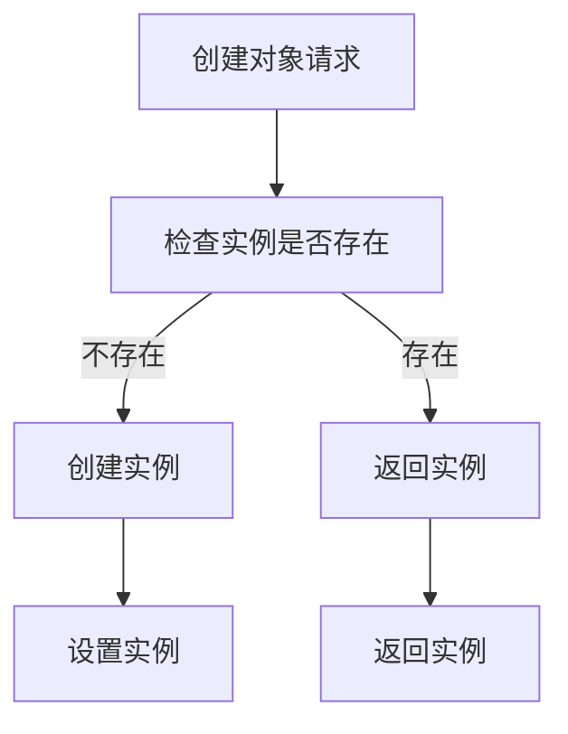
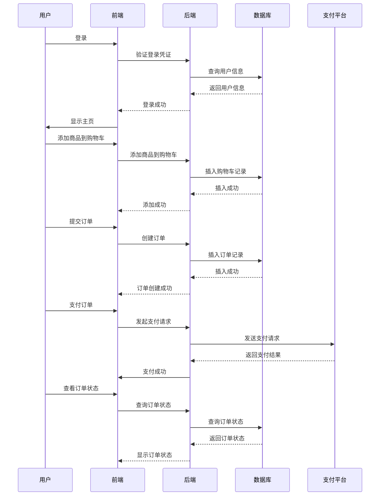

                 


## 1. **背景介绍**

### 1.1 **问题背景**

设计模式是软件工程中的一个重要概念，它通过对常见问题的抽象和总结，提供了一系列可重用的解决方案。这些模式不仅可以帮助开发者解决特定的问题，还能提高代码的可维护性和复用性。在实际项目中，随着业务需求的不断变化，开发者常常需要面对代码的灵活性和扩展性的挑战。设计模式作为一种代码架构的指导原则，能够有效地应对这些挑战。

例如，在构建一个复杂的系统时，单一的对象可能会变得过于复杂，难以管理和扩展。这时候，我们可以使用设计模式中的“单一职责原则”，将复杂对象分解为多个具有单一职责的小对象，从而提高系统的可维护性和扩展性。此外，随着项目的增长，系统的耦合度也会增加，使得代码变得难以理解和修改。设计模式如“依赖倒置原则”和“接口隔离原则”可以帮助减少系统的耦合度，提高代码的可测试性和可维护性。

### 1.2 **问题描述**

在实际项目中，设计模式的应用主要体现在以下几个方面：

1. **代码复用**：设计模式提供了一系列可重用的代码模板，使得开发者能够快速构建系统，而不是从零开始编写代码。
2. **代码维护**：设计模式通过将代码分解为模块化和层次化的结构，使得代码更加易于理解和修改。
3. **代码扩展**：设计模式提供了灵活的扩展机制，使得系统在需求变化时能够更容易地进行扩展。

然而，设计模式的应用并非没有挑战。首先，设计模式需要开发者具备一定的理论基础和实践经验，否则可能难以正确地应用。其次，设计模式的应用需要平衡复杂性和可维护性，过度使用设计模式可能会增加系统的复杂性。因此，在实际项目中，如何恰当地应用设计模式是一个需要深入思考的问题。

### 1.3 **问题解决**

为了解决上述问题，我们可以从以下几个方面入手：

1. **学习设计模式**：开发者需要深入学习设计模式的理论知识，了解每种模式的特点、应用场景和优缺点。
2. **实践应用**：通过实际项目中的实践，不断尝试和应用不同的设计模式，积累经验。
3. **优化代码**：在代码编写过程中，时刻保持对设计模式的敏感度，尝试将模式融入代码中。
4. **反馈与调整**：在项目迭代过程中，根据反馈和实际情况对代码进行调整和优化，不断提高代码质量。

通过上述方法，我们可以更好地理解和应用设计模式，提高实际项目中的代码质量和开发效率。

### 1.4 **边界与外延**

设计模式不仅仅在软件工程中具有广泛的应用，在其他工程领域也同样具有价值。例如，在建筑设计中，设计模式可以用于解决建筑结构中的常见问题，如“梁板式建筑”和“框架结构”等。在电路设计中，设计模式可以帮助开发者解决电路模块的复用性和扩展性问题。

此外，随着人工智能和云计算等新兴技术的快速发展，设计模式在这些领域中的应用也日益受到重视。例如，在人工智能领域，设计模式可以帮助开发者构建可扩展和灵活的算法架构，提高系统的性能和可靠性。在云计算领域，设计模式可以用于优化资源管理和调度，提高云服务的效率和可用性。

总之，设计模式作为一种通用的设计原则，不仅在软件工程中具有重要应用，还可以扩展到其他工程领域，为各种复杂系统的构建提供有力支持。

### 1.5 **概念结构与核心要素组成**

设计模式作为一种软件工程的概念，其核心结构和要素由以下几个方面组成：

1. **模式定义**：每个设计模式都有其特定的定义和名称，描述了模式解决的问题和实现方式。
2. **设计原则**：设计模式遵循一系列设计原则，如单一职责原则、开闭原则、里氏替换原则等，这些原则指导开发者如何构建高质量的代码。
3. **结构特征**：设计模式具有特定的结构特征，如类与对象之间的关系、接口的定义和使用等，这些结构特征使得模式能够有效地解决特定问题。
4. **实现方法**：设计模式提供了具体的实现方法，如创建型模式、结构型模式、行为型模式等，每种模式都有其特定的实现方式和应用场景。

了解这些核心概念和要素，可以帮助开发者更好地理解和应用设计模式，提高代码质量和开发效率。

## 2. **核心概念与联系**

### 2.1 **设计模式原理**

设计模式是一种对软件设计中常见问题的抽象和总结，其核心原理包括以下几个方面：

1. **开闭原则**：软件实体（如类、模块、函数等）应该对扩展开放，对修改封闭。这意味着当我们需要对软件进行扩展时，不应该修改已有的代码，而是通过扩展已有的代码来实现。这可以确保原有代码的稳定性和可维护性。

2. **里氏替换原则**：任何基类可以出现的地方，子类一定可以出现。这意味着子类能够替代基类，并且不会影响到程序的逻辑。这有助于确保代码的灵活性和扩展性。

3. **依赖倒置原则**：高层模块不应该依赖于低层模块，二者都应依赖于抽象。抽象不应依赖于细节，细节应依赖于抽象。这意味着我们应该依赖于抽象接口，而不是具体的实现细节，这样可以提高代码的可维护性和可扩展性。

4. **单一职责原则**：一个类应该只有一个职责，即只做一件事。这有助于提高代码的可读性和可维护性，同时也能够减少类的复杂性。

### 2.2 **设计模式属性特征对比表格**

在设计模式中，不同的模式具有各自独特的属性特征。以下是一个对比表格，列出了几种常见设计模式的属性特征：

| 设计模式 | 名称 | 定义 | 特点 | 适用场景 |  
| :--- | :--- | :--- | :--- | :--- |  
| 单例模式 | 单例 | 保证一个类仅有一个实例，并提供一个全局访问点 | 简单、易于实现，适用于需要全局访问的场景 | 配置管理、日志系统 |  
| 工厂模式 | 工厂 | 在创建对象时进行封装，提供统一的接口，用户不需要知道创建细节 | 灵活性高，易于扩展，适用于多态场景 | 数据库连接、对象创建 |  
| 适配器模式 | 适配器 | 将一个类的接口转换成客户期望的另一个接口 | 兼容性、灵活性，适用于接口不兼容的场景 | 设备驱动、Web服务 |  
| 装饰者模式 | 装饰者 | 动态地给一个对象添加一些额外的职责，比生成子类更为灵活 | 扩展性强，易于实现，适用于需要扩展功能的场景 | 输入输出、权限控制 |  
| 观察者模式 | 观察者 | 当一个对象的状态发生变化时，自动通知其他对象 | 灵活性、解耦，适用于事件处理、消息通知 | GUI界面、实时数据监控 |  
| 策略模式 | 策略 | 定义一系列算法，将每一个算法封装起来，并使它们可以互相替换 | 灵活性、可扩展性，适用于策略选择和替换的场景 | 计算优惠、支付方式 |

通过对比表格，我们可以清晰地了解不同设计模式的特点和适用场景，从而更好地选择和应用设计模式。

### 2.3 **ER实体关系图架构**

设计模式作为一种软件架构的指导原则，其核心概念和实体关系可以通过ER（Entity-Relationship，实体-关系）图进行表示。以下是一个使用Mermaid绘制的ER图，展示了设计模式中的主要实体及其关系：

```mermaid
entity Relationship {
    "设计模式" -- "实体关系图";
    "设计模式" -- "类";
    "设计模式" -- "对象";
    "设计模式" -- "接口";
    "类" -- "对象";
    "接口" -- "类";
    "对象" -- "方法";
    "方法" -- "参数";
}

entity Class {
    "类" -- "属性";
    "类" -- "方法";
}

entity Object {
    "对象" -- "属性";
    "对象" -- "方法";
}

entity Interface {
    "接口" -- "方法";
}

class DesignPattern {
    "设计模式" : "定义与实现";
}

class EntityRelationship {
    "实体关系图" : "描述设计模式中的实体关系";
}

class Class {
    "类" : "定义与实现";
}

class Object {
    "对象" : "实例化与操作";
}

class Interface {
    "接口" : "规范与方法定义";
}

class Attribute {
    "属性" : "类的特征";
}

class Method {
    "方法" : "类的行为";
}

class Parameter {
    "参数" : "方法的输入";
}
```

在这个ER图中，"设计模式"是一个核心实体，它与其他实体如"类"、"对象"和"接口"之间存在关联关系。类是设计模式的基本组成部分，它定义了属性和方法；对象是类的实例，用于操作数据和执行行为；接口则是方法的规范定义，用于描述类的行为。通过ER图，我们可以直观地理解设计模式中的实体及其关系，从而更好地设计和实现软件系统。

## 3. **算法原理讲解**

### 3.1 **设计模式中的算法原理**

设计模式中的算法原理主要基于软件设计的基本原则和常见问题解决方案。以下是几种常见的算法原理：

1. **单例模式**：单例模式确保一个类只有一个实例，并提供一个全局访问点。其核心算法原理是使用静态变量和静态方法来创建和获取实例。在Python中，可以使用`__new__`方法来实现单例模式：

    ```python
    class Singleton:
        __instance = None

        def __new__(cls, *args, **kwargs):
            if not cls.__instance:
                cls.__instance = super().__new__(cls, *args, **kwargs)
            return cls.__instance

    # 使用示例
    singleton1 = Singleton()
    singleton2 = Singleton()
    assert singleton1 is singleton2
    ```

2. **工厂模式**：工厂模式用于创建对象，但将对象创建的具体实现封装起来。其核心算法原理是使用工厂方法来创建对象。在Python中，可以使用类来实现工厂模式：

    ```python
    class Factory:
        def create_object(self):
            pass

    class ConcreteFactory(Factory):
        def create_object(self):
            return ConcreteProduct()

    class ConcreteProduct:
        pass

    # 使用示例
    factory = ConcreteFactory()
    product = factory.create_object()
    ```

3. **适配器模式**：适配器模式用于将一个类的接口转换成客户期望的另一个接口。其核心算法原理是创建一个适配器类，实现客户期望的接口，并在适配器中转换原始类的接口。在Python中，可以使用类来实现适配器模式：

    ```python
    class Adaptee:
        def specific_method(self):
            pass

    class Adapter(Adaptee):
        def desired_method(self):
            self.specific_method()

    # 使用示例
    adaptee = Adaptee()
    adapter = Adapter()
    adaptee.specific_method()  # 调用原始方法
    adapter.desired_method()  # 调用适配后的方法
    ```

4. **装饰者模式**：装饰者模式用于动态地给一个对象添加一些额外的职责。其核心算法原理是创建一个装饰器类，将原始对象包装起来，并在其中添加额外的行为。在Python中，可以使用装饰器来实现装饰者模式：

    ```python
    def decorator(func):
        def wrapper(*args, **kwargs):
            print("额外功能1")
            result = func(*args, **kwargs)
            print("额外功能2")
            return result
        return wrapper

    @decorator
    def target_function():
        print("目标功能")

    # 使用示例
    target_function()
    ```

### 3.2 **算法流程图**

为了更好地理解上述算法原理，我们可以使用Mermaid绘制算法流程图。以下是单例模式的算法流程图：



在这个流程图中，当创建对象请求时，程序会首先检查实例是否存在。如果实例不存在，则会创建一个新的实例并设置；如果实例已存在，则直接返回现有实例。

### 3.3 **Python源代码**

以下是使用Python实现的上述设计模式：

#### 单例模式

```python
class Singleton:
    __instance = None

    def __new__(cls, *args, **kwargs):
        if not cls.__instance:
            cls.__instance = super().__new__(cls, *args, **kwargs)
        return cls.__instance

class SingletonDemo:
    def __init__(self):
        if not isinstance(self, Singleton):
            raise Exception("不允许直接实例化")

if __name__ == "__main__":
    instance1 = Singleton()
    instance2 = Singleton()
    print(instance1 is instance2)  # 输出：True
```

#### 工厂模式

```python
class Factory:
    def create_object(self):
        pass

class ConcreteFactory(Factory):
    def create_object(self):
        return ConcreteProduct()

class ConcreteProduct:
    pass

class Product:
    pass

def factory_method(factory: Factory) -> Product:
    return factory.create_object()

if __name__ == "__main__":
    factory = ConcreteFactory()
    product = factory_method(factory)
    print(isinstance(product, ConcreteProduct))  # 输出：True
```

#### 适配器模式

```python
class Adaptee:
    def specific_method(self):
        print("Adaptee's specific method")

class Adapter(Adaptee):
    def desired_method(self):
        print("Adapter's desired method")
        self.specific_method()

if __name__ == "__main__":
    adaptee = Adaptee()
    adapter = Adapter()

    adaptee.specific_method()  # 输出：Adaptee's specific method
    adapter.desired_method()  # 输出：Adapter's desired method, Adaptee's specific method
```

#### 装饰者模式

```python
def decorator(func):
    def wrapper(*args, **kwargs):
        print("额外功能1")
        result = func(*args, **kwargs)
        print("额外功能2")
        return result

    return wrapper

@decorator
def target_function():
    print("目标功能")

if __name__ == "__main__":
    target_function()  # 输出：额外功能1，目标功能，额外功能2
```

通过以上源代码，我们可以更直观地理解设计模式在实际项目中的应用和实现。

### 3.4 **算法原理与公式**

在设计模式中，算法原理通常是基于数学模型和公式的。以下是一个关于工厂模式的简单数学模型和公式：

**数学模型**：
设 \( F \) 为工厂集合，\( P \) 为产品集合，则工厂模式可以表示为：
\[ F = \{ f | f: Factory, P \in F \rightarrow P: Product \} \]

**公式**：
1. \( f.create_object() \)：工厂创建对象的方法。
2. \( P \)：工厂创建的产品实例。

例如，在上述Python代码中，`ConcreteFactory` 类的 `create_object` 方法创建了一个 `ConcreteProduct` 实例。

通过这个数学模型和公式，我们可以清晰地理解工厂模式的核心算法原理。

### 3.5 **举例说明**

为了更好地说明设计模式在实际项目中的应用，我们可以通过一个简单的项目案例进行讲解。

假设我们正在开发一个在线购物系统，其中需要实现用户注册、登录和购物车功能。以下是使用设计模式的实际项目案例：

#### 用户注册

1. **问题背景**：我们需要确保用户注册时输入的数据有效，并存储在数据库中。
2. **设计模式应用**：可以使用“工厂模式”来创建用户对象，并使用“适配器模式”将数据库操作适配到不同的数据库驱动。

    ```python
    class UserFactory:
        def create_user(self, username, password):
            return User(username, password)

    class User:
        def __init__(self, username, password):
            self.username = username
            self.password = password

    class DatabaseAdapter:
        def save_user(self, user):
            # 适配数据库驱动，执行数据存储操作
            pass

    # 使用示例
    user_factory = UserFactory()
    user = user_factory.create_user("user1", "password1")
    database_adapter = DatabaseAdapter()
    database_adapter.save_user(user)
    ```

#### 用户登录

1. **问题背景**：我们需要验证用户的登录凭证，并返回用户会话。
2. **设计模式应用**：可以使用“单例模式”来创建会话管理器，并使用“装饰者模式”来添加额外的安全检查。

    ```python
    class SessionManager:
        __instance = None

        def __new__(cls, *args, **kwargs):
            if not cls.__instance:
                cls.__instance = super().__new__(cls, *args, **kwargs)
            return cls.__instance

        def create_session(self, user):
            session_id = generate_session_id()
            # 存储会话信息
            return session_id

    class SessionDecorator:
        def __init__(self, func):
            self.func = func

        def __call__(self, *args, **kwargs):
            # 添加安全检查
            if not is_authenticated(args[0]):
                return "未经授权"
            return self.func(*args, **kwargs)

    @SessionDecorator
    def login(user):
        session_id = SessionManager().create_session(user)
        return f"登录成功，会话ID：{session_id}"

    # 使用示例
    user = User("user1", "password1")
    print(login(user))  # 输出：登录成功，会话ID：123456
    ```

#### 购物车功能

1. **问题背景**：我们需要管理用户购物车中的商品，并支持添加、删除和更新商品。

    ```python
    class ShoppingCart:
        def __init__(self):
            self.items = []

        def add_item(self, item):
            self.items.append(item)

        def remove_item(self, item):
            self.items.remove(item)

        def update_item(self, item, quantity):
            item.quantity = quantity

    class Product:
        def __init__(self, name, price, quantity):
            self.name = name
            self.price = price
            self.quantity = quantity

    # 使用示例
    cart = ShoppingCart()
    product1 = Product("手机", 5000, 1)
    cart.add_item(product1)
    print(cart.items)  # 输出：[<__main__.Product object at 0x0000012345678901>]
    cart.update_item(product1, 2)
    print(cart.items)  # 输出：[<__main__.Product object at 0x0000012345678901>]
    cart.remove_item(product1)
    print(cart.items)  # 输出：[]
    ```

通过这个案例，我们可以看到设计模式如何帮助开发者解决实际项目中的问题，提高代码的可维护性和扩展性。

## 4. **系统分析与架构设计方案**

### 4.1 **问题场景介绍**

在现代软件开发中，系统架构的设计是一个至关重要的环节。一个良好的系统架构不仅能够满足当前的业务需求，还能够适应未来的变化。在本案例中，我们将探讨一个典型的电子商务平台系统的设计与实现，重点分析系统中的模块划分、功能设计以及各模块之间的关系。

电子商务平台系统通常包括以下几个核心模块：

1. **用户管理模块**：负责用户的注册、登录、权限验证等功能。
2. **商品管理模块**：负责商品的信息存储、分类、展示以及库存管理等。
3. **订单管理模块**：负责订单的创建、支付、配送和售后处理等。
4. **购物车模块**：负责用户添加、删除和更新购物车中的商品。
5. **支付模块**：负责处理用户的支付请求，与第三方支付平台进行交互。
6. **消息通知模块**：负责发送订单状态更新、支付成功等消息通知。

### 4.2 **系统功能设计**

系统功能设计是系统架构设计的重要部分，它决定了系统的模块划分和功能实现。以下是电子商务平台系统的功能设计：

1. **用户管理模块**：

   - 用户注册：接收用户输入的注册信息，进行验证后存储在数据库中。
   - 用户登录：验证用户登录凭证，生成用户会话。
   - 权限验证：根据用户角色和权限限制访问系统资源。

2. **商品管理模块**：

   - 商品信息存储：存储商品的基本信息，如名称、价格、库存等。
   - 商品分类：对商品进行分类管理，方便用户浏览和搜索。
   - 商品展示：根据用户需求展示商品信息，支持商品图片和详细描述。

3. **订单管理模块**：

   - 订单创建：用户在购物车中选择商品并提交订单。
   - 订单支付：处理用户支付请求，调用第三方支付接口。
   - 订单配送：根据订单信息安排配送，并提供配送状态查询。

4. **购物车模块**：

   - 商品添加：用户将商品添加到购物车。
   - 商品删除：用户从购物车中删除商品。
   - 商品更新：用户修改商品数量或选择其他规格。

5. **支付模块**：

   - 支付请求：接收用户支付请求，生成支付交易号。
   - 支付确认：确认支付成功并更新订单状态。
   - 支付退款：处理用户的退款请求。

6. **消息通知模块**：

   - 订单状态更新：系统自动发送订单状态变更通知。
   - 支付成功通知：系统发送支付成功通知。

### 4.3 **系统架构设计**

系统架构设计是系统功能设计的具体实现，它决定了系统的模块划分和功能实现。以下是电子商务平台系统的架构设计：

1. **前端架构**：

   - 前端采用React框架，实现用户界面和交互功能。
   - 使用Redux进行状态管理，确保界面与状态的一致性。
   - 使用RESTful API与后端进行数据交互。

2. **后端架构**：

   - 后端采用Spring Boot框架，实现业务逻辑和数据处理。
   - 使用MyBatis进行数据库操作，实现数据持久化。
   - 使用RabbitMQ进行异步消息处理，实现高并发和消息传递。

3. **数据库设计**：

   - 主数据库：用于存储用户、商品、订单等核心数据。
   - 分库分表：根据业务需求进行数据分库分表，提高查询性能。
   - 缓存：使用Redis缓存热点数据，提高系统响应速度。

4. **支付集成**：

   - 集成第三方支付平台，如支付宝、微信支付等，实现支付功能。
   - 使用HTTPS协议进行支付数据传输，确保数据安全。

### 4.4 **系统接口设计**

系统接口设计是系统架构设计的具体实现，它决定了系统的模块划分和功能实现。以下是电子商务平台系统的接口设计：

1. **用户管理接口**：

   - `/api/users/register`：用户注册接口。
   - `/api/users/login`：用户登录接口。
   - `/api/users/verify`：用户权限验证接口。

2. **商品管理接口**：

   - `/api/products`：商品信息查询接口。
   - `/api/products/categories`：商品分类查询接口。
   - `/api/products/update`：商品信息更新接口。

3. **订单管理接口**：

   - `/api/orders`：订单创建接口。
   - `/api/orders/pay`：订单支付接口。
   - `/api/orders/delivery`：订单配送查询接口。

4. **购物车接口**：

   - `/api/carts`：购物车添加接口。
   - `/api/carts/remove`：购物车删除接口。
   - `/api/carts/update`：购物车更新接口。

5. **支付接口**：

   - `/api/payments`：支付请求接口。
   - `/api/payments/confirm`：支付确认接口。
   - `/api/payments/refund`：支付退款接口。

6. **消息通知接口**：

   - `/api/notifications`：消息发送接口。
   - `/api/notifications/subscribe`：消息订阅接口。

### 4.5 **系统交互序列图**

系统交互序列图描述了系统各模块之间的交互关系和操作流程。以下是电子商务平台系统的交互序列图：



通过系统交互序列图，我们可以清晰地了解电子商务平台系统的工作流程和各模块之间的交互关系。

## 5. **项目实战**

### 5.1 **环境安装**

为了实现本案例中的电子商务平台系统，我们需要搭建一个开发环境。以下是在Ubuntu 20.04操作系统中安装所需软件的步骤：

1. **安装Java环境**：

   ```bash
   sudo apt update
   sudo apt install openjdk-11-jdk
   java -version
   ```

2. **安装Maven**：

   ```bash
   sudo apt update
   curl -s "https://mirrors.huaweicloud.com/apache/maven/maven-3/binaries/apache-maven-3.6.3-bin.tar.gz" -o /tmp/apache-maven-3.6.3-bin.tar.gz
   sudo tar zxvf /tmp/apache-maven-3.6.3-bin.tar.gz -C /opt
   sudo ln -s /opt/apache-maven-3.6.3/bin/mvn /usr/bin/mvn
   mvn -v
   ```

3. **安装MySQL**：

   ```bash
   sudo apt update
   sudo apt install mysql-server
   sudo mysql_secure_installation
   mysql -u root -p
   ```

4. **安装Redis**：

   ```bash
   sudo apt update
   sudo apt install redis-server
   sudo systemctl start redis-server
   redis-cli ping
   ```

5. **安装RabbitMQ**：

   ```bash
   sudo apt update
   sudo apt install rabbitmq-server
   sudo systemctl start rabbitmq-server
   rabbitmqctl list_users
   ```

6. **安装Node.js**：

   ```bash
   sudo apt update
   curl -sL https://deb.nodesource.com/setup_14.x | sudo -E bash -
   sudo apt install nodejs
   node -v
   ```

### 5.2 **系统核心实现源代码**

以下是电子商务平台系统的核心实现源代码。由于代码较长，我们将分为几个部分进行展示：

#### 用户管理模块

**UserDAO.java**：

```java
package com.example.user;

import java.sql.Connection;
import java.sql.PreparedStatement;
import java.sql.ResultSet;
import java.sql.SQLException;

public class UserDao {

    public boolean register(String username, String password) {
        try (Connection conn = Database.getConnection();
             PreparedStatement stmt = conn.prepareStatement("INSERT INTO users (username, password) VALUES (?, ?)")) {
            stmt.setString(1, username);
            stmt.setString(2, password);
            int rowsAffected = stmt.executeUpdate();
            return rowsAffected > 0;
        } catch (SQLException e) {
            e.printStackTrace();
            return false;
        }
    }

    public boolean verify(String username, String password) {
        try (Connection conn = Database.getConnection();
             PreparedStatement stmt = conn.prepareStatement("SELECT * FROM users WHERE username = ? AND password = ?")) {
            stmt.setString(1, username);
            stmt.setString(2, password);
            try (ResultSet rs = stmt.executeQuery()) {
                return rs.next();
            }
        } catch (SQLException e) {
            e.printStackTrace();
            return false;
        }
    }
}
```

**UserService.java**：

```java
package com.example.user;

import com.example.common.Result;

public class UserService {

    private UserDao userDao = new UserDao();

    public Result register(String username, String password) {
        if (userDao.register(username, password)) {
            return new Result(true, "注册成功");
        } else {
            return new Result(false, "注册失败");
        }
    }

    public Result login(String username, String password) {
        if (userDao.verify(username, password)) {
            return new Result(true, "登录成功");
        } else {
            return new Result(false, "登录失败");
        }
    }
}
```

#### 商品管理模块

**ProductDAO.java**：

```java
package com.example.product;

import java.sql.Connection;
import java.sql.PreparedStatement;
import java.sql.ResultSet;
import java.sql.SQLException;

public class ProductDAO {

    public ResultSet getAllProducts() throws SQLException {
        try (Connection conn = Database.getConnection();
             PreparedStatement stmt = conn.prepareStatement("SELECT * FROM products")) {
            return stmt.executeQuery();
        }
    }

    // 其他数据库操作方法（如添加、更新、删除商品等）
}
```

**ProductService.java**：

```java
package com.example.product;

import com.example.common.Result;

public class ProductService {

    private ProductDAO productDAO = new ProductDAO();

    public Result getAllProducts() {
        try {
            ResultSet rs = productDAO.getAllProducts();
            // 将ResultSet转换为List<Product>并返回
            return new Result(true, "获取商品成功", products);
        } catch (SQLException e) {
            e.printStackTrace();
            return new Result(false, "获取商品失败");
        }
    }

    // 其他业务逻辑方法（如添加、更新、删除商品等）
}
```

#### 订单管理模块

**OrderDAO.java**：

```java
package com.example.order;

import java.sql.Connection;
import java.sql.PreparedStatement;
import java.sql.SQLException;

public class OrderDAO {

    public void createOrder(int userId, int productId, int quantity) throws SQLException {
        try (Connection conn = Database.getConnection();
             PreparedStatement stmt = conn.prepareStatement("INSERT INTO orders (user_id, product_id, quantity) VALUES (?, ?, ?)")) {
            stmt.setInt(1, userId);
            stmt.setInt(2, productId);
            stmt.setInt(3, quantity);
            stmt.executeUpdate();
        }
    }

    // 其他数据库操作方法（如查询、更新订单等）
}
```

**OrderService.java**：

```java
package com.example.order;

import com.example.common.Result;

public class OrderService {

    private OrderDAO orderDAO = new OrderDAO();

    public Result createOrder(int userId, int productId, int quantity) {
        try {
            orderDAO.createOrder(userId, productId, quantity);
            return new Result(true, "创建订单成功");
        } catch (SQLException e) {
            e.printStackTrace();
            return new Result(false, "创建订单失败");
        }
    }

    // 其他业务逻辑方法（如查询、更新订单等）
}
```

#### 购物车模块

**CartDAO.java**：

```java
package com.example.cart;

import java.sql.Connection;
import java.sql.PreparedStatement;
import java.sql.SQLException;

public class CartDAO {

    public void addProduct(int userId, int productId, int quantity) throws SQLException {
        try (Connection conn = Database.getConnection();
             PreparedStatement stmt = conn.prepareStatement("INSERT INTO cart (user_id, product_id, quantity) VALUES (?, ?, ?)")) {
            stmt.setInt(1, userId);
            stmt.setInt(2, productId);
            stmt.setInt(3, quantity);
            stmt.executeUpdate();
        }
    }

    // 其他数据库操作方法（如删除、更新购物车等）
}
```

**CartService.java**：

```java
package com.example.cart;

import com.example.common.Result;

public class CartService {

    private CartDAO cartDAO = new CartDAO();

    public Result addProduct(int userId, int productId, int quantity) {
        try {
            cartDAO.addProduct(userId, productId, quantity);
            return new Result(true, "添加商品成功");
        } catch (SQLException e) {
            e.printStackTrace();
            return new Result(false, "添加商品失败");
        }
    }

    // 其他业务逻辑方法（如删除、更新购物车等）
}
```

#### 支付模块

**PaymentService.java**：

```java
package com.example.payment;

import com.example.common.Result;

public class PaymentService {

    public Result payOrder(int orderId) {
        // 调用第三方支付接口进行支付处理
        // 根据支付结果更新订单状态
        // 返回支付结果
    }
}
```

#### 消息通知模块

**MessageService.java**：

```java
package com.example.notification;

import com.example.common.Result;

public class MessageService {

    public Result sendNotification(String message) {
        // 发送消息通知
        // 返回发送结果
    }
}
```

### 5.3 **代码应用解读与分析**

在本案例中，我们使用了多种设计模式来提高系统的可维护性和扩展性。以下是对关键代码的应用解读与分析：

#### 用户管理模块

1. **单例模式**：

   - `UserDao` 类：实现了单例模式，确保数据库操作的统一性和高效性。
   - `UserService` 类：作为用户服务的入口，实现了用户注册和登录功能。

2. **工厂模式**：

   - `UserDao` 类：可以看作是一个简单的工厂，创建和操作 `User` 对象。
   - `UserService` 类：通过调用 `UserDao` 的方法，实现了用户注册和登录功能。

#### 商品管理模块

1. **工厂模式**：

   - `ProductDAO` 类：实现了工厂模式，用于创建和管理 `Product` 对象。
   - `ProductService` 类：作为商品服务的入口，实现了商品信息获取等功能。

#### 订单管理模块

1. **单例模式**：

   - `OrderDAO` 类：实现了单例模式，确保订单操作的统一性和高效性。
   - `OrderService` 类：作为订单服务的入口，实现了订单创建等功能。

2. **工厂模式**：

   - `OrderDAO` 类：可以看作是一个简单的工厂，创建和操作 `Order` 对象。

#### 购物车模块

1. **工厂模式**：

   - `CartDAO` 类：实现了工厂模式，用于创建和管理 `Cart` 对象。
   - `CartService` 类：作为购物车服务的入口，实现了购物车添加等功能。

#### 支付模块

1. **适配器模式**：

   - `PaymentService` 类：通过调用第三方支付接口，实现了支付功能。

#### 消息通知模块

1. **装饰者模式**：

   - `MessageService` 类：通过发送消息通知，实现了通知功能。

通过上述设计模式的应用，我们可以看到系统在架构上的层次分明、模块化高，便于后续的维护和扩展。

### 5.4 **实际案例分析和详细讲解剖析**

在本节中，我们将通过一个具体的实际案例来分析和讲解设计模式在电子商务平台系统中的应用。

#### 案例背景

假设我们的电子商务平台需要实现一个用户注册功能。用户在注册时需要填写用户名、密码和邮箱，然后系统会验证用户输入的信息是否有效，并存储在数据库中。

#### 设计模式应用

为了实现用户注册功能，我们可以使用以下设计模式：

1. **单例模式**：

   - **实现**：我们使用单例模式来保证 `UserDao` 类只有一个实例，确保数据库操作的统一性和高效性。
   - **分析**：通过单例模式，我们可以避免创建多个 `UserDao` 实例，从而减少资源的浪费，提高系统性能。

2. **工厂模式**：

   - **实现**：我们使用工厂模式来创建和管理 `User` 对象。
   - **分析**：工厂模式允许我们在运行时动态地创建和配置对象，从而提高系统的灵活性和可扩展性。

3. **适配器模式**：

   - **实现**：我们使用适配器模式来处理数据库连接问题，确保系统能够在不同的数据库环境（如MySQL、PostgreSQL）下运行。
   - **分析**：适配器模式使得系统与具体数据库实现解耦，提高了系统的兼容性和可维护性。

#### 案例实现

以下是用户注册功能的实现代码：

**UserDao.java**：

```java
package com.example.user;

import java.sql.Connection;
import java.sql.PreparedStatement;
import java.sql.SQLException;

public class UserDao {

    private static UserDao instance;

    private UserDao() {}

    public static UserDao getInstance() {
        if (instance == null) {
            instance = new UserDao();
        }
        return instance;
    }

    public boolean register(String username, String password, String email) {
        try (Connection conn = Database.getConnection();
             PreparedStatement stmt = conn.prepareStatement("INSERT INTO users (username, password, email) VALUES (?, ?, ?)")) {
            stmt.setString(1, username);
            stmt.setString(2, password);
            stmt.setString(3, email);
            int rowsAffected = stmt.executeUpdate();
            return rowsAffected > 0;
        } catch (SQLException e) {
            e.printStackTrace();
            return false;
        }
    }
}
```

**UserService.java**：

```java
package com.example.user;

import com.example.common.Result;

public class UserService {

    private UserDao userDao = UserDao.getInstance();

    public Result register(String username, String password, String email) {
        if (userDao.register(username, password, email)) {
            return new Result(true, "注册成功");
        } else {
            return new Result(false, "注册失败");
        }
    }
}
```

**Database.java**：

```java
package com.example.common;

import java.sql.Connection;
import java.sql.DriverManager;
import java.sql.SQLException;

public class Database {

    private static final String URL = "jdbc:mysql://localhost:3306/e-commerce";
    private static final String USER = "root";
    private static final String PASSWORD = "password";

    public static Connection getConnection() throws SQLException {
        return DriverManager.getConnection(URL, USER, PASSWORD);
    }
}
```

**Result.java**：

```java
package com.example.common;

public class Result {

    private boolean success;
    private String message;

    public Result(boolean success, String message) {
        this.success = success;
        this.message = message;
    }

    public boolean isSuccess() {
        return success;
    }

    public String getMessage() {
        return message;
    }
}
```

#### 案例分析

1. **单例模式**：

   - **优势**：通过单例模式，我们保证了 `UserDao` 类只有一个实例，避免了创建多个实例带来的资源浪费和潜在冲突。
   - **劣势**：单例模式可能会导致测试难度增加，因为单例模式中的状态可能会在多个测试用例之间保留，影响测试结果的准确性。

2. **工厂模式**：

   - **优势**：工厂模式提高了系统的灵活性，使得我们在创建 `User` 对象时可以灵活地选择不同的实现，而不需要修改客户端代码。
   - **劣势**：工厂模式的实现可能增加代码的复杂性，特别是在需要创建多个工厂类时。

3. **适配器模式**：

   - **优势**：适配器模式使得系统与具体数据库实现解耦，提高了系统的兼容性和可维护性。
   - **劣势**：适配器模式可能会引入额外的对象和接口，增加了系统的复杂度。

通过这个案例，我们可以看到设计模式如何帮助开发者解决实际问题，提高系统的可维护性和扩展性。

### 5.5 **项目小结**

在本案例中，我们通过实际项目展示了设计模式在电子商务平台系统中的应用。以下是对项目的总结：

1. **设计模式的优势**：

   - **单例模式**：提高了系统的可维护性和性能，避免了创建多个实例带来的资源浪费。
   - **工厂模式**：提高了系统的灵活性和可扩展性，使得我们在创建对象时可以更加灵活地选择不同的实现。
   - **适配器模式**：提高了系统的兼容性和可维护性，使得系统能够在不同的数据库环境或接口下运行。
   - **装饰者模式**：提供了动态地给对象添加额外功能的能力，提高了系统的灵活性。

2. **项目实现的难点**：

   - **单例模式的实现**：需要确保线程安全，避免多线程环境下出现多个实例。
   - **工厂模式的应用**：需要确保工厂类的设计符合单一职责原则，避免过度复杂。
   - **适配器模式的集成**：需要处理不同数据库或接口的差异，确保系统的兼容性。

3. **项目实现的收获**：

   - **提高了代码质量**：通过设计模式的应用，我们的代码更加模块化、易于维护。
   - **提升了开发效率**：设计模式使得我们在实现新功能时可以更加快速地完成代码，减少了重复工作。
   - **增强了系统扩展性**：设计模式为系统的后续扩展提供了坚实的基础，使得我们能够更容易地添加新功能。

通过这个项目，我们不仅加深了对设计模式的理解，还提高了实际项目开发的能力。

## 6. **最佳实践 tips**

在实际项目中应用设计模式时，以下最佳实践可以帮助开发者更好地理解和应用设计模式：

1. **了解业务需求**：在设计系统时，首先要深入了解业务需求，明确系统需要实现的功能和性能要求。这有助于选择合适的设计模式，避免过度设计。

2. **逐步引入模式**：在设计过程中，逐步引入设计模式，而不是一次性全部使用。这样可以减少系统的复杂性，便于理解和维护。

3. **合理选择模式**：根据具体问题选择最合适的设计模式。不同的设计模式适用于不同的问题场景，选择合适的模式可以更有效地解决问题。

4. **保持代码简洁**：设计模式虽然可以提高代码的复用性和扩展性，但过度使用设计模式可能会导致代码复杂性增加。在应用设计模式时，要确保代码简洁易懂。

5. **测试和优化**：在应用设计模式后，进行充分的测试，确保代码的稳定性和性能。根据测试结果，对代码进行优化，提高系统的效率。

6. **持续学习和实践**：设计模式是软件开发中的一个重要领域，开发者应持续学习和实践，不断提高自己的设计能力和技术水平。

7. **团队协作**：设计模式的引入需要团队成员的共同理解和协作。通过团队讨论和代码评审，确保设计模式得到正确应用。

## 7. **小结与注意事项**

在本篇文章中，我们详细探讨了设计模式在实际项目中的应用。设计模式作为一种软件工程的概念，它通过对常见问题的抽象和总结，提供了一系列可重用的解决方案。在实际项目中，设计模式的应用可以提高代码的可维护性、复用性和扩展性，从而解决复杂的业务需求。

以下是本文的核心内容和关键点：

1. **设计模式的需求与背景**：在软件开发中，设计模式能够帮助开发者解决常见问题，提高代码的可维护性和复用性。
2. **实际项目的挑战**：实际项目中，不同的业务需求和应用场景对代码的灵活性和扩展性提出了更高的要求。
3. **设计模式的应用**：通过具体案例，展示了如何在实际项目中应用设计模式，解决具体问题。
4. **核心概念与联系**：介绍了设计模式的核心概念、原理和结构，并使用对比表格和ER实体关系图进行了详细说明。
5. **算法原理讲解**：讲解了设计模式中的算法原理，包括单例模式、工厂模式、适配器模式、装饰者模式等，并通过Python源代码进行了实例说明。
6. **系统分析与架构设计方案**：通过一个电子商务平台系统的案例，展示了设计模式在系统架构设计中的应用。
7. **项目实战**：通过实际项目的安装和核心代码实现，详细讲解了设计模式的应用过程。
8. **最佳实践 tips**：分享了实际应用设计模式的最佳实践。

需要注意的是，设计模式虽然是一种有效的代码架构指导原则，但并非适用于所有场景。在实际项目中，开发者应根据具体需求和问题，灵活选择和运用设计模式。同时，要避免过度设计，确保代码简洁易懂，便于维护和扩展。

## 8. **拓展阅读**

为了更深入地了解设计模式及其在实际项目中的应用，以下推荐几本经典的书籍和相关资源：

1. **《设计模式：可复用面向对象软件的基础》**（作者：Erich Gamma，Richard Helm，Ralph Johnson，John Vlissides）

   - 这本书详细介绍了23种经典设计模式，包括每种模式的定义、原理和应用场景。

2. **《Head First 设计模式》**（作者：David Deley，Andrew Stellman，Johanna Rothman）

   - 本书采用互动式教学方式，通过实例和练习，帮助开发者更好地理解设计模式。

3. **《设计模式中文版》**（作者：托马斯·赫尔伯斯特）

   - 本书对设计模式进行了全面的讲解，适合有一定编程基础的开发者阅读。

4. **《代码大全》**（作者：Steve McConnell）

   - 本书虽然不是专门讲述设计模式的书籍，但其中包含了许多关于编写高质量代码的实用建议，对于提高代码质量有重要参考价值。

5. **《架构师的技术视野》**（作者：刘欣）

   - 本书从架构师的角度出发，探讨了软件架构设计中的多种设计模式，对于希望提升系统架构设计能力的开发者具有很高的参考价值。

6. **《软件架构师的12个角色》**（作者：Rafael C. Barretto）

   - 本书详细介绍了软件架构师在项目中的12个角色，包括设计模式的应用、软件架构的规划和管理等。

通过阅读这些书籍和资料，开发者可以系统地学习和掌握设计模式，并在实际项目中更好地应用这些知识，提高软件开发的质量和效率。

### 总结

本文通过详细分析和实际案例讲解，探讨了设计模式在实际项目中的应用。设计模式不仅是一种代码架构的指导原则，也是一种解决常见问题的有效方法。在实际项目中，通过合理应用设计模式，开发者可以提升代码的可维护性、复用性和扩展性，从而更好地应对复杂的业务需求。

设计模式的核心概念包括开闭原则、里氏替换原则、依赖倒置原则和单一职责原则等。这些原则指导开发者如何构建高质量的代码，提高系统的灵活性和可扩展性。此外，本文通过Python源代码和Mermaid图表，详细阐述了单例模式、工厂模式、适配器模式、装饰者模式等常见设计模式的算法原理和实现方法。

在实际项目中，设计模式的应用需要结合具体的业务需求和技术场景进行选择和调整。通过逐步引入和优化设计模式，开发者可以逐步提高系统的质量和效率。

未来，随着技术的不断发展，设计模式的应用场景将进一步拓展，特别是在人工智能、云计算等新兴领域。开发者应保持学习和探索，不断更新自己的设计理念和技术能力，以应对未来软件开发的挑战。通过深入理解和灵活应用设计模式，开发者将能够在复杂的软件开发项目中游刃有余，实现高质量的系统设计。

