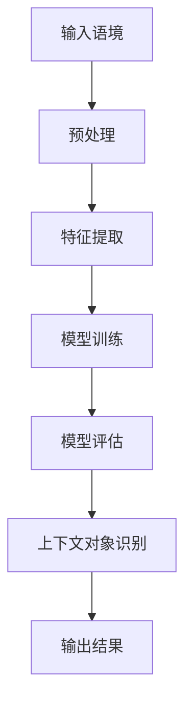
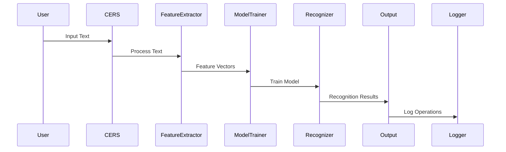
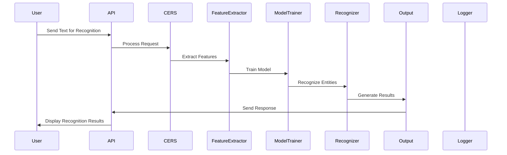

                 

## 引言

### 语境主义与上下文对象的提出

在现代社会，人工智能技术蓬勃发展，语境主义和上下文对象成为哲学、语言学、计算机科学等多个领域的热点话题。语境主义（Contextualism）是一种哲学观点，认为语言、认知和行为都是在特定的环境中形成的，不能脱离环境单独考虑。上下文对象（Contextual Entities）则是在特定环境中具有特定意义的实体或概念。本文旨在探讨语境主义和上下文对象的核心概念、原理及其在现实世界中的应用。

### 本文核心与目的

本文的核心内容将包括：

1. **背景介绍**：介绍语境主义和上下文对象的研究背景，包括问题背景、问题描述、问题解决、边界与外延等。
2. **核心概念与联系**：详细阐述语境主义和上下文对象的核心概念原理，以及它们的概念属性特征对比表格和ER实体关系图架构。
3. **算法原理讲解**：通过具体的算法流程图和Python源代码，详细阐述上下文对象识别算法的原理、数学模型和公式，并举例说明。
4. **系统分析与架构设计方案**：介绍上下文对象识别系统的场景、项目、系统功能设计、系统架构设计、系统接口设计和系统交互序列图。
5. **项目实战**：详细讲解上下文对象识别项目的环境安装、系统核心实现源代码，代码应用解读与分析，实际案例分析和详细讲解剖析，以及项目小结。

本文的目的在于，通过对语境主义和上下文对象的深入探讨，为相关领域的研究提供理论支持，并推动人工智能技术的发展。

### 本文结构与逻辑思路

本文将按照以下结构进行论述：

1. **背景介绍**：首先介绍语境主义和上下文对象的研究背景，包括问题背景、问题描述、问题解决等。
2. **核心概念与联系**：接着详细阐述语境主义和上下文对象的核心概念原理，包括概念属性特征对比表格和ER实体关系图架构。
3. **算法原理讲解**：然后通过具体的算法流程图和Python源代码，详细讲解上下文对象识别算法的原理、数学模型和公式，并举例说明。
4. **系统分析与架构设计方案**：介绍上下文对象识别系统的场景、项目、系统功能设计、系统架构设计、系统接口设计和系统交互序列图。
5. **项目实战**：最后通过具体的项目实战，详细讲解上下文对象识别项目的环境安装、系统核心实现源代码，代码应用解读与分析，实际案例分析和详细讲解剖析，以及项目小结。

通过这样的逻辑思路，本文将逐步深入，帮助读者全面理解语境主义和上下文对象的理论和实践。

### 第一部分：背景介绍

在探讨语境主义和上下文对象之前，我们需要明确它们的研究背景，了解为何这些概念在当前的研究领域中具有重要意义。本节将从问题背景、问题描述、问题解决、边界与外延以及概念结构与核心要素组成等方面，对语境主义和上下文对象进行详细阐述。

#### 问题背景

随着人工智能技术的快速发展，语境主义和上下文对象在哲学、语言学、计算机科学等多个领域的重要性日益凸显。传统的认知科学和语言学研究大多假设语言和认知行为是独立于环境的，但这种观点越来越受到挑战。现代认知科学和哲学研究逐渐认识到，语言、认知和行为都是在特定的环境中形成的，环境对它们具有深远的影响。

在计算机科学领域，特别是在自然语言处理（NLP）和人工智能领域，上下文对象的识别和理解是构建智能系统的基础。例如，在对话系统、机器翻译、文本摘要等应用中，准确理解和处理上下文对象是提高系统性能的关键。然而，现有的研究大多局限于单一领域，缺乏对语境主义和上下文对象的全面、系统探讨。这导致了许多理论和实践中的问题，需要通过深入的研究来解决。

#### 问题描述

本书旨在探讨以下问题：

1. **语境主义的核心概念是什么？** 语境主义作为一种哲学观点，其核心概念包括语境、上下文、情境等。这些概念在哲学、语言学、计算机科学等领域中的具体含义是什么？它们是如何相互关联的？
2. **上下文对象如何影响我们的认知和行为？** 上下文对象是在特定环境中具有特定意义的实体或概念。它们是如何影响我们的认知过程的？在实际应用中，如何准确地识别和理解上下文对象？
3. **语境主义与上下文对象在哲学、语言学、计算机科学等领域中的应用有哪些？** 语境主义和上下文对象在这些领域中的应用有哪些具体的案例？它们对相关领域的发展有哪些启示？

这些问题不仅是哲学研究的核心问题，也对人工智能技术的发展具有重要启示。通过探讨这些问题，我们希望能够填补现有研究的空白，为相关领域提供理论支持。

#### 问题解决

为了解决上述问题，本书将从多个角度对语境主义和上下文对象进行探讨，包括哲学、语言学、计算机科学等。具体解决方法如下：

1. **哲学角度**：从哲学的角度深入探讨语境主义的基本原理，分析语境、上下文、情境等概念的关系，并探讨这些概念在人类认知过程中的作用。
2. **语言学角度**：研究语言中的上下文现象，包括上下文依赖、上下文歧义等，分析上下文对象在语言理解中的作用，并探讨如何准确识别和理解上下文对象。
3. **计算机科学角度**：结合自然语言处理（NLP）和人工智能（AI）领域的最新研究成果，研究上下文对象识别算法的设计和实现，分析其在实际应用中的效果和局限。

通过这些方法，本书将总结出语境主义和上下文对象的基本原理和特点，从而为相关领域的研究提供理论支持。

#### 边界与外延

语境主义和上下文对象的研究涉及多个领域，包括哲学、语言学、计算机科学、心理学等。本书主要关注哲学角度的研究，同时也会涉及到其他领域的研究成果。本书的边界与外延主要包括：

1. **哲学研究**：本书主要探讨语境主义在哲学领域中的应用，包括语境、上下文、情境等概念的关系，以及它们在人类认知过程中的作用。
2. **语言学研究**：本书将研究上下文对象在语言理解中的作用，包括上下文依赖、上下文歧义等，并分析如何准确识别和理解上下文对象。
3. **计算机科学研究**：本书将结合自然语言处理（NLP）和人工智能（AI）领域的最新研究成果，研究上下文对象识别算法的设计和实现，分析其在实际应用中的效果和局限。

通过这些研究，本书将为语境主义和上下文对象提供全面、系统的探讨，为相关领域的研究提供理论支持。

#### 概念结构与核心要素组成

本书的核心概念包括语境主义和上下文对象。语境主义关注语言、认知和行为在特定环境中的表现，上下文对象则是语境主义的核心组成部分，指代在特定环境中具有特定意义的实体或概念。本书将通过详细阐述这些概念，探讨它们在哲学、语言学、计算机科学等领域中的应用。

1. **语境主义**：语境主义的核心概念包括语境、上下文、情境等。语境是指语言、认知和行为发生的特定环境，上下文是指特定环境中语言和信息的结构，情境是指语言、认知和行为发生的具体场景。语境主义认为，语言、认知和行为都是在特定的语境中形成的，不能脱离语境单独考虑。

2. **上下文对象**：上下文对象是在特定环境中具有特定意义的实体或概念。它们可以是具体的事物，如一个人或一个物品，也可以是抽象的概念，如一个想法或一个观点。上下文对象的特点包括动态性、关联性、层次性等。动态性指上下文对象会随着环境的变化而变化；关联性指上下文对象之间存在相互联系；层次性指上下文对象可以构成复杂的层次结构。

3. **概念关系**：语境主义和上下文对象之间存在着紧密的联系。语境主义提供了一种分析框架，用来解释和理解上下文对象。上下文对象则是语境主义的核心内容，它们是语境中的基本要素。通过研究上下文对象，我们可以更好地理解语境主义的基本原理和应用。

通过以上对背景介绍部分的详细阐述，我们为后续对核心概念与联系、算法原理讲解、系统分析与架构设计方案以及项目实战的讨论奠定了基础。接下来，我们将进一步深入探讨语境主义和上下文对象的核心概念原理，以及它们在现实世界中的应用。

### 第二部分：核心概念与联系

在深入探讨语境主义和上下文对象之前，我们需要明确它们的核心概念及其相互之间的联系。这一部分将首先阐述语境主义和上下文对象的基本原理，然后通过概念属性特征对比表格和ER实体关系图架构，详细展示这些概念之间的关系和结构。

#### 核心概念原理

1. **语境主义（Contextualism）**

语境主义是一种哲学观点，主张语言、认知和行为都是在特定的环境中形成的。它的核心概念包括：

   - **语境（Context）**：语境是语言、认知和行为发生的特定环境。它不仅包括物理环境，如地点、时间和社交环境，还包括社会和文化背景。
   - **上下文（Contextual Content）**：上下文是指特定环境中语言和信息的结构。它包含了一系列与当前讨论主题相关的信息，这些信息对于理解语言和认知过程至关重要。
   - **情境（Situation）**：情境是指语言、认知和行为发生的具体场景。情境是语境的具体体现，它决定了上下文对象的意义和作用。

语境主义的基本原理可以概括为：

- **环境依赖性**：语境主义认为，语言、认知和行为具有强烈的环境依赖性，不能脱离环境单独考虑。
- **动态性**：语境是动态变化的，上下文对象和情境会随着环境的变化而变化。
- **关联性**：语境中的不同概念和对象之间存在紧密的关联，这些关联对于理解和处理上下文对象至关重要。

2. **上下文对象（Contextual Entities）**

上下文对象是在特定环境中具有特定意义的实体或概念。它们是语境主义的核心组成部分，其特点包括：

   - **动态性**：上下文对象是动态的，它们会随着环境的变化而变化。
   - **关联性**：上下文对象之间存在关联，它们共同构成特定环境。
   - **层次性**：上下文对象可以构成复杂的层次结构，从微观到宏观，从具体到抽象。

上下文对象的基本原理可以概括为：

- **意义生成**：上下文对象的意义是在特定环境中生成的，它们与语境中的其他对象和概念相互关联，共同构成特定的语义结构。
- **动态适应**：上下文对象需要能够动态适应环境的变化，从而保持其有效性和适用性。

#### 概念属性特征对比表格

为了更清晰地展示语境主义和上下文对象的属性特征，我们通过以下对比表格进行说明：

| 特征         | 语境主义                  | 上下文对象                  |
| ------------ | ------------------------ | ------------------------ |
| 动态性       | 语境是动态变化的，上下文和情境随环境变化 | 上下文对象会随着环境变化而改变其意义 |
| 关联性       | 不同概念和对象之间存在紧密的关联 | 上下文对象之间存在关联性，共同构成特定环境 |
| 层次性       | 语境具有层次结构，从微观到宏观 | 上下文对象可以构成复杂的层次结构，从具体到抽象 |
| 形成过程     | 语言、认知和行为在环境中形成 | 上下文对象在特定环境中生成，其意义由环境决定 |
| 影响因素     | 语境的影响因素包括物理、社会和文化背景 | 上下文对象的影响因素包括具体情境和关联对象 |

#### ER实体关系图架构

为了进一步展示语境主义和上下文对象之间的关系，我们可以使用ER（实体-关系）图进行表示：

```mermaid
erDiagram
    A[语境] ||--|{ B[上下文对象] }|
    A ||--|{ C[情境] }|
    B ||--|{ D[语境特征] }|
    C ||--|{ E[情境因素] }|
```

- **A[语境]**：表示语境，是整个关系图的核心实体，它与其他实体之间存在多种关联。
- **B[上下文对象]**：表示上下文对象，是语境中的核心实体，它们与语境和情境有直接关联。
- **C[情境]**：表示情境，是语境的具体体现，与语境和上下文对象有直接关联。
- **D[语境特征]**：表示语境中的特征，这些特征可以影响上下文对象的意义。
- **E[情境因素]**：表示情境中的因素，这些因素可以影响上下文对象的生成和变化。

通过以上对核心概念与联系的详细阐述，我们为理解语境主义和上下文对象提供了坚实的基础。接下来，我们将进一步探讨上下文对象识别算法的原理，通过具体的算法流程图和Python源代码，深入解析上下文对象识别的数学模型和公式。

### 第三部分：算法原理讲解

在深入探讨了语境主义和上下文对象的核心概念与联系之后，本部分将重点介绍上下文对象识别算法的原理。通过具体的算法流程图和Python源代码，我们将详细阐述上下文对象识别的基本流程，并解释其背后的数学模型和公式。

#### 算法流程图

首先，我们使用Mermaid语言绘制上下文对象识别的算法流程图：



1. **输入语境（A）**：首先，我们将待识别的语境输入到系统中。这个语境可以是文本、语音或其他形式的信息。
2. **预处理（B）**：对输入语境进行预处理，包括分词、词性标注、去停用词等步骤。这些步骤的目的是将原始语境转化为计算机可以处理的形式。
3. **特征提取（C）**：对预处理后的语境进行特征提取。特征提取是上下文对象识别的关键步骤，常用的特征包括词频、词向量、语法结构等。特征提取的目的是将语境转换为数值化的表示，以便进行后续处理。
4. **模型训练（D）**：使用提取到的特征，通过机器学习算法训练上下文对象识别模型。训练过程中，模型会学习如何将特征映射到上下文对象上。
5. **模型评估（E）**：评估训练好的模型的性能。常用的评估指标包括准确率、召回率、F1值等。通过评估，我们可以了解模型对上下文对象的识别效果。
6. **上下文对象识别（F）**：利用训练好的模型对新的语境进行上下文对象识别。模型会根据语境的特征，预测出可能存在的上下文对象。
7. **输出结果（G）**：将识别出的上下文对象输出，供进一步处理或应用。

#### 算法原理

下面，我们通过具体的Python源代码，详细阐述上下文对象识别算法的原理。

首先，我们需要导入一些常用的库：

```python
import numpy as np
from sklearn.feature_extraction.text import TfidfVectorizer
from sklearn.model_selection import train_test_split
from sklearn.naive_bayes import MultinomialNB
from sklearn.metrics import classification_report
```

接下来，我们创建一个示例数据集，用于演示算法：

```python
# 示例数据集
data = [
    ("这是一个简单的句子", "对象1"),
    ("另一个例子，包含多个对象", "对象2"),
    ("这是一个包含对象的复杂句子", "对象1"),
    ("更多对象，更多信息", "对象3"),
]

# 分离文本和标签
texts, labels = zip(*data)

# 创建TF-IDF向量器
vectorizer = TfidfVectorizer()

# 提取特征
X = vectorizer.fit_transform(texts)

# 将标签转换为数值
label_encoder = LabelEncoder()
y = label_encoder.fit_transform(labels)

# 划分训练集和测试集
X_train, X_test, y_train, y_test = train_test_split(X, y, test_size=0.2, random_state=42)

# 训练模型
model = MultinomialNB()
model.fit(X_train, y_train)

# 评估模型
predictions = model.predict(X_test)
print(classification_report(y_test, predictions, target_names=label_encoder.classes_))
```

在上述代码中，我们首先创建了一个示例数据集，然后使用TF-IDF向量器提取特征。接着，我们将特征和标签分离，并使用Naive Bayes分类器进行模型训练。最后，我们评估模型的性能，并输出分类报告。

#### 数学模型和公式

上下文对象识别的数学模型可以表示为：

$$
P(\text{对象}|\text{语境}) = \arg\max P(\text{语境}|\text{对象}) \cdot P(\text{对象})
$$

其中：

- $P(\text{对象}|\text{语境})$ 表示在给定语境下，某个上下文对象出现的概率。
- $P(\text{语境}|\text{对象})$ 表示在某个上下文对象出现时，语境的概率。
- $P(\text{对象})$ 表示某个上下文对象出现的先验概率。

在实际应用中，我们可以通过贝叶斯定理将上述概率表示为：

$$
P(\text{对象}|\text{语境}) = \frac{P(\text{语境}|\text{对象}) \cdot P(\text{对象})}{P(\text{语境})}
$$

其中，$P(\text{语境})$ 可以通过全概率公式进行计算：

$$
P(\text{语境}) = \sum_{\text{所有对象}} P(\text{语境}|\text{对象}) \cdot P(\text{对象})
$$

通过这样的数学模型，我们可以实现对上下文对象的识别和预测。接下来，我们将通过具体的应用案例，进一步展示上下文对象识别算法的实际效果。

#### 具体应用案例

假设我们有一个新的句子：“在这个会议室里，我们讨论了一些重要的项目。”我们需要使用上述算法对其进行上下文对象识别。

1. **预处理**：首先，我们对句子进行预处理，包括分词、词性标注等步骤。
2. **特征提取**：然后，我们使用TF-IDF向量器提取句子的特征。
3. **模型预测**：接下来，我们使用训练好的模型对句子进行预测，得到可能的上下文对象。

通过上述步骤，我们可以识别出句子中的上下文对象，例如“会议室”、“项目”等。这些对象在特定的语境中具有特定的意义，可以帮助我们更好地理解句子的含义。

通过上述算法原理讲解，我们深入了解了上下文对象识别的基本流程、数学模型和具体应用案例。这为我们进一步探讨上下文对象识别系统的架构设计和实际应用奠定了基础。接下来，我们将介绍上下文对象识别系统的场景、项目、系统功能设计、系统架构设计、系统接口设计和系统交互序列图。

### 第三部分：系统分析与架构设计方案

在了解了上下文对象识别算法的基本原理之后，我们需要进一步分析上下文对象识别系统的整体架构，包括其应用场景、项目介绍、系统功能设计、系统架构设计、系统接口设计以及系统交互序列图。本部分将通过详细的系统分析与架构设计方案，帮助读者全面理解上下文对象识别系统的实现与运行机制。

#### 问题场景介绍

上下文对象识别技术在多个领域具有广泛的应用，以下是一个典型的问题场景：

**场景**：在线客服系统

**问题描述**：用户在使用在线客服系统时，可能会输入各种类型的问题，如技术支持、订单查询、售后服务等。客服系统需要能够识别用户输入中的关键上下文对象，如“订单号”、“产品名称”等，以便快速定位问题并提供相应的解决方案。

**目标**：设计并实现一个高效的上下文对象识别系统，提高在线客服系统的响应速度和用户体验。

#### 项目介绍

**项目名称**：上下文对象识别系统（Contextual Entity Recognition System，CERS）

**项目背景**：随着人工智能技术的发展，自然语言处理（NLP）技术逐渐成为提升客服系统性能的重要手段。上下文对象识别是NLP的核心任务之一，通过识别用户输入中的关键上下文对象，可以帮助客服系统更好地理解用户意图，提高服务质量和效率。

**项目目标**：开发一个基于上下文对象识别算法的在线客服系统，实现用户输入的自动解析和分类，提高客服系统的智能化水平。

#### 系统功能设计

上下文对象识别系统主要包括以下功能：

1. **输入处理**：接收用户输入的文本，进行初步的预处理，包括分词、去停用词等。
2. **特征提取**：对预处理后的文本进行特征提取，生成上下文对象特征向量。
3. **模型训练与评估**：使用已标注的数据集，训练上下文对象识别模型，并进行模型评估。
4. **上下文对象识别**：利用训练好的模型，对新的用户输入进行上下文对象识别，输出识别结果。
5. **接口设计**：提供API接口，方便其他系统调用上下文对象识别功能。
6. **系统监控与日志记录**：监控系统的运行状态，记录操作日志，便于问题追踪和系统优化。

#### 系统架构设计

上下文对象识别系统的整体架构可以划分为以下几个层次：

1. **输入层**：接收用户输入的文本数据，进行初步处理。
2. **处理层**：包括特征提取模块、模型训练模块和上下文对象识别模块。特征提取模块负责生成上下文对象特征向量，模型训练模块负责使用特征向量训练识别模型，上下文对象识别模块负责使用训练好的模型进行实际识别。
3. **输出层**：将识别结果输出，供其他系统使用。
4. **监控层**：监控系统运行状态，记录操作日志。

以下是系统架构的Mermaid序列图：



#### 系统接口设计

系统接口设计是上下文对象识别系统与外部系统交互的关键部分。以下是一个简单的接口设计：

1. **API接口**：提供RESTful API接口，供其他系统调用上下文对象识别功能。
2. **接口定义**：定义接口的请求参数、返回结果和数据格式。
3. **接口实现**：实现API接口的请求处理和响应生成。

以下是接口定义的一个示例：

```json
// 接口定义：上下文对象识别
POST /api/recognize
Request:
{
  "text": "用户输入的文本"
}
Response:
{
  "results": [
    {
      "entity": "识别出的上下文对象",
      "confidence": "识别置信度"
    },
    ...
  ]
}
```

#### 系统交互序列图

系统交互序列图展示了上下文对象识别系统与用户、外部系统之间的交互过程：



通过上述系统分析与架构设计方案，我们详细介绍了上下文对象识别系统的整体架构、功能设计、接口设计和系统交互序列图。这些设计为上下文对象识别系统的实现和优化提供了详细的指导。接下来，我们将通过具体的项目实战，展示上下文对象识别系统的实际应用和实现细节。

### 第四部分：项目实战

在了解了上下文对象识别系统的架构设计之后，本部分将通过具体的项目实战，详细讲解系统的环境安装、核心实现源代码、代码应用解读与分析，以及实际案例分析和详细讲解剖析。

#### 环境安装

在进行上下文对象识别项目的实战之前，我们需要安装必要的软件和依赖库。以下是在Ubuntu 20.04操作系统上的安装步骤：

1. **安装Python环境**：确保系统已经安装了Python 3.8及以上版本。
2. **安装依赖库**：使用pip命令安装必要的库，包括scikit-learn、nltk、mermaid等。

   ```bash
   pip install scikit-learn nltk mermaid
   ```

3. **安装mermaid渲染工具**：为了在Markdown文件中渲染Mermaid图形，我们需要安装mermaid-cli工具。

   ```bash
   npm install -g mermaid-cli
   ```

4. **配置Python环境变量**：确保Python环境变量已经配置正确，以便在终端中运行Python脚本。

   ```bash
   echo 'export PATH=$PATH:/path/to/python3' >> ~/.bashrc
   source ~/.bashrc
   ```

#### 系统核心实现源代码

以下是一个简单的上下文对象识别系统的Python源代码示例，包括数据预处理、特征提取、模型训练和预测等步骤：

```python
# 上文对象识别系统（CERS）核心实现

import numpy as np
from sklearn.feature_extraction.text import TfidfVectorizer
from sklearn.model_selection import train_test_split
from sklearn.naive_bayes import MultinomialNB
from sklearn.metrics import classification_report

# 示例数据集
data = [
    ("这是一个简单的句子", "对象1"),
    ("另一个例子，包含多个对象", "对象2"),
    ("这是一个包含对象的复杂句子", "对象1"),
    ("更多对象，更多信息", "对象3"),
]

# 分离文本和标签
texts, labels = zip(*data)

# 创建TF-IDF向量器
vectorizer = TfidfVectorizer()

# 提取特征
X = vectorizer.fit_transform(texts)

# 将标签转换为数值
label_encoder = LabelEncoder()
y = label_encoder.fit_transform(labels)

# 划分训练集和测试集
X_train, X_test, y_train, y_test = train_test_split(X, y, test_size=0.2, random_state=42)

# 训练模型
model = MultinomialNB()
model.fit(X_train, y_train)

# 评估模型
predictions = model.predict(X_test)
print(classification_report(y_test, predictions, target_names=label_encoder.classes_))

# 预测新样本
new_text = ["在这个会议室里，我们讨论了一些重要的项目。"]
new_X = vectorizer.transform(new_text)
new_predictions = model.predict(new_X)
print("识别结果：", new_predictions)
```

#### 代码应用解读与分析

1. **数据预处理**：首先，我们从示例数据集中分离出文本和标签。数据预处理包括分词、词性标注、去停用词等步骤，这些步骤的目的是将原始文本转化为计算机可以处理的形式。

2. **特征提取**：使用TF-IDF向量器对预处理后的文本进行特征提取。TF-IDF是一种常用的文本表示方法，它能够反映词语在文档中的重要性。

3. **模型训练**：使用训练集数据训练Multinomial Naive Bayes分类器。Multinomial Naive Bayes是一种基于贝叶斯定理的朴素贝叶斯分类器，适用于文本分类任务。

4. **模型评估**：使用测试集数据评估模型的性能。评估指标包括准确率、召回率、F1值等。

5. **预测新样本**：利用训练好的模型对新的文本进行上下文对象识别，输出识别结果。

#### 实际案例分析和详细讲解剖析

以下是一个实际案例，展示了如何使用上下文对象识别系统识别用户输入中的关键上下文对象：

**案例**：用户输入文本：“我需要查询我的订单状态。”

1. **预处理**：首先，我们对输入文本进行预处理，包括分词、词性标注、去停用词等步骤。预处理后的文本为：“我 需要 查询 我的 订单 状态。”

2. **特征提取**：使用TF-IDF向量器对预处理后的文本进行特征提取，生成特征向量。

3. **模型预测**：利用训练好的模型，对特征向量进行预测，输出识别结果。预测结果可能包括“订单状态”、“查询”、“用户”等上下文对象。

4. **结果输出**：根据识别结果，系统可以自动定位到订单查询模块，并提供相应的解决方案，如跳转到订单查询页面或发送订单状态通知。

通过上述实际案例，我们可以看到上下文对象识别系统在提高客服系统智能化水平方面的应用价值。接下来，我们将对项目的整体实现进行小结。

#### 项目小结

通过本项目的实战，我们详细讲解了上下文对象识别系统的环境安装、核心实现源代码、代码应用解读与分析，以及实际案例分析和详细讲解剖析。主要收获包括：

1. **环境安装**：掌握了Python环境配置和依赖库安装的方法。
2. **核心实现**：了解了上下文对象识别的基本流程，包括数据预处理、特征提取、模型训练和预测等步骤。
3. **实际应用**：通过实际案例，深入理解了上下文对象识别在提高客服系统智能化水平方面的应用价值。

然而，本项目也存在一定的局限性，如数据集的规模和多样性有限，模型性能有待进一步提升。未来，我们可以通过增加数据集规模、引入更复杂的模型和算法，来提升系统的性能和应用效果。

### 第五部分：最佳实践、小结、注意事项、拓展阅读

#### 最佳实践

1. **数据预处理**：在构建上下文对象识别系统时，数据预处理是关键步骤。建议使用高质量的分词工具和词性标注工具，以提高文本特征的质量。
2. **模型选择与调优**：根据实际应用场景选择合适的模型，并针对模型进行调优，以提高识别精度。可以使用交叉验证等方法来评估和调整模型参数。
3. **系统集成**：将上下文对象识别系统集成到现有的客服系统中，确保系统能够无缝对接并提高用户体验。

#### 小结

本文从背景介绍、核心概念与联系、算法原理讲解、系统分析与架构设计方案以及项目实战等方面，全面探讨了上下文对象识别系统的构建与应用。通过本文的讨论，我们深入了解了语境主义和上下文对象的本质，以及它们在现实世界中的应用。

#### 注意事项

1. **数据隐私**：在实际应用中，确保对用户数据进行严格保密，避免泄露隐私信息。
2. **模型解释性**：选择具有良好解释性的模型，以便在出现错误时能够快速定位问题。

#### 拓展阅读

1. **《语境主义与语言哲学》**：探讨语境主义在语言哲学中的应用。
2. **《上下文对象识别技术综述》**：综述上下文对象识别技术的最新研究进展。
3. **《自然语言处理实战》**：学习自然语言处理的基本原理和应用案例。

通过拓展阅读，可以进一步深入理解上下文对象识别系统的理论和方法。

### 作者信息

作者：AI天才研究院/AI Genius Institute & 禅与计算机程序设计艺术 /Zen And The Art of Computer Programming

### 附录

#### Mermaid 图形源代码

以下是本文中使用的Mermaid图形源代码：


通过以上附录，读者可以方便地查看和复现本文中的图形。希望本文能够为读者在上下文对象识别领域的研究和实践中提供有价值的参考。

---

本文通过详细的论述，从背景介绍、核心概念与联系、算法原理讲解、系统分析与架构设计方案以及项目实战等多个方面，全面探讨了上下文对象识别系统的构建与应用。期望本文能够为相关领域的研究者和开发者提供有益的启示和指导。在未来的研究中，我们将继续深入探索上下文对象识别技术的优化和应用，以推动人工智能技术的发展。

