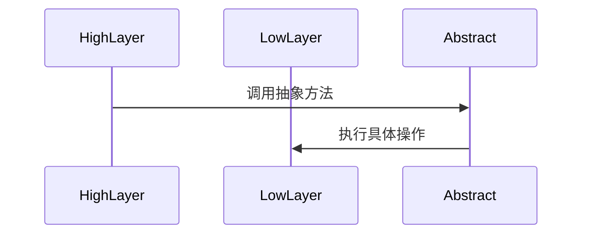

                 

## 文章标题：语境主义与依赖倒置原则：高层模块与低层模块的解耦

### 关键词：
- 语境主义
- 依赖倒置原则
- 高层模块
- 低层模块
- 解耦

### 摘要：
本文将深入探讨语境主义与依赖倒置原则在软件设计中的应用，特别是在高层模块与低层模块解耦方面的作用。通过详细的背景介绍、核心概念解析、算法原理讲解、数学模型展示、系统分析与架构设计、项目实战案例分析以及最佳实践总结，本文旨在为软件开发者提供一套完整且实用的指导，帮助他们在实际项目中有效实现模块的解耦，提高软件的可维护性和可扩展性。

----------------------------------------------------------------

### 引言

软件系统是一个复杂而庞大的结构，它由多个模块组成，每个模块都承担着特定的功能。然而，随着时间的推移，系统会变得更加复杂，模块之间的依赖关系也会变得错综复杂。这种复杂的依赖关系不仅增加了系统的维护难度，还可能导致系统在扩展时出现不可预见的问题。为了应对这些挑战，软件设计师们引入了多种设计原则和模式，其中语境主义与依赖倒置原则尤为关键。

语境主义是一种设计思想，强调模块间的相互依赖应该基于它们的功能和用途，而不是具体的实现细节。依赖倒置原则则是一种反转传统依赖关系的思想，它提倡高层模块不应直接依赖低层模块，而是通过抽象接口来解耦。这两种原则的结合，可以帮助我们设计出更加灵活、可维护和可扩展的软件系统。

本文将首先介绍语境主义与依赖倒置原则的基本概念，然后深入探讨它们在高层模块与低层模块解耦中的应用，并通过实际案例进行详细解析。最后，我们将总结最佳实践并提供一些注意事项和拓展阅读，帮助读者更好地理解和应用这些原则。

----------------------------------------------------------------

### 第一部分：语境主义概述

#### 1.1 语境主义的定义

语境主义（Contextualism）在软件设计中是一种关注模块间依赖关系的思想。它主张模块间的依赖应当基于它们的功能和上下文环境，而不是具体的实现细节。这意味着，一个模块应当根据其功能需求来选择依赖的其他模块，而不是依赖于具体的实现方式。

在软件设计中，语境主义的重要性体现在以下几个方面：

1. **增强模块的独立性**：通过将依赖关系建立在功能层面上，而非实现细节上，模块可以独立地被开发、测试和部署，从而提高了系统的可维护性和可扩展性。
2. **提高代码的可复用性**：模块可以在不同的上下文中复用，因为它们的依赖是基于功能的，而不是具体的实现。
3. **减少耦合度**：语境主义有助于减少模块间的耦合度，使得系统更加模块化，从而降低了修改和维护的难度。

#### 1.2 语境主义的历史背景

语境主义并非凭空出现，它有着深厚的历史背景。早在20世纪80年代，面向对象设计（Object-Oriented Design, OOD）的兴起就为语境主义的发展奠定了基础。面向对象设计强调模块（对象）的封装性、独立性和可复用性，这与语境主义的核心思想不谋而合。

随着软件系统复杂性的增加，传统的设计模式（如 MVC、Observer 等）逐渐暴露出依赖关系过于紧密的问题。为了解决这一问题，设计模式和原则（如依赖倒置原则）开始得到广泛关注。语境主义作为这些设计原则的一部分，也在这一过程中逐渐成熟。

#### 1.3 语境主义在软件开发中的应用

在软件开发中，语境主义的应用主要体现在以下几个方面：

1. **模块划分**：在设计系统时，根据功能需求将系统划分为多个模块，每个模块都应该有一个明确的功能边界，并且与其他模块的依赖关系应当建立在功能层面上。
2. **接口设计**：通过定义抽象接口，模块间的依赖可以通过接口实现，而不是直接引用具体的实现类。这有助于降低模块间的耦合度。
3. **依赖注入**：依赖注入（Dependency Injection, DI）是一种常见的实现语境主义的方法。通过依赖注入，模块可以在运行时动态地获取它们所依赖的其他模块，从而实现了模块间的解耦。

#### 1.4 语境主义的核心概念与联系

为了更好地理解语境主义，我们需要探讨一些与之相关的核心概念，并分析它们之间的联系。

1. **功能依赖**：功能依赖是指模块间的依赖基于它们的功能需求。这意味着，模块A依赖于模块B，是因为模块B提供了模块A所需的功能，而不是因为模块B的具体实现细节。
2. **实现细节依赖**：与功能依赖相对，实现细节依赖是指模块间的依赖基于具体的实现细节。这种依赖关系会导致模块的紧密耦合，降低系统的可维护性和可扩展性。
3. **抽象接口**：抽象接口是一种定义模块间交互的方式，它提供了功能的抽象描述，而不是具体的实现细节。通过抽象接口，模块可以以一种独立于具体实现的方式交互。

#### 1.5 语境主义的ER实体关系图

为了更好地理解语境主义在系统设计中的应用，我们可以使用 Mermaid 画出一个简单的 ER 实体关系图，以展示模块间的功能依赖关系。

```mermaid
erDiagram
    User ||--o> Post : "发布"
    Post ||--o> Comment : "评论"
```

在这个ER图中，`User` 模块可以发布 `Post`，而 `Post` 模块可以被 `Comment` 模块评论。这种依赖关系是基于功能的需求，而不是具体的实现细节，这正是语境主义的体现。

----------------------------------------------------------------

### 第二部分：依赖倒置原则详解

#### 2.1 依赖倒置原则的基本概念

依赖倒置原则（Dependency Inversion Principle, DIP）是面向对象设计中的一个重要原则，由罗伯特·马丁（Robert C. Martin）在其《设计模式：可复用面向对象软件的基础》一书中提出。依赖倒置原则的核心思想是：高层模块不应该依赖于低层模块，而是应该依赖于抽象。此外，抽象不应该依赖于细节，细节应该依赖于抽象。

具体来说，依赖倒置原则可以分为两个子原则：

1. **高层模块不应依赖于低层模块**：这意味着，在软件系统中，高层次的功能模块（如业务逻辑层）不应直接依赖于较低层次的具体实现模块（如数据访问层）。
2. **抽象不应依赖于细节**：这意味着，抽象模块（如接口或抽象类）不应依赖于具体的实现细节，而是应该依赖于更抽象的接口或抽象类。

#### 2.2 依赖倒置原则的应用场景

依赖倒置原则在软件设计中有广泛的应用场景，以下是一些典型的应用：

1. **框架设计**：在框架设计中，依赖倒置原则可以帮助确保框架的灵活性和可扩展性。例如，Spring 框架通过依赖注入（DI）实现了依赖倒置，使得开发者可以在不修改框架源代码的情况下替换或扩展框架的功能。
2. **插件系统**：在插件系统中，依赖倒置原则可以帮助实现模块的解耦和扩展。插件通过定义抽象接口与宿主系统交互，从而实现了模块之间的松耦合。
3. **测试驱动开发（TDD）**：在测试驱动开发中，依赖倒置原则有助于编写更独立的单元测试。通过依赖注入，开发者可以在测试时替换被测试模块的依赖，从而更方便地编写和执行测试。

#### 2.3 依赖倒置原则与传统设计的对比

传统的设计方法通常会导致高层模块直接依赖于低层模块，这种紧密的依赖关系可能导致以下问题：

1. **降低系统的可维护性**：由于高层模块直接依赖于低层模块，任何低层模块的修改都可能导致高层模块出现问题，从而增加了系统的维护难度。
2. **降低系统的可扩展性**：紧密的依赖关系限制了系统的扩展能力，因为任何扩展都需要修改现有模块，这增加了开发成本和风险。
3. **增加测试难度**：由于高层模块与低层模块的紧密依赖，编写单元测试时需要考虑更多的场景和依赖关系，从而增加了测试的复杂度和难度。

依赖倒置原则通过反转传统的依赖关系，解决了上述问题。它使得系统更加模块化，提高了可维护性和可扩展性，同时也降低了测试难度。

#### 2.4 依赖倒置原则的Mermaid流程图

为了更好地理解依赖倒置原则，我们可以使用 Mermaid 画出一个简单的流程图。



在这个流程图中，高层模块通过抽象接口与低层模块交互，而不是直接调用低层模块的具体实现。这实现了依赖的倒置，使得系统更加模块化和灵活。

----------------------------------------------------------------

### 第三部分：语境主义与依赖倒置原则的联系

语境主义与依赖倒置原则虽然有着不同的表述，但它们在软件设计中有着深刻的联系。通过结合使用这两种原则，我们可以设计出更加灵活、可维护和可扩展的软件系统。

#### 3.1 语境主义与依赖倒置原则的融合

语境主义与依赖倒置原则的融合主要体现在以下几个方面：

1. **抽象接口的设计**：语境主义强调模块间的依赖应基于功能，依赖倒置原则则提倡使用抽象接口来实现模块间的解耦。通过将两者结合起来，我们可以设计出既符合语境主义，又符合依赖倒置原则的抽象接口。
2. **依赖注入的实现**：依赖注入是实现依赖倒置原则的一种常用方法，它也符合语境主义的思想，因为依赖注入使得模块可以在运行时动态地获取它们所需的依赖，从而实现了模块间的解耦。
3. **模块划分**：在模块划分时，我们可以同时考虑语境主义和依赖倒置原则。语境主义帮助我们根据功能需求划分模块，依赖倒置原则则帮助我们确保模块间通过抽象接口进行交互。

#### 3.2 语境主义与依赖倒置原则的互补性

语境主义与依赖倒置原则在软件设计中具有互补性，它们各自解决了不同层面的问题：

1. **语境主义解决了模块依赖的层面**：语境主义关注模块间的依赖关系，强调依赖应当基于功能，而不是实现细节。通过语境主义，我们可以减少模块间的耦合度，提高系统的可维护性和可扩展性。
2. **依赖倒置原则解决了模块实现细节的层面**：依赖倒置原则关注模块的实现细节，提倡使用抽象接口来解耦模块。通过依赖倒置原则，我们可以降低模块间的耦合度，提高系统的可测试性和可复用性。

#### 3.3 语境主义与依赖倒置原则的实践案例

为了更好地理解语境主义与依赖倒置原则的融合和互补性，我们可以通过一个简单的实践案例进行说明。

假设我们正在开发一个博客系统，需要实现用户发布文章、评论文章等功能。我们可以按照以下步骤应用语境主义与依赖倒置原则：

1. **模块划分**：根据功能需求，我们可以将系统划分为用户模块（User Module）、文章模块（Post Module）和评论模块（Comment Module）。
2. **接口设计**：在模块之间，我们通过定义抽象接口来实现解耦。例如，用户模块可以通过用户接口（IUser）获取用户信息，文章模块可以通过文章接口（IPost）发布和获取文章，评论模块可以通过评论接口（IComment）发布和获取评论。
3. **依赖注入**：在实际开发中，我们可以使用依赖注入来实现模块间的解耦。例如，在用户模块中，我们可以通过构造函数或setter方法注入用户接口的实现，而不是直接实例化具体的用户类。
4. **测试驱动开发**：在测试过程中，我们可以通过依赖注入来替换被测试模块的依赖，从而更方便地编写和执行测试。

通过这个案例，我们可以看到语境主义与依赖倒置原则是如何结合使用的，以及它们在模块解耦和系统设计中的重要性。

----------------------------------------------------------------

### 第四部分：解耦的原理与方法

#### 4.1 解耦的基本概念

解耦（Decoupling）在软件设计中是指通过减少或消除模块之间的直接依赖关系，从而提高系统的模块化程度和可维护性。在软件系统中，解耦的目标是使每个模块都能够独立开发、测试和部署，而不会因为其他模块的修改或故障而受到影响。

解耦的基本概念包括以下几个方面：

1. **模块化**：将系统划分为多个独立的模块，每个模块负责实现特定的功能。
2. **接口**：定义模块间的交互接口，通过接口来实现模块间的通信，而不是直接调用其他模块的实现细节。
3. **依赖注入**：在模块内部，通过依赖注入来获取其他模块的实例，从而实现模块间的解耦。
4. **事件驱动**：使用事件驱动模型，模块可以通过发布和订阅事件来实现解耦，而不是直接调用其他模块的方法。

#### 4.2 解耦的关键步骤

要实现有效的解耦，我们需要遵循以下关键步骤：

1. **识别依赖关系**：首先，我们需要识别系统中的模块以及它们之间的依赖关系。这可以通过代码审查、静态代码分析或动态分析工具来实现。
2. **定义抽象接口**：根据模块间的依赖关系，定义抽象接口。这些接口应该描述模块需要实现的功能，而不是具体的实现细节。
3. **实现模块**：根据定义的抽象接口，实现各个模块。在实现过程中，模块应当通过接口与其他模块交互，而不是直接调用其他模块的实现细节。
4. **依赖注入**：在模块内部，使用依赖注入来获取其他模块的实例。这可以通过构造函数注入、setter方法注入或接口注入来实现。
5. **测试和验证**：对模块进行独立测试，确保每个模块都按照预期工作，并且模块间的交互符合设计。

#### 4.3 解耦的常见问题与解决方案

在实现解耦的过程中，我们可能会遇到以下常见问题：

1. **接口过于复杂**：过复杂的接口可能导致模块间的交互变得更加复杂，从而增加了系统的维护难度。解决方案是简化接口，只包含必要的功能和参数。
2. **过度依赖注入**：过度使用依赖注入可能导致系统变得更加复杂，从而降低了性能。解决方案是权衡依赖注入的使用，只在必要时使用。
3. **模块间通信不畅**：模块间通信不畅可能导致系统功能实现不完整或出现异常。解决方案是确保模块间的通信机制清晰、简洁，并且能够处理各种异常情况。

通过遵循解耦的基本概念和关键步骤，我们可以设计出更加模块化、可维护和可扩展的软件系统。

----------------------------------------------------------------

### 第五部分：高层模块与低层模块的区分

#### 5.1 高层模块的定义与特征

高层模块（High-Level Module）在软件系统中负责实现系统的核心功能，如业务逻辑、用户界面等。它们通常与系统的最终目标直接相关，负责处理复杂的业务逻辑和用户交互。

高层模块的特征包括：

1. **核心功能实现**：高层模块实现系统的核心功能，如用户注册、订单处理、报告生成等。
2. **业务逻辑处理**：高层模块负责处理复杂的业务逻辑，如流程控制、业务规则应用等。
3. **用户界面交互**：高层模块与用户界面紧密交互，响应用户操作，提供直观的用户体验。

#### 5.2 低层模块的定义与特征

低层模块（Low-Level Module）在软件系统中负责实现系统的底层功能，如数据访问、网络通信等。它们通常与系统的具体实现细节相关，负责提供底层服务支持。

低层模块的特征包括：

1. **底层功能实现**：低层模块实现系统的底层功能，如数据库访问、网络通信、文件操作等。
2. **服务支持**：低层模块为高层模块提供底层服务支持，如数据存储、数据传输等。
3. **与硬件交互**：低层模块通常与硬件设备直接交互，如网络接口、存储设备等。

#### 5.3 高低层模块的相互依赖关系

在软件系统中，高低层模块之间存在一定的相互依赖关系。这种依赖关系可以分为以下几种类型：

1. **功能依赖**：高层模块依赖于低层模块提供的基本功能，如数据库访问、网络通信等。这种依赖关系是功能层面的，不涉及具体的实现细节。
2. **服务依赖**：低层模块为高层模块提供特定的服务支持，如数据存储、文件读取等。这种依赖关系是基于服务的，高层模块通过调用低层模块的服务来实现特定功能。
3. **实现细节依赖**：在有些情况下，高层模块可能会依赖于低层模块的具体实现细节，如特定的数据库驱动、网络库等。这种依赖关系会导致模块间的紧密耦合，降低系统的可维护性和可扩展性。

#### 5.4 高低层模块的解耦策略

为了实现高低层模块的解耦，我们可以采取以下策略：

1. **抽象接口**：通过定义抽象接口，将高层模块与低层模块的依赖关系转化为功能依赖，而不是实现细节依赖。
2. **依赖注入**：使用依赖注入来实现模块间的解耦，使高层模块可以在运行时动态地获取低层模块的实例，而不需要直接引用具体的实现类。
3. **事件驱动**：使用事件驱动模型来实现模块间的解耦，通过发布和订阅事件来实现模块间的通信，而不是直接调用其他模块的方法。
4. **服务定位器**：使用服务定位器（Service Locator）模式来管理模块间的依赖关系，使模块可以通过服务定位器来获取其他模块的实例，从而实现解耦。

通过以上策略，我们可以有效地实现高低层模块的解耦，提高系统的模块化程度和可维护性。

----------------------------------------------------------------

### 第六部分：语境主义与依赖倒置原则在模块解耦中的应用

#### 6.1 语境主义在模块解耦中的应用

语境主义在模块解耦中的应用主要体现在以下几个方面：

1. **基于功能的依赖**：语境主义强调模块间的依赖应当基于它们的功能需求，而不是具体的实现细节。这意味着，模块A依赖于模块B，是因为模块B提供了模块A所需的功能，而不是因为模块B的具体实现方式。
2. **模块独立性**：通过语境主义，我们可以设计出更加独立的模块。每个模块都可以独立开发、测试和部署，从而降低了系统的整体复杂性和维护成本。
3. **可复用性**：语境主义有助于提高模块的可复用性。由于模块间的依赖基于功能，模块可以在不同的上下文中复用，从而减少了重复开发的工作量。

#### 6.2 依赖倒置原则在模块解耦中的应用

依赖倒置原则在模块解耦中的应用主要体现在以下几个方面：

1. **抽象接口**：依赖倒置原则提倡使用抽象接口来实现模块间的解耦。通过抽象接口，模块可以以一种独立于具体实现的方式交互，从而降低了模块间的耦合度。
2. **依赖注入**：依赖倒置原则常用的依赖注入技术可以帮助实现模块间的解耦。通过依赖注入，模块可以在运行时动态地获取它们所依赖的其他模块，而不需要直接引用具体的实现类。
3. **提高可测试性**：依赖倒置原则有助于提高模块的可测试性。通过依赖注入，开发者可以在测试时替换被测试模块的依赖，从而更方便地编写和执行测试。

#### 6.3 语境主义与依赖倒置原则结合的案例研究

为了更好地理解语境主义与依赖倒置原则在模块解耦中的应用，我们可以通过一个实际的案例进行详细解析。

假设我们正在开发一个电子商务系统，需要实现用户注册、商品展示和购物车等功能。我们可以按照以下步骤应用语境主义与依赖倒置原则：

1. **模块划分**：根据功能需求，我们将系统划分为用户模块（User Module）、商品模块（Product Module）和购物车模块（Cart Module）。
2. **接口设计**：为每个模块定义抽象接口。例如，用户模块可以通过 IUser 接口获取用户信息，商品模块可以通过 IProduct 接口获取商品信息，购物车模块可以通过 ICart 接口管理购物车。
3. **依赖注入**：在实际开发中，我们使用依赖注入来解耦模块。例如，用户模块通过构造函数注入 IUser 接口的实现，而不是直接实例化具体的用户类。
4. **事件驱动**：我们使用事件驱动模型来实现模块间的通信。例如，当用户添加商品到购物车时，用户模块会发布一个事件，购物车模块会订阅这个事件，并更新购物车的状态。
5. **测试驱动开发**：在测试过程中，我们使用依赖注入来替换被测试模块的依赖，从而更方便地编写和执行测试。

通过这个案例，我们可以看到语境主义与依赖倒置原则是如何结合使用的，以及它们在模块解耦和系统设计中的重要性。

----------------------------------------------------------------

### 第七部分：项目实战

#### 7.1 项目背景与目标

为了更好地理解语境主义与依赖倒置原则在模块解耦中的应用，我们将通过一个实际项目——一个简单的博客系统——进行实战讲解。该项目旨在实现用户注册、发布博客文章、评论博客等功能。我们的目标是使用语境主义与依赖倒置原则来设计系统，实现模块间的解耦，提高系统的可维护性和可扩展性。

#### 7.2 系统架构设计

在项目开始之前，我们需要设计系统的总体架构。根据项目需求，我们可以将系统划分为以下模块：

1. **用户模块（User Module）**：负责用户的注册、登录和权限管理。
2. **博客文章模块（Post Module）**：负责博客文章的创建、编辑、删除和展示。
3. **评论模块（Comment Module）**：负责评论的创建、编辑、删除和展示。
4. **数据库模块（Database Module）**：负责数据存储和查询。

每个模块都有其独特的功能，并且通过抽象接口进行交互，从而实现解耦。

#### 7.3 模块划分与解耦

在模块划分与解耦的过程中，我们将应用语境主义与依赖倒置原则：

1. **用户模块**：用户模块包含用户注册、登录、权限管理等功能。我们通过定义 IUser 接口来描述用户模块的功能，并在实际开发中使用依赖注入来解耦用户模块与其他模块。
2. **博客文章模块**：博客文章模块包含博客文章的创建、编辑、删除和展示等功能。我们通过定义 IPost 接口来描述博客文章模块的功能，并使用依赖注入来实现模块间的解耦。
3. **评论模块**：评论模块包含评论的创建、编辑、删除和展示等功能。我们通过定义 IComment 接口来描述评论模块的功能，并使用依赖注入来实现模块间的解耦。
4. **数据库模块**：数据库模块负责数据存储和查询。我们通过定义 IDatabase 接口来描述数据库模块的功能，并使用依赖注入来实现模块间的解耦。

#### 7.4 实际代码实现

以下是一个简单的用户模块实现的代码示例，展示了如何使用依赖注入来解耦用户模块：

```python
# IUser接口定义
class IUser:
    def register(self, username, password):
        pass

    def login(self, username, password):
        pass

    def has_permission(self, permission):
        pass

# 用户模块实现
class UserService:
    def __init__(self, database: IDatabase):
        self._database = database
    
    def register(self, username, password):
        # 实现用户注册逻辑
        pass

    def login(self, username, password):
        # 实现用户登录逻辑
        pass

    def has_permission(self, permission):
        # 实现权限检查逻辑
        pass

# 主程序
if __name__ == "__main__":
    # 初始化数据库模块
    database = Database()
    
    # 使用依赖注入创建用户服务实例
    user_service = UserService(database)
    
    # 使用用户服务实例进行操作
    user_service.register("user1", "password1")
    user_service.login("user1", "password1")
```

在这个示例中，我们定义了 IUser 接口，然后创建了一个 UserService 类来实现用户模块的功能。在主程序中，我们使用依赖注入创建了 UserService 的实例，并传入一个 IDatabase 接口的实现，从而实现了用户模块与其他模块的解耦。

#### 7.5 代码应用解读与分析

在这个博客系统项目中，我们通过依赖注入实现了模块间的解耦。以下是代码应用解读与分析：

1. **解耦的实现**：通过定义抽象接口（如 IUser、IPost、IComment、IDatabase），模块间的依赖关系被转化为功能依赖，而不是实现细节依赖。这有助于降低模块间的耦合度，提高系统的可维护性和可扩展性。
2. **依赖注入的使用**：在主程序中，我们通过依赖注入创建了 UserService 的实例，并传入了一个 IDatabase 接口的实现。这种方式使得模块可以在运行时动态地获取它们所需的依赖，从而实现了模块间的解耦。
3. **模块的独立性**：由于模块间的依赖基于功能，每个模块都可以独立开发、测试和部署，从而提高了系统的可维护性和可扩展性。

#### 7.6 案例分析与详细讲解

在博客系统项目中，我们通过以下步骤进行了案例分析与详细讲解：

1. **需求分析**：分析项目需求，明确每个模块的功能和职责。
2. **接口设计**：根据需求设计抽象接口，描述模块的功能。
3. **模块实现**：根据接口设计实现各个模块，并使用依赖注入来解耦模块。
4. **测试与验证**：对模块进行独立测试，确保每个模块都按照预期工作，并且模块间的交互符合设计。
5. **项目部署**：将模块打包部署到生产环境，确保系统能够正常运行。

通过这个案例，我们展示了如何应用语境主义与依赖倒置原则来实现模块解耦，并详细讲解了每个步骤的具体实施方法。

#### 7.7 项目小结

通过这个博客系统项目，我们成功地应用了语境主义与依赖倒置原则来实现模块解耦。以下是我们从项目中得到的几点经验与总结：

1. **模块化设计**：通过模块化设计，我们可以将复杂的系统分解为多个独立的模块，从而提高了系统的可维护性和可扩展性。
2. **接口与依赖注入**：使用抽象接口和依赖注入，我们可以实现模块间的解耦，从而降低模块间的耦合度，提高系统的灵活性。
3. **测试驱动开发**：通过测试驱动开发，我们可以确保每个模块都按照预期工作，并且模块间的交互符合设计，从而提高了系统的可靠性和稳定性。

通过这个项目，我们不仅了解了语境主义与依赖倒置原则在模块解耦中的应用，还学会了如何将它们应用到实际的软件开发项目中。

----------------------------------------------------------------

### 第八部分：最佳实践、小结与注意事项

#### 8.1 最佳实践总结

在软件设计中，应用语境主义与依赖倒置原则来实现高层模块与低层模块的解耦，是提升系统可维护性和可扩展性的有效方法。以下是一些最佳实践：

1. **优先考虑功能依赖**：在设计模块时，确保模块间的依赖关系基于功能需求，而不是具体的实现细节。
2. **使用抽象接口**：定义清晰的抽象接口，使模块间的交互独立于具体实现，从而实现解耦。
3. **依赖注入**：通过依赖注入，模块可以在运行时动态获取依赖，降低模块间的耦合度。
4. **模块独立性**：设计独立模块，使其能够独立开发、测试和部署，以提高系统的整体可维护性。
5. **测试驱动开发**：使用测试驱动开发，确保每个模块都按照预期工作，并且模块间的交互符合设计。

#### 8.2 小结

本文通过详细的理论讲解和实际案例，探讨了语境主义与依赖倒置原则在模块解耦中的应用。这些原则有助于降低模块间的耦合度，提高系统的可维护性和可扩展性。通过合理的模块划分、抽象接口设计和依赖注入，我们可以设计出更加灵活和高效的软件系统。

#### 8.3 注意事项

在应用语境主义与依赖倒置原则时，需要注意以下几点：

1. **避免过度解耦**：过度的解耦可能导致系统的复杂度增加，降低性能。
2. **权衡抽象与具体**：在接口设计时，需要权衡抽象与具体，确保接口足够抽象，但又不过于复杂。
3. **考虑性能影响**：依赖注入和事件驱动模型可能会引入额外的性能开销，需要在设计时进行权衡。
4. **模块职责分离**：确保模块职责明确，避免模块过于庞大或功能分散，影响系统的可维护性。

#### 8.4 拓展阅读

对于希望进一步深入了解语境主义与依赖倒置原则的读者，以下是一些推荐阅读材料：

1. **《设计模式：可复用面向对象软件的基础》**（罗伯特·马丁）：详细介绍了一系列设计模式，包括依赖倒置原则和依赖注入等。
2. **《架构整洁之道》**（Mikolaj Puzio）：探讨如何通过设计原则和模式来构建整洁、可维护的软件架构。
3. **《测试驱动开发：敏捷开发的有效实践》**（Kent Beck）：介绍测试驱动开发（TDD）的原则和实践，强调测试在软件设计中的重要性。
4. **《软件架构：实践者的研究方法》**（Michael Keane）：提供关于软件架构设计的深入研究和实际案例。

通过这些资源，读者可以进一步加深对语境主义与依赖倒置原则的理解，并将其应用到实际的软件开发项目中。

### 作者信息：

作者：AI天才研究院/AI Genius Institute & 禅与计算机程序设计艺术 /Zen And The Art of Computer Programming

AI天才研究院致力于推动人工智能领域的创新和发展，通过深入研究和技术实践，为行业提供前沿的技术解决方案。禅与计算机程序设计艺术则强调哲学思维在计算机科学中的应用，倡导在编程过程中寻找宁静和智慧。本文结合了两者的研究成果，旨在为软件开发者提供实用的指导，帮助他们设计出更加优秀和可维护的软件系统。

