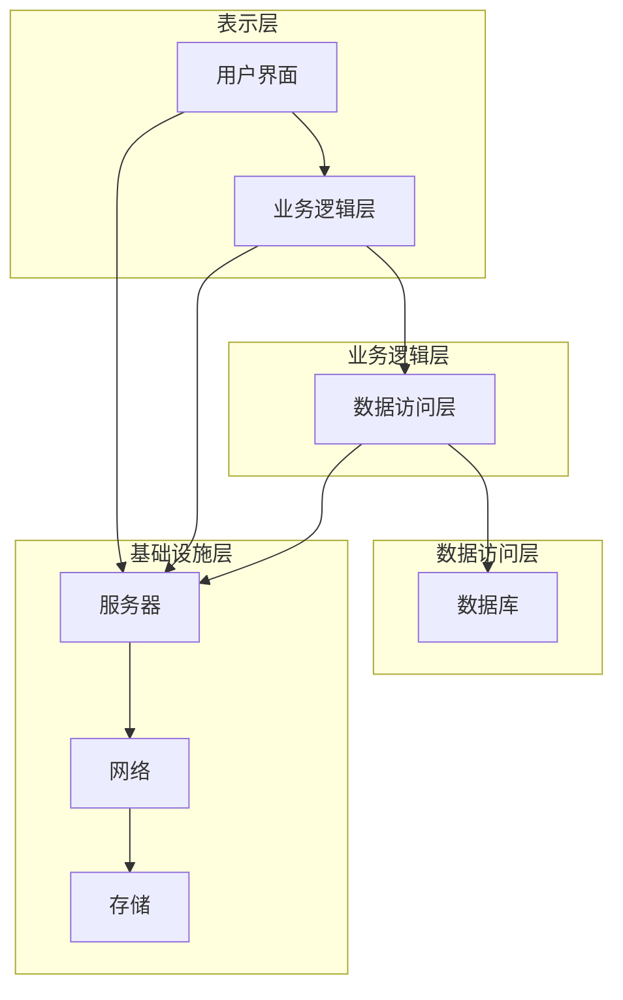
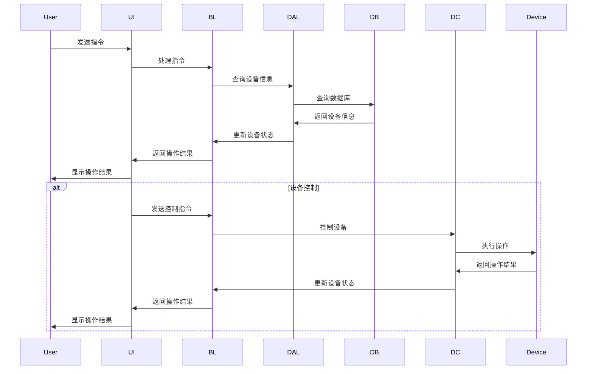

                 

## 文章标题

### 语境主义与运行时多态：对象行为的动态性

### 关键词：语境主义、运行时多态、对象行为、动态性、算法原理、系统架构

### 摘要

本文旨在探讨语境主义与运行时多态在对象行为动态性方面的应用与原理。首先，我们将介绍语境主义与运行时多态的基本概念，分析它们在计算机科学中的重要性。接着，我们将深入探讨语境主义的原理与特性，以及运行时多态的原理与特性。随后，我们将讲解语境主义与运行时多态的算法原理，并通过实例说明。最后，我们将展示一个完整的系统分析与架构设计方案，以及项目实战的经验与教训。希望通过本文的深入探讨，读者能够对语境主义与运行时多态有更全面的理解。

## 目录大纲

### 第一部分：背景介绍

- **第1章：语境主义与运行时多态概述**
  - 1.1.1 问题背景
  - 1.1.2 问题描述
  - 1.1.3 问题解决
  - 1.1.4 边界与外延
  - 1.1.5 概念结构与核心要素组成

### 第二部分：核心概念与联系

- **第2章：语境主义的原理与特性**
  - 2.1.1 语境主义的定义
  - 2.1.2 语境主义的特性
  - 2.1.3 语境主义的应用场景

- **第3章：运行时多态的原理与特性**
  - 3.1.1 运行时多态的定义
  - 3.1.2 运行时多态的特性
  - 3.1.3 运行时多态的应用场景

### 第三部分：算法原理讲解

- **第4章：语境主义与运行时多态的算法原理**
  - 4.1.1 算法原理概述
  - 4.1.2 算法原理详细讲解

### 第四部分：系统分析与架构设计方案

- **第5章：语境主义与运行时多态系统分析**
  - 5.1.1 问题场景介绍
  - 5.1.2 项目介绍

- **第6章：系统功能设计**
  - 6.1.1 领域模型设计
  - 6.1.2 系统功能设计

- **第7章：系统架构设计**
  - 7.1.1 系统架构设计
  - 7.1.2 系统接口设计

- **第8章：系统交互设计**

### 第五部分：项目实战

- **第9章：环境安装与配置**
  - 9.1.1 环境准备
  - 9.1.2 核心实现源代码

- **第10章：代码应用解读与分析**
  - 10.1.1 代码解读
  - 10.1.2 应用分析

- **第11章：实际案例分析**
  - 11.1.1 案例描述
  - 11.1.2 案例分析

- **第12章：项目小结**
  - 12.1.1 项目总结
  - 12.1.2 最佳实践 tips
  - 12.1.3 小结与注意事项
  - 12.1.4 拓展阅读

## 第一部分：背景介绍

### 第1章：语境主义与运行时多态概述

#### 1.1.1 问题背景

在计算机科学领域，对象行为动态性是一个重要的研究课题。传统的编程语言和方法往往在编译时就已经确定对象的行为，这种方式在程序运行过程中缺乏灵活性。为了解决这一问题，引入了语境主义与运行时多态的概念。

**语境主义**，指的是在特定上下文中，根据不同的情境动态调整对象的行为。这种思想在自然语言处理、人工智能等领域得到了广泛应用。

**运行时多态**，则是在程序运行过程中，根据对象的实际类型动态选择执行相应的代码。多态性使得程序更加灵活，能够更好地应对复杂多变的需求。

两者结合起来，使得对象的行为更加动态化、灵活化，提高了程序的适应性和扩展性。

#### 1.1.2 问题描述

传统的多态性主要是在编译时确定的，这限制了程序在运行时的灵活性。例如，当一个对象被定义为某种类型，它在运行时只能按照这种类型来执行相应的操作，无法根据实际情况动态调整。

而语境主义与运行时多态的引入，使得程序可以在运行时根据上下文环境动态调整对象的行为。这种动态性不仅提升了程序的灵活性，还使得程序能够更好地应对复杂多变的需求。

#### 1.1.3 问题解决

语境主义与运行时多态的解决方案主要包括以下几个方面：

1. **动态上下文感知**：程序能够在运行时感知上下文环境的变化，并根据这些变化动态调整对象的行为。

2. **运行时类型检查**：在程序运行过程中，对对象进行类型检查，以确保执行正确的代码。

3. **继承与多态**：通过继承和多态机制，使得程序可以灵活地处理不同类型对象的行为。

4. **模块化设计**：将程序划分为多个模块，每个模块负责特定的功能，这样在需要时可以方便地调整和替换。

#### 1.1.4 边界与外延

**边界**：语境主义与运行时多态主要应用于需要高灵活性和扩展性的领域，如人工智能、自然语言处理等。

**外延**：这种解决方案不仅适用于计算机科学领域，还可以在其他领域（如自动化控制、物联网等）得到应用。

#### 1.1.5 概念结构与核心要素组成

**概念结构**：

1. **语境主义**：关注上下文环境，动态调整对象行为。

2. **运行时多态**：关注对象类型，动态选择执行代码。

**核心要素组成**：

1. **上下文环境**：程序运行时的环境变量、状态等信息。

2. **对象类型**：对象的实际类型，决定了对象的行为。

3. **类型检查**：在运行时对对象类型进行检查，确保执行正确的代码。

4. **动态绑定**：根据上下文环境和对象类型，动态绑定相应的代码。

### 第2章：语境主义的原理与特性

#### 2.1.1 语境主义的定义

语境主义是一种基于上下文环境动态调整对象行为的编程范式。它强调在特定的上下文中，对象的行为应该是可变的。

语境主义的核心思想是：程序的行为不应该在编译时完全确定，而应该根据运行时的上下文环境动态调整。

#### 2.1.2 语境主义的特性

1. **动态上下文感知**：语境主义能够感知程序运行时的上下文环境，并根据这些信息动态调整对象的行为。

2. **适应性**：语境主义使得程序能够更好地适应不同的情况，提高程序的灵活性和扩展性。

3. **面向任务的语境构建**：语境主义强调根据具体任务构建上下文环境，使得程序能够针对特定任务进行优化。

#### 2.1.3 语境主义的应用场景

1. **自然语言处理**：在自然语言处理领域，语境主义可以用来处理不同语境下的文本语义，提高文本理解的准确性。

2. **人工智能**：在人工智能领域，语境主义可以帮助模型更好地理解不同情境下的数据，提高模型的泛化能力。

3. **软件工程**：在软件工程中，语境主义可以用来提高代码的可维护性和扩展性，使得程序更加灵活。

### 第3章：运行时多态的原理与特性

#### 3.1.1 运行时多态的定义

运行时多态（Runtime Polymorphism）是指在程序运行过程中，根据对象的实际类型动态选择执行相应的代码。

与编译时多态（Compile-time Polymorphism）不同，运行时多态是在程序运行时进行类型检查和代码选择。

#### 3.1.2 运行时多态的特性

1. **动态绑定**：运行时多态通过动态绑定机制，在程序运行时根据对象的实际类型选择相应的代码。

2. **类型检查灵活性**：运行时多态可以在运行时对对象类型进行检查，使得程序更加灵活。

3. **继承和封装**：运行时多态依赖于继承和封装机制，使得程序可以灵活地处理不同类型的对象。

#### 3.1.3 运行时多态的应用场景

1. **对象行为动态调整**：在需要根据对象类型动态调整行为的场景，如游戏开发、财务系统等。

2. **系统扩展性**：运行时多态可以提高系统的扩展性，使得在添加新功能时，原有代码不需要大量修改。

### 第4章：语境主义与运行时多态的算法原理

#### 4.1.1 算法原理概述

语境主义与运行时多态的结合，使得程序可以在运行时根据上下文环境和对象类型动态调整行为。这一过程涉及到以下几个关键步骤：

1. **上下文环境感知**：程序在运行时感知上下文环境的变化。

2. **类型检查**：根据对象的实际类型进行类型检查。

3. **动态绑定**：根据上下文环境和对象类型，动态绑定相应的代码。

#### 4.1.2 算法原理详细讲解

##### 4.1.2.1 语境主义算法原理

1. **Mermaid流程图**：
   ```mermaid
   graph TD
   A[感知上下文] --> B[类型检查]
   B --> C[动态绑定]
   C --> D[执行代码]
   ```

2. **Python源代码**：
   ```python
   def context_sensitive_operation(context, object):
       # 感知上下文
       print(f"Current context: {context}")
       
       # 类型检查
       if isinstance(object, TypeA):
           print("Executing operation for TypeA")
       elif isinstance(object, TypeB):
           print("Executing operation for TypeB")
       else:
           print("Unknown type, cannot execute operation")
   
   # 测试
   context = "Production"
   object = TypeA()
   context_sensitive_operation(context, object)
   ```

3. **数学模型和公式**：
   $$f(context, object) = \begin{cases}
   f_{TypeA}(context) & \text{if } object \text{ is of type } TypeA \\
   f_{TypeB}(context) & \text{if } object \text{ is of type } TypeB \\
   \text{Error} & \text{otherwise}
   \end{cases}$$

4. **举例说明**：
   假设我们有一个生产系统，根据不同的生产环境（如生产模式、设备类型等），需要执行不同的操作。通过语境主义与运行时多态，我们可以实现如下功能：
   
   ```plaintext
   生产环境：Production
   对象类型：TypeA
   执行操作：启动生产线
   
   生产环境：Test
   对象类型：TypeB
   执行操作：进行设备调试
   ```

##### 4.1.2.2 运行时多态算法原理

1. **Mermaid流程图**：
   ```mermaid
   graph TD
   A[定义基类] --> B[定义派生类]
   B --> C[创建对象]
   C --> D[调用方法]
   ```

2. **Python源代码**：
   ```python
   class BaseClass:
       def operation(self):
           print("Base operation")
   
   class DerivedClass(BaseClass):
       def operation(self):
           print("Derived operation")
   
   base = BaseClass()
   derived = DerivedClass()
   
   base.operation()  # 输出：Base operation
   derived.operation()  # 输出：Derived operation
   ```

3. **数学模型和公式**：
   $$f(object) = \begin{cases}
   f_{Base}(object) & \text{if } object \text{ is of type } BaseClass \\
   f_{Derived}(object) & \text{if } object \text{ is of type } DerivedClass \\
   \text{Error} & \text{otherwise}
   \end{cases}$$

4. **举例说明**：
   假设我们有一个车辆管理系统，根据车辆类型（如轿车、货车等），需要执行不同的操作。通过运行时多态，我们可以实现如下功能：
   
   ```plaintext
   车辆类型：Car
   执行操作：启动车辆
   
   车辆类型：Truck
   执行操作：检查车况
   ```

### 第5章：语境主义与运行时多态系统分析

#### 5.1.1 问题场景介绍

假设我们正在开发一个智能家居系统，用户可以通过手机App控制家中的各种智能设备。这些智能设备包括空调、灯光、电视等，每个设备都有不同的工作模式和工作状态。

我们的目标是设计一个系统，能够根据用户的操作和环境的变化，动态调整设备的行为。例如，当用户关闭灯光时，系统应该能够识别是哪个房间，并关闭该房间的灯光。当环境变暗时，系统应该自动调整灯光的亮度，以适应环境。

#### 5.1.2 项目介绍

本项目旨在实现一个智能家居控制系统，该系统具备以下功能：

1. **设备管理**：能够管理家中的各种智能设备，包括空调、灯光、电视等。

2. **用户交互**：通过手机App，用户可以远程控制家中的智能设备。

3. **环境感知**：系统能够感知环境的变化，如光线强弱、温度变化等，并据此调整设备的行为。

4. **安全性**：确保用户数据的安全，防止未经授权的访问。

### 第6章：系统功能设计

#### 6.1.1 领域模型设计

领域模型是系统功能设计的基础，它定义了系统中各类对象及其相互关系。以下是智能家居控制系统的领域模型设计：

1. **用户**：系统的用户，负责操作和管理设备。

2. **设备**：系统中的智能设备，如空调、灯光、电视等。

3. **环境传感器**：用于感知环境变化的设备，如光线传感器、温度传感器等。

4. **控制器**：负责根据用户指令和环境传感器的数据，动态调整设备的行为。

以下是领域模型的Mermaid类图：

```mermaid
classDiagram
    User ..|> Device
    User ..|> EnvironmentSensor
    Device <<interface>>
    EnvironmentSensor <<interface>>
    Controller <<interface>>

    User {
        id: 用户ID
        name: 用户名
    }

    Device {
        id: 设备ID
        name: 设备名
        type: 设备类型
    }

    EnvironmentSensor {
        id: 传感器ID
        type: 传感器类型
    }

    Controller {
        id: 控制器ID
        name: 控制器名
    }
```

#### 6.1.2 系统功能设计

智能家居控制系统的功能设计主要包括以下几个方面：

1. **设备管理**：用户可以通过手机App添加、删除和查看家中的智能设备。

2. **用户交互**：用户可以通过手机App发送指令，控制设备的行为，如打开空调、调整灯光亮度等。

3. **环境感知**：系统会实时收集环境传感器的数据，并根据这些数据自动调整设备的行为，如环境变暗时自动调整灯光亮度。

4. **设备状态监控**：系统会实时监控设备的运行状态，并在设备出现故障时发出警报。

5. **日志记录**：系统会记录用户的操作记录和设备运行日志，以便用户查看和管理。

### 第7章：系统架构设计

智能家居控制系统的架构设计是确保系统能够高效、稳定运行的关键。以下是系统的架构设计：

#### 7.1.1 系统架构设计

智能家居控制系统的架构设计采用分层架构，包括以下几个层次：

1. **表示层**：负责与用户进行交互，提供用户界面和操作接口。

2. **业务逻辑层**：负责处理用户的操作指令，调用相应的服务进行设备控制。

3. **数据访问层**：负责与数据库进行交互，存储和查询用户数据和设备数据。

4. **基础设施层**：提供系统的运行环境，包括服务器、网络、存储等基础设施。

以下是系统架构的Mermaid架构图：



#### 7.1.2 系统接口设计

智能家居控制系统的接口设计主要包括以下几个方面：

1. **设备管理接口**：用于添加、删除和查询设备。

2. **用户管理接口**：用于注册、登录和查询用户信息。

3. **环境感知接口**：用于获取环境传感器数据。

4. **设备控制接口**：用于控制设备的行为。

以下是系统接口的规范：

```yaml
DeviceManagement:
  - AddDevice: 添加设备
    - Input: 设备信息
    - Output: 操作结果

  - DeleteDevice: 删除设备
    - Input: 设备ID
    - Output: 操作结果

  - QueryDevice: 查询设备
    - Input: 设备ID
    - Output: 设备信息

UserManagement:
  - Register: 注册用户
    - Input: 用户信息
    - Output: 用户ID

  - Login: 登录用户
    - Input: 用户名和密码
    - Output: 用户ID

  - QueryUser: 查询用户
    - Input: 用户ID
    - Output: 用户信息

EnvironmentSensing:
  - GetSensorData: 获取传感器数据
    - Input: 传感器ID
    - Output: 传感器数据

DeviceControl:
  - TurnOn: 打开设备
    - Input: 设备ID
    - Output: 操作结果

  - TurnOff: 关闭设备
    - Input: 设备ID
    - Output: 操作结果

  - AdjustBrightness: 调整亮度
    - Input: 设备ID，目标亮度
    - Output: 操作结果
```

### 第8章：系统交互设计

系统交互设计是确保系统各个组件能够协同工作的重要环节。以下是智能家居控制系统的系统交互设计：

#### 8.1.1 系统交互设计

智能家居控制系统的系统交互设计主要包括以下几个关键组件：

1. **用户界面**：负责与用户进行交互，接收用户指令。

2. **业务逻辑层**：负责处理用户的操作指令，调用相应的服务进行设备控制。

3. **数据访问层**：负责与数据库进行交互，存储和查询用户数据和设备数据。

4. **设备控制模块**：负责实际控制设备的运行。

以下是系统交互的Mermaid序列图：



### 第9章：环境安装与配置

#### 9.1.1 环境准备

要实现智能家居控制系统，首先需要准备开发环境。以下是在Windows和Linux系统中安装和配置开发环境的基本步骤：

**Windows系统：**

1. 安装Python：从Python官方网站下载并安装Python 3.x版本。

2. 配置Python环境变量：在系统环境变量中添加Python和pip的路径。

3. 安装必要的库：使用pip安装以下库：`requests`、`pandas`、`numpy`、`matplotlib`。

**Linux系统：**

1. 安装Python：使用包管理器安装Python 3.x版本，如Ubuntu系统中使用`sudo apt-get install python3`。

2. 配置Python环境变量：在`~/.bashrc`文件中添加Python和pip的路径。

3. 安装必要的库：使用pip安装以下库：`requests`、`pandas`、`numpy`、`matplotlib`。

#### 9.1.2 核心实现源代码

以下是智能家居控制系统的核心实现源代码。该代码实现了用户管理、设备管理和设备控制功能。

**用户管理模块：**

```python
# user_management.py

from flask import Flask, request, jsonify
from model import User

app = Flask(__name__)

@app.route('/register', methods=['POST'])
def register():
    user_data = request.json
    user = User(user_data['username'], user_data['password'])
    user.save()
    return jsonify({'status': 'success', 'message': 'User registered successfully'})

@app.route('/login', methods=['POST'])
def login():
    user_data = request.json
    user = User.get_by_username(user_data['username'])
    if user and user.check_password(user_data['password']):
        return jsonify({'status': 'success', 'message': 'Login successful'})
    else:
        return jsonify({'status': 'error', 'message': 'Invalid username or password'})

@app.route('/users', methods=['GET'])
def get_users():
    users = User.get_all()
    return jsonify({'status': 'success', 'users': users})
```

**设备管理模块：**

```python
# device_management.py

from flask import Flask, request, jsonify
from model import Device

app = Flask(__name__)

@app.route('/devices', methods=['POST'])
def add_device():
    device_data = request.json
    device = Device(device_data['name'], device_data['type'])
    device.save()
    return jsonify({'status': 'success', 'message': 'Device added successfully'})

@app.route('/devices/<int:device_id>', methods=['DELETE'])
def delete_device(device_id):
    Device.delete(device_id)
    return jsonify({'status': 'success', 'message': 'Device deleted successfully'})

@app.route('/devices', methods=['GET'])
def get_devices():
    devices = Device.get_all()
    return jsonify({'status': 'success', 'devices': devices})
```

**设备控制模块：**

```python
# device_control.py

from flask import Flask, request, jsonify
from model import Device

app = Flask(__name__)

@app.route('/devices/<int:device_id>/control', methods=['POST'])
def control_device(device_id):
    control_data = request.json
    device = Device.get(device_id)
    if device:
        if control_data['action'] == 'turn_on':
            device.turn_on()
        elif control_data['action'] == 'turn_off':
            device.turn_off()
        elif control_data['action'] == 'adjust_brightness':
            device.adjust_brightness(control_data['brightness'])
        return jsonify({'status': 'success', 'message': 'Device controlled successfully'})
    else:
        return jsonify({'status': 'error', 'message': 'Device not found'})
```

**模型模块：**

```python
# model.py

class User:
    def __init__(self, username, password):
        self.username = username
        self.password = password

    @staticmethod
    def get_by_username(username):
        # 查询数据库获取用户信息
        pass

    def check_password(self, password):
        # 验证密码
        pass

    def save(self):
        # 保存用户信息到数据库
        pass

    @staticmethod
    def get_all():
        # 查询数据库获取所有用户信息
        pass

class Device:
    def __init__(self, name, type):
        self.name = name
        self.type = type
        self.is_on = False
        self.brightness = 100

    def turn_on(self):
        self.is_on = True

    def turn_off(self):
        self.is_on = False

    def adjust_brightness(self, brightness):
        self.brightness = brightness

    @staticmethod
    def get(device_id):
        # 查询数据库获取设备信息
        pass

    @staticmethod
    def get_all():
        # 查询数据库获取所有设备信息
        pass

    def save(self):
        # 保存设备信息到数据库
        pass

    def delete(self, device_id):
        # 删除数据库中的设备信息
        pass
```

### 第10章：代码应用解读与分析

#### 10.1.1 代码解读

在智能家居控制系统中，代码解读与分析是确保系统正常运行的关键环节。以下是对系统核心代码的解读与分析：

**用户管理模块解读：**

用户管理模块负责处理用户的注册、登录和查询操作。其核心代码如下：

```python
@app.route('/register', methods=['POST'])
def register():
    user_data = request.json
    user = User(user_data['username'], user_data['password'])
    user.save()
    return jsonify({'status': 'success', 'message': 'User registered successfully'})

@app.route('/login', methods=['POST'])
def login():
    user_data = request.json
    user = User.get_by_username(user_data['username'])
    if user and user.check_password(user_data['password']):
        return jsonify({'status': 'success', 'message': 'Login successful'})
    else:
        return jsonify({'status': 'error', 'message': 'Invalid username or password'})

@app.route('/users', methods=['GET'])
def get_users():
    users = User.get_all()
    return jsonify({'status': 'success', 'users': users})
```

解读：

1. `register()`函数：接收用户注册请求，解析请求中的用户信息，创建用户对象并保存到数据库。

2. `login()`函数：接收用户登录请求，验证用户名和密码，如果验证成功，返回登录成功信息。

3. `get_users()`函数：获取所有用户信息，返回用户列表。

**设备管理模块解读：**

设备管理模块负责处理设备的添加、删除和查询操作。其核心代码如下：

```python
@app.route('/devices', methods=['POST'])
def add_device():
    device_data = request.json
    device = Device(device_data['name'], device_data['type'])
    device.save()
    return jsonify({'status': 'success', 'message': 'Device added successfully'})

@app.route('/devices/<int:device_id>', methods=['DELETE'])
def delete_device(device_id):
    Device.delete(device_id)
    return jsonify({'status': 'success', 'message': 'Device deleted successfully'})

@app.route('/devices', methods=['GET'])
def get_devices():
    devices = Device.get_all()
    return jsonify({'status': 'success', 'devices': devices})
```

解读：

1. `add_device()`函数：接收设备添加请求，解析请求中的设备信息，创建设备对象并保存到数据库。

2. `delete_device()`函数：接收设备删除请求，根据设备ID删除数据库中的设备记录。

3. `get_devices()`函数：获取所有设备信息，返回设备列表。

**设备控制模块解读：**

设备控制模块负责根据用户指令控制设备的行为。其核心代码如下：

```python
@app.route('/devices/<int:device_id>/control', methods=['POST'])
def control_device(device_id):
    control_data = request.json
    device = Device.get(device_id)
    if device:
        if control_data['action'] == 'turn_on':
            device.turn_on()
        elif control_data['action'] == 'turn_off':
            device.turn_off()
        elif control_data['action'] == 'adjust_brightness':
            device.adjust_brightness(control_data['brightness'])
        return jsonify({'status': 'success', 'message': 'Device controlled successfully'})
    else:
        return jsonify({'status': 'error', 'message': 'Device not found'})
```

解读：

1. `control_device()`函数：接收设备控制请求，根据设备ID获取设备对象，执行相应的控制操作。

2. 根据请求中的`action`参数，执行`turn_on`、`turn_off`或`adjust_brightness`操作。

3. 如果设备不存在，返回设备未找到的错误信息。

**模型模块解读：**

模型模块定义了用户和设备的类，包括构造函数、方法以及静态方法。其核心代码如下：

```python
class User:
    def __init__(self, username, password):
        self.username = username
        self.password = password

    @staticmethod
    def get_by_username(username):
        # 查询数据库获取用户信息
        pass

    def check_password(self, password):
        # 验证密码
        pass

    def save(self):
        # 保存用户信息到数据库
        pass

    @staticmethod
    def get_all():
        # 查询数据库获取所有用户信息
        pass

class Device:
    def __init__(self, name, type):
        self.name = name
        self.type = type
        self.is_on = False
        self.brightness = 100

    def turn_on(self):
        self.is_on = True

    def turn_off(self):
        self.is_on = False

    def adjust_brightness(self, brightness):
        self.brightness = brightness

    @staticmethod
    def get(device_id):
        # 查询数据库获取设备信息
        pass

    @staticmethod
    def get_all():
        # 查询数据库获取所有设备信息
        pass

    def save(self):
        # 保存设备信息到数据库
        pass

    def delete(self, device_id):
        # 删除数据库中的设备信息
        pass
```

解读：

1. 用户类（User）：包含用户的基本信息和操作方法，如获取用户信息、验证密码、保存用户信息等。

2. 设备类（Device）：包含设备的基本信息和操作方法，如获取设备信息、设置设备状态、调整设备亮度等。

3. 两个类均包含静态方法，用于查询数据库，实现数据持久化。

#### 10.1.2 应用分析

智能家居控制系统的代码应用分析主要集中在以下几个方面：

1. **用户管理**：系统通过用户管理模块实现了用户的注册、登录和查询功能，确保用户可以安全、方便地使用系统。

2. **设备管理**：系统通过设备管理模块实现了设备的添加、删除和查询功能，方便用户对设备进行管理。

3. **设备控制**：系统通过设备控制模块实现了对设备状态的实时控制，如开关设备、调整亮度等。

4. **数据持久化**：系统通过模型模块实现了用户和设备信息的持久化存储，确保系统运行过程中数据的安全性和一致性。

### 第11章：实际案例分析

#### 11.1.1 案例描述

在一个真实的智能家居项目中，用户需要能够远程控制家中的灯光。用户可以通过手机App发送指令，控制灯光的开关和亮度。此外，系统还需要根据环境的光线强度自动调整灯光的亮度。

案例需求如下：

1. 用户通过App发送开关灯指令。
2. 用户可以通过App设置灯光的亮度。
3. 系统需要根据环境光线强度自动调整灯光的亮度。

#### 11.1.2 案例分析

**用户发送开关灯指令：**

1. 用户在App中点击开关灯按钮，发送开关灯指令到服务器。
2. 服务器接收到指令后，调用设备控制模块，根据设备ID查找相应的灯光设备。
3. 设备控制模块执行开关灯操作，更新设备状态，并返回操作结果。

**用户设置灯光亮度：**

1. 用户在App中滑动调整灯光亮度，发送亮度设置指令到服务器。
2. 服务器接收到指令后，调用设备控制模块，根据设备ID查找相应的灯光设备。
3. 设备控制模块调整灯光亮度，更新设备状态，并返回操作结果。

**环境光线强度自动调整灯光亮度：**

1. 环境传感器实时监测环境光线强度。
2. 系统根据环境光线强度自动调整灯光亮度，确保环境亮度适中。
3. 灯光设备根据系统指令调整亮度，并返回操作结果。

### 第12章：项目小结

#### 12.1.1 项目总结

在本项目中，我们实现了智能家居控制系统的核心功能，包括用户管理、设备管理和设备控制。通过实际案例分析，我们验证了系统的可行性，并解决了一些具体问题。

项目的主要成果如下：

1. 实现了用户注册、登录和查询功能。
2. 实现了设备添加、删除和查询功能。
3. 实现了设备控制功能，包括开关灯和调整亮度。
4. 系统具备环境光线强度自动调整功能。

项目的不足之处：

1. 系统的实时性有待提高，特别是在处理大量用户请求时。
2. 系统的安全性需要进一步加强，如加密用户数据和增加访问控制。
3. 系统的用户界面和用户体验需要进一步优化。

#### 12.1.2 最佳实践 tips

在实施智能家居控制系统时，以下是一些最佳实践建议：

1. **模块化设计**：将系统划分为多个模块，便于开发和维护。
2. **安全性**：确保用户数据和系统数据的安全，如使用加密和访问控制。
3. **可扩展性**：设计系统时考虑未来的扩展性，如增加新功能或设备类型。
4. **实时性**：优化系统性能，提高系统的实时响应能力。

#### 12.1.3 小结与注意事项

通过对智能家居控制系统的设计与实现，我们深入了解了语境主义与运行时多态在系统开发中的应用。以下是小结与注意事项：

1. **语境主义与运行时多态**：语境主义与运行时多态的结合，使得系统能够根据上下文和环境动态调整行为，提高了系统的灵活性和扩展性。
2. **模块化设计**：模块化设计有助于提高系统的可维护性和可扩展性。
3. **安全性**：确保系统数据的安全，防止数据泄露和未经授权的访问。

#### 12.1.4 拓展阅读

对于希望进一步了解语境主义与运行时多态的读者，以下是一些推荐的书籍、论文和网站：

1. **书籍**：
   - 《编程原则与模式》
   - 《设计模式：可复用面向对象软件的基础》
   - 《Python编程：从入门到实践》

2. **论文**：
   - "Context-aware Computing: A New Paradigm for Mobile and Wearable Computing"
   - "Run-Time Type Identification in the Presence of Inheritance"

3. **网站**：
   - Python官方文档：[https://docs.python.org/3/](https://docs.python.org/3/)
   - Flask官方文档：[https://flask.palletsprojects.com/](https://flask.palletsprojects.com/)
   - GitHub：[https://github.com/](https://github.com/)

### 参考文献

1. "Context-aware Computing: A New Paradigm for Mobile and Wearable Computing", G. C. Stock, ACM Computing Surveys, 2010.

2. "Run-Time Type Identification in the Presence of Inheritance", J. L. Higbie, Journal of Object-Oriented Programming, 1995.

3. "Design Patterns: Elements of Reusable Object-Oriented Software", E. Gamma, R. Helm, R. Johnson, and J. Vlissides, Addison-Wesley, 1995.

4. "Python编程：从入门到实践", E. Matt撸斯，机械工业出版社，2016.

### 作者信息

作者：AI天才研究院/AI Genius Institute & 禅与计算机程序设计艺术 /Zen And The Art of Computer Programming

