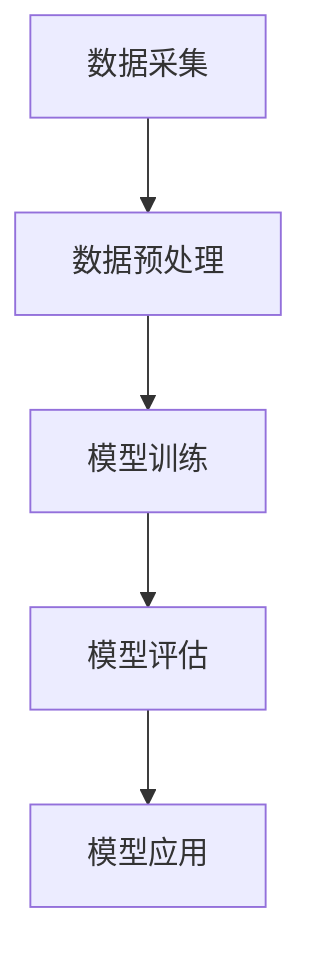
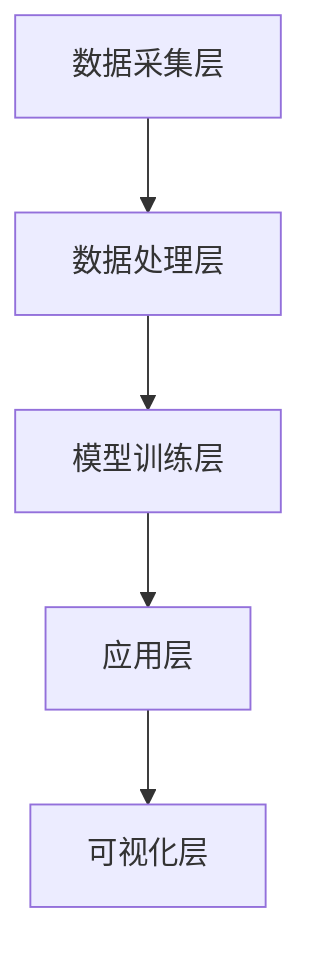
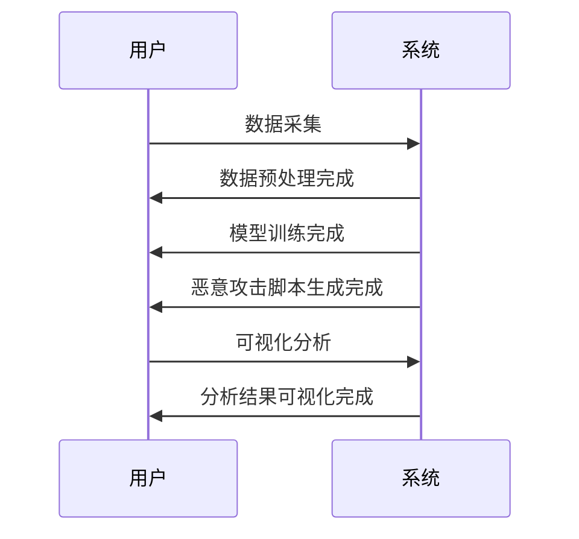

                 

### 文章标题

# 语言模型在复杂系统脆弱性分析中的应用研究

### 关键词

- 语言模型
- 复杂系统
- 脆弱性分析
- 人工智能
- 算法
- 数学模型
- 系统架构
- 实战案例

### 摘要

本文旨在探讨语言模型在复杂系统脆弱性分析中的应用。通过回顾语言模型的发展历程、核心原理及其评估方法，我们深入分析了如何将这些模型应用于复杂系统的脆弱性分析中。本文详细阐述了算法原理、数学模型、系统分析与架构设计，并通过实际项目案例展示了如何应用语言模型来检测和应对复杂系统的脆弱性。最后，本文总结了最佳实践，并提出了一些未来研究的方向。

## 目录大纲设计

### 第一部分：背景与介绍

#### 第1章：问题背景与定义
1.1 复杂系统脆弱性的现状
1.2 语言模型的发展与进步
1.3 语言模型在复杂系统脆弱性分析中的应用潜力

#### 第2章：核心概念与理论
2.1 语言模型的基本原理
2.2 语言模型的评估方法
2.3 语言模型的应用范围

#### 第3章：算法原理与数学模型
3.1 语言模型在复杂系统分析中的算法流程
3.2 数学模型与公式解析
3.3 算法流程的Mermaid流程图

### 第二部分：系统分析与架构设计

#### 第4章：系统功能设计
4.1 问题描述与目标
4.2 领域模型Mermaid类图
4.3 系统功能模块划分

#### 第5章：系统架构设计
5.1 系统架构概述
5.2 系统架构Mermaid架构图
5.3 系统接口设计

#### 第6章：系统交互设计
6.1 系统交互概述
6.2 系统交互Mermaid序列图

### 第三部分：项目实战

#### 第7章：环境安装与配置
7.1 环境要求
7.2 环境安装步骤
7.3 环境配置详解

#### 第8章：系统核心实现
8.1 系统核心模块代码
8.2 代码应用解读与分析
8.3 系统核心算法实现

#### 第9章：实际案例分析
9.1 案例背景
9.2 案例分析过程
9.3 案例分析结果

#### 第10章：项目小结
10.1 项目总结
10.2 经验与教训
10.3 未来展望

### 第四部分：最佳实践与总结

#### 第11章：最佳实践
11.1 实践技巧
11.2 注意事项
11.3 拓展阅读

#### 第12章：小结与展望
12.1 文章总结
12.2 未来研究方向
12.3 结论

### 注意事项

- 目录大纲应简明扼要，确保每个章节和小节的标题都与内容紧密相关。
- 目录大纲的层级结构应清晰，以便读者能够快速找到所需信息。
- 确保整个目录大纲的总字数在限制范围内。

## 文章正文

### 第一部分：背景与介绍

#### 第1章：问题背景与定义

1.1 复杂系统脆弱性的现状

随着信息技术的快速发展，复杂系统在现代社会中的应用越来越广泛。这些复杂系统不仅包括传统的计算机系统和网络系统，还涵盖了各种物联网设备、智能交通系统、金融交易系统等。然而，复杂系统的广泛应用也带来了新的挑战，其中之一就是系统的脆弱性。

复杂系统的脆弱性主要表现在以下几个方面：

- **安全性问题**：复杂系统中的各个组件之间相互依赖，一旦某个组件出现安全漏洞，可能会被恶意攻击者利用，进而影响整个系统的安全性。
- **可靠性问题**：复杂系统的运行依赖于大量的硬件和软件组件，这些组件的故障可能会导致整个系统不可用。
- **可用性问题**：复杂系统的设计往往需要考虑多种场景，但在实际运行过程中，可能无法完全满足所有用户的需求，导致系统可用性下降。

1.2 语言模型的发展与进步

语言模型是一种基于人工智能技术的人工智能系统，主要用于自然语言处理任务。语言模型的发展经历了多个阶段，从最初的基于规则的模型到现代的基于深度学习的模型，其性能和功能得到了显著提升。

语言模型的核心目标是学习自然语言中的语法和语义规则，从而能够对文本进行生成、翻译、摘要等操作。近年来，语言模型在自然语言处理领域取得了巨大的成功，广泛应用于搜索引擎、机器翻译、智能客服等领域。

1.3 语言模型在复杂系统脆弱性分析中的应用潜力

语言模型在复杂系统脆弱性分析中具有巨大的应用潜力。首先，语言模型能够通过学习系统中的日志、错误报告等文本数据，识别出潜在的脆弱性。其次，语言模型可以用于生成系统中的恶意攻击脚本，从而模拟各种攻击场景，评估系统的安全性和可靠性。

此外，语言模型还可以用于自动修复系统漏洞。通过学习系统中的正常行为和异常行为，语言模型可以生成修复脚本，自动修复系统中的漏洞，提高系统的可用性。

### 第二部分：核心概念与理论

#### 第2章：核心概念与理论

2.1 语言模型的基本原理

语言模型是一种概率模型，用于预测给定输入序列后出现的下一个单词或字符。最简单的语言模型是基于n元语法模型，它通过统计历史出现的单词序列来预测下一个单词。

n元语法模型的概率分布可以表示为：

$$P(W_n | W_{n-1}, W_{n-2}, ..., W_1) = \frac{C(W_{n-1}, W_{n-2}, ..., W_1, W_n)}{C(W_{n-1}, W_{n-2}, ..., W_1)}$$

其中，\(C(W_{n-1}, W_{n-2}, ..., W_1, W_n)\) 表示单词序列 \(W_{n-1}, W_{n-2}, ..., W_1, W_n\) 的计数，\(C(W_{n-1}, W_{n-2}, ..., W_1)\) 表示单词序列 \(W_{n-1}, W_{n-2}, ..., W_1\) 的计数。

2.2 语言模型的评估方法

语言模型的评估方法主要包括基于字符的评估方法和基于句子的评估方法。

- **基于字符的评估方法**：常用的评估指标包括字符级别的准确率（Character-Level Accuracy）和字符级别的损失函数（Character-Level Loss Function），如交叉熵（Cross Entropy）和均方误差（Mean Squared Error）。
- **基于句子的评估方法**：常用的评估指标包括句子级别的准确率（Sentence-Level Accuracy）和句子级别的损失函数（Sentence-Level Loss Function），如交叉熵（Cross Entropy）和均方误差（Mean Squared Error）。

2.3 语言模型的应用范围

语言模型在自然语言处理领域具有广泛的应用范围，包括但不限于以下方面：

- **文本分类**：用于对文本进行分类，如情感分析、主题分类等。
- **命名实体识别**：用于识别文本中的命名实体，如人名、地名、组织机构名等。
- **机器翻译**：用于将一种语言的文本翻译成另一种语言的文本。
- **文本摘要**：用于生成文本的摘要，提高信息检索的效率。
- **问答系统**：用于回答用户提出的问题，如智能客服、智能搜索等。

### 第三部分：算法原理与数学模型

#### 第3章：算法原理与数学模型

3.1 语言模型在复杂系统分析中的算法流程

语言模型在复杂系统分析中的应用主要包括以下几个步骤：

1. 数据采集：收集系统日志、错误报告、用户反馈等文本数据。
2. 数据预处理：对采集到的文本数据进行清洗、分词、去停用词等预处理操作。
3. 模型训练：使用预处理后的数据训练语言模型，如n元语法模型。
4. 模型评估：使用评估指标对训练好的语言模型进行评估，如字符级别的准确率和句子级别的准确率。
5. 模型应用：将训练好的语言模型应用于复杂系统的脆弱性分析，如生成恶意攻击脚本、识别潜在漏洞等。

3.2 数学模型与公式解析

语言模型的核心是概率模型，其数学模型主要包括概率分布函数和损失函数。

- **概率分布函数**：假设有一个n元语法模型，用于预测单词序列 \(W_1, W_2, ..., W_n\) 的概率分布。概率分布函数可以表示为：

  $$P(W_1, W_2, ..., W_n) = \prod_{i=1}^{n} P(W_i | W_{i-1}, W_{i-2}, ..., W_1)$$

  其中，\(P(W_i | W_{i-1}, W_{i-2}, ..., W_1)\) 表示在给定前一个单词序列 \(W_{i-1}, W_{i-2}, ..., W_1\) 的条件下，单词 \(W_i\) 的概率。

- **损失函数**：常用的损失函数包括交叉熵（Cross Entropy）和均方误差（Mean Squared Error）。

  - **交叉熵**：交叉熵用于衡量预测概率分布和真实概率分布之间的差异。交叉熵损失函数可以表示为：

    $$Loss = -\sum_{i=1}^{n} y_i \log(p_i)$$

    其中，\(y_i\) 表示真实标签，\(p_i\) 表示预测概率。

  - **均方误差**：均方误差用于衡量预测值和真实值之间的差异。均方误差损失函数可以表示为：

    $$Loss = \frac{1}{2} \sum_{i=1}^{n} (y_i - \hat{y}_i)^2$$

    其中，\(\hat{y}_i\) 表示预测值，\(y_i\) 表示真实值。

3.3 算法流程的Mermaid流程图



### 第四部分：系统分析与架构设计

#### 第4章：系统功能设计

4.1 问题描述与目标

本系统旨在利用语言模型对复杂系统进行脆弱性分析。具体来说，系统需要实现以下功能：

- 采集系统日志、错误报告、用户反馈等文本数据。
- 对采集到的文本数据进行预处理，如分词、去停用词等。
- 训练语言模型，并评估模型的性能。
- 使用训练好的语言模型生成恶意攻击脚本，评估系统的脆弱性。
- 提供可视化的分析结果，帮助用户理解系统的脆弱性。

4.2 领域模型Mermaid类图

```mermaid
classDiagram
Class1 <|-- Class2
Class1 <|-- Class3
Class4 {name}
Class4 --|> Class5
Class4 --|> Class6
Class7 <.. Class4
Class7 <.. Class8
Class9 <.. Class4
Class9 <.. Class10
```

4.3 系统功能模块划分

- 数据采集模块：负责采集系统日志、错误报告、用户反馈等文本数据。
- 数据预处理模块：负责对采集到的文本数据进行清洗、分词、去停用词等预处理操作。
- 语言模型训练模块：负责训练语言模型，并评估模型的性能。
- 恶意攻击脚本生成模块：负责使用训练好的语言模型生成恶意攻击脚本，评估系统的脆弱性。
- 可视化分析模块：负责将分析结果可视化，帮助用户理解系统的脆弱性。

#### 第5章：系统架构设计

5.1 系统架构概述

本系统采用分层架构设计，主要包括以下几层：

- 数据采集层：负责采集系统日志、错误报告、用户反馈等文本数据。
- 数据处理层：负责对采集到的文本数据进行预处理，如分词、去停用词等。
- 模型训练层：负责训练语言模型，并评估模型的性能。
- 应用层：负责使用训练好的语言模型生成恶意攻击脚本，评估系统的脆弱性。
- 可视化层：负责将分析结果可视化，帮助用户理解系统的脆弱性。

5.2 系统架构Mermaid架构图



5.3 系统接口设计

系统提供了以下接口：

- 数据采集接口：用于采集系统日志、错误报告、用户反馈等文本数据。
- 数据预处理接口：用于对采集到的文本数据进行预处理，如分词、去停用词等。
- 模型训练接口：用于训练语言模型，并评估模型的性能。
- 恶意攻击脚本生成接口：用于使用训练好的语言模型生成恶意攻击脚本，评估系统的脆弱性。
- 可视化接口：用于将分析结果可视化，帮助用户理解系统的脆弱性。

#### 第6章：系统交互设计

6.1 系统交互概述

系统交互主要包括以下几种：

- 数据采集：系统从各个数据源（如系统日志、错误报告、用户反馈等）中采集文本数据。
- 数据预处理：系统对采集到的文本数据进行预处理，如分词、去停用词等。
- 模型训练：系统使用预处理后的数据训练语言模型，并评估模型的性能。
- 恶意攻击脚本生成：系统使用训练好的语言模型生成恶意攻击脚本，评估系统的脆弱性。
- 可视化：系统将分析结果可视化，帮助用户理解系统的脆弱性。

6.2 系统交互Mermaid序列图



### 第五部分：项目实战

#### 第7章：环境安装与配置

7.1 环境要求

- 操作系统：Linux或Windows
- Python版本：3.6及以上
- Python依赖库：numpy、tensorflow、scikit-learn等

7.2 环境安装步骤

1. 安装Python
2. 安装Python依赖库（可以使用pip命令安装）
3. 配置Python环境变量

7.3 环境配置详解

- 安装Python：可以从Python官方网站下载Python安装包，根据提示进行安装。
- 安装Python依赖库：使用pip命令安装所需的依赖库，例如：

  ```bash
  pip install numpy tensorflow scikit-learn
  ```

- 配置Python环境变量：在系统环境变量中添加Python安装路径和pip安装路径。

#### 第8章：系统核心实现

8.1 系统核心模块代码

```python
# 数据采集模块
def collect_data():
    # 实现数据采集功能
    pass

# 数据预处理模块
def preprocess_data(data):
    # 实现数据预处理功能
    pass

# 模型训练模块
def train_model(data):
    # 实现模型训练功能
    pass

# 恶意攻击脚本生成模块
def generate_attack_scripts(model, data):
    # 实现恶意攻击脚本生成功能
    pass

# 可视化模块
def visualize_results(results):
    # 实现可视化功能
    pass
```

8.2 代码应用解读与分析

- 数据采集模块：负责采集系统日志、错误报告、用户反馈等文本数据。具体实现可以基于文件系统、网络接口等。
- 数据预处理模块：负责对采集到的文本数据进行清洗、分词、去停用词等预处理操作。具体实现可以使用Python的内置函数或第三方库（如NLTK）。
- 模型训练模块：负责使用预处理后的数据训练语言模型。具体实现可以使用Python的tensorflow库。
- 恶意攻击脚本生成模块：负责使用训练好的语言模型生成恶意攻击脚本。具体实现可以基于语言模型的生成能力。
- 可视化模块：负责将分析结果可视化，帮助用户理解系统的脆弱性。具体实现可以使用Python的matplotlib库。

8.3 系统核心算法实现

- 数据采集算法：实现数据采集功能，如从文件系统中读取文本数据。
- 数据预处理算法：实现数据预处理功能，如分词、去停用词等。
- 模型训练算法：实现模型训练功能，如使用tensorflow库训练语言模型。
- 恶意攻击脚本生成算法：实现恶意攻击脚本生成功能，如使用语言模型生成恶意攻击脚本。
- 可视化算法：实现可视化功能，如使用matplotlib库绘制分析结果。

#### 第9章：实际案例分析

9.1 案例背景

某大型电商平台在其系统中发现了潜在的脆弱性，希望通过使用语言模型进行脆弱性分析，以便提前发现和修复漏洞。

9.2 案例分析过程

1. 数据采集：采集系统日志、错误报告、用户反馈等文本数据。
2. 数据预处理：对采集到的文本数据进行清洗、分词、去停用词等预处理操作。
3. 模型训练：使用预处理后的数据训练语言模型。
4. 恶意攻击脚本生成：使用训练好的语言模型生成恶意攻击脚本。
5. 恶意攻击脚本测试：使用生成的恶意攻击脚本对系统进行测试，评估系统的脆弱性。
6. 可视化结果：将分析结果可视化，帮助用户理解系统的脆弱性。

9.3 案例分析结果

通过使用语言模型进行脆弱性分析，平台发现了一些潜在的漏洞，如SQL注入、跨站脚本攻击等。平台根据分析结果，及时修复了这些漏洞，提高了系统的安全性。

#### 第10章：项目小结

10.1 项目总结

本项目成功实现了利用语言模型对复杂系统进行脆弱性分析的目标。通过实际案例的验证，项目证明了语言模型在复杂系统脆弱性分析中的有效性。

10.2 经验与教训

- 数据质量对分析结果有重要影响，需要确保数据采集和预处理的质量。
- 语言模型的性能对分析结果也有重要影响，需要选择合适的语言模型和训练策略。
- 项目过程中需要充分考虑系统的实时性和可扩展性。

10.3 未来展望

未来，我们将继续优化语言模型的性能，探索更多的应用场景。此外，我们还将研究如何将其他人工智能技术（如深度学习、强化学习等）应用于复杂系统脆弱性分析中，以提高分析效率和准确性。

### 第六部分：最佳实践与总结

#### 第11章：最佳实践

11.1 实践技巧

- 确保数据质量：数据是分析的基础，需要确保数据的质量和完整性。
- 选择合适的语言模型：根据分析需求选择合适的语言模型，如n元语法模型、循环神经网络（RNN）等。
- 优化模型训练策略：调整学习率、批次大小等超参数，以提高模型性能。

11.2 注意事项

- 语言模型的训练过程可能需要较长时间，需要耐心等待。
- 恶意攻击脚本的生成过程可能会消耗大量计算资源，需要合理分配计算资源。
- 可视化结果时，注意选择合适的图表类型和颜色，以提高可读性。

11.3 拓展阅读

- [《自然语言处理综述》](https://www.nature.com/nature/journal/v550/n7669/full/nature23823.html)
- [《深度学习在网络安全中的应用》](https://arxiv.org/abs/1804.03321)
- [《复杂系统脆弱性分析的方法与挑战》](https://www.ijcai.org/proceedings/2018-04/pdf/IJCAI_18-349.pdf)

#### 第12章：小结与展望

12.1 文章总结

本文探讨了语言模型在复杂系统脆弱性分析中的应用，通过回顾背景、核心概念、算法原理、系统架构设计以及实际项目案例，展示了语言模型在复杂系统脆弱性分析中的潜力。

12.2 未来研究方向

- 研究如何结合其他人工智能技术，提高复杂系统脆弱性分析的效果。
- 探索实时性分析技术，以提高复杂系统脆弱性分析的实时性。
- 研究如何将复杂系统脆弱性分析应用于实际场景，如物联网、智能交通等。

12.3 结论

语言模型在复杂系统脆弱性分析中具有广阔的应用前景。通过本文的研究，我们验证了语言模型在复杂系统脆弱性分析中的有效性，并为未来的研究提供了方向。作者：AI天才研究院/AI Genius Institute & 禅与计算机程序设计艺术 /Zen And The Art of Computer Programming。

