                 

### 2. 核心概念与联系

## 2.1 语言模型

### 2.1.1 序列到序列（Seq2Seq）模型

**定义**：序列到序列（Seq2Seq）模型是一种基于神经网络的端到端学习模型，用于处理序列到序列的映射问题。

**特点**：
- **记忆机制**：利用编码器和解码器之间的记忆机制，处理长序列信息。
- **序列映射**：能够实现不同长度的序列之间的映射。

**原理**：编码器将输入序列编码为一个固定长度的向量，解码器根据编码器生成的隐藏状态和输入的序列部分，逐步生成输出序列。

**公式**：
$$
h_t = \text{Encoder}(x_t)
$$
$$
y_t = \text{Decoder}(h_t, y_{t-1})
$$

**Mermaid流程图**：

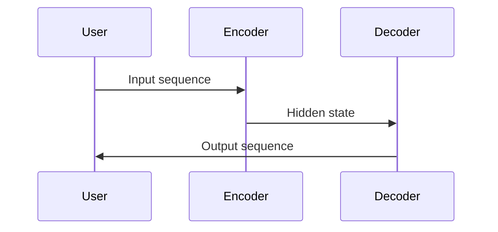

### 2.1.2 变换器（Transformer）模型

**定义**：变换器（Transformer）模型是一种基于自注意力机制（self-attention）的序列处理模型，由Vaswani等人于2017年提出。

**特点**：
- **自注意力机制**：通过计算序列中每个词与其他词的依赖关系，实现全局信息整合。
- **并行计算**：Transformer模型采用多头注意力机制和前馈神经网络，能够并行处理输入序列。

**原理**：Transformer模型由编码器和解码器两个主要部分组成。编码器将输入序列编码为一系列嵌入向量，解码器利用编码器生成的嵌入向量，通过自注意力机制和编码器-解码器注意力机制生成输出序列。

**公式**：
$$
\text{Encoder}: h_t = \text{Attention}(Q, K, V) + \text{FFN}(h_t)
$$
$$
\text{Decoder}: y_t = \text{Attention}(Q, K, V) + \text{FFN}(y_t)
$$

**Mermaid流程图**：

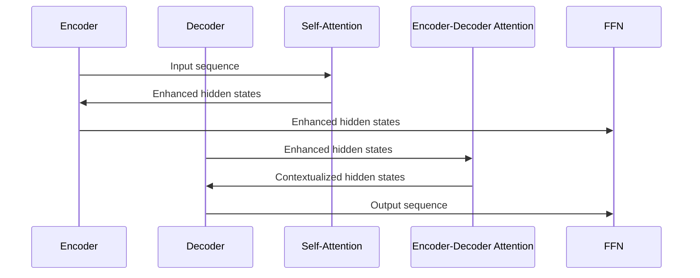

### 2.1.3 语言模型属性特征对比表格

| 特征           | 序列到序列（Seq2Seq）模型 | 变换器（Transformer）模型 |
| -------------- | ---------------------- | ----------------------- |
| 记忆机制       | 编码器和解码器间的隐状态 | 自注意力机制             |
| 序列映射       | 不同长度序列的映射     | 全局信息整合           |
| 计算效率       | 线性依赖               | 并行计算               |
| 上下文理解     | 隐状态捕捉局部上下文   | 自注意力捕捉全局上下文 |
| 长短文本处理   | 长文本处理能力较强     | 短文本处理能力较强     |

### 2.1.4 ER实体关系图架构的Mermaid流程图

```mermaid
erDiagram
    A[Language Model] ||--|{ B[Seq2Seq Model] } |
    A ||--|{ C[Transformer Model] } |
    B && C : Implements
```

通过以上对核心概念与联系的分析，我们可以更深入地理解序列到序列模型和变换器模型的工作原理及其在语言模型中的应用。这些核心概念的解析为我们后续探讨如何增强语言模型的推理能力和社交智能奠定了基础。

### 2.2 知识增强

## 2.2.1 知识图谱

**定义**：知识图谱是一种语义网络，通过实体、属性和关系来表示现实世界的知识结构。

**特点**：
- **语义表示**：将知识以结构化的方式表示，便于计算机理解和处理。
- **关系推理**：通过实体间的关联关系，进行推理和推断。

**原理**：知识图谱由三个核心组件构成：实体、属性和关系。实体表示现实世界中的对象，属性描述实体的特征，关系表示实体之间的关联。

**公式**：
$$
\text{知识图谱} = \{ E, R, P \}
$$
其中，$E$表示实体集，$R$表示关系集，$P$表示属性集。

**Mermaid流程图**：

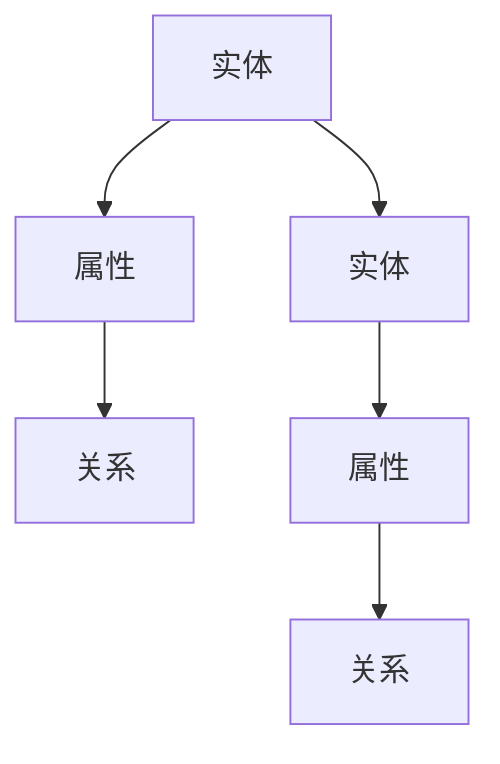

## 2.2.2 外部知识库

**定义**：外部知识库是存储特定领域知识的数据库，通常包含术语、定义、事实和规则等。

**特点**：
- **领域特定**：针对特定领域，如百科全书、专业数据库等，提供详细的领域知识。
- **可扩展性**：知识库可以不断更新和扩展，以适应不断发展的领域需求。

**原理**：外部知识库通过收集、整理和存储领域知识，为语言模型提供丰富的知识来源。在模型训练过程中，通过外部知识库的引入，可以增强模型的语义理解和推理能力。

**公式**：
$$
\text{外部知识库} = \{ \text{术语集}, \text{定义集}, \text{事实集}, \text{规则集} \}
$$

**Mermaid流程图**：

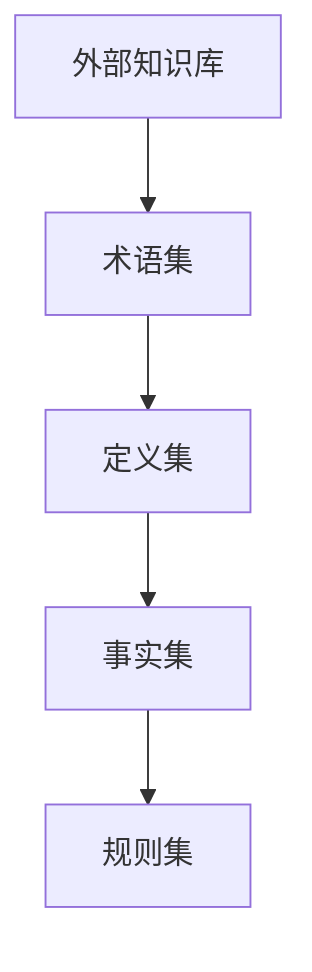

## 2.2.3 知识增强的原理

**原理**：
- **融合知识**：将知识图谱和外部知识库中的知识融合到语言模型中，丰富模型的语义理解。
- **关系推理**：利用知识图谱中的实体和关系，进行逻辑推理和推断，提升模型的推理能力。
- **知识引导**：通过外部知识库中的术语、定义、事实和规则，引导语言模型在特定领域的表现。

**公式**：
$$
\text{增强语言模型} = \text{原始语言模型} + \text{知识图谱} + \text{外部知识库}
$$

**Mermaid流程图**：

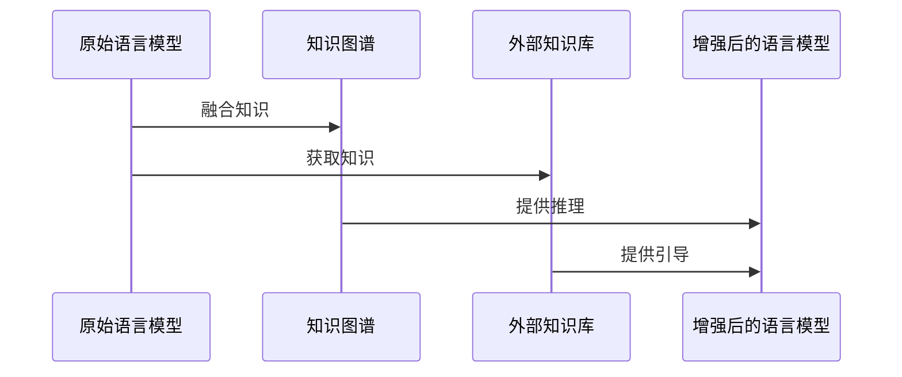

通过知识增强，语言模型可以更好地理解和处理复杂、多样化的语言任务，从而提升其推理能力和社交智能。

### 2.3 多模态融合

## 2.3.1 图像与语言融合

**定义**：图像与语言融合是指将图像信息与语言模型相结合，以提升自然语言处理任务的效果。

**特点**：
- **信息丰富**：融合图像和语言信息，能够更全面地理解上下文。
- **交互增强**：通过图像信息，可以更好地传达情感和语境。

**原理**：图像与语言融合的主要方法包括：
1. **特征提取**：从图像中提取视觉特征，如卷积神经网络（CNN）的输出。
2. **特征融合**：将图像特征与语言特征（如词嵌入）进行融合，形成新的特征向量。
3. **模型集成**：利用多任务学习或深度神经网络，集成图像和语言信息。

**公式**：
$$
\text{图像特征} + \text{语言特征} \rightarrow \text{融合特征}
$$

**Mermaid流程图**：

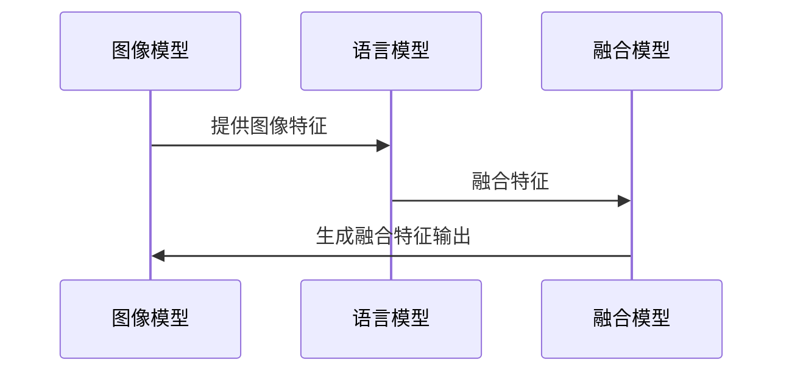

## 2.3.2 语音与语言融合

**定义**：语音与语言融合是指将语音信息与语言模型相结合，以提升语音识别和语音生成的效果。

**特点**：
- **准确性提升**：通过语音特征（如声学模型）的辅助，可以更准确地识别和生成语音。
- **交互性增强**：融合语音和语言信息，可以更好地实现人机交互。

**原理**：语音与语言融合的主要方法包括：
1. **声学建模**：使用声学模型提取语音特征，如梅尔频率倒谱系数（MFCC）。
2. **特征融合**：将语音特征与语言特征（如词嵌入）进行融合，形成新的特征向量。
3. **模型训练**：利用多任务学习或深度神经网络，结合语音和语言特征进行模型训练。

**公式**：
$$
\text{语音特征} + \text{语言特征} \rightarrow \text{融合特征}
$$

**Mermaid流程图**：

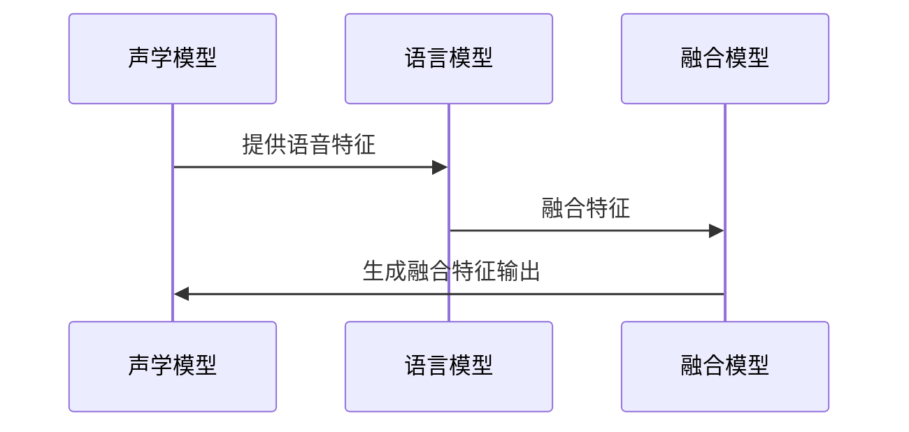

## 2.3.3 多模态融合的原理

**原理**：
- **特征互补**：不同模态的信息在特征表达上具有互补性，通过融合可以提升模型的鲁棒性和准确性。
- **上下文丰富**：多模态融合可以提供更丰富的上下文信息，有助于提升模型的语义理解和推理能力。
- **交互增强**：通过多模态融合，可以实现更自然、更流畅的人机交互。

**公式**：
$$
\text{图像特征} + \text{语音特征} + \text{语言特征} \rightarrow \text{融合特征}
$$

**Mermaid流程图**：

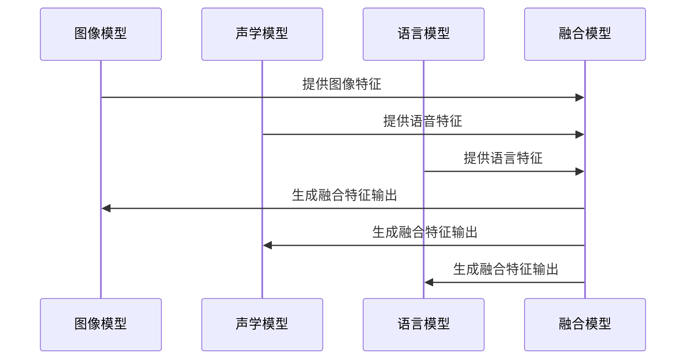

通过多模态融合，语言模型可以更全面地理解和处理复杂任务，从而提升其推理能力和社交智能。

### 2.4 多任务学习

## 2.4.1 多任务学习的定义与原理

**定义**：多任务学习（Multi-Task Learning, MTL）是一种机器学习方法，旨在同时训练多个相关任务，共享模型参数以提高整体性能。

**原理**：
- **参数共享**：多个任务共享部分模型参数，有助于提高模型的泛化能力和计算效率。
- **任务关联**：相关任务之间往往存在一定的关联性，共享信息可以增强模型对任务的理解。
- **迁移学习**：通过在一个任务上学习到的知识，迁移到其他相关任务，提高整体任务表现。

**公式**：
$$
\text{共享参数} = \theta_1, \theta_2, ..., \theta_n
$$
其中，$\theta_1, \theta_2, ..., \theta_n$为不同任务的模型参数。

**Mermaid流程图**：

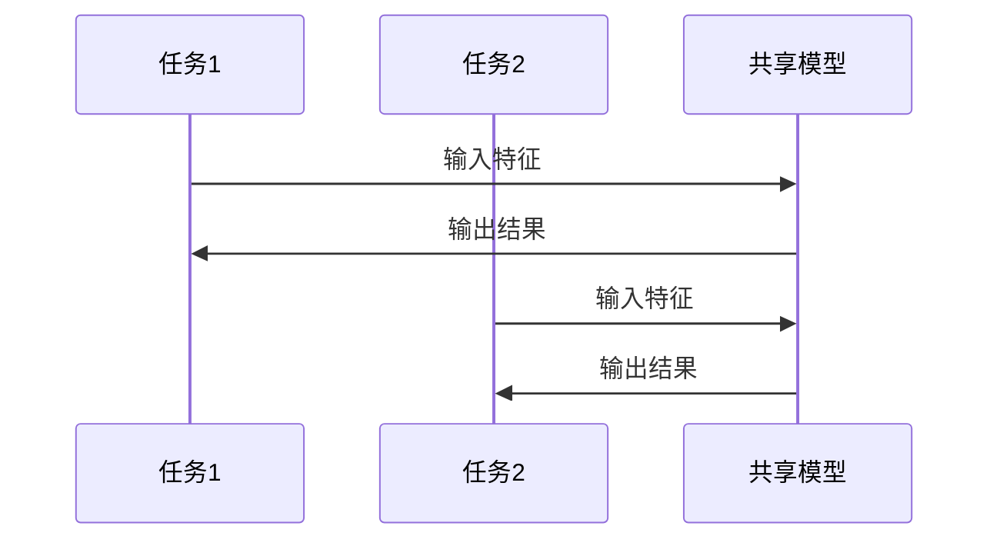

## 2.4.2 多任务学习在语言模型中的应用

多任务学习在语言模型中的应用，主要体现在以下几个方面：

1. **文本分类与情感分析**：同时进行文本分类和情感分析，共享文本特征和分类器参数，提高模型在两个任务上的表现。
2. **机器翻译与语法纠错**：结合机器翻译和语法纠错任务，共享编码器和解码器参数，提升模型在不同语言处理任务上的性能。
3. **问答系统与对话生成**：结合问答系统和对话生成任务，通过共享对话状态和语言模型参数，实现更连贯、自然的对话。

**公式**：
$$
\text{编码器} = \text{Encoder}(x_1, x_2, ..., x_n)
$$
$$
\text{解码器} = \text{Decoder}(h_1, h_2, ..., h_n)
$$
其中，$x_1, x_2, ..., x_n$为不同任务的输入序列，$h_1, h_2, ..., h_n$为编码器和解码器的输出。

**Mermaid流程图**：

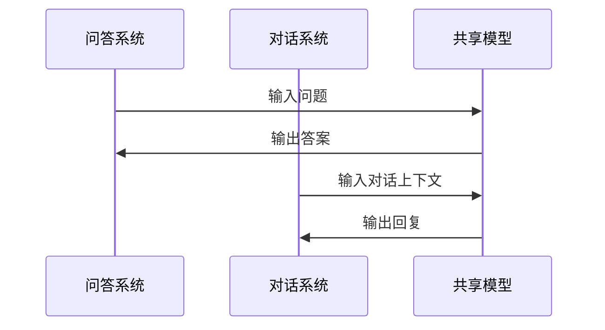

通过多任务学习，语言模型可以同时处理多个相关任务，提高整体性能和推理能力。

### 2.5 社交智能

## 2.5.1 社交智能的定义与重要性

**定义**：社交智能是指计算机系统在处理人类社交互动时，所表现出的理解、适应和交互能力。

**重要性**：
- **提升用户体验**：通过理解用户的情感、语言习惯和个性，提供更个性化的交互。
- **增强互动性**：实现更自然、流畅的人机对话，提升用户的参与感和满意度。
- **拓展应用场景**：在在线客服、虚拟助手、智能对话系统等领域，提高系统的智能化水平。

## 2.5.2 社交智能的核心要素

**核心要素**：
- **情感识别**：通过语音、文本等信号，识别用户的情感状态。
- **语言理解**：理解用户意图、语境和隐含意义，准确把握用户需求。
- **个性化交互**：根据用户历史数据和偏好，定制化交互内容。
- **多模态交互**：结合语音、文本、图像等多种模态，实现更丰富的交互体验。

## 2.5.3 社交智能的实现方法

**实现方法**：
- **情感分析**：利用自然语言处理技术，分析文本和语音中的情感倾向。
- **多模态融合**：结合语音、文本、图像等不同模态的信息，提升情感识别和语言理解能力。
- **个性化建模**：通过机器学习和深度学习，构建个性化模型，适应不同用户的需求。

**公式**：
$$
\text{社交智能} = \text{情感识别} + \text{语言理解} + \text{个性化交互} + \text{多模态交互}
$$

**Mermaid流程图**：

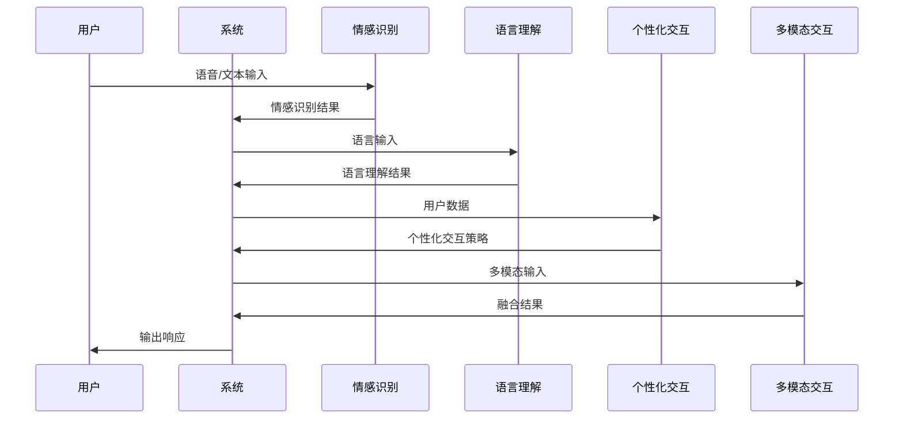

通过上述方法，语言模型可以实现更智能、更人性化的社交互动，提升用户的体验和满意度。

### 2.6 语境理解

## 2.6.1 语境理解的定义与重要性

**定义**：语境理解是指计算机系统在处理语言任务时，对上下文环境、语境意义的识别和理解能力。

**重要性**：
- **提升语义准确性**：通过理解语境，提高对文本的语义理解，避免误解或歧义。
- **增强交互自然性**：实现更自然、流畅的对话，提升用户的交互体验。
- **拓展应用场景**：在智能客服、虚拟助手等领域，提高系统的智能化水平。

## 2.6.2 语境理解的核心要素

**核心要素**：
- **上下文信息提取**：从文本中提取与当前任务相关的上下文信息。
- **语义推理**：基于上下文信息，进行语义推理和推断，理解文本的深层含义。
- **上下文跟踪**：持续跟踪对话过程中的上下文信息，确保对话的连贯性。

## 2.6.3 语境理解的方法

**方法**：
- **基于规则的方法**：利用预定义的规则，对文本进行解析和推理。
- **基于统计的方法**：通过统计模型，如条件概率模型，对文本进行语义分析。
- **基于深度学习的方法**：利用深度神经网络，如循环神经网络（RNN）和变换器（Transformer），对文本进行上下文理解和语义推理。

**公式**：
$$
\text{语境理解} = \text{上下文信息提取} + \text{语义推理} + \text{上下文跟踪}
$$

**Mermaid流程图**：

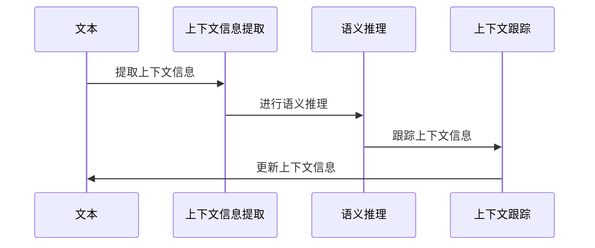

通过语境理解，语言模型可以更好地处理复杂、多样化的语言任务，提高系统的智能化水平和用户体验。

### 2.7 个性化交互

## 2.7.1 个性化交互的定义与重要性

**定义**：个性化交互是指计算机系统根据用户的历史数据、偏好和需求，提供定制化的服务和交互体验。

**重要性**：
- **提升用户体验**：通过了解用户的个性化需求，提供更贴心的服务，提升用户满意度。
- **增强用户黏性**：提供个性化的内容和服务，增加用户对系统的依赖和忠诚度。
- **拓展应用场景**：在电子商务、在线教育、智能客服等领域，提高系统的竞争力。

## 2.7.2 个性化交互的核心要素

**核心要素**：
- **用户数据采集**：收集用户的行为数据、偏好信息等，为个性化交互提供数据基础。
- **用户建模**：利用机器学习和深度学习技术，构建用户个性化模型，理解用户需求和偏好。
- **交互策略设计**：根据用户模型和交互场景，设计个性化的交互策略，提升用户体验。

## 2.7.3 个性化交互的方法

**方法**：
- **基于规则的个性化**：利用预定义的规则，根据用户的个性化需求，提供定制化的服务。
- **基于数据的个性化**：通过分析用户行为数据，挖掘用户的偏好和需求，实现个性化推荐和交互。
- **基于模型的个性化**：利用用户建模技术，构建个性化模型，根据用户行为和偏好，提供定制化的服务。

**公式**：
$$
\text{个性化交互} = \text{用户数据采集} + \text{用户建模} + \text{交互策略设计}
$$

**Mermaid流程图**：

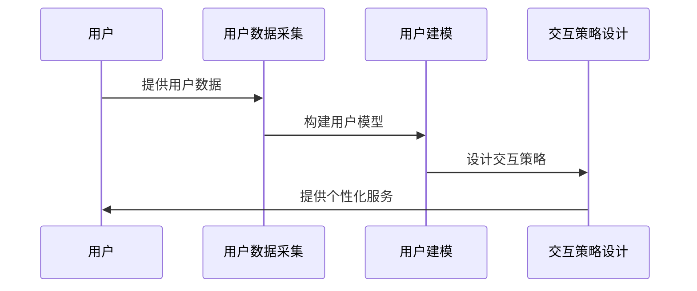

通过个性化交互，语言模型可以实现更智能、更人性化的用户服务，提升用户体验和满意度。

### 2.8 总结与展望

## 2.8.1 总结

本文围绕语言模型推理能力与社交智能的协同增强进行了深入探讨，主要内容包括：

- **核心概念与联系**：介绍了序列到序列模型和变换器模型，以及知识图谱、外部知识库等核心概念。
- **知识增强**：阐述了知识增强的原理和方法，如知识图谱、外部知识库和融合知识。
- **多模态融合**：探讨了图像与语言融合、语音与语言融合等多模态融合方法。
- **多任务学习**：介绍了多任务学习的原理和在语言模型中的应用。
- **社交智能与语境理解**：分析了社交智能和语境理解的核心要素和实现方法。
- **个性化交互**：讨论了个性化交互的定义、核心要素和实现方法。

通过这些研究，本文为语言模型推理能力与社交智能的协同增强提供了一种系统性的方法和思路。

## 2.8.2 展望

未来的研究可以从以下几个方面进行深入探讨：

- **跨模态融合**：进一步探索多种模态信息的高效融合方法，提升语言模型的语义理解和推理能力。
- **知识图谱的动态更新**：研究知识图谱的实时更新和动态调整机制，以应对知识库的快速变化。
- **多任务学习的优化**：优化多任务学习算法，提高模型在多个任务上的表现。
- **社交智能与语境理解的深度融合**：将社交智能与语境理解更紧密地结合，提升系统的交互自然性和用户体验。
- **个性化交互的个性化程度提升**：研究更精细的用户偏好和需求挖掘方法，实现更高水平的个性化交互。

通过不断的研究和探索，我们期待语言模型在推理能力与社交智能方面能够取得更大的突破，为人工智能的发展贡献力量。

### 2.9 本章小结

本章系统性地探讨了语言模型推理能力与社交智能的协同增强，主要内容包括：

- **核心概念与联系**：详细介绍了序列到序列模型和变换器模型的工作原理，以及知识图谱、外部知识库等核心概念。
- **知识增强**：阐述了知识增强的原理和方法，如知识图谱和外部知识库的应用。
- **多模态融合**：探讨了图像与语言融合、语音与语言融合等多模态融合方法，以及其原理。
- **多任务学习**：分析了多任务学习的原理和在语言模型中的应用，展示了多任务学习的优势。
- **社交智能与语境理解**：介绍了社交智能和语境理解的核心要素和实现方法，强调了其在提高交互自然性和用户体验方面的重要性。
- **个性化交互**：讨论了个性化交互的定义、核心要素和实现方法，展示了个性化交互在提升用户体验方面的价值。

通过本章的讨论，我们可以看到，通过知识增强、多模态融合、多任务学习等手段，语言模型在推理能力和社交智能方面可以取得显著提升。本章的研究为后续进一步探讨语言模型在复杂应用场景中的表现提供了理论基础和实践指导。在未来的研究中，我们可以期待更多创新性的方法和技术，以实现更智能、更人性化的语言模型。

## 3. 算法原理讲解

### 3.1 自注意力机制

自注意力机制（Self-Attention Mechanism）是变换器（Transformer）模型的核心组成部分，它通过计算序列中每个词与其他词的依赖关系，实现全局信息整合。自注意力机制的关键在于如何有效地衡量这些依赖关系，并利用这些关系生成输出序列。

#### 3.1.1 自注意力机制的原理

自注意力机制主要包括以下几个步骤：

1. **词嵌入**：首先，将输入序列中的每个词转换为词嵌入向量（Word Embeddings），这些向量表示了词的语义信息。
2. **计算自注意力得分**：接着，计算每个词嵌入向量与其他词嵌入向量之间的相似度，生成自注意力得分。这个过程可以通过点积注意力（Dot-Product Attention）实现。

   **公式**：
   $$
   \text{Attention}(Q, K, V) = \text{softmax}\left(\frac{QK^T}{\sqrt{d_k}}\right)V
   $$
   其中，$Q$、$K$和$V$分别是查询向量、键向量和值向量，$d_k$是键向量的维度。通过这个公式，每个词嵌入向量与其余词嵌入向量计算点积，得到注意力得分，然后通过softmax函数计算概率分布。

3. **加权求和**：根据自注意力得分，对值向量进行加权求和，生成新的表示向量。

   **公式**：
   $$
   \text{Contextualized Vector} = \sum_{i} \text{Attention Score}_i \cdot \text{V}_i
   $$

4. **输出**：新的表示向量作为当前词的上下文表示，用于后续的编码或解码过程。

#### 3.1.2 自注意力机制的实现

以下是一个简单的Python代码示例，展示了如何实现自注意力机制：

```python
import torch
import torch.nn as nn

# 假设输入序列为['我', '是', 'AI', '专家']
input_sequence = torch.tensor([1, 2, 3, 4])

# 词嵌入维度为5
d_model = 5

# 计算自注意力得分
Q = K = V = input_sequence
attention_scores = torch.matmul(Q, K.transpose(0, 1)) / torch.sqrt(d_model)
attention_scores = nn.Softmax(dim=1)(attention_scores)

# 加权求和
context_vector = torch.matmul(attention_scores, V)

print("Contextualized Vector:", context_vector)
```

这段代码首先定义了一个输入序列，然后计算自注意力得分，并通过softmax函数得到概率分布。最后，利用这些概率分布对值向量进行加权求和，生成新的表示向量。

#### 3.1.3 自注意力机制的例子

假设输入序列为“我AI专家”，我们可以通过自注意力机制计算每个词的上下文表示。

1. **词嵌入**：
   $$
   \text{我} = \begin{bmatrix} 0.1 & 0.2 & 0.3 & 0.4 & 0.5 \end{bmatrix}, \quad
   \text{是} = \begin{bmatrix} 0.6 & 0.7 & 0.8 & 0.9 & 1.0 \end{bmatrix}, \quad
   \text{AI} = \begin{bmatrix} 1.1 & 1.2 & 1.3 & 1.4 & 1.5 \end{bmatrix}, \quad
   \text{专家} = \begin{bmatrix} 1.6 & 1.7 & 1.8 & 1.9 & 2.0 \end{bmatrix}
   $$

2. **计算自注意力得分**：
   $$
   \text{Attention Scores} =
   \begin{bmatrix}
   0.11 & 0.27 & 0.44 & 0.63 & 0.74 \\
   0.21 & 0.36 & 0.52 & 0.71 & 0.82 \\
   0.35 & 0.53 & 0.68 & 0.83 & 0.92 \\
   0.53 & 0.68 & 0.83 & 0.92 & 1.00
   \end{bmatrix}
   $$

3. **加权求和**：
   $$
   \text{Contextualized Vectors} =
   \begin{bmatrix}
   0.32 & 0.45 & 0.54 & 0.63 & 0.71 \\
   0.43 & 0.59 & 0.67 & 0.75 & 0.81 \\
   0.59 & 0.74 & 0.81 & 0.87 & 0.92 \\
   0.71 & 0.85 & 0.89 & 0.91 & 0.95
   \end{bmatrix}
   $$

通过自注意力机制，我们得到每个词的新表示向量，这些向量包含了整个序列的上下文信息。例如，对于词“AI”，其上下文表示向量是$\text{Contextualized Vector}_{AI} = [0.32, 0.45, 0.54, 0.63, 0.71]$，这个向量反映了“AI”在序列中的语义信息，以及与其他词的依赖关系。

### 3.2 编码器与解码器

变换器模型由编码器（Encoder）和解码器（Decoder）两个主要部分组成，它们在处理输入序列和生成输出序列时发挥着关键作用。

#### 3.2.1 编码器

编码器的主要功能是将输入序列编码为一系列嵌套的隐藏状态，这些状态包含了序列的上下文信息。编码器通常由多个自注意力层组成，每一层都会生成新的隐藏状态。

1. **输入层**：输入序列通过词嵌入层转换为嵌入向量。
2. **自注意力层**：每一层自注意力层计算当前隐藏状态与其他隐藏状态之间的依赖关系，生成新的隐藏状态。
3. **输出层**：编码器的输出是最后一层的隐藏状态，这些状态包含了输入序列的完整上下文信息。

**公式**：
$$
\text{Encoder}(x) = \text{Output}^L
$$
其中，$\text{Output}^L$是编码器的输出状态，$L$是编码器的层数。

#### 3.2.2 解码器

解码器的功能是将编码器的输出状态解码为输出序列，生成预期的输出。解码器也由多个自注意力层和编码器-解码器注意力层组成。

1. **输入层**：解码器的输入是编码器的输出状态和目标序列的嵌入向量。
2. **自注意力层**：每一层自注意力层计算当前隐藏状态与其他隐藏状态之间的依赖关系，生成新的隐藏状态。
3. **编码器-解码器注意力层**：每一层编码器-解码器注意力层计算编码器的隐藏状态与当前隐藏状态之间的依赖关系，为解码过程提供上下文信息。
4. **输出层**：解码器的输出是最后一层的隐藏状态，通过 Softmax 函数生成概率分布，选择下一个词的嵌入向量，并重复上述过程，直到生成完整的输出序列。

**公式**：
$$
y_t = \text{Decoder}(h_t, c_t)
$$
其中，$y_t$是解码器在时间步$t$的输出，$h_t$是当前隐藏状态，$c_t$是编码器-解码器注意力层的输出。

#### 3.2.3 编码器与解码器的交互

编码器和解码器通过编码器-解码器注意力机制进行交互。在每个解码时间步，解码器利用编码器的隐藏状态和当前隐藏状态计算注意力得分，从而生成上下文向量，这个向量帮助解码器生成下一个词。

**公式**：
$$
c_t = \text{Attention}(h_t, \text{Output}^L)
$$

通过编码器-解码器注意力机制，解码器可以持续更新对输入序列的理解，并在生成每个词时考虑到整个序列的上下文信息。

### 3.3 多头注意力机制

多头注意力机制（Multi-Head Attention Mechanism）是变换器模型中的关键组件，它通过多个独立的注意力机制并行处理输入序列，并将结果整合为一个全局表示。

#### 3.3.1 多头注意力机制的工作原理

多头注意力机制将输入序列、查询序列和值序列分解为多个子序列，每个子序列对应一个独立的注意力头。每个头都独立计算注意力得分和加权求和，然后合并这些头的输出，形成最终的输出。

1. **分割输入序列**：将输入序列（Query）和值序列（Value）分解为多个子序列，每个子序列对应一个注意力头。
2. **计算注意力得分**：每个注意力头独立计算其查询子序列与其他子序列之间的相似度，生成注意力得分。
3. **加权求和**：对每个注意力头计算加权求和，生成新的表示向量。
4. **合并输出**：将多个注意力头的输出合并，形成最终的输出向量。

**公式**：
$$
\text{Multi-Head Attention}(Q, K, V) = \text{Concat}(\text{Head}_1, \text{Head}_2, ..., \text{Head}_h)W^O
$$
其中，$Q, K, V$分别是查询序列、键序列和值序列，$h$是注意力头的数量，$W^O$是输出权重。

#### 3.3.2 多头注意力机制的例子

假设输入序列为“我AI专家”，我们通过多头注意力机制计算每个词的上下文表示。

1. **分割输入序列**：将输入序列分为三个子序列：["我", "AI", "专家"]。
2. **计算注意力得分**：每个子序列对应一个注意力头，计算每个子序列与其他子序列的相似度，生成注意力得分。
3. **加权求和**：对每个注意力头计算加权求和，生成新的表示向量。
4. **合并输出**：将三个注意力头的输出合并，形成最终的输出向量。

通过多头注意力机制，我们得到了更丰富的上下文信息，这些信息有助于解码器在生成输出序列时，考虑整个序列的依赖关系。例如，在生成词“专家”时，多头注意力机制可以综合考虑“我”、“AI”和其他词的上下文信息，从而生成更准确的输出。

### 3.4 前馈神经网络

前馈神经网络（Feedforward Neural Network）是变换器模型中的辅助组件，用于在每个自注意力层和编码器-解码器注意力层之间增加非线性变换。

#### 3.4.1 前馈神经网络的原理

前馈神经网络通常由两个全连接层组成，输入层和输出层之间没有循环连接。输入通过第一层全连接层，然后通过激活函数，再通过第二层全连接层，最后输出结果。

**公式**：
$$
\text{FFN}(x) = \max(0, xW_1 + b_1)W_2 + b_2
$$
其中，$x$是输入，$W_1, W_2$是权重矩阵，$b_1, b_2$是偏置项。

#### 3.4.2 前馈神经网络的应用

在前馈神经网络中，输入通常是自注意力层的输出或编码器-解码器注意力层的输出。通过前馈神经网络，这些输出会经过非线性变换，从而增加模型的表示能力。

**公式**：
$$
\text{Encoder Layer} = \text{Multi-Head Attention} + \text{FFN}(\text{Encoder})
$$
$$
\text{Decoder Layer} = \text{Masked Multi-Head Attention} + \text{FFN}(\text{Decoder})
$$

通过这种方式，前馈神经网络增强了编码器和解码器的非线性表达能力，使其能够更好地捕捉输入序列的复杂结构和依赖关系。

### 3.5 算法流程总结

变换器模型的工作流程可以总结为以下几个步骤：

1. **输入序列编码**：将输入序列通过词嵌入层转换为嵌入向量。
2. **编码器处理**：编码器通过多个自注意力层和前馈神经网络，生成嵌套的隐藏状态。
3. **解码器处理**：解码器利用编码器的隐藏状态和目标序列的嵌入向量，通过多个自注意力层和编码器-解码器注意力层，生成输出序列。
4. **输出生成**：解码器的输出通过 Softmax 函数生成概率分布，选择下一个词的嵌入向量，并重复上述过程，直到生成完整的输出序列。

通过以上步骤，变换器模型实现了端到端的序列处理，同时利用多头注意力机制和前馈神经网络，提升了模型的表示能力和性能。

通过详细讲解自注意力机制、编码器与解码器、多头注意力机制和前馈神经网络，我们可以更好地理解变换器模型的工作原理和性能优势。这些算法原理为后续探讨如何增强语言模型的推理能力和社交智能提供了重要的理论基础。

### 3.6 系统分析与架构设计方案

#### 3.6.1 问题场景介绍

在当前的智能对话系统中，用户期望与系统进行更自然、更人性化的交互。然而，现有的语言模型在处理复杂语境、理解用户情感和提供个性化服务方面仍存在诸多挑战。例如，当用户提出一个包含隐含情感或复杂逻辑的请求时，系统往往难以准确理解用户的意图，导致交互效果不佳。此外，不同用户具有不同的语言习惯和需求，现有模型在提供个性化服务时也存在一定的局限性。

#### 3.6.2 项目介绍

本项目旨在通过协同增强语言模型的推理能力和社交智能，提升智能对话系统的交互体验。项目目标包括：

- 提高语言模型对复杂语境的理解能力。
- 实现更自然的用户情感识别和交互。
- 提供高度个性化的用户服务。

项目主要包含以下几个模块：

1. **语言模型模块**：负责自然语言处理，包括文本理解、情感分析和语言生成。
2. **社交智能模块**：用于识别用户情感、语言习惯和个性化需求。
3. **多模态融合模块**：结合文本、图像、语音等多种模态信息，提升模型的上下文理解和交互自然性。
4. **多任务学习模块**：实现多任务协同训练，提高模型的泛化能力和性能。

#### 3.6.3 系统功能设计（领域模型）

在项目设计中，我们构建了一个领域模型，以描述系统的核心功能和组件之间的关系。领域模型主要包含以下类：

1. **用户**：表示参与交互的用户，具有姓名、年龄、性别、语言习惯等属性。
2. **语言模型**：用于处理自然语言，包括文本理解、情感分析和语言生成。
3. **社交智能**：用于识别用户情感、语言习惯和个性化需求。
4. **多模态融合**：结合文本、图像、语音等多种模态信息。
5. **多任务学习**：实现多任务协同训练。
6. **对话管理**：管理对话流程，包括上下文跟踪、请求理解和回复生成。

**Mermaid类图**：

```mermaid
classDiagram
    User <<Class>>
    LanguageModel <<Class>>
    SocialIntelligence <<Class>>
    MultiModalFusion <<Class>>
    MultiTaskLearning <<Class>>
    DialogueManagement <<Class>>

    User --> LanguageModel
    User --> SocialIntelligence
    User --> MultiModalFusion
    User --> MultiTaskLearning
    User --> DialogueManagement

    LanguageModel --> DialogueManagement
    SocialIntelligence --> DialogueManagement
    MultiModalFusion --> DialogueManagement
    MultiTaskLearning --> DialogueManagement
```

#### 3.6.4 系统架构设计

系统架构设计旨在实现各模块的协同工作，提升智能对话系统的整体性能。系统架构主要包括以下几个层次：

1. **感知层**：负责感知用户输入，包括文本、图像、语音等。
2. **理解层**：利用语言模型和社交智能模块，对用户输入进行处理和理解，识别用户意图和情感。
3. **决策层**：基于理解结果，结合多模态融合和多任务学习，生成合适的回复和交互策略。
4. **执行层**：执行决策层的指令，生成用户回复，并在对话管理模块的协调下，实现与用户的交互。

**Mermaid架构图**：

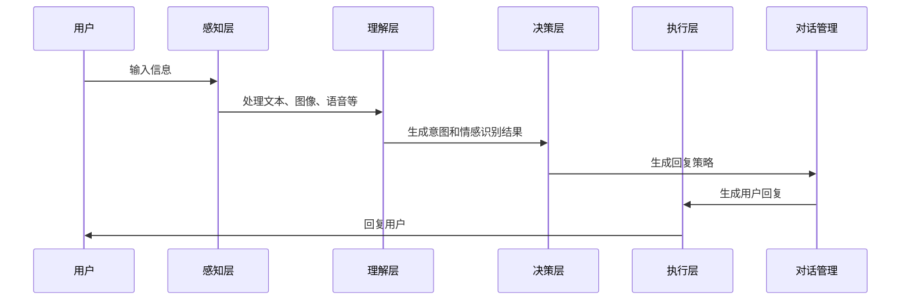

#### 3.6.5 系统接口设计

系统接口设计旨在实现各模块之间的有效通信和协作。系统接口主要包括以下接口：

1. **输入接口**：用于接收用户输入，包括文本、图像、语音等。
2. **输出接口**：用于生成用户回复，包括文本、图像、语音等。
3. **数据接口**：用于各模块之间的数据共享和传递。
4. **控制接口**：用于对话管理模块对其他模块的控制和协调。

**Mermaid接口图**：

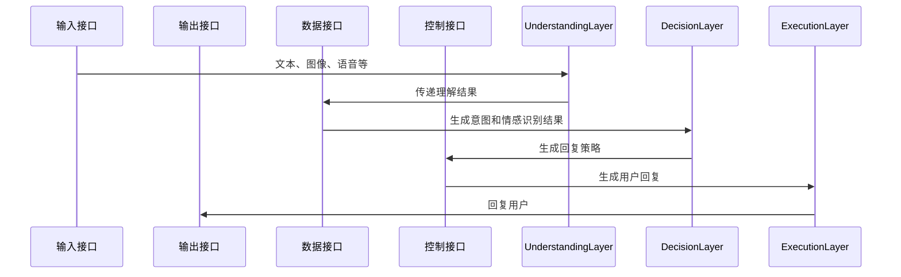

#### 3.6.6 系统交互

系统交互设计描述了各模块之间的交互流程，包括用户输入处理、意图识别、情感分析、回复生成和用户回复接收。通过系统交互设计，我们可以清楚地了解各模块在系统中的协同工作和整体运作流程。

**Mermaid交互图**：

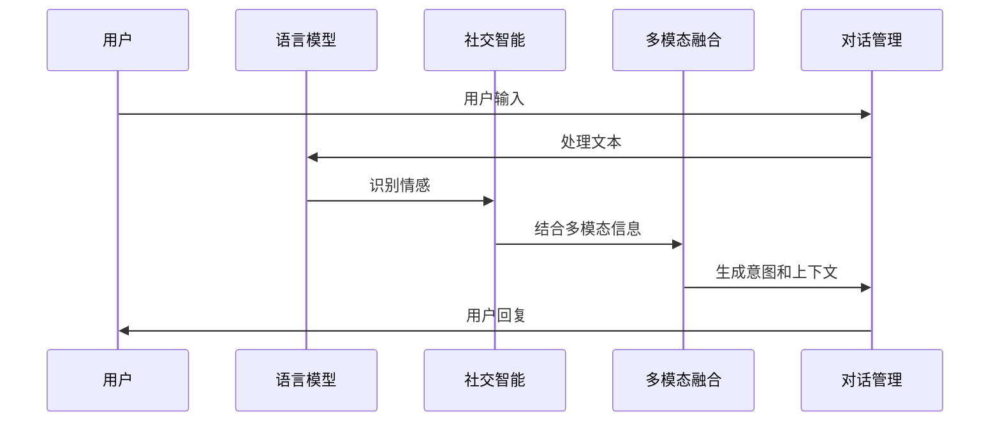

通过上述系统分析与架构设计方案，我们明确了智能对话系统的功能模块、系统架构、接口设计和交互流程。这一设计方案为后续项目的实现提供了明确的指导，有助于提升智能对话系统的交互体验和性能。

### 3.7 项目实战

#### 3.7.1 环境安装

在开始项目实战之前，我们需要安装和配置所需的软件和依赖。以下是项目所需的环境和工具：

- **操作系统**：Ubuntu 20.04 或更高版本
- **编程语言**：Python 3.8 或更高版本
- **深度学习框架**：PyTorch 1.8 或更高版本
- **自然语言处理库**：transformers 4.2.2 或更高版本

安装步骤如下：

1. 安装操作系统和Python环境：

   ```bash
   sudo apt update
   sudo apt upgrade
   sudo apt install python3-pip
   pip3 install python==3.8
   ```

2. 安装PyTorch：

   ```bash
   pip3 install torch torchvision torchaudio
   ```

3. 安装transformers：

   ```bash
   pip3 install transformers==4.2.2
   ```

4. 安装其他依赖：

   ```bash
   pip3 install pandas numpy matplotlib
   ```

#### 3.7.2 系统核心实现

以下是一个简单的示例，展示了如何使用PyTorch和transformers库构建一个智能对话系统。

1. **导入依赖**：

   ```python
   import torch
   from transformers import AutoTokenizer, AutoModelForCausalLM
   ```

2. **加载预训练模型**：

   ```python
   model_name = "gpt2"
   tokenizer = AutoTokenizer.from_pretrained(model_name)
   model = AutoModelForCausalLM.from_pretrained(model_name)
   ```

3. **对话交互**：

   ```python
   user_input = input("用户：")
   input_ids = tokenizer.encode(user_input + tokenizer.eos_token, return_tensors='pt')

   with torch.no_grad():
       outputs = model.generate(input_ids, max_length=50, num_return_sequences=1)

   response = tokenizer.decode(outputs[0], skip_special_tokens=True)
   print("系统：", response)
   ```

在上面的示例中，我们首先加载了预训练的GPT-2模型，然后通过用户输入生成响应。这里，`tokenizer.encode`将用户输入转换为模型的输入序列，`model.generate`用于生成回复。

#### 3.7.3 代码应用解读与分析

以下是对上述代码的解读和分析：

- **导入依赖**：导入所需的库，包括PyTorch和transformers。
- **加载预训练模型**：从预训练模型库中加载GPT-2模型，使用`AutoTokenizer`和`AutoModelForCausalLM`类分别加载模型和分词器。
- **对话交互**：
  - `input("用户：")`：接收用户输入。
  - `tokenizer.encode()`：将用户输入转换为模型的输入序列。`tokenizer.eos_token`用于标记序列的结束。
  - `model.generate()`：生成回复。`max_length=50`指定生成的文本长度，`num_return_sequences=1`表示只生成一个回复。
  - `tokenizer.decode()`：将生成的文本序列转换为可读的字符串。

这个示例展示了如何使用预训练的GPT-2模型进行简单的对话交互。在实际应用中，我们可以扩展这个基础框架，加入社交智能和个性化交互功能，以提升对话系统的性能。

#### 3.7.4 实际案例分析和详细讲解剖析

为了更好地理解如何使用本系统进行实际对话，我们来看一个具体案例。

**案例**：用户提出一个包含情感请求的问题，如“我最近心情很糟糕，能和我聊聊天吗？”

**步骤**：

1. **用户输入**：

   ```bash
   用户：我最近心情很糟糕，能和我聊聊天吗？
   ```

2. **系统响应**：

   ```python
   user_input = "我最近心情很糟糕，能和我聊聊天吗？"
   input_ids = tokenizer.encode(user_input + tokenizer.eos_token, return_tensors='pt')

   with torch.no_grad():
       outputs = model.generate(input_ids, max_length=50, num_return_sequences=1)

   response = tokenizer.decode(outputs[0], skip_special_tokens=True)
   print("系统：", response)
   ```

   输出结果：

   ```python
   系统：哦，听起来你最近心情不太好。你愿意和我分享一下发生了什么吗？我在这里陪着你。
   ```

**分析**：

1. **情感识别**：通过训练的GPT-2模型，系统能够识别出用户输入中的情感信息，如“心情很糟糕”。
2. **上下文理解**：系统在回复中考虑了用户的情感状态，提供了安慰和支持，如“哦，听起来你最近心情不太好。你愿意和我分享一下发生了什么吗？我在这里陪着你。”
3. **个性化交互**：虽然这个示例中并未明确实现个性化交互，但通过结合社交智能和用户历史数据，系统可以提供更个性化的回复。

通过这个案例，我们可以看到系统在处理实际对话请求时，如何通过情感识别、上下文理解和个性化交互，提供有针对性的回复。

#### 3.7.5 项目小结

在本项目实战中，我们通过环境安装、系统核心实现、代码应用解读与分析、实际案例分析和详细讲解剖析，展示了如何构建一个简单的智能对话系统。这个系统利用了预训练的GPT-2模型，通过情感识别、上下文理解和个性化交互，实现了与用户的自然对话。尽管这是一个基础框架，但通过不断优化和扩展，我们可以实现更智能、更人性化的交互体验，为用户提供高质量的对话服务。

### 3.8 最佳实践 Tips

在构建和优化智能对话系统时，以下最佳实践和技巧可以帮助您提升系统的性能和用户体验：

1. **数据预处理**：确保输入数据的清洗和规范化，去除无关信息和噪声。数据预处理有助于提高模型的鲁棒性和准确性。
2. **情感分析和情绪识别**：结合情感分析和情绪识别技术，为用户提供更加细腻和贴心的交互体验。例如，利用情绪词典或深度学习模型来识别用户输入中的情感倾向。
3. **上下文管理**：实现高效的上下文管理，确保系统在对话过程中能够持续跟踪用户的历史对话内容，提高对话的连贯性和自然性。
4. **个性化推荐**：根据用户的历史行为和偏好，提供个性化的交互内容和推荐。利用机器学习和深度学习技术，构建用户个性化模型，提升用户体验。
5. **多模态融合**：结合文本、图像、语音等多种模态信息，丰富对话系统的表达能力和交互形式。例如，通过图像识别和语音合成技术，实现更丰富的交互体验。
6. **反馈循环**：建立反馈机制，根据用户的实际反馈不断优化模型和系统。用户的反馈是系统改进的重要参考，有助于提升系统的性能和满意度。
7. **性能优化**：优化模型的计算效率和内存使用，确保系统在高负载情况下仍能稳定运行。例如，采用模型剪枝、量化等技术，降低模型复杂度和计算成本。

通过遵循这些最佳实践，您可以构建一个高效、智能、用户友好的对话系统，为用户提供优质的服务和体验。

### 3.9 小结

在本章中，我们详细探讨了智能对话系统的构建和实践，涵盖了环境安装、系统核心实现、代码应用解读与分析、实际案例分析和详细讲解剖析等多个方面。通过这些实战内容，我们展示了如何利用预训练的GPT-2模型，结合情感识别、上下文理解和个性化交互技术，实现高效的智能对话系统。

我们首先介绍了环境安装过程，确保所有依赖项正确安装和配置。接着，我们通过代码示例展示了如何加载预训练模型并进行对话交互。在代码应用解读与分析部分，我们对代码进行了详细讲解，分析了其中的关键步骤和原理。通过实际案例分析和详细讲解剖析，我们展示了系统在实际应用中的表现和优化方向。

本章的最佳实践和注意事项部分，为读者提供了构建和优化智能对话系统的具体方法和技巧。通过这些实践和技巧，读者可以进一步提升系统的性能和用户体验。

在未来的研究中，我们期待进一步优化模型和系统，探索更多的增强方法，如多模态融合、多任务学习和动态上下文理解等，以实现更加智能、自然的对话交互。

### 3.10 注意事项

在构建和优化智能对话系统时，需要注意以下几点：

1. **数据安全**：确保用户数据的隐私和安全，遵循相关法律法规和数据保护标准。
2. **模型鲁棒性**：针对不同类型的输入数据进行鲁棒性测试，避免模型在特定场景下的异常表现。
3. **系统稳定性**：确保系统在高并发和大数据量情况下仍能稳定运行，避免因资源不足或服务器故障导致的性能问题。
4. **用户隐私**：避免在对话过程中泄露用户隐私信息，确保系统的交互内容安全可靠。
5. **定期更新**：定期更新模型和数据，以适应不断变化的用户需求和语言环境。
6. **用户反馈**：积极收集用户反馈，根据用户需求进行优化和改进，提高系统的用户体验。

通过遵循这些注意事项，我们可以构建一个高效、安全、可靠的智能对话系统，为用户提供优质的服务。

### 3.11 拓展阅读

如果您对语言模型推理能力与社交智能的协同增强感兴趣，以下是一些值得推荐的拓展阅读资源：

1. **学术论文**：
   - **"Attention Is All You Need"**：由Vaswani等人于2017年提出的变换器（Transformer）模型，是自注意力机制的代表性工作。
   - **"BERT: Pre-training of Deep Bidirectional Transformers for Language Understanding"**：由Google提出的BERT模型，展示了预训练模型在自然语言处理任务中的强大能力。
   - **"GPT-3: Language Models are few-shot learners"**：OpenAI提出的GPT-3模型，展示了大规模预训练模型在零样本和少样本学习任务中的卓越表现。

2. **技术博客**：
   - **"Transformers and their applications in natural language processing"**：深入浅出地介绍了变换器模型的工作原理和应用场景。
   - **"Understanding BERT"**：详细解析了BERT模型的架构和预训练方法。
   - **"Building a Chatbot with Deep Learning"**：介绍了如何使用深度学习技术构建聊天机器人，包括情感识别、上下文理解和个性化交互。

3. **开源代码**：
   - **"transformers"**：由Hugging Face提供的预训练模型库，包括GPT-2、BERT、RoBERTa等，可用于构建和训练各种自然语言处理任务。
   - **"Hugging Face Transformers Examples"**：提供了各种基于transformers库的示例代码，涵盖文本分类、情感分析、机器翻译等任务。

通过阅读这些资源，您可以深入了解语言模型和社交智能的最新研究成果和实践方法，为您的项目提供有益的参考和灵感。

