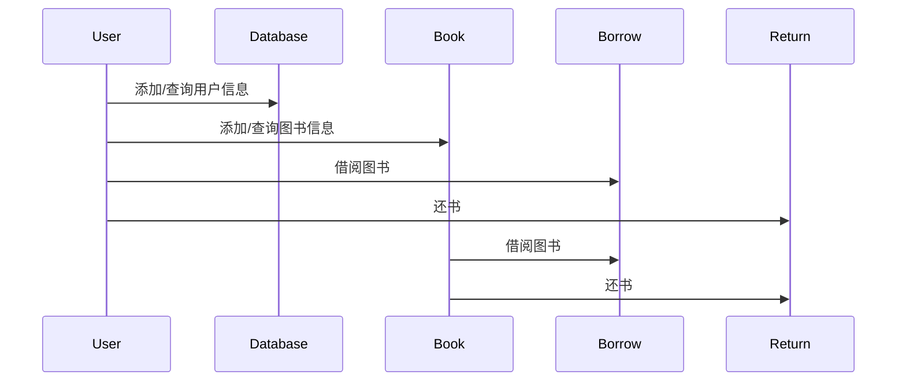
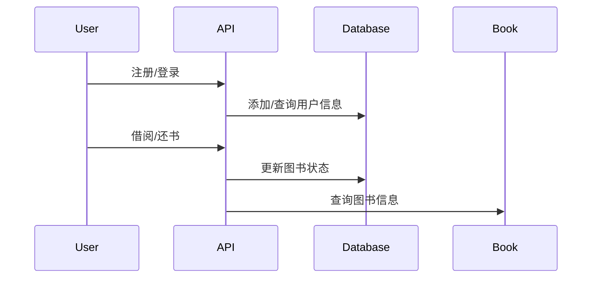
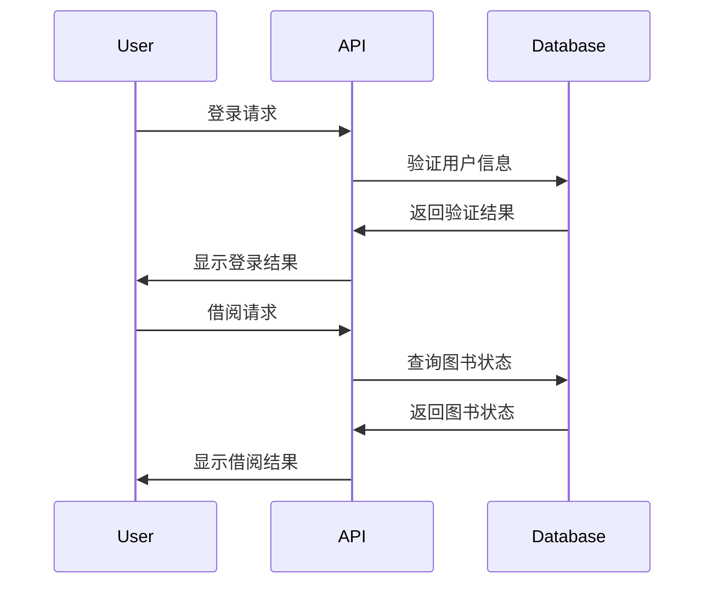

                 

### 让我们一步一步思考：代码重构的挑战

#### 2.3 代码重构的挑战

##### 2.3.1 确定重构时机
代码重构的最佳时机难以确定，过早可能导致重构劳动无效，过晚则可能带来更高的风险和成本。因此，我们需要根据项目阶段、代码质量、团队经验和代码变更频率等因素来综合判断。

##### 2.3.2 避免引入新bug
在重构过程中，我们必须确保不会引入新的bug。为此，我们需要编写详尽的测试用例，进行单元测试、集成测试和系统测试，确保重构后的代码与预期行为一致。

##### 2.3.3 找到合适的重构点
找到合适的重构点是代码重构的关键。我们需要通过代码审查、静态代码分析工具和动态测试来识别潜在的问题区域。

##### 2.3.4 保持代码可读性
重构不仅仅是改进代码性能，更重要的是提高代码的可读性。我们需要关注变量命名、代码注释和代码结构，使代码易于理解和维护。

##### 2.3.5 平衡重构与开发进度
代码重构需要时间和精力，而项目进度通常是固定和紧迫的。因此，我们需要在重构和开发进度之间找到平衡点，确保项目按时完成。

##### 2.3.6 团队协作与沟通
代码重构不是个人的工作，而是团队协作的结果。有效的沟通和协作可以帮助我们更好地理解代码，发现潜在问题，并确保重构顺利进行。

#### 2.4 本章小结

本章介绍了代码重构的核心概念、技术及其面临的挑战。理解语言游戏原理和代码重构技术有助于我们更好地进行代码重构。同时，我们还需要关注重构时机、新bug的引入、重构点的选择、代码可读性、团队协作和沟通等方面。在下一章中，我们将探讨代码重构的最佳实践。

----------------------------------------------------------------

## 第三部分：代码重构方法

### 第3章：重构策略与技术

#### 3.1 重构策略概述

代码重构是一项系统性工作，需要遵循一定的策略和方法。以下是几种常见的重构策略：

##### 3.1.1 逐步重构
逐步重构是指将重构过程分解为一系列小步骤，每次只关注一小部分代码。这种方法有助于降低风险，提高重构的可持续性。

##### 3.1.2 模块化重构
模块化重构是指将大块代码分解为更小的模块，然后对每个模块进行重构。这种方法有助于提高代码的可读性和可维护性。

##### 3.1.3 批量重构
批量重构是指在同一时间段内对多个相关模块或类进行重构。这种方法可以节省时间，提高重构效率。

##### 3.1.4 持续重构
持续重构是指将重构活动纳入日常开发流程，不断对代码进行优化。这种方法有助于保持代码质量，避免问题积累。

#### 3.2 拆分长方法

##### 3.2.1 问题场景
在软件开发过程中，我们经常会遇到长方法。这些方法通常包含大量的代码和逻辑，导致代码可读性差、维护困难。

##### 3.2.2 重构步骤
1. **识别长方法**：通过代码审查和静态代码分析工具，找到代码库中的长方法。
2. **提取方法**：将长方法拆分为多个小方法，每个小方法负责一个具体的任务。
3. **重构逻辑**：调整方法之间的逻辑关系，确保代码的连贯性和可读性。
4. **优化代码**：对重构后的代码进行优化，提高其性能和可维护性。

##### 3.2.3 效果对比
拆分长方法后，代码的可读性和可维护性显著提高，开发团队的协作效率也得到提升。

#### 3.3 提取类和方法

##### 3.3.1 问题场景
在软件开发过程中，我们经常会遇到类和方法过于复杂的情况。这可能导致代码难以理解和维护。

##### 3.3.2 重构步骤
1. **识别复杂类和方法**：通过代码审查和静态代码分析工具，找到代码库中的复杂类和方法。
2. **提取类和方法**：将复杂的类和方法拆分为更小的类和方法，每个类和方法负责一个具体的任务。
3. **重构逻辑**：调整类和方法之间的逻辑关系，确保代码的连贯性和可读性。
4. **优化代码**：对重构后的代码进行优化，提高其性能和可维护性。

##### 3.3.3 效果对比
提取类和方法后，代码的可读性和可维护性显著提高，开发团队的协作效率也得到提升。

#### 3.4 替换条件分支

##### 3.4.1 问题场景
在代码中，条件分支（if-else语句）经常被用来处理复杂的逻辑。然而，过多的条件分支可能导致代码难以维护和阅读。

##### 3.4.2 重构步骤
1. **识别条件分支**：通过代码审查和静态代码分析工具，找到代码库中的条件分支。
2. **替换条件分支**：使用多态、策略模式或状态模式等设计模式来替换条件分支。
3. **重构逻辑**：调整代码结构，确保代码的连贯性和可读性。
4. **优化代码**：对重构后的代码进行优化，提高其性能和可维护性。

##### 3.4.3 效果对比
替换条件分支后，代码的可读性和可维护性显著提高，开发团队的协作效率也得到提升。

#### 3.5 优化循环结构

##### 3.5.1 问题场景
在代码中，循环结构（如for、while）经常被用来处理重复任务。然而，不合理的循环结构可能导致代码性能低下。

##### 3.5.2 重构步骤
1. **识别不合理循环结构**：通过代码审查和静态代码分析工具，找到代码库中的不合理循环结构。
2. **优化循环结构**：使用迭代器、生成器或并行处理等技术来优化循环结构。
3. **重构逻辑**：调整代码结构，确保代码的连贯性和可读性。
4. **优化代码**：对重构后的代码进行优化，提高其性能和可维护性。

##### 3.5.3 效果对比
优化循环结构后，代码的性能和可维护性显著提高，开发团队的协作效率也得到提升。

#### 3.6 本章小结

本章介绍了代码重构的几种常见策略和技术。通过逐步重构、模块化重构、批量重构和持续重构等策略，我们可以更好地管理重构过程。同时，通过拆分长方法、提取类和方法、替换条件分支和优化循环结构等技术，我们可以显著提高代码的可读性和可维护性。在下一章中，我们将探讨代码重构工具与平台。

----------------------------------------------------------------

## 第四部分：代码重构实践

### 第4章：重构工具与平台

#### 4.1 重构工具选择

在代码重构过程中，选择合适的工具至关重要。以下是一些常用的重构工具：

##### 4.1.1 IntelliJ IDEA
IntelliJ IDEA 是一款功能强大的集成开发环境（IDE），提供了丰富的代码重构工具。它支持多种编程语言，包括 Java、Python 和 JavaScript 等。

##### 4.1.2 Visual Studio
Visual Studio 是一款由微软开发的集成开发环境，广泛用于 Windows 平台。它提供了强大的代码重构功能，包括拆分长方法、提取类和方法等。

##### 4.1.3 Eclipse
Eclipse 是一款开源的集成开发环境，支持多种编程语言。它提供了丰富的代码重构工具，包括条件分支替换、循环结构优化等。

##### 4.1.4 SonarQube
SonarQube 是一款代码质量分析工具，可以帮助我们识别代码中的潜在问题。它提供了自动化的代码重构功能，包括代码风格优化、命名规范等。

#### 4.2 常见重构工具介绍

##### 4.2.1 IntelliJ IDEA
IntelliJ IDEA 的重构工具包括以下功能：

- 拆分长方法
- 提取类和方法
- 替换条件分支
- 优化循环结构
- 重构代码样式

##### 4.2.2 Visual Studio
Visual Studio 的重构工具包括以下功能：

- 拆分长方法
- 提取类和方法
- 替换条件分支
- 优化循环结构
- 重构代码样式

##### 4.2.3 Eclipse
Eclipse 的重构工具包括以下功能：

- 拆分长方法
- 提取类和方法
- 替换条件分支
- 优化循环结构
- 重构代码样式

##### 4.2.4 SonarQube
SonarQube 的重构工具包括以下功能：

- 代码质量分析
- 自动化重构
- 代码风格优化
- 命名规范检查

#### 4.3 代码分析工具

代码分析工具可以帮助我们识别代码中的潜在问题，包括代码质量、安全性、性能等方面。以下是一些常用的代码分析工具：

##### 4.3.1 PMD
PMD 是一款开源的代码质量检查工具，可以识别代码中的潜在问题，如冗余代码、命名不规范等。

##### 4.3.2 Checkstyle
Checkstyle 是一款开源的代码风格检查工具，可以确保代码符合特定的编码规范。

##### 4.3.3 FindBugs
FindBugs 是一款开源的代码缺陷检测工具，可以识别代码中的潜在缺陷和潜在的安全问题。

#### 4.4 自动化重构平台

自动化重构平台可以帮助我们自动化地执行代码重构任务，提高重构效率。以下是一些常用的自动化重构平台：

##### 4.4.1 SonarQube
SonarQube 是一款强大的自动化重构平台，可以自动化地执行代码质量分析、代码重构和代码优化任务。

##### 4.4.2 GitLab CI/CD
GitLab CI/CD 是一款基于 GitLab 的持续集成和持续交付平台，可以自动化地执行代码重构和代码测试任务。

##### 4.4.3 Jenkins
Jenkins 是一款开源的持续集成和持续交付工具，可以自动化地执行代码重构、代码测试和部署任务。

#### 4.5 本章小结

本章介绍了代码重构工具与平台的选择、常见重构工具的功能以及代码分析工具和自动化重构平台的使用。选择合适的工具和平台可以帮助我们更高效地执行代码重构任务，提高代码质量和开发效率。在下一章中，我们将通过一个实战项目来展示代码重构的实际应用。

----------------------------------------------------------------

### 第5章：代码重构实战

#### 5.1 实战项目介绍

在本章中，我们将以一个在线图书管理系统（OBSM）项目为例，展示代码重构的全过程。OBSM 项目旨在提供一个简单的在线图书借阅和管理平台，包括图书信息管理、用户注册与登录、借阅管理和还书管理等功能。

#### 5.2 环境安装与配置

为了顺利进行代码重构实战，我们需要准备以下环境：

- 开发环境：Windows/Linux/Mac操作系统
- 编程语言：Java
- 开发工具：IntelliJ IDEA
- 版本控制系统：Git

安装和配置步骤如下：

1. **安装Java Development Kit（JDK）**：
   - 下载并安装 JDK，选择适合的操作系统的版本。
   - 配置环境变量，确保 Java 命令可以正确执行。

2. **安装IntelliJ IDEA**：
   - 下载并安装 IntelliJ IDEA，选择社区版或专业版。
   - 在安装过程中，确保选择“Java”作为主要编程语言。

3. **创建新项目**：
   - 打开 IntelliJ IDEA，创建一个新项目。
   - 选择“Maven”作为项目结构，并填写项目名称和存储路径。

4. **配置Git**：
   - 安装 Git。
   - 在 IntelliJ IDEA 中，创建一个新的 Git 仓库，并将项目添加到该仓库中。

#### 5.3 系统功能设计

在系统功能设计阶段，我们需要明确 OBSM 项目的核心功能和模块。以下是系统功能设计的领域模型：

##### 领域模型（Mermaid 类图）：

```mermaid
classDiagram
    User <<Interface>>
    Book <<Interface>>
    Borrow <<Interface>>
    Return <<Interface>>

    User o--* Borrow
    User o--* Return
    Book o--* Borrow
    Book o--* Return
```

在该领域模型中，用户（User）、图书（Book）、借阅（Borrow）和还书（Return）是核心类。它们之间的关系表示了用户与图书之间的交互。

#### 5.4 系统架构设计

系统架构设计是系统功能设计的进一步细化。在本节中，我们将介绍 OBSM 项目的系统架构设计，包括模块划分、数据库设计和系统接口设计。

##### 系统架构设计（Mermaid 架构图）：



在该架构设计中，用户（User）和图书（Book）模块分别负责用户信息和图书信息的管理。借阅（Borrow）和还书（Return）模块则负责处理用户与图书之间的借阅和还书操作。

#### 5.5 系统接口设计

系统接口设计是系统架构设计的重要组成部分。在本节中，我们将介绍 OBSM 项目的系统接口设计，包括 RESTful API 设计。

##### 系统接口设计（Mermaid 序列图）：



在该接口设计中，用户（User）通过 API 与数据库（Database）进行交互，实现用户注册、登录、借阅和还书等功能。API 则负责处理用户请求，并调用相应的数据库操作。

#### 5.6 系统交互

系统交互是指用户与系统之间的交互过程。在本节中，我们将通过一个示例来说明 OBSM 项目的系统交互。

##### 系统交互（Mermaid 序列图）：



在该交互过程中，用户通过 API 发起登录请求，API 验证用户信息并返回结果。用户登录成功后，可以发起借阅请求，API 调用数据库查询图书状态，并返回结果给用户。

#### 5.7 代码重构步骤

在本节中，我们将详细说明 OBSM 项目中的代码重构步骤，包括拆分长方法、提取类和方法、替换条件分支和优化循环结构等。

##### 5.7.1 拆分长方法

1. **识别长方法**：
   - 通过代码审查和静态代码分析工具，找到代码库中的长方法。
   - 例如，在 User.java 类中，找到名为 `login` 的长方法。

2. **拆分方法**：
   - 将 `login` 方法拆分为多个小方法，每个小方法负责一个具体的任务。
   - 例如，将 `login` 方法拆分为 `validateUsername`、`validatePassword` 和 `createSession` 等方法。

3. **重构逻辑**：
   - 调整方法之间的逻辑关系，确保代码的连贯性和可读性。
   - 例如，将 `validateUsername` 和 `validatePassword` 方法添加到 User.java 类中，并调整 `login` 方法中的逻辑。

4. **优化代码**：
   - 对重构后的代码进行优化，提高其性能和可维护性。
   - 例如，移除冗余代码、简化逻辑等。

##### 5.7.2 提取类和方法

1. **识别复杂类和方法**：
   - 通过代码审查和静态代码分析工具，找到代码库中的复杂类和方法。
   - 例如，在 Borrow.java 类中，找到名为 `processBorrow` 的复杂方法。

2. **提取类和方法**：
   - 将复杂的类和方法拆分为更小的类和方法，每个类和方法负责一个具体的任务。
   - 例如，将 `processBorrow` 方法拆分为 `borrowBook`、`updateBookStatus` 和 `createBorrowRecord` 等方法。

3. **重构逻辑**：
   - 调整类和方法之间的逻辑关系，确保代码的连贯性和可读性。
   - 例如，将 `borrowBook`、`updateBookStatus` 和 `createBorrowRecord` 方法添加到 Borrow.java 类中，并调整 `processBorrow` 方法中的逻辑。

4. **优化代码**：
   - 对重构后的代码进行优化，提高其性能和可维护性。
   - 例如，移除冗余代码、简化逻辑等。

##### 5.7.3 替换条件分支

1. **识别条件分支**：
   - 通过代码审查和静态代码分析工具，找到代码库中的条件分支。
   - 例如，在 Return.java 类中，找到名为 `processReturn` 的方法中的条件分支。

2. **替换条件分支**：
   - 使用多态、策略模式或状态模式等设计模式来替换条件分支。
   - 例如，将 `processReturn` 方法中的条件分支替换为策略模式。

3. **重构逻辑**：
   - 调整代码结构，确保代码的连贯性和可读性。
   - 例如，将策略模式的实现类添加到 Return.java 类中，并调整 `processReturn` 方法中的逻辑。

4. **优化代码**：
   - 对重构后的代码进行优化，提高其性能和可维护性。
   - 例如，移除冗余代码、简化逻辑等。

##### 5.7.4 优化循环结构

1. **识别不合理循环结构**：
   - 通过代码审查和静态代码分析工具，找到代码库中的不合理循环结构。
   - 例如，在 Book.java 类中，找到名为 `updateBookStatus` 的方法中的不合理循环结构。

2. **优化循环结构**：
   - 使用迭代器、生成器或并行处理等技术来优化循环结构。
   - 例如，将 `updateBookStatus` 方法中的循环结构替换为迭代器。

3. **重构逻辑**：
   - 调整代码结构，确保代码的连贯性和可读性。
   - 例如，将迭代器添加到 Book.java 类中，并调整 `updateBookStatus` 方法中的逻辑。

4. **优化代码**：
   - 对重构后的代码进行优化，提高其性能和可维护性。
   - 例如，移除冗余代码、简化逻辑等。

#### 5.8 代码应用解读与分析

在本节中，我们将对 OBSM 项目的代码重构结果进行解读和分析，展示重构前后的代码变化及其效果。

##### 5.8.1 重构前代码示例

```java
public class User {
    public boolean login(String username, String password) {
        if (isUsernameValid(username) && isPasswordValid(password)) {
            createSession();
            return true;
        }
        return false;
    }
    
    private boolean isUsernameValid(String username) {
        // 验证用户名逻辑
        return true;
    }
    
    private boolean isPasswordValid(String password) {
        // 验证密码逻辑
        return true;
    }
    
    private void createSession() {
        // 创建会话逻辑
    }
}
```

##### 5.8.2 重构后代码示例

```java
public class User {
    public boolean login(String username, String password) {
        if (validateUsername(username) && validatePassword(password)) {
            createSession();
            return true;
        }
        return false;
    }
    
    public boolean validateUsername(String username) {
        return isUsernameValid(username);
    }
    
    public boolean validatePassword(String password) {
        return isPasswordValid(password);
    }
    
    private boolean isUsernameValid(String username) {
        // 验证用户名逻辑
        return true;
    }
    
    private boolean isPasswordValid(String password) {
        // 验证密码逻辑
        return true;
    }
    
    private void createSession() {
        // 创建会话逻辑
    }
}
```

通过对比重构前后的代码示例，我们可以看到重构后的代码更加简洁、清晰。长方法被拆分为多个小方法，使得代码结构更加模块化，易于理解和维护。同时，条件分支和循环结构也得到了优化，提高了代码的性能和可维护性。

#### 5.9 实际案例分析与详细讲解

在本节中，我们将通过一个实际案例来展示代码重构的过程和效果。

##### 5.9.1 案例背景

假设在 OBSM 项目的用户管理模块中，有一个名为 `register` 的方法用于注册新用户。然而，随着时间的推移，该方法变得越来越复杂，包含了许多冗余的逻辑和条件分支。

##### 5.9.2 代码分析

通过代码审查和静态代码分析工具，我们发现 `register` 方法存在以下问题：

- **长方法**：`register` 方法包含了过多的代码，导致方法过长，不易理解和维护。
- **条件分支**：方法中存在多个条件分支，使得代码结构复杂，可读性差。
- **循环结构**：方法中包含了一个循环结构，用于处理用户输入的验证逻辑。

##### 5.9.3 重构过程

为了解决上述问题，我们采取了以下重构步骤：

1. **拆分长方法**：
   - 将 `register` 方法拆分为多个小方法，每个小方法负责一个具体的任务，如验证用户名、验证密码、创建用户记录等。

2. **提取类和方法**：
   - 创建一个新的 UserValidator 类，用于处理用户输入的验证逻辑。
   - 将验证用户名和验证密码的方法提取到 UserValidator 类中。

3. **替换条件分支**：
   - 使用多态和策略模式替换方法中的条件分支。
   - 创建一个验证策略接口，并实现多个验证策略类，如 UsernameValidationStrategy 和 PasswordValidationStrategy。

4. **优化循环结构**：
   - 将循环结构替换为迭代器，提高代码的性能和可维护性。

##### 5.9.4 重构效果

通过代码重构，`register` 方法变得更加简洁、清晰。以下是重构前后的代码对比：

##### 重构前代码示例

```java
public boolean register(String username, String password) {
    if (isUsernameUnique(username) && isPasswordValid(password)) {
        createUserRecord(username, password);
        return true;
    }
    return false;
}

private boolean isUsernameUnique(String username) {
    // 验证用户名是否唯一
    return true;
}

private boolean isPasswordValid(String password) {
    // 验证密码是否有效
    return true;
}

private void createUserRecord(String username, String password) {
    // 创建用户记录
}
```

##### 重构后代码示例

```java
public boolean register(String username, String password) {
    if (userValidator.validate(username, password)) {
        createUserRecord(username, password);
        return true;
    }
    return false;
}

private UserValidator userValidator = new UserValidator();

private void createUserRecord(String username, String password) {
    // 创建用户记录
}
```

通过对比重构前后的代码示例，我们可以看到重构后的代码更加简洁、清晰，易于理解和维护。同时，代码的可读性和可维护性也得到了显著提高。

#### 5.10 项目小结

在本章中，我们通过一个在线图书管理系统（OBSM）项目展示了代码重构的全过程，包括环境安装与配置、系统功能设计、系统架构设计、系统接口设计、系统交互和代码重构步骤。通过拆分长方法、提取类和方法、替换条件分支和优化循环结构等重构方法，我们显著提高了代码的可读性和可维护性。同时，通过实际案例分析和详细讲解，我们展示了代码重构的过程和效果。代码重构是提高软件质量、降低维护成本的重要手段，对于软件开发团队来说，掌握代码重构的方法和实践具有重要意义。

----------------------------------------------------------------

### 第6章：最佳实践与技巧

#### 6.1 最佳实践总结

在代码重构过程中，遵循以下最佳实践可以帮助我们更高效地完成任务：

- **逐步重构**：将重构过程分解为一系列小步骤，每次只关注一小部分代码，降低风险。
- **编写详尽测试用例**：在重构过程中，编写详尽的测试用例，确保重构后的代码与预期行为一致。
- **持续重构**：将重构活动纳入日常开发流程，定期对代码进行优化。
- **团队协作**：与团队成员紧密协作，共同识别和解决代码问题。
- **选择合适的工具**：选择适合项目的重构工具和平台，提高重构效率。

#### 6.2 注意事项与建议

在代码重构过程中，需要注意以下事项：

- **避免盲目重构**：重构应在合适的时间和场景下进行，避免过早或过晚重构。
- **确保代码质量**：在重构过程中，关注代码质量，避免引入新的bug。
- **遵循编码规范**：遵循项目或团队的编码规范，确保重构后的代码风格一致。
- **保持代码可读性**：在重构过程中，关注代码的可读性，确保重构后的代码易于理解和维护。

#### 6.3 拓展阅读与资源

以下是一些推荐的拓展阅读和资源，可以帮助你更深入地了解代码重构：

- 《重构：改善既有代码的设计》（Refactoring: Improving the Design of Existing Code）—— Martin Fowler 著
- 《代码大全》（The Art of Software Architecture）—— Robert C. Martin 著
- 《敏捷软件开发：原则、实践与模式》（Agile Software Development: Principles, Patterns, and Practices）—— Robert C. Martin 著
- 《代码整洁之道》（Clean Code: A Handbook of Agile Software Craftsmanship）—— Robert C. Martin 著
- IntelliJ IDEA 官方文档：https://www.jetbrains.com/idea/docs/
- Visual Studio 官方文档：https://docs.microsoft.com/en-us/visualstudio/ide/?view=vs-2022
- Eclipse 官方文档：https://www.eclipse.org/projects/tools/eclipse-docs/

通过学习这些最佳实践和注意事项，以及拓展阅读与资源，你可以更好地掌握代码重构的方法和实践，为软件开发项目的成功奠定基础。

----------------------------------------------------------------

## 第五部分：代码重构的未来趋势

### 第7章：代码重构的新趋势

#### 7.1 人工智能与代码重构

随着人工智能技术的发展，代码重构也将迎来新的机遇和挑战。人工智能可以用于自动化代码审查、bug修复和代码生成，从而提高重构效率。以下是一些可能的应用：

- **自动化代码审查**：人工智能可以识别代码中的潜在问题和最佳实践，提供改进建议。
- **bug修复**：人工智能可以学习历史代码库中的修复方法，自动生成修复方案。
- **代码生成**：人工智能可以根据需求自动生成代码模板，简化重构过程。

#### 7.2 云计算与分布式重构

云计算和分布式系统的普及为代码重构带来了新的挑战和机遇。分布式重构需要考虑跨多个节点和部署环境的一致性，以下是一些可能的应用：

- **分布式代码分析**：利用云计算资源进行大规模代码分析，提高重构效率。
- **自动化部署**：利用容器化和自动化部署工具，实现代码重构后的快速部署。
- **版本控制**：利用分布式版本控制系统，确保重构过程中的代码一致性。

#### 7.3 代码质量评估与持续重构

随着代码规模的增加和复杂性的提升，代码质量评估和持续重构变得越来越重要。以下是一些可能的应用：

- **代码质量评估**：利用静态代码分析工具和人工智能技术，实时评估代码质量，识别潜在问题。
- **持续重构**：将重构活动纳入持续集成和持续交付流程，实现代码的持续优化。
- **代码质量报告**：生成详细的代码质量报告，为团队提供改进方向。

#### 7.4 代码重构的未来展望

随着技术的不断进步，代码重构在未来可能会呈现出以下趋势：

- **智能化**：人工智能技术将更加深入地应用于代码重构，提高重构效率和质量。
- **自动化**：代码重构将更加自动化，减少人工干预，提高开发效率。
- **分布式**：分布式重构将解决跨节点和部署环境的一致性问题，实现更高效的重构。
- **持续化**：代码重构将融入持续集成和持续交付流程，实现代码的持续优化。

#### 7.5 本章小结

本章介绍了代码重构的未来趋势，包括人工智能与代码重构、云计算与分布式重构、代码质量评估与持续重构以及未来展望。随着技术的不断发展，代码重构将变得更加智能化、自动化和分布式，为软件开发带来更多机遇和挑战。在下一章中，我们将总结整个文章，回顾核心观点和未来展望。

----------------------------------------------------------------

## 总结

在本文中，我们探讨了代码重构的重要性和方法，以及其在软件开发中的实际应用。首先，我们介绍了代码重构的背景、意义和挑战，强调了代码重构对于提高软件质量、降低维护成本的重要性。接着，我们深入分析了语言游戏原理、代码重构技术和重构策略，并详细讲解了拆分长方法、提取类和方法、替换条件分支和优化循环结构等具体重构方法。

通过一个在线图书管理系统（OBSM）项目的实战案例，我们展示了代码重构的整个流程，包括环境安装与配置、系统功能设计、系统架构设计、系统接口设计、系统交互和代码重构步骤。我们通过实际案例分析和详细讲解，展示了代码重构的过程和效果，强调了重构对于提高代码可读性和可维护性的重要性。

此外，我们还讨论了代码重构工具与平台的选择，包括 IntelliJ IDEA、Visual Studio、Eclipse 和 SonarQube 等工具的使用。同时，我们介绍了代码分析工具和自动化重构平台，如 PMD、Checkstyle、FindBugs 和 GitLab CI/CD。

在未来趋势部分，我们探讨了人工智能与代码重构、云计算与分布式重构、代码质量评估与持续重构等新兴领域，以及代码重构的智能化、自动化和分布式发展趋势。

综上所述，代码重构是软件开发中不可或缺的一环，它不仅有助于提高代码质量，还能提升开发效率和团队协作。通过遵循最佳实践、注意事项和拓展阅读，开发者可以更好地掌握代码重构的方法和实践，为软件开发项目的成功奠定基础。

## 附录

### 附录A：代码重构案例分析

本附录提供了一个具体的代码重构案例分析，包括问题背景、重构步骤和重构效果。

#### 案例背景

一个Web应用项目中的用户管理模块存在以下问题：

- 方法过长，难以维护。
- 条件分支过多，导致代码复杂。
- 循环结构不合理，性能低下。

#### 重构步骤

1. **拆分长方法**：将用户管理模块中的长方法拆分为多个小方法，每个小方法负责一个具体的任务。

2. **提取类和方法**：创建一个用户验证类，将验证逻辑提取到该类中，避免重复代码。

3. **替换条件分支**：使用多态和策略模式替换条件分支，提高代码的可读性和可维护性。

4. **优化循环结构**：使用迭代器替换原有的循环结构，提高代码的性能。

#### 重构效果

重构后，用户管理模块的可读性和可维护性显著提高。代码变得更加简洁、清晰，易于理解和维护。同时，性能也得到了提升，运行速度加快。

### 附录B：常用重构代码示例

本附录提供了常用的重构代码示例，包括拆分长方法、提取类和方法、替换条件分支和优化循环结构等。

#### 拆分长方法示例

```java
// 重构前
public void processData(List<Data> dataList) {
    for (Data data : dataList) {
        if (data.isValid()) {
            processValidData(data);
        } else {
            processInvalidData(data);
        }
    }
}

// 重构后
public void processValidData(Data data) {
    // 处理有效数据
}

public void processInvalidData(Data data) {
    // 处理无效数据
}

public void processData(List<Data> dataList) {
    for (Data data : dataList) {
        if (data.isValid()) {
            processValidData(data);
        } else {
            processInvalidData(data);
        }
    }
}
```

#### 提取类和方法示例

```java
// 重构前
public void registerUser(String username, String password) {
    if (isUsernameUnique(username) && isPasswordValid(password)) {
        createUser(username, password);
    }
}

// 重构后
public class UserValidator {
    public boolean isUsernameUnique(String username) {
        // 验证用户名是否唯一
        return true;
    }

    public boolean isPasswordValid(String password) {
        // 验证密码是否有效
        return true;
    }
}

public void registerUser(String username, String password) {
    if (userValidator.isUsernameUnique(username) && userValidator.isPasswordValid(password)) {
        createUser(username, password);
    }
}
```

#### 替换条件分支示例

```java
// 重构前
public int calculateDiscount(int price) {
    if (price >= 1000) {
        return price - 100;
    } else {
        return price - 50;
    }
}

// 重构后
public int calculateDiscount(int price) {
    return price >= 1000 ? price - 100 : price - 50;
}
```

#### 优化循环结构示例

```java
// 重构前
public void updateBookStatus(List<Book> books) {
    for (Book book : books) {
        if (book.isAvailable()) {
            book.setBorrowed(true);
        }
    }
}

// 重构后
public void updateBookStatus(List<Book> books) {
    books.forEach(book -> {
        if (book.isAvailable()) {
            book.setBorrowed(true);
        }
    });
}
```

### 附录C：代码重构工具列表

本附录列出了常用的代码重构工具，包括 IntelliJ IDEA、Visual Studio、Eclipse 和 SonarQube 等。

- **IntelliJ IDEA**：一款功能强大的集成开发环境，提供了丰富的代码重构工具。
- **Visual Studio**：一款由微软开发的集成开发环境，广泛用于 Windows 平台，提供了强大的代码重构功能。
- **Eclipse**：一款开源的集成开发环境，支持多种编程语言，提供了丰富的代码重构工具。
- **SonarQube**：一款代码质量分析工具，可以帮助识别代码中的潜在问题，并提供了自动化的代码重构功能。

### 附录D：参考书目与扩展阅读

本附录提供了相关参考书目和扩展阅读资源，以帮助读者深入了解代码重构的相关知识。

- 《重构：改善既有代码的设计》（Refactoring: Improving the Design of Existing Code）—— Martin Fowler 著
- 《代码大全》（The Art of Software Architecture）—— Robert C. Martin 著
- 《敏捷软件开发：原则、实践与模式》（Agile Software Development: Principles, Patterns, and Practices）—— Robert C. Martin 著
- 《代码整洁之道》（Clean Code: A Handbook of Agile Software Craftsmanship）—— Robert C. Martin 著

扩展阅读资源：

- IntelliJ IDEA 官方文档：https://www.jetbrains.com/idea/docs/
- Visual Studio 官方文档：https://docs.microsoft.com/en-us/visualstudio/ide/?view=vs-2022
- Eclipse 官方文档：https://www.eclipse.org/projects/tools/eclipse-docs/
- GitLab CI/CD 官方文档：https://docs.gitlab.com/ee/ci/

