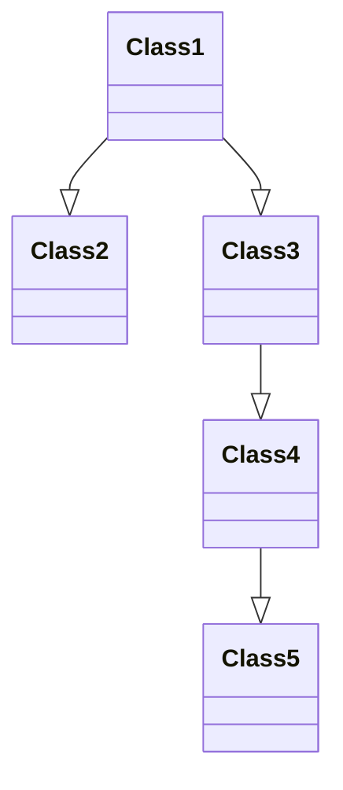
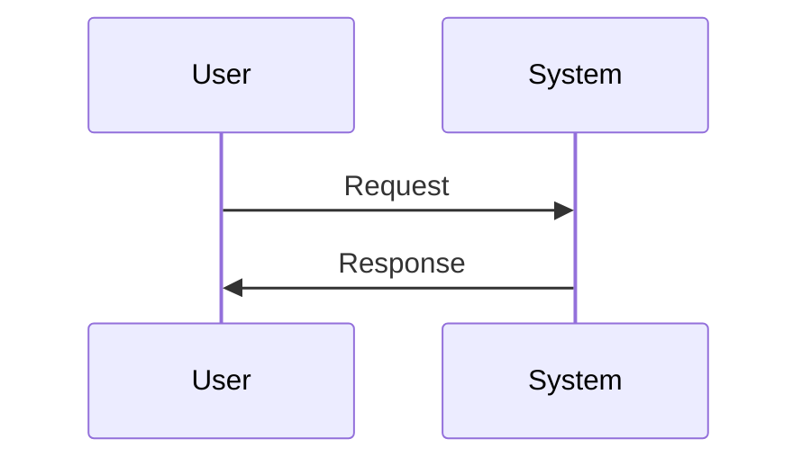
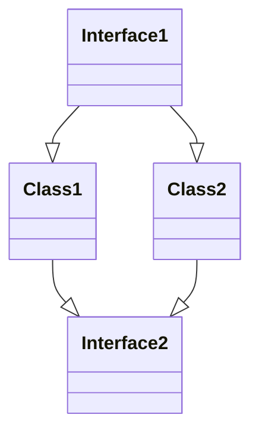

                 

# 《语言游戏与类的定义：维特根斯坦与OOP的概念构建》

## 关键词

- 维特根斯坦
- 语言游戏
- OOP
- 类
- 对象
- 封装
- 继承
- 多态

## 摘要

本文旨在探讨维特根斯坦的“语言游戏”理论与面向对象编程（OOP）之间的关系，以及如何将维特根斯坦的理论应用于类的定义。通过分析OOP的核心概念，如类、对象、封装、继承和多态，并结合维特根斯坦的理论，本文将为读者提供一个全新的视角，理解OOP在软件开发中的应用与挑战。

## 第一部分：问题背景与核心概念

### 第1章：问题背景

#### 1.1 问题提出

**语言游戏的定义：**

维特根斯坦在其著作《逻辑哲学论》中提出了“语言游戏”这一概念，旨在解释语言与现实世界的联系。语言游戏是指语言与特定情境相结合，通过游戏的形式，使语言能够表达出具体的意义。

**计算机科学中的语言游戏：**

在计算机科学中，语言游戏可以理解为编程语言与具体任务之间的互动。编程语言作为工具，通过与特定的算法和结构相结合，完成各种计算任务。

**面向对象编程（OOP）的概念：**

面向对象编程是一种编程范式，通过将现实世界中的实体抽象为类和对象，实现程序的模块化和重用性。OOP的核心概念包括类、对象、封装、继承和多态。

#### 1.2 问题描述

**维特根斯坦对语言的分析：**

维特根斯坦认为，语言的意义来源于使用场景，即语言游戏。他提出了“图像论”，认为语言与世界的对应关系类似于一幅图像与物体的对应关系。

**OOP与传统编程方法的关系：**

OOP与传统编程方法（如过程式编程）相比，具有更高的抽象层次和更好的模块化特性。OOP通过将现实世界中的实体抽象为类和对象，使编程更贴近现实世界的思维方式。

**OOP在软件开发中的应用与挑战：**

OOP在软件开发中具有广泛的应用，如提高代码的可维护性、可重用性和扩展性。然而，OOP也面临着一些挑战，如类的划分、继承关系的设计和封装性的保障。

#### 1.3 问题解决

**维特根斯坦的理论对OOP的启示：**

维特根斯坦的“语言游戏”理论为OOP提供了一种新的思考方式。通过理解语言与现实世界的对应关系，我们可以更好地构建面向对象的模型。

**OOP如何处理现实世界中的复杂问题：**

OOP通过将现实世界中的复杂问题抽象为类和对象，使问题变得更为简洁和直观。同时，OOP的封装、继承和多态特性有助于解决复杂问题的模块化和扩展性问题。

**OOP的边界与外延：**

OOP并非万能，它有一定的适用范围。在处理某些特定问题时，其他编程范式（如函数式编程）可能更为合适。

#### 1.4 概念结构与核心要素

**维特根斯坦的“语言游戏”理论：**

- 语言的意义来源于使用场景，即语言游戏。
- 语言与现实世界的对应关系类似于图像与物体的对应关系。

**OOP的核心概念：**

- 类：描述一组具有相同属性和行为的对象。
- 对象：类的实例。
- 封装：将对象内部细节隐藏起来。
- 继承：子类继承父类的属性和方法。
- 多态：允许多个对象使用同一方法。

## 第二部分：核心概念与联系

### 第2章：核心概念原理

#### 2.1 维特根斯坦的“语言游戏”理论

**理论介绍：**

维特根斯坦的“语言游戏”理论认为，语言的意义来源于使用场景。一个语言游戏由语言、规则和参与对象三部分组成。

**维特根斯坦的哲学思想与语言游戏：**

维特根斯坦认为，哲学的任务是澄清思想，而不是提出新的理论。语言游戏理论体现了他的这一思想，强调语言与现实世界的紧密联系。

**语言游戏与OOP的联系：**

OOP中的类和对象可以看作是语言游戏中的参与对象和语言。通过定义类和对象，我们可以构建出与现实世界相对应的模型。

#### 2.2 OOP的概念属性特征对比

| 概念       | 特征                         |
|------------|------------------------------|
| 类         | 描述一组具有相同属性和行为的对象 |
| 对象       | 类的实例                     |
| 封装       | 将对象内部细节隐藏起来         |
| 继承       | 子类继承父类的属性和方法       |
| 多态       | 允许多个对象使用同一方法       |

#### 2.3 ER实体关系图架构

**ER图的基本概念：**

ER图（实体关系图）是一种用于描述现实世界中的实体及其关系的图形表示方法。

**维特根斯坦理论与OOP的ER图关系：**

维特根斯坦的“语言游戏”理论可以帮助我们更好地理解ER图中的实体及其关系。通过将实体抽象为类和对象，我们可以将ER图转化为OOP模型。

**ER图在实际编程中的应用：**

ER图可以帮助我们设计数据库模式，确保数据的完整性和一致性。

## 第三部分：算法原理讲解

### 第3章：算法原理与数学模型

#### 3.1 OOP中的算法原理

**算法的定义与分类：**

算法是一系列解决问题的步骤。在OOP中，算法通常与类和对象密切相关。

**OOP中的常用算法：**

- 排序算法（如快速排序、归并排序）
- 搜索算法（如二分搜索）
- 图算法（如深度优先搜索、广度优先搜索）

**算法在软件开发中的应用：**

算法在软件开发中扮演着重要角色，如数据结构设计、算法优化、性能分析等。

#### 3.2 数学模型与公式

**算

### 第四部分：系统分析与架构设计

### 第4章：系统功能设计与架构

#### 4.1 问题场景介绍

在软件开发中，系统功能设计与架构设计是两个关键环节。通过合理的设计，可以确保系统的稳定性、性能和可扩展性。

**常见问题：**

- 功能需求的模糊性
- 架构设计的复杂性
- 模块间的依赖关系

**OOP在解决这些问题中的作用：**

OOP通过封装、继承和多态等特性，可以有效地解决功能需求的模糊性和架构设计的复杂性。同时，OOP的模块化特性有助于降低模块间的依赖关系。

#### 4.2 系统功能设计

**领域模型类图：**

领域模型类图用于描述系统中的核心实体及其关系。通过领域模型类图，可以清晰地展现系统的功能和模块划分。



**系统功能模块划分：**

系统功能模块划分是系统功能设计的重要环节。通过将功能模块化，可以降低系统的复杂度，提高可维护性和可扩展性。

#### 4.3 系统架构设计

**系统架构图：**

系统架构图用于描述系统的整体结构和模块间的交互关系。通过系统架构图，可以直观地了解系统的运行机制和关键组件。



**各模块间的交互关系：**

系统架构设计中，各模块间的交互关系至关重要。通过合理的交互设计，可以确保系统的稳定性和性能。

#### 4.4 系统接口设计与交互

**系统接口设计：**

系统接口设计是系统架构设计的重要环节。通过定义系统接口，可以明确各模块的功能和交互方式。



**系统交互序列图：**

系统交互序列图用于描述系统在不同状态下的交互过程。通过系统交互序列图，可以了解系统的运行流程和关键交互点。


## 第五部分：项目实战

### 第5章：项目实施与代码分析

#### 5.1 环境安装

在进行项目实施之前，需要搭建开发环境。以下是一个简单的环境安装流程：

1. 安装Python解释器
2. 安装相关依赖库（如requests、BeautifulSoup等）

```shell
pip install requests
pip install beautifulsoup4
```

#### 5.2 系统核心实现

以下是一个简单的系统核心实现示例：

```python
from requests import Session
from bs4 import BeautifulSoup

class WebCrawler:
    def __init__(self, url):
        self.url = url
        self.session = Session()

    def get_content(self):
        response = self.session.get(self.url)
        if response.status_code == 200:
            return response.content
        else:
            return None

    def parse_content(self, content):
        soup = BeautifulSoup(content, 'html.parser')
        # 解析网页内容
        return soup

    def run(self):
        content = self.get_content()
        if content:
            soup = self.parse_content(content)
            # 进一步处理网页内容
            pass
```

#### 5.3 实际案例分析

以下是一个实际案例分析：

**需求：** 从指定网站获取文章列表，并提取文章标题和链接。

**实现：** 通过WebCrawler类实现。

```python
if __name__ == '__main__':
    url = 'https://example.com/articles'
    crawler = WebCrawler(url)
    content = crawler.get_content()
    if content:
        soup = crawler.parse_content(content)
        # 提取文章列表
        articles = soup.find_all('article')
        for article in articles:
            title = article.find('h2').text
            link = article.find('a')['href']
            print(f'Title: {title}, Link: {link}')
```

#### 5.4 项目小结

通过以上项目实战，我们可以看到OOP在系统设计与实现中的优势。OOP的封装、继承和多态特性有助于降低系统的复杂度，提高代码的可维护性和可扩展性。同时，维特根斯坦的“语言游戏”理论为OOP提供了一种新的思考方式，帮助我们更好地理解软件开发中的问题。

## 第六部分：最佳实践与拓展

### 第6章：最佳实践与注意事项

#### 6.1 最佳实践

**OOP的最佳实践：**

1. 合理划分类和对象
2. 使用继承和组合，避免过度继承
3. 封装内部细节，提高代码的可维护性
4. 使用多态实现代码的重用性

**维特根斯坦理论的实际应用：**

1. 通过理解语言与现实世界的对应关系，更好地设计面向对象的模型
2. 利用语言游戏理论，分析软件开发的实际问题，找到解决方案

#### 6.2 小结

本文通过分析维特根斯坦的“语言游戏”理论与OOP之间的关系，探讨了类的定义及其在软件开发中的应用。同时，结合实际项目案例，展示了OOP在解决复杂问题方面的优势。在未来的软件开发过程中，我们可以借鉴这些最佳实践，提高系统的可维护性和可扩展性。

#### 6.3 注意事项

1. OOP并非万能，要结合实际需求选择合适的编程范式
2. 在类的设计中，要充分考虑类的职责和关系，避免过度设计
3. 在使用继承时，要权衡继承与组合的优缺点，避免过度继承

#### 6.4 拓展阅读

- 《维特根斯坦传：逻辑哲学论》
- 《面向对象编程：行为驱动设计》
- 《设计模式：可复用面向对象软件的基础》

---

**作者：AI天才研究院/AI Genius Institute & 禅与计算机程序设计艺术 /Zen And The Art of Computer Programming**

