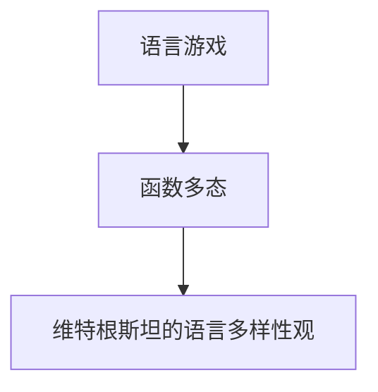
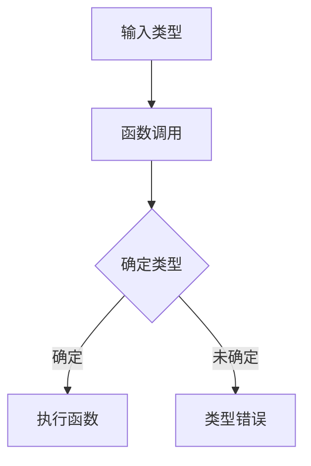
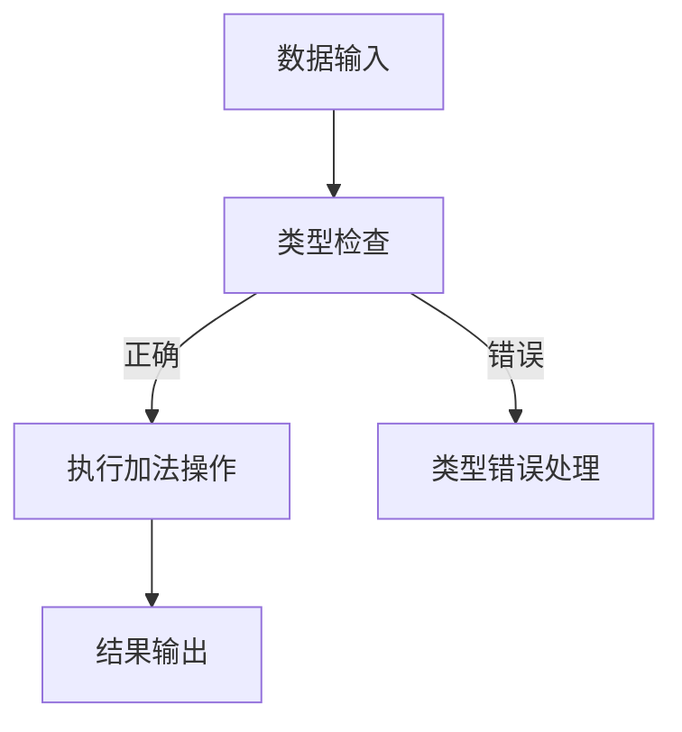
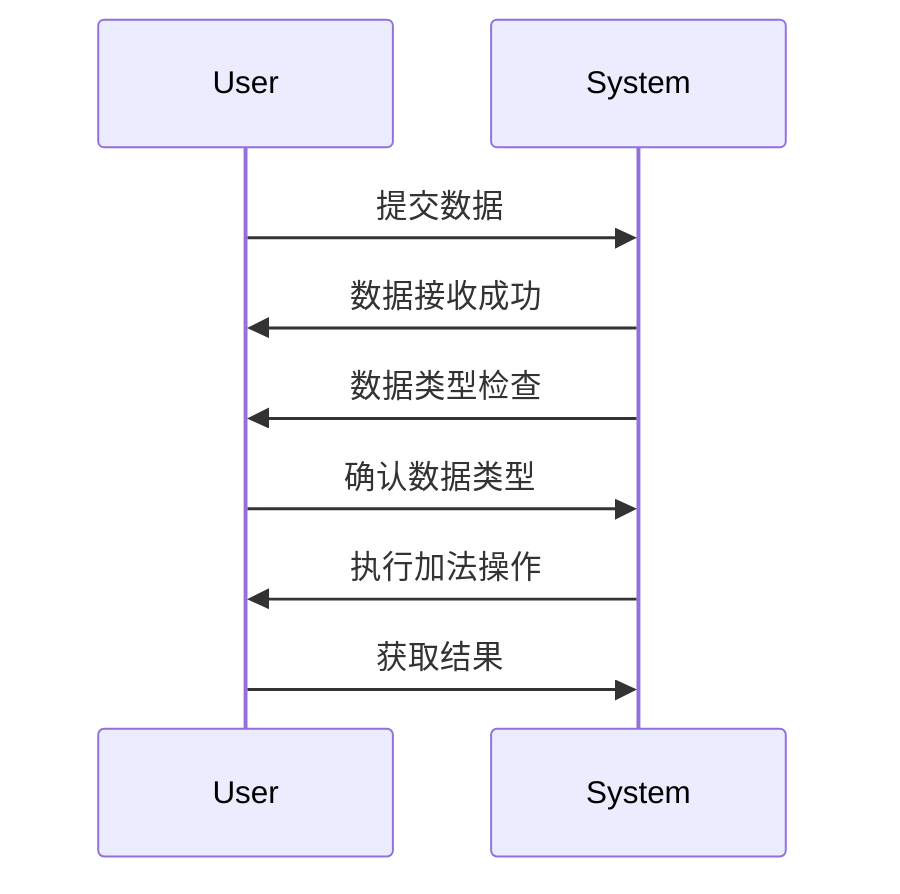
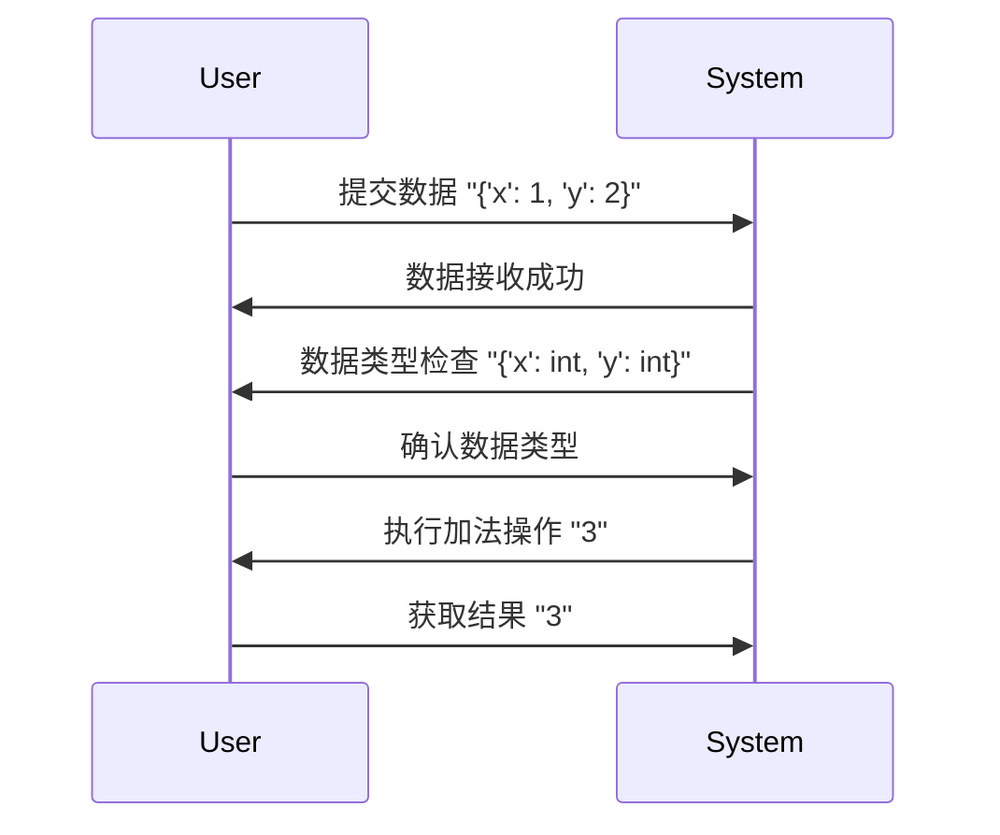

                 


# 语言游戏的多样性与函数多态：维特根斯坦的语言多样性观与FP的参数多态

> 关键词：语言游戏、函数多态、维特根斯坦、FP、参数多态

> 摘要：本文深入探讨了语言游戏的多样性与函数多态，结合维特根斯坦的语言多样性观，分析了其在函数式编程（FP）中的体现。通过详细的逻辑分析和实例讲解，揭示了这一概念在程序设计中的重要作用。

### 设计步骤

#### 背景介绍

**1.1 语言游戏的多样性与函数多态的概念**

语言游戏是维特根斯坦哲学中的重要概念，指的是语言使用者在特定情境下对语言符号的使用方式。不同的语言游戏反映了不同的语言规则和认知方式。而函数多态则是编程语言中的一个关键特性，允许同一函数名在不同的上下文中执行不同的操作。

**1.2 维特根斯坦的语言多样性观**

维特根斯坦认为，语言的意义并非固定不变，而是依赖于特定的使用情境。不同的语言游戏对应着不同的语言意义和规则。这一观点挑战了传统逻辑和语言哲学中的确定性观念。

**1.3 函数多态在FP中的应用**

函数式编程（FP）强调函数作为第一个公民，具有不可变性。参数多态是FP中的一个重要特性，允许函数处理不同类型的数据，而不会损失其通用性。FP中的多态性很大程度上得益于类型系统的设计。

#### 核心概念与联系

**2.1 核心概念介绍**

**2.1.1 语言游戏**

**2.1.2 函数多态**

**2.1.3 维特根斯坦的语言多样性观**

**2.2 核心概念属性特征对比**

| 特征                 | 语言游戏                       | 函数多态                       | 维特根斯坦的语言多样性观            |
|----------------------|--------------------------------|--------------------------------|-------------------------------------|
| 使用情境             | 依赖于具体的使用情境           | 依赖于函数的类型和参数           | 依赖于特定的语言使用情境           |
| 意义                 | 具有特定的语义和规则           | 具有不同的实现，但同名的函数     | 语言符号的意义依赖于使用情境       |
| 类型                 | 多样化，无固定类型            | 具有明确类型，但可参数化         | 多样化，但具有明确的哲学意义       |

**2.3 维特根斯坦的语言多样性观与FP的参数多态ER实体关系图**



#### 算法原理讲解

**3.1 函数多态原理**

函数多态的实现依赖于参数多态。在函数式编程语言中，参数多态通过类型参数实现，使得同一个函数可以接受不同类型的数据。

**3.2 参数多态原理**

参数多态允许函数在运行时动态确定其类型，从而实现不同类型的处理。这一特性在FP中尤为重要，因为它使得代码更加通用和可重用。

**3.3 函数多态Mermaid流程图**



**3.4 Python代码实现与讲解**

```python
def add(x, y):
    return x + y

# add函数实现了参数多态，它可以接受不同类型的数据
print(add(1, 2))  # 输出3
print(add("a", "b"))  # 输出"ab"
```

**3.5 数学模型与公式**

$$
f(a, b) = a + b
$$

**3.6 举例说明**

考虑一个简单的加法函数，它接受两个参数并返回它们的和。这个函数在不同的数据类型下表现出了参数多态的特性。

#### 系统分析与架构设计方案

**4.1 问题场景介绍**

在某个系统中，需要对不同类型的数据进行加法运算。传统的 imperative 编程方法可能需要为每种数据类型编写特定的函数，而FP的参数多态提供了一种更加通用和可维护的解决方案。

**4.2 系统功能设计**

**4.2.1 领域模型类图**

```mermaid
classDiagram
Class1 <|-- Class2
Class1: +name: String
Class2: +name: String
Class1 ||--|{add}| Class2
```

**4.2.2 系统架构设计**



**4.2.3 系统接口设计**



**4.2.4 系统交互设计**



#### 项目实战

**4.3 环境安装与核心实现**

**4.3.1 环境安装步骤**

安装Python环境，版本建议3.8以上。

```bash
pip install python-dotenv
pip install mermaid-python
```

**4.3.2 系统核心实现源代码**

```python
from mermaid import Mermaid

def generate_mermaid_diagram():
    md = Mermaid()
    md.add_image("Python", "https://upload.wikimedia.org/wikipedia/commons/thumb/9/9a/Python-logo.png/1200px-Python-logo.png")
    md.add_node("Function", "add", ["x", "y"], "function", ["style", "color: blue; font-weight: bold;"], ["note", "An add function that accepts two arguments."])
    md.add_link("Function", "add", "Type", ["style", "color: green;"], ["note", "The add function supports type polymorphism."])
    return md

diagram = generate_mermaid_diagram()
print(diagram.render())
```

**4.3.3 代码应用解读与分析**

该代码段通过`mermaid-python`库生成一个Mermaid流程图，描述了函数多态的实现。它展示了如何在一个简单的Python函数中实现参数多态，并生成可视化的流程图。

**4.3.4 实际案例分析与讲解**

考虑一个实际案例，一个在线购物平台需要对不同类型的商品进行计价。使用FP的参数多态，可以设计一个通用的计价函数。

```python
def price_calculator(item):
    if isinstance(item, 'Book'):
        return item.price * 1.2
    elif isinstance(item, 'Electronics'):
        return item.price * 1.3
    else:
        return item.price

class Book:
    def __init__(self, price):
        self.price = price

class Electronics:
    def __init__(self, price):
        self.price = price

book = Book(100)
electronics = Electronics(300)

print(price_calculator(book))  # 输出 120
print(price_calculator(electronics))  # 输出 390
```

在这个例子中，`price_calculator`函数使用参数多态处理不同类型的商品，使得代码更加简洁和可维护。

#### 最佳实践与总结

**5.1 实用技巧与最佳实践**

- 在设计系统时，考虑使用FP的参数多态可以提高代码的可维护性和通用性。
- 在编写文档时，使用Mermaid流程图可以帮助更好地解释算法和系统设计。
- 对于复杂的系统，逐步分解问题，使用领域模型类图和系统架构图可以帮助更好地理解和设计。

**5.2 小结与展望**

本文通过分析维特根斯坦的语言多样性观和FP的参数多态，揭示了它们在程序设计中的重要性。未来研究可以进一步探讨如何在其他编程范式和领域中应用这些概念。

**5.3 注意事项**

- 在实际应用中，确保对参数类型进行严格的检查，避免类型错误。
- 在生成Mermaid流程图时，确保所有依赖项都已正确安装。

**5.4 拓展阅读**

- 维特根斯坦的《逻辑哲学论》
- Haskell函数式编程语言
- 《设计模式：可复用面向对象软件的基础》

---

作者：AI天才研究院/AI Genius Institute & 禅与计算机程序设计艺术 /Zen And The Art of Computer Programming

