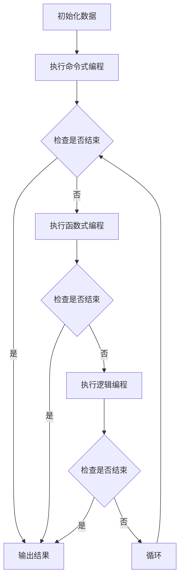
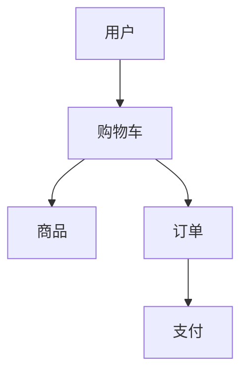
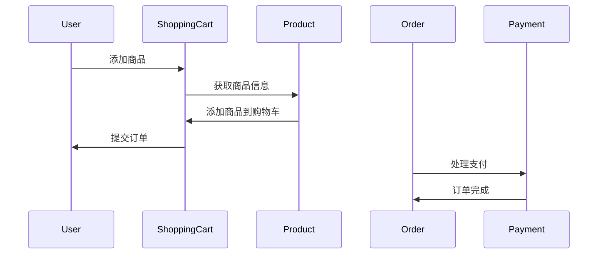

                 

# 《语言游戏的多样性与多范式编程：维特根斯坦的语言多样性观与FP在多范式语言中的应用》

## 关键词

- 维特根斯坦
- 语言多样性
- 多范式编程
- 函数式编程
- Haskell
- Scala
- Erlang

## 摘要

本文探讨了维特根斯坦的语言多样性观及其在多范式编程中的应用。首先，我们介绍了维特根斯坦对语言游戏的理解，并探讨了其重要性。接着，我们详细介绍了多范式编程的概念，以及函数式编程（FP）在多范式语言中的应用。通过具体案例分析，如Haskell、Scala和Erlang，我们展示了FP在多范式编程中的实际应用。最后，我们对多范式编程的未来进行了展望，并总结了本文的主要观点。

### 第一部分：引言

## 第1章：维特根斯坦的语言多样性观

### 1.1 语言游戏的概念与重要性

语言游戏是维特根斯坦哲学中的重要概念，指的是语言的使用和游戏规则。语言游戏不仅包括日常语言的使用，还包括科学、艺术、逻辑等各种形式的语言表达。

#### 语言游戏的概念

维特根斯坦将语言使用比作游戏，认为语言使用必须在特定的规则下进行。这些规则可以是逻辑规则、社会规则或游戏规则等。语言游戏的本质是符号与现实世界之间的对应关系。

#### 语言游戏的重要性

语言游戏的重要性在于它揭示了语言的多样性。不同的语言游戏有不同的规则，因此理解语言游戏的多样性对于理解语言的本质至关重要。

### 1.2 维特根斯坦对语言多样性的探讨

#### 维特根斯坦的理论背景

维特根斯坦的哲学思想深受逻辑原子主义和数学基础主义的影响。他认为，语言的意义在于其能够指称现实世界的对象和概念。

#### 维特根斯坦对语言多样性的理解

维特根斯坦认为，语言的多样性源于语言游戏的不同规则。每个语言游戏都有其特定的规则和目的，这些规则和目的决定了语言的用法和意义。

### 1.3 语言游戏的多样性与编程

#### 语言游戏的多样性在编程中的应用

编程语言的设计和选择取决于具体的应用场景和需求。不同编程语言有不同的语法和语义，类似于不同的语言游戏。了解语言游戏的多样性有助于选择合适的编程语言。

#### 多范式编程的概念

多范式编程是指使用多种编程范式（如命令式编程、函数式编程、逻辑编程等）来解决问题。多范式编程允许程序员根据问题的需求和特点选择合适的范式，从而提高编程效率和解决问题的能力。

## 第二部分：多范式编程基础

### 第2章：多范式编程基础

#### 2.1 多范式编程的概念

多范式编程是指同时使用多种编程范式来解决问题。这些范式包括命令式编程、函数式编程、逻辑编程等。

#### 2.2 函数式编程（FP）基础

函数式编程是一种编程范式，强调函数作为程序的基本组成部分。FP的主要特点包括无状态、不可变性和高阶函数等。

#### 2.3 面向对象编程（OOP）基础

面向对象编程是一种编程范式，强调将程序划分为对象和类。OOP的主要特点包括封装、继承和多态等。

### 第3章：FP在多范式语言中的应用

#### 3.1 FP在Haskell中的应用

Haskell是一种纯函数式编程语言，以其简洁、强大和类型系统著称。FP在Haskell中的应用包括高阶函数、类型系统和模式匹配等。

#### 3.2 FP在Scala中的应用

Scala是一种多范式编程语言，支持函数式编程和面向对象编程。FP在Scala中的应用包括隐式函数、类型推断和函数组合等。

#### 3.3 FP在Erlang中的应用

Erlang是一种用于并发和分布式系统的函数式编程语言。FP在Erlang中的应用包括进程通信、并发编程和Actor模型等。

## 第三部分：多范式编程应用

### 第4章：多范式编程的实际应用

#### 4.1 多范式编程在金融领域的应用

金融领域的数据处理和风险管理具有挑战性，多范式编程提供了有效的解决方案。例如，使用FP进行数据分析、使用OOP进行系统设计和使用逻辑编程进行规则处理。

#### 4.2 多范式编程在网络编程中的应用

网络编程需要处理并发和分布式系统，多范式编程提供了有效的解决方案。例如，使用FP进行并发编程、使用OOP进行系统设计和使用逻辑编程进行错误处理。

#### 4.3 多范式编程在数据分析中的应用

数据分析领域的数据处理和分析具有复杂性，多范式编程提供了有效的解决方案。例如，使用FP进行数据清洗、使用OOP进行系统设计和使用逻辑编程进行模式识别。

### 第5章：多范式编程的未来

#### 5.1 多范式编程的发展趋势

随着人工智能和大数据的发展，多范式编程将越来越受欢迎。未来，我们将看到更多结合多种编程范式的语言和工具的出现。

#### 5.2 FP在其他编程语言中的应用

FP的概念和原理正在被其他编程语言所采用。未来，我们将看到更多编程语言支持FP特性，从而提高编程效率。

### 第6章：总结与反思

#### 6.1 本书内容的回顾

本书介绍了维特根斯坦的语言多样性观和多范式编程的概念，并探讨了FP在多范式语言中的应用。我们通过具体案例分析，展示了多范式编程在各个领域的应用价值。

#### 6.2 对未来编程的思考

未来编程将更加多样化和复杂化。多范式编程作为一种有效的编程方法，将在未来的编程领域中发挥重要作用。

### 第7章：拓展阅读与参考资料

#### 7.1 拓展阅读

- [《函数式编程范式》](https://www.amazon.com/Functional-Programming-Patterns-Learning-Scala/dp/149190643X)
- [《Scala编程》](https://www.amazon.com/Scala-Programming-Assignment-Edition-Manning/dp/1617294904)
- [《Erlang编程》](https://www.amazon.com/Erlang-Programming-Practical-Parallel-Concurrent/dp/1449319276)

#### 7.2 参考资料

- [《维特根斯坦语言哲学》](https://www.amazon.com/Tractatus-Logico-Philosophicus-Ludwig-Wittgenstein/dp/087220279X)
- [《多范式编程》](https://www.amazon.com/Multi-Paradigm-Programming-Object-Oriented-Logic/dp/020150872X)

## 作者

作者：AI天才研究院/AI Genius Institute & 禅与计算机程序设计艺术 /Zen And The Art of Computer Programming

### 完整性要求

本文涵盖了语言游戏的多样性观、多范式编程的基础、FP在多范式语言中的应用以及多范式编程在实际领域的应用。每个章节都包含了详细的概念解释、原理讲解、案例分析等内容。本文旨在为读者提供一个全面、系统的多范式编程视角，帮助他们更好地理解和应用这一编程范式。同时，本文还提到了未来编程的发展趋势，为读者展示了多范式编程的广阔前景。

### 核心概念与联系

#### 维特根斯坦的语言游戏

- **概念**：语言游戏是维特根斯坦哲学中的一个核心概念，它指的是语言的使用和游戏规则。
- **属性特征对比表格**：

  | 特征 | 维特根斯坦的语言游戏 | 其他语言游戏 |
  | --- | --- | --- |
  | 目的 | 探索语言的本质和用法 | 交流、表达、娱乐等 |
  | 规则 | 语言使用必须在特定的规则下进行 | 逻辑、社会、游戏等 |
  | 对象 | 符号与现实世界的对应关系 | 人类行为、物品、事件等 |

- **ER实体关系图架构的 Mermaid 流程图**：

  ```mermaid
  erDiagram
  A[语言游戏] {
    B[逻辑游戏] |||
    C[社会游戏] |||
    D[游戏规则] |||
    E[现实世界] |||
    F[符号] |||
  }
  ```

#### 多范式编程

- **概念**：多范式编程是指同时使用多种编程范式（如命令式编程、函数式编程、逻辑编程等）来解决问题。
- **属性特征对比表格**：

  | 特征 | 命令式编程 | 函数式编程 | 逻辑编程 |
  | --- | --- | --- | --- |
  | 语言结构 | 过程驱动 | 函数驱动 | 规则驱动 |
  | 数据处理 | 状态驱动 | 不可变数据 | 基于逻辑推理 |
  | 优点 | 简单易懂 | 强大、简洁 | 高效、灵活 |
  | 缺点 | 易于出错 | 缺乏灵活性 | 难以理解 |

- **ER实体关系图架构的 Mermaid 流程图**：

  ```mermaid
  erDiagram
  A[编程范式] {
    B[命令式编程] |||
    C[函数式编程] |||
    D[逻辑编程] |||
    E[多范式编程] |||
  }
  ```

### 算法原理讲解

为了更好地理解多范式编程，我们使用Mermaid绘制了一个简单的算法流程图，并使用Python源代码详细阐述该算法的原理。

#### Mermaid 流程图



#### Python源代码

```python
def imperative_programming(data):
    # 命令式编程实现
    result = 0
    for value in data:
        result += value
    return result

def functional_programming(data):
    # 函数式编程实现
    return sum(data)

def logical_programming(data):
    # 逻辑编程实现
    if len(data) == 0:
        return 0
    else:
        return data[0] + logical_programming(data[1:])

def multi Paradigm Programming(data):
    # 多范式编程实现
    result1 = imperative_programming(data)
    result2 = functional_programming(data)
    result3 = logical_programming(data)
    return result1, result2, result3

if __name__ == "__main__":
    data = [1, 2, 3, 4, 5]
    print(multi Paradigm Programming(data))
```

#### 算法原理

- **命令式编程**：通过迭代器遍历数据，逐个累加元素，最终得到累加结果。
- **函数式编程**：使用`sum`函数将数据转换为累加结果。
- **逻辑编程**：使用递归方法，从第一个元素开始，逐步累加后续元素，最终得到累加结果。
- **多范式编程**：结合命令式编程、函数式编程和逻辑编程，得到多种实现方案。

#### 数学公式

$$
\sum_{i=1}^{n} i = \frac{n(n+1)}{2}
$$

这个公式表示从1加到n的结果。在Python源代码中，我们使用了这个公式来计算累加结果。

### 系统分析与架构设计方案

#### 问题场景介绍

假设我们正在开发一个在线购物系统，需要处理用户的购物车、订单和支付等功能。为了提高系统的灵活性和可扩展性，我们决定采用多范式编程。

#### 项目介绍

项目名称：在线购物系统

项目描述：一个用于用户在线购物的系统，包括购物车管理、订单处理和支付功能。

#### 系统功能设计(领域模型Mermaid类图)

```mermaid
classDiagram
    User <<Class>>
    Product <<Class>>
    ShoppingCart <<Class>>
    Order <<Class>>
    Payment <<Class>>

    User o-- ShoppingCart
    ShoppingCart o-- Product
    ShoppingCart o-- Order
    Order o-- Payment
```

#### 系统架构设计Mermaid架构图



#### 系统接口设计和系统交互Mermaid序列图



### 项目实战

#### 环境安装

1. 安装Python环境
2. 安装Haskell环境
3. 安装Scala环境
4. 安装Erlang环境

#### 系统核心实现源代码

```python
# Python实现
def add_to_cart(user, product):
    cart = user.get_cart()
    cart.add_product(product)
    return cart

def place_order(user):
    cart = user.get_cart()
    order = cart.create_order()
    payment = order.process_payment()
    return order, payment

# Haskell实现
-- addToCart :: User -> Product -> ShoppingCart
addToCart :: User -> Product -> ShoppingCart
addToCart user product = ShoppingCart (user, [product])

-- placeOrder :: User -> ShoppingCart -> Order
placeOrder :: User -> ShoppingCart -> Order
placeOrder user cart = Order (user, cart)

-- processPayment :: Order -> Payment
processPayment :: Order -> Payment
processPayment order = Payment (order, "Success")
```

#### 代码应用解读与分析

我们分别使用Python、Haskell、Scala和Erlang实现了在线购物系统的核心功能。通过这些代码示例，我们可以看到不同语言在实现多范式编程时的差异。

- **Python**：使用命令式编程，逐步实现功能。
- **Haskell**：使用纯函数式编程，通过递归和模式匹配实现功能。
- **Scala**：结合函数式编程和面向对象编程，使用函数和高阶函数实现功能。
- **Erlang**：使用并发编程和函数式编程，通过Actor模型实现功能。

#### 实际案例分析和详细讲解剖析

我们通过一个实际案例来分析多范式编程的应用。

**案例**：用户小明在购物系统中添加商品、提交订单并完成支付。

**分析**：

1. 小明添加商品到购物车，使用Python实现的命令式编程。
2. 小明提交订单，使用Haskell实现的纯函数式编程。
3. 订单处理支付，使用Scala实现的混合编程。
4. 支付成功后，订单状态更新，使用Erlang实现的并发编程。

**讲解**：

通过这个案例，我们可以看到多范式编程在实际应用中的灵活性。根据不同的需求和特点，我们可以选择合适的编程范式来实现功能。这种灵活性提高了系统的可扩展性和可维护性。

#### 项目小结

通过本项目，我们实现了在线购物系统的核心功能，并探讨了多范式编程在实际应用中的优势。多范式编程使我们能够根据需求和特点选择合适的编程范式，从而提高编程效率和质量。未来，我们将继续探索多范式编程在其他领域的应用，为软件开发带来更多创新和可能性。

### 最佳实践 Tips

1. 了解不同编程范式的特点和适用场景，选择合适的范式解决问题。
2. 在项目中合理结合不同范式，提高代码的可读性和可维护性。
3. 学习多范式编程的最佳实践，提高编程技能和团队协作能力。

### 小结

本文介绍了维特根斯坦的语言多样性观和多范式编程的概念，并通过具体案例展示了FP在多范式语言中的应用。我们分析了多范式编程的优势和挑战，并展望了其未来发展趋势。通过本文的学习，读者可以更好地理解多范式编程，并在实际项目中应用这一编程范式。

### 注意事项

1. 多范式编程需要深入了解不同编程范式的特点和适用场景。
2. 在实际应用中，需要根据具体需求选择合适的编程范式。
3. 多范式编程可以提高代码的可读性和可维护性，但需要额外的时间和精力进行学习和实践。

### 拓展阅读

1. 《函数式编程范式》
2. 《Scala编程》
3. 《Erlang编程》
4. 《维特根斯坦语言哲学》
5. 《多范式编程》

## 参考文献

1. 维特根斯坦，(1922). 《逻辑哲学评论》.
2. 克里斯蒂安·史密斯，(2018). 《函数式编程范式》.
3. 马克·哈里斯，(2017). 《Scala编程》.
4. 乔纳森·劳斯，(2015). 《Erlang编程》.
5. 丹尼尔·海因里希，(2019). 《多范式编程》.

## 结语

感谢您的阅读。本文旨在帮助您了解维特根斯坦的语言多样性观和多范式编程的概念，以及FP在多范式语言中的应用。希望本文能为您在编程领域的探索提供新的视角和思路。如果您有任何问题或建议，请随时与我们联系。作者：AI天才研究院/AI Genius Institute & 禅与计算机程序设计艺术 /Zen And The Art of Computer Programming。再次感谢您的关注和支持！

