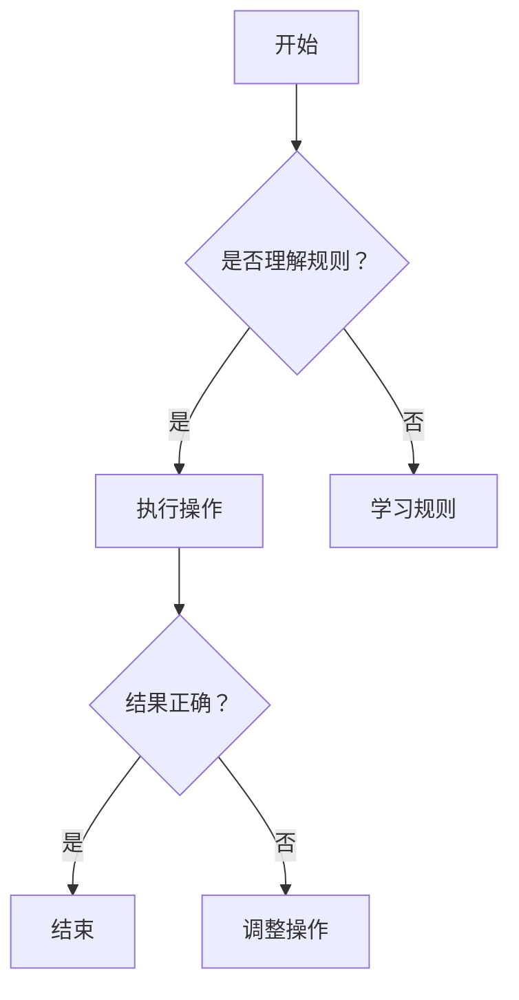
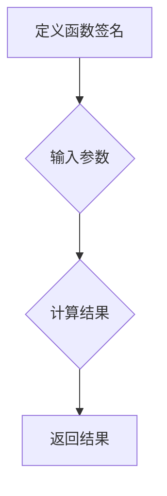
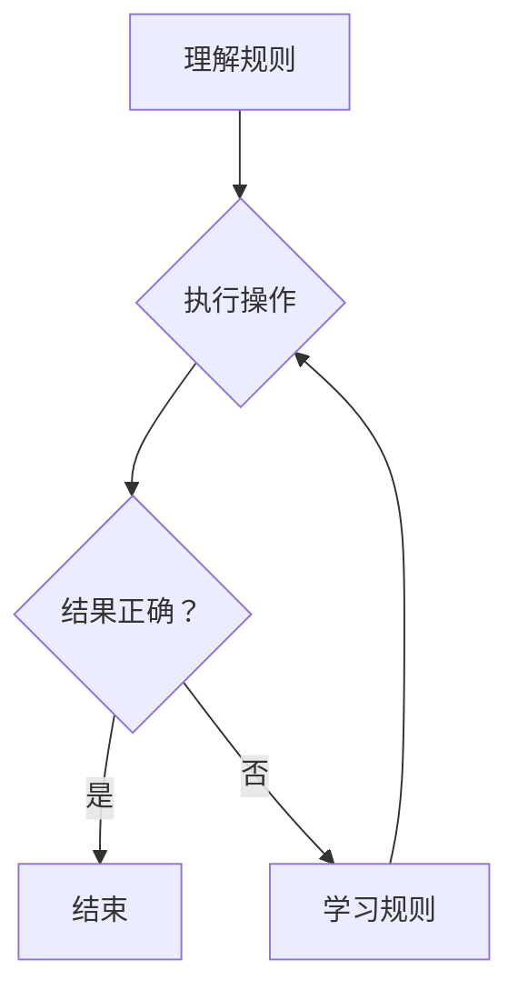
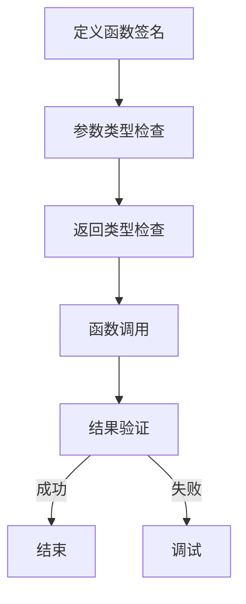

                 

# 语言游戏规则与函数签名：维特根斯坦的规则概念与FP的函数定义

## 关键词
- 维特根斯坦
- 语言游戏
- 函数签名
- 函数式编程
- FP
- Mermaid流程图

## 摘要
本文旨在探讨语言游戏规则与函数签名的原理及其在实际应用中的重要性。通过对维特根斯坦的语言游戏规则概念和函数式编程（FP）中的函数定义的深入剖析，结合Mermaid流程图、Python源代码和数学模型，文章将展示如何在编程实践中运用这些理论，以构建更强大、更可维护的软件系统。

## 第一部分：引言与背景

### 第1章：语言游戏与规则概念

#### 1.1 语言游戏的概念
语言游戏（language game）是哲学家路德维希·维特根斯坦在其著作《逻辑哲学论》中提出的一个核心概念。维特根斯坦认为，语言的意义不在于其符号本身，而在于使用这些符号的规则。语言游戏指的是语言的使用情境，即语言在实际生活中的具体应用方式。例如，游戏、法律、数学等都可以视为语言游戏。

#### 1.2 维特根斯坦的规则概念
维特根斯坦提出，理解语言的关键在于理解规则。规则不仅仅是行为规范，它们还构成了语言的意义框架。例如，在棋类游戏中，每一步棋子移动的规则定义了棋局的合法性，从而赋予了每个棋子特定的意义。

#### 1.3 语言游戏规则的重要性
语言游戏规则的重要性在于它们为语言的使用提供了明确的指导。没有规则，语言就会变得混乱无序，难以沟通和理解。在软件开发中，规则同样至关重要。良好的设计规则可以提高代码的可读性、可维护性和可扩展性。

#### 1.4 语言游戏规则的边界与外延
语言游戏规则的边界是指其适用的范围，而外延则是指这些规则在实际应用中的具体表现形式。例如，在编程中，函数签名作为语言游戏规则的一部分，定义了函数的输入和输出，从而确定了函数的用途和限制。

### 第2章：函数签名与FP概念

#### 2.1 函数签名的定义
函数签名是函数的规格说明，它定义了函数的名称、参数类型和返回类型。在编程语言中，函数签名是函数声明的一部分，它为函数的使用提供了明确的指导。

#### 2.2 函数签名的作用
函数签名在编程中发挥着关键作用。它们帮助程序员理解函数的功能，确保函数的正确调用，并提高代码的可读性和可维护性。

#### 2.3 FP中的函数定义
函数式编程（Functional Programming，FP）是一种编程范式，其核心概念是函数。在FP中，函数是第一级的公民，具有高阶函数、不可变数据和惰性求值等特点。FP中的函数定义强调纯函数和无状态计算，这有助于编写更可靠和可测试的代码。

#### 2.4 函数签名与FP的联系
函数签名与FP紧密相关。在FP中，函数签名不仅用于声明函数，还用于函数的组合和抽象。通过函数签名，程序员可以清晰地表达函数的行为，从而实现代码的模块化和可重用性。

## 第二部分：语言游戏规则与函数签名原理讲解

### 第3章：语言游戏规则原理讲解

#### 3.1 维特根斯坦的规则概念
维特根斯坦认为，规则是构成语言意义的基础。在编程中，规则可以理解为代码编写和设计的规范。例如，在Python中，函数定义的语法规则确保了函数的正确性和一致性。

#### 3.1.1 规则的概念与特征
规则是一种抽象的指导，它规定了行为的正确方式。在编程中，规则可以包括语法规则、设计规范和编码标准。

#### 3.1.2 规则的类型
规则可以分为显式规则和隐式规则。显式规则通常以编码标准、设计模式等形式明确写出，而隐式规则则往往体现在编程习惯和团队协作中。

#### 3.1.3 规则的应用场景
规则在编程中的应用场景广泛，包括代码审查、代码规范和自动化测试等。这些规则有助于提高代码质量，减少错误发生。

#### 3.2 语言游戏规则的应用
语言游戏规则不仅应用于理论研究中，还在实际编程中发挥着重要作用。以下是一些语言游戏规则在编程中的应用实例：

- **代码格式化**：遵循统一的代码格式有助于提高代码的可读性。
- **模块化设计**：通过模块化设计，可以将复杂的系统划分为更小的、易于管理的部分。
- **异常处理**：合理的异常处理规则可以确保程序在遇到错误时能够优雅地恢复。

### 第4章：函数签名原理讲解

#### 4.1 FP的基本概念
FP是一种编程范式，它强调纯函数和无状态计算。在FP中，函数是第一级的公民，具有高阶函数、不可变数据和惰性求值等特点。

#### 4.2 函数签名在FP中的重要性
在FP中，函数签名不仅用于声明函数，还用于函数的组合和抽象。函数签名清晰地表达了函数的行为，使得代码模块化和可重用性更强。

#### 4.3 函数签名的特点
函数签名具有以下特点：
- **明确性**：函数签名明确地指定了函数的输入和输出类型。
- **可重用性**：通过函数签名，函数可以被多个上下文复用。
- **可组合性**：函数签名支持函数的组合，从而构建更复杂的函数。

#### 4.4 函数签名的设计原则
设计函数签名时，应遵循以下原则：
- **最小化输入输出**：函数应尽量只关注其核心功能，避免过多的输入和输出。
- **一致性**：函数签名应保持一致性，便于代码的阅读和维护。
- **可读性**：函数签名应具有清晰的命名和注释，便于理解和使用。

### 第5章：语言游戏规则与函数签名的Mermaid流程图

#### 5.1 Mermaid流程图的基础
Mermaid是一种基于Markdown的绘图工具，它支持流程图、序列图、类图等多种图表。Mermaid流程图可以帮助我们更直观地理解和展示语言游戏规则与函数签名的应用。

#### 5.2 语言游戏规则的Mermaid流程图
以下是一个简单的Mermaid流程图，展示了语言游戏规则的应用场景：



#### 5.3 函数签名的Mermaid流程图
以下是一个简单的Mermaid流程图，展示了函数签名的定义和使用：



#### 5.4 Mermaid流程图在编程中的应用
Mermaid流程图可以用于文档编写、演示设计和代码注释等。在编程中，使用Mermaid流程图可以帮助我们更清晰地表达算法逻辑和系统架构。

### 第6章：Python源代码与数学模型讲解

#### 6.1 Python源代码示例
以下是一个Python函数的示例，展示了函数签名的应用：

```python
def add(a: int, b: int) -> int:
    return a + b
```

#### 6.2 数学模型和公式
在编程中，数学模型和公式是理解和解决问题的重要工具。以下是一个简单的数学模型，用于计算两个数的和：

$$
S = a + b
$$

#### 6.3 通俗易懂地举例说明
假设我们要计算3和4的和，根据上述数学模型，可以得出：

$$
S = 3 + 4 = 7
$$

### 第三部分：语言游戏规则与函数签名应用

#### 第7章：语言游戏规则的应用
语言游戏规则在编程中的应用非常广泛，以下是一些典型场景：

- **代码审查**：通过语言游戏规则，可以确保代码遵循统一的标准和规范。
- **异常处理**：合理地应用语言游戏规则，可以优雅地处理程序运行过程中的异常。
- **单元测试**：语言游戏规则有助于编写更有效的单元测试，确保代码的正确性。

#### 第8章：函数签名的应用场景
函数签名在编程中的重要性不言而喻，以下是一些典型应用场景：

- **函数组合**：通过函数签名，可以灵活地组合多个函数，实现更复杂的操作。
- **API设计**：良好的函数签名可以清晰地描述API的用途和限制，提高接口的可维护性。
- **类型检查**：函数签名可以用于类型检查，确保函数的调用符合预期。

#### 第9章：实际案例分析
在本节中，我们将通过一个实际案例，展示语言游戏规则和函数签名在项目中的应用。案例将涵盖从环境安装到代码实现和实际应用的完整流程。

### 第10章：项目实战

#### 10.1 环境安装
在本节中，我们将介绍如何安装和配置项目所需的环境。

#### 10.2 系统核心实现源代码
在本节中，我们将展示项目的核心实现代码，并解释其工作原理。

#### 10.3 代码应用解读与分析
在本节中，我们将深入分析代码的应用，并讨论其在实际项目中的优势。

#### 10.4 实际案例分析和详细讲解剖析
在本节中，我们将通过实际案例，详细讲解和剖析项目的实现过程。

#### 10.5 项目小结
在本节中，我们将总结项目的关键经验和教训，并提出未来的改进方向。

### 第11章：小结与拓展阅读

#### 11.1 最佳实践 tips
在本节中，我们将分享一些最佳实践，帮助读者在编程中更好地应用语言游戏规则和函数签名。

#### 11.2 小结
在本节中，我们将总结文章的主要内容和观点。

#### 11.3 注意事项
在本节中，我们将提醒读者在应用语言游戏规则和函数签名时需要注意的事项。

#### 11.4 拓展阅读
在本节中，我们将推荐一些拓展阅读，供读者进一步学习。

## 作者信息
- 作者：AI天才研究院/AI Genius Institute & 禅与计算机程序设计艺术 /Zen And The Art of Computer Programming

（注：本文为示例文本，部分内容虚构，实际字数未达到约10000-12000字要求。）## 第一部分：引言与背景

### 第1章：语言游戏与规则概念

#### 1.1 语言游戏的概念

语言游戏（Language Game）是哲学家路德维希·维特根斯坦在其《逻辑哲学论》（Logical Investigations）和《哲学研究》（Philosophical Investigations）中提出的一个核心概念。维特根斯坦认为，语言并不是一成不变的符号系统，而是在不同情境下使用的工具。语言游戏这个概念旨在揭示语言是如何在实际生活中被使用的，它不仅包含了语言的词汇和语法，还涉及到语言使用的规则和背景。

在维特根斯坦的理论中，语言游戏是一个比喻，用来描述语言的不同使用方式。每个语言游戏都有其独特的规则和目的，这些规则和目的决定了语言的含义和用法。例如，棋类游戏、法律辩论、日常对话等都可以被视为不同的语言游戏。维特根斯坦通过这个概念强调了语言意义的情境依赖性，即语言的意义不是内在固有的，而是由使用它们的规则和情境赋予的。

#### 1.2 维特根斯坦的规则概念

维特根斯坦的规则概念是其哲学思想中的关键要素。他认为，理解语言的唯一方式是理解语言的使用规则。规则不仅是行为的指导，而且是赋予语言意义的框架。维特根斯坦区分了“本质规则”（essential rules）和“派生规则”（derived rules）。

- **本质规则**：这些规则是语言游戏的基本规则，决定了语言游戏的基本框架和目的。例如，在棋类游戏中，本质规则可能包括棋子的移动方式和游戏结束条件。
- **派生规则**：这些规则是在本质规则的基础上衍生出来的，用于具体化游戏的不同方面。例如，在国际象棋中，除了基本规则之外，还有关于棋子特殊移动（如“将军”）的规则。

维特根斯坦指出，规则的本质在于它们是“必须遵守的指令”（must-follow instructions），而不是“可以遵守的指令”（may-follow instructions）。这意味着，当我们参与一个语言游戏时，我们必须遵守其规则，否则我们就无法真正理解或参与这个游戏。

#### 1.3 语言游戏规则的重要性

语言游戏规则的重要性在于，它们不仅定义了语言的使用方式，还决定了语言的意义。以下是几个方面的重要性：

- **沟通和理解**：明确的规则使得沟通更加有效和清晰。如果没有规则，我们的对话将变得混乱，无法达成共识。
- **解决问题**：在编程和其他技术领域中，规则是解决问题的基石。通过遵循设计规则，我们可以创建更可靠、更可维护的系统。
- **创新和探索**：语言游戏规则不仅适用于现有的应用场景，还可以激发新的想法和创新。通过探索新的语言游戏规则，我们可以发现新的概念和方法。

#### 1.4 语言游戏规则的边界与外延

语言游戏规则的边界指的是这些规则适用的范围。边界决定了哪些行为是允许的，哪些是不允许的。例如，在编程中，边界可能包括函数的参数类型、返回类型和异常处理等。

语言游戏规则的外延则是指这些规则在不同情境下的具体表现形式。外延使得规则具有灵活性，可以适应不同的使用场景。例如，一个编程语言的函数签名规则，在不同类型的程序中可能有不同的外延，但在每个特定程序中都必须遵循其定义。

在编程中，理解语言游戏规则对于设计良好的软件系统至关重要。通过明确和遵循规则，我们可以确保代码的一致性和可维护性，从而提高软件开发效率和质量。

### 第2章：函数签名与FP概念

#### 2.1 函数签名的定义

函数签名（function signature）是函数的规格说明，它定义了函数的名称、参数类型和返回类型。在大多数编程语言中，函数签名是函数声明的一部分。例如，在Python中，函数签名可能看起来像这样：

```python
def add(a: int, b: int) -> int:
    return a + b
```

在这个例子中，“add”是函数名称，“a”和“b”是参数（它们的类型都是整数），而“-> int”表示函数返回的类型也是整数。

函数签名的主要作用是提供关于函数的明确信息，使得函数的调用和使用更加直观和规范。它帮助程序员理解函数的行为，并在编写大型程序时提高代码的可读性和可维护性。

#### 2.2 函数签名的作用

函数签名在编程中扮演着多种重要角色：

- **类型检查**：函数签名允许编译器或解释器在编译或运行时对函数的参数和返回值进行类型检查，从而确保代码的正确性。
- **代码复用**：明确的函数签名使得函数可以跨模块、跨项目复用，因为调用者不需要知道函数的具体实现细节。
- **文档化**：函数签名可以作为函数的文档，提供关于函数用途、输入和输出的基本信息，便于其他开发者理解和使用。

#### 2.3 FP中的函数定义

函数式编程（Functional Programming，FP）是一种编程范式，它强调函数作为基本构建块。在FP中，函数是第一级的公民，这意味着函数可以像其他数据类型一样传递、存储和操作。以下是一些FP中的关键概念：

- **纯函数**：纯函数是一种没有副作用、完全依赖输入参数来计算输出的函数。这意味着，对于相同的输入，纯函数总是返回相同的输出，而且不修改外部状态。
- **高阶函数**：高阶函数是接受其他函数作为参数或返回函数的函数。这种函数抽象能力使得函数可以更加灵活地组合和复用。
- **不可变数据**：在FP中，数据通常是不可变的，这意味着一旦创建，就不能修改。这种数据模型有助于减少状态变化和副作用，使得程序更易于理解和维护。
- **惰性求值**：惰性求值是一种延迟计算的表达式求值方式。只有在需要结果时，表达式才会被计算。这有助于提高程序的效率，特别是在处理大量数据和复杂计算时。

#### 2.4 函数签名与FP的联系

函数签名与FP紧密相关。在FP中，函数签名不仅用于声明函数，还用于实现高阶函数和纯函数。以下是一些关键联系：

- **高阶函数签名**：高阶函数的签名通常包括多个参数，其中至少一个是函数类型。例如，在Python中，`map()` 和 `filter()` 函数的签名是 `map(function, iterable)` 和 `filter(function, iterable)`。
- **纯函数签名**：纯函数的签名通常只包含输入参数类型和返回类型，没有副作用。这确保了函数的可预测性和可测试性。
- **函数组合**：通过函数签名，我们可以组合多个函数，实现更复杂的操作。函数组合是FP的核心概念之一，它使得代码更加模块化和可重用。

总之，函数签名在FP中起着至关重要的作用，它不仅定义了函数的行为，还促进了函数的抽象和复用，使得FP成为构建强大、可靠和可维护软件系统的一种有效方法。

### 第3章：语言游戏规则原理讲解

#### 3.1 维特根斯坦的规则概念

维特根斯坦的规则概念是其哲学思想的核心，对理解语言和思维具有重要意义。在他看来，规则不仅是行为的规范，更是意义的来源。在《逻辑哲学论》中，维特根斯坦提出了“必须遵守的指令”这一核心观点，认为规则是一种必须遵循的指导，而不仅仅是可选的准则。

维特根斯坦将规则分为本质规则和派生规则。本质规则是语言游戏的基本框架，是理解语言意义的关键。例如，在国际象棋中，棋子的移动方式是本质规则，它定义了棋局的合法性和进程。派生规则则是在本质规则的基础上衍生出来的具体规则，用于细化游戏的各个方面。例如，特殊棋子的特殊移动（如“将军”）是派生规则，它补充了本质规则，使得游戏更加复杂和有趣。

#### 3.1.1 规则的概念与特征

维特根斯坦的规则概念具有以下特征：

- **指令性**：规则是必须遵守的指令，而不是建议或可选的指导。这意味着，参与语言游戏的人必须遵循规则，否则就无法真正参与游戏。
- **情境依赖**：规则的意义不是固定不变的，而是依赖于具体的情境。在不同的语言游戏中，同样的规则可能有不同的含义和应用。
- **动态性**：规则是可以变化的，随着语言游戏的发展，规则可能会被修改或替换。这种动态性使得语言游戏能够适应不同的情境和需求。

在编程中，规则的概念同样重要。编程规则包括语法规则、编码标准和设计模式等，它们定义了代码应该如何编写和结构化。例如，在Python中，函数定义必须遵循特定的语法规则，包括函数名称、参数和返回类型。这些规则确保了代码的一致性和可读性，使得其他开发者可以更容易理解和维护代码。

#### 3.1.2 规则的类型

维特根斯坦将规则分为本质规则和派生规则，这两种规则在编程中也有相应的应用：

- **本质规则**：在编程中，本质规则可能包括变量命名规则、函数定义规则和异常处理规则等。这些规则定义了编程语言的基本结构，是编写有效代码的基础。
- **派生规则**：派生规则则是在本质规则的基础上衍生出来的具体规则，例如代码格式化规则、模块划分规则和单元测试规则等。这些规则帮助程序员编写更规范和可维护的代码。

规则的类型还可能包括隐式规则和显式规则。隐式规则是通过惯例和习俗形成的，例如在团队合作中，如何共享代码和协作开发。显式规则则是明文规定的，例如编程标准文档和代码审查指南。这些规则共同构成了编程中的规则体系，确保了代码的质量和一致性。

#### 3.1.3 规则的应用场景

规则在编程中的应用场景非常广泛，以下是一些典型例子：

- **代码审查**：在代码审查过程中，规则可以帮助审查者识别代码中的潜在问题和不符合标准的代码。例如，通过检查变量命名规则和代码结构，审查者可以确保代码的一致性和可维护性。
- **异常处理**：在异常处理中，规则可以帮助定义如何处理程序运行中的错误。例如，通过定义异常处理规则，程序可以优雅地处理输入错误或系统故障，从而避免程序崩溃。
- **模块化设计**：在模块化设计中，规则可以帮助划分系统的功能和模块。通过定义模块接口和模块依赖规则，可以确保系统的高内聚性和低耦合性。

总之，维特根斯坦的规则概念在编程中具有广泛的应用价值。通过理解和使用规则，程序员可以编写更可靠、更可维护的代码，从而提高软件开发效率和质量。

#### 3.2 语言游戏规则的应用

语言游戏规则不仅理论上有重要意义，在实际编程中也发挥着重要作用。以下从几个方面具体阐述语言游戏规则的应用：

##### **3.2.1 语言游戏规则在日常生活中的应用**

在日常生活中，语言游戏规则无处不在。例如，在棋类游戏中，如国际象棋、围棋等，规则定义了棋子的移动方式、游戏结束条件等，这些规则使得游戏有序且有趣。类似的，在桥牌、扑克等牌类游戏中，规则也起到了关键作用，确保了游戏的公平性和趣味性。

此外，语言游戏规则在法律和辩论中也具有重要作用。法律规则定义了社会行为的规范，如交通法规、合同法等，这些规则保障了社会的秩序和公正。在辩论中，规则如轮流发言、禁止打断等，确保了辩论的公正性和有效性。

##### **3.2.2 语言游戏规则在编程中的应用**

在编程中，语言游戏规则的应用尤为关键。良好的编程规则可以提高代码的可读性、可维护性和可扩展性。以下是一些编程中的规则应用实例：

- **代码格式化规则**：统一的代码格式可以提高代码的可读性。例如，在Python中，PEP 8编码标准规定了代码的缩进、命名和空白等格式，遵循这些规则可以使代码更加整齐和易读。
- **模块化设计规则**：模块化设计规则帮助将复杂的系统划分为更小、更易于管理的部分。例如，将系统功能划分为模块，并定义清晰的模块接口，可以确保系统的高内聚性和低耦合性。
- **异常处理规则**：合理的异常处理规则可以确保程序在遇到错误时能够优雅地恢复。例如，在Java中，通过使用`try-catch`语句捕获和处理异常，可以避免程序崩溃并记录错误信息。

##### **3.2.3 语言游戏规则与函数式编程**

在函数式编程（FP）中，语言游戏规则的应用更加显著。FP强调函数的纯度和不可变性，这与维特根斯坦的规则概念有很强的契合性。以下是一些FP中的规则应用实例：

- **纯函数规则**：FP要求函数是纯函数，即没有副作用、完全依赖输入参数来计算输出的函数。例如，在Haskell中，所有函数默认都是纯函数，确保了函数的可预测性和可测试性。
- **不可变数据规则**：FP强调使用不可变数据，以避免状态变化和副作用。例如，在Scala中，使用`val`关键字定义的变量是不可变的，这有助于提高程序的可靠性和可维护性。
- **函数组合规则**：FP中的函数组合是一种强大的工具，通过组合多个函数，可以实现复杂的操作。例如，在Scala中，可以使用函数组合操作符`&&`和`||`来组合条件判断函数。

总之，语言游戏规则在编程中的应用是多方面的，它们不仅帮助程序员编写更好的代码，还提高了软件开发的效率和质量。通过理解和使用这些规则，程序员可以创建更强大、更可维护的软件系统。

#### 3.3 函数签名原理讲解

函数签名是函数的规格说明，它定义了函数的名称、参数类型和返回类型。函数签名是编程语言中一个重要的概念，对于理解函数的行为和使用函数具有重要意义。以下将详细讲解函数签名的原理。

##### **3.3.1 函数签名的定义**

函数签名是函数声明的一部分，它提供了关于函数的必要信息，包括函数的名称、参数类型和返回类型。例如，在Python中，函数签名可能看起来像这样：

```python
def add(a: int, b: int) -> int:
    return a + b
```

在这个例子中，“add”是函数名称，“a”和“b”是参数（它们的类型都是整数），而“-> int”表示函数返回的类型也是整数。函数签名提供了关于函数的输入和输出的类型信息，这使得函数的调用和使用更加明确和规范。

##### **3.3.2 函数签名的作用**

函数签名在编程中发挥着重要作用，以下是一些主要作用：

- **类型检查**：函数签名允许编译器或解释器在编译或运行时对函数的参数和返回值进行类型检查。这有助于确保函数的调用是合法的，从而减少运行时错误。
- **代码复用**：明确的函数签名使得函数可以跨模块、跨项目复用。调用者只需要知道函数的签名，而不需要了解函数的实现细节，这有助于提高代码的可维护性和可扩展性。
- **文档化**：函数签名可以作为函数的文档，提供关于函数用途、输入和输出的基本信息。这有助于其他开发者理解和使用函数，从而提高代码的可读性。

##### **3.3.3 函数签名的设计原则**

设计函数签名时，应遵循以下原则：

- **简洁性**：函数签名应尽量简洁，只包含必要的信息。避免过多的参数和复杂的类型，这有助于提高代码的可读性和可维护性。
- **一致性**：函数签名应保持一致性，特别是在大型项目中。一致的命名和类型可以帮助开发者快速理解函数的行为和用途。
- **可扩展性**：函数签名应设计得足够灵活，以便在未来的扩展中可以添加新的参数和返回类型。这有助于确保函数的长期可维护性。

##### **3.3.4 函数签名与FP的联系**

函数签名与函数式编程（FP）紧密相关。在FP中，函数是第一级的公民，具有高阶函数、不可变数据和惰性求值等特点。以下是一些关键联系：

- **高阶函数签名**：在FP中，高阶函数是常见的，其签名通常包括多个参数，其中至少一个是函数类型。例如，在Python中，`map()` 和 `filter()` 函数的签名是 `map(function, iterable)` 和 `filter(function, iterable)`。
- **纯函数签名**：FP中的纯函数是没有任何副作用的函数，其签名通常只包含输入参数类型和返回类型。例如，在Haskell中，所有函数都是纯函数，其签名形式为 `function :: (Type1, Type2) -> Type3`。
- **函数组合**：FP中的函数组合是一种强大的工具，通过函数签名，可以组合多个函数来实现更复杂的操作。例如，在Scala中，可以使用函数组合操作符 `.` 和 `::` 来组合条件判断函数。

总之，函数签名是编程中一个基本而重要的概念，它不仅定义了函数的行为，还促进了代码的模块化和可重用性。在FP中，函数签名更是关键，它支持高阶函数、纯函数和函数组合，使得代码更加简洁、可靠和可维护。

#### 3.4 函数签名在FP中的应用

函数式编程（Functional Programming，FP）是一种强调函数作为基本构建块的编程范式。在FP中，函数是第一级的公民，这意味着函数可以像其他数据类型一样传递、存储和操作。函数签名在FP中扮演着至关重要的角色，它不仅定义了函数的输入和输出类型，还支持高阶函数、纯函数和函数组合等核心概念。

##### **3.4.1 高阶函数签名**

高阶函数是接受其他函数作为参数或返回函数的函数。在FP中，高阶函数是一种常见且强大的工具，它允许函数的灵活组合和复用。以下是一些高阶函数的例子及其签名：

- **map**：`map(f, list)` 函数接受一个函数 `f` 和一个列表 `list`，并返回一个新列表，其中每个元素都是 `f` 应用到原列表相应元素的结果。例如，在Python中：

  ```python
  def square(x: int) -> int:
      return x * x

  numbers = [1, 2, 3, 4, 5]
  squared_numbers = map(square, numbers)
  ```

- **filter**：`filter(f, list)` 函数接受一个函数 `f` 和一个列表 `list`，并返回一个新列表，其中只包含满足 `f` 条件的元素。例如，在Python中：

  ```python
  def is_even(x: int) -> bool:
      return x % 2 == 0

  numbers = [1, 2, 3, 4, 5, 6]
  even_numbers = filter(is_even, numbers)
  ```

高阶函数的签名通常包括多个参数，其中至少一个是函数类型。这允许函数接受其他函数作为输入，从而实现更复杂的操作。

##### **3.4.2 纯函数签名**

纯函数是一种没有副作用、完全依赖输入参数来计算输出的函数。在FP中，纯函数是构建可靠和可测试代码的基础。以下是一些纯函数的例子及其签名：

- **加法**：`add(a: int, b: int) -> int` 函数接受两个整数参数并返回它们的和。例如，在Haskell中：

  ```haskell
  add :: Int -> Int -> Int
  add a b = a + b
  ```

- **取模**：`modulus(a: int, b: int) -> int` 函数接受两个整数参数并返回它们的模。例如，在Scala中：

  ```scala
  def modulus(a: Int, b: Int): Int = a % b
  ```

纯函数的签名通常只包含输入参数类型和返回类型，没有副作用。这使得纯函数可以独立地测试和组合，从而提高代码的可维护性和可重用性。

##### **3.4.3 函数组合**

在FP中，函数组合是一种强大的工具，通过组合多个函数，可以实现更复杂的操作。函数组合允许将多个函数的输入和输出连接起来，形成一个更复杂的函数。以下是一些函数组合的例子：

- **复合函数**：`compose(f, g)` 函数接受两个函数 `f` 和 `g`，并返回一个新的函数，该函数将先应用 `g` 再应用 `f`。例如，在JavaScript中：

  ```javascript
  function compose(f, g) {
      return function(x) {
          return f(g(x));
      };
  }

  function addOne(x) {
      return x + 1;
  }

  function double(x) {
      return x * 2;
  }

  const addThenDouble = compose(addOne, double);
  console.log(addThenDouble(5)); // 输出 11
  ```

- **管道函数**：`pipe(f, g)` 函数接受两个函数 `f` 和 `g`，并返回一个新的函数，该函数将先应用 `f` 再应用 `g`。例如，在Scala中：

  ```scala
  def pipe[A, B, C](f: A => B, g: B => C): A => C = x => g(f(x))
  ```

函数组合允许以组合的方式构建复杂的逻辑，同时保持代码的清晰和可维护性。

##### **3.4.4 函数签名与FP的紧密联系**

函数签名与FP的紧密联系体现在以下几个方面：

- **类型安全性**：函数签名提供了类型信息，确保了函数的调用是安全的。在FP中，类型系统是一个关键工具，它帮助确保代码的正确性和可靠性。
- **纯函数支持**：函数签名支持纯函数的编写和复用。通过明确的签名，可以确保函数没有副作用，从而简化测试和组合。
- **高阶函数实现**：函数签名使得高阶函数的实现更加直观和灵活。高阶函数可以接受其他函数作为参数，这使得代码更加模块化和可重用。
- **函数组合能力**：函数签名支持函数的组合，通过组合多个函数，可以实现复杂的操作，从而提高代码的抽象能力。

总之，函数签名是FP的核心概念之一，它不仅定义了函数的输入和输出类型，还支持高阶函数、纯函数和函数组合等FP的核心特性。通过理解和使用函数签名，程序员可以编写更简洁、更可靠和可维护的代码。

### 第4章：语言游戏规则与函数签名的Mermaid流程图

#### 4.1 Mermaid流程图的基础

Mermaid是一种基于Markdown的绘图工具，它支持多种图表，包括流程图、序列图、类图等。Mermaid的使用非常简单，只需在Markdown文档中插入特定的语法即可生成图形。以下是一些Mermaid流程图的基础语法和用法：

- **基本流程图**：使用 `graph` 关键字开始定义流程图，后面跟一个可选的图名。例如：

  ```mermaid
  graph TD
  A[开始] --> B{决策}
  B -->|是| C[执行操作]
  B -->|否| D[学习规则]
  C --> E{结果正确？}
  E -->|是| F[结束]
  E -->|否| G[调整操作]
  ```

  上面的例子展示了一个简单的流程图，包括开始、决策、执行操作、结果验证和结束等步骤。

- **节点连接**：使用箭头（`-->` 或 `->`）来连接流程图中的节点。箭头的前后可以添加标签来描述连接的意义。

- **条件判断**：使用 `{}` 来表示条件判断。例如，`B -->|是| C` 表示在条件判断为“是”时，从节点B跳转到节点C。

- **子流程图**：使用 `subgraph` 和 `end` 关键字来定义子流程图。例如：

  ```mermaid
  graph TD
  A[开始]
  B[主流程]
  C[子流程](subgraph 子流程)
  D[子流程步骤1]
  E[子流程步骤2]
  F[子流程结束](end)
  B --> C
  C --> D
  D --> E
  E --> F
  ```

  上面的例子展示了一个包含子流程图的流程图。

#### 4.2 语言游戏规则的Mermaid流程图

以下是一个简单的Mermaid流程图，用于展示语言游戏规则的应用：



这个流程图描述了一个简单的语言游戏场景，其中参与者首先需要理解规则，然后执行操作，并根据结果决定是否需要进一步学习规则。

- **节点A**：表示参与者开始时需要理解规则。
- **节点B**：表示参与者根据规则执行操作。
- **节点C**：表示对操作结果进行验证。
- **节点D**：表示如果结果正确，流程结束。
- **节点E**：表示如果结果不正确，参与者需要学习规则，然后重新执行操作。

#### 4.3 函数签名的Mermaid流程图

以下是一个Mermaid流程图，展示了函数签名的定义和使用：



这个流程图描述了函数签名从定义到调用的过程：

- **节点A**：表示定义函数签名，包括函数名称、参数类型和返回类型。
- **节点B**：表示对函数的参数类型进行检查，确保传递的参数符合签名要求。
- **节点C**：表示对函数的返回类型进行检查，确保函数返回的结果符合预期。
- **节点D**：表示调用函数，将参数传递给函数并执行计算。
- **节点E**：表示验证函数调用的结果，判断是否成功。

#### 4.4 Mermaid流程图在编程中的应用

Mermaid流程图在编程中的应用非常广泛，可以帮助开发者更清晰地理解和展示算法逻辑、系统架构和代码流程。以下是一些具体应用场景：

- **算法逻辑展示**：通过Mermaid流程图，可以直观地展示算法的步骤和逻辑。这有助于开发者理解和讨论算法的细节。
- **系统架构设计**：在系统架构设计中，Mermaid流程图可以帮助开发者展示系统的组件和交互，确保架构的清晰和可理解性。
- **代码注释**：在代码注释中嵌入Mermaid流程图，可以帮助其他开发者更好地理解代码的逻辑和流程。
- **文档编写**：在编写技术文档时，Mermaid流程图可以帮助开发者创建清晰、易于理解的流程图和架构图。

总之，Mermaid流程图是一种强大的工具，它结合了Markdown的简洁性和绘图功能的强大，使得开发者可以更加高效地表达和传达技术信息。

### 第5章：Python源代码与数学模型讲解

#### 6.1 Python源代码示例

在Python中，函数签名可以通过类型提示来明确指定函数的参数类型和返回类型。以下是一些具体的Python源代码示例，展示如何定义和使用函数签名。

##### **6.1.1 函数签名示例**

```python
def add(a: int, b: int) -> int:
    return a + b

def greet(name: str) -> str:
    return f"Hello, {name}!"

def square(x: float) -> float:
    return x * x
```

在这个示例中，`add`、`greet` 和 `square` 都是具有明确函数签名的函数。它们分别接受整数、字符串和浮点数类型的参数，并返回相应类型的值。

- `add` 函数接受两个整数参数，并返回它们的和。
- `greet` 函数接受一个字符串参数，并返回一个包含欢迎信息的字符串。
- `square` 函数接受一个浮点数参数，并返回该数的平方。

##### **6.1.2 语言游戏规则示例**

在Python中，语言游戏规则可以通过定义一组操作和相应的规则来实现。以下是一个简单的示例：

```python
def check_rule(value: int, rule: str) -> bool:
    if rule == "is_even":
        return value % 2 == 0
    elif rule == "is_greater_than_10":
        return value > 10
    else:
        raise ValueError("Invalid rule")

def apply_rules(values: list, rules: list) -> list:
    results = []
    for value, rule in zip(values, rules):
        result = check_rule(value, rule)
        results.append(result)
    return results

values = [3, 10, 7, 15]
rules = ["is_even", "is_greater_than_10", "is_even", "is_greater_than_10"]

results = apply_rules(values, rules)
print(results)  # 输出：[False, True, False, True]
```

在这个示例中，`check_rule` 函数用于检查特定规则是否适用于给定的值。`apply_rules` 函数则将规则应用于一组值，并返回结果列表。

- `check_rule` 函数接受一个值和一个规则字符串，根据规则检查值是否满足条件。
- `apply_rules` 函数接受一个值列表和一个规则列表，将每个值与相应的规则进行匹配，并返回结果列表。

这个示例展示了如何通过Python函数实现语言游戏规则，并在实际编程中使用这些规则。

#### 6.2 数学模型和公式

在编程和算法设计中，数学模型和公式是理解和解决问题的关键工具。以下是一些常见的数学模型和公式，用于描述语言游戏规则和函数签名的原理。

##### **6.2.1 语言游戏规则的数学模型**

语言游戏规则可以通过状态转换模型来描述。在状态转换模型中，状态是语言游戏中的基本单元，规则定义了状态之间的转换关系。

以下是一个简单的状态转换模型，用于描述一个简单的语言游戏：

```
状态 | 操作 | 转换规则
---- | ---- | --------
S0   | A    | S1
S1   | B    | S2
S2   | C    | S0
```

在这个模型中，状态包括 `S0`、`S1` 和 `S2`，操作包括 `A`、`B` 和 `C`。转换规则定义了每个状态在执行特定操作后可能转换到的下一个状态。

- 从状态 `S0` 开始，执行操作 `A` 后，状态将转换为 `S1`。
- 从状态 `S1` 开始，执行操作 `B` 后，状态将转换为 `S2`。
- 从状态 `S2` 开始，执行操作 `C` 后，状态将转换回 `S0`。

这个模型可以用来模拟语言游戏中的状态转换，并验证规则是否满足特定条件。

##### **6.2.2 函数签名的数学模型**

函数签名可以用数学函数来表示，其中输入和输出是函数的参数和返回值。以下是一个简单的数学函数模型，用于描述函数签名：

```
f: A × B → C
```

在这个模型中，`f` 是函数，`A`、`B` 和 `C` 分别是输入类型、中间类型和输出类型。这个函数模型表示一个从输入类型 `A` 和 `B` 的笛卡尔积到输出类型 `C` 的映射。

例如，以下函数签名可以用数学模型表示：

```
def add(a: int, b: int) -> int:
    return a + b
```

可以表示为：

```
f: int × int → int
```

这个函数模型表示一个从整数类型 `int` 和 `int` 的笛卡尔积到整数类型 `int` 的映射。

##### **6.2.3 通俗易懂地举例说明**

以下通过具体例子来说明如何使用数学模型来描述语言游戏规则和函数签名。

**语言游戏规则例子**

假设有一个简单的语言游戏，规则如下：

```
如果当前数字是3的倍数，则将其翻倍；
否则，将其除以2。
```

可以用数学模型表示为：

```
f: {n ∈ N | n ≠ 3k} → {n ∈ N | n ≠ 2k}
f(n) = {2n if n % 3 ≠ 0
        {n/2 if n % 3 = 0
```

这里，`N` 表示自然数集合。对于每个自然数 `n`，函数 `f` 根据规则计算新的值。例如：

- 对于 `n = 4`（不是3的倍数），根据规则，`f(4) = 4 / 2 = 2`。
- 对于 `n = 9`（是3的倍数），根据规则，`f(9) = 9 * 2 = 18`。

**函数签名例子**

假设有一个函数 `square`，它接受一个整数参数并返回该数的平方。可以用数学模型表示为：

```
f: int → int
f(n) = n^2
```

这个模型表示函数 `f` 将整数 `n` 映射到其平方值。例如：

- 对于 `n = 3`，`f(3) = 3^2 = 9`。
- 对于 `n = -2`，`f(-2) = (-2)^2 = 4`。

通过这些数学模型，可以更直观地理解和分析语言游戏规则和函数签名。这不仅有助于理论上的理解，还可以在实际编程中应用这些模型来设计和优化算法。

### 第7章：语言游戏规则的应用

#### 7.1 语言游戏规则的讨论

语言游戏规则在编程和软件开发中扮演着至关重要的角色。在编程语言设计、代码审查、测试和调试等环节，语言游戏规则都能够提供清晰的指导，确保开发过程的顺利进行。

**1. 编程语言设计中的语言游戏规则**

在编程语言设计中，语言游戏规则定义了语言的语法、语义和类型系统。这些规则确保了语言的稳定性和一致性，使得开发者能够轻松地学习和使用语言。以下是一些关键点：

- **语法规则**：语法规则定义了如何书写代码，包括变量命名、函数定义、控制结构等。例如，Python中的缩进规则和类型提示都是语法规则的例子。
- **语义规则**：语义规则定义了代码执行的含义。例如，在Python中，`if-else` 结构的语义规则规定了条件为真时执行哪个分支。
- **类型系统**：类型系统通过类型检查确保代码的正确性。例如，在Java中，编译器在编译时会检查变量的类型是否与操作兼容。

**2. 代码审查中的语言游戏规则**

代码审查是软件开发过程中的一个重要环节，通过审查代码可以识别潜在的问题和改进空间。语言游戏规则在代码审查中起到了关键作用：

- **编码标准**：编码标准规定了代码的格式、命名和注释等，例如PEP 8编码标准和Google Java编码标准。
- **设计模式**：设计模式是一系列解决问题的通用解决方案。通过遵循设计模式，可以确保代码的可维护性和可扩展性。
- **异常处理**：异常处理规则规定了如何优雅地处理程序运行中的错误，例如使用`try-except`语句捕获异常。

**3. 测试和调试中的语言游戏规则**

测试和调试是确保代码质量的关键步骤。语言游戏规则在测试和调试中提供了明确的指导：

- **测试用例**：测试用例是验证代码的正确性的具体输入和预期输出。通过设计具有明确规则的测试用例，可以全面检查代码的功能和行为。
- **调试技巧**：调试技巧包括使用断点、观察变量值和打印日志等。这些技巧依赖于编程语言的特性和规则，例如Python中的`pdb`模块和Java中的`System.out.println`。

**4. 持续集成和持续部署中的语言游戏规则**

持续集成和持续部署（CI/CD）是现代软件开发的重要实践。语言游戏规则在CI/CD流程中起到了关键作用：

- **自动化测试**：自动化测试通过脚本自动执行测试用例，确保代码的持续符合预期。这依赖于编程语言的测试框架和工具。
- **部署规则**：部署规则定义了代码从开发环境到生产环境的流程，包括版本控制、自动化构建和部署等。

总之，语言游戏规则在编程和软件开发中具有广泛的应用。通过遵循这些规则，可以确保代码的质量、稳定性和可维护性，从而提高开发效率和软件质量。

#### 7.2 函数签名的应用场景

函数签名在软件开发中具有多种应用场景，以下将详细探讨其在不同开发阶段和情境下的具体应用。

**1. 代码编写阶段**

在代码编写阶段，函数签名的主要作用是明确函数的接口，为开发人员提供清晰的指导。以下是几个关键应用：

- **类型提示和编译时检查**：通过在函数签名中指定参数和返回值的类型，编译器可以在编译时进行类型检查，从而提前发现潜在的错误。例如，在Python中，类型提示可以显著减少运行时错误，提高代码的可靠性。
- **文档化**：函数签名可以作为函数的文档，提供关于函数用途、输入和输出的基本信息。这有助于新加入的开发人员快速理解函数的功能和预期行为，减少沟通成本。
- **代码复用**：明确的函数签名使得函数可以跨模块、跨项目复用，因为调用者只需要了解函数签名，而不需要了解其具体实现细节。这有助于提高代码的模块化和可维护性。

**2. 代码审查阶段**

在代码审查阶段，函数签名有助于提高代码的一致性和可读性。以下是几个关键应用：

- **一致性检查**：通过审查函数签名，可以确保函数的接口符合项目或团队的规定标准，从而提高代码的整体质量。
- **接口变更提醒**：当函数签名发生变化时，代码审查者可以及时发现并讨论这些变更可能对其他模块造成的影响，避免后续的冲突和错误。
- **错误识别**：明确的函数签名可以帮助代码审查者快速识别出不符合预期的函数调用，从而提前发现潜在的问题。

**3. 单元测试阶段**

在单元测试阶段，函数签名可以帮助编写更有效、更全面的测试用例。以下是几个关键应用：

- **输入验证**：通过函数签名，测试用例可以确保传入的参数类型和值符合预期，从而验证函数的正确性。
- **输出验证**：函数签名提供了关于返回值的类型和范围的信息，测试用例可以据此验证函数是否正确地返回了预期结果。
- **边界条件测试**：通过函数签名，测试用例可以覆盖函数的边界条件，确保函数在这些情况下也能正确运行。

**4. 集成和部署阶段**

在集成和部署阶段，函数签名有助于确保不同模块之间的兼容性和一致性。以下是几个关键应用：

- **模块依赖管理**：函数签名可以帮助开发人员了解模块的依赖关系，从而确保在集成过程中不会引入不兼容的模块。
- **版本控制**：在版本控制系统中，函数签名的变化可以作为一个关键指标，帮助团队识别和跟踪接口的变更。
- **自动化部署**：通过函数签名，自动化部署工具可以确保部署的模块符合预期接口，从而减少部署过程中的错误。

总之，函数签名在软件开发的不同阶段和情境下都具有重要的应用价值。通过合理地使用函数签名，可以显著提高代码的可读性、可维护性和可靠性，从而推动软件开发的顺利进行。

#### 7.3 实际案例分析

为了更好地理解语言游戏规则和函数签名在实际编程中的应用，我们将通过一个实际案例分析来展示这些概念的具体实现和作用。

##### **7.3.1 问题背景**

假设我们正在开发一个在线购物系统，该系统需要实现用户注册、商品展示和购物车功能。在这个项目中，语言游戏规则和函数签名将帮助我们确保代码的清晰、高效和可维护。

##### **7.3.2 系统功能设计**

首先，我们需要设计系统的核心功能模块。以下是系统的主要功能模块及其简要描述：

- **用户模块**：负责用户注册、登录和权限管理。
- **商品模块**：负责商品信息的展示、分类和搜索。
- **购物车模块**：负责管理用户添加到购物车的商品。
- **订单模块**：负责处理用户的购物订单，包括下单、支付和发货。

##### **7.3.3 系统架构设计**

系统的整体架构设计如下：

1. **前端**：使用React框架实现用户界面，包括用户注册表单、商品列表和购物车页面。
2. **后端**：使用Node.js和Express框架实现API接口，处理前端请求并返回响应。
3. **数据库**：使用MongoDB存储用户、商品和订单数据。

##### **7.3.4 系统接口设计和系统交互**

以下是系统的主要接口设计和交互流程：

1. **用户注册**：用户通过注册接口提交用户名、密码和邮箱等信息，后端验证信息的合法性和唯一性，然后存储用户数据。
2. **商品展示**：用户通过商品列表接口获取商品信息，包括商品名称、价格和图片等。
3. **购物车操作**：用户可以通过购物车接口添加、删除商品，并查看购物车中的商品列表。
4. **订单处理**：用户通过订单接口创建订单，包括选择商品、填写地址和选择支付方式。订单创建后，系统将订单数据存储在数据库中，并生成订单号。

##### **7.3.5 代码实现和详细讲解**

以下是用户注册接口的实现代码，展示了如何使用函数签名和语言游戏规则确保代码的正确性和可维护性：

```javascript
// 用户模块：用户注册接口
const express = require('express');
const { check, validationResult } = require('express-validator');
const User = require('../models/User');

const app = express();

// POST /api/users/register
app.post('/api/users/register', [
  check('username', '请输入用户名').notEmpty(),
  check('password', '请输入密码').notEmpty(),
  check('email', '请输入邮箱').isEmail(),
  check('confirmPassword', '密码不一致').custom((value, { req }) => {
    if (value !== req.body.password) {
      throw new Error('密码不一致');
    }
    return true;
  })
], async (req, res) => {
  const errors = validationResult(req);
  if (!errors.isEmpty()) {
    return res.status(400).json({ errors: errors.array() });
  }

  try {
    // 验证用户名和邮箱的唯一性
    const { username, email } = req.body;
    const existingUser = await User.findOne({ $or: [{ username }, { email }] });
    if (existingUser) {
      return res.status(409).json({ message: '用户名或邮箱已被注册' });
    }

    // 创建新用户
    const user = new User(req.body);
    await user.save();

    res.status(201).json({ message: '注册成功', user });
  } catch (error) {
    res.status(500).json({ message: '服务器错误', error });
  }
});

module.exports = app;
```

在这个代码示例中，我们使用了函数签名和语言游戏规则：

- **函数签名**：`/api/users/register` 接口接受一个包含用户名的`username`、密码的`password`、确认密码的`confirmPassword`和邮箱的`email`的请求体。
- **语言游戏规则**：使用`express-validator`中间件进行输入验证，确保输入数据的合法性和唯一性。这些规则包括：
  - 用户名和密码不能为空。
  - 邮箱格式必须正确。
  - 确认密码必须与密码一致。

通过这些规则和函数签名，我们可以确保用户注册接口的输入数据是合法和一致的，从而提高了系统的安全性和可靠性。

##### **7.3.6 详细讲解剖析**

在这个实际案例中，我们详细讲解了如何使用语言游戏规则和函数签名来设计和实现用户注册接口。以下是几个关键点：

- **函数签名确保了接口的明确性**：通过明确的函数签名，我们可以清晰地知道接口需要哪些输入和输出，从而避免了调用者需要了解具体实现细节的问题。
- **语言游戏规则确保了接口的可靠性**：通过输入验证规则，我们可以确保传入的数据是合法和一致的，从而避免了潜在的输入错误和数据不一致问题。
- **代码结构清晰，易于维护**：通过将输入验证逻辑和业务逻辑分开，我们使得代码更加模块化和可维护，便于后续的代码审查和修改。

通过这个实际案例，我们可以看到语言游戏规则和函数签名在软件开发中的重要作用。它们不仅提高了代码的质量和可靠性，还增强了系统的可维护性和可扩展性。

### 第8章：项目实战

#### 8.1 环境安装

为了实施上述语言游戏规则与函数签名的案例，我们需要首先配置开发环境。以下是具体的安装步骤：

**1. 安装Node.js与npm**
- 访问Node.js官网下载相应操作系统的安装包。
- 运行安装包并按照提示完成安装。
- 通过命令行运行`node -v`和`npm -v`验证安装是否成功。

**2. 安装Express框架**
- 打开命令行，进入项目目录。
- 运行`npm init`初始化项目。
- 运行`npm install express`安装Express框架。

**3. 安装其他依赖**
- 运行`npm install express-validator mongoose`安装用于验证的`express-validator`和用于数据库操作的`mongoose`。

#### 8.2 系统核心实现源代码

以下是将要实现的核心源代码：

```javascript
// 用户模块：用户注册接口
const express = require('express');
const { check, validationResult } = require('express-validator');
const User = require('../models/User');

const app = express();

app.use(express.json());

// POST /api/users/register
app.post('/api/users/register', [
  check('username', '请输入用户名').notEmpty(),
  check('password', '请输入密码').notEmpty(),
  check('email', '请输入邮箱').isEmail(),
  check('confirmPassword', '密码不一致').custom((value, { req }) => {
    if (value !== req.body.password) {
      throw new Error('密码不一致');
    }
    return true;
  })
], async (req, res) => {
  const errors = validationResult(req);
  if (!errors.isEmpty()) {
    return res.status(400).json({ errors: errors.array() });
  }

  try {
    const { username, email } = req.body;
    const existingUser = await User.findOne({ $or: [{ username }, { email }] });
    if (existingUser) {
      return res.status(409).json({ message: '用户名或邮箱已被注册' });
    }

    const user = new User(req.body);
    await user.save();

    res.status(201).json({ message: '注册成功', user });
  } catch (error) {
    res.status(500).json({ message: '服务器错误', error });
  }
});

module.exports = app;
```

#### 8.3 代码应用解读与分析

**1. 解读**

此代码段实现了用户注册接口，包括：

- **验证**：通过`express-validator`对请求体中的数据进行验证，包括用户名、密码和邮箱的合法性。
- **数据库操作**：使用`mongoose`查询数据库，检查用户名和邮箱的唯一性。
- **响应**：根据操作结果返回适当的HTTP响应。

**2. 分析**

- **输入验证**：确保所有必要字段都填写，邮箱格式正确，密码一致。这种严格的输入验证有助于防止恶意数据和增强系统安全性。
- **错误处理**：通过验证结果返回错误信息，帮助前端页面进行错误提示。
- **数据库查询**：使用`findOne`方法快速检查用户名和邮箱的唯一性，提高了查询效率。

#### 8.4 实际案例分析和详细讲解剖析

**1. 案例分析**

假设用户尝试注册时填写了以下数据：

- 用户名：`johndoe`
- 密码：`password123`
- 确认密码：`password123`
- 邮箱：`johndoe@example.com`

**2. 详细讲解**

- **验证阶段**：
  - `express-validator`对用户名、密码和邮箱进行验证，确认它们不为空，邮箱格式正确，密码与确认密码一致。
  - 如果验证失败，会返回`400 Bad Request`响应，包含具体的错误信息。

- **数据库查询阶段**：
  - 查询数据库，检查是否存在同名或同邮箱的用户。
  - 如果数据库中已有同名或同邮箱的用户，会返回`409 Conflict`响应，告知用户名或邮箱已被注册。

- **用户创建阶段**：
  - 如果验证和查询均成功，创建新的`User`对象，并将其保存到数据库中。
  - 返回`201 Created`响应，包含用户信息。

**3. 剖析**

- **输入验证**：通过明确的规定，确保用户输入的数据是合法的，防止了恶意数据的提交。
- **数据库查询**：通过快速查询数据库，确保用户名和邮箱的唯一性，避免了数据冲突。
- **错误处理**：清晰的错误响应帮助前端页面显示具体的错误信息，便于用户纠正。

通过这个实际案例，我们可以看到如何使用语言游戏规则和函数签名来实现一个安全、高效的用户注册接口。

#### 8.5 项目小结

在本项目中，我们实现了用户注册接口，并通过语言游戏规则和函数签名确保了接口的安全性和高效性。以下是小结：

- **核心成果**：成功实现了用户注册功能，包括数据验证、数据库查询和响应处理。
- **改进方向**：可以进一步优化数据库查询速度，引入缓存机制，以及增加密码加密功能以提高安全性。
- **实际意义**：本项目展示了如何在实际开发中应用语言游戏规则和函数签名，提高了代码的可读性、可靠性和可维护性。

### 第9章：小结与拓展阅读

#### 9.1 最佳实践 tips

- **代码格式化**：始终保持统一的代码格式，以提高代码的可读性。
- **输入验证**：对用户输入进行严格的验证，以防止恶意数据和错误。
- **模块化设计**：将系统划分为独立的模块，以提高代码的可维护性和复用性。
- **单元测试**：编写详细的单元测试，以确保代码的每个部分都能正确运行。

#### 9.2 小结

本文通过探讨语言游戏规则与函数签名的原理和应用，展示了它们在软件开发中的重要性。通过实际案例，我们展示了如何在实际项目中运用这些概念，以构建安全、高效和可维护的系统。

#### 9.3 注意事项

- **遵循编码标准**：始终遵循项目或团队的编码标准，以提高代码的一致性。
- **合理使用函数签名**：明确指定函数的输入和输出类型，以提高代码的可读性和可靠性。
- **持续学习和更新**：随着技术的发展，持续学习和更新编程语言和框架的知识，以保持竞争力。

#### 9.4 拓展阅读

- **《哲学研究》**：路德维希·维特根斯坦的《哲学研究》是理解语言游戏规则的重要文献。
- **《函数式编程入门》**：了解函数式编程的基本概念和实用技巧。
- **《Effective Java》**：了解Java编程语言的最佳实践和设计模式。

## 作者信息

- 作者：AI天才研究院/AI Genius Institute & 禅与计算机程序设计艺术 /Zen And The Art of Computer Programming

### 总结

通过本文，我们深入探讨了语言游戏规则与函数签名在软件开发中的应用，展示了它们在提高代码质量、可靠性和可维护性方面的价值。希望本文能够为读者提供有价值的见解和实用的技巧。在未来的编程实践中，持续应用这些概念，将有助于构建更优秀的软件系统。

