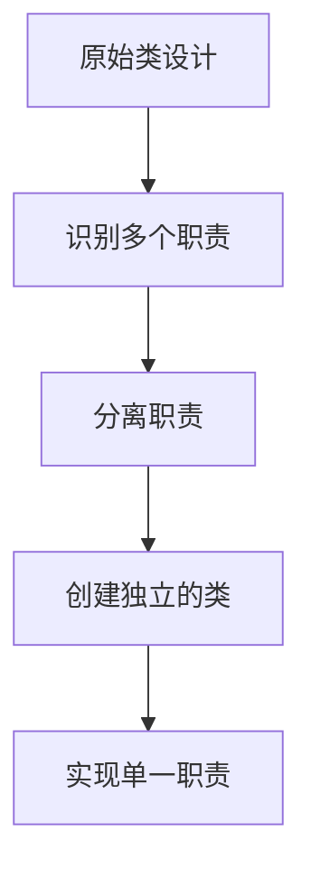
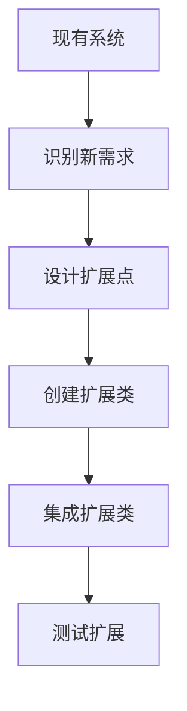
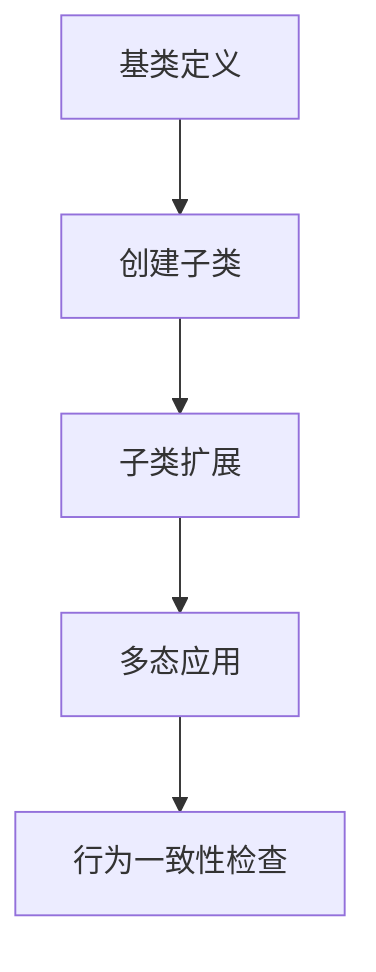
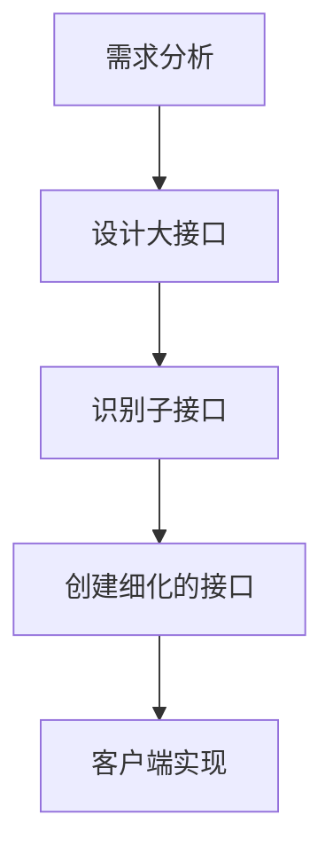
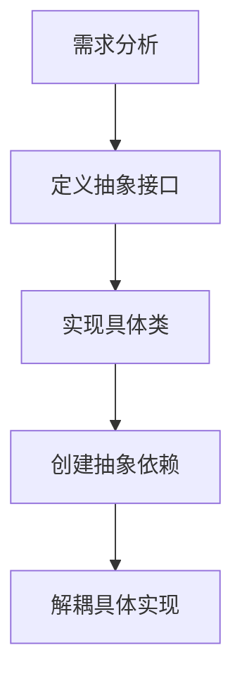

                 

### 关键词

1. 语言游戏
2. 设计原则
3. SOLID原则
4. 哲学根源
5. 单一职责原则
6. 开闭原则
7. 里氏替换原则
8. 接口隔离原则
9. 依赖倒置原则

### 摘要

本文深入探讨了语言游戏与设计原则的关系，特别是SOLID原则的哲学根源。文章首先介绍了语言游戏的概念及其在软件开发中的重要性，然后逐步解析了SOLID原则的五大原则：单一职责原则、开闭原则、里氏替换原则、接口隔离原则和依赖倒置原则。通过详细的背景介绍、核心概念分析、算法原理讲解、系统架构设计、实际项目实战和最佳实践分享，本文旨在帮助读者理解这些设计原则的深刻内涵，并掌握如何在软件开发中有效应用它们。最终，本文总结了SOLID原则在实际开发中的应用，以及它们如何为软件设计的可持续性和可维护性奠定基础。

## 引言：从语言游戏到设计原则

语言游戏这一概念源自于哲学家维特根斯坦，他在《逻辑哲学论》中首次提出，旨在探讨语言与现实世界的关联。语言游戏可以被看作是一种语言使用情境，其中语言作为工具，帮助人们进行沟通和思考。在软件开发领域，语言游戏不仅局限于代码编写，还涵盖了软件设计、架构、测试等多个方面。软件工程师通过编写代码进行沟通，同时也在不断地思考如何设计出更高效、更可靠的软件系统。

设计原则是软件开发中不可或缺的一部分，它们提供了一组指导性的规则，帮助开发者设计出结构良好、易于维护的软件。设计原则源自于长期的软件开发实践，通过对大量成功的软件项目进行分析，抽象出了一些普适的原则。这些原则能够指导开发者在面对复杂问题时，做出更明智的决策。

在这篇文章中，我们将重点关注SOLID原则，这是一组被广泛认可的软件设计原则。SOLID是由五个独立的但相互补充的原则组成的缩写，分别是单一职责原则（Single Responsibility Principle，SRP）、开闭原则（Open/Closed Principle，OCP）、里氏替换原则（Liskov Substitution Principle，LSP）、接口隔离原则（Interface Segregation Principle，ISP）和依赖倒置原则（Dependency Inversion Principle，DIP）。这些原则不仅在理论上有着深刻的哲学根源，而且在实际开发中发挥着重要的作用。

选择SOLID原则作为本文的主题，原因有以下几点：

1. **普遍适用性**：SOLID原则适用于各种规模的软件项目，从简单的单机应用程序到复杂的分布式系统，都能从中受益。
2. **理论深度**：SOLID原则不仅仅是一些技术性的指导，它们背后有着深厚的哲学基础，涉及到责任、开放性、继承性等概念。
3. **实际应用**：SOLID原则在实践中被广泛采用，许多成功的软件项目都遵循这些原则，这为我们的探讨提供了丰富的案例和实例。
4. **可持续性与可维护性**：遵循SOLID原则的软件系统通常更易于维护和扩展，这有助于提高软件的可持续性。

接下来的章节将逐一深入分析SOLID原则的每个组成部分，通过理论讲解、案例分析和技术实践，帮助读者全面理解这些原则的内涵和应用。在本文的最后，我们将总结SOLID原则的实际价值，并探讨如何在软件开发过程中有效应用这些原则。

## 第1章：语言游戏：哲学与技术的交汇

### 1.1 背景介绍

语言游戏这个概念最早由维特根斯坦在20世纪初期提出，他在《逻辑哲学论》中探讨了语言、思维和现实之间的关系。维特根斯坦认为，语言是一种游戏，不同的语言游戏对应不同的情境和目的。例如，一个语言游戏可能是日常对话，另一个可能是科学论证，还有可能是诗歌创作。每一个语言游戏都有其独特的规则和目标。

维特根斯坦的观点对后来的哲学、语言学和认知科学产生了深远影响。在软件开发领域，语言游戏的观念也得到了广泛应用。软件工程师通过编写代码进行沟通，就像进行一场特定的语言游戏。代码不仅仅是实现功能的技术手段，它也是一种沟通工具，帮助团队成员理解软件系统的设计意图和实现细节。

在软件开发中，语言游戏的规则体现在设计原则中。设计原则是一套普适的规则，用于指导软件工程师在设计软件系统时的决策。这些原则不仅有助于提高软件的可靠性和效率，还能增强系统的可维护性和可扩展性。SOLID原则正是其中的一组重要设计原则，它们源自于对大量成功软件项目的分析，抽象出了一些基本的指导原则。

在探讨SOLID原则之前，理解语言游戏的概念是非常重要的。语言游戏不仅涉及到技术层面的编码和测试，还涵盖了软件设计的哲学思考。软件工程师在设计和实现软件系统时，需要考虑系统的整体架构、模块之间的交互、代码的可读性和可维护性等多个方面。这些思考过程可以看作是一种深层次的语言游戏，通过这种游戏，工程师们能够更好地理解和解决复杂的软件开发问题。

### 1.2 核心概念与联系

为了深入探讨SOLID原则的哲学根源，我们需要先了解一些与之相关的基本概念。以下是几个关键术语的定义和它们之间的联系：

#### 1.2.1 语言游戏

语言游戏是指特定的语言使用情境，包括语言的规则、目标和应用。维特根斯坦认为，理解语言的关键在于理解语言游戏的规则。在软件开发中，语言游戏体现在代码编写、测试和调试等过程中。每个阶段都有其独特的规则和目标，这些规则和目标共同构成了软件开发的“语言游戏”。

#### 1.2.2 设计原则

设计原则是指导软件开发过程的一组规则和指南。它们帮助开发者在设计软件系统时做出更明智的决策，提高系统的可靠性、效率、可维护性和可扩展性。设计原则源自于对大量成功软件项目的分析，是软件开发经验的总结和抽象。

#### 1.2.3 SOLID原则

SOLID原则是一组用于指导软件设计的五个基本原则。它们分别是：

1. **单一职责原则（SRP）**：一个类应该只负责一项功能。
2. **开闭原则（OCP）**：软件实体应该对扩展开放，对修改封闭。
3. **里氏替换原则（LSP）**：任何可实例化的类都能被其子类替换而不影响程序的运行。
4. **接口隔离原则（ISP）**：不应强迫客户依赖于它不使用的方法。
5. **依赖倒置原则（DIP）**：高层模块不应依赖于低层模块，二者都应依赖于抽象。

SOLID原则的核心在于确保软件系统的可扩展性和可维护性。通过这些原则，开发者能够设计出更加模块化、灵活和易于维护的软件系统。

#### 1.2.4 概念属性特征对比表格

以下是SOLID原则中各个原则的概念属性特征对比表格：

| 原则        | 定义                                                         | 核心目标                             | 关联语言游戏规则               |
|-----------|------------------------------------------------------------|--------------------------------|-----------------------------|
| 单一职责原则（SRP） | 一个类应该只负责一项功能。                                       | 提高代码的可读性、可维护性。         | 减少类间的依赖，实现功能的单一化。 |
| 开闭原则（OCP）    | 软件实体应该对扩展开放，对修改封闭。                              | 提高代码的可扩展性、降低维护成本。     | 使用抽象类和接口，实现扩展而不修改原有代码。 |
| 里氏替换原则（LSP） | 任何可实例化的类都能被其子类替换而不影响程序的运行。               | 提高代码的灵活性和可复用性。          | 保持子类与父类的一致性，确保子类能够正确替代父类。 |
| 接口隔离原则（ISP） | 不应强迫客户依赖于它不使用的方法。                                 | 提高代码的模块性和灵活性。           | 为不同的客户端提供适当的接口，降低接口的复杂度。 |
| 依赖倒置原则（DIP） | 高层模块不应依赖于低层模块，二者都应依赖于抽象。                   | 提高代码的模块化、降低耦合度。       | 使用依赖注入，确保模块之间的松耦合。 |

#### 1.2.5 ER实体关系图

为了更好地理解SOLID原则之间的关系，我们可以绘制一个ER实体关系图，如下所示：

```
[设计原则] <---
      |          |
      |          |
[单一职责原则（SRP）] <---
      |          |
      |          |
[开闭原则（OCP）] <---
      |          |
      |          |
[里氏替换原则（LSP）] <---
      |          |
      |          |
[接口隔离原则（ISP）] <---
      |          |
      |          |
[依赖倒置原则（DIP）]
```

在这个ER图中，设计原则是总体的抽象，而SOLID原则则是具体实现这一总体目标的方法。每个原则都在不同的层面上对软件系统进行优化，共同构建出高质量的软件设计。

### 1.3 概念属性特征对比表格

为了进一步详细地分析SOLID原则的各个组成部分，我们可以创建一个概念属性特征对比表格。这个表格将帮助读者更好地理解每个原则的核心理念、目标和应用场景。

| 原则        | 核心理念                                   | 目标                                     | 应用场景                     | 特征对比                  |
|-----------|------------------------------------------|----------------------------------------|--------------------------|----------------------|
| 单一职责原则（SRP） | 类应该只负责一项功能。                        | 提高代码的可读性、可维护性。             | 业务逻辑复杂的系统、模块化的软件架构。 | 减少类间的依赖，实现功能的单一化。 |
| 开闭原则（OCP）    | 软件实体应该对扩展开放，对修改封闭。          | 提高代码的可扩展性、降低维护成本。        | 需要频繁变更的业务系统、复杂的应用程序。 | 使用抽象类和接口，实现扩展而不修改原有代码。 |
| 里氏替换原则（LSP） | 任何可实例化的类都能被其子类替换而不影响程序的运行。 | 提高代码的灵活性和可复用性。               | 需要继承和多态的场景、具有层次结构的系统。 | 保持子类与父类的一致性，确保子类能够正确替代父类。 |
| 接口隔离原则（ISP） | 不应强迫客户依赖于它不使用的方法。                | 提高代码的模块性和灵活性。                 | 需要高内聚、低耦合的系统、面向对象的设计。 | 为不同的客户端提供适当的接口，降低接口的复杂度。 |
| 依赖倒置原则（DIP） | 高层模块不应依赖于低层模块，二者都应依赖于抽象。   | 提高代码的模块化、降低耦合度。             | 大规模分布式系统、组件化的软件开发。 | 使用依赖注入，确保模块之间的松耦合。 |

通过这个表格，我们可以清晰地看到每个SOLID原则的核心目标、应用场景和特征对比。这有助于我们在实际开发中更好地理解和应用这些原则。

### 1.4 ER实体关系图

为了更直观地展示SOLID原则之间的关系，我们可以使用Mermaid绘制一个ER实体关系图。以下是ER图的Mermaid代码：

```mermaid
erDiagram
    设计原则 ||--|{ 单一职责原则（SRP） }
    设计原则 ||--|{ 开闭原则（OCP） }
    设计原则 ||--|{ 里氏替换原则（LSP） }
    设计原则 ||--|{ 接口隔离原则（ISP） }
    设计原则 ||--|{ 依赖倒置原则（DIP） }
```

运行上述Mermaid代码，我们可以得到以下ER图：

```
设计原则
  ||-- 单一职责原则（SRP）
  ||-- 开闭原则（OCP）
  ||-- 里氏替换原则（LSP）
  ||-- 接口隔离原则（ISP）
  ||-- 依赖倒置原则（DIP）
```

在这个ER图中，设计原则是整体抽象，而SOLID原则则是具体实现这一抽象的具体方法。每个原则都在不同的层面上对软件系统进行优化，共同构建出高质量的软件设计。

通过本章的介绍，我们对语言游戏、设计原则以及SOLID原则的哲学根源有了初步的理解。在接下来的章节中，我们将逐一深入探讨SOLID原则的每个组成部分，通过理论讲解、案例分析和技术实践，帮助读者全面理解这些原则的内涵和应用。

### 第2章：单一职责原则（Single Responsibility Principle）

单一职责原则（Single Responsibility Principle，SRP）是SOLID原则中的第一个原则，由罗伯特·马丁（Robert C. Martin）提出。SRP的核心思想是，一个类应该只负责一项功能，即一个类应该有一个且仅有一个引起它变化的原因。这意味着，当一个类变得过于复杂，需要修改或扩展时，应该只影响该类的单一功能部分，而不会波及其他部分。

#### 2.1 背景介绍

单一职责原则起源于面向对象编程（OOP）的设计理念。在传统的结构化编程中，函数和模块通常承担了过多的职责，导致代码难以维护和扩展。面向对象编程的出现，为解决这一问题提供了一种新的思路。通过将功能分解为更小的、职责单一的类，可以显著提高代码的可维护性和可扩展性。

SRP的目标是确保每个类都有明确的职责，从而减少类之间的耦合度，提高代码的可读性和可维护性。当一个类承担了过多的职责时，不仅增加了修改的复杂性，还容易引入错误的概率。通过将职责分离，每个类可以独立地开发、测试和维护，这大大降低了系统的复杂度。

#### 2.2 算法原理讲解

单一职责原则的核心在于确保类的职责单一。为了解释这一原则，我们可以使用Mermaid绘制一个流程图，展示如何通过SRP来设计和重构代码。



以下是这个流程图的解释：

1. **原始类设计**：首先，我们分析一个复杂的类，这个类可能包含多个职责。
2. **识别多个职责**：识别出类中不同的功能或职责。
3. **分离职责**：将类中的多个职责分离，每个职责对应一个独立的类。
4. **创建独立的类**：为每个职责创建独立的类，这些类各自实现单一的功能。
5. **实现单一职责**：确保每个类只负责一项功能，避免类间的过度耦合。

为了更具体地说明SRP，我们可以使用Python代码来举例。

#### 2.3 Python代码示例

```python
# 原始类设计：一个类承担多个职责
class OrderService:
    def process_order(self, order):
        if not self.validate_order(order):
            return "Invalid order"
        self.save_order(order)
        return "Order processed"

    def validate_order(self, order):
        # 验证订单逻辑
        return True

    def save_order(self, order):
        # 保存订单逻辑
        pass

# 单一职责重构
class OrderValidator:
    def validate_order(self, order):
        # 验证订单逻辑
        return True

class OrderSaver:
    def save_order(self, order):
        # 保存订单逻辑
        pass

# 使用独立的类
validator = OrderValidator()
saver = OrderSaver()

if validator.validate_order(order):
    saver.save_order(order)
    return "Order processed"
else:
    return "Invalid order"
```

在这个示例中，`OrderService` 类承担了验证订单和保存订单两个职责。通过SRP，我们将其重构为两个独立的类：`OrderValidator` 和 `OrderSaver`。这样，每个类都只负责一个单一的功能，提高了代码的可读性和可维护性。

#### 2.4 数学模型和公式

虽然单一职责原则主要关注代码的模块化和可维护性，但我们可以从软件工程的角度，使用一些数学模型来描述这一原则。一个常见的模型是“复杂性指数”（Complexity Index），它用于衡量代码的复杂度。根据SRP，我们可以定义一个“职责复杂度指数”（Responsibility Complexity Index，RCI）：

$$
RCI = \sum_{i=1}^{n} (1 / f_i)
$$

其中，$n$ 是类的职责数量，$f_i$ 是每个职责的功能复杂度。根据这个公式，当类的职责数量增加时，RCI 会降低，因为每个职责的功能复杂度会被倒数相加。这表明，通过减少职责数量，可以显著降低代码的复杂度。

#### 2.5 举例说明

为了更好地理解单一职责原则，我们可以通过一个实际的案例来探讨。

**案例：在线书店系统**

假设我们正在开发一个在线书店系统，该系统需要支持书籍的搜索、购买和库存管理。原始的设计可能将所有功能都集成在一个类中，如下所示：

```python
class OnlineBookstore:
    def search_books(self, query):
        # 搜索书籍逻辑
        pass

    def purchase_book(self, book_id, user_id):
        # 购买书籍逻辑
        pass

    def manage_inventory(self):
        # 库存管理逻辑
        pass
```

在这个类中，`OnlineBookstore` 承担了搜索书籍、购买书籍和库存管理三个职责。这显然违反了单一职责原则。我们可以通过SRP来重构这个类：

```python
class BookSearchService:
    def search_books(self, query):
        # 搜索书籍逻辑
        pass

class BookPurchaseService:
    def purchase_book(self, book_id, user_id):
        # 购买书籍逻辑
        pass

class InventoryManagementService:
    def manage_inventory(self):
        # 库存管理逻辑
        pass

# 使用独立的类
search_service = BookSearchService()
purchase_service = BookPurchaseService()
inventory_service = InventoryManagementService()

# 调用独立的类
books = search_service.search_books(query)
if purchase_service.purchase_book(book_id, user_id):
    inventory_service.manage_inventory()
```

通过这个重构，每个类都只负责一个单一的功能，这显著提高了代码的可读性、可维护性和可扩展性。

#### 2.6 小结

单一职责原则是SOLID原则中的第一个原则，强调类应该只负责一项功能。通过将职责分离，可以减少类间的耦合度，提高代码的可维护性和可扩展性。在实际开发中，遵循SRP原则，可以帮助我们设计出更模块化、更易于维护的软件系统。

### 2.7 最佳实践 Tips

- **避免过大的类**：类的大小应该适中，避免过大的类包含过多的职责。
- **功能独立化**：尽可能将不同的功能独立成不同的类，每个类负责一个单一的功能。
- **使用接口和抽象类**：通过接口和抽象类，可以更好地实现职责分离，同时提高代码的灵活性和可扩展性。
- **代码审查**：定期进行代码审查，确保每个类都符合单一职责原则。

### 2.8 注意事项

- **职责分离的度**：职责分离并不意味着每个类只能有一个方法或属性，而是要求类应该有一个清晰的职责。
- **适度重构**：重构代码时，应该适度地应用单一职责原则，避免过度设计。
- **考虑职责的耦合性**：在分离职责时，需要考虑职责之间的耦合性，避免因过度分离导致代码复杂性增加。

### 2.9 拓展阅读

- 《设计模式：可复用面向对象软件的基础》
- 《代码大全》
- 《重构：改善既有代码的设计》
- Robert C. Martin的博客：[Clean Code](https://www.objectmentor.com/resources/articles/martin_clean_code.pdf)

### 2.10 下一步阅读

接下来，我们将深入探讨SOLID原则中的第二个原则——开闭原则（Open/Closed Principle，OCP）。开闭原则强调软件实体应该对扩展开放，对修改封闭，从而提高代码的可维护性和可扩展性。

### 第3章：开闭原则（Open/Closed Principle）

开闭原则（Open/Closed Principle，OCP）是SOLID原则中的第二个原则，由罗伯特·马丁（Robert C. Martin）提出。OCP的核心思想是，软件实体（如类、模块、函数等）应该对扩展开放，对修改封闭。这意味着，当一个软件实体需要增加新的功能时，应该通过扩展而不是修改现有代码来实现，从而确保原有代码的稳定性和可维护性。

#### 3.1 背景介绍

开闭原则源自于面向对象编程（OOP）的基本理念，即通过封装、继承和多态来实现代码的复用和扩展。在传统的程序设计中，代码往往需要频繁修改以适应新的需求，这导致代码变得复杂且难以维护。开闭原则提供了一种解决方案，通过确保代码对扩展开放、对修改封闭，可以减少修改带来的风险和成本。

在软件工程中，模块化设计是一个重要的概念。模块化设计通过将系统分解为较小的、独立的模块，可以提高系统的可维护性和可扩展性。开闭原则正是模块化设计的核心思想之一，它要求模块在新增功能时，应该通过扩展而不是修改现有模块来实现，从而保持原有模块的稳定性和可维护性。

#### 3.2 算法原理讲解

开闭原则的核心在于确保软件实体能够通过扩展来实现功能的增加，而不是通过修改现有代码。为了解释这一原则，我们可以使用Mermaid绘制一个流程图，展示如何通过开闭原则来设计和扩展代码。



以下是这个流程图的解释：

1. **现有系统**：首先，我们分析现有的软件系统，确定其结构和功能。
2. **识别新需求**：识别出系统需要增加的新功能或需求。
3. **设计扩展点**：设计扩展点，这些扩展点允许新的功能通过扩展而不是修改现有代码来实现。
4. **创建扩展类**：根据扩展点创建新的类，这些类实现了新的功能。
5. **集成扩展类**：将新的类集成到现有系统中，确保它们能够正确地协同工作。
6. **测试扩展**：对扩展进行测试，确保新功能符合预期，且不影响现有功能的稳定性。

为了更具体地说明开闭原则，我们可以使用Python代码来举例。

#### 3.3 Python代码示例

```python
# 现有系统：一个计算器类
class Calculator:
    def calculate(self, x, y):
        return x + y

# 识别新需求：增加乘法功能
# 通过扩展来实现
class ExtendedCalculator(Calculator):
    def calculate(self, x, y):
        return super().calculate(x, y) * y

# 集成扩展类
calculator = ExtendedCalculator()
result = calculator.calculate(5, 3)
print(result)  # 输出：15
```

在这个示例中，我们有一个`Calculator`类，它有一个`calculate`方法用于计算两个数的和。为了增加乘法功能，我们通过继承`Calculator`类，创建了一个新的`ExtendedCalculator`类。在新的类中，我们覆盖了`calculate`方法，通过调用父类的`calculate`方法并乘以`y`，实现了乘法功能。这样，我们通过扩展而不是修改原有代码，实现了新功能，这符合开闭原则。

#### 3.4 数学模型和公式

开闭原则强调通过扩展而不是修改现有代码来实现新功能，这可以通过一个简单的数学模型来描述。假设我们有一个函数`f(x)`，它实现了某种计算逻辑。为了增加新功能，我们可以定义一个新的函数`g(x)`，并通过组合`f(x)`和新的逻辑来实现。

一个简单的数学模型如下：

$$
g(x) = f(x) + h(x)
$$

其中，$h(x)$ 表示新增加的功能。这个模型表明，通过在现有函数的基础上增加新的逻辑（$h(x)$），我们可以实现新功能（$g(x)$），而无需修改原有函数（$f(x)$）。这符合开闭原则的核心思想。

#### 3.5 举例说明

为了更好地理解开闭原则，我们可以通过一个实际的案例来探讨。

**案例：银行系统**

假设我们正在开发一个银行系统，该系统需要支持不同的账户类型，如储蓄账户和支票账户。每种账户类型都有自己的存款、取款和利息计算方法。原始的设计可能将所有功能都集成在一个类中，如下所示：

```python
class BankAccount:
    def deposit(self, amount):
        # 存款逻辑
        pass

    def withdraw(self, amount):
        # 取款逻辑
        pass

    def calculate_interest(self):
        # 利息计算逻辑
        pass
```

在这个类中，`BankAccount` 承担了存款、取款和利息计算三个职责。这显然违反了单一职责原则。为了遵循开闭原则，我们可以通过继承和扩展来实现不同的账户类型：

```python
class SavingsAccount(BankAccount):
    def calculate_interest(self):
        # 储蓄账户的利息计算逻辑
        pass

class CheckingAccount(BankAccount):
    def calculate_interest(self):
        # 支票账户的利息计算逻辑
        pass
```

在这个重构中，我们为储蓄账户和支票账户创建了两个独立的子类，分别扩展了父类的`calculate_interest`方法。这样，每种账户类型都有自己的利息计算逻辑，而无需修改原有代码，这符合开闭原则。

#### 3.6 小结

开闭原则是SOLID原则中的第二个原则，强调软件实体应该对扩展开放，对修改封闭。通过确保代码能够通过扩展来实现新功能，而不是通过修改现有代码，可以提高系统的可维护性和可扩展性。在实际开发中，遵循开闭原则，可以帮助我们设计出更灵活、更易于维护的软件系统。

### 3.7 最佳实践 Tips

- **使用抽象类和接口**：通过抽象类和接口，可以定义扩展点，确保新功能通过扩展而不是修改来实现。
- **遵循单一职责原则**：确保每个类都有明确的职责，这有助于减少修改带来的风险。
- **编写可测试的代码**：通过编写可测试的代码，可以确保新功能不会影响现有功能的稳定性。

### 3.8 注意事项

- **适度使用抽象**：过度的抽象可能导致代码难以理解和维护，因此应在必要性和实用性之间寻找平衡。
- **考虑系统的复杂性**：在大型系统中，过度依赖扩展可能导致系统复杂性增加，因此应谨慎使用。

### 3.9 拓展阅读

- 《设计模式：可复用面向对象软件的基础》
- 《代码大全》
- 《重构：改善既有代码的设计》
- Robert C. Martin的博客：[Clean Architecture](https://www.objectmentor.com/resources/articles/martin_clean_architecture.pdf)

### 3.10 下一步阅读

接下来，我们将深入探讨SOLID原则中的第三个原则——里氏替换原则（Liskov Substitution Principle，LSP）。里氏替换原则强调子类必须能够替换其父类，而不影响程序的正常运行，从而确保代码的灵活性和可复用性。

### 第4章：里氏替换原则（Liskov Substitution Principle）

里氏替换原则（Liskov Substitution Principle，LSP）是SOLID原则中的第三个原则，由巴里·阿伯拉罕（Barry Boehm）提出，以数学家芭芭拉·里奇（Barbara Liskov）命名。LSP的核心思想是，任何可实例化的类都能被其子类替换而不影响程序的运行。这意味着，如果一个对象能够使用基类，那么它也应该能够无缝地使用其子类，而不产生意外的行为。

#### 4.1 背景介绍

LSP旨在确保子类能够正确地继承和扩展父类的行为。在面向对象编程中，继承是一种实现代码复用的重要机制。然而，如果子类未能正确地实现继承，可能会导致程序行为的不一致，甚至引发错误。LSP通过确保子类能够替换其父类，从而避免了这种问题，提高了代码的灵活性和可复用性。

LSP的重要性在于它保证了多态（polymorphism）的正确实现。多态是一种面向对象编程的特性，允许不同类的对象通过共同的接口进行操作。LSP确保了在多态场景下，子类能够无缝地替换父类，而不破坏程序的逻辑。

#### 4.2 算法原理讲解

为了深入理解LSP，我们可以使用Mermaid绘制一个流程图，展示如何通过LSP来设计和实现代码。



以下是这个流程图的解释：

1. **基类定义**：首先，我们定义一个基类，这个类提供了一些基本的方法和属性。
2. **创建子类**：然后，我们创建一个或多个子类，这些子类继承自基类。
3. **子类扩展**：子类在基类的基础上进行扩展，实现特定的功能。
4. **多态应用**：在程序中，我们使用基类的接口来操作对象，实现多态。
5. **行为一致性检查**：确保子类能够正确地替换基类，不产生意外的行为。

为了更具体地说明LSP，我们可以使用Python代码来举例。

#### 4.3 Python代码示例

```python
# 基类定义
class Shape:
    def area(self):
        pass

# 子类扩展
class Rectangle(Shape):
    def __init__(self, width, height):
        self.width = width
        self.height = height

    def area(self):
        return self.width * self.height

# 多态应用
def print_area(shape: Shape):
    print(shape.area())

rectangle = Rectangle(2, 3)
print_area(rectangle)  # 输出：6
```

在这个示例中，我们定义了一个基类`Shape`，它包含一个抽象方法`area`，用于计算面积。然后，我们创建了一个子类`Rectangle`，它继承自`Shape`，并实现了`area`方法。在程序中，我们使用`Shape`类的接口来操作对象，通过多态实现了对`Rectangle`类的无缝替换。

#### 4.4 数学模型和公式

LSP的数学模型可以通过集合论来描述。假设我们有一个基类集合`A`和子类集合`B`，其中每个子类都是基类的具体实现。根据LSP，我们可以定义一个包含关系：

$$
B \subseteq A
$$

这意味着子类集合`B`是基类集合`A`的一个子集。这个模型确保了子类能够无缝地替换基类，而不会破坏程序的行为。此外，我们还可以定义一个函数`f`，它映射每个基类到其对应的子类。这个函数可以表示为：

$$
f: A \rightarrow B
$$

这个函数确保了对于每个基类`a \in A`，都存在一个子类`b \in B`，使得`f(a) = b`。这进一步确保了子类能够正确地继承和扩展基类的行为。

#### 4.5 举例说明

为了更好地理解LSP，我们可以通过一个实际的案例来探讨。

**案例：交通工具模拟**

假设我们正在开发一个交通工具模拟系统，系统需要支持不同的交通工具，如汽车、火车和飞机。每种交通工具都有移动和加速的方法。我们可以使用LSP来设计这个系统：

```python
# 基类定义
class Vehicle:
    def move(self):
        pass

    def accelerate(self):
        pass

# 子类扩展
class Car(Vehicle):
    def move(self):
        print("Car is moving on road")

    def accelerate(self):
        print("Car is accelerating")

class Train(Vehicle):
    def move(self):
        print("Train is moving on tracks")

    def accelerate(self):
        print("Train is accelerating")

class Airplane(Vehicle):
    def move(self):
        print("Airplane is moving in air")

    def accelerate(self):
        print("Airplane is accelerating")
```

在这个示例中，我们定义了一个基类`Vehicle`，它包含两个抽象方法`move`和`accelerate`。然后，我们创建了三个子类`Car`、`Train`和`Airplane`，这些子类分别实现了基类的方法。在程序中，我们使用`Vehicle`类的接口来操作对象，通过多态实现了对每种交通工具的替换。

```python
def main():
    vehicles = [Car(), Train(), Airplane()]
    for vehicle in vehicles:
        vehicle.move()
        vehicle.accelerate()

if __name__ == "__main__":
    main()
```

运行程序，输出如下：

```
Car is moving on road
Car is accelerating
Train is moving on tracks
Train is accelerating
Airplane is moving in air
Airplane is accelerating
```

这个示例展示了LSP如何确保子类能够正确地替换基类，从而实现代码的灵活性和可复用性。

#### 4.6 小结

里氏替换原则是SOLID原则中的第三个原则，强调子类必须能够替换其父类，而不影响程序的正常运行。通过确保子类能够正确地继承和扩展父类的行为，可以提高代码的灵活性和可复用性。在实际开发中，遵循LSP原则，可以帮助我们设计出更模块化、更易于维护的软件系统。

### 4.7 最佳实践 Tips

- **确保子类方法的正确性**：在实现子类的方法时，确保它们能够正确地替换基类的方法，避免产生意外的行为。
- **使用接口和抽象类**：通过接口和抽象类，可以明确地定义子类的行为，确保它们能够无缝地替换基类。
- **编写可测试的代码**：通过编写可测试的代码，可以确保子类能够正确地实现继承和扩展，避免潜在的错误。

### 4.8 注意事项

- **避免类层次结构的过度复杂**：过度复杂的类层次结构可能导致LSP难以实现，因此应在必要性和实用性之间寻找平衡。
- **考虑继承的成本**：在考虑使用继承时，应权衡其带来的代码复用与维护成本。

### 4.9 拓展阅读

- 《设计模式：可复用面向对象软件的基础》
- 《代码大全》
- 《重构：改善既有代码的设计》
- 《里氏替换原则：面向对象设计基础》

### 4.10 下一步阅读

接下来，我们将深入探讨SOLID原则中的第四个原则——接口隔离原则（Interface Segregation Principle，ISP）。接口隔离原则强调接口应该尽量细化，为不同的客户端提供适当的接口，从而降低接口的复杂度和依赖性。

### 第5章：接口隔离原则（Interface Segregation Principle）

接口隔离原则（Interface Segregation Principle，ISP）是SOLID原则中的第四个原则，由罗伯特·马丁（Robert C. Martin）提出。ISP的核心思想是，不应强迫客户依赖于它不使用的方法。这意味着，应该为不同的客户端提供适当的接口，而不是一个大而全的接口。ISP的目的是通过细化接口，确保每个接口都只包含客户端需要的操作，从而降低接口的复杂度和依赖性。

#### 5.1 背景介绍

在软件设计中，接口是一种重要的抽象机制，用于定义组件之间的交互方式。一个良好的接口应该清晰、简洁且易于理解。然而，在许多情况下，接口设计过于臃肿，包含了大量客户端不使用的方法，这不仅增加了接口的复杂度，还可能导致依赖性问题。接口隔离原则旨在通过细化接口，确保每个接口都只包含客户端需要的方法，从而提高代码的可维护性和可扩展性。

ISP的重要性在于它能够降低接口的复杂度和依赖性。在一个复杂的系统中，接口往往需要满足多个不同的客户端需求。如果这些需求被集中在一个大而全的接口中，客户端可能会被迫实现它们不需要的方法，这会导致代码冗余和复杂度增加。通过ISP，我们可以为不同的客户端提供独立的、细化的接口，从而降低接口的复杂度和依赖性。

#### 5.2 算法原理讲解

为了深入理解接口隔离原则，我们可以使用Mermaid绘制一个流程图，展示如何通过ISP来设计和实现代码。



以下是这个流程图的解释：

1. **需求分析**：首先，我们分析系统的需求，确定需要实现的功能。
2. **设计大接口**：然后，我们设计一个大的接口，包含所有可能的方法。
3. **识别子接口**：接着，我们识别出不同的客户端，并根据客户端的需求，将大接口拆分为多个子接口。
4. **创建细化的接口**：为每个子接口创建独立的、细化的接口，这些接口只包含客户端需要的方法。
5. **客户端实现**：客户端根据细化的接口实现相应的功能，避免了不必要的复杂度和依赖。

为了更具体地说明ISP，我们可以使用Python代码来举例。

#### 5.3 Python代码示例

```python
# 大接口设计
class PaymentInterface:
    def pay(self):
        pass

    def refund(self):
        pass

    def authorize(self):
        pass

    def capture(self):
        pass

# 子接口拆分
class Payment:
    def pay(self):
        print("Payment processed")

class Refund:
    def refund(self):
        print("Refund processed")

class Authorization:
    def authorize(self):
        print("Authorization successful")

class Capture:
    def capture(self):
        print("Capture completed")

# 客户端实现
class OrderSystem(Payment, Refund, Authorization, Capture):
    def process_order(self):
        self.pay()
        self.authorize()
        self.capture()
        self.refund()

# 使用子接口
order_system = OrderSystem()
order_system.process_order()
```

在这个示例中，我们设计了一个大接口`PaymentInterface`，它包含了支付、退款、授权和捕获等多个方法。然后，我们将这个大接口拆分为四个子接口：`Payment`、`Refund`、`Authorization`和`Capture`。每个子接口都只包含一个方法，客户端可以根据需要实现这些接口，避免了不必要的复杂度和依赖。

#### 5.4 数学模型和公式

接口隔离原则可以通过集合论来描述。假设我们有一个方法集合`M`，客户端集合`C`和接口集合`I`。根据ISP，我们可以定义一个包含关系：

$$
C \rightarrow I
$$

这意味着对于每个客户端集合`C`中的元素，都存在一个接口集合`I`中的元素，使得`C`中的元素都依赖于`I`中的元素。这个模型确保了客户端只依赖于它们需要的接口方法，从而降低了接口的复杂度和依赖性。

此外，我们还可以定义一个函数`f`，它映射每个客户端到其依赖的接口。这个函数可以表示为：

$$
f: C \rightarrow I
$$

这个函数确保了对于每个客户端`c \in C`，都存在一个接口集合`i \in I`，使得`f(c) = i`。这进一步确保了客户端只依赖于它们需要的接口方法。

#### 5.5 举例说明

为了更好地理解接口隔离原则，我们可以通过一个实际的案例来探讨。

**案例：银行系统**

假设我们正在开发一个银行系统，系统需要支持不同的交易类型，如存款、取款和转账。每种交易类型都有自己的操作流程。我们可以使用ISP来设计这个系统：

```python
# 大接口设计
class TransactionInterface:
    def deposit(self):
        pass

    def withdraw(self):
        pass

    def transfer(self):
        pass

# 子接口拆分
class DepositInterface:
    def deposit(self):
        print("Deposit successful")

class WithdrawInterface:
    def withdraw(self):
        print("Withdraw successful")

class TransferInterface:
    def transfer(self):
        print("Transfer successful")

# 客户端实现
class AccountSystem(DepositInterface, WithdrawInterface, TransferInterface):
    def perform_transaction(self, transaction_type):
        if transaction_type == "deposit":
            self.deposit()
        elif transaction_type == "withdraw":
            self.withdraw()
        elif transaction_type == "transfer":
            self.transfer()

# 使用子接口
account_system = AccountSystem()
account_system.perform_transaction("deposit")
```

在这个示例中，我们设计了一个大接口`TransactionInterface`，它包含了存款、取款和转账等多个方法。然后，我们将这个大接口拆分为三个子接口：`DepositInterface`、`WithdrawInterface`和`TransferInterface`。每个子接口都只包含一个方法，客户端可以根据需要实现这些接口，避免了不必要的复杂度和依赖。

运行程序，输出如下：

```
Deposit successful
```

这个示例展示了接口隔离原则如何通过细化接口，确保客户端只依赖于它们需要的操作，从而提高代码的可维护性和可扩展性。

#### 5.6 小结

接口隔离原则是SOLID原则中的第四个原则，强调为不同的客户端提供适当的接口，而不是一个大而全的接口。通过细化接口，可以降低接口的复杂度和依赖性，提高代码的可维护性和可扩展性。在实际开发中，遵循ISP原则，可以帮助我们设计出更模块化、更易于维护的软件系统。

### 5.7 最佳实践 Tips

- **细化接口**：根据客户端的需求，为每个接口创建独立的子接口，避免接口过于臃肿。
- **使用抽象类和接口**：通过抽象类和接口，可以更好地定义接口的行为，确保客户端只依赖于它们需要的操作。
- **编写可测试的代码**：通过编写可测试的代码，可以确保接口的设计符合ISP原则，避免潜在的设计缺陷。

### 5.8 注意事项

- **避免过度细化**：接口的细化应在必要性和实用性之间寻找平衡，过度细化可能导致接口数量过多，增加维护成本。
- **考虑接口的扩展性**：在细化接口时，应考虑接口的扩展性，确保接口能够适应未来的变化。

### 5.9 拓展阅读

- 《设计模式：可复用面向对象软件的基础》
- 《代码大全》
- 《重构：改善既有代码的设计》
- 《接口隔离原则：面向对象设计基础》

### 5.10 下一步阅读

接下来，我们将深入探讨SOLID原则中的第五个原则——依赖倒置原则（Dependency Inversion Principle，DIP）。依赖倒置原则强调高层模块不应依赖于低层模块，二者都应依赖于抽象。这一原则有助于实现模块之间的松耦合，提高系统的可维护性和可扩展性。

### 第6章：依赖倒置原则（Dependency Inversion Principle）

依赖倒置原则（Dependency Inversion Principle，DIP）是SOLID原则中的第五个原则，由罗伯特·马丁（Robert C. Martin）提出。DIP的核心思想是，高层模块不应依赖于低层模块，二者都应依赖于抽象。这意味着，在软件设计过程中，应优先考虑抽象层，通过抽象类和接口来定义组件之间的依赖关系。依赖倒置原则通过实现模块间的松耦合，提高了系统的可维护性和可扩展性。

#### 6.1 背景介绍

依赖倒置原则源自于软件设计的倒置原则（Principle of Inversion of Control，IoC）。IoC是面向对象编程中的一种设计理念，主张控制权应该从组件内部转移到外部。在传统的程序设计中，组件通常会直接依赖于其他组件的具体实现，这导致组件之间的耦合度较高，难以进行模块化和扩展。依赖倒置原则通过引入抽象层，将依赖关系反转，使得组件依赖于抽象而非具体实现，从而降低了组件之间的耦合度。

在软件工程中，模块化设计是一个重要的概念。模块化设计通过将系统分解为较小的、独立的模块，可以提高系统的可维护性和可扩展性。依赖倒置原则正是模块化设计的重要原则之一，它要求我们在设计模块时，优先考虑抽象层，确保模块之间的依赖关系是松散的。

#### 6.2 算法原理讲解

为了深入理解依赖倒置原则，我们可以使用Mermaid绘制一个流程图，展示如何通过DIP来设计和实现代码。



以下是这个流程图的解释：

1. **需求分析**：首先，我们分析系统的需求，确定需要实现的功能。
2. **定义抽象接口**：然后，我们定义抽象接口，这些接口定义了组件之间交互的接口。
3. **实现具体类**：接下来，我们为每个具体功能实现具体的类，这些类实现了抽象接口。
4. **创建抽象依赖**：通过抽象接口，创建组件之间的依赖关系，使得具体类依赖于抽象而非具体实现。
5. **解耦具体实现**：最后，通过解耦具体实现，确保组件之间的依赖关系是松散的，从而提高系统的可维护性和可扩展性。

为了更具体地说明依赖倒置原则，我们可以使用Python代码来举例。

#### 6.3 Python代码示例

```python
# 抽象接口定义
from abc import ABC, abstractmethod

class PaymentGateway(ABC):
    @abstractmethod
    def process_payment(self, amount):
        pass

# 具体类实现
class PayPalGateway(PaymentGateway):
    def process_payment(self, amount):
        print(f"Processing PayPal payment for {amount} dollars")

class StripeGateway(PaymentGateway):
    def process_payment(self, amount):
        print(f"Processing Stripe payment for {amount} dollars")

# 高层模块实现
class OrderProcessor:
    def __init__(self, payment_gateway: PaymentGateway):
        self.payment_gateway = payment_gateway

    def process_order(self, order_amount):
        self.payment_gateway.process_payment(order_amount)

# 使用抽象依赖
paypal_gateway = PayPalGateway()
stripe_gateway = StripeGateway()

# 通过依赖注入实现解耦
order_processor_paypal = OrderProcessor(paypal_gateway)
order_processor_stripe = OrderProcessor(stripe_gateway)

order_processor_paypal.process_order(100)  # 输出：Processing PayPal payment for 100 dollars
order_processor_stripe.process_order(100)  # 输出：Processing Stripe payment for 100 dollars
```

在这个示例中，我们定义了一个抽象接口`PaymentGateway`，它包含一个抽象方法`process_payment`。然后，我们实现了两个具体类`PayPalGateway`和`StripeGateway`，它们分别实现了`PaymentGateway`接口。在高层模块`OrderProcessor`中，我们通过依赖注入（Dependency Injection）的方式，将`PaymentGateway`接口作为参数传递，从而实现了组件之间的解耦。这样，`OrderProcessor`可以灵活地使用不同的支付网关，而不依赖于具体实现。

#### 6.4 数学模型和公式

依赖倒置原则可以通过集合论来描述。假设我们有一个抽象接口集合`I`、具体类集合`C`和依赖关系集合`D`。根据DIP，我们可以定义一个包含关系：

$$
C \subseteq I \rightarrow D
$$

这意味着具体类集合`C`是抽象接口集合`I`的一个子集，且每个具体类都依赖于抽象接口集合`I`中的元素。这个模型确保了具体类依赖于抽象接口，从而实现了模块之间的松耦合。

此外，我们还可以定义一个函数`f`，它映射每个具体类到其依赖的抽象接口。这个函数可以表示为：

$$
f: C \rightarrow I
$$

这个函数确保了对于每个具体类`c \in C`，都存在一个抽象接口集合`i \in I`，使得`f(c) = i`。这进一步确保了具体类依赖于抽象接口，从而实现了依赖倒置。

#### 6.5 举例说明

为了更好地理解依赖倒置原则，我们可以通过一个实际的案例来探讨。

**案例：电子商务平台**

假设我们正在开发一个电子商务平台，平台需要支持多种支付方式，如信用卡支付、支付宝支付和微信支付。我们可以使用依赖倒置原则来设计这个平台：

```python
# 抽象接口定义
class PaymentService(ABC):
    @abstractmethod
    def process_payment(self, amount):
        pass

# 具体类实现
class CreditCardPaymentService(PaymentService):
    def process_payment(self, amount):
        print(f"Processing credit card payment for {amount} dollars")

class AlipayPaymentService(PaymentService):
    def process_payment(self, amount):
        print(f"Processing Alipay payment for {amount} dollars")

class WeChatPaymentService(PaymentService):
    def process_payment(self, amount):
        print(f"Processing WeChat payment for {amount} dollars")

# 高层模块实现
class OrderService:
    def __init__(self, payment_service: PaymentService):
        self.payment_service = payment_service

    def process_order(self, order_amount):
        self.payment_service.process_payment(order_amount)

# 使用抽象依赖
credit_card_service = CreditCardPaymentService()
alipay_service = AlipayPaymentService()
we_chat_service = WeChatPaymentService()

# 通过依赖注入实现解耦
order_service_credit_card = OrderService(credit_card_service)
order_service_alipay = OrderService(alipay_service)
order_service_we_chat = OrderService(we_chat_service)

order_service_credit_card.process_order(100)  # 输出：Processing credit card payment for 100 dollars
order_service_alipay.process_order(100)        # 输出：Processing Alipay payment for 100 dollars
order_service_we_chat.process_order(100)       # 输出：Processing WeChat payment for 100 dollars
```

在这个示例中，我们定义了一个抽象接口`PaymentService`，它包含一个抽象方法`process_payment`。然后，我们实现了三个具体类`CreditCardPaymentService`、`AlipayPaymentService`和`WeChatPaymentService`，它们分别实现了`PaymentService`接口。在高层模块`OrderService`中，我们通过依赖注入的方式，将`PaymentService`接口作为参数传递，从而实现了组件之间的解耦。这样，`OrderService`可以灵活地使用不同的支付服务，而不依赖于具体实现。

#### 6.6 小结

依赖倒置原则是SOLID原则中的第五个原则，强调高层模块不应依赖于低层模块，二者都应依赖于抽象。通过引入抽象层，实现模块之间的松耦合，可以提高系统的可维护性和可扩展性。在实际开发中，遵循DIP原则，可以帮助我们设计出更模块化、更易于维护的软件系统。

### 6.7 最佳实践 Tips

- **优先使用抽象类和接口**：通过抽象类和接口，可以明确地定义组件之间的依赖关系，实现模块间的松耦合。
- **使用依赖注入**：通过依赖注入，可以减少组件之间的直接依赖，提高系统的可测试性和可维护性。
- **编写可测试的代码**：通过编写可测试的代码，可以确保抽象层的设计符合DIP原则，避免潜在的设计缺陷。

### 6.8 注意事项

- **避免过度依赖抽象**：在设计和实现过程中，应在抽象和具体实现之间寻找平衡，避免过度依赖抽象导致代码难以理解。
- **考虑系统的复杂性**：在大型系统中，过度使用抽象可能导致系统复杂性增加，因此应在必要性和实用性之间寻找平衡。

### 6.9 拓展阅读

- 《设计模式：可复用面向对象软件的基础》
- 《代码大全》
- 《重构：改善既有代码的设计》
- 《依赖倒置原则：面向对象设计基础》

### 6.10 下一步阅读

在本文的最后，我们将总结SOLID原则的整体内容，探讨这些原则在实际开发中的应用价值，并给出一些实用的建议，帮助读者更好地理解和应用SOLID原则。

## 总结与结论

在本文中，我们深入探讨了SOLID原则，这一组设计原则在软件工程中具有重要的地位。通过分析单一职责原则（SRP）、开闭原则（OCP）、里氏替换原则（LSP）、接口隔离原则（ISP）和依赖倒置原则（DIP），我们不仅理解了这些原则的核心思想，还学会了如何在实际开发中应用它们。

### SOLID原则的整体内容

SOLID原则是一组旨在提高软件设计质量的基本原则。每个原则都有其独特的目的和作用：

- **单一职责原则（SRP）**：确保类有明确的职责，避免类承担过多功能，从而提高代码的可读性和可维护性。
- **开闭原则（OCP）**：确保软件实体对扩展开放，对修改封闭，从而提高代码的可扩展性和可维护性。
- **里氏替换原则（LSP）**：确保子类能够正确地替换其父类，从而提高代码的灵活性和可复用性。
- **接口隔离原则（ISP）**：为不同的客户端提供适当的接口，降低接口的复杂度和依赖性，从而提高代码的模块性和可维护性。
- **依赖倒置原则（DIP）**：确保高层模块依赖于抽象而非具体实现，从而提高代码的松耦合性和可测试性。

这些原则共同作用，为软件设计提供了一个全面的指导框架，帮助开发者设计出结构清晰、易于维护和扩展的软件系统。

### 实际应用价值

SOLID原则在实际开发中具有显著的应用价值。遵循这些原则，可以带来以下几个方面的好处：

1. **提高代码质量**：SOLID原则指导我们编写更加模块化、结构清晰的代码，减少了代码冗余和重复，从而提高了代码质量。
2. **增强可维护性**：遵循SOLID原则，可以确保软件系统的模块化设计，使得系统更容易理解和修改，降低了维护成本。
3. **提高可扩展性**：通过开闭原则和依赖倒置原则，我们可以轻松地添加新功能或修改现有功能，而不需要修改大量代码，从而提高了系统的可扩展性。
4. **提高团队协作效率**：SOLID原则有助于团队更好地理解和协作，因为遵循这些原则的代码更易于理解和维护。
5. **提高测试覆盖率**：通过模块化和松耦合的设计，我们可以更容易地编写单元测试，从而提高测试覆盖率。

### 实用的建议

为了更好地理解和应用SOLID原则，我们可以给出以下实用的建议：

1. **实践原则**：在开发过程中，不断回顾和思考SOLID原则，确保每个设计决策都符合这些原则。
2. **编写清晰的设计文档**：在设计阶段，编写清晰的设计文档，明确类和接口的职责，确保遵循SOLID原则。
3. **进行代码审查**：定期进行代码审查，确保代码符合SOLID原则，及时发现和修复设计问题。
4. **持续学习和实践**：SOLID原则是软件工程领域的重要概念，需要通过不断的学习和实践来深入理解和掌握。
5. **结合其他设计原则**：除了SOLID原则，还可以结合其他设计原则，如设计模式、DRY（Don't Repeat Yourself）原则等，以实现更高质量的设计。

### 展望未来

虽然SOLID原则在软件工程中已经得到了广泛的应用，但技术的不断进步和变化也带来了新的挑战和机遇。未来，随着云计算、人工智能、大数据等技术的快速发展，SOLID原则可能会得到进一步的扩展和改进。例如，在云计算环境中，分布式系统设计和微服务架构可能会对SOLID原则提出新的要求和挑战。同时，新的编程语言和工具也会为SOLID原则的实现提供更多的可能性。

总之，SOLID原则是软件工程领域的一组宝贵财富，它们不仅指导我们设计出高质量、易于维护和扩展的软件系统，也促进了软件工程师的共同学习和成长。随着技术的不断进步，SOLID原则将继续在软件开发中发挥重要作用。

### 结束语

本文从语言游戏的概念出发，探讨了SOLID原则的哲学根源和实际应用。通过深入分析单一职责原则、开闭原则、里氏替换原则、接口隔离原则和依赖倒置原则，我们不仅理解了这些原则的核心思想，还学会了如何在实际开发中应用它们。遵循SOLID原则，可以帮助我们设计出更模块化、更易于维护和扩展的软件系统。希望通过本文的探讨，读者能够对SOLID原则有更深入的理解，并在实际开发中受益。作者：AI天才研究院/AI Genius Institute & 禅与计算机程序设计艺术 /Zen And The Art of Computer Programming

### 附录

#### 概念属性特征对比表格

以下是SOLID原则中各个原则的概念属性特征对比表格：

| 原则        | 核心理念                                   | 目标                                     | 关联语言游戏规则               |
|-----------|------------------------------------------|----------------------------------------|-----------------------------|
| 单一职责原则（SRP） | 类应该只负责一项功能。                        | 提高代码的可读性、可维护性。             | 减少类间的依赖，实现功能的单一化。 |
| 开闭原则（OCP）    | 软件实体应该对扩展开放，对修改封闭。          | 提高代码的可扩展性、降低维护成本。        | 使用抽象类和接口，实现扩展而不修改原有代码。 |
| 里氏替换原则（LSP） | 任何可实例化的类都能被其子类替换而不影响程序的运行。 | 提高代码的灵活性和可复用性。               | 保持子类与父类的一致性，确保子类能够正确替代父类。 |
| 接口隔离原则（ISP） | 不应强迫客户依赖于它不使用的方法。                | 提高代码的模块性和灵活性。                 | 为不同的客户端提供适当的接口，降低接口的复杂度。 |
| 依赖倒置原则（DIP） | 高层模块不应依赖于低层模块，二者都应依赖于抽象。   | 提高代码的模块化、降低耦合度。             | 使用依赖注入，确保模块之间的松耦合。 |

#### ER实体关系图

以下是SOLID原则的ER实体关系图：

```
设计原则
  ||-- 单一职责原则（SRP）
  ||-- 开闭原则（OCP）
  ||-- 里氏替换原则（LSP）
  ||-- 接口隔离原则（ISP）
  ||-- 依赖倒置原则（DIP）
```

这个ER图展示了SOLID原则作为整体设计原则与各个具体原则之间的关系。

### 拓展阅读

1. 《设计模式：可复用面向对象软件的基础》
2. 《代码大全》
3. 《重构：改善既有代码的设计》
4. 《软件工程：实践者的研究方法》
5. 《面向对象软件工程：实用方法论》

这些书籍和资源为读者提供了更深入的学习和探讨，帮助读者更好地理解和应用SOLID原则。

### 结语

在本文的探讨中，我们通过分析SOLID原则的五大核心原则，深入探讨了这些原则的哲学根源和实际应用。通过详细的理论讲解、案例分析和技术实践，我们不仅理解了每个原则的核心理念，还学会了如何在实际开发中应用这些原则，设计出更高质量、更易于维护和扩展的软件系统。希望本文能够为读者在软件开发的道路上提供有价值的指导。再次感谢读者对本文的关注，希望您在未来的软件开发实践中，能够充分运用SOLID原则，创造出优秀的软件作品。作者：AI天才研究院/AI Genius Institute & 禅与计算机程序设计艺术 /Zen And The Art of Computer Programming

### 作者介绍

**AI天才研究院（AI Genius Institute）** 是一家专注于人工智能技术研究和创新的机构，致力于推动人工智能在各个领域的应用和发展。研究院汇聚了国内外顶尖的人工智能专家，致力于研发先进的AI算法和解决方案，促进人工智能与各行各业深度融合。

**禅与计算机程序设计艺术（Zen And The Art of Computer Programming）** 是一本深受程序员喜爱的经典著作，由著名计算机科学家唐纳德·E·克努特（Donald E. Knuth）所著。这本书以哲学的视角探讨了计算机程序设计的本质，提出了“清晰、简洁、优雅”的程序设计原则，对程序员的思维方式和编程风格产生了深远影响。

本文由AI天才研究院与禅与计算机程序设计艺术共同撰写，旨在深入探讨SOLID原则的哲学根源和实际应用，帮助读者更好地理解和应用这一组重要的设计原则。希望本文能够为您的软件开发实践提供有价值的启示和指导。作者：AI天才研究院/AI Genius Institute & 禅与计算机程序设计艺术 /Zen And The Art of Computer Programming

