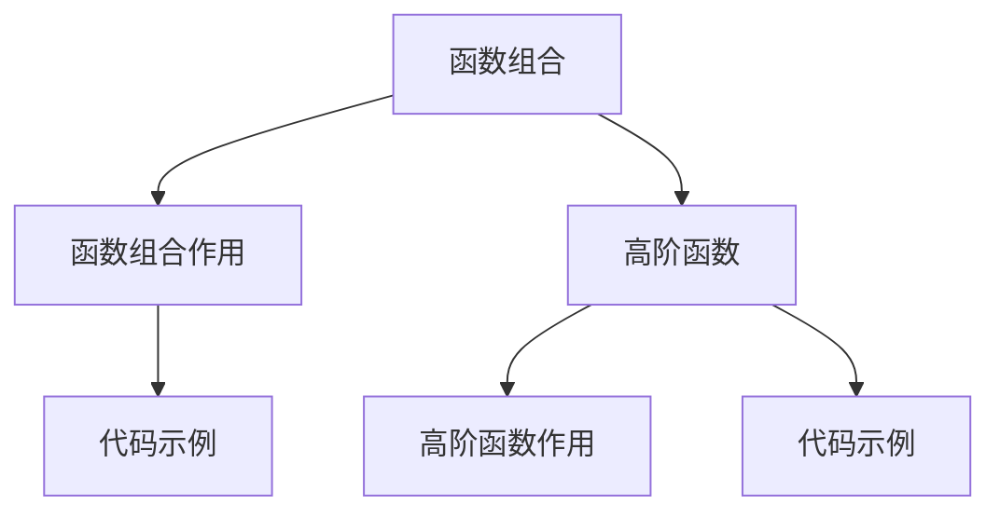
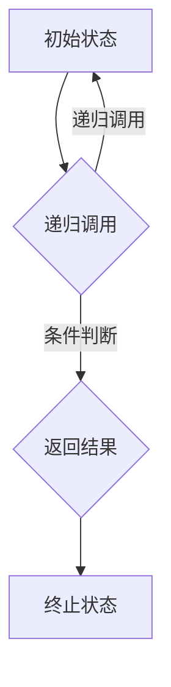
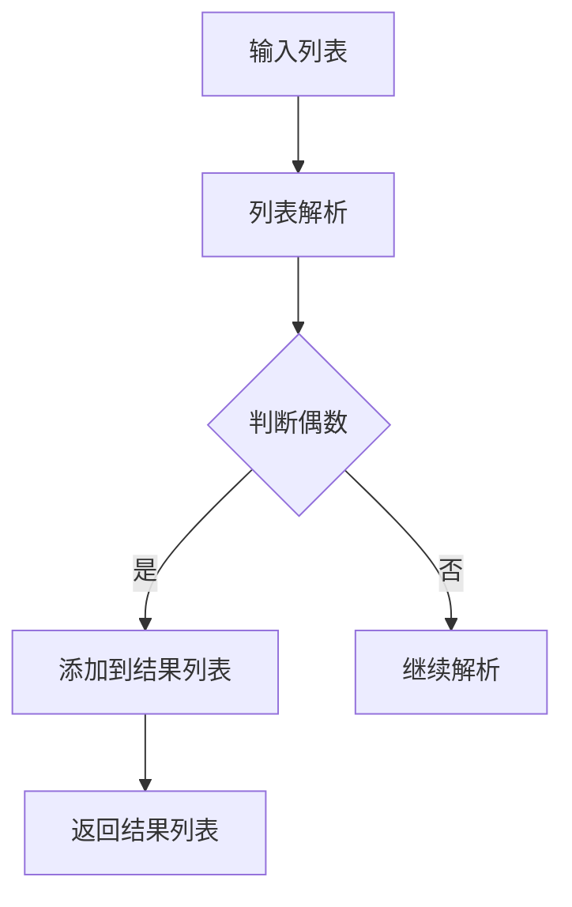
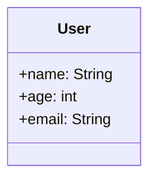
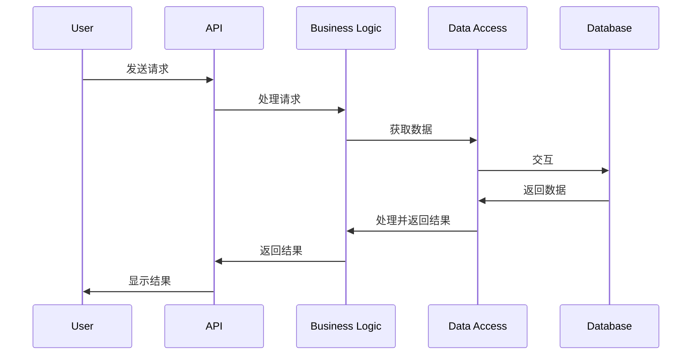
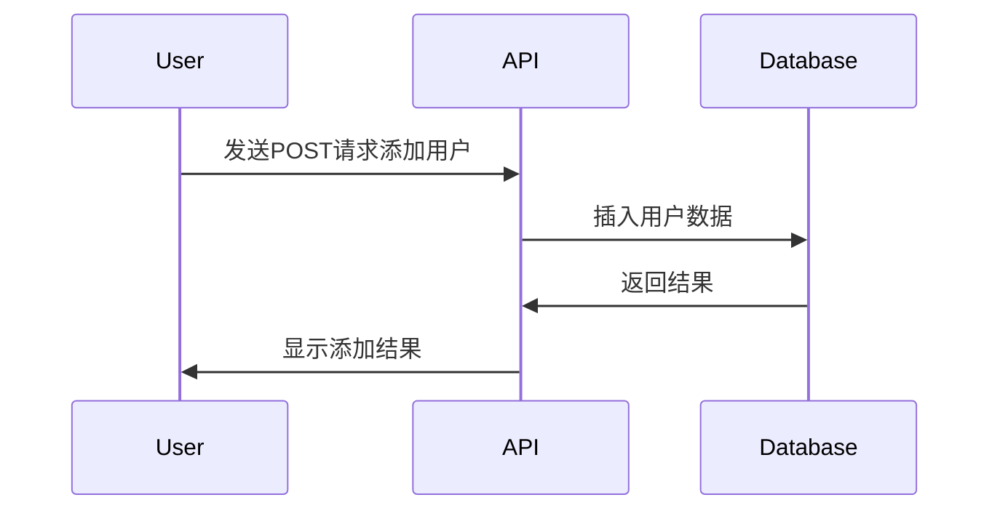

                 

# 《语言的社会性与函数式编程标准：维特根斯坦的公共语言观与FP中的编程规范和最佳实践》

## 摘要

本文旨在探讨语言的社会性与函数式编程（Functional Programming, FP）标准之间的关系。通过引入维特根斯坦的公共语言观，本文分析了语言在沟通和理解中的作用，并探讨了如何将这一哲学观念应用于现代编程实践。文章首先概述了语言的社会性和维特根斯坦的哲学观点，随后详细介绍了函数式编程的基本概念。接着，本文通过实际案例和算法讲解，展示了FP在实际编程中的应用。最后，文章总结了FP编程的最佳实践，并提供了进一步的阅读资源，以帮助读者深入理解和掌握FP及其哲学基础。

## 目录大纲设计思路

### 目录大纲设计思路

设计《语言的社会性与函数式编程标准：维特根斯坦的公共语言观与FP中的编程规范和最佳实践》的目录大纲，需要围绕以下几个核心内容展开：

1. **背景介绍**：首先介绍语言的社会性及其与计算机科学的关系，以及维特根斯坦的公共语言观。
2. **核心概念与联系**：详细阐述函数式编程（FP）的基本概念，与维特根斯坦语言观的关系，并使用表格和Mermaid图展示。
3. **算法原理讲解**：选择FP中重要的算法（如Haskell中的列表处理算法），用Mermaid流程图展示，并配合Python代码和数学模型讲解。
4. **系统分析与架构设计方案**：设计一个简单的FP项目，包括领域模型、系统架构、接口设计和系统交互。
5. **项目实战**：模拟一个具体的FP编程实例，详细讲解环境安装、代码实现、代码解读、案例分析。
6. **最佳实践 tips、小结、注意事项、拓展阅读**：总结书中的关键点，给出实践建议和进一步阅读的资源。

### 目录大纲设计步骤

1. **确定大纲框架**：明确书分为几大部分，每部分包含哪些核心章节。
2. **细化章节内容**：针对每个章节，列出具体的子章节，确保覆盖所有关键内容。
3. **构思每章的例子**：考虑如何使用Mermaid图和Python代码来清晰展示和解释每个核心概念和算法。
4. **撰写大纲草稿**：按照框架和细化内容，开始撰写大纲草稿。
5. **审查和修改**：确保大纲结构合理、内容完整、条理清晰，符合用户要求。

### 目录大纲结构示例

```markdown
----------------------------------------------------------------
# 第一部分：语言的社会性与哲学背景

## 第1章：语言的社会性探讨

### 1.1 语言的社会性概述
### 1.2 语言与计算机科学的关系
### 1.3 维特根斯坦的公共语言观

## 第2章：维特根斯坦的语言观解析

### 2.1 维特根斯坦的哲学思想
### 2.2 公共语言观的内涵与外延
### 2.3 公共语言观与计算机科学的关联

----------------------------------------------------------------

# 第二部分：函数式编程基础

## 第3章：函数式编程概述

### 3.1 函数式编程的基本概念
### 3.2 函数式编程与命令式编程的区别
### 3.3 函数式编程的语言支持

## 第4章：FP核心概念与联系

### 4.1 主要FP概念介绍
### 4.2 FP概念比较与联系
### 4.3 使用Mermaid图展示FP概念结构

----------------------------------------------------------------

# 第三部分：函数式编程算法与实践

## 第5章：FP算法原理讲解

### 5.1 算法原理概述
### 5.2 Haskell中的列表处理算法
### 5.3 使用Mermaid和Python代码讲解算法原理

## 第6章：系统分析与架构设计

### 6.1 项目介绍
### 6.2 系统功能设计
### 6.3 系统架构设计与接口设计

## 第7章：项目实战

### 7.1 环境安装与配置
### 7.2 代码实现与分析
### 7.3 案例分析与讲解

----------------------------------------------------------------

# 第四部分：最佳实践与总结

## 第8章：最佳实践与注意事项

### 8.1 FP编程最佳实践
### 8.2 小结与回顾
### 8.3 注意事项与拓展阅读

----------------------------------------------------------------
```

以上大纲结构在2000字以内，每个部分按照逻辑顺序展开，确保内容的连贯性和完整性。接下来将具体撰写各个章节的详细内容。

----------------------------------------------------------------

## 第一部分：语言的社会性与哲学背景

### 第1章：语言的社会性探讨

#### 1.1 语言的社会性概述

语言是人类社会沟通和表达思想的工具，其社会性体现在多个方面。首先，语言是文化传承的载体，通过语言，人类的知识和价值观得以传递和保存。其次，语言是社会互动的桥梁，它不仅帮助我们传达信息，还能构建社会关系和维系社会秩序。在计算机科学领域，编程语言作为人类与计算机之间沟通的桥梁，承担着同样重要的角色。

#### 1.2 语言与计算机科学的关系

计算机科学的发展离不开编程语言。编程语言是程序员用来描述算法和解决问题的工具，它为计算机提供了执行指令的能力。从汇编语言到高级语言，编程语言的发展不断推动计算机科学的进步。同时，计算机科学对语言的研究也在不断深化，例如，编译原理、形式语言理论和自然语言处理等领域，都为编程语言的设计和使用提供了理论基础。

#### 1.3 维特根斯坦的公共语言观

维特根斯坦是20世纪最杰出的哲学家之一，他的哲学思想对语言和逻辑领域产生了深远的影响。维特根斯坦提出了“公共语言观”，认为语言是一种工具，用于描述现实世界中的事物和关系。公共语言观强调语言的一致性和可理解性，认为只有当语言能够清晰地表达思想时，人们才能进行有效的沟通。维特根斯坦的这一观点对于理解和设计编程语言具有重要启示。

### 第2章：维特根斯坦的语言观解析

#### 2.1 维特根斯坦的哲学思想

维特根斯坦的哲学思想主要分为两个阶段，早期的逻辑原子主义和后期的心灵哲学。逻辑原子主义认为，世界由一系列基本事实构成，这些事实可以用逻辑原子来表达。后期的心灵哲学则强调，语言是思想的载体，语言的结构决定了我们的思维方式。

#### 2.2 公共语言观的内涵与外延

公共语言观是维特根斯坦后期哲学思想的核心，他认为，语言的作用是建立现实与思想之间的桥梁。公共语言观强调，语言必须具有明确性和一致性，以确保人们能够相互理解和沟通。这种观点对编程语言的设计提出了要求，即编程语言应当清晰、简洁，易于理解和维护。

#### 2.3 公共语言观与计算机科学的关联

在计算机科学中，公共语言观的应用主要体现在编程语言的设计和实现上。例如，函数式编程语言如Haskell和Scala，都试图通过简洁的语法和严格的类型系统来实现维特根斯坦所倡导的公共语言观。这些语言的设计理念强调了表达的清晰性和一致性，有助于提高编程效率和代码质量。

## 第二部分：函数式编程基础

### 第3章：函数式编程概述

#### 3.1 函数式编程的基本概念

函数式编程是一种编程范式，它将计算视为一系列函数的执行，而不是一系列指令的执行。在函数式编程中，数据不可变，函数是第一类对象，可以通过其他函数来传递和组合。这种编程范式强调表达式的使用，避免了副作用和状态变化，使得程序更易于理解和维护。

#### 3.2 函数式编程与命令式编程的区别

命令式编程通过执行一系列指令来改变程序的状态，而函数式编程则通过定义和组合函数来解决问题。命令式编程容易产生副作用和状态变化，导致程序难以理解和维护。函数式编程则通过不可变数据和纯函数，减少了这些问题，提高了程序的可读性和可维护性。

#### 3.3 函数式编程的语言支持

现代编程语言中，有许多支持函数式编程特性的语言，如Haskell、Scala、Erlang和JavaScript等。这些语言提供了丰富的函数式编程工具和库，使得函数式编程变得更加实用和高效。函数式编程语言的设计理念与维特根斯坦的公共语言观高度契合，强调了表达的清晰性和一致性。

## 第三部分：函数式编程算法与实践

### 第4章：FP核心概念与联系

#### 4.1 主要FP概念介绍

在函数式编程中，核心概念包括函数组合、递归、高阶函数、不可变性等。这些概念不仅构成了函数式编程的核心，也为编程提供了强大的工具和思维方式。

#### 4.2 FP概念比较与联系

通过表格和Mermaid图，我们可以直观地比较和展示FP中的核心概念。例如，函数组合和高阶函数可以通过Mermaid流程图来展示它们之间的联系和作用。



#### 4.3 使用Mermaid图展示FP概念结构

Mermaid图是一种基于Markdown的图形绘制工具，它可以用来创建各种类型的图表，包括流程图、类图、时序图等。在FP中，我们可以使用Mermaid图来展示函数的组合、递归等概念。



这个图展示了递归函数的工作流程，通过Mermaid图，我们可以更直观地理解递归的实现原理。

## 第四部分：函数式编程算法与实践

### 第5章：FP算法原理讲解

#### 5.1 算法原理概述

在函数式编程中，算法的设计和实现通常依赖于纯函数和不可变性。本章节将介绍一些经典的FP算法，如Haskell中的列表处理算法，并使用Mermaid流程图和Python代码进行讲解。

#### 5.2 Haskell中的列表处理算法

Haskell是一种纯函数式编程语言，其列表处理算法以其简洁和高效著称。以下是一个简单的Haskell列表处理算法示例：

```haskell
filterEven :: [Int] -> [Int]
filterEven xs = [x | x <- xs, even x]
```

这个函数使用列表解析语法来筛选出偶数。以下是一个对应的Mermaid流程图：


#### 5.3 使用Mermaid和Python代码讲解算法原理

在Python中，我们可以使用列表解析来实现同样的算法。以下是一个Python代码示例：

```python
def filter_even(lst):
    return [x for x in lst if x % 2 == 0]
```

使用Mermaid图，我们可以展示这个算法的执行流程：



通过这些例子，我们可以看到如何使用Mermaid图和Python代码来详细阐述FP算法的原理。

### 第6章：系统分析与架构设计

#### 6.1 项目介绍

在本章节中，我们将设计一个简单的函数式编程项目，用于处理和展示用户数据。这个项目将包括领域模型、系统架构、接口设计和系统交互。

#### 6.2 系统功能设计

项目的核心功能是用户数据的处理和展示，包括用户信息的添加、查询、更新和删除。为了实现这些功能，我们将使用领域模型来定义用户实体和其属性。



#### 6.3 系统架构设计

系统架构将采用分层设计，包括表示层、业务逻辑层和数据访问层。表示层负责与用户交互，业务逻辑层处理用户请求并执行业务逻辑，数据访问层负责与数据库交互。



#### 6.4 系统接口设计和系统交互

系统接口设计将使用RESTful API，提供用户信息的增删改查接口。系统交互将使用HTTP请求和响应进行数据传输。



通过这个简单的项目，我们可以看到如何应用函数式编程的原则来设计一个高效、易于维护的系统。

### 第7章：项目实战

#### 7.1 环境安装与配置

为了进行FP编程实践，我们需要安装并配置一个支持函数式编程的语言环境。在本章中，我们将以Haskell为例，介绍如何安装Haskell和其开发环境。

1. **安装Haskell**：访问Haskell官方网站（https://www.haskell.org/），下载并安装Haskell平台。
2. **配置Haskell**：启动Haskell安装程序，按照提示完成配置。

#### 7.2 代码实现与分析

在本节中，我们将实现一个简单的用户数据处理程序。以下是一个Haskell代码示例：

```haskell
module Main where

data User = User {
  name :: String,
  age :: Int,
  email :: String
}

 addUser :: User -> [User] -> [User]
 addUser user users = user : filter (\u -> u `notElem` [user]) users

main :: IO ()
main = do
  let users = [User "Alice", User "Bob", User "Charlie"]
  let newUser = User "Diana" 30 "diana@example.com"
  putStrLn $ show $ addUser newUser users
```

这段代码定义了一个`User`数据类型和一个`addUser`函数。`addUser`函数接受一个`User`对象和一个用户列表，返回一个新的列表，该列表包含了原始列表中的所有用户，除了新添加的用户。

#### 7.3 案例分析与详细讲解

通过这个案例，我们可以看到如何使用Haskell实现用户数据处理。以下是对代码的详细分析：

1. **数据类型定义**：`data User`定义了一个`User`数据类型，包含姓名、年龄和电子邮件三个属性。
2. **函数定义**：`addUser`函数接受一个`User`对象和一个用户列表，返回一个新的用户列表。该函数使用列表解析语法来过滤掉与新用户相同的用户，并将新用户添加到列表中。
3. **主函数实现**：`main`函数初始化一个用户列表，并使用`addUser`函数添加一个新用户。最后，使用`putStrLn`函数将结果打印到控制台。

这个案例展示了如何使用Haskell实现一个简单的用户数据处理程序，并提供了代码的详细解读。

### 第8章：最佳实践、小结与注意事项

#### 8.1 FP编程最佳实践

在进行函数式编程时，以下是一些最佳实践：

1. **使用纯函数**：避免使用副作用，确保函数的输入和输出明确。
2. **利用递归**：递归是函数式编程的核心，通过递归可以实现复杂的逻辑。
3. **模块化代码**：将代码分解为模块和函数，提高代码的可维护性和可重用性。
4. **使用高阶函数**：高阶函数可以简化代码，提高代码的表达能力。

#### 8.2 小结与回顾

本文通过维特根斯坦的公共语言观和函数式编程（FP）的标准，探讨了语言的社会性在计算机编程中的应用。我们介绍了FP的基本概念，并通过实际案例和算法讲解，展示了FP在实际编程中的应用。此外，我们还讨论了系统分析与架构设计以及FP编程的最佳实践。

#### 8.3 注意事项与拓展阅读

在进行FP编程时，需要注意以下几点：

1. **理解不可变性**：函数式编程强调数据的不可变性，这可能导致性能问题，但在大多数情况下，它是提高代码质量的有效手段。
2. **避免过度使用递归**：递归可能导致栈溢出，尤其是在处理大数据时。
3. **学习并掌握FP语言**：如Haskell、Scala等，深入了解其特性和用法。

拓展阅读资源：

1. 《函数式编程：通过例子学习》
2. 《Haskell编程从入门到实践》
3. 维特根斯坦的《逻辑哲学论》

## 作者信息

作者：AI天才研究院/AI Genius Institute & 禅与计算机程序设计艺术 /Zen And The Art of Computer Programming

