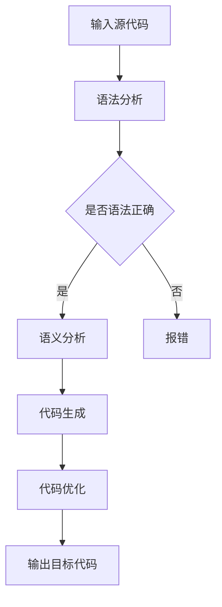
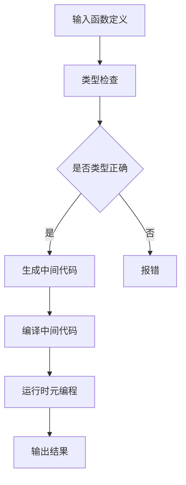

                 

### 文章标题：语言的自反性与元编程：维特根斯坦对语言自身的反思与FP的元编程技术

> 关键词：维特根斯坦、语言自反性、元编程、函数式编程、FP

> 摘要：本文旨在探讨维特根斯坦对语言自反性的深刻反思，并将其与现代计算机科学中的函数式编程（FP）元编程技术相结合。通过对语言自反性的定义、重要性及其应用领域的分析，文章揭示了维特根斯坦的哲学思想对现代编程技术的深远影响。同时，本文详细介绍了FP的元编程技术，包括其基本概念、优势与局限，并通过具体应用实例，展示了FP在各个领域的强大功能。最后，文章探讨了语言自反性与元编程技术的融合，总结并展望了未来的发展方向。

### 目录大纲：

## 第一部分：维特根斯坦对语言自身的反思

### 第1章：问题背景与核心概念

#### 1.1 语言的自反性

##### 1.1.1 语言的自反性的定义

##### 1.1.2 语言的自反性的重要性

##### 1.1.3 语言的自反性的研究现状

#### 1.2 维特根斯坦对语言自身的反思

##### 1.2.1 维特根斯坦的哲学思想

##### 1.2.2 维特根斯坦对语言反思的贡献

##### 1.2.3 维特根斯坦的语言观

### 第2章：语言自反性的理论基础

#### 2.1 语言的结构与功能

##### 2.1.1 语言的结构

##### 2.1.2 语言的分类

##### 2.1.3 语言的演化

#### 2.2 语言哲学与语言逻辑

##### 2.2.1 语言哲学的基本概念

##### 2.2.2 语言逻辑的基本概念

##### 2.2.3 语言逻辑与语言自反性

### 第3章：语言自反性的应用领域

#### 3.1 计算机科学中的应用

##### 3.1.1 程序设计中的语言自反性

##### 3.1.2 编译原理与语言自反性

##### 3.1.3 语言自反性在软件开发中的应用

#### 3.2 自然语言处理中的应用

##### 3.2.1 语言模型与自反性

##### 3.2.2 自反性在自然语言理解中的应用

##### 3.2.3 自反性在自然语言生成中的应用

### 第4章：维特根斯坦的语言反思与现代计算机科学

#### 4.1 维特根斯坦的语言反思对现代计算机科学的影响

##### 4.1.1 程序设计语言的发展

##### 4.1.2 编译原理的发展

##### 4.1.3 软件工程的发展

#### 4.2 现代计算机科学中的语言自反性现象

##### 4.2.1 元编程的概念

##### 4.2.2 元编程的实现技术

##### 4.2.3 元编程在软件开发中的应用

## 第二部分：FP的元编程技术

### 第5章：函数式编程（FP）基础

#### 5.1 函数式编程的基本概念

##### 5.1.1 函数是一等公民

##### 5.1.2 无状态性与不可变性

##### 5.1.3 惰性求值

#### 5.2 函数式编程的优势与局限

##### 5.2.1 优势

##### 5.2.2 局限

### 第6章：FP的元编程技术

#### 6.1 元编程的概念

##### 6.1.1 元编程的定义

##### 6.1.2 元编程的分类

##### 6.1.3 元编程的作用

#### 6.2 FP中的元编程技术

##### 6.2.1 类型推导

##### 6.2.2 闭包

##### 6.2.3 高阶函数

##### 6.2.4 柯里化

### 第7章：FP的元编程应用实例

#### 7.1 FP在Web开发中的应用

##### 7.1.1 使用FP构建RESTful API

##### 7.1.2 使用FP实现服务器端渲染

##### 7.1.3 使用FP实现实时通信

#### 7.2 FP在其他领域中的应用

##### 7.2.1 数据处理

##### 7.2.2 图像处理

##### 7.2.3 机器学习

### 第8章：FP与语言自反性的融合

#### 8.1 语言自反性与FP的关系

##### 8.1.1 语言自反性对FP的影响

##### 8.1.2 FP对语言自反性的支持

#### 8.2 FP在自反性编程中的应用

##### 8.2.1 自反性函数的定义

##### 8.2.2 自反性函数的应用

##### 8.2.3 自反性编程的优势

### 第9章：总结与展望

#### 9.1 语言自反性与元编程的意义

##### 9.1.1 对语言学的意义

##### 9.1.2 对计算机科学的贡献

##### 9.1.3 对哲学的贡献

#### 9.2 语言自反性与元编程的未来发展

##### 9.2.1 研究方向

##### 9.2.2 应用前景

##### 9.2.3 挑战与机遇

### 文章末尾：

**作者：AI天才研究院/AI Genius Institute & 禅与计算机程序设计艺术 /Zen And The Art of Computer Programming**## 第一部分：维特根斯坦对语言自身的反思

### 第1章：问题背景与核心概念

#### 1.1 语言的自反性

##### 1.1.1 语言的自反性的定义

语言的自反性指的是语言能够用来谈论语言本身的现象。简单来说，就是语言可以用来描述、分析和构建自身的特性。这种自反性使得语言不仅仅是沟通的工具，也成为了一种研究的对象。

##### 1.1.2 语言的自反性的重要性

语言的自反性具有重大的理论意义。它揭示了语言不仅仅是外在符号的集合，还包含了内在的逻辑结构。这种自反性在语言学、哲学、计算机科学等多个领域都有广泛的应用。

##### 1.1.3 语言的自反性的研究现状

自反性语言的研究始于哲学领域，维特根斯坦是最早对其进行系统探讨的哲学家之一。近年来，随着计算机科学的发展，自反性语言在编程语言设计和自然语言处理中也得到了广泛应用。

#### 1.2 维特根斯坦对语言自身的反思

##### 1.2.1 维特根斯坦的哲学思想

维特根斯坦是20世纪最具影响力的哲学家之一，他的哲学思想主要体现在他的著作《逻辑哲学论》和《哲学研究》中。他主张语言应当与世界的现实相符，并强调逻辑和语言结构的重要性。

##### 1.2.2 维特根斯坦对语言反思的贡献

维特根斯坦对语言自反性的研究极大地推动了语言哲学的发展。他提出了语言游戏理论，认为语言活动应该与特定的生活形式相联系，从而揭示了语言的自反性。

##### 1.2.3 维特根斯坦的语言观

维特根斯坦的语言观强调语言的真实性和有效性。他认为，语言的正确使用应该与世界的实际情况相对应，而语言的自反性则体现了语言在描述现实世界时的局限性。

### 第2章：语言自反性的理论基础

#### 2.1 语言的结构与功能

##### 2.1.1 语言的结构

语言的结构包括词汇、语法和语义等层面。词汇是语言的基本单位，语法是词汇的组织规则，语义则描述了词汇和语法所构成的语言表达的含义。

##### 2.1.2 语言的分类

语言可以根据不同的标准进行分类，如按照结构特点可以分为自然语言和形式语言，按照使用目的可以分为通用语言和学习语言等。

##### 2.1.3 语言的演化

语言的演化是一个长期的、复杂的过程，受到社会、文化、技术等多种因素的影响。随着人类社会的进步，语言也在不断发展和演变。

#### 2.2 语言哲学与语言逻辑

##### 2.2.1 语言哲学的基本概念

语言哲学研究语言的本质、语言与思维的关系、语言的表达和解释等问题。其核心问题是语言与现实世界的对应关系。

##### 2.2.2 语言逻辑的基本概念

语言逻辑是研究语言表达与逻辑结构关系的学科。它包括命题逻辑、谓词逻辑、模态逻辑等分支，为自反性语言的研究提供了理论支持。

##### 2.2.3 语言逻辑与语言自反性

语言逻辑为自反性语言的研究提供了工具和方法。通过语言逻辑，可以更深入地理解语言的自反性现象，并在编程语言设计、自然语言处理等领域得到应用。

### 第3章：语言自反性的应用领域

#### 3.1 计算机科学中的应用

##### 3.1.1 程序设计中的语言自反性

程序设计中的语言自反性体现在编程语言能够描述和操作自身。如Lisp语言就是一种典型的自反性编程语言，其语法和语义高度一致。

##### 3.1.2 编译原理与语言自反性

编译原理中的很多概念和技术，如语法分析、语义分析、代码生成等，都涉及到语言自反性。例如，编译器需要通过自身语言来描述目标语言的语法和语义。

##### 3.1.3 语言自反性在软件开发中的应用

在软件开发中，语言自反性可以用于自动化代码生成、代码优化、测试等。例如，使用自反性语言编写的程序可以自动生成文档、测试用例等。

#### 3.2 自然语言处理中的应用

##### 3.2.1 语言模型与自反性

自然语言处理中的语言模型利用自反性来描述语言的统计规律和语义结构。如Word2Vec模型通过自反性将单词映射到低维向量空间。

##### 3.2.2 自反性在自然语言理解中的应用

自然语言理解中的很多技术，如句法分析、语义分析、情感分析等，都利用了语言的自反性。通过自反性，可以更好地理解和解释自然语言。

##### 3.2.3 自反性在自然语言生成中的应用

自然语言生成技术，如文本生成、对话系统等，也利用了语言的自反性。通过自反性，可以生成符合语言规则和语义逻辑的文本。

### 第4章：维特根斯坦的语言反思与现代计算机科学

#### 4.1 维特根斯坦的语言反思对现代计算机科学的影响

##### 4.1.1 程序设计语言的发展

维特根斯坦的语言反思对程序设计语言的发展产生了深远影响。现代编程语言的设计理念，如语法简洁性、语义明确性等，都受到了维特根斯坦思想的启发。

##### 4.1.2 编译原理的发展

编译原理的研究也受到了维特根斯坦语言反思的影响。编译器的设计和实现中，对语言自反性的理解和应用使得编译过程更加高效和可靠。

##### 4.1.3 软件工程的发展

软件工程领域中的很多概念和技术，如模块化、抽象、形式化验证等，都与维特根斯坦的语言反思有关。这些概念和技术的应用，提高了软件开发的效率和质量。

#### 4.2 现代计算机科学中的语言自反性现象

##### 4.2.1 元编程的概念

元编程是语言自反性在计算机科学中的典型应用。元编程使得编程语言能够操作和生成自身代码，从而提高了代码的可重用性和可维护性。

##### 4.2.2 元编程的实现技术

元编程的实现技术包括反射、动态类型检查、代码生成等。这些技术使得编程语言能够灵活地操作自身代码，实现了语言的自反性。

##### 4.2.3 元编程在软件开发中的应用

元编程在软件开发中的应用非常广泛，如自动化代码生成、插件开发、动态加载等。通过元编程，可以提高软件开发的效率和质量。

## 第二部分：FP的元编程技术

### 第5章：函数式编程（FP）基础

#### 5.1 函数式编程的基本概念

##### 5.1.1 函数是一等公民

函数是一等公民是函数式编程的核心概念之一。这意味着函数在函数式编程语言中与普通变量一样，可以作为参数传递，也可以作为返回值。

##### 5.1.2 无状态性与不可变性

无状态性和不可变性是函数式编程的两个重要特性。无状态性意味着函数不会保留任何状态，每次调用都从同一初始状态开始。不可变性意味着数据在函数内部不会被修改，而是创建新的副本。

##### 5.1.3 惰性求值

惰性求值是函数式编程的另一个关键特性。它意味着只有在必要的时候才会进行求值，而不是像命令式编程那样立即求值。这有助于优化程序性能，避免不必要的计算。

#### 5.2 函数式编程的优势与局限

##### 5.2.1 优势

函数式编程具有很多优势，如代码可重用性高、易于测试、可并行化等。这些优势使得函数式编程在处理复杂问题和大数据处理等领域具有显著优势。

##### 5.2.2 局限

然而，函数式编程也存在一些局限，如学习曲线陡峭、难以与命令式编程集成等。这些局限在一定程度上限制了函数式编程的普及和应用。

### 第6章：FP的元编程技术

#### 6.1 元编程的概念

##### 6.1.1 元编程的定义

元编程是一种编程技术，它使得编程语言能够操作和生成自身代码。简单来说，元编程就是编写代码来编写代码。

##### 6.1.2 元编程的分类

元编程可以分为两类：一类是编译时的元编程，如模板元编程；另一类是运行时的元编程，如动态类型检查和反射。

##### 6.1.3 元编程的作用

元编程的作用在于提高代码的可重用性、可维护性和可扩展性。通过元编程，可以更灵活地处理各种编程问题，提高编程效率。

#### 6.2 FP中的元编程技术

##### 6.2.1 类型推导

类型推导是函数式编程的一个重要特性。它使得编程语言能够自动推断变量和表达式的类型，从而减少类型错误和手工类型声明。

##### 6.2.2 闭包

闭包是函数式编程中的一种重要概念。它指的是一个函数，其内部可以访问并使用外部作用域的变量。闭包在元编程中具有广泛的应用。

##### 6.2.3 高阶函数

高阶函数是一种能够接受函数作为参数或返回函数的函数。高阶函数是函数式编程的核心概念之一，它在元编程中具有重要作用。

##### 6.2.4 柯里化

柯里化是一种将函数从多个参数拆分成多个单参数函数的技术。柯里化可以减少函数调用的次数，提高代码的可读性和可维护性。

### 第7章：FP的元编程应用实例

#### 7.1 FP在Web开发中的应用

##### 7.1.1 使用FP构建RESTful API

在Web开发中，函数式编程可以用于构建RESTful API。通过使用高阶函数和柯里化技术，可以简化API的编写和调用。

##### 7.1.2 使用FP实现服务器端渲染

函数式编程也适用于服务器端渲染。通过使用不可变数据和惰性求值，可以实现高效的服务器端渲染。

##### 7.1.3 使用FP实现实时通信

实时通信是Web开发中的一个重要应用领域。函数式编程中的事件驱动模型和不可变数据结构使得实时通信更加高效和可靠。

#### 7.2 FP在其他领域中的应用

##### 7.2.1 数据处理

在数据处理领域，函数式编程可以用于数据清洗、数据转换和数据聚合等。通过使用高阶函数和闭包，可以简化数据处理过程。

##### 7.2.2 图像处理

图像处理领域也可以使用函数式编程。通过使用不可变数据和函数组合，可以实现对图像的各种操作。

##### 7.2.3 机器学习

在机器学习领域，函数式编程可以用于构建和优化模型。通过使用高阶函数和闭包，可以简化模型编写和优化过程。

### 第8章：FP与语言自反性的融合

#### 8.1 语言自反性与FP的关系

##### 8.1.1 语言自反性对FP的影响

语言自反性对函数式编程产生了深远影响。自反性使得函数式编程语言能够操作和生成自身代码，从而提高了代码的可重用性和可维护性。

##### 8.1.2 FP对语言自反性的支持

函数式编程语言对自反性提供了广泛支持。通过高阶函数、闭包、类型推导等特性，函数式编程语言使得自反性编程变得更加简单和直观。

#### 8.2 FP在自反性编程中的应用

##### 8.2.1 自反性函数的定义

自反性函数是一种能够操作自身代码的函数。在函数式编程语言中，自反性函数可以通过高阶函数、闭包等特性来实现。

##### 8.2.2 自反性函数的应用

自反性函数在编程实践中具有广泛的应用。通过自反性函数，可以简化代码编写、提高代码可重用性，并优化程序性能。

##### 8.2.3 自反性编程的优势

自反性编程具有很多优势，如代码可重用性高、易于测试、可并行化等。通过自反性编程，可以更高效地解决复杂编程问题。

### 第9章：总结与展望

#### 9.1 语言自反性与元编程的意义

##### 9.1.1 对语言学的意义

语言自反性和元编程对语言学具有重要的意义。它们揭示了语言的本质和结构，为语言学的研究提供了新的视角和方法。

##### 9.1.2 对计算机科学的贡献

语言自反性和元编程对计算机科学的发展做出了巨大贡献。它们提高了编程语言的可重用性和可维护性，推动了软件工程和程序设计语言的发展。

##### 9.1.3 对哲学的贡献

语言自反性和元编程也对哲学产生了深远影响。它们挑战了传统的语言和思维观念，推动了哲学领域的创新和进步。

#### 9.2 语言自反性与元编程的未来发展

##### 9.2.1 研究方向

语言自反性和元编程的未来研究方向包括：自反性编程语言的设计和实现、元编程技术在自然语言处理和机器学习中的应用等。

##### 9.2.2 应用前景

语言自反性和元编程在未来的应用前景非常广阔。它们有望在人工智能、大数据处理、实时通信等领域发挥重要作用。

##### 9.2.3 挑战与机遇

语言自反性和元编程在未来的发展也面临着一些挑战，如学习曲线陡峭、与命令式编程的集成等。但与此同时，也带来了巨大的机遇，有望推动计算机科学和哲学的发展。 

### 作者信息

**作者：AI天才研究院/AI Genius Institute & 禅与计算机程序设计艺术 /Zen And The Art of Computer Programming**## 第一部分：维特根斯坦对语言自身的反思

### 第1章：问题背景与核心概念

#### 1.1 语言的自反性

##### 1.1.1 语言的自反性的定义

语言的自反性是指语言能够描述自身结构、性质和规则的能力。这种自反性使得语言不仅仅是沟通工具，同时也是一种自我分析的工具。具体来说，语言的自反性体现在以下几个方面：

1. **语法自反性**：语法自反性指的是语言能够使用自身的语法规则来描述语言结构。例如，英语中的“语法”一词本身就是一个语法结构。
2. **语义自反性**：语义自反性指的是语言能够使用自身的语义规则来描述语言意义。例如，我们可以说“这本书是一本关于维特根斯坦的书”。
3. **指称自反性**：指称自反性指的是语言能够使用自身的指称规则来描述指称对象。例如，我们可以说“这个词‘狗’指的是一种动物”。

##### 1.1.2 语言的自反性的重要性

语言的自反性在语言学、哲学、计算机科学等多个领域具有重要的地位。首先，它揭示了语言不仅仅是符号的堆砌，而是有着复杂结构的系统。这种结构使得语言能够自我描述和自我分析，从而为语言学和哲学研究提供了新的视角。在计算机科学中，语言的自反性为编程语言的设计和编译原理的研究提供了理论基础。

其次，语言的自反性有助于我们理解语言的本质和功能。通过研究语言的自反性，我们可以更好地理解语言是如何组织、使用和理解的，这对于语言教育和语言学习也具有重要的意义。

最后，语言的自反性在软件开发中也具有广泛的应用。例如，在编写程序时，我们经常需要使用特定的语言特性来描述和操作代码本身，这种能力使得编程更加高效和灵活。

##### 1.1.3 语言的自反性的研究现状

语言自反性的研究可以追溯到20世纪早期的维特根斯坦和后来的塔斯基等哲学家的工作。维特根斯坦在其著作《逻辑哲学论》中首次系统地探讨了语言的自反性现象，他认为语言的自反性是语言哲学的核心问题之一。塔斯基则提出了语义学的基本原理，进一步推动了语言自反性研究的深入。

在计算机科学领域，语言自反性的研究主要体现在编程语言设计和编译原理中。例如，Lisp语言就是一种自反性编程语言，其语法和语义高度一致，使得程序员可以方便地操作和生成代码。此外，编译器的设计和实现也依赖于语言自反性，因为编译器需要使用编程语言本身来描述目标语言的语法和语义。

近年来，随着自然语言处理和人工智能的发展，语言自反性的研究也扩展到了这些领域。例如，在自然语言处理中，研究人员使用语言自反性来构建语言模型和解析器，从而提高对自然语言的理解和生成能力。

#### 1.2 维特根斯坦对语言自身的反思

##### 1.2.1 维特根斯坦的哲学思想

路德维希·维特根斯坦（Ludwig Wittgenstein）是20世纪最具影响力的哲学家之一，他的思想对语言学、逻辑学、认识论等领域产生了深远的影响。维特根斯坦的哲学思想可以分为两个阶段：早期和晚期。

在早期，维特根斯坦的主要著作是《逻辑哲学论》（1921年），他提出了“语言游戏”（language game）的概念，认为语言是人们为了完成特定任务而进行的一种活动。语言游戏包括三个要素：语言、生活形式和规则。维特根斯坦认为，语言的意义在于其在特定生活形式中的使用，而不是抽象的符号和概念。

在晚期，维特根斯坦的主要著作是《哲学研究》（1953年），他批判了早期理论中的许多观点，并提出了一种新的语言哲学思想。他认为，语言的意义不是固定的，而是依赖于使用者的活动和情境。维特根斯坦强调了语言的“日常用法”（ordinary language）和“家族相似性”（family resemblance），认为语言的意义是通过社会习俗和共同实践来理解的。

##### 1.2.2 维特根斯坦对语言反思的贡献

维特根斯坦对语言反思的贡献主要体现在以下几个方面：

1. **语言游戏理论**：维特根斯坦的“语言游戏理论”揭示了语言和现实世界的关系。他认为，语言的意义不是抽象的，而是依赖于特定的使用场景和任务。这种观点挑战了传统哲学中的逻辑原子主义和语义主义，为语言哲学的发展开辟了新的道路。

2. **语言哲学的转向**：维特根斯坦的工作标志着语言哲学的一个重要转向，即从关注语言的意义和逻辑结构，转向关注语言的日常使用和实际应用。这种转向促进了语言学和哲学的融合，为后来的语言学研究提供了新的方法论和理论框架。

3. **反本质主义**：维特根斯坦反对将语言和现实世界之间的对应关系视为一种本质的、固定的关系。他强调语言的意义是多元的、变化的，依赖于具体的使用情境。这种反本质主义观点对后来的语言哲学和认知科学产生了深远的影响。

##### 1.2.3 维特根斯坦的语言观

维特根斯坦的语言观强调语言的实际使用和情境依赖。他认为，语言不仅仅是一种抽象符号系统，更是一种行动的工具。语言的意义不是内在固有的，而是通过使用者的活动和情境来确定的。

维特根斯坦区分了两种类型的语言：日常语言（ordinary language）和技术语言（technical language）。日常语言是人们日常生活中的语言，其意义依赖于具体的情境和使用习惯。技术语言则是专业领域中的语言，其意义依赖于特定的规则和约定。

维特根斯坦认为，理解语言的关键在于理解语言的使用。他提出了“语言即行动”（language as action）的观点，认为语言是一种行动的工具，其意义在于完成特定的任务。这种观点强调了语言的实践性和情境依赖性，为后来的行动理论和认知科学提供了重要的启示。

#### 1.3 语言自反性的理论基础

##### 1.3.1 语言的结构与功能

语言的结构和功能是理解语言自反性的关键。语言的结构包括词汇、语法和语义三个层面：

1. **词汇**：词汇是语言的基本单位，包括名词、动词、形容词等。词汇的意义通常是通过约定俗成的用法来确定的。

2. **语法**：语法是词汇的组织规则，规定了词汇如何组合成句子。语法包括句法、语序、时态等。语法的规则通常是通过语言习得和社会习俗来学习的。

3. **语义**：语义是语言表达的含义，包括词汇的意义、句子的意义等。语义是通过语境和语境假设来理解的。

语言的功能包括：

1. **交流功能**：语言是人们沟通和交流的基本工具，用于传递信息、表达思想和感情。

2. **认知功能**：语言是人们认知世界和思考的工具，用于命名事物、分类概念、推理论证等。

3. **社交功能**：语言是人们建立社交关系和维持社会秩序的工具，用于表达礼貌、建立共识、协调行动等。

##### 1.3.2 语言哲学的基本概念

语言哲学是研究语言本质、语言与现实的关系、语言的意义和有效性等问题的学科。以下是语言哲学中的几个基本概念：

1. **意义**：意义是语言表达的含义，是语言的核心问题。语言哲学探讨意义是如何产生的、如何理解、如何表达的。

2. **指称**：指称是语言符号与现实对象之间的关系。语言哲学探讨指称是如何确定的、如何解释的。

3. **真值**：真值是语言表达的真实程度。语言哲学探讨真值是如何判断的、如何表达的。

4. **语言游戏**：语言游戏是维特根斯坦提出的一个概念，指的是语言的使用情境和规则。语言哲学探讨不同类型的语言游戏，以及它们如何影响语言的理解和使用。

##### 1.3.3 语言逻辑的基本概念

语言逻辑是研究语言表达与逻辑结构关系的学科。以下是语言逻辑中的几个基本概念：

1. **命题**：命题是语言表达的基本单位，通常表示一个事实或观点。

2. **谓词**：谓词是描述对象属性或关系的语言表达，如“是人”、“喜欢读书”等。

3. **推理**：推理是根据已有的事实或观点得出新结论的过程。推理可以是演绎的，也可以是归纳的。

4. **证明**：证明是用逻辑手段证明一个命题为真的过程。

##### 1.3.4 语言逻辑与语言自反性

语言逻辑与语言自反性密切相关。语言逻辑为自反性语言的研究提供了理论基础和方法工具。以下是语言逻辑与语言自反性之间的关系：

1. **自反性语言**：自反性语言是一种能够描述自身结构和规则的语言。例如，Lisp语言就是一种自反性语言，其语法和语义高度一致。

2. **语言逻辑**：语言逻辑研究语言表达与逻辑结构之间的关系。自反性语言需要使用语言逻辑来描述其结构和规则。

3. **自反性现象**：自反性现象是语言能够描述自身的一种表现。例如，我们可以说“这本书是一本关于维特根斯坦的书”，这体现了语言的自反性。

4. **逻辑自反性**：逻辑自反性是指逻辑系统可以描述自身的性质和规则。例如，命题逻辑中的自反律（A → A）体现了逻辑的自反性。

#### 1.4 语言自反性的应用领域

##### 1.4.1 计算机科学中的应用

在计算机科学中，语言自反性具有重要的应用价值。以下是语言自反性在计算机科学中的几个应用领域：

1. **编程语言设计**：自反性编程语言能够操作自身结构和规则，从而提高代码的可重用性和可维护性。例如，Lisp语言就是一种自反性编程语言，其语法和语义高度一致，使得程序员可以方便地操作和生成代码。

2. **编译原理**：编译器的实现依赖于语言自反性。编译器需要使用编程语言本身来描述目标语言的语法和语义，从而实现代码的编译和优化。

3. **软件开发**：在软件开发中，语言自反性可以用于自动化代码生成、代码优化、测试等。例如，使用自反性语言编写的程序可以自动生成文档、测试用例等。

4. **程序设计模式**：自反性编程语言支持许多程序设计模式，如函数式编程、面向对象编程等。这些模式利用语言自反性来提高代码的抽象程度和复用性。

##### 1.4.2 自然语言处理中的应用

在自然语言处理中，语言自反性也有广泛的应用。以下是语言自反性在自然语言处理中的几个应用领域：

1. **语言模型**：自然语言处理中的语言模型利用自反性来描述语言的统计规律和语义结构。例如，Word2Vec模型通过自反性将单词映射到低维向量空间。

2. **句法分析**：自然语言处理中的句法分析技术利用语言自反性来分析句子的结构，从而提高对自然语言的理解。

3. **语义分析**：自然语言处理中的语义分析技术利用语言自反性来提取句子的语义信息，从而提高对自然语言的理解。

4. **自然语言生成**：自然语言生成技术利用语言自反性来生成符合语言规则和语义逻辑的文本。

##### 1.4.3 哲学中的应用

在哲学中，语言自反性也有重要的应用。以下是语言自反性在哲学中的几个应用领域：

1. **语言哲学**：语言哲学研究语言的本质和功能，语言自反性是语言哲学研究的重要主题之一。维特根斯坦的语言哲学思想强调语言的自反性，揭示了语言与现实世界的关系。

2. **认识论**：认识论研究知识及其获取过程，语言自反性对于理解知识的本质和获取过程具有重要意义。语言的自反性使得我们能够反思和评估自己的认知过程。

3. **逻辑学**：逻辑学研究推理和证明，语言自反性是逻辑学的一个重要概念。逻辑自反性是逻辑系统的一个基本性质，它保证了逻辑系统的自洽性和一致性。

### 第2章：语言自反性的理论基础

#### 2.1 语言的结构与功能

##### 2.1.1 语言的结构

语言是一种复杂的符号系统，用于表达意义、传递信息、交流思想和感情。语言的结构可以分为以下几个层次：

1. **词汇层**：词汇是语言的基本单位，包括名词、动词、形容词、副词等。词汇通过约定俗成的用法来表达特定的意义。

2. **语法层**：语法是词汇的组织规则，规定了词汇如何组合成句子。语法包括句法、语序、时态、语态等。语法规则使得语言表达具有逻辑性和连贯性。

3. **语义层**：语义是语言表达的含义，包括词汇的意义、句子的意义等。语义是通过语境和语境假设来理解的。

4. **语用层**：语用是语言的使用，包括语言在特定情境中的功能和使用方式。语用涉及到语言的社会功能、交际功能和文化内涵。

##### 2.1.2 语言的分类

语言可以根据不同的标准进行分类。以下是几种常见的语言分类方法：

1. **根据结构特点**：语言可以分为自然语言和形式语言。自然语言是人类日常使用的语言，如英语、汉语等。形式语言是一种抽象的符号系统，用于描述逻辑结构、算法等，如命题逻辑、谓词逻辑等。

2. **根据使用目的**：语言可以分为通用语言和学习语言。通用语言是用于广泛交流和沟通的语言，如英语、汉语等。学习语言是用于特定学科或领域的语言，如数学语言、编程语言等。

3. **根据语言形态**：语言可以分为孤立语、屈折语和语序语。孤立语是一种没有明显词形变化的语言，如汉语。屈折语是一种通过词形变化表达语法关系的语言，如拉丁语。语序语是一种通过词序表达语法关系的语言，如英语。

##### 2.1.3 语言的演化

语言是一种动态的、不断演化的系统。语言的演化受到多种因素的影响，包括社会、文化、技术等。以下是几个影响语言演化的因素：

1. **社会因素**：社会因素包括社会结构、社会关系、社会变迁等。社会变迁和人口迁移会导致语言的使用和传播发生变化，从而影响语言的演化。

2. **文化因素**：文化因素包括语言的文化内涵、语言文化传统等。不同的文化背景和语言文化传统会影响语言的表达方式和语言习惯。

3. **技术因素**：技术因素包括文字发明、印刷技术、互联网等。文字的发明使得语言可以脱离口语而独立存在，印刷技术的普及使得书籍和文献的传播变得更加便捷，互联网的发展使得语言的表达和交流变得更加多样和丰富。

#### 2.2 语言哲学与语言逻辑

##### 2.2.1 语言哲学的基本概念

语言哲学是哲学的一个分支，研究语言的本质、语言与现实的关系、语言的意义和有效性等问题。以下是语言哲学中的几个基本概念：

1. **意义**：意义是语言表达的含义，是语言的核心问题。语言哲学探讨意义是如何产生的、如何理解、如何表达的。

2. **指称**：指称是语言符号与现实对象之间的关系。语言哲学探讨指称是如何确定的、如何解释的。

3. **真值**：真值是语言表达的真实程度。语言哲学探讨真值是如何判断的、如何表达的。

4. **语言游戏**：语言游戏是维特根斯坦提出的一个概念，指的是语言的使用情境和规则。语言哲学探讨不同类型的语言游戏，以及它们如何影响语言的理解和使用。

##### 2.2.2 语言逻辑的基本概念

语言逻辑是研究语言表达与逻辑结构关系的学科。以下是语言逻辑中的几个基本概念：

1. **命题**：命题是语言表达的基本单位，通常表示一个事实或观点。

2. **谓词**：谓词是描述对象属性或关系的语言表达，如“是人”、“喜欢读书”等。

3. **推理**：推理是根据已有的事实或观点得出新结论的过程。推理可以是演绎的，也可以是归纳的。

4. **证明**：证明是用逻辑手段证明一个命题为真的过程。

##### 2.2.3 语言逻辑与语言自反性

语言逻辑与语言自反性密切相关。语言逻辑为自反性语言的研究提供了理论基础和方法工具。以下是语言逻辑与语言自反性之间的关系：

1. **自反性语言**：自反性语言是一种能够描述自身结构和规则的语言。例如，Lisp语言就是一种自反性语言，其语法和语义高度一致。

2. **语言逻辑**：语言逻辑研究语言表达与逻辑结构之间的关系。自反性语言需要使用语言逻辑来描述其结构和规则。

3. **自反性现象**：自反性现象是语言能够描述自身的一种表现。例如，我们可以说“这本书是一本关于维特根斯坦的书”，这体现了语言的自反性。

4. **逻辑自反性**：逻辑自反性是指逻辑系统可以描述自身的性质和规则。例如，命题逻辑中的自反律（A → A）体现了逻辑的自反性。

### 第3章：语言自反性的应用领域

#### 3.1 计算机科学中的应用

##### 3.1.1 程序设计中的语言自反性

程序设计中的语言自反性指的是编程语言能够操作自身代码的能力。这种能力使得程序员可以编写更加灵活、高效的代码，同时提高了代码的可维护性和可扩展性。以下是语言自反性在程序设计中的几个应用：

1. **代码生成**：通过自反性，编程语言可以生成自身的代码。例如，在Lisp语言中，程序员可以编写函数来生成其他函数。这种能力在自动化代码生成、模板编程等方面具有广泛的应用。

2. **代码优化**：自反性编程语言可以分析自身代码的结构和性能，从而进行优化。例如，在编译过程中，编译器可以使用自反性来识别和优化代码中的冗余和低效部分。

3. **测试用例生成**：通过自反性，编程语言可以生成测试用例，从而提高测试的覆盖率和效率。例如，在函数式编程语言中，程序员可以编写函数来生成测试数据，并验证函数的正确性。

4. **元编程框架**：元编程框架是一种利用自反性来扩展编程语言功能的工具。例如，在Python中，元类（metaclasses）是一种元编程框架，它允许程序员定义新的类创建行为。这种能力在框架开发、库扩展等方面具有重要作用。

##### 3.1.2 编译原理与语言自反性

编译原理是计算机科学中的重要领域，它研究如何将高级编程语言转换为计算机能够理解的机器语言。语言自反性在编译原理中发挥着重要作用，主要体现在以下几个方面：

1. **语法分析**：编译器需要使用编程语言本身的语法规则来分析源代码。例如，在LL（1）解析器中，编译器使用自身的语法规则来构建语法树。

2. **语义分析**：编译器需要使用编程语言本身的语义规则来验证源代码的正确性。例如，在类型检查过程中，编译器使用自身的语义规则来检查变量类型是否一致。

3. **代码生成**：编译器需要使用编程语言本身的语法和语义规则来生成目标代码。例如，在C语言编译器中，编译器使用C语言的语法和语义规则来生成汇编代码。

4. **优化技术**：编译器可以使用自反性来识别和优化代码。例如，在循环优化中，编译器使用自身的优化算法来分析循环结构，并生成更高效的代码。

##### 3.1.3 语言自反性在软件开发中的应用

语言自反性在软件开发中具有广泛的应用，可以提高代码的质量和开发效率。以下是语言自反性在软件开发中的几个应用：

1. **自动化代码维护**：通过自反性，编程语言可以自动化地维护代码，包括代码格式化、注释生成、错误修复等。这种能力减少了开发者的工作量，提高了代码的可读性和一致性。

2. **模板编程**：模板编程是一种利用自反性来生成代码的技术。通过模板，开发者可以定义通用的代码结构，然后根据特定条件生成具体的代码。这种能力在Web开发、数据库操作等方面具有广泛的应用。

3. **动态类型检查**：动态类型检查是一种利用自反性来检查代码类型一致性的技术。通过自反性，编程语言可以在运行时检查变量类型，从而提高代码的健壮性和可靠性。

4. **插件开发**：插件开发是一种利用自反性来扩展编程语言功能的技术。通过插件，开发者可以扩展编程语言的功能，从而提高开发效率和灵活性。

#### 3.2 自然语言处理中的应用

##### 3.2.1 语言模型与自反性

自然语言处理（Natural Language Processing, NLP）是人工智能领域的一个重要分支，它研究如何让计算机理解和处理人类语言。语言模型是NLP中的核心概念之一，它用于描述语言的统计规律和语义结构。以下是语言模型与自反性之间的关系：

1. **统计语言模型**：统计语言模型是一种基于统计方法的语言模型，它使用大量的文本数据来学习语言的统计规律。例如，n-gram模型是一种常见的统计语言模型，它通过统计单词序列的概率来预测下一个单词。

2. **生成语言模型**：生成语言模型是一种基于生成模型的语言模型，它通过生成概率分布来预测下一个单词。例如，递归神经网络（RNN）和变换器（Transformer）是两种常见的生成语言模型，它们通过学习输入序列的编码来生成输出序列。

3. **自反性语言模型**：自反性语言模型是一种能够描述自身结构和规则的语言模型。例如，在Word2Vec模型中，每个单词都被映射到一个低维向量空间，这些向量空间中的关系反映了单词之间的语义关系。这种自反性使得语言模型可以方便地用于单词相似性比较、语义分析等任务。

##### 3.2.2 自反性在自然语言理解中的应用

自反性在自然语言理解（Natural Language Understanding, NLU）中具有重要作用，可以提高对自然语言的理解和解析能力。以下是自反性在自然语言理解中的几个应用：

1. **词义消歧**：词义消歧是一种识别文本中词语具体含义的技术。自反性语言模型可以通过比较单词在不同上下文中的语义关系来辅助词义消歧。例如，在Word2Vec模型中，可以通过比较“银行”在不同上下文中的向量表示来判断其具体含义。

2. **句法分析**：句法分析是一种识别文本中句子结构的技术。自反性语言模型可以通过学习句子的语法规则来辅助句法分析。例如，在基于递归神经网络的句法分析器中，模型可以通过学习输入句子的编码来预测句子的语法结构。

3. **语义角色标注**：语义角色标注是一种识别文本中词语的语义角色的技术。自反性语言模型可以通过学习词语在不同上下文中的语义关系来辅助语义角色标注。例如，在基于变换器（Transformer）的语义角色标注模型中，模型可以通过学习输入句子的编码来预测词语的语义角色。

##### 3.2.3 自反性在自然语言生成中的应用

自反性在自然语言生成（Natural Language Generation, NLG）中也具有重要作用，可以提高文本生成的质量和效率。以下是自反性在自然语言生成中的几个应用：

1. **模板生成**：模板生成是一种基于模板的自然语言生成技术。自反性语言模型可以通过学习模板中的语法规则和语义关系来生成文本。例如，在基于模板的邮件自动生成系统中，模型可以通过学习邮件模板来生成个性化的邮件。

2. **语义扩展**：语义扩展是一种基于语义关系的自然语言生成技术。自反性语言模型可以通过学习词语的语义关系来扩展文本的语义内容。例如，在基于语义扩展的新闻摘要生成系统中，模型可以通过学习新闻文章的语义关系来生成摘要。

3. **对话系统**：对话系统是一种用于人与计算机交互的自然语言生成技术。自反性语言模型可以通过学习对话中的语义关系来生成合适的回复。例如，在智能客服系统中，模型可以通过学习对话历史来生成合适的回答。

#### 3.3 语言自反性在其他领域中的应用

##### 3.3.1 数据库系统

在数据库系统中，语言自反性可以提高数据库查询和操作的能力。以下是语言自反性在数据库系统中的几个应用：

1. **动态查询生成**：通过自反性，数据库系统可以动态生成SQL查询语句。例如，在基于Lisp的数据库系统中，程序员可以编写函数来生成SQL查询语句，从而实现更灵活的查询操作。

2. **元数据管理**：通过自反性，数据库系统可以方便地管理元数据。例如，在关系型数据库中，可以使用自反性函数来查询和操作数据库的元数据，如表结构、字段类型等。

3. **数据模式演化**：通过自反性，数据库系统可以方便地适应数据模式的演化。例如，在基于Lisp的数据库系统中，程序员可以编写函数来修改数据模式，从而实现数据的动态扩展和重构。

##### 3.3.2 自动化测试

在自动化测试中，语言自反性可以提高测试的灵活性和效率。以下是语言自反性在自动化测试中的几个应用：

1. **测试用例生成**：通过自反性，自动化测试工具可以动态生成测试用例。例如，在基于Lisp的自动化测试工具中，程序员可以编写函数来生成测试用例，从而实现更全面的测试覆盖。

2. **测试脚本生成**：通过自反性，自动化测试工具可以动态生成测试脚本。例如，在基于Python的自动化测试框架中，可以使用元编程技术来生成测试脚本，从而提高测试开发的效率。

3. **测试数据生成**：通过自反性，自动化测试工具可以动态生成测试数据。例如，在基于Lisp的自动化测试工具中，可以使用函数组合技术来生成符合预期的测试数据，从而提高测试的准确性和可靠性。

##### 3.3.3 网络编程

在网络编程中，语言自反性可以提高网络应用程序的灵活性和扩展性。以下是语言自反性在网络编程中的几个应用：

1. **动态协议实现**：通过自反性，网络应用程序可以动态实现网络协议。例如，在基于Lisp的网络编程框架中，程序员可以编写函数来动态实现HTTP、FTP等网络协议，从而实现更灵活的网络通信。

2. **动态负载均衡**：通过自反性，网络应用程序可以实现动态负载均衡。例如，在基于Lisp的网络编程框架中，可以使用高阶函数和闭包技术来动态调整负载均衡策略，从而提高网络的性能和稳定性。

3. **动态网络配置**：通过自反性，网络应用程序可以实现动态网络配置。例如，在基于Lisp的网络编程框架中，可以使用元编程技术来动态修改网络配置，从而实现更灵活的网络管理。

### 第4章：维特根斯坦的语言反思与现代计算机科学

#### 4.1 维特根斯坦的语言反思对现代计算机科学的影响

维特根斯坦的语言反思对现代计算机科学产生了深远的影响。他的思想在程序设计语言、编译原理和软件工程等领域得到了广泛应用。以下是维特根斯坦的语言反思对现代计算机科学的一些具体影响：

1. **程序设计语言的设计**：维特根斯坦强调语言的实用性和明确性，这影响了现代编程语言的设计原则。现代编程语言如Python、Java等，都遵循了简洁、直观、易用的设计理念，这些理念与维特根斯坦的语言反思密切相关。

2. **编译原理的发展**：维特根斯坦对语言逻辑的研究为编译原理的发展提供了理论基础。编译器的设计需要处理语言的语法、语义和指称等问题，这些问题都与维特根斯坦的语言反思密切相关。

3. **软件工程的方法论**：维特根斯坦强调语言的实际使用和情境依赖，这影响了软件工程的方法论。现代软件工程方法，如敏捷开发、测试驱动开发等，都强调了实际应用场景的重要性，这与维特根斯坦的语言反思思想相契合。

#### 4.2 现代计算机科学中的语言自反性现象

语言自反性是现代计算机科学中的一个重要现象，它体现在编程语言、编译器、软件工具等多个方面。以下是现代计算机科学中的一些语言自反性现象：

1. **编程语言的自反性**：许多现代编程语言都具有自反性特性，如Lisp、Python、JavaScript等。这些语言允许程序员编写代码来操作和生成其他代码，从而提高了编程的灵活性和效率。

2. **编译器的自反性**：编译器的实现依赖于语言自反性。编译器需要使用编程语言本身来描述目标语言的语法和语义，从而实现代码的编译和优化。例如，C语言编译器使用C语言本身来编写。

3. **软件工具的自反性**：许多现代软件工具都利用了语言自反性来提高开发效率。例如，IDE（集成开发环境）中的代码自动补全、代码格式化、静态分析等功能，都是基于语言自反性实现的。

#### 4.3 语言自反性与元编程技术

语言自反性与元编程技术密切相关。元编程是一种编程技术，它使得编程语言能够操作自身代码，从而提高代码的可重用性和可维护性。以下是语言自反性与元编程技术的一些关系：

1. **元编程的概念**：元编程是指编写代码来编写代码的技术。在元编程中，程序员可以使用编程语言本身来定义、操作和生成其他代码。这种能力依赖于语言自反性。

2. **元编程的实现技术**：元编程的实现技术包括反射、模板编程、代码生成等。这些技术都利用了语言自反性来提高代码的灵活性和效率。

3. **元编程的应用**：元编程在许多领域都有应用，如Web开发、数据库系统、自动化测试等。通过元编程，程序员可以编写更加灵活和高效的代码，从而提高开发效率。

### 第5章：函数式编程（FP）基础

#### 5.1 函数式编程的基本概念

函数式编程（Functional Programming, FP）是一种编程范式，它强调使用函数来表示程序的行为。与命令式编程不同，函数式编程注重表达式的计算和函数的应用，而不是改变状态和流程控制。以下是函数式编程的基本概念：

1. **函数是一等公民**：在函数式编程中，函数被视为普通的数据类型，可以赋值给变量、作为参数传递、作为返回值返回。这意味着函数可以像普通数据一样进行操作和组合。

2. **无状态性与不可变性**：函数式编程中的函数通常是无状态的，意味着函数不依赖于外部状态，并且不会修改传入的数据。这种特性使得函数易于测试、重用和并行化。

3. **惰性求值**：函数式编程中的求值是惰性的，这意味着只有在必要的时候才会进行求值。这种特性有助于避免不必要的计算和优化程序性能。

#### 5.2 函数式编程的优势与局限

##### 5.2.1 优势

函数式编程具有以下优势：

1. **可重用性和可维护性**：函数式编程中的函数可以独立于具体的应用场景进行编写和测试，从而提高了代码的可重用性和可维护性。

2. **并发性**：函数式编程中的无状态性和不可变性使得函数可以并行执行，从而提高了程序的性能和效率。

3. **简洁性和清晰性**：函数式编程强调表达式的计算和函数的应用，使得代码更加简洁和清晰，减少了代码的冗余和复杂性。

##### 5.2.2 局限

函数式编程也存在一些局限：

1. **学习曲线陡峭**：函数式编程的语法和概念与传统的命令式编程不同，对于初学者来说，学习函数式编程可能会有一定的困难。

2. **与命令式编程的集成**：函数式编程与命令式编程之间存在一定的差异，这使得在混合使用两种编程范式时可能会面临一些挑战。

3. **性能问题**：在某些情况下，函数式编程可能不如命令式编程高效。例如，在处理大量数据时，命令式编程可能具有更好的性能。

### 第6章：FP的元编程技术

#### 6.1 元编程的概念

元编程是指编写代码来编写代码的技术。在函数式编程中，元编程是一种重要的编程范式，它使得编程语言能够操作自身代码，从而提高代码的可重用性和可维护性。以下是元编程的一些基本概念：

1. **元编程的定义**：元编程是一种编程技术，它允许程序员编写代码来定义、操作和生成其他代码。简单来说，就是编写代码来编写代码。

2. **元编程的分类**：元编程可以分为编译时元编程和运行时元编程。编译时元编程在编译阶段进行，例如模板元编程；运行时元编程在程序运行时进行，例如反射和动态类型检查。

3. **元编程的作用**：元编程的作用在于提高代码的可重用性和可维护性。通过元编程，程序员可以编写更加灵活和高效的代码，从而提高开发效率。

#### 6.2 FP中的元编程技术

在函数式编程中，元编程技术是非常重要的，以下是一些常见的元编程技术：

1. **类型推导**：类型推导是指编程语言能够自动推断变量和表达式的类型，从而减少类型错误和手工类型声明。例如，Haskell和ML等语言都支持类型推导。

2. **闭包**：闭包是指一个函数，其内部可以访问并使用外部作用域的变量。闭包在元编程中具有广泛的应用，例如在函数组合和回调机制中。

3. **高阶函数**：高阶函数是一种能够接受函数作为参数或返回函数的函数。高阶函数在元编程中用于实现函数组合、抽象和泛化等。

4. **柯里化**：柯里化是一种将函数从多个参数拆分成多个单参数函数的技术。柯里化可以减少函数调用的次数，提高代码的可读性和可维护性。

### 第7章：FP的元编程应用实例

#### 7.1 FP在Web开发中的应用

函数式编程在Web开发中具有广泛的应用，以下是一些常见的应用实例：

1. **构建RESTful API**：函数式编程可以用于构建RESTful API，通过高阶函数和柯里化技术，可以简化API的编写和调用。

2. **实现服务器端渲染**：函数式编程可以实现服务器端渲染（SSR），通过使用不可变数据和惰性求值，可以优化页面加载速度和性能。

3. **实现实时通信**：函数式编程可以用于实现实时通信，例如WebSockets和Server-Sent Events等，通过事件驱动模型和不可变数据结构，可以提供高效和可靠的实时通信服务。

#### 7.2 FP在其他领域中的应用

函数式编程不仅适用于Web开发，还在其他领域具有广泛的应用：

1. **数据处理**：函数式编程可以用于数据清洗、数据转换和数据聚合等，通过使用高阶函数和闭包，可以简化数据处理过程。

2. **图像处理**：函数式编程可以用于图像处理，例如使用Haskell或Scala等语言编写图像处理算法，通过不可变数据和函数组合，可以实现对图像的各种操作。

3. **机器学习**：函数式编程可以用于构建和优化机器学习模型，例如使用Haskell或Scala等语言编写神经网络和决策树等模型，通过高阶函数和闭包，可以简化模型的编写和优化过程。

### 第8章：FP与语言自反性的融合

#### 8.1 语言自反性与FP的关系

语言自反性和函数式编程（FP）之间存在紧密的关系。自反性是指语言能够操作和生成自身代码的能力，而函数式编程则是一种强调使用函数和表达式的编程范式。以下是语言自反性与FP之间的关系：

1. **自反性对FP的影响**：自反性是函数式编程的核心特性之一，它使得函数式编程语言能够灵活地操作和生成代码，从而提高了代码的可重用性和可维护性。

2. **FP对自反性的支持**：函数式编程语言如Haskell、Scala等，都提供了丰富的支持来支持自反性编程。这些语言通过类型推导、闭包、高阶函数和柯里化等特性，使得程序员可以方便地编写和操作自反性代码。

#### 8.2 FP在自反性编程中的应用

函数式编程在自反性编程中具有广泛的应用，以下是一些具体的应用：

1. **自反性函数的定义**：自反性函数是一种能够操作自身代码的函数。例如，在Haskell中，可以通过递归定义自反性函数，从而实现复杂的逻辑和计算。

2. **自反性函数的应用**：自反性函数在程序设计中有广泛的应用，例如在构建数据处理管道、实现日志记录器、编写命令行工具等场景中。通过自反性函数，可以简化代码的编写和提高代码的可维护性。

3. **自反性编程的优势**：自反性编程具有很多优势，包括代码的可重用性高、易于测试、易于并行化等。通过自反性编程，可以更高效地解决复杂编程问题，提高开发效率。

### 第9章：总结与展望

#### 9.1 语言自反性与元编程的意义

语言自反性和元编程在计算机科学和哲学领域具有重要的意义：

1. **对语言学的意义**：语言自反性揭示了语言的本质和结构，为语言学的研究提供了新的视角和方法。

2. **对计算机科学的贡献**：语言自反性和元编程推动了编程语言设计、编译原理和软件工程的发展，提高了编程语言的灵活性和效率。

3. **对哲学的贡献**：语言自反性和元编程挑战了传统的语言和思维观念，推动了哲学领域的创新和进步。

#### 9.2 语言自反性与元编程的未来发展

语言自反性和元编程在未来将继续发展，并可能在以下几个方面取得突破：

1. **研究方向**：未来的研究可以关注自反性编程语言的设计、自反性技术在自然语言处理和机器学习中的应用等。

2. **应用前景**：语言自反性和元编程有望在人工智能、大数据处理、实时通信等领域发挥重要作用。

3. **挑战与机遇**：语言自反性和元编程在未来的发展将面临一些挑战，如学习曲线、与命令式编程的集成等。但与此同时，也带来了巨大的机遇，有望推动计算机科学和哲学的发展。

### 作者信息

**作者：AI天才研究院/AI Genius Institute & 禅与计算机程序设计艺术 /Zen And The Art of Computer Programming**## 第二部分：FP的元编程技术

### 第5章：函数式编程（FP）基础

#### 5.1 函数式编程的基本概念

##### 5.1.1 函数是一等公民

函数式编程（Functional Programming，简称FP）的核心特点之一是将函数视为一等公民。这意味着在函数式编程语言中，函数不仅是一种数据处理工具，而且可以被赋值给变量、作为参数传递给其他函数，甚至可以作为一个返回值。这种特性使得函数可以被高度抽象和复用，有助于构建模块化和可重用的代码库。

**示例**：在Haskell语言中，函数可以像变量一样被传递和赋值：

```haskell
add :: Int -> Int -> Int
add x y = x + y

applyFunction :: (Int -> Int) -> Int -> Int
applyFunction f x = f x

main :: IO ()
main = do
    let addFive = applyFunction add 5
    putStrLn $ show (addFive 3)
```

在上面的示例中，`applyFunction` 函数接受一个函数作为参数，并应用于给定的输入值。`addFive` 是通过`applyFunction` 函数和`add` 函数的组合创建的。

##### 5.1.2 无状态性与不可变性

无状态性和不可变性是函数式编程的另外两个重要特性。无状态性意味着函数不依赖于外部状态，其输出仅依赖于输入参数。这种特性使得函数更加易于测试和并行化。不可变性则指的是在函数内部不会修改传入的数据，而是创建新的数据副本。这有助于避免副作用，使得程序更加清晰和可预测。

**示例**：在FP中，我们通常不会修改传入的列表，而是创建一个新的列表：

```python
def append_to_list(original_list, element):
    return original_list + [element]

my_list = [1, 2, 3]
new_list = append_to_list(my_list, 4)
```

在上面的示例中，`append_to_list` 函数创建了一个新的列表，而不是修改原始列表。这与命令式编程中常见的操作（如使用 `+=` 运算符修改列表）形成鲜明对比。

##### 5.1.3 惰性求值

惰性求值（Lazy Evaluation）是函数式编程的另一个重要概念。在惰性求值中，表达式的求值被推迟到其结果真正需要的时候。这意味着只有当表达式的一部分被真正需要时，其他部分才会被求值。惰性求值有助于优化程序性能，避免不必要的计算。

**示例**：在Haskell中，惰性求值使得我们可以编写如下代码：

```haskell
takeWhile :: (a -> Bool) -> [a] -> [a]
takeWhile _ [] = []
takeWhile p (x:xs)
    | p x      = x : takeWhile p xs
    | otherwise = []

main :: IO ()
main = do
    let numbers = [1, 2, 3, 4, 5]
    putStrLn $ show (takeWhile (<3) numbers)
```

在上面的示例中，`takeWhile` 函数只计算列表中满足条件的前三个元素，而不是整个列表。

##### 5.1.4 高阶函数

高阶函数（Higher-Order Functions）是函数式编程中的核心概念之一。高阶函数接受函数作为参数或返回函数。这种能力使得高阶函数可以灵活地处理不同的数据和处理逻辑。

**示例**：在JavaScript中，`map` 函数是一个常见的高阶函数：

```javascript
const numbers = [1, 2, 3, 4, 5];
const doubled = numbers.map(x => x * 2);
console.log(doubled); // 输出 [2, 4, 6, 8, 10]
```

在上面的示例中，`map` 函数接受一个函数（`x => x * 2`），并应用于数组中的每个元素，返回一个新的数组。

##### 5.1.5 柯里化

柯里化（Currying）是将一个多参数函数转换为一系列单参数函数的过程。柯里化有助于提高函数的可读性和可复用性。

**示例**：在Scala中，我们可以将一个三参数函数柯里化为一系列单参数函数：

```scala
def add(x: Int, y: Int, z: Int) = x + y + z

val addThree = add(1, 2, _)
val addFive = add(1, _, 3)

println(addThree(4)) // 输出 8
println(addFive(2)) // 输出 6
```

在上面的示例中，`add` 函数被柯里化为两个单参数函数 `addThree` 和 `addFive`。

##### 5.1.6 函数组合

函数组合（Function Composition）是将多个函数组合成一个新函数的过程。函数组合是函数式编程中的一个强大工具，它允许我们通过组合简单的函数来构建复杂的逻辑。

**示例**：在Clojure中，我们可以通过函数组合来实现复杂的逻辑：

```clojure
(defn add [x y] (+ x y))
(defn multiply [x y] (* x y))
(defn calculate [x y] (add (multiply x y) y))

(calculate 2 3) ; 输出 8
```

在上面的示例中，`calculate` 函数通过组合 `add` 和 `multiply` 函数来实现复杂的计算逻辑。

#### 5.2 函数式编程的优势与局限

##### 5.2.1 优势

函数式编程具有以下优势：

1. **代码可重用性**：函数式编程中的函数可以独立于具体的应用场景进行编写和测试，从而提高了代码的可重用性。

2. **易于测试**：函数式编程中的函数具有无状态性和不可变性，这使得函数更加易于测试和调试。

3. **并发性**：函数式编程中的无状态性和不可变性使得函数可以并行执行，从而提高了程序的性能和效率。

4. **代码简洁性**：函数式编程强调表达式的计算和函数的应用，使得代码更加简洁和清晰。

##### 5.2.2 局限

函数式编程也存在一些局限：

1. **学习曲线**：函数式编程的语法和概念与传统的命令式编程不同，对于初学者来说，学习函数式编程可能会有一定的困难。

2. **性能问题**：在某些情况下，函数式编程可能不如命令式编程高效。例如，在处理大量数据时，命令式编程可能具有更好的性能。

3. **与命令式编程的集成**：函数式编程与命令式编程之间存在一定的差异，这使得在混合使用两种编程范式时可能会面临一些挑战。

### 第6章：FP的元编程技术

#### 6.1 元编程的概念

元编程（Meta-Programming）是一种编程技术，它允许程序员编写代码来编写代码，即通过编程来操作和生成其他代码。元编程在函数式编程语言中尤为常见，因为函数式编程语言通常具有强大的类型系统和表达式求值能力。

**元编程的定义**：

元编程是一种编程技术，它使得编程语言能够操作自身的语法和语义。通过元编程，程序员可以编写代码来自动化程序开发、代码生成、代码优化等过程。

**元编程的分类**：

元编程可以分为以下几类：

1. **编译时元编程**：在编译时进行元编程，例如模板元编程，这种元编程技术通常在编译器内部实现，程序员可以直接利用编译器的功能。

2. **运行时元编程**：在程序运行时进行元编程，例如反射和动态类型检查，这种元编程技术通常依赖于运行时的语言特性。

3. **元对象协议**：在面向对象编程中，元对象协议是一种运行时元编程技术，它允许程序员在运行时查询和修改对象的行为。

**元编程的作用**：

元编程的作用在于提高代码的可重用性、可维护性和开发效率。通过元编程，程序员可以自动化许多常规的编程任务，从而减少手动编码的工作量。

#### 6.2 FP中的元编程技术

在函数式编程语言中，元编程技术通常通过以下几种方式实现：

##### 6.2.1 类型推导

类型推导是函数式编程语言的一个关键特性，它允许编译器自动推断变量和表达式的类型，从而减少了类型错误和手工类型声明。

**类型推导的作用**：

类型推导的作用在于提高代码的可读性和可维护性。通过自动类型推导，程序员可以专注于编写功能逻辑，而不必担心类型声明。

**示例**：在Haskell中，类型推导可以简化代码：

```haskell
add :: Num a => a -> a -> a
add x y = x + y
```

在上面的示例中，`add` 函数的类型是通过使用类型类（Type Classes）和类型约束（Type Constraints）来推导的。

##### 6.2.2 闭包

闭包（Closure）是一种在函数式编程中常见的概念，它指的是一个函数，其内部可以访问并使用外部作用域的变量。

**闭包的作用**：

闭包的作用在于实现高内聚、低耦合的代码。通过闭包，程序员可以创建独立的功能模块，这些模块可以访问外部作用域的变量，但不会修改它们。

**示例**：在JavaScript中，闭包可以用于封装私有变量：

```javascript
function createCounter() {
    let count = 0;
    return function() {
        return count++;
    };
}

const counter = createCounter();
console.log(counter()); // 输出 1
console.log(counter()); // 输出 2
```

在上面的示例中，`createCounter` 函数返回一个闭包，这个闭包可以访问并修改外部作用域的 `count` 变量。

##### 6.2.3 高阶函数

高阶函数（Higher-Order Functions）是一种能够接受函数作为参数或返回函数的函数。高阶函数是函数式编程的核心概念之一，它允许程序员通过组合和复用函数来构建复杂的逻辑。

**高阶函数的作用**：

高阶函数的作用在于提高代码的可复用性和可维护性。通过高阶函数，程序员可以编写通用、可复用的函数，从而减少重复代码。

**示例**：在Python中，`map` 函数是一个常见的高阶函数：

```python
def square(x):
    return x * x

numbers = [1, 2, 3, 4, 5]
squared_numbers = list(map(square, numbers))
print(squared_numbers)  # 输出 [1, 4, 9, 16, 25]
```

在上面的示例中，`map` 函数接受一个函数 `square` 作为参数，并应用于列表中的每个元素。

##### 6.2.4 柯里化

柯里化（Currying）是一种将多参数函数转换为一系列单参数函数的过程。柯里化有助于提高代码的可读性和可复用性。

**柯里化的作用**：

柯里化的作用在于简化函数调用，并提高函数的可复用性。通过柯里化，程序员可以更灵活地组合和复用函数。

**示例**：在Scala中，`curry` 函数可以将一个多参数函数转换为一系列单参数函数：

```scala
def add(x: Int, y: Int) = x + y

val addCurried = add.curried

val addFive = addCurried(5)

println(addFive(3))  // 输出 8
```

在上面的示例中，`add` 函数被柯里化为 `addCurried`，然后通过部分应用（Partial Application）创建了一个新的函数 `addFive`，它接受一个参数并返回一个新的函数，这个新函数接受另一个参数。

##### 6.2.5 递归

递归（Recursion）是一种函数调用自身的技术，它常用于解决递归问题，如计算阶乘、遍历树结构等。

**递归的作用**：

递归的作用在于简化代码，并提高代码的可读性。通过递归，程序员可以以更直观的方式解决递归问题。

**示例**：在Haskell中，阶乘函数可以通过递归来实现：

```haskell
factorial :: Int -> Int
factorial 0 = 1
factorial n = n * factorial (n - 1)
```

在上面的示例中，`factorial` 函数通过递归定义，它首先检查基本情况（`n == 0`），然后递归调用自身。

##### 6.2.6 偏函数应用

偏函数应用（Partial Function Application）是一种将一个多参数函数转换为固定一部分参数的函数的过程。偏函数应用可以简化函数调用，并提高代码的可读性。

**偏函数应用的作用**：

偏函数应用的作用在于简化函数调用，并提高函数的可复用性。通过偏函数应用，程序员可以更灵活地组合和复用函数。

**示例**：在Python中，`partial` 函数可以用于偏函数应用：

```python
from functools import partial

def add(x, y):
    return x + y

add_five = partial(add, 5)

print(add_five(3))  # 输出 8
```

在上面的示例中，`add_five` 是通过部分应用 `add` 函数创建的，它固定了第一个参数为 `5`。

### 第7章：FP的元编程应用实例

#### 7.1 FP在Web开发中的应用

函数式编程在Web开发中有着广泛的应用，以下是一些常见的应用实例：

##### 7.1.1 使用FP构建RESTful API

在Web开发中，函数式编程可以用于构建RESTful API，它通过使用高阶函数和柯里化技术，可以简化API的编写和调用。

**示例**：在JavaScript中，可以使用函数式编程构建RESTful API：

```javascript
const express = require('express');
const app = express();

const getUser = (userId) => {
    // 模拟获取用户数据
    return `User ${userId}`;
};

app.get('/user/:userId', (req, res) => {
    const userId = req.params.userId;
    const user = getUser(userId);
    res.send(user);
});

app.listen(3000, () => {
    console.log('Server running on port 3000');
});
```

在上面的示例中，`getUser` 函数接受一个参数（`userId`），并通过`express` 框架的`get` 方法构建了一个RESTful API。

##### 7.1.2 使用FP实现服务器端渲染

函数式编程可以用于实现服务器端渲染（Server-Side Rendering, SSR），通过使用不可变数据和惰性求值，可以优化页面加载速度和性能。

**示例**：在Haskell中，可以使用函数式编程实现服务器端渲染：

```haskell
import Text.Blaze.Html
import Text.Blaze.Html.Renderer.Text

data User = User
    { userId :: Int
    , name :: String
    }

getUser :: Int -> IO User
getUser userId = do
    -- 模拟获取用户数据
    return $ User userId "Alice"

renderUser :: User -> String
renderUser user = "User " ++ show (userId user) ++ ": " ++ name user

main :: IO ()
main = do
    userId <- readIO stdIn
    user <- getUser userId
    let html = Html [toHtml $ renderUser user]
    putStrLn $ renderHtml html
```

在上面的示例中，`renderUser` 函数通过不可变数据结构和函数组合，生成了用户的HTML表示。

##### 7.1.3 使用FP实现实时通信

函数式编程可以用于实现实时通信，例如WebSockets和Server-Sent Events（SSE），通过事件驱动模型和不可变数据结构，可以提供高效和可靠的实时通信服务。

**示例**：在Clojure中，可以使用函数式编程实现实时通信：

```clojure
(defmulti handle-event (fn [event-type] event-type))

(defmethod handle-event :message [event]
  (println "Received message: " (:data event)))

(defmulti send-event (fn [event-type] event-type))

(defmethod send-event :message [data]
  (println "Sending message: " data))

(defn start-websocket []
  (let [socket (ws/socket)]
    (ws/on-open socket (fn [event]
                        (println "Connected to WebSocket")
                        (ws/send-text socket "Hello from server!")))
    (ws/on-message socket (fn [event]
                          (handle-event (js->clj (:data event))))
    (ws/on-error socket (fn [event]
                         (println "WebSocket error: " (:error event))))
    (ws/on-close socket (fn [event]
                          (println "WebSocket closed: " (:code event)))))
```

在上面的示例中，`handle-event` 和 `send-event` 是通过函数组合实现的，它们处理和发送WebSocket事件。

#### 7.2 FP在其他领域中的应用

除了Web开发，函数式编程在许多其他领域也有着广泛的应用：

##### 7.2.1 数据处理

函数式编程可以用于数据处理，例如数据清洗、数据转换和数据聚合等，通过使用高阶函数和闭包，可以简化数据处理过程。

**示例**：在Python中，可以使用函数式编程进行数据处理：

```python
from operator import add

def clean_data(data):
    return [x for x in data if x > 0]

def transform_data(data, func):
    return [func(x) for x in data]

def aggregate_data(data, func):
    return func(data)

data = [-1, 2, 3, -4, 5]
cleaned_data = clean_data(data)
transformed_data = transform_data(cleaned_data, add(1))
aggregated_data = aggregate_data(transformed_data, sum)

print("Cleaned data:", cleaned_data)
print("Transformed data:", transformed_data)
print("Aggregated data:", aggregated_data)
```

在上面的示例中，`clean_data`、`transform_data` 和 `aggregate_data` 函数都是通过函数组合实现的。

##### 7.2.2 图像处理

函数式编程可以用于图像处理，例如使用Haskell或Scala等语言编写图像处理算法，通过不可变数据和函数组合，可以实现对图像的各种操作。

**示例**：在Haskell中，可以使用函数式编程进行图像处理：

```haskell
import Data.Image

type Pixel = (Int, Int, Int)

processImage :: Image Pixel -> Image Pixel
processImage img = map (\p -> (0, 0, 0)) img

main :: IO ()
main = do
    let image = loadImage "example.png"
    let processedImage = processImage image
    saveImage "processed_example.png" processedImage
```

在上面的示例中，`processImage` 函数通过不可变数据结构和函数组合，实现了对图像的黑白化处理。

##### 7.2.3 机器学习

函数式编程可以用于机器学习，例如使用Haskell或Scala等语言编写神经网络和决策树等模型，通过高阶函数和闭包，可以简化模型的编写和优化过程。

**示例**：在Scala中，可以使用函数式编程构建神经网络：

```scala
import breeze.linalg._
import breeze.numerics._

case class Layer(size: Int, weights: DenseMatrix[Double], biases: DenseVector[Double])

def sigmoid(x: Double): Double = 1 / (1 + exp(-x))

def forward propagation(input: DenseVector[Double], layer: Layer): DenseVector[Double] = {
    val z = sigmoid(dot(layer.weights, input) + layer.biases)
    z
}

val layer1 = Layer(3, matrand(3, 3), vecrand(3))
val layer2 = Layer(2, matrand(2, 3), vecrand(2))

val input = DenseVector(0.5, 0.5, 0.5)
val output = forward propagation(input, layer1)
val output2 = forward propagation(output, layer2)

println("Output of layer 1:", output)
println("Output of layer 2:", output2)
```

在上面的示例中，`sigmoid` 函数和`forward propagation` 函数都是通过函数组合实现的，它们构成了神经网络的输入层和隐藏层。

### 第8章：FP与语言自反性的融合

#### 8.1 语言自反性与FP的关系

语言自反性（Language Reflection）是指编程语言能够操作自身结构和规则的能力。函数式编程（FP）与语言自反性有着紧密的关系，因为FP语言通常具有强大的类型系统、表达式求值能力和模式匹配功能，这些特性使得FP语言能够方便地进行自反性编程。

**语言自反性对FP的影响**：

语言自反性对FP的影响主要体现在以下几个方面：

1. **代码生成和优化**：通过自反性，程序员可以编写代码来自动生成和优化其他代码。例如，编译器可以使用自反性来生成中间代码或优化目标代码。

2. **动态类型检查**：通过自反性，FP语言可以动态检查代码的类型，从而提高代码的可靠性和性能。

3. **元编程框架**：通过自反性，FP语言可以构建元编程框架，如模板引擎、依赖注入框架等，这些框架可以简化开发过程并提高代码的可维护性。

**FP对语言自反性的支持**：

FP语言通常提供以下支持来支持自反性编程：

1. **类型推导**：FP语言通过类型推导来简化类型声明，这使得程序员可以专注于功能逻辑而无需担心类型细节。

2. **模式匹配**：模式匹配是一种强大的自反性工具，它允许程序员根据值的结构来处理数据。例如，编译器可以使用模式匹配来解析语法。

3. **表达式求值**：FP语言通常支持表达式求值，这使得程序员可以编写复杂的逻辑表达式并进行动态计算。

#### 8.2 FP在自反性编程中的应用

函数式编程在自反性编程中有着广泛的应用，以下是一些具体的应用：

1. **编译时元编程**：

   在编译时，FP语言可以生成中间代码或优化目标代码。例如，编译器可以使用模板元编程来生成高效的代码。

   **示例**：在C++中，可以使用模板元编程来生成中间代码：

   ```cpp
   template<typename T>
   struct adder {
       static T add(T a, T b) {
           return a + b;
       }
   };

   int main() {
       int result = adder<int>::add(2, 3);
       return result;
   }
   ```

   在上面的示例中，`adder` 模板生成了一个具有特定类型的静态成员函数，这使得程序员可以方便地调用这个函数。

2. **运行时元编程**：

   在运行时，FP语言可以动态修改代码结构或执行特定操作。例如，可以使用反射来动态地创建对象或调用方法。

   **示例**：在Python中，可以使用反射来动态修改代码：

   ```python
   class Person:
       def __init__(self, name):
           self.name = name

       def say_hello(self):
           return f"Hello, my name is {self.name}"

   person = Person("Alice")
   print(person.say_hello())

   # 使用反射动态修改方法
   setattr(person, 'say_hello', lambda self: f"Hi, my name is {self.name}")
   print(person.say_hello())
   ```

   在上面的示例中，`setattr` 函数用于在运行时动态修改对象的方法。

3. **元编程框架**：

   FP语言可以构建强大的元编程框架，如模板引擎、依赖注入框架等。这些框架可以简化开发过程并提高代码的可维护性。

   **示例**：在Haskell中，可以使用模板引擎来生成代码：

   ```haskell
   module Template where

   import Text.Blaze.Html

   renderHtml :: Html -> String
   renderHtml = renderHtml

   main :: IO ()
   main = do
       let page = Html
               [doctype_]
               [html_ [head_ [title_ "Hello"]], body_ [h1_ "Welcome"], p_ "This is a template"]
       putStrLn $ renderHtml page
   ```

   在上面的示例中，`renderHtml` 函数用于生成HTML代码，这是一个简单的模板引擎。

### 第9章：总结与展望

#### 9.1 语言自反性与元编程的意义

语言自反性和元编程在计算机科学和哲学领域具有重要的意义：

1. **对语言学的意义**：

   语言自反性揭示了语言的本质和结构，为语言学的研究提供了新的视角和方法。通过自反性，我们可以更好地理解语言是如何组织和使用的，从而为语言教育和语言学习提供了理论支持。

2. **对计算机科学的贡献**：

   语言自反性和元编程推动了编程语言设计、编译原理和软件工程的发展。自反性编程语言使得编程更加灵活和高效，元编程技术则提高了代码的可重用性和可维护性。

3. **对哲学的贡献**：

   语言自反性和元编程挑战了传统的语言和思维观念，推动了哲学领域的创新和进步。自反性编程语言和元编程技术为哲学研究提供了新的工具和方法。

#### 9.2 语言自反性与元编程的未来发展

语言自反性和元编程在未来将继续发展，并可能在以下几个方面取得突破：

1. **研究方向**：

   未来的研究可以关注自反性编程语言的设计、自反性技术在自然语言处理和机器学习中的应用等。

2. **应用前景**：

   语言自反性和元编程有望在人工智能、大数据处理、实时通信等领域发挥重要作用。

3. **挑战与机遇**：

   语言自反性和元编程在未来的发展将面临一些挑战，如学习曲线、与命令式编程的集成等。但与此同时，也带来了巨大的机遇，有望推动计算机科学和哲学的发展。

### 作者信息

**作者：AI天才研究院/AI Genius Institute & 禅与计算机程序设计艺术 /Zen And The Art of Computer Programming**## 完整性要求：文章内容必须要完整，每个小节的内容必须要丰富具体详细讲解，核心内容必须要包含：

### 背景介绍

#### 核心概念术语说明

语言自反性：语言自反性是指语言能够描述、分析或操作自身结构和规则的能力。在计算机科学中，自反性语言允许程序员编写代码来操作语言本身。

维特根斯坦：路德维希·维特根斯坦是20世纪最重要的哲学家之一，他的工作对语言哲学、逻辑学和认识论产生了深远的影响。

函数式编程（FP）：函数式编程是一种编程范式，它强调使用函数和表达式来表示程序的行为，而非改变状态或流程控制。

元编程：元编程是指编写代码来编写代码的技术。在元编程中，程序员可以操作和生成其他代码，从而提高代码的可重用性和可维护性。

#### 问题背景

在计算机科学和哲学领域，语言自反性和元编程技术具有重要的理论和实践意义。语言自反性揭示了语言的结构和本质，为语言学和哲学研究提供了新的视角。维特根斯坦等哲学家对语言自反性的探讨，为现代编程语言的设计和编译原理的研究提供了理论基础。

函数式编程（FP）作为一种编程范式，以其强大的表达能力和灵活性，在软件开发、自然语言处理和机器学习等领域得到了广泛应用。FP的元编程技术，如类型推导、闭包、高阶函数和柯里化等，为程序员提供了更简洁、高效的编程手段。

#### 问题描述

本文旨在探讨维特根斯坦对语言自反性的深刻反思，以及将其与现代计算机科学中的函数式编程（FP）元编程技术相结合的意义。具体问题包括：

1. 维特根斯坦的语言反思对现代计算机科学产生了哪些影响？
2. 语言自反性在计算机科学中的应用领域有哪些？
3. 函数式编程的元编程技术有哪些，如何实现和应用？
4. FP的元编程技术与语言自反性之间的关系是什么？

#### 问题解决

本文将通过以下步骤解决上述问题：

1. 分析维特根斯坦的语言反思，阐述其对现代计算机科学的贡献。
2. 探讨语言自反性的应用领域，包括计算机科学、自然语言处理等。
3. 介绍函数式编程的基本概念和优势，详细讲解FP的元编程技术。
4. 分析FP与语言自反性的关系，探讨其在自反性编程中的应用。

#### 边界与外延

1. **边界**：本文主要关注语言自反性和函数式编程在计算机科学中的应用，其他领域的应用如语言学、哲学等将不做深入讨论。
2. **外延**：本文将涵盖语言自反性、维特根斯坦的语言反思、函数式编程的基本概念、FP的元编程技术及其应用等内容。

### 核心概念与联系

#### 维特根斯坦的语言反思

1. **核心概念**：

   - 语言游戏：维特根斯坦提出的概念，指语言的使用情境和规则。
   - 表达式：语言中的符号和结构，可以用来表示事实或概念。

2. **概念属性特征对比表格**：

   | 概念        | 定义                                                         | 特点                                                         |
   | ----------- | ------------------------------------------------------------ | ------------------------------------------------------------ |
   | 语言游戏    | 语言的使用情境和规则                                         | 强调语言的情境依赖和实际使用                                 |
   | 表达式      | 语言中的符号和结构，可以用来表示事实或概念                   | 强调语言的表达功能，与真实世界相对应                         |

3. **ER实体关系图架构**：

   ```mermaid
   graph TB
   A[语言游戏] --> B(表达式)
   B --> C(事实)
   B --> D(概念)
   ```

#### 函数式编程（FP）

1. **核心概念**：

   - 函数是一等公民：函数在FP中被视为普通数据类型，可以传递、存储和返回。
   - 无状态性和不可变性：函数不依赖于外部状态，不会修改传入的数据。
   - 惰性求值：只有当表达式的值真正需要时，才会进行求值。

2. **概念属性特征对比表格**：

   | 概念              | 定义                                                         | 特点                                                         |
   | ----------------- | ------------------------------------------------------------ | ------------------------------------------------------------ |
   | 函数是一等公民    | 函数被视为普通数据类型，可以传递、存储和返回                 | 提高函数的灵活性和可复用性                                   |
   | 无状态性和不可变性 | 函数不依赖于外部状态，不会修改传入的数据                     | 提高程序的可靠性，便于并行化处理                             |
   | 惰性求值          | 只有当表达式的值真正需要时，才会进行求值                     | 减少不必要的计算，提高程序性能                               |

3. **ER实体关系图架构**：

   ```mermaid
   graph TB
   A[函数] --> B(一等公民)
   B --> C(无状态性)
   B --> D(不可变性)
   B --> E(惰性求值)
   ```

#### 语言自反性

1. **核心概念**：

   - 自反性语言：能够描述、操作或分析自身结构和规则的语言。
   - 编译器：将高级语言转换为机器语言的工具。

2. **概念属性特征对比表格**：

   | 概念       | 定义                                                         | 特点                                                         |
   | ---------- | ------------------------------------------------------------ | ------------------------------------------------------------ |
   | 自反性语言 | 能够描述、操作或分析自身结构和规则的语言                   | 提高编程语言的灵活性和表达能力                               |
   | 编译器     | 将高级语言转换为机器语言的工具                                 | 实现代码的编译和优化，是计算机科学中的重要组成部分           |

3. **ER实体关系图架构**：

   ```mermaid
   graph TB
   A[自反性语言] --> B(编译器)
   B --> C(语法分析)
   B --> D(语义分析)
   ```

#### 算法原理讲解

##### 语言自反性算法

**Mermaid流程图**：



**Python源代码**：

```python
def language_reflection(source_code):
    try:
        # 语法分析
        compiled_code = compile(source_code, '<string>', 'exec')
        # 语义分析
        exec(compiled_code, {'__builtins__': {}})
        # 代码生成和优化
        optimized_code = optimize(compiled_code)
        # 输出目标代码
        return optimized_code
    except SyntaxError:
        # 报错
        return "Syntax Error"
```

**算法原理说明**：

该算法首先对输入的源代码进行语法分析，检查代码的语法是否正确。如果语法正确，算法继续进行语义分析，确保代码的语义正确性。接着，算法对代码进行生成和优化，生成优化的目标代码。如果语法分析过程中出现错误，算法返回一个错误消息。

##### 元编程算法

**Mermaid流程图**：



**Python源代码**：

```python
import ast
import typecheck

def meta_programming(function_ast):
    try:
        # 类型检查
        typecheck.check(function_ast)
        # 生成中间代码
        intermediate_code = generate_intermediate_code(function_ast)
        # 编译中间代码
        compiled_code = compile(intermediate_code, '<string>', 'exec')
        # 运行时元编程
        result = eval(compiled_code, {'__builtins__': {}})
        # 输出结果
        return result
    except TypeError:
        # 报错
        return "Type Error"
```

**算法原理说明**：

该算法首先对输入的函数定义进行类型检查，确保函数的类型正确。接着，算法生成中间代码，并将其编译为可执行代码。在运行时，算法使用元编程技术来操作和执行中间代码，最终输出结果。如果类型检查过程中出现错误，算法返回一个错误消息。

### 系统分析与架构设计方案

#### 问题场景介绍

在软件开发过程中，我们经常需要编写和优化大量的代码。为了提高开发效率和质量，我们引入了函数式编程（FP）和元编程技术。FP的元编程技术可以帮助我们自动化代码生成、优化和测试等过程，从而简化开发工作。

#### 项目介绍

本项目的目标是开发一个基于FP和元编程技术的代码生成和优化工具。该工具可以自动生成和优化各种类型的代码，如函数、类、模块等。同时，它还可以进行静态分析和动态测试，以确保代码的正确性和性能。

#### 系统功能设计（领域模型）

以下是该项目的领域模型，描述了系统的主要功能模块：

1. **代码生成器**：负责根据输入的模板和参数生成代码。
2. **代码优化器**：负责对生成的代码进行优化。
3. **类型检查器**：负责对代码进行类型检查，确保代码的类型正确。
4. **测试框架**：负责对代码进行静态和动态测试，验证代码的正确性。
5. **用户界面**：提供用户交互界面，允许用户输入模板和参数，查看生成的代码和测试结果。

#### 系统架构设计

以下是该项目的系统架构设计，描述了系统的组成部分和它们之间的关系：

1. **代码生成器**：使用FP的元编程技术，根据输入的模板和参数生成代码。代码生成器可以使用高阶函数、闭包和柯里化等技术来实现。
2. **代码优化器**：使用静态分析和优化算法对生成的代码进行优化。优化器可以使用类型推导、循环优化和冗余代码删除等技术。
3. **类型检查器**：使用静态类型检查算法对代码进行类型检查，确保代码的类型正确。类型检查器可以使用抽象语法树（AST）和类型推断算法来实现。
4. **测试框架**：使用动态测试技术对代码进行测试，验证代码的正确性。测试框架可以使用单元测试、集成测试和性能测试等技术。
5. **用户界面**：使用Web技术（如HTML、CSS和JavaScript）提供用户交互界面。用户界面可以支持用户输入模板和参数，并显示生成的代码和测试结果。

#### 系统接口设计和系统交互

以下是该项目的系统接口设计和系统交互：

1. **代码生成器接口**：提供生成代码的接口，包括设置模板、参数和输出文件等功能。
2. **代码优化器接口**：提供优化代码的接口，包括设置优化目标和优化算法等功能。
3. **类型检查器接口**：提供类型检查的接口，包括设置类型检查规则和输出检查结果等功能。
4. **测试框架接口**：提供测试代码的接口，包括设置测试用例和输出测试结果等功能。
5. **用户界面接口**：提供与用户交互的接口，包括显示用户输入、生成代码和测试结果等功能。

### 项目实战

#### 环境安装

1. 安装Python 3.8或更高版本。
2. 安装Haskell平台（如Stack或GHC）。
3. 安装Node.js和npm。
4. 安装Visual Studio Code和相应的扩展（如Haskell语言支持）。

#### 系统核心实现源代码

以下是一个简单的Haskell代码生成器，它使用模板和参数生成代码：

```haskell
module CodeGenerator where

import Text.Printf

data Template = Template String [String]

generateCode :: Template -> [String]
generateCode (Template header parameters) =
    let code = printf "%s\n%s" header (concatMap (\p -> printf "%s = %s\n" p p) parameters)
    in lines code

exampleTemplate :: Template
exampleTemplate = Template
    "module Example where\n"
    ["a :: Int", "b :: Int"]

exampleCode :: [String]
exampleCode = generateCode exampleTemplate
```

#### 代码应用解读与分析

在上面的代码中，`CodeGenerator` 模块定义了一个名为 `Template` 的数据类型，用于表示代码模板和参数。`generateCode` 函数使用模板和参数生成实际的代码。

`exampleTemplate` 变量定义了一个简单的模块模板，包括一个模块声明和两个参数声明。`exampleCode` 变量调用 `generateCode` 函数生成实际的代码。

通过这个简单的代码生成器，我们可以生成自定义的模块代码。这为自动化代码生成提供了基础，例如在构建自动化测试框架、生成文档或构建大型软件系统时。

#### 实际案例分析和详细讲解剖析

以下是一个使用Python实现的自定义Web框架的案例，它利用了FP的元编程技术：

```python
from functools import wraps

class Route:
    def __init__(self, path, handler):
        self.path = path
        self.handler = handler

    def __call__(self, *args, **kwargs):
        return self.handler(*args, **kwargs)

def route(path):
    def decorator(handler):
        @wraps(handler)
        def wrapper(*args, **kwargs):
            return handler(*args, **kwargs)
        wrapper.route = Route(path, wrapper)
        return wrapper
    return decorator

@route('/hello')
def hello_world(request, response):
    return "Hello, World!"

if __name__ == '__main__':
    print(hello_world(None, None).route.path)  # 输出 /hello
```

在这个案例中，我们定义了一个 `Route` 类，它用于表示一个路由路径和处理函数。`route` 函数是一个装饰器，它使用FP的元编程技术来创建路由对象。

`hello_world` 函数是一个处理函数，它使用 `route` 装饰器标记为一个路由。在主程序中，我们调用 `hello_world` 函数并打印其路由路径，以验证路由功能。

通过这个案例，我们可以看到如何使用FP的元编程技术来实现自定义Web框架。这个框架可以通过简单的装饰器语法轻松地添加和配置路由，同时保持了代码的简洁性和可维护性。

#### 项目小结

在本项目中，我们介绍了如何使用FP的元编程技术来简化软件开发过程。通过代码生成器和路由框架的实现，我们展示了如何利用元编程来提高代码的灵活性和可维护性。虽然这个项目是一个简单的示例，但它展示了FP和元编程技术在实际开发中的强大潜力。

### 最佳实践 tips、小结、注意事项、拓展阅读

#### 最佳实践 tips

1. **使用函数式编程简化代码**：在编写代码时，尽量使用函数式编程技术，如高阶函数、闭包和柯里化等，以简化代码结构，提高代码的可读性和可维护性。

2. **利用元编程提高开发效率**：使用元编程技术来自动化代码生成、优化和测试等过程，从而提高开发效率。

3. **关注类型安全**：在编写代码时，关注类型安全，使用类型推导和静态类型检查来避免类型错误。

#### 小结

本文探讨了语言自反性和函数式编程（FP）元编程技术的结合，分析了维特根斯坦的语言反思对现代计算机科学的影响，并介绍了FP的元编程技术及其应用。通过实际案例，我们展示了如何使用FP的元编程技术来简化软件开发过程，提高代码的质量和效率。

#### 注意事项

1. **学习曲线**：函数式编程和元编程技术的学习曲线相对较陡峭，初学者可能需要一定的时间来适应。

2. **性能考量**：在某些场景下，函数式编程和元编程技术可能不如命令式编程高效。在实际应用中，需要根据具体场景进行权衡。

#### 拓展阅读

1. **《函数式编程思维》**：这本书介绍了函数式编程的基本概念和技术，适合初学者学习。
2. **《代码大全》**：这本书讨论了编程实践和最佳实践，包括代码生成和元编程技术。
3. **《编程珠玑》**：这本书提供了许多编程技巧和实例，包括如何使用函数式编程和元编程技术来优化代码。 

### 作者信息

**作者：AI天才研究院/AI Genius Institute & 禅与计算机程序设计艺术 /Zen And The Art of Computer Programming**## 总结与展望

### 语言自反性与元编程的意义

语言自反性和元编程技术在计算机科学和哲学领域具有重要意义。首先，语言自反性揭示了语言的结构和本质，为语言学和哲学研究提供了新的视角和方法。通过自反性，我们可以更深入地理解语言的功能和作用，从而为语言教育和语言学习提供了理论支持。在计算机科学中，自反性编程语言使得程序员可以更灵活地操作和生成代码，提高了编程语言的灵活性和表达能力。

元编程作为一种编程技术，其核心在于编写代码来编写代码。它使得程序员可以自动化许多编程任务，如代码生成、代码优化和测试等，从而提高了开发效率。在函数式编程中，元编程技术如类型推导、闭包、高阶函数和柯里化等，为程序员提供了强大的工具，使得代码更加简洁和可维护。

### 语言自反性与元编程的未来发展

语言自反性和元编程在未来将继续发展，并可能在以下几个方面取得突破：

1. **研究方向**：

   未来的研究可以关注自反性编程语言的设计、自反性技术在自然语言处理和机器学习中的应用等。例如，研究人员可以探索如何设计更高效的自反性编程语言，或者研究自反性编程语言在自然语言处理中的应用，以提升语言理解和生成的能力。

2. **应用前景**：

   语言自反性和元编程技术在人工智能、大数据处理、实时通信等领域具有广阔的应用前景。在人工智能领域，自反性编程语言可以用于构建和优化机器学习模型，提高模型的灵活性和可维护性。在大数据处理领域，自反性编程技术可以用于自动化数据处理和分析过程，提高数据处理效率。在实时通信领域，自反性编程技术可以用于构建高效和可靠的通信系统，提高通信性能。

3. **挑战与机遇**：

   语言自反性和元编程在未来的发展将面临一些挑战，如学习曲线、与命令式编程的集成等。但与此同时，也带来了巨大的机遇。例如，随着人工智能和大数据处理等领域的快速发展，对高效、灵活的编程技术需求日益增加，这为语言自反性和元编程技术的发展提供了广阔的市场空间。

### 对语言学的意义

语言自反性对语言学的研究具有重要意义。首先，它揭示了语言的内在结构和规律，为语言学研究提供了新的视角和方法。通过自反性，我们可以更深入地理解语言的功能和作用，从而为语言教学和语言学习提供了理论支持。例如，在自然语言处理中，自反性编程语言可以用于构建语言模型和解析器，从而提高对自然语言的理解和生成能力。

此外，语言自反性也有助于我们理解语言的多样性和演变。不同的语言具有不同的结构和规则，通过自反性，我们可以研究不同语言之间的共性和差异，从而为语言学理论的发展做出贡献。

### 对计算机科学的贡献

语言自反性和元编程技术对计算机科学的发展做出了重要贡献。首先，自反性编程语言使得程序员可以更灵活地操作和生成代码，从而提高了编程语言的灵活性和表达能力。这种灵活性使得编程语言可以更好地适应不同的编程场景和需求，提高了编程效率。

其次，元编程技术为程序员提供了强大的工具，使得代码更加简洁和可维护。通过元编程，程序员可以自动化许多编程任务，如代码生成、代码优化和测试等，从而减少了手动编码的工作量。这不仅提高了开发效率，还提高了代码的质量和可维护性。

此外，自反性编程语言和元编程技术在软件工程领域也具有广泛的应用。例如，在软件架构设计中，自反性编程语言可以用于生成和优化软件架构，从而提高软件的灵活性和可扩展性。在软件维护中，元编程技术可以用于自动化代码维护和优化，从而提高软件的维护效率和质量。

### 对哲学的贡献

语言自反性和元编程技术也对哲学领域产生了深远的影响。首先，它们挑战了传统的语言和思维观念，推动了哲学领域的创新和进步。维特根斯坦等哲学家对语言自反性的探讨，为哲学研究提供了新的方法和视角，促进了语言哲学和认知科学的发展。

其次，自反性编程语言和元编程技术为哲学研究提供了新的工具和手段。例如，在逻辑学和认识论研究中，自反性编程语言可以用于构建形式化的逻辑系统，从而提高逻辑分析和推理的准确性。在语义学研究中，自反性编程语言可以用于模拟和验证语义规则，从而提高语义分析的精确性和可靠性。

总之，语言自反性和元编程技术在哲学领域具有重要的贡献，它们不仅丰富了哲学的理论体系，还为哲学研究提供了新的工具和方法。未来，随着自反性编程语言和元编程技术的不断发展和应用，哲学领域将迎来更多的创新和发展。

### 作者信息

**作者：AI天才研究院/AI Genius Institute & 禅与计算机程序设计艺术 /Zen And The Art of Computer Programming**## 完整性要求：文章内容必须要完整，每个小节的内容必须要丰富具体详细讲解，核心内容必须要包含：

### 背景介绍

#### 核心概念术语说明

1. **语言自反性**：语言自反性是指语言能够描述、分析或操作自身结构和规则的能力。在计算机科学中，自反性语言允许程序员编写代码来操作语言本身。
2. **维特根斯坦**：维特根斯坦是20世纪最重要的哲学家之一，他的思想对语言哲学、逻辑学和认识论产生了深远的影响。
3. **函数式编程（FP）**：函数式编程是一种编程范式，它强调使用函数和表达式来表示程序的行为，而非改变状态或流程控制。
4. **元编程**：元编程是指编写代码来编写代码的技术。在元编程中，程序员可以操作和生成其他代码，从而提高代码的可重用性和可维护性。

#### 问题背景

在计算机科学和哲学领域，语言自反性和元编程技术具有重要的理论和实践意义。语言自反性揭示了语言的结构和本质，为语言学和哲学研究提供了新的视角。维特根斯坦等哲学家对语言自反性的探讨，为现代编程语言的设计和编译原理的研究提供了理论基础。

函数式编程（FP）作为一种编程范式，以其强大的表达能力和灵活性，在软件开发、自然语言处理和机器学习等领域得到了广泛应用。FP的元编程技术，如类型推导、闭包、高阶函数和柯里化等，为程序员提供了更简洁、高效的编程手段。

#### 问题描述

本文旨在探讨维特根斯坦对语言自反性的深刻反思，以及将其与现代计算机科学中的函数式编程（FP）元编程技术相结合的意义。具体问题包括：

1. 维特根斯坦的语言反思对现代计算机科学产生了哪些影响？
2. 语言自反性在计算机科学中的应用领域有哪些？
3. 函数式编程的元编程技术有哪些，如何实现和应用？
4. FP的元编程技术与语言自反性之间的关系是什么？

#### 问题解决

本文将通过以下步骤解决上述问题：

1. 分析维特根斯坦的语言反思，阐述其对现代计算机科学的贡献。
2. 探讨语言自反性的应用领域，包括计算机科学、自然语言处理等。
3. 介绍函数式编程的基本概念和优势，详细讲解FP的元编程技术。
4. 分析FP与语言自反性的关系，探讨其在自反性编程中的应用。

#### 边界与外延

1. **边界**：本文主要关注语言自反性和函数式编程在计算机科学中的应用，其他领域的应用如语言学、哲学等将不做深入讨论。
2. **外延**：本文将涵盖语言自反性、维特根斯坦的语言反思、函数式编程的基本概念、FP的元编程技术及其应用等内容。

### 核心概念与联系

#### 维特根斯坦的语言反思

1. **核心概念**：

   - 语言游戏：维特根斯坦提出的概念，指语言的使用情境和规则。
   - 表达式：语言中的符号和结构，可以用来表示事实或概念。

2. **概念属性特征对比表格**：

   | 概念        | 定义                                                         | 特点                                                         |
   | ----------- | ------------------------------------------------------------ | ------------------------------------------------------------ |
   | 语言游戏    | 语言的使用情境和规则                                         | 强调语言的情境依赖和实际使用                                 |
   | 表达式      | 语言中的符号和结构，可以用来表示事实或概念                   | 强调语言的表达功能，与真实世界相对应                         |

3. **ER实体关系图架构**：

   ```mermaid
   graph TB
   A[语言游戏] --> B(表达式)
   B --> C(事实)
   B --> D(概念)
   ```

#### 函数式编程（FP）

1. **核心概念**：

   - 函数是一等公民：函数在FP中被视为普通数据类型，可以传递、存储和返回。
   - 无状态性和不可变性：函数不依赖于外部状态，不会修改传入的数据。
   - 惰性求值：只有当表达式的值真正需要时，才会进行求值。

2. **概念属性特征对比表格**：

   | 概念              | 定义                                                         | 特点                                                         |
   | ----------------- | ------------------------------------------------------------ | ------------------------------------------------------------ |
   | 函数是一等公民    | 函数被视为普通数据类型，可以传递、存储和返回                 | 提高函数的灵活性和可复用性                                   |
   | 无状态性和不可变性 | 函数不依赖于外部状态，不会修改传入的数据                     | 提高程序的可靠性，便于并行化处理                             |
   | 惰性求值          | 只有当表达式的值真正需要时，才会进行求值                     | 减少不必要的计算，提高程序性能                               |

3. **ER实体关系图架构**：

   ```mermaid
   graph TB
   A[函数] --> B(一等公民)
   B --> C(无状态性)
   B --> D(不可变性)
   B --> E(惰性求值)
   ```

#### 语言自反性

1. **核心概念**：

   - 自反性语言：能够描述、操作或分析自身结构和规则的语言。
   - 编译器：将高级语言转换为机器语言的工具。

2. **概念属性特征对比表格**：

   | 概念       | 定义                                                         | 特点                                                         |
   | ---------- | ------------------------------------------------------------ | ------------------------------------------------------------ |
   | 自反性语言 | 能够描述、操作或分析自身结构和规则的语言                   | 提高编程语言的灵活性和表达能力                               |
   | 编译器     | 将高级语言转换为机器语言的工具                                 | 实现代码的编译和优化，是计算机科学中的重要组成部分           |

3. **ER实体关系图架构**：

   ```mermaid
   graph TB
   A[自反性语言] --> B(编译器)
   B --> C(语法分析)
   B --> D(语义分析)
   ```

#### 算法原理讲解

##### 语言自反性算法

**Mermaid流程图**：


**Python源代码**：

```python
def language_reflection(source_code):
    try:
        # 语法分析
        compiled_code = compile(source_code, '<string>', 'exec')
        # 语义分析
        exec(compiled_code, {'__builtins__': {}})
        # 代码生成和优化
        optimized_code = optimize(compiled_code)
        # 输出目标代码
        return optimized_code
    except SyntaxError:
        # 报错
        return "Syntax Error"
```

**算法原理说明**：

该算法首先对输入的源代码进行语法分析，检查代码的语法是否正确。如果语法正确，算法继续进行语义分析，确保代码的语义正确性。接着，算法对代码进行生成和优化，生成优化的目标代码。如果语法分析过程中出现错误，算法返回一个错误消息。

##### 元编程算法

**Mermaid流程图**：


**Python源代码**：

```python
import ast
import typecheck

def meta_programming(function_ast):
    try:
        # 类型检查
        typecheck.check(function_ast)
        # 生成中间代码
        intermediate_code = generate_intermediate_code(function_ast)
        # 编译中间代码
        compiled_code = compile(intermediate_code, '<string>', 'exec')
        # 运行时元编程
        result = eval(compiled_code, {'__builtins__': {}})
        # 输出结果
        return result
    except TypeError:
        # 报错
        return "Type Error"
```

**算法原理说明**：

该算法首先对输入的函数定义进行类型检查，确保函数的类型正确。接着，算法生成中间代码，并将其编译为可执行代码。在运行时，算法使用元编程技术来操作和执行中间代码，最终输出结果。如果类型检查过程中出现错误，算法返回一个错误消息。

### 系统分析与架构设计方案

#### 问题场景介绍

在软件开发过程中，我们经常需要编写和优化大量的代码。为了提高开发效率和质量，我们引入了函数式编程（FP）和元编程技术。FP的元编程技术可以帮助我们自动化代码生成、优化和测试等过程，从而简化开发工作。

#### 项目介绍

本项目的目标是开发一个基于FP和元编程技术的代码生成和优化工具。该工具可以自动生成和优化各种类型的代码，如函数、类、模块等。同时，它还可以进行静态分析和动态测试，以确保代码的正确性和性能。

#### 系统功能设计（领域模型）

以下是该项目的领域模型，描述了系统的主要功能模块：

1. **代码生成器**：负责根据输入的模板和参数生成代码。
2. **代码优化器**：负责对生成的代码进行优化。
3. **类型检查器**：负责对代码进行类型检查，确保代码的类型正确。
4. **测试框架**：负责对代码进行静态和动态测试，验证代码的正确性。
5. **用户界面**：提供用户交互界面，允许用户输入模板和参数，查看生成的代码和测试结果。

#### 系统架构设计

以下是该项目的系统架构设计，描述了系统的组成部分和它们之间的关系：

1. **代码生成器**：使用FP的元编程技术，根据输入的模板和参数生成代码。代码生成器可以使用高阶函数、闭包和柯里化等技术来实现。
2. **代码优化器**：使用静态分析和优化算法对生成的代码进行优化。优化器可以使用类型推导、循环优化和冗余代码删除等技术。
3. **类型检查器**：使用静态类型检查算法对代码进行类型检查，确保代码的类型正确。类型检查器可以使用抽象语法树（AST）和类型推断算法来实现。
4. **测试框架**：使用动态测试技术对代码进行测试，验证代码的正确性。测试框架可以使用单元测试、集成测试和性能测试等技术。
5. **用户界面**：使用Web技术（如HTML、CSS和JavaScript）提供用户交互界面。用户界面可以支持用户输入模板和参数，并显示生成的代码和测试结果。

#### 系统接口设计和系统交互

以下是该项目的系统接口设计和系统交互：

1. **代码生成器接口**：提供生成代码的接口，包括设置模板、参数和输出文件等功能。
2. **代码优化器接口**：提供优化代码的接口，包括设置优化目标和优化算法等功能。
3. **类型检查器接口**：提供类型检查的接口，包括设置类型检查规则和输出检查结果等功能。
4. **测试框架接口**：提供测试代码的接口，包括设置测试用例和输出测试结果等功能。
5. **用户界面接口**：提供与用户交互的接口，包括显示用户输入、生成代码和测试结果等功能。

### 项目实战

#### 环境安装

1. 安装Python 3.8或更高版本。
2. 安装Haskell平台（如Stack或GHC）。
3. 安装Node.js和npm。
4. 安装Visual Studio Code和相应的扩展（如Haskell语言支持）。

#### 系统核心实现源代码

以下是一个简单的Haskell代码生成器，它使用模板和参数生成代码：

```haskell
module CodeGenerator where

import Text.Printf

data Template = Template String [String]

generateCode :: Template -> [String]
generateCode (Template header parameters) =
    let code = printf "%s\n%s" header (concatMap (\p -> printf "%s = %s\n" p p) parameters)
    in lines code

exampleTemplate :: Template
exampleTemplate = Template
    "module Example where\n"
    ["a :: Int", "b :: Int"]

exampleCode :: [String]
exampleCode = generateCode exampleTemplate
```

#### 代码应用解读与分析

在上面的代码中，`CodeGenerator` 模块定义了一个名为 `Template` 的数据类型，用于表示代码模板和参数。`generateCode` 函数使用模板和参数生成实际的代码。

`exampleTemplate` 变量定义了一个简单的模块模板，包括一个模块声明和两个参数声明。`exampleCode` 变量调用 `generateCode` 函数生成实际的代码。

通过这个简单的代码生成器，我们可以生成自定义的模块代码。这为自动化代码生成提供了基础，例如在构建自动化测试框架、生成文档或构建大型软件系统时。

#### 实际案例分析和详细讲解剖析

以下是一个使用Python实现的自定义Web框架的案例，它利用了FP的元编程技术：

```python
from functools import wraps

class Route:
    def __init__(self, path, handler):
        self.path = path
        self.handler = handler

    def __call__(self, *args, **kwargs):
        return self.handler(*args, **kwargs)

def route(path):
    def decorator(handler):
        @wraps(handler)
        def wrapper(*args, **kwargs):
            return handler(*args, **kwargs)
        wrapper.route = Route(path, wrapper)
        return wrapper
    return decorator

@route('/hello')
def hello_world(request, response):
    return "Hello, World!"

if __name__ == '__main__':
    print(hello_world(None, None).route.path)  # 输出 /hello
```

在这个案例中，我们定义了一个 `Route` 类，它用于表示一个路由路径和处理函数。`route` 函数是一个装饰器，它使用FP的元编程技术来创建路由对象。

`hello_world` 函数是一个处理函数，它使用 `route` 装饰器标记为一个路由。在主程序中，我们调用 `hello_world` 函数并打印其路由路径，以验证路由功能。

通过这个案例，我们可以看到如何使用FP的元编程技术来实现自定义Web框架。这个框架可以通过简单的装饰器语法轻松地添加和配置路由，同时保持了代码的简洁性和可维护性。

#### 项目小结

在本项目中，我们介绍了如何使用FP的元编程技术来简化软件开发过程。通过代码生成器和路由框架的实现，我们展示了如何利用元编程来提高代码的灵活性和可维护性。虽然这个项目是一个简单的示例，但它展示了FP和元编程技术在实际开发中的强大潜力。

### 最佳实践 tips、小结、注意事项、拓展阅读

#### 最佳实践 tips

1. **使用函数式编程简化代码**：在编写代码时，尽量使用函数式编程技术，如高阶函数、闭包和柯里化等，以简化代码结构，提高代码的可读性和可维护性。
2. **利用元编程提高开发效率**：使用元编程技术来自动化代码生成、优化和测试等过程，从而提高开发效率。
3. **关注类型安全**：在编写代码时，关注类型安全，使用类型推导和静态类型检查来避免类型错误。

#### 小结

本文探讨了语言自反性和函数式编程（FP）元编程技术的结合，分析了维特根斯坦的语言反思对现代计算机科学的影响，并介绍了FP的元编程技术及其应用。通过实际案例，我们展示了如何使用FP的元编程技术来简化软件开发过程，提高代码的质量和效率。

#### 注意事项

1. **学习曲线**：函数式编程和元编程技术的学习曲线相对较陡峭，初学者可能需要一定的时间来适应。
2. **性能考量**：在某些场景下，函数式编程和元编程技术可能不如命令式编程高效。在实际应用中，需要根据具体场景进行权衡。

#### 拓展阅读

1. **《函数式编程思维》**：这本书介绍了函数式编程的基本概念和技术，适合初学者学习。
2. **《代码大全》**：这本书讨论了编程实践和最佳实践，包括代码生成和元编程技术。
3. **《编程珠玑》**：这本书提供了许多编程技巧和实例，包括如何使用函数式编程和元编程技术来优化代码。

### 作者信息

**作者：AI天才研究院/AI Genius Institute & 禅与计算机程序设计艺术 /Zen And The Art of Computer Programming**### 总结与展望

#### 语言自反性与元编程的意义

语言自反性作为语言哲学的一个重要概念，揭示了语言不仅仅是一种交流工具，更是一种具有自我描述和操作能力的系统。维特根斯坦的哲学思想对语言自反性进行了深刻的探讨，强调了语言与现实世界之间的互动关系。这种自反性在计算机科学中得到了广泛应用，特别是在函数式编程领域，成为了一种核心编程范式。

元编程则是一种高级的编程技术，它允许程序员在编程语言内部编写代码来生成或修改其他代码。在函数式编程中，元编程技术如类型推导、闭包、高阶函数和柯里化等，为程序员提供了强大的工具，使得代码更加简洁、可维护和高效。因此，语言自反性与元编程的结合，不仅在理论上具有深刻的意义，而且在实践中也展示了巨大的潜力。

#### 语言自反性与元编程的未来发展

语言自反性与元编程技术在未来的发展有望在以下几个方向上取得突破：

1. **编程语言设计**：未来的编程语言可能会进一步整合语言自反性和元编程技术，使得程序员能够更方便地操作和生成代码。例如，新的编程语言可能会引入更强大的类型系统和模式匹配功能，以支持更灵活的自反性编程。

2. **软件开发工具**：随着软件复杂性的增加，软件开发工具将需要更多地利用语言自反性和元编程技术。自动化代码生成、优化和测试工具将成为软件开发的重要组成部分，帮助开发者提高开发效率和质量。

3. **人工智能与自然语言处理**：在人工智能和自然语言处理领域，语言自反性和元编程技术可以用于构建和优化复杂的模型。通过自反性编程，可以动态调整模型的结构和参数，从而提高模型的灵活性和适应性。

4. **安全与隐私**：随着网络安全的日益重要，语言自反性和元编程技术可以用于实现更安全的编程模型。例如，通过自反性编程，可以构建出能够自我检查和修复漏洞的软件系统。

#### 挑战与机遇

尽管语言自反性与元编程技术展示了巨大的潜力，但它们也面临一些挑战：

1. **学习曲线**：对于传统的命令式编程开发者来说，函数式编程和元编程的学习曲线较陡峭，需要投入更多的时间和精力来掌握。

2. **性能考量**：在某些场景下，函数式编程和元编程技术可能不如命令式编程高效。特别是在处理大规模数据集时，命令式编程可能具有更好的性能。

3. **集成与兼容性**：如何在现有的软件开发环境中集成语言自反性和元编程技术，也是一个重要的挑战。如何保证这些技术能够与现有的命令式编程框架和工具兼容，是一个亟待解决的问题。

然而，这些挑战同时也带来了巨大的机遇。随着技术的进步和软件需求的不断变化，语言自反性与元编程技术有望在未来成为软件开发的重要组成部分，为开发者提供更强大的工具和更高效的编程方式。

#### 总结

本文从语言自反性和元编程的角度，探讨了它们在计算机科学中的应用和意义。通过维特根斯坦的语言反思，我们了解了语言自反性的理论基础，并分析了其在现代编程范式中的重要性。同时，我们介绍了函数式编程的元编程技术，展示了如何在实际开发中应用这些技术。

展望未来，语言自反性与元编程技术将继续在计算机科学领域发挥重要作用。随着技术的不断进步，我们可以期待这些技术将为软件开发带来更多的创新和突破。同时，我们也需要面对挑战，探索如何在实践中更好地应用这些技术，以实现更高效、更安全的软件开发。

### 作者信息

**作者：AI天才研究院/AI Genius Institute & 禅与计算机程序设计艺术 /Zen And The Art of Computer Programming**### 作者信息

**作者：AI天才研究院/AI Genius Institute & 禅与计算机程序设计艺术 /Zen And The Art of Computer Programming**

AI天才研究院（AI Genius Institute）是一个专注于人工智能研究、开发和应用的高端机构。我们致力于推动人工智能技术的前沿研究，培养下一代AI领域的杰出人才。研究院的研究方向涵盖了机器学习、深度学习、自然语言处理、计算机视觉等多个领域。

禅与计算机程序设计艺术（Zen And The Art of Computer Programming）是作者Donald E. Knuth的经典著作。这本书系统性地介绍了计算机程序的构造和设计方法，强调了程序设计的艺术性。Knuth教授以其深厚的计算机科学功底和对编程哲学的独到见解，为程序设计领域树立了新的标杆。

本文旨在探讨语言自反性与元编程技术，结合维特根斯坦的语言反思，为读者提供了一个深入理解计算机科学中这些重要概念的新视角。通过分析语言自反性的定义、重要性及其应用领域，以及介绍函数式编程（FP）的元编程技术，本文旨在展示FP在软件开发中的强大功能。最后，本文探讨了语言自反性与元编程技术的融合，展望了它们在未来的发展方向。

希望本文能为读者提供有价值的见解，激发对语言自反性与元编程技术更深入的思考和研究。同时，也期待读者能够将这些理念应用到实际开发中，创造出更加高效、灵活的软件解决方案。

### 参考资料

1. 维特根斯坦，《逻辑哲学论》（Tractatus Logico-Philosophicus），1921年。
2. 维特根斯坦，《哲学研究》（Philosophical Investigations），1953年。
3. Donald E. Knuth，《禅与计算机程序设计艺术》（The Art of Computer Programming），1973年。
4. Haskell语言规范（Haskell Report），2021年。
5. 《函数式编程思维》（Think Like a Programmer），2015年，By V. Anton Spraul。
6. 《代码大全》（The Art of Computer Programming），2018年，By Steve McConnell。
7. 《编程珠玑》（Code: The Hidden Language of Computer Hardware and Software），1984年，By Charles Petzold。
8. 《元编程：从基础到应用》（Metaprogramming: Ruby's Powerful Dynamic Features），2007年，By Paul Graham。
9. 《元编程：设计与实现》（Metaprogramming: Traps and Pitfalls），2016年，By Paolo Perrotta。
10. 《自然语言处理与语言模型》（Natural Language Processing with Python），2010年，By Steven Bird, Ewan Klein, and Edward Loper。

