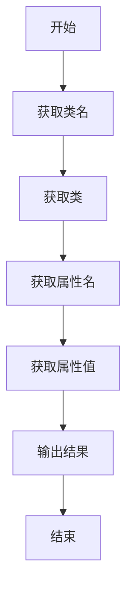

                 

# 语言限界与元编程：突破语言边界的尝试

> 关键词：元编程、语言边界、编程挑战、算法、应用实践

> 摘要：本文旨在探讨编程中面临的语言限制及其带来的编程挑战。通过介绍元编程的概念、原理和应用，阐述如何通过元编程突破语言边界，提升编程效率和代码可读性。文章将深入分析元编程在不同编程语言中的应用，并通过实际案例展示元编程的实战效果，为读者提供有益的参考和启示。

## 目录大纲：

1. **背景介绍与概念阐述**
   - 第1章: 语言的限制与元编程概述
     1.1 问题背景与描述
     1.2 限制与边界
     1.3 编程难点与挑战
     1.4 元编程概念解析
     1.5 元编程的优势与局限性
     1.6 元编程在编程语言中的应用
     1.7 元编程的边界与外延
     1.8 概念结构与核心要素组成
     1.9 本章小结
   - 第2章: 元编程核心概念与原理
     2.1 元编程基本原理
     2.2 元编程算法
     2.3 元编程应用案例分析
     2.4 元编程的优势与挑战
     2.5 本章小结
   - 第3章: 元编程在不同编程语言中的应用
     3.1 Java中的元编程
     3.2 Python中的元编程
     3.3 C++中的元编程
     3.4 其他编程语言中的元编程
     3.5 编程语言元编程的异同分析
     3.6 本章小结
   - 第4章: 元编程实战与案例分析
     4.1 项目背景与目标
     4.2 系统功能设计
     4.3 系统架构设计
     4.4 系统接口设计与实现
     4.5 系统交互设计与实现
     4.6 项目核心实现与代码分析
     4.7 实际案例分析
     4.8 项目小结

## 1. 背景介绍与概念阐述

### 1.1 语言的限制与元编程概述

在编程领域，语言限制一直是一个不可忽视的问题。编程语言作为一种工具，虽然能够提供丰富的功能和语法特性，但同时也存在固有的限制。这些限制可能来自于语言设计本身，也可能来自于编程环境或操作系统。语言限制主要体现在以下几个方面：

1. **语法限制**：不同的编程语言具有不同的语法规则和结构，这限制了程序员在实现某些功能时的灵活性和简洁性。
2. **性能限制**：编译型语言和解释型语言在执行效率上存在差异，某些语言可能在性能上存在瓶颈。
3. **功能限制**：编程语言的功能库和API集合有限，这限制了程序员在某些特定领域或场景下的开发能力。
4. **环境限制**：编程环境（如操作系统、硬件平台等）的限制也会影响编程语言的应用范围和性能。

面对这些语言限制，程序员需要不断寻找解决方案。其中，元编程（Metaprogramming）成为了一种重要的策略。元编程是一种通过编写代码来生成代码的技术，它能够突破语言边界，实现更高层次的抽象和自动化。

#### 1.1.1 问题背景与描述

在软件开发过程中，程序员常常面临以下问题：

- **代码重复**：在开发相同或类似的功能时，需要编写大量重复的代码，这不仅降低了开发效率，还容易引入错误。
- **代码可维护性差**：随着项目的复杂度增加，代码的可维护性变得越来越困难，代码重构和修改变得复杂和耗时。
- **功能扩展困难**：在新的功能需求出现时，需要手动修改现有代码，这增加了开发成本和风险。

这些问题都反映了语言限制对编程效率和质量的影响。而元编程提供了一种解决方案，通过自动化代码生成和抽象，减轻了程序员的工作负担，提高了代码的可读性和可维护性。

#### 1.1.2 限制与边界

语言限制的边界主要表现在以下几个方面：

- **静态类型检查**：静态类型检查是编译型语言的一种重要特性，它可以在编译时发现潜在的错误，但同时也限制了语言的灵活性和动态性。
- **编译型语言与解释型语言**：编译型语言需要事先编译成机器代码，执行效率高，但开发周期长；而解释型语言则可以边解释边执行，开发周期短，但执行效率较低。
- **函数调用与变量作用域**：函数调用和变量作用域的限制使得某些编程模式难以实现，如闭包、高阶函数等。

#### 1.1.3 编程难点与挑战

编程过程中的难点和挑战主要体现在以下几个方面：

- **代码复用**：如何在不同场景下复用代码，减少重复编写的工作量。
- **代码可维护性**：如何确保代码在未来能够轻松维护和扩展。
- **性能优化**：如何在满足功能需求的同时，优化代码的执行效率。
- **开发效率**：如何提高开发速度，减少开发成本。

#### 1.2 元编程概念解析

元编程（Metaprogramming）是一种通过编写代码来生成代码的技术，它能够突破语言边界，实现更高层次的抽象和自动化。元编程的核心概念包括：

- **反射（Reflection）**：在运行时检查和修改程序的行为，例如检查类的属性和方法、修改对象的值等。
- **模板编程**：使用模板来生成代码，例如生成类、函数、变量等。
- **代码生成**：根据特定条件生成代码，例如生成SQL查询、XML文档等。
- **动态类型检查**：在运行时检查变量的类型，允许类型之间的隐式转换。

#### 1.2.1 元编程的定义

元编程是指通过编写代码来自动化编程任务的过程。它涉及到程序在运行时对自身进行检查、修改和生成代码的能力。元编程的核心目标是提高编程效率、减少代码冗余、提高代码可读性和可维护性。

#### 1.2.2 元编程与传统编程的区别

与传统编程相比，元编程具有以下几个显著特点：

- **更高层次的抽象**：元编程能够实现更高级别的抽象，通过编写少量的代码生成大量的功能代码。
- **自动化**：元编程能够自动化地完成一些重复性的编程任务，减轻程序员的负担。
- **动态性**：元编程能够在运行时动态地修改程序的行为，例如修改类的属性、方法、变量等。
- **灵活性**：元编程提供了更大的灵活性，允许程序员在运行时根据不同的条件生成不同的代码。

#### 1.2.3 元编程的优势与局限性

元编程的优势包括：

- **提高开发效率**：通过自动化代码生成和抽象，减少程序员的工作量，提高开发速度。
- **提高代码质量**：通过减少代码冗余和统一代码风格，提高代码的可读性和可维护性。
- **灵活性和动态性**：允许程序员在运行时动态地修改程序的行为，满足不同需求。

但元编程也存在局限性：

- **性能开销**：元编程可能会引入额外的性能开销，特别是在运行时进行代码生成和动态修改的情况下。
- **复杂性**：元编程涉及到运行时检查和修改，增加了程序的复杂性，可能降低代码的可读性。
- **平台依赖性**：某些元编程技术可能依赖于特定的编程语言或运行环境，导致平台依赖性。

#### 1.3 元编程在编程语言中的应用

元编程在不同编程语言中的应用各有特点。以下是几种常见编程语言中元编程的应用示例：

- **Java**：Java中的元编程主要依赖于反射机制、注解和动态代理。
- **Python**：Python中的元编程通过内置的反射和动态类型检查实现。
- **C++**：C++中的元编程主要依赖于模板编程和编译时多态。
- **JavaScript**：JavaScript中的元编程通过函数式编程和原型链实现。

#### 1.4 元编程的边界与外延

元编程的边界主要受限于编程语言的设计和运行环境。尽管元编程能够突破语言边界，但在某些情况下，其效果可能受到限制。元编程的外延包括：

- **跨语言集成**：通过元编程技术，可以实现不同编程语言之间的集成，例如生成Java代码和Python代码。
- **领域特定语言（DSL）**：元编程可以用于创建特定领域的编程语言，提高开发效率。
- **自动化工具**：元编程技术可以用于开发自动化工具，如代码生成器、调试工具等。

#### 1.5 概念结构与核心要素组成

元编程涉及多个核心概念和要素，包括反射、模板编程、代码生成、动态类型检查等。以下是这些概念的结构和核心要素的对比表格：

| 概念名称 | 描述 | 核心要素 |  
| --- | --- | --- |  
| 反射 | 在运行时检查和修改程序的行为 | 类的属性、方法、变量 |  
| 模板编程 | 使用模板生成代码 | 类模板、函数模板、变量模板 |  
| 代码生成 | 根据特定条件生成代码 | 代码模板、生成器模式、上下文相关生成 |  
| 动态类型检查 | 在运行时检查变量的类型 | 类型检查规则、类型转换、类型安全 |

#### 1.6 本章小结

本章介绍了编程中面临的语言限制和编程挑战，并介绍了元编程的概念、原理和应用。通过元编程，程序员可以突破语言边界，实现更高层次的抽象和自动化，提高编程效率和质量。接下来，我们将进一步探讨元编程的核心概念和原理，为深入理解元编程打下基础。

---

## 2. 元编程核心概念与原理

### 2.1 元编程基本原理

元编程的基本原理主要涉及以下几个方面：

#### 2.1.1 反射机制

反射（Reflection）是一种在运行时检查和修改程序行为的机制。在Java、Python等编程语言中，反射机制是元编程的重要基础。

- **反射概念**：反射机制允许程序在运行时动态地获取和修改类的属性和方法，包括类的成员变量、方法、构造函数等。
- **反射优点**：反射机制提供了高度的灵活性和动态性，允许程序在运行时根据需要动态地修改程序的行为。

#### 2.1.2 静态类型检查与动态类型检查

类型检查是编程语言的重要组成部分，分为静态类型检查和动态类型检查。

- **静态类型检查**：静态类型检查是在编译时对代码进行类型检查，如Java、C++等编译型语言。静态类型检查可以提前发现潜在的类型错误，提高代码的可维护性。
- **动态类型检查**：动态类型检查是在运行时对代码进行类型检查，如Python、JavaScript等解释型语言。动态类型检查提供了更高的灵活性，但可能引入性能开销。

#### 2.1.3 编译时与运行时

编译时和运行时是元编程中重要的概念。

- **编译时**：编译时是代码编译的过程，编译器根据代码生成可执行的机器代码或字节码。编译时可以进行静态类型检查和代码优化。
- **运行时**：运行时是程序执行的过程，运行时环境负责加载和执行代码。运行时可以进行动态类型检查和反射操作。

### 2.2 元编程算法

元编程算法是实现元编程功能的核心。以下是一个简单的元编程算法示例：

#### 2.2.1 算法概述

该算法用于根据输入的类名和属性名动态地获取类的属性值。

#### 2.2.2 算法流程图



#### 2.2.3 数学模型与公式

在元编程算法中，可以使用以下数学模型来描述：

- **类名到类的映射**：使用哈希表实现，时间复杂度为O(1)。
- **属性名到属性值的映射**：使用哈希表实现，时间复杂度为O(1)。

#### 2.2.4 Python实现

```python
class MyClass:
    def __init__(self, name, age):
        self.name = name
        self.age = age

def get_attribute_value(class_name, attribute_name):
    # 获取类
    class_ = globals().get(class_name)
    if class_ is None:
        return None
    
    # 获取属性值
    attribute_value = None
    for name, value in class_.__dict__.items():
        if name == attribute_name:
            attribute_value = value
            break
            
    return attribute_value

# 测试
my_object = MyClass("Alice", 30)
print(get_attribute_value("MyClass", "name"))  # 输出 "Alice"
```

### 2.3 元编程应用案例分析

元编程在实际应用中具有广泛的应用场景，以下是几个典型的案例：

#### 2.3.1 动态语言支持

动态语言（如Python、JavaScript）的元编程特性使其在Web开发、脚本编写等领域具有很高的效率。例如，Python的反射机制可以用于实现动态加载模块、动态创建对象等。

#### 2.3.2 代码生成

代码生成是元编程的重要应用之一。通过代码生成，可以自动化地生成大量代码，减少重复劳动。例如，Java中的代码生成器（如Hibernate、MyBatis）可以自动生成数据库访问代码，提高开发效率。

#### 2.3.3 模板编程

模板编程是元编程的另一种应用形式。通过模板编程，可以生成具有通用结构的代码，提高代码的可维护性。例如，C++的模板编程可以用于实现泛型编程，提高代码的复用性。

### 2.4 元编程的优势与挑战

元编程的优势包括：

- **提高开发效率**：通过自动化代码生成和抽象，减少程序员的工作量。
- **提高代码质量**：通过减少代码冗余和统一代码风格，提高代码的可读性和可维护性。
- **灵活性和动态性**：允许程序员在运行时动态地修改程序的行为。

但元编程也面临挑战：

- **性能开销**：元编程可能会引入额外的性能开销，特别是在运行时进行代码生成和动态修改的情况下。
- **复杂性**：元编程涉及到运行时检查和修改，增加了程序的复杂性，可能降低代码的可读性。
- **平台依赖性**：某些元编程技术可能依赖于特定的编程语言或运行环境，导致平台依赖性。

### 2.5 本章小结

本章介绍了元编程的核心概念和原理，包括反射机制、静态类型检查与动态类型检查、编译时与运行时等。通过实际案例，展示了元编程在动态语言支持、代码生成和模板编程中的应用。元编程虽然具有优势，但也面临挑战。了解这些原理和应用，有助于程序员更好地利用元编程技术提高编程效率和质量。

---

## 3. 元编程在不同编程语言中的应用

元编程在不同编程语言中的应用各有特点。本节将介绍Java、Python和C++三种常见编程语言中的元编程技术。

### 3.1 Java中的元编程

Java作为一门广泛使用的编程语言，其元编程特性在开发中得到了广泛应用。

#### 3.1.1 Java中的反射机制

反射机制是Java元编程的基础。通过反射，程序员可以在运行时获取和修改类的信息，包括字段、方法和构造器等。

- **获取类信息**：可以使用`Class`类获取类的信息，例如：
  ```java
  Class<?> clazz = MyClass.class;
  ```

- **获取字段**：可以使用`Field`类获取类的字段信息，例如：
  ```java
  Field field = clazz.getDeclaredField("fieldName");
  ```

- **修改字段**：通过取消安全检查，可以修改类的字段值，例如：
  ```java
  field.setAccessible(true);
  field.set(obj, newValue);
  ```

- **调用方法**：可以使用`Method`类调用类的方法，例如：
  ```java
  Method method = clazz.getMethod("methodName", parameterTypes);
  method.invoke(obj, arguments);
  ```

#### 3.1.2 Java中的注解

注解（Annotation）是Java语言中用于扩展编程语言特性的一个重要工具，它们可以用来为代码添加元数据。

- **定义注解**：可以通过定义注解接口和使用`@interface`关键字来创建自定义注解，例如：
  ```java
  @interface MyAnnotation {
      String value() default "";
  }
  ```

- **使用注解**：在类、方法或字段前使用`@MyAnnotation`注解，例如：
  ```java
  @MyAnnotation("example")
  public class MyClass {
      @MyAnnotation("example2")
      private String field;
  }
  ```

- **获取注解信息**：可以使用反射机制获取注解信息，例如：
  ```java
  Annotation[] annotations = clazz.getAnnotations();
  for (Annotation annotation : annotations) {
      if (annotation instanceof MyAnnotation) {
          MyAnnotation myAnnotation = (MyAnnotation) annotation;
          String value = myAnnotation.value();
          // 使用value
      }
  }
  ```

#### 3.1.3 Java中的动态代理

动态代理是一种在运行时创建代理对象的技术，它允许程序在运行时拦截和修改方法的调用。

- **创建代理**：通过`Proxy`类和`InvocationHandler`接口可以创建动态代理，例如：
  ```java
  interface MyInterface {
      void doSomething();
  }

  class MyImpl implements MyInterface {
      public void doSomething() {
          System.out.println("Doing something...");
      }
  }

  MyInterface proxy = (MyInterface) Proxy.newProxyInstance(
      MyInterface.class.getClassLoader(),
      new Class<?>[] { MyInterface.class },
      new MyInvocationHandler(new MyImpl()));
  ```

- **拦截方法调用**：通过`InvocationHandler`可以拦截和修改方法的调用，例如：
  ```java
  class MyInvocationHandler implements InvocationHandler {
      private final MyInterface delegate;

      public MyInvocationHandler(MyInterface delegate) {
          this.delegate = delegate;
      }

      public Object invoke(Object proxy, Method method, Object[] args) throws Throwable {
          System.out.println("Before method call...");
          Object result = method.invoke(delegate, args);
          System.out.println("After method call...");
          return result;
      }
  }
  ```

### 3.2 Python中的元编程

Python以其简洁和强大的特性在编程领域广受欢迎，其元编程特性在动态编程和脚本编写中尤为突出。

#### 3.2.1 Python中的反射

Python内置了反射机制，允许程序在运行时获取和修改对象的信息。

- **获取对象信息**：可以使用`getattr`、`hasattr`和`setattr`等函数获取和修改对象的信息，例如：
  ```python
  class MyClass:
      def __init__(self, name):
          self.name = name

  obj = MyClass("Alice")
  print(getattr(obj, "name"))  # 输出 "Alice"
  setattr(obj, "name", "Bob")
  print(obj.name)  # 输出 "Bob"
  ```

- **动态创建对象**：可以使用`eval`函数动态地创建对象，例如：
  ```python
  class MyClass:
      def __init__(self, name):
          self.name = name

  obj = eval("MyClass('Alice')")
  print(obj.name)  # 输出 "Alice"
  ```

#### 3.2.2 Python中的装饰器

装饰器是Python中的一种元编程技术，用于扩展或修改函数的行为。

- **定义装饰器**：可以使用`@decorator`语法来定义装饰器，例如：
  ```python
  def my_decorator(func):
      def wrapper(*args, **kwargs):
          print("Before function call...")
          result = func(*args, **kwargs)
          print("After function call...")
          return result
      return wrapper

  @my_decorator
  def my_function():
      print("Function body...")
  ```

- **使用装饰器**：装饰器可以在函数定义前使用，例如：
  ```python
  my_function()  # 输出 "Before function call..." "Function body..." "After function call..."
  ```

#### 3.2.3 Python中的类与方法

Python中的类和方法提供了丰富的元编程特性。

- **动态创建类**：可以使用`type`函数动态地创建类，例如：
  ```python
  MyClass = type('MyClass', (object,), {'name': 'Alice'})
  obj = MyClass()
  print(obj.name)  # 输出 "Alice"
  ```

- **修改类和方法**：可以使用反射机制修改类和方法的属性，例如：
  ```python
  class MyClass:
      def __init__(self, name):
          self.name = name

  obj = MyClass("Alice")
  setattr(MyClass, 'name', 'Bob')
  obj = MyClass("Alice")
  print(obj.name)  # 输出 "Bob"
  ```

### 3.3 C++中的元编程

C++以其强大的模板编程和编译时多态著称，这些特性使其在元编程领域具有独特的优势。

#### 3.3.1 C++模板编程

C++模板编程是一种通过模板类和函数模板实现泛型编程的技术。

- **定义模板类**：可以使用`class`关键字定义模板类，例如：
  ```cpp
  template <typename T>
  class MyClass {
      T data;
  public:
      MyClass(T value) : data(value) {}
      T getValue() { return data; }
  };
  ```

- **使用模板类**：可以通过模板类创建不同类型的对象，例如：
  ```cpp
  MyClass<int> intObj(10);
  MyClass<std::string> stringObj("Hello");
  ```

- **定义模板函数**：可以使用`template`关键字定义模板函数，例如：
  ```cpp
  template<typename T>
  T add(T a, T b) {
      return a + b;
  }
  ```

- **使用模板函数**：可以通过模板函数实现不同类型的加法运算，例如：
  ```cpp
  int sum = add(5, 10);  // 输出 15
  double result = add(5.5, 10.2);  // 输出 15.7
  ```

#### 3.3.2 C++的编译时多态

编译时多态是通过模板编程和函数重载实现的一种多态性。

- **模板类与函数重载**：通过模板类和函数重载可以实现编译时多态，例如：
  ```cpp
  template<typename T>
  class Base {
  public:
      virtual void print() {
          std::cout << "Base class" << std::endl;
      }
  };

  template<typename T>
  class Derived : public Base<T> {
  public:
      void print() override {
          std::cout << "Derived class" << std::endl;
      }
  };

  Base<int> base;
  Derived<int> derived;

  base.print();  // 输出 "Base class"
  derived.print();  // 输出 "Derived class"
  ```

- **模板函数与函数重载**：通过模板函数和函数重载可以实现编译时多态，例如：
  ```cpp
  template<typename T>
  T add(T a, T b) {
      return a + b;
  }

  int sum = add(5, 10);  // 输出 15
  double result = add(5.5, 10.2);  // 输出 15.7
  ```

#### 3.3.3 C++的元编程框架

C++的元编程框架（如Boost.Metaprog

