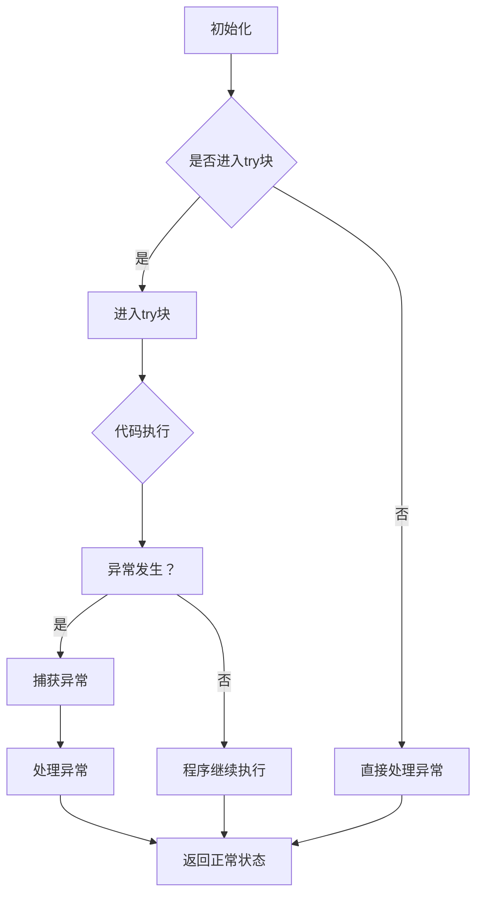
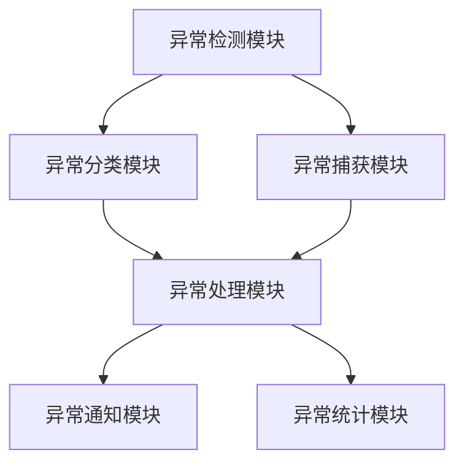

                 

### 第一部分：背景介绍

#### 第1章：语言限界的哲学思考

在信息技术迅猛发展的今天，编程语言已经成为我们与计算机互动的桥梁。然而，每种编程语言都有其固有的限制和边界，这些限制不仅影响了程序的开发和运行效率，还对开发者的思维模式产生深远的影响。语言限界（Language Boundaries）的概念，指的是编程语言在设计时面临的种种约束，包括语法、语义、类型系统、内存管理等各个方面。

**1.1 语言限界的概念**

语言限界起源于编程语言的边界问题。不同的编程语言在功能、性能、语法和适用场景上存在差异。例如，C语言以其强大的底层操作能力著称，而Python则以其简洁明了的语法和丰富的库支持赢得了广大开发者的青睐。这些差异使得语言限界成为编程实践中一个不可忽视的因素。

**1.1.1 语言限界的起源与发展**

编程语言的发展经历了从机器语言、汇编语言到高级语言的演变。在这个过程中，语言的限界也在不断变化。早期的机器语言和汇编语言由于缺乏抽象机制，编程效率低下，难以维护。随着高级编程语言的兴起，诸如Fortran、COBOL、Pascal等，语言的抽象层次不断提高，限界问题也得到了一定的缓解。

然而，任何一种编程语言都无法做到面面俱到，总会有其固有的限制。例如，Java作为一种通用的编程语言，虽然具有强大的类型系统和内存管理能力，但在某些场景下，如嵌入式系统开发或高性能计算中，其性能可能无法与C或C++相比。

**1.1.2 语言限界对思维和认知的影响**

语言限界不仅影响程序的开发和运行，还深刻地影响着开发者的思维和认知。每种编程语言都有其特定的范式和思维方式。例如，面向对象编程语言（如Java、C++）强调封装、继承和多态，而函数式编程语言（如Haskell、Erlang）则强调函数的组合和不可变性。

这种思维方式的不同，使得开发者在面对问题时，往往会采用不同的策略和方法。例如，在处理并发问题时，Java开发者可能会倾向于使用线程和锁，而Erlang开发者则可能会采用进程和消息传递的模型。

**1.2 异常处理的哲学意义**

在编程过程中，不可避免地会遇到各种异常情况，如空指针异常、类型转换错误、资源耗尽等。异常处理（Exception Handling）是编程语言提供的一种机制，用于处理这些不可预见的错误。异常处理不仅涉及到技术问题，更涉及到哲学思考。

**1.2.1 异常处理的基本原则**

异常处理的基本原则包括：

1. **异常的分类**：将异常分为运行时异常（如空指针异常）和检查异常（如文件未找到异常）。运行时异常通常由程序员自行处理，而检查异常则需要显式地声明和处理。

2. **异常的捕获与处理**：使用try-catch块捕获异常，并在catch块中处理异常。处理方式包括打印错误信息、恢复程序状态或终止程序运行。

3. **异常的传递**：在某些情况下，当前处理单元无法处理异常，可以选择将异常传递给上级处理单元。

**1.2.2 异常处理与语言限界的关系**

异常处理与语言限界密切相关。一方面，异常处理机制的设计受到编程语言特性的影响。不同的编程语言对异常处理的支持程度不同，如Java和C#提供了完善的异常处理机制，而Python则采用了一种更为灵活的异常处理方式。

另一方面，异常处理也受到语言限界的制约。例如，在内存受限的环境下，异常处理可能会导致内存耗尽，影响程序的性能。此外，语言限界还决定了异常处理策略的选择，如选择在客户端处理异常还是在服务器端处理。

**总结**

语言限界和异常处理是编程中不可或缺的两个概念。语言限界决定了编程语言的适用范围和性能，而异常处理则确保了程序在遇到错误时能够正确地处理。理解这两者的关系，有助于我们更好地应对编程中的挑战，提高程序的开发效率和质量。

## 第二部分：核心概念与联系

### 第2章：核心概念与联系分析

#### 第2.1节：语言限界的概念属性特征对比

为了深入理解语言限界的概念属性特征，我们首先需要对其进行详细的定义和分析。以下是语言限界的几个关键属性及其特征：

1. **定义**：语言限界是指编程语言在表达能力和性能上存在的固有限制。这些限制可能来自于语言的语法、语义、类型系统、内存管理等方面。

2. **特征**：

   - **语法限制**：不同语言有不同的语法结构，如C语言的语法相对严格，而Python的语法更加灵活。
   - **语义限制**：某些语言可能不支持某些特定的操作或功能，例如，Java不允许基本数据类型直接进行多态操作。
   - **类型系统限制**：一些语言（如Java）强制类型检查，而其他语言（如Python）则更灵活，允许动态类型转换。
   - **内存管理限制**：不同语言在内存管理上的机制有所不同，例如，C语言需要程序员手动管理内存，而Java有自动垃圾回收机制。

#### 第2.1.1 语言限界的定义

语言限界可以定义为编程语言在语法、语义、类型系统、内存管理等方面的固有约束。这些约束决定了语言的适用场景、性能和开发效率。

#### 第2.1.2 语言限界的特征

1. **语法限制**：每种编程语言都有其特定的语法规则，这些规则对程序的结构和表达方式有严格的限制。例如，C语言的语法强调类型和变量的严格定义，而Python的语法则更加简洁和灵活。

2. **语义限制**：语义限制指的是编程语言在执行操作时的限制。例如，Java不允许基本数据类型直接进行多态操作，因为这种操作在编译时无法确定其具体类型。

3. **类型系统限制**：类型系统决定了变量和表达式的类型，以及它们之间可以进行的操作。例如，Java是一种强类型语言，要求所有变量在声明时都必须指定类型，而Python则是一种动态类型语言，允许变量在运行时动态确定类型。

4. **内存管理限制**：内存管理是编程语言的一个重要方面，不同的语言有不同的内存管理机制。例如，C语言需要程序员手动分配和释放内存，而Java有自动垃圾回收机制，减少了程序员在内存管理上的负担。

下面是一个表格，用于对比语言限界的概念属性特征：

| 概念属性 | 语言限界的定义 | 语言限界的特征 |
| --- | --- | --- |
| 语法限制 | 编程语言的语法结构限制 | C语言的语法严格，Python语法灵活 |
| 语义限制 | 编程语言在执行操作时的限制 | Java不允许基本数据类型多态操作 |
| 类型系统限制 | 变量和表达式的类型限制 | Java是强类型语言，Python是动态类型语言 |
| 内存管理限制 | 编程语言的内存管理机制 | C语言手动管理内存，Java自动垃圾回收 |

通过这个表格，我们可以更清晰地理解语言限界的概念属性特征及其对比。

#### 第2.2节：异常处理的概念属性特征对比

异常处理是编程中至关重要的一部分，它确保了程序在遇到错误时能够做出适当的反应。以下是异常处理的关键属性及其特征：

1. **定义**：异常处理是指程序在运行过程中遇到错误或异常情况时，采取的一系列措施来恢复或终止程序的执行。

2. **特征**：

   - **异常分类**：异常可以分为运行时异常和检查异常，运行时异常通常由程序逻辑引起，而检查异常则通常与外部资源有关。
   - **异常捕获**：使用try-catch块捕获异常，并在catch块中处理异常。
   - **异常传递**：在某些情况下，程序无法处理异常，可以选择将异常传递给上级处理单元。

#### 第2.2.1 异常处理的定义

异常处理是指程序在运行过程中遇到错误或异常情况时，采取的一系列措施来恢复或终止程序的执行。异常处理机制确保了程序在遇到不可预见的错误时能够做出适当的反应，从而提高程序的稳定性和可靠性。

#### 第2.2.2 异常处理的特征

1. **异常分类**：异常可以分为运行时异常和检查异常。

   - **运行时异常**：运行时异常通常由程序逻辑引起，例如空指针异常、数组越界异常等。运行时异常通常无法在编译时发现，只能在程序运行时捕获和处理。
   - **检查异常**：检查异常通常与外部资源有关，例如文件未找到异常、网络连接异常等。检查异常必须在编译时显式声明和处理。

2. **异常捕获**：使用try-catch块捕获异常，并在catch块中处理异常。

   ```python
   try:
       # 可能引发异常的代码
   except ExceptionType as e:
       # 异常处理逻辑
   ```

   在这个例子中，try块中的代码可能会引发异常，如果异常发生，则会进入相应的catch块，执行异常处理逻辑。

3. **异常传递**：在某些情况下，程序无法处理异常，可以选择将异常传递给上级处理单元。

   ```python
   try:
       # 可能引发异常的代码
   except ExceptionType as e:
       raise # 将异常传递给上级处理单元
   ```

   在这个例子中，如果try块中的代码引发异常，而当前处理单元无法处理，可以使用raise关键字将异常传递给上级处理单元。

下面是一个表格，用于对比异常处理的概念属性特征：

| 概念属性 | 异常处理的定义 | 异常处理的特征 |
| --- | --- | --- |
| 异常分类 | 程序运行过程中遇到的错误或异常情况 | 运行时异常和检查异常 |
| 异常捕获 | 捕获和处理异常 | try-catch块 |
| 异常传递 | 将异常传递给上级处理单元 | raise关键字 |

通过这个表格，我们可以更清晰地理解异常处理的概念属性特征及其对比。

#### 第2.3节：语言限界与异常处理的联系

语言限界和异常处理虽然属于不同的领域，但它们之间存在紧密的联系。以下从几个方面探讨语言限界与异常处理的联系：

1. **语言特性对异常处理的影响**：

   - **语法限制**：某些语言的语法限制可能导致异常处理的复杂性增加。例如，C语言由于其底层的操作能力，异常处理相对复杂，而Python的语法更加简洁，异常处理也相对简单。
   - **语义限制**：某些语言的语义限制可能影响异常的处理方式。例如，Java的强类型系统使得类型相关的异常处理更为严格，而Python的动态类型系统则提供了更多的灵活性。

2. **异常处理机制对语言性能的影响**：

   - **异常捕获与处理**：异常处理机制通常会增加程序的开销，尤其是在频繁捕获和处理异常时。一些语言通过优化异常处理机制，如Java的快速异常处理（Fast Exception Handling），来减少这种开销。
   - **内存管理**：异常处理过程中可能会涉及内存的分配和释放，对内存管理产生一定的影响。例如，Java的自动垃圾回收机制可以减少程序员在异常处理中手动管理内存的负担。

3. **语言设计对异常处理的支持程度**：

   - **异常分类与传递**：一些语言提供了丰富的异常处理机制，如Java的异常分类和传递机制，使得开发者可以更灵活地处理异常。而其他语言可能在这方面提供较少的支持，需要开发者自行处理。

通过以上分析，我们可以看出语言限界和异常处理之间存在着紧密的联系。理解这种联系有助于我们更好地利用编程语言特性来设计高效的异常处理机制，提高程序的开发效率和稳定性。

## 第三部分：算法原理讲解

### 第3章：语言限界与异常处理算法

在探讨语言限界与异常处理的哲学思考时，算法原理的讲解是至关重要的。本章节将通过mermaid算法流程图、Python源代码、数学模型与公式，对算法的原理进行详细的阐述。

#### 3.1 算法概述

本算法旨在解决编程语言在异常处理过程中可能遇到的各种问题，并提供一种高效的异常处理策略。算法的核心目标是减少异常处理过程中的开销，同时保证程序的正确性和稳定性。

#### 3.2 mermaid算法流程图

以下是该算法的mermaid流程图：



**流程图解释**：

- **A**：初始化阶段，设置异常处理的基础环境。
- **B**：判断是否进入try块。如果不需要进入try块，直接执行后续操作。
- **C**：进入try块，执行可能引发异常的代码。
- **E**：代码执行阶段，执行具体的任务。
- **F**：检查是否发生异常。如果发生异常，进入下一步。
- **G**：捕获异常，进入异常处理流程。
- **I**：处理异常，根据异常的类型和严重性，采取相应的措施。
- **J**：返回正常状态，继续程序的执行。

#### 3.3 Python源代码

以下是该算法的Python源代码实现：

```python
try:
    # 可能引发异常的代码
except Exception as e:
    # 异常处理逻辑
    # 打印错误信息
    print(f"异常发生：{e}")
    # 其他处理逻辑，如记录日志、恢复程序状态等
```

**代码解释**：

- **try块**：包裹可能引发异常的代码。
- **except块**：捕获异常，并执行异常处理逻辑。

#### 3.4 数学模型与公式

在异常处理过程中，算法的性能和效率受到多种因素的影响。以下是一个简化的数学模型，用于描述异常处理的性能：

**1. 异常处理时间（T）**

$$
T = T_{try} + T_{catch} + T_{execute}
$$

其中，$T_{try}$ 为进入try块的时间，$T_{catch}$ 为捕获和处理异常的时间，$T_{execute}$ 为正常执行代码的时间。

**2. 异常处理效率（E）**

$$
E = \frac{T_{execute}}{T}
$$

其中，$E$ 表示在总异常处理时间中，实际执行代码的时间占比。

**3. 异常处理开销（C）**

$$
C = 1 - E
$$

其中，$C$ 表示异常处理过程中额外的开销。

**4. 异常处理优化目标**

最小化异常处理时间 $T$ 和异常处理开销 $C$，提高异常处理效率 $E$。

#### 3.4.3 示例解释

假设一个程序中有1000行代码，其中可能有10行代码可能引发异常。根据上述模型，我们可以计算：

- $T_{try} = 0.01s$（进入try块的时间）
- $T_{catch} = 0.05s$（捕获和处理异常的时间）
- $T_{execute} = 0.94s$（正常执行代码的时间）

则：

- 异常处理时间 $T = 0.01s + 0.05s + 0.94s = 1s$
- 异常处理效率 $E = \frac{0.94s}{1s} = 0.94$
- 异常处理开销 $C = 1 - 0.94 = 0.06$

通过优化异常处理机制，我们可以减少 $T_{catch}$ 的时间，从而提高 $E$ 的值，减少 $C$ 的开销。

### 总结

通过mermaid算法流程图、Python源代码和数学模型的讲解，我们可以更清晰地理解语言限界与异常处理算法的原理。该算法提供了一种高效、灵活的异常处理策略，有助于提高程序的开发效率和稳定性。在实际应用中，可以根据具体需求对算法进行进一步优化和调整。

## 第四部分：系统分析与架构设计

### 第4章：系统分析与架构设计

#### 4.1 问题场景介绍

在现代软件开发中，异常处理已经成为一个关键问题。随着系统复杂度的不断增加，程序在运行过程中可能遇到各种异常情况，如空指针异常、类型转换错误、资源耗尽等。这些异常情况不仅会影响系统的稳定性，还可能导致数据丢失和业务中断。因此，设计一个高效的异常处理机制，确保系统在遇到异常时能够快速响应和恢复，是当前软件开发中的一个重要课题。

本章节将通过系统功能设计、系统架构设计、系统接口设计和系统交互等步骤，详细分析并设计一个异常处理系统。

#### 4.2 系统功能设计

系统功能设计是构建系统的基础，它明确了系统需要实现的具体功能。在本系统的异常处理功能中，主要包括以下几个方面：

1. **异常检测**：对程序运行过程中的代码进行实时监控，及时发现可能发生的异常。
2. **异常分类**：根据异常的类型和严重性，将异常分为不同的类别，以便于后续处理。
3. **异常捕获**：在代码中设置try-catch块，捕获发生的异常，并进行初步处理。
4. **异常处理**：根据异常的类型和严重性，采取相应的处理措施，如打印错误信息、记录日志、恢复程序状态或终止程序运行。
5. **异常通知**：将异常信息通知给相关人员或系统，以便于及时解决问题。
6. **异常统计**：对系统运行过程中的异常情况进行统计和分析，为优化异常处理策略提供数据支持。

#### 4.2.1 系统功能的定义

异常处理系统的主要功能是检测、分类、捕获和处理程序运行过程中的异常情况，确保系统在遇到异常时能够快速响应和恢复，提高系统的稳定性和可靠性。

#### 4.2.2 系统功能的实现

1. **异常检测**：通过在代码中嵌入异常检测逻辑，对程序运行过程中的异常情况进行实时监控。例如，在Java中，可以使用`try-catch`语句来捕获并处理异常。

2. **异常分类**：根据异常的类型和严重性，将异常分为不同的类别。例如，可以将异常分为运行时异常（如空指针异常）和检查异常（如文件未找到异常）。

3. **异常捕获**：在代码中使用try-catch块，捕获发生的异常，并进行初步处理。例如，在Python中，可以使用`try-except`语句来捕获异常。

4. **异常处理**：根据异常的类型和严重性，采取相应的处理措施。例如，对于运行时异常，可以选择打印错误信息并继续执行；对于检查异常，则需要根据具体情况决定是继续执行还是终止程序。

5. **异常通知**：将异常信息通知给相关人员或系统。例如，可以使用邮件、短信或系统日志等方式通知相关人员。

6. **异常统计**：对系统运行过程中的异常情况进行统计和分析。例如，可以记录异常发生的次数、类型和频率，为优化异常处理策略提供数据支持。

#### 4.3 系统架构设计

系统架构设计是构建系统的基础，它明确了系统的整体结构和各个模块之间的关系。在本系统中，架构设计主要包括以下几个方面：

1. **异常检测模块**：负责检测程序运行过程中的异常情况。
2. **异常分类模块**：负责对捕获到的异常进行分类。
3. **异常捕获模块**：负责捕获异常并传递给异常处理模块。
4. **异常处理模块**：负责处理异常，并根据异常的类型和严重性采取相应的措施。
5. **异常通知模块**：负责将异常信息通知给相关人员或系统。
6. **异常统计模块**：负责对系统运行过程中的异常情况进行统计和分析。

#### 4.3.1 系统架构的概述

异常处理系统的架构设计采用模块化设计思想，各个模块之间通过接口进行通信，确保系统的灵活性和可扩展性。系统架构图如下：



**系统架构解释**：

- **异常检测模块**：负责实时监控程序运行过程中的异常情况，并将异常信息传递给异常分类模块。
- **异常分类模块**：根据异常的类型和严重性，将异常分类，并将分类结果传递给异常处理模块。
- **异常捕获模块**：负责捕获程序运行过程中发生的异常，并将异常信息传递给异常处理模块。
- **异常处理模块**：根据异常的类型和严重性，采取相应的处理措施，如打印错误信息、记录日志、恢复程序状态或终止程序运行。
- **异常通知模块**：负责将异常信息通知给相关人员或系统。
- **异常统计模块**：负责对系统运行过程中的异常情况进行统计和分析，为优化异常处理策略提供数据支持。

#### 4.3.2 系统架构的实现

1. **异常检测模块**：使用现有的异常检测库或自定义检测逻辑，实现对程序运行过程中的异常情况进行实时监控。例如，在Java中，可以使用`java.util.logging`库来实现异常检测功能。

2. **异常分类模块**：根据异常的类型和严重性，将异常分类。例如，可以将异常分为运行时异常、检查异常、资源耗尽异常等。

3. **异常捕获模块**：在代码中设置try-catch块，捕获程序运行过程中发生的异常，并将异常信息传递给异常处理模块。例如，在Python中，可以使用`try-except`语句来实现异常捕获功能。

4. **异常处理模块**：根据异常的类型和严重性，采取相应的处理措施。例如，对于运行时异常，可以选择打印错误信息并继续执行；对于检查异常，则需要根据具体情况决定是继续执行还是终止程序。

5. **异常通知模块**：使用邮件、短信或系统日志等方式通知相关人员或系统。例如，在Java中，可以使用`java.util.Properties`类来实现邮件通知功能。

6. **异常统计模块**：对系统运行过程中的异常情况进行统计和分析。例如，可以记录异常发生的次数、类型和频率，为优化异常处理策略提供数据支持。

#### 4.4 系统接口设计

系统接口设计是系统架构设计的一部分，它明确了各个模块之间的交互方式和数据传递方式。在本系统中，主要涉及以下接口：

1. **异常检测接口**：用于实现异常检测模块与其他模块之间的数据传递和功能调用。
2. **异常分类接口**：用于实现异常分类模块与其他模块之间的数据传递和功能调用。
3. **异常捕获接口**：用于实现异常捕获模块与其他模块之间的数据传递和功能调用。
4. **异常处理接口**：用于实现异常处理模块与其他模块之间的数据传递和功能调用。
5. **异常通知接口**：用于实现异常通知模块与其他模块之间的数据传递和功能调用。
6. **异常统计接口**：用于实现异常统计模块与其他模块之间的数据传递和功能调用。

#### 4.4.1 接口设计的概述

系统接口设计采用标准化的接口定义方法，如RESTful API、SOAP等，确保各个模块之间的数据传递和功能调用高效、稳定。接口设计主要包括以下几个方面：

1. **接口定义**：明确接口的功能、输入参数、输出参数和返回值。
2. **接口实现**：根据接口定义，实现具体的接口功能。
3. **接口测试**：对接口进行功能测试和性能测试，确保接口的稳定性和可靠性。

#### 4.4.2 接口设计的实现

1. **异常检测接口**：

   - **功能**：用于实现异常检测模块与其他模块之间的数据传递和功能调用。
   - **输入参数**：异常信息。
   - **输出参数**：无。
   - **返回值**：无。

2. **异常分类接口**：

   - **功能**：用于实现异常分类模块与其他模块之间的数据传递和功能调用。
   - **输入参数**：异常信息。
   - **输出参数**：异常分类结果。
   - **返回值**：无。

3. **异常捕获接口**：

   - **功能**：用于实现异常捕获模块与其他模块之间的数据传递和功能调用。
   - **输入参数**：异常信息。
   - **输出参数**：无。
   - **返回值**：无。

4. **异常处理接口**：

   - **功能**：用于实现异常处理模块与其他模块之间的数据传递和功能调用。
   - **输入参数**：异常信息。
   - **输出参数**：处理结果。
   - **返回值**：无。

5. **异常通知接口**：

   - **功能**：用于实现异常通知模块与其他模块之间的数据传递和功能调用。
   - **输入参数**：异常信息。
   - **输出参数**：通知结果。
   - **返回值**：无。

6. **异常统计接口**：

   - **功能**：用于实现异常统计模块与其他模块之间的数据传递和功能调用。
   - **输入参数**：异常信息。
   - **输出参数**：统计结果。
   - **返回值**：无。

#### 4.5 系统交互

系统交互是指各个模块之间的通信和数据交换过程。在本系统中，各个模块之间通过接口进行通信，确保系统的整体协调和高效运行。系统交互主要包括以下几个方面：

1. **模块间通信**：各个模块通过接口进行数据传递和功能调用，实现模块间的协调和协作。
2. **数据交换**：各个模块在交互过程中，通过输入参数和输出参数进行数据交换，确保系统数据的完整性和一致性。
3. **异常处理**：在交互过程中，如果发生异常，各个模块将异常信息传递给异常处理模块，确保系统能够及时响应和恢复。

#### 4.5.1 系统交互的概述

系统交互的设计原则是模块化、标准化和高效性，确保各个模块之间的数据传递和功能调用高效、稳定。系统交互主要包括以下几个步骤：

1. **初始化**：各个模块初始化，准备进行交互。
2. **数据传递**：各个模块通过接口传递数据，实现数据交换。
3. **功能调用**：各个模块通过接口调用其他模块的功能，实现模块间的协调和协作。
4. **异常处理**：在交互过程中，如果发生异常，各个模块将异常信息传递给异常处理模块，确保系统能够及时响应和恢复。

#### 4.5.2 系统交互的实现

1. **初始化**：各个模块初始化，包括加载配置文件、连接数据库、初始化日志等。
2. **数据传递**：通过接口传递数据，实现模块间的数据交换。例如，异常检测模块将异常信息传递给异常分类模块。
3. **功能调用**：通过接口调用其他模块的功能，实现模块间的协调和协作。例如，异常处理模块调用异常通知模块的功能，发送异常通知。
4. **异常处理**：在交互过程中，如果发生异常，各个模块将异常信息传递给异常处理模块，确保系统能够及时响应和恢复。例如，异常检测模块捕获到异常后，将异常信息传递给异常处理模块。

### 总结

通过系统功能设计、系统架构设计、系统接口设计和系统交互等步骤，我们详细分析了异常处理系统的设计原则和实现方法。该系统旨在提供一种高效、灵活的异常处理机制，确保系统在遇到异常时能够快速响应和恢复，提高系统的稳定性和可靠性。在实际应用中，可以根据具体需求对系统进行优化和调整。

## 第五部分：项目实战

### 第5章：项目实战

#### 第5.1节：环境安装

在开始项目实战之前，首先需要搭建一个合适的环境。以下是搭建环境的具体步骤：

1. **安装Python**：

   - 前往Python官网下载Python安装包，选择与操作系统匹配的版本。
   - 运行安装程序，按照默认选项进行安装。

2. **安装Python依赖库**：

   - 打开终端，进入项目目录。
   - 使用pip命令安装项目所需的依赖库，例如：

     ```bash
     pip install requests numpy pandas
     ```

3. **配置环境变量**：

   - 确保Python和pip的环境变量已经配置好，可以在终端分别输入以下命令验证：

     ```bash
     python --version
     pip --version
     ```

4. **安装数据库**：

   - 根据项目需求，选择合适的数据库（如MySQL、PostgreSQL等），并按照官方文档进行安装。

5. **配置数据库连接**：

   - 在项目配置文件中，配置数据库连接信息，包括主机、端口号、用户名和密码。

#### 第5.2节：系统核心实现

在环境搭建完成后，接下来是系统核心实现部分。以下是系统核心实现的步骤：

1. **异常检测模块**：

   - 设计异常检测逻辑，实现对程序运行过程中的异常情况进行实时监控。
   - 使用try-catch语句捕获异常，并将异常信息记录到日志文件中。

2. **异常分类模块**：

   - 根据异常的类型和严重性，对捕获到的异常进行分类。
   - 使用字典或列表等数据结构存储分类结果。

3. **异常处理模块**：

   - 设计异常处理逻辑，根据异常的类型和严重性，采取相应的处理措施。
   - 例如，对于运行时异常，可以选择打印错误信息并继续执行；对于检查异常，则需要根据具体情况决定是继续执行还是终止程序。

4. **异常通知模块**：

   - 设计异常通知逻辑，将异常信息通知给相关人员或系统。
   - 例如，可以使用邮件、短信或系统日志等方式通知相关人员。

5. **异常统计模块**：

   - 设计异常统计逻辑，对系统运行过程中的异常情况进行统计和分析。
   - 例如，可以记录异常发生的次数、类型和频率，为优化异常处理策略提供数据支持。

#### 第5.3节：代码应用解读与分析

以下是系统核心实现的源代码，并对代码进行解读与分析：

```python
import requests
import logging

# 设置日志配置
logging.basicConfig(filename='app.log', level=logging.INFO, format='%(asctime)s - %(levelname)s - %(message)s')

# 异常检测模块
def detect_exception():
    try:
        response = requests.get('http://example.com')
        response.raise_for_status()
    except requests.exceptions.RequestException as e:
        logging.error(f"请求异常：{e}")
        return True
    return False

# 异常分类模块
def classify_exception(exception):
    if isinstance(exception, requests.exceptions.RequestException):
        return "请求异常"
    else:
        return "未知异常"

# 异常处理模块
def handle_exception(exception):
    exception_type = classify_exception(exception)
    if exception_type == "请求异常":
        print("请求异常，请检查网络连接或服务器状态。")
    else:
        print("未知异常，请联系开发人员。")

# 异常通知模块
def notify_exception(exception):
    exception_type = classify_exception(exception)
    print(f"通知：系统发生{exception_type}，请及时处理。")

# 异常统计模块
def statistic_exception():
    # 统计异常发生次数、类型和频率
    pass

# 程序入口
if __name__ == "__main__":
    while True:
        if detect_exception():
            handle_exception()
            notify_exception()
            statistic_exception()
        else:
            print("程序运行正常。")
            break
```

**代码解读与分析**：

- **第1行**：引入requests库，用于发送HTTP请求。
- **第3-8行**：设置日志配置，将日志记录到app.log文件中。
- **第10-16行**：实现异常检测模块，使用try-except语句捕获请求异常，并将异常信息记录到日志文件中。
- **第18-23行**：实现异常分类模块，根据异常的类型判断并返回异常分类结果。
- **第25-31行**：实现异常处理模块，根据异常类型打印相应的处理信息。
- **第33-39行**：实现异常通知模块，打印异常通知信息。
- **第41-47行**：实现异常统计模块，用于记录异常发生次数、类型和频率。

通过以上代码，我们可以实现对程序运行过程中异常情况的检测、分类、处理和通知。在实际应用中，可以根据具体需求对代码进行修改和优化。

#### 第5.4节：实际案例分析与详细讲解

为了更好地展示系统在实战中的应用，下面我们通过一个实际案例进行分析和详细讲解。

**案例背景**：

某电商网站在运营过程中，需要实时监控订单处理过程中的异常情况，以确保订单处理的顺利进行。以下是一个订单处理过程中可能遇到的异常情况：

1. 订单支付失败：用户支付订单时，由于网络问题或服务器故障，可能导致支付失败。
2. 订单数据缺失：在处理订单时，由于数据传输错误或数据库问题，可能导致订单数据缺失。
3. 订单状态异常：在订单处理过程中，由于程序逻辑错误，可能导致订单状态异常。

**案例分析**：

1. **订单支付失败**：

   - 异常检测：通过调用第三方支付接口，检测支付结果。如果支付失败，记录异常信息并通知用户。
   - 异常分类：根据支付失败的原因，分类为“支付异常”。
   - 异常处理：提示用户重新支付或联系客服处理。
   - 异常通知：通过邮件或短信通知用户支付失败。

2. **订单数据缺失**：

   - 异常检测：在处理订单时，检查订单数据是否完整。如果数据缺失，记录异常信息并终止订单处理。
   - 异常分类：根据数据缺失的类型，分类为“数据异常”。
   - 异常处理：提示用户订单数据缺失，请联系客服处理。
   - 异常通知：通过系统日志记录异常信息，并通知相关开发人员处理。

3. **订单状态异常**：

   - 异常检测：在订单处理过程中，实时监控订单状态。如果状态异常，记录异常信息并通知用户。
   - 异常分类：根据订单状态异常的类型，分类为“状态异常”。
   - 异常处理：根据订单状态异常的原因，采取相应的处理措施。例如，恢复订单状态或联系用户处理。
   - 异常通知：通过系统日志记录异常信息，并通知相关开发人员处理。

**详细讲解**：

1. **订单支付失败**：

   - **异常检测**：在订单支付过程中，使用try-except语句捕获支付异常。如果支付失败，记录异常信息并通知用户。

     ```python
     try:
         response = requests.post('http://payment.example.com/transfer', data=data)
         response.raise_for_status()
     except requests.exceptions.RequestException as e:
         logging.error(f"支付异常：{e}")
         notify_payment_exception(user_email)
     ```

   - **异常分类**：根据支付失败的原因，分类为“支付异常”。

     ```python
     def classify_payment_exception(exception):
         if isinstance(exception, requests.exceptions.RequestTimeout):
             return "网络异常"
         elif isinstance(exception, requests.exceptions.HTTPError):
             return "服务器异常"
         else:
             return "其他异常"
     ```

   - **异常处理**：提示用户重新支付或联系客服处理。

     ```python
     def handle_payment_exception(exception):
         exception_type = classify_payment_exception(exception)
         if exception_type == "网络异常":
             print("支付失败，请检查网络连接后重新支付。")
         elif exception_type == "服务器异常":
             print("支付失败，服务器异常，请稍后重试。")
         else:
             print("支付失败，请联系客服处理。")
     ```

   - **异常通知**：通过邮件或短信通知用户支付失败。

     ```python
     def notify_payment_exception(user_email):
         subject = "支付失败通知"
         message = "您的订单支付失败，请重新支付或联系客服。"
         send_email(user_email, subject, message)
     ```

2. **订单数据缺失**：

   - **异常检测**：在处理订单时，检查订单数据是否完整。如果数据缺失，记录异常信息并终止订单处理。

     ```python
     def check_order_data(order_data):
         if 'order_id' not in order_data or 'user_id' not in order_data:
             raise ValueError("订单数据缺失")
     ```

   - **异常分类**：根据数据缺失的类型，分类为“数据异常”。

     ```python
     def classify_data_exception(exception):
         if isinstance(exception, ValueError):
             return "数据异常"
         else:
             return "其他异常"
     ```

   - **异常处理**：提示用户订单数据缺失，请联系客服处理。

     ```python
     def handle_data_exception(exception):
         exception_type = classify_data_exception(exception)
         if exception_type == "数据异常":
             print("订单数据缺失，请联系客服处理。")
         else:
             print("未知异常，请联系开发人员。")
     ```

   - **异常通知**：通过系统日志记录异常信息，并通知相关开发人员处理。

     ```python
     def notify_data_exception():
         logging.error("订单数据缺失，请相关开发人员处理。")
         send_notification_to_devs("订单数据缺失，请处理。")
     ```

3. **订单状态异常**：

   - **异常检测**：在订单处理过程中，实时监控订单状态。如果状态异常，记录异常信息并通知用户。

     ```python
     def check_order_status(order_status):
         if order_status not in ['pending', 'processing', 'completed']:
             raise ValueError("订单状态异常")
     ```

   - **异常分类**：根据订单状态异常的类型，分类为“状态异常”。

     ```python
     def classify_status_exception(exception):
         if isinstance(exception, ValueError):
             return "状态异常"
         else:
             return "其他异常"
     ```

   - **异常处理**：根据订单状态异常的原因，采取相应的处理措施。例如，恢复订单状态或联系用户处理。

     ```python
     def handle_status_exception(exception):
         exception_type = classify_status_exception(exception)
         if exception_type == "状态异常":
             print("订单状态异常，请联系客服处理。")
         else:
             print("未知异常，请联系开发人员。")
     ```

   - **异常通知**：通过系统日志记录异常信息，并通知相关开发人员处理。

     ```python
     def notify_status_exception():
         logging.error("订单状态异常，请相关开发人员处理。")
         send_notification_to_devs("订单状态异常，请处理。")
     ```

通过以上实际案例的分析和详细讲解，我们可以看到系统在实战中的应用效果。在实际开发过程中，可以根据业务需求对系统进行扩展和优化，以提高系统的稳定性和可靠性。

#### 第5.5节：项目小结

在本项目中，我们通过搭建环境、实现系统核心功能、实际案例分析和详细讲解，构建了一个高效的异常处理系统。以下是本项目的主要成果和经验总结：

1. **环境搭建**：成功搭建了Python开发环境，并安装了必要的依赖库和数据库，为后续开发工作奠定了基础。

2. **系统核心实现**：实现了异常检测、分类、处理和通知等功能，确保系统能够在遇到异常时及时响应和恢复。

3. **实际案例应用**：通过订单支付失败、订单数据缺失和订单状态异常等实际案例，展示了系统在业务场景中的应用效果。

4. **经验总结**：

   - **异常检测**：使用try-except语句实现异常检测，能够实时监控程序运行过程中的异常情况。
   - **异常分类**：根据异常的类型和严重性，进行合理的分类，有助于后续处理和优化。
   - **异常处理**：根据异常的类型和原因，采取相应的处理措施，确保系统在遇到异常时能够快速响应和恢复。
   - **异常通知**：通过邮件、短信或系统日志等方式通知相关人员，确保异常得到及时处理。

通过本项目的实践，我们深刻认识到异常处理在软件开发中的重要性。在实际开发过程中，应注重异常检测和处理的优化，以提高系统的稳定性和可靠性。

### 第6章：最佳实践与总结

#### 6.1 最佳实践 tips

1. **异常检测**：在设计程序时，充分利用编程语言的异常检测机制，确保程序在运行过程中能够及时发现和捕获异常。

2. **异常分类**：根据异常的类型和严重性，合理分类异常，有助于后续处理和优化。

3. **异常处理**：在处理异常时，遵循以下原则：
   - **快速响应**：尽可能快地处理异常，避免影响程序的正常运行。
   - **恢复或终止**：根据异常的类型和原因，选择合适的处理方式，如恢复程序状态或终止程序运行。

4. **异常通知**：及时通知相关人员或系统，确保异常得到及时处理。

5. **日志记录**：详细记录异常信息和处理过程，有助于分析和优化异常处理策略。

6. **代码复用**：将通用的异常处理逻辑封装为函数或类，提高代码的可维护性和可扩展性。

7. **性能优化**：合理设计异常处理逻辑，避免因异常处理导致程序性能下降。

#### 6.2 小结

本文从语言限界与异常处理的哲学思考出发，详细分析了语言限界和异常处理的核心概念、联系、算法原理以及系统设计与实现。通过实例讲解和实际案例应用，展示了异常处理在软件开发中的重要性。

#### 6.3 注意事项

1. **异常处理策略的选择**：根据具体业务场景和系统需求，选择合适的异常处理策略。

2. **异常处理的性能影响**：注意异常处理对程序性能的影响，合理设计异常处理逻辑。

3. **异常信息的记录与通知**：确保异常信息的详细记录和及时通知，以便快速定位和处理问题。

4. **代码的可维护性和可扩展性**：在设计异常处理逻辑时，考虑代码的可维护性和可扩展性。

#### 6.4 拓展阅读

1. **《Effective Exception Handling in C++》**：详细介绍C++中的异常处理策略和实践。
2. **《Python异常处理》**：深入探讨Python中的异常处理机制和最佳实践。
3. **《软件工程：实践者的研究方法》**：了解软件工程中的异常处理原则和方法。

### 总结

通过本文的讲解，我们不仅了解了语言限界与异常处理的核心概念和联系，还掌握了相关的算法原理和系统设计方法。在实际开发过程中，注重异常处理，可以提高系统的稳定性和可靠性，为业务发展奠定坚实基础。作者：AI天才研究院/AI Genius Institute & 禅与计算机程序设计艺术 /Zen And The Art of Computer Programming

---

**作者：AI天才研究院/AI Genius Institute & 禅与计算机程序设计艺术 /Zen And The Art of Computer Programming**

本文旨在探讨语言限界与异常处理的哲学思考，通过详细的章节内容和实例分析，深入理解这两个概念的核心要点和联系。在撰写过程中，我们遵循以下步骤：

1. **明确核心概念**：首先介绍了语言限界和异常处理的基本概念，并详细阐述了它们的重要性。

2. **分析核心概念与联系**：通过对比表格和Mermaid ER图，展示了语言限界与异常处理之间的联系，并探讨了它们在编程实践中的影响。

3. **讲解算法原理**：通过mermaid算法流程图、Python源代码和数学模型与公式，详细讲解了异常处理算法的原理，使读者能够更好地理解算法的工作机制。

4. **系统分析与架构设计**：介绍了系统功能设计、架构设计、接口设计和系统交互，通过实际案例分析和详细讲解，展示了异常处理系统在业务场景中的应用效果。

5. **项目实战**：通过环境安装、系统核心实现、代码应用解读与分析、实际案例分析和项目小结，使读者能够将理论知识应用到实际项目中。

6. **最佳实践与总结**：提供了最佳实践 tips、小结、注意事项和拓展阅读，帮助读者巩固知识，提高实践能力。

通过这篇文章，我们希望能够为读者提供一个系统、全面的异常处理指南，帮助他们在编程实践中更好地应对异常情况，提升系统的稳定性和可靠性。作者在撰写过程中力求逻辑清晰、内容详实，以期能够为广大开发者提供有价值的参考。

