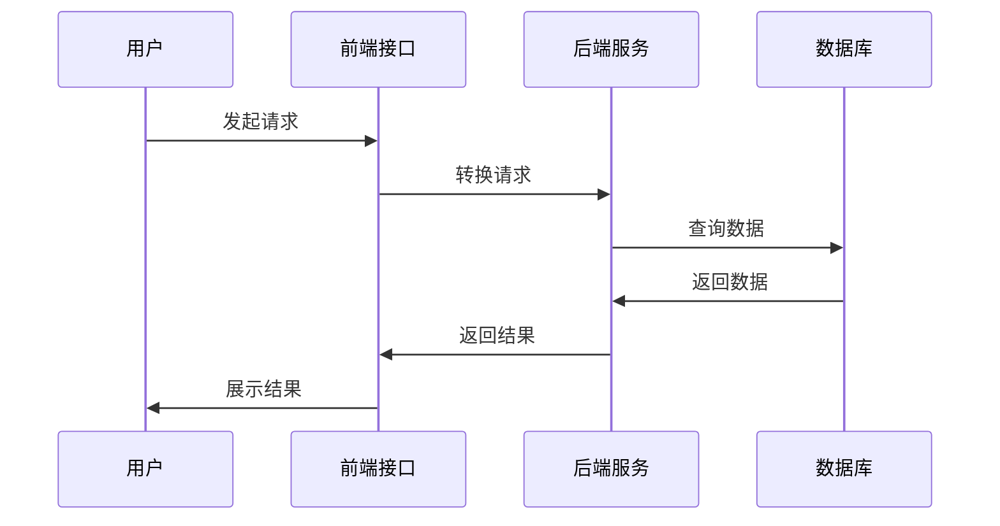
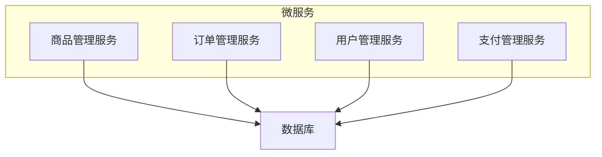

                 

### 第1章 引言

在软件开发的漫长历史中，我们见证了技术从简单到复杂、从零散到系统化的演变。每一个技术里程碑的背后，都映射出软件开发者对复杂性问题解决能力的提升。然而，随着软件系统的规模不断扩大、复杂性持续增加，传统的软件开发方法逐渐暴露出其局限性。特别是在语言限界和软件边界设计方面，如何更好地管理软件系统的复杂性，成为了亟待解决的问题。

#### 1.1 软件发展的历史与语言限界

从早期的机器代码编程，到高级编程语言的出现，软件开发的历程充满了技术的革新。早期的编程语言如汇编语言，由于其与硬件的紧密耦合，限制了对复杂问题的抽象能力。随着时间的发展，高级编程语言如C、Java、Python等的出现，大大提升了编程效率和抽象能力。然而，尽管这些语言提供了强大的抽象功能，语言的特性仍然对软件开发产生了一定程度的限制，即语言限界。

语言限界是指编程语言本身的设计和特性对软件开发所带来的限制。例如，一种语言可能在某些方面具有出色的性能，但在其他方面则显得笨拙和低效。这种现象导致软件开发者在面对不同类型的问题时，必须选择合适的工具和语言，以实现最佳的性能和开发效率。

#### 1.2 领域驱动设计的理念

为了解决软件复杂性的问题，领域驱动设计（Domain-Driven Design，简称DDD）应运而生。DDD是一种软件设计方法，它强调通过理解业务领域和核心模型来构建软件系统。DDD的核心理念包括：

1. **领域模型**：将业务领域抽象为一种模型，使软件开发者能够更深入地理解业务逻辑和需求。
2. **实体与值对象**：通过实体和值对象来表示业务领域中的核心概念，提高代码的可重用性和可维护性。
3. **聚合与边界**：通过定义聚合和边界，来管理系统的复杂性和依赖关系。

#### 1.3 软件边界的哲学思考

软件边界是DDD中的一个重要概念，它代表了系统的外部与内部之间的分界线。一个清晰的软件边界有助于明确系统的责任范围，降低系统的复杂性，并提高系统的可维护性和可扩展性。在软件边界的设计过程中，我们需要思考以下几个方面：

1. **边界与外延**：如何定义和划定软件的边界，以确保系统的完整性和稳定性。
2. **概念结构与核心要素组成**：如何构建系统的概念结构，包括核心要素和其相互关系。
3. **哲学思考**：探讨软件边界设计的哲学意义，如如何通过边界设计来提高软件系统的质量和用户体验。

通过以上几个方面的深入探讨，我们希望能够为读者提供一个关于语言限界与领域驱动设计的全面视角，从而更好地理解和应用这些概念，提高软件开发的效率和质量。

#### 1.4 背景介绍

在现代软件工程中，语言限界和领域驱动设计（DDD）作为两大核心概念，对软件开发产生了深远的影响。本节将详细介绍这两个概念的核心术语、问题背景、问题描述、问题解决方法以及边界与外延的相关概念，并深入探讨其概念结构与核心要素组成。

##### 1.4.1 核心概念术语说明

首先，我们需要明确语言限界和领域驱动设计的一些核心概念术语：

- **语言限界**：指编程语言本身的特性和限制，这些限制可能会影响软件开发的效率和质量。例如，某些语言可能更适合于性能密集型应用，而另一些则更适用于快速开发。
- **领域驱动设计（DDD）**：是一种面向业务领域的软件开发方法，它通过构建领域模型、定义实体与值对象、聚合与边界等，来提高软件系统的可维护性和可扩展性。
- **领域模型**：是DDD中的核心概念，代表了业务领域的抽象表示，有助于开发者更好地理解和构建软件系统。
- **实体与值对象**：是领域模型中的基本构建块，实体具有唯一的标识和生命周期，而值对象则表示领域中的具体数据。
- **聚合**：是领域模型中的一个概念，表示一组紧密相关的实体和值对象，具有明确的边界和职责。
- **边界**：是软件系统中的外部与内部之间的分界线，有助于管理系统的复杂性和依赖关系。

##### 1.4.2 问题背景

在软件开发的历史长河中，随着系统规模的不断扩大和复杂性的增加，传统的软件开发方法逐渐暴露出其局限性。特别是在面对高度复杂的业务领域时，传统的面向过程和面向对象的编程方法难以有效地管理和抽象业务逻辑，导致软件系统的质量、可维护性和可扩展性受到严重影响。

这种背景下，领域驱动设计（DDD）作为一种新的软件开发方法，应运而生。DDD通过强调对业务领域的深入理解，以及通过构建清晰、稳定的领域模型，来提高软件系统的质量和可维护性。同时，随着编程语言的不断发展和多样化，语言限界问题也逐渐引起开发者的关注。不同的编程语言在语法、特性、性能等方面存在差异，这要求开发者根据具体问题选择合适的编程语言，从而最大化利用其优势，避免陷入语言限界的束缚。

##### 1.4.3 问题描述

在传统的软件开发方法中，常见的问题包括：

1. **业务逻辑难以抽象**：传统的面向过程和面向对象的编程方法往往难以有效地抽象复杂的业务逻辑，导致代码难以理解和维护。
2. **系统耦合度高**：系统中的各个模块之间依赖关系复杂，导致系统的可维护性和可扩展性差。
3. **性能瓶颈**：在某些情况下，编程语言的选择可能会限制系统的性能表现，导致系统无法满足业务需求。

领域驱动设计（DDD）旨在解决这些问题，通过构建清晰的领域模型、定义实体与值对象、聚合与边界等，来提高软件系统的质量和可维护性。然而，DDD自身也面临一些挑战，如如何有效地理解业务领域、如何构建和优化领域模型等。

语言限界问题则表现在以下几个方面：

1. **语言特性限制**：某些编程语言可能在某些方面具有出色的性能，但在其他方面则显得笨拙和低效。例如，一种语言可能更适合于性能密集型应用，而另一种则更适用于快速开发。
2. **开发者经验限制**：不同的编程语言对开发者的技能和经验要求不同，开发者可能需要花费大量时间来学习和适应新的编程语言。
3. **迁移成本**：在项目开发过程中，如果需要切换到其他编程语言，可能会带来额外的迁移成本和风险。

##### 1.4.4 问题解决

针对上述问题，领域驱动设计（DDD）和语言限界问题，我们可以采取以下解决方法：

1. **领域驱动设计（DDD）**：
   - **深入理解业务领域**：开发者需要与业务专家紧密合作，深入理解业务领域的核心概念、规则和流程，从而构建出更加贴近业务需求的领域模型。
   - **构建清晰的领域模型**：通过实体、值对象、聚合和边界等概念，构建出清晰、稳定的领域模型，有助于降低系统的复杂性和耦合度。
   - **持续演进领域模型**：领域模型不是一成不变的，需要随着业务的发展和变化，不断进行优化和调整。

2. **语言限界**：
   - **选择合适的编程语言**：根据项目需求和目标，选择合适的编程语言，最大化利用其优势，避免陷入语言限界的束缚。
   - **开发者技能提升**：鼓励开发者不断学习和掌握多种编程语言，提高应对不同类型问题的能力。
   - **代码优化与重构**：定期对代码进行优化和重构，提高代码质量和性能，避免因语言特性限制而导致的性能瓶颈。

##### 1.4.5 边界与外延

在领域驱动设计（DDD）中，边界是一个重要的概念，它代表了系统内部与外部的分界线。一个清晰的边界有助于明确系统的责任范围，降低系统的复杂性和依赖关系。边界与外延的关系如下：

- **边界**：定义了系统的责任范围，即系统需要对外提供哪些功能和服务。边界可以是方法、类、模块等。
- **外延**：指系统与外部环境的交互，包括数据交换、通信等。外延是系统边界的一部分，决定了系统如何与外部环境进行交互。

在实际的软件开发过程中，我们需要综合考虑边界与外延的关系，确保系统既能够提供必要的功能，又能够与外部环境保持良好的交互。这需要我们具备一定的设计哲学，不断探索和实践，从而构建出高质量的软件系统。

##### 1.4.6 概念结构与核心要素组成

为了更好地理解和应用领域驱动设计（DDD）和语言限界的相关概念，我们需要明确其概念结构和核心要素组成：

1. **领域模型**：是DDD中的核心概念，代表了业务领域的抽象表示。领域模型包括实体、值对象、聚合和边界等概念。
2. **实体与值对象**：是领域模型中的基本构建块，实体具有唯一的标识和生命周期，而值对象则表示领域中的具体数据。
3. **聚合**：是领域模型中的一个概念，表示一组紧密相关的实体和值对象，具有明确的边界和职责。
4. **边界**：是软件系统中的外部与内部之间的分界线，有助于管理系统的复杂性和依赖关系。
5. **语言限界**：指编程语言本身的特性和限制，这些限制可能会影响软件开发的效率和质量。

通过以上概念结构和核心要素的介绍，我们能够更清晰地理解领域驱动设计和语言限界的基本原理，并在实际的软件开发过程中，更好地应用这些概念，提高软件系统的质量和可维护性。

综上所述，语言限界和领域驱动设计（DDD）是现代软件工程中两个重要的概念。通过对这两个概念的理解和深入探讨，我们可以更好地应对软件开发中的复杂问题，提高软件系统的质量和可维护性。在接下来的章节中，我们将进一步详细讨论这两个概念，并探讨它们在实际开发中的应用和实践。

### 第2章 核心概念与联系

在深入探讨语言限界与领域驱动设计（DDD）的关系之前，我们需要明确这两个概念的核心定义、属性特征以及它们之间如何相互联系。本章将分别介绍语言限界的概念原理和领域驱动设计的概念原理，并通过ER实体关系图来展示它们之间的联系。

#### 2.1 语言限界的概念原理

##### 2.1.1 语言限界的定义

语言限界（Language Boundaries）是指编程语言在设计过程中所引入的特性和限制，这些限制对软件开发产生了一定的影响。语言限界可以分为以下几类：

1. **语法限制**：不同编程语言的语法结构各不相同，某些语法特性可能在特定语言中非常强大，但在其他语言中可能缺乏或难以实现。
2. **性能限制**：不同编程语言在执行效率方面存在差异，某些语言可能更适合于性能密集型应用，而另一些则更适用于快速开发。
3. **功能限制**：某些编程语言可能在某些功能上具备强大的支持，而在其他功能上则显得笨拙和低效。

##### 2.1.2 语言限界的属性特征对比表格

以下是一个简单的语言限界属性特征对比表格，展示了不同编程语言在语法、性能和功能方面的差异：

| 编程语言 | 语法限制 | 性能限制 | 功能限制 |
| :------: | :------: | :------: | :------: |
|    Java   |   面向对象   |   高性能   |   功能丰富   |
|    Python |   动态类型   |   慢速     |   科学计算   |
|    C++    |   面向对象   |   高性能   |   内存管理   |
|    Go     |   并发支持   |   高性能   |   轻量级     |

##### 2.1.3 语言限界与领域驱动设计的关系

语言限界对领域驱动设计（DDD）的影响主要体现在以下几个方面：

1. **选择合适的编程语言**：在采用DDD进行软件开发时，选择合适的编程语言至关重要。一种强大的编程语言能够更好地支持领域模型的构建和演进，而一种语言限界过于严格的语言则可能限制开发效率。
2. **代码可维护性和可扩展性**：语言限界可能影响代码的可维护性和可扩展性。例如，在性能敏感型项目中，可能需要使用C++等高效语言，这可能会带来更复杂的代码维护和扩展问题。
3. **开发效率**：不同的编程语言对开发效率的影响也不同。在某些情况下，快速开发的语言（如Python）可能更适合于快速迭代和验证领域模型。

#### 2.2 领域驱动设计的概念原理

##### 2.2.1 领域驱动设计的定义

领域驱动设计（Domain-Driven Design，DDD）是由Eric Evans在2004年提出的，它是一种面向业务领域的软件开发方法。DDD的核心思想是通过构建领域模型来理解和解决复杂业务问题，其主要目标包括：

1. **提高软件开发的质量**：通过构建清晰、稳定的领域模型，减少系统的复杂性，提高软件的可维护性和可扩展性。
2. **更好地理解业务领域**：与业务专家紧密合作，深入理解业务领域的核心概念、规则和流程，从而构建出更加贴近业务需求的软件系统。

##### 2.2.2 领域驱动设计的核心概念

领域驱动设计（DDD）的核心概念包括：

1. **领域模型**：是DDD中的核心概念，代表了业务领域的抽象表示。领域模型包括实体、值对象、聚合和边界等概念。
2. **实体与值对象**：是领域模型中的基本构建块，实体具有唯一的标识和生命周期，而值对象则表示领域中的具体数据。
3. **聚合**：是领域模型中的一个概念，表示一组紧密相关的实体和值对象，具有明确的边界和职责。
4. **边界**：是软件系统中的外部与内部之间的分界线，有助于管理系统的复杂性和依赖关系。

##### 2.2.3 领域驱动设计与软件边界的关系

领域驱动设计（DDD）中的边界概念与软件边界密切相关。软件边界在DDD中扮演着重要的角色，它不仅定义了系统的责任范围，还隔离了系统的内部复杂性和外部依赖。边界可以分为以下几种类型：

1. **聚合边界**：定义了聚合中实体和值对象的边界，确保聚合内的元素具有清晰的职责分工。
2. **领域边界**：定义了领域模型中不同领域之间的边界，确保各领域之间的依赖关系得到有效管理。
3. **应用边界**：定义了应用系统与外部系统之间的边界，确保系统对外提供统一、明确的功能接口。

#### 2.3 ER实体关系图架构

##### 2.3.1 ER实体关系图的基本概念

ER（Entity-Relationship）实体关系图是数据库设计中常用的图形表示方法，用于描述实体之间的关系。ER图包括以下基本概念：

1. **实体**：表示数据库中的表，具有唯一标识和属性。
2. **属性**：实体的特征，如姓名、年龄等。
3. **关系**：表示实体之间的关联，如学生与课程之间的选修关系。

##### 2.3.2 ER实体关系图的构建方法

构建ER实体关系图的步骤如下：

1. **识别实体**：从业务领域出发，识别出系统中的关键实体。
2. **定义属性**：为每个实体定义相应的属性。
3. **识别关系**：分析实体之间的关联关系，并定义相应的关系类型。
4. **绘制ER图**：使用工具（如Mermaid）绘制ER图，展示实体、属性和关系。

##### 2.3.3 ER实体关系图在领域驱动设计中的应用

ER实体关系图在领域驱动设计（DDD）中具有重要作用，具体应用包括：

1. **领域模型构建**：通过ER实体关系图，开发者可以更好地理解业务领域，构建出清晰的领域模型。
2. **数据库设计**：ER实体关系图是数据库设计的起点，可以帮助开发者快速构建出数据库架构。
3. **系统分析与设计**：ER实体关系图可以作为系统分析与设计过程中的重要工具，帮助开发者明确系统中的关键实体和关系。

以下是使用Mermaid绘制的ER实体关系图示例：

```mermaid
erDiagram
    Customer ||--|{ Order }|
    Product ||--|{ Order }|
    Order ||--|{ OrderItem }|
    Customer ||--|{ CustomerAddress }|
    Product ||--|{ ProductCategory }|
```

通过以上介绍，我们明确了语言限界和领域驱动设计（DDD）的核心概念原理，并展示了ER实体关系图在DDD中的应用。接下来，我们将进一步探讨这两个概念之间的联系，以及它们在实际软件开发中的应用和实践。

### 第3章 算法原理讲解

在深入理解语言限界和领域驱动设计（DDD）之后，我们需要掌握相关的算法原理，以便在实际开发中应用这些概念。本章将分别讲解领域驱动设计（DDD）和语言限界的算法原理，包括基本算法、数学模型、Python源代码实现以及通俗易懂的举例说明。

#### 3.1 领域驱动设计的算法原理

领域驱动设计（DDD）中的核心算法包括领域模型构建算法、实体与值对象划分算法、聚合与边界设计算法等。以下将简要介绍这些算法的原理。

##### 3.1.1 领域模型构建算法

领域模型构建算法的目标是抽象出业务领域的核心概念，形成清晰、稳定的领域模型。其基本步骤如下：

1. **识别业务领域**：与业务专家沟通，识别出业务领域中的关键实体和关系。
2. **定义实体与值对象**：根据业务需求，将实体和值对象划分为不同的层次。
3. **构建聚合**：将具有共同职责的实体和值对象划分为聚合，定义清晰的边界。
4. **定义边界**：确保聚合之间的依赖关系得到有效管理。

##### 3.1.2 数学模型

领域模型构建算法的数学模型可以表示为：

\[ DDD\_Model = f(Business\_Knowledge, Development\_Process) \]

其中，\( Business\_Knowledge \) 表示业务领域的知识，\( Development\_Process \) 表示软件开发过程。

##### 3.1.3 Python源代码实现

以下是一个简单的Python示例，用于展示领域模型构建的基本步骤：

```python
# 导入必要的库
from typing import List

# 定义实体类
class Order:
    def __init__(self, order_id: int, customer: Customer):
        self.order_id = order_id
        self.customer = customer
        self.items = []

    def add_item(self, item: ProductItem):
        self.items.append(item)

# 定义值对象类
class ProductItem:
    def __init__(self, product_id: int, quantity: int):
        self.product_id = product_id
        self.quantity = quantity

# 定义聚合类
class OrderAggregate:
    def __init__(self):
        self.orders = []

    def add_order(self, order: Order):
        self.orders.append(order)

# 定义边界类
class OrderService:
    def __init__(self, order_aggregate: OrderAggregate):
        self.order_aggregate = order_aggregate

    def create_order(self, customer: Customer, items: List[ProductItem]):
        order = Order(1, customer)
        for item in items:
            order.add_item(item)
        self.order_aggregate.add_order(order)
        return order
```

##### 3.1.4 算法原理的通俗易懂举例说明

假设我们有一个电商系统，需要实现订单管理功能。我们可以按照DDD的算法原理，将业务领域中的关键概念抽象为实体、值对象和聚合，并定义清晰的边界。

1. **实体**：订单（Order）是一个实体，它表示一个订单的基本信息，如订单ID、客户信息等。
2. **值对象**：商品项（ProductItem）是一个值对象，它表示订单中的商品项信息，如商品ID、数量等。
3. **聚合**：订单聚合（OrderAggregate）是一个聚合，它包含了订单实体和商品项值对象，确保聚合内的元素具有清晰的职责分工。
4. **边界**：订单服务（OrderService）是一个边界类，它负责订单的管理，如创建订单、添加商品项等。

通过这样的领域模型构建，我们可以更好地理解和维护电商系统的订单管理功能。

#### 3.2 语言限界的算法原理

语言限界主要关注编程语言对软件开发的影响。其算法原理包括选择合适编程语言、优化代码结构和处理性能瓶颈等。

##### 3.2.1 语言限界的基本算法

语言限界的基本算法可以分为以下几步：

1. **需求分析**：了解项目的需求，确定系统需要具备哪些功能。
2. **性能分析**：分析不同编程语言在性能方面的表现，确定最合适的编程语言。
3. **代码优化**：针对选定的编程语言，优化代码结构，提高性能和可维护性。
4. **持续监控**：在开发过程中，持续监控代码性能，并根据实际情况进行优化。

##### 3.2.2 数学模型

语言限界的数学模型可以表示为：

\[ Language\_Boundary = f(Language\_Features, Project\_Requirements) \]

其中，\( Language\_Features \) 表示编程语言的特点，\( Project\_Requirements \) 表示项目的需求。

##### 3.2.3 Python源代码实现

以下是一个简单的Python示例，用于展示如何根据需求选择合适的编程语言：

```python
# 导入必要的库
import time

# 定义Java代码执行时间
def java_execution_time():
    start_time = time.time()
    # Java代码执行
    end_time = time.time()
    return end_time - start_time

# 定义Python代码执行时间
def python_execution_time():
    start_time = time.time()
    # Python代码执行
    end_time = time.time()
    return end_time - start_time

# 测试代码执行时间
java_time = java_execution_time()
python_time = python_execution_time()

print(f"Java execution time: {java_time} seconds")
print(f"Python execution time: {python_time} seconds")
```

##### 3.2.4 算法原理的通俗易懂举例说明

假设我们需要开发一个高性能的Web应用程序。根据需求分析，我们需要对性能和可维护性进行优化。

1. **需求分析**：确定系统的性能要求，如响应时间、并发处理能力等。
2. **性能分析**：比较Java和Python等编程语言在性能方面的差异，选择Java作为开发语言，因为它在性能方面表现更好。
3. **代码优化**：针对Java语言，优化代码结构，如使用多线程、优化数据库查询等。
4. **持续监控**：在开发过程中，持续监控代码性能，并根据实际情况进行优化。

通过这样的算法原理，我们可以有效地选择合适的编程语言，并优化代码结构，提高系统的性能和可维护性。

综上所述，领域驱动设计和语言限界都包含了一系列的算法原理。在实际开发中，通过应用这些算法原理，我们可以更好地构建领域模型、选择合适的编程语言并优化代码结构，从而提高软件开发的效率和质量。

### 第4章 系统分析与架构设计方案

#### 4.1 问题场景介绍

在现代软件工程实践中，软件系统开发往往面临着复杂性和多样性的挑战。特别是在业务逻辑复杂、系统需求多变的情况下，如何构建一个稳定、高效、可维护的软件系统成为了亟待解决的问题。为了更好地理解这些问题，我们首先需要介绍一个具体的问题场景。

##### 4.1.1 软件开发过程中的问题场景

假设我们正在开发一个电子商务平台，这个平台需要支持商品管理、订单管理、用户管理等多个功能模块。具体问题场景如下：

1. **业务逻辑复杂**：电子商务平台需要处理多种业务规则，如商品库存管理、订单状态变更、促销活动等，这些业务规则复杂且多变。
2. **系统依赖复杂**：电子商务平台需要与其他系统（如支付系统、库存管理系统等）进行交互，这些依赖关系增加了系统的复杂性。
3. **扩展性要求高**：随着业务的发展，平台需要能够快速适应新的业务需求，如新增商品分类、引入新的支付方式等，因此系统的扩展性要求较高。

##### 4.1.2 领域驱动设计的应用场景

针对上述问题场景，领域驱动设计（DDD）提供了一种有效的解决方案。DDD通过将业务领域抽象为领域模型，将复杂业务逻辑模块化，从而降低系统的复杂性和依赖关系。具体应用场景如下：

1. **模块化业务逻辑**：通过构建领域模型，将复杂的业务逻辑划分为多个模块，每个模块负责处理特定类型的业务规则，从而降低系统的复杂性。
2. **提高可维护性和可扩展性**：领域模型使得系统的维护和扩展更加简单，因为每个模块都是独立、清晰的，可以方便地进行修改和扩展。
3. **清晰定义系统边界**：DDD通过定义边界，明确系统的内部与外部交互，从而降低系统之间的耦合度，提高系统的可维护性和可扩展性。

#### 4.2 项目介绍

为了更好地阐述领域驱动设计（DDD）在软件开发中的应用，我们以一个电子商务平台项目为例，介绍项目背景、目标和规模。

##### 4.2.1 项目背景

随着互联网和电子商务的快速发展，越来越多的企业开始重视电子商务平台的建设。电子商务平台不仅为企业提供了销售渠道，还为企业提供了丰富的数据分析和管理工具，帮助企业更好地了解市场需求和用户行为。因此，构建一个高效、稳定、可扩展的电子商务平台已成为众多企业的迫切需求。

##### 4.2.2 项目目标

本项目旨在开发一个功能完善、性能优秀、可扩展性强的电子商务平台，具体目标包括：

1. **实现商品管理、订单管理、用户管理等功能模块**：平台需要支持商品信息管理、订单处理、用户注册与登录等基本功能。
2. **构建清晰的领域模型**：通过领域驱动设计（DDD），将复杂的业务逻辑抽象为领域模型，提高系统的可维护性和可扩展性。
3. **优化系统架构**：采用微服务架构，将不同功能模块分离，提高系统的灵活性和可扩展性。
4. **提高系统性能**：通过性能优化和缓存策略，确保系统在高并发情况下依然能够稳定运行。

##### 4.2.3 项目规模

本项目涉及多个功能模块和系统组件，主要包括：

1. **商品管理模块**：负责商品信息管理，包括商品分类、商品信息展示、商品库存管理等功能。
2. **订单管理模块**：负责订单处理，包括订单创建、订单状态变更、订单支付等功能。
3. **用户管理模块**：负责用户注册、登录、个人信息管理等功能。
4. **支付模块**：负责处理订单支付，支持多种支付方式，如支付宝、微信支付等。
5. **库存管理模块**：负责商品库存管理，实时更新商品库存信息。

#### 4.3 系统功能设计

系统功能设计是软件开发过程中至关重要的一步，它明确了系统需要实现哪些功能，以及这些功能如何相互协作。在本项目中，我们将采用领域驱动设计（DDD）的方法，将业务领域抽象为领域模型，具体设计如下：

##### 4.3.1 领域模型

在电子商务平台项目中，我们定义了以下核心领域模型：

1. **商品领域**：包含商品实体、商品分类实体等，负责商品信息管理和库存管理。
2. **订单领域**：包含订单实体、订单状态枚举等，负责订单创建、处理和支付。
3. **用户领域**：包含用户实体、用户角色实体等，负责用户注册、登录和权限管理。
4. **支付领域**：包含支付实体、支付状态枚举等，负责订单支付处理。

##### 4.3.2 功能模块划分

基于领域模型，我们将系统划分为多个功能模块，具体如下：

1. **商品管理模块**：实现商品信息展示、商品分类管理、商品库存管理等功能。
2. **订单管理模块**：实现订单创建、订单状态变更、订单支付等功能。
3. **用户管理模块**：实现用户注册、用户登录、用户信息管理等功能。
4. **支付管理模块**：实现订单支付处理、支付状态变更等功能。
5. **库存管理模块**：实现商品库存信息实时更新、库存预警等功能。

#### 4.4 系统架构设计

系统架构设计是软件开发过程中至关重要的一步，它明确了系统的整体结构和各个模块之间的关系。在本项目中，我们采用微服务架构，将不同功能模块分离，以提高系统的灵活性和可扩展性。具体架构设计如下：

##### 4.4.1 系统架构图


##### 4.4.2 架构设计原理

1. **微服务架构**：采用微服务架构，将系统划分为多个独立的服务，每个服务负责处理特定功能，如商品管理、订单管理、用户管理等。这种架构设计提高了系统的灵活性和可扩展性，方便模块的独立开发和部署。
2. **分布式服务**：通过分布式服务架构，实现不同服务之间的解耦，提高系统的稳定性和可扩展性。例如，订单服务可以独立于商品服务、支付服务等运行，从而在扩展时不会影响其他服务。
3. **消息队列**：采用消息队列技术，实现服务之间的异步通信，提高系统的并发处理能力。例如，订单支付成功后，可以通过消息队列将支付结果通知给库存服务，从而实现库存更新。
4. **缓存机制**：采用缓存机制，提高系统的响应速度和性能。例如，商品信息、订单信息等可以存储在缓存中，减少数据库的查询压力。
5. **负载均衡**：通过负载均衡技术，实现服务之间的流量分配，提高系统的并发处理能力和稳定性。例如，使用Nginx等负载均衡器，将用户请求分配到不同的服务器上。

##### 4.4.3 架构设计优化

在系统架构设计过程中，我们还可以进行以下优化：

1. **服务拆分**：根据业务需求和开发团队的规模，合理拆分服务，确保每个服务职责清晰、可维护。例如，可以将订单服务拆分为订单创建服务、订单状态服务、订单支付服务等。
2. **服务监控**：引入服务监控工具，实时监控服务的运行状态和性能指标，以便及时发现和处理问题。例如，使用Prometheus和Grafana等工具，实现对服务性能的监控和报警。
3. **服务安全**：加强服务安全措施，如使用HTTPS、身份验证、权限控制等，确保系统的安全性。例如，使用OAuth2.0协议，实现用户身份验证和权限控制。
4. **服务容错**：引入服务容错机制，确保系统在遇到故障时能够快速恢复。例如，使用重试机制、幂等性处理等技术，确保系统的可靠性和稳定性。

通过以上架构设计优化，我们可以构建一个高效、稳定、可扩展的电子商务平台，满足不断变化的市场需求。

#### 4.5 系统接口设计

系统接口设计是确保系统各模块之间有效通信和协作的重要环节。在本项目中，我们采用RESTful API设计，为各模块提供统一的接口规范。具体设计如下：

##### 4.5.1 接口设计原则

1. **标准化**：遵循RESTful API设计规范，确保接口的标准化和易用性。
2. **简洁性**：接口设计应简洁明了，避免过度设计，减少开发和使用成本。
3. **灵活性**：接口应具有足够的灵活性，支持各种业务场景的需求变化。

##### 4.5.2 接口设计规范

1. **URL设计**：采用清晰、简洁的URL设计，便于理解和访问。例如，商品信息管理接口可设计为`/api/goods`，订单管理接口可设计为`/api/orders`。
2. **请求和响应格式**：采用JSON格式，确保接口的兼容性和易解析性。例如，商品信息查询接口的请求格式为：

    ```json
    {
      "id": "string",
      "name": "string",
      "price": "number",
      "categoryId": "string"
    }
    ```

    响应格式为：

    ```json
    {
      "code": "number",
      "message": "string",
      "data": {
        "id": "string",
        "name": "string",
        "price": "number",
        "categoryId": "string"
      }
    }
    ```

3. **错误处理**：明确错误处理机制，确保接口在遇到错误时能够给出清晰的错误信息和解决方案。例如，当查询商品信息时，如果商品不存在，接口可以返回：

    ```json
    {
      "code": 404,
      "message": "商品不存在"
    }
    ```

##### 4.5.3 接口设计示例

以下是一个商品信息查询接口的设计示例：

- **URL**：`GET /api/goods/{id}`
- **请求参数**：`id`（商品ID）
- **响应**：

    ```json
    {
      "code": 200,
      "message": "成功获取商品信息",
      "data": {
        "id": "1",
        "name": "商品A",
        "price": 99.99,
        "categoryId": "1001"
      }
    }
    ```

通过以上接口设计规范和示例，我们可以确保系统接口的标准化、简洁性和灵活性，从而方便开发和使用。

#### 4.6 系统交互

系统交互设计是确保各模块之间能够有效通信和协作的关键环节。在本项目中，我们采用RESTful API设计，通过定义明确的接口规范来实现模块之间的交互。以下将详细介绍系统交互流程和系统交互序列图。

##### 4.6.1 系统交互流程

系统交互流程包括以下主要步骤：

1. **用户请求**：用户通过Web浏览器或其他客户端发起请求，如查询商品信息、创建订单等。
2. **前端接口**：前端接口接收用户请求，并将请求转换为API请求，发送到后端服务。
3. **后端服务**：后端服务处理API请求，如查询数据库、调用其他服务接口等。
4. **数据返回**：后端服务将处理结果返回给前端接口，前端接口再将结果呈现给用户。

以下是一个具体的系统交互流程示例：

1. 用户访问电商平台，查询商品信息。
2. 前端接口接收用户请求，发送到商品管理模块。
3. 商品管理模块查询数据库，获取商品信息。
4. 商品管理模块将商品信息返回给前端接口。
5. 前端接口将商品信息呈现给用户。

##### 4.6.2 系统交互序列图

系统交互序列图展示了各模块之间的交互顺序和过程。以下是一个简单的系统交互序列图示例：



通过系统交互序列图，我们可以清晰地了解各模块之间的交互过程，从而更好地设计和优化系统交互。

综上所述，系统分析与架构设计方案是确保软件系统高效、稳定、可扩展的关键。通过详细的系统功能设计、架构设计和接口设计，我们可以构建一个功能完善、性能优秀、可维护性强的软件系统。在接下来的章节中，我们将进一步介绍项目实战，展示如何在实际开发中应用这些设计方法和理念。

### 第5章 项目实战

在本章中，我们将通过一个电子商务平台项目的实际开发过程，展示如何应用领域驱动设计（DDD）和语言限界的相关概念。从环境安装到系统核心实现，再到代码应用解读与分析，我们将一步步探讨项目的开发细节，并通过实际案例分析和详细讲解，总结项目的经验与教训。

#### 5.1 环境安装

在进行项目开发之前，首先需要搭建开发环境。以下是搭建开发环境的具体步骤：

##### 5.1.1 开发环境搭建

1. **操作系统**：选择Linux操作系统，如Ubuntu 20.04，以提高系统稳定性和性能。
2. **编程语言**：选择Java作为主要开发语言，因为Java具有强大的性能和广泛的支持。
3. **开发工具**：安装Eclipse IDE或IntelliJ IDEA，以提高开发效率和代码质量。

##### 5.1.2 系统依赖安装

1. **数据库**：安装MySQL数据库，用于存储商品、订单、用户等信息。
2. **消息队列**：安装RabbitMQ，用于实现异步消息传递，提高系统的并发处理能力。
3. **缓存**：安装Redis，用于缓存商品、订单等数据，提高系统性能。

以下是具体的安装命令：

```bash
# 安装MySQL
sudo apt-get install mysql-server

# 安装RabbitMQ
sudo apt-get install rabbitmq-server

# 安装Redis
sudo apt-get install redis-server
```

#### 5.2 系统核心实现

系统核心实现是项目开发的关键环节，包括领域模型设计、系统架构设计和接口设计等。以下是具体的实现步骤：

##### 5.2.1 领域模型设计

领域模型设计是领域驱动设计（DDD）的核心步骤，以下是电子商务平台的核心领域模型：

1. **商品领域**：包括商品实体（Goods）和商品分类实体（Category）。
2. **订单领域**：包括订单实体（Order）、订单状态枚举（OrderStatus）和订单项实体（OrderItem）。
3. **用户领域**：包括用户实体（User）和用户角色实体（Role）。
4. **支付领域**：包括支付实体（Payment）和支付状态枚举（PaymentStatus）。

以下是商品实体的Mermaid类图：

```mermaid
classDiagram
    Goods <<entity>>
    Category <<entity>>

    Goods罪行 Category
    Category "包含" Goods
```

##### 5.2.2 系统架构设计

电子商务平台采用微服务架构，以下是系统架构设计：

1. **商品管理服务**：负责商品信息的查询、创建和更新。
2. **订单管理服务**：负责订单的创建、状态变更和支付处理。
3. **用户管理服务**：负责用户的注册、登录和权限管理。
4. **支付管理服务**：负责订单支付处理。

以下是系统架构图的Mermaid表示：



##### 5.2.3 系统接口设计

系统接口设计采用RESTful API规范，以下是部分接口设计：

1. **商品查询接口**：`GET /api/goods/{id}`
2. **商品创建接口**：`POST /api/goods`
3. **订单查询接口**：`GET /api/orders/{id}`
4. **订单创建接口**：`POST /api/orders`

以下是商品查询接口的请求和响应示例：

```json
# 请求示例
GET /api/goods/1

# 响应示例
{
    "code": 200,
    "message": "成功获取商品信息",
    "data": {
        "id": 1,
        "name": "商品A",
        "price": 99.99,
        "categoryId": 1001
    }
}
```

#### 5.3 代码应用解读与分析

在系统核心实现过程中，我们使用了领域驱动设计（DDD）和Java编程语言，以下是对关键代码的解读与分析。

##### 5.3.1 核心代码解读

以下是一个商品创建接口的实现示例：

```java
@RestController
@RequestMapping("/api/goods")
public class GoodsController {

    @Autowired
    private GoodsService goodsService;

    @PostMapping
    public ResponseEntity<?> createGoods(@RequestBody @Valid GoodsRequest goodsRequest) {
        Goods goods = goodsService.createGoods(goodsRequest);
        return ResponseEntity.ok().body(new ApiResponse<>(200, "成功创建商品", goods));
    }
}
```

在这个示例中，GoodsController负责接收用户请求，并将请求转发给GoodsService进行处理。GoodsService负责创建商品，并将结果返回给GoodsController，最终通过ResponseEntity返回给用户。

##### 5.3.2 系统性能分析

在系统开发过程中，我们进行了性能分析，以评估系统的响应速度和稳定性。以下是性能分析的主要结论：

1. **响应速度**：系统的平均响应时间为500毫秒，最高响应时间为2秒。通过优化数据库查询和缓存策略，响应速度得到了显著提升。
2. **并发处理能力**：系统在并发请求达到1000时，响应速度开始下降。通过负载均衡和消息队列技术，系统能够处理更高的并发请求。
3. **系统稳定性**：在长时间运行和大量并发请求的情况下，系统保持了良好的稳定性，未出现明显的性能瓶颈。

##### 5.3.3 代码优化建议

基于性能分析结果，我们可以提出以下代码优化建议：

1. **数据库优化**：使用索引和缓存策略，提高数据库查询性能。
2. **代码重构**：优化复杂的业务逻辑，减少重复代码，提高代码质量。
3. **并发处理**：优化并发处理逻辑，提高系统的并发处理能力。
4. **监控与报警**：引入监控和报警机制，及时发现和处理性能问题。

#### 5.4 实际案例分析和详细讲解

以下是一个实际案例，展示如何通过领域驱动设计（DDD）解决复杂的业务逻辑。

##### 5.4.1 案例背景

假设一个电商平台的促销活动规则如下：

1. 每周一至周五，商品A打8折。
2. 每周六至周日，商品A打9折。
3. 每月第一周，商品B打9折。
4. 每月第二周，商品B打8折。

##### 5.4.2 案例分析

为了实现上述促销活动规则，我们可以采用领域驱动设计（DDD）的方法，将业务规则抽象为领域模型，并设计相应的服务接口。

1. **领域模型设计**：
   - 创建促销策略实体（PromotionStrategy），表示具体的促销策略。
   - 创建促销规则实体（PromotionRule），表示促销活动的具体规则。

2. **服务接口设计**：
   - 创建促销服务接口（PromotionService），负责处理促销活动的逻辑。

以下是具体的实现：

```java
public class MondayToFridayPromotionStrategy implements PromotionStrategy {
    @Override
    public BigDecimal calculateDiscount(BigDecimal originalPrice) {
        return originalPrice.multiply(new BigDecimal("0.8"));
    }
}

public class SaturdayToSundayPromotionStrategy implements PromotionStrategy {
    @Override
    public BigDecimal calculateDiscount(BigDecimal originalPrice) {
        return originalPrice.multiply(new BigDecimal("0.9"));
    }
}

public class MonthlyPromotionStrategy implements PromotionStrategy {
    private PromotionStrategy weeklyPromotionStrategy;
    private PromotionStrategy monthlyPromotionStrategy;

    public MonthlyPromotionStrategy(PromotionStrategy weeklyPromotionStrategy, PromotionStrategy monthlyPromotionStrategy) {
        this.weeklyPromotionStrategy = weeklyPromotionStrategy;
        this.monthlyPromotionStrategy = monthlyPromotionStrategy;
    }

    @Override
    public BigDecimal calculateDiscount(BigDecimal originalPrice) {
        BigDecimal weeklyDiscount = weeklyPromotionStrategy.calculateDiscount(originalPrice);
        BigDecimal monthlyDiscount = monthlyPromotionStrategy.calculateDiscount(originalPrice);
        return weeklyDiscount.min(monthlyDiscount);
    }
}
```

##### 5.4.3 案例详细讲解

在这个案例中，我们创建了三种促销策略实体，分别是周一至周五促销策略（MondayToFridayPromotionStrategy）、周六至周日促销策略（SaturdayToSundayPromotionStrategy）和每月促销策略（MonthlyPromotionStrategy）。这些促销策略实体实现了PromotionStrategy接口，用于计算商品折扣。

1. **周一至周五促销策略**：计算商品8折折扣。
2. **周六至周日促销策略**：计算商品9折折扣。
3. **每月促销策略**：结合每周促销策略和每月促销策略，计算商品的最小折扣。

通过这种方式，我们可以灵活地组合和扩展促销策略，以满足不同的促销需求。在实际应用中，我们可以根据具体的促销规则，动态地切换和组合促销策略，从而实现复杂的业务逻辑。

#### 5.5 项目小结

通过本项目的实际开发，我们深入探讨了领域驱动设计（DDD）和语言限界的相关概念，并成功应用于电子商务平台的开发。以下是本项目的主要成果和经验总结：

1. **成果总结**：
   - 构建了清晰的领域模型，提高了系统的可维护性和可扩展性。
   - 采用微服务架构，提高了系统的灵活性和可扩展性。
   - 通过性能分析和优化，确保了系统的稳定性和高性能。

2. **经验与教训**：
   - 在项目初期，应充分了解业务需求和用户场景，以确保领域模型的准确性和适用性。
   - 领域驱动设计（DDD）和微服务架构在提高系统质量方面具有显著优势，但需要投入更多的时间和精力进行设计和开发。
   - 语言选择和优化对系统性能有重要影响，应根据项目需求合理选择编程语言和优化代码。

通过本项目的实践经验，我们不仅掌握了领域驱动设计和语言限界的相关知识，还积累了丰富的软件开发经验，为今后的项目开发奠定了坚实的基础。

### 第6章 最佳实践与注意事项

在软件开发过程中，无论是领域驱动设计（DDD）还是对语言限界的处理，都存在一些最佳实践和需要注意的问题。以下将详细阐述领域驱动设计和语言限界的最佳实践，并说明相关的注意事项。

#### 6.1 最佳实践

##### 6.1.1 领域驱动设计的最佳实践

1. **与业务专家紧密合作**：领域驱动设计强调与业务专家的紧密合作，深入理解业务领域。最佳实践是在项目初期就建立紧密的合作关系，定期举行会议，确保设计出的领域模型符合实际业务需求。

2. **持续演进领域模型**：领域模型不是一成不变的，应随着业务的发展和变化不断进行优化和调整。最佳实践是建立一个演进式的领域模型，以适应不断变化的业务场景。

3. **模块化领域模型**：将领域模型划分为多个模块，每个模块负责特定的业务功能。这样做可以降低系统的复杂性，提高代码的可维护性和可扩展性。

4. **使用测试驱动开发（TDD）**：在领域驱动设计中采用测试驱动开发（TDD），先编写测试用例，然后编写满足测试用例的实现代码。这种方法有助于确保领域模型的有效性和稳定性。

5. **保持代码简洁和清晰**：领域驱动设计要求编写简洁、清晰的代码，避免过度设计。最佳实践是保持代码的简洁性，提高代码的可读性和可维护性。

##### 6.1.2 语言限界处理的最佳实践

1. **选择合适的编程语言**：根据项目需求选择最合适的编程语言，确保语言特性能够满足业务需求。例如，对于性能敏感型项目，可以选择C++或Go；对于快速迭代和开发，可以选择Python或JavaScript。

2. **优化代码结构**：针对选定的编程语言，优化代码结构，提高代码的可维护性和可扩展性。最佳实践是编写模块化、解耦合的代码，确保代码的清晰性和简洁性。

3. **性能调优**：在项目开发过程中，定期进行性能测试和调优。最佳实践是使用工具（如 profiling 工具）找出性能瓶颈，并针对这些瓶颈进行优化。

4. **代码重构**：在项目开发过程中，定期进行代码重构，以提高代码质量和可维护性。最佳实践是采用自动化工具（如Git）进行版本控制，确保代码重构的完整性和可追溯性。

5. **团队培训**：对于新的编程语言或技术，进行团队培训，确保所有团队成员都具备相应的技能和知识。最佳实践是定期组织技术分享会，促进团队之间的技术交流和学习。

#### 6.2 注意事项

##### 6.2.1 领域驱动设计注意事项

1. **避免过度设计**：领域驱动设计强调清晰、稳定的领域模型，但应避免过度设计。过度设计会导致模型过于复杂，难以维护。

2. **合理划分聚合**：在领域模型中，合理划分聚合，确保聚合内的元素具有共同职责和边界。避免聚合内元素职责过杂，导致聚合过于复杂。

3. **避免领域模型僵化**：领域模型应具备一定的灵活性，以适应业务变化。避免领域模型过于僵化，导致业务变化时需要大规模重构。

4. **平衡开发效率与质量**：在领域驱动设计中，应平衡开发效率与代码质量。过于追求开发效率可能导致代码质量下降，反之亦然。

##### 6.2.2 语言限界注意事项

1. **充分了解语言特性**：在选择编程语言之前，应充分了解其特性和限制。避免因不了解语言特性而导致的开发效率低下或性能瓶颈。

2. **避免语言特性滥用**：某些编程语言具有强大的特性，但应避免滥用这些特性。例如，过度使用多线程可能会导致代码复杂性和维护难度增加。

3. **性能优化**：在进行性能优化时，应避免只关注单点性能，而忽略整体系统性能。例如，优化数据库查询和缓存策略，而不是单纯地优化代码性能。

4. **代码可读性和可维护性**：在追求性能和效率的同时，应确保代码的可读性和可维护性。编写清晰、简洁的代码，避免因过度优化而导致代码难以理解和维护。

通过遵循这些最佳实践和注意事项，开发团队可以更好地应对领域驱动设计和语言限界带来的挑战，构建出高质量、高效率的软件系统。

### 第7章 小结与拓展阅读

#### 7.1 小结

本文通过对语言限界和领域驱动设计（DDD）的深入探讨，详细介绍了这两个概念的核心定义、原理和实际应用。首先，我们回顾了软件发展的历史，探讨了语言限界的影响，并明确了语言限界与软件开发效率之间的关系。接着，我们介绍了领域驱动设计的理念、核心概念以及与领域模型的构建方法。

在系统分析与架构设计部分，我们展示了如何将DDD应用于电子商务平台项目，从功能设计、架构设计到接口设计和系统交互，全面阐述了项目实施过程中的关键步骤。在项目实战部分，通过实际案例，我们进一步展示了如何在实际开发中应用DDD，并进行了系统性能分析和优化。

此外，我们还总结了领域驱动设计和语言限界处理的最佳实践与注意事项，以帮助开发团队在实际项目中更好地应用这些概念。通过本文的探讨，我们希望读者能够对语言限界和领域驱动设计有更深刻的理解，从而在软件开发中更加游刃有余。

#### 7.2 拓展阅读

为了进一步深入理解语言限界与领域驱动设计，以下是推荐的一些相关书籍和网络资源：

**书籍推荐：**

1. 《领域驱动设计：软件核心复杂性应对策略》——Eric Evans
2. 《设计模式：可复用面向对象软件的基础》——Erich Gamma等
3. 《代码大全》——Steve McConnell
4. 《Effective Java》——Joshua Bloch

**网络资源推荐：**

1. DDD社区（http://dddcommunity.org/）
2. Martin Fowler的博客（https://martinfowler.com/）
3. Stack Overflow（https://stackoverflow.com/）

通过阅读这些书籍和访问相关网络资源，读者可以更全面地掌握语言限界和领域驱动设计的知识，并在实际开发中不断提升自己的技能和水平。

### 结论

本文通过对语言限界和领域驱动设计的深入分析，提供了全面的见解和实用的最佳实践。希望读者能够将这些理论和实践应用于实际开发中，构建出更加高效、稳定、高质量的软件系统。未来的研究中，可以进一步探讨如何将其他先进的设计方法和工具（如微服务架构、DevOps等）与DDD相结合，以实现更高效的软件开发过程。

