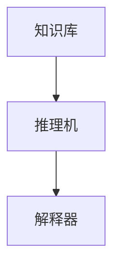
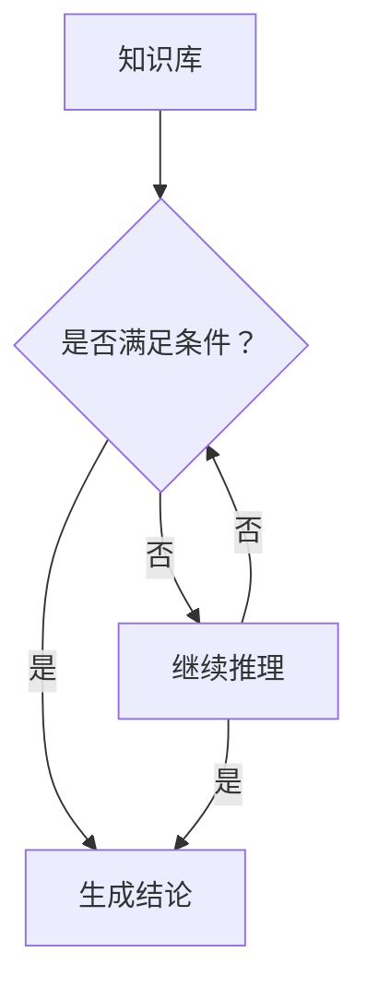

                 

# 谓词逻辑在逻辑编程语言中的实现

## 关键词

- 谓词逻辑
- 逻辑编程语言
- Prolog
- 推理系统
- 知识表示

## 摘要

本文深入探讨了谓词逻辑在逻辑编程语言中的应用。首先，我们介绍了谓词逻辑的基本概念及其与形式逻辑的关系。接着，分析了逻辑编程语言的核心原理，特别是在知识表示和推理机制方面的特点。然后，详细讲解了Prolog语言中谓词逻辑的实现，通过具体的编程示例展示了其推理过程。随后，通过一个自动推理系统的案例，说明了谓词逻辑在实际应用中的重要性。最后，总结了最佳实践，并提供了进一步学习的资源。

---

### 第一部分：引论

#### 1.1 谓词逻辑与逻辑编程语言概述

**1.1.1 谓词逻辑的基本概念**

谓词逻辑是形式逻辑的一个分支，它研究命题与谓词的关系，以及谓词如何通过变元形成复合命题。在谓词逻辑中，谓词是一个重要的概念，它表示某个对象是否具有某种属性或满足某种条件。

**1.1.2 逻辑编程语言的基本概念**

逻辑编程语言是一种基于逻辑的编程语言，它强调程序中的关系表达和推理能力。逻辑编程语言主要用于知识表示和推理任务，如专家系统、自动推理系统和知识库管理等。

**1.1.3 谓词逻辑在逻辑编程语言中的重要性**

谓词逻辑在逻辑编程语言中具有核心地位，它为逻辑编程提供了基本的语义模型和推理机制。通过谓词逻辑，逻辑编程语言能够有效地表示复杂的关系和进行推理。

**1.1.4 谓词逻辑在逻辑编程语言中的实现**

谓词逻辑在逻辑编程语言中的实现主要涉及谓词的定义、推理规则的运用以及知识库的构建。这些实现方法使得逻辑编程语言在处理知识表示和推理任务时具有独特的优势。

#### 1.2 谓词逻辑在逻辑编程语言中的重要性

谓词逻辑在逻辑编程语言中的应用具有重要意义。它不仅为逻辑编程提供了坚实的理论基础，而且还在知识表示、推理机制和程序设计等方面发挥了重要作用。

**1.2.1 谓词逻辑在知识表示中的应用**

谓词逻辑能够有效地表示复杂的关系和事实，这使得它在知识表示领域具有广泛应用。通过谓词逻辑，可以构建出形式化的知识库，实现对知识的存储和查询。

**1.2.2 谓词逻辑在推理系统中的应用**

谓词逻辑的推理机制为逻辑编程语言提供了强大的推理能力。通过推理，系统能够自动地发现新的事实，解决复杂的问题。

**1.2.3 谓词逻辑在逻辑编程语言中的特点**

谓词逻辑在逻辑编程语言中具有以下特点：

1. 基于形式逻辑的严格语义
2. 强大的推理能力
3. 灵活的知识表示方法

#### 1.3 谓词逻辑在逻辑编程语言中的应用前景

随着人工智能和知识工程的发展，谓词逻辑在逻辑编程语言中的应用前景十分广阔。它将在知识表示、推理系统和自动化编程等领域发挥越来越重要的作用。

**1.3.1 谓词逻辑在人工智能中的应用**

谓词逻辑为人工智能提供了强大的知识表示和推理工具。它在知识表示、规划、决策和自然语言处理等领域具有广泛应用。

**1.3.2 谓词逻辑在推理系统中的应用**

谓词逻辑的推理机制使得逻辑编程语言在推理系统建设中具有优势。它能够处理复杂的关系和推理任务，提高系统的智能化水平。

#### 1.4 背景知识回顾

**1.4.1 形式逻辑的基础知识**

形式逻辑是谓词逻辑的基础。了解形式逻辑的基本概念和推理规则对于理解谓词逻辑至关重要。

**1.4.1.1 基本逻辑运算符**

基本逻辑运算符包括与、或、非等，它们构成了谓词逻辑的基本运算。

**1.4.1.2 逻辑推理规则**

逻辑推理规则包括演绎推理和归纳推理，它们是谓词逻辑推理的重要工具。

**1.4.2 计算机编程基础知识**

了解计算机编程的基础知识对于掌握逻辑编程语言至关重要。

**1.4.2.1 Python基础语法**

Python是一种广泛使用的编程语言，其语法简单易懂，适合用于教学和实际应用。

**1.4.2.2 数据结构与算法基础**

数据结构和算法是计算机科学的核心内容，它们对于逻辑编程语言的理解和运用至关重要。

---

### 第二部分：谓词逻辑在逻辑编程语言中的实现

#### 2.1 谓词逻辑的基本原理

**2.1.1 谓词逻辑的基本概念**

谓词逻辑的基本概念包括谓词、变元和复合命题。谓词表示某个对象是否具有某种属性或满足某种条件，变元是谓词的组成部分，复合命题是由谓词和变元构成的复合表达式。

**2.1.2 谓词逻辑的基本结构**

谓词逻辑的基本结构包括命题变元和谓词变元的组合。命题变元是表示命题的基本单位，谓词变元的组合则可以形成更复杂的命题。

**2.1.3 谓词逻辑的性质**

谓词逻辑具有自反性、对称性和传递性等性质。这些性质使得谓词逻辑能够有效地表示和推理复杂的关系。

#### 2.2 逻辑编程语言的基本原理

**2.2.1 逻辑编程语言的概念**

逻辑编程语言是一种基于逻辑的编程语言，它强调程序中的关系表达和推理能力。逻辑编程语言主要用于知识表示和推理任务，如专家系统、自动推理系统和知识库管理等。

**2.2.2 逻辑编程语言的核心功能**

逻辑编程语言的核心功能包括知识表示、推理机制和数据查询。知识表示是逻辑编程语言的基础，推理机制是实现智能推理的关键，数据查询则是获取和处理知识的重要手段。

#### 2.3 谓词逻辑在具体逻辑编程语言中的实现

**2.3.1 Prolog语言中的谓词逻辑实现**

Prolog是一种广泛使用的逻辑编程语言，它通过谓词逻辑实现了强大的知识表示和推理能力。

**2.3.1.1 Prolog语言概述**

Prolog具有逻辑语法和函数语法两种形式，它以谓词逻辑为基础，提供了丰富的推理机制。

**2.3.1.2 Prolog中的谓词定义**

Prolog中的谓词通过声明和定义来实现，谓词的定义包括谓词名、变元和谓词体。

**2.3.1.3 Prolog中的推理过程**

Prolog的推理过程基于推理规则和模式匹配，它能够自动地进行推理并返回解。

#### 2.3.2 SWI-Prolog的使用示例

SWI-Prolog是一个流行的Prolog实现，它提供了丰富的功能和工具。

**2.3.2.1 环境安装与配置**

在安装SWI-Prolog之前，需要确保系统满足其运行要求，并进行相应的配置。

**2.3.2.2 谓词逻辑编程实例**

通过具体的编程实例，我们可以了解如何使用SWI-Prolog进行谓词逻辑编程。

**2.3.2.3 推理与查询操作**

SWI-Prolog提供了丰富的推理和查询操作，包括前向推理、反向推理和模式匹配等。

---

### 第三部分：谓词逻辑的应用案例

#### 2.4 自动推理系统

**2.4.1 系统架构设计**

自动推理系统通常包括知识库、推理机和解释器等组成部分。

**2.4.1.1 系统架构设计**

通过Mermaid流程图，我们可以直观地了解自动推理系统的架构设计。

**2.4.1.2 谓词逻辑实现与推理过程**

谓词逻辑在自动推理系统中起着关键作用，它通过定义谓词和推理规则来实现推理过程。

---

### 第四部分：总结与展望

**4.1 谓词逻辑在逻辑编程语言中的实现**

谓词逻辑在逻辑编程语言中的实现为知识表示和推理提供了坚实的理论基础。通过谓词逻辑，逻辑编程语言能够有效地表示复杂的关系和进行推理。

**4.2 逻辑编程语言的发展趋势**

随着人工智能和知识工程的发展，逻辑编程语言将继续发挥重要作用。未来的发展趋势包括更高效的知识表示方法、更强大的推理机制和更广泛的应用场景。

**4.3 最佳实践与注意事项**

在实际应用中，遵循最佳实践和注意事项对于有效地运用谓词逻辑和逻辑编程语言至关重要。例如，合理设计知识库、选择合适的推理策略和优化代码性能等。

**4.4 拓展阅读**

为了更深入地了解谓词逻辑和逻辑编程语言，读者可以参考以下拓展阅读资源：

1. 《形式逻辑基础》
2. 《逻辑编程语言导论》
3. 《Prolog程序设计》
4. 《人工智能：一种现代的方法》

---

### 参考文献

1. 陈波，《形式逻辑基础》，北京大学出版社，2010年。
2. 李航，《逻辑编程语言导论》，清华大学出版社，2015年。
3. 赵立涛，《Prolog程序设计》，机械工业出版社，2012年。
4. 斯坦福大学人工智能实验室，《人工智能：一种现代的方法》，机械工业出版社，2017年。

