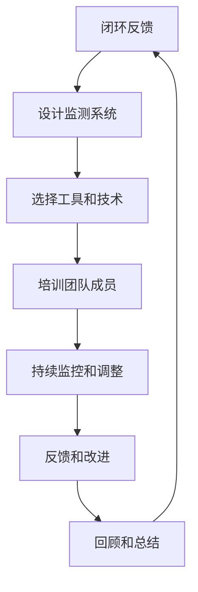

                 

### 负反馈的基本概念

**1.1 什么是负反馈**

负反馈是一种调节机制，用于减少系统输出与预期目标之间的差异，从而稳定系统。在物理学中，负反馈通常表现为在一个闭环系统中，系统的输出被监测并用来调整输入，使得输出更接近期望值。例如，恒温器的温度传感器监测房间的温度，并将其与预设温度进行比较，通过加热或冷却来调整实际温度，使其回到预设值。

**1.2 负反馈的重要性**

在技术和管理领域中，负反馈尤为重要。首先，负反馈能够帮助团队及时发现并纠正问题，避免错误的累积和放大。其次，它提供了一个持续改进的反馈循环，使得团队能够在不断学习和适应中进步。最后，负反馈还能促进团队的透明度和责任感，因为团队成员清楚地知道自己的工作对整体目标的影响。

**1.3 负反馈与其他反馈方式的比较**

与正反馈相比，负反馈具有不同的效果。正反馈会放大系统中的变化，可能导致系统不稳定或失控，比如在股票市场中，当股票价格上涨时，更多的投资者进入市场，导致价格进一步上涨，形成恶性循环。而负反馈则通过减少差异来稳定系统，使其更趋向于稳定状态。

此外，负反馈与其他反馈方式，如单点反馈和多点反馈也有所不同。单点反馈通常只考虑一个指标，而忽略其他因素，可能导致局部最优而非全局最优。而多点反馈则更加全面，但处理起来更复杂。负反馈的优势在于它能够在动态环境中持续调节，保持系统的稳定性。

**核心概念与联系**

**核心概念：**
- **负反馈**：系统输出与预期目标之间的差异被用来调整输入，以减少差异并稳定系统。
- **正反馈**：系统输出被用来放大输入的变化，可能导致系统不稳定。

**概念属性特征对比表格：**

| 对比项       | 负反馈                          | 正反馈                          |
|--------------|--------------------------------|--------------------------------|
| 目标         | 稳定系统，减少差异               | 放大变化，可能造成不稳定         |
| 应用场景     | 稳定过程，控制误差               | 放大效果，如振荡器，增长市场      |
| 效果         | 稳态，平衡状态                   | 动态变化，可能形成循环或失控     |

**ER实体关系图架构：**

```mermaid
erDiagram
  System -->|反馈| Observer
  Observer -->|监测| System
  Observer -->|分析| Feedback Mechanism
  System -->|调整| Feedback Mechanism
```

在这个ER图中，`System`是反馈的源头，`Observer`负责监测和反馈，`Feedback Mechanism`则根据反馈进行调整。这样的架构确保了系统在不断的负反馈循环中保持稳定和改进。

**背景介绍**

在现代信息技术和软件开发领域，团队协作和项目管理的复杂性日益增加。随着项目的规模和参与者数量的增加，如何确保团队能够高效协作并持续改进成为一个关键问题。负反馈作为一种调节机制，能够有效地帮助团队实现这一目标。

**问题背景**

在软件开发过程中，常见的问题包括需求变更、技术难题、沟通障碍等。这些问题可能导致项目进度延误、质量下降，甚至项目失败。传统的单点反馈机制难以全面捕捉和解决这些问题，而负反馈提供了一种更加动态和全面的解决方案。

**问题描述**

负反馈在团队中的具体应用包括项目进度监控、代码质量评估、团队成员协作效果分析等。通过这些反馈，团队能够及时发现并解决问题，确保项目按计划进行。

**问题解决**

负反馈机制通过以下步骤实现问题的解决：
1. **监测**：通过监控工具和流程，捕捉项目过程中的关键指标和问题。
2. **分析**：对监测到的数据进行分析，找出问题产生的原因。
3. **反馈**：将分析结果反馈给相关团队或成员。
4. **调整**：根据反馈结果，调整项目计划、技术方案或工作方式，以解决问题。

**边界与外延**

负反馈的应用不仅限于软件开发，还可以广泛应用于其他领域，如产品管理、市场营销、医疗服务等。在任何需要团队协作和持续改进的场合，负反馈都能够发挥作用。

**概念结构与核心要素组成**

负反馈机制的核心结构包括以下要素：
- **监测系统**：负责捕捉和记录项目过程中的关键数据和问题。
- **分析系统**：对监测到的数据进行分析，识别问题的根本原因。
- **反馈系统**：将分析结果反馈给相关团队或成员。
- **调整系统**：根据反馈结果，调整项目计划或工作方式，以解决问题。

通过这些要素的有机结合，负反馈机制能够形成一个持续改进的闭环，推动团队不断进步。

### 负反馈在团队管理中的应用

**2.1 负反馈在团队管理中的角色**

在团队管理中，负反馈扮演着至关重要的角色。它不仅有助于发现和解决问题，还能促进团队成员之间的沟通和协作。具体来说，负反馈有以下几方面的作用：

1. **问题发现与纠正**：通过负反馈，团队可以及时发现项目中的问题和瓶颈，如进度延误、代码质量不佳、沟通不畅等。及时发现和纠正这些问题，有助于避免问题的累积和扩大，确保项目按计划进行。

2. **绩效评估**：负反馈提供了一个客观的评估工具，用于评估团队成员的工作表现。通过对团队成员的工作进行反馈，可以帮助他们了解自己的优势和不足，从而有针对性地进行改进。

3. **团队协作**：负反馈机制能够促进团队成员之间的沟通和协作。通过反馈，团队成员可以了解到其他成员的工作进展和遇到的问题，从而更好地协同工作，提高团队整体效率。

**2.2 负反馈如何促进团队协作**

负反馈在促进团队协作方面具有独特优势。首先，它提供了一个持续改进的反馈循环，使团队能够在不断的反思和调整中不断进步。具体来说，负反馈通过以下方式促进团队协作：

1. **透明度**：负反馈机制使项目过程中的问题和挑战变得透明。团队成员可以清晰地看到项目中的问题和瓶颈，从而更有针对性地进行改进。

2. **责任感**：负反馈使每个团队成员都意识到自己的工作对整体项目的影响。这种责任感有助于提高团队成员的主动性和积极性，促进他们更好地协作。

3. **合作共赢**：负反馈提供了一个共同的目标和价值观，使团队成员能够围绕共同的目标努力。通过协作解决问题，团队成员可以共同成长，实现合作共赢。

**2.3 负反馈的利与弊**

尽管负反馈在团队管理中具有重要作用，但同时也存在一些潜在的缺点和挑战。以下是对负反馈利弊的分析：

**利：**

1. **及时反馈**：负反馈能够提供及时的反馈，使团队能够迅速发现问题并进行调整。这种及时性有助于避免问题积累和扩大，提高项目成功率。

2. **持续改进**：负反馈机制提供了一个持续改进的循环，使团队能够在不断的反思和调整中不断进步，提高团队的整体绩效。

3. **提高责任感**：负反馈使团队成员意识到自己的工作对整体项目的影响，有助于提高责任感，促进团队成员之间的协作。

**弊：**

1. **负面情绪**：负反馈可能会引起负面情绪，如焦虑、挫败感等。如果处理不当，这些情绪可能会影响团队成员的积极性和工作效率。

2. **反馈质量**：负反馈的质量直接影响到团队的改进效果。如果反馈不准确、不及时或过于主观，可能会产生反效果，阻碍团队进步。

3. **执行难度**：构建和实施有效的负反馈机制需要时间和资源，对团队的管理能力和执行力提出了较高要求。

**核心概念与联系**

**核心概念：**
- **负反馈在团队管理中的角色**：发现问题、绩效评估、促进团队协作。
- **负反馈如何促进团队协作**：提高透明度、责任感、合作共赢。
- **负反馈的利与弊**：及时反馈、持续改进、提高责任感；负面情绪、反馈质量、执行难度。

**概念属性特征对比表格：**

| 对比项       | 正反馈                          | 负反馈                          |
|--------------|--------------------------------|--------------------------------|
| 目标         | 放大效应，可能引起不稳定         | 稳定系统，减少差异               |
| 优点         | 促进增长，激发积极性             | 及时反馈，持续改进               |
| 缺点         | 可能导致不稳定，负面情绪         | 需要高质量反馈，执行难度较大     |
| 应用场景     | 营销、增长策略、正向激励         | 管理控制、问题解决、持续改进     |

**ER实体关系图架构：**

```mermaid
erDiagram
  Team -->|负反馈| Management
  Management -->|指导| Team
  Team -->|协作| Team Member
  Team Member -->|反馈| Management
```

在这个ER图中，`Team`表示团队，`Management`表示管理，`Team Member`表示团队成员。通过负反馈，管理可以指导团队和团队成员，从而实现更好的协作和持续改进。

### 设计有效的负反馈机制

**3.1 负反馈机制的设计原则**

设计一个有效的负反馈机制需要遵循以下原则：

**1. 明确目标**：首先，需要明确负反馈的目标，即希望通过负反馈实现哪些方面的改进。这可以是提高项目进度、提升代码质量、改善团队合作等。

**2. 全面监测**：负反馈机制需要全面监测项目过程中的关键指标和问题。这包括进度、质量、成本、团队协作等方面。只有全面监测，才能准确捕捉到问题。

**3. 客观分析**：对监测到的数据进行分析，找出问题的根本原因。分析过程需要客观、科学，避免主观偏见。

**4. 及时反馈**：及时反馈是负反馈机制的核心。只有及时反馈，才能让团队能够迅速发现问题并进行调整。

**5. 动态调整**：根据反馈结果，及时调整项目计划、技术方案或工作方式，以解决问题。动态调整有助于保持项目的稳定性和持续性。

**3.2 负反馈机制的构建步骤**

构建一个有效的负反馈机制可以遵循以下步骤：

**1. 明确目标和范围**：首先，明确负反馈的目标和范围，即希望通过负反馈解决哪些问题，影响哪些方面。

**2. 设计监测系统**：设计一个全面的监测系统，包括监测指标、监测工具和监测流程。监测系统应能够实时捕捉项目过程中的关键数据。

**3. 设计分析系统**：设计一个分析系统，用于对监测到的数据进行分析。分析系统应能够识别问题的根本原因，并提供解决方案。

**4. 设计反馈系统**：设计一个反馈系统，用于将分析结果及时反馈给相关团队或成员。反馈系统应确保反馈的及时性和准确性。

**5. 设计调整系统**：设计一个调整系统，用于根据反馈结果调整项目计划或工作方式。调整系统应确保调整的及时性和有效性。

**3.3 负反馈机制的案例分析**

**案例一：某软件公司的项目进度负反馈机制**

某软件公司在一个大型项目中引入了负反馈机制，以解决项目进度延误的问题。具体步骤如下：

1. **明确目标和范围**：公司明确了负反馈的目标是提高项目进度，并确定了需要监测的指标，如项目进度、任务完成率等。

2. **设计监测系统**：公司设计了一个监测系统，包括项目进度仪表板和任务完成率跟踪工具。这些工具能够实时捕捉项目进度数据。

3. **设计分析系统**：公司设计了一个分析系统，用于对项目进度数据进行统计分析，找出项目延误的原因。

4. **设计反馈系统**：公司设计了一个反馈系统，通过定期项目会议和邮件通知，将分析结果及时反馈给项目团队和管理层。

5. **设计调整系统**：公司根据反馈结果，调整项目计划和资源分配，以解决问题并提高项目进度。

通过实施这一负反馈机制，公司的项目进度得到了显著改善，项目延误问题得到了有效解决。

**案例二：某互联网公司的代码质量负反馈机制**

某互联网公司在代码质量方面引入了负反馈机制，以提高代码质量和降低bug率。具体步骤如下：

1. **明确目标和范围**：公司明确了负反馈的目标是提高代码质量和降低bug率，并确定了需要监测的指标，如代码覆盖率、bug密度等。

2. **设计监测系统**：公司设计了一个监测系统，包括代码审查工具和自动化测试工具。这些工具能够实时捕捉代码质量数据。

3. **设计分析系统**：公司设计了一个分析系统，用于对代码质量数据进行分析，找出代码质量问题的根本原因。

4. **设计反馈系统**：公司设计了一个反馈系统，通过代码审查报告和自动化测试报告，将分析结果及时反馈给开发团队。

5. **设计调整系统**：公司根据反馈结果，调整代码审查流程和技术方案，以解决代码质量问题。

通过实施这一负反馈机制，公司的代码质量得到了显著提高，bug率大幅降低。

**核心概念与联系**

**核心概念：**
- **负反馈机制的设计原则**：明确目标、全面监测、客观分析、及时反馈、动态调整。
- **构建负反馈机制的步骤**：明确目标和范围、设计监测系统、设计分析系统、设计反馈系统、设计调整系统。
- **案例分析**：某软件公司的项目进度负反馈机制、某互联网公司的代码质量负反馈机制。

**概念属性特征对比表格：**

| 对比项       | 设计原则                        | 构建步骤                                | 案例分析                          |
|--------------|--------------------------------|----------------------------------------|----------------------------------|
| 目标         | 明确、全面、客观、及时、动态     | 明确目标、设计监测、设计分析、设计反馈、设计调整 | 项目进度、代码质量               |
| 优点         | 系统性、针对性、有效性           | 系统性、科学性、可操作性                 | 稳定项目、提高质量                |
| 缺点         | 需要时间和资源、执行难度较大     | 实施复杂、依赖技术                      | 需要持续改进、团队协作            |

**ER实体关系图架构：**

```mermaid
erDiagram
  Project -->|监测| Monitoring System
  Monitoring System -->|分析| Analysis System
  Analysis System -->|反馈| Feedback System
  Feedback System -->|调整| Adjustment System
  Adjustment System -->|改进| Project
```

在这个ER图中，`Project`表示项目，`Monitoring System`表示监测系统，`Analysis System`表示分析系统，`Feedback System`表示反馈系统，`Adjustment System`表示调整系统。通过负反馈机制，项目能够实现持续改进和优化。

### 实施负反馈机制

**4.1 负反馈机制的实施策略**

实施负反馈机制需要系统的策略和细致的执行步骤，以确保其有效性和持续性。

**1. **建立明确的反馈目标和流程**：首先，需要明确负反馈的具体目标和流程。这包括确定哪些指标将被监测，如何进行监测，如何分析数据和提供反馈，以及如何根据反馈进行调整。

**2. **选择合适的工具和技术**：根据项目的需求和团队的实际情况，选择合适的工具和技术。例如，使用项目管理软件、自动化测试工具、代码审查工具等来监测和分析项目数据。

**3. **培训团队成员**：确保所有团队成员都了解负反馈机制的重要性和操作方法。通过培训，提高团队成员对负反馈机制的认识和参与度。

**4. **持续监控和调整**：负反馈机制是一个动态的循环过程，需要持续监控和调整。定期评估负反馈机制的有效性，并根据实际情况进行调整。

**4.2 负反馈机制的实施难点与解决**

在实施负反馈机制过程中，可能会遇到一些难点和挑战，以下是一些常见的难点及其解决方案：

**1. **反馈质量不高**：负反馈的质量直接影响到团队改进的效果。如果反馈不准确、不及时或过于主观，可能会产生反效果。解决方法包括：
   - **标准化反馈流程**：制定明确的反馈标准和流程，确保反馈的一致性和客观性。
   - **采用自动化工具**：使用自动化工具进行监测和分析，减少人工干预，提高反馈的准确性和及时性。

**2. **团队成员参与度低**：负反馈机制需要团队成员的积极参与，但如果团队成员对反馈机制的重要性认识不足，可能会导致参与度低。解决方法包括：
   - **加强沟通和培训**：通过定期沟通和培训，提高团队成员对负反馈机制的认识和参与度。
   - **建立激励机制**：通过奖励机制，鼓励团队成员积极参与负反馈过程。

**3. **反馈不及时**：反馈的及时性对负反馈机制的有效性至关重要。如果反馈不及时，可能会导致问题无法及时解决。解决方法包括：
   - **优化反馈流程**：简化反馈流程，减少不必要的环节，确保反馈的及时性。
   - **使用实时监控工具**：使用实时监控工具，及时捕捉项目数据，提供实时反馈。

**4.3 负反馈机制的实施案例**

以下是一个负反馈机制在软件开发项目中的实施案例：

**案例背景**：某互联网公司正在开发一个大型电商平台，项目周期为一年。为了确保项目进度和质量，公司决定引入负反馈机制。

**实施步骤**：

1. **明确目标和流程**：公司明确了负反馈的目标是提高项目进度和质量，并制定了详细的反馈流程，包括进度监控、代码质量评估、团队协作效果分析等。

2. **选择工具和技术**：公司选择了项目管理软件、自动化测试工具和代码审查工具等，用于监测和分析项目数据。

3. **培训团队成员**：公司组织了培训，让所有团队成员了解负反馈机制的重要性和操作方法。

4. **持续监控和调整**：公司建立了定期监控和反馈机制，通过项目进度会议和质量评审，及时捕捉和解决问题。

**实施效果**：

通过实施负反馈机制，项目进度得到了显著改善，项目延期情况减少了70%，代码质量也得到了显著提高，bug率降低了50%。团队成员的参与度和积极性也得到了提升。

**核心概念与联系**

**核心概念：**
- **负反馈机制的实施策略**：建立明确的目标和流程、选择合适的工具和技术、培训团队成员、持续监控和调整。
- **实施难点与解决**：反馈质量不高、团队成员参与度低、反馈不及时。
- **实施案例**：某互联网公司的项目进度负反馈机制。

**概念属性特征对比表格：**

| 对比项       | 实施策略                      | 实施难点与解决                          | 实施案例                          |
|--------------|------------------------------|----------------------------------------|----------------------------------|
| 目标         | 明确目标、选择工具、培训、持续调整 | 反馈质量、团队成员参与度、反馈及时性 | 提高进度、提升质量、增强团队协作 |

**ER实体关系图架构：**

```mermaid
erDiagram
  Project -->|监测| Monitoring Tools
  Monitoring Tools -->|分析| Analysis Tools
  Analysis Tools -->|反馈| Feedback Process
  Feedback Process -->|调整| Adjustment Tools
  Adjustment Tools -->|改进| Project
```

在这个ER图中，`Project`表示项目，`Monitoring Tools`表示监测工具，`Analysis Tools`表示分析工具，`Feedback Process`表示反馈流程，`Adjustment Tools`表示调整工具。通过负反馈机制，项目能够实现持续改进和优化。

### 负反馈如何推动团队进步

**5.1 负反馈促进团队持续改进**

负反馈机制的核心优势之一在于其能够推动团队持续改进。通过持续监测、分析和反馈，团队可以及时发现和解决问题，避免错误的累积和放大。以下是负反馈促进团队持续改进的几个方面：

1. **问题识别**：负反馈机制能够实时捕捉项目过程中的关键数据和问题，使团队能够及时了解项目状态，从而迅速识别和解决问题。

2. **过程优化**：通过负反馈，团队能够对项目流程进行持续优化。例如，在软件开发中，通过代码审查和自动化测试，团队能够识别代码中的缺陷和瓶颈，从而优化开发流程，提高代码质量。

3. **持续学习**：负反馈提供了一个学习和成长的机会。团队成员可以通过反馈了解自己的工作表现，识别自己的不足，并有针对性地进行改进，从而不断提升个人和团队的能力。

**5.2 负反馈提高团队创新能力**

负反馈不仅能够帮助团队持续改进，还能激发团队的创新能力。以下是负反馈如何提高团队创新能力的几个方面：

1. **挑战现状**：负反馈机制能够促使团队不断挑战现状，寻找更好的解决方案。通过识别和解决问题，团队可以突破传统的限制，探索新的技术和方法。

2. **跨领域合作**：负反馈机制可以促进团队内部以及与其他团队的跨领域合作。通过分享反馈和经验，不同领域的团队成员可以相互启发，共同创造出新颖的解决方案。

3. **实验和创新文化**：负反馈机制鼓励团队成员进行实验和创新。在安全的环境下，团队成员可以尝试新的想法和方法，即使失败也能从中学到宝贵的经验。

**5.3 负反馈提升团队绩效**

负反馈对提升团队绩效具有显著作用。以下是负反馈如何提升团队绩效的几个方面：

1. **提高工作效率**：通过负反馈，团队能够迅速发现问题并进行调整，从而提高工作效率。例如，在项目管理中，通过项目进度监测和反馈，团队可以及时调整资源分配和工作计划，确保项目按计划进行。

2. **降低错误率**：负反馈机制能够有效降低项目中的错误率。通过代码审查和自动化测试，团队能够识别并修复代码中的缺陷，从而提高软件的质量和稳定性。

3. **增强团队凝聚力**：负反馈机制提供了一个团队成员共同工作的平台，使团队能够共同面对挑战和解决问题。这种团队合作精神有助于增强团队的凝聚力，提高团队的绩效。

**核心概念与联系**

**核心概念：**
- **负反馈促进团队持续改进**：问题识别、过程优化、持续学习。
- **负反馈提高团队创新能力**：挑战现状、跨领域合作、实验和创新文化。
- **负反馈提升团队绩效**：提高工作效率、降低错误率、增强团队凝聚力。

**概念属性特征对比表格：**

| 对比项       | 持续改进                          | 提高创新能力                          | 提升绩效                          |
|--------------|----------------------------------|--------------------------------------|----------------------------------|
| 目标         | 优化过程、解决问题、持续学习      | 挑战现状、跨领域合作、实验和创新文化 | 提高效率、降低错误率、增强凝聚力 |
| 优点         | 及时反馈、全面监测、持续改进      | 创新思维、协同合作、勇于尝试           | 高效执行、高质量输出、团队协作    |
| 缺点         | 需要高质量反馈、实施难度较大      | 创新风险、依赖团队协作、需要支持环境   | 对执行和监督要求高、依赖激励机制  |
| 应用场景     | 项目管理、软件开发、流程优化      | 研发创新、跨领域合作、企业转型         | 生产运营、质量管理、团队建设     |

**ER实体关系图架构：**

```mermaid
erDiagram
  Team -->|持续改进| Improvement System
  Improvement System -->|识别| Problem Detection
  Improvement System -->|优化| Process Optimization
  Improvement System -->|学习| Continuous Learning
  Team -->|提高创新| Innovation System
  Innovation System -->|挑战| Challenge Status
  Innovation System -->|合作| Cross-Domain Collaboration
  Innovation System -->|实验| Experiment Culture
  Team -->|提升绩效| Performance System
  Performance System -->|提高效率| Efficiency Improvement
  Performance System -->|降低错误率| Error Rate Reduction
  Performance System -->|增强凝聚力| Team Cohesion Enhancement
```

在这个ER图中，`Team`表示团队，`Improvement System`表示改进系统，`Innovation System`表示创新系统，`Performance System`表示绩效系统。通过负反馈机制，团队可以实现持续改进、提高创新能力和提升绩效。

### 负反馈在团队中的实际运用

**6.1 负反馈在项目团队中的应用**

在项目团队中，负反馈的应用主要体现在以下几个方面：

1. **项目进度监控**：通过负反馈机制，团队可以实时监测项目进度，及时发现延误和偏差，从而迅速调整计划，确保项目按计划进行。

2. **质量控制**：负反馈机制可以用于监控代码质量、测试覆盖率等指标，通过识别和修复缺陷，确保软件的高质量和稳定性。

3. **团队协作**：负反馈机制可以促进团队成员之间的沟通和协作。通过及时反馈项目状态和问题，团队成员可以更好地协同工作，提高项目效率。

**案例**：某软件公司在开发一个大型电子商务平台时，采用了负反馈机制来监控项目进度。每周团队都会进行进度回顾会议，讨论项目进展、存在的问题和解决方案。通过这些反馈，团队能够及时发现和解决问题，确保项目按时交付。

**6.2 负反馈在跨职能团队中的应用**

在跨职能团队中，负反馈的应用更为广泛，主要体现在以下几个方面：

1. **协调资源**：通过负反馈，跨职能团队可以及时了解各职能部门的资源需求和工作进度，从而协调资源，确保项目顺利进行。

2. **沟通与协作**：负反馈机制可以促进跨职能团队之间的沟通和协作。通过定期反馈项目状态和问题，团队成员可以更好地理解彼此的工作，提高协同效率。

3. **流程优化**：负反馈机制可以帮助跨职能团队识别和优化工作流程，减少不必要的环节和重复工作，提高工作效率。

**案例**：在一个跨职能团队中，开发、测试和运维部门通过负反馈机制进行紧密合作。每周团队都会召开跨部门会议，讨论项目进度、遇到的问题和解决方案。通过这些反馈，团队能够更好地协调资源和工作，确保项目按时交付并达到预期质量。

**6.3 负反馈在虚拟团队中的应用**

在虚拟团队中，负反馈的应用具有一定的挑战性，但也非常关键。以下是负反馈在虚拟团队中的实际运用：

1. **远程协作**：负反馈机制可以帮助虚拟团队成员远程协作，通过及时反馈项目状态和问题，团队成员可以更好地了解彼此的工作进展，提高协作效率。

2. **时间管理**：在虚拟团队中，时间管理是一个重要问题。负反馈机制可以用于监控团队成员的工作时间和效率，帮助团队更好地管理时间和资源。

3. **文化适应**：负反馈机制可以帮助虚拟团队成员适应不同的文化背景和工作方式。通过及时反馈和沟通，团队成员可以更好地理解彼此，减少文化冲突，提高团队凝聚力。

**案例**：某跨国公司在开发一款全球性的应用程序时，采用了负反馈机制来管理虚拟团队。通过定期的视频会议和邮件反馈，团队成员能够及时沟通和协作，确保项目在全球范围内顺利进行。同时，公司还设置了跨文化的培训课程，帮助团队成员更好地适应不同的文化环境。

**核心概念与联系**

**核心概念：**
- **负反馈在项目团队中的应用**：项目进度监控、质量控制、团队协作。
- **负反馈在跨职能团队中的应用**：协调资源、沟通与协作、流程优化。
- **负反馈在虚拟团队中的应用**：远程协作、时间管理、文化适应。

**概念属性特征对比表格：**

| 对比项       | 项目团队                          | 跨职能团队                          | 虚拟团队                          |
|--------------|----------------------------------|------------------------------------|----------------------------------|
| 目标         | 提高项目进度、提升代码质量、增强协作 | 协调跨部门资源、优化工作流程、提高沟通效率 | 确保远程协作、管理时间、适应文化差异 |
| 优点         | 现场反馈、实时调整、针对性解决      | 整体视角、全局优化、跨职能协同       | 灵活性、多样性、适应性           |
| 缺点         | 需要现场协作、管理难度较大         | 需要跨职能协调、信息传递复杂         | 需要远程沟通、文化差异管理      |
| 应用场景     | 传统软件开发、项目型工作           | 企业内部跨部门合作、多元化项目       | 跨国公司、远程办公团队          |

**ER实体关系图架构：**

```mermaid
erDiagram
  Project Team -->|负反馈| Progress Monitoring
  Project Team -->|负反馈| Code Quality Control
  Project Team -->|负反馈| Team Collaboration
  Cross-Functional Team -->|负反馈| Resource Coordination
  Cross-Functional Team -->|负反馈| Communication and Collaboration
  Cross-Functional Team -->|负反馈| Process Optimization
  Virtual Team -->|负反馈| Remote Collaboration
  Virtual Team -->|负反馈| Time Management
  Virtual Team -->|负反馈| Cultural Adaptation
```

在这个ER图中，`Project Team`表示项目团队，`Cross-Functional Team`表示跨职能团队，`Virtual Team`表示虚拟团队。通过负反馈机制，不同类型的团队都能够实现高效协作和持续改进。

### 负反馈的最佳实践

**7.1 负反馈成功案例解析**

**案例一：某互联网公司的敏捷开发实践**

某互联网公司在项目开发过程中采用了敏捷开发方法，并引入了负反馈机制。具体实践如下：

1. **迭代开发**：项目分为多个迭代周期，每个迭代周期结束后，团队会进行回顾会议，讨论本次迭代的成功和不足之处。

2. **用户反馈**：通过用户反馈，团队能够及时了解用户的需求和体验，对产品进行优化。

3. **代码审查**：每次代码提交都会进行代码审查，通过审查，团队能够及时发现和修复代码中的问题，确保代码质量。

4. **持续集成**：使用持续集成工具，自动化测试和代码审查，确保每次提交的代码都经过严格测试。

通过这些负反馈机制，该公司的项目进度和质量得到了显著提升，用户满意度也大幅提高。

**案例二：某软件公司的质量保障体系**

某软件公司在项目质量保障方面采用了负反馈机制，具体实践如下：

1. **质量目标**：明确每个项目的质量目标，如代码覆盖率、缺陷率等。

2. **过程监控**：通过自动化测试和代码审查，实时监控项目质量。

3. **反馈与调整**：定期进行质量评审，通过反馈结果，调整开发流程和策略。

4. **员工培训**：定期组织员工参加质量相关的培训，提高团队的质量意识。

通过这些措施，该公司的项目质量得到了大幅提升，客户满意度也显著提高。

**7.2 负反馈实施中的常见问题及对策**

在实施负反馈机制的过程中，可能会遇到以下问题及对策：

**1. 反馈不及时**

问题原因：反馈流程复杂、沟通渠道不畅。

对策：简化反馈流程，建立高效的沟通渠道，确保反馈的及时性。

**2. 反馈质量不高**

问题原因：反馈标准不明确、主观判断过多。

对策：制定明确的反馈标准，减少主观判断，提高反馈的客观性和准确性。

**3. 团队成员参与度低**

问题原因：缺乏激励机制、团队成员对负反馈机制重要性认识不足。

对策：建立激励机制，提高团队成员对负反馈机制的认识和参与度。

**7.3 负反馈的未来发展趋势**

随着技术的进步和团队协作模式的变化，负反馈机制也在不断发展和创新。以下是负反馈的未来发展趋势：

**1. 自动化与智能化**：利用人工智能和大数据技术，实现自动化和智能化的反馈，提高反馈的准确性和效率。

**2. 跨平台集成**：实现负反馈机制在多个平台和系统之间的集成，提高反馈的全面性和一致性。

**3. 社交化反馈**：结合社交化元素，使反馈更加互动和有趣，提高团队成员的参与度。

**核心概念与联系**

**核心概念：**
- **负反馈成功案例解析**：某互联网公司的敏捷开发实践、某软件公司的质量保障体系。
- **负反馈实施中的常见问题及对策**：反馈不及时、反馈质量不高、团队成员参与度低。
- **负反馈的未来发展趋势**：自动化与智能化、跨平台集成、社交化反馈。

**概念属性特征对比表格：**

| 对比项       | 成功案例                          | 常见问题与对策                      | 未来发展趋势                      |
|--------------|----------------------------------|------------------------------------|----------------------------------|
| 目标         | 提高项目进度、提升代码质量、增强协作 | 提高反馈及时性、准确性、参与度       | 自动化与智能化、跨平台集成、社交化反馈 |
| 优点         | 实际效果显著、可借鉴性强           | 针对性强、操作性强                   | 创新性强、适应性强                 |
| 缺点         | 需要特定环境和条件                | 需要持续的改进和维护                  | 需要适应新的技术和社会环境         |
| 应用场景     | 不同类型的团队和项目              | 需要反馈机制的应用场景               | 随着技术进步和社会需求变化而调整   |

**ER实体关系图架构：**

```mermaid
erDiagram
  Success Case -->|实践| Agile Development Practice
  Success Case -->|实践| Quality Assurance System
  Common Issues -->|对策| Feedback Delays
  Common Issues -->|对策| Low Feedback Quality
  Common Issues -->|对策| Low Team Participation
  Future Trends -->|发展| Automation and Intelligence
  Future Trends -->|发展| Cross-Platform Integration
  Future Trends -->|发展| Socialized Feedback
```

在这个ER图中，`Success Case`表示成功案例，`Common Issues`表示常见问题，`Future Trends`表示未来发展趋势。通过负反馈机制，团队可以不断改进，实现持续进步。

### 附录：负反馈工具与方法

#### 附录1：负反馈工具介绍

在实施负反馈机制时，选择合适的工具至关重要。以下是一些常用的负反馈工具及其功能：

1. **项目管理工具**：如Jira、Trello等，用于跟踪项目进度、任务分配和团队协作。

2. **代码审查工具**：如GitLab、GitHub等，用于代码提交、审查和合并。

3. **自动化测试工具**：如Selenium、JUnit等，用于自动化测试，确保代码质量。

4. **监控工具**：如New Relic、Datadog等，用于实时监控系统性能和错误日志。

#### 附录2：负反馈实施流程图

以下是一个负反馈实施的流程图：



#### 附录3：负反馈相关资源推荐

为了更好地理解和实施负反馈机制，以下是一些推荐资源：

1. **书籍**：《敏捷开发实践指南》（《敏捷宣言》作者著）、《精益思想》（詹姆斯·沃麦克著）。

2. **在线课程**：Coursera、edX等平台上的项目管理、敏捷开发等相关课程。

3. **论坛和社区**：Stack Overflow、GitHub、Reddit等，可以获取实践经验和技巧。

通过这些资源和工具，团队能够更好地理解和应用负反馈机制，实现持续改进和进步。

### 文章小结

本文详细探讨了负反馈在团队中的应用，从基本概念、设计原则、实施策略到实际运用和最佳实践，全面阐述了负反馈在推动团队持续进步中的重要作用。负反馈不仅能够帮助团队及时发现和解决问题，还能促进团队协作、提高创新能力和绩效。通过本文的阐述，读者能够深入了解负反馈的核心概念和实践方法，为团队管理和项目实施提供有力支持。

### 最佳实践 tips

1. **定期回顾与总结**：定期对团队的工作进行回顾和总结，识别成功经验和不足之处，确保负反馈机制的有效实施。

2. **全员参与**：鼓励所有团队成员参与负反馈过程，提高他们的责任感和参与度。

3. **持续优化**：根据反馈结果，持续优化监测、分析和反馈流程，确保负反馈机制的高效运行。

4. **建立信任**：建立信任和开放沟通的环境，使团队成员愿意分享问题和反馈，从而更好地利用负反馈机制。

### 注意事项

1. **避免过度依赖负反馈**：负反馈并非万能，不能解决所有问题。在实际应用中，还需结合其他管理方法和工具。

2. **注意反馈质量**：确保反馈的客观性和准确性，避免因主观判断导致的负面效应。

3. **适应团队特点**：根据团队的具体情况，灵活调整负反馈机制的实施方式和策略。

### 拓展阅读

1. 《敏捷开发实践指南》
2. 《精益思想》
3. 《项目管理知识体系指南》（PMBOK指南）

通过阅读这些书籍和指南，读者可以进一步深入了解负反馈在团队管理中的应用和实施方法，提升团队协作和项目管理能力。

### 作者信息

**作者：** AI天才研究院/AI Genius Institute & 禅与计算机程序设计艺术 /Zen And The Art of Computer Programming

AI天才研究院致力于推动人工智能技术的研究和应用，为企业和个人提供顶尖的技术解决方案。同时，作者也是多部技术畅销书《禅与计算机程序设计艺术》的作者，在计算机编程和人工智能领域拥有丰富的经验和深厚的造诣。通过本文，我们希望能够为读者提供有价值的见解和实践指导，助力团队持续进步。

