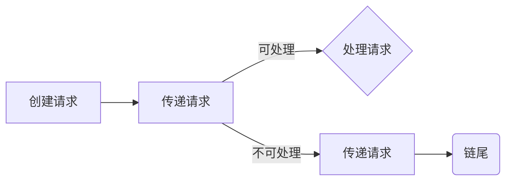
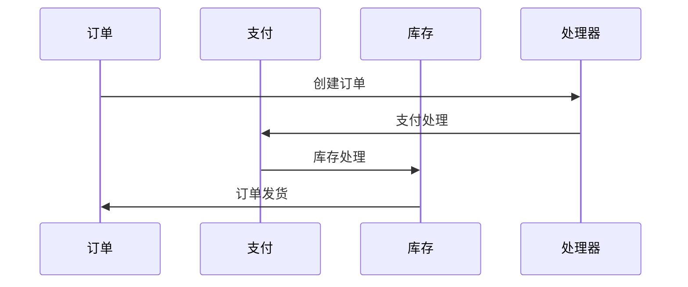
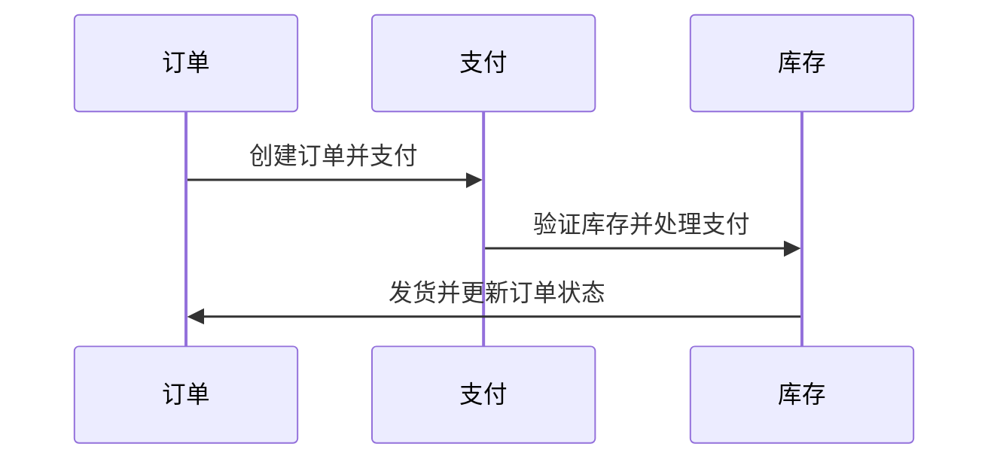

                 

### 责任链模式:请求处理的类型化流程

---

#### 关键词：责任链模式、请求处理、设计模式、流程控制

#### 摘要：
责任链模式（Chain of Responsibility Pattern）是一种设计模式，它用于将请求的处理委托给一系列的处理者，直到有处理者能够处理该请求为止。本文将深入探讨责任链模式的基本概念、实现原理、应用场景以及其在实际开发中的重要性。

---

## **背景介绍**

### **核心概念术语说明**

在深入探讨责任链模式之前，我们需要明确一些核心概念术语：

- **请求（Request）**：需要被处理的任务或事件。
- **处理者（Handler）**：能够处理特定类型请求的组件。
- **责任链（Chain）**：一系列处理者的集合，每个处理者都有机会处理请求。
- **处理（Handle）**：处理者对请求的响应。

### **问题背景**

在日常软件开发中，请求处理的流程往往需要具备一定的灵活性和可扩展性。比如，一个请求可能需要经过多个步骤或多个组件的处理才能最终完成。传统的顺序处理方式在某些场景下显得不够灵活，而责任链模式提供了一种更为灵活的解决方案。

### **问题描述**

如何在软件中实现一个灵活且高效的请求处理流程？传统的顺序处理方式难以应对复杂的请求处理逻辑，而责任链模式则通过一个链式结构来组织处理者，使得请求处理过程可以动态地添加、删除或修改处理步骤。

### **问题解决**

责任链模式通过将请求处理分散到多个处理者中，每个处理者只负责一部分处理逻辑，从而实现模块化和可扩展性。当一个请求到达时，它会沿着责任链传递，直到有处理者能够处理它，或者到达链尾仍未被处理。

### **边界与外延**

责任链模式适用于需要灵活处理流程的场景，如Web应用中的中间件处理、事件处理、日志记录等。它的核心是处理者之间的责任分配和请求传递机制。

### **概念结构与核心要素组成**

责任链模式的主要组件包括：

- **处理者（Handler）**：能够处理特定类型请求的组件。
- **请求（Request）**：需要被处理的任务或事件。
- **责任链（Chain）**：一系列处理者的集合。
- **处理（Handle）**：处理者对请求的响应。

这些组件之间的关系如下：

1. **请求创建**：创建一个请求对象。
2. **请求传递**：将请求沿着责任链传递。
3. **处理判断**：每个处理者判断自己是否能够处理请求。
4. **处理响应**：能够处理请求的处理者对请求进行处理。
5. **链传递**：如果当前处理者无法处理请求，将请求传递给下一个处理者。

### **应用领域**

责任链模式广泛应用于各种领域，如Web开发、事件处理、日志记录、错误处理等。它提供了一种灵活且高效的请求处理方式，使得系统可以在不需要修改原有代码的情况下动态地添加或删除处理步骤。

## **核心概念与联系**

### **核心概念原理**

责任链模式的核心原理是请求传递和处理者协作。当一个请求到达时，它会首先传递给责任链的第一个处理者。如果该处理者无法处理请求，它会将请求传递给下一个处理者，直到有一个处理者能够处理请求或者到达链尾。

### **概念属性特征对比表格**

| 特征 | 解释 |
| ---- | ---- |
| 模块化 | 责任链模式将请求处理过程分解为多个模块，每个模块只负责一部分处理逻辑。 |
| 可扩展性 | 可以动态地添加或删除处理者，而不需要修改原有代码。 |
| 高内聚 | 每个处理者只关注自己的处理逻辑，与其他处理者无关。 |
| 低耦合 | 处理者之间通过请求传递进行协作，相互之间没有直接依赖。 |

### **ER实体关系图架构**

```mermaid
erDiagram
  Request ||--o{ Handler : 处理请求 }
  Handler ||--o{ Handler : 传递请求 }
  Handler ||--|{ Request : 可以处理 }
```

在这个ER图中，`Request` 是请求实体，`Handler` 是处理者实体。每个处理者可以处理多个请求，并且可以将请求传递给下一个处理者。

## **算法原理讲解**

### **算法流程图**



### **Python源代码**

```python
class Handler:
    def __init__(self, successor=None):
        self._successor = successor

    def handle(self, request):
        if self._successor:
            self._successor.handle(request)
        else:
            print("请求未处理")

class ConcreteHandler1(Handler):
    def handle(self, request):
        if 1 <= request <= 10:
            print("处理请求", request)
        else:
            super().handle(request)

class ConcreteHandler2(Handler):
    def handle(self, request):
        if 11 <= request <= 20:
            print("处理请求", request)
        else:
            super().handle(request)

# 创建处理链
handler1 = ConcreteHandler1()
handler2 = ConcreteHandler2()
handler1._successor = handler2

# 创建请求
request1 = 5
request2 = 15

# 处理请求
handler1.handle(request1)
handler2.handle(request2)
```

### **算法原理的数学模型和公式**

责任链模式的数学模型可以看作是一个状态转换图，其中每个状态表示一个处理者，每个状态之间的转移表示请求的处理。具体来说，可以用以下公式来表示：

$$
f(request, chain) =
\begin{cases}
\text{"处理请求"} & \text{if } \exists h \in chain \text{ such that } h.handle(request) \\
\text{"未处理"} & \text{otherwise}
\end{cases}
$$

其中，`f` 是处理函数，`request` 是请求，`chain` 是责任链。

### **举例说明**

假设有一个请求 `request` 为 7，责任链为 `[ConcreteHandler1, ConcreteHandler2]`。根据上面的公式，会首先调用 `ConcreteHandler1` 的 `handle` 方法，因为 `7` 在 `1` 到 `10` 的范围内，`ConcreteHandler1` 能够处理该请求。输出结果为：

```
处理请求 7
```

如果请求为 `request` 为 17，则由于 `17` 不在 `ConcreteHandler1` 的处理范围内，会传递给 `ConcreteHandler2`，由于 `17` 在 `ConcreteHandler2` 的处理范围内，`ConcreteHandler2` 能够处理该请求，输出结果为：

```
处理请求 17
```

如果请求为 `request` 为 25，则由于 `25` 在任何处理者都无法处理的范围内，最终输出：

```
请求未处理
```

## **系统分析与架构设计方案**

### **问题场景介绍**

假设我们正在开发一个在线购物系统，系统需要处理订单的创建、支付和发货等流程。每个流程可能需要多个处理者来共同完成。例如，支付流程可能需要银行处理、支付网关处理和库存处理等多个步骤。

### **项目介绍**

在这个项目中，我们将实现一个简单的责任链模式，用于处理订单流程。系统将包括以下功能：

- 订单创建
- 银行支付处理
- 支付网关支付处理
- 库存处理
- 订单发货

### **系统功能设计（领域模型mermaid类图）**

```mermaid
classDiagram
  Order <<class>> {
    id: 订单ID
    status: 订单状态
  }
  Payment <<class>> {
    amount: 支付金额
    method: 支付方式
  }
  Inventory <<class>> {
    quantity: 库存数量
  }
  Order -->|创建| Payment
  Payment -->|支付| Inventory
  Inventory -->|发货| Order
```

### **系统架构设计（mermaid架构图）**



### **系统接口设计**

- `OrderService`: 负责订单的创建和管理。
- `PaymentService`: 负责支付的处理。
- `InventoryService`: 负责库存的处理。

### **系统交互（mermaid序列图）**



## **项目实战**

### **环境安装**

为了实现这个项目，我们首先需要安装Python环境。可以在官方网站下载Python并安装。安装完成后，使用以下命令安装必要的依赖：

```bash
pip install flask
```

### **系统核心实现源代码**

```python
from flask import Flask, request, jsonify

app = Flask(__name__)

class Handler:
    def __init__(self, successor=None):
        self._successor = successor

    def handle(self, order):
        if self._successor:
            self._successor.handle(order)
        else:
            print("订单未处理")

class CreateOrderHandler(Handler):
    def handle(self, order):
        print("订单创建成功")
        if self._successor:
            self._successor.handle(order)

class PaymentHandler(Handler):
    def handle(self, order):
        print("支付处理中")
        if self._successor:
            self._successor.handle(order)

class InventoryHandler(Handler):
    def handle(self, order):
        print("库存处理中")
        if self._successor:
            self._successor.handle(order)

# 创建处理链
create_order_handler = CreateOrderHandler()
payment_handler = PaymentHandler()
inventory_handler = InventoryHandler()
create_order_handler._successor = payment_handler
payment_handler._successor = inventory_handler

@app.route('/order', methods=['POST'])
def create_order():
    order = request.json
    create_order_handler.handle(order)
    return jsonify({"status": "success"}), 200

if __name__ == '__main__':
    app.run(debug=True)
```

### **代码应用解读与分析**

在上面的代码中，我们定义了一个简单的责任链模式来处理订单的创建、支付和库存处理。每个处理者都继承了 `Handler` 类，并实现了 `handle` 方法。`handle` 方法用于处理订单，并在处理完成后将订单传递给下一个处理者。

- `CreateOrderHandler` 用于创建订单。
- `PaymentHandler` 用于处理支付。
- `InventoryHandler` 用于处理库存。

每个处理者都有一个 `successor` 属性，指向下一个处理者。如果当前处理者无法处理订单，它会将订单传递给下一个处理者。

在 `/order` 路由中，我们接收一个包含订单信息的 JSON 对象，并调用 `create_order_handler.handle` 方法开始处理订单。

### **实际案例分析和详细讲解剖析**

假设我们有以下订单数据：

```json
{
  "id": "123",
  "status": "created",
  "amount": 100,
  "method": "credit_card",
  "quantity": 1
}
```

当这个订单被提交到 `/order` 路由时，系统会按照以下步骤进行处理：

1. `CreateOrderHandler` 会创建订单，并打印 "订单创建成功"。
2. `PaymentHandler` 会处理支付，并打印 "支付处理中"。
3. `InventoryHandler` 会处理库存，并打印 "库存处理中"。

最终，订单会被成功处理，并返回 "success"。

### **项目小结**

通过责任链模式，我们可以将订单处理过程分解为多个模块，每个模块只负责一部分处理逻辑。这种方式使得系统具有更高的灵活性和可扩展性。在实际开发中，我们可以根据需要动态地添加或删除处理模块，而不需要修改原有代码。

## **最佳实践 tips**

1. **模块化设计**：在实现责任链模式时，要确保每个处理者模块只关注自己的处理逻辑，以提高系统的可维护性和可扩展性。
2. **避免循环依赖**：在构建责任链时，要避免处理者之间的循环依赖，这会导致死循环。
3. **合理设置优先级**：处理者的优先级设置会影响请求的处理顺序，要合理设置优先级以保证请求能够被正确处理。

## **小结**

责任链模式是一种非常灵活且高效的设计模式，它适用于需要灵活处理流程的场景。通过将请求处理分散到多个处理者中，我们可以实现模块化和可扩展性的系统设计。在实际开发中，责任链模式可以帮助我们更好地应对复杂的请求处理逻辑。

## **注意事项**

1. **性能开销**：责任链模式会增加一定的性能开销，因为每个请求都需要沿着责任链传递。在实际应用中，要根据具体场景合理使用责任链模式。
2. **处理者数量**：过多的处理者可能会导致责任链过长，影响性能。在实际开发中，要根据实际需求合理设置处理者数量。

## **拓展阅读**

1. 《设计模式：可复用面向对象软件的基础》
2. 《责任链模式在Java中的应用》
3. 《Web开发中的责任链模式》

---

**作者：AI天才研究院/AI Genius Institute & 禅与计算机程序设计艺术 /Zen And The Art of Computer Programming**

