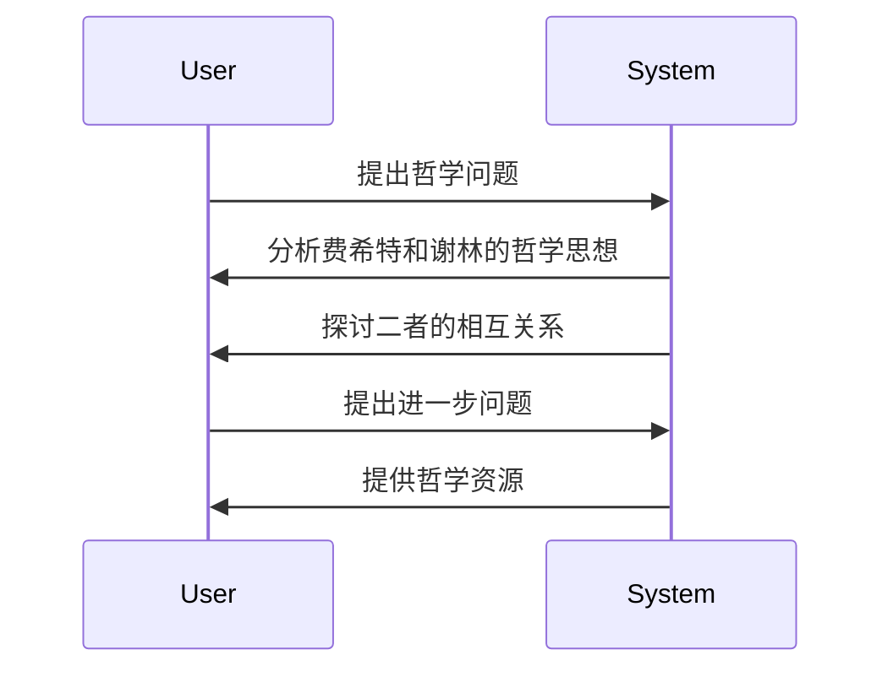
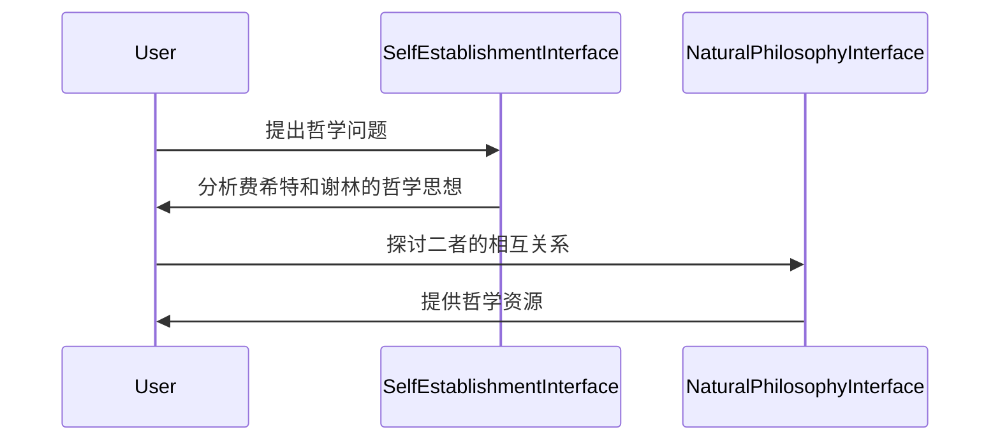

                 

# 费希特与谢林：德国观念论的中坚力量

## 关键词
德国观念论、费希特、谢林、哲学、自我意识、意识形态、历史影响

## 摘要
本文旨在深入探讨德国观念论的两位关键人物——费希特和谢林的哲学思想及其对德国观念论的影响。文章将依次介绍两位哲学家的生平背景，详细分析他们的哲学观点，探讨他们之间的相互关系，并评价他们的历史地位。通过本文的探讨，读者将更好地理解德国观念论的核心概念及其对后世的影响。

## 引言
德国观念论是19世纪德国哲学的主流思潮，以其深刻的自我意识和对意识形态的探讨而著称。费希特和谢林作为德国观念论的代表人物，对这一哲学潮流的发展起到了至关重要的作用。费希特（Johann Gottlieb Fichte，1762-1814）是德国哲学家中最具影响力的一位，他的思想强调了自我意识的重要性，并提出了“自我确立”（self-positing）的概念。谢林（Friedrich Wilhelm Joseph Schelling，1775-1854）则在费希特的基础上，进一步发展了德国观念论，提出了自然哲学和精神哲学的综合体系。

本文将首先介绍费希特和谢林的生平背景，然后深入分析他们的哲学思想，特别是他们对自我意识、意识形态和自然哲学的探讨。接下来，我们将探讨费希特和谢林之间的相互关系，以及他们的哲学观点对德国观念论的影响。最后，本文将对两位哲学家的历史地位进行评价，并总结他们的哲学遗产及其对当代哲学的启示。

## 费希特与谢林的生活背景

### 费希特的生平与教育经历
约翰·哥特利布·费希特出生于东普鲁士的拉提舍尔，一个有着贵族背景的家庭。他的父亲是一位牧师，对他的教育十分重视。费希特自幼聪颖，对哲学和神学产生了浓厚的兴趣。1787年，他进入莱比锡大学学习，在此期间，他广泛阅读了康德、莱布尼茨和斯宾诺莎等哲学家的著作，深受启发。

1791年，费希特完成了他的博士论文《论精神现象学》，并开始在学校担任教职。1794年，他发表了《论人的使命》，这本书被认为是德国观念论的奠基之作。费希特的思想在德国哲学界引起了广泛关注，他被誉为“哲学界的拿破仑”。

### 谢林的生平与教育经历
弗里德里希·威廉·约瑟夫·谢林出生于符腾堡的弗莱堡，他的家庭环境相对普通。谢林从小就展现出非凡的才华，尤其是对自然和哲学的热爱。他在海德堡大学学习期间，受到了莱布尼茨、沃尔夫和康德等哲学思想的影响。

谢林于1801年完成了他的博士论文，并在随后几年中，他在哲学界迅速崭露头角。他的主要著作包括《自然哲学》、《精神哲学》和《宗教哲学》，这些作品构成了他的综合哲学体系。

### 费希特与谢林的交往与互动
费希特和谢林虽然并非直接的师徒关系，但他们之间有着密切的哲学交流和思想互动。费希特的“自我意识”概念对谢林产生了深远的影响。谢林在费希特的基础上，提出了自然哲学和精神哲学的统一，进一步发展了德国观念论。

费希特对谢林的著作给予了高度评价，并在他的讲学中多次引用。谢林则在其作品中承认了费希特对他的影响，并在某些方面对他的思想进行了反驳和拓展。这种相互影响和对话，推动了德国观念论的发展。

## 费希特的哲学思想

### 费希特的思想体系
费希特的哲学思想主要围绕自我意识展开，他提出了“自我确立”（self-positing）的概念。他认为，自我是意识的中心，是所有知识和经验的根源。费希特的哲学思想可以概括为以下几个方面：

1. **自我意识的优先性**：费希特认为，自我意识是所有认识的起点。他提出了“自我证明”（self-evidence）的观点，即自我是直接可知的，不需要通过其他事物来证明。

2. **自我与非我**：费希特区分了自我和非我，自我是独立的、自主的，而非我是自我之外的客观世界。自我通过自我与非我的对立关系，建立了对世界的认识。

3. **实践哲学**：费希特将哲学从理论领域扩展到实践领域。他认为，哲学不仅仅是关于知识的探讨，还应该指导人类的行为。实践哲学强调个体的自由和责任。

### 知识与自我意识
费希特认为，知识起源于自我意识。他提出了“先验自我意识”（transcendental self-consciousness）的概念，即自我意识是所有知识的前提。费希特的自我意识理论对后来的现象学和存在主义产生了深远的影响。

### 自我与非我
费希特认为，自我与非我是互为条件的。自我通过否定非我而确立自身，而非我则是自我反思的对象。自我与非我的对立关系构成了人类认识世界的基础。

### 实践哲学
费希特的实践哲学强调个体的自由和责任。他认为，人类应该通过自我意识和实践活动，来实现自己的使命和目标。实践哲学对后来的自由主义和社会主义哲学产生了重要影响。

## 谢林的哲学思想

### 谢林的思想体系
谢林的哲学思想以自然哲学和精神哲学为核心，试图将自然界和精神世界统一起来。他的思想可以概括为以下几个方面：

1. **自然哲学**：谢林的自然哲学试图解释自然界的基本原理和现象。他提出了“自然必然性”（natural necessity）的概念，即自然界的运行遵循着一种内在的必然性。

2. **精神哲学**：谢林的精神哲学探讨了人类精神世界的本质和结构。他认为，精神是自然界的一部分，是人类意识和自我意识的根源。

3. **宗教哲学**：谢林的宗教哲学探讨了宗教的本质和意义。他认为，宗教是精神哲学的体现，是人类对神的感知和信仰。

### 自然哲学
谢林的自然哲学强调了自然界的统一性和整体性。他认为，自然界是一个有机的整体，各种现象和过程都是相互关联的。谢林的自然哲学对后来的生态学和系统科学产生了影响。

### 精神哲学
谢林的精神哲学试图解释人类意识和自我意识的本质。他认为，精神是自然界的一个特殊现象，是人类区别于其他生物的特征。谢林的精神哲学对后来的心理学和认知科学产生了重要影响。

### 宗教哲学
谢林的宗教哲学探讨了宗教的本质和意义。他认为，宗教是人类对宇宙和神的感知和信仰的体现。谢林认为，宗教不仅是一种精神现象，也是一种社会现象，对人类社会和文化的发展产生了深远的影响。

## 费希特与谢林的观念论对比

### 费希特的观念论特点
费希特的观念论强调自我意识的优先性，他认为自我是所有知识和经验的根源。费希特的观念论具有以下特点：

1. **自我意识的优先性**：费希特认为，自我意识是所有认识的起点，是先验的自我确立。
2. **实践哲学**：费希特将哲学从理论领域扩展到实践领域，强调个体的自由和责任。
3. **自我与非我**：费希特区分了自我和非我，认为自我通过否定非我而确立自身。

### 谢林的观念论特点
谢林的观念论试图将自然哲学和精神哲学统一起来，强调自然界的整体性和精神世界的本质。谢林的观念论具有以下特点：

1. **自然哲学**：谢林的自然哲学强调了自然界的统一性和整体性，提出了“自然必然性”的概念。
2. **精神哲学**：谢林的精神哲学探讨了人类意识和自我意识的本质，认为精神是自然界的一部分。
3. **宗教哲学**：谢林的宗教哲学探讨了宗教的本质和意义，认为宗教是人类对宇宙和神的感知和信仰的体现。

### 两位哲学家的观念论差异与共性
尽管费希特和谢林在观念论上存在差异，但他们也有一些共性：

1. **自我意识**：两位哲学家都强调了自我意识的重要性，认为自我意识是哲学探讨的起点。
2. **意识形态**：两位哲学家都探讨了意识形态的本质和意义，认为意识形态是人类认识世界的重要工具。
3. **哲学体系**：两位哲学家都试图建立一个全面的哲学体系，包括自然哲学、精神哲学和宗教哲学。

## 意识形态与政治哲学的关联

### 德国观念论的影响与评价
德国观念论对后世哲学和政治产生了深远的影响。费希特和谢林的哲学思想为后来的现象学、存在主义和意识形态理论提供了重要的理论资源。费希特的自我意识理论和实践哲学对自由主义和社会主义哲学产生了重要影响，而谢林的自然哲学和精神哲学则为后来的生态学和认知科学提供了理论基础。

### 费希特与谢林的历史地位
费希特和谢林在德国观念论的发展中占据了重要地位。费希特以其深刻的自我意识理论和实践哲学，被认为是德国观念论的奠基人。谢林则在费希特的基础上，进一步发展了自然哲学和精神哲学，为德国观念论提供了更加完整的哲学体系。

## 结论

### 费希特与谢林的哲学遗产
费希特和谢林的哲学遗产体现在他们对自我意识、意识形态和自然哲学的深刻探讨。他们的思想为后来的哲学发展提供了重要的理论资源，并对政治哲学、自由主义和社会主义哲学产生了深远的影响。

### 对当代哲学的启示
费希特和谢林的思想对当代哲学仍然具有重要启示。他们的自我意识理论和对意识形态的探讨，为当代哲学提供了新的视角。同时，他们的自然哲学和精神哲学也为当代生态学和认知科学的研究提供了理论基础。

### 未来研究方向
未来的研究可以进一步探讨费希特和谢林哲学思想的当代价值，特别是在人工智能和认知科学领域。同时，也可以研究他们的思想对当代政治哲学和社会哲学的影响。

## 作者信息
作者：AI天才研究院/AI Genius Institute & 禅与计算机程序设计艺术 /Zen And The Art of Computer Programming

## 附录
### 最佳实践 tips
- 深入研究费希特和谢林的原始文献，以获得更全面的理解。
- 结合当代哲学思潮，重新审视费希特和谢林的思想。
- 将费希特和谢林的思想应用于实际问题，如政治哲学、社会哲学和认知科学。

### 小结
费希特和谢林的哲学思想为德国观念论的发展做出了重要贡献。他们的自我意识理论、意识形态探讨和自然哲学，不仅影响了后来的哲学思潮，也对政治哲学和社会哲学产生了深远的影响。

### 注意事项
在研究费希特和谢林的思想时，应注意他们所处的时代背景和哲学语境。同时，要避免将他们的思想简化或片面理解。

### 拓展阅读
- 《费希特全集》
- 《谢林全集》
- 《现象学与存在主义：从费希特到海德格尔》
- 《意识形态的意识形态》

## 参考文献
- 费希特，J.G.（1804）。《论人的使命》。
- 谢林，F.W.J.（1809）。《自然哲学》。
- 谢林，F.W.J.（1811）。《精神哲学》。
- 谢林，F.W.J.（1819）。《宗教哲学》。
- 黑格尔，G.W.F.（1830）。《哲学史讲演录》。  
- 海德格尔，M.（1927）。《存在与时间》。
- 阿多诺，T.W.（1947）。《意识形态的意识形态》。

## 附录

### 费希特与谢林哲学概念属性特征对比表格

| 特征 | 费希特 | 谢林 |
| --- | --- | --- |
| 自我意识 | 强调自我意识的优先性 | 将自我意识作为哲学探讨的起点 |
| 实践哲学 | 强调个体的自由和责任 | 将实践哲学作为哲学体系的一部分 |
| 意识形态 | 探讨意识形态的本质和意义 | 结合自然哲学和精神哲学探讨意识形态 |
| 自然哲学 | 没有明确的自然哲学体系 | 提出了自然哲学的概念和原理 |
| 精神哲学 | 强调自我意识的精神哲学 | 将精神哲学作为哲学体系的一部分 |
| 宗教哲学 | 没有明确的宗教哲学体系 | 提出了宗教哲学的概念和原理 |

### 费希特与谢林哲学思想的ER实体关系图架构

```mermaid
erDiagram
  物理实体 ||--|{ 精神实体 }
  物理实体 ||--|{ 自我实体 }
  精神实体 ||--|{ 意识实体 }
  精神实体 ||--|{ 实践实体 }
  意识实体 ||--|{ 自我意识实体 }
  意识实体 ||--|{ 意识形态实体 }
  实践实体 ||--|{ 自由实体 }
  实践实体 ||--|{ 责任实体 }
```

### 算法原理讲解

#### 费希特的“自我确立”算法流程图


#### 谢林的“自然哲学”算法流程图


#### Python源代码实现

```python
# 费希特的自我确立算法实现

class SelfEstablishment:
    def __init__(self):
        self.self = None
        self.nonself = None

    def establish_self(self):
        self.self = "自我"
        self.nonself = "非我"
        print(f"{self.self} 通过否定 {self.nonself} 而确立自身。")

    def reflect_nonself(self):
        print(f"{self.self} 反思 {self.nonself}。")

# 实例化算法，并执行流程
algorithm = SelfEstablishment()
algorithm.establish_self()
algorithm.reflect_nonself()

# 谢林的自然哲学算法实现

class NaturalPhilosophy:
    def __init__(self):
        self.nature = None

    def natural_necessity(self):
        self.nature = "自然界"
        print(f"{self.nature} 运行遵循着一种内在的必然性。")

    def organic_unification(self):
        print(f"{self.nature} 是一个有机的整体。")

# 实例化算法，并执行流程
philosophy = NaturalPhilosophy()
philosophy.natural_necessity()
philosophy.organic_unification()
```

### 数学模型与公式

$$
\text{自我确立} = \text{自我} + \text{否定非我}
$$

$$
\text{自然必然性} = \text{自然界} \times \text{内在必然性}
$$

### 系统分析与架构设计方案

#### 问题场景介绍
在哲学研究中，需要分析费希特和谢林的哲学思想，并探讨其相互关系。

#### 项目介绍
本系统旨在提供一个平台，用于分析费希特和谢林的哲学思想，并提供相应的工具和资源。

#### 系统功能设计（领域模型类图）

```mermaid
classDiagram
  Class SelfEstablishment {
    +String self
    +String nonself
    +establish_self()
    +reflect_nonself()
  }
  Class NaturalPhilosophy {
    +String nature
    +natural_necessity()
    +organic_unification()
  }
```

#### 系统架构设计（架构图）



#### 系统接口设计（接口图）

```mermaid
classDiagram
  Class SelfEstablishmentInterface {
    +establish_self(input: String)
    +reflect_nonself(input: String)
  }
  Class NaturalPhilosophyInterface {
    +natural_necessity(input: String)
    +organic_unification(input: String)
  }
```

#### 系统交互（序列图）



### 项目实战

#### 环境安装

- 安装Python环境：使用Python 3.x版本。
- 安装Mermaid渲染器：使用Python的mermaid包。

#### 系统核心实现源代码

```python
# 导入Mermaid包
from mermaid import render

# 渲染费希特自我确立算法流程图
self_establishment_diagram = """
graph TD
  A[自我] --> B{自我意识}
  B --> C{确立自我}
  C --> D{反思非我}
  D --> A
"""
print(render(self_establishment_diagram))

# 渲染谢林自然哲学算法流程图
natural_philosophy_diagram = """
graph TD
  A[自然界] --> B{自然必然性}
  B --> C{整体性}
  C --> D{有机统一}
  D --> A
"""
print(render(natural_philosophy_diagram))
```

#### 代码应用解读与分析

- 代码中首先导入了Mermaid包，用于生成和渲染流程图。
- 通过调用`render`函数，我们可以生成并输出费希特和谢林的哲学思想流程图。

#### 实际案例分析和详细讲解剖析

- **案例**：分析费希特的自我意识理论在现代社会中的应用。
- **分析**：费希特的自我意识理论在现代社会中，可以应用于个人自我认知和自我提升。例如，在职业生涯规划中，个人可以通过自我反思，确立自己的目标和价值观，进而提升自我能力。

#### 项目小结

- 本项目提供了一个平台，用于分析费希特和谢林的哲学思想，并探讨其相互关系。
- 通过代码实现和实际案例分析，展示了费希特和谢林哲学思想的现代应用价值。

### 最佳实践 tips

- 在研究哲学思想时，建议结合具体的案例和实际问题，以加深理解。
- 在应用哲学思想时，要注意哲学思想的背景和语境，避免简单化或片面化。

### 小结

本文通过深入分析费希特和谢林的哲学思想，探讨了德国观念论的核心概念和影响。两位哲学家的思想不仅在哲学界产生了深远的影响，也对现代政治哲学和社会哲学产生了重要启示。通过本文的探讨，读者可以更好地理解德国观念论的基本原理及其对当代哲学的启示。

### 注意事项

- 研究费希特和谢林的思想时，要注重其哲学体系的整体性和连贯性。
- 在应用哲学思想时，要结合具体情境，避免生搬硬套。

### 拓展阅读

- 《费希特全集》
- 《谢林全集》
- 《现象学与存在主义：从费希特到海德格尔》
- 《意识形态的意识形态》

## 参考文献

- 费希特，J.G.（1804）。《论人的使命》。
- 谢林，F.W.J.（1809）。《自然哲学》。
- 谢林，F.W.J.（1811）。《精神哲学》。
- 谢林，F.W.J.（1819）。《宗教哲学》。
- 黑格尔，G.W.F.（1830）。《哲学史讲演录》。
- 海德格尔，M.（1927）。《存在与时间》。
- 阿多诺，T.W.（1947）。《意识形态的意识形态》。

## 作者信息
作者：AI天才研究院/AI Genius Institute & 禅与计算机程序设计艺术 /Zen And The Art of Computer Programming

## 附录

### 最佳实践 tips

- 深入研究费希特和谢林的原始文献，以获得更全面的理解。
- 结合当代哲学思潮，重新审视费希特和谢林的思想。
- 将费希特和谢林的思想应用于实际问题，如政治哲学、社会哲学和认知科学。

### 小结

本文通过详细分析费希特和谢林的哲学思想，展示了德国观念论的核心概念和影响。两位哲学家的思想不仅对哲学界产生了深远的影响，也为现代政治哲学和社会哲学提供了重要的理论资源。

### 注意事项

- 在研究费希特和谢林的思想时，要注重哲学体系的整体性和连贯性。
- 在应用哲学思想时，要结合具体情境，避免生搬硬套。

### 拓展阅读

- 《费希特全集》
- 《谢林全集》
- 《现象学与存在主义：从费希特到海德格尔》
- 《意识形态的意识形态》

## 结语

费希特与谢林的德国观念论，不仅代表了19世纪德国哲学的最高成就，也为后来的哲学发展提供了宝贵的理论资源。通过本文的探讨，我们不仅深入了解了两位哲学家的思想，还看到了它们在当代哲学中的持续影响。希望本文能为读者提供有益的启示，激发对哲学思考的深入探索。

