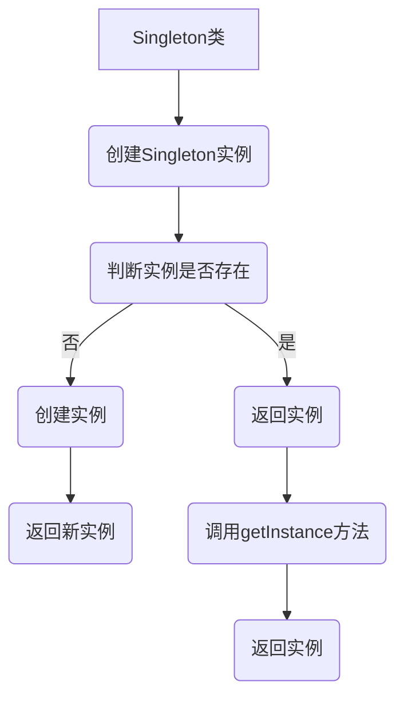
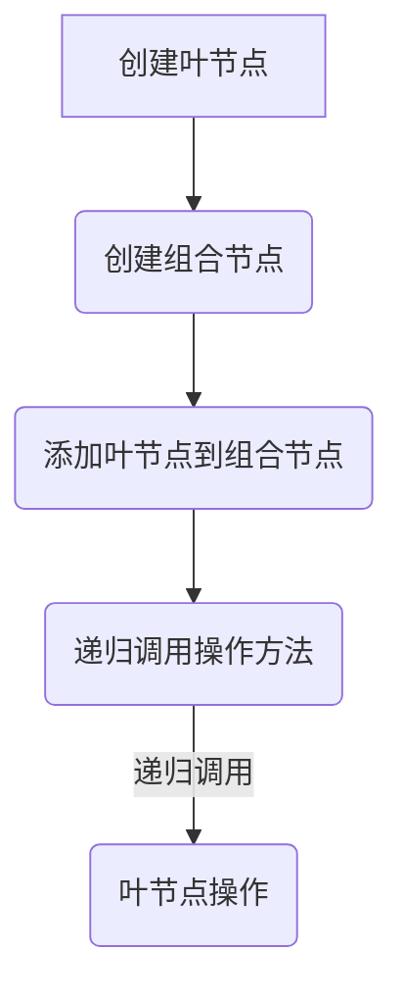

                 

## 引言

### 1.1 问题背景与核心概念

在当今数字化和信息化的时代，软件系统的复杂度与日俱增。随着业务需求的不断变化和系统规模的不断扩大，如何有效地进行软件设计和开发成为了一个重要且具有挑战性的问题。传统的设计模式如面向对象设计、模块化设计等在处理相对简单的问题时表现出色，但当面对复杂的交互和动态变化的系统时，往往显得力不从心。

交互设计作为软件工程中至关重要的一环，直接影响着用户体验和系统的可用性。如何将复杂的交互逻辑以清晰、直观的方式表达出来，成为设计者们亟待解决的问题。费曼图（Feynman Diagrams）作为一种在物理学中用于描述粒子和力之间相互作用的方式，以其简洁、直观的特点，提供了新的思路和方法。

设计模式是解决软件设计中常见问题的通用解决方案，它提供了一组预定义的模板和最佳实践，帮助开发者更快地理解和解决问题。然而，当设计模式应用于复杂的交互系统时，往往需要额外的工具和方法来辅助理解和实施。

本文将探讨如何将费曼图与设计模式相结合，用于复杂交互的可视化表达。本文旨在解决以下问题：

- 费曼图的基本原理是什么，如何绘制和应用？
- 设计模式的核心概念是什么，它们如何与费曼图结合？
- 如何使用费曼图和设计模式来简化复杂的交互设计过程？

通过本文的探讨，我们将为软件开发者提供一种新的视角和工具，帮助他们在面对复杂系统时，能够更加高效地设计和实现软件系统。

### 1.2 核心概念

#### 费曼图的基本概念

费曼图是由著名物理学家理查德·费曼提出的一种用于描述粒子间相互作用和力的传递的工具。它在量子场论中有着广泛的应用，通过图形化的方式展示了粒子之间的交换和相互作用过程。

在软件工程领域，费曼图可以被看作是一种可视化工具，用于描述系统内部不同组件之间的交互关系。费曼图的基本构成元素包括：

- **线**：表示粒子或组件之间的相互作用。
- **节点**：表示粒子的交换或过程的开始和结束。
- **箭头**：表示力的传递方向。

#### 设计模式的基本概念

设计模式是软件开发中常用的一组解决方案，用于解决软件设计中的常见问题。设计模式不仅提供了代码的模板，还包括了设计原则和最佳实践。

设计模式主要分为以下三类：

1. **创建型模式**：负责对象的创建，包括单例模式、工厂方法模式、抽象工厂模式等。
2. **结构型模式**：负责类和对象的组合，包括适配器模式、桥接模式、组合模式等。
3. **行为型模式**：负责对象之间的交互和通信，包括策略模式、命令模式、中介者模式等。

#### 费曼图与设计模式的结合

将费曼图应用于设计模式，主要是利用费曼图的可视化特性，帮助开发者更好地理解和实现设计模式。通过费曼图，开发者可以直观地看到系统组件之间的交互关系，从而更好地进行设计和调试。

例如，在应用单例模式时，可以使用费曼图来描述单例对象的生命周期和访问方式。在工厂方法模式中，费曼图可以帮助开发者清晰地展示不同工厂类之间的关系和职责。

通过这种结合，费曼图不仅提供了一种新的可视化手段，还能够帮助开发者更好地理解和应用设计模式，从而提高软件设计的质量和效率。

### 1.3 基本原理

#### 费曼图在软件中的应用

费曼图的基本原理在物理学中用于描述粒子间的相互作用，而在软件工程中，这一原理可以转化为描述系统组件之间的交互关系。具体来说，费曼图在软件中的应用主要包括以下几个方面：

1. **可视化交互过程**：通过费曼图，开发者可以直观地看到系统内部不同组件之间的交互过程，包括数据的传递和方法的调用。
2. **简化复杂系统**：对于复杂的系统，费曼图可以将复杂的交互逻辑简化为图形化的表示，使得开发者更容易理解和维护。
3. **辅助调试和测试**：费曼图可以帮助开发者定位问题所在，快速识别系统中的错误和瓶颈。

#### 费曼图的绘制方法

绘制费曼图主要包括以下步骤：

1. **确定组件**：首先确定系统中的各个组件，包括类、模块等。
2. **绘制交互关系**：使用线条和箭头表示组件之间的交互关系，箭头指向交互的接收者。
3. **添加节点**：在交互过程中，可能需要添加节点表示过程的关键步骤或分支。
4. **标注信息**：在图中标注必要的注释和信息，如方法名称、参数传递等。

#### 费曼图的优点

费曼图的优点主要体现在以下几个方面：

1. **直观性**：费曼图通过图形化的方式展示系统组件之间的交互关系，使得复杂的交互逻辑变得直观易懂。
2. **易维护**：费曼图使得系统设计更加模块化，便于开发者进行修改和维护。
3. **快速定位问题**：通过费曼图，开发者可以快速识别系统中的问题和瓶颈，从而提高调试和测试的效率。

总之，费曼图作为一种有效的可视化工具，在软件设计中有着广泛的应用前景。通过本文的进一步探讨，我们将深入了解费曼图与设计模式的结合，为复杂交互的可视化表达提供新的思路和方法。

### 1.4 设计模式的分类

设计模式是软件工程中用于解决常见设计问题的通用解决方案。它们不仅提供了具体的代码模板，还蕴含了深刻的设计原则和最佳实践。根据其解决的问题类型，设计模式主要分为以下三类：

#### 创建型模式

创建型模式主要关注对象的创建过程，它们提供了一种机制，使得在运行时能够灵活地创建对象，而无需依赖于具体的类实现。创建型模式包括以下几种：

1. **单例模式（Singleton）**：确保一个类仅有一个实例，并提供一个全局访问点。单例模式在多线程环境中需要特别注意同步问题。
2. **工厂方法模式（Factory Method）**：定义一个创建对象的接口，但让子类决定实例化哪个类。工厂方法模式使得创建逻辑与实现分离，便于扩展和替换。
3. **抽象工厂模式（Abstract Factory）**：提供一个接口，用于创建相关或依赖对象的家族，而不需要明确指定具体类。抽象工厂模式适用于多个产品类共同存在的场景，提供统一的创建接口。

#### 结构型模式

结构型模式主要处理类和对象的组合，它们用于将接口与实现分离，使得系统更加灵活和可扩展。结构型模式包括以下几种：

1. **适配器模式（Adapter）**：将一个类的接口转换成客户希望的另一个接口，使得原本接口不兼容的类可以一起工作。适配器模式在软件复用中非常有用。
2. **桥接模式（Bridge）**：将抽象部分与实现部分分离，使它们都可以独立地变化。桥接模式通过组合抽象和实现部分，实现扩展性和解耦。
3. **组合模式（Composite）**：将对象组合成树形结构以表示“部分-整体”的层次结构。组合模式使得用户对单个对象和组合对象的使用具有一致性。
4. **装饰器模式（Decorator）**：动态地给一个对象添加一些额外的职责，比继承更为灵活。装饰器模式通过嵌套对象来实现，可以在运行时选择和添加功能。

#### 行为型模式

行为型模式主要处理对象之间的通信，它们关注于对象间的通信模式和组织结构。行为型模式包括以下几种：

1. **策略模式（Strategy）**：定义一系列的算法，将其封装起来，并且使它们可以相互替换。策略模式通过策略对象来封装算法，便于算法的替换和扩展。
2. **命令模式（Command）**：将请求封装为一个对象，从而可以使用不同的请求、队列或日志来参数化其他对象。命令模式常用于实现撤销和恢复功能。
3. **中介者模式（Mediator）**：定义一个对象来封装一组对象之间的交互，使对象之间不需要显式地相互引用，从而降低它们之间的耦合。中介者模式通过一个中介对象来协调多个对象之间的交互。
4. **观察者模式（Observer）**：当一个对象的状态发生变化时，自动通知所有依赖它的对象。观察者模式使得对象之间的解耦更加彻底。

#### 设计模式的优点

设计模式具有以下几个显著的优点：

1. **复用性**：设计模式提供了一组可复用的解决方案，使得开发者可以快速理解和应用。
2. **扩展性**：设计模式通过封装和抽象，使得系统的扩展和修改更加容易。
3. **解耦**：设计模式通过降低组件之间的耦合，提高了系统的模块化和灵活性。
4. **可维护性**：设计模式使得系统结构更加清晰，易于维护和理解。

通过深入理解设计模式的分类和优点，开发者可以更好地应用它们来解决实际问题，提高软件设计的质量和效率。本文后续章节将结合费曼图，进一步探讨如何利用设计模式进行复杂交互的可视化表达。

### 1.5 费曼图与设计模式的结合

将费曼图与设计模式相结合，可以极大地提高复杂系统的可理解和可维护性。费曼图的可视化特性使得开发者能够以图形化的方式直观地展示系统组件之间的交互关系，而设计模式则提供了系统设计的最佳实践和通用解决方案。以下是费曼图与设计模式结合的优势和应用场景：

#### 1.5.1 可视化复杂交互

费曼图能够将系统内部的复杂交互以图形化的方式呈现出来，使得开发者可以直观地看到不同组件之间的相互作用。这种可视化的方式不仅有助于开发者更好地理解系统的整体结构，还能够帮助他们在设计过程中及时发现和解决潜在的问题。

例如，在设计一个复杂的网络应用时，可以使用费曼图来展示各个模块之间的调用关系和数据流。通过这种图形化的表示，开发者可以清晰地看到系统中的关键路径和瓶颈，从而优化系统性能。

#### 1.5.2 简化设计模式应用

设计模式是解决软件设计中常见问题的通用模板，但在应用过程中，开发者往往需要理解模式的核心原理和具体实现。费曼图提供了另一种理解设计模式的方式，使得开发者可以更加直观地看到设计模式在实际系统中的应用效果。

例如，在应用工厂方法模式时，可以使用费曼图来展示不同工厂类之间的关系和职责。通过这种方式，开发者可以更加清晰地理解工厂方法模式的作用和实现方式，从而更好地应用这一模式来设计系统。

#### 1.5.3 提高可维护性和可扩展性

设计模式通过封装和抽象，提高了系统的模块化和灵活性，而费曼图则提供了可视化工具来辅助理解系统的结构和交互。这种结合使得系统的可维护性和可扩展性得到了显著提高。

通过费曼图，开发者可以更轻松地识别系统中存在的问题和潜在的优化点。例如，在应用中介者模式时，可以通过费曼图来检查中介者对象与多个参与者对象之间的交互是否合理和高效。这种方式不仅有助于开发者更好地理解和维护系统，还能够提高系统的可扩展性。

#### 1.5.4 应用场景举例

1. **单例模式**：使用费曼图可以清晰地展示单例对象的创建过程和全局访问方式。通过这种图形化的表示，开发者可以更容易地理解单例模式的应用场景和实现细节。

2. **工厂方法模式**：费曼图可以帮助开发者理解不同工厂类之间的关系和职责。通过这种方式，开发者可以更加灵活地扩展和替换工厂类，从而提高系统的可扩展性和灵活性。

3. **适配器模式**：费曼图可以展示适配器如何将一个类的接口转换成客户希望的另一个接口。这种方式有助于开发者更好地理解适配器的应用场景和实现方式。

4. **策略模式**：费曼图可以帮助开发者直观地看到不同策略对象之间的差异和交互。通过这种方式，开发者可以更加灵活地选择和替换策略对象，从而提高系统的可维护性和可扩展性。

总之，将费曼图与设计模式相结合，不仅能够提高复杂系统的可理解和可维护性，还能够帮助开发者更好地应用设计模式，从而提高软件设计的质量和效率。

### 第2章 费曼图的原理与绘制

#### 2.1 费曼图的基本原理

费曼图是一种用于描述物理过程中粒子相互作用和力传递的图形化工具，它由著名物理学家理查德·费曼提出。费曼图的基本原理基于量子场论，主要应用于粒子物理学、高能物理等领域。通过费曼图，物理学家可以直观地展示粒子之间的相互作用过程，从而简化复杂的计算。

在软件工程领域，费曼图可以被抽象和转化为一种描述系统组件之间交互关系的方法。具体来说，费曼图的基本原理可以概括为以下几个方面：

1. **粒子和力的表示**：费曼图中的粒子可以用点和箭头表示，点表示粒子的存在，箭头表示粒子之间的力的传递。
2. **交互过程的描述**：通过费曼图，可以清晰地描述多个粒子之间的相互作用过程，包括粒子之间的碰撞、交换和力的传递。
3. **图形化表示**：费曼图通过图形化的方式，使得复杂的交互过程变得直观易懂，便于物理学家进行分析和计算。

#### 2.2 动力学与量子场论基础

为了更好地理解费曼图的基本原理，我们需要回顾一下动力学和量子场论的基础知识。动力学是研究物体运动规律和力的作用的科学，而量子场论是描述粒子在量子尺度上的行为和相互作用的理论。

在量子场论中，粒子被视为场的激发态，场则是物质存在的最基本形式。粒子之间的相互作用可以通过场之间的交换来描述，这种交换被称为“虚粒子交换”。

1. **动力学基本概念**：
   - **粒子**：在物理学中，粒子是最小的物质单元，具有质量、电荷等属性。
   - **场**：场是一种存在于空间中的物质，可以产生力的作用。

2. **量子场论基础**：
   - **虚粒子**：在量子场论中，虚粒子是场的激发态，它们在数学上用于描述粒子之间的相互作用。
   - **力的传递**：粒子之间的相互作用是通过虚粒子的交换来实现的。例如，两个带电粒子之间的相互作用可以通过电磁场的虚光子交换来描述。

这些基础知识为理解费曼图提供了必要的理论基础。在软件工程中，虽然我们不需要深入探讨量子场论的细节，但了解费曼图的基本原理有助于我们更好地将其应用于系统交互的可视化描述。

#### 2.3 费曼图的构成元素

费曼图由以下几个基本构成元素组成：

1. **线**：表示粒子或组件之间的相互作用。在线上通常标注力的类型和方向。
2. **节点**：表示粒子的交换或过程的开始和结束。节点通常表示一个粒子的产生或消失，或是一个力的传递点。
3. **箭头**：表示力的传递方向。箭头从一个节点指向另一个节点，表示力的传递。

#### 2.4 费曼图的绘制规则

绘制费曼图需要遵循一系列规则，以确保图形的准确性和一致性。以下是绘制费曼图的基本规则：

1. **基本构成元素**：确保所有构成元素（线、节点、箭头）都按照规则正确地绘制。
2. **箭头方向**：箭头应始终指向力的传递方向，这通常是从发射者指向接收者。
3. **相互作用表示**：每个节点表示一个粒子的交换或过程，节点上的线应与该节点的交互对象连接。
4. **简化和抽象**：在实际应用中，可以适当简化或抽象复杂的交互过程，以突出关键信息。

#### 2.5 费曼图在软件设计中的应用

在软件设计中，费曼图可以作为一种图形化工具，帮助开发者直观地理解系统组件之间的交互关系。以下是费曼图在软件设计中的几个应用场景：

1. **模块间交互描述**：通过费曼图，可以清晰地展示不同模块之间的调用关系和数据流，从而帮助开发者理解系统的整体结构。
2. **复杂流程可视化**：费曼图可以帮助开发者将复杂的业务流程或算法转化为图形化的表示，从而简化理解和分析过程。
3. **设计文档辅助**：费曼图可以作为设计文档的一部分，帮助团队成员更好地理解系统设计和实现细节。

通过费曼图，开发者不仅能够更直观地理解系统组件的交互，还能够发现潜在的设计问题和优化机会。这种可视化工具在软件设计中具有广泛的应用前景。

#### 2.6 费曼图与设计模式的结合

将费曼图与设计模式相结合，可以进一步提高软件设计过程的可理解和可维护性。以下是几个具体的结合方式：

1. **单例模式**：使用费曼图可以直观地展示单例对象的创建过程和全局访问方式，从而帮助开发者更好地理解单例模式的应用。
2. **工厂方法模式**：费曼图可以帮助开发者理解不同工厂类之间的关系和职责，从而更好地应用工厂方法模式来设计系统。
3. **适配器模式**：通过费曼图，可以清晰地展示适配器如何将一个类的接口转换成客户希望的另一个接口，从而简化系统的接口设计。

通过这些结合方式，费曼图不仅为设计模式提供了新的可视化手段，还使得开发者能够更加直观地理解和应用设计模式，从而提高软件设计的质量和效率。

### 第3章 设计模式概述

#### 3.1 设计模式的基本概念

设计模式是软件开发中常用的一组解决方案，用于解决软件设计中的常见问题。它们不仅提供了具体的代码模板，还包括了设计原则和最佳实践。设计模式的主要目的是提高软件的复用性、可维护性和可扩展性。

设计模式通常分为三类：创建型模式、结构型模式和行为型模式。

- **创建型模式**：关注对象的创建过程，主要解决对象的创建和管理问题。包括单例模式、工厂方法模式、抽象工厂模式等。
- **结构型模式**：主要处理类和对象的组合，使系统结构更加灵活和可扩展。包括适配器模式、桥接模式、组合模式、装饰器模式等。
- **行为型模式**：主要处理对象之间的交互和通信，关注系统的动态行为。包括策略模式、命令模式、中介者模式、观察者模式等。

#### 3.2 设计模式的应用场景

设计模式的应用场景广泛，可以解决软件开发中常见的各种问题。以下是一些典型的应用场景：

1. **单例模式**：用于确保一个类仅有一个实例，常用于管理共享资源，如数据库连接、线程池等。
2. **工厂方法模式**：用于根据不同条件创建不同的对象，常用于多态场景，如不同的产品类型需要不同的创建逻辑。
3. **适配器模式**：用于将一个类的接口转换成客户希望的另一个接口，常用于旧接口与新系统之间的兼容。
4. **桥接模式**：用于将抽象部分与实现部分分离，以便它们可以独立地变化，常用于分层设计中。
5. **组合模式**：用于将对象组合成树形结构以表示“部分-整体”的层次结构，常用于树状结构或层次结构的设计。
6. **策略模式**：用于定义一系列的算法，将它们封装起来，使得它们可以相互替换，常用于策略选择和动态切换。
7. **命令模式**：用于将请求封装为一个对象，使得可以使用不同的请求、队列或日志来参数化其他对象，常用于实现撤销和恢复功能。
8. **中介者模式**：用于定义一个对象来封装一组对象之间的交互，降低它们之间的耦合，常用于复杂对象之间的通信。
9. **观察者模式**：用于当一个对象的状态发生变化时，自动通知所有依赖它的对象，常用于事件监听和消息广播。

#### 3.3 设计模式的作用

设计模式在软件设计中的作用主要体现在以下几个方面：

1. **提高复用性**：通过设计模式，开发者可以复用已经解决的问题方案，减少重复编码，提高开发效率。
2. **降低维护成本**：设计模式通过抽象和封装，使得代码结构更加清晰，易于理解和维护。
3. **增强可扩展性**：设计模式通过模块化和解耦，使得系统的扩展和修改更加容易。
4. **提高代码质量**：设计模式遵循了良好的设计原则和最佳实践，使得代码更加优雅、简洁和高效。

总之，设计模式是软件开发中不可或缺的工具，通过合理应用设计模式，开发者可以构建更加健壮、灵活和可扩展的软件系统。

### 第4章 创建型设计模式

#### 4.1 单例模式

单例模式（Singleton Pattern）是一种设计模式，确保一个类仅有一个实例，并提供一个全局访问点。这种模式在软件开发中非常常见，尤其是在需要控制资源访问、共享状态或保证唯一性时。

#### 4.1.1 概念与原理

单例模式的核心思想是限制一个类只有一个实例，并提供一个访问它的全局入口点。这样，无论应用程序创建多少次这个类的对象，返回的总是同一个实例。

单例模式的实现通常包括以下几个关键步骤：

1. **私有构造函数**：为了防止外部直接使用`new`关键字创建对象，构造函数需要声明为私有。
2. **静态私有成员变量**：用于保存单例的实例。
3. **静态公有方法**：通常命名为`getInstance`，用于提供全局访问点。如果实例尚未创建，则创建并返回该实例；如果已创建，则直接返回实例。

以下是单例模式的简单实现示例：

```python
class Singleton:
    _instance = None
    
    def __new__(cls):
        if cls._instance is None:
            cls._instance = super(Singleton, cls).__new__(cls)
        return cls._instance

# 使用示例
singleton1 = Singleton()
singleton2 = Singleton()

print(singleton1 is singleton2)  # 输出：True
```

在这个示例中，`Singleton` 类的构造函数被私有化，确保了只能通过`getInstance` 方法来访问实例。每次调用`getInstance` 时，如果实例尚未创建，则会创建一个新的实例；如果已存在实例，则直接返回该实例。

#### 4.1.2 费曼图可视化

为了更好地理解单例模式的工作原理，我们可以使用费曼图来可视化其创建和访问过程。



在这个费曼图中，我们展示了以下步骤：

1. **创建Singleton实例**：调用`Singleton` 类的构造函数。
2. **判断实例是否存在**：检查私有静态成员变量`_instance` 是否为`None`。
3. **是**：返回已存在的实例。
4. **否**：创建新的实例并返回。

通过费曼图，我们可以清晰地看到单例模式的实现过程，从而更好地理解其工作机制。

#### 4.1.3 费曼图与单例模式的结合

将费曼图与单例模式结合，可以帮助开发者更直观地理解单例模式的执行流程和逻辑。费曼图通过图形化的方式展示了单例对象的生命周期和访问方式，使得开发者能够更容易地发现和解决潜在的问题。

例如，在开发过程中，如果发现多个实例被创建，通过费曼图可以快速定位问题所在，检查实例创建和返回的逻辑是否正确。此外，费曼图还可以帮助开发者更好地理解单例模式在系统中的角色和作用，从而优化系统设计。

总之，费曼图为单例模式提供了一种新的可视化手段，使得开发者可以更加直观地理解和应用这一模式，从而提高软件设计的质量和效率。

### 第5章 结构型设计模式

#### 5.1 结构型模式概述

结构型模式是一类用于处理类和对象组合的设计模式，主要关注类与类之间的关系和组合。结构型模式的主要目的是通过组合简单对象来创建更复杂的对象，同时保持系统的灵活性和扩展性。结构型模式可以分为以下几种：

1. **适配器模式（Adapter）**：将一个类的接口转换成客户希望的另一个接口，使得原本接口不兼容的类可以一起工作。
2. **桥接模式（Bridge）**：将抽象部分与实现部分分离，使它们都可以独立地变化，用于实现解耦和增强系统的扩展性。
3. **组合模式（Composite）**：将对象组合成树形结构以表示“部分-整体”的层次结构，用于实现组合对象和单个对象的一致处理。
4. **装饰器模式（Decorator）**：动态地给一个对象添加一些额外的职责，比继承更为灵活，用于扩展对象的功能而不改变其接口。

这些模式在软件设计中起着至关重要的作用，它们不仅提高了系统的模块化和可扩展性，还降低了组件之间的耦合度。通过使用结构型模式，开发者可以更灵活地设计和管理复杂的系统。

#### 5.2 适配器模式

适配器模式（Adapter Pattern）是一种用于将一个类的接口转换成客户希望的另一个接口的设计模式。这种模式使得原本接口不兼容的类能够一起工作，从而提高了系统的兼容性和灵活性。

#### 5.2.1 概念与原理

适配器模式的核心思想是提供一个适配器，将一个类的接口转换为另一个接口，使得这两个接口可以相互操作。适配器通常包含以下关键组件：

- **适配器类（Adapter）**：实现目标接口，内部包含一个 adaptee 对象，用于适配原有接口。
- **目标接口（Target）**：定义客户期望的接口。
- **适配者类（Adaptee）**：需要适配的类，通常有一个已经实现的功能接口。

适配器模式的工作原理如下：

1. **创建适配者对象**：在适配器类中创建一个适配者对象的实例。
2. **适配方法调用**：适配器类实现目标接口中的方法，并在内部调用适配者对象的方法。

以下是适配器模式的一个简单示例：

```python
# 目标接口
class Target:
    def operation(self):
        pass

# 适配者类
class Adaptee:
    def specific_operation(self):
        print("Adaptee's specific operation")

# 适配器类
class Adapter(Target):
    def __init__(self, adaptee):
        self._adaptee = adaptee

    def operation(self):
        self._adaptee.specific_operation()

# 使用示例
adaptee = Adaptee()
adapter = Adapter(adaptee)
adapter.operation()  # 输出：Adaptee's specific operation
```

在这个示例中，`Adapter` 类实现了`Target` 接口，内部包含了一个`Adaptee` 对象。当调用适配器的方法时，适配器会调用适配者对象的方法，从而实现了接口的转换。

#### 5.2.2 费曼图可视化

为了更好地理解适配器模式的工作原理，我们可以使用费曼图来可视化其实现过程。

```mermaid
graph TD
A[创建适配者对象] --> B(初始化适配器)
B --> C(调用适配器方法)
C -->|operation()| D(调用适配者方法)
D --> E(执行特定操作)
```

在这个费曼图中，我们展示了以下步骤：

1. **创建适配者对象**：在适配器类中创建适配者对象的实例。
2. **初始化适配器**：通过传递适配者对象来初始化适配器。
3. **调用适配器方法**：调用适配器类的`operation` 方法。
4. **调用适配者方法**：适配器方法内部调用适配者对象的`specific_operation` 方法。
5. **执行特定操作**：适配者对象执行其特定的操作。

通过费曼图，我们可以清晰地看到适配器模式的核心逻辑，从而更好地理解其工作机制。

#### 5.2.3 费曼图与适配器模式的结合

将费曼图与适配器模式结合，可以帮助开发者更直观地理解适配器的实现过程和作用。费曼图通过图形化的方式展示了适配器如何将原有接口转换为新的接口，使得开发者能够更容易地发现和解决接口不兼容的问题。

例如，在开发过程中，如果发现某个类的方法无法直接使用，通过费曼图可以快速定位问题，检查适配器是否正确实现了接口转换。此外，费曼图还可以帮助开发者更好地理解适配器在系统中的角色和作用，从而优化系统设计。

总之，费曼图为适配器模式提供了一种新的可视化手段，使得开发者可以更加直观地理解和应用这一模式，从而提高软件设计的质量和效率。

### 第6章 桥接模式

#### 6.1 桥接模式原理

桥接模式（Bridge Pattern）是一种结构型设计模式，用于将抽象部分与实现部分分离，使它们可以独立地变化。这种模式通过将抽象层与实现层解耦，使得两者可以独立扩展和修改，从而提高了系统的灵活性和可扩展性。

#### 6.1.1 概念

桥接模式包含以下主要组成部分：

- **抽象类（Abstraction）**：定义抽象接口和业务方法，它保持对实现部分的引用。
- **实现类（Implementor）**：定义实现类的接口和具体实现，实现类通常包含多个实现类。
- **具体抽象类（Refined Abstraction）**：继承抽象类，可以增加新的抽象操作。
- **具体实现类（Concrete Implementor）**：实现具体的实现类，通常有一个或多个具体实现类。

#### 6.1.2 工作原理

桥接模式的工作原理如下：

1. **创建抽象类和实现类**：首先定义抽象类和实现类，抽象类定义了业务方法的抽象接口，实现类提供了具体的实现。
2. **创建具体抽象类和具体实现类**：具体抽象类继承自抽象类，可以添加新的抽象方法；具体实现类继承自实现类，提供具体的实现。
3. **组合关系**：通过继承和组合，将抽象部分和实现部分连接起来。具体抽象类引用具体实现类，从而实现抽象接口的具体实现。

以下是桥接模式的一个简单示例：

```python
# 抽象类
class Abstraction:
    def __init__(self, implementor):
        self._implementor = implementor

    def operation(self):
        self._implementor.operation()

# 实现类
class Implementor:
    def operation(self):
        print("Implementor operation")

# 具体抽象类
class RefinedAbstraction(Abstraction):
    def operation(self):
        print("RefinedAbstraction operation")
        self._implementor.operation()

# 具体实现类
class ConcreteImplementor(Implementor):
    def operation(self):
        print("ConcreteImplementor operation")

# 使用示例
refined_abstraction = RefinedAbstraction(ConcreteImplementor())
refined_abstraction.operation()  # 输出：
# RefinedAbstraction operation
# ConcreteImplementor operation
```

在这个示例中，`Abstraction` 类定义了业务方法的抽象接口，并保持对实现类的引用。`Implementor` 类提供了具体的实现。`RefinedAbstraction` 类继承自`Abstraction` 类，可以添加新的抽象方法。`ConcreteImplementor` 类继承自`Implementor` 类，提供具体的实现。通过组合关系，我们可以实现抽象接口的具体实现。

#### 6.1.3 费曼图可视化

为了更好地理解桥接模式的工作原理，我们可以使用费曼图来可视化其实现过程。

```mermaid
graph TD
A[创建抽象类对象] --> B(初始化抽象类)
B --> C(调用抽象方法)
C -->|operation()| D(调用实现类方法)
D --> E(执行实现操作)
```

在这个费曼图中，我们展示了以下步骤：

1. **创建抽象类对象**：创建`Abstraction` 类的对象。
2. **初始化抽象类**：通过传递实现类对象来初始化抽象类。
3. **调用抽象方法**：调用`operation` 方法。
4. **调用实现类方法**：`operation` 方法内部调用实现类的`operation` 方法。
5. **执行实现操作**：实现类执行具体的操作。

通过费曼图，我们可以清晰地看到桥接模式的核心逻辑，从而更好地理解其工作机制。

#### 6.1.4 费曼图与桥接模式的结合

将费曼图与桥接模式结合，可以帮助开发者更直观地理解桥接模式的实现过程和作用。费曼图通过图形化的方式展示了抽象部分和实现部分的组合关系，使得开发者能够更容易地发现和解决组合关系中的问题。

例如，在开发过程中，如果发现系统中的抽象部分和实现部分之间存在耦合，通过费曼图可以快速定位问题，检查组合关系是否正确。此外，费曼图还可以帮助开发者更好地理解桥接模式在系统中的角色和作用，从而优化系统设计。

总之，费曼图为桥接模式提供了一种新的可视化手段，使得开发者可以更加直观地理解和应用这一模式，从而提高软件设计的质量和效率。

### 第7章 组合模式

#### 7.1 组合模式原理

组合模式（Composite Pattern）是一种结构型设计模式，用于将对象组合成树形结构以表示“部分-整体”的层次结构。这种模式允许用户以一致的方式处理单个对象和组合对象，从而使得复杂的树形结构更加易于管理和控制。

#### 7.1.1 概念

组合模式的主要组成部分包括：

- **组合根（Composite Root）**：表示树形结构中的根节点，通常具有管理子节点和执行业务操作的能力。
- **组合节点（Composite）**：表示树形结构中的中间节点，可以包含子节点，并具有执行业务操作的能力。
- **叶节点（Leaf）**：表示树形结构中的最底层节点，不包含子节点，只执行具体的业务操作。

组合模式的核心思想是将对象组合成树形结构，使得用户可以以一致的方式处理单个对象和组合对象。通过这种组合关系，用户可以方便地扩展和组合对象，从而实现复杂的树形结构。

以下是组合模式的一个简单示例：

```python
# 叶节点
class Leaf(Component):
    def operation(self):
        print("Leaf operation")

# 组合节点
class Composite(Component):
    def __init__(self):
        self._children = []

    def add(self, child):
        self._children.append(child)

    def remove(self, child):
        self._children.remove(child)

    def operation(self):
        for child in self._children:
            child.operation()

# 客户端使用
root = Composite()
composite = Composite()
leaf1 = Leaf()
leaf2 = Leaf()

root.add(composite)
composite.add(leaf1)
composite.add(leaf2)
root.operation()  # 输出：
# Composite operation
# Leaf operation
# Leaf operation
```

在这个示例中，`Leaf` 类表示叶节点，`Composite` 类表示组合节点。`Composite` 类通过`add` 和`remove` 方法来管理其子节点，并在执行操作时递归调用子节点的操作。通过这种方式，用户可以方便地组合和扩展对象，从而实现复杂的树形结构。

#### 7.1.2 费曼图可视化

为了更好地理解组合模式的工作原理，我们可以使用费曼图来可视化其实现过程。



在这个费曼图中，我们展示了以下步骤：

1. **创建叶节点**：创建`Leaf` 类的实例。
2. **创建组合节点**：创建`Composite` 类的实例。
3. **添加叶节点到组合节点**：将叶节点添加到组合节点中。
4. **递归调用操作方法**：调用组合节点的`operation` 方法，递归地调用其子节点的操作方法。
5. **叶节点操作**：叶节点执行其具体的操作。

通过费曼图，我们可以清晰地看到组合模式的核心逻辑，从而更好地理解其工作机制。

#### 7.1.3 费曼图与组合模式的结合

将费曼图与组合模式结合，可以帮助开发者更直观地理解组合模式的工作流程和组合关系。费曼图通过图形化的方式展示了对象之间的组合关系和操作流程，使得开发者能够更容易地发现和解决组合关系中的问题。

例如，在开发过程中，如果发现组合关系不正确，通过费曼图可以快速定位问题，检查组合节点的添加和移除逻辑是否正确。此外，费曼图还可以帮助开发者更好地理解组合模式在系统中的角色和作用，从而优化系统设计。

总之，费曼图为组合模式提供了一种新的可视化手段，使得开发者可以更加直观地理解和应用这一模式，从而提高软件设计的质量和效率。

### 第8章 行为型设计模式

#### 8.1 行为型模式概述

行为型模式主要关注对象之间的通信和交互，通过定义对象间的交互模式，提高了系统的模块化和可扩展性。行为型模式可以分为以下几类：

1. **策略模式（Strategy Pattern）**：定义一系列的算法，将每个算法封装起来，并使它们可以相互替换，使算法的变化独立于使用算法的客户。
2. **命令模式（Command Pattern）**：将一个请求封装为一个对象，从而可以使用不同的请求、队列或日志来参数化其他对象。
3. **中介者模式（Mediator Pattern）**：定义一个对象来封装一组对象之间的交互，使对象之间不需要显式地相互引用，从而降低它们之间的耦合。
4. **观察者模式（Observer Pattern）**：当一个对象的状态发生变化时，自动通知所有依赖它的对象，从而实现对象间的解耦。

这些模式在软件设计中起着重要的作用，它们不仅提高了系统的模块化和灵活性，还降低了组件之间的耦合度。通过使用行为型模式，开发者可以构建更加健壮、灵活和可扩展的软件系统。

#### 8.2 策略模式

策略模式（Strategy Pattern）是一种行为型设计模式，它定义了一系列算法，将每个算法封装起来，并使它们可以相互替换。这种模式使得算法的变化独立于使用算法的客户，从而提高了系统的灵活性和可扩展性。

#### 8.2.1 概念与原理

策略模式的核心概念包括：

- **策略接口（Strategy Interface）**：定义所有支持的算法的公共接口。
- **具体策略类（ConcreteStrategy）**：实现策略接口，定义具体算法。
- **环境类（Context）**：使用策略接口定义一个工作环境，维护一个当前策略对象的引用，并负责所有与策略相关的操作。

策略模式的工作原理如下：

1. **创建具体策略对象**：在运行时创建具体策略对象，这些对象实现了策略接口。
2. **设置当前策略**：环境类根据具体需求设置当前策略对象。
3. **执行策略方法**：环境类使用当前策略对象执行具体的操作。

以下是策略模式的一个简单示例：

```python
# 策略接口
class StrategyInterface:
    def execute(self):
        pass

# 具体策略类
class ConcreteStrategyA(StrategyInterface):
    def execute(self):
        print("执行策略A")

class ConcreteStrategyB(StrategyInterface):
    def execute(self):
        print("执行策略B")

# 环境类
class Context:
    def __init__(self, strategy: StrategyInterface):
        self._strategy = strategy

    def set_strategy(self, strategy: StrategyInterface):
        self._strategy = strategy

    def execute_strategy(self):
        self._strategy.execute()

# 使用示例
context = Context(ConcreteStrategyA())
context.execute_strategy()  # 输出：执行策略A

context.set_strategy(ConcreteStrategyB())
context.execute_strategy()  # 输出：执行策略B
```

在这个示例中，`StrategyInterface` 类定义了所有支持的算法的公共接口，`ConcreteStrategyA` 和 `ConcreteStrategyB` 类实现了具体策略。`Context` 类使用策略接口定义了一个工作环境，并根据具体需求设置当前策略对象。通过这种方式，我们可以灵活地切换不同的策略。

#### 8.2.2 费曼图可视化

为了更好地理解策略模式的工作原理，我们可以使用费曼图来可视化其实现过程。

```mermaid
graph TD
A[创建具体策略对象] --> B(设置当前策略)
B --> C(执行策略方法)
C -->|execute()| D(执行具体策略)
```

在这个费曼图中，我们展示了以下步骤：

1. **创建具体策略对象**：创建具体策略类的实例。
2. **设置当前策略**：将具体策略对象设置到环境类中。
3. **执行策略方法**：调用环境类的`execute_strategy` 方法，执行具体策略。

通过费曼图，我们可以清晰地看到策略模式的核心逻辑，从而更好地理解其工作机制。

#### 8.2.3 费曼图与策略模式的结合

将费曼图与策略模式结合，可以帮助开发者更直观地理解策略模式的工作流程和策略切换过程。费曼图通过图形化的方式展示了策略对象和环境类之间的交互关系，使得开发者能够更容易地发现和解决策略切换中的问题。

例如，在开发过程中，如果发现策略切换不正确，通过费曼图可以快速定位问题，检查设置当前策略的逻辑是否正确。此外，费曼图还可以帮助开发者更好地理解策略模式在系统中的角色和作用，从而优化系统设计。

总之，费曼图为策略模式提供了一种新的可视化手段，使得开发者可以更加直观地理解和应用这一模式，从而提高软件设计的质量和效率。

### 第9章 命令模式

#### 9.1 命令模式原理

命令模式（Command Pattern）是一种行为型设计模式，它将一个请求封装为一个对象，从而可以使用不同的请求、队列或日志来参数化其他对象。这种模式使得请求的操作与接收者完全解耦，从而提高了系统的灵活性和可扩展性。

#### 9.1.1 概念

命令模式的主要组成部分包括：

- **命令接口（Command Interface）**：定义所有命令的操作，通常包括`execute`、`undo`和`redo`等方法。
- **具体命令类（Concrete Command）**：实现命令接口，定义具体操作。
- **调用者（Invoker）**：负责发送请求，通常包含一个命令对象的引用。
- **接收者（Receiver）**：负责执行具体的操作。
- **命令工厂（Command Factory）**：用于创建具体的命令对象。

命令模式的工作原理如下：

1. **创建命令对象**：在运行时创建具体的命令对象，并将其传递给调用者。
2. **发送请求**：调用者通过命令对象发送请求，执行具体的操作。
3. **撤销和重做**：命令对象提供撤销（`undo`）和重做（`redo`）操作，以便在需要时进行回滚或重新执行操作。

以下是命令模式的一个简单示例：

```python
# 命令接口
class CommandInterface:
    def execute(self):
        pass

    def undo(self):
        pass

    def redo(self):
        pass

# 具体命令类
class ConcreteCommand(CommandInterface):
    def __init__(self, receiver):
        self._receiver = receiver

    def execute(self):
        self._receiver.execute()

    def undo(self):
        self._receiver.undo()

    def redo(self):
        self._receiver.redo()

# 接收者类
class Receiver:
    def execute(self):
        print("执行操作")

    def undo(self):
        print("撤销操作")

    def redo(self):
        print("重做操作")

# 调用者类
class Invoker:
    def __init__(self, command: CommandInterface):
        self._command = command

    def execute_command(self):
        self._command.execute()

    def undo_command(self):
        self._command.undo()

    def redo_command(self):
        self._command.redo()

# 使用示例
receiver = Receiver()
command = ConcreteCommand(receiver)
invoker = Invoker(command)

invoker.execute_command()  # 输出：执行操作
invoker.undo_command()    # 输出：撤销操作
invoker.redo_command()    # 输出：重做操作
```

在这个示例中，`CommandInterface` 定义了命令操作的基本方法，`ConcreteCommand` 实现了具体操作。`Receiver` 类负责具体的操作，而`Invoker` 类负责发送请求。通过这种方式，请求和接收者完全解耦，提高了系统的灵活性和可扩展性。

#### 9.1.2 费曼图可视化

为了更好地理解命令模式的工作原理，我们可以使用费曼图来可视化其实现过程。

```mermaid
graph TD
A[创建命令对象] --> B(初始化调用者)
B --> C(发送请求)
C -->|execute()| D(执行操作)
D --> E(撤销操作)
E --> F(重做操作)
```

在这个费曼图中，我们展示了以下步骤：

1. **创建命令对象**：创建具体的命令对象。
2. **初始化调用者**：调用者初始化命令对象。
3. **发送请求**：调用者的`execute_command` 方法发送请求。
4. **执行操作**：命令对象的`execute` 方法执行具体的操作。
5. **撤销操作**：命令对象的`undo` 方法执行撤销操作。
6. **重做操作**：命令对象的`redo` 方法执行重做操作。

通过费曼图，我们可以清晰地看到命令模式的核心逻辑，从而更好地理解其工作机制。

#### 9.1.3 费曼图与命令模式的结合

将费曼图与命令模式结合，可以帮助开发者更直观地理解命令模式的工作流程和请求-接收者之间的交互关系。费曼图通过图形化的方式展示了命令对象的创建、请求发送以及撤销和重做的过程，使得开发者能够更容易地发现和解决其中的问题。

例如，在开发过程中，如果发现请求无法正确执行或撤销，通过费曼图可以快速定位问题，检查命令对象的创建和调用逻辑是否正确。此外，费曼图还可以帮助开发者更好地理解命令模式在系统中的角色和作用，从而优化系统设计。

总之，费曼图为命令模式提供了一种新的可视化手段，使得开发者可以更加直观地理解和应用这一模式，从而提高软件设计的质量和效率。

### 第10章 中介者模式

#### 10.1 中介者模式原理

中介者模式（Mediator Pattern）是一种行为型设计模式，它通过引入一个中介者对象来封装一组对象之间的交互，使对象之间不需要显式地相互引用，从而降低它们之间的耦合。中介者模式通过中介者对象来协调多个对象之间的交互，使得系统更加模块化和可扩展。

#### 10.1.1 概念

中介者模式的主要组成部分包括：

- **抽象中介者（Mediator Interface）**：定义中介者对象的接口，通常包含注册和通知方法。
- **具体中介者（ConcreteMediator）**：实现抽象中介者接口，维护一组对象，并定义通知和协调对象交互的方法。
- **抽象同事（Colleague Interface）**：定义所有同事对象的接口，通常包含接收通知的方法。
- **具体同事（ConcreteColleague）**：实现抽象同事接口，与具体的中介者对象交互。

中介者模式的工作原理如下：

1. **注册同事对象**：每个同事对象在创建时注册到中介者对象中。
2. **发送通知**：当一个同事对象需要与其他对象交互时，通过中介者对象发送通知。
3. **协调交互**：中介者对象根据接收到的通知，协调不同同事对象之间的交互。

以下是中介者模式的一个简单示例：

```python
# 抽象中介者
class MediatorInterface:
    def register_colleague(self, colleague):
        pass

    def notify(self, sender, event):
        pass

# 具体中介者
class ConcreteMediator(MediatorInterface):
    def __init__(self):
        self._colleagues = {}

    def register_colleague(self, colleague):
        self._colleagues[colleague.get_name()] = colleague

    def notify(self, sender, event):
        for colleague in self._colleagues.values():
            if colleague != sender:
                colleague.receive(event)

# 抽象同事
class ColleagueInterface:
    def get_name(self):
        pass

    def receive(self, event):
        pass

# 具体同事
class ConcreteColleague(ColleagueInterface):
    def __init__(self, mediator):
        self._mediator = mediator
        self._mediator.register_colleague(self)

    def send(self, event):
        self._mediator.notify(self, event)

    def get_name(self):
        return "ConcreteColleague"

    def receive(self, event):
        print(f"Received event: {event}")

# 使用示例
mediator = ConcreteMediator()
colleague1 = ConcreteColleague(mediator)
colleague2 = ConcreteColleague(mediator)

colleague1.send("Hello from Colleague1")
colleague2.send("Hello from Colleague2")  # 输出：
# Received event: Hello from Colleague1
# Received event: Hello from Colleague2
```

在这个示例中，`MediatorInterface` 定义了中介者对象的接口，`ConcreteMediator` 实现了具体的中介者对象，维护了一个同事对象列表，并通过`notify` 方法协调同事对象之间的交互。`ColleagueInterface` 定义了同事对象的接口，`ConcreteColleague` 实现了具体的同事对象，并通过中介者对象发送和接收事件。

#### 10.1.2 费曼图可视化

为了更好地理解中介者模式的工作原理，我们可以使用费曼图来可视化其实现过程。

```mermaid
graph TD
A[创建具体中介者] --> B(创建具体同事)
B --> C(注册同事对象)
C --> D(发送通知)
D -->|notify()| E(处理通知)
E --> F(接收通知)
```

在这个费曼图中，我们展示了以下步骤：

1. **创建具体中介者**：创建`ConcreteMediator` 类的实例。
2. **创建具体同事**：创建`ConcreteColleague` 类的实例。
3. **注册同事对象**：通过中介者对象的`register_colleague` 方法注册同事对象。
4. **发送通知**：一个同事对象通过中介者对象的`notify` 方法发送通知。
5. **处理通知**：中介者对象处理通知，并根据通知协调不同同事对象之间的交互。
6. **接收通知**：其他同事对象接收通知，并执行相应的操作。

通过费曼图，我们可以清晰地看到中介者模式的核心逻辑，从而更好地理解其工作机制。

#### 10.1.3 费曼图与中介者模式的结合

将费曼图与中介者模式结合，可以帮助开发者更直观地理解中介者模式的工作流程和同事对象之间的交互关系。费曼图通过图形化的方式展示了中介者对象的创建、同事对象的注册和通知发送过程，使得开发者能够更容易地发现和解决交互中的问题。

例如，在开发过程中，如果发现通知无法正确发送或接收，通过费曼图可以快速定位问题，检查中介者对象的注册和通知逻辑是否正确。此外，费曼图还可以帮助开发者更好地理解中介者模式在系统中的角色和作用，从而优化系统设计。

总之，费曼图为中介者模式提供了一种新的可视化手段，使得开发者可以更加直观地理解和应用这一模式，从而提高软件设计的质量和效率。

### 第11章 费曼图与设计模式的应用

#### 11.1 费曼图在复杂交互中的作用

在软件开发过程中，复杂交互是常见且具有挑战性的问题。费曼图作为一种有效的可视化工具，在处理复杂交互方面具有显著的作用。具体来说，费曼图在复杂交互中的作用体现在以下几个方面：

1. **清晰展示交互关系**：费曼图通过图形化的方式展示系统内部不同组件之间的交互关系，使得复杂的交互逻辑变得直观易懂。开发者可以通过费曼图清晰地看到数据流、调用关系以及组件之间的通信过程，从而减少理解和分析复杂系统的难度。

2. **简化复杂系统**：费曼图可以帮助开发者将复杂的系统分解为多个简单组件，并通过图形化的方式展示它们之间的交互。这种方式不仅简化了系统的表示，还使得开发者能够更好地理解系统的整体结构和关键路径，从而优化系统设计。

3. **辅助调试和测试**：费曼图提供了系统交互的图形表示，使得开发者可以更轻松地识别系统中的错误和瓶颈。在调试和测试过程中，开发者可以利用费曼图来检查交互逻辑是否正确，快速定位问题并进行修复。

#### 11.2 费曼图与设计模式结合的优势

将费曼图与设计模式结合，可以进一步提升复杂交互的可视化和可维护性。以下是费曼图与设计模式结合的优势：

1. **提高可理解性**：费曼图通过图形化的方式展示设计模式的应用过程，使得开发者能够更加直观地理解设计模式的工作原理和作用。这种方式不仅有助于初学者快速掌握设计模式，还可以帮助有经验的开发者更好地理解复杂系统的设计。

2. **简化设计过程**：费曼图可以帮助开发者简化设计过程，通过图形化的方式展示组件之间的关系和交互，使得开发者能够更清晰地定义系统组件和接口。这种方式减少了设计文档的编写工作量，提高了设计的效率和质量。

3. **增强可维护性**：费曼图使得系统的结构更加清晰，便于开发者进行修改和维护。通过费曼图，开发者可以更轻松地识别系统中存在的问题和潜在的优化点，从而提高系统的可维护性。

4. **促进协作**：费曼图作为一种通用的可视化工具，可以帮助团队成员更好地理解和沟通系统设计。通过费曼图，团队成员可以共同探讨设计方案的细节，促进协作和沟通，从而提高项目的整体效率。

#### 11.3 费曼图与设计模式结合的实际案例

为了更好地展示费曼图与设计模式结合的实际效果，我们以下通过一个具体的案例进行说明。

案例：使用中介者模式设计一个聊天系统

假设我们需要设计一个简单的聊天系统，其中用户可以通过客户端发送消息，服务器端处理消息并发送给其他在线用户。为了实现这一功能，我们可以使用中介者模式来管理用户之间的交互。

1. **设计中介者类**：首先，我们设计一个中介者类`ChatroomMediator`，它负责管理用户之间的消息传递。中介者类包括以下方法：

   - `register_user(self, user)`: 注册用户到聊天室。
   - `send_message(self, sender, message)`: 发送消息给指定用户或所有在线用户。
   - `remove_user(self, user)`: 从聊天室中移除用户。

2. **设计用户类**：用户类`User`负责发送和接收消息。用户类包括以下方法：

   - `send_message(self, mediator, message)`: 通过中介者发送消息。
   - `receive_message(self, message)`: 接收消息。

3. **设计费曼图**：为了更好地展示中介者模式的应用，我们可以使用费曼图来表示用户与中介者之间的交互关系。

   ```mermaid
   graph TD
   A[Client] --> B[UserA]
   B --> C[ChatroomMediator]
   C --> D[UserB]
   E[Message]
   B -->|send_message()| F(C)
   F -->|send_message()| G(D)
   D -->|receive_message()| H(E)
   ```

   在这个费曼图中，我们展示了以下交互过程：

   - 用户A通过`send_message` 方法向中介者发送消息。
   - 中介者接收消息后，通过`send_message` 方法将消息发送给用户B。
   - 用户B通过`receive_message` 方法接收消息。

通过这个案例，我们可以看到费曼图与中介者模式结合的优势。费曼图使得中介者模式的应用过程变得直观易懂，同时简化了系统的设计过程。

#### 11.4 费曼图与设计模式结合的总结

通过本文的探讨，我们可以得出以下结论：

1. 费曼图作为一种有效的可视化工具，在处理复杂交互方面具有显著的作用。它不仅能够清晰展示系统内部的交互关系，还能够简化复杂系统，辅助调试和测试。

2. 费曼图与设计模式结合，可以进一步提高复杂交互的可视化和可维护性。通过费曼图，开发者可以更直观地理解设计模式的工作原理和应用过程，从而简化设计过程，提高系统的可维护性。

3. 实际案例展示了费曼图与设计模式结合的优越性，通过图形化的方式，开发者可以更好地理解和应用设计模式，从而优化系统设计。

总之，费曼图与设计模式的结合为软件开发提供了新的思路和方法。通过本文的探讨，我们希望开发者能够更好地利用这一工具，提高软件设计的质量和效率。

### 第12章 最佳实践与拓展

#### 12.1 最佳实践总结

在本文的探讨中，我们介绍了费曼图与设计模式结合的应用，提供了最佳实践以帮助开发者更好地理解和应用这一工具。以下是几个关键的最佳实践总结：

1. **清晰定义组件和交互**：在设计系统时，首先明确系统的组件和它们之间的交互关系。通过费曼图，可以将这些交互关系以图形化的方式展示出来，使得开发者可以直观地理解系统的结构和行为。

2. **注重模块化和解耦**：在设计过程中，应注重模块化和解耦，将系统分解为多个独立的模块，并通过设计模式实现模块之间的松耦合。费曼图可以帮助开发者验证和优化模块之间的交互，确保系统的灵活性和可扩展性。

3. **逐步细化设计**：在设计过程中，应逐步细化设计，从抽象的概念逐步过渡到具体的实现。通过费曼图，可以逐步展示系统组件之间的交互细节，从而确保设计的一致性和完整性。

4. **持续迭代和优化**：设计不是一次性的过程，而是一个持续迭代和优化的过程。在开发过程中，应不断利用费曼图来检查和优化设计，确保系统在实现阶段能够顺利运行。

5. **文档和沟通**：良好的文档和沟通是成功应用费曼图与设计模式的关键。通过费曼图和设计模式文档，团队成员可以更好地理解和协作，从而提高开发效率和项目质量。

#### 12.2 注意事项

在应用费曼图与设计模式时，开发者需要注意以下几点：

1. **确保图形准确**：费曼图的准确性至关重要。在绘制费曼图时，应确保所有组件和交互关系都是正确的，以便准确反映系统的行为。

2. **避免过度复杂化**：虽然费曼图有助于理解和优化设计，但过度复杂的费曼图反而会降低可读性。开发者应避免绘制过于复杂的图，确保重点突出、结构清晰。

3. **结合实际场景**：费曼图与设计模式的应用应结合实际场景，确保解决方案能够解决具体问题。在实际应用中，开发者应灵活调整设计，以满足不同的需求和约束。

4. **定期更新和维护**：随着项目的进展和需求的变化，费曼图和设计模式文档也应定期更新和维护。开发者应确保文档的准确性，以便团队成员随时查阅和参考。

#### 12.3 拓展阅读与资源

为了进一步探索费曼图与设计模式的结合，以下是几本推荐阅读的书籍和相关资源：

1. **《设计模式：可复用面向对象软件的基础》**：这本书是设计模式的经典之作，详细介绍了多种设计模式及其应用场景，对开发者理解和应用设计模式具有很高的参考价值。

2. **《费曼图与编程艺术》**：这本书结合了费曼图与编程艺术的元素，探讨了如何在软件开发中使用费曼图，提供了丰富的实例和练习，适合希望深入了解费曼图应用的读者。

3. **《算法导论》**：这本书详细介绍了算法的基本原理和应用，包括许多与费曼图相关的算法，适合希望拓展算法知识体系的开发者。

4. **在线资源**：互联网上有很多关于设计模式和费曼图的教程和示例，开发者可以通过搜索引擎和在线学习平台（如Coursera、edX等）找到相关资源和课程，进一步提升自己的技能。

通过拓展阅读和资源，开发者可以更深入地了解费曼图与设计模式的理论和实践，从而在实际项目中更好地应用这些工具，提高软件设计的质量和效率。

### 第13章 总结与展望

#### 13.1 核心内容回顾

本文围绕“费曼图与设计模式：复杂交互的可视化表达”这一主题，探讨了如何将费曼图与设计模式相结合，以简化复杂系统的交互设计。通过详细的章节内容，我们回顾了以下核心观点：

1. **引论**：介绍了问题背景和核心概念，探讨了费曼图与设计模式在复杂交互中的重要性。
2. **费曼图的原理与绘制**：讲解了费曼图的基本原理、构成元素和绘制规则，展示了其在软件设计中的应用。
3. **设计模式概述**：介绍了设计模式的基本概念、分类和应用场景，探讨了其作用和优势。
4. **创建型设计模式**：详细阐述了单例模式、工厂方法模式、抽象工厂模式等创建型模式的工作原理和应用。
5. **结构型设计模式**：介绍了适配器模式、桥接模式、组合模式等结构型模式，并使用费曼图进行了可视化展示。
6. **行为型设计模式**：讲解了策略模式、命令模式、中介者模式等行为型模式，展示了其在实际系统中的应用。
7. **费曼图与设计模式的应用**：探讨了费曼图与设计模式结合的优势和应用，通过实际案例展示了其效果。
8. **最佳实践与拓展**：总结了最佳实践，提出了注意事项，并推荐了拓展阅读资源。

#### 13.2 未来发展趋势

随着软件系统的复杂度不断增加，费曼图与设计模式在复杂交互中的应用前景广阔。以下是未来可能的发展趋势：

1. **更高级的可视化工具**：未来的可视化工具可能会更加智能化，能够自动生成和优化费曼图，提供更加直观和动态的交互表示。

2. **跨领域融合**：费曼图与设计模式的应用可能会逐渐扩展到更多领域，如人工智能、物联网等，为这些领域的复杂系统设计提供新的思路和方法。

3. **智能化设计**：利用人工智能和机器学习技术，未来的设计模式可能会更加智能化，能够根据具体需求自动选择和优化设计模式。

4. **社区和开源**：随着社区和开源项目的兴起，更多的费曼图与设计模式相关的工具和资源将会出现，为开发者提供更加丰富的选择和支持。

#### 13.3 结论

本文通过详细探讨费曼图与设计模式的结合，为软件开发者提供了一种新的视角和工具，帮助他们在面对复杂系统时能够更加高效地进行设计和实现。通过本文的探讨，我们希望开发者能够：

1. **掌握费曼图的基本原理和绘制方法**：了解如何使用费曼图描述系统组件之间的交互关系。
2. **熟悉设计模式的核心概念和应用**：掌握不同类型的设计模式及其适用场景，并能灵活应用。
3. **利用费曼图与设计模式简化复杂交互**：通过图形化和模块化设计，提高系统设计的质量和可维护性。

总之，费曼图与设计模式的结合为复杂交互的可视化表达提供了新的思路和方法，有望在未来的软件开发中发挥重要作用。通过不断探索和实践，开发者可以不断提升自己的设计能力和开发效率。

