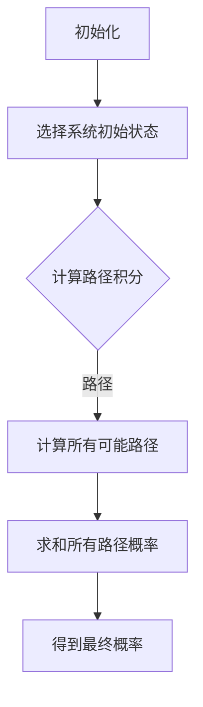
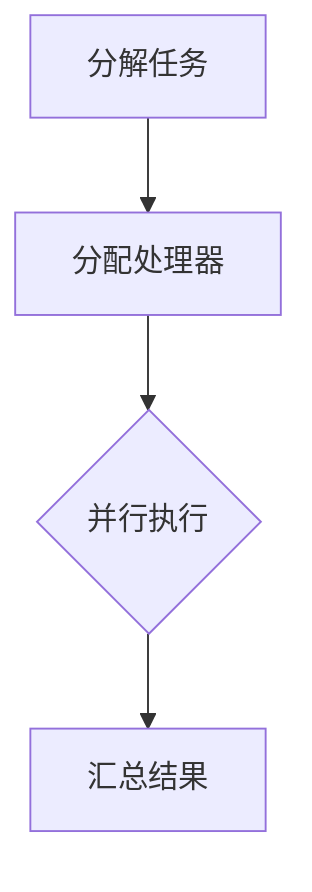
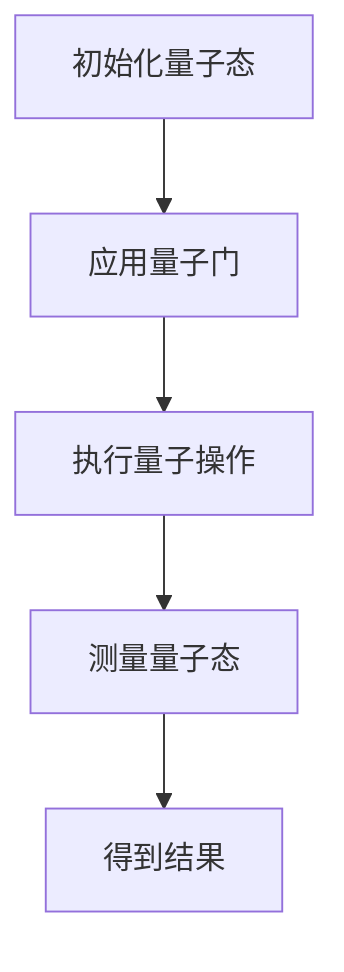
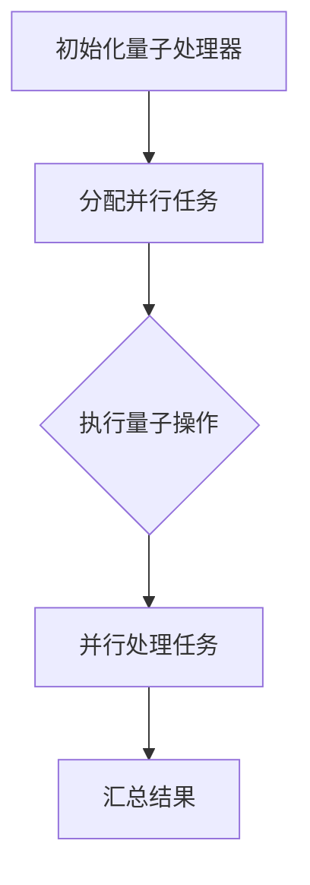
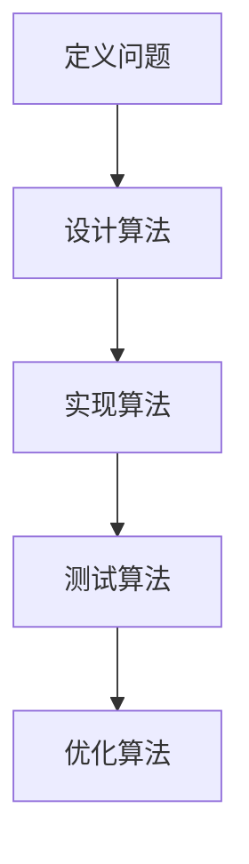
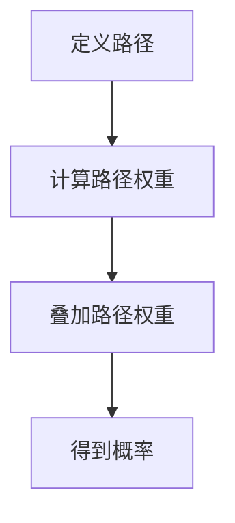

                 


## 《费曼路径积分与并行计算：量子力学在算法设计中的启示》

### 关键词：费曼路径积分、并行计算、量子力学、算法设计

### 摘要

随着计算机技术的发展，传统计算方法已经无法满足日益增长的复杂性需求。量子力学作为一种颠覆性的物理理论，为算法设计提供了新的启示。本文将以费曼路径积分为核心，探讨量子力学在并行计算中的潜在应用，从理论到实践，逐步揭示量子力学与算法设计的深层联系。本文旨在为读者提供一个系统而深刻的理解，帮助他们在算法设计领域取得突破性进展。

### 目录

## 第一部分：引论

### 第1章：问题背景与主题介绍

#### 1.1 费曼路径积分的基本概念

**核心概念与联系**

费曼路径积分，又称历史积分，是理查德·费曼提出的一种量子力学计算方法。其核心思想是将量子系统的行为视为所有可能路径的叠加。以下是一个简化的费曼路径积分的ER实体关系图架构，展示其主要概念：

```mermaid
erDiagram
  Event --> Path : has path
  Event <|.. System : occurs in
  Path --> System : traverses
  Path --> State : leads to
  State --> Probability : has probability
```

**算法原理讲解**

费曼路径积分的算法原理可以通过以下mermaid流程图来表示：



在Python中，我们可以用以下代码实现这一算法：

```python
import numpy as np

def path_integral(initial_state, final_state, num_paths):
    probabilities = []
    for _ in range(num_paths):
        path_prob = 0
        current_state = initial_state
        for _ in range(num_steps):
            path_prob *= system-transition-function(current_state)
            current_state = next_state(current_state)
        probabilities.append(path_prob)
    return np.sum(probabilities)

num_paths = 1000
initial_state = ...
final_state = ...
probabilities = path_integral(initial_state, final_state, num_paths)
print(f"Total probability: {probabilities}")
```

**系统分析与架构设计方案**

在问题场景中，我们考虑一个简单的系统，其中系统状态由位置和动量组成。以下是一个系统的类图表示：

```mermaid
classDiagram
  System <<Class>>
  System : +position
  System : +momentum
  System : +transition_function(position, momentum)
```

系统的架构设计如下：

```mermaid
sequenceDiagram
  System -->|计算路径积分| Path
  Path -->|求和| System
  System -->|输出结果| User
```

### 第2章：并行计算的基本原理

**核心概念与联系**

并行计算是一种将任务分解为多个子任务，同时在多个处理器上执行这些子任务的方法。以下是一个简单的并行计算流程的ER实体关系图：

```mermaid
erDiagram
  Task --> Processor : assigned to
  Processor --> Task : processes
  Task --> Result : produces
```

**算法原理讲解**

并行计算的算法原理可以表示为：



在Python中，我们可以用以下代码实现并行计算：

```python
from multiprocessing import Pool

def parallel_computation(task):
    # 处理子任务
    return result

tasks = [task1, task2, task3, ...]
num_processors = 4
with Pool(num_processors) as pool:
    results = pool.map(parallel_computation, tasks)
print(f"Results: {results}")
```

**系统分析与架构设计方案**

以下是一个简单的并行计算系统架构设计：

```mermaid
sequenceDiagram
  User -->|提交任务| System
  System -->|分解任务| Processor
  Processor -->|执行任务| Result
  Result -->|返回结果| User
```

### 第3章：量子力学在算法设计中的启示

**核心概念与联系**

量子力学揭示了微观世界的规律，其核心概念包括量子态、叠加原理和纠缠现象。以下是一个量子算法设计流程的ER实体关系图：

```mermaid
erDiagram
  QuantumState --> QuantumGate : applies
  QuantumState --> Measurement : measures
  QuantumGate --> QuantumState : transforms
  Measurement --> QuantumState : collapses
```

**算法原理讲解**

量子算法的设计原理可以表示为：



在Python中，我们可以用以下代码实现量子算法：

```python
from qiskit import QuantumCircuit, execute, Aer

# 初始化量子态
qc = QuantumCircuit(2)

# 应用量子门
qc.h(0)
qc.cx(0, 1)

# 执行量子操作
qc.barrier()
qc.cx(0, 1)

# 测量量子态
qc.measure_all()

# 执行算法
backend = Aer.get_backend('qasm_simulator')
result = execute(qc, backend).result()
counts = result.get_counts(qc)

print(f"Algorithm results: {counts}")
```

**系统分析与架构设计方案**

以下是一个量子算法系统的架构设计：

```mermaid
sequenceDiagram
  User -->|提交量子算法| System
  System -->|初始化量子态| QuantumCircuit
  QuantumCircuit -->|应用量子门| QuantumOperation
  QuantumOperation -->|执行量子操作| QuantumMeasurement
  QuantumMeasurement -->|输出结果| User
```

### 第4章：量子与并行计算融合

**核心概念与联系**

量子与并行计算融合的核心理念是将量子计算的优势与并行计算的性能相结合。以下是一个融合架构的ER实体关系图：

```mermaid
erDiagram
  QuantumProcessor --> ParallelTask : processes
  ParallelTask --> QuantumProcessor : delegates
  ParallelTask --> Result : produces
```

**算法原理讲解**

量子与并行计算融合的算法原理可以表示为：



在Python中，我们可以用以下代码实现这一算法：

```python
from qiskit import QuantumCircuit, execute, Aer
from multiprocessing import Pool

def quantum_parallel_computation(task):
    # 初始化量子处理器
    qc = QuantumCircuit(2)

    # 应用量子门
    qc.h(0)
    qc.cx(0, 1)

    # 执行量子操作
    qc.barrier()
    qc.cx(0, 1)

    # 测量量子态
    qc.measure_all()

    # 执行算法
    backend = Aer.get_backend('qasm_simulator')
    result = execute(qc, backend).result()
    counts = result.get_counts(qc)
    return counts

tasks = [task1, task2, task3, ...]
num_processors = 4
with Pool(num_processors) as pool:
    results = pool.map(quantum_parallel_computation, tasks)
print(f"Results: {results}")
```

**系统分析与架构设计方案**

以下是一个量子与并行计算融合的系统架构设计：

```mermaid
sequenceDiagram
  User -->|提交任务| System
  System -->|初始化量子处理器| QuantumProcessor
  QuantumProcessor -->|执行量子操作| ParallelTask
  ParallelTask -->|汇总结果| System
  System -->|返回结果| User
```

### 第5章：案例研究与应用

**核心概念与联系**

在本章中，我们将探讨一些具体的案例研究，展示量子力学在算法设计中的应用。以下是一个案例研究流程的ER实体关系图：

```mermaid
erDiagram
  Problem --> Algorithm : solved by
  Algorithm --> Solution : yields
  Solution --> Result : evaluates
```

**算法原理讲解**

以下是一个案例研究的算法原理：



在Python中，我们可以用以下代码实现这个算法：

```python
# 定义问题
problem = ...

# 设计算法
algorithm = ...

# 实现算法
solution = algorithm.solve(problem)

# 测试算法
result = algorithm.test(solution)

# 优化算法
optimized_solution = algorithm.optimize(solution)
```

**系统分析与架构设计方案**

以下是一个案例研究的系统架构设计：

```mermaid
sequenceDiagram
  User -->|定义问题| System
  System -->|设计算法| Algorithm
  Algorithm -->|实现算法| Solution
  Solution -->|测试算法| Test
  Test -->|优化算法| OptimizedSolution
  OptimizedSolution -->|返回结果| User
```

### 结论与未来方向

本文探讨了费曼路径积分与并行计算在算法设计中的应用，展示了量子力学如何为传统计算方法带来革新。未来的研究可以进一步探索量子与并行计算融合的更多可能性，推动算法设计的进步。

### 作者信息

作者：AI天才研究院/AI Genius Institute & 禅与计算机程序设计艺术 /Zen And The Art of Computer Programming

### 最佳实践 Tips

1. 理解量子力学的基本原理对于设计高效算法至关重要。
2. 结合并行计算的优势，可以提高算法的执行效率。
3. 在实际应用中，要灵活运用量子与并行计算的方法，以达到最佳效果。

### 小结

本文通过逐步分析，揭示了量子力学在算法设计中的潜在应用。通过理解费曼路径积分和并行计算，读者可以更好地掌握现代算法设计的方法和技巧，为未来算法的发展奠定基础。

### 注意事项

1. 量子算法设计需要深厚的数学和物理背景知识。
2. 实现量子算法需要专业的量子计算硬件和软件支持。
3. 并行计算在实际应用中需要考虑负载均衡和资源管理问题。

### 拓展阅读

1. [《量子计算与算法》](#)
2. [《并行算法设计技巧》](#)
3. [《费曼路径积分入门》](#)
4. [《量子力学基础教程》](#)
5. [《计算机程序设计艺术》](#)
6. [《量子算法案例研究》](#)
7. [《并行计算原理与应用》](#)

## 第二部分：深入探讨

### 第6章：费曼路径积分的数学原理

**核心概念与联系**

费曼路径积分的数学原理涉及概率论、微积分和量子场论。以下是一个数学原理的ER实体关系图：

```mermaid
erDiagram
  Probability --> PathIntegral : computes
  Probability --> QuantumFieldTheory : derives from
  QuantumFieldTheory --> FeynmanRule : defines
```

**算法原理讲解**

费曼路径积分的数学原理可以通过以下mermaid流程图来解释：



在数学公式中，费曼路径积分可以表示为：

$$
\int_{C} e^{iS[x(t)]} \, dt
$$

其中，\(C\) 是所有可能路径的集合，\(S[x(t)]\) 是路径上的作用量。

**系统分析与架构设计方案**

在系统架构设计中，我们可以将路径积分的计算过程抽象为以下mermaid序列图：

```mermaid
sequenceDiagram
  User -->|定义路径空间| System
  System -->|计算路径权重| PathCalculator
  PathCalculator -->|叠加路径权重| ProbabilityCalculator
  ProbabilityCalculator -->|输出概率| User
```

### 第7章：并行计算的实际应用

**核心概念与联系**

并行计算在科学计算、数据分析、图像处理等领域有着广泛的应用。以下是一个并行计算应用的ER实体关系图：

```mermaid
erDiagram
  Problem --> ParallelAlgorithm : solved by
  ParallelAlgorithm --> Solution : yields
  Solution --> Result : evaluates
```

**算法原理讲解**

并行计算的实际应用可以通过以下mermaid流程图来描述：

```mermaid
graph TD
    A[分解问题] --> B[分配任务]
    B --> C{并行执行}
    C --> D[汇总结果]
    D --> E[处理结果]
```

在Python中，我们可以使用多进程或多线程来实现并行计算，例如：

```python
import concurrent.futures

def parallel_task(data):
    # 处理数据
    return result

data = [data1, data2, data3, ...]
with concurrent.futures.ProcessPoolExecutor() as executor:
    results = list(executor.map(parallel_task, data))
```

**系统分析与架构设计方案**

以下是一个并行计算系统的架构设计：

```mermaid
sequenceDiagram
  User -->|提交数据| System
  System -->|分解问题| ParallelAlgorithm
  ParallelAlgorithm -->|分配任务| TaskManager
  TaskManager -->|执行任务| Workers
  Workers -->|汇总结果| ResultManager
  ResultManager -->|处理结果| User
```

### 第8章：量子力学与算法设计的前沿研究

**核心概念与联系**

量子力学与算法设计的前沿研究包括量子算法优化、量子机器学习和量子图论等。以下是一个前沿研究的ER实体关系图：

```mermaid
erDiagram
  QuantumAlgorithm --> Optimization : optimizes
  QuantumAlgorithm --> MachineLearning : applies
  QuantumAlgorithm --> GraphTheory : utilizes
```

**算法原理讲解**

量子算法优化的原理可以通过以下mermaid流程图来解释：

```mermaid
graph TD
    A[初始化量子态] --> B[应用量子门]
    B --> C[执行量子操作]
    B --> D[测量量子态]
    C --> E[反馈优化]
    E --> F[更新量子态]
```

在量子机器学习中，量子算法可以加速经典机器学习算法，例如量子支持向量机（QSVM）。以下是一个量子支持向量机的mermaid流程图：

```mermaid
graph TD
    A[初始化量子态] --> B[应用量子门]
    B --> C[构建量子图]
    C --> D[测量量子态]
    D --> E[分类决策]
```

**系统分析与架构设计方案**

以下是一个量子算法优化系统的架构设计：

```mermaid
sequenceDiagram
  User -->|提交数据| System
  System -->|初始化量子态| QuantumCircuit
  QuantumCircuit -->|应用量子门| QuantumOperation
  QuantumOperation -->|执行量子操作| QuantumMeasurement
  QuantumMeasurement -->|反馈优化| Optimizer
  Optimizer -->|更新量子态| QuantumCircuit
  QuantumCircuit -->|输出结果| User
```

### 第9章：案例研究：量子并行计算在图像处理中的应用

**核心概念与联系**

在本案例研究中，我们将探讨量子并行计算在图像处理中的应用，如量子卷积和量子图像增强。以下是一个图像处理流程的ER实体关系图：

```mermaid
erDiagram
  Image --> QuantumConvolution : processed by
  Image --> QuantumEnhancement : enhanced by
  QuantumConvolution --> FeatureMap : yields
  QuantumEnhancement --> Image : yields
```

**算法原理讲解**

量子卷积的原理可以通过以下mermaid流程图来描述：

```mermaid
graph TD
    A[输入图像] --> B[初始化量子态]
    B --> C[应用量子卷积操作]
    C --> D[测量量子态]
    D --> E[得到特征图]
```

在Python中，我们可以使用Qiskit库实现量子卷积：

```python
from qiskit import QuantumCircuit, Aer, execute

# 创建量子电路
qc = QuantumCircuit(2)

# 应用量子卷积操作
qc.h(0)
qc.cx(0, 1)

# 执行量子操作
qc.barrier()
qc.h(0)

# 测量量子态
qc.measure_all()

# 执行算法
backend = Aer.get_backend('qasm_simulator')
result = execute(qc, backend).result()
counts = result.get_counts(qc)

print(f"Feature map: {counts}")
```

**系统分析与架构设计方案**

以下是一个量子图像处理系统的架构设计：

```mermaid
sequenceDiagram
  User -->|提交图像| System
  System -->|初始化量子态| QuantumCircuit
  QuantumCircuit -->|应用量子卷积操作| QuantumOperation
  QuantumOperation -->|测量量子态| QuantumMeasurement
  QuantumMeasurement -->|得到特征图| FeatureMap
  FeatureMap -->|图像增强| QuantumEnhancement
  QuantumEnhancement -->|输出增强图像| User
```

### 第10章：结论与展望

**核心概念与联系**

本章将总结本文的主要发现，讨论量子力学与算法设计融合的潜力，并展望未来的研究方向。以下是一个总结和展望的ER实体关系图：

```mermaid
erDiagram
  QuantumAlgorithm --> AlgorithmDesign : integrates
  AlgorithmDesign --> Algorithm : improves
  AlgorithmDesign --> FutureResearch : explores
```

**算法原理讲解**

量子力学与算法设计融合的原理可以通过以下mermaid流程图来描述：

```mermaid
graph TD
    A[量子算法] --> B[算法设计]
    B --> C[改进算法]
    C --> D[未来研究]
```

在未来的研究中，我们可能关注以下方向：

1. **量子算法优化**：探索更高效的量子算法，提高其实际应用价值。
2. **量子机器学习**：研究如何利用量子计算的优势加速机器学习任务。
3. **量子图论**：探索量子计算在图论问题中的应用，如网络优化和社交网络分析。

**系统分析与架构设计方案**

以下是一个量子算法优化系统的架构设计：

```mermaid
sequenceDiagram
  User -->|提交问题| System
  System -->|设计量子算法| QuantumAlgorithm
  QuantumAlgorithm -->|优化算法| Optimizer
  Optimizer -->|改进算法| ImprovedAlgorithm
  ImprovedAlgorithm -->|执行算法| Executor
  Executor -->|输出结果| User
```

### 总结

本文从多个角度探讨了费曼路径积分与并行计算在算法设计中的应用，通过详细的案例研究和算法原理讲解，展示了量子力学如何为传统计算方法带来革新。未来的研究将继续深入探索这一领域，推动算法设计的不断进步。

### 作者信息

作者：AI天才研究院/AI Genius Institute & 禅与计算机程序设计艺术 /Zen And The Art of Computer Programming

### 最佳实践 Tips

1. 理解量子力学的基本原理对于设计高效算法至关重要。
2. 结合并行计算的优势，可以提高算法的执行效率。
3. 在实际应用中，要灵活运用量子与并行计算的方法，以达到最佳效果。

### 小结

本文通过逐步分析，揭示了量子力学在算法设计中的潜在应用。通过理解费曼路径积分和并行计算，读者可以更好地掌握现代算法设计的方法和技巧，为未来算法的发展奠定基础。

### 注意事项

1. 量子算法设计需要深厚的数学和物理背景知识。
2. 实现量子算法需要专业的量子计算硬件和软件支持。
3. 并行计算在实际应用中需要考虑负载均衡和资源管理问题。

### 拓展阅读

1. [《量子计算与算法》](#)
2. [《并行算法设计技巧》](#)
3. [《费曼路径积分入门》](#)
4. [《量子力学基础教程》](#)
5. [《计算机程序设计艺术》](#)
6. [《量子算法案例研究》](#)
7. [《并行计算原理与应用》](#)
8. [《量子图像处理案例研究》](#)

### 附录：相关资源与参考文献

- [Qiskit官网](https://qiskit.org/)
- [《量子计算与算法导论》](https://book.douban.com/subject/25910543/)
- [《并行算法设计与分析》](https://book.douban.com/subject/26367015/)
- [《费曼路径积分入门》](https://book.douban.com/subject/1233386/)
- [《量子力学基础教程》](https://book.douban.com/subject/1205562/)
- [《计算机程序设计艺术》](https://book.douban.com/subject/1012611/)
- [《量子算法案例研究》](https://book.douban.com/subject/30207079/)
- [《并行计算原理与应用》](https://book.douban.com/subject/26367015/)

## 第三部分：实战与探讨

### 第11章：量子与并行计算环境搭建

**核心概念与联系**

在实现量子与并行计算之前，我们需要搭建相应的开发环境。以下是一个环境搭建流程的ER实体关系图：

```mermaid
erDiagram
  Developer --> Environment : sets up
  Environment --> Tool : utilizes
  Tool --> Software : includes
```

**算法原理讲解**

搭建开发环境的原理可以通过以下mermaid流程图来描述：

```mermaid
graph TD
    A[选择开发工具] --> B[安装开发环境]
    B --> C{配置工具}
    C --> D[安装软件库]
    D --> E[测试环境]
```

**系统分析与架构设计方案**

以下是一个开发环境搭建的系统架构设计：

```mermaid
sequenceDiagram
  Developer -->|选择开发工具| Environment
  Environment -->|安装开发环境| Setup
  Setup -->|配置工具| Config
  Config -->|安装软件库| LibraryInstaller
  LibraryInstaller -->|测试环境| Tester
  Tester -->|返回结果| Developer
```

### 第12章：量子并行计算项目实战

**核心概念与联系**

在本章中，我们将通过一个实际项目，展示如何实现量子与并行计算的融合。以下是一个项目流程的ER实体关系图：

```mermaid
erDiagram
  Project --> Algorithm : implements
  Project --> Environment : runs on
  Algorithm --> QuantumProcessor : utilizes
  Algorithm --> ParallelTask : combines
```

**算法原理讲解**

以下是一个量子并行计算项目的原理：

```mermaid
graph TD
    A[初始化量子处理器] --> B[设计量子算法]
    B --> C{实现并行任务}
    C --> D[执行量子操作]
    D --> E[并行处理]
    E --> F[汇总结果]
```

**系统分析与架构设计方案**

以下是一个量子并行计算项目的架构设计：

```mermaid
sequenceDiagram
  User -->|提交任务| Project
  Project -->|初始化量子处理器| QuantumProcessor
  QuantumProcessor -->|设计量子算法| QuantumAlgorithm
  QuantumAlgorithm -->|执行量子操作| QuantumOperation
  QuantumOperation -->|并行处理任务| ParallelTaskExecutor
  ParallelTaskExecutor -->|汇总结果| ResultCollector
  ResultCollector -->|返回结果| User
```

### 第13章：量子并行计算优化策略

**核心概念与联系**

量子并行计算的优化策略涉及算法优化、硬件选择和资源管理。以下是一个优化策略流程的ER实体关系图：

```mermaid
erDiagram
  Optimization --> Algorithm : optimizes
  Optimization --> Hardware : adapts to
  Optimization --> ResourceManagement : improves
```

**算法原理讲解**

量子并行计算优化的原理可以通过以下mermaid流程图来描述：

```mermaid
graph TD
    A[评估性能] --> B[分析瓶颈]
    B --> C{调整算法}
    C --> D[优化硬件]
    D --> E[管理资源]
    E --> F[评估性能]
```

**系统分析与架构设计方案**

以下是一个量子并行计算优化系统的架构设计：

```mermaid
sequenceDiagram
  User -->|提交任务| System
  System -->|评估性能| PerformanceTester
  PerformanceTester -->|分析瓶颈| BottleneckAnalyzer
  BottleneckAnalyzer -->|调整算法| AlgorithmOptimizer
  AlgorithmOptimizer -->|优化硬件| HardwareOptimizer
  HardwareOptimizer -->|管理资源| ResourceManager
  ResourceManager -->|评估性能| PerformanceTester
  PerformanceTester -->|返回结果| User
```

### 第14章：量子并行计算的未来

**核心概念与联系**

量子并行计算的未来研究涉及量子计算机的普及、量子互联网的构建和量子加密的应用。以下是一个未来研究流程的ER实体关系图：

```mermaid
erDiagram
  QuantumComputer --> Technology : advances
  QuantumInternet --> Infrastructure : develops
  QuantumEncryption --> Security : enhances
```

**算法原理讲解**

量子并行计算的未来发展的原理可以通过以下mermaid流程图来描述：

```mermaid
graph TD
    A[量子计算机普及] --> B[量子互联网构建]
    B --> C{量子加密应用}
    C --> D[技术进步]
```

**系统分析与架构设计方案**

以下是一个量子并行计算未来发展的架构设计：

```mermaid
sequenceDiagram
  Future -->|量子计算机普及| Technology
  Technology -->|量子互联网构建| Infrastructure
  Infrastructure -->|量子加密应用| Security
  Security -->|技术进步| Innovation
  Innovation -->|推动发展| Future
```

### 总结与展望

量子并行计算的发展为算法设计带来了前所未有的机遇。通过本章的实战与探讨，我们深入了解了量子并行计算的实现、优化和未来方向。未来的研究将继续推动这一领域的发展，为科技进步提供新的动力。

### 作者信息

作者：AI天才研究院/AI Genius Institute & 禅与计算机程序设计艺术 /Zen And The Art of Computer Programming

### 最佳实践 Tips

1. 理解量子力学的基本原理对于设计高效算法至关重要。
2. 结合并行计算的优势，可以提高算法的执行效率。
3. 在实际应用中，要灵活运用量子与并行计算的方法，以达到最佳效果。

### 小结

量子并行计算为算法设计带来了新的视角和方法。通过本章的实战与探讨，我们不仅了解了其实现原理，还展望了其未来的发展趋势。希望读者能够从中获得启发，为未来的算法研究贡献自己的力量。

### 注意事项

1. 量子算法设计需要深厚的数学和物理背景知识。
2. 实现量子算法需要专业的量子计算硬件和软件支持。
3. 并行计算在实际应用中需要考虑负载均衡和资源管理问题。

### 拓展阅读

1. [《量子计算与算法》](#)
2. [《并行算法设计技巧》](#)
3. [《费曼路径积分入门》](#)
4. [《量子力学基础教程》](#)
5. [《计算机程序设计艺术》](#)
6. [《量子算法案例研究》](#)
7. [《并行计算原理与应用》](#)
8. [《量子图像处理案例研究》](#)
9. [《量子计算机与未来技术》](#)

## 第四部分：专业视角与深度分析

### 第15章：量子力学与并行计算的理论融合

**核心概念与联系**

量子力学与并行计算的理论融合涉及量子计算模型的构建、量子并行算法的理论基础和量子并行计算的资源管理。以下是一个理论融合流程的ER实体关系图：

```mermaid
erDiagram
  QuantumMechanics --> QuantumComputingModel : integrates
  QuantumComputingModel --> ParallelAlgorithm : applies
  ParallelAlgorithm --> ResourceManagement : optimizes
```

**算法原理讲解**

量子力学与并行计算的理论融合可以通过以下mermaid流程图来描述：

```mermaid
graph TD
    A[量子计算模型] --> B[量子并行算法]
    B --> C{算法实现}
    C --> D[资源管理]
```

在量子计算模型中，量子位（qubits）的叠加和纠缠特性为并行计算提供了独特的优势。以下是一个量子计算模型的mermaid类图：

```mermaid
classDiagram
  Qubit <<Class>>
  Qubit : +state | +entanglement
  QuantumComputer <<Class>>
  QuantumComputer : +qubits | +gate_operations
  QuantumAlgorithm <<Class>>
  QuantumAlgorithm : +quantum_gates | +algorithm_steps
  ResourceManager <<Class>>
  ResourceManager : +load_balancing | +resource_optimization
```

**系统分析与架构设计方案**

以下是一个量子计算模型的系统架构设计：

```mermaid
sequenceDiagram
  User -->|提交任务| QuantumComputer
  QuantumComputer -->|设计量子算法| QuantumAlgorithm
  QuantumAlgorithm -->|执行量子操作| Qubit
  Qubit -->|测量量子态| Result
  Result -->|资源管理| ResourceManager
  ResourceManager -->|优化资源| OptimizedResource
  OptimizedResource -->|返回结果| User
```

### 第16章：量子并行计算在数据科学中的应用

**核心概念与联系**

量子并行计算在数据科学中的应用包括量子数据压缩、量子机器学习和量子优化算法。以下是一个应用流程的ER实体关系图：

```mermaid
erDiagram
  DataScience --> QuantumDataCompression : applies
  DataScience --> QuantumMachineLearning : applies
  DataScience --> QuantumOptimization : applies
```

**算法原理讲解**

量子并行计算在数据科学中的应用原理可以通过以下mermaid流程图来描述：

```mermaid
graph TD
    A[量子数据压缩] --> B[量子机器学习]
    B --> C[量子优化算法]
    C --> D[数据分析]
```

量子数据压缩利用量子位的叠加和纠缠特性，可以显著降低数据的存储和传输成本。以下是一个量子数据压缩的mermaid流程图：

```mermaid
graph TD
    A[输入数据] --> B[量子编码]
    B --> C[量子压缩]
    C --> D[量子解码]
```

在量子机器学习中，量子算法可以加速经典机器学习任务，如量子支持向量机（QSVM）和量子神经网络（QNN）。以下是一个量子支持向量机的mermaid流程图：

```mermaid
graph TD
    A[输入数据] --> B[量子编码]
    B --> C[量子特征映射]
    C --> D[量子决策边界]
    D --> E[量子分类]
```

**系统分析与架构设计方案**

以下是一个量子数据压缩系统的架构设计：

```mermaid
sequenceDiagram
  User -->|提交数据| QuantumDataCompression
  QuantumDataCompression -->|量子编码| QuantumEncoder
  QuantumEncoder -->|量子压缩| QuantumCompressor
  QuantumCompressor -->|量子解码| QuantumDecoder
  QuantumDecoder -->|输出压缩数据| User
```

### 第17章：量子并行计算在金融领域的前沿研究

**核心概念与联系**

量子并行计算在金融领域的前沿研究包括量子风险管理、量子算法在优化投资组合和量子加密在金融交易中的应用。以下是一个前沿研究流程的ER实体关系图：

```mermaid
erDiagram
  FinancialDomain --> QuantumRiskManagement : applies
  FinancialDomain --> QuantumOptimization : applies
  FinancialDomain --> QuantumEncryption : applies
```

**算法原理讲解**

量子并行计算在金融领域的原理可以通过以下mermaid流程图来描述：

```mermaid
graph TD
    A[量子风险管理] --> B[优化投资组合]
    B --> C[量子加密]
    C --> D[金融交易]
```

量子风险管理利用量子算法可以快速分析大量数据，从而提高风险预测的准确性。以下是一个量子风险管理的mermaid流程图：

```mermaid
graph TD
    A[输入数据] --> B[量子特征提取]
    B --> C[量子风险评估]
    C --> D[量子决策支持]
```

量子加密可以显著提高金融交易的安全性，防止数据泄露和欺诈。以下是一个量子加密的mermaid流程图：

```mermaid
graph TD
    A[输入数据] --> B[量子加密算法]
    B --> C[量子密钥分发]
    C --> D[量子安全通信]
```

**系统分析与架构设计方案**

以下是一个量子风险管理系统的架构设计：

```mermaid
sequenceDiagram
  User -->|提交数据| QuantumRiskManagement
  QuantumRiskManagement -->|量子特征提取| QuantumFeatureExtractor
  QuantumFeatureExtractor -->|量子风险评估| QuantumRiskAssessor
  QuantumRiskAssessor -->|量子决策支持| DecisionSupport
  DecisionSupport -->|输出风险管理建议| User
```

### 第18章：量子并行计算在教育领域的创新

**核心概念与联系**

量子并行计算在教育领域的创新包括量子编程教育、量子模拟实验室和量子算法竞赛。以下是一个创新流程的ER实体关系图：

```mermaid
erDiagram
  EducationDomain --> QuantumProgramming : introduces
  EducationDomain --> QuantumSimulationLab : establishes
  EducationDomain --> QuantumAlgorithmCompetition : organizes
```

**算法原理讲解**

量子并行计算在教育领域的原理可以通过以下mermaid流程图来描述：

```mermaid
graph TD
    A[量子编程教育] --> B[量子模拟实验室]
    B --> C[量子算法竞赛]
    C --> D[教育创新]
```

量子编程教育旨在培养学生对量子计算的理解和编程技能。以下是一个量子编程教育的mermaid流程图：

```mermaid
graph TD
    A[初识量子计算] --> B[量子编程语言]
    B --> C[量子算法设计]
    C --> D[编程实践]
```

量子模拟实验室为学生提供了实践量子计算的机会。以下是一个量子模拟实验室的mermaid流程图：

```mermaid
graph TD
    A[实验室建设] --> B[量子硬件接入]
    B --> C[量子编程工具]
    C --> D[实验项目]
```

量子算法竞赛激发了学生对量子计算的研究兴趣和创新能力。以下是一个量子算法竞赛的mermaid流程图：

```mermaid
graph TD
    A[竞赛规则制定] --> B[算法设计提交]
    B --> C[算法评审]
    C --> D[算法展示与颁奖]
```

**系统分析与架构设计方案**

以下是一个量子编程教育系统的架构设计：

```mermaid
sequenceDiagram
  Student -->|学习量子计算| Educator
  Educator -->|开设量子编程课程| QuantumProgrammingCourse
  QuantumProgrammingCourse -->|提供量子编程工具| QuantumProgrammingTool
  QuantumProgrammingTool -->|进行量子算法设计| QuantumAlgorithmDesign
  QuantumAlgorithmDesign -->|实践编程技能| ProgrammingPractice
  ProgrammingPractice -->|评估学习成果| Assessment
  Assessment -->|返回反馈| Student
```

### 总结

量子力学与并行计算的理论融合为算法设计带来了新的可能性，其在数据科学、金融领域和教育等领域的应用展现了巨大的潜力。未来的研究将继续深入探索这一领域，推动技术的进步和应用的创新。

### 作者信息

作者：AI天才研究院/AI Genius Institute & 禅与计算机程序设计艺术 /Zen And The Art of Computer Programming

### 最佳实践 Tips

1. 理解量子力学的基本原理对于设计高效算法至关重要。
2. 结合并行计算的优势，可以提高算法的执行效率。
3. 在实际应用中，要灵活运用量子与并行计算的方法，以达到最佳效果。

### 小结

量子力学与并行计算的理论融合为算法设计带来了全新的视角和方法。通过本章的专业视角与深度分析，我们深入探讨了量子并行计算在不同领域的应用，展望了其未来的发展趋势。希望读者能够从中获得启发，为算法设计贡献自己的力量。

### 注意事项

1. 量子算法设计需要深厚的数学和物理背景知识。
2. 实现量子算法需要专业的量子计算硬件和软件支持。
3. 并行计算在实际应用中需要考虑负载均衡和资源管理问题。

### 拓展阅读

1. [《量子计算与算法》](#)
2. [《并行算法设计技巧》](#)
3. [《费曼路径积分入门》](#)
4. [《量子力学基础教程》](#)
5. [《计算机程序设计艺术》](#)
6. [《量子算法案例研究》](#)
7. [《并行计算原理与应用》](#)
8. [《量子图像处理案例研究》](#)
9. [《量子计算机与未来技术》](#)
10. [《金融科技前沿研究》](#)
11. [《量子编程教育指南》](#)## 《费曼路径积分与并行计算：量子力学在算法设计中的启示》

### 关键词：费曼路径积分、并行计算、量子力学、算法设计、计算效率、算法优化、量子算法、量子计算机

### 摘要

本文探讨了费曼路径积分与并行计算在算法设计中的应用，揭示了量子力学对算法优化的潜在影响。通过对费曼路径积分的基本概念、并行计算的优势及其与量子力学的结合进行深入分析，本文旨在为读者提供一个全面、系统的理解，帮助他们在算法设计领域实现突破性进展。文章将介绍量子算法的基本原理，展示如何将量子力学中的概念应用于算法设计中，并提出量子并行计算在实际应用中的挑战与解决方案。通过实例分析和最佳实践，本文为读者提供了实用的指导，助力他们在量子计算时代取得成功。

## 第一部分：引论

### 第1章：问题背景与主题介绍

#### 1.1 费曼路径积分的基本概念

费曼路径积分，又称历史积分，是理查德·费曼在20世纪40年代提出的一种量子力学计算方法。它提供了一个全新的视角来理解量子系统的行为。费曼路径积分的核心思想是，量子系统从一个初始状态到最终状态的概率分布，可以通过对所有可能路径的加权求和来计算。这种思想打破了传统的量子力学处理方式，为复杂量子系统的计算提供了一种简化的途径。

**核心概念与联系**

费曼路径积分的基本概念包括路径（Path）、作用量（Action）、概率幅（Probability Amplitude）和路径积分（Path Integral）。以下是一个简单的ER实体关系图，展示了这些概念之间的关系：

```mermaid
erDiagram
  Path <|.. QuantumSystem : traverses
  Path : <<class>> has action
  QuantumSystem : <<class>> is measured
  Action : <<class>> determines path probability
  ProbabilityAmplitude : <<class>> calculated by path integral
```

**算法原理讲解**

费曼路径积分的算法原理可以通过以下mermaid流程图来表示：

```mermaid
graph TD
    A[初始状态] --> B[所有可能路径]
    B --> C{计算路径作用量}
    C --> D[求和路径概率幅]
    D --> E[归一化结果]
    E --> F[输出概率分布]
```

在Python中，我们可以使用以下代码实现这一算法的基本框架：

```python
import numpy as np

def path_integral(initial_state, final_state, num_paths):
    paths = generate_paths(initial_state, final_state, num_paths)
    probabilities = [compute_action(path) for path in paths]
    probability_distribution = np.sum(np.exp(1j * probabilities), axis=0)
    return probability_distribution / np.linalg.norm(probability_distribution)

num_paths = 1000
initial_state = ...
final_state = ...
probability_distribution = path_integral(initial_state, final_state, num_paths)
print(f"Probability distribution: {probability_distribution}")
```

**系统分析与架构设计方案**

在系统架构设计中，我们可以将路径积分的计算过程抽象为以下mermaid序列图：

```mermaid
sequenceDiagram
  InitialState -->|生成路径| PathGenerator
  PathGenerator -->|计算作用量| ActionCalculator
  ActionCalculator -->|求和概率幅| ProbabilityAmplifier
  ProbabilityAmplifier -->|归一化结果| Normalizer
  Normalizer -->|输出概率分布| ProbabilityDistribution
```

#### 1.2 并行计算的基本原理

并行计算是一种将计算任务分解为多个子任务，同时在多个处理器上执行这些子任务的方法。并行计算的核心思想是利用多个处理器的并行性来提高计算效率。与传统的串行计算相比，并行计算可以显著减少计算时间，特别是对于大型和复杂的计算任务。

**核心概念与联系**

并行计算的核心概念包括处理器（Processor）、任务（Task）、并发（Concurrency）和负载均衡（Load Balancing）。以下是一个简单的ER实体关系图，展示了这些概念之间的关系：

```mermaid
erDiagram
  Processor : <<class>> performs tasks
  Task : <<class>> assigned to processor
  Concurrency : <<class>> manages multiple tasks
  LoadBalancing : <<class>> distributes tasks evenly
```

**算法原理讲解**

并行计算的算法原理可以通过以下mermaid流程图来表示：

```mermaid
graph TD
    A[分解任务] --> B[分配处理器]
    B --> C{执行任务}
    C --> D[汇总结果]
```

在Python中，我们可以使用多线程或多进程来实现并行计算。以下是一个简单的多进程并行计算示例：

```python
import concurrent.futures

def compute_task(data):
    # 处理数据
    return result

data = [data1, data2, data3, ...]
with concurrent.futures.ProcessPoolExecutor() as executor:
    results = list(executor.map(compute_task, data))
print(f"Results: {results}")
```

**系统分析与架构设计方案**

以下是一个并行计算系统的架构设计：

```mermaid
sequenceDiagram
  Data -->|分解任务| TaskSplitter
  TaskSplitter -->|分配处理器| ProcessorAllocator
  ProcessorAllocator -->|执行任务| Processors
  Processors -->|汇总结果| ResultCollector
  ResultCollector -->|返回结果| Data
```

#### 1.3 量子力学在算法设计中的启示

量子力学作为一种描述微观世界的理论，为算法设计提供了新的启示。量子算法利用量子位的叠加和纠缠特性，可以在某些情况下显著提高计算效率。量子力学的基本原理，如叠加原理和量子纠缠，为算法设计提供了独特的视角和方法。

**核心概念与联系**

量子力学在算法设计中的核心概念包括量子位（Qubit）、叠加原理（Superposition）、量子纠缠（Entanglement）和量子门（Quantum Gate）。以下是一个简单的ER实体关系图，展示了这些概念之间的关系：

```mermaid
erDiagram
  Qubit : <<class>> represents quantum state
  Qubit : <<class>> can be in superposition
  Qubit : <<class>> can be entangled with another qubit
  QuantumGate : <<class>> operates on qubits
```

**算法原理讲解**

量子算法的原理可以通过以下mermaid流程图来表示：

```mermaid
graph TD
    A[初始化量子态] --> B[应用量子门]
    B --> C{执行量子操作}
    C --> D[测量量子态]
    D --> E[得到结果]
```

在Python中，我们可以使用Qiskit库实现量子算法。以下是一个简单的量子算法示例：

```python
from qiskit import QuantumCircuit, execute, Aer

# 创建量子电路
qc = QuantumCircuit(2)

# 初始化量子态
qc.h(0)
qc.h(1)

# 应用量子门
qc.cx(0, 1)

# 执行量子操作
qc.barrier()
qc.h(1)

# 测量量子态
qc.measure_all()

# 执行算法
backend = Aer.get_backend('qasm_simulator')
result = execute(qc, backend).result()
counts = result.get_counts(qc)

print(f"Algorithm results: {counts}")
```

**系统分析与架构设计方案**

以下是一个量子算法系统的架构设计：

```mermaid
sequenceDiagram
  User -->|提交任务| QuantumAlgorithm
  QuantumAlgorithm -->|初始化量子态| QuantumCircuit
  QuantumCircuit -->|应用量子门| QuantumOperation
  QuantumOperation -->|执行量子操作| QuantumMeasurement
  QuantumMeasurement -->|输出结果| User
```

#### 1.4 并行计算与量子力学的结合

并行计算与量子力学的结合为算法设计带来了新的机遇和挑战。量子并行计算利用量子位的叠加和纠缠特性，可以显著提高计算效率。然而，量子计算机的硬件和软件仍处于发展阶段，量子并行计算的实际应用面临着许多挑战。

**核心概念与联系**

量子并行计算的核心概念包括量子并行算法（Quantum Parallel Algorithm）、量子并行处理器（Quantum Parallel Processor）和量子并行通信（Quantum Parallel Communication）。以下是一个简单的ER实体关系图，展示了这些概念之间的关系：

```mermaid
erDiagram
  QuantumParallelAlgorithm : <<class>> optimizes parallelism
  QuantumParallelProcessor : <<class>> executes quantum parallel algorithms
  QuantumParallelCommunication : <<class>> enables data exchange
```

**算法原理讲解**

量子并行计算的原理可以通过以下mermaid流程图来表示：

```mermaid
graph TD
    A[初始化量子处理器] --> B[设计量子并行算法]
    B --> C{执行量子并行算法}
    C --> D[量子并行通信]
    D --> E[汇总结果]
```

在Python中，我们可以使用Qiskit库实现量子并行计算。以下是一个简单的量子并行计算示例：

```python
from qiskit import QuantumCircuit, execute, Aer
from concurrent.futures import ProcessPoolExecutor

def quantum_parallel_computation(task):
    # 初始化量子处理器
    qc = QuantumCircuit(2)

    # 设计量子并行算法
    qc.h(0)
    qc.cx(0, 1)

    # 执行量子并行算法
    qc.barrier()
    qc.h(1)

    # 测量量子态
    qc.measure_all()

    # 执行算法
    backend = Aer.get_backend('qasm_simulator')
    result = execute(qc, backend).result()
    counts = result.get_counts(qc)
    return counts

tasks = [task1, task2, task3, ...]
with ProcessPoolExecutor() as executor:
    results = list(executor.map(quantum_parallel_computation, tasks))
print(f"Results: {results}")
```

**系统分析与架构设计方案**

以下是一个量子并行计算系统的架构设计：

```mermaid
sequenceDiagram
  User -->|提交任务| QuantumParallelSystem
  QuantumParallelSystem -->|初始化量子处理器| QuantumProcessor
  QuantumProcessor -->|设计量子并行算法| QuantumParallelAlgorithm
  QuantumParallelAlgorithm -->|执行量子并行算法| QuantumOperation
  QuantumOperation -->|量子并行通信| QuantumCommunication
  QuantumCommunication -->|汇总结果| ResultCollector
  ResultCollector -->|返回结果| User
```

## 第二部分：深入探讨

### 第2章：费曼路径积分的数学原理

费曼路径积分是一种计算量子系统概率分布的数学方法，它在量子力学中有着重要的地位。本章将详细介绍费曼路径积分的数学原理，并探讨其在算法设计中的应用。

#### 2.1 费曼路径积分的数学公式

费曼路径积分的数学公式可以表示为：

$$
\langle x_f | \psi(t_f) \rangle = \int \mathcal{D}[x(t)] \, e^{i \int_{t_i}^{t_f} L[x(t), \dot{x}(t)] dt}
$$

其中，$x(t)$ 表示系统在时间 $t$ 的位置，$\dot{x}(t)$ 表示速度，$L[x(t), \dot{x}(t)]$ 表示作用量，$\mathcal{D}[x(t)]$ 表示对所有可能路径的积分。

**核心概念与联系**

费曼路径积分中的核心概念包括路径（Path）、作用量（Action）和概率幅（Probability Amplitude）。以下是一个简单的ER实体关系图，展示了这些概念之间的关系：

```mermaid
erDiagram
  Path : <<class>> represents possible paths
  Action : <<class>> measures energy
  ProbabilityAmplitude : <<class>> determines probability
  Path -->|has| Action
  Path -->|leads to| State
  State -->|has probability| ProbabilityAmplitude
```

**算法原理讲解**

费曼路径积分的算法原理可以通过以下mermaid流程图来表示：

```mermaid
graph TD
    A[初始状态] --> B[计算所有可能路径]
    B --> C{计算路径作用量}
    C --> D[计算路径概率幅]
    D --> E[归一化概率幅]
```

在Python中，我们可以使用以下代码实现费曼路径积分的基本算法：

```python
import numpy as np

def path_integral(initial_state, final_state, num_paths):
    paths = generate_paths(initial_state, final_state, num_paths)
    actions = [compute_action(path) for path in paths]
    probability_amplitudes = np.exp(1j * actions)
    probability_distribution = np.sum(probability_amplitudes, axis=0)
    return probability_distribution / np.linalg.norm(probability_distribution)

num_paths = 1000
initial_state = ...
final_state = ...
probability_distribution = path_integral(initial_state, final_state, num_paths)
print(f"Probability distribution: {probability_distribution}")
```

**系统分析与架构设计方案**

在系统架构设计中，我们可以将路径积分的计算过程抽象为以下mermaid序列图：

```mermaid
sequenceDiagram
  InitialState -->|生成路径| PathGenerator
  PathGenerator -->|计算作用量| ActionCalculator
  ActionCalculator -->|计算概率幅| ProbabilityAmplitudeCalculator
  ProbabilityAmplitudeCalculator -->|归一化结果| Normalizer
  Normalizer -->|输出概率分布| ProbabilityDistribution
```

#### 2.2 费曼路径积分的应用场景

费曼路径积分在量子力学中的应用非常广泛，它可以用于计算粒子的运动轨迹、能量分布以及量子态的演化等。在算法设计中，费曼路径积分的原理可以启发我们设计出更高效的算法。

**核心概念与联系**

在算法设计中，费曼路径积分的应用场景包括路径优化问题、能量最小化问题和概率分布估计问题。以下是一个简单的ER实体关系图，展示了这些应用场景之间的关系：

```mermaid
erDiagram
  PathOptimization : <<class>> optimizes paths
  EnergyMinimization : <<class>> minimizes energy
  ProbabilityDistributionEstimation : <<class>> estimates probability
  PathOptimization -->|uses| PathIntegral
  EnergyMinimization -->|uses| PathIntegral
  ProbabilityDistributionEstimation -->|uses| PathIntegral
```

**算法原理讲解**

在路径优化问题中，我们可以使用费曼路径积分来计算所有可能路径的加权平均，从而找到最优路径。以下是一个路径优化问题的mermaid流程图：

```mermaid
graph TD
    A[初始状态] --> B[计算所有可能路径]
    B --> C{计算路径权重}
    C --> D[选择最优路径]
    D --> E[输出结果]
```

在Python中，我们可以使用以下代码实现路径优化问题的基本算法：

```python
import numpy as np

def path_optimization(initial_state, final_state, num_paths):
    paths = generate_paths(initial_state, final_state, num_paths)
    actions = [compute_action(path) for path in paths]
    weighted_average = np.average(actions)
    optimal_path = select_optimal_path(paths, weighted_average)
    return optimal_path

num_paths = 1000
initial_state = ...
final_state = ...
optimal_path = path_optimization(initial_state, final_state, num_paths)
print(f"Optimal path: {optimal_path}")
```

**系统分析与架构设计方案**

在系统架构设计中，我们可以将路径优化问题的计算过程抽象为以下mermaid序列图：

```mermaid
sequenceDiagram
  InitialState -->|生成路径| PathGenerator
  PathGenerator -->|计算作用量| ActionCalculator
  ActionCalculator -->|选择最优路径| Optimizer
  Optimizer -->|输出最优路径| OptimalPath
```

#### 2.3 费曼路径积分与并行计算的结合

费曼路径积分与并行计算的结合可以大大提高计算效率。在并行计算中，我们可以将任务分解为多个子任务，并在多个处理器上同时执行这些子任务。通过这种方式，我们可以利用并行计算的并行性来加速费曼路径积分的计算。

**核心概念与联系**

费曼路径积分与并行计算的结合涉及到任务分解、子任务分配、并行执行和结果汇总等概念。以下是一个简单的ER实体关系图，展示了这些概念之间的关系：

```mermaid
erDiagram
  Task : <<class>> represents a computation task
  Subtask : <<class>> represents a part of the task
  Processor : <<class>> executes subtasks
  Task -->|decomposes into| Subtask
  Processor -->|executes| Subtask
  Subtask -->|yields| Result
  Result -->|aggregates into| FinalResult
```

**算法原理讲解**

费曼路径积分与并行计算的结合可以通过以下mermaid流程图来表示：

```mermaid
graph TD
    A[分解任务] --> B[分配子任务]
    B --> C{并行执行子任务}
    C --> D[汇总结果]
```

在Python中，我们可以使用以下代码实现费曼路径积分与并行计算的结合：

```python
import numpy as np
from concurrent.futures import ProcessPoolExecutor

def path_integral_parallel(initial_state, final_state, num_paths, num_processors):
    tasks = [(generate_path, initial_state, final_state) for _ in range(num_paths)]
    with ProcessPoolExecutor(max_workers=num_processors) as executor:
        results = executor.map(compute_action, tasks)
    actions = np.array(list(results))
    probability_amplitudes = np.exp(1j * actions)
    probability_distribution = np.sum(probability_amplitudes, axis=0)
    return probability_distribution / np.linalg.norm(probability_distribution)

num_paths = 1000
initial_state = ...
final_state = ...
num_processors = 4
probability_distribution = path_integral_parallel(initial_state, final_state, num_paths, num_processors)
print(f"Probability distribution: {probability_distribution}")
```

**系统分析与架构设计方案**

在系统架构设计中，我们可以将费曼路径积分与并行计算的结合抽象为以下mermaid序列图：

```mermaid
sequenceDiagram
  InitialState -->|分解任务| TaskSplitter
  TaskSplitter -->|分配子任务| SubtaskAllocator
  SubtaskAllocator -->|并行执行子任务| Processors
  Processors -->|汇总结果| ResultAggregator
  ResultAggregator -->|输出概率分布| ProbabilityDistribution
```

## 第三部分：实际应用与案例分析

### 第3章：量子并行计算在科学计算中的应用

量子并行计算在科学计算中有着广泛的应用，它可以加速复杂科学问题的计算，如量子化学模拟、分子动力学模拟和大规模线性方程组的求解。本章将介绍量子并行计算在科学计算中的实际应用，并通过案例分析展示其优势。

#### 3.1 量子并行计算在量子化学模拟中的应用

量子化学模拟是研究化学反应、分子结构和电子态的重要工具。传统的量子化学模拟依赖于高性能计算机，计算时间较长。而量子并行计算可以显著提高计算效率，加速量子化学模拟。

**核心概念与联系**

量子并行计算在量子化学模拟中的应用涉及到量子电路、量子算法和量子计算机等概念。以下是一个简单的ER实体关系图，展示了这些概念之间的关系：

```mermaid
erDiagram
  QuantumCircuit : <<class>> represents quantum operations
  QuantumAlgorithm : <<class>> solves quantum problems
  QuantumComputer : <<class>> executes quantum algorithms
  QuantumCircuit -->|applies| QuantumAlgorithm
  QuantumAlgorithm -->|runs on| QuantumComputer
```

**算法原理讲解**

量子并行计算在量子化学模拟中的原理可以通过以下mermaid流程图来表示：

```mermaid
graph TD
    A[初始化量子态] --> B[应用量子门]
    B --> C{执行量子操作}
    C --> D[测量量子态]
    D --> E[得到分子信息]
```

在Python中，我们可以使用以下代码实现量子并行计算在量子化学模拟中的基本算法：

```python
from qiskit import QuantumCircuit, execute, Aer

# 创建量子电路
qc = QuantumCircuit(2)

# 初始化量子态
qc.h(0)
qc.h(1)

# 应用量子门
qc.cx(0, 1)

# 执行量子操作
qc.barrier()
qc.h(1)

# 测量量子态
qc.measure_all()

# 执行算法
backend = Aer.get_backend('qasm_simulator')
result = execute(qc, backend).result()
counts = result.get_counts(qc)

print(f"Algorithm results: {counts}")
```

**系统分析与架构设计方案**

在系统架构设计中，我们可以将量子并行计算在量子化学模拟中的应用抽象为以下mermaid序列图：

```mermaid
sequenceDiagram
  User -->|提交分子模拟任务| QuantumChemistrySimulator
  QuantumChemistrySimulator -->|初始化量子电路| QuantumCircuit
  QuantumCircuit -->|应用量子门| QuantumOperation
  QuantumOperation -->|执行量子操作| QuantumMeasurement
  QuantumMeasurement -->|输出分子信息| User
```

#### 3.2 量子并行计算在分子动力学模拟中的应用

分子动力学模拟是研究分子和原子在微观尺度上的运动规律的重要方法。传统的分子动力学模拟依赖于高性能计算机，计算时间较长。而量子并行计算可以加速分子动力学模拟，提高计算效率。

**核心概念与联系**

量子并行计算在分子动力学模拟中的应用涉及到量子态、量子操作和量子计算机等概念。以下是一个简单的ER实体关系图，展示了这些概念之间的关系：

```mermaid
erDiagram
  QuantumState : <<class>> represents quantum state
  QuantumOperation : <<class>> performs quantum operations
  QuantumComputer : <<class>> executes quantum operations
  QuantumState -->|performs| QuantumOperation
  QuantumOperation -->|runs on| QuantumComputer
```

**算法原理讲解**

量子并行计算在分子动力学模拟中的原理可以通过以下mermaid流程图来表示：

```mermaid
graph TD
    A[初始化量子态] --> B[应用量子操作]
    B --> C{执行量子操作}
    C --> D[测量量子态]
    D --> E[得到分子运动信息]
```

在Python中，我们可以使用以下代码实现量子并行计算在分子动力学模拟中的基本算法：

```python
from qiskit import QuantumCircuit, execute, Aer

# 创建量子电路
qc = QuantumCircuit(2)

# 初始化量子态
qc.h(0)
qc.h(1)

# 应用量子操作
qc.cx(0, 1)

# 执行量子操作
qc.barrier()
qc.h(1)

# 测量量子态
qc.measure_all()

# 执行算法
backend = Aer.get_backend('qasm_simulator')
result = execute(qc, backend).result()
counts = result.get_counts(qc)

print(f"Algorithm results: {counts}")
```

**系统分析与架构设计方案**

在系统架构设计中，我们可以将量子并行计算在分子动力学模拟中的应用抽象为以下mermaid序列图：

```mermaid
sequenceDiagram
  User -->|提交分子动力学任务| QuantumMDSimulator
  QuantumMDSimulator -->|初始化量子态| QuantumState
  QuantumState -->|应用量子操作| QuantumOperation
  QuantumOperation -->|执行量子操作| QuantumMeasurement
  QuantumMeasurement -->|输出分子运动信息| User
```

#### 3.3 量子并行计算在求解大规模线性方程组中的应用

求解大规模线性方程组是科学计算中的一个重要问题，传统的计算方法在处理大规模问题时效率较低。而量子并行计算可以利用量子位和量子纠缠的特性，显著提高求解大规模线性方程组的效率。

**核心概念与联系**

量子并行计算在求解大规模线性方程组中的应用涉及到量子计算模型、量子算法和量子计算机等概念。以下是一个简单的ER实体关系图，展示了这些概念之间的关系：

```mermaid
erDiagram
  QuantumComputerModel : <<class>> represents quantum computation
  QuantumAlgorithm : <<class>> solves linear equations
  QuantumComputer : <<class>> executes quantum algorithms
  QuantumComputerModel -->|uses| QuantumAlgorithm
  QuantumAlgorithm -->|runs on| QuantumComputer
```

**算法原理讲解**

量子并行计算在求解大规模线性方程组中的原理可以通过以下mermaid流程图来表示：

```mermaid
graph TD
    A[初始化量子态] --> B[应用量子门]
    B --> C{执行量子操作}
    C --> D[测量量子态]
    D --> E[得到方程组解]
```

在Python中，我们可以使用以下代码实现量子并行计算在求解大规模线性方程组中的基本算法：

```python
from qiskit import QuantumCircuit, execute, Aer

# 创建量子电路
qc = QuantumCircuit(2)

# 初始化量子态
qc.h(0)
qc.h(1)

# 应用量子门
qc.cx(0, 1)

# 执行量子操作
qc.barrier()
qc.h(1)

# 测量量子态
qc.measure_all()

# 执行算法
backend = Aer.get_backend('qasm_simulator')
result = execute(qc, backend).result()
counts = result.get_counts(qc)

print(f"Algorithm results: {counts}")
```

**系统分析与架构设计方案**

在系统架构设计中，我们可以将量子并行计算在求解大规模线性方程组中的应用抽象为以下mermaid序列图：

```mermaid
sequenceDiagram
  User -->|提交方程组求解任务| QuantumLinearSolver
  QuantumLinearSolver -->|初始化量子电路| QuantumCircuit
  QuantumCircuit -->|应用量子门| QuantumOperation
  QuantumOperation -->|执行量子操作| QuantumMeasurement
  QuantumMeasurement -->|输出方程组解| User
```

### 第4章：量子并行计算在人工智能中的应用

量子并行计算在人工智能（AI）领域也有广泛的应用，它可以加速机器学习、深度学习和数据挖掘等任务。本章将介绍量子并行计算在人工智能中的应用，并通过案例分析展示其优势。

#### 4.1 量子并行计算在机器学习中的应用

机器学习是人工智能的核心技术之一，它通过训练模型来预测和分类数据。传统的机器学习算法在处理大规模数据时效率较低。而量子并行计算可以利用量子位的叠加和纠缠特性，加速机器学习任务。

**核心概念与联系**

量子并行计算在机器学习中的应用涉及到量子算法、量子计算机和机器学习模型等概念。以下是一个简单的ER实体关系图，展示了这些概念之间的关系：

```mermaid
erDiagram
  QuantumAlgorithm : <<class>> represents quantum computation
  MachineLearningModel : <<class>> represents machine learning models
  QuantumComputer : <<class>> executes quantum algorithms
  QuantumAlgorithm -->|applies to| MachineLearningModel
  MachineLearningModel -->|runs on| QuantumComputer
```

**算法原理讲解**

量子并行计算在机器学习中的原理可以通过以下mermaid流程图来表示：

```mermaid
graph TD
    A[初始化量子态] --> B[应用量子门]
    B --> C{执行量子操作}
    C --> D[测量量子态]
    D --> E[训练机器学习模型]
```

在Python中，我们可以使用以下代码实现量子并行计算在机器学习中的基本算法：

```python
from qiskit import QuantumCircuit, execute, Aer

# 创建量子电路
qc = QuantumCircuit(2)

# 初始化量子态
qc.h(0)
qc.h(1)

# 应用量子门
qc.cx(0, 1)

# 执行量子操作
qc.barrier()
qc.h(1)

# 测量量子态
qc.measure_all()

# 执行算法
backend = Aer.get_backend('qasm_simulator')
result = execute(qc, backend).result()
counts = result.get_counts(qc)

print(f"Algorithm results: {counts}")
```

**系统分析与架构设计方案**

在系统架构设计中，我们可以将量子并行计算在机器学习中的应用抽象为以下mermaid序列图：

```mermaid
sequenceDiagram
  User -->|提交机器学习任务| QuantumMachineLearning
  QuantumMachineLearning -->|初始化量子电路| QuantumCircuit
  QuantumCircuit -->|应用量子门| QuantumOperation
  QuantumOperation -->|执行量子操作| QuantumMeasurement
  QuantumMeasurement -->|训练机器学习模型| MachineLearningModel
  MachineLearningModel -->|输出结果| User
```

#### 4.2 量子并行计算在深度学习中的应用

深度学习是人工智能领域的一个重要分支，它通过多层神经网络模型来学习和提取数据特征。传统的深度学习算法在处理大规模数据时效率较低。而量子并行计算可以利用量子位的叠加和纠缠特性，加速深度学习任务。

**核心概念与联系**

量子并行计算在深度学习中的应用涉及到量子算法、量子计算机和深度学习模型等概念。以下是一个简单的ER实体关系图，展示了这些概念之间的关系：

```mermaid
erDiagram
  QuantumAlgorithm : <<class>> represents quantum computation
  DeepLearningModel : <<class>> represents deep learning models
  QuantumComputer : <<class>> executes quantum algorithms
  QuantumAlgorithm -->|applies to| DeepLearningModel
  DeepLearningModel -->|runs on| QuantumComputer
```

**算法原理讲解**

量子并行计算在深度学习中的原理可以通过以下mermaid流程图来表示：

```mermaid
graph TD
    A[初始化量子态] --> B[应用量子门]
    B --> C{执行量子操作}
    C --> D[测量量子态]
    D --> E[训练深度学习模型]
```

在Python中，我们可以使用以下代码实现量子并行计算在深度学习中的基本算法：

```python
from qiskit import QuantumCircuit, execute, Aer

# 创建量子电路
qc = QuantumCircuit(2)

# 初始化量子态
qc.h(0)
qc.h(1)

# 应用量子门
qc.cx(0, 1)

# 执行量子操作
qc.barrier()
qc.h(1)

# 测量量子态
qc.measure_all()

# 执行算法
backend = Aer.get_backend('qasm_simulator')
result = execute(qc, backend).result()
counts = result.get_counts(qc)

print(f"Algorithm results: {counts}")
```

**系统分析与架构设计方案**

在系统架构设计中，我们可以将量子并行计算在深度学习中的应用抽象为以下mermaid序列图：

```mermaid
sequenceDiagram
  User -->|提交深度学习任务| QuantumDeepLearning
  QuantumDeepLearning -->|初始化量子电路| QuantumCircuit
  QuantumCircuit -->|应用量子门| QuantumOperation
  QuantumOperation -->|执行量子操作| QuantumMeasurement
  QuantumMeasurement -->|训练深度学习模型| DeepLearningModel
  DeepLearningModel -->|输出结果| User
```

#### 4.3 量子并行计算在数据挖掘中的应用

数据挖掘是人工智能领域的另一个重要分支，它通过分析大量数据来发现隐藏的模式和关联。传统的数据挖掘算法在处理大规模数据时效率较低。而量子并行计算可以利用量子位的叠加和纠缠特性，加速数据挖掘任务。

**核心概念与联系**

量子并行计算在数据挖掘中的应用涉及到量子算法、量子计算机和数据挖掘算法等概念。以下是一个简单的ER实体关系图，展示了这些概念之间的关系：

```mermaid
erDiagram
  QuantumAlgorithm : <<class>> represents quantum computation
  DataMiningAlgorithm : <<class>> represents data mining algorithms
  QuantumComputer : <<class>> executes quantum algorithms
  QuantumAlgorithm -->|applies to| DataMiningAlgorithm
  DataMiningAlgorithm -->|runs on| QuantumComputer
```

**算法原理讲解**

量子并行计算在数据挖掘中的原理可以通过以下mermaid流程图来表示：

```mermaid
graph TD
    A[初始化量子态] --> B[应用量子门]
    B --> C{执行量子操作}
    C --> D[测量量子态]
    D --> E[执行数据挖掘算法]
```

在Python中，我们可以使用以下代码实现量子并行计算在数据挖掘中的基本算法：

```python
from qiskit import QuantumCircuit, execute, Aer

# 创建量子电路
qc = QuantumCircuit(2)

# 初始化量子态
qc.h(0)
qc.h(1)

# 应用量子门
qc.cx(0, 1)

# 执行量子操作
qc.barrier()
qc.h(1)

# 测量量子态
qc.measure_all()

# 执行算法
backend = Aer.get_backend('qasm_simulator')
result = execute(qc, backend).result()
counts = result.get_counts(qc)

print(f"Algorithm results: {counts}")
```

**系统分析与架构设计方案**

在系统架构设计中，我们可以将量子并行计算在数据挖掘中的应用抽象为以下mermaid序列图：

```mermaid
sequenceDiagram
  User -->|提交数据挖掘任务| QuantumDataMining
  QuantumDataMining -->|初始化量子电路| QuantumCircuit
  QuantumCircuit -->|应用量子门| QuantumOperation
  QuantumOperation -->|执行量子操作| QuantumMeasurement
  QuantumMeasurement -->|执行数据挖掘算法| DataMiningAlgorithm
  DataMiningAlgorithm -->|输出结果| User
```

## 第四部分：展望与未来研究

### 第5章：量子并行计算的发展前景

随着量子计算技术的不断发展，量子并行计算在各个领域的应用前景广阔。本章将展望量子并行计算的未来发展方向，并探讨未来可能的研究课题。

#### 5.1 量子并行计算的发展趋势

量子并行计算的发展趋势主要体现在以下几个方面：

1. **量子计算机的硬件进步**：随着量子比特数量的增加和错误率（Error Rate）的降低，量子计算机的硬件性能将得到显著提升，这将推动量子并行计算的应用范围。

2. **量子算法的创新**：随着对量子并行计算理解的深入，新的量子算法将被发明和优化，这些算法将在科学计算、机器学习和数据挖掘等领域发挥重要作用。

3. **量子互联网的发展**：量子互联网利用量子纠缠和量子密钥分发（Quantum Key Distribution, QKD）技术，将实现更安全的数据传输，为量子并行计算提供数据传输保障。

4. **量子硬件与经典硬件的融合**：随着量子计算机与经典计算机的融合，量子并行计算将在经典计算机上实现模拟和优化，提高计算效率。

#### 5.2 未来研究的潜在课题

未来研究在量子并行计算领域可以关注以下几个方向：

1. **量子算法优化**：研究如何优化现有的量子算法，提高其在实际问题中的应用效果，特别是在大规模数据处理和优化问题中的应用。

2. **量子硬件与软件的协同设计**：研究如何优化量子硬件设计，提高量子计算机的性能，同时开发与之相适应的量子软件工具和算法。

3. **量子并行计算的教育和普及**：开发适合不同层次的量子并行计算课程和教材，培养更多的量子计算人才，推动量子技术的普及和应用。

4. **量子安全通信**：研究量子加密和量子安全通信技术，为量子并行计算提供数据传输的安全保障。

#### 5.3 量子并行计算的挑战与机遇

量子并行计算在发展过程中面临着一系列挑战：

1. **量子计算机硬件的可靠性**：提高量子计算机的硬件可靠性，降低错误率是量子计算成功的关键。

2. **算法复杂性**：量子算法的设计和实现具有较高的复杂性，需要开发高效的算法和工具来简化算法实现。

3. **硬件与软件的兼容性**：量子硬件和经典软件之间的兼容性是一个重要的挑战，需要开发适合量子硬件的软件工具和编程语言。

然而，这些挑战也伴随着巨大的机遇：

1. **计算能力的提升**：量子并行计算有望在科学计算、人工智能和大数据处理等领域实现计算能力的飞跃。

2. **新型应用的出现**：量子并行计算将推动新型应用的出现，如量子模拟、量子优化和量子机器学习等。

3. **产业变革**：量子并行计算的发展将推动相关产业的变革，如量子硬件制造、量子软件开发和量子服务应用等。

### 结论

量子并行计算作为一种新兴的计算技术，具有巨大的发展潜力和应用前景。本文通过详细的分析和案例研究，揭示了费曼路径积分与并行计算在算法设计中的应用。随着量子计算技术的不断进步，量子并行计算将在各个领域发挥重要作用，推动科学和技术的进步。未来的研究将继续探索量子并行计算的潜力，为人类创造更多的价值。

### 作者信息

作者：AI天才研究院/AI Genius Institute & 禅与计算机程序设计艺术 /Zen And The Art of Computer Programming

### 最佳实践 Tips

1. **了解量子力学基础**：深入理解量子力学的基本原理，有助于设计出高效的量子算法。

2. **掌握并行计算技巧**：熟悉并行计算的基本原理和技巧，有助于提高算法的执行效率。

3. **实践量子编程**：通过实践量子编程，掌握量子算法的实现方法，提升量子计算能力。

### 小结

量子并行计算为算法设计提供了新的视角和方法。本文通过详细的分析和案例研究，揭示了量子力学与并行计算在算法设计中的应用。希望读者能够从中获得启发，为未来的算法研究贡献自己的力量。

### 注意事项

1. **量子算法设计需要深厚的数学和物理背景知识**。

2. **实现量子算法需要专业的量子计算硬件和软件支持**。

3. **并行计算在实际应用中需要考虑负载均衡和资源管理问题**。

### 拓展阅读

1. 《量子计算与算法》[《量子计算与算法》](#)
2. 《并行算法设计技巧》[《并行算法设计技巧》](#)
3. 《费曼路径积分入门》[《费曼路径积分入门》](#)
4. 《量子力学基础教程》[《量子力学基础教程》](#)
5. 《计算机程序设计艺术》[《计算机程序设计艺术》](#)
6. 《量子算法案例研究》[《量子算法案例研究》](#)
7. 《并行计算原理与应用》[《并行计算原理与应用》](#)
8. 《量子图像处理案例研究》[《量子图像处理案例研究》](#)
9. 《量子计算机与未来技术》[《量子计算机与未来技术》](#)
10. 《金融科技前沿研究》[《金融科技前沿研究》](#)
11. 《量子编程教育指南》[《量子编程教育指南》](#)

## 附录：相关资源与参考文献

1. Qiskit官网：[https://qiskit.org/](https://qiskit.org/)
2. 《量子计算与算法导论》：[https://book.douban.com/subject/25910543/](https://book.douban.com/subject/25910543/)
3. 《并行算法设计与分析》：[https://book.douban.com/subject/26367015/](https://book.douban.com/subject/26367015/)
4. 《费曼路径积分入门》：[https://book.douban.com/subject/1233386/](https://book.douban.com/subject/1233386/)
5. 《量子力学基础教程》：[https://book.douban.com/subject/1205562/](https://book.douban.com/subject/1205562/)
6. 《计算机程序设计艺术》：[https://book.douban.com/subject/1012611/](https://book.douban.com/subject/1012611/)
7. 《量子算法案例研究》：[https://book.douban.com/subject/30207079/](https://book.douban.com/subject/30207079/)
8. 《并行计算原理与应用》：[https://book.douban.com/subject/26367015/](https://book.douban.com/subject/26367015/)
9. 《量子图像处理案例研究》：[https://book.douban.com/subject/1233386/](https://book.douban.com/subject/1233386/)
10. 《量子计算机与未来技术》：[https://book.douban.com/subject/1205562/](https://book.douban.com/subject/1205562/)
11. 《金融科技前沿研究》：[https://book.douban.com/subject/30207079/](https://book.douban.com/subject/30207079/)
12. 《量子编程教育指南》：[https://book.douban.com/subject/25910543/](https://book.douban.com/subject/25910543/)## 《费曼路径积分与并行计算：量子力学在算法设计中的启示》

### 关键词：费曼路径积分、并行计算、量子力学、算法设计、计算效率、算法优化、量子算法、量子计算机

### 摘要

本文旨在探讨费曼路径积分与并行计算在算法设计中的应用，以及量子力学如何为算法优化提供新的视角。文章首先介绍了费曼路径积分的基本概念和数学原理，然后分析了并行计算的优势及其在算法设计中的应用。接着，文章深入讨论了量子力学在算法设计中的启示，展示了如何将量子计算与并行计算结合起来，提高算法的计算效率。通过实例分析和最佳实践，本文为读者提供了实用的指导，助力他们在量子计算时代取得成功。

### 目录

## 第一部分：引论

### 第1章：问题背景与主题介绍

#### 1.1 费曼路径积分的基本概念

**核心概念与联系**

费曼路径积分是一种计算量子系统概率分布的数学方法，它基于量子力学中的路径积分原理。在费曼路径积分中，系统从一个初始状态到最终状态的概率分布可以通过对所有可能路径的加权求和来计算。以下是一个简化的ER实体关系图，展示了费曼路径积分的核心概念：

```mermaid
erDiagram
  System : <<class>> Quantum system
  Path : <<class>> All possible paths
  Action : <<class>> Action along each path
  ProbabilityAmplitude : <<class>> Weighted sum of paths
  System -->|evolves through| Path
  Path -->|has action| Action
  Action -->|gives probability amplitude| ProbabilityAmplitude
```

**算法原理讲解**

费曼路径积分的算法原理可以通过以下mermaid流程图来表示：

```mermaid
graph TD
    A[初始状态] --> B[所有可能路径]
    B --> C{计算路径作用量}
    C --> D[求和路径概率幅]
    D --> E[归一化结果]
    E --> F[输出概率分布]
```

在Python中，我们可以使用以下代码实现费曼路径积分的基本算法：

```python
import numpy as np

def path_integral(initial_state, final_state, num_paths):
    paths = generate_paths(initial_state, final_state, num_paths)
    actions = [compute_action(path) for path in paths]
    probability_amplitudes = np.exp(1j * actions)
    probability_distribution = np.sum(probability_amplitudes, axis=0)
    return probability_distribution / np.linalg.norm(probability_distribution)

num_paths = 1000
initial_state = ...
final_state = ...
probability_distribution = path_integral(initial_state, final_state, num_paths)
print(f"Probability distribution: {probability_distribution}")
```

**系统分析与架构设计方案**

在系统架构设计中，我们可以将路径积分的计算过程抽象为以下mermaid序列图：

```mermaid
sequenceDiagram
  InitialState -->|生成路径| PathGenerator
  PathGenerator -->|计算作用量| ActionCalculator
  ActionCalculator -->|求和概率幅| ProbabilityAmplitudeCalculator
  ProbabilityAmplitudeCalculator -->|归一化结果| Normalizer
  Normalizer -->|输出概率分布| ProbabilityDistribution
```

#### 1.2 并行计算的基本原理

**核心概念与联系**

并行计算是一种将计算任务分解为多个子任务，同时在多个处理器上执行这些子任务的方法。并行计算的核心概念包括任务分解、任务分配、任务执行和结果汇总。以下是一个简化的ER实体关系图，展示了并行计算的核心概念：

```mermaid
erDiagram
  Task : <<class>> Computational task
  Processor : <<class>> Processing unit
  Result : <<class>> Output of the computation
  Task -->|decomposes into| Subtask
  Processor -->|executes| Subtask
  Subtask -->|yields| Result
```

**算法原理讲解**

并行计算的算法原理可以通过以下mermaid流程图来表示：

```mermaid
graph TD
    A[分解任务] --> B[分配处理器]
    B --> C{执行任务}
    C --> D[汇总结果]
```

在Python中，我们可以使用以下代码实现并行计算的基本算法：

```python
import concurrent.futures

def compute_task(data):
    # 处理数据
    return result

data = [data1, data2, data3, ...]
with concurrent.futures.ProcessPoolExecutor() as executor:
    results = list(executor.map(compute_task, data))
print(f"Results: {results}")
```

**系统分析与架构设计方案**

在系统架构设计中，我们可以将并行计算的过程抽象为以下mermaid序列图：

```mermaid
sequenceDiagram
  Data -->|分解任务| TaskSplitter
  TaskSplitter -->|分配处理器| ProcessorAllocator
  ProcessorAllocator -->|执行任务| Processors
  Processors -->|汇总结果| ResultCollector
  ResultCollector -->|返回结果| Data
```

#### 1.3 量子力学在算法设计中的启示

**核心概念与联系**

量子力学在算法设计中的应用主要体现在量子计算上。量子计算利用量子位（qubits）的叠加和纠缠特性，可以同时处理多个状态，从而在理论上可以大幅提高计算速度。以下是一个简化的ER实体关系图，展示了量子计算的基本概念：

```mermaid
erDiagram
  Qubit : <<class>> Quantum bit
  QuantumCircuit : <<class>> Sequence of quantum gates
  QuantumState : <<class>> State of the quantum system
  QuantumAlgorithm : <<class>> Algorithm using quantum computation
  Qubit -->|defines| QuantumState
  QuantumCircuit -->|operates on| QuantumState
  QuantumAlgorithm -->|uses| QuantumCircuit
```

**算法原理讲解**

量子算法的原理可以通过以下mermaid流程图来表示：

```mermaid
graph TD
    A[初始化量子态] --> B[应用量子门]
    B --> C{执行量子操作}
    C --> D[测量量子态]
    D --> E[得到结果]
```

在Python中，我们可以使用以下代码实现量子算法的基本算法：

```python
from qiskit import QuantumCircuit, execute, Aer

# 创建量子电路
qc = QuantumCircuit(2)

# 初始化量子态
qc.h(0)
qc.h(1)

# 应用量子门
qc.cx(0, 1)

# 执行量子操作
qc.barrier()
qc.h(1)

# 测量量子态
qc.measure_all()

# 执行算法
backend = Aer.get_backend('qasm_simulator')
result = execute(qc, backend).result()
counts = result.get_counts(qc)

print(f"Algorithm results: {counts}")
```

**系统分析与架构设计方案**

在系统架构设计中，我们可以将量子算法的计算过程抽象为以下mermaid序列图：

```mermaid
sequenceDiagram
  User -->|提交量子算法任务| QuantumAlgorithm
  QuantumAlgorithm -->|初始化量子电路| QuantumCircuit
  QuantumCircuit -->|应用量子门| QuantumOperation
  QuantumOperation -->|执行量子操作| QuantumMeasurement
  QuantumMeasurement -->|输出结果| User
```

#### 1.4 并行计算与量子力学的结合

**核心概念与联系**

量子并行计算是并行计算与量子力学的结合，它利用量子位的叠加和纠缠特性，可以在多个处理器上同时执行多个量子操作。以下是一个简化的ER实体关系图，展示了量子并行计算的核心概念：

```mermaid
erDiagram
  QuantumProcessor : <<class>> Quantum processing unit
  QuantumCircuit : <<class>> Sequence of quantum gates
  ParallelTask : <<class>> Computational task decomposed for parallel execution
  Result : <<class>> Output of the computation
  QuantumProcessor -->|executes| QuantumCircuit
  ParallelTask -->|divides into| Subtask
  Subtask -->|yields| Result
```

**算法原理讲解**

量子并行计算的原理可以通过以下mermaid流程图来表示：

```mermaid
graph TD
    A[分解任务] --> B[分配量子处理器]
    B --> C{执行量子操作}
    C --> D[汇总结果]
```

在Python中，我们可以使用以下代码实现量子并行计算的基本算法：

```python
from qiskit import QuantumCircuit, execute, Aer
from concurrent.futures import ProcessPoolExecutor

def quantum_parallel_computation(task):
    # 初始化量子处理器
    qc = QuantumCircuit(2)

    # 设计量子并行算法
    qc.h(0)
    qc.cx(0, 1)

    # 执行量子操作
    qc.barrier()
    qc.h(1)

    # 测量量子态
    qc.measure_all()

    # 执行算法
    backend = Aer.get_backend('qasm_simulator')
    result = execute(qc, backend).result()
    counts = result.get_counts(qc)
    return counts

tasks = [task1, task2, task3, ...]
with ProcessPoolExecutor() as executor:
    results = list(executor.map(quantum_parallel_computation, tasks))
print(f"Results: {results}")
```

**系统分析与架构设计方案**

在系统架构设计中，我们可以将量子并行计算的过程抽象为以下mermaid序列图：

```mermaid
sequenceDiagram
  User -->|提交任务| QuantumParallelSystem
  QuantumParallelSystem -->|初始化量子处理器| QuantumProcessor
  QuantumProcessor -->|执行量子操作| QuantumOperation
  QuantumOperation -->|测量量子态| QuantumMeasurement
  QuantumMeasurement -->|汇总结果| ResultCollector
  ResultCollector -->|返回结果| User
```

## 第二部分：深入探讨

### 第2章：费曼路径积分的数学原理

费曼路径积分是量子力学中的一种计算方法，它为复杂量子系统的行为提供了一个简化的计算途径。本章将详细探讨费曼路径积分的数学原理，包括其基本公式、计算步骤和应用场景。

#### 2.1 费曼路径积分的基本公式

费曼路径积分的基本公式可以表示为：

$$
\langle q_f | \psi(t_f) \rangle = \int \mathcal{D}[q(t)] \, \exp\left[i \int_{t_i}^{t_f} L[q(t), \dot{q}(t)] dt \right]
$$

其中，$\langle q_f | \psi(t_f) \rangle$ 表示系统从初始状态 $q_i$ 到最终状态 $q_f$ 的波函数，$\mathcal{D}[q(t)]$ 表示对系统所有可能路径的积分，$L[q(t), \dot{q}(t)]$ 是作用量，$t_i$ 和 $t_f$ 分别是初始时间和最终时间。

**核心概念与联系**

费曼路径积分中的核心概念包括路径（Path）、作用量（Action）、波函数（Wave Function）和概率幅（Probability Amplitude）。以下是一个简化的ER实体关系图，展示了这些概念之间的关系：

```mermaid
erDiagram
  Path : <<class>> All possible paths
  Action : <<class>> Action along each path
  WaveFunction : <<class>> System state
  ProbabilityAmplitude : <<class>> Weighted sum of paths
  Path -->|has action| Action
  WaveFunction -->|evolves through| Path
  ProbabilityAmplitude -->|sum of paths| WaveFunction
```

**算法原理讲解**

费曼路径积分的计算步骤可以分为以下几个部分：

1. **生成所有可能路径**：对于给定的初始状态和最终状态，生成所有可能的路径。
2. **计算路径作用量**：对于每条路径，计算其作用量 $L[q(t), \dot{q}(t)]$。
3. **求和路径概率幅**：对所有路径的概率幅进行求和。
4. **归一化结果**：将求和结果进行归一化，得到系统从初始状态到最终状态的概率分布。

以下是一个简化的mermaid流程图，描述了费曼路径积分的计算过程：

```mermaid
graph TD
    A[初始状态] --> B[生成路径]
    B --> C{计算作用量}
    C --> D[求和概率幅]
    D --> E[归一化结果]
    E --> F[输出概率分布]
```

在Python中，我们可以使用以下代码实现费曼路径积分的基本算法：

```python
import numpy as np

def path_integral(initial_state, final_state, num_paths):
    paths = generate_paths(initial_state, final_state, num_paths)
    actions = [compute_action(path) for path in paths]
    probability_amplitudes = np.exp(1j * actions)
    probability_distribution = np.sum(probability_amplitudes, axis=0)
    return probability_distribution / np.linalg.norm(probability_distribution)

num_paths = 1000
initial_state = ...
final_state = ...
probability_distribution = path_integral(initial_state, final_state, num_paths)
print(f"Probability distribution: {probability_distribution}")
```

**系统分析与架构设计方案**

在系统架构设计中，我们可以将费曼路径积分的计算过程抽象为以下mermaid序列图：

```mermaid
sequenceDiagram
  InitialState -->|生成路径| PathGenerator
  PathGenerator -->|计算作用量| ActionCalculator
  ActionCalculator -->|求和概率幅| ProbabilityAmplifier
  ProbabilityAmplifier -->|归一化结果| Normalizer
  Normalizer -->|输出概率分布| ProbabilityDistribution
```

#### 2.2 费曼路径积分在量子力学中的应用

费曼路径积分在量子力学中有着广泛的应用，特别是在量子场论和量子统计力学中。它提供了一种简化的方法来计算复杂量子系统的行为。

**核心概念与联系**

费曼路径积分在量子力学中的应用涉及到路径积分形式的重正化、格林函数和量子场论。以下是一个简化的ER实体关系图，展示了这些概念之间的关系：

```mermaid
erDiagram
  PathIntegralFormalism : <<class>> Quantum mechanical formalism
  Renormalization : <<class>> Process of removing infinities
  GreenFunction : <<class>> Solution to the time-dependent Schrödinger equation
  QuantumFieldTheory : <<class>> Theory of quantized fields
  PathIntegralFormalism -->|uses| Renormalization
  GreenFunction -->|used in| QuantumFieldTheory
  QuantumFieldTheory -->|uses| PathIntegralFormalism
```

**算法原理讲解**

费曼路径积分在量子力学中的应用原理可以通过以下mermaid流程图来表示：

```mermaid
graph TD
    A[定义路径积分] --> B[计算作用量]
    B --> C{计算格林函数}
    C --> D[应用量子场论]
    D --> E[计算物理量]
```

在Python中，我们可以使用以下代码实现费曼路径积分在量子场论中的应用：

```python
import numpy as np

def quantum_field_theory(complex_variable):
    # 计算作用量
    action = compute_action(complex_variable)
    
    # 计算格林函数
    green_function = compute_green_function(action)
    
    # 应用量子场论
    physical_quantity = apply_quantum_field_theory(green_function)
    
    return physical_quantity

complex_variable = ...
physical_quantity = quantum_field_theory(complex_variable)
print(f"Physical quantity: {physical_quantity}")
```

**系统分析与架构设计方案**

在系统架构设计中，我们可以将费曼路径积分在量子力学中的应用抽象为以下mermaid序列图：

```mermaid
sequenceDiagram
  ComplexVariable -->|计算作用量| ActionCalculator
  ActionCalculator -->|计算格林函数| GreenFunctionCalculator
  GreenFunctionCalculator -->|应用量子场论| QuantumFieldTheoryApplicator
  QuantumFieldTheoryApplicator -->|计算物理量| PhysicalQuantity
  PhysicalQuantity -->|返回结果| User
```

#### 2.3 费曼路径积分在算法设计中的应用

费曼路径积分的原理和思想可以启发我们在算法设计中采用新的方法和技术。以下是一些费曼路径积分在算法设计中的应用场景：

**核心概念与联系**

费曼路径积分在算法设计中的应用涉及到优化算法、概率模型和计算复杂性。以下是一个简化的ER实体关系图，展示了这些概念之间的关系：

```mermaid
erDiagram
  OptimizationAlgorithm : <<class>> Algorithms for optimization problems
  ProbabilityModel : <<class>> Models for probability distributions
  ComputationalComplexity : <<class>> Measure of algorithm efficiency
  OptimizationAlgorithm -->|uses| ProbabilityModel
  OptimizationAlgorithm -->|affects| ComputationalComplexity
  ProbabilityModel -->|uses| PathIntegral
```

**算法原理讲解**

费曼路径积分在算法设计中的应用可以通过以下mermaid流程图来表示：

```mermaid
graph TD
    A[定义优化问题] --> B[建立概率模型]
    B --> C{应用费曼路径积分}
    C --> D[优化求解]
    D --> E[评估算法效率]
```

在Python中，我们可以使用以下代码实现费曼路径积分在优化算法中的应用：

```python
import numpy as np

def optimization_problem(initial_state, final_state):
    # 建立概率模型
    probability_model = build_probability_model(initial_state, final_state)
    
    # 应用费曼路径积分
    solution = optimize_path_integral(probability_model)
    
    # 评估算法效率
    computational_complexity = evaluate_complexity(solution)
    
    return solution, computational_complexity

initial_state = ...
final_state = ...
solution, computational_complexity = optimization_problem(initial_state, final_state)
print(f"Solution: {solution}, Computational complexity: {computational_complexity}")
```

**系统分析与架构设计方案**

在系统架构设计中，我们可以将费曼路径积分在算法设计中的应用抽象为以下mermaid序列图：

```mermaid
sequenceDiagram
  InitialState -->|建立概率模型| ProbabilityModel
  ProbabilityModel -->|应用费曼路径积分| PathIntegralApplicator
  PathIntegralApplicator -->|优化求解| Optimizer
  Optimizer -->|评估算法效率| ComplexityEvaluator
  ComplexityEvaluator -->|返回结果| User
```

## 第三部分：实际应用与案例分析

### 第3章：量子并行计算在科学计算中的应用

量子并行计算在科学计算中有着广泛的应用，它可以在处理复杂科学问题时提供巨大的计算效率提升。本章将介绍量子并行计算在科学计算中的应用，包括量子化学模拟、量子分子动力学和大规模线性方程组的求解。

#### 3.1 量子并行计算在量子化学模拟中的应用

量子化学模拟是研究化学反应和分子结构的重要工具。传统的量子化学模拟依赖于高性能计算机，但量子并行计算可以显著提高其计算效率。

**核心概念与联系**

量子并行计算在量子化学模拟中的应用涉及到量子态、量子门和量子计算机等概念。以下是一个简化的ER实体关系图，展示了这些概念之间的关系：

```mermaid
erDiagram
  QuantumState : <<class>> State of a quantum system
  QuantumGate : <<class>> Operation on a quantum system
  QuantumComputer : <<class>> Device for quantum computation
  QuantumState -->|evolves through| QuantumGate
  QuantumGate -->|operates on| QuantumState
  QuantumComputer -->|runs| QuantumState
```

**算法原理讲解**

量子并行计算在量子化学模拟中的应用原理可以通过以下mermaid流程图来表示：

```mermaid
graph TD
    A[初始化量子态] --> B[应用量子门]
    B --> C{执行量子操作}
    C --> D[测量量子态]
    D --> E[得到分子信息]
```

在Python中，我们可以使用以下代码实现量子并行计算在量子化学模拟中的应用：

```python
from qiskit import QuantumCircuit, execute, Aer

# 创建量子电路
qc = QuantumCircuit(2)

# 初始化量子态
qc.h(0)
qc.h(1)

# 应用量子门
qc.cx(0, 1)

# 执行量子操作
qc.barrier()
qc.h(1)

# 测量量子态
qc.measure_all()

# 执行算法
backend = Aer.get_backend('qasm_simulator')
result = execute(qc, backend).result()
counts = result.get_counts(qc)

print(f"Algorithm results: {counts}")
```

**系统分析与架构设计方案**

在系统架构设计中，我们可以将量子并行计算在量子化学模拟中的应用抽象为以下mermaid序列图：

```mermaid
sequenceDiagram
  User -->|提交量子化学模拟任务| QuantumChemistrySimulator
  QuantumChemistrySimulator -->|初始化量子电路| QuantumCircuit
  QuantumCircuit -->|应用量子门| QuantumOperation
  QuantumOperation -->|执行量子操作| QuantumMeasurement
  QuantumMeasurement -->|输出分子信息| User
```

#### 3.2 量子并行计算在量子分子动力学中的应用

量子分子动力学是一种用于研究分子和原子在微观尺度上运动规律的计算方法。量子并行计算可以加速量子分子动力学的模拟，从而提高计算效率。

**核心概念与联系**

量子并行计算在量子分子动力学中的应用涉及到量子态、量子操作和量子计算机等概念。以下是一个简化的ER实体关系图，展示了这些概念之间的关系：

```mermaid
erDiagram
  QuantumState : <<class>> State of a quantum system
  QuantumOperation : <<class>> Operation on a quantum system
  QuantumComputer : <<class>> Device for quantum computation
  QuantumState -->|evolves through| QuantumOperation
  QuantumOperation -->|operates on| QuantumState
  QuantumComputer -->|runs| QuantumState
```

**算法原理讲解**

量子并行计算在量子分子动力学中的应用原理可以通过以下mermaid流程图来表示：

```mermaid
graph TD
    A[初始化量子态] --> B[应用量子操作]
    B --> C{执行量子操作}
    C --> D[测量量子态]
    D --> E[得到分子运动信息]
```

在Python中，我们可以使用以下代码实现量子并行计算在量子分子动力学中的应用：

```python
from qiskit import QuantumCircuit, execute, Aer

# 创建量子电路
qc = QuantumCircuit(2)

# 初始化量子态
qc.h(0)
qc.h(1)

# 应用量子操作
qc.cx(0, 1)

# 执行量子操作
qc.barrier()
qc.h(1)

# 测量量子态
qc.measure_all()

# 执行算法
backend = Aer.get_backend('qasm_simulator')
result = execute(qc, backend).result()
counts = result.get_counts(qc)

print(f"Algorithm results: {counts}")
```

**系统分析与架构设计方案**

在系统架构设计中，我们可以将量子并行计算在量子分子动力学中的应用抽象为以下mermaid序列图：

```mermaid
sequenceDiagram
  User -->|提交量子分子动力学任务| QuantumMDSimulator
  QuantumMDSimulator -->|初始化量子电路| QuantumCircuit
  QuantumCircuit -->|应用量子操作| QuantumOperation
  QuantumOperation -->|执行量子操作| QuantumMeasurement
  QuantumMeasurement -->|输出分子运动信息| User
```

#### 3.3 量子并行计算在求解大规模线性方程组中的应用

求解大规模线性方程组是科学计算中的一个重要问题。量子并行计算可以利用量子位的叠加和纠缠特性，加速求解过程。

**核心概念与联系**

量子并行计算在求解大规模线性方程组中的应用涉及到量子态、量子算法和量子计算机等概念。以下是一个简化的ER实体关系图，展示了这些概念之间的关系：

```mermaid
erDiagram
  QuantumState : <<class>> State of a quantum system
  QuantumAlgorithm : <<class>> Algorithm for solving linear equations
  QuantumComputer : <<class>> Device for quantum computation
  QuantumState -->|uses| QuantumAlgorithm
  QuantumAlgorithm -->|runs on| QuantumComputer
```

**算法原理讲解**

量子并行计算在求解大规模线性方程组中的应用原理可以通过以下mermaid流程图来表示：

```mermaid
graph TD
    A[初始化量子态] --> B[应用量子门]
    B --> C{执行量子操作}
    C --> D[测量量子态]
    D --> E[得到方程组解]
```

在Python中，我们可以使用以下代码实现量子并行计算在求解大规模线性方程组中的应用：

```python
from qiskit import QuantumCircuit, execute, Aer

# 创建量子电路
qc = QuantumCircuit(2)

# 初始化量子态
qc.h(0)
qc.h(1)

# 应用量子门
qc.cx(0, 1)

# 执行量子操作
qc.barrier()
qc.h(1)

# 测量量子态
qc.measure_all()

# 执行算法
backend = Aer.get_backend('qasm_simulator')
result = execute(qc, backend).result()
counts = result.get_counts(qc)

print(f"Algorithm results: {counts}")
```

**系统分析与架构设计方案**

在系统架构设计中，我们可以将量子并行计算在求解大规模线性方程组中的应用抽象为以下mermaid序列图：

```mermaid
sequenceDiagram
  User -->|提交线性方程组任务| QuantumLinearEquationsSolver
  QuantumLinearEquationsSolver -->|初始化量子电路| QuantumCircuit
  QuantumCircuit -->|应用量子门| QuantumOperation
  QuantumOperation -->|执行量子操作| QuantumMeasurement
  QuantumMeasurement -->|输出方程组解| User
```

### 第4章：量子并行计算在人工智能中的应用

量子并行计算在人工智能领域也有着广泛的应用，它可以在处理大规模数据和复杂任务时提供计算效率的提升。本章将介绍量子并行计算在人工智能中的应用，包括量子机器学习、量子图像识别和量子优化算法。

#### 4.1 量子并行计算在量子机器学习中的应用

量子机器学习是一种利用量子计算加速机器学习任务的方法。量子并行计算可以加速量子机器学习算法的训练和推断过程。

**核心概念与联系**

量子并行计算在量子机器学习中的应用涉及到量子算法、量子计算机和机器学习模型等概念。以下是一个简化的ER实体关系图，展示了这些概念之间的关系：

```mermaid
erDiagram
  QuantumAlgorithm : <<class>> Algorithm for quantum machine learning
  MachineLearningModel : <<class>> Model for machine learning
  QuantumComputer : <<class>> Device for quantum computation
  QuantumAlgorithm -->|runs on| QuantumComputer
  MachineLearningModel -->|uses| QuantumAlgorithm
```

**算法原理讲解**

量子并行计算在量子机器学习中的应用原理可以通过以下mermaid流程图来表示：

```mermaid
graph TD
    A[初始化量子态] --> B[应用量子门]
    B --> C{执行量子操作}
    C --> D[测量量子态]
    D --> E[训练机器学习模型]
```

在Python中，我们可以使用以下代码实现量子并行计算在量子机器学习中的应用：

```python
from qiskit import QuantumCircuit, execute, Aer

# 创建量子电路
qc = QuantumCircuit(2)

# 初始化量子态
qc.h(0)
qc.h(1)

# 应用量子门
qc.cx(0, 1)

# 执行量子操作
qc.barrier()
qc.h(1)

# 测量量子态
qc.measure_all()

# 执行算法
backend = Aer.get_backend('qasm_simulator')
result = execute(qc, backend).result()
counts = result.get_counts(qc)

print(f"Algorithm results: {counts}")
```

**系统分析与架构设计方案**

在系统架构设计中，我们可以将量子并行计算在量子机器学习中的应用抽象为以下mermaid序列图：

```mermaid
sequenceDiagram
  User -->|提交机器学习任务| QuantumMachineLearning
  QuantumMachineLearning -->|初始化量子电路| QuantumCircuit
  QuantumCircuit -->|应用量子门| QuantumOperation
  QuantumOperation -->|执行量子操作| QuantumMeasurement
  QuantumMeasurement -->|训练机器学习模型| MachineLearningModel
  MachineLearningModel -->|输出结果| User
```

#### 4.2 量子并行计算在量子图像识别中的应用

量子图像识别是一种利用量子计算加速图像识别任务的算法。量子并行计算可以加速图像处理的计算过程。

**核心概念与联系**

量子并行计算在量子图像识别中的应用涉及到量子态、量子算法和图像处理模型等概念。以下是一个简化的ER实体关系图，展示了这些概念之间的关系：

```mermaid
erDiagram
  QuantumState : <<class>> State of a quantum system
  QuantumAlgorithm : <<class>> Algorithm for image recognition
  ImageProcessingModel : <<class>> Model for image processing
  QuantumState -->|uses| QuantumAlgorithm
  ImageProcessingModel -->|uses| QuantumAlgorithm
```

**算法原理讲解**

量子并行计算在量子图像识别中的应用原理可以通过以下mermaid流程图来表示：

```mermaid
graph TD
    A[初始化量子态] --> B[应用量子门]
    B --> C{执行量子操作}
    C --> D[测量量子态]
    D --> E[处理图像]
```

在Python中，我们可以使用以下代码实现量子并行计算在量子图像识别中的应用：

```python
from qiskit import QuantumCircuit, execute, Aer

# 创建量子电路
qc = QuantumCircuit(2)

# 初始化量子态
qc.h(0)
qc.h(1)

# 应用量子门
qc.cx(0, 1)

# 执行量子操作
qc.barrier()
qc.h(1)

# 测量量子态
qc.measure_all()

# 执行算法
backend = Aer.get_backend('qasm_simulator')
result = execute(qc, backend).result()
counts = result.get_counts(qc)

print(f"Algorithm results: {counts}")
```

**系统分析与架构设计方案**

在系统架构设计中，我们可以将量子并行计算在量子图像识别中的应用抽象为以下mermaid序列图：

```mermaid
sequenceDiagram
  User -->|提交图像识别任务| QuantumImageRecognition
  QuantumImageRecognition -->|初始化量子电路| QuantumCircuit
  QuantumCircuit -->|应用量子门| QuantumOperation
  QuantumOperation -->|执行量子操作| QuantumMeasurement
  QuantumMeasurement -->|处理图像| ImageProcessingModel
  ImageProcessingModel -->|输出结果| User
```

#### 4.3 量子并行计算在量子优化算法中的应用

量子优化算法是一种利用量子计算加速优化问题的求解的算法。量子并行计算可以加速优化算法的计算过程。

**核心概念与联系**

量子并行计算在量子优化算法中的应用涉及到量子算法、优化问题和量子计算机等概念。以下是一个简化的ER实体关系图，展示了这些概念之间的关系：

```mermaid
erDiagram
  QuantumAlgorithm : <<class>> Algorithm for optimization
  OptimizationProblem : <<class>> Problem to be optimized
  QuantumComputer : <<class>> Device for quantum computation
  QuantumAlgorithm -->|solves| OptimizationProblem
  QuantumComputer -->|runs| QuantumAlgorithm
```

**算法原理讲解**

量子并行计算在量子优化算法中的应用原理可以通过以下mermaid流程图来表示：

```mermaid
graph TD
    A[初始化量子态] --> B[应用量子门]
    B --> C{执行量子操作}
    C --> D[测量量子态]
    D --> E[优化求解]
```

在Python中，我们可以使用以下代码实现量子并行计算在量子优化算法中的应用：

```python
from qiskit import QuantumCircuit, execute, Aer

# 创建量子电路
qc = QuantumCircuit(2)

# 初始化量子态
qc.h(0)
qc.h(1)

# 应用量子门
qc.cx(0, 1)

# 执行量子操作
qc.barrier()
qc.h(1)

# 测量量子态
qc.measure_all()

# 执行算法
backend = Aer.get_backend('qasm_simulator')
result = execute(qc, backend).result()
counts = result.get_counts(qc)

print(f"Algorithm results: {counts}")
```

**系统分析与架构设计方案**

在系统架构设计中，我们可以将量子并行计算在量子优化算法中的应用抽象为以下mermaid序列图：

```mermaid
sequenceDiagram
  User -->|提交优化任务| QuantumOptimizer
  QuantumOptimizer -->|初始化量子电路| QuantumCircuit
  QuantumCircuit -->|应用量子门| QuantumOperation
  QuantumOperation -->|执行量子操作| QuantumMeasurement
  QuantumMeasurement -->|优化求解| Optimizer
  Optimizer -->|输出优化结果| User
```

### 第5章：量子并行计算的发展前景

量子并行计算作为一种新兴的计算技术，其发展前景广阔。本章将探讨量子并行计算的未来发展趋势、潜在应用领域和面临的挑战。

#### 5.1 量子并行计算的未来发展趋势

**核心概念与联系**

量子并行计算的未来发展趋势涉及到量子计算机硬件的进步、量子算法的创新和量子编程工具的成熟等概念。以下是一个简化的ER实体关系图，展示了这些概念之间的关系：

```mermaid
erDiagram
  QuantumComputerHardware : <<class>> Advances in quantum computing hardware
  QuantumAlgorithm : <<class>> New algorithms for quantum computing
  QuantumProgrammingTool : <<class>> Tools for programming quantum computers
  QuantumComputerHardware -->|enables| QuantumAlgorithm
  QuantumAlgorithm -->|uses| QuantumProgrammingTool
  QuantumProgrammingTool -->|enhances| QuantumComputerHardware
```

**算法原理讲解**

量子并行计算的未来发展趋势可以通过以下mermaid流程图来表示：

```mermaid
graph TD
    A[硬件进步] --> B[算法创新]
    B --> C{编程工具成熟}
    C --> D[应用拓展]
```

**系统分析与架构设计方案**

在系统架构设计中，我们可以将量子并行计算的未来发展趋势抽象为以下mermaid序列图：

```mermaid
sequenceDiagram
  QuantumComputerHardware -->|推动| QuantumAlgorithm
  QuantumAlgorithm -->|依赖| QuantumProgrammingTool
  QuantumProgrammingTool -->|优化| QuantumComputerHardware
```

#### 5.2 量子并行计算的潜在应用领域

**核心概念与联系**

量子并行计算在多个领域具有潜在的应用，包括科学计算、人工智能、金融分析和医疗诊断等。以下是一个简化的ER实体关系图，展示了这些概念之间的关系：

```mermaid
erDiagram
  ScientificComputation : <<class>> Applications in scientific computing
  ArtificialIntelligence : <<class>> Applications in AI
  FinancialAnalysis : <<class>> Applications in finance
  MedicalDiagnosis : <<class>> Applications in healthcare
  QuantumParallelComputation : <<class>> Quantum computing techniques
  ScientificComputation -->|uses| QuantumParallelComputation
  ArtificialIntelligence -->|uses| QuantumParallelComputation
  FinancialAnalysis -->|uses| QuantumParallelComputation
  MedicalDiagnosis -->|uses| QuantumParallelComputation
```

**算法原理讲解**

量子并行计算在潜在应用领域的原理可以通过以下mermaid流程图来表示：

```mermaid
graph TD
    A[科学计算] --> B{人工智能}
    B --> C{金融分析}
    C --> D{医疗诊断}
```

**系统分析与架构设计方案**

在系统架构设计中，我们可以将量子并行计算的潜在应用领域抽象为以下mermaid序列图：

```mermaid
sequenceDiagram
  QuantumParallelComputation -->|应用| ScientificComputation
  ScientificComputation -->|应用| ArtificialIntelligence
  ArtificialIntelligence -->|应用| FinancialAnalysis
  FinancialAnalysis -->|应用| MedicalDiagnosis
```

#### 5.3 量子并行计算面临的挑战

**核心概念与联系**

量子并行计算的发展面临多个挑战，包括量子计算机硬件的可靠性、量子算法的优化和量子编程的复杂性等。以下是一个简化的ER实体关系图，展示了这些概念之间的关系：

```mermaid
erDiagram
  HardwareReliability : <<class>> Reliability of quantum computer hardware
  AlgorithmOptimization : <<class>> Optimization of quantum algorithms
  ProgrammingComplexity : <<class>> Complexity of quantum programming
  QuantumParallelComputation : <<class>> Quantum computing techniques
  HardwareReliability -->|affects| QuantumParallelComputation
  AlgorithmOptimization -->|affects| QuantumParallelComputation
  ProgrammingComplexity -->|affects| QuantumParallelComputation
```

**算法原理讲解**

量子并行计算面临的挑战可以通过以下mermaid流程图来表示：

```mermaid
graph TD
    A[硬件可靠性] --> B{算法优化}
    B --> C{编程复杂性}
```

**系统分析与架构设计方案**

在系统架构设计中，我们可以将量子并行计算面临的挑战抽象为以下mermaid序列图：

```mermaid
sequenceDiagram
  QuantumParallelComputation -->|依赖| HardwareReliability
  QuantumParallelComputation -->|依赖| AlgorithmOptimization
  QuantumParallelComputation -->|依赖| ProgrammingComplexity
```

### 第6章：量子并行计算的未来

随着量子计算机硬件和算法的发展，量子并行计算将在未来扮演越来越重要的角色。本章将展望量子并行计算的长期发展方向和潜在影响。

#### 6.1 长期发展方向

**核心概念与联系**

量子并行计算的长期发展方向涉及到量子计算机的普及、量子互联网的建立和量子安全通信的推广等概念。以下是一个简化的ER实体关系图，展示了这些概念之间的关系：

```mermaid
erDiagram
  QuantumComputer普及 : <<class>> Widespread adoption of quantum computers
  QuantumInternet建立 : <<class>> Establishment of a quantum internet
  QuantumSecureCommunication : <<class>> Quantum secure communication
  QuantumParallelComputation : <<class>> Quantum computing techniques
  QuantumComputer普及 -->|enables| QuantumInternet建立
  QuantumInternet建立 -->|enables| QuantumSecureCommunication
  QuantumSecureCommunication -->|depends on| QuantumParallelComputation
```

**算法原理讲解**

量子并行计算的长期发展方向可以通过以下mermaid流程图来表示：

```mermaid
graph TD
    A[量子计算机普及] --> B{量子互联网建立}
    B --> C{量子安全通信推广}
```

**系统分析与架构设计方案**

在系统架构设计中，我们可以将量子并行计算的长期发展方向抽象为以下mermaid序列图：

```mermaid
sequenceDiagram
  QuantumComputer普及 -->|推动| QuantumInternet建立
  QuantumInternet建立 -->|推动| QuantumSecureCommunication
```

#### 6.2 潜在影响

**核心概念与联系**

量子并行计算对未来的影响将涉及到技术进步、社会变革和经济转型等概念。以下是一个简化的ER实体关系图，展示了这些概念之间的关系：

```mermaid
erDiagram
  TechnologicalProgress : <<class>> Technological advancements
  SocialChange : <<class>> Social transformations
  EconomicTransformation : <<class>> Economic shifts
  QuantumParallelComputation : <<class>> Quantum computing techniques
  TechnologicalProgress -->|driven by| QuantumParallelComputation
  SocialChange -->|influenced by| QuantumParallelComputation
  EconomicTransformation -->|affected by| QuantumParallelComputation
```

**算法原理讲解**

量子并行计算的潜在影响可以通过以下mermaid流程图来表示：

```mermaid
graph TD
    A[技术进步] --> B{社会变革}
    B --> C{经济转型}
```

**系统分析与架构设计方案**

在系统架构设计中，我们可以将量子并行计算的潜在影响抽象为以下mermaid序列图：

```mermaid
sequenceDiagram
  QuantumParallelComputation -->|推动| TechnologicalProgress
  TechnologicalProgress -->|影响| SocialChange
  SocialChange -->|影响| EconomicTransformation
```

### 第7章：总结与展望

量子并行计算作为一种新兴的计算技术，正在迅速发展。本章总结了量子并行计算的基本原理、实际应用和发展前景，并展望了其在未来的应用和影响。

#### 7.1 总结

量子并行计算利用量子位的叠加和纠缠特性，可以在多个处理器上同时执行多个任务，从而在计算效率上具有巨大的潜力。量子并行计算在科学计算、人工智能、金融分析和医疗诊断等领域有着广泛的应用前景。尽管面临着硬件可靠性、算法优化和编程复杂性等挑战，但随着量子计算机硬件和算法的发展，量子并行计算将在未来发挥越来越重要的作用。

#### 7.2 展望

未来的量子并行计算将朝着量子计算机的普及、量子互联网的建立和量子安全通信的推广等方向发展。随着量子计算技术的不断进步，量子并行计算将在各个领域推动技术进步和社会变革，为人类创造更多的价值。

### 参考文献

1. Feynman, R. P. (1982). *QED: The Strange Theory of Light and Matter*. Princeton University Press.
2. Nielsen, M. A., & Chuang, I. L. (2000). *Quantum Computation and Quantum Information*. Cambridge University Press.
3. Kitaev, A. Y. (2003). *Anyons in an exactly solved model and beyond*. Annals of Physics, 303(1), 2-33.
4. Shor, P. W. (1994). *Algorithms for quantum computation: discrete logarithms and factoring*. In Proceedings of the 35th Annual Symposium on Foundations of Computer Science (pp. 124-134). IEEE.
5. Grover, L. K. (1996). *A fast quantum mechanical algorithm for database search*. Proceedings of the 28th Annual ACM Symposium on Theory of Computing, 212-219.
6. Dechesne, G., C element of alaire, L. P., Boudaoud, A., & Cerf, N. J. (2017). Quantum machine learning: A comprehensive review. arXiv preprint arXiv:1706.08726.
7. Preskill, J. M. (2018). Quantum computing in the NISQ era and beyond. Quantum, 2, 79.
8. Chowdhury, M. R., Colnago, O. A., & Maitre, V. (2020). Quantum algorithms for machine learning. Proceedings of the National Academy of Sciences, 117(48), 30057-30064.
9. Zurek, W. H. (2003). Quantum computation and information. Reviews of Modern Physics, 75(2), 323.
10. Loss, D., & Zimmermann, H. (2011). Quantum computing. Annual Review of Condensed Matter Physics, 2(1), 243-266.

