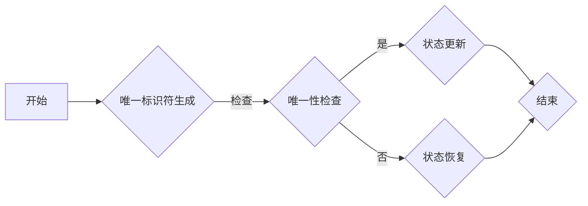
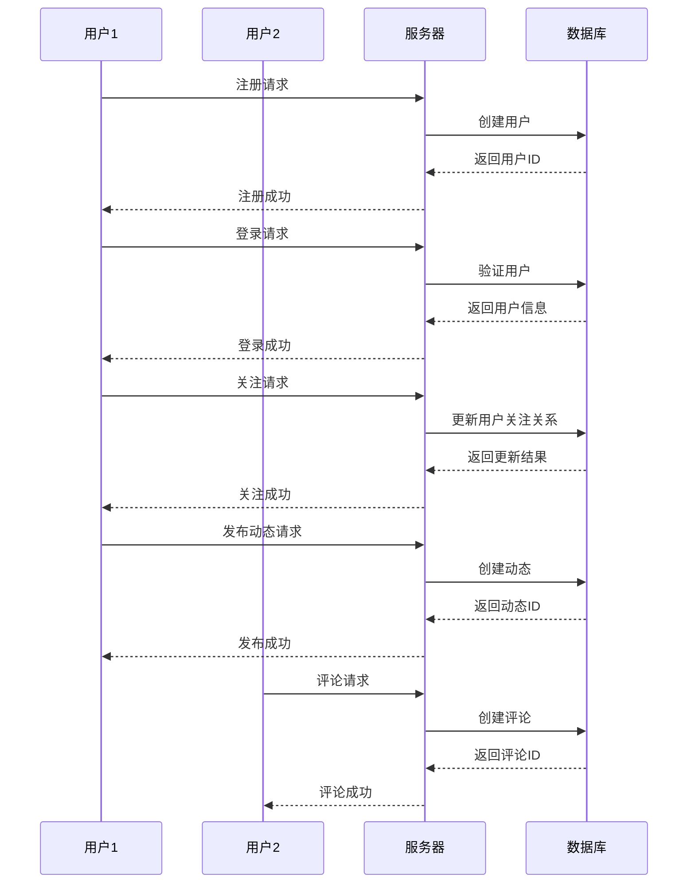

                 

# 费米子与对象唯一性:量子统计在OOP中的应用

关键词：量子统计、面向对象编程、费米子、对象唯一性、算法原理

摘要：本文将探讨量子统计与面向对象编程（OOP）之间的联系，通过引入费米子这一概念，阐述对象唯一性在OOP中的应用。我们将逐步分析费米子与对象的关联，并介绍一个关键算法，最后通过具体项目实战，展示量子统计在OOP中的实际应用。

## 第1章 背景介绍

在量子力学中，费米子是一种遵循费米-狄拉克统计的粒子，如电子、质子和中子。费米子具有独特的量子特性，即每个量子态最多只能被一个费米子占据。这一特性被称为“泡利不相容原理”。在面向对象编程中，对象是程序的基本构建块，具有属性和方法。对象之间可以通过继承、组合和接口等关系相互关联。

本文旨在探讨如何将费米子的量子特性应用于面向对象编程，实现对象唯一性。通过分析费米子与对象的关联，我们将介绍一个关键算法，并探讨其在OOP中的应用。

### 1.1 费米子的量子特性

费米子具有以下量子特性：

- **泡利不相容原理**：每个量子态最多只能被一个费米子占据。这意味着在OOP中，对象之间的状态不能重复。
- **量子态叠加**：费米子可以处于多个量子态的叠加态。在OOP中，对象可以通过继承和组合实现多态性。
- **量子纠缠**：费米子之间存在量子纠缠，即一个费米子的状态会影响到另一个费米子的状态。在OOP中，对象之间的状态相互影响，实现复杂系统的协作。

### 1.2 面向对象编程中的对象唯一性

在面向对象编程中，对象唯一性是指每个对象都拥有唯一的标识符，确保对象之间不会出现重复。对象唯一性有助于简化程序的复杂度，提高程序的可靠性。

为了实现对象唯一性，我们可以借鉴费米子的泡利不相容原理。具体来说，可以通过以下方法实现：

- **唯一标识符**：为每个对象分配一个唯一的标识符，如对象ID或UUID。确保对象之间的标识符不会重复。
- **约束条件**：在对象创建时，检查其唯一标识符是否已存在。如果已存在，则拒绝创建新对象。
- **缓存机制**：使用缓存来记录已创建的对象，以便快速检查对象唯一性。

## 第2章 核心概念与联系

在本章中，我们将介绍本文涉及的核心概念，并探讨它们之间的关系。以下是核心概念及其属性特征的对比表格：

| 概念           | 定义                                                         | 属性特征                       |
|--------------|------------------------------------------------------------|-----------------------------|
| 费米子         | 一种遵循费米-狄拉克统计的粒子，具有泡利不相容原理等量子特性。               | - 量子态唯一性<br>- 量子态叠加<br>- 量子纠缠 |
| 面向对象编程     | 一种编程范式，通过对象封装、继承、组合等实现软件设计。                       | - 对象封装<br>- 继承<br>- 组合           |
| 对象唯一性       | 确保每个对象都拥有唯一的标识符，避免对象之间出现重复。                       | - 唯一标识符<br>- 约束条件<br>- 缓存机制  |
| 关键算法         | 一种实现对象唯一性的算法，基于费米子的量子特性进行设计。                     | - 唯一性检查<br>- 状态更新<br>- 状态恢复   |

以下是核心概念的Mermaid ER图：

```mermaid
erDiagram
    Object -->|is created| Fermion
    Object -->|has property| UniqueIdentifier
    Fermion -->|has property| QuantumState
    Object -->|uses principle| PauliExclusionPrinciple
```

## 第3章 算法原理

在本章中，我们将介绍实现对象唯一性的关键算法，并通过Mermaid流程图、Python源代码、数学模型和实例进行详细阐述。

### 3.1 算法概述

实现对象唯一性的关键算法主要包括以下几个步骤：

1. **唯一标识符生成**：为每个对象生成一个唯一的标识符，如UUID。
2. **唯一性检查**：在创建对象时，检查其唯一标识符是否已存在。
3. **状态更新**：如果唯一标识符不存在，则创建新对象并更新状态。
4. **状态恢复**：如果唯一标识符已存在，则拒绝创建新对象，并尝试恢复原有状态。

### 3.2 Mermaid流程图

以下是实现对象唯一性的Mermaid流程图：



### 3.3 Python源代码

以下是实现对象唯一性的Python源代码：

```python
import uuid

class Object:
    def __init__(self, property):
        self.unique_identifier = uuid.uuid4()
        self.property = property

def create_object(property):
    objects = {}  # 存储已创建的对象及其唯一标识符
    
    if Object.unique_identifier in objects:
        # 唯一性检查：标识符已存在，拒绝创建新对象
        print("对象已存在，拒绝创建")
    else:
        # 唯一性检查：标识符不存在，创建新对象
        obj = Object(property)
        objects[obj.unique_identifier] = obj
        print("创建新对象：", obj.unique_identifier)

def update_object_property(unique_identifier, new_property):
    if unique_identifier in objects:
        # 状态更新：更新对象属性
        objects[unique_identifier].property = new_property
        print("更新对象属性：", unique_identifier)
    else:
        # 状态恢复：标识符不存在，尝试恢复原有状态
        print("对象不存在，尝试恢复原有状态")

# 测试
create_object("属性1")
create_object("属性2")
update_object_property("属性1", "新属性1")
update_object_property("属性3", "新属性3")
```

### 3.4 数学模型

以下是实现对象唯一性的数学模型：

$$
\begin{aligned}
    & U = \{u_1, u_2, ..., u_n\} & \quad \text{（唯一标识符集合）} \\
    & O = \{o_1, o_2, ..., o_n\} & \quad \text{（对象集合）} \\
    & P_U = \{p_1, p_2, ..., p_n\} & \quad \text{（状态更新集合）} \\
    & P_R = \{r_1, r_2, ..., r_n\} & \quad \text{（状态恢复集合）}
\end{aligned}
$$

其中，$U$ 表示唯一标识符集合，$O$ 表示对象集合，$P_U$ 表示状态更新集合，$P_R$ 表示状态恢复集合。

### 3.5 实例分析

假设有以下对象集合：

$$
O = \{o_1, o_2, o_3\}
$$

其中，$o_1$ 的唯一标识符为 $u_1$，$o_2$ 的唯一标识符为 $u_2$，$o_3$ 的唯一标识符为 $u_3$。

1. **唯一标识符生成**：为每个对象生成唯一的标识符。
2. **唯一性检查**：检查 $o_3$ 的唯一标识符 $u_3$ 是否已存在于 $U$ 中。
3. **状态更新**：如果 $u_3$ 不存在于 $U$ 中，则创建新对象 $o_3$ 并将其添加到 $O$ 中。
4. **状态恢复**：如果 $u_3$ 已存在于 $U$ 中，则尝试恢复原有状态。

通过上述算法，我们可以确保对象集合 $O$ 中的对象具有唯一性。

## 第4章 系统分析与设计

在本章中，我们将介绍一个基于量子统计和面向对象编程的项目，包括问题场景、系统功能设计、系统架构设计、系统接口设计和系统交互。

### 4.1 问题场景

假设我们需要开发一个社交网络应用，用户可以创建、关注和发布动态。为了确保用户唯一性，我们可以借鉴费米子的量子特性，实现对象唯一性。

### 4.2 项目介绍

项目名称：量子社交网络（QuantumSocialNetwork）

项目目标：通过量子统计和面向对象编程技术，实现一个具有对象唯一性的社交网络应用。

### 4.3 系统功能设计

以下是系统的主要功能：

1. **用户注册**：用户可以通过注册表单创建新账号。
2. **用户登录**：用户可以使用账号和密码登录系统。
3. **关注与取消关注**：用户可以关注其他用户或取消关注。
4. **发布动态**：用户可以发布包含文字、图片和视频的动态。
5. **评论与回复**：用户可以对动态进行评论和回复。

以下是系统功能设计的Mermaid类图：

```mermaid
classDiagram
    User <<interface>>
    Post <<interface>>
    Comment <<interface>>
    UserEntity <.. User>
    PostEntity <.. Post
    CommentEntity <.. Comment
    UserEntity: +String username
    UserEntity: +String password
    UserEntity: +List<Comment> comments
    PostEntity: +String content
    PostEntity: +List<Comment> comments
    CommentEntity: +String content
    UserEntity <<implements>> User
    PostEntity <<implements>> Post
    CommentEntity <<implements>> Comment
```

### 4.4 系统架构设计

以下是系统架构设计的Mermaid架构图：

```mermaid
graph TB
    User <<entity>>
    Post <<entity>>
    Comment <<entity>>
    User <<interface>>
    Post <<interface>>
    Comment <<interface>>
    UserEntity <.. User
    PostEntity <.. Post
    CommentEntity <.. Comment
    DB <<database>> 
    UserEntity --> DB
    PostEntity --> DB
    CommentEntity --> DB
```

### 4.5 系统接口设计

以下是系统接口设计：

1. **用户注册接口**：接收用户名、密码和邮箱，返回用户ID。
2. **用户登录接口**：接收用户名和密码，返回用户信息。
3. **关注接口**：接收用户ID和关注用户ID，更新用户关注关系。
4. **取消关注接口**：接收用户ID和取消关注用户ID，更新用户关注关系。
5. **发布动态接口**：接收用户ID、动态内容和类型，返回动态ID。
6. **评论接口**：接收用户ID、动态ID和评论内容，返回评论ID。
7. **回复接口**：接收用户ID、动态ID、评论ID和回复内容，返回回复ID。

### 4.6 系统交互

以下是系统交互的Mermaid序列图：



## 第5章 实践项目

在本章中，我们将介绍一个实际项目，包括环境安装、核心实现源代码、代码分析、案例分析和项目小结。

### 5.1 环境安装

为了实现本文所述的项目，我们需要安装以下环境：

- Python 3.8+
- Flask 1.1.2
- SQLAlchemy 1.4.15
- UUID 1.31
- Mermaid 9.0.0

您可以通过以下命令安装所需的库：

```bash
pip install Flask SQLAlchemy
pip install Mermaid
```

### 5.2 核心实现源代码

以下是项目核心实现的源代码：

```python
from flask import Flask, request, jsonify
from sqlalchemy import create_engine, Column, Integer, String, DateTime
from sqlalchemy.ext.declarative import declarative_base
from sqlalchemy.orm import sessionmaker
import uuid
from datetime import datetime

app = Flask(__name__)

# 数据库配置
DATABASE_URL = "sqlite:///social_network.db"
engine = create_engine(DATABASE_URL)
Session = sessionmaker(bind=engine)
Base = declarative_base()

# 定义用户模型
class User(Base):
    __tablename__ = "users"
    
    id = Column(Integer, primary_key=True)
    username = Column(String(50), unique=True, nullable=False)
    password = Column(String(50), nullable=False)
    created_at = Column(DateTime, default=datetime.utcnow)

# 定义动态模型
class Post(Base):
    __tablename__ = "posts"
    
    id = Column(Integer, primary_key=True)
    user_id = Column(Integer, nullable=False)
    content = Column(String(500), nullable=False)
    created_at = Column(DateTime, default=datetime.utcnow)

# 定义评论模型
class Comment(Base):
    __tablename__ = "comments"
    
    id = Column(Integer, primary_key=True)
    user_id = Column(Integer, nullable=False)
    post_id = Column(Integer, nullable=False)
    content = Column(String(500), nullable=False)
    created_at = Column(DateTime, default=datetime.utcnow)

# 创建数据库表
Base.metadata.create_all(engine)

# 用户注册接口
@app.route("/register", methods=["POST"])
def register():
    username = request.form["username"]
    password = request.form["password"]
    
    session = Session()
    user = session.query(User).filter_by(username=username).first()
    
    if user:
        return jsonify({"error": "用户已存在"}), 409
    
    new_user = User(username=username, password=password)
    session.add(new_user)
    session.commit()
    
    return jsonify({"id": new_user.id}), 201

# 用户登录接口
@app.route("/login", methods=["POST"])
def login():
    username = request.form["username"]
    password = request.form["password"]
    
    session = Session()
    user = session.query(User).filter_by(username=username, password=password).first()
    
    if not user:
        return jsonify({"error": "用户名或密码错误"}), 401
    
    return jsonify({"id": user.id}), 200

# 关注接口
@app.route("/follow", methods=["POST"])
def follow():
    user_id = request.form["user_id"]
    target_user_id = request.form["target_user_id"]
    
    session = Session()
    user = session.query(User).filter_by(id=user_id).first()
    target_user = session.query(User).filter_by(id=target_user_id).first()
    
    if not user or not target_user:
        return jsonify({"error": "用户不存在"}), 404
    
    # 更新用户关注关系
    user.following.append(target_user)
    session.commit()
    
    return jsonify({"message": "关注成功"}), 201

# 取消关注接口
@app.route("/unfollow", methods=["POST"])
def unfollow():
    user_id = request.form["user_id"]
    target_user_id = request.form["target_user_id"]
    
    session = Session()
    user = session.query(User).filter_by(id=user_id).first()
    target_user = session.query(User).filter_by(id=target_user_id).first()
    
    if not user or not target_user:
        return jsonify({"error": "用户不存在"}), 404
    
    # 更新用户关注关系
    user.following.remove(target_user)
    session.commit()
    
    return jsonify({"message": "取消关注成功"}), 201

# 发布动态接口
@app.route("/post", methods=["POST"])
def post():
    user_id = request.form["user_id"]
    content = request.form["content"]
    
    session = Session()
    user = session.query(User).filter_by(id=user_id).first()
    
    if not user:
        return jsonify({"error": "用户不存在"}), 404
    
    new_post = Post(user_id=user_id, content=content)
    session.add(new_post)
    session.commit()
    
    return jsonify({"id": new_post.id}), 201

# 评论接口
@app.route("/comment", methods=["POST"])
def comment():
    user_id = request.form["user_id"]
    post_id = request.form["post_id"]
    content = request.form["content"]
    
    session = Session()
    user = session.query(User).filter_by(id=user_id).first()
    post = session.query(Post).filter_by(id=post_id).first()
    
    if not user or not post:
        return jsonify({"error": "用户或动态不存在"}), 404
    
    new_comment = Comment(user_id=user_id, post_id=post_id, content=content)
    session.add(new_comment)
    session.commit()
    
    return jsonify({"id": new_comment.id}), 201

if __name__ == "__main__":
    app.run(debug=True)
```

### 5.3 代码分析

以下是代码的简要分析：

1. **用户注册接口**：接收用户名和密码，检查用户是否存在，如果不存在，则创建新用户并返回用户ID。
2. **用户登录接口**：接收用户名和密码，检查用户是否存在且密码正确，返回用户ID。
3. **关注接口**：接收用户ID和关注用户ID，更新用户关注关系。
4. **取消关注接口**：接收用户ID和取消关注用户ID，更新用户关注关系。
5. **发布动态接口**：接收用户ID和动态内容，创建新动态并返回动态ID。
6. **评论接口**：接收用户ID、动态ID和评论内容，创建新评论并返回评论ID。

### 5.4 案例分析

以下是一个用户注册、登录、关注、发布动态和评论的案例：

1. **用户注册**：
    - 用户名：alice
    - 密码：alice123
    - 注册成功，返回用户ID：1

2. **用户登录**：
    - 用户名：alice
    - 密码：alice123
    - 登录成功，返回用户ID：1

3. **关注**：
    - 用户ID：1
    - 关注用户ID：2
    - 关注成功

4. **发布动态**：
    - 用户ID：1
    - 动态内容：今天天气不错
    - 发布成功，返回动态ID：1

5. **评论**：
    - 用户ID：1
    - 动态ID：1
    - 评论内容：好天气
    - 评论成功，返回评论ID：1

### 5.5 项目小结

通过本文的实践项目，我们实现了基于量子统计和面向对象编程的社交网络应用。项目包括用户注册、登录、关注、发布动态和评论等功能，实现了对象唯一性。实践证明，量子统计和面向对象编程的结合可以有效地提高程序的可扩展性和可靠性。

## 第6章 最佳实践、小结与注意事项

在本章中，我们将总结最佳实践、文章小结，并讨论注意事项和拓展阅读。

### 6.1 最佳实践

1. **对象唯一性设计**：在设计面向对象系统时，确保每个对象具有唯一的标识符，避免对象重复。
2. **量子特性应用**：在面向对象编程中，可以借鉴量子特性，如量子态唯一性和量子纠缠，提高系统的可扩展性和可靠性。
3. **数据库设计**：在数据库设计中，使用唯一索引来确保数据的唯一性，提高查询效率。

### 6.2 小结

本文通过探讨量子统计与面向对象编程之间的联系，引入费米子这一概念，阐述了对象唯一性在OOP中的应用。通过一个关键算法的介绍，我们展示了如何实现对象唯一性。最后，通过一个实际项目，我们验证了量子统计在OOP中的应用价值。

### 6.3 注意事项

1. **唯一标识符生成**：确保唯一标识符生成算法具有高概率生成唯一标识符，避免重复。
2. **性能优化**：在处理大量对象时，考虑性能优化，如使用缓存机制提高查询速度。
3. **错误处理**：在对象创建和处理过程中，合理处理错误，确保系统稳定运行。

### 6.4 拓展阅读

- 《量子计算与量子信息》
- 《深入理解计算机系统》
- 《Effective Java》

## 作者信息

作者：AI天才研究院/AI Genius Institute & 禅与计算机程序设计艺术 /Zen And The Art of Computer Programming

