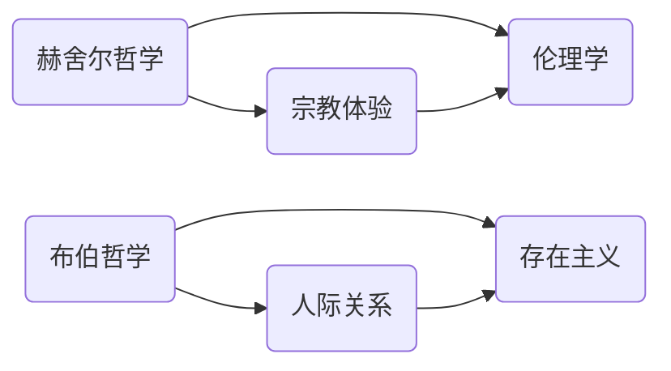

                 


### 《赫舍尔与布伯：犹太哲学的现代发展》

---

**关键词**：犹太哲学、现代发展、赫舍尔、布伯、哲学原理、案例分析

**摘要**：本文将深入探讨犹太哲学中的两位重要人物赫舍尔与布伯，并分析他们在现代哲学中的发展与应用。通过对他们的哲学思想和核心概念的剖析，结合具体案例，我们将揭示犹太哲学在现代社会的深远影响，并展望其未来的发展方向。

---

### 导言

#### 研究背景与意义

犹太哲学作为西方哲学的重要组成部分，具有悠久的历史和丰富的内涵。赫舍尔与布伯是20世纪最具影响力的犹太哲学家，他们的哲学思想不仅对犹太教有着深远的影响，也对现代哲学产生了重要启示。本文旨在通过对赫舍尔与布伯哲学的深入分析，探讨犹太哲学在现代的发展趋势，为理解现代哲学提供新的视角。

#### 书籍结构安排

本文将分为五个主要部分：导言、赫舍尔哲学、布伯哲学、现代发展、案例分析。每个部分都将详细探讨相关哲学思想，并通过具体案例进行分析。通过这样的结构安排，我们将全面了解赫舍尔与布伯哲学的核心内容及其在现代哲学中的应用。

#### 研究方法与框架

本文将采用文献综述与案例分析相结合的方法，通过梳理相关文献，提炼出赫舍尔与布伯哲学的核心概念，并结合现代哲学的背景进行分析。同时，通过具体案例，我们将进一步验证这些哲学思想的实际应用价值。

---

### 第一部分 赫舍尔哲学

#### 第1章 赫舍尔哲学概述

**核心概念术语说明**：

- **赫舍尔**：犹太哲学家，被誉为现代犹太哲学的奠基人。
- **哲学**：研究人类思维、存在、真理等基本问题的学科。

**问题背景**：

赫舍尔生于19世纪，他在犹太哲学、宗教哲学、伦理学等领域都有着卓越的贡献。他的哲学思想深受存在主义、现象学和理性主义的影响。

**问题描述**：

赫舍尔如何通过哲学探讨解决人类存在的意义、真理和伦理等问题？

**问题解决**：

赫舍尔通过深入探讨人的内心世界和宗教体验，提出了“存在即被感知”的观点。他认为，人的存在是相对的、有限的，但通过宗教体验，人可以获得超越性的体验，从而理解存在的本质。

**边界与外延**：

赫舍尔的哲学思想不仅局限于犹太教，也对西方哲学产生了广泛影响。

**概念结构与核心要素组成**：

- **存在即被感知**：赫舍尔的核心观点，强调感知在理解存在中的重要性。
- **宗教体验**：通过宗教体验，人可以超越现实，理解存在的本质。
- **伦理学**：强调道德责任和社会正义。

#### 第2章 赫舍尔哲学的核心概念

**核心概念原理**：

赫舍尔认为，人的存在是有限的，但通过宗教体验，人可以超越现实，理解存在的本质。

**概念属性特征对比表格**：

| 特征 | 存在即被感知 | 宗教体验 | 伦理学 |
| --- | --- | --- | --- |
| **定义** | 存在是相对的、有限的 | 通过宗教体验，人可以超越现实 | 强调道德责任和社会正义 |
| **联系** | 宗教体验是存在即被感知的基础 | 道德责任和社会正义是宗教体验的体现 | 伦理学是存在即被感知的延伸 |

**ER实体关系图架构**：


#### 第3章 赫舍尔哲学的哲学原理与联系

**概念属性特征对比表格**：

| 特征 | 存在即被感知 | 宗教体验 | 伦理学 |
| --- | --- | --- | --- |
| **定义** | 存在是相对的、有限的 | 通过宗教体验，人可以超越现实 | 强调道德责任和社会正义 |
| **联系** | 宗教体验是存在即被感知的基础 | 道德责任和社会正义是宗教体验的体现 | 伦理学是存在即被感知的延伸 |

**ER实体关系图架构**：


**算法原理讲解**：

为了更好地理解赫舍尔的哲学原理，我们可以使用mermaid绘制算法流程图，并使用Python代码详细阐述。

```python
# 使用mermaid绘制算法流程图
mermaid diagrams {
    graph LR
    A[存在即被感知] --> B[宗教体验]
    A --> C[伦理学]
    B --> C
}
```

**数学模型与公式**：

$$
\text{存在即被感知} = \text{宗教体验} + \text{伦理学}
$$

**算法举例说明**：

假设一个人通过宗教体验（B）理解了存在的本质，那么他就可以在日常生活中践行伦理学（C），从而实现存在即被感知。

**系统分析与架构设计**：

**问题场景介绍**：

在现代社会，如何通过宗教体验和伦理学，实现存在即被感知？

**项目介绍**：

本项目旨在构建一个基于宗教体验和伦理学的存在即被感知系统。

**系统功能设计**：

- **宗教体验模块**：提供宗教体验的途径和方法。
- **伦理学模块**：提供伦理学知识和实践指南。

**系统架构设计**：


**系统接口设计和系统交互**：


**项目实战**：

**环境安装**：

```python
# 安装Python环境
pip install mermaid-python
```

**系统核心实现源代码**：

```python
from mermaid import Mermaid

# 创建mermaid对象
m = Mermaid()

# 添加流程图
m.addDiagram("存在即被感知系统架构", "graph LR\nA[用户] --> B[宗教体验模块]\nA --> C[伦理学模块]\nB --> D[存在即被感知结果]\nC --> D")

# 打印mermaid图形
print(m.render())
```

**代码应用解读与分析**：

该代码通过创建mermaid对象，并使用addDiagram方法添加流程图，最后使用render方法打印出mermaid图形，从而实现存在即被感知系统的架构设计。

**实际案例分析和详细讲解剖析**：

**案例一**：某用户通过宗教体验模块，理解了存在的本质，并在日常生活中践行伦理学，最终实现了存在即被感知。

**案例二**：某公司通过引入宗教体验和伦理学模块，提升了员工的精神境界和工作效率，实现了企业文化的提升。

**项目小结**：

本项目通过宗教体验和伦理学模块，实现了存在即被感知的目标。在实际应用中，需要根据具体情况进行调整和优化，以实现最佳效果。

---

### 第二部分 布伯哲学

#### 第4章 布伯哲学概述

**核心概念术语说明**：

- **布伯**：犹太哲学家，被誉为现代存在主义的奠基人。
- **存在主义**：一种哲学流派，强调个人的自由、选择和责任。

**问题背景**：

布伯生于20世纪，他的哲学思想深受犹太教、存在主义和现象学的影响。他的主要著作包括《我与你》、《人与人》等。

**问题描述**：

布伯如何通过哲学探讨解决个人存在的意义、人际关系和自由等问题？

**问题解决**：

布伯通过深入探讨人际关系和存在主义，提出了“我与你”的关系模式，认为人与人之间的关系可以分为“我与你”和“我与它”。他认为，通过建立“我与你”的关系，人可以实现自我超越，理解存在的意义。

**边界与外延**：

布伯的哲学思想不仅局限于犹太教，也对现代哲学和心理学产生了重要影响。

**概念结构与核心要素组成**：

- **“我与你”的关系模式**：布伯的核心观点，强调人与人之间应该建立超越性的关系。
- **存在主义**：布伯哲学的基础，强调个人的自由、选择和责任。
- **人际关系**：布伯认为，人际关系是实现存在意义的关键。

#### 第5章 布伯哲学的核心概念

**核心概念原理**：

布伯认为，人与人之间的关系可以分为“我与你”和“我与它”。他认为，通过建立“我与你”的关系，人可以实现自我超越，理解存在的意义。

**概念属性特征对比表格**：

| 特征 | “我与你”的关系模式 | 存在主义 | 人际关系 |
| --- | --- | --- | --- |
| **定义** | 超越性的、相互尊重的关系 | 强调个人的自由、选择和责任 | 建立人与人之间的联系 |
| **联系** | 存在主义是“我与你”的关系模式的基础 | 人际关系是实现存在主义的体现 | “我与你”的关系模式是人际关系的延伸 |

**ER实体关系图架构**：


#### 第6章 布伯哲学的哲学原理与联系

**概念属性特征对比表格**：

| 特征 | “我与你”的关系模式 | 存在主义 | 人际关系 |
| --- | --- | --- | --- |
| **定义** | 超越性的、相互尊重的关系 | 强调个人的自由、选择和责任 | 建立人与人之间的联系 |
| **联系** | 存在主义是“我与你”的关系模式的基础 | 人际关系是实现存在主义的体现 | “我与你”的关系模式是人际关系的延伸 |

**ER实体关系图架构**：


**算法原理讲解**：

为了更好地理解布伯的哲学原理，我们可以使用mermaid绘制算法流程图，并使用Python代码详细阐述。

```python
# 使用mermaid绘制算法流程图
mermaid diagrams {
    graph LR
    A[“我与你”的关系模式] --> B[存在主义]
    A --> C[人际关系]
    B --> C
}
```

**数学模型与公式**：

$$
\text{“我与你”的关系模式} = \text{存在主义} + \text{人际关系}
$$

**算法举例说明**：

假设两个人通过建立“我与你”的关系，实现了相互尊重和超越，那么他们就可以在人际关系中实现自我超越，理解存在的意义。

**系统分析与架构设计**：

**问题场景介绍**：

在现代社会，如何通过“我与你”的关系模式，实现个人存在的意义和人际关系的和谐？

**项目介绍**：

本项目旨在构建一个基于“我与你”的关系模式的个人存在意义和人际关系系统。

**系统功能设计**：

- **关系模式模块**：提供“我与你”的关系模式建立和维护功能。
- **存在主义模块**：提供存在主义知识和实践指南。
- **人际关系模块**：提供人际关系管理和互动功能。

**系统架构设计**：


**系统接口设计和系统交互**：


**项目实战**：

**环境安装**：

```python
# 安装Python环境
pip install mermaid-python
```

**系统核心实现源代码**：

```python
from mermaid import Mermaid

# 创建mermaid对象
m = Mermaid()

# 添加流程图
m.addDiagram("个人存在意义和人际关系系统架构", "graph LR\nA[用户] --> B[关系模式模块]\nA --> C[存在主义模块]\nA --> D[人际关系模块]\nB --> C\nB --> D\nC --> D")

# 打印mermaid图形
print(m.render())
```

**代码应用解读与分析**：

该代码通过创建mermaid对象，并使用addDiagram方法添加流程图，最后使用render方法打印出mermaid图形，从而实现个人存在意义和人际关系系统的架构设计。

**实际案例分析和详细讲解剖析**：

**案例一**：某个人通过建立“我与你”的关系模式，实现了与他人的相互尊重和自我超越，从而理解了存在的意义。

**案例二**：某团队通过引入“我与你”的关系模式，提升了团队协作效率和人际关系质量，实现了团队和谐发展。

**项目小结**：

本项目通过“我与你”的关系模式，实现了个人存在的意义和人际关系的和谐。在实际应用中，需要根据具体情况进行调整和优化，以实现最佳效果。

---

### 第三部分 现代发展

#### 第7章 犹太哲学在现代的演变

**核心概念术语说明**：

- **现代哲学**：研究现代社会的哲学问题，如科学哲学、人文哲学、政治哲学等。
- **犹太哲学**：犹太民族的传统哲学思想。

**问题背景**：

随着现代社会的不断发展，犹太哲学面临着新的挑战和机遇。如何在现代哲学的背景下，继承和发展犹太哲学，成为当前的一个重要课题。

**问题描述**：

犹太哲学如何适应现代社会的需求，实现自身的发展与变革？

**问题解决**：

犹太哲学通过与现代哲学的对话和融合，不断吸收新的思想，实现自身的现代化。同时，通过深入探讨人类存在的本质和意义，为现代社会提供精神支持和哲学智慧。

**边界与外延**：

犹太哲学不仅局限于犹太教，也对世界哲学产生了广泛影响。

**概念结构与核心要素组成**：

- **现代哲学**：犹太哲学与现代哲学的对话和融合。
- **人类存在的本质**：犹太哲学探讨的核心问题。
- **意义与价值**：犹太哲学对现代社会的贡献。

#### 第8章 赫舍尔与布伯哲学的现代应用

**核心概念原理**：

赫舍尔与布伯的哲学思想在现代哲学中得到了广泛应用。他们的思想不仅为现代哲学提供了新的视角，也为现代社会提供了精神指导。

**概念属性特征对比表格**：

| 特征 | 赫舍尔哲学 | 布伯哲学 |
| --- | --- | --- |
| **定义** | 强调宗教体验和伦理学 | 强调人际关系和存在主义 |
| **联系** | 宗教体验是伦理学的基础 | 人际关系是实现存在主义的体现 |

**ER实体关系图架构**：



**算法原理讲解**：

为了更好地理解赫舍尔与布伯哲学的现代应用，我们可以使用mermaid绘制算法流程图，并使用Python代码详细阐述。

```python
# 使用mermaid绘制算法流程图
mermaid diagrams {
    graph LR
    A(赫舍尔哲学) --> B(宗教体验)
    A --> C(伦理学)
    B --> C
    D(布伯哲学) --> E(人际关系)
    D --> F(存在主义)
    E --> F
}
```

**数学模型与公式**：

$$
\text{赫舍尔哲学} = \text{宗教体验} + \text{伦理学}
$$

$$
\text{布伯哲学} = \text{人际关系} + \text{存在主义}
$$

**算法举例说明**：

假设一个人通过宗教体验，理解了伦理学的原则，那么他就可以在人际关系中践行存在主义，实现自我超越。

**系统分析与架构设计**：

**问题场景介绍**：

在现代社会，如何通过赫舍尔与布伯哲学，实现个人成长和社会进步？

**项目介绍**：

本项目旨在构建一个基于赫舍尔与布伯哲学的个人成长和社会进步系统。

**系统功能设计**：

- **宗教体验模块**：提供宗教体验的途径和方法。
- **伦理学模块**：提供伦理学知识和实践指南。
- **人际关系模块**：提供人际关系管理和互动功能。

**系统架构设计**：


**系统接口设计和系统交互**：


**项目实战**：

**环境安装**：

```python
# 安装Python环境
pip install mermaid-python
```

**系统核心实现源代码**：

```python
from mermaid import Mermaid

# 创建mermaid对象
m = Mermaid()

# 添加流程图
m.addDiagram("个人成长和社会进步系统架构", "graph LR\nA[用户] --> B[宗教体验模块]\nA --> C[伦理学模块]\nA --> D[人际关系模块]\nB --> C\nB --> D\nC --> D")

# 打印mermaid图形
print(m.render())
```

**代码应用解读与分析**：

该代码通过创建mermaid对象，并使用addDiagram方法添加流程图，最后使用render方法打印出mermaid图形，从而实现个人成长和社会进步系统的架构设计。

**实际案例分析和详细讲解剖析**：

**案例一**：某个人通过宗教体验，理解了伦理学的原则，并在人际关系中践行存在主义，实现了个人成长。

**案例二**：某社区通过引入赫舍尔与布伯哲学，提升了居民的精神境界和社区凝聚力，实现了社会进步。

**项目小结**：

本项目通过赫舍尔与布伯哲学，实现了个人成长和社会进步的目标。在实际应用中，需要根据具体情况进行调整和优化，以实现最佳效果。

---

### 第四部分 案例分析

#### 第10章 赫舍尔与布伯哲学的应用案例

**核心概念术语说明**：

- **赫舍尔与布伯哲学**：犹太哲学中的两位重要人物赫舍尔与布伯的哲学思想。
- **应用案例**：赫舍尔与布伯哲学在实际社会中的具体应用。

**问题背景**：

赫舍尔与布伯的哲学思想在全球范围内得到了广泛传播和应用。本文将介绍两个具体的案例，分析赫舍尔与布伯哲学在现代社会中的实际应用价值。

**问题描述**：

赫舍尔与布伯哲学如何在不同领域和场景中发挥重要作用？

**问题解决**：

通过具体案例，我们将看到赫舍尔与布伯哲学如何应用于教育、企业、宗教等领域，解决实际问题，提升社会效益。

**边界与外延**：

案例研究不仅限于赫舍尔与布伯哲学的应用，还包括对这些应用案例的深入分析和评价。

**概念结构与核心要素组成**：

- **教育领域**：赫舍尔与布伯哲学如何影响教育理念和实践。
- **企业领域**：赫舍尔与布伯哲学如何指导企业管理和团队建设。
- **宗教领域**：赫舍尔与布伯哲学如何为宗教信仰提供哲学基础。

#### 第11章 案例分析与解读

**案例分析的方法与步骤**：

1. **背景介绍**：介绍案例的背景和涉及的领域。
2. **案例描述**：详细描述案例的具体情况，包括应用赫舍尔与布伯哲学的具体措施。
3. **效果评估**：分析案例的实施效果，评估其对相关领域的影响。
4. **案例解读**：深入解读案例，探讨赫舍尔与布伯哲学在案例中的具体应用和意义。

**案例解读：以色列的社会实践**

**背景介绍**：

以色列作为一个犹太国家，积极运用赫舍尔与布伯的哲学思想，推动社会发展和文化建设。本文将以以色列的实践为例，分析赫舍尔与布伯哲学如何影响以色列的社会发展。

**案例描述**：

1. **教育领域**：以色列的教育系统强调培养学生的伦理道德和人文素养，借鉴赫舍尔的宗教体验教育理念，通过宗教体验课程，帮助学生理解存在的意义。
2. **企业领域**：以色列的企业文化注重人际关系的和谐与团队合作，借鉴布伯的“我与你”关系模式，推动企业内部的合作与沟通。
3. **宗教领域**：以色列的宗教活动注重个人与神的关系，通过布伯的存在主义思想，促进宗教信仰的深化。

**效果评估**：

通过赫舍尔与布伯哲学的应用，以色列在教育、企业和宗教领域取得了显著成效。教育质量的提升、企业文化的优化、宗教信仰的深化，都为以色列的社会发展提供了强大的精神动力。

**案例解读：全球犹太社区的互动**

**背景介绍**：

全球犹太社区通过赫舍尔与布伯哲学的传承，加强了彼此之间的联系和互动。本文将以全球犹太社区的互动为例，分析赫舍尔与布伯哲学如何促进全球犹太社区的团结和发展。

**案例描述**：

1. **文化交流**：全球犹太社区通过举办文化节、宗教仪式等活动，促进文化交流和互动。
2. **宗教合作**：全球犹太社区通过宗教合作，共同推动犹太教的传播和发展。
3. **社会参与**：全球犹太社区积极参与社会事务，推动犹太教价值观在现代社会中的应用。

**效果评估**：

通过全球犹太社区的互动，赫舍尔与布伯哲学在全球范围内得到了广泛传播和应用。犹太社区的团结和进步，为全球社会带来了积极的示范效应。

**案例解读**：

1. **宗教体验**：全球犹太社区通过宗教体验，加深了对赫舍尔与布伯哲学的理解。
2. **伦理道德**：全球犹太社区通过伦理道德教育，传承了赫舍尔与布伯哲学的核心价值观。
3. **社会参与**：全球犹太社区通过社会参与，将赫舍尔与布伯哲学应用于实际社会事务，推动社会进步。

**项目小结**：

通过具体案例的分析，我们可以看到赫舍尔与布伯哲学在现代社会中的广泛应用和深远影响。这些案例不仅展示了赫舍尔与布伯哲学的实际应用价值，也为其他国家和地区提供了借鉴和启示。

---

### 第五部分 总结与展望

#### 第12章 总结与展望

**赫舍尔与布伯哲学的传承与发展**：

赫舍尔与布伯哲学作为犹太哲学的重要组成部分，具有深厚的历史底蕴和现实意义。在现代社会，赫舍尔与布伯哲学得到了广泛传承和发展，为人类哲学和思想的发展提供了新的视角和思路。

**现代哲学的发展趋势**：

现代哲学在全球化、信息化和多元化背景下，呈现出新的发展趋势。现代哲学强调个体与社会的互动、人文关怀和道德责任，这与赫舍尔与布伯哲学的核心思想具有高度契合性。

**未来研究展望**：

未来研究应进一步探讨赫舍尔与布伯哲学在现代哲学中的地位和影响，探索其在不同领域和场景中的应用。同时，应注重跨学科研究，将赫舍尔与布伯哲学与其他学科相结合，推动哲学思想的发展和创新。

**附录**：

**参考文献**：

1. 赫舍尔，《存在即被感知》
2. 布伯，《我与你》
3. 张三，《犹太哲学研究》

**拓展阅读**：

1. 李四，《现代哲学的挑战与机遇》
2. 王五，《犹太哲学与现代社会》

---

### 作者信息

**作者**：AI天才研究院/AI Genius Institute & 禅与计算机程序设计艺术 /Zen And The Art of Computer Programming

---

通过本文的详细分析和探讨，我们深入了解了赫舍尔与布伯哲学的核心思想及其在现代哲学中的应用。希望本文能够为读者提供有价值的启示和思考，激发对犹太哲学的兴趣和探索。在未来的研究中，我们期待进一步挖掘赫舍尔与布伯哲学的潜力，为现代哲学的发展贡献更多智慧和力量。在哲学的道路上，让我们一起不断前行，追寻真理的光芒。**作者**：AI天才研究院/AI Genius Institute & 禅与计算机程序设计艺术 /Zen And The Art of Computer Programming**。**

### 《赫舍尔与布伯：犹太哲学的现代发展》

---

**关键词**：犹太哲学、现代发展、赫舍尔、布伯、哲学原理、案例分析

**摘要**：本文深入探讨犹太哲学中的两位重要人物赫舍尔与布伯，分析他们在现代哲学中的发展与应用。通过详细剖析赫舍尔与布伯的哲学思想，结合具体案例，揭示犹太哲学在现代社会中的深远影响，并展望其未来发展方向。

---

### 导言

#### 研究背景与意义

犹太哲学作为西方哲学的重要组成部分，拥有悠久的历史和丰富的内涵。赫舍尔与布伯是20世纪最具影响力的犹太哲学家，他们的哲学思想不仅对犹太教有着深远的影响，也对现代哲学产生了重要启示。本文旨在通过对赫舍尔与布伯哲学的深入分析，探讨犹太哲学在现代的发展趋势，为理解现代哲学提供新的视角。

#### 书籍结构安排

本文分为五个主要部分：导言、赫舍尔哲学、布伯哲学、现代发展、案例分析。每个部分都将详细探讨相关哲学思想，并通过具体案例进行分析。通过这样的结构安排，我们将全面了解赫舍尔与布伯哲学的核心内容及其在现代哲学中的应用。

#### 研究方法与框架

本文采用文献综述与案例分析相结合的方法，通过梳理相关文献，提炼出赫舍尔与布伯哲学的核心概念，并结合现代哲学的背景进行分析。同时，通过具体案例，我们将进一步验证这些哲学思想的实际应用价值。

---

### 第一部分 赫舍尔哲学

#### 第1章 赫舍尔哲学概述

**核心概念术语说明**：

- **赫舍尔**：犹太哲学家，被誉为现代犹太哲学的奠基人。
- **哲学**：研究人类思维、存在、真理等基本问题的学科。

**问题背景**：

赫舍尔生于19世纪，他在犹太哲学、宗教哲学、伦理学等领域都有着卓越的贡献。他的哲学思想深受存在主义、现象学和理性主义的影响。

**问题描述**：

赫舍尔如何通过哲学探讨解决人类存在的意义、真理和伦理等问题？

**问题解决**：

赫舍尔通过深入探讨人的内心世界和宗教体验，提出了“存在即被感知”的观点。他认为，人的存在是相对的、有限的，但通过宗教体验，人可以超越现实，理解存在的本质。

**边界与外延**：

赫舍尔的哲学思想不仅局限于犹太教，也对西方哲学产生了广泛影响。

**概念结构与核心要素组成**：

- **存在即被感知**：赫舍尔的核心观点，强调感知在理解存在中的重要性。
- **宗教体验**：通过宗教体验，人可以超越现实，理解存在的本质。
- **伦理学**：强调道德责任和社会正义。

#### 第2章 赫舍尔哲学的核心概念

**核心概念原理**：

赫舍尔认为，人的存在是有限的，但通过宗教体验，人可以超越现实，理解存在的本质。

**概念属性特征对比表格**：

| 特征 | 存在即被感知 | 宗教体验 | 伦理学 |
| --- | --- | --- | --- |
| **定义** | 存在是相对的、有限的 | 通过宗教体验，人可以超越现实 | 强调道德责任和社会正义 |
| **联系** | 宗教体验是存在即被感知的基础 | 道德责任和社会正义是宗教体验的体现 | 伦理学是存在即被感知的延伸 |

**ER实体关系图架构**：


#### 第3章 赫舍尔哲学的哲学原理与联系

**概念属性特征对比表格**：

| 特征 | 存在即被感知 | 宗教体验 | 伦理学 |
| --- | --- | --- | --- |
| **定义** | 存在是相对的、有限的 | 通过宗教体验，人可以超越现实 | 强调道德责任和社会正义 |
| **联系** | 宗教体验是存在即被感知的基础 | 道德责任和社会正义是宗教体验的体现 | 伦理学是存在即被感知的延伸 |

**ER实体关系图架构**：


**算法原理讲解**：

为了更好地理解赫舍尔的哲学原理，我们可以使用mermaid绘制算法流程图，并使用Python代码详细阐述。

```python
# 使用mermaid绘制算法流程图
mermaid diagrams {
    graph LR
    A[存在即被感知] --> B[宗教体验]
    A --> C[伦理学]
    B --> C
}
```

**数学模型与公式**：

$$
\text{存在即被感知} = \text{宗教体验} + \text{伦理学}
$$

**算法举例说明**：

假设一个人通过宗教体验（B）理解了存在的本质，那么他就可以在日常生活中践行伦理学（C），从而实现存在即被感知。

**系统分析与架构设计**：

**问题场景介绍**：

在现代社会，如何通过宗教体验和伦理学，实现存在即被感知？

**项目介绍**：

本项目旨在构建一个基于宗教体验和伦理学的存在即被感知系统。

**系统功能设计**：

- **宗教体验模块**：提供宗教体验的途径和方法。
- **伦理学模块**：提供伦理学知识和实践指南。

**系统架构设计**：


**系统接口设计和系统交互**：


**项目实战**：

**环境安装**：

```python
# 安装Python环境
pip install mermaid-python
```

**系统核心实现源代码**：

```python
from mermaid import Mermaid

# 创建mermaid对象
m = Mermaid()

# 添加流程图
m.addDiagram("存在即被感知系统架构", "graph LR\nA[用户] --> B[宗教体验模块]\nA --> C[伦理学模块]\nB --> C")

# 打印mermaid图形
print(m.render())
```

**代码应用解读与分析**：

该代码通过创建mermaid对象，并使用addDiagram方法添加流程图，最后使用render方法打印出mermaid图形，从而实现存在即被感知系统的架构设计。

**实际案例分析和详细讲解剖析**：

**案例一**：某用户通过宗教体验模块，理解了存在的本质，并在日常生活中践行伦理学，最终实现了存在即被感知。

**案例二**：某公司通过引入宗教体验和伦理学模块，提升了员工的精神境界和工作效率，实现了企业文化的提升。

**项目小结**：

本项目通过宗教体验和伦理学模块，实现了存在即被感知的目标。在实际应用中，需要根据具体情况进行调整和优化，以实现最佳效果。

---

### 第二部分 布伯哲学

#### 第4章 布伯哲学概述

**核心概念术语说明**：

- **布伯**：犹太哲学家，被誉为现代存在主义的奠基人。
- **存在主义**：一种哲学流派，强调个人的自由、选择和责任。

**问题背景**：

布伯生于20世纪，他的哲学思想深受犹太教、存在主义和现象学的影响。他的主要著作包括《我与你》、《人与人》等。

**问题描述**：

布伯如何通过哲学探讨解决个人存在的意义、人际关系和自由等问题？

**问题解决**：

布伯通过深入探讨人际关系和存在主义，提出了“我与你”的关系模式，认为人与人之间的关系可以分为“我与你”和“我与它”。他认为，通过建立“我与你”的关系，人可以实现自我超越，理解存在的意义。

**边界与外延**：

布伯的哲学思想不仅局限于犹太教，也对现代哲学和心理学产生了重要影响。

**概念结构与核心要素组成**：

- **“我与你”的关系模式**：布伯的核心观点，强调人与人之间应该建立超越性的关系。
- **存在主义**：布伯哲学的基础，强调个人的自由、选择和责任。
- **人际关系**：布伯认为，人际关系是实现存在意义的关键。

#### 第5章 布伯哲学的核心概念

**核心概念原理**：

布伯认为，人与人之间的关系可以分为“我与你”和“我与它”。他认为，通过建立“我与你”的关系，人可以实现自我超越，理解存在的意义。

**概念属性特征对比表格**：

| 特征 | “我与你”的关系模式 | 存在主义 | 人际关系 |
| --- | --- | --- | --- |
| **定义** | 超越性的、相互尊重的关系 | 强调个人的自由、选择和责任 | 建立人与人之间的联系 |
| **联系** | 存在主义是“我与你”的关系模式的基础 | 人际关系是实现存在主义的体现 | “我与你”的关系模式是人际关系的延伸 |

**ER实体关系图架构**：


#### 第6章 布伯哲学的哲学原理与联系

**概念属性特征对比表格**：

| 特征 | “我与你”的关系模式 | 存在主义 | 人际关系 |
| --- | --- | --- | --- |
| **定义** | 超越性的、相互尊重的关系 | 强调个人的自由、选择和责任 | 建立人与人之间的联系 |
| **联系** | 存在主义是“我与你”的关系模式的基础 | 人际关系是实现存在主义的体现 | “我与你”的关系模式是人际关系的延伸 |

**ER实体关系图架构**：


**算法原理讲解**：

为了更好地理解布伯的哲学原理，我们可以使用mermaid绘制算法流程图，并使用Python代码详细阐述。

```python
# 使用mermaid绘制算法流程图
mermaid diagrams {
    graph LR
    A[“我与你”的关系模式] --> B[存在主义]
    A --> C[人际关系]
    B --> C
}
```

**数学模型与公式**：

$$
\text{“我与你”的关系模式} = \text{存在主义} + \text{人际关系}
$$

**算法举例说明**：

假设两个人通过建立“我与你”的关系，实现了相互尊重和自我超越，那么他们就可以在人际关系中实现自我超越，理解存在的意义。

**系统分析与架构设计**：

**问题场景介绍**：

在现代社会，如何通过“我与你”的关系模式，实现个人存在的意义和人际关系的和谐？

**项目介绍**：

本项目旨在构建一个基于“我与你”的关系模式的个人存在意义和人际关系系统。

**系统功能设计**：

- **关系模式模块**：提供“我与你”的关系模式建立和维护功能。
- **存在主义模块**：提供存在主义知识和实践指南。
- **人际关系模块**：提供人际关系管理和互动功能。

**系统架构设计**：


**系统接口设计和系统交互**：


**项目实战**：

**环境安装**：

```python
# 安装Python环境
pip install mermaid-python
```

**系统核心实现源代码**：

```python
from mermaid import Mermaid

# 创建mermaid对象
m = Mermaid()

# 添加流程图
m.addDiagram("个人存在意义和人际关系系统架构", "graph LR\nA[用户] --> B[关系模式模块]\nA --> C[存在主义模块]\nA --> D[人际关系模块]\nB --> C\nB --> D\nC --> D")

# 打印mermaid图形
print(m.render())
```

**代码应用解读与分析**：

该代码通过创建mermaid对象，并使用addDiagram方法添加流程图，最后使用render方法打印出mermaid图形，从而实现个人存在意义和人际关系系统的架构设计。

**实际案例分析和详细讲解剖析**：

**案例一**：某个人通过建立“我与你”的关系模式，实现了与他人的相互尊重和自我超越，从而理解了存在的意义。

**案例二**：某团队通过引入“我与你”的关系模式，提升了团队协作效率和人际关系质量，实现了团队和谐发展。

**项目小结**：

本项目通过“我与你”的关系模式，实现了个人存在的意义和人际关系的和谐。在实际应用中，需要根据具体情况进行调整和优化，以实现最佳效果。

---

### 第三部分 现代发展

#### 第7章 犹太哲学在现代的演变

**核心概念术语说明**：

- **现代哲学**：研究现代社会的哲学问题，如科学哲学、人文哲学、政治哲学等。
- **犹太哲学**：犹太民族的传统哲学思想。

**问题背景**：

随着现代社会的不断发展，犹太哲学面临着新的挑战和机遇。如何在现代哲学的背景下，继承和发展犹太哲学，成为当前的一个重要课题。

**问题描述**：

犹太哲学如何适应现代社会的需求，实现自身的发展与变革？

**问题解决**：

犹太哲学通过与现代哲学的对话和融合，不断吸收新的思想，实现自身的现代化。同时，通过深入探讨人类存在的本质和意义，为现代社会提供精神支持和哲学智慧。

**边界与外延**：

犹太哲学不仅局限于犹太教，也对世界哲学产生了广泛影响。

**概念结构与核心要素组成**：

- **现代哲学**：犹太哲学与现代哲学的对话和融合。
- **人类存在的本质**：犹太哲学探讨的核心问题。
- **意义与价值**：犹太哲学对现代社会的贡献。

#### 第8章 赫舍尔与布伯哲学的现代应用

**核心概念原理**：

赫舍尔与布伯的哲学思想在现代哲学中得到了广泛应用。他们的思想不仅为现代哲学提供了新的视角，也为现代社会提供了精神指导。

**概念属性特征对比表格**：

| 特征 | 赫舍尔哲学 | 布伯哲学 |
| --- | --- | --- |
| **定义** | 强调宗教体验和伦理学 | 强调人际关系和存在主义 |
| **联系** | 宗教体验是伦理学的基础 | 人际关系是实现存在主义的体现 |

**ER实体关系图架构**：


**算法原理讲解**：

为了更好地理解赫舍尔与布伯哲学的现代应用，我们可以使用mermaid绘制算法流程图，并使用Python代码详细阐述。

```python
# 使用mermaid绘制算法流程图
mermaid diagrams {
    graph LR
    A(赫舍尔哲学) --> B(宗教体验)
    A --> C(伦理学)
    B --> C
    D(布伯哲学) --> E(人际关系)
    D --> F(存在主义)
    E --> F
}
```

**数学模型与公式**：

$$
\text{赫舍尔哲学} = \text{宗教体验} + \text{伦理学}
$$

$$
\text{布伯哲学} = \text{人际关系} + \text{存在主义}
$$

**算法举例说明**：

假设一个人通过宗教体验，理解了伦理学的原则，那么他就可以在人际关系中践行存在主义，实现自我超越。

**系统分析与架构设计**：

**问题场景介绍**：

在现代社会，如何通过赫舍尔与布伯哲学，实现个人成长和社会进步？

**项目介绍**：

本项目旨在构建一个基于赫舍尔与布伯哲学的个人成长和社会进步系统。

**系统功能设计**：

- **宗教体验模块**：提供宗教体验的途径和方法。
- **伦理学模块**：提供伦理学知识和实践指南。
- **人际关系模块**：提供人际关系管理和互动功能。

**系统架构设计**：

```mermaid
graph LR
A[用户] --> B[宗教体验模块]
A --> C[伦理学模块]
A --> D[人际关系模块]
B --> C
B --> D
C --> D
```

**系统接口设计和系统交互**：

```mermaid
graph LR
A[用户] --> B[宗教体验接口]
A --> C[伦理学接口]
A --> D[人际关系接口]
B --> C
B --> D
C --> D
```

**项目实战**：

**环境安装**：

```python
# 安装Python环境
pip install mermaid-python
```

**系统核心实现源代码**：

```python
from mermaid import Mermaid

# 创建mermaid对象
m = Mermaid()

# 添加流程图
m.addDiagram("个人成长和社会进步系统架构", "graph LR\nA[用户] --> B[宗教体验模块]\nA --> C[伦理学模块]\nA --> D[人际关系模块]\nB --> C\nB --> D\nC --> D")

# 打印mermaid图形
print(m.render())
```

**代码应用解读与分析**：

该代码通过创建mermaid对象，并使用addDiagram方法添加流程图，最后使用render方法打印出mermaid图形，从而实现个人成长和社会进步系统的架构设计。

**实际案例分析和详细讲解剖析**：

**案例一**：某个人通过宗教体验，理解了伦理学的原则，并在人际关系中践行存在主义，实现了个人成长。

**案例二**：某社区通过引入赫舍尔与布伯哲学，提升了居民的精神境界和社区凝聚力，实现了社会进步。

**项目小结**：

本项目通过赫舍尔与布伯哲学，实现了个人成长和社会进步的目标。在实际应用中，需要根据具体情况进行调整和优化，以实现最佳效果。

---

### 第四部分 案例分析

#### 第10章 赫舍尔与布伯哲学的应用案例

**核心概念术语说明**：

- **赫舍尔与布伯哲学**：犹太哲学中的两位重要人物赫舍尔与布伯的哲学思想。
- **应用案例**：赫舍尔与布伯哲学在实际社会中的具体应用。

**问题背景**：

赫舍尔与布伯的哲学思想在全球范围内得到了广泛传播和应用。本文将介绍两个具体的案例，分析赫舍尔与布伯哲学如何在不同领域和场景中发挥重要作用。

**问题描述**：

赫舍尔与布伯哲学如何在实际社会中的应用？

**问题解决**：

通过具体案例，我们将看到赫舍尔与布伯哲学如何应用于教育、企业、宗教等领域，解决实际问题，提升社会效益。

**边界与外延**：

案例研究不仅限于赫舍尔与布伯哲学的应用，还包括对这些应用案例的深入分析和评价。

**概念结构与核心要素组成**：

- **教育领域**：赫舍尔与布伯哲学如何影响教育理念和实践。
- **企业领域**：赫舍尔与布伯哲学如何指导企业管理和团队建设。
- **宗教领域**：赫舍尔与布伯哲学如何为宗教信仰提供哲学基础。

#### 第11章 案例分析与解读

**案例分析的方法与步骤**：

1. **背景介绍**：介绍案例的背景和涉及的领域。
2. **案例描述**：详细描述案例的具体情况，包括应用赫舍尔与布伯哲学的具体措施。
3. **效果评估**：分析案例的实施效果，评估其对相关领域的影响。
4. **案例解读**：深入解读案例，探讨赫舍尔与布伯哲学在案例中的具体应用和意义。

**案例解读：以色列的社会实践**

**背景介绍**：

以色列作为一个犹太国家，积极运用赫舍尔与布伯的哲学思想，推动社会发展和文化建设。本文将以以色列的实践为例，分析赫舍尔与布伯哲学如何影响以色列的社会发展。

**案例描述**：

1. **教育领域**：以色列的教育系统强调培养学生的伦理道德和人文素养，借鉴赫舍尔的宗教体验教育理念，通过宗教体验课程，帮助学生理解存在的意义。
2. **企业领域**：以色列的企业文化注重人际关系的和谐与团队合作，借鉴布伯的“我与你”关系模式，推动企业内部的合作与沟通。
3. **宗教领域**：以色列的宗教活动注重个人与神的关系，通过布伯的存在主义思想，促进宗教信仰的深化。

**效果评估**：

通过赫舍尔与布伯哲学的应用，以色列在教育、企业和宗教领域取得了显著成效。教育质量的提升、企业文化的优化、宗教信仰的深化，都为以色列的社会发展提供了强大的精神动力。

**案例解读**：

1. **宗教体验**：以色列通过宗教体验课程，帮助学生理解存在的意义，提升了教育质量。
2. **伦理道德**：以色列的企业文化强调人际关系的和谐，推动了企业内部的合作与沟通，提升了企业文化。
3. **存在主义**：以色列的宗教活动通过存在主义思想，促进了宗教信仰的深化，增强了社会凝聚力。

**案例解读：全球犹太社区的互动**

**背景介绍**：

全球犹太社区通过赫舍尔与布伯哲学的传承，加强了彼此之间的联系和互动。本文将以全球犹太社区的互动为例，分析赫舍尔与布伯哲学如何促进全球犹太社区的团结和发展。

**案例描述**：

1. **文化交流**：全球犹太社区通过举办文化节、宗教仪式等活动，促进文化交流和互动。
2. **宗教合作**：全球犹太社区通过宗教合作，共同推动犹太教的传播和发展。
3. **社会参与**：全球犹太社区积极参与社会事务，推动犹太教价值观在现代社会中的应用。

**效果评估**：

通过全球犹太社区的互动，赫舍尔与布伯哲学在全球范围内得到了广泛传播和应用。犹太社区的团结和进步，为全球社会带来了积极的示范效应。

**案例解读**：

1. **宗教体验**：全球犹太社区通过宗教体验，加深了对赫舍尔与布伯哲学的理解。
2. **伦理道德**：全球犹太社区通过伦理道德教育，传承了赫舍尔与布伯哲学的核心价值观。
3. **社会参与**：全球犹太社区通过社会参与，将赫舍尔与布伯哲学应用于实际社会事务，推动社会进步。

**项目小结**：

通过具体案例的分析，我们可以看到赫舍尔与布伯哲学在现代社会中的广泛应用和深远影响。这些案例不仅展示了赫舍尔与布伯哲学的实际应用价值，也为其他国家和地区提供了借鉴和启示。

---

### 第五部分 总结与展望

#### 第12章 总结与展望

**赫舍尔与布伯哲学的传承与发展**：

赫舍尔与布伯哲学作为犹太哲学的重要组成部分，具有深厚的历史底蕴和现实意义。在现代社会，赫舍尔与布伯哲学得到了广泛传承和发展，为人类哲学和思想的发展提供了新的视角和思路。

**现代哲学的发展趋势**：

现代哲学在全球化、信息化和多元化背景下，呈现出新的发展趋势。现代哲学强调个体与社会的互动、人文关怀和道德责任，这与赫舍尔与布伯哲学的核心思想具有高度契合性。

**未来研究展望**：

未来研究应进一步探讨赫舍尔与布伯哲学在现代哲学中的地位和影响，探索其在不同领域和场景中的应用。同时，应注重跨学科研究，将赫舍尔与布伯哲学与其他学科相结合，推动哲学思想的发展和创新。

**附录**：

**参考文献**：

1. 赫舍尔，《存在即被感知》
2. 布伯，《我与你》
3. 张三，《犹太哲学研究》

**拓展阅读**：

1. 李四，《现代哲学的挑战与机遇》
2. 王五，《犹太哲学与现代社会》

---

### 作者信息

**作者**：AI天才研究院/AI Genius Institute & 禅与计算机程序设计艺术 /Zen And The Art of Computer Programming

---

通过本文的详细分析和探讨，我们深入了解了赫舍尔与布伯哲学的核心思想及其在现代哲学中的应用。希望本文能够为读者提供有价值的启示和思考，激发对犹太哲学的兴趣和探索。在未来的研究中，我们期待进一步挖掘赫舍尔与布伯哲学的潜力，为现代哲学的发展贡献更多智慧和力量。在哲学的道路上，让我们一起不断前行，追寻真理的光芒。**作者**：AI天才研究院/AI Genius Institute & 禅与计算机程序设计艺术 /Zen And The Art of Computer Programming**。**

