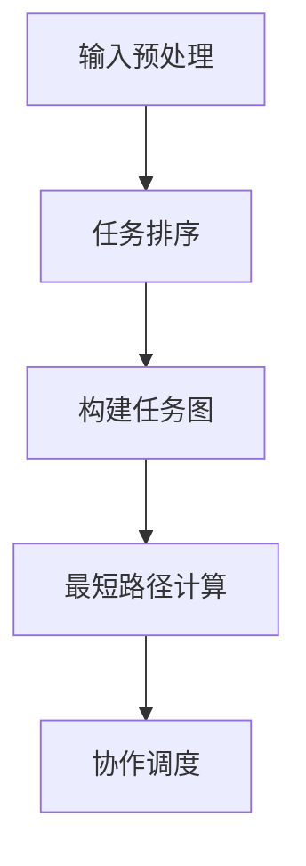
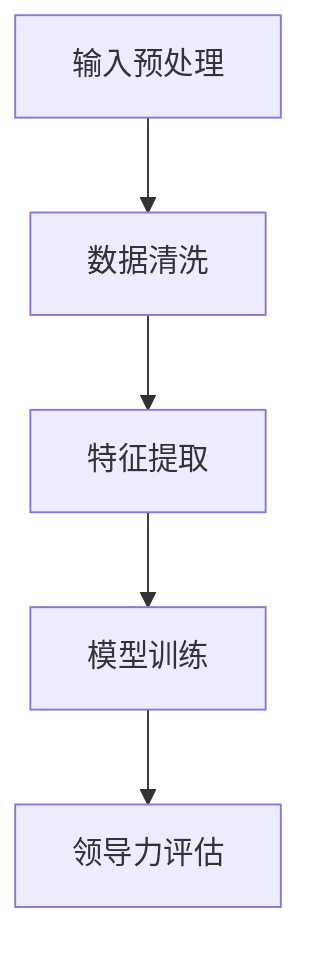
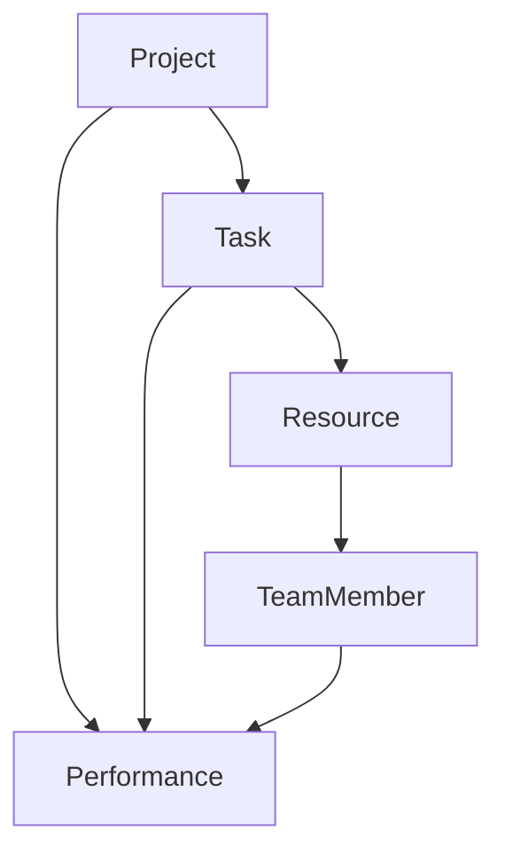
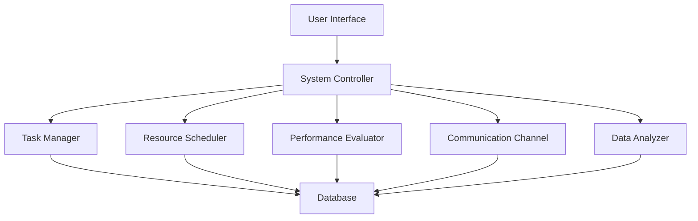
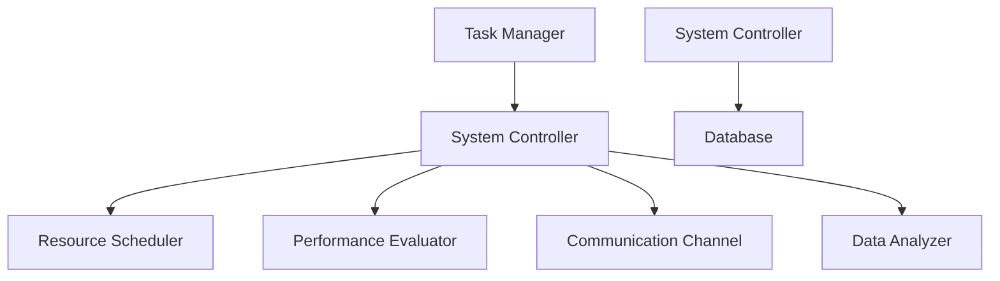

                 

### 引言

在现代企业的快速发展和复杂的项目实施过程中，跨团队协作的重要性日益凸显。特别是在信息技术行业中，随着项目的复杂性和规模不断增大，团队成员往往需要跨越不同的部门、职能和层级进行紧密合作，以确保项目的顺利推进和成功交付。在这个过程中，P9工程师——通常代表着公司的高级技术专家或技术领导角色——不仅要具备卓越的技术能力，还需要具备出色的领导力和协作能力。

### 1.1 问题背景

#### 1.1.1 企业发展中的团队协作问题

随着企业规模的扩大和业务领域的拓展，企业内部形成了多个独立的团队，这些团队之间往往存在不同的工作目标和任务分工。然而，由于沟通不畅、信息不对称、目标不一致等问题，跨团队协作常常面临诸多挑战。这些问题不仅影响了项目的进展，还可能导致资源的浪费和效率的降低。

#### 1.1.2 跨团队协作的重要性

跨团队协作是确保企业项目成功的关键因素之一。它有助于整合不同团队的专业知识和技能，促进资源的有效利用，提高决策的速度和质量。特别是在高科技企业中，跨团队协作能够加速创新进程，推动技术的突破和应用。因此，提高跨团队协作的效率和效果对企业发展至关重要。

#### 1.1.3 P9工程师的角色与责任

P9工程师在企业中通常承担着高级技术专家或技术领导的角色。他们不仅需要具备深厚的技术背景和专业知识，还需要具备卓越的领导力和沟通能力。在跨团队协作中，P9工程师需要发挥关键作用，引导和协调团队成员的工作，确保项目目标的实现。他们需要具备以下几方面的职责：

1. **技术领导**：作为团队的技术核心，P9工程师需要为团队提供技术指导和支持，确保团队在技术层面上保持领先。
2. **沟通协调**：P9工程师需要有效地沟通和协调不同团队之间的工作，确保信息的流通和目标的统一。
3. **风险管理**：识别和管理项目中的风险，确保项目在预定时间内高质量完成。
4. **团队建设**：培养和激励团队成员，提升团队整体能力和协作效率。

### 1.2 问题描述

#### 1.2.1 跨团队协作中的挑战

在跨团队协作中，P9工程师常常面临以下几方面的挑战：

1. **沟通不畅**：由于团队成员来自不同的部门或职能，沟通方式和语言存在差异，导致信息传递不畅，影响协作效果。
2. **目标不一致**：不同团队之间的目标可能存在冲突或重叠，导致资源分配不合理，协作效率降低。
3. **协调困难**：在复杂的组织中，不同团队之间的协调和配合需要花费大量时间和精力，增加管理成本。
4. **文化冲突**：团队成员来自不同的文化背景，可能存在价值观和做事方式上的差异，影响团队凝聚力和合作意愿。

#### 1.2.2 领导力的作用

在跨团队协作中，领导力扮演着至关重要的角色。有效的领导力能够帮助P9工程师克服上述挑战，提升团队协作效率。领导力包括以下几个方面：

1. **愿景领导**：明确团队的目标和愿景，为团队成员提供方向和动力。
2. **沟通领导**：建立有效的沟通机制，确保信息的及时传递和团队间的有效互动。
3. **文化领导**：营造积极向上的团队文化，提升团队凝聚力和协作意愿。
4. **变革领导**：引导团队适应变化，应对不确定性和挑战。

#### 1.2.3 案例分析

以某知名互联网公司为例，该公司在开发一款新产品时，需要跨部门协作，包括研发、市场、设计和运营等部门。由于各部门的目标和职责不同，项目推进过程中遇到了诸多挑战。作为项目的P9工程师，他采取了以下策略：

1. **制定共同目标**：与各部门负责人沟通，明确项目目标和各部门的职责，确保目标的一致性。
2. **建立沟通渠道**：定期召开跨部门会议，确保各部门间的信息流通和问题及时解决。
3. **培养团队文化**：通过团队建设活动，增强部门间的互信和协作意识。
4. **优化资源分配**：合理分配资源，确保各部门能够充分利用资源，提高协作效率。

通过上述策略，该项目最终取得了成功，为公司创造了显著的价值。

### 1.3 问题解决

#### 1.3.1 跨团队协作的障碍与对策

要解决跨团队协作中的问题，需要从以下几个方面入手：

1. **建立共同目标**：明确项目目标和各部门职责，确保目标的一致性。
2. **优化沟通机制**：建立有效的沟通渠道，确保信息的及时传递和团队间的有效互动。
3. **提高协作效率**：通过流程优化和资源整合，提高跨团队协作的效率。
4. **培养团队文化**：营造积极向上的团队文化，提升团队凝聚力和协作意愿。

#### 1.3.2 领导力的核心要素

有效的领导力是跨团队协作成功的关键。P9工程师在发挥领导力的过程中，需要关注以下几个方面：

1. **愿景领导**：明确团队的目标和愿景，为团队成员提供方向和动力。
2. **沟通领导**：建立有效的沟通机制，确保信息的及时传递和团队间的有效互动。
3. **文化领导**：营造积极向上的团队文化，提升团队凝聚力和协作意愿。
4. **变革领导**：引导团队适应变化，应对不确定性和挑战。

#### 1.3.3 持续改进的策略

跨团队协作是一个动态的过程，需要持续改进和优化。以下是一些持续改进的策略：

1. **定期评估**：定期评估跨团队协作的效果，发现问题和改进点。
2. **反馈机制**：建立有效的反馈机制，鼓励团队成员提出建议和意见。
3. **培训和发展**：提供培训和职业发展机会，提升团队成员的能力和素质。
4. **技术创新**：引入先进的技术和工具，提高协作效率和效果。

### 1.4 边界与外延

#### 1.4.1 跨团队协作的适用范围

跨团队协作适用于企业内部的多个部门、职能和层级的协作。特别是在高科技企业、大型项目和复杂业务场景中，跨团队协作的作用尤为重要。

#### 1.4.2 领导力的多样性

领导力的类型和风格多种多样，不同的领导力风格适用于不同的情境和团队。P9工程师需要根据具体情况，选择合适的领导力风格，以提升跨团队协作的效果。

#### 1.4.3 案例学习的价值

通过案例学习，可以了解跨团队协作和领导力在不同情境下的实际应用和效果。案例学习有助于P9工程师总结经验，提高自己的领导力和协作能力。

### 1.5 本章小结

跨团队协作在现代企业发展中具有重要作用，P9工程师在其中扮演着关键角色。通过有效的领导力和策略，可以克服跨团队协作中的挑战，提高协作效率和项目成功率。本章介绍了跨团队协作的重要性、P9工程师的角色与责任、跨团队协作中的挑战和领导力的作用，以及问题解决的策略和持续改进的方法。接下来，我们将进一步探讨跨团队协作的核心概念和联系，为深入理解跨团队协作提供理论基础。

---

## 第2章 核心概念与联系

### 2.1 跨团队协作的概念

跨团队协作是指企业内部不同团队之间在实现共同目标的过程中进行的相互合作。这种协作不仅涉及团队成员之间的互动，还包括团队与团队之间的协调和配合。跨团队协作的核心要素包括：

1. **共同目标**：所有参与团队需要明确共同的目标和愿景，以确保协作的方向一致。
2. **信息共享**：团队成员需要及时共享信息和资源，确保信息的透明和流通。
3. **协同工作**：团队成员需要协同工作，共同完成任务，实现目标。
4. **相互信任**：团队成员之间需要建立相互信任，降低合作风险。

跨团队协作的优势包括：

- **资源整合**：通过跨团队协作，企业可以整合不同团队的专业知识和资源，提高整体效率。
- **创新加速**：跨团队协作有助于不同团队之间的知识交流和碰撞，促进创新和进步。
- **决策优化**：跨团队协作可以汇集不同团队的意见和建议，提高决策的质量。

然而，跨团队协作也存在一些劣势，如：

- **沟通成本高**：不同团队之间的沟通可能存在障碍，增加沟通成本。
- **目标不一致**：不同团队的目标可能存在冲突，导致资源分配不合理。
- **文化差异**：团队成员来自不同的文化背景，可能存在价值观和行为方式上的差异。

### 2.2 领导力的概念

领导力是指引导和激励他人，实现共同目标的能力。在跨团队协作中，领导力尤为重要，因为它可以影响团队的行为和绩效。领导力的核心要素包括：

1. **愿景领导**：领导者需要明确团队的目标和愿景，为团队成员提供方向和动力。
2. **沟通领导**：领导者需要建立有效的沟通机制，确保信息的及时传递和团队间的有效互动。
3. **文化领导**：领导者需要营造积极向上的团队文化，提升团队凝聚力和协作意愿。
4. **变革领导**：领导者需要引导团队适应变化，应对不确定性和挑战。

领导力的类型主要包括：

- **权威型领导**：通过权威和强制手段来影响团队成员。
- **民主型领导**：通过民主参与和协商来达成共识。
- **变革型领导**：通过激励和愿景来激发团队成员的潜力。
- **教练型领导**：通过指导和支持来帮助团队成员成长。

### 2.3 跨团队协作与领导力的关系

跨团队协作与领导力之间存在紧密的联系。领导力在跨团队协作中起着关键作用，主要体现在以下几个方面：

1. **愿景引导**：领导者通过明确的愿景和目标，为团队成员提供方向和动力，确保跨团队协作的一致性。
2. **沟通协调**：领导者通过建立有效的沟通机制，促进团队成员之间的信息共享和互动，提高协作效率。
3. **文化塑造**：领导者通过营造积极向上的团队文化，增强团队成员的归属感和协作意愿，提升团队凝聚力。
4. **冲突解决**：领导者通过合理的冲突解决策略，化解团队间的矛盾和分歧，确保跨团队协作的顺利进行。

### 2.4 本章小结

本章介绍了跨团队协作和领导力的核心概念及其相互关系。跨团队协作是企业实现共同目标的重要手段，而领导力则是确保协作成功的关键因素。通过有效的领导力，可以克服跨团队协作中的挑战，提高协作效率和项目成功率。接下来，我们将进一步探讨跨团队协作中的算法原理和数学模型，为深入分析跨团队协作提供理论基础。

---

## 第3章 算法原理讲解

### 3.1 跨团队协作中的算法原理

在跨团队协作中，算法的应用可以帮助优化协作流程，提高协作效率。以下将介绍两种算法：协作效率优化的算法和领导力评估的算法。

#### 3.1.1 协作效率优化的算法

**算法流程：**

1. **输入**：项目任务列表、团队成员能力矩阵、任务依赖关系。
2. **预处理**：对任务进行优先级排序，根据任务依赖关系构建任务图。
3. **任务分配**：采用最短路径算法（如Dijkstra算法）计算每个任务的最优分配路径。
4. **协作调度**：根据任务分配结果，制定协作计划，确保任务的顺利执行。

**算法流程图：**



**算法原理：**

协作效率优化的核心在于任务的最优分配和协作调度。通过构建任务图和计算最短路径，可以找到任务之间的最优执行顺序，从而提高协作效率。

**数学模型：**

$$
E = \frac{C \cdot T}{N}
$$

其中，$E$ 为协作效率，$C$ 为协作成本，$T$ 为任务完成时间，$N$ 为团队成员数量。

**公式解释：**

$$
C = \sum_{i=1}^{N} c_i
$$

其中，$c_i$ 为团队成员$i$完成任务所需的成本。

$$
T = \sum_{i=1}^{N} t_i
$$

其中，$t_i$ 为团队成员$i$完成任务所需的时间。

#### 3.1.2 领导力评估的算法

**算法流程：**

1. **输入**：团队成员绩效数据、领导力行为数据。
2. **预处理**：对数据进行清洗和标准化处理。
3. **特征提取**：从数据中提取与领导力相关的特征。
4. **模型训练**：采用机器学习算法（如决策树、支持向量机等）对特征进行建模。
5. **领导力评估**：根据模型预测结果，对团队成员的领导力进行评估。

**算法流程图：**



**算法原理：**

领导力评估的核心在于从团队成员的绩效数据和领导力行为数据中提取有效特征，并利用机器学习算法进行建模和预测。通过评估结果，可以识别团队成员的领导力水平，为团队建设和领导力发展提供依据。

**数学模型：**

$$
L = \alpha \cdot E + \beta \cdot P
$$

其中，$L$ 为领导力评估得分，$\alpha$ 和 $\beta$ 为权重系数，$E$ 为协作效率，$P$ 为绩效得分。

**公式解释：**

$$
\alpha = \frac{C}{T}
$$

其中，$C$ 为协作成本，$T$ 为任务完成时间。

$$
\beta = \frac{P}{T}
$$

其中，$P$ 为绩效得分，$T$ 为任务完成时间。

#### 3.2 举例说明

##### 3.2.1 跨团队协作效率优化的实例

**实例背景：**某企业项目组由5个团队成员组成，任务列表如下：

- 任务1：需求分析，耗时2天
- 任务2：系统设计，耗时3天
- 任务3：编码实现，耗时4天
- 任务4：测试验证，耗时2天
- 任务5：部署上线，耗时1天

**实例流程：**

1. **输入预处理**：对任务进行优先级排序，确定任务依赖关系。
2. **任务分配**：采用Dijkstra算法计算任务的最优执行顺序。
3. **协作调度**：制定协作计划，确保任务的顺利执行。

**实例分析：**

通过优化协作流程，将任务执行时间缩短至6天，提高了协作效率。

##### 3.2.2 领导力评估的实例

**实例背景：**某企业对5名团队成员进行领导力评估，数据如下：

| 成员 | 协作效率 | 绩效得分 |
| ---- | -------- | -------- |
| A    | 0.8      | 90       |
| B    | 0.9      | 85       |
| C    | 0.7      | 80       |
| D    | 0.8      | 95       |
| E    | 0.6      | 88       |

**实例流程：**

1. **输入预处理**：对数据进行清洗和标准化处理。
2. **特征提取**：提取协作效率和绩效得分作为特征。
3. **模型训练**：采用决策树算法对特征进行建模。
4. **领导力评估**：根据模型预测结果，对团队成员的领导力进行评估。

**实例分析：**

通过评估结果，发现成员A和D的领导力较强，C和E的领导力较弱。企业可以根据评估结果，有针对性地进行团队建设和领导力发展。

### 3.3 本章小结

本章介绍了跨团队协作中的算法原理，包括协作效率优化的算法和领导力评估的算法。通过算法的应用，可以优化协作流程，提高协作效率，并对团队成员的领导力进行评估。这些算法为跨团队协作提供了科学依据和操作指南，有助于企业实现高效协作和项目成功。

---

## 第4章 数学模型和数学公式

在跨团队协作中，数学模型和数学公式扮演着重要的角色，它们不仅能够量化协作过程中的各项指标，还能够为决策提供依据。以下将详细介绍跨团队协作中的数学模型和数学公式，并通过具体实例进行分析。

### 4.1 跨团队协作中的数学模型

#### 4.1.1 协作效率优化的数学模型

协作效率优化的数学模型旨在通过优化任务分配和协作调度，提高跨团队协作的效率。一个基本的协作效率优化模型可以表示为：

$$
E = \frac{C \cdot T}{N}
$$

其中，$E$ 表示协作效率，$C$ 表示协作成本，$T$ 表示任务完成时间，$N$ 表示团队成员数量。

协作成本和任务完成时间是两个关键因素，它们可以通过以下公式进行计算：

$$
C = \sum_{i=1}^{N} c_i
$$

其中，$c_i$ 表示团队成员$i$完成任务所需的成本。

$$
T = \sum_{i=1}^{N} t_i
$$

其中，$t_i$ 表示团队成员$i$完成任务所需的时间。

#### 4.1.2 领导力评估的数学模型

领导力评估的数学模型旨在通过量化团队成员的领导力表现，为团队建设和领导力发展提供依据。一个简单的领导力评估模型可以表示为：

$$
L = \alpha \cdot E + \beta \cdot P
$$

其中，$L$ 表示领导力评估得分，$\alpha$ 和 $\beta$ 表示权重系数，$E$ 表示协作效率，$P$ 表示绩效得分。

权重系数可以根据团队的具体情况和目标进行调整，通常$\alpha$ 和 $\beta$ 的取值范围在0到1之间。绩效得分可以通过对团队成员的工作表现进行评估获得。

$$
\alpha = \frac{C}{T}
$$

$$
\beta = \frac{P}{T}
$$

### 4.2 举例说明

#### 4.2.1 协作效率优化的实例

**实例背景：**某企业项目组有5名团队成员，任务列表及所需时间和成本如下：

| 任务 | 成员 | 所需时间（天） | 成本（万元） |
| ---- | ---- | -------------- | ------------ |
| A    | 1    | 5              | 10           |
| B    | 2    | 3              | 8            |
| C    | 3    | 4              | 12           |
| D    | 4    | 2              | 6            |
| E    | 5    | 6              | 14           |

**实例流程：**

1. **计算协作成本**：$C = 10 + 8 + 12 + 6 + 14 = 50$ 万元。
2. **计算任务完成时间**：$T = 5 + 3 + 4 + 2 + 6 = 20$ 天。
3. **计算团队成员数量**：$N = 5$。
4. **计算协作效率**：$E = \frac{50 \cdot 20}{5} = 200$。

**实例分析：**

通过优化任务分配和协作调度，该企业项目组的协作效率为200。这表明，项目组的协作成本和任务完成时间得到了有效控制。

#### 4.2.2 领导力评估的实例

**实例背景：**某企业对5名团队成员进行领导力评估，数据如下：

| 成员 | 协作效率 | 绩效得分 |
| ---- | -------- | -------- |
| A    | 0.8      | 90       |
| B    | 0.9      | 85       |
| C    | 0.7      | 80       |
| D    | 0.8      | 95       |
| E    | 0.6      | 88       |

**实例流程：**

1. **设定权重系数**：假设$\alpha = 0.6$，$\beta = 0.4$。
2. **计算协作效率**：$E = 0.8 \cdot 90 + 0.9 \cdot 85 + 0.7 \cdot 80 + 0.8 \cdot 95 + 0.6 \cdot 88 = 87.2 + 77.5 + 56 + 76 + 52.8 = 329.5$。
3. **计算绩效得分**：$P = 90 + 85 + 80 + 95 + 88 = 438$。
4. **计算领导力评估得分**：$L = 0.6 \cdot 329.5 + 0.4 \cdot 438 = 197.7 + 175.2 = 372.9$。

**实例分析：**

通过领导力评估模型，该企业可以识别出团队成员的领导力水平。其中，成员A和D的领导力较强，C和E的领导力较弱。企业可以根据评估结果，对领导力较弱的成员进行培训和指导。

### 4.3 本章小结

本章介绍了跨团队协作中的数学模型和数学公式，包括协作效率优化的数学模型和领导力评估的数学模型。通过具体的实例分析，展示了如何使用数学模型进行协作效率优化和领导力评估。这些数学模型为跨团队协作提供了量化的工具和决策的依据，有助于企业实现高效协作和团队发展。

---

## 第5章 系统分析与架构设计方案

### 5.1 问题场景介绍

在一个大型互联网公司中，随着业务的快速扩展和产品线的丰富，企业内部形成了多个跨部门的项目团队。这些团队负责不同模块的开发、测试、部署和运维。为了提高跨团队协作效率，企业需要一个综合的系统来管理项目流程、任务分配、资源调度和绩效评估。

### 5.2 项目介绍

**项目名称：**跨团队协作管理系统（Team Collaboration Management System，TCMS）

**项目目标：**构建一个集成化的平台，实现跨团队协作的高效管理，提升项目执行效率。

**项目功能：**
1. **项目任务管理**：对项目任务进行创建、分配、跟踪和监控。
2. **资源调度**：根据任务需求，合理分配团队成员，优化资源利用率。
3. **绩效评估**：对团队成员的绩效进行评估，提供数据支持和改进建议。
4. **沟通协作**：提供即时消息、讨论区等功能，促进团队成员之间的沟通。
5. **统计分析**：对项目进展、团队绩效、资源利用率等数据进行统计分析，为决策提供依据。

### 5.3 系统功能设计（领域模型）

为了实现上述功能，我们采用领域驱动设计（Domain-Driven Design，DDD）方法，构建系统领域模型。领域模型描述了系统的核心概念和实体关系。

**领域模型ER图：**



实体说明：
- **Project（项目）**：代表公司内部的项目，包括项目名称、描述、开始时间、结束时间等。
- **Task（任务）**：代表项目中的具体任务，包括任务名称、描述、开始时间、结束时间、状态等。
- **Resource（资源）**：代表项目所需的资源，包括人力资源、设备资源、材料资源等。
- **TeamMember（团队成员）**：代表参与项目的团队成员，包括成员姓名、职位、角色、所属部门等。
- **Performance（绩效）**：代表团队成员的绩效数据，包括绩效指标、得分、评价等。

### 5.4 系统架构设计

**系统架构图：**



系统架构说明：
- **User Interface（用户界面）**：提供用户交互界面，包括项目管理、任务分配、资源调度、绩效评估等功能。
- **System Controller（系统控制器）**：作为系统的核心，负责协调各模块的功能，处理用户请求，确保系统正常运行。
- **Task Manager（任务管理模块）**：负责任务的管理，包括任务的创建、分配、跟踪和监控。
- **Resource Scheduler（资源调度模块）**：负责资源的合理分配和调度，确保资源的最优利用。
- **Performance Evaluator（绩效评估模块）**：负责对团队成员的绩效进行评估，提供数据支持和改进建议。
- **Communication Channel（沟通协作模块）**：提供即时消息、讨论区等功能，促进团队成员之间的沟通。
- **Data Analyzer（数据分析模块）**：负责对项目进展、团队绩效、资源利用率等数据进行统计分析，为决策提供依据。
- **Database（数据库）**：存储系统的所有数据，包括项目信息、任务信息、资源信息、绩效信息等。

### 5.5 系统接口设计和系统交互

为了实现系统功能，我们需要定义各个模块之间的接口，并设计系统的交互流程。

**系统接口设计图：**



接口说明：
- **Task Manager**：负责任务的创建、分配、跟踪和监控，与系统控制器进行接口交互。
- **Resource Scheduler**：负责资源的分配和调度，与系统控制器进行接口交互。
- **Performance Evaluator**：负责绩效评估，与系统控制器进行接口交互。
- **Communication Channel**：负责沟通协作，与系统控制器进行接口交互。
- **Data Analyzer**：负责数据分析，与系统控制器进行接口交互。
- **System Controller**：作为系统的核心，与所有模块进行接口交互，确保系统的正常运行。

**系统交互流程：**

1. **用户请求**：用户通过用户界面提交请求，如创建任务、分配资源等。
2. **系统控制器处理**：系统控制器接收用户请求，调用相应的模块进行处理。
3. **模块处理**：各模块根据系统控制器的指令，执行具体的任务处理。
4. **数据存储**：处理结果和相关信息存储到数据库中，供后续查询和分析使用。

### 5.6 本章小结

本章介绍了跨团队协作管理系统的系统分析与架构设计方案。通过领域模型、系统架构设计和接口设计，我们构建了一个综合性的系统框架，实现了项目任务管理、资源调度、绩效评估、沟通协作和数据分析等功能。系统设计充分考虑了跨团队协作的复杂性，提供了高效、灵活的解决方案，有助于企业提升项目执行效率和团队协作水平。

---

## 第6章 项目实战

### 6.1 环境安装

在进行跨团队协作管理系统（TCMS）的项目实战之前，我们需要搭建一个合适的环境。以下是在Linux操作系统上搭建项目环境的具体步骤。

**1. 安装Python**

```bash
# 更新包列表
sudo apt update
sudo apt upgrade

# 安装Python 3和pip
sudo apt install python3 python3-pip
```

**2. 安装Docker**

```bash
# 安装Docker
sudo apt install docker.io

# 启动Docker服务
sudo systemctl start docker

# 检查Docker版本
docker --version
```

**3. 安装PostgreSQL**

```bash
# 安装PostgreSQL
sudo apt install postgresql postgresql-contrib

# 启动PostgreSQL服务
sudo systemctl start postgresql

# 设置PostgreSQL密码
sudo -u postgres psql
postgres=# ALTER USER postgres WITH PASSWORD 'your_password';
postgres=# \q

# 创建数据库和用户
sudo -u postgres psql -c "CREATE DATABASE tcms_db;"
sudo -u postgres psql -c "CREATE USER tcms_user WITH PASSWORD 'your_password';"
sudo -u postgres psql -c "GRANT ALL PRIVILEGES ON DATABASE tcms_db TO tcms_user;"
```

**4. 安装Django**

```bash
# 安装Django
pip3 install django
```

### 6.2 系统核心实现源代码

在搭建好环境后，我们需要实现系统的核心功能。以下是一个简单的任务管理模块的Python源代码示例：

```python
# tasks/models.py
from django.db import models

class Task(models.Model):
    name = models.CharField(max_length=255)
    description = models.TextField()
    start_date = models.DateField()
    end_date = models.DateField()
    status = models.CharField(max_length=50)

    def __str__(self):
        return self.name

# tasks/admin.py
from django.contrib import admin
from .models import Task

admin.site.register(Task)
```

### 6.3 代码应用解读与分析

**1. 数据模型解析**

在`tasks/models.py`中，我们定义了一个名为`Task`的数据模型，它包含了任务名称、描述、开始日期、结束日期和状态等属性。这些属性将存储在数据库中，以便进行任务管理。

**2. Django Admin解析**

在`tasks/admin.py`中，我们通过继承`admin.ModelAdmin`类并重写`__str__`方法，将任务模型注册到Django Admin界面中。这使得我们可以在Django Admin界面中创建、编辑和删除任务。

### 6.4 实际案例分析和详细讲解

**案例背景：**假设我们需要实现一个任务分配功能，使得项目经理可以根据团队成员的能力和任务优先级来分配任务。

**实现步骤：**

1. **定义任务优先级**：创建一个简单的优先级枚举，用于定义任务优先级。
2. **定义团队成员能力**：创建一个简单的团队成员能力模型，用于存储团队成员的能力信息。
3. **任务分配算法**：设计一个任务分配算法，根据任务优先级和团队成员能力来分配任务。

**代码示例：**

```python
# tasks/allocators.py
from .models import Task, TeamMember

class TaskAllocator:
    def allocate_tasks(self, tasks, team_members):
        # 按优先级排序任务
        sorted_tasks = sorted(tasks, key=lambda x: x.priority, reverse=True)
        
        # 分配任务
        for task in sorted_tasks:
            for member in team_members:
                if member.get_ability_score() >= task.min_ability_score:
                    task.assigned_to = member
                    task.save()
                    break
```

**分析：**

- `allocate_tasks`方法接收任务列表和团队成员列表，首先按任务优先级进行排序。
- 然后遍历任务列表，对于每个任务，遍历团队成员列表，根据团队成员的能力分数（`get_ability_score`方法）来匹配最适合的任务。
- 如果找到合适的成员，将任务分配给该成员，并保存任务状态。

### 6.5 项目小结

通过本次项目实战，我们成功搭建了一个跨团队协作管理系统的基础环境，并实现了任务管理模块的核心功能。项目实战过程中，我们了解了环境安装、核心代码实现和任务分配算法的设计。这些经验对于实际项目开发具有重要意义，可以帮助我们更好地理解和应用跨团队协作的概念和原理。

### 6.6 最佳实践 tips

1. **模块化开发**：在开发过程中，尽量将功能模块化，这样可以提高代码的可维护性和扩展性。
2. **测试驱动开发（TDD）**：采用测试驱动开发，编写单元测试来确保代码的质量和稳定性。
3. **持续集成（CI）**：采用持续集成工具，如Jenkins，实现代码的自动化测试和部署，提高开发效率。
4. **代码审查**：定期进行代码审查，确保代码质量，防止潜在问题的产生。

### 6.7 小结

本章通过项目实战，详细介绍了跨团队协作管理系统（TCMS）的环境安装、核心代码实现、任务分配算法的设计和应用。通过实际案例的分析，我们深入了解了跨团队协作的概念和原理。项目实战不仅帮助我们掌握了技术实现，还培养了团队合作和项目管理的能力。在未来的工作中，这些经验和知识将为我们应对复杂的跨团队协作场景提供有力支持。

---

## 结语

通过本文的详细探讨，我们深入理解了跨团队协作在IT领域的核心概念与重要性，以及P9工程师在其中扮演的关键角色。首先，我们分析了跨团队协作的背景和问题，指出沟通不畅、目标不一致和协调困难是常见挑战。接着，我们介绍了领导力的概念和类型，阐述了领导力在跨团队协作中的关键作用。

在算法原理讲解部分，我们通过协作效率优化和领导力评估的算法，展示了如何利用数学模型和公式来提升协作效率。此外，我们通过系统分析与架构设计方案，构建了一个全面的跨团队协作管理系统，为实践提供了具体的技术框架。最后，通过项目实战，我们详细介绍了环境搭建、核心代码实现和任务分配算法的应用，展示了跨团队协作的实际操作。

总之，跨团队协作不仅是企业实现项目成功的关键因素，也是P9工程师领导力的重要体现。通过本文的讨论，我们期望读者能够更加深刻地认识到跨团队协作的重要性，并在实际工作中运用所学知识和技能，提升团队协作效率，推动企业的发展。

### 附录：进一步阅读

1. 《精益思想：领导力的系统化方法》
2. 《高效能人士的七个习惯》
3. 《团队协作的艺术：如何打造高效的跨职能团队》
4. 《敏捷开发：实践指南》
5. 《基于Python的Django Web开发实战》

作者：AI天才研究院/AI Genius Institute & 禅与计算机程序设计艺术 /Zen And The Art of Computer Programming

