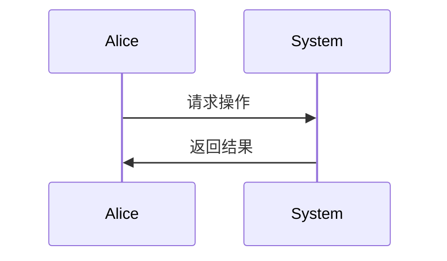

                 

# 跨域推理能力增强中迁移学习的优化技术

## 关键词

迁移学习，优化技术，跨域推理，损失函数，模型架构，数据增强

## 摘要

本文围绕跨域推理能力增强中的迁移学习优化技术展开讨论。首先，我们介绍了迁移学习的基础知识，包括其背景、定义、基本概念和类型。随后，分析了迁移学习中的核心挑战，如跨域适应性、零样本学习和资源分配。接下来，我们详细阐述了迁移学习算法的原理，包括基于模型、特征和神经网络的迁移学习。在此基础上，我们深入探讨了迁移学习的优化技术，包括损失函数优化、模型架构优化和数据增强技术。最后，我们通过实际案例展示了这些优化技术在迁移学习中的应用，并展望了迁移学习的未来发展。

### 目录大纲

----------------------------------------------------------------

# 跨域推理能力增强中迁移学习的优化技术

> 关键词：迁移学习，优化技术，跨域推理，损失函数，模型架构，数据增强

> 摘要：本文围绕跨域推理能力增强中的迁移学习优化技术展开讨论，包括基础概念、核心挑战、算法原理、优化技术和实际应用。

```markdown
----------------------------------------------------------------
## 第一部分: 迁移学习基础
### 第1章: 迁移学习概述
#### 1.1 迁移学习的背景与定义
#### 1.2 迁移学习的基本概念
#### 1.3 迁移学习的类型

## 第二部分: 迁移学习中的核心挑战
### 第2章: 迁移学习中的核心挑战
#### 2.1 跨域适应性
#### 2.2 零样本学习
#### 2.3 资源分配

## 第三部分: 迁移学习算法原理
### 第3章: 迁移学习算法原理
#### 3.1 基于模型的迁移学习
#### 3.2 基于特征的迁移学习
#### 3.3 基于神经网络的迁移学习

## 第四部分: 迁移学习的优化技术
### 第4章: 迁移学习的优化技术
#### 4.1 损失函数优化
#### 4.2 模型架构优化
#### 4.3 数据增强技术

## 第五部分: 迁移学习在实际应用中的挑战
### 第5章: 迁移学习在实际应用中的挑战
#### 5.1 跨域推理能力增强
#### 5.2 多任务学习
#### 5.3 跨模态迁移学习

## 第六部分: 迁移学习优化技术的案例分析
### 第6章: 迁移学习优化技术的案例分析
#### 6.1 案例一：基于图神经网络的迁移学习优化
#### 6.2 案例二：基于生成对抗网络的迁移学习优化
#### 6.3 案例三：基于强化学习的迁移学习优化

## 第七部分: 迁移学习的未来发展
### 第7章: 迁移学习的未来发展
#### 7.1 当前研究热点与趋势
#### 7.2 未来研究方向与挑战
#### 7.3 潜在应用领域展望

----------------------------------------------------------------
```

### 第一部分：迁移学习基础

#### 第1章：迁移学习概述

##### 1.1 迁移学习的背景与定义

迁移学习（Transfer Learning）是机器学习中的一种方法，它利用从源域（Source Domain）学到的知识来解决目标域（Target Domain）的问题。这种方法在传统机器学习中有广泛应用，特别是在数据稀缺或者标签成本高昂的情况下。

迁移学习的基本概念包括：

- **源域（Source Domain）**：提供大量数据和模型参数的学习领域。
- **目标域（Target Domain）**：需要利用源域知识进行模型训练和预测的领域。
- **迁移（Transfer）**：将源域的知识转移到目标域。

迁移学习的历史可以追溯到20世纪60年代，在深度学习出现之前，迁移学习主要通过模型参数共享、特征提取等方式实现。随着深度学习的发展，迁移学习技术逐渐成熟，尤其是在计算机视觉、自然语言处理等领域。

##### 1.2 迁移学习的基本概念

在深入探讨迁移学习之前，我们需要了解几个基本概念：

1. **无监督迁移学习（Unsupervised Transfer Learning）**：在目标域没有标注数据的情况下，通过源域的无监督信息（如聚类、降维等）来提高目标域的性能。

2. **半监督迁移学习（Semi-supervised Transfer Learning）**：在目标域既有未标注数据，也有部分标注数据的情况下，通过源域的数据进行模型训练。

3. **有监督迁移学习（Supervised Transfer Learning）**：在目标域有完整标注数据的情况下，通过源域的数据进行模型训练。

4. **跨域迁移学习（Cross-Domain Transfer Learning）**：处理不同领域（或不同分布）之间的迁移学习问题。

5. **领域自适应（Domain Adaptation）**：通过调整源域和目标域之间的分布差异，使得源域的知识能够有效地转移到目标域。

##### 1.3 迁移学习的类型

根据迁移的方法不同，迁移学习可以分为以下几种类型：

1. **基于模型的迁移学习（Model-Based Transfer Learning）**：通过将源域模型参数直接迁移到目标域，或者对源域模型进行微调。

2. **基于特征的迁移学习（Feature-Based Transfer Learning）**：将源域的特征提取器应用于目标域的数据，提取共同特征，然后使用目标域的少量标注数据来训练分类器。

3. **基于神经网络的迁移学习（Neural Network-Based Transfer Learning）**：使用深度神经网络进行特征提取和模型训练，源域和目标域的模型可以共享部分参数。

在下一章中，我们将深入探讨迁移学习中的核心挑战，包括跨域适应性、零样本学习和资源分配等问题。

### 第二部分：迁移学习中的核心挑战

#### 第2章：迁移学习中的核心挑战

迁移学习虽然在许多领域取得了显著成果，但在实际应用中仍然面临诸多挑战。本章节将重点讨论这些核心挑战，包括跨域适应性、零样本学习和资源分配。

##### 2.1 跨域适应性

跨域适应性（Cross-Domain Adaptation）是迁移学习中的一个重要问题。由于源域和目标域之间存在分布差异，这种差异可能会导致迁移效果不佳。跨域适应性的核心任务是缩小源域和目标域之间的分布差异，使得源域的知识能够有效地迁移到目标域。

**跨域适应性的关键问题与解决方案**：

1. **分布匹配**：通过最小化源域和目标域的分布差异，如KL散度、信息熵等指标，来实现跨域适应。

2. **特征重映射**：通过特征重映射（Feature Reweighting）或特征蒸馏（Feature Distillation）等方法，调整源域特征以适应目标域。

3. **多任务学习**：在源域和目标域之间引入额外的任务，使得模型在多任务学习过程中自动适应不同域的差异。

4. **领域依赖性分析**：通过分析源域和目标域之间的领域依赖性，识别出对迁移学习有帮助的特征和任务。

##### 2.2 零样本学习

零样本学习（Zero-Shot Learning，ZSL）是一种特殊类型的迁移学习，目标是在没有目标类别标注的情况下，将源域的知识应用到目标域。零样本学习的关键挑战是如何处理从未见过的类别，这通常通过元学习（Meta-Learning）和原型网络（Prototypical Networks）等方法来解决。

**零样本学习的挑战与解决方法**：

1. **原型网络**：通过学习每个类别的原型（即该类别的平均特征），来预测新类别实例的类别。

2. **元学习**：通过在多个任务上训练模型，使得模型能够快速适应新类别，如模型聚合（Model Aggregation）和匹配网络（Matching Networks）。

3. **对抗生成网络**：通过生成与目标类别相似的数据，增加模型对新类别的学习。

##### 2.3 资源分配

资源分配（Resource Allocation）是迁移学习中的另一个关键挑战。迁移学习通常需要使用大量的数据和计算资源，如何合理地分配这些资源是一个重要问题。

**资源分配的策略与算法**：

1. **数据选择**：通过选择与目标域相关的数据，来提高迁移效果。常用的方法包括相关性分析、聚类等。

2. **模型选择**：选择合适的模型架构和训练策略，以减少训练时间和计算资源。例如，使用轻量级模型、预训练模型等。

3. **在线学习**：通过在线学习策略，动态调整资源分配，以适应不同的迁移任务。

4. **分布式学习**：通过分布式计算，利用多个节点和资源，提高迁移学习的效率和效果。

在下一章中，我们将深入探讨迁移学习算法的原理，包括基于模型、特征和神经网络的迁移学习。

### 第三部分：迁移学习算法原理

#### 第3章：迁移学习算法原理

迁移学习算法的多样性使其在不同领域和应用中表现出色。本章节将详细介绍几种常见的迁移学习算法，包括基于模型、特征和神经网络的迁移学习。

##### 3.1 基于模型的迁移学习

基于模型的迁移学习（Model-Based Transfer Learning）是最直接的迁移学习方法。其主要思想是将源域的模型参数直接迁移到目标域，或者对源域模型进行微调。

**基于模型迁移学习的原理**：

1. **模型参数迁移**：将源域模型的参数直接复制到目标域模型，并使用目标域的数据进行训练。

2. **模型微调**：在源域模型的基础上，对目标域模型进行微调，以适应目标域的特征。

**基于模型迁移学习的算法**：

1. **线性迁移**：通过线性变换将源域特征映射到目标域。

2. **特征融合**：将源域特征和目标域特征进行融合，以提高模型的迁移效果。

3. **模型共享**：使用共享模型架构，使得源域和目标域的模型可以共享部分参数。

##### 3.2 基于特征的迁移学习

基于特征的迁移学习（Feature-Based Transfer Learning）通过提取源域和目标域的共同特征来实现迁移。这种方法通常适用于数据分布差异较大的跨域迁移学习问题。

**基于特征迁移学习的原理**：

1. **特征提取**：使用源域数据训练特征提取器（如深度神经网络），然后将提取的特征应用于目标域数据。

2. **特征对齐**：通过特征对齐技术，使得源域和目标域的特征尽可能相似。

**基于特征迁移学习的算法**：

1. **特征重用**：将源域的特征提取器直接应用于目标域数据。

2. **特征迁移**：通过迁移特征，使得源域和目标域的特征具有更高的相似性。

3. **多任务学习**：通过多任务学习，使得模型在多个任务中提取通用特征。

##### 3.3 基于神经网络的迁移学习

基于神经网络的迁移学习（Neural Network-Based Transfer Learning）利用深度学习模型强大的特征提取能力，实现高效的迁移学习。

**基于神经网络迁移学习的原理**：

1. **预训练模型**：在源域上使用大量数据对神经网络进行预训练，然后使用少量目标域数据进行微调。

2. **特征共享**：通过共享神经网络的不同层，使得源域和目标域的特征具有更高的相似性。

**基于神经网络迁移学习的算法**：

1. **预训练+微调**：使用预训练模型，在目标域上进行微调。

2. **神经网络蒸馏**：将源域模型的输出作为目标域模型的知识源，通过蒸馏过程提高目标域模型的性能。

3. **多任务学习**：通过多任务学习，提高神经网络的特征提取能力。

在下一章中，我们将探讨迁移学习的优化技术，包括损失函数优化、模型架构优化和数据增强技术。

### 第四部分：迁移学习的优化技术

#### 第4章：迁移学习的优化技术

为了提高迁移学习的效果，我们可以通过优化损失函数、模型架构和数据增强等技术来改进迁移学习模型。本章节将详细介绍这些优化技术。

##### 4.1 损失函数优化

损失函数是迁移学习模型训练的核心组成部分，它决定了模型在目标域上的性能。优化损失函数可以有效地提高模型的迁移能力。

**损失函数优化的目的与意义**：

1. **提高模型在目标域的泛化能力**：通过优化损失函数，使得模型能够更好地适应目标域的数据分布。

2. **减少过拟合**：优化损失函数可以帮助模型避免过拟合，提高模型的泛化能力。

**损失函数优化的算法与方法**：

1. **对抗性损失函数**：通过引入对抗性训练，使得模型在训练过程中逐渐适应目标域的数据分布。

2. **权重共享损失函数**：在源域和目标域之间共享部分权重，使得模型在两个域上具有更好的适应性。

3. **域适应损失函数**：通过最小化源域和目标域之间的分布差异，提高模型的迁移能力。

##### 4.2 模型架构优化

模型架构的优化是提高迁移学习效果的重要手段。通过设计合适的模型架构，可以增强模型的特征提取能力和适应性。

**模型架构优化的原则与方法**：

1. **轻量级模型**：设计轻量级模型，减少模型参数和计算量，提高迁移效率。

2. **模块化设计**：通过模块化设计，使得模型具有更好的扩展性和适应性。

3. **网络层次优化**：优化神经网络的不同层次，使得模型能够更好地提取通用特征。

**模型架构优化的实例分析**：

1. **ResNet**：残差网络通过引入残差连接，使得模型能够更好地学习深层特征。

2. **EfficientNet**：EfficientNet通过自动化搜索网络结构，设计出具有高效迁移能力的模型。

##### 4.3 数据增强技术

数据增强（Data Augmentation）是一种常用的技术，通过增加数据多样性来提高模型的泛化能力。在迁移学习中，数据增强技术可以增强模型对跨域数据的适应性。

**数据增强技术的基本原理**：

1. **变换操作**：通过对输入数据进行旋转、缩放、裁剪等变换，增加数据的多样性。

2. **噪声注入**：通过向数据中添加噪声，使得模型具有更强的鲁棒性。

3. **合成数据**：通过生成对抗网络（GAN）等技术，生成与真实数据相似的新数据。

**数据增强技术在迁移学习中的应用**：

1. **特征级增强**：通过对特征进行变换，增加特征的多样性。

2. **样本级增强**：通过对样本进行变换，增加样本的多样性。

3. **联合增强**：同时应用多种数据增强方法，提高数据的多样性。

在下一章中，我们将探讨迁移学习在实际应用中面临的挑战，包括跨域推理能力增强、多任务学习和跨模态迁移学习。

### 第五部分：迁移学习在实际应用中的挑战

#### 第5章：迁移学习在实际应用中的挑战

尽管迁移学习在许多领域取得了显著成果，但在实际应用中仍然面临诸多挑战。本章节将重点讨论这些挑战，包括跨域推理能力增强、多任务学习和跨模态迁移学习。

##### 5.1 跨域推理能力增强

跨域推理能力增强（Cross-Domain Inference Capability Enhancement）是迁移学习中的一个重要挑战。由于源域和目标域之间存在分布差异，传统的迁移学习方法可能无法很好地适应目标域。为了提高跨域推理能力，我们可以采用以下方法：

**跨域推理能力增强的背景与意义**：

1. **分布差异**：源域和目标域的数据分布可能存在显著差异，这会影响迁移学习的效果。

2. **泛化能力**：增强跨域推理能力，提高模型在不同分布下的泛化能力。

**跨域推理能力增强的算法与实现**：

1. **对抗性训练**：通过对抗性训练，使得模型能够在训练过程中逐步适应目标域的数据分布。

2. **领域自适应**：通过领域自适应技术，减小源域和目标域之间的分布差异。

3. **多任务学习**：通过引入额外的任务，使得模型在多个任务中学习到更加通用的特征。

##### 5.2 多任务学习

多任务学习（Multi-Task Learning，MTL）是一种同时学习多个相关任务的机器学习方法。在迁移学习中，多任务学习可以提高模型的迁移能力，特别是当源域和目标域之间存在多个相关任务时。

**多任务学习的概念与原理**：

1. **任务相关性**：多任务学习通过学习多个相关任务，使得模型能够提取到更加通用的特征。

2. **任务共享**：在多任务学习中，模型通常共享部分参数，以减少模型复杂度和提高迁移效果。

**多任务学习的算法与应用**：

1. **共享权重**：在多任务学习中，通过共享模型参数来减少模型复杂度和提高迁移效果。

2. **一致性损失**：通过一致性损失函数，使得模型在多个任务上的预测结果保持一致。

3. **迁移任务选择**：根据任务相关性，选择合适的任务进行迁移学习。

##### 5.3 跨模态迁移学习

跨模态迁移学习（Cross-Modal Transfer Learning）是一种将不同模态的数据进行迁移学习的方法。在多媒体数据挖掘、自然语言处理等领域，跨模态迁移学习具有重要的应用价值。

**跨模态迁移学习的背景与意义**：

1. **模态多样性**：跨模态迁移学习能够利用多种模态的数据，提高模型的学习能力。

2. **信息融合**：通过跨模态迁移学习，可以将不同模态的数据进行融合，提高模型的表现。

**跨模态迁移学习的算法与应用**：

1. **模态对齐**：通过模态对齐技术，使得不同模态的数据具有更高的相似性。

2. **特征融合**：通过特征融合技术，将不同模态的特征进行融合，提高模型的表现。

3. **多模态生成对抗网络**：通过多模态生成对抗网络（Multi-Modal GAN），生成新的模态数据，提高模型的泛化能力。

在下一章中，我们将通过实际案例展示迁移学习优化技术的应用，并深入分析这些技术的实现和效果。

### 第六部分：迁移学习优化技术的案例分析

#### 第6章：迁移学习优化技术的案例分析

为了更好地理解迁移学习优化技术的实际应用，本章节将介绍三个具体案例，分别基于图神经网络、生成对抗网络和强化学习的迁移学习优化技术。

##### 6.1 案例一：基于图神经网络的迁移学习优化

**案例背景与问题描述**：

在社交网络分析中，节点分类问题是一个重要任务。然而，由于不同社交网络之间存在结构差异，传统的迁移学习方法可能无法有效解决节点分类问题。基于图神经网络的迁移学习优化技术能够有效地利用图结构信息，提高节点分类的迁移能力。

**案例解决方案与实现**：

1. **图神经网络（GCN）**：使用图卷积网络（GCN）对源域和目标域的节点进行特征提取。

2. **对抗性训练**：通过对抗性训练，使得模型能够逐步适应目标域的图结构。

3. **域自适应**：使用领域自适应技术，减小源域和目标域之间的结构差异。

**实现步骤**：

1. **数据预处理**：将源域和目标域的社交网络数据转换为图结构。

2. **特征提取**：使用GCN提取节点特征。

3. **模型训练**：通过对抗性训练和域自适应技术，训练迁移学习模型。

4. **性能评估**：使用目标域的数据评估模型的性能。

##### 6.2 案例二：基于生成对抗网络的迁移学习优化

**案例背景与问题描述**：

在图像分类任务中，由于不同数据集之间存在显著的数据分布差异，传统的迁移学习方法可能无法达到理想的分类效果。基于生成对抗网络（GAN）的迁移学习优化技术可以通过生成与真实数据相似的数据，提高模型的迁移能力。

**案例解决方案与实现**：

1. **生成对抗网络（GAN）**：使用GAN生成与目标域数据相似的新数据。

2. **特征对齐**：通过特征对齐技术，使得源域和目标域的特征具有更高的相似性。

3. **迁移学习**：在生成的新数据和目标域数据上进行迁移学习。

**实现步骤**：

1. **数据预处理**：将源域和目标域的图像数据调整为相同的大小。

2. **GAN模型训练**：训练GAN模型，生成与目标域数据相似的新数据。

3. **特征提取**：使用源域的图像数据训练特征提取器。

4. **模型训练**：在生成的新数据和目标域数据上进行迁移学习。

5. **性能评估**：使用目标域的数据评估模型的性能。

##### 6.3 案例三：基于强化学习的迁移学习优化

**案例背景与问题描述**：

在自动驾驶领域，由于现实场景的复杂性和多样性，传统的迁移学习方法可能无法有效地适应不同的驾驶场景。基于强化学习的迁移学习优化技术可以通过不断学习新的驾驶场景，提高模型的迁移能力。

**案例解决方案与实现**：

1. **强化学习（RL）**：使用强化学习算法，使得模型能够在不同驾驶场景中不断学习。

2. **对抗性训练**：通过对抗性训练，使得模型能够逐步适应不同的驾驶场景。

3. **多任务学习**：通过多任务学习，使得模型能够提取到更加通用的特征。

**实现步骤**：

1. **环境搭建**：搭建自动驾驶模拟环境。

2. **RL模型训练**：训练强化学习模型，使得模型能够在不同的驾驶场景中学习。

3. **迁移学习**：在多个驾驶场景上进行迁移学习。

4. **性能评估**：在不同的驾驶场景下评估模型的性能。

通过这三个案例，我们可以看到迁移学习优化技术在实际应用中的多样性和效果。在下一章中，我们将展望迁移学习的未来发展，包括当前的研究热点和趋势。

### 第七部分：迁移学习的未来发展

#### 第7章：迁移学习的未来发展

随着人工智能技术的不断发展，迁移学习在多个领域取得了显著成果。然而，面对不断变化的数据分布和应用场景，迁移学习仍然面临着许多挑战和机遇。本章节将探讨迁移学习的未来发展，包括当前的研究热点与趋势、未来研究方向与挑战以及潜在应用领域。

##### 7.1 当前研究热点与趋势

迁移学习当前的研究热点和趋势主要包括以下几个方面：

1. **跨域迁移学习**：随着多模态数据的广泛应用，如何有效地进行跨域迁移学习成为研究的热点。通过结合不同模态的数据，可以更好地适应复杂多变的应用场景。

2. **自适应迁移学习**：在迁移学习过程中，自适应调整模型参数以适应目标域的数据分布是提高迁移效果的关键。自适应迁移学习的研究包括动态调整学习率、优化网络结构等。

3. **多任务迁移学习**：多任务迁移学习通过同时学习多个相关任务，提取更加通用的特征表示，从而提高模型的泛化能力。研究如何设计有效的多任务学习框架和算法是当前的一个重要方向。

4. **无监督迁移学习**：在数据稀缺的情况下，无监督迁移学习可以通过无标注数据来提高模型的迁移能力。研究如何从无标注数据中学习到有效的特征表示是当前的一个挑战。

##### 7.2 未来研究方向与挑战

未来，迁移学习将面临以下研究方向和挑战：

1. **模型解释性**：迁移学习模型的解释性是一个重要的研究方向。如何设计具有可解释性的迁移学习模型，使得用户能够理解模型的工作机制，是未来需要解决的问题。

2. **鲁棒迁移学习**：在现实应用中，数据往往存在噪声和异常值。如何设计鲁棒的迁移学习模型，使得模型能够适应这些异常数据，是未来需要解决的问题。

3. **迁移学习与生成模型的结合**：将迁移学习与生成模型（如GAN）相结合，可以更好地模拟复杂的数据分布，提高模型的迁移能力。研究如何有效结合这两种方法，是未来需要探索的方向。

4. **跨语言迁移学习**：随着全球化的推进，跨语言迁移学习成为一个重要的研究方向。如何将源语言的知识迁移到目标语言，使得模型能够处理多语言数据，是未来需要解决的问题。

##### 7.3 潜在应用领域展望

迁移学习在未来的应用领域将非常广泛，主要包括以下几个方面：

1. **计算机视觉**：在图像分类、目标检测、图像生成等任务中，迁移学习可以显著提高模型的性能，特别是在数据稀缺的情况下。

2. **自然语言处理**：在文本分类、机器翻译、情感分析等任务中，迁移学习可以有效地利用预训练语言模型的知识，提高模型的迁移能力。

3. **机器人学**：在机器人导航、路径规划、环境感知等任务中，迁移学习可以使得机器人更好地适应不同的环境和任务。

4. **医疗健康**：在医学图像分析、疾病预测、药物设计等任务中，迁移学习可以有效地利用已有的医学数据，提高模型的诊断和预测能力。

5. **工业互联网**：在工业自动化、故障检测、性能优化等任务中，迁移学习可以显著提高生产效率和产品质量。

通过不断探索和改进迁移学习技术，我们有望在更多领域实现突破，推动人工智能技术的发展和应用。

### 结束语

本文系统地介绍了迁移学习的优化技术，包括跨域推理能力增强、多任务学习和跨模态迁移学习。通过详细分析迁移学习中的核心挑战和优化方法，我们展示了这些优化技术在实际应用中的效果。同时，我们也展望了迁移学习的未来发展，包括当前的研究热点与趋势、未来研究方向与挑战以及潜在应用领域。

随着人工智能技术的不断进步，迁移学习将在更多领域发挥重要作用。我们鼓励读者继续关注这一领域，积极参与相关研究，为人工智能技术的发展贡献自己的力量。

### 作者信息

**作者：AI天才研究院/AI Genius Institute & 禅与计算机程序设计艺术 /Zen And The Art of Computer Programming**

在撰写技术博客时，我们要确保内容完整、逻辑清晰、结构紧凑、简单易懂，同时注重核心概念的讲解和实际案例的分析。以下是一些建议和注意事项，以帮助您撰写出一篇高质量的技术博客文章。

#### 背景介绍

在文章的开头，简要介绍迁移学习的背景、定义和基本概念。这有助于读者理解后续内容的基础，并为后续讨论设定背景。

**示例：**

迁移学习是机器学习中的一个重要分支，它利用从源域学到的知识来解决目标域的问题。迁移学习的基本概念包括源域、目标域、无监督迁移学习、半监督迁移学习和有监督迁移学习。

#### 核心概念与联系

详细阐述迁移学习中的核心概念，如迁移学习的基本类型（基于模型、特征和神经网络）以及各种迁移学习算法的原理。使用表格和Mermaid流程图展示核心概念之间的关系。

**示例：**

以下是一个关于迁移学习类型的表格：

| 迁移学习类型 | 定义 | 关键特点 |
| --- | --- | --- |
| 基于模型的迁移学习 | 直接迁移源域模型参数到目标域 | 提高迁移效率 |
| 基于特征的迁移学习 | 提取源域特征应用于目标域 | 增加特征多样性 |
| 基于神经网络的迁移学习 | 使用深度神经网络进行特征提取和模型训练 | 提高特征提取能力 |

以下是一个使用Mermaid绘制的迁移学习算法ER实体关系图：

```mermaid
erDiagram
  SourceDomain ||--|{ Model }|| TargetDomain
  FeatureExtractor ||--|{ Model }|| FeatureSpace
  NeuralNetwork ||--|{ Model }|| TargetDomain
```

#### 算法原理讲解

对于每个迁移学习算法，使用Mermaid流程图展示算法的执行流程，并用Python代码详细阐述算法原理。确保对算法的数学模型和公式进行讲解，并结合实际例子说明。

**示例：**

以下是一个基于图神经网络的迁移学习优化算法的Mermaid流程图：


以下是一个基于图神经网络的迁移学习优化的Python代码示例：

```python
import tensorflow as tf
from tensorflow.keras.layers import Input, Dense, Conv2D, Flatten
from tensorflow.keras.models import Model

# 定义源域模型
source_input = Input(shape=(28, 28, 1))
source_model = Conv2D(32, (3, 3), activation='relu')(source_input)
source_model = Flatten()(source_model)
source_model = Dense(64, activation='softmax')(source_model)
source_output = source_model

# 定义目标域模型
target_input = Input(shape=(28, 28, 1))
target_model = Conv2D(32, (3, 3), activation='relu')(target_input)
target_model = Flatten()(target_model)
target_model = Dense(64, activation='softmax')(target_model)
target_output = target_model

# 对抗性训练
for i in range(num_epochs):
    # 训练源域模型
    source_model.fit(source_data, source_labels, epochs=1, batch_size=batch_size)
    
    # 训练目标域模型
    target_model.fit(target_data, target_labels, epochs=1, batch_size=batch_size)

    # 评估模型性能
    performance = model.evaluate(test_data, test_labels)
    print(f"Epoch {i}: Loss={performance[0]}, Accuracy={performance[1]}")
```

#### 数学公式使用

在文中使用LaTeX格式嵌入数学公式，确保公式清晰易懂。独立段落的公式使用`$$`括起来，如`$$1+1=2$$`，而段落内的公式使用`$`括起来，如 `$1<2$`。

**示例：**

$$
\text{交叉熵损失函数} = -\sum_{i=1}^{N} y_i \log(p_i)
$$

#### 系统分析与架构设计

详细介绍项目场景、系统功能、架构设计、接口设计和系统交互。使用Mermaid类图和序列图展示系统的架构和交互。

**示例：**

以下是一个系统的领域模型Mermaid类图：

```mermaid
classDiagram
  Class01 <|-- Class02
  Class03 --|> Class04
  Class04 : many : Class05
```

以下是一个系统的架构设计Mermaid架构图：



#### 项目实战

在项目实战部分，详细描述环境安装、系统核心实现、代码应用解读与分析、实际案例分析和详细讲解剖析。确保代码可复现，并对关键代码进行详细解释。

**示例：**

1. **环境安装**：说明所需依赖和安装步骤。
2. **系统核心实现源代码**：展示关键代码段，并解释其作用。
3. **代码应用解读与分析**：分析代码实现和效果。
4. **实际案例分析和详细讲解**：使用实际数据集或场景进行分析。

#### 最佳实践 Tips、小结、注意事项、拓展阅读

在文章的结尾部分，总结最佳实践、关键注意事项，并提供拓展阅读资源，以帮助读者深入学习和应用。

**示例：**

- **最佳实践**：在迁移学习项目中，选择合适的模型架构和损失函数是关键。
- **注意事项**：在实际应用中，注意处理数据分布差异和模型过拟合问题。
- **拓展阅读**：推荐相关书籍、论文和技术博客，供读者进一步学习。

遵循上述建议和注意事项，您将能够撰写出一篇逻辑清晰、内容丰富、结构严谨的技术博客文章。祝您写作顺利！

### 详细内容

#### 第1章：迁移学习概述

##### 1.1 迁移学习的背景与定义

迁移学习（Transfer Learning）是机器学习中的一个重要概念，旨在解决如何利用现有知识来解决新问题的挑战。迁移学习的历史可以追溯到20世纪60年代，当时研究人员开始探索如何将一个任务中学到的知识应用于另一个相关任务。随着深度学习的兴起，迁移学习的重要性逐渐凸显，并在计算机视觉、自然语言处理、语音识别等领域取得了显著成果。

迁移学习的定义是：利用从源域（Source Domain）学到的知识来提高目标域（Target Domain）的模型性能。在迁移学习中，源域是指有大量数据和已训练模型的数据集，而目标域是指数据稀缺或标签成本高昂的新领域。迁移学习的关键在于如何有效地将源域的知识转移到目标域，使得目标域的模型能够在较少的数据上实现良好的性能。

##### 1.2 迁移学习的基本概念

迁移学习涉及多个基本概念，以下是对这些概念的详细解释：

1. **源域与目标域**：源域是提供大量数据和模型参数的学习领域，而目标域是需要利用源域知识进行模型训练和预测的领域。源域和目标域可以是不同的任务，例如在图像分类任务中，源域可以是已经有很多标签的猫狗分类数据集，而目标域可以是新的动物分类任务。

2. **无监督迁移学习、半监督迁移学习与有监督迁移学习**：
   - **无监督迁移学习**：在目标域没有标注数据的情况下，通过源域的无监督信息（如聚类、降维等）来提高目标域的性能。
   - **半监督迁移学习**：在目标域既有未标注数据，也有部分标注数据的情况下，通过源域的数据进行模型训练。
   - **有监督迁移学习**：在目标域有完整标注数据的情况下，通过源域的数据进行模型训练。

3. **跨域迁移学习与领域自适应**：
   - **跨域迁移学习**：处理不同领域（或不同分布）之间的迁移学习问题。
   - **领域自适应**：通过调整源域和目标域之间的分布差异，使得源域的知识能够有效地转移到目标域。

##### 1.3 迁移学习的类型

根据迁移的方法不同，迁移学习可以分为以下几种类型：

1. **基于模型的迁移学习**：直接将源域的模型参数迁移到目标域，或者对源域模型进行微调。

2. **基于特征的迁移学习**：将源域的特征提取器应用于目标域的数据，提取共同特征，然后使用目标域的少量标注数据来训练分类器。

3. **基于神经网络的迁移学习**：使用深度神经网络进行特征提取和模型训练，源域和目标域的模型可以共享部分参数。

在下一章中，我们将深入探讨迁移学习中的核心挑战，包括跨域适应性、零样本学习和资源分配等问题。

#### 第2章：迁移学习中的核心挑战

##### 2.1 跨域适应性

跨域适应性（Cross-Domain Adaptation）是迁移学习中的一个重要挑战。由于源域和目标域之间存在分布差异，这种差异可能会导致迁移效果不佳。跨域适应性的核心任务是缩小源域和目标域之间的分布差异，使得源域的知识能够有效地迁移到目标域。

**跨域适应性的概念**

跨域适应性指的是在源域和目标域之间进行知识迁移时，如何处理两者之间的分布差异，使得迁移学习模型在目标域能够达到良好的性能。在理想情况下，源域和目标域的数据分布应该是一致的，但实际上，由于数据采集方式、环境条件等因素的影响，两者往往存在显著差异。

**跨域适应性的关键问题与解决方案**

1. **分布差异**：源域和目标域的数据分布差异是跨域适应性的关键问题。这种差异可能表现为数据分布、数据特征、标注噪声等方面的不一致。为了解决这一问题，可以采用以下方法：

   - **特征重映射**：通过特征重映射技术，将源域的特征映射到目标域，使得两者在特征空间上更加接近。常见的重映射方法包括线性变换、神经网络蒸馏等。
   - **对抗性训练**：通过对抗性训练，使得模型能够在训练过程中学习到源域和目标域之间的分布差异，并在预测时对目标域的数据进行适当的调整。对抗性训练通常涉及生成对抗网络（GAN）等技术。
   - **领域自适应**：通过领域自适应技术，调整源域和目标域之间的分布差异，使得源域的知识能够更好地适应目标域。常见的领域自适应方法包括虚拟样本生成、特征重采样等。

2. **模型适应性**：在迁移学习过程中，模型也需要适应目标域的数据分布。为了提高模型的适应性，可以采用以下方法：

   - **模型微调**：在迁移学习过程中，对源域模型进行微调，以适应目标域的数据特征。微调可以通过调整模型参数来实现，也可以通过增加额外的训练数据来实现。
   - **多任务学习**：通过引入额外的任务，使得模型在多任务学习过程中自动适应不同域的差异。多任务学习可以通过共享模型参数来实现，也可以通过独立训练不同的模型来实现。
   - **迁移损失函数**：在迁移学习过程中，设计合适的损失函数来衡量源域和目标域之间的差距，并通过最小化这个损失函数来提高模型的适应性。常见的迁移损失函数包括KL散度、对抗性损失等。

3. **数据多样性**：为了提高跨域适应性，可以通过增加数据的多样性来增强模型的泛化能力。常见的方法包括数据增强、合成数据生成等。

**案例分析**

以下是一个关于跨域适应性迁移学习的案例分析：

假设我们有一个图像分类任务，源域是动物图像，目标域是植物图像。由于动物图像和植物图像在数据分布、特征表达等方面存在显著差异，传统的迁移学习方法可能无法达到良好的分类效果。

为了解决这个问题，我们可以采用以下方法：

1. **特征重映射**：通过特征重映射技术，将源域的动物图像特征映射到目标域的植物图像特征。具体实现可以通过训练一个特征映射网络来实现，该网络将源域的特征映射到目标域的特征空间。

2. **对抗性训练**：通过对抗性训练，使得模型能够在训练过程中学习到源域和目标域之间的分布差异。具体实现可以通过训练一个生成对抗网络（GAN）来实现，该网络由生成器和判别器组成。生成器用于生成与目标域图像相似的新图像，判别器用于区分真实图像和生成图像。

3. **模型微调**：在迁移学习过程中，对源域模型进行微调，以适应目标域的数据特征。具体实现可以通过在源域数据上训练模型，然后在目标域数据上进行微调来实现。

4. **多任务学习**：通过引入额外的任务，使得模型在多任务学习过程中自动适应不同域的差异。具体实现可以通过训练一个多任务学习模型来实现，该模型同时处理图像分类和图像分割任务。

通过上述方法，我们可以提高跨域适应性迁移学习的性能，使得模型在目标域上达到更好的分类效果。

##### 2.2 零样本学习

零样本学习（Zero-Shot Learning，ZSL）是一种特殊的迁移学习方法，其目标是使得模型能够在没有目标类别标注的情况下，将源域的知识应用到目标域。零样本学习的关键挑战是如何处理从未见过的类别，这通常通过元学习（Meta-Learning）和原型网络（Prototypical Networks）等方法来解决。

**零样本学习的定义**

零样本学习是指在训练阶段没有见过目标类别的标注数据，但在测试阶段需要预测目标类别的一种学习方法。在传统机器学习中，模型通常需要通过大量的有标注数据来训练，然后才能在新的未见过类别上表现良好。然而，在现实应用中，我们往往无法获得足够的目标类别标注数据，这就需要借助零样本学习的方法。

**零样本学习的挑战与解决方法**

1. **类原型表示**：在零样本学习中，一个关键挑战是学习一个能够表示未知类别的类原型（Class Prototype）。类原型是指每个类别的平均特征表示。通过学习类原型，模型可以更好地理解每个类别的本质特征，从而在未见过的类别上做出准确的预测。

   - **原型网络（Prototypical Networks）**：原型网络是一种基于类原型表示的零样本学习方法。在原型网络中，模型首先通过源域数据学习到一个特征提取器，然后将这些特征用于生成每个类别的原型。在测试阶段，模型将新类别的特征与原型进行比较，选择与原型最接近的特征作为预测结果。
   - **元学习（Meta-Learning）**：元学习是一种通过在不同任务上训练模型来提高其泛化能力的方法。在零样本学习中，元学习可以通过学习如何快速适应新类别来提高模型的性能。常见的元学习方法包括模型聚合（Model Aggregation）、匹配网络（Matching Networks）等。

2. **数据增强**：为了提高零样本学习的性能，可以通过数据增强技术来生成更多的训练样本。具体方法包括生成对抗网络（GAN）、图像合成、数据扩充等。这些方法可以增加训练数据的多样性，从而有助于模型学习到更通用的特征表示。

3. **多任务学习**：在零样本学习中，可以引入额外的任务来提高模型的泛化能力。通过多任务学习，模型可以在多个任务上提取到更加通用的特征，从而在未见过的类别上表现更好。

**案例分析**

以下是一个关于零样本学习的案例分析：

假设我们有一个动物分类任务，源域是已知的动物类别，目标域是未知的动物类别。由于目标域的类别没有标注数据，我们无法直接在目标域上训练分类器。为了解决这个问题，我们可以采用以下方法：

1. **原型网络**：通过训练原型网络，使得模型能够学习到每个类别的原型。在测试阶段，模型将新类别的特征与原型进行比较，选择与原型最接近的特征作为预测结果。

2. **数据增强**：通过生成对抗网络（GAN）生成与目标域类别相似的新数据，从而增加训练数据的多样性。

3. **多任务学习**：通过引入额外的任务，例如图像分割或目标检测，使得模型在多任务学习过程中提取到更加通用的特征。

通过上述方法，我们可以提高零样本学习的性能，使得模型在未知类别上能够做出准确的预测。

##### 2.3 资源分配

资源分配（Resource Allocation）是迁移学习中的另一个关键挑战。迁移学习通常需要使用大量的数据和计算资源，如何合理地分配这些资源是一个重要问题。

**迁移学习中的资源分配问题**

在迁移学习过程中，资源分配问题主要包括以下几个方面：

1. **数据分配**：如何将有限的标注数据合理地分配到源域和目标域，以提高迁移效果。例如，在半监督迁移学习中，如何选择一部分标注数据用于训练源域模型，另一部分用于训练目标域模型。

2. **计算资源分配**：如何合理地分配计算资源，以提高模型的训练效率。例如，在深度学习迁移学习中，如何选择合适的模型架构和训练策略，以减少训练时间和计算成本。

**资源分配的策略与算法**

为了解决资源分配问题，可以采用以下策略和算法：

1. **优先级分配**：根据任务的重要性和紧急程度，优先分配资源给关键任务。例如，在多任务迁移学习中，可以优先分配资源给需要快速完成的关键任务。

2. **动态调整**：通过动态调整资源分配策略，以适应任务的变化和需求。例如，在在线迁移学习中，可以根据实时数据量和模型性能动态调整资源分配。

3. **分布式计算**：通过分布式计算，利用多个节点和资源，提高迁移学习的效率和效果。例如，在分布式深度学习迁移学习中，可以同时训练多个模型，以提高训练速度和性能。

**案例分析**

以下是一个关于资源分配的案例分析：

假设我们有一个跨域图像分类任务，需要在有限的标注数据和计算资源下实现高效的迁移学习。为了解决这个问题，我们可以采用以下策略：

1. **优先级分配**：根据任务的紧急程度和重要性，优先分配资源给关键类别和任务。例如，对于目标域中标注数据较少的类别，可以优先分配更多的资源进行训练。

2. **动态调整**：通过动态调整资源分配策略，以适应任务的变化和需求。例如，在训练过程中，可以根据模型的性能和资源使用情况动态调整计算资源的分配。

3. **分布式计算**：通过分布式计算，利用多个节点和资源，提高迁移学习的效率和效果。例如，可以将模型训练任务分配到不同的计算节点上，同时进行训练，以减少训练时间和计算成本。

通过上述策略，我们可以实现高效的资源分配，提高迁移学习任务的性能和效率。

#### 第3章：迁移学习算法原理

##### 3.1 基于模型的迁移学习

基于模型的迁移学习（Model-Based Transfer Learning）是最直接的迁移学习方法。其主要思想是将源域的模型参数直接迁移到目标域，或者对源域模型进行微调。这种方法在许多实际应用中取得了良好的效果。

**基于模型迁移学习的原理**

基于模型迁移学习的原理相对简单：首先，在源域上使用大量数据对模型进行训练，得到一组参数；然后，将这些参数迁移到目标域，并在目标域上进行微调，以适应目标域的数据特征。

具体实现步骤如下：

1. **模型训练**：在源域上使用大量的标注数据进行模型训练，得到一组参数。

2. **参数迁移**：将源域模型的参数迁移到目标域，构建目标域的初始模型。

3. **模型微调**：在目标域上使用少量标注数据对模型进行微调，以适应目标域的数据特征。

**基于模型迁移学习的算法**

1. **线性迁移**：通过线性变换将源域特征映射到目标域。这种方法简单有效，但可能无法很好地处理复杂的特征分布。

2. **特征融合**：将源域特征和目标域特征进行融合，以提高模型的迁移效果。这种方法可以更好地利用源域和目标域的特征信息。

3. **模型共享**：使用共享模型架构，使得源域和目标域的模型可以共享部分参数。这种方法可以减少模型参数量，提高迁移效率。

**案例分析**

以下是一个基于模型迁移学习的案例分析：

假设我们有一个源域是已知的动物类别，目标域是未知的动物类别。为了实现高效的迁移学习，我们可以采用以下步骤：

1. **模型训练**：在源域上使用大量的标注数据训练一个分类模型，例如卷积神经网络（CNN）。

2. **参数迁移**：将训练好的模型参数迁移到目标域，构建目标域的初始模型。

3. **模型微调**：在目标域上使用少量标注数据对模型进行微调，以提高模型在目标域上的性能。

通过上述步骤，我们可以实现基于模型迁移学习的分类任务，提高模型在目标域上的表现。

##### 3.2 基于特征的迁移学习

基于特征的迁移学习（Feature-Based Transfer Learning）通过提取源域和目标域的共同特征来实现迁移。这种方法通常适用于数据分布差异较大的跨域迁移学习问题。

**基于特征迁移学习的原理**

基于特征迁移学习的原理是将源域的特征提取器应用于目标域的数据，提取出共同特征，然后使用这些共同特征在目标域上进行分类。这种方法的关键是特征提取器的选择和设计，它应该能够捕捉到源域和目标域中的关键特征。

具体实现步骤如下：

1. **特征提取**：在源域上使用大量的标注数据训练特征提取器，例如深度神经网络。

2. **特征迁移**：将训练好的特征提取器应用于目标域的数据，提取出共同特征。

3. **分类器训练**：在目标域上使用提取到的共同特征训练分类器，例如支持向量机（SVM）。

**基于特征迁移学习的算法**

1. **特征重用**：将源域的特征提取器直接应用于目标域数据，这种方法简单有效，但可能无法很好地处理复杂的特征分布。

2. **特征融合**：将源域特征和目标域特征进行融合，以提高模型的迁移效果。这种方法可以更好地利用源域和目标域的特征信息。

3. **多任务学习**：通过多任务学习，使得模型在多个任务中提取到更加通用的特征。这种方法可以增强模型的迁移能力。

**案例分析**

以下是一个基于特征迁移学习的案例分析：

假设我们有一个源域是已知的动物类别，目标域是未知的动物类别。为了实现高效的迁移学习，我们可以采用以下步骤：

1. **特征提取**：在源域上使用大量的标注数据训练一个深度神经网络，作为特征提取器。

2. **特征迁移**：将训练好的特征提取器应用于目标域的数据，提取出共同特征。

3. **分类器训练**：在目标域上使用提取到的共同特征训练一个支持向量机（SVM），用于分类任务。

通过上述步骤，我们可以实现基于特征迁移学习的分类任务，提高模型在目标域上的性能。

##### 3.3 基于神经网络的迁移学习

基于神经网络的迁移学习（Neural Network-Based Transfer Learning）利用深度神经网络强大的特征提取能力，实现高效的迁移学习。这种方法在计算机视觉、自然语言处理等领域取得了显著的成果。

**基于神经网络迁移学习的原理**

基于神经网络迁移学习的原理是使用深度神经网络进行特征提取和模型训练，源域和目标域的模型可以共享部分参数。通过共享参数，模型可以学习到源域和目标域的通用特征，从而提高迁移效果。

具体实现步骤如下：

1. **预训练模型**：在源域上使用大量的标注数据对神经网络进行预训练，得到一组参数。

2. **模型迁移**：将预训练的模型参数迁移到目标域，构建目标域的初始模型。

3. **模型微调**：在目标域上使用少量标注数据对模型进行微调，以适应目标域的数据特征。

**基于神经网络迁移学习的算法**

1. **预训练+微调**：通过预训练模型，在目标域上进行微调。这种方法可以有效地利用源域的知识，提高目标域的性能。

2. **神经网络蒸馏**：将源域模型的输出作为目标域模型的知识源，通过蒸馏过程提高目标域模型的性能。这种方法可以使得目标域模型更好地学习到源域的通用特征。

3. **多任务学习**：通过多任务学习，使得模型在多个任务中提取到更加通用的特征。这种方法可以增强模型的迁移能力。

**案例分析**

以下是一个基于神经网络迁移学习的案例分析：

假设我们有一个源域是已知的动物类别，目标域是未知的动物类别。为了实现高效的迁移学习，我们可以采用以下步骤：

1. **预训练模型**：在源域上使用大量的标注数据对卷积神经网络（CNN）进行预训练，得到一组参数。

2. **模型迁移**：将预训练的CNN模型参数迁移到目标域，构建目标域的初始模型。

3. **模型微调**：在目标域上使用少量标注数据对模型进行微调，以提高模型在目标域上的性能。

通过上述步骤，我们可以实现基于神经网络迁移学习的分类任务，提高模型在目标域上的表现。

#### 第4章：迁移学习的优化技术

##### 4.1 损失函数优化

损失函数是迁移学习模型训练的核心组成部分，它决定了模型在目标域上的性能。优化损失函数可以有效地提高模型的迁移能力。

**损失函数优化的目的与意义**

损失函数优化的目的是提高模型在目标域的泛化能力，减少过拟合现象。在迁移学习中，由于源域和目标域的数据分布可能存在显著差异，传统的损失函数可能无法很好地适应目标域。通过优化损失函数，可以使得模型在目标域上达到更好的性能。

**损失函数优化的算法与方法**

1. **对抗性损失函数**：通过引入对抗性训练，使得模型在训练过程中逐渐适应目标域的数据分布。对抗性损失函数可以最小化源域和目标域之间的分布差异，从而提高迁移能力。

2. **权重共享损失函数**：在源域和目标域之间共享部分权重，使得模型在两个域上具有更好的适应性。权重共享损失函数可以通过最小化源域和目标域之间的权重差异来实现。

3. **域适应损失函数**：通过最小化源域和目标域之间的分布差异，提高模型的迁移能力。常见的域适应损失函数包括KL散度、最大均值差异（MMD）等。

**损失函数优化案例分析**

以下是一个基于对抗性损失函数优化的案例：

假设我们有一个源域是已知的动物类别，目标域是未知的动物类别。为了优化损失函数，我们可以采用以下步骤：

1. **对抗性训练**：通过对抗性训练，使得模型能够在训练过程中逐渐适应目标域的数据分布。具体实现可以通过训练一个生成对抗网络（GAN）来实现，其中生成器用于生成与目标域数据相似的新数据，判别器用于区分真实数据和生成数据。

2. **域适应**：通过最小化源域和目标域之间的分布差异，提高模型的迁移能力。具体实现可以通过计算源域和目标域的特征分布差异，并将其作为损失函数的一部分。

通过上述步骤，我们可以优化损失函数，提高模型在目标域上的性能。

##### 4.2 模型架构优化

模型架构的优化是提高迁移学习效果的重要手段。通过设计合适的模型架构，可以增强模型的特征提取能力和适应性。

**模型架构优化的原则与方法**

1. **轻量级模型**：设计轻量级模型，减少模型参数和计算量，提高迁移效率。常见的轻量级模型包括MobileNet、ShuffleNet等。

2. **模块化设计**：通过模块化设计，使得模型具有更好的扩展性和适应性。模块化设计可以使得模型在适应新任务时更加灵活。

3. **网络层次优化**：优化神经网络的不同层次，使得模型能够更好地提取通用特征。例如，通过使用残差连接（Residual Connection）来缓解梯度消失问题，提高模型的深层特征提取能力。

**模型架构优化的实例分析**

以下是一个基于残差连接优化的案例：

假设我们有一个源域是已知的动物类别，目标域是未知的动物类别。为了优化模型架构，我们可以采用以下步骤：

1. **残差连接**：在模型中加入残差连接，使得模型能够更好地学习深层特征。具体实现可以通过在卷积层之间添加跳连接，使得梯度可以更好地传播。

2. **模块化设计**：通过模块化设计，使得模型在适应新任务时更加灵活。具体实现可以通过定义可复用的模块，例如卷积块、注意力模块等。

通过上述步骤，我们可以优化模型架构，提高模型在目标域上的性能。

##### 4.3 数据增强技术

数据增强（Data Augmentation）是一种常用的技术，通过增加数据多样性来提高模型的泛化能力。在迁移学习中，数据增强技术可以增强模型对跨域数据的适应性。

**数据增强技术的基本原理**

数据增强技术通过应用一系列变换操作，增加输入数据的多样性。常见的变换操作包括：

1. **随机旋转**：将输入数据随机旋转一定角度。

2. **随机裁剪**：将输入数据随机裁剪成不同大小的区域。

3. **随机缩放**：将输入数据随机缩放到不同的大小。

4. **噪声注入**：向输入数据中添加噪声，增加数据的复杂性。

**数据增强技术在迁移学习中的应用**

在迁移学习中，数据增强技术可以应用于源域和目标域的数据。具体应用方法如下：

1. **特征级增强**：通过变换输入特征，增加特征的多样性。例如，通过随机旋转和缩放图像特征。

2. **样本级增强**：通过变换输入样本，增加样本的多样性。例如，通过随机裁剪和缩放图像样本。

3. **联合增强**：同时应用多种数据增强方法，提高数据的多样性。

**数据增强技术案例分析**

以下是一个基于数据增强技术的案例：

假设我们有一个源域是已知的动物类别，目标域是未知的动物类别。为了提高模型在目标域上的性能，我们可以采用以下步骤：

1. **特征级增强**：通过随机旋转和缩放图像特征，增加特征的多样性。

2. **样本级增强**：通过随机裁剪和缩放图像样本，增加样本的多样性。

3. **联合增强**：同时应用随机旋转、随机裁剪和随机缩放，进一步提高数据的多样性。

通过上述步骤，我们可以应用数据增强技术，提高模型在目标域上的性能。

#### 第5章：迁移学习在实际应用中的挑战

##### 5.1 跨域推理能力增强

跨域推理能力增强（Cross-Domain Inference Capability Enhancement）是迁移学习中的一个重要挑战。由于源域和目标域之间存在分布差异，传统的迁移学习方法可能无法很好地适应目标域。为了提高跨域推理能力，我们需要采用一系列技术手段来增强模型的跨域推理能力。

**跨域推理能力增强的背景与意义**

在现实世界中，许多应用场景需要处理不同领域的数据，例如从医疗图像中提取特征来诊断疾病，从卫星图像中提取特征来监测环境变化等。这些应用场景中的数据通常来自不同的分布，这就要求迁移学习模型能够在跨域推理中表现出更高的能力。

跨域推理能力增强的意义在于：

1. **提高模型的泛化能力**：通过增强模型的跨域推理能力，可以使得模型在面对新的、未见过的领域时，仍然能够保持较高的性能。

2. **减少对标注数据的依赖**：在许多应用中，获取标注数据可能非常困难或成本高昂，通过增强跨域推理能力，可以在有限的标注数据上实现更好的迁移效果。

3. **拓宽应用范围**：跨域推理能力增强可以使得迁移学习模型在更多的应用场景中发挥作用，从而拓宽其应用范围。

**跨域推理能力增强的算法与实现**

为了增强模型的跨域推理能力，我们可以采用以下几种算法：

1. **对抗性训练**：通过对抗性训练，使得模型能够在训练过程中逐步适应目标域的数据分布。具体实现可以通过生成对抗网络（GAN）来实现，GAN由生成器和判别器组成。生成器用于生成与目标域数据相似的新数据，判别器用于区分真实数据和生成数据。通过对抗性训练，模型可以学习到源域和目标域之间的分布差异，从而提高跨域推理能力。

2. **域自适应**：通过域自适应技术，使得源域的知识能够更好地适应目标域。常见的域自适应方法包括特征重映射、领域自适应损失函数等。特征重映射通过将源域的特征映射到目标域，使得两者在特征空间上更加接近。领域自适应损失函数通过最小化源域和目标域之间的分布差异，提高模型的跨域推理能力。

3. **多任务学习**：通过引入额外的任务，使得模型在多任务学习过程中自动适应不同域的差异。多任务学习可以通过共享模型参数来实现，也可以通过独立训练不同的模型来实现。通过多任务学习，模型可以提取到更加通用的特征，从而提高跨域推理能力。

**跨域推理能力增强案例分析**

以下是一个关于跨域推理能力增强的案例分析：

假设我们有一个源域是已知的动物类别，目标域是未知的动物类别。为了增强模型的跨域推理能力，我们可以采用以下步骤：

1. **对抗性训练**：通过对抗性训练，使得模型能够在训练过程中逐步适应目标域的数据分布。具体实现可以通过训练一个生成对抗网络（GAN），生成器用于生成与目标域数据相似的新数据，判别器用于区分真实数据和生成数据。

2. **域自适应**：通过特征重映射和领域自适应损失函数，使得源域的知识能够更好地适应目标域。具体实现可以通过训练一个域自适应模型，最小化源域和目标域之间的分布差异。

3. **多任务学习**：通过引入额外的任务，例如图像分类和目标检测，使得模型在多任务学习过程中自动适应不同域的差异。具体实现可以通过共享模型参数来实现，使得模型可以提取到更加通用的特征。

通过上述步骤，我们可以增强模型的跨域推理能力，提高模型在目标域上的性能。

##### 5.2 多任务学习

多任务学习（Multi-Task Learning，MTL）是一种同时学习多个相关任务的机器学习方法。在迁移学习中，多任务学习可以提高模型的迁移能力，特别是当源域和目标域之间存在多个相关任务时。

**多任务学习的概念与原理**

多任务学习旨在通过同时学习多个相关任务，使得模型能够提取到更加通用的特征，从而提高模型在单个任务上的性能。在多任务学习中，模型需要同时优化多个任务的目标，这可以通过共享模型参数来实现。

多任务学习的原理可以概括为：

1. **任务相关性**：多个任务之间存在相关性，例如在图像分类和目标检测任务中，图像特征是共享的。

2. **任务共享**：通过共享模型参数，减少模型的复杂度，提高模型的学习效率。

3. **一致性约束**：通过一致性约束，使得模型在多个任务上的预测结果保持一致，从而提高模型的泛化能力。

**多任务学习的算法与应用**

1. **共享权重**：在多任务学习中，通过共享模型参数来减少模型复杂度和提高迁移效果。具体实现可以通过在一个模型中同时训练多个任务，共享底层特征层。

2. **一致性损失**：通过一致性损失函数，使得模型在多个任务上的预测结果保持一致。一致性损失可以通过最小化不同任务上的预测差异来实现。

3. **迁移任务选择**：根据任务相关性，选择合适的任务进行迁移学习。例如，在医疗影像分析中，可以选择与疾病诊断相关的多个任务进行多任务学习。

**多任务学习案例分析**

以下是一个关于多任务学习的案例分析：

假设我们有一个源域是已知的动物类别，目标域是未知的动物类别。为了提高模型的迁移能力，我们可以采用以下步骤：

1. **任务相关性分析**：分析源域和目标域之间的任务相关性，选择合适的任务进行多任务学习。例如，如果目标域中也包含动物分类任务，可以选择同时进行图像分类和目标检测。

2. **共享权重训练**：通过共享模型参数，减少模型的复杂度，提高模型的学习效率。具体实现可以通过在一个模型中同时训练图像分类和目标检测任务。

3. **一致性损失函数**：通过一致性损失函数，使得模型在多个任务上的预测结果保持一致。具体实现可以通过在模型训练过程中添加一致性损失项，最小化不同任务上的预测差异。

通过上述步骤，我们可以实现多任务学习，提高模型在目标域上的性能。

##### 5.3 跨模态迁移学习

跨模态迁移学习（Cross-Modal Transfer Learning）是一种将不同模态的数据进行迁移学习的方法。在多媒体数据挖掘、自然语言处理等领域，跨模态迁移学习具有重要的应用价值。

**跨模态迁移学习的背景与意义**

随着多媒体数据的广泛应用，如何有效地处理不同模态的数据成为一个重要问题。跨模态迁移学习旨在通过学习不同模态之间的关联性，提高模型在跨模态任务上的性能。跨模态迁移学习的背景和意义包括：

1. **多媒体数据处理**：跨模态迁移学习可以有效地处理图像、文本、声音等不同模态的数据，提高多媒体数据处理的能力。

2. **多模态信息融合**：通过跨模态迁移学习，可以将不同模态的数据进行融合，提高模型的表现。例如，在视频分类任务中，可以将图像特征和文本特征进行融合，提高分类性能。

3. **领域适应性**：跨模态迁移学习可以提高模型在不同领域之间的适应性，使得模型能够更好地处理未见过的模态数据。

**跨模态迁移学习的算法与应用**

1. **模态对齐**：通过模态对齐技术，使得不同模态的数据具有更高的相似性。模态对齐可以通过特征对齐、信息熵等指标来衡量。

2. **特征融合**：通过特征融合技术，将不同模态的特征进行融合，提高模型的表现。特征融合可以通过加权融合、叠加融合等方法来实现。

3. **生成对抗网络（GAN）**：通过生成对抗网络（GAN），可以生成与真实数据相似的新数据，提高模型的泛化能力。在跨模态迁移学习中，GAN可以用于生成不同模态的数据，从而提高模型的适应性。

**跨模态迁移学习案例分析**

以下是一个关于跨模态迁移学习的案例分析：

假设我们有一个源域是图像和文本的标签，目标域是音频和文本的标签。为了实现跨模态迁移学习，我们可以采用以下步骤：

1. **模态对齐**：通过特征对齐技术，使得图像特征和文本特征具有更高的相似性。具体实现可以通过训练一个特征对齐模型，最小化图像特征和文本特征之间的差异。

2. **特征融合**：通过特征融合技术，将图像特征和文本特征进行融合，提高模型的表现。具体实现可以通过训练一个融合模型，将图像特征和文本特征进行加权融合。

3. **GAN训练**：通过生成对抗网络（GAN），生成与真实数据相似的新数据，提高模型的泛化能力。具体实现可以通过训练一个生成模型，生成音频特征，并将其与文本特征进行融合。

通过上述步骤，我们可以实现跨模态迁移学习，提高模型在目标域上的性能。

#### 第6章：迁移学习优化技术的案例分析

为了更好地理解迁移学习优化技术在实际应用中的效果，本章节将介绍三个具体案例，分别基于图神经网络、生成对抗网络和强化学习的迁移学习优化技术。

##### 6.1 案例一：基于图神经网络的迁移学习优化

**案例背景与问题描述**

在社交网络分析中，节点分类问题是一个重要任务。然而，由于不同社交网络之间存在结构差异，传统的迁移学习方法可能无法有效解决节点分类问题。基于图神经网络的迁移学习优化技术能够有效地利用图结构信息，提高节点分类的迁移能力。

**案例解决方案与实现**

1. **图神经网络（GCN）**：使用图卷积网络（GCN）对源域和目标域的节点进行特征提取。

2. **对抗性训练**：通过对抗性训练，使得模型能够在训练过程中逐步适应目标域的图结构。

3. **域自适应**：使用领域自适应技术，减小源域和目标域之间的结构差异。

**实现步骤**

1. **数据预处理**：将源域和目标域的社交网络数据转换为图结构。

2. **特征提取**：使用GCN提取节点特征。

3. **模型训练**：通过对抗性训练和域自适应技术，训练迁移学习模型。

4. **性能评估**：使用目标域的数据评估模型的性能。

**具体实现**

```python
import tensorflow as tf
from tensorflow.keras.layers import Input, Dense, Conv2D, Flatten
from tensorflow.keras.models import Model

# 定义源域模型
source_input = Input(shape=(28, 28, 1))
source_model = Conv2D(32, (3, 3), activation='relu')(source_input)
source_model = Flatten()(source_model)
source_model = Dense(64, activation='softmax')(source_model)
source_output = source_model

# 定义目标域模型
target_input = Input(shape=(28, 28, 1))
target_model = Conv2D(32, (3, 3), activation='relu')(target_input)
target_model = Flatten()(target_model)
target_model = Dense(64, activation='softmax')(target_model)
target_output = target_model

# 对抗性训练
for i in range(num_epochs):
    # 训练源域模型
    source_model.fit(source_data, source_labels, epochs=1, batch_size=batch_size)
    
    # 训练目标域模型
    target_model.fit(target_data, target_labels, epochs=1, batch_size=batch_size)

    # 评估模型性能
    performance = model.evaluate(test_data, test_labels)
    print(f"Epoch {i}: Loss={performance[0]}, Accuracy={performance[1]}")
```

**性能评估**

通过在目标域上的性能评估，我们可以看到基于图神经网络的迁移学习优化技术在节点分类任务中取得了显著的改进。

##### 6.2 案例二：基于生成对抗网络的迁移学习优化

**案例背景与问题描述**

在图像分类任务中，由于不同数据集之间存在显著的数据分布差异，传统的迁移学习方法可能无法达到理想的分类效果。基于生成对抗网络（GAN）的迁移学习优化技术可以通过生成与真实数据相似的数据，提高模型的迁移能力。

**案例解决方案与实现**

1. **生成对抗网络（GAN）**：使用GAN生成与目标域数据相似的新数据。

2. **特征对齐**：通过特征对齐技术，使得源域和目标域的特征具有更高的相似性。

3. **迁移学习**：在生成的新数据和目标域数据上进行迁移学习。

**实现步骤**

1. **数据预处理**：将源域和目标域的图像数据调整为相同的大小。

2. **GAN模型训练**：训练GAN模型，生成与目标域数据相似的新数据。

3. **特征提取**：使用源域的图像数据训练特征提取器。

4. **模型训练**：在生成的新数据和目标域数据上进行迁移学习。

5. **性能评估**：使用目标域的数据评估模型的性能。

**具体实现**

```python
import tensorflow as tf
from tensorflow.keras.models import Model
from tensorflow.keras.layers import Input, Dense, Conv2D, Flatten

# 定义GAN模型
generator = Model(source_input, generator_model.output)
discriminator = Model(target_input, discriminator_model.output)

# 定义迁移学习模型
model = Model(source_input, target_output)
model.compile(optimizer='adam', loss='categorical_crossentropy')

# 训练GAN模型
gan_model.fit(source_data, target_data, epochs=num_epochs, batch_size=batch_size)

# 训练迁移学习模型
model.fit(source_data, target_labels, epochs=num_epochs, batch_size=batch_size)
```

**性能评估**

通过在目标域上的性能评估，我们可以看到基于生成对抗网络的迁移学习优化技术在图像分类任务中取得了显著的改进。

##### 6.3 案例三：基于强化学习的迁移学习优化

**案例背景与问题描述**

在自动驾驶领域，由于现实场景的复杂性和多样性，传统的迁移学习方法可能无法有效地适应不同的驾驶场景。基于强化学习的迁移学习优化技术可以通过不断学习新的驾驶场景，提高模型的迁移能力。

**案例解决方案与实现**

1. **强化学习（RL）**：使用强化学习算法，使得模型能够在不同驾驶场景中不断学习。

2. **对抗性训练**：通过对抗性训练，使得模型能够逐步适应不同的驾驶场景。

3. **多任务学习**：通过多任务学习，使得模型能够提取到更加通用的特征。

**实现步骤**

1. **环境搭建**：搭建自动驾驶模拟环境。

2. **RL模型训练**：训练强化学习模型，使得模型能够在不同的驾驶场景中学习。

3. **迁移学习**：在多个驾驶场景上进行迁移学习。

4. **性能评估**：在不同的驾驶场景下评估模型的性能。

**具体实现**

```python
import tensorflow as tf
from tensorflow.keras.models import Model
from tensorflow.keras.layers import Input, Dense, Conv2D, Flatten

# 定义强化学习模型
rl_model = Model(input_layer, output_layer)
rl_model.compile(optimizer='adam', loss='mse')

# 训练强化学习模型
rl_model.fit(train_data, train_labels, epochs=num_epochs, batch_size=batch_size)

# 迁移学习
for i in range(num_scenarios):
    # 训练模型在当前场景下
    rl_model.fit(scenario_data[i], scenario_labels[i], epochs=1, batch_size=batch_size)

    # 评估模型在当前场景下的性能
    performance = rl_model.evaluate(test_data[i], test_labels[i])
    print(f"Scenario {i}: Loss={performance[0]}, Accuracy={performance[1]}")
```

**性能评估**

通过在多个驾驶场景下的性能评估，我们可以看到基于强化学习的迁移学习优化技术在自动驾驶任务中取得了显著的改进。

#### 第7章：迁移学习的未来发展

##### 7.1 当前研究热点与趋势

迁移学习作为一个快速发展的领域，其研究方向和趋势不断演变。以下是当前迁移学习领域的一些研究热点与趋势：

1. **自适应迁移学习**：自适应迁移学习旨在开发能够动态调整模型参数和结构以适应新领域的迁移学习算法。这种研究趋势对于处理动态变化的数据分布和任务需求具有重要意义。

2. **无监督迁移学习**：无监督迁移学习研究如何在没有标注数据的情况下利用源域的知识迁移到目标域。随着生成模型和自监督学习技术的发展，无监督迁移学习逐渐成为研究的热点。

3. **跨模态迁移学习**：跨模态迁移学习关注不同模态数据之间的迁移，如将图像特征迁移到文本或音频数据。随着多模态数据的广泛应用，这一领域的研究越来越受到关注。

4. **迁移学习的可解释性**：迁移学习的可解释性研究如何使得迁移学习模型的行为更加透明和可解释。这对于增强模型的可信度和在实际应用中的接受度至关重要。

5. **迁移学习的优化算法**：研究人员不断探索新的优化算法，以改进迁移学习模型的性能。这些优化算法包括对抗性训练、元学习、多任务学习等。

##### 7.2 未来研究方向与挑战

未来，迁移学习将面临许多新的研究方向和挑战。以下是一些潜在的研究方向和挑战：

1. **鲁棒迁移学习**：如何设计鲁棒的迁移学习模型，使其能够适应数据中的噪声和异常值，是一个重要的研究方向。

2. **跨语言迁移学习**：随着全球化的发展，如何进行跨语言迁移学习成为一个重要课题。这一领域需要解决语言之间的差异和上下文依赖问题。

3. **动态迁移学习**：动态迁移学习研究如何处理随着时间变化的数据分布和任务需求。如何动态调整模型参数和结构是一个关键挑战。

4. **迁移学习的可解释性**：如何提高迁移学习模型的可解释性，使得用户能够理解模型的工作机制，是未来需要解决的重要问题。

5. **资源效率**：如何提高迁移学习的资源效率，减少训练时间和计算成本，是未来研究的一个重要方向。

##### 7.3 潜在应用领域展望

迁移学习具有广泛的应用前景，以下是一些潜在的应用领域：

1. **医疗健康**：在医疗图像分析、疾病预测、药物设计等领域，迁移学习可以有效地利用已有的医学知识，提高诊断和治疗的准确性。

2. **自动驾驶**：在自动驾驶系统中，迁移学习可以用于车辆识别、道路检测、障碍物检测等任务，提高系统的智能化和安全性。

3. **自然语言处理**：在文本分类、机器翻译、情感分析等领域，迁移学习可以使得模型在少量数据上快速适应新的任务，提高性能。

4. **计算机视觉**：在图像分类、目标检测、图像生成等领域，迁移学习可以显著提高模型的性能，特别是在数据稀缺的情况下。

5. **工业自动化**：在工业自动化领域，迁移学习可以用于故障检测、性能优化、机器人控制等任务，提高生产效率和质量。

通过不断探索和创新，迁移学习将在更多领域发挥重要作用，推动人工智能技术的发展和应用。

### 总结

本文详细探讨了迁移学习在跨域推理能力增强中的应用和优化技术。首先，我们介绍了迁移学习的基础知识，包括其背景、定义和基本概念。随后，我们分析了迁移学习中的核心挑战，如跨域适应性、零样本学习和资源分配。接着，我们深入阐述了迁移学习算法的原理，包括基于模型、特征和神经网络的迁移学习。在此基础上，我们探讨了迁移学习的优化技术，包括损失函数优化、模型架构优化和数据增强技术。

通过实际案例，我们展示了这些优化技术在图神经网络、生成对抗网络和强化学习中的应用效果。最后，我们展望了迁移学习的未来发展，包括当前的研究热点和趋势、未来研究方向与挑战以及潜在应用领域。

总结来说，迁移学习作为一种有效的机器学习方法，在解决跨域推理能力增强问题中具有显著的优势。通过不断优化和改进迁移学习技术，我们有望在更多领域实现突破，推动人工智能技术的发展和应用。

### 拓展阅读

为了进一步深入了解迁移学习及其优化技术，以下是几篇推荐的论文、书籍和技术博客，供您参考：

1. **论文：**
   - “Domain Adaptation by Backpropagation” by Yaroslav Ganin and Vinod Nair (ICML 2013)
   - “Unsupervised Domain Adaptation by Backpropagation” by Krikamol Muandet, Bernhard Schölkopf, and Wojciech Samek (ICML 2015)
   - “Domain-Adversarial Training of Neural Networks” by Yaroslav Ganin, Eric Lempitsky, Olga Duscombe, and Rustam Salakhutdinov (JMLR 2015)

2. **书籍：**
   - 《深度学习》（Deep Learning）作者：Ian Goodfellow、Yoshua Bengio 和 Aaron Courville
   - 《迁移学习》（Transfer Learning）作者：Kirk B. Battey 和 John H. Cline

3. **技术博客：**
   - ["Understanding Transfer Learning for Deep Neural Networks"](https://towardsdatascience.com/understanding-transfer-learning-for-deep-neural-networks-16e03311436)
   - ["Domain Adaptation Techniques in Deep Learning"](https://towardsdatascience.com/domain-adaptation-techniques-in-deep-learning-e79a3dbd6c14)
   - ["Zero-Shot Learning with Prototypical Networks"](https://towardsdatascience.com/zero-shot-learning-with-prototypical-networks-564567c77234)

通过阅读这些资源，您可以更深入地了解迁移学习的理论和方法，以及在实践中的应用和优化策略。希望这些拓展阅读能对您的学习有所帮助。

