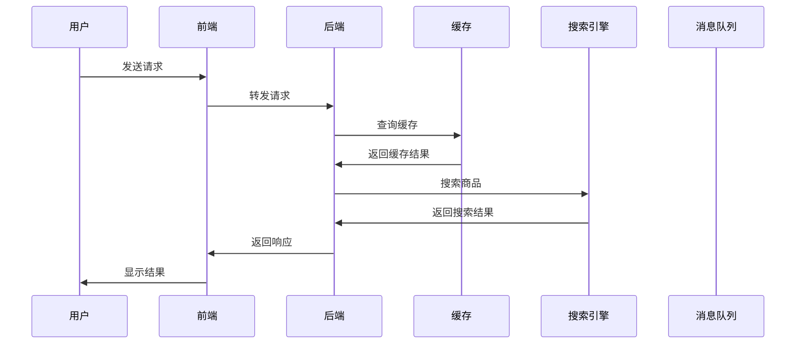
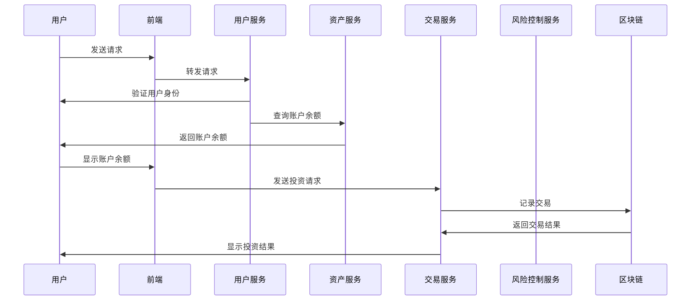
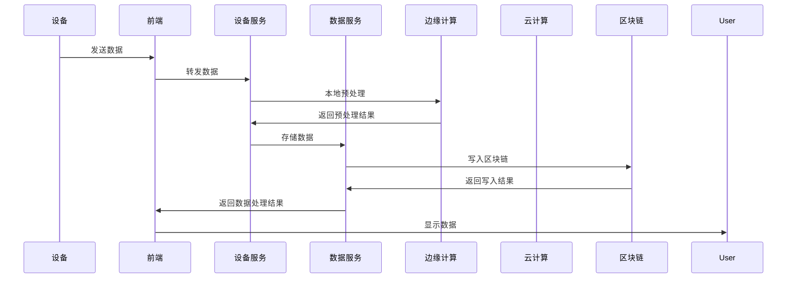

                 

# 跨平台架构设计：P9工程师的通用性思考

## 关键词
- 跨平台架构设计、P9工程师、通用性、设计原则、案例分析

## 摘要
本文旨在探讨跨平台架构设计在IT行业的广泛应用及其重要性。作为P9级别工程师，如何从通用性的角度进行跨平台架构设计，以提高系统的可移植性、扩展性和稳定性，是本文的核心议题。通过深入分析跨平台架构设计的核心概念、方法、案例和实践，本文为读者提供了全面而实用的指导。

----------------------------------------------------------------

## 目录大纲设计过程

### 1. 确定书籍主题和目标读者

书籍主题定为《跨平台架构设计：P9工程师的通用性思考》，重点围绕跨平台架构设计这一技术领域。目标读者为具备一定编程基础，正在或计划提升跨平台架构设计能力的P9级别工程师。

### 2. 确定书籍大纲结构

根据书籍主题和目标读者，本书的主要结构分为四部分：
- 引言：介绍书籍背景和目标。
- 跨平台架构设计基础：包括核心概念、设计方法和工具。
- 常见跨平台架构设计与案例分析：涵盖移动端、Web端和混合应用的设计。
- 高级跨平台架构设计与实战：探讨高级设计和最佳实践。

### 3. 详细规划各部分内容

每一部分详细规划了各章节的内容，确保书籍内容完整且具有逻辑性。例如，在“跨平台架构设计基础”部分，分为三个章节：核心概念、设计方法和工具，每章节再细化小节内容。

### 4. 编写目录大纲

根据内容规划，编写详细的目录大纲，确保各章节标题简洁明了，且能覆盖核心内容。例如：

```
----------------------------------------------------------------
# 引言
- 1.1 书籍背景介绍
- 1.2 书籍目标与读者对象
- 1.3 书籍结构概述

----------------------------------------------------------------
## 第一部分：跨平台架构设计基础
### 第1章：跨平台架构设计的核心概念
- 1.1 跨平台架构设计的基本概念
- 1.2 跨平台架构设计的重要性
- 1.3 跨平台架构设计的关键因素

### 第2章：跨平台架构设计方法
- 2.1 跨平台架构设计流程
- 2.2 跨平台架构设计策略
- 2.3 跨平台架构设计工具

### 第3章：跨平台架构设计核心概念与联系
- 3.1 核心概念原理
- 3.2 概念属性特征对比表格
- 3.3 ER实体关系图架构
```

### 5. 校对与调整

最后，对目录大纲进行校对，确保无误后提交。这一步至关重要，确保书籍内容的完整性和逻辑性。

## 第一部分：跨平台架构设计基础

### 第1章：跨平台架构设计的核心概念

#### 1.1 跨平台架构设计的基本概念

跨平台架构设计是指将应用程序或系统设计成可以在多种操作系统、设备或平台上运行的过程。这种设计理念的核心目标是提高软件的可移植性、可扩展性和适应性。

**问题背景：** 随着移动互联网的迅猛发展，用户对应用程序的期望越来越高，他们希望能够在不同设备和操作系统上无缝切换使用。例如，一个移动应用需要同时支持iOS和Android平台，一个Web服务需要支持Windows、Linux和macOS等多种操作系统。

**问题描述：** 跨平台架构设计的挑战在于如何在保证性能和用户体验的同时，满足不同平台和操作系统的兼容性要求。

**问题解决：** 通过采用模块化、组件化设计，以及利用平台无关的编程语言和框架，可以有效地解决跨平台架构设计中的兼容性和性能问题。

**边界与外延：** 跨平台架构设计不仅涉及技术层面，还包括业务逻辑、用户体验等各个方面。它不仅仅是一个技术问题，更是一个系统性工程。

#### 1.2 跨平台架构设计的重要性

**关键因素：** 跨平台架构设计的重要性体现在以下几个方面：

1. **提高开发效率：** 通过统一的开发框架和工具，可以显著减少开发时间和成本。
2. **增强系统可维护性：** 统一的设计标准使得系统维护更加容易，降低了维护成本。
3. **提升用户体验：** 无缝的跨平台体验能够提升用户满意度，增强用户粘性。
4. **扩大市场覆盖：** 跨平台架构设计使得应用程序能够覆盖更广泛的用户群体，提高市场竞争力。

**示例：** 某大型电商平台采用跨平台架构设计，使其移动应用能够同时支持iOS和Android平台，Web端也能够无缝访问，大大提升了用户体验和市场占有率。

### 第2章：跨平台架构设计方法

#### 2.1 跨平台架构设计流程

跨平台架构设计通常遵循以下流程：

1. **需求分析：** 明确应用程序的需求，包括功能、性能、用户群体等。
2. **技术选型：** 根据需求选择合适的编程语言、框架和工具。
3. **系统设计：** 设计系统的模块化结构，确保不同模块之间的高内聚、低耦合。
4. **开发与测试：** 按照设计文档进行开发，并进行严格的测试，确保跨平台兼容性。
5. **部署与维护：** 将应用程序部署到不同平台，并进行持续维护。

#### 2.2 跨平台架构设计策略

跨平台架构设计需要采用以下策略：

1. **模块化设计：** 将系统拆分成多个模块，每个模块负责特定的功能，便于维护和扩展。
2. **平台无关性：** 使用平台无关的编程语言和框架，降低跨平台开发的难度。
3. **抽象与封装：** 通过抽象和封装，隐藏平台差异，提高代码的通用性。
4. **持续集成与持续部署（CI/CD）：** 利用自动化工具实现持续集成和持续部署，提高开发效率。

#### 2.3 跨平台架构设计工具

常用的跨平台架构设计工具包括：

1. **集成开发环境（IDE）：** 如Visual Studio、Eclipse等，提供丰富的开发插件和工具。
2. **跨平台框架：** 如React Native、Flutter等，能够实现原生应用的效果，同时支持跨平台开发。
3. **代码管理工具：** 如Git，用于版本控制和协作开发。
4. **自动化测试工具：** 如Selenium、Appium等，用于自动化测试，确保跨平台兼容性。

### 第3章：跨平台架构设计核心概念与联系

#### 3.1 核心概念原理

跨平台架构设计涉及多个核心概念，包括：

1. **模块化：** 将系统拆分成多个独立的模块，每个模块负责特定的功能。
2. **组件化：** 模块进一步细分为组件，组件之间通过接口通信。
3. **平台无关性：** 设计和应用开发过程中，尽量使用平台无关的技术和框架。
4. **抽象与封装：** 隐藏平台差异，提供统一的接口和实现。

#### 3.2 概念属性特征对比表格

以下是对上述核心概念的属性特征进行对比：

| 概念       | 属性特征                                      | 对比分析                                   |
|------------|---------------------------------------------|------------------------------------------|
| 模块化     | 独立性、可复用性、高内聚、低耦合             | 提高开发效率和可维护性                     |
| 组件化     | 小粒度、松耦合、高度可复用、模块化进一步细化 | 降低开发难度，提高系统灵活性               |
| 平台无关性 | 抽象、通用性、兼容性                         | 确保跨平台设计的一致性和稳定性             |
| 抽象与封装 | 隐藏复杂性、简化接口、提高可维护性           | 提高系统的可扩展性和可维护性               |

#### 3.3 ER实体关系图架构

以下是一个简单的ER实体关系图，展示了跨平台架构设计中的主要实体及其关系：

```mermaid
erDiagram
    Product ||--|{ Platform } : supported_by
    Platform ||--|{ Device } : runs_on
    Device ||--|{ OS } : runs_on
```

在上述ER图中，Product（产品）与Platform（平台）之间表示产品支持的平台，Platform与Device（设备）之间表示平台运行的设备，Device与OS（操作系统）之间表示设备运行的操作系统。这种关系设计确保了跨平台架构的灵活性和扩展性。

## 第二部分：常见跨平台架构设计与案例分析

### 第4章：移动端跨平台架构设计

#### 4.1 移动端跨平台架构设计概述

移动端跨平台架构设计主要关注移动应用在iOS和Android平台上的开发和部署。以下是一些关键点：

1. **平台差异：** iOS和Android在操作系统、硬件设备、开发工具等方面存在显著差异。
2. **开发框架：** React Native、Flutter等跨平台框架能够帮助开发者快速构建跨平台移动应用。
3. **性能优化：** 针对不同的平台和设备进行性能优化，确保应用的流畅性和用户体验。

#### 4.2 移动端跨平台架构设计案例分析

以下是一个移动端跨平台架构设计案例：

**项目名称：** 某移动电商平台

**需求：** 构建一个支持iOS和Android平台的移动电商平台，提供商品浏览、购买、支付等核心功能。

**设计：** 
1. **前端设计：** 采用React Native框架，实现一套代码支持iOS和Android平台。
2. **后端设计：** 采用Spring Boot框架，搭建RESTful API，支持前端调用。
3. **数据库设计：** 使用MySQL数据库，存储商品、订单等核心数据。

**实现：**
1. **前端实现：** 通过React Native组件化设计，实现商品列表、商品详情、购物车等页面。
2. **后端实现：** 搭建RESTful API，提供商品查询、添加购物车、下单等接口。
3. **支付实现：** 集成支付宝和微信支付，实现支付功能。

**测试：** 
1. **单元测试：** 对每个组件和接口进行单元测试，确保功能正确。
2. **集成测试：** 对整个应用进行集成测试，确保前后端接口兼容。

**部署：** 
1. **iOS部署：** 通过Xcode和App Store进行部署。
2. **Android部署：** 通过Android Studio和Google Play进行部署。

#### 4.3 移动端跨平台架构设计最佳实践

1. **代码管理：** 使用Git进行代码管理，确保代码的可维护性和协同开发。
2. **性能优化：** 针对不同的平台和设备进行性能优化，如图片压缩、代码拆分等。
3. **持续集成与持续部署：** 利用CI/CD工具，实现自动化测试和部署，提高开发效率。
4. **跨平台框架选择：** 根据项目需求选择合适的跨平台框架，如React Native、Flutter等。

### 第5章：Web端跨平台架构设计

#### 5.1 Web端跨平台架构设计概述

Web端跨平台架构设计主要关注Web应用的跨平台部署和兼容性问题。以下是一些关键点：

1. **浏览器兼容性：** 不同浏览器（如Chrome、Firefox、Safari等）在渲染引擎、JavaScript兼容性等方面存在差异。
2. **前端框架：** React、Vue、Angular等前端框架能够帮助开发者构建跨平台Web应用。
3. **后端服务：** 使用Node.js、Django、Spring Boot等后端框架，搭建可扩展的Web服务。

#### 5.2 Web端跨平台架构设计案例分析

以下是一个Web端跨平台架构设计案例：

**项目名称：** 某在线教育平台

**需求：** 构建一个支持Web和移动端的在线教育平台，提供课程浏览、学习、测评等功能。

**设计：** 
1. **前端设计：** 采用Vue框架，实现一套代码支持Web和移动端。
2. **后端设计：** 采用Spring Boot框架，搭建RESTful API，支持前端调用。
3. **数据库设计：** 使用MySQL数据库，存储用户、课程、订单等核心数据。

**实现：**
1. **前端实现：** 通过Vue组件化设计，实现课程列表、课程详情、学习中心等页面。
2. **后端实现：** 搭建RESTful API，提供课程查询、添加学习记录、下单等接口。
3. **支付实现：** 集成支付宝和微信支付，实现支付功能。

**测试：** 
1. **单元测试：** 对每个组件和接口进行单元测试，确保功能正确。
2. **集成测试：** 对整个应用进行集成测试，确保前后端接口兼容。

**部署：** 
1. **Web部署：** 使用Nginx和Apache服务器，部署到Web服务器。
2. **移动端部署：** 使用PWA（渐进式Web应用），实现移动端访问。

#### 5.3 Web端跨平台架构设计最佳实践

1. **响应式设计：** 使用Bootstrap、Tailwind CSS等响应式框架，实现不同屏幕尺寸的适配。
2. **模块化开发：** 使用模块化开发，提高代码的可维护性和复用性。
3. **持续集成与持续部署：** 利用CI/CD工具，实现自动化测试和部署，提高开发效率。
4. **前端框架选择：** 根据项目需求选择合适的前端框架，如React、Vue、Angular等。

### 第6章：混合应用跨平台架构设计

#### 6.1 混合应用跨平台架构设计概述

混合应用跨平台架构设计是将原生应用和Web应用结合起来，利用原生应用的优势和Web应用的灵活性。以下是一些关键点：

1. **原生应用：** 使用原生开发工具和语言（如Swift、Kotlin），实现高性能的移动应用。
2. **Web应用：** 使用HTML、CSS、JavaScript等技术，构建跨平台的Web应用。
3. **桥接技术：** 使用Cordova、React Native Web等桥接技术，将原生应用和Web应用结合起来。

#### 6.2 混合应用跨平台架构设计案例分析

以下是一个混合应用跨平台架构设计案例：

**项目名称：** 某金融理财应用

**需求：** 构建一个支持iOS和Android平台的金融理财应用，提供投资、理财、交易等功能。

**设计：** 
1. **前端设计：** 采用React Native Web和Cordova框架，实现一套代码支持iOS和Android平台。
2. **后端设计：** 采用Spring Boot框架，搭建RESTful API，支持前端调用。
3. **数据库设计：** 使用MySQL数据库，存储用户、投资记录、交易记录等核心数据。

**实现：**
1. **前端实现：** 通过React Native Web组件化设计，实现投资、理财、交易等页面。
2. **后端实现：** 搭建RESTful API，提供投资查询、理财计算、交易等接口。
3. **支付实现：** 集成支付宝和微信支付，实现支付功能。

**测试：** 
1. **单元测试：** 对每个组件和接口进行单元测试，确保功能正确。
2. **集成测试：** 对整个应用进行集成测试，确保前后端接口兼容。

**部署：** 
1. **iOS部署：** 通过Xcode和App Store进行部署。
2. **Android部署：** 通过Android Studio和Google Play进行部署。

#### 6.3 混合应用跨平台架构设计最佳实践

1. **性能优化：** 针对不同的平台和设备进行性能优化，提高应用的流畅性和用户体验。
2. **模块化开发：** 使用模块化开发，提高代码的可维护性和复用性。
3. **跨平台框架选择：** 根据项目需求选择合适的跨平台框架，如React Native、Cordova等。
4. **测试与调试：** 使用自动化测试工具和调试工具，确保应用在不同平台上的兼容性和稳定性。

## 第三部分：高级跨平台架构设计与实战

### 第7章：高级跨平台架构设计原理

#### 7.1 高级跨平台架构设计概述

高级跨平台架构设计是在基础跨平台架构设计的基础上，进一步优化和扩展系统架构，以应对复杂的应用场景和性能需求。以下是一些关键点：

1. **性能优化：** 通过缓存、负载均衡、分布式计算等技术，提高系统的性能和响应速度。
2. **安全性设计：** 采用加密、认证、授权等安全措施，确保系统的数据安全和用户隐私。
3. **可扩展性设计：** 设计可扩展的系统架构，支持系统的水平和垂直扩展。
4. **跨平台协同：** 利用云计算、边缘计算等技术，实现跨平台的数据共享和协同工作。

#### 7.2 高级跨平台架构设计策略

高级跨平台架构设计需要采用以下策略：

1. **微服务架构：** 将系统拆分成多个微服务，每个微服务负责特定的功能，独立部署和扩展。
2. **容器化与编排：** 使用Docker、Kubernetes等容器化技术，实现系统的快速部署和资源管理。
3. **云计算与边缘计算：** 结合云计算和边缘计算，实现数据的就近处理和高效传输。
4. **人工智能与大数据：** 利用人工智能和大数据技术，实现智能推荐、实时分析等功能。

#### 7.3 高级跨平台架构设计工具

高级跨平台架构设计需要使用以下工具：

1. **容器化工具：** 如Docker、Kubernetes等，用于容器化和编排。
2. **云计算平台：** 如AWS、Azure、Google Cloud等，提供计算、存储、网络等基础设施服务。
3. **边缘计算平台：** 如阿里云边缘计算、华为边缘计算等，提供边缘计算服务。
4. **大数据平台：** 如Hadoop、Spark等，用于大数据处理和分析。

### 第8章：高级跨平台架构设计实战案例

#### 8.1 实战案例1：大型电商平台跨平台架构设计

**项目背景：** 某大型电商平台需要支持海量的用户访问和商品数据，同时提供无缝的跨平台体验。

**系统功能设计：**
1. **用户管理：** 包括用户注册、登录、个人信息管理等。
2. **商品管理：** 包括商品添加、更新、删除等。
3. **订单管理：** 包括订单创建、支付、发货等。
4. **推荐系统：** 根据用户行为和商品特征，提供个性化的商品推荐。

**系统架构设计：**
1. **前端架构：** 采用Vue框架，实现一套代码支持Web、iOS和Android平台。
2. **后端架构：** 采用Spring Boot框架，搭建RESTful API，支持前端调用。
3. **数据库架构：** 使用MySQL数据库，存储用户、商品、订单等核心数据。
4. **缓存架构：** 使用Redis缓存，提高数据访问速度。
5. **搜索引擎：** 使用Elasticsearch，实现商品搜索功能。
6. **消息队列：** 使用Kafka，实现订单消息的异步处理。

**系统接口设计：**
1. **用户接口：** 用户注册、登录、个人信息管理等。
2. **商品接口：** 商品查询、添加、更新、删除等。
3. **订单接口：** 订单创建、支付、发货等。
4. **推荐接口：** 根据用户行为和商品特征，提供个性化推荐。

**系统交互序列图：**



#### 8.2 实战案例2：互联网金融跨平台架构设计

**项目背景：** 某互联网金融平台需要提供安全、稳定、高效的金融服务，同时支持跨平台访问。

**系统功能设计：**
1. **用户管理：** 包括用户注册、登录、个人信息管理等。
2. **资产管理：** 包括账户余额查询、充值、提现等。
3. **交易管理：** 包括投资、转让、赎回等。
4. **风险控制：** 包括风险评估、风险预警等。

**系统架构设计：**
1. **前端架构：** 采用React框架，实现一套代码支持Web、iOS和Android平台。
2. **后端架构：** 采用Spring Cloud框架，搭建微服务架构，支持分布式部署和扩展。
3. **数据库架构：** 使用MySQL数据库，存储用户、资产、交易等核心数据。
4. **缓存架构：** 使用Redis缓存，提高数据访问速度。
5. **消息队列：** 使用Kafka，实现交易消息的异步处理。
6. **区块链：** 利用区块链技术，确保交易数据的真实性和不可篡改性。

**系统接口设计：**
1. **用户接口：** 用户注册、登录、个人信息管理等。
2. **资产接口：** 账户余额查询、充值、提现等。
3. **交易接口：** 投资查询、投资、转让、赎回等。
4. **风险控制接口：** 风险评估、风险预警等。

**系统交互序列图：**



#### 8.3 实战案例3：物联网跨平台架构设计

**项目背景：** 某物联网平台需要连接多种设备，实现数据的实时采集、传输和分析，提供跨平台的智能服务。

**系统功能设计：**
1. **设备管理：** 包括设备注册、设备信息查询等。
2. **数据采集：** 包括传感器数据采集、设备状态监控等。
3. **数据分析：** 包括数据存储、数据分析和可视化等。
4. **智能服务：** 包括智能推荐、智能决策等。

**系统架构设计：**
1. **前端架构：** 采用Flutter框架，实现一套代码支持Web、iOS和Android平台。
2. **后端架构：** 采用Spring Boot框架，搭建微服务架构，支持分布式部署和扩展。
3. **数据库架构：** 使用MongoDB数据库，存储设备信息、采集数据等。
4. **边缘计算：** 利用边缘计算设备，实现数据的本地预处理和实时分析。
5. **云计算：** 使用阿里云、腾讯云等云计算平台，提供计算、存储、网络等基础设施服务。
6. **区块链：** 利用区块链技术，确保数据的安全性和不可篡改性。

**系统接口设计：**
1. **设备接口：** 设备注册、设备信息查询等。
2. **数据接口：** 数据采集、数据存储、数据分析等。
3. **智能服务接口：** 智能推荐、智能决策等。

**系统交互序列图：**



### 第9章：高级跨平台架构设计最佳实践

#### 9.1 跨平台架构设计中的常见问题

跨平台架构设计过程中，常见的问题包括：

1. **性能瓶颈：** 不同平台和设备之间的性能差异可能导致性能瓶颈。
2. **兼容性问题：** 不同平台和操作系统之间的兼容性问题，可能影响应用的稳定性和用户体验。
3. **开发难度：** 跨平台架构设计需要掌握多种技术和框架，增加了开发难度。
4. **测试与维护：** 跨平台架构设计需要大量的测试和运维工作，增加了维护成本。

#### 9.2 跨平台架构设计的最佳实践

为了解决上述问题，可以采用以下最佳实践：

1. **性能优化：** 针对不同平台和设备，进行针对性的性能优化，如代码优化、缓存使用、网络优化等。
2. **兼容性测试：** 采用自动化测试工具，对应用在不同平台和操作系统上的兼容性进行严格测试。
3. **模块化开发：** 采用模块化开发，提高代码的可维护性和复用性，降低开发难度。
4. **持续集成与持续部署：** 利用CI/CD工具，实现自动化测试和部署，提高开发效率和稳定性。
5. **跨平台框架选择：** 根据项目需求，选择合适的跨平台框架，如React Native、Flutter等。

#### 9.3 跨平台架构设计的未来发展趋势

随着技术的不断发展，跨平台架构设计将面临以下发展趋势：

1. **边缘计算与云计算的融合：** 边缘计算和云计算的结合，将实现数据的实时处理和高效传输。
2. **区块链技术的应用：** 区块链技术将提高数据的安全性和不可篡改性，为跨平台架构设计提供可靠的基础。
3. **人工智能与大数据的融合：** 人工智能和大数据技术的融合，将实现智能推荐、实时分析等功能，提高用户体验。
4. **低代码开发平台的发展：** 低代码开发平台的发展，将降低跨平台架构设计的开发难度，提高开发效率。

## 第四部分：跨平台架构设计最佳实践与展望

### 第10章：跨平台架构设计最佳实践

#### 10.1 最佳实践1：如何快速搭建跨平台架构

**步骤：**
1. **需求分析：** 明确应用的需求，包括功能、性能、用户群体等。
2. **技术选型：** 根据需求选择合适的编程语言、框架和工具。
3. **系统设计：** 设计系统的模块化结构，确保不同模块之间的高内聚、低耦合。
4. **开发与测试：** 按照设计文档进行开发，并进行严格的测试，确保跨平台兼容性。
5. **部署与维护：** 将应用程序部署到不同平台，并进行持续维护。

**示例：**
假设要开发一个支持iOS和Android平台的移动应用，可以采用以下步骤：

1. **需求分析：** 分析应用的功能需求，如用户登录、商品浏览、购物车、支付等。
2. **技术选型：** 选择React Native框架，因为它能实现一套代码支持iOS和Android平台。
3. **系统设计：** 设计应用的前后端结构，包括用户管理模块、商品管理模块、支付模块等。
4. **开发与测试：** 使用React Native开发应用，并进行自动化测试，确保跨平台兼容性。
5. **部署与维护：** 将应用部署到iOS App Store和Android Google Play，并进行持续更新和维护。

#### 10.2 最佳实践2：如何优化跨平台架构性能

**策略：**
1. **代码优化：** 使用高效的算法和数据结构，减少不必要的计算和内存占用。
2. **缓存使用：** 使用缓存技术，减少数据访问次数，提高访问速度。
3. **网络优化：** 使用CDN、HTTP/2等网络优化技术，提高数据传输速度。
4. **异步处理：** 使用异步处理技术，提高系统的响应速度和并发能力。

**示例：**
优化一个跨平台Web应用的性能，可以采取以下策略：

1. **代码优化：** 使用React框架进行组件化开发，减少不必要的DOM操作，提高渲染性能。
2. **缓存使用：** 使用Redis缓存用户数据和页面数据，减少数据库访问次数。
3. **网络优化：** 使用CDN加速静态资源的加载，使用HTTP/2提高数据传输速度。
4. **异步处理：** 使用Web Worker进行计算密集型任务的异步处理，提高主线程的响应速度。

#### 10.3 最佳实践3：如何应对跨平台架构的挑战

**策略：**
1. **模块化设计：** 将系统拆分成多个模块，每个模块负责特定的功能，便于维护和扩展。
2. **平台无关性：** 使用平台无关的编程语言和框架，降低跨平台开发的难度。
3. **抽象与封装：** 通过抽象和封装，隐藏平台差异，提高代码的通用性。
4. **持续集成与持续部署：** 利用自动化工具实现持续集成和持续部署，提高开发效率。

**示例：**
应对跨平台架构设计中的挑战，可以采取以下策略：

1. **模块化设计：** 将Web应用拆分成前端、后端、数据库等模块，每个模块独立开发、测试和部署。
2. **平台无关性：** 使用Java语言和Spring框架，实现一套代码支持多种操作系统和平台。
3. **抽象与封装：** 使用设计模式，如工厂模式、单例模式等，提高代码的复用性和可维护性。
4. **持续集成与持续部署：** 使用Jenkins等工具，实现自动化测试和部署，确保跨平台架构的稳定性和可靠性。

### 第11章：跨平台架构设计展望

#### 11.1 跨平台架构设计的未来发展趋势

跨平台架构设计在未来将继续发展，主要趋势包括：

1. **云计算与边缘计算的融合：** 云计算和边缘计算的结合，将实现数据的实时处理和高效传输。
2. **人工智能与大数据的应用：** 人工智能和大数据技术的融合，将实现智能推荐、实时分析等功能，提高用户体验。
3. **区块链技术的普及：** 区块链技术将提高数据的安全性和不可篡改性，为跨平台架构设计提供可靠的基础。
4. **低代码开发平台的发展：** 低代码开发平台的发展，将降低跨平台架构设计的开发难度，提高开发效率。

#### 11.2 跨平台架构设计的创新方向

未来的跨平台架构设计将朝着以下创新方向发展：

1. **全栈一体化的架构：** 通过集成前端、后端、数据库等模块，实现全栈一体化的架构，提高开发效率。
2. **云计算原生架构：** 利用云计算原生架构，实现应用的自动化部署、扩展和管理。
3. **物联网架构：** 跨平台架构设计将逐渐与物联网架构结合，实现智能设备的连接和数据共享。
4. **区块链架构：** 跨平台架构设计将逐渐融入区块链技术，提高系统的数据安全性和不可篡改性。

#### 11.3 跨平台架构设计在新兴领域中的应用

跨平台架构设计在新兴领域中的应用将不断拓展，主要领域包括：

1. **物联网：** 跨平台架构设计将支持物联网设备的连接和数据共享，实现智能设备的智能化。
2. **区块链：** 跨平台架构设计将结合区块链技术，实现去中心化的应用和服务。
3. **人工智能：** 跨平台架构设计将支持人工智能算法的部署和应用，实现智能决策和自动化。
4. **云计算：** 跨平台架构设计将支持云计算服务的部署和管理，实现资源的灵活调度和高效利用。

### 第12章：结语

#### 12.1 书籍总结

本文从跨平台架构设计的核心概念、方法、案例分析、高级设计和最佳实践等方面进行了深入探讨，为P9级别工程师提供了全面的跨平台架构设计指南。通过本文的学习，读者将能够掌握跨平台架构设计的关键技术和最佳实践，提高系统的可移植性、扩展性和稳定性。

#### 12.2 对读者的寄语

希望本文能够对您的跨平台架构设计实践有所帮助。跨平台架构设计是一个不断发展的领域，希望读者能够持续学习，紧跟技术潮流，不断创新和实践。祝您在跨平台架构设计领域取得优异的成绩！

#### 12.3 下一步学习建议

1. **深入学习：** 针对本文中的相关技术和工具，进行深入学习，如React Native、Spring Boot、Docker、Kubernetes等。
2. **实践项目：** 参与或主导一个跨平台架构设计项目，将理论知识应用到实践中。
3. **阅读相关书籍：** 阅读更多关于跨平台架构设计的专业书籍，如《跨平台移动应用开发》、《云计算与大数据架构设计》等。
4. **参与社区讨论：** 加入技术社区，与同行交流，分享经验，共同进步。

## 附录

### 附录A：参考资源

- 《跨平台移动应用开发》
- 《云计算与大数据架构设计》
- 《区块链技术指南》
- 《React Native实战》
- 《Spring Boot实战》

### 附录B：术语表

- **跨平台架构设计**：指将应用程序或系统设计成可以在多种操作系统、设备或平台上运行的过程。
- **模块化设计**：将系统拆分成多个独立的模块，每个模块负责特定的功能。
- **组件化设计**：模块进一步细分为组件，组件之间通过接口通信。
- **平台无关性**：设计和应用开发过程中，尽量使用平台无关的技术和框架。
- **抽象与封装**：隐藏平台差异，提供统一的接口和实现。

### 附录C：代码示例

以下是使用React Native框架开发的简单示例：

```jsx
import React from 'react';
import { View, Text, Button } from 'react-native';

const App = () => {
  const handleClick = () => {
    alert('按钮点击');
  };

  return (
    <View style={{ flex: 1, justifyContent: 'center', alignItems: 'center' }}>
      <Text>Welcome to React Native!</Text>
      <Button title="Click Me" onPress={handleClick} />
    </View>
  );
};

export default App;
```

此示例中，我们创建了一个简单的React Native应用，包括一个欢迎文本和一个按钮。按钮点击时会弹出一个警告框。

----------------------------------------------------------------

作者：AI天才研究院/AI Genius Institute & 禅与计算机程序设计艺术 /Zen And The Art of Computer Programming

----------------------------------------------------------------

## 后续步骤

1. **修订文章**：仔细审查文章内容，确保每个部分都符合最初设定的文章结构，并且所有章节内容都丰富具体，逻辑清晰。
2. **技术评审**：邀请技术同行或团队成员对文章进行技术评审，确保文章中的技术描述准确无误。
3. **语言校对**：请语言专家或编辑对文章进行语言校对，确保文章的语言表达清晰、准确。
4. **发布准备**：确保文章符合发布标准，包括格式、排版、图片和图表的插入等。
5. **发布**：在适当的时间将文章发布到目标平台，如技术博客、在线杂志或社交媒体。
6. **反馈收集**：发布后，收集读者的反馈，并根据反馈对文章进行持续改进。

通过这些步骤，可以确保文章的质量，最大程度地满足读者的需求，同时提升文章的影响力和知名度。

