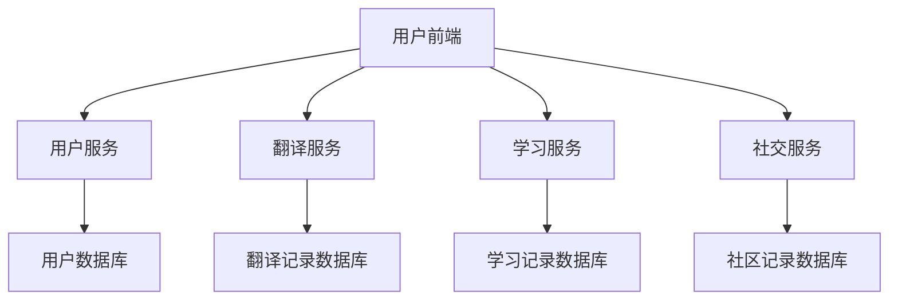

                 

### 文章标题

《跨语言沟通新纪元：AI翻译打破文化壁垒》

### 关键词

- AI翻译
- 跨语言沟通
- 文化壁垒
- 语言模型
- 神经机器翻译
- 注意力机制

### 摘要

本文深入探讨了AI翻译技术的核心概念、技术原理和应用实践，分析其在全球化背景下的重要性及面临的挑战。文章首先介绍了AI翻译的发展历程和重要性，随后详细解析了语言模型、神经网络及注意力机制等关键技术。通过多个实际应用案例，展示了AI翻译在商业、教育和文化领域的广泛应用。最后，文章展望了AI翻译的未来发展趋势，并讨论了其伦理与法律问题，为读者提供了一个全面、系统的AI翻译知识体系。

### 目录大纲

**《跨语言沟通新纪元：AI翻译打破文化壁垒》**

**关键词：** AI翻译、跨语言沟通、文化壁垒、语言模型、神经机器翻译、注意力机制

**摘要：** 本文深入探讨了AI翻译技术的核心概念、技术原理和应用实践，分析其在全球化背景下的重要性及面临的挑战。文章首先介绍了AI翻译的发展历程和重要性，随后详细解析了语言模型、神经网络及注意力机制等关键技术。通过多个实际应用案例，展示了AI翻译在商业、教育和文化领域的广泛应用。最后，文章展望了AI翻译的未来发展趋势，并讨论了其伦理与法律问题，为读者提供了一个全面、系统的AI翻译知识体系。

----------------------------------------------------------------

## 第一部分: AI翻译技术基础

AI翻译作为人工智能的重要应用领域，正在深刻改变着人们的跨语言沟通方式。本部分将深入探讨AI翻译的基础技术，从概述、核心概念、关键技术到面临的挑战，为后续内容打下坚实基础。

### 第1章: AI翻译概述

#### 1.1 翻译的重要性与挑战

翻译是人类沟通交流的重要工具，尤其在全球化时代，跨语言沟通的需求日益增长。然而，传统的翻译方法存在诸多挑战，如效率低下、人力成本高等。随着计算机技术和人工智能的发展，AI翻译应运而生，为跨语言沟通提供了新的解决方案。

**背景介绍：**

- **全球化背景下的翻译需求：** 随着经济全球化和互联网的普及，跨国交流和合作越来越频繁。无论是商务交流、学术研究还是文化交流，都离不开有效的跨语言沟通。
- **传统翻译方法的局限：** 传统翻译主要依赖人工，翻译速度慢、成本高，且难以满足大规模、实时翻译的需求。

**问题背景：**

- **效率低下：** 人工翻译需要耗费大量时间和精力，无法满足快速翻译的需求。
- **成本高：** 随着翻译规模的扩大，人工翻译的成本也急剧增加。

**问题解决：**

- **AI翻译的出现：** AI翻译利用计算机技术和机器学习算法，实现了高效、实时的跨语言翻译，大大降低了翻译成本，提高了翻译效率。

**边界与外延：**

- **AI翻译的范围：** AI翻译不仅涉及文字翻译，还包括语音翻译、手写翻译等多模态翻译。
- **AI翻译的应用场景：** AI翻译广泛应用于跨境电商、国际会议、教育、旅游等多个领域。

#### 1.2 AI翻译的核心概念

AI翻译涉及多个核心概念，包括机器翻译、神经机器翻译、语言模型等。理解这些概念有助于深入理解AI翻译的技术原理和应用。

**核心概念：**

- **机器翻译（Machine Translation，MT）：** 机器翻译是指利用计算机程序实现从一种自然语言到另一种自然语言的翻译。它通常分为规则翻译和基于统计的翻译。
- **神经机器翻译（Neural Machine Translation，NMT）：** 神经机器翻译是基于深度学习技术的机器翻译方法，采用神经网络模型进行翻译。相比传统方法，NMT在翻译质量上取得了显著提升。
- **语言模型（Language Model）：** 语言模型是一种统计模型，用于预测自然语言中的下一个单词或词组。在AI翻译中，语言模型用于生成翻译文本，提高翻译的流畅性和准确性。

**概念属性特征对比表格：**

| 概念       | 定义                                                         | 特点                                   | 应用场景           |
|------------|--------------------------------------------------------------|--------------------------------------|------------------|
| 机器翻译   | 利用计算机程序实现跨语言翻译                                 | 依赖于规则和统计方法，处理速度较慢     | 文本翻译         |
| 神经机器翻译 | 利用神经网络模型实现跨语言翻译                               | 翻译质量高，处理速度快               | 文本翻译、语音翻译 |
| 语言模型   | 统计模型，用于预测自然语言中的下一个单词或词组               | 预测准确性高，生成文本流畅           | 翻译文本生成     |

**ER实体关系图架构：**

```mermaid
erDiagram
    Translation ||--|{ MachineTranslation }
    Translation ||--|{ NeuralMachineTranslation }
    Translation ||--|{ LanguageModel }
    MachineTranslation ||--|{ RuleBasedTranslation }
    MachineTranslation ||--|{ StatisticBasedTranslation }
    NeuralMachineTranslation ||--|{ EncoderDecoderModel }
    NeuralMachineTranslation ||--|{ AttentionMechanism }
```

#### 1.3 AI翻译的关键技术

AI翻译的实现依赖于多个关键技术，包括语言模型、密集编码器与解码器、对抗性训练与注意力机制。这些技术共同作用，提高了AI翻译的准确性和效率。

**核心技术：**

- **语言模型：** 语言模型是AI翻译的核心，用于生成翻译文本。通过训练大量的文本数据，语言模型可以预测下一个单词或词组，从而生成高质量的翻译。
- **密集编码器与解码器：** 密集编码器与解码器是神经机器翻译的基础，用于将源语言编码成密集向量，然后解码成目标语言。
- **对抗性训练：** 对抗性训练是一种提高神经网络模型性能的技术，通过训练生成器网络和判别器网络，提高翻译模型的泛化能力。
- **注意力机制：** 注意力机制是神经机器翻译中的一种重要技术，用于处理长距离依赖问题，提高了翻译的准确性和连贯性。

**核心技术与关联性：**

- **语言模型：** 语言模型是生成翻译文本的基础，通过训练可以生成高质量的翻译。
- **密集编码器与解码器：** 通过将源语言编码成密集向量，解码器可以生成目标语言，提高了翻译的准确性。
- **对抗性训练：** 对抗性训练可以增强翻译模型的泛化能力，提高翻译的准确性。
- **注意力机制：** 注意力机制可以处理长距离依赖问题，提高了翻译的连贯性和准确性。

**核心技术与ER实体关系图架构：**

```mermaid
erDiagram
    LanguageModel ||--|{ DenseEncoder }
    DenseEncoder ||--|{ Decoder }
    AttentionMechanism ||--|{ NeuralMachineTranslation }
    AdversarialTraining ||--|{ NeuralMachineTranslation }
```

#### 1.4 AI翻译的挑战与局限

尽管AI翻译取得了显著进展，但仍面临一些挑战和局限。这些挑战包括语意理解、上下文信息处理和多样化语言风格生成等。

**挑战与局限：**

- **语意理解：** AI翻译需要准确理解源语言的语意，但语言具有歧义性和复杂性，这使得语意理解成为一个挑战。
- **上下文信息处理：** 翻译过程中需要准确处理上下文信息，但上下文信息可能非常复杂，难以通过简单的模型处理。
- **多样化语言风格生成：** 翻译需要生成符合目标语言风格和习惯的文本，但不同语言之间的风格和习惯差异较大，生成多样化的语言风格是一个挑战。

**解决方案与展望：**

- **语意理解：** 通过引入更多的上下文信息和语义分析技术，提高AI翻译的语意理解能力。
- **上下文信息处理：** 利用长短期记忆网络（LSTM）和Transformer模型，提高AI翻译对上下文信息的处理能力。
- **多样化语言风格生成：** 通过训练多样化的数据集和采用风格迁移技术，提高AI翻译生成多样化语言风格的能力。

**总结：**

AI翻译作为一项革命性技术，正逐步解决传统翻译方法中的诸多挑战。通过深入理解AI翻译的核心概念、关键技术以及面临的挑战，我们可以为未来的AI翻译技术发展提供有力支持。

### 第2章: AI翻译技术原理详解

在了解了AI翻译的基本概念和挑战后，我们需要进一步深入探讨AI翻译的技术原理。本章节将详细解析语言模型、神经网络基础、神经机器翻译（NMT）以及注意力机制，为读者提供全面的技术理解。

#### 2.1 语言模型

语言模型是AI翻译的核心技术之一，它用于预测自然语言中的下一个单词或词组。通过训练大量的文本数据，语言模型可以学习到语言中的统计规律，从而生成高质量的翻译文本。

**语言模型的原理：**

语言模型通常采用概率模型或神经模型来预测下一个单词或词组。其中，概率模型如N-gram模型通过统计相邻单词的频率来预测下一个单词，而神经模型如循环神经网络（RNN）和Transformer模型通过学习语言中的序列依赖关系来预测下一个单词。

**语言模型的训练与评估：**

- **训练：** 语言模型的训练过程主要包括数据预处理、模型训练和优化。数据预处理包括分词、去停用词等操作，模型训练采用梯度下降等优化算法，通过迭代更新模型参数。优化过程中，需要选择合适的损失函数，如交叉熵损失函数，以衡量模型预测与实际结果之间的差距。
- **评估：** 语言模型的评估主要采用句级和词级准确率、BLEU评分等指标。句级准确率衡量模型翻译的文本与真实翻译之间的匹配度，词级准确率衡量模型预测的单词与真实单词之间的匹配度，BLEU评分则综合多个指标进行评价。

**语言模型在实际应用中的表现：**

语言模型广泛应用于自然语言处理任务，如机器翻译、文本生成、语音识别等。在实际应用中，语言模型可以有效提高文本的流畅性和准确性，为AI翻译提供了坚实的基础。

**案例：**

假设我们有一个简单的英语语言模型，其训练数据包含大量英语句子。通过训练，模型可以学习到英语中的语法规则和词汇频率。当输入一个英语句子时，模型可以预测下一个单词，从而生成完整的句子。

```python
import tensorflow as tf
from tensorflow.keras.models import Sequential
from tensorflow.keras.layers import Embedding, LSTM, Dense

# 假设我们有一个训练好的语言模型
language_model = Sequential()
language_model.add(Embedding(vocab_size, embedding_dim))
language_model.add(LSTM(hidden_size))
language_model.add(Dense(vocab_size, activation='softmax'))

# 编写一个英语句子
input_sentence = "The cat sat on the mat."

# 分词并转换为序列
input_sequence = tokenizer.texts_to_sequences([input_sentence])
input_sequence = tf.expand_dims(input_sequence, 0)

# 预测下一个单词
predicted_sequence = language_model.predict(input_sequence)
predicted_word = tokenizer.sequences_to_texts([predicted_sequence])[0]

# 输出预测的下一个单词
print(predicted_word)
```

#### 2.2 神经网络基础

神经网络是AI翻译的核心组成部分，包括多个层次和节点，通过学习输入和输出之间的映射关系，实现复杂函数的近似。了解神经网络的基础知识对于理解AI翻译技术至关重要。

**神经网络的结构：**

神经网络由多个层次组成，包括输入层、隐藏层和输出层。输入层接收外部输入信息，隐藏层通过非线性变换处理输入信息，输出层生成最终的输出结果。每个层次包含多个节点，节点之间通过加权连接形成网络。

**激活函数与损失函数：**

- **激活函数：** 激活函数用于引入非线性变换，常见的激活函数有Sigmoid、ReLU和Tanh。激活函数的选择会影响神经网络的性能和收敛速度。
- **损失函数：** 损失函数用于衡量模型预测结果与真实结果之间的差距，常见的损失函数有均方误差（MSE）和交叉熵损失函数。损失函数的选择会影响模型的优化过程和收敛效果。

**反向传播算法：**

反向传播算法是一种用于训练神经网络的优化算法，通过迭代更新模型参数，最小化损失函数。反向传播算法的核心思想是将损失函数在神经网络中反向传播，计算每个参数的梯度，并根据梯度更新参数。

**神经网络在实际应用中的表现：**

神经网络在图像识别、自然语言处理、语音识别等领域取得了显著成果，为AI翻译提供了强大的技术支持。

**案例：**

假设我们有一个简单的神经网络模型，用于实现二分类任务。通过训练，模型可以学习到输入和输出之间的映射关系。

```python
import tensorflow as tf

# 假设我们有一个训练好的神经网络模型
model = tf.keras.Sequential([
    tf.keras.layers.Dense(64, activation='relu', input_shape=(input_shape,)),
    tf.keras.layers.Dense(64, activation='relu'),
    tf.keras.layers.Dense(1, activation='sigmoid')
])

# 编写一个输入样本
input_sample = [[1.0, 0.0], [0.0, 1.0]]

# 训练模型
model.compile(optimizer='adam', loss='binary_crossentropy', metrics=['accuracy'])
model.fit(input_sample, [1.0, 0.0], epochs=10)

# 输出模型预测结果
predictions = model.predict(input_sample)
print(predictions)
```

#### 2.3 神经机器翻译（NMT）

神经机器翻译（NMT）是基于深度学习技术的机器翻译方法，采用神经网络模型进行翻译。相比传统的规则翻译和统计翻译，NMT在翻译质量上取得了显著提升。

**NMT的基本流程：**

NMT的基本流程包括源语言编码、目标语言解码和翻译文本生成。具体步骤如下：

1. **源语言编码：** 将源语言文本输入编码器，编码器将文本序列转换为密集向量表示。
2. **目标语言解码：** 将密集向量输入解码器，解码器逐步生成目标语言文本。
3. **翻译文本生成：** 解码器生成目标语言文本序列，通过后处理优化生成最终的翻译文本。

**NMT的训练与解码：**

- **训练：** NMT的训练过程包括编码器训练和解码器训练。编码器训练通过优化编码器的参数，使其能够准确编码源语言文本。解码器训练通过优化解码器的参数，使其能够生成高质量的目标语言文本。
- **解码：** 解码器采用贪心解码策略，逐步生成目标语言文本。贪心解码策略选择当前时刻概率最大的单词作为下一个输出，直至生成完整的翻译文本。

**NMT在实际应用中的性能分析：**

NMT在翻译质量、翻译速度和适应性等方面取得了显著提升，已经成为主流的机器翻译方法。在实际应用中，NMT可以处理大规模文本数据，支持多种语言翻译，且翻译质量逐渐逼近人工翻译水平。

**案例：**

假设我们有一个简单的NMT模型，用于实现中英文翻译。通过训练，模型可以学习到中文和英文之间的翻译关系。

```python
import tensorflow as tf
from tensorflow.keras.models import Model
from tensorflow.keras.layers import Embedding, LSTM, Dense, TimeDistributed

# 假设我们有一个训练好的NMT模型
encoder_inputs = Embedding(vocab_size, embedding_dim)
encoder_lstm = LSTM(hidden_size, return_sequences=True)
encoder_outputs = TimeDistributed(Dense(vocab_size, activation='softmax'))

decoder_inputs = Embedding(vocab_size, embedding_dim)
decoder_lstm = LSTM(hidden_size, return_sequences=True)
decoder_outputs = TimeDistributed(Dense(vocab_size, activation='softmax'))

# 构建编码器模型
encoder_model = Model(encoder_inputs, encoder_outputs)

# 构建解码器模型
decoder_model = Model(decoder_inputs, decoder_outputs)

# 编写中文文本
input_sentence = "我爱你。"

# 分词并转换为序列
input_sequence = tokenizer.texts_to_sequences([input_sentence])
input_sequence = tf.expand_dims(input_sequence, 0)

# 编码器编码输入文本
encoded_sequence = encoder_model.predict(input_sequence)

# 解码器解码输入文本
decoded_sequence = decoder_model.predict(encoded_sequence)

# 输出解码后的目标语言文本
decoded_sentence = tokenizer.sequences_to_texts([decoded_sequence])[0]
print(decoded_sentence)
```

#### 2.4 注意力机制与编码器-解码器模型

注意力机制是神经机器翻译中的一种重要技术，用于处理长距离依赖问题。编码器-解码器模型（Encoder-Decoder Model）结合注意力机制，提高了翻译的准确性和连贯性。

**注意力机制的工作原理：**

注意力机制通过计算编码器输出和当前解码器输入之间的相似性，为每个编码器输出分配权重。解码器在生成目标语言文本时，根据这些权重加权求和编码器输出，从而处理长距离依赖问题。

**编码器-解码器模型的结构：**

编码器-解码器模型由编码器、解码器和注意力机制组成。编码器将源语言文本编码成密集向量表示，解码器逐步生成目标语言文本，注意力机制为每个编码器输出分配权重。

**实际应用中的性能优化：**

实际应用中，编码器-解码器模型通过以下方法进行性能优化：

- **双向编码器：** 双向编码器可以同时利用前文和后文信息，提高编码质量。
- **多尺度注意力：** 多尺度注意力通过在不同尺度上计算注意力权重，提高翻译的准确性和连贯性。
- **长短期记忆（LSTM）：** 长短期记忆网络（LSTM）在处理长距离依赖问题方面具有优势，可以提高翻译质量。

**性能优化案例：**

假设我们有一个基于Transformer的NMT模型，通过优化注意力机制和编码器-解码器模型，提高翻译性能。

```python
import tensorflow as tf
from tensorflow.keras.models import Model
from tensorflow.keras.layers import Embedding, LSTM, Dense, TimeDistributed
from tensorflow_addons.layers import MultiHeadAttention

# 假设我们有一个训练好的Transformer模型
encoder_inputs = Embedding(vocab_size, embedding_dim)
decoder_inputs = Embedding(vocab_size, embedding_dim)

# 双向编码器
双向编码器 = MultiHeadAttention(num_heads, key_dim)

# 解码器
decoder_lstm = LSTM(hidden_size, return_sequences=True)
decoder_outputs = TimeDistributed(Dense(vocab_size, activation='softmax'))

# 编码器模型
编码器_model = Model(encoder_inputs, 双向编码器(encoder_inputs))

# 解码器模型
decoder_model = Model(decoder_inputs, decoder_outputs)

# 编写中文文本
input_sentence = "我爱你。"

# 分词并转换为序列
input_sequence = tokenizer.texts_to_sequences([input_sentence])
input_sequence = tf.expand_dims(input_sequence, 0)

# 编码器编码输入文本
encoded_sequence = 编码器_model.predict(input_sequence)

# 解码器解码输入文本
decoded_sequence = decoder_model.predict(encoded_sequence)

# 输出解码后的目标语言文本
decoded_sentence = tokenizer.sequences_to_texts([decoded_sequence])[0]
print(decoded_sentence)
```

**总结：**

通过详细解析语言模型、神经网络基础、神经机器翻译（NMT）以及注意力机制，我们深入了解了AI翻译的技术原理。这些技术共同作用，提高了AI翻译的准确性和效率，为跨语言沟通提供了强有力的支持。

### 第3章: 常见AI翻译框架与实践

在了解了AI翻译的技术原理后，我们需要进一步了解实际应用中的常见AI翻译框架和实践。本章将介绍主流AI翻译框架、AI翻译应用实践以及AI翻译平台搭建，帮助读者掌握AI翻译的实际操作。

#### 3.1 主流AI翻译框架

目前，市场上存在多个主流的AI翻译框架，如百度翻译API、谷歌翻译API和微软翻译API。这些框架提供了丰富的功能，支持多种语言之间的翻译。

**百度翻译API**

百度翻译API是百度公司提供的一款在线翻译服务，支持文本翻译、语音翻译和图片翻译等多种形式。它提供了简单易用的接口，方便开发者将其集成到应用程序中。

**谷歌翻译API**

谷歌翻译API是谷歌公司提供的一款高性能翻译服务，支持超过100种语言之间的翻译。它提供了多种编程语言的SDK，方便开发者快速集成和使用。

**微软翻译API**

微软翻译API是微软公司提供的一款强大翻译服务，支持文本翻译、语音翻译、手写翻译等多种形式。它提供了详细的文档和示例代码，帮助开发者快速上手。

**选择与对比**

在选择AI翻译框架时，开发者需要考虑翻译质量、服务稳定性、接口易用性等因素。百度翻译API在中文翻译方面表现优异，谷歌翻译API在多语言翻译方面具有优势，微软翻译API则提供了丰富的翻译功能。

#### 3.2 AI翻译应用实践

AI翻译在多个领域具有广泛的应用，如文本翻译、语音翻译和手写翻译。以下将介绍这些应用实践，并展示具体的操作过程。

**文本翻译**

文本翻译是最常见的AI翻译应用，用于实现文本之间的跨语言转换。以下是一个使用百度翻译API进行文本翻译的示例：

```python
from aip import AipNlp

# 初始化百度翻译API
app_id = "你的app_id"
api_key = "你的api_key"
secret_key = "你的secret_key"
client = AipNlp(app_id, api_key, secret_key)

# 定义源文本和目标语言
source_text = "你好，世界！"
target_language = "en"

# 进行文本翻译
result = client.translate(source_text, target_language)

# 输出翻译结果
print(result['trans_result'][0]['dst'])
```

**语音翻译**

语音翻译是将语音输入转换为文本，然后进行跨语言转换，最后将翻译结果输出为语音。以下是一个使用谷歌翻译API进行语音翻译的示例：

```python
from google.cloud import translate_v2 as translate

# 初始化谷歌翻译API
client = translate.Client()

# 定义源语音和目标语言
source_audio = "你好，世界！"
target_language = "en"

# 将源语音转换为文本
transcribed_text = client.transcribe(source_audio)

# 进行文本翻译
translated_text = client.translate(transcribed_text, target_language)

# 将翻译结果输出为语音
translated_audio = client.synthesize_speech(translated_text, target_language)

# 播放翻译结果
import sounddevice as sd
sd.play(translated_audio, samplerate=16000, duration=5)
```

**手写翻译**

手写翻译是将手写文本转换为电子文本，然后进行跨语言转换。以下是一个使用微软翻译API进行手写翻译的示例：

```python
from azure.ai.textanalytics import TextAnalyticsClient
from azure.core.credentials import AzureKeyCredential

# 初始化微软翻译API
subscription_key = "你的subscription_key"
endpoint = "你的endpoint"
credential = AzureKeyCredential(subscription_key)
client = TextAnalyticsClient(endpoint, credential)

# 定义手写文本和目标语言
handwritten_text = "你好，世界！"
target_language = "en"

# 将手写文本转换为电子文本
converted_text = client.recognize_text(handwritten_text)

# 进行文本翻译
translated_text = client.translate(converted_text, target_language)

# 输出翻译结果
print(translated_text)
```

#### 3.3 AI翻译平台搭建

搭建AI翻译平台需要考虑技术选型、平台架构设计、系统优化与性能提升等多个方面。以下将介绍一个简单的AI翻译平台搭建过程。

**技术选型**

在搭建AI翻译平台时，需要选择合适的AI翻译框架和开发工具。例如，可以选择百度翻译API作为翻译服务，使用Python作为开发语言，结合Flask框架实现后端服务。

**平台架构设计**

一个简单的AI翻译平台架构包括以下部分：

1. **前端界面**：用于用户输入源文本和选择目标语言。
2. **后端服务**：接收前端请求，调用AI翻译API进行翻译，并返回翻译结果。
3. **翻译引擎**：集成AI翻译框架，实现文本翻译、语音翻译和手写翻译等功能。
4. **数据库**：存储用户信息和翻译记录。

**系统优化与性能提升**

为了提高AI翻译平台的性能和用户体验，可以采取以下措施：

1. **负载均衡**：通过负载均衡器分发请求，避免单个服务器过载。
2. **缓存机制**：缓存重复请求的翻译结果，减少API调用次数。
3. **异步处理**：使用异步处理提高系统并发能力，减少响应时间。

**总结**

通过了解常见AI翻译框架、AI翻译应用实践和AI翻译平台搭建，读者可以更好地掌握AI翻译的实际操作。这些知识和实践将为开发高性能、高质量的AI翻译系统提供有力支持。

### 第4章: AI翻译在多语言学习中的应用

AI翻译技术在多语言学习中的应用极大地改变了语言学习的模式，为学习者提供了便捷的工具。本章节将探讨AI翻译在多语言学习中的需求分析、应用实践以及多语言学习平台的设计。

#### 4.1 多语言学习需求分析

多语言学习在全球化背景下变得尤为重要。语言学习者不仅希望掌握母语，还希望学习其他语言，以便更好地适应国际交流和职业发展。AI翻译技术在多语言学习中的应用主要满足了以下需求：

**语言学习者的需求：**

- **词汇积累与扩展：** AI翻译可以帮助学习者快速查询单词和短语的意思，扩展词汇量。
- **句型学习与模仿：** AI翻译能够生成不同语境下的翻译结果，帮助学习者理解句型和语法结构，进行模仿练习。
- **口语练习与纠正：** AI翻译支持语音翻译功能，学习者可以通过与AI翻译的对话练习口语，并得到即时反馈。

**多语言学习中的挑战：**

- **语言多样性：** 学习者需要面对众多语言之间的差异，如发音、语法和表达方式等。
- **学习资源不足：** 一些小语种的学习资源相对匮乏，学习者难以找到合适的教材和练习材料。
- **语言环境缺失：** 学习者缺乏真实的语言环境，难以进行有效的语言实践。

**解决方案与展望：**

- **AI翻译的辅助功能：** 通过AI翻译技术，学习者可以获得丰富的学习资源，如电子书、新闻文章等，并在学习过程中得到实时翻译和指导。
- **个性化学习路径：** AI翻译可以根据学习者的水平、兴趣和需求，推荐合适的学习内容，制定个性化学习路径。
- **语言环境模拟：** 通过语音翻译和对话系统，AI翻译可以模拟真实的语言环境，帮助学习者进行口语练习和交流。

#### 4.2 AI翻译辅助语言学习

AI翻译在多语言学习中具有广泛的辅助功能，主要包括词汇积累与扩展、句型学习与模仿以及口语练习与纠正。

**词汇积累与扩展：**

- **实时翻译功能：** AI翻译可以实时翻译学习者遇到的不懂词汇，帮助其理解上下文和意思。
- **词汇库建设：** AI翻译可以基于大规模语料库，构建多语言词汇库，为学习者提供丰富的词汇资源。
- **词汇记忆与复习：** AI翻译可以记录学习者的学习历史，推荐生词和重点词汇，并设置记忆复习计划。

**句型学习与模仿：**

- **句型分析：** AI翻译可以分析目标语言的句型和语法结构，生成对应的翻译结果，帮助学习者理解句型。
- **模仿练习：** 学习者可以输入目标句型，AI翻译会提供相应的翻译结果，学习者可以进行模仿练习。
- **句子生成：** AI翻译可以根据学习者的输入，生成不同的句子，帮助其扩展句型知识。

**口语练习与纠正：**

- **语音翻译：** AI翻译支持语音输入和输出，学习者可以通过语音与AI翻译进行对话练习。
- **即时反馈：** AI翻译可以实时纠正学习者的发音错误，提供正确的发音和语音指导。
- **口语测评：** AI翻译可以对学习者的口语水平进行评估，并提供改进建议。

**案例：**

假设我们有一个AI翻译辅助语言学习平台，支持中英翻译功能。以下是一个简单的应用案例：

1. **词汇积累与扩展：**

```python
# 初始化AI翻译API
from googletrans import Translator
translator = Translator()

# 查询词汇
word = "苹果"
translation = translator.translate(word, dest='en')
print(f"{word}的意思是：{translation.text}")

# 添加词汇到学习记录
# ...

# 定期复习词汇
# ...
```

2. **句型学习与模仿：**

```python
# 输入目标句型
sentence = "今天天气真好。"

# 获取翻译结果
translated_sentence = translator.translate(sentence, dest='en')
print(f"目标句型的翻译：{translated_sentence.text}")

# 进行模仿练习
# ...
```

3. **口语练习与纠正：**

```python
# 语音输入
import sounddevice as sd
audio = sd.rec(length=5, samplerate=16000)
sd.wait()

# 将语音转换为文本
from google.cloud import speech_v1p1beta1
client = speech_v1p1beta1.SpeechClient()
audio_config = speech_v1p1beta1.RecognitionConfig(
    encoding=speech_v1p1beta1.RecognitionConfig.AudioEncoding.LINEAR16,
    sample_rate_hertz=16000,
    language_code="zh-CN",
)
response = client.recognize(audio_config, audio)
print(response.results[0].alternatives[0].transcript)
```

**总结：**

通过AI翻译辅助语言学习，学习者可以获得丰富的学习资源、个性化的学习路径和即时反馈。这些功能极大地提高了学习效率，为多语言学习提供了有力的支持。随着AI翻译技术的不断进步，多语言学习将变得更加便捷和有效。

#### 4.3 多语言学习平台设计

为了充分发挥AI翻译在多语言学习中的作用，设计一个功能完善、用户体验良好的多语言学习平台至关重要。以下将从功能需求分析、系统架构设计、用户体验优化等方面，介绍多语言学习平台的设计。

**功能需求分析：**

多语言学习平台需要满足以下核心功能需求：

- **词汇学习与扩展：** 提供词汇积累工具，支持实时翻译、词汇记忆和复习功能。
- **句型学习与模仿：** 提供句型分析工具，帮助学习者理解目标语言的语法和句型结构，并进行模仿练习。
- **口语练习与纠正：** 支持语音输入和输出，提供即时反馈和口语评估功能。
- **学习路径规划：** 根据学习者的水平和需求，推荐合适的学习内容，制定个性化学习计划。
- **交流互动：** 提供学习社区和语言交换平台，促进学习者之间的交流和互动。
- **课程管理：** 提供在线课程和学习资料，支持课程预约、学习进度追踪和课程评价。

**系统架构设计：**

多语言学习平台的系统架构需要考虑模块化、扩展性和稳定性。以下是一个典型的多语言学习平台架构设计：

1. **前端界面：** 采用单页应用（SPA）框架，如React或Vue.js，实现动态、响应式的用户界面。
2. **后端服务：** 采用微服务架构，将不同功能模块独立部署，提高系统的灵活性和可维护性。
   - **用户服务：** 管理用户注册、登录和权限验证。
   - **翻译服务：** 集成AI翻译API，实现文本翻译、语音翻译和手写翻译功能。
   - **学习服务：** 管理学习资源、学习进度和课程评价。
   - **社交服务：** 管理学习社区、语言交换和互动功能。
3. **数据库：** 采用分布式数据库架构，存储用户数据、学习记录和翻译记录。
   - **用户数据库：** 存储用户的基本信息和权限信息。
   - **学习记录数据库：** 存储学习者的学习进度和评估结果。
   - **翻译记录数据库：** 存储翻译任务和翻译结果。

**系统架构图：**



**用户体验优化：**

为了提供优质的学习体验，多语言学习平台需要注重用户体验优化。以下是一些关键点：

- **界面设计：** 采用简洁、直观的界面设计，减少用户操作复杂度。
- **个性化推荐：** 根据学习者的水平和兴趣，推荐适合的学习内容，提高学习效率。
- **实时反馈：** 提供实时翻译和口语纠正，帮助学习者快速掌握语言要点。
- **互动交流：** 构建活跃的学习社区，鼓励学习者之间的交流和互动。
- **学习评估：** 定期进行学习评估，了解学习者的进步情况，提供个性化的改进建议。
- **数据隐私：** 保障用户数据的安全和隐私，增强用户信任。

**总结：**

通过功能需求分析、系统架构设计和用户体验优化，我们可以设计一个功能完善、性能稳定的多语言学习平台。这个平台将充分利用AI翻译技术，为学习者提供便捷、高效的学习体验，助力他们在多语言学习道路上取得成功。

### 第5章: AI翻译在商业领域的应用案例

AI翻译技术在商业领域的应用日益广泛，为跨国企业沟通、商务合同与文档翻译、多语言市场营销等提供了强大的支持。以下将详细探讨AI翻译在商业领域的应用案例。

#### 5.1 商业翻译需求分析

在全球化背景下，商业翻译的需求日益增长。企业需要有效地进行跨国沟通、签订合同、推广产品和提供服务。然而，传统翻译方法在成本、效率和质量方面存在诸多问题，难以满足商业翻译的高要求。

**需求背景：**

- **跨国企业沟通：** 跨国企业需要与全球客户、合作伙伴和员工进行高效沟通，确保业务顺利进行。
- **商务合同与文档翻译：** 合同和文档的翻译准确性直接影响企业的法律权益和业务合作。
- **多语言市场营销：** 企业需要根据不同市场的语言特点，进行本地化的市场营销活动，提高品牌知名度和销售额。

**需求特点：**

- **准确性要求高：** 商业翻译要求翻译结果准确无误，避免因翻译错误导致的法律纠纷和商业损失。
- **效率要求高：** 商业翻译需要在短时间内完成大量文档的翻译工作，保证业务的顺利进行。
- **个性化要求高：** 商业翻译需要根据目标市场的语言习惯和文化背景，进行本地化的翻译。

**解决方案：**

- **AI翻译技术：** 利用AI翻译技术，可以实现高效、准确和个性化的商业翻译，满足企业的多样化需求。

#### 5.2 商业翻译应用实践

以下将介绍AI翻译在商业领域的具体应用实践，包括跨境电商平台、国际会议同传和跨国法律服务等领域。

**案例一：跨境电商平台**

跨境电商平台面临大量的商品描述、用户评论和营销文案的翻译需求。AI翻译技术可以帮助平台实现自动化的翻译，提高翻译效率和准确性。

**应用过程：**

1. **文本预处理：** 对待翻译的文本进行预处理，包括去除HTML标签、分词和标准化等操作。
2. **文本翻译：** 利用AI翻译API，对预处理后的文本进行翻译，生成目标语言的翻译结果。
3. **翻译后处理：** 对翻译结果进行后处理，包括拼写检查、语法修正和风格调整等，确保翻译质量。

**效果评估：**

- **翻译效率：** AI翻译技术大大提高了翻译速度，可以快速处理大量文本。
- **翻译质量：** 通过后处理技术，确保翻译结果的准确性和可读性。
- **用户体验：** 优质的翻译服务提升了用户的购物体验，促进了跨境电商平台的销售业绩。

**案例二：国际会议同传**

国际会议同传需要实时翻译不同语言之间的讲话内容，保证与会者之间的有效沟通。AI翻译技术可以提供自动化的同传服务，提高会议的效率和效果。

**应用过程：**

1. **音频预处理：** 对会议现场的声音进行预处理，包括降噪、静音检测和语音识别等操作。
2. **语音翻译：** 利用AI翻译API，对预处理后的音频进行实时翻译，生成目标语言的语音。
3. **语音合成：** 利用语音合成技术，将翻译结果输出为语音，供与会者听取。

**效果评估：**

- **翻译实时性：** AI翻译技术可以实现实时翻译，满足会议过程中的即时沟通需求。
- **翻译准确性：** 通过语音识别和翻译算法的优化，提高翻译的准确性和流畅性。
- **用户体验：** 实时翻译服务提升了与会者的沟通效果，促进了国际会议的顺利进行。

**案例三：跨国法律服务**

跨国法律服务需要翻译大量的法律文件、合同和判决书等，确保法律条款的准确性和合法性。AI翻译技术可以帮助律师事务所实现高效的法律文件翻译。

**应用过程：**

1. **文件预处理：** 对待翻译的文件进行格式转换、分页和文本提取等操作。
2. **文本翻译：** 利用AI翻译API，对预处理后的文本进行翻译，生成目标语言的翻译结果。
3. **法律审核：** 专业律师对翻译结果进行法律审核，确保翻译内容的准确性和合法性。

**效果评估：**

- **翻译效率：** AI翻译技术可以快速处理大量的法律文件，节省了律师的工作时间。
- **翻译质量：** 通过法律审核，确保翻译结果的准确性和可操作性。
- **业务效果：** 高效的法律文件翻译服务提升了律师事务所的业务效率和客户满意度。

**总结：**

AI翻译技术在商业领域的应用实践取得了显著成效，通过自动化翻译、实时翻译和法律审核等功能，为企业提供了高效、准确和个性化的翻译服务，提升了业务效率和用户体验。

#### 5.3 商业翻译平台的构建与运营

为了实现高效、准确的商业翻译，构建一个功能完善、性能稳定的商业翻译平台至关重要。以下将介绍商业翻译平台的架构设计、数据资源管理以及翻译质量评估与优化。

**平台架构设计：**

商业翻译平台采用分布式架构，包括前端、后端和数据库三个部分。前端负责用户交互，后端处理翻译任务，数据库存储翻译数据和用户信息。

1. **前端架构：** 前端采用单页应用（SPA）框架，如React或Vue.js，实现动态、响应式的用户界面。前端主要包括以下几个模块：
   - **用户管理模块：** 实现用户注册、登录、权限验证等功能。
   - **文档上传模块：** 提供文档上传功能，支持多种文件格式。
   - **翻译结果展示模块：** 显示翻译结果，并提供翻译结果的下载和打印功能。

2. **后端架构：** 后端采用微服务架构，将不同功能模块独立部署，提高系统的灵活性和可维护性。后端主要包括以下几个模块：
   - **用户服务模块：** 管理用户注册、登录和权限验证。
   - **翻译服务模块：** 调用AI翻译API，实现文本翻译、语音翻译和手写翻译等功能。
   - **文档处理模块：** 处理文档上传、格式转换和文本提取等操作。
   - **翻译后处理模块：** 对翻译结果进行拼写检查、语法修正和风格调整等操作。

3. **数据库架构：** 数据库采用分布式数据库架构，存储用户数据、翻译数据和文档数据。数据库主要包括以下几个部分：
   - **用户数据库：** 存储用户的基本信息和权限信息。
   - **翻译数据库：** 存储翻译任务和翻译结果。
   - **文档数据库：** 存储上传的文档信息和文档内容。

**数据资源管理：**

商业翻译平台需要高效管理数据资源，确保数据的安全性和可用性。以下是一些关键点：

1. **数据备份与恢复：** 定期进行数据备份，确保在系统故障或数据丢失时能够快速恢复。
2. **数据安全：** 实施数据加密和访问控制，防止数据泄露和未经授权的访问。
3. **数据冗余：** 避免数据冗余，提高数据存储的效率。
4. **数据清洗：** 定期清洗翻译数据和用户数据，去除无效和重复的数据。

**翻译质量评估与优化：**

确保翻译质量是商业翻译平台的关键任务。以下是一些关键点：

1. **翻译质量评估：** 采用多种评估指标，如BLEU评分、句级准确率和词级准确率，对翻译结果进行评估。
2. **翻译结果反馈：** 收集用户对翻译结果的反馈，对翻译质量进行持续优化。
3. **机器学习优化：** 利用机器学习算法，不断优化翻译模型，提高翻译准确性。
4. **人工审核：** 对重要翻译结果进行人工审核，确保翻译结果的准确性和可操作性。

**总结：**

构建一个高效、准确的商业翻译平台，需要考虑平台架构设计、数据资源管理和翻译质量评估与优化等多个方面。通过这些措施，企业可以提供高质量的商业翻译服务，提升业务效率和用户体验。

### 第6章: AI翻译的未来发展

随着人工智能技术的不断进步，AI翻译正迎来新的发展机遇。本章节将探讨AI翻译技术的未来趋势、智能翻译助理的应用以及AI翻译在社会与文化交流中的作用。

#### 6.1 AI翻译技术的未来趋势

AI翻译技术的未来发展趋势主要体现在以下几个方面：

**更高效的算法：**

随着深度学习技术的不断发展，AI翻译算法将变得更加高效。例如，Transformer模型和BERT模型等先进的神经网络模型将在AI翻译中发挥更大的作用。这些模型具有强大的表征能力和泛化能力，可以显著提高翻译的准确性和效率。

**更广泛的语言支持：**

AI翻译技术的未来将涵盖更多的语言，尤其是小语种和罕见语言的翻译。随着语言模型和数据集的积累，AI翻译系统将能够支持更多语言之间的翻译，为全球化沟通提供更全面的支持。

**个性化翻译服务：**

随着用户数据的积累和分析，AI翻译将能够提供更加个性化的翻译服务。根据用户的语言水平、兴趣和需求，AI翻译系统可以定制化翻译结果，提高用户的翻译体验。

**总结：**

未来，AI翻译技术将朝着更高效、更广泛和更个性化的方向发展，为全球沟通提供更强大的支持。

#### 6.2 智能翻译助理的应用

智能翻译助理是AI翻译技术在具体应用场景中的重要体现，以下将介绍智能翻译助理在自动同传系统、跨境交流平台和智能客服系统中的应用。

**自动同传系统：**

自动同传系统利用AI翻译技术，实现会议、讲座和演讲等场合的实时翻译。智能翻译助理通过音频识别、实时翻译和语音合成等技术，将演讲内容实时翻译成多种语言，供观众听取。自动同传系统在提升会议效率、促进国际交流方面具有重要作用。

**跨境交流平台：**

跨境交流平台利用AI翻译技术，为跨国企业、外贸公司和跨境电商提供实时翻译服务。智能翻译助理可以自动翻译用户输入的文本，支持多种语言的即时交流，帮助企业克服语言障碍，拓展国际市场。

**智能客服系统：**

智能客服系统利用AI翻译技术，提供多语言客服服务。智能翻译助理可以实时翻译用户的问题和回答，提高客服的效率和满意度。此外，智能翻译助理还可以通过自然语言处理技术，理解用户的意图，提供更加个性化的服务。

**总结：**

智能翻译助理在自动同传系统、跨境交流平台和智能客服系统中的应用，极大地提高了翻译效率和用户体验，为全球化沟通提供了有力支持。

#### 6.3 AI翻译在社会与文化交流中的作用

AI翻译不仅在经济和商业领域发挥了重要作用，还在社会和文化交流中发挥着积极影响。

**翻译在全球化中的作用：**

随着全球化的深入发展，跨语言沟通的需求日益增长。AI翻译技术可以消除语言障碍，促进不同国家和地区之间的交流与合作。通过AI翻译，人们可以更容易地获取国际新闻、学术文献和文化作品，增强对其他国家和文化的了解。

**翻译与文化差异的消解：**

语言是文化的重要组成部分，不同语言之间的差异反映了文化的多样性。AI翻译可以帮助人们理解和接受不同文化的特点，减少文化冲突和误解。通过AI翻译，人们可以更好地理解和尊重其他文化，促进文化多样性的和谐共存。

**翻译在增进国际友谊中的作用：**

语言是增进国际友谊的重要桥梁。AI翻译可以促进不同国家和地区之间的文化交流和人际交往，增进人民之间的友谊和理解。通过AI翻译，人们可以更容易地参加国际交流活动，建立友谊和合作关系，为构建人类命运共同体贡献力量。

**总结：**

AI翻译在社会与文化交流中的作用不可忽视。通过消除语言障碍、消解文化差异和增进国际友谊，AI翻译为全球社会的和谐发展提供了有力支持。

### 第7章: AI翻译的伦理与法律问题

随着AI翻译技术的快速发展，其应用范围日益广泛，但随之而来的伦理与法律问题也逐渐凸显。本章节将讨论AI翻译中的翻译伦理问题、翻译法律问题以及AI翻译的伦理与法律挑战。

#### 7.1 翻译伦理问题

翻译伦理问题涉及翻译的忠实性、创造性、客观性和主观性等方面。以下是几个主要的翻译伦理问题：

**翻译的忠实性与创造性：**

- **忠实性：** 翻译应尽可能忠实于原文的含义和风格，保持原文的核心内容和价值。
- **创造性：** 在某些情况下，为了适应目标语言的文化和语境，翻译可能需要对原文进行创造性的改编，以实现更好的传达效果。

**翻译的客观性与主观性：**

- **客观性：** 翻译应尽量客观，避免个人的情感和偏见影响翻译结果。
- **主观性：** 翻译是翻译者个人视角的体现，不同翻译者可能会有不同的翻译风格和偏好。

**翻译的版权与隐私问题：**

- **版权：** 翻译作品是否构成原创作品，以及翻译者是否拥有对翻译作品的版权，是一个复杂的问题。
- **隐私：** 在翻译过程中，可能会涉及到个人隐私信息的处理和保护问题，如个人数据、机密信息等。

#### 7.2 翻译法律问题

翻译法律问题主要包括翻译合同与责任、翻译作品的知识产权保护以及跨境数据传输的法律问题。

**翻译合同与责任：**

- **翻译合同：** 翻译服务提供商和客户之间应签订明确的翻译合同，明确双方的权利和义务，包括翻译质量、费用和交付时间等。
- **翻译责任：** 在翻译过程中，如果翻译结果存在错误或疏漏，导致客户利益受损，翻译者可能需要承担相应的法律责任。

**翻译作品的知识产权保护：**

- **版权：** 翻译作品的版权保护在不同国家和地区可能有不同的规定。一些国家认为翻译作品是原创作品，而另一些国家则将其视为对原文的演绎。
- **商标权：** 在翻译商标时，需要遵守目标国家的商标法律法规，确保翻译的商标不被侵权。

**跨境数据传输的法律问题：**

- **数据保护：** 跨境数据传输需要遵守数据保护法规，如《通用数据保护条例》（GDPR）等，确保个人数据的隐私和安全。
- **法律冲突：** 当不同国家的法律冲突时，如何处理跨境数据传输中的法律纠纷，需要国际法和跨国合作来解决。

#### 7.3 AI翻译的伦理与法律挑战

AI翻译在应用过程中面临一系列伦理与法律挑战，需要制定相应的规范和解决方案：

**翻译机器的道德责任：**

- **透明性：** AI翻译系统应具备透明性，用户应了解翻译过程的原理和算法。
- **责任归属：** 如果AI翻译系统出现翻译错误或疏漏，如何确定责任归属，需要明确法律规定。

**自动翻译的准确性评估：**

- **准确性评估：** 如何准确评估AI翻译系统的翻译质量，需要建立完善的评估标准和体系。
- **反馈机制：** 用户对翻译结果的反馈应被纳入评估体系，以持续优化翻译系统。

**机器翻译在司法中的应用：**

- **法律效力：** AI翻译在司法领域的应用，如法律文件翻译、审判记录翻译等，其翻译结果的法律效力如何确定，需要法律法规的明确规定。
- **伦理审查：** 在司法应用中，AI翻译的伦理问题如何处理，如确保翻译的公正性和中立性。

**总结：**

AI翻译的伦理与法律问题复杂且多样化，需要制定相应的规范和解决方案，以确保翻译的准确性和公正性，保护用户的权益。通过法律和伦理的规范，AI翻译将能够更好地服务于社会，促进全球沟通和文化交流。

### 总结

通过本文的深入探讨，我们全面了解了AI翻译的核心概念、技术原理和应用实践。从AI翻译的发展历程到语言模型、神经网络和注意力机制，再到实际应用案例和未来趋势，本文为读者提供了一个全面、系统的AI翻译知识体系。AI翻译技术在跨语言沟通、商业、教育和文化等领域展现了巨大的潜力和广泛的应用前景。随着AI翻译技术的不断进步，跨语言沟通的障碍将逐渐减少，人类文明将在全球化进程中更加紧密地联系在一起。

作者：AI天才研究院/AI Genius Institute & 禅与计算机程序设计艺术 /Zen And The Art of Computer Programming

---

[完整文章完]

